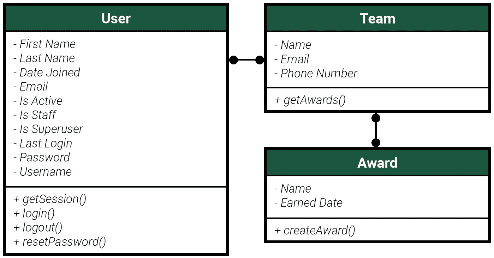
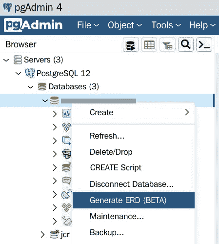
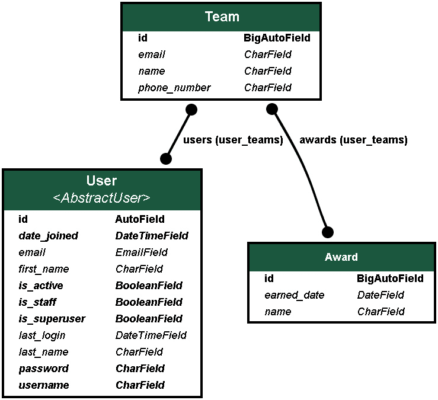
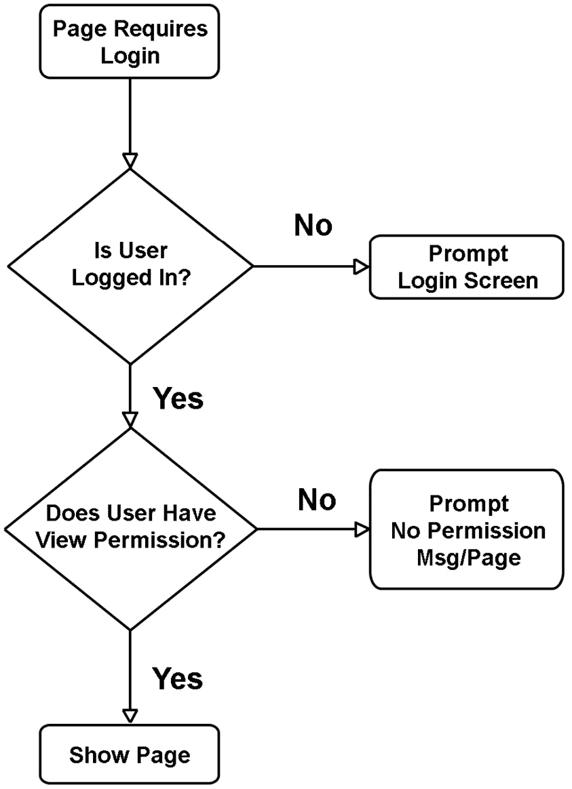
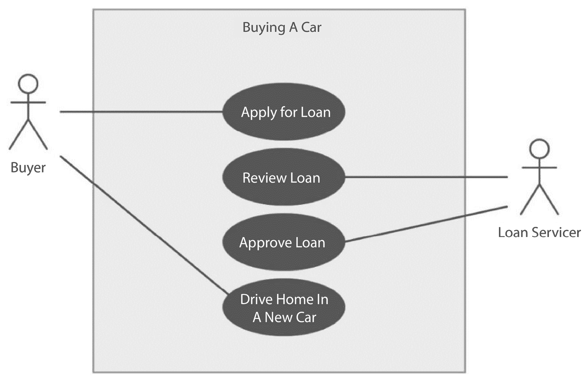
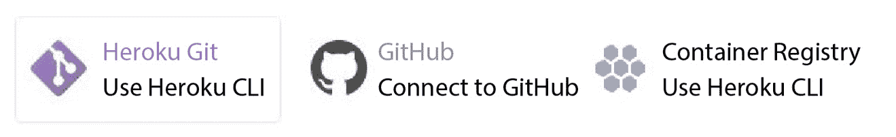
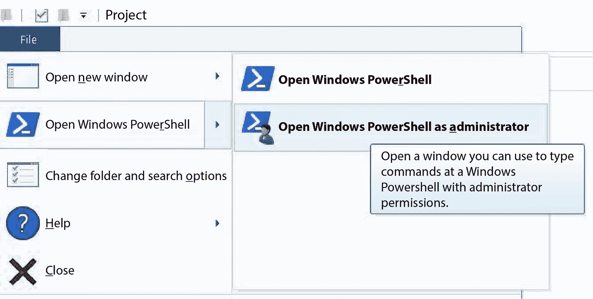
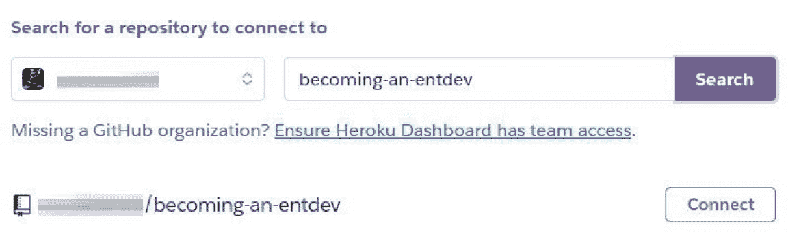
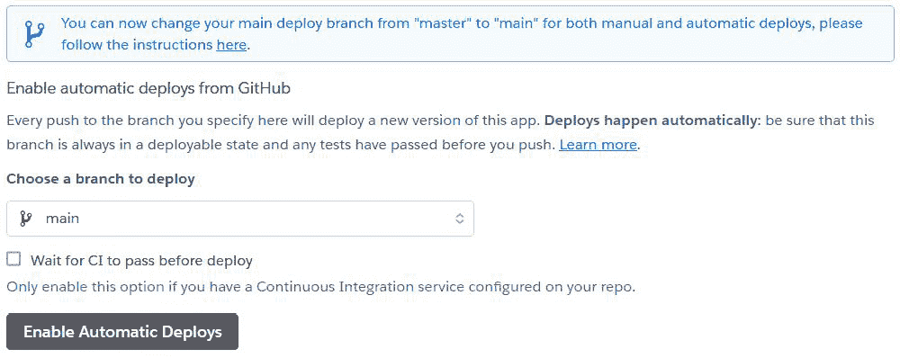
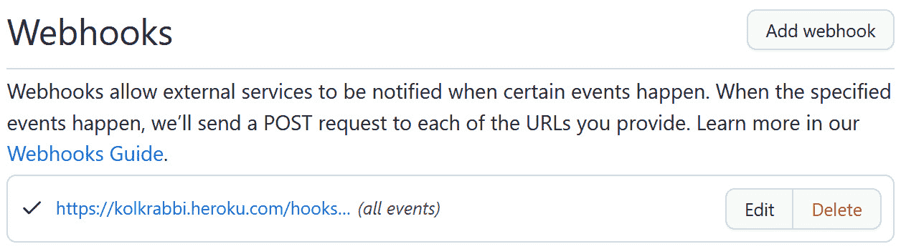

# 第一章：*第一章*：承担一个庞大的项目

考虑到如今应用程序和网站日益增加的复杂性，本章将向您介绍应对自己庞大项目所需的因素。我们将探讨企业级开发的概念，然后窥视我们可能采取的许多不同路径。我们将讨论帮助我们为项目制定计划的方法和工具，本质上是在构建我们开始所需的蓝图。每个项目也需要硬件来运行其软件，因此我们将探讨提供所需硬件的服务选项。在提供的选项中，我们将选择一个托管提供商，并在本书中展示如何与该提供商合作。

项目本身可以与任何托管提供商一起使用，甚至可以在自建的服务器上运行；然而，请注意，某些设置可能需要针对我们将要使用的托管服务器进行特定配置。在本章结束时，我们将为所选提供商创建一个托管账户，并选择最简单、免费的计划用于本书。我们还将创建和配置多个工作环境，以便代码可以在这些环境中运行。我们还将将该托管计划中的每个环境连接到一个远程仓库，以确保代码的安全存储。

在本章中，我们将涵盖以下主题：

+   建立企业

+   设计和规划

+   托管和部署

大多数人建议在处理 **Django** 时使用基于 UNIX 或 Linux 的操作系统，例如 Ubuntu 或 macOS。Django 被构建得非常灵活，本书中将要展示的概念和代码示例可以在所有三个主要平台（Windows、Mac 和 Linux）以及更多平台上运行。我个人自从开始学习和直接使用这个框架以来，一直在 Windows 系统上使用 Django。我这样做是因为我来自 Windows 背景；大约一半的工作提供了设备或要求在基于 Windows 的机器上使用某些软件。后来，越来越多的公司开始让开发者选择在他们最舒适的机器上工作。我继续选择 Windows，因为我已经熟悉它了。

# 技术要求

无论您使用的是 Windows、Mac 还是 Ubuntu 系统，**Python**都需要安装。Python 3.9.0 是本书编写时的最新版本。很可能此代码将仍然与 Python 的未来版本兼容，但无法保证所有代码都将继续工作，并且未来版本可能会有一些小问题。您可以在他们的网站上找到所有平台的 Python 安装文件：[`www.python.org/downloads/`](https://www.python.org/downloads/)。对于非 Windows 用户，使用**Homebrew**安装 Python 是最直接的方法，它会为您创建一个指向已安装包的符号链接。

对于 Windows 用户来说，通过 Microsoft Store 安装 Python 是一种简单的方法。在列表中搜索`Python`并选择**3.9**。在安装过程中，如果您看到**将 Python 添加到环境变量**选项，请选中复选框以包含它！这将在您的开发机器上设置一个指向 Python 包/库的全局库的路径。这些与包含在您的项目中的包不同，我们将在*第二章* *项目配置*中讨论。

需要一个命令行工具来执行与 Django 交互和使用的命令。**PowerShell**是 Windows 今天标准提供的常见命令行外壳。这个命令行实用程序集成了来自其他现有外壳的一些最酷的功能，全部合并为一个。它也适用于 Mac 和 Linux 操作系统。然而，**iTerm2**或内置的**终端应用**是大多数开发者倾向于使用的。无论如何，PowerShell 已经成为许多开发者今天用于自动化管理各种系统的流行工具。

在未来，您还需要安装`pip`，以便继续使用本书中讨论的其余代码和概念。然而，本书中讨论的并非每个第三方包都保证未来会得到该供应商的支持。无论如何，本书教授了如何使用第三方包以及如何在项目中配置和使用它们，这些知识可以帮助您找到适合自己的包。

小贴士

无论您在哪个操作系统上工作，如果在本书的任何命令中遇到错误消息，例如**pip/python 不是内部或外部命令**，这意味着您需要在系统上配置环境变量以指向相应的文件目录。要手动配置任何三大平台上的环境变量，请访问以下链接：

• Windows: [`phoenixnap.com/kb/windows-set-environment-variable`](https://phoenixnap.com/kb/windows-set-environment-variable)

• macOS: [`phoenixnap.com/kb/set-environment-variable-mac`](https://phoenixnap.com/kb/set-environment-variable-mac)

• Ubuntu: [`help.ubuntu.com/community/EnvironmentVariables`](https://help.ubuntu.com/community/EnvironmentVariables)

如果一个命令不被识别为内部或外部命令，你可能需要添加该项目安装在你机器上的路径。在 Windows 中，这通常是`Path`变量。例如，如果`python`不被识别为命令，请将 Python 安装在你机器上的路径添加到 Windows 的全局`Path`变量中。同样的情况也适用于 Linux 或 Mac，但最常见的问题是在 Windows 上。

本书创建和使用的所有代码都可以在这里找到：[`github.com/PacktPublishing/Becoming-an-Enterprise-Django-Developer`](https://github.com/PacktPublishing/Becoming-an-Enterprise-Django-Developer)。本章实际上并没有深入到任何代码中。然而，对于那些已经熟悉 Django 或者对于 Django 新手来说，已经阅读过*第二章*、“项目配置”，并返回本章，本书附带了一个名为`chapter_1`的应用程序，以展示本章标题为“实体关系图”的子节中引入的绘图包。

查看以下视频，看看*代码的实际应用*：[`bit.ly/3OfagBj`](https://bit.ly/3OfagBj)。

# 构建企业

构建**企业级应用软件**（**EAS**）不是一项容易的任务。这项任务需要许多不同的技术专家共同协作，进行高度的合作和预先规划才能完成。未能进行充分的规划可能导致项目花费的时间远超过预期，花费的金钱也更多。你的商业模式所依赖的重要功能可能会被忽略，当新系统启动时，这可能导致日常流程的中断。

企业级软件旨在满足整个企业的需求。EAS 将组织的所有业务逻辑整合到一个系统中，这个系统被视为由许多较小的子系统组成的集合。该软件消除了纸质文件的需求，减少了完成任务所需的步骤，并为当今世界各种问题提供自我自动化甚至人工智能解决方案。网站本身只是整个系统实际组成部分的一小部分。

## 选择企业级应用的理由

企业级软件通常被认为是针对已经建立系统并需要改进的组织的一种解决方案。无论该系统是数字化的还是手工的，例如在文件柜中的纸张，公司总是在寻找简化日常任务的方法。因此，企业级软件可以由一个或多个不同的消费级应用程序组成。如果你需要的不仅仅是网站，还需要一个同时承担你的业务管理任务的系统，你可能会需要升级到企业级。然而，Django 仍然可以用于最简单的网站以及超出你想象的大型项目。应用程序也可以分解为单个 Django 项目。

假设你有一个拥有许多部门和许多用户的组织，所有这些部门和用户都由不同的权限角色组成。你需要一种方式将他们全部连接起来，以便他们可以生成和共享报告，发送通知，存储和管理客户/用户数据，创建发票，并与其他系统协同工作。也许你发现你的组织需要连接在家远程工作的员工，以便他们在工作中更加高效和高效。想法是每种用户类型将以完全不同的方式与系统交互，甚至拥有不同的权限级别，使他们能够访问你系统的不同部分。

一般而言，当人们想到企业级时，他们也会想到一些独特且定制的产品。这类软件被称为**专有软件**或**闭源软件**，并且不打算以任何方式向公众重新分发。然而，并非所有 EAS 都必须是专有的；分发许可证可以设置为任何你希望的方式。例如，主系统可能为一家母公司品牌化，而系统的某些部分可能为其子公司品牌化，或者可以根据你的许可协议分发和重新品牌化副本。如果您的项目（s）极其复杂，与技术律师交谈以帮助编写您的软件许可协议也是一个好主意。在项目开始时邀请技术律师的帮助是预防诉讼的好方法。

接下来，我们将讨论一些主要的企业系统类型。

## 企业系统类型

企业级系统有很多不同的种类，但我们可以将它们归纳为以下六个主要类别：

+   **客户关系管理** (**CRM**)

+   **企业内容管理** (**ECM**)

+   **企业资产管理** (**EAM**)

+   **企业资源计划** (**ERP**)

+   **供应链管理** (**SCM**)

+   **企业信息系统** (**EIS**)

在这本书中，我们实际上不会完整地构建这些系统。相反，我们将涉及关键的 Django 编程概念，当它们结合在一起时，将帮助您走向终点。并非每个概念都能融入这本书，但 Django 完全能够处理这些系统类型所包含的所有功能。真正取决于您的团队去承担这本书中讨论的其余概念，并在构建系统时将它们作为工具箱中的另一个工具使用。让我们简要地讨论一下这六种主要的企业级系统类型及其主要用途。

### 客户关系管理

CRM 系统通常可以被视为潜在客户管理、市场营销沟通、销售和库存控制、零售管理以及更多。这些系统可以被视为除了实际销售产品和服务的所有事物。它们甚至可以进一步包括客户支持和数据分析。这些系统旨在与您的商业伙伴、客户、潜在客户以及方程中的任何其他人建立更好的关系。

### 企业内容管理

一个 ECM 系统最好被描述为为在处理创意和其他知识产权的领域中工作的人提供的一个系统。今天的报纸、杂志和其他新闻公司每天都会在互联网上提供大量内容。一个**内容管理系统**（**CMS**）提供了一种更不技术化和快速的方式来构建新页面并将内容上传到网络。企业级只是意味着您正在为您的组织添加越来越多的工具到工具箱中。

### 企业资产管理

在一个 EAM 系统中，各种产品和库存可以像 CMS 一样输入到系统中。这通常被称为电子商务或购物车网站。这是您使您的实体商品和资产在网上可用的地方。这些系统允许跟踪库存、项目管理以及文档控制，如合同和其他法律文件。这些系统甚至可能包括物理资产，如房地产、汽车和音乐唱片。

### 企业资源规划

企业资源规划（ERP）系统通常被认为是管理公司员工，即通常所说的 **人力资源**（**HR**）部门的一种方式。该系统可以处理入职和离职程序，并存储所有人员记录。它可以作为项目管理、风险评估和记录保存的工具。它甚至可以作为一个知识库，例如以 **常见问题解答**（**FAQs**）区域的形式。知识库通常用于引导人们找到常见的问题和答案，以减轻员工的工作负担。这些也可以用于培训目的，例如生成测验或提出趣味问题，并播放教程。

### 供应链管理

供应链管理（SCM）系统类似于客户关系管理（CRM）和企业资产管理（EAM）系统。这些系统管理供应链中其开发的各个方面。这些系统在国家级甚至全球范围内管理库存。它们与供应商沟通，连接到买家，跟踪包裹，预测未来的供应订单，甚至可以自动下订单。看待 CRM 和 SCM 系统之间差异的一种方式是，CRM 主要用于销售和营销，而 SCM 主要用于生产和分销。两者都涉及产品，但以不同的方式，大型公司或企业集团都需要两者。

### 企业信息系统

企业信息系统（EIS）是一种通常将客户关系管理（CRM）和供应链管理（SCM）系统结合起来以处理更广泛业务需求的系统。EIS 甚至可能集成 ERP 系统的一部分或全部，并作为一个巨大的中枢神经系统。根据需求，这可能会包括多个数据库甚至多个开发项目，共同工作，构成了整个系统的“大脑”。这些系统以其存储和处理大量数据以及将许多不同的系统连接在一起形成一个整体而闻名。

现在，我们将探讨为什么人们在构建这些企业级系统时倾向于使用 Python 和 Django。我们将看到为什么它适合各种项目，以及它最著名的特性是什么。

## 为什么选择 Python/Django？

Python 语言是在 1991 年由吉多·范罗苏姆（Guido van Rossum）创建的。他在阅读了 *《蒙提·派森飞行马戏团》* 的剧本后想出了 Python 这个名字。这种语言主要是为了代码的可读性和可靠性而创建的。Python 作为首选的后端框架已经越来越受欢迎好几年了。Python 在今天的一些非常流行的网站上扮演着重要角色，例如 Google、NASA、Netflix、Spotify、Uber 和 Dropbox，仅举几例。Python 语言因其易用性、学习速度快以及代码的整体适应性，受到了许多开发者的青睐。

Django 于 2003 年底在堪萨斯州劳伦斯市的《劳伦斯日报-世界报》出版商的推动下诞生。与 Python 类似，它有一个目标：以简单易读的方式创建复杂的数据库驱动网站。除了可读性，它还考虑了快速开发和**不要重复自己**（**DRY**）的代码结构。可读性是选择 Python 作为 Django 框架基础的原因。由于 Django 在构建和管理数据库方面的作用，它最好被称为后端框架。Django 内置了许多关于网站架构的概念，这使得它对大多数 Web 开发者都有吸引力。

今天，许多人使用 Django 作为他们的后端；但这个框架也可以作为您的前端。如果您曾经使用过 Shopify 的 Liquid 模板语言，也称为 Liquid 语法，或者甚至 ASP.NET 的 Razor 语法，以及它是如何与 C# .NET 或 Visual Basic .NET 结合使用的，您会注意到与**Django 模板语言**的相似之处，这是 Django 使用 Python 构建 HTML 文件的方法。Django 在页面渲染时使用上下文来提供用户生成的内容或数据库驱动的数据到页面上。模板语言语法相对容易阅读且易于学习。一些使用 Django 的网站示例包括 Bitbucket、Instagram、国家地理、Spotify、《华盛顿邮报》和 YouTube。

Django 的特性包括以下内容：

+   缓存框架

+   数据序列化

+   可扩展性

+   表单处理和验证

+   可伸缩性

+   安全性

+   模板语言

+   测试框架

在这些特性中，可扩展性意味着 Django 被构建成允许轻松集成其他第三方服务。您的开发者可以花更多的时间专注于项目的具体需求，而不是试图弄清楚如何将项目连接到第三方服务提供商的系统。Django 使得连接到今天几乎任何存在的东西变得容易。如果一个功能还没有内置，通常有一个 pip 包可以提供。

Django 不需要仅用于构建网站。它可以用来构建一个作为任何事物中心枢纽的 API，与 **表示状态转移**（**REST**）框架进行通信，这是一个在互联网上计算机系统间标准化通信的常见架构。从这里，你可以使用各种常见的现有工具来构建适用于 iPhone 的 iOS 应用或 Android 应用。根据你特定的业务需求，决定利用智能手机可以以多种方式带来好处。如今，大约有 85% 的美国人拥有智能手机（[`www.pewresearch.org/internet/fact-sheet/mobile/`](https://www.pewresearch.org/internet/fact-sheet/mobile/)），一些公司可能希望构建一个用户可以在他们的个人手机上安装的应用程序，而不是公司需要购买额外的硬件来分发给所有员工。API 还可以用于许多其他事情，从微服务到大规模的外部网络系统和数据库。

个人而言，当涉及到同时使用 Django 模板语言和基于 JavaScript 的框架，如 React 或 Angular 时，我建议不要这样做，因为这可能会变得过于复杂而难以处理。如果你使用 React、Angular、Vue.js 或 Handlebars.js 等作为你的前端，那么 Django 就只是作为你的后端，通过你的 API 提供上下文。你仍然可以将你的前端和后端文件放在同一个 Django 项目文件夹中。

我有一些推荐可以帮助你选择。如果你想构建 Android 或 iOS 应用或带有 jQuery 的 `.html` 文件，我将在 *第四章* “URLs、视图和模板”中讨论如何做。许多人更喜欢使用纯 JavaScript，这样他们就可以编写简单的任务而无需加载整个 jQuery 库。当涉及到在事物的前端添加装饰时，在我所参与的所有项目中，我发现我几乎可以用 Django 模板语言和 jQuery 完成我需要做的所有事情。我可能在这方面有所偏见，但使用它确实非常简单。然而，使用 **ECMAScript** 的好处很多，实际上它是一套用于构建和编译 JavaScript 的国际标准，如 ES8、ES9 或 ES10。在项目中更多地关注使用 ECMAScript 是我应该关注的。

小贴士

当使用 Django 和 Python 进行工作时，请要求您的开发人员采用 **Python 增强提案 8** (**PEP-8**) 风格指南来编写 Python 代码。这是一份官方采用的格式化指南，用于保持开发者之间代码的一致性。这可以是严格的或宽松的。我个人喜欢选择一个更宽松的版本，这样可以使事物更加细化且易于阅读。如果您正在构建专有产品，用于内部使用，则不一定需要完全遵循此指南，您可能更喜欢选择一个团队会喜欢的风格。如果您正在构建一个将公开与任何人共享的包，我建议您严格遵循 PEP-8 格式。实际上，这可能是在 **Python 包索引** (**PyPI**) 库中提交包的要求之一。您可以在以下链接中了解更多关于官方风格指南的信息：[`www.python.org/dev/peps/pep-0008/`](https://www.python.org/dev/peps/pep-0008/)。

PyPI 是第三方 Python 包库的官方仓库，无论是公开的还是私有的。当寻找可以尝试的新包时，它是一个极好的资源，并且还提供了如何与代码一起工作的信息：[`pypi.org/`](https://pypi.org/)。

一个名为 Black 的包可以用作代码检查器，帮助开发者确保他们遵循 PEP-8 风格格式。您可以在以下链接中了解更多关于 Black 的信息：[`pypi.org/project/black/`](https://pypi.org/project/black/)。

接下来，让我们探讨不同类型的 **应用程序编程接口** (**API**) 是什么，以及为什么在规划项目时我们可能需要了解这些信息。

## API 类型

API 是两个系统通过所谓的端点或 URL 进行相互通信的一种方式。

我们可以将 API 分为三个主要类别：


图 1.1 – API 类型

在接下来的章节中，我们将讨论每种 API 类型是什么，以及它们用于什么。根据项目的需求，我们可能需要选择其中一种作为我们想要构建的系统类型。

### 开放 API

来自和前往您系统的 `GET`、`POST`、`PUT`、`PATCH` 和 `DELETE` 请求。

### 合作 API

**合作伙伴 API**通常在商业对商业关系中找到。公众无法获得访问权限，只有需要使用你的 API 与你进行业务往来的战略合作伙伴才会被授予许可。可以根据与每一方的协议定义限制。在当今世界，当发生企业合并并且你的团队被要求使两个外部系统相互通信时，这些相当常见。有时，你可能需要出于各种原因（例如，你的商业模式基于授予公司访问你的 API 以便在平台上销售商品）在两个现有系统之间建立一个中央数据库。一个常见的例子是亚马逊的**销售合作伙伴 API**（**SP-API**），它用于在亚马逊市场上销售商品。

### 私有 API

**私有 API**是最安全的；这些 API 被锁定，因为它们仅打算由该公司或组织内部使用。大型金融机构或企业零售实体可能使用这些 API 来管理其内部功能的任何方面。除非有特定的需求，否则公众和其他外部来源可能无法获得访问权限。常见的例子是政府机构使用 API 连接到保存法律记录和文件的系统。另一个例子可能是大学授予教育部门访问学生和课程记录的权限。

到现在为止，我们已经了解了企业级软件是什么，包括目前存在哪些类型的企业级系统以及我们如何对它们进行分类。我们还讨论了 Python 和 Django 在企业级软件中的作用。现在我们已经学习了这些各种概念，让我们开始设计和规划我们自己的项目。

# 设计和规划

任何项目，无论大小，都需要一个清晰的计划来明确其目标和构建方式。项目越大，在开发准备阶段投入的工作就越多。企业级开发在真正开始之前也需要大量的前期工作，这并不奇怪。无论你是为公司工作还是作为公司向客户提供解决方案，都应该有一个明确的行动计划。这取决于诸如成本、开发者短缺和截止日期等因素，有很大的灵活性。尽可能做好准备，并尽量遵守设定的时间表，以确保你能够按计划完成。记住，规划不足可能会在以后给你带来麻烦。

开发者应该尽可能多地获得信息，以帮助他们理解他们正在构建的内容。如果你的开发者没有提供足够的文档、蓝图和其他材料，那么他们就会自己做出假设，这些假设后来在开发和**质量保证**（**QA**）阶段的测试中作为应用程序中的错误被发现。当这种情况发生时，你可能会发现某个特定功能需要重新构建，这需要重大的基础性变更，这将花费大量时间进行重构。如果我们暂时不考虑编程以外的其他事情，比如建造房屋，我们都知道在团队可以建造房屋框架之前，需要先建造地基。相应地，这个地基需要完成，然后团队才能建造屋顶，安装电线，安装管道等等。没有框架，你不能开始建造屋顶，没有可以放置框架的地基，你不能建造框架。

让我们讨论如何收集你们项目的需求。

## 需求收集

收集需求对于帮助记录构建过程以及允许双方，即软件开发者和软件所有者，在开发过程中随时参考它来说非常重要。这种能力对于确保事情按计划进行直到完成，并且按时完成也是必不可少的。应该有一个初步的头脑风暴阶段，以了解项目的范围。一个很好的技巧是让所有利益相关者聚集在一起，辩论系统的需求，同时记录辩论中提出的任何关键点，并将它们纳入你的需求发现中。你应该始终从提问开始，并且你应该为不同的人群提出不同的问题。在与利益相关者交谈之后，继续与总监、项目经理、开发人员和员工，即最终用户交谈。尽可能多地采访不同类型的用户。对于极其庞大的实体，你可以创建一份问卷，将问卷分发给许多用户，然后根据结果得出结论。

如果目前有一个遗留系统正在运行，即使它是一种手动与数字流程相结合的过程，你也应该尝试了解它是如何工作的，并确定该流程中的任何痛点。我最喜欢的策略是**用户观察**，即我观察用户完成日常任务的流程，然后尝试识别可能使他们减速的事情。接下来，我会尝试**角色扮演**，这是一种你跳入并像用户一样执行任务的策略。你也可以让两种不同类型的用户交换位置，询问他们完成对方任务容易或困难的地方，或者他们认为可以改进工作流程的地方。肯定存在某种类型的瓶颈，否则就没有必要构建更好的东西。这些都是拖慢你日常任务的事情，最终导致公司在时间和资源上花费大量金钱。你需要保持警觉，并识别出你的客户自己无法识别的痛点，或者他们将与你的沟通困难。你的客户不一定知道问题的最佳解决方案，他们甚至可能不知道某个特定问题是一个问题，直到你揭示了一种改善该流程的方法。

### 研究和发现

查找这将是一个内部、合作伙伴还是公开项目。如果是合作伙伴项目，你可能会有基于合作伙伴特定需求的某些限制。这时，我们就进入了**业务需求**和**功能需求**之间的差异。功能需求包括确定要居住在哪个托管计划和服务器的服务器，后端框架，前端框架和一组页面。另一方面，业务需求涵盖了整个企业的愿景、目标和目标。它们是特定于组织或他们与之合作的合作伙伴的需求。一组网页或 API 端点的结构可能是由该公司的商业模式定义的，而不是其他可能被选择的某些逻辑原因。你的利益相关者是否有任何目标、建议或请求需要你考虑？以下是一些可以帮助你制定问题集的常见问题。你不应该仅限于这些问题本身；用于头脑风暴：

+   你是否有特定的业务需求？

+   你为什么需要一个新系统？

+   你的当前系统阻止了你做什么；是否存在任何瓶颈？

+   你想添加哪些新功能；你需要任何改进吗？

+   你想保留哪些旧功能，或者要移除哪些？

+   你将在系统中与谁互动；有哪些类型的用户和角色？

+   你需要报告、电子邮件消息或其他类型的通知系统吗？

+   系统将以任何方式与任何第三方或合作伙伴系统连接吗？

+   我们预测的服务器上的流量或负载是什么样的？

+   这个新系统何时需要投入运行？

+   您为完成此项目分配了多少预算？

+   是否需要将数据从旧系统迁移到新系统？

+   开发团队成员之间的发展如何分配？

+   开发团队有哪些技能；团队的优势和劣势是什么？

+   用户界面（**UI**）的流程应该如何工作；应该是多页还是单页？

### 决策

从之前列出的常见问题中，您可以制定数十个甚至数百个其他问题来满足您独特的需求集。然后，这些问题可以分组到几个开发类别中，每个类别都有独特的一套要求和指南。您将非常重视可用性、数据迁移、性能、安全性、可扩展性和可靠性。提前了解这些信息是很好的，这样您就可以选择最佳的方向，让您的开发继续前进。

这些决策可能包括您将选择哪个前端框架，您将向谁寻求托管服务，您是构建自己的服务器还是在云数据中心租用空间，以及您的服务器将如何配置。有无数的可能性需要考虑。当涉及到 UI 时，有许多关于表单字段布局、表单字段验证（服务器端、客户端或两者都进行）、占位符、标签位置以及从开始到结束的流程的问题需要询问。这里的流程指的是用户在继续之前是否应该完成部分或全部表单，以及这些部分是否应该包含在单独的表单中。

请记住，当涉及到表单字段验证时，Django 只会在服务器端验证您的数据。您的项目不需要同时进行服务器端和客户端的表单字段验证。然而，一个健康的网站将实施两者。因此，当发生回发错误时，会出现异常，例如，如果您的表单在页面首次加载时不可见，例如，当用户需要向下滚动很远或执行几个操作才能使表单对用户可见时，您的表单可能不会显示或出现字段错误。客户端表单字段验证通过在将数据发送到服务器之前检查数据是否有效来解决此问题，这被称为**数据完整性**。这种验证还可以减少服务器处理的工作量，并提供了事件处理，让您可以编写函数来帮助您在页面上格式化 HTML 和 CSS。在决策方面，您可以选择是否在客户端或服务器端进行字段验证，或者两者都进行。如果将在客户端进行验证，那么您可以选择使用哪些工具，这些工具通常基于 JavaScript。

例如，考虑输入属性，如`required`、`minlength`和`maxlength`，这些可以在你的 HTML 中存在。这些通常是由 Django 在渲染具有特定字段参数的表单字段时生成的，如下面的示例所示。我们将在*第五章*中详细讨论渲染表单，*Django 表单*：

```py
# Demo Code
```

```py
<input type="text" name="field" id="field-id" class="form-input" maxlength="150" minlength="5" required="">
```

大多数浏览器会默认限制用户提交表单，如果这些属性存在且数据不满足它们的要求。所有浏览器也会以不同的方式处理和样式化这些错误状态，比如 Mac 与 Windows 或 Chrome 与 Safari 之间的差异。这是因为它们是由不同的实体开发的，它们在市场上相互竞争，因此有不同的品牌。这种差异阻碍了 Django 显示你代码中为该字段定义的错误消息的 postback 功能。如果由于某种原因，用户能够提交包含无效数据的表单，那么如果，正如我之前提到的，表单在页面加载时被隐藏，那么 postback 可能不会显示表单。这就是为什么你的项目可能需要客户端和服务器端表单验证的原因。

在你的服务器端代码（你定义表单字段的地方）和客户端实现之间处理错误状态消息可能也很棘手，这意味着你必须在源代码中的两个不同位置存储相同的错误消息：一个用于服务器端验证，一个用于客户端验证。随着时间的推移和许多不同的开发者，这会变得非常混乱，尤其是在有人记得更改其中一个但忘记更改另一个时，这些消息被编辑、添加或删除。如果你有严格的必要性确保它们措辞完全相同，可能需要创建一个数据字典，你的源文件可以访问它，这样你就可以把所有的错误消息放在一个地方。如何做到这一点需要一些思考。这个文件也需要通过 Python 和 JavaScript 都可以访问。

## 可视化和解释

当涉及到 UI 的实际设计时，涉及的因素有很多。大型企业可能有一些特定的品牌指南，它们出于营销和其他法律原因强制执行，这可能限制了你的前端整体设计。有时，这些公司可能有一个内部创意和营销部门，或者他们可能外包给第三方创意公司，以制作一系列 Illustrator 或 Photoshop 文档，以帮助你的前端开发者完成工作。对于较小的项目，你可以自由地设计一些东西，但这通常需要时间，开发者们在被要求设计某物而不是构建某物时，经常会遇到一种写作障碍。

关于前端开发者的一大误解是，人们普遍认为他们都是设计师，这并不总是事实。就像建筑工人阅读蓝图来建造房屋一样，其他人通常为他们绘制蓝图。因此，您可以使用来自在线供应商（如 Envato Market，原名 ThemeForest ([`themeforest.net/`](https://themeforest.net/))）或 Nicepage ([`nicepage.com/html-templates`](https://nicepage.com/html-templates)）等处的开源模板和脚手架，这些模板可以是 HTML、CSS/SCSS，甚至是 JavaScript。在我自己的 Django 项目中，我之前也求助于这些来源的设计模板。这些模板和模板提供商各不相同。有些是免费的，而有些则需要付费使用，并且使用许可证各不相同。在决定这些来源中的任何一个是否适合您之前，您需要进行独立研究。这些设计模板可能还需要一些挖掘，以确保它们与您的项目很好地配合，但它们仍然可以节省大量时间，并提供一个看起来很时尚的网站，这可能比那些缺乏从无到有设计创意的人为您创造的更好。

许多这些 HTML、CSS 和 JavaScript 模板可能会使用**Node 包管理器**（**NPM**）来将源文件构建成生产就绪文件。类似于 PyPI，NPM 用于存储和分发开发中使用的 JavaScript 库。它们依赖于 Node.js 来运行。甚至还有可以在您的 Django 项目中使用的 pip 包，以帮助您使用 NPM 包构建源文件。我将在*第二章*，*项目配置*中进一步讨论管理 pip 包和依赖关系。有许多 Python 包可以帮助您转换 SCSS、自动添加前缀、打包和压缩文件。我尝试过很多不同的 Python 包，最终只发现少数几个在最后阶段会使用 NPM 来完成繁重的工作。这意味着，作为您项目的要求，您的开发人员可能需要在他们的机器上甚至服务器上安装 NPM，具体取决于您如何使用 Node.js。对于本书中的示例，我将尽可能使用 Python 包，您可以根据自己的需要将这些包集成到您的项目中。我会尽量避免涉及 NPM 包的代码示例，但我鼓励您在开发环境中使用这些包。

小贴士

Node.js 和 NPM 的最新和最稳定版本可以在这里找到：[`nodejs.org/en/download/`](https://nodejs.org/en/download/). 对于 Windows 用户，有一个易于使用的安装文件，可以为您安装 Node.js 和 NPM。

你可以在这里找到 Gulp 安装指南：[`gulpjs.com/docs/en/getting-started/quick-start/`](https://gulpjs.com/docs/en/getting-started/quick-start/)。Gulp 要求首先安装 Gulp **命令行工具**（**CLI**），然后安装 Gulp 本身。Gulp 被认为是一个任务运行器，有助于自动化大多数开发任务，如 SCSS 转译、CSS 代码检查、供应商前缀、压缩和打包；ECMAScript 编译；以及其他代码检查。

设计并不意味着项目应该如何看起来；过程也应该关注它将如何工作，或者更确切地说，是引擎的螺丝和螺母。在设计项目时，尽可能多地使用图表来可视化每个过程。可视化可以分为两大类：**行为图表**和**结构图表**。一旦你创建了一套图表，就可以用来与利益相关者协作，确保你拥有所需的一切。你的开发者也会将这些作为他们将要构建的蓝图。

在**统一建模语言**（**UML**）中有很多不同的图表类型，如以下所示：

+   活动图表

+   类图表

+   通信图表

+   组件图表

+   组合图表

+   部署图表

+   实体关系图表

+   流程图

+   交互图表

+   对象图表

+   包图表

+   配置图表

+   序列图表

+   状态图表

+   时间图表

+   用例图表

深入讨论这些图表可能会相当冗长。在以下小节中，我们将仅讨论目前最常用的六种图表以及它们如何帮助你构建任何规模和类型的项目。

### 类图表

类图表用于说明系统中的不同类或组件以及它们之间的关系。类最著名的是在系统中具有共享或相似角色的对象集合。类似于**实体关系图**（**ERD**），类图表描绘了在数据库中将是表的对象，可能发生的交互，以及系统中的任何其他主要元素。此图表通常以这样的方式构建，即顶部部分是类名，中间部分包含所有属性，也称为字段，底部部分显示可能发生的任何函数或操作。

下图显示了用户、团队和奖项之间的关系。类图表显示了团队可以拥有用户集合，一个团队也可能拥有授予他们的奖项集合。在这个例子中，奖项是授予团队的，而不是授予个人用户。`Team`模型对象可以有一个名为`getAwards()`的函数，它将获取团队所赢得所有奖项的集合：



图 1.2 – 类图表

### 部署图表

部署图用于高级规划。这是开发者之间如何协作以及代码将在不同环境之间更新的方式。网络工程师将使用该图来绘制其配置中将使用的物理节点。开发者将使用它来更好地理解代码如何在不同的环境之间更新，以及当需要更新时，他们可能需要将代码推送到或从何处拉取。部署图的主要组件包括工件、设备和节点：

+   工件是一种数字资产，如文件或某种可执行脚本的类型。

+   设备是一个代表计算资源（如应用服务器或域名服务器）的节点。

+   节点是一个执行组件、子系统或过程的物理实体。节点可以包括物理硬件组件或基于虚拟云的组件。

### 实体关系图

ERD 可视化系统内对象之间的关系。它最适合映射数据库中不同表之间的链接，有时在数据库中建模关系后被称为实体关系模型。这些由您的后端用于帮助创建数据库的结构以及应包含哪些字段。另一方面，这些可以通过访问现有数据库来创建，以帮助映射系统的当前结构，并帮助您看到如何最好地重建它。这就像访问现有建筑的蓝图。自动生成这些可以意味着它们非常准确，甚至可以告诉您在那些初始蓝图首次起草之后对那座建筑进行的翻新。

自动生成实体关系图（ERD）有许多方法。当您阅读并跟随本章内容时，我将与您分享我最喜欢的两种方法，假设您已经有一个 Django 项目正在运行。如果没有，我将在下一章解释如何从头开始创建 Django 项目，以及如何安装 pgAdmin 工具，*第二章*，*项目配置*。第一种方法是使用 pgAdmin，这是 Django 开发者今天用于与 PostgreSQL 数据库一起工作的流行数据库工具。如果您使用的是 pgAdmin 的最新版本，这将非常简单；旧版本没有这个功能。截至本书编写时，pgAdmin 的当前版本是 v5.6。只需右键单击您想要生成图例的数据库，然后点击**生成 ERD**。



图 1.3 – 使用 pgAdmin 生成 ERD

第二种方法是使用一个流行的命令行工具，名为 `django-extensions`。这是一个例子，我为已经熟悉 Django 的人提供了一个名为 `chapter_1` 的 Django 应用程序，并附上了本书提供的代码。你可以在现有的项目中运行这些示例。对于 Django 新手，建议跳到本章的下一小节，标题为 *流程图*，然后在完成 *第二章* 中提供的示例后，再回来练习使用这个包来首次配置你的项目。

要在现有的 Django 项目上安装 `django-extensions` 包，请按照以下步骤操作：

1.  运行以下命令：

    ```py
    PS C:\Your_Project_Folder> pip install django-extensions
    ```

1.  在你的 `settings.py` 文件中，将此应用程序添加到你的 `INSTALLED_APPS` 变量中：

    ```py
    # /becoming_a_django_entdev/settings.py
    INSTALLED_APPS = (
        ...
        'django_extensions',
        ...
    )
    ```

1.  你还需要安装一个图表生成器，它会为你绘制图表。这是通过 `pydotplus` pip 包完成的：

    ```py
    PS C:\Your_Project_Folder> pip install pydotplus
    ```

1.  现在，你可以运行以下命令来生成所有表格：

    ```py
    PS C:\Your_Project_Folder> python manage.py graph_models -a -o diagrams/chapter_1/all_models.png 
    ```

可以针对特定的模型，或者可以针对一组模型，通过逗号分隔，没有空格。在以下示例中，我们针对的是 `User`、`Team` 和 `Award` 模型：

```py
PS C:\Your_Project_Folder> python manage.py graph_models -a -I User,Team,Award -o diagrams/chapter_1/team_models.png
```

以下图表是通过运行最后一个命令自动生成的，生成了 `User`、`Team` 和 `Award` 模型及其相互关系：



图 1.4 – 来自图模型的 ERD

要详细了解如何使用 Graph Models 插件，请访问 [`django-extensions.readthedocs.io/en/latest/graph_models.html`](https://django-extensions.readthedocs.io/en/latest/graph_models.html)。

注意

对于 Windows 用户，你还需要在你的计算机上安装 GraphViz 应用程序，以便 `graph_models` 命令能够工作。在安装过程中，请选择 **将 Graphviz 添加到系统 PATH** 以供所有或当前用户使用：[`graphviz.org/download/`](https://graphviz.org/download/)。

还有适用于 Linux、Mac 和 Solaris 操作系统的安装程序。在这些操作系统上生成这些图表可能也需要 GraphViz。如果你在 Linux、Mac 或 Solaris 上运行前面的命令时遇到错误，请尝试在你的系统上安装 GraphViz。

接下来，让我们讨论流程图及其用途。

### 流程图

流程图表示系统内部的数据流。它们提供了一种逐步解决问题的方法。这些图表被开发者用来理解在编写代码时适用哪些规则。规则可以包括在进入下一步之前的数据验证场景等逻辑。流程图可以是简单的，也可以相当复杂，通常还会提供用户可以在途中做出的决策。这种图表类型描述了用户在特定流程或一系列流程中的可能交互。

如果您有一个单页表单，该表单被分成多个部分，用户必须完成这些部分才能导航到新页面，那么流程图可以是前端开发者或甚至设计师理解用户如何在表单中从一步到另一步，以及如何在网站的更大流程中从一个页面到另一个页面的有用工具。根据需要，这些图可以分解成更小、更细粒度或更明确的流程。

以下图是一个小示例，展示了用户登录系统的流程。页面是否需要用户登录？如果是，必须做出决定：用户是否已登录？如果没有，提示登录界面；如果是，则必须做出新的决定：用户是否有权限查看页面？



图 1.5 – 流程图

### 状态图

状态图显示了系统内对象的行为。该图显示了某个特定时间点可能的状态或条件，例如，用户是登录还是注销；订单是已接收、正在处理还是待发货，或者订单是已履行或已退货。这些图非常适合展示特定行为的变化与可做出的决策。它们甚至可能描绘出某些触发器，这些触发器会在操作通过生命周期向完成移动时导致状态变化。

### 用例图

用例图表示用户和系统的行为。这些图与流程图相似，但通常更关注整体情况。这些图被创意部门、利益相关者、项目经理和导演等团队使用，以帮助理解特定流程或用例将执行的概念。



图 1.6 – 用例图

到目前为止，我们已经介绍了今天人们规划和管理网络应用的一些常见方法。使用这些概念尽可能好地规划您的项目。在下一节中，我们将讨论托管您的应用程序以及不同的部署方法。

# 域名托管和部署

所有网站和应用程序都需要一个物理位置来存放所有文件；这也被称为域名托管。域名托管是一种服务，它为文件提供物理硬件，并处理信息。托管计划提供由操作系统（如 Linux）组成的解决方案，并包括网络系统的实际硬件。服务器将为您安装某种类型的网络服务器，例如 NGINX 或 Apache 网络服务器。

网络服务器，也称为 **超文本传输协议** (**HTTP**) 服务器，是一种软件，可以发送和接收 HTTP 请求，这些请求基本上是通过互联网发送的消息。网络服务器可以被视为在操作系统上使用 HTTP 运行的软件，HTTP 是一种用于在互联网上分发您的网站或应用程序的标准网络协议。随着今天所有浏览器使用的 HTTP，用户可以通过在浏览器的地址栏中导航到您的域名来访问您的网站。网络服务器可以帮助您进行负载均衡和缓存，并作为您的反向代理服务器，使您的文件通过互联网对全世界可用。托管服务通常会为您提供选项，在您的网站经历用户流量和数据访问增加时进行扩展，此时您需要更多的处理能力或存储空间。

大型项目往往会倾向于使用像 **Amazon Web Services** (**AWS**) 或 Microsoft Azure 以及甚至 Heroku 这样的服务。这些是云基础托管服务，意味着您的网站文件将存储在物理硬件上，这些硬件可能与其他客户共享。然而，从这些提供商中的任何一个都可以以一定的价格获得拥有专用且更安全的服务器空间的选择。托管计划还提供了高级选项，使您能够安装和配置自己的操作系统和/或自己的网络服务器。当与 Django 项目一起工作时，NGINX 是首选选择，因为网络服务器以其比 Apache 安装表现更好的声誉，并且每秒可以处理更多的 HTTP 请求。当考虑到性能时，许多 Django 项目使用 NGINX 作为其网络服务器并不令人惊讶。如果您确实需要配置自己的网络服务器，可以从官方 NGINX 安装手册开始，该手册可在以下位置找到：[`www.nginx.com/resources/wiki/start/topics/tutorials/install/`](https://www.nginx.com/resources/wiki/start/topics/tutorials/install/)。Apache 网络服务器也可以与 Django 一起使用，并且是可取的，因为它比 NGINX 安装更容易安装。如果您需要走 Apache 的路线，请从阅读官方 Django 文档开始，该文档介绍了如何与 Apache 网络服务器一起工作，可在以下位置找到：[`docs.djangoproject.com/en/4.0/howto/deployment/wsgi/modwsgi/`](https://docs.djangoproject.com/en/4.0/howto/deployment/wsgi/modwsgi/)。

## 创建和配置 Heroku 计划

由于本书提供的示例，我将使用 Heroku 提供的免费计划，因为该服务的易用性、零成本功能和日益增长的受欢迎程度。Heroku 被称为**平台即服务**（**PaaS**），这意味着它使开发者能够在云中完全构建、运行和部署网站和应用。使用此选项，您可以在几分钟内启动并运行，这可以减少雇佣网络工程师团队为您运行系统的成本。为了跟随这个练习，请访问 Heroku 网站，并在[`www.heroku.com/`](https://www.heroku.com/)上注册一个免费账户。然后，一旦您验证了您的电子邮件地址并登录到您的账户，导航到您的仪表板[`dashboard.heroku.com/apps`](https://dashboard.heroku.com/apps)，然后点击**新建** | **创建新应用**，然后填写页面，如图所示：

![Figure 1.7 – 创建新的 Heroku 应用

![img/Figure_1.07_B17243.jpg]

图 1.7 – 创建新的 Heroku 应用

为此应用输入一个名称。名称仅用于内部使用，不需要非常精确。请注意，由于应用名称必须在所有 Heroku 应用中是唯一的，因此您需要选择与演示中提供的名称`becoming-an-entdev`不同的名称。另外，目前不必担心流水线。如果我们需要或想要的话，我们可以在本章的*高级部署*子节中稍后讨论。如果您不在美国，可能需要将您的区域更改为更靠近您的区域。

由于我们正在构建一个 Django 项目，我们需要选择 Python 构建包。**构建包**是 Heroku 使用脚本来自动在 Heroku 上构建和编译各种类型应用的方式。从您刚刚创建的 Heroku 应用的仪表板向下滚动到**构建包**部分，并选择**添加构建包**。以下截图展示了接下来应该出现的弹出窗口：

![Figure 1.8 – Heroku 构建包选择

![img/Figure_1.08_B17243.jpg]

图 1.8 – Heroku 构建包选择

您可以添加任何与项目需求相关的构建包，但对于与本书相关的内容，**python**是唯一需要的构建包。如果您选择其他构建包，可能需要额外的配置步骤，这些步骤在本书中未提供，因此请谨慎使用。

接下来，我们将讨论环境，在这个上下文中，环境指的是测试和开发阶段，我们将展示代码在不同开发阶段的运行情况。环境也可以用于其他上下文，例如网络服务器或操作系统。在编程的世界里，“环境”可能有多种含义，通常指的是你正在使用、在或其中的某种配置、设置或结构。

## 配置 Heroku 环境

在其最基本的形式中，一个 Heroku 应用程序将至少包含两个环境，第一个是生产环境，您的网站或应用程序将在这里被公众和用户访问，第二个是您的本地机器，这是您和您的开发团队进行所有编码以及本地运行网站的地方。当创建应用程序时，Heroku 将默认使用 **Heroku Git**，它使用 Heroku CLI 将您本地机器上的更改提交到生产环境。在您的 Heroku 账户仪表板 [`dashboard.heroku.com/apps`](https://dashboard.heroku.com/apps) 上，点击 **部署** 选项卡，您将看到以下截图所示的选项：



图 1.9 – Heroku 部署方法

### 使用 Heroku CLI

您需要在 Mac、Windows 或 Linux 上安装 Heroku CLI，通过在此处下载适当的安装程序来完成：[`devcenter.heroku.com/articles/heroku-cli#download-and-install`](https://devcenter.heroku.com/articles/heroku-cli#download-and-install)。

对于 Windows 用户，当您在安装过程中被提示时，请记住选择标记为 **将 PATH 设置为 heroku** 的复选框。

接下来，导航到您想在本地机器上存放项目的文件夹，然后在那个目录内打开一个新的终端或命令行窗口。您需要使用以下命令登录 Heroku：

```py
PS C:\Projects\Packt\Repo> heroku login
```

请记住，每次您打开一个新的终端或命令行窗口并执行任务时，都需要登录。它将提示您打开一个新的浏览器标签页进行登录。一旦完成，您应该会看到如下消息：

```py
heroku: Press any key to open up the browser to login or q to exit:
Opening browser to https://cli-auth.heroku.com/auth/cli/browser/03be4a46-28f4-479a-bc10-8bd1bdcdd12b?requestor={{ ... }}
Logging in... done
Logged in as {{ youremail@yourdomain.com }}
PS C:\Projects\Packt\Repo> 
```

如果您看到前面的消息，那么您已成功登录您的账户，可以开始使用 Heroku 命令。

小贴士

在 Windows 中，以管理员身份运行 PowerShell 的简单方法是在文件资源管理器窗口中导航到您希望在其中运行命令的文件夹，然后点击 **文件** | **打开 Windows PowerShell** | **以管理员身份打开 Windows PowerShell**。这将在此目录中启动命令行，减少了通过输入一系列更改目录命令来导航到该目录的步骤。

点击 *图 1.10* 中的选项将在以下目录中打开命令行：

**PS C:\Projects\Packt\Repo>**



图 1.10 – 以管理员身份打开 Windows PowerShell

接下来，让我们首次初始化我们的本地 Git 仓库。

### 初始化 Git 仓库并提交更改

要说您正在初始化本地机器上的 Git 仓库，这意味着您正在选择目录中生成一个 `.git` 文件夹。`.git` 文件夹中的配置文件负责在您的本地仓库和远程仓库之间建立通信线路。我们将要链接的远程仓库是 Heroku 应用的位置。

按照以下步骤配置您的 Git 设置：

1.  执行以下命令，首先登录您的 Heroku 账户，然后初始化一个本地 Git 仓库，将您的本地仓库与 Heroku 应用程序链接起来：

    ```py
    PS C:\Projects\Packt\Repo> heroku login
    PS C:\Projects\Packt\Repo> git init
    PS C:\Projects\Packt\Repo> heroku git:remote -a {{ your_project_name }}
    ```

此目录是您的 Django 项目源代码文件所在的位置。在 *第二章* *项目配置* 中，我们将解释如何创建您的第一个 Django 项目。现在，我们只需要执行我们的第一个提交，以便与每个远程环境建立适当的通信线路。为了 Heroku 能够接受提交，Heroku 系统需要检测到它是一个有效的应用程序正在被提交。某些文件必须存在才能通过此测试。第一个文件不一定必需，但我建议您仍然包含它；这是一个使用 **Markdown 语言** 的 `README.md` 文件，Markdown 语言是一种轻量级的 **标记语言**，用于存储诸如构建过程或开发者如何首次启动的说明等信息。它通常用于网页上，以便快速轻松地格式化纯文本，以保留今天可以通过许多不同的基于网页的文本编辑器查看的重要笔记。当此文件在网页浏览器中查看时，它将以易于阅读的格式进行查看、格式化和样式化。

1.  要这样做，请从本地仓库的根目录运行以下 `touch` 命令创建一个文件：

    ```py
    PS C:\Projects\Packt\Repo> touch README.md
    ```

要了解如何使用 Markdown 语言来格式化您的 README 文档的完整指南，请访问 [`guides.github.com/features/mastering-markdown/`](https://guides.github.com/features/mastering-markdown/)。

小贴士

如果您尚未安装，Windows 用户可能需要通过 NPM 安装 touch-cli。您需要在使用前面的 `touch` 命令之前完成此操作。或者，您可以在文件资源管理器中右键单击并选择 **新建** | **文本文档**，使用鼠标代替。

要安装 touch-cli，请使用 `-g` 参数运行以下命令，表示这是一个全局包，用于您的开发机器，而不是仅限于本项目：

**PS C:\Projects\Packt\Repo> npm install touch-cli -g**

1.  请将您喜欢的内容添加到 README 文件中，并准备好将您的第一个提交到 Heroku Git 仓库。

我们还需要创建一个额外的文件，以便在 Heroku 上成功提交，那就是一个`requirements.txt`文件。否则，当 Heroku 看到这个文件不存在时，会给出错误。错误信息将显示为“在您的仓库根目录中不存在`requirements.txt`文件”。如果您愿意，这些文件现在都可以保持空白，但`requirements.txt`文件至少必须存在。

1.  运行以下命令从本地仓库的根目录创建您的`requirements.txt`文件：

    ```py
    PS C:\Projects\Packt\Repo> touch requirements.txt
    ```

1.  要执行您的提交，只需运行以下命令：

    ```py
    PS C:\Projects\Packt\Repo> git add .
    PS C:\Projects\Packt\Repo> git commit -am "Created Blank README and Requirements Files"
    PS C:\Projects\Packt\Repo> git push heroku main
    ```

`-am`选项执行将所有被跟踪的已修改文件暂存的操作，并允许我们同时添加一个个人提交信息。

接下来，我们将克隆现有的 Heroku 仓库。

### 克隆现有的 Heroku Git 仓库

如果您已经完成了前一小节中的步骤，即您已经有了项目的现有仓库，那么现在您需要另一位开发者克隆其副本以开始工作。接下来需要两个命令。如果您还没有登录，请不要忘记先登录：

```py
PS C:\Projects\Packt\Repo> heroku login
PS C:\Projects\Packt\Repo> git init
PS C:\Projects\Packt\Repo> heroku git:remote -a {{ your_project_name }}
```

然后，运行以下命令来克隆仓库：

```py
PS C:\Projects\Packt\Repo> heroku git:clone -a {{ your_project_name }}
```

要运行任何标准 Git 命令，例如`push`或`pull`，请使用以下命令，根据需要将`pull`更改为`push`：

```py
PS C:\Projects\Packt\Repo> git pull heroku main
```

### 在 Heroku 中管理环境

通常来说，只用两个基本环境（标准生产和本地环境）来管理大型项目是不明智的。在您的**软件开发生命周期**（**SDLC**）中拥有许多环境的目的，是为了在交付时尽可能减少提供给客户的应用程序中的错误。利用这些环境在过程中尽可能过滤掉尽可能多的错误。每个从开始到结束测试应用程序的环境或团队都充当一个过滤器，沿途清除不同的问题。

您可以在您的部署策略中实施尽可能多或尽可能少的 环境，根据您的需要。大多数项目除了前两个基线环境（生产环境和本地环境）外，至少还包括一个开发和测试环境。开发环境将由您的开发者使用，作为他们自己的测试方式，只是为了第一次在其他计算机上运行他们的项目，看看项目会做什么。在这里可以发现常见的构建问题，否则这些问题只会浪费团队测试数据和流程错误的时间。然后，当开发者对开发环境中的代码运行满意时，它可以被推送到测试环境。在这里，不同的测试团队可以审查应用程序，通过流程并寻找故意破坏系统的方法。然后，当他们满意时，代码可以被推送到您的生产环境。理论上，这个环境中不应该存在任何错误；然而，这不是一个完美的世界，所以我们只想确保当项目进入生产环境时，错误尽可能少。

打开你的终端或命令行窗口，导航到你的本地机器上仓库的目录。你可以运行以下代码块中显示的两个命令，为你的应用创建开发和预发布环境。如果你还没有这样做，请确保你已经登录到你的 Heroku 账户：

```py
PS C:\Projects\Packt\Repo> heroku login
PS C:\Projects\Packt\Repo> heroku create --remote development
PS C:\Projects\Packt\Repo> heroku create --remote staging
```

你应该会看到以下消息，表明操作成功：

```py
Creating app... done,  pure-atoll-19670
https://pure-atoll-19670.herokuapp.com/ | https://git.heroku.com/pure-atoll-19670.git
```

在这个过程中，你基本上是在创建一个新的 Heroku 应用，这个环境将生活在这个应用中。这会自动为你完成。

现在，我们可以使用之前创建的两个文件，`README.md`和`requirements.txt`，这些文件应该仍然在你的文件夹中，并将它们推送到开发和预发布环境。在这个 SDLC（软件开发生命周期）的阶段，我们可以确信所有三个环境都是完全相同的。我们通过执行以下两个命令，将我们的代码推送到这些环境来确保这一点：

```py
PS C:\Projects\Packt\Repo> git push development main
PS C:\Projects\Packt\Repo> git push staging main
```

接下来，让我们讨论使用自定义第三方仓库，例如 GitHub。

## 自定义仓库

你不仅限于使用 Heroku 来存储你的文件；你欢迎使用基于云的仓库托管服务，例如 GitHub 或 Bitbucket，来存储它们。有许多原因决定使用自定义仓库，除了 Heroku 提供的仓库位置之外。许多人只是喜欢保持事物有序，因为他们已经在另一个仓库中有一个账户，他们可能希望将所有项目放在一起。如果你决定使用 GitHub 来存储你的项目文件，你将选择**GitHub** | **连接到 GitHub**按钮，如图*图 1.9*所示，该图在本书的*配置 Heroku 环境*子节中较早出现。请记住，如果你想创建额外的环境，你应该首先完成本节之前的所有步骤。每个环境都将链接到 GitHub 账户中该仓库的 Git 远程。

当你选择通过 GitHub 连接时，你的浏览器将弹出一个窗口，要求你登录你的 GitHub 账户。在这个例子中，从我自己的 GitHub 账户中，我创建了一个名为`becoming-an-entdev`的私有仓库。在你的 Heroku 账户中，通过搜索你创建的仓库名称，将你的 GitHub 仓库链接到这个 Heroku 应用。点击**连接**，如果一切顺利，你应该会看到这个部分发生变化，显示一条消息**已连接到您的仓库位置**。



图 1.11 – 将外部 GitHub 仓库链接到 Heroku

### 自动部署

接下来，你可以选择在检测到链接到你的 Heroku 应用的仓库的特定分支有更改时启用自动部署。在以下部分，在你的 Heroku 仪表板上同一页面上，从以下下拉菜单中选择分支，然后点击**启用自动部署**：



图 1.12 – 自动部署

有一个选项可以与 **持续集成**（**CI**）工具一起工作，这对于大型项目也很有帮助。如果您需要您的 CI 工具在允许部署之前通过测试，请简单地勾选标记为 **在部署前等待 CI 通过** 的复选框。CI 和交付可能会变得非常复杂，但它们用于自动化所有贡献者工作的集成，例如运行测试脚本或构建过程。Heroku 的 CI 会定期执行此操作，有时一天内会多次执行。

如果您的自动部署已成功链接到您的 GitHub 仓库，您将看到该仓库的新 **webhook**。webhook 是网络开发中的一个术语，用来描述当某个事件或触发器发生时，向另一个系统上的监听器发送的信号。例如，当您将更改推送到 GitHub 仓库时，会发送一个信号到 Heroku，触发一个脚本自动抓取所有最新更改并将其合并到 Heroku 应用程序中。Webhooks 有时被称为 **反向 API**，因为它们只是发送信号；没有请求发送信号然后响应，这是任何标准 API 请求的默认行为。您可以在 GitHub 账户中仓库的设置中找到 webhooks。如果您使用的是不同的服务，只需寻找类似 webhook 或反向 API 的东西。



图 1.13 – GitHub Heroku webhook

### 配置远程仓库

现在，您已经创建了一个 GitHub 仓库并将其链接到您的生产 Heroku 应用程序，您也已经设置了自动部署，您需要在您的本地 Git 仓库中指定您的远程仓库以将您的本地仓库链接到生产环境。首先，通过使用您账户中提供的 Git URL 创建一个链接到您的 GitHub 仓库的 `git-production` 远程仓库。您可以将其命名为任何您想要的名称。

按照以下步骤配置您的远程仓库：

1.  运行以下命令以创建您的远程仓库：

    ```py
    PS C:\Projects\Packt\Repo> git remote add git-production https://github.com/{{ your_username }}/becoming-an-entdev.git
    ```

上述命令仅在您已经运行了 `git init` 命令以首先创建您的本地仓库的情况下才会运行。

1.  接下来，为这个远程仓库创建一个 `main` 分支：

    ```py
    PS C:\Projects\Packt\Repo> git branch -M main
    ```

我将分支命名为 `main`，以保持与 Heroku 应用程序上的分支的一致性。

1.  现在，您可以通过运行以下命令将您的前两个文件推送到这个远程分支。如果您对这些文件进行了新的更改，请记住在推送之前将它们暂存和提交：

    ```py
    PS C:\Projects\Packt\Repo> git push -u git-production main
    ```

1.  现在我们有了在生产环境中工作的主仓库，我们需要包括其他环境，称为开发和预发布。虽然 Heroku 将环境完全分开为不同的应用程序，但你可以在`git-production`上创建新的分支并称它们为开发和预发布，或者进入你的 GitHub 账户创建全新的仓库并将它们链接起来。对于这本书，我们将为了演示和实践将它们分开到全新的仓库中。我提前在我的个人 GitHub 账户中创建了两个新的仓库，分别命名为`becoming-an-entdev-dev`和`becoming-an-entdev-staging`。

1.  我们将使用以下示例命令将它们链接起来：

    +   对于开发环境，使用以下命令：

        ```py
        PS C:\Projects\Packt\Repo> git remote add git-development https://github.com/{{ your_username }}/becoming-an-entdev-dev.git
        PS C:\Projects\Packt\Repo> git branch -M main
        PS C:\Projects\Packt\Repo> git push -u git-development main
        ```

    +   对于预发布环境，使用以下命令：

        ```py
        PS C:\Projects\Packt\Repo> git remote add git-staging https://github.com/{{ your_username }}/becoming-an-entdev-staging.git
        PS C:\Projects\Packt\Repo> git branch -M main
        PS C:\Projects\Packt\Repo> git push -u git-staging main
        ```

接下来，我们将配置我们的 Git 分支。

### 配置分支

提供的示例中所有的远程都包含一个名为`main`的分支，它作为在向前移动时创建的所有子分支和分叉的父分支；有些人也称其为`master`。对于本地工作，你需要创建设置为跟踪你的远程分支之一的本地分支。在 Git 术语中，**跟踪**简单意味着一个本地分支被映射到位于某处的远程仓库或分支。

类似于我们之前运行的`git branch -M main`命令，我们这样做是为了创建一个仅用于远程版本的`main`分支，在本地上，我们将运行以下命令以向我们的 Git 配置文件中添加一个新的本地分支，这有助于跟踪或将其映射到我们设置的环境：

```py
PS C:\Projects\Packt\Repo> git branch production git-production/main
PS C:\Projects\Packt\Repo> git branch development git-development/main
PS C:\Projects\Packt\Repo> git branch staging git-staging/main
```

如果你使用 Sourcetree 等图形用户界面与 Git 仓库进行交互，你应该在应用程序的左侧侧边栏中看到如下截图所示的内容：

![Figure 1.14 – Sourcetree 侧边栏 – 分支和远程]

![img/Figure_1.14_B17243.jpg]

图 1.14 – Sourcetree 侧边栏 – 分支和远程

Heroku 为你要工作的应用程序的生产环境提供的默认名称是`heroku`。如果你展开列表中的所有远程仓库，你会看到它们都有一个`main`分支，如前一个截图所示，位于名为`development`的仓库下。现在，从你硬盘上的一个单独文件夹中，你可以导航到并从所有这些环境，也称为你的应用程序的版本，进行所需的工作。

在这里提供了一些简单且有用的命令：

+   使用以下命令切换分支：

    ```py
    PS C:\Projects\Packt\Repo> git checkout development
    ```

此命令切换到`development`远程。

+   使用以下命令暂存所有内容并包含一条提交更改的消息：

    ```py
    PS C:\Projects\Packt\Repo> git commit -am "Added notes to README File"
    ```

+   使用以下命令指定**HEAD**位置推送代码：

    ```py
    PS C:\Projects\Packt\Repo> git push development main
    ```

如果你尝试运行前面的命令时遇到错误，显示**error: src refspec main does not match any**，请尝试以下命令：

```py
PS C:\Projects\Packt\Repo> git push development HEAD:main
```

到目前为止，我们创建的每个远程仓库只包含一个分支。你的团队将需要其他分支，这些分支在创建时大部分会从`main`分支分叉出来。有时，出于各种原因，你可能还想从子分支分叉出来。许多人甚至可能更喜欢一个仓库，其中每个环境都是一个不同的分支。我不会深入探讨所有不同的组织和使用特定 Git 工作流程的方法，因为这个主题非常复杂。你必须采用最适合你需求的方法，但一个好的开始是回顾这个指南或关于 Git 工作流程的任何内容：[`backlog.com/git-tutorial/branching-workflows/`](https://backlog.com/git-tutorial/branching-workflows/)。

你可能需要按功能分离分支。我最喜欢的做法是为每个开发者提供一个以他们名字命名的分支，他们可以在每天结束时将他们所有的日常工作提交到这个分支上。稍后，指定的人可以在整个软件开发生命周期（SDLC）中指定的时间间隔内将所有的`pull`请求合并到`main`分支。一个选项是将所有这些分支存储在你的开发环境中，然后在你的预发布和生产环境中，你只需保留一个分支，称为`main`分支。然后，当需要从开发中将某些内容推送到预发布时，只需将这些更改推送到预发布的`main`分支。选择几乎是无限的，而且没有绝对正确或错误的方法来做这件事。

如果你想的话，可以在其他环境中创建分支。只需注意确保你的应用程序版本之间不要出现不一致。想法是，只要这样做有意义，并且在合并时不会造成大量浪费的时间和头疼，你就走在正确的道路上。在任何策略中，当开发者工作时，通常明智的做法是尽可能频繁地将`main`分支拉入当前的工作分支，以保持代码与其他已经将代码合并到`main`的开发者同步。这样，开发者可以在自己的机器上解决他们知道是特定于自己的冲突，从而在稍后处理可能出现在将这个工作分支推送到`main`时的其他合并冲突时节省时间。很容易落后于其他开发者所做的更改，而且如果代码冲突的数量很多，稍后合并代码到`main`可能会变得困难。

## 高级部署

当然，并非所有事情都必须完全自动化。一个较小的团队或项目可以通过指派一个人手动合并分支、编辑代码冲突以及在推送到测试或生产环境之前构建所有资产文件来完成任务。如果您的团队正在构建企业级软件，那么您肯定需要尽可能自动化这一生产步骤。由于有这么多方法可以实现这一点，本书的其余部分将超出范围。您甚至可以雇佣一个专门的人或团队，他们的唯一工作就是构建和管理部署策略、编写构建脚本、处理拉取请求、解决代码冲突以及测试错误。

构建脚本可以用来编译 ES6 到 JavaScript，甚至可以将 SCSS 转换为 CSS，在一个较小的团队中，当合并分支时可能会手动完成这些操作。测试脚本可以帮助您运行测试用例。您可以测试每个方法或类，甚至可以通过测试输入到系统中的特定数据达到细粒度级别。根据您项目的需求，考虑在部署时编写和运行基于 Node.js 和 Python 的构建脚本。

值得您探索的两个更多主题是**流水线**和**容器**，它们为项目增加了额外的增强层。我们将在下一节讨论它们。

### 流水线

软件开发中的流水线通常是指一系列相互连接的对象，其中前一个对象的输出作为后一个对象的输入。这最好描述为将您的开发环境与预发布环境连接起来，然后再将预发布环境与生产环境连接起来。这里可以插入许多工具，以帮助您在每一步审查您的代码。像 Heroku 和 GitHub 这样的服务提供了一种方式，允许您的开发人员创建**拉取请求**，这是一种将您的代码提交到共享开发项目的方法。该方法甚至提供了创建**工单**的方式，这些工单用于跟踪和管理在您的应用程序中发现的错误或问题。它们可以被分配给一个人或多人，并且可以分配状态，为团队领导或项目经理提供一种了解已完成的工作和正在处理的工作的方法。

如果你决定跟随本章内容并使用 Heroku，他们的服务提供了许多不同的方式来工作和配置管道。如果需要，它们可以变得非常复杂。Heroku 管理管道的一个非常酷的功能是，当开发者创建一个**拉取请求**时，会自动创建一个新的审查应用程序。拉取请求是一种提交请求将代码合并到共享项目中的方式。请求被发送给审查者，他们将合并代码并批准或拒绝更改。如果审查者在合并代码时遇到冲突，他们可能会拒绝代码并将其退回给开发者进行修改。这为审查者提供了一个非常简单的方式来启动包含在拉取请求中的代码的应用程序，以查看它是否正常工作。

换句话说，你可以运行任何版本或任何状态的应用程序，而不会以任何方式影响你的当前开发、预发布或生产环境。当通过拉取请求创建新应用程序时，该新应用程序不会出现在你的主仪表板上，而是被视为你正在审查的环境或 Heroku 应用程序的*审查应用程序*。Heroku 还会在审查者批准特定拉取请求中包含的更改时，自动将更改部署到管道队列中下一个的环境的`main`分支。 

### 容器

Python 中的虚拟环境最好描述为一种封装所有项目所依赖的包或依赖项的方式。通常所说的容器，或称为**容器化**，则是一个更高级的步骤，因为它封装了整个操作系统、你的 Django 项目、它自己的虚拟环境以及所有其包和依赖项。**Docker 容器**用于创建与生产环境完全相同的镜像，并在应用程序的开发生命周期中的每个阶段被开发者使用。这样做的好处是，无论你的开发者正在使用什么操作系统，他们都将虚拟地运行相同的设置，并且应该面临很少或没有问题。

根据我的经验，开发者之间经常使用“*在我的电脑上运行正常*”这个短语。这通常不是一个真正的问题，但确实存在这样的情况，即在一个 Windows 机器上运行的项目与在 Mac 或 Linux 机器上运行的相同项目表现不同，反之亦然。容器允许你的开发者继续使用他们在职业生涯中变得最舒适和熟悉的操作系统的环境。它们确保开发中的每个移动部分的一致性。

使用容器的一个好处是，它们可以帮助新加入的开发者或新员工在尽可能短的时间内将项目本地运行起来。容器仓库类似于传统的仓库，但用于存储容器镜像的集合。这些可以是完全不同的项目，或者同一应用程序的不同版本或环境的集合。无论哪种方式，容器仓库都用于存储和分发这些镜像给需要它们的开发者。如果你预测在项目生命周期中会有许多开发者加入和离开，我强烈建议花时间为你的团队构建一个容器镜像。

如果你正在使用 Heroku 配合这本书，请选择如图 1.9 所示的**容器注册库** | **使用 Heroku CLI**按钮，该图在本书的*配置 Heroku 环境*部分中较早出现。从这里，你可以将你的容器镜像集成到部署中。该镜像可以包括任何附加组件和应用程序变量，甚至可以与你的管道和审查应用程序一起工作。Heroku 和 Docker 还与第三方 CI 服务（如 Codefresh、CodeShip 和 CircleCI）合作。为了使用这些第三方服务，还需要进行相当多的配置，但你可以通过查看它们的文档来帮助您开始。

## 域名系统

当创建一个环境或审查应用程序时，Heroku 会根据你创建的应用程序名称生成一个新的 URL。由于 Heroku 的系统设置为将你的应用程序名称用作其 URL 结构的子域名，因此你的应用程序名称必须是唯一的。例如，这本书在 Heroku 上的主要项目名为`becoming-an-entdev`，生成的 URL 为[`becoming-an-entdev.herokuapp.com/`](https://becoming-an-entdev.herokuapp.com/)。为这本书创建的开发应用程序自动生成 URL [`mighty-sea-09431.herokuapp.com/`](https://mighty-sea-09431.herokuapp.com/)，而预发布环境生成的 URL 为[`pure-atoll-19670.herokuapp.com/`](https://pure-atoll-19670.herokuapp.com/)。`mighty-sea-09431`和`pure-atoll-19670`是 Heroku 在创建这些环境时自动创建的应用程序名称。

应用程序配置的最后一步是将 Heroku URL 链接到`www.your-domain.com`。你必须将你的应用程序链接到这个电话簿注册库，这样公众就可以通过你的域名而不是 Heroku 提供的 URL 来访问你的网站或 API。

普遍的注册商，如 Domain.com、Bluehost、GoDaddy 和 Namecheap，允许你注册一个域名，它看起来像`www.your-domain.com`或[`www.your-domain.custom.tld/`](http://www.your-domain.custom.tld/)，其中`.tld`指的是 1500 多个`.edu`、`.gov`或`.food`等顶级域名中的任何一个。一些顶级域名仅限于特定实体，可能不是每个人都可用。你可以通过两种方式将你的 Heroku 应用链接到 DNS。第一种方式是使用`www.your-domain.com`指向你的 Heroku 应用位置，这样用户在浏览器的地址栏将不再看到你的域名。相反，他们将在地址栏看到`becoming-an-entdev.herokuapp.com`。如果你想用户在他们的浏览器地址栏中继续看到`www.your-domain.com`，同时你的网站作为正文内容，你需要设置使用文档的`<head>`部分的转发。

使用遮罩的转发通常在 SEO 方面被认为是不好的，SEO 是提高网站在搜索引擎如 Google、Bing 和 Yahoo 等搜索结果中可见性的方法。通常，搜索引擎很难或更复杂地将来自一个站点的信息通过 IP 地址链接并映射到你的物理域名，因此，你可能会因为这一点而得到更低的搜索排名。可能搜索引擎正在努力改进这一点，或者至少正在努力不惩罚使用转发和重定向的网站。目前，如果你的项目对 SEO 有很高的要求，你不应该考虑这一点。

使用域名转发之外的替代方案是将你的域名映射到提供你的应用的系统 DNS 服务器。无论你使用哪种方法，如果你使用的不是标准 Heroku 域名，你首先需要让你的 Heroku 应用对你的选择域名可用。首先，通过运行以下命令将你的域名添加到 Heroku 应用中。如果你还没有登录，请先登录：

```py
PS C:\Projects\Packt\Repo> heroku login
PS C:\Projects\Packt\Repo> heroku domains:add www.your-domain.com --app becoming-an-entdev
```

要使用子域名来作为你的不同环境，请运行以下两个命令：

```py
PS C:\Projects\Packt\Repo> heroku domains:add dev.your-domain.com --app mighty-sea-09431
PS C:\Projects\Packt\Repo> heroku domains:add staging.your-domain.com --app pure-atoll-19670
```

在这里，我们添加了`--app`属性设置，并指定了我们想要链接的应用。由于我们创建了不同的环境，我们需要包含这个指定，否则我们会得到错误。`dev`和`staging`子域名在先前的命令中用作我们网站的环境特定域名。如果命令成功执行，它将打印出你的 DNS 目标，但你始终可以运行此命令来列出所有域名，它也会为你打印出 DNS 目标：

```py
PS C:\Projects\Packt\Repo> heroku domains --app {{ your_project_name }}
=== {{ your_project_name }} Heroku Domain
{{ your_project_name }}.herokuapp.com
=== {{ your_project_name }} Custom Domains
Domain Name        DNS Record Type DNS Target                                          SNI Endpoint
www.your-domain.com CNAME          {{ randomly_generated_name }}.herokudns.com undefined
```

然后，你需要使用提供的 DNS 目标来配置你的域名注册商账户中的 DNS 记录。如果你使用域名转发，许多注册商都有一个创建转发的选项，并会问你几个问题。对于手动将域名映射到你的域名服务器，这通常是通过编辑 DNS 设置中的`A-Record`来完成的，提供一个名为`@`的名称，并给它一个之前提供的 DNS 目标值。

你甚至可以为不同的项目、部门、你的应用程序或环境的版本设置自定义子域名，例如`dev.your-domain.com`或`staging.your-domain.com`。可以通过创建一个新的`CNAME-Record`，使用名称`dev`或`staging`，并给记录提供之前为相应应用程序提供的 DNS 目标值来链接子域名。对于不接受非数字 IP 地址值的注册商，你必须使用像 Cloudflare 这样的网络基础设施和安全公司，它会在中间充当你的域名服务器。它充当内容分发网络和你的域名服务器，然后你可以使用 Cloudflare 提供的域名服务器设置在你的注册商那里配置它。域名服务器记录在注册商的 DNS 设置中被称为`NS-Record`。

# 摘要

很容易有人陷入如何做某事而不是真正去做某事的困境。过度思考在程序员中是非常常见的事情。有时，接受一定水平的工作量以满足你的工作流程，然后在需要时根据需求扩展和扩展，这是一种明智的做法。虽然收集需求对于获得对你试图实现的事情的清晰理解很重要，但本章中讨论的许多步骤和概念可以被视为你工具箱中的另一个工具，或者换句话说，适合的工具有助于完成合适的工作。

将项目容器化（例如使用 Docker）等事情可以很容易地添加到你的工作流程和部署常规中。同样，如果你后来需要添加额外的环境到你的工作流程中，也是如此。新开发者可以很容易地分配一个新的分支，因为需求也会随之产生。那些指派一个人手动运行、构建和测试任务的团队，当工作开始堆积时，总是可以在之后自动化他们的任务。即使你已经开发了一段时间的项目，也可以创建管道。然而，其他决策，比如在开发生命周期的中途决定使用哪个前端框架，如果改变技术，可能会证明是灾难性的。

被称为**敏捷开发**的是一种不断变化且始终流动的开发环境的过程。这就是许多不同的合作者分享想法，而这些想法通常会随着时间的推移而改变，这意味着项目的范围也会发生变化。如今，许多项目都是在敏捷环境中构建的。利用你的初始需求收集来探索未来可能的变化，并尽可能与尽可能多的开放机会保持一致。记住，一个强大的房屋总是需要一个强大的地基来支撑；一个薄弱的地基会导致你的房屋倒塌到地上。

本章重点介绍了如何为房屋打地基。在下一章，*第二章*，*项目配置*中，我们将构建可以被认为是坐落在地基上的房屋框架。这个房屋的框架将包括建立一个项目、虚拟环境和开发所需的数据库。
