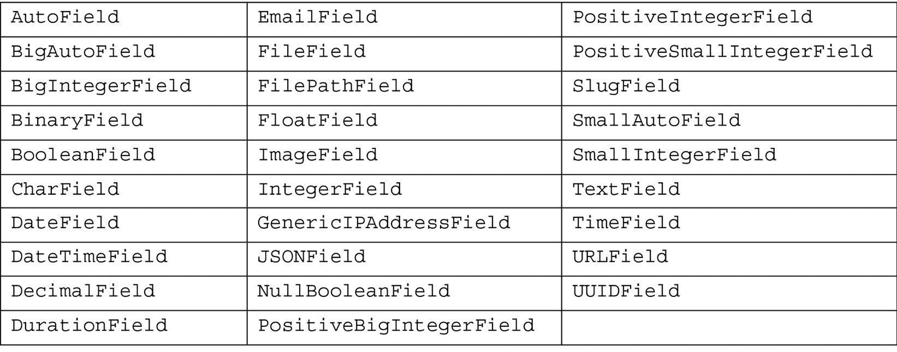
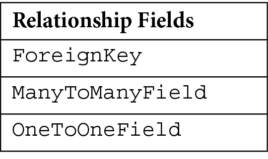
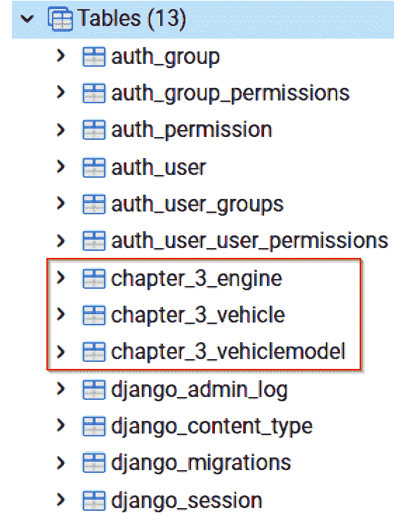
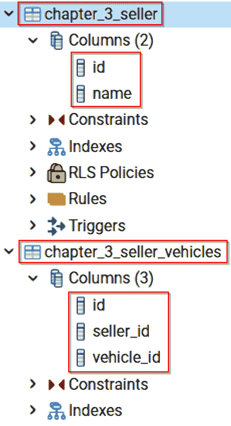
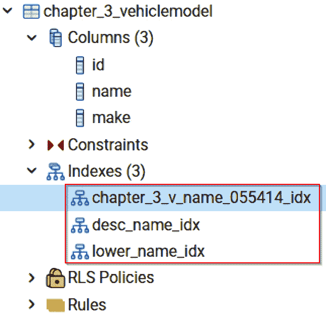
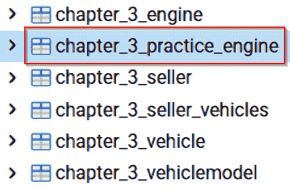
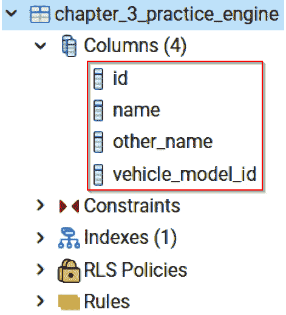
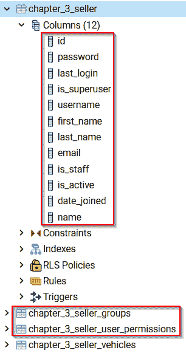

# 第三章：*第三章*：模型、关系和继承

**模型**代表数据库中的表，也称为对象。Django 提供了一种简单的方法将对象映射到项目的底层数据库（或数据库）。我们将使用这种映射系统在本书的后续章节中与其他 Django 组件一起工作，例如模板、视图或表单，仅举几例。任何依赖于从数据库内部访问数据的东西都将依赖于我们创建的模型。如果一个项目连接到外部数据库系统或项目使用 API 与数据交互，那么在这种情况下就不需要创建任何模型。

本章将涵盖以下内容：

+   编写模型类以创建数据库表

+   使用标准字段类型和第三方字段类型

+   配置字段验证器

+   通过字段关系链接表

+   与模型元类和选项一起工作

+   使用模型方法和方法装饰器

+   练习扩展模型

+   介绍使用 Django shell 作为执行查询和添加数据的工具

+   创建模型管理器以格式化和控制数据

# 技术要求

要使用本章中的代码，以下工具需要在你的本地机器上安装：

+   Python 版本 3.9 – 作为项目的底层编程语言

+   Django 版本 4.0 – 作为项目的后端框架

+   pip 包管理器 – 用于管理第三方 Python/Django 包

我们将继续使用在*第二章*“项目配置”中创建的解决方案进行工作。然而，并不需要使用 Visual Studio IDE。主要项目本身可以使用其他 IDE 或从项目根目录独立运行，使用终端或命令行窗口。这就是`manage.py`文件所在的位置。无论你使用什么编辑器或 IDE，都需要一个虚拟环境来与 Django 项目一起工作。有关如何创建项目和虚拟环境的说明可以在*第二章*“项目配置”中找到。你需要一个数据库来存储项目中的数据。在上一章的示例中选择了 PostgreSQL；然而，你可以为你的项目选择任何数据库类型来与本章中的示例一起工作。

本章中创建的所有代码都可以在本书的 GitHub 仓库中找到：[`github.com/PacktPublishing/Becoming-an-Enterprise-Django-Developer`](https://github.com/PacktPublishing/Becoming-an-Enterprise-Django-Developer)。本章中展示的大部分代码可以在`/becoming_a_django_entdev/becoming_a_django_entdev/chapter_3/`目录中找到。

查看以下视频以查看*代码在行动*：[`bit.ly/3zZ68RS`](https://bit.ly/3zZ68RS)

# 为本章做准备

首先，按照在*第二章*中讨论的步骤，在你的项目中创建一个名为`chapter_3`的新应用。正如该部分所讨论的，不要忘记将`/becoming_a_django_entdev/becoming_a_django_entdev/chapter_3/apps.py`文件中找到的你的应用类中的`name =`变量的值更改为指向你安装应用的位置。确保还将此应用包含在`settings.py`文件中的`INSTALLED_APPS`变量中。

# 编写模型类

你项目中的每个模型都代表数据库中的一个表。在这些模型中创建的字段都与该表中的列相关。Django 提供了一种称为`settings.py`文件的项目技术。ORM 技术是一种用于在两种不兼容的数据类型系统之间转换数据的过程。这意味着 Django 消除了直接使用**结构化查询语言**（**SQL**）进行查询的烦恼。Django ORM 在解释 SQL 时消除了各种数据库类型之间的差异，使其成为处理所有数据结构的通用工具。现在，你和你的开发者可以更多地专注于开发，而不是处理这些烦恼。Django 不要求使用 SQL 作为标准写作实践。然而，如果你想或需要这样做，Django 确实提供了一种在执行查询操作时使用基本 SQL 的方法。

接下来，假设我们正在构建一个允许用户查看提供特定汽车详细信息的页面的网站，通常称为详情页面/视图。让我们假设我们正在构建一个基本的网站，仅用于存储和查找待售汽车的详细信息。用户可能出于多种原因这样做；可能是租车、购买、租赁或出售汽车。在任何情况下，我们都需要一个表示车辆对象的表，另一个表示车辆型号的表（不要与 Django 模型混淆），以及另一个表示发动机类型的表。在现实世界的场景中，你的项目可能包含许多其他表，这些表的结构也可能在许多方面有所不同。在这个特定的练习中，我们不会为制造商创建模型，也称为车辆的型号。制造商将作为一个集合来创建，以展示某些教育目的的概念：

1.  在刚刚创建的`chapter_3`目录下的`models.py`文件中，编写三个空类，每个类对应于与我们的车辆练习相关的表格，按照以下示例进行：

    ```py
    # /becoming_a_django_entdev/chapter_3/models.py
    from django.db import models
    class Vehicle(models.Model):
        pass
    ```

1.  为`Vehicle`、`VehicleModel`和`Engine`创建一个类。我们将把与车辆模型相关的类命名为`VehicleModel`而不是`Model`，以防止我们在完成每个练习时产生混淆。

    小贴士

    在前面的示例中，创建了三个类，通过直接在它们中写入 `pass` 语句，目前它们什么也不做。这是一个工具，可以添加到您的工具箱中，用于编写骨架代码，并允许其他组件在您编写代码时继续运行。如果类中没有放置任何内容，Python 会给出错误；当您准备好为该类编写代码时，请删除 `pass` 语句，并用您的实际代码替换它。

分配给模型类的名称几乎可以是您想要的任何名称，但不能是 Python 的保留关键字，例如 `True`、`False`、`class`、`pass` 和 `import`。在您的代码中其他地方使用时，请为您的类命名任何有意义的名称。您可以使用大写或小写字母，但 Django 创建您的表时，名称将始终是小写的。这就是为什么不允许用不同的字母大小写来命名两个不同的类。例如，如果我们命名两个类 `class Vehicle` 和 `class vehicle`，当 Django 尝试进行迁移时，会告诉我们以下 `RuntimeError`：

```py
RuntimeError: Conflicting 'vehicle' models in application 'chapter_3':
```

因此，最好采用一种使用一个或另一个字母大小写的写作风格，并在整个项目中坚持这种模式。

让我们讨论现有的各种字段类型，并看看哪些我们可以用于我们的车辆练习。

## 标准字段类型

开箱即用，Django 提供了众多可供选择的**标准字段类型**。以下表格可以在编写模型时作为速查表使用：





若要详细了解所有可选择的字段类型，您可以访问官方 Django 文档中的字段类型部分，链接如下：[`docs.djangoproject.com/en/4.0/ref/models/fields/`](https://docs.djangoproject.com/en/4.0/ref/models/fields/).

### 字段参数

每个字段类都会在我们的字段上经常接受 `verbose_name`、`blank` 和 `null` 参数。`verbose_name` 将指定字段的可读名称。对于任何我们使用的 `CharField` 实例，我们应该指定一个 `max_length` 参数，以限制该字段的字符长度。如果没有设置 `max_length` 参数，理论上字符长度限制是无限的。然而，您受到所使用数据库的物理限制；限制将是几千或几十万个字符，而不是字面上的无限限制。`null` 和 `blank` 参数几乎被认为是同一件事，除了 `null` 参数表示数据库可以为任何空记录存储一个空值。`blank` 参数与在数据库级别对该字段进行的验证相关，以检查用户在保存或创建数据库中的该记录时是否尝试输入空值。

`default`参数将用于在创建或更新对象时未提供值的情况下，默认分配一个值给字段。默认值用于数据从外部源迁移到您的数据库的情况，其中数据与您在表上设置的约束不一致。例如，如果您有一个字段参数设置为`null=False`，并且导入了包含空值的数据，则可能会出现错误。假设您有一个带有`default=True`/`False`参数的`BooleanField`，然后执行相同的数据导入；那么，所有这些空值将在导入过程中自动转换为`True`/`False`。`default`参数几乎可以应用于任何字段类型。

`choices`参数允许我们传递一个包含值和该值的人类可读解释的预定义选择集。选择可以在`CharField`和`BooleanField`实例上使用，以及一些其他字段类型。它们可以被制作成下拉选择框，或者用于一组复选框或单选按钮。`choices`参数接受一个元组的列表，其中每个元组的第一个元素是字段的值，第二个元素是该值的人类可读字符串表示。在这个练习中，我们将把人类可解释的*是/否*选择转换为计算机可解释的*真/假*值，在`BooleanField`上。我们还将在此章的后面部分应用这种技术，以便在制造商/制造字段上存储整数值。

另一个可能很有用的论点是`editable=False`属性。这个属性会在模板中的任何表单对象中隐藏字段。用户将无法以任何方式查看或编辑该字段。`unique=True`参数也可能很有用。这个参数表示表中两行/记录在该特定字段上不能有相同的值。例如，如果将电子邮件字段用作模型的唯一标识符，可以防止重复的存在。在保存或创建新记录时，我们可能会得到冲突的结果，错误信息会告诉我们电子邮件地址已存在。

模型字段参数与表单字段参数不同，因为模型参数将在数据库级别应用规则到您的列上。我们将在*第五章*“Django 表单”中介绍您的表单字段参数，这些参数是仅适用于特定表单中字段的规则。这意味着您可以在模型字段上设置`blank=True`，使其在数据库级别不是必需的，但在`required=True`的表单字段集中是必需的，使其对该特定表单是必需的。或者，我们可以通过在数据库级别使用`blank=False`设置约束，使该字段在所有表单中都是必需的。在编写模型类时请记住这一点。

接下来，让我们开始编写我们车辆场景所需的各个字段。

### 添加标准字段类型

从前面提供的 Django 字段列表中，我们将为每个模型使用 `CharField`。`CharField` 将用于在将每个项目添加到数据库时提供名称，除了 `Vehicle` 模型类。对于 `Vehicle` 模型，我们将使用 `CharField` 作为 `BooleanField` 在 `Vehicle` 模型上，以存储一个值，表示该车辆是否已售出。这就是我们将创建一个 *是/否* 选项列表来代替 *true/false* 值的字段。

按照以下步骤为每个模型类创建字段。记住要删除 `pass` 语句：

1.  在你的 `/chapter_3/models.py` 文件中，在你的模型类上方和 `import` 语句下方创建上述 *是/否* 选项集，如图所示：

    ```py
    # /becoming_a_django_entdev/chapter_3/models.py 
    from django.db import models
    YESNO_CHOICES = (
        (True, 'Yes'),
        (False, 'No')
    )
    ...
    ```

1.  将以下字段添加到你的 `VehicleModel` 类中：

    ```py
    # /becoming_a_django_entdev/chapter_3/models.py 
    ...
    class VehicleModel(models.Model):
        name = models.CharField(
            verbose_name = 'Model',
            max_length = 75,
            unique = True,
            blank = True,
            null = True,
        )
    ```

1.  将以下字段添加到你的 `Engine` 类中：

    ```py
    # /becoming_a_django_entdev/chapter_3/models.py 
    ...
    class Engine(models.Model):
        name = models.CharField(
            verbose_name = 'Engine',
            max_length = 75,
            blank = True,
            null = True,
        )
    ```

1.  将以下字段添加到你的 `Vehicle` 类中：

    ```py
    # /becoming_a_django_entdev/chapter_3/models.py 
    ...
    class Vehicle(models.Model):
        vin = models.CharField(
            verbose_name = 'VIN',
            max_length = 17,
            unique = True,
            blank = True,
            null = True,
        )
        sold = models.BooleanField(
            verbose_name = 'Sold?',
            choices = YESNO_CHOICES,
            default = False,
            blank = True,
            null = True,
        )
    ```

之前显示的 `VehicleModel` 类上的 `name` 字段将使用 `unique` 参数，只允许在该表中不存在的名称。`Engine` 类上的 `name` 字段将不会使用 `unique` 参数，因此我们可以允许具有相同名称的引擎，但将它们分配给不同的车辆模型。`YESNO_CHOICES` 变量用作全局变量，放置在任何模型类之外，以便在需要时可以在多个字段中使用。如果变量或选项集非常独特，那么将它们放置在字段声明上方，在使用的模型类中是最佳实践。你也可以将这些变量存储在一个完全独立的文件中，只要代码保持整洁简单。

注意

上述代码是 PEP-8 风格指南的宽松风格，我们将每个参数放在单独的一行上，用逗号分隔，同时遵循基本的 Python 缩进规则。本书中的大部分代码将以这种方式编写。

1.  运行 Django 的 `makemigration` 和 `migrate` 命令，如下所示：

    ```py
    (virtual_env) PS > python3 manage.py makemigrations
    Migrations for 'chapter_3':
      becoming_a_django_entdev\chapter_3\migrations\0001_initial.py
    - Create model Engine 
        - Create model Vehicle
        - Create model VehicleModel
    (virtual_env) PS > python3 manage.py migrate
    Operations to perform:
      Apply all migrations: admin, auth, chapter_1, chapter_3, contenttypes, sessions
    Running migrations:
      Applying chapter_3.0001_initial... OK
    ```

每当模型被更改、创建或删除时，都需要执行这些 Django 迁移命令以防止运行时错误。这些命令可以从你的 IDE 或命令行或终端窗口中执行，在项目根目录下执行，其中包含你的 `manage.py` 文件。参考*第二章*，*项目配置*部分，标题为*构建初始表结构*的子部分，了解更多关于执行这些命令的不同方法。

如果这两个 Django 迁移命令执行成功，你的数据库中将会创建三个额外的表。从 PgAdmin 工具或任何其他你决定使用的数据库管理工具中查看，这些表将类似于以下截图所示：



图 3.1 – PgAdmin – 创建车辆、模型和引擎表

如果我们需要使用 Django 标准中不包含的字段，例如`AddressField`、`MoneyField`或`PhoneField`，我们必须安装包并配置设置，然后才能使用它们。让我们准备我们的项目，以便通过将这些示例中的`MoneyField`集成进来，做到这一点。

## 第三方字段类型

`django-address`包使用 Google Maps API 在用户输入单个文本字段时建议与用户输入相关的地址。这意味着该包提供了模型类以及它创建的表单字段类和其他相关工具。相关工具包括所有帮助表单工作的 JavaScript 和 CSS 库。`django-image-cropping`工具也非常强大：它允许用户上传图片，并让用户按照自己的意愿裁剪图片。

有一个专门用于处理货币的包叫做`django-money`。这个包从标准字段类型列表中取出了`DecimalField`，并提供了许多涉及金融行业接受方式的金钱操作。`django-money`包为今天存在的所有货币提供了定义，并包括它们对应的货币符号。除了执行加法、减法等算术运算外，货币还可以使用当前汇率从一种符号转换为另一种符号。这意味着这个包将与 API 通信以检索该信息。

`django-phone-field`包可以接受相当灵活的电话号码。电话字段允许使用国家代码，并接受特殊字符，以便可以将其掩码为所需的任何格式。`django-ckeditor`包是一个用于向您的页面添加富文本编辑器的工具，允许用户将 HTML 输入到您的表单字段之一。如果您使用的是 django CMS，他们还提供了一个专门用于与 django CMS 包一起使用的 django-ckeditor 包版本。

这里是一个简短的第三方字段类型列表，您可以将其添加到之前的字段类型速查表中：

+   `AddressField` – [`pypi.org/project/django-address/`](https://pypi.org/project/django-address/)

+   `ImageCropField` – [`pypi.org/project/django-image-cropping/`](https://pypi.org/project/django-image-cropping/)

+   `MoneyField` – [`pypi.org/project/django-money/`](https://pypi.org/project/django-money/)

+   `PhoneField` – [`pypi.org/project/django-phone-field/`](https://pypi.org/project/django-phone-field/)

+   `RichTextField` – [`pypi.org/project/django-ckeditor/`](https://pypi.org/project/django-ckeditor/)

+   (*django CMS*) `RichTextField` – [`pypi.org/project/djangocms-text-ckeditor/`](https://pypi.org/project/djangocms-text-ckeditor/)

接下来，我们将向我们的`Vehicle`模型类中添加`MoneyField`。

### 添加第三方字段类型

由于一些字段，如 `AddressField`，需要直接从 Google 获取个人 Google API 密钥，因此我们不会使用该字段类型。我们只会演示使用这些第三方字段类型之一，然后继续下一个主题。

要在项目中包含 `MoneyField`，请按照以下步骤操作：

1.  将 `django-money` 添加到你的 `requirements.txt` 文件中，并在你的虚拟环境中安装它，或者运行以下命令手动安装此包。确保你的虚拟环境已经激活：

    ```py
    (virtual_env) PS > pip install django-money
    ```

1.  在你的 `settings.py` 文件中，将以下应用添加到你的 `INSTALLED_APPS` 列表中：

    ```py
    # /becoming_a_django_entdev/settings.py
    ...
    INSTALLED_APPS = [
        ...,
        'djmoney',
        'becoming_a_django_entdev.chapter_3',
    ]
    ```

确保它位于你的本地应用之上，并在所有 `django.contrib` 应用之下，如前所述，它放置在 `chapter_3` 应用之前。

1.  使用 `MoneyField`，你可以在 `settings.py` 文件中指定项目中可用的不同货币。在以下示例中，我们指定美元和欧元为该项目中可用的两种货币：

    ```py
    # /becoming_a_django_entdev/settings.py
    ...
    CURRENCIES = ('USD', 'EUR')
    CURRENCY_CHOICES = [
        ('USD', 'USD $'), 
        ('EUR', 'EUR €')
    ]
    ```

1.  将以下高亮的 `import` 语句添加到你的 `/chapter_3/models.py` 文件顶部：

    ```py
    # /becoming_a_django_entdev/chapter_3/models.py 
    from django.db import models
    from djmoney.models.fields import MoneyField
    ```

1.  在你的 `Vehicle` 类中，添加以下价格字段：

    ```py
    # /becoming_a_django_entdev/chapter_3/models.py 
    ...
    class Vehicle(models.Model):
        ...
        price = MoneyField(
            max_digits = 19,
            decimal_places = 2,
            default_currency = 'USD',
            null = True,
        )
    ```

你还需要使用前面示例中描述的字段参数（根据需要调整值）。

让我们探索我们可以应用于我们正在使用的字段类型的验证。

## 模型字段验证器

字段验证器是数据库级别的规则，可以在模型字段上设置。在需要使用 `DecimalField` 而不是使用 `max_length` 参数来控制字符长度的情况下，它们非常有用。我们定义一个最小或最大数值。如果不符合该标准，Django 将抛出 `ValidationError`。由于这是一个可调用的对象，你可以编写自己的函数来满足你的需求，或者使用 Django 内置的许多不同的可调用函数之一。例如，当指定最小或最大数值约束时，我们可以使用 `MinValueValidator` 和 `MaxValueValidator` 函数。你可以在以下位置查看 Django 提供的完整验证器函数列表：[`docs.djangoproject.com/en/4.0/ref/validators/`](https://docs.djangoproject.com/en/4.0/ref/validators/)。

### 设置字段验证器

`MoneyField` 提供了一些自己的字段验证器，这些验证器对项目中定义的任何类型的货币值添加了约束。货币验证器简化了使用 Django `DecimalValidator` 或编写自己的可调用方法的过程。

按照以下步骤在现有的 `Vehicle` 模型上设置验证器：

1.  在你的 `/chapter_3/models.py` 文件顶部，并在现有的 `import` 语句下方，添加以下 `import` 语句：

    ```py
    # /becoming_a_django_entdev/chapter_3/models.py 
    ...
    from djmoney.models.validators import MaxMoneyValidator, MinMoneyValidator
    ```

1.  不论是标准的 Django 字段验证器还是由第三方包提供的验证器，它都将作为字段参数传入，如下所示，这是在 `Vehicle` 模型的 `price` 字段中：

    ```py
    # /becoming_a_django_entdev/chapter_3/models.py 
    ...
    class Vehicle(models.Model):
        ...
        price = MoneyField(
            max_digits = 19,
            decimal_places = 2,
            default_currency = 'USD',
            null = True,
            validators = [
                MinMoneyValidator(
                    {'EUR': 500, 'USD': 400}
                ),
                MaxMoneyValidator(
                    {'EUR': 500000, 'USD': 400000}
                ),
            ])
    ```

这些函数通常自己接受一个或多个参数。在这个例子中，我们指定了最小和最大货币值的参数。前面的例子指出，所有欧元（`EUR`）值应在 500 到 500,000 欧元之间，美元值（`USD`）应在 400 到 400,000 美元之间。这些只是用于演示的粗略估计，并不代表确切的转换率。

目前，我们的三个模型类彼此独立存在。这意味着它们目前还没有以任何方式相互链接。在我们完成之前，我们需要使它们相互关联。接下来，我们将通过处理模型字段关系来链接这些表。

# 处理模型字段关系

Django 提供了三种关系类型用于链接表：

+   **多对一**关系

+   **多对多**关系

+   **一对一**关系

使用`ForeignKey`字段定义一个**多对一**关系，其他两种关系类型则使用自解释的`ManyToManyField`和`OneToOneField`定义。这些字段根据它们所代表的关系类型适当地命名。

接下来，我们将讨论处理模型字段关系的关键组件。

## 字段参数

三种字段类型，`ForeignKey`、`ManyToManyField`和`OneToOneField`，都接受其他字段类型接受的标准的`default`、`blank`和`verbose_name`字段参数。`null`参数对`ManyToManyField`没有影响，只会应用于`ForeignKey`和`OneToOneField`类型。这两种字段类型中的两种——`ForeignKey`和`OneToOneField`——至少需要两个位置参数，第一个是字段相关的模型类，第二个是`on_delete`参数。位置参数意味着它们需要按顺序排列，必要参数意味着它们必须指定。`on_delete`参数指定了当删除父或子对象时，数据库将如何处理相关表中的记录。

`on_delete`选项包括以下内容：

+   `models.CASCADE` – 当从该表中删除对象时，用于自动删除任何相关对象。

+   `models.PROTECT` – 用于防止删除任何对象。

+   `models.RESTRICT` – 用于在特定场景中防止删除。

+   `models.SET_DEFAULT` – 用于将相关对象的字段设置为默认值。

+   `models.SET_NULL` – 用于将相关对象的字段设置为空值。

+   `models.SET()` – 接受一个可调用的函数，用于设置值。

+   `models.DO_NOTHING` – 不会采取任何行动；使用此选项可能会导致**IntegrityError**，应谨慎使用。

我们将 `on_delete` 参数的值设置为 `models.CASCADE`，确保如果从数据库中删除一个 `Vehicle`，相关的 `VehicleModel` 和 `Engine` 对象将不会受到影响。但如果从数据库中删除一个 `VehicleModel` 或 `Engine` 对象，依赖于即将删除的对象的相关 `Vehicle` 也会被删除。如果我们想在删除其中任何一个的情况下保留 `Vehicle`，我们应该使用 `models.SET_DEFAULT` 值。

三个字段类型—`ForeignKey`、`ManyToManyField` 和 `OneToOneField`—都允许我们在执行查询时向前和向后跟踪关系，这意味着如果你查询一个父对象，你可以跟随这个查找向前以获取所有子对象。反向查找意味着你查询一个子对象，并跟随其查找向后以获取其父对象。这些向前和反向关系是通过使用 `related_name` 和 `related_query_name` 参数在字段上定义的，这将在下面演示。

`ForeignKey` 字段和 `ManyToManyField` 可以接受一个 `limit_choices_to` 参数，该参数对相关查询应用一个过滤器。`limit_choices_to` 参数将接受一个字典或 Q 对象。它还可以接受一个可调用的函数，该函数返回一个字典或 Q 对象。

注意

`filter()`、`all()` 或 `order_by()` 语句无法提供。要了解更多关于使用 Q 对象进行复杂查找的信息，请访问官方 Django 文档：[`docs.djangoproject.com/en/4.0/topics/db/queries/#complex-lookups-with-q-objects`](https://docs.djangoproject.com/en/4.0/topics/db/queries/#complex-lookups-with-q-objects)。要了解更多关于执行查询的一般信息，请跳转到本章后面的标题为 *执行查询* 的部分。

继续使用我们的车辆类，我们可以将这些模型关系和参数应用到我们已编写的类中。它们将帮助我们将一个假设的 `Seller` 与 `Vehicle`、`Vehicle` 与 `VehicleModel` 以及 `VehicleModel` 与 `Engine` 相关联。

## 字段类型 – ForeignKey

我们将使用 `ForeignKey` 字段来表示 `Vehicle` 类与 `VehicleModel` 和 `Engine` 类之间的 *多对一* 关系。

按照以下步骤创建你的 `ForeignKey` 字段：

1.  在你的 `/chapter_3/models.py` 文件中，将以下两个字段添加到现有的 `Vehicle` 模型类中，如下所示：

    ```py
    # /becoming_a_django_entdev/chapter_3/models.py 
    ...
    class Vehicle(models.Model):
        ...
        vehicle_model = models.ForeignKey(
            VehicleModel,
            on_delete = models.CASCADE,
            verbose_name = 'Model',
            related_name = 'model_vehicle',
            blank = True,
            null = True,
        )
        engine = models.ForeignKey(
            Engine,
            on_delete = models.CASCADE,
            verbose_name = 'Engine',
            related_name = 'engine_vehicle',
            blank = True,
            null = True,
        )
    ```

1.  在你的 `/chapter_3/models.py` 文件中，将以下字段添加到现有的 `Engine` 模型类中，如下所示：

    ```py
    # /becoming_a_django_entdev/chapter_3/models.py 
    ...
    class Engine(models.Model):
        ...
        vehicle_model = models.ForeignKey(
            VehicleModel,
            on_delete = models.CASCADE,
            verbose_name = 'Model',
            related_name = 'model_engine',
            blank = True,
            null = True,
        )
    ```

1.  现在，再次运行你的 Django 迁移命令，如在第二章的子节标题为 *构建初始表结构* 中所述，*项目配置*。你可以看到我们创建的两个字段，`vehicle_model` 和 `engine`，现在显示在我们的数据库管理工具的列列表中：

![Figure 3.2 – PgAdmin – ForeignKey field![Figure 3.2 – PgAdmin – ForeignKey field 图 3.2 – PgAdmin – ForeignKey 字段在先前的屏幕截图中，这些字段被显示为 `vehicle_model_id` 和 `engine_id`。`_id` 后缀会自动添加到你的数据库中的列名。## 字段类型 – ManyToManyField 在这里，我们将使用 `ManyToManyField` 类型来表示卖家和他们所销售的车辆之间的 *多对多* 字段关系。`ManyToManyField` 不会接受 `on_delete` 参数。相反，当子项或父项被删除时，另一项将始终保留在你的数据库中，因为许多其他对象也可能与之相关。按照以下步骤创建 `ManyToManyField`:1.  在你的 `/chapter_3/models.py` 文件中，创建一个新的 `Seller` 模型类，包含一个 `name` 字段和一个 `vehicle` 字段，用于作为你的 *多对多* 关系。你的代码现在应该类似于以下示例：    ```py    # /becoming_a_django_entdev/chapter_3/models.py     ...    class Seller(models.Model):        name = models.CharField(            verbose_name = 'Seller Name',            max_length = 150,            blank = True,            null = True,        )        vehicle = models.ManyToManyField(            Vehicle,            verbose_name = 'Vehicles',            related_name = 'vehicle_sellers',            related_query_name = 'vehicle_seller',            blank = True,        )    ```我们将 `ManyToManyField` 链接到 `Vehicle` 模型类在第一个位置参数。它被赋予一个 `related_name` 参数，其值为 `vehicle_sellers`，以及一个 `related_query_name` 参数，其值为 `vehicle_seller`。这两个参数用于稍后在 *第十章*，*数据库管理* 中链接和映射到该字段。1.  再次运行你的 Django 迁移命令。你应该在你的数据库管理工具中看到为该表创建的列，类似于以下屏幕截图：

图 3.3 – pgAdmin – ManyToManyField

我们还应该看到任何自动创建的附加表，这些表用于管理 `Seller` 和 `Vehicle` 之间的关系。该表在先前的屏幕截图中被显示为 **chapter_3_seller_vehicle**。

## 可变对象与不可变对象

**可变性** 是 Python 语言的一个基本概念，分为可变对象和不可变对象。如果一个对象的价值可以随时间改变，那么这个对象就被说成是 **可变的**。如果一个对象的价值不会改变，那么这个对象就被说成是 **不可变的**。在 Python 中，一个对象的可变性也由其数据类型定义。例如，可变对象使用 *list*、*dictionary*、*set* 或 *QuerySet* 来表示。不可变对象使用 *bool*、*decimal*、*float*、*int*、*range*、*string* 和 *tuple* 数据类型来定义。如果被搜索的对象是不可变的而不是可变的，查询将表现得更好。大多数时候，这种差异微乎其微，实际上在纳秒或毫秒级别。当你的项目上线并且数据库开始收集成千上万，甚至数百万条记录时，查询所需的时间将会在它需要几秒钟，甚至几分钟或十几分钟来完成单个查询时被注意到。

例如，我们可以使用元组对象将一组选择表示为 `PositiveIntegerField`，将可读的字符串表示与数值整数关联。以本章前面提到的车辆制造商为例。除非我们需要存储其他相关联的信息，或者有项目需求表明用户应该能够添加/编辑这些选择，否则我们实际上不需要一个表来存储这些信息。

通过以下步骤可以将这些值作为不可变数据类型硬编码：

1.  在 `/chapter_3/models.py` 文件中，在你的模型类上方和 `import` 语句下方添加以下设置：

    ```py
    # /becoming_a_django_entdev/chapter_3/models.py 
    ...
    MAKE_CHOICES = (
        (1, 'Buick'),
        (2, 'Cadillac'),
        (3, 'Chevrolet'),
        ...
    )
    ```

1.  将该集合用作你的 `Vehicle` 类中 `make` 字段的 `choices` 参数的值，如下所示：

    ```py
    # /becoming_a_django_entdev/chapter_3/models.py 
    ...
    class Vehicle(models.Model):
        ...
        make = models.PositiveIntegerField(
            choices = MAKE_CHOICES,
            verbose_name = 'Vehicle Make/Brand',
            blank = True,
            null = True,
        )
    ```

接下来，让我们讨论一下 `Meta` 子类是什么以及它是如何被用来控制模型行为，甚至比我们之前所做的一切都要多的。

# 使用 Meta 子类

`Meta`。这不是必需的，完全可选，但它确实使得在模型中包含它时使用 Django 更加有用。元数据提供了所有在模型字段参数中未定义的“其他”信息。在这个类内部定义的设置被称为 **元选项**，有很多可供选择。在接下来的几节中，我们将介绍一些最常用的选项以及它们如何有所帮助。所有选项的完整分解可在以下链接中找到：[`docs.djangoproject.com/en/4.0/ref/models/options/`](https://docs.djangoproject.com/en/4.0/ref/models/options/)。

## Meta 选项 – verbose_name 和 verbose_name_plural

我们可以使用 `verbose_name` 和 `verbose_name_plural` 选项来指定在 Django 管理站点区域中使用的可读文本，或者在我们稍后编写的代码中查找时使用的文本。我们将在 *第六章* 中介绍 Django 管理站点，*探索 Django 管理站点*。

要将这些选项添加到你的模型类中，使用名为 `VehicleModel` 的类，将这些详细选项设置为 `Vehicle Model` 和 `Vehicle Models`，如图所示：

```py
# /becoming_a_django_entdev/chapter_3/models.py 
```

```py
...
```

```py
class VehicleModel(models.Model):
```

```py
    ...
```

```py
    class Meta:
```

```py
        verbose_name = 'Vehicle Model'
```

```py
        verbose_name_plural = 'Vehicle Models'
```

现在，在你的代码和 Django 管理站点中，这些值将被用作你的对象（复数）的单数和复数表示。

## Meta 选项 – 排序

当获取对象列表时，使用 `ordering` 选项。如果没有指定其他排序规则，则默认情况下，此设置将接受一个或多个字段作为参数进行排序。如果没有放置破折号（`–`）字符，则将按升序排序；如果使用了破折号，则结果将按降序显示。

要将此选项添加到你的模型类中，我们可以按 `name` 字段对 `VehicleModel` 类进行升序排序，然后再按降序排序，如下面的代码所示：

```py
# /becoming_a_django_entdev/chapter_3/models.py 
```

```py
...
```

```py
class VehicleModel(models.Model):
```

```py
    ...
```

```py
    class Meta:
```

```py
        ...
```

```py
        #ordering = ['name', 'secondary_field',]
```

```py
        ordering = ['-name']
```

上述代码块中注释掉的第一个示例显示我们可以按额外的字段排序，字段之间用逗号分隔，也可以按升序排序。上述代码块中的最后一个示例描述了按字母顺序降序排序结果，从 Z 到 A。

## 元选项 – 索引

`indexes`选项与一个称为`indexes`元选项的标准数据架构概念相关。

按照以下步骤将此选项添加到你的模型类中：

1.  要在`VehicleModel`类的名称字段上创建索引，可以写成如下所示：

    ```py
    # /becoming_a_django_entdev/chapter_3/models.py 
    ...
    from django.db.models.functions import Lower
    ...
    class VehicleModel(models.Model):
        ...
        class Meta:
            ...
            indexes = [
                models.Index(fields=['name']),
                models.Index(
                    fields = ['-name'], 
                    name = 'desc_name_idx'
                ),
                models.Index(
                    Lower('name').desc(), 
                    name = 'lower_name_idx'
                )
            ]
    ```

上述示例创建了三个独立的索引，一个用于升序排列的名称，一个用于降序排列，另一个用于仅小写字母的名称的升序排列。

1.  接下来，再次运行你的 Django 迁移命令。在你的命令行或终端窗口中，应该出现以下消息：

    ```py
        - Create index chapter_3_v_name_055414_idx on field(s) name of model vehiclemodel
        - Create index desc_name_idx on field(s) -name of model vehiclemodel
        - Create index lower_name_idx on OrderBy(Lower(F(name)), descending=True) on model vehiclemodel
    ```

如果我们不指定`name=`属性，如前一个示例中的第一个索引未做的那样，Django 将使用其默认命名约定来命名它。这就是前一个示例中第一个索引消息的结果，即名称为`chapter_3_v_name_055414_idx`。前一个示例从`django.db.models.functions`库中导入了一个名为`Lower`的类。`Lower`类允许我们在前一个代码块中的最后一个索引上创建所有小写字符表示的`name`字段的索引。Django 提供了许多数据库函数，这些函数的完整说明可以在官方 Django 文档中找到：[`docs.djangoproject.com/en/4.0/ref/models/database-functions/`](https://docs.djangoproject.com/en/4.0/ref/models/database-functions/)。

每个表的索引通常在数据库管理工具中显示。例如，在 PgAdmin 中，从**浏览器**选项卡中导航数据树以找到**chapter_3_vehiclemodel**索引。这是一个非常深的导航：转到**PostgreSQL 13** | **数据库** | **local_postgresql** | **模式** | **public** | **表** | **chapter_3_vehiclemodel** | **索引**，你应该能看到你的索引，如下面的截图所示：



图 3.4 – PgAdmin – 模型索引

## 元选项 – db_table

有时，一个项目可能有如此多的模型，它们开始相互冲突，或者管理起来变得过于混乱。`db_table`选项用于指定数据库中的表名。如果此选项未设置，则 Django 默认将使用`{{ app_name }}_{{ model_name }}`命名约定来命名你的表。我们可以使用此选项在特定情况下指定一个独特的表名，该表名与默认命名约定不同。

例如，让我们创建一个名为`engine2`的新类，这次使用小写。这样，我们知道小写类是为了辅助练习，与主要类分开，主要类将以首字母大写命名。在这里，我们将添加之前在本章*编写模型类*部分中提到的`RuntimeError`。

按照以下步骤将此选项添加到你的模型类中：

1.  在`/chapter_3/models.py`文件中，创建`engine2`类并将`Engine`类中的名称字段复制到其中，如下所示：

    ```py
    # /becoming_a_django_entdev/chapter_3/models.py 
    ...
    class engine2(models.Model):
        name = models.CharField(
            verbose_name = 'Engine',
            max_length = 75,
            blank = True,
            null = True,
        )
    ```

1.  创建`Meta`子类并设置`db_table`选项，如图所示。不要在`Engine`类上使用此选项：

    ```py
    # /becoming_a_django_entdev/chapter_3/models.py 
    ...
    class engine2(models.Model):
        ...
        class Meta:
            db_table = 'chapter_3_practice_engine'
    ```

将`db_table`的值设置为`'chapter_3_practice_engine'`，如图所示。

1.  然后，再次运行你的 Django 迁移命令。在你的数据库管理工具，如 PgAdmin 中，`chapter_3`表应该看起来类似于以下内容：



图 3.5 – PgAdmin – db_table 选项

我们可以查看`engine2`模型类。另一个你可能经常使用的有用元选项是抽象选项。这个选项主要用于扩展模型类，最好在本章标题为*扩展模型*的部分中稍后解释。

在扩展模型类之前，让我们先探索使用模型方法和方法装饰器。

# 定制模型

模型方法是写在模型类内部的定制函数，为表中的单个记录提供附加功能。它们让我们能够创建自己的业务逻辑，并按需格式化字段数据。Django 为我们提供了几个默认方法，我们也可以编写自己的定制方法。定制方法可以将字段组合起来，并从这些两个或更多字段中返回派生数据。装饰器有时与模型方法结合使用，以提供更多的功能。

一些方法可以在对象在数据库级别保存和/或删除时执行特殊操作。其他方法用于查询执行或模板内渲染对象时使用。我们将讨论 Django 提供的一些方法，并演示它们的用法。要了解使用 Django 模型方法的全部功能，请访问他们的文档，网址为[`docs.djangoproject.com/en/4.0/topics/db/models/#model-methods`](https://docs.djangoproject.com/en/4.0/topics/db/models/#model-methods)。

## 编写方法

编写模型方法类似于编写`Meta`子类，除了我们现在是在该类内部使用`def`关键字编写一个函数，而不是编写一个类。

这里定义了四个最有帮助且最常用的方法：

+   `def save(self, *args, **kwargs)` – 用于覆盖此模型在数据库级别的保存操作。你可以通过调用此方法在保存之前或之后注入自己的逻辑。

+   `def delete(self, *args, **kwargs)` – 这与`save`方法类似，不同之处在于你可以在对象在数据库级别被删除之前或之后添加自己的逻辑。

+   `def get_absolute_url(self)` – Django 用来制定该对象的规范 URL。这用于重新定义 Django 创建这些对象 URL 结构的默认行为。这也是在 Django 管理站点中访问此对象所使用的 URL。

+   `def __str__(self)` – 用来重新定义 Django 将用于创建表中单个记录的字符串表示的默认方式。

我们将使用`__str__()`方法来演示如何覆盖 Django 提供的方法并访问项目代码中的方法。

### 模型方法 – __str__

使用之前创建的相同的`MAKE_CHOICES`元组，我们将覆盖`__str__()`方法，为所有`Vehicle`对象制定一个自定义名称。我们将定义的`Vehicle`对象的默认字符串表示将使用以下命名约定，`{{ vehicle make }} {{ vehicle model }}`，中间有一个空格。

要在`Vehicle`类中配置此方法，在你的`/chapter_3/models.py`文件中，在你的现有`Vehicle`模型类中编写`__str__()`方法，如下面的代码块所示：

```py
# /becoming_a_django_entdev/chapter_3/models.py 
```

```py
...
```

```py
class Vehicle(models.Model):
```

```py
    ...
```

```py
    def __str__(self):
```

```py
        MAKE_CHOICES_DICT = dict(MAKE_CHOICES)
```

```py
        return MAKE_CHOICES_DICT[self.make] + ' ' + self.model.name
```

很容易看出，模型方法只是接受自身实例作为参数，对自己执行某种操作，然后返回转换后的值。前一个例子中的值是一个字符串，对于`__str__()`方法，它应该始终返回一个字符串，而其他方法，包括你创建的自定义方法，可以返回任何其他数据类型，例如*整数*、*字典*、*QuerySet*或*日期/时间*对象，仅举几例。

接下来，让我们讨论编写我们自己的自定义模型方法，这是 Django 没有为我们提供的。

### 自定义模型方法

如果我们想要显示比`__str__()`方法为模型类提供的更深入的名字，自定义方法将很有用。例如，让我们包括发动机类型，除了`__str__()`方法返回的信息。命名约定将是`{{ vehicle make }} {{ vehicle model }} – {{ vehicle engine }}`，中间有空格和破折号。

要在`Vehicle`类上创建自己的模型方法，在你的`/chapter_3/models.py`文件中，在你的`Vehicle`模型内部创建一个新的方法，并将其命名为`full_vehicle_name()`，如下所示：

```py
# /becoming_a_django_entdev/chapter_3/models.py 
```

```py
...
```

```py
class Vehicle(models.Model):
```

```py
    ...
```

```py
    def full_vehicle_name(self):
```

```py
        return self.__str__() + ' - ' + self.engine.name
```

前一个例子使用了`__str__()`方法中找到的相同逻辑。我们只是在自定义方法中使用`self.__str__()`表达式调用该方法，而不是在两个不同的地方编写相同的代码。

接下来，我们将在新创建的自定义方法周围应用装饰器，改变我们与这些数据交互的方式。

## 装饰器

装饰器是一种标准的 Python 设计模式，允许开发者在不永久更改对象行为的情况下扩展对象的功能。装饰器的概念可以应用于项目中几乎任何存在的类或方法。我们将应用这个概念到我们刚刚创建的 `full_vehicle_name()` 方法上，将其从可调用对象变为该模型的元属性。

### 装饰器 – @property

`@property` 装饰器允许我们编写一个方法，使其作为模型实例的常规属性，而不是作为函数。使用此装饰器，我们可以像访问表中任何其他字段一样访问 `full_vehicle_name`。唯一不能做的事情是像其他任何字段一样保存数据，因为该属性在技术上不是表中存储数据的独立列。

如果没有 `@property` 装饰器，数据访问方式将类似于以下演示：

```py
>>> print(my_object.my_custom_method())
```

如果存在 `@property` 装饰器，`print` 语句的编写方式将类似于以下演示：

```py
>>> print(my_object.my_custom_method)
```

要将你的方法包裹在 `@property` 装饰器中，在你的 `/chapter_3/models.py` 文件中，在 `Vehicle` 模型类内部，创建一个新的方法名为 `fullname()`，如下所示：

```py
# /becoming_a_django_entdev/chapter_3/models.py 
```

```py
...
```

```py
class Vehicle(models.Model):
```

```py
    ...
```

```py
    @property
```

```py
    def fullname(self):
```

```py
        return self.__str__() + ' - ' + self.engine.name
```

上述示例将执行与 `full_vehicle_name()` 方法相同的功能，只是应用了 `@property` 装饰器。当我们稍后在该节标题为 *执行查询* 的部分进行查询操作时，我们将比较两种方法的差异，以查看数据是如何返回和使用的。

现在我们已经讨论了构成 Django 模型的大部分核心概念，让我们练习扩展这些模型，以保持一种**不要重复自己**（**DRY**）的编写风格。

# 扩展模型

`User` 模型，这是一个非常常见的扩展模型。

接下来，我们将练习扩展我们的实践模型 `engine2`，然后扩展 Django 的 `User` 模型，将其变为 `Seller` 模型。这将使 `Seller` 对象与 `Vehicle` 相关，并充当 `User`，提供基于权限的角色和权限组功能。

## 扩展基本模型类

扩展常规模型类相当简单。按照以下步骤扩展 `engine2` 实践类：

1.  在你的 `/chapter_3/models.py` 文件中，在名为 `engine2` 的类中，保持名称字段不变，然后添加一个新的字段名为 `vehicle_model`，其 `related_name` 属性值如以下代码块所示：

    ```py
    # /becoming_a_django_entdev/chapter_3/models.py 
    ...
    class engine2(models.Model):
        name = models.CharField(...)
        vehicle_model = models.ForeignKey(
            VehicleModel,
            on_delete = models.CASCADE,
            verbose_name = 'Model',
            related_name = 'model_engine2',
            blank = True,
            null = True,
        )
    ```

1.  确保你的 `engine2` 类具有以下 `Meta` 类选项：

    ```py
    # /becoming_a_django_entdev/chapter_3/models.py 
    ...
    class engine2(models.Model):
        class Meta:
            abstract = True
            db_table = 'chapter_3_practice_engine'
            ordering = ['name',]
            verbose_name = 'Practice Engine'
            verbose_name_plural = 'Practice Engines'
    ```

我们基本上想让 `engine2` 类与 `Engine` 类完全一致，除了我们想要保持原始类不变，并编写一个名为 `engine3` 的新类，该类由 `engine2` 构造。我们还需要给 `engine2` 类中的 `vehicle_model` 字段提供一个新的唯一值作为 `related_name` 参数。否则，当我们运行 Django 迁移命令时，我们将遇到与 `Engine` 类的冲突错误。在 `engine2` 类中，指定与前面示例中相同的 `abstract = True` 选项。该选项允许我们将其用作父类。

1.  现在，在你的 `engine2` 类下面创建一个名为 `engine3` 的新类，如下面的代码块所示：

    ```py
    # /becoming_a_django_entdev/chapter_3/models.py 
    ...
    class engine3(engine2):
        other_name = models.CharField(
            verbose_name = 'Other Engine Name',
            max_length = 75,
            blank = True,
            null = True,
        )
    ```

在这里展示的 `engine3` 类中，我们并没有创建一个 `Meta` 子类，我们只给它提供一个字段。我们还用 `engine2` 替换了 `models.Model`。这就是我们传入我们想要从该类构造新类（也称为扩展或从该父类继承）的类名的地方。

现在运行你的 Django 迁移命令将导致错误，告诉我们 `chapter_3_practice_engine` 表已经存在。为了防止这种情况，我们可以做两件事之一。我们可以重命名 `engine2` 类的 `Meta` 类选项 `db_table`，或者我们可以删除数据库中的所有表并从头开始。

### 删除数据库表

由于目前我们没有任何实际数据需要担心，并且因为我们处于开发生命周期的早期阶段，删除我们的表是可以的。这是可以接受的，因为我们还在构建我们项目骨架代码的起点。我们还在使用本地数据库，这意味着我们不会通过执行此任务来干扰其他开发者的工作流程。你可以使用任何数据库管理工具来删除你的表。

按照以下步骤使用 PgAdmin 删除你的表：

1.  在 PgAdmin 中，导航到 **工具** | **查询工具**。

1.  在打开的选项卡中，输入以下两个命令：

    ```py
    # In the Query Tool of the PgAdmin App
    DROP SCHEMA public CASCADE;
    CREATE SCHEMA public;
    ```

1.  通过点击 **执行/刷新** 按钮或按键盘上的 *F5* 来执行这些命令。

1.  你还需要删除任何迁移文件夹中找到的所有迁移文件，例如 `/chapter_3/migrations/` 和 `/chapter_3/migrations/__pycache__/` 文件夹。

    注意

    每次删除表时，数据都会丢失。下次执行 Django 迁移命令时，应该执行 `createsuperuser` 命令或加载数据固定。

1.  再次执行你的 Django 迁移命令。以下截图显示，之前在 `engine2` 类中存在的所有字段和 `Meta` 类选项现在都存在于 `engine3` 类中，尽管我们没有为 `engine3` 类编写它们：



图 3.6 – PgAdmin – 扩展引擎

我们可以看到这是因为 `Meta` 类的 `db_table = 'chapter_3_practice_engine'` 选项放置在 `engine2` 类中，这就是 `engine3` 表的名称。没有为 `engine2` 类创建表，因为它被配置为抽象类。我们还看到来自 `engine2` 类的两个字段，`name` 和 `vehicle_model`，也应用于 `engine3` 类。

接下来，让我们扩展内置的 Django `User` 类。

## 扩展 Django 用户模型

扩展 Django 的 `User` 模型将转换 `Seller` 模型，使其在系统中充当 `User` 角色。这意味着你可以创建一个用户资料，它将包含 Django 标准中不存在的字段；它将包含我们创建的字段。这是通过使用 `AbstractUser` 或 `AbstractBaseUser` 类作为父类来构造 `Seller` 类实现的。

按照以下步骤扩展你的 `User` 类：

1.  在你的 `/chapter_3/models.py` 文件中，在 `Seller` 类中，将 `models.Model` 替换为 `AbstractUser` 父类，并包含此处所示的 `import` 语句：

    ```py
    # /becoming_a_django_entdev/chapter_3/models.py 
    ...
    from django.contrib.auth.models import AbstractUser
    ...
    class Seller(AbstractUser):
        ...
    ```

`AbstractUser` 类将允许我们保留 `User` 模型中存在的所有原始字段。如果我们想从头开始创建一个全新的 `User` 模型，请使用 `AbstractBaseUser` 父类。

1.  我们还需要调整 `settings.py` 文件中 `AUTH_USER_MODEL` 变量的值，如下所示：

    ```py
    # /becoming_a_django_entdev/settings.py
    ...
    AUTH_USER_MODEL = 'chapter_3.Seller'
    ```

使用 `app_name.model_name` 命名约定，注意模型类字母的大小写。如果不调整此值，我们将为该项目获得一个 `User` 模型；相反，将使用 `Seller` 模型。

1.  如果我们现在尝试运行 Django 迁移命令，Django 将会要求我们为用户名和密码字段分配一个默认值。由于用户名字段需要唯一，我们无法轻易地为这个对象设置默认值，因为这会导致重复的用户名。这种情况发生的原因是我们破坏了数据库中之前的 `auth_user` 表，并为 `User` 创建了一个全新的关系集。按照之前小节中标题为 *删除数据库表* 的步骤，继续删除你的表。现在运行 Django 迁移命令。以下截图显示 `chapter_3_seller` 表现在有许多我们没有编写的其他字段：

![Figure 3.7 – PgAdmin – 用户模型扩展]



图 3.7 – PgAdmin – 用户模型扩展

现在我们已经涵盖了编写和扩展模型的基础知识，让我们使用 Django shell 来执行查询。我们可以使用 Django shell 来查看查询结果，而无需先学习渲染模板，这正是所有 *第四章*，*URLs、视图和模板* 将要涵盖的内容。

# 使用 Django shell

**Django shell** 是任何工具箱中一个强大的工具。它将激活 Python 交互式解释器，并使用 Django 数据库抽象 API 让我们能够直接连接到项目中配置的数据库（们）。有了这个，我们就可以从终端或命令行窗口直接编写 Python 代码和执行查询。

要激活 Django shell，请按照以下步骤操作：

1.  打开您的终端或命令行窗口，导航到项目的根目录。确保您的虚拟环境已经激活，然后执行以下命令：

    ```py
    (virtual_env) PS > python3 manage.py shell
    ```

1.  您应该会看到它打印出有关启动的`InteractiveConsole`的以下信息：

    ```py
    Python 3.7.8 (tags/v3.7.8:4b47a5b6ba, Jun 28 2020, 08:53:46) [MSC v.1916 64 bit (AMD64)] on win32
    Type "help", "copyright", "credits" or "license" for more information.
    (InteractiveConsole)
    >>>
    ```

1.  您的终端现在将显示三个右尖括号，您可以在其中逐行编写和执行 Python 代码。从理论上讲，您可以通过这种方式输入整个脚本，但它不会被保存到任何地方，并且当窗口关闭或`InteractiveConsole`终止时，您的代码将丢失。

现在这个 shell 已经激活，让我们添加一些示例数据并执行几个查询来观察它的行为。

## 运行基本的 Python 脚本

在本章前面的部分，在标题为*可变对象与不可变对象*的小节中提到，Python 字符串是存在的不可变数据类型之一。不可变字符串是指在创建后不能重新分配该字符串特定索引处的字符。这意味着允许的是将整个值重新分配给该字符串，而不允许的是更改特定索引处的字符值。这是 Python 的基本原则，对于 Python 新手来说可能会感到困惑。在下一个例子中，我们将演示如何使用 Django shell，同时演示是什么使得字符串不可变：

1.  通过运行以下 Django shell 命令来启动 Python 交互式解释器：

    ```py
    (virtual_env) PS > python3 manage.py shell 
    ```

1.  分配一个新的变量`myvar`，并给它一个初始值`my_string`，如下所示：

    ```py
    >>> myvar = 'my_string'
    >>> myvar[2] = ''
    Traceback (most recent call last):
      File "<console>", line 1, in <module>
    TypeError: 'str' object does not support item assignment
    >>>
    ```

通过执行前面代码块中显示的第二个语句，我们尝试从字符串索引`2`处删除下划线，我们收到了一个错误，指出`TypeError: 'str' object does not support item assignment`。

1.  如果我们只是重新分配`myvar`变量的值，如下面的代码块所示，我们将能够以这种方式删除下划线：

    ```py
    >>> myvar = 'my_string'
    >>> print(myvar)
    my_string
    >>> myvar = 'mystring'
    >>> print(myvar)
    mystring
    >>> 
    ```

在前面的例子中，第一个`print`语句返回`my_string`，然后，在我们更改`myvar`的值之后，下一个`print`语句返回`mystring`。

1.  我们可以使用字符串索引来查找字符并将它们组合，但我们不能重新分配索引处的字符。以下示例将通过查找指定索引范围内的字符来删除下划线：

    ```py
    >>> myvar = 'my_string'
    >>> print(myvar[0:2] + myvar[3:9])
    mystring
    >>> 
    ```

1.  输入`exit()`退出交互式解释器，并返回使用`manage.py`命令：

    ```py
    >>> exit()
    ```

现在我们已经知道如何在交互式解释器中执行基本的 Python 脚本，让我们使用这个工具生成一个自定义的`SECRET_KEY`并设置项目的`.env`文件。

## 生成一个 SECRET_KEY 变量

Django 中的`SECRET_KEY`变量用作哈希来保护一些内容，例如您的会话、cookie 存储、密码令牌化以及所有其他用于保护您网站的加密签名方法。您不必使用在线工具生成此密钥，因为从该源传输或接收可能会被破坏，您可以使用 Django shell 生成自己的密钥。我们正在生成一个随机字符串。这个操作没有特别之处；技术上您也可以使用键盘上输入的任何字母和数字组合。虽然 Django 在创建新的 Django 项目时已经为我们生成了一个唯一的密钥，但这是一个有用的步骤，允许我们在每个 Heroku 环境中使用不同的密钥。这样，我们就不会共享相同的`SECRET_KEY`。

要生成自己的`SECRET_KEY`，请按照以下步骤操作：

1.  在您的终端或命令行窗口中激活 Django shell，然后导入以下代码块中所示的方法：

    ```py
    (virtual_env) PS > python3 manage.py shell
    >>> from secret_key_generator import secret_key_generator
    ```

这里所示的方法来自名为`secret_key_generator`的包，我们在*第二章*，*项目配置*中安装了它。

1.  接下来，执行以下`print`语句：

    ```py
    >>> print(secret_key_generator.generate())
    your_randomly_generated_key_printed_here
    ```

1.  取出屏幕上打印的密钥，并使用它来设置或重置您的环境变量。要重置变量，只需遵循*第二章*，*项目配置*中标题为*远程变量*的子节中讨论的相同步骤，它将使用新值更新您的值。

上述 shell 命令还为我们创建了一个名为`.secret.txt`的文本文件，位于项目的根目录中，您的`manage.py`文件也位于此处。您可以删除`.sectret.txt`文件，因为它不是必需的。

现在，让我们使用 Django shell 向我们的表中添加数据，这样我们就可以在之后使用 Django shell 进行查询。

## 保存数据

使用 Django shell 将对象保存到数据库中很容易。在我们激活 Django shell 之后，我们需要将我们想要与之一起工作的模型导入内存中，就像在`.py`文件的顶部导入某个东西一样。

按照以下步骤使用 Django shell 创建和保存数据：

1.  使用`InteractiveConsole`窗口通过执行以下命令导入您的车辆类对象：

    ```py
    (virtual_env) PS > python3 manage.py shell
    >>> from becoming_a_django_entdev.chapter_3.models import Engine, Seller, Vehicle, VehicleModel 
    ```

这些对象将可供您使用，直到该窗口关闭或执行`exit()`命令。

1.  当这些对象被加载时，只需以下代码块中的两行代码就可以创建一个新的对象并将其保存：

    ```py
    >>> vehicle_model = VehicleModel(name = 'Enclave Avenir', make = 1)
    >>> vehicle_model.save()
    ```

前面的行将创建并保存一个名为`Enclave Avenir`的`VehicleModel`对象到`chapter_3_vehiclemodel`表中。在之前创建`vehicle_model`对象时，我们为该类存在的所有字段提供了值。`make`字段的值使用我们之前创建的元组的数值，称为`MAKE_CHOICES`。

1.  然而，如果我们尝试使用`vehicle_model`字段的数值来创建一个`Engine`对象，那么我们会收到一个`ValueError`，如下所示：

    ```py
    >>> engine = Engine(name = '3.6L DI DOHC 6cyl', vehicle_model = 1)
    Traceback (most recent call last):
      ...
    ValueError: Cannot assign "1": "Engine.model" must be a "VehicleModel" instance.
    ```

1.  为了成功创建一个`Engine`对象，我们首先必须创建一个`VehicleModel`对象，就像我们在*第 2 步*中为`vehicle_model`临时对象所做的那样。然后，使用该变量将`model`字段的值设置为，而不是使用数值整数，如下所示：

    ```py
    >>> vehicle_model = VehicleModel(name = 'Enclave Avenir', make = 1)
    >>> vehicle_model.save()
    >>> engine = Engine(name = '3.6L DI DOHC 6cyl', vehicle_model = vehicle_model)
    >>> engine.save()
    ```

前一个示例的*第 4 步*可能会因为我们在`VehicleModel`类的`name`字段上添加了`unique = True`参数而导致错误。这也是因为我们刚刚在*第 2 步*中使用相同的名称创建了一个对象。你可以通过提供一个唯一的名称或忽略它并继续前进来解决这个问题。这个错误是为了学习目的而故意制造的。你收到的错误应该看起来像以下代码块中显示的错误，表明你有重复条目：

```py
Traceback (most recent call last):
  File "C:\Projects\Packt_Publishing\Repo\becoming_a_django_entdev\virtual_env\lib\site-packages\django\db\backends\utils.py", line 84, in _execute
    return self.cursor.execute(sql, params)
psycopg2.errors.UniqueViolation: duplicate key value violates unique constraint "chapter_3_vehiclemodel_name_a94a4619_uniq"
DETAIL:  Key (name)=(Enclave Avenir) already exists.
...
The above exception was the direct cause of the following exception:
django.db.utils.IntegrityError: duplicate key value violates unique constraint "chapter_3_vehiclemodel_name_a94a4619_uniq"
DETAIL:  Key (name)=(Enclave Avenir) already exists.
```

为了解决这个问题，我们需要使用`update_or_create()`方法而不是`save()`方法。

如果我们尝试创建并保存一个`vehicle_model`字段尚未保存到数据库中的`Engine`对象，我们将收到一个`ValueError`，告知我们存在未保存的相关对象。如果你希望看到这个，请使用以下值创建`vehicle_model`对象。然后，使用该对象将`engine`对象上的`vehicle_model`字段的值设置为该对象，并尝试保存：

```py
>>> vehicle_model = VehicleModel(name = 'Blazer LT', make = 3)
>>> engine = Engine(name = '4 Cylinders 4 2.0L DI Turbo DOHC 122 CID', vehicle_model = vehicle_model)
>>> engine.save()
Traceback (most recent call last):
  ...
ValueError: save() prohibited to prevent data loss due to unsaved related object 'model'.
```

一旦尝试保存该`engine`，前一个代码块中显示的错误就会打印到你的屏幕上，这就是为什么我们需要在创建依赖于它们的对象之前保存每个相关对象的原因。

接下来，让我们讨论使用`update_or_create()`方法。

### 模型方法 – update_or_create()

我们使用`update_or_create()`方法而不是`save()`方法来创建或修改现有对象。

按照以下步骤使用此方法：

1.  确保 Django shell 已激活，然后执行以下命令：

    ```py
    (virtual_env) PS > python3 manage.py shell
    >>> vehicle_model, created = VehicleModel.objects.update_or_create(name = 'Enclave Avenir', make = 1, defaults={'name': 'Enclave Avenir', 'make': 1},)
    ```

前面的示例应该已经成功。如果成功了，那么你没有收到任何错误，你会看到三个右尖括号等待你的下一个输入命令。

1.  使用数据库管理工具，如 PgAdmin，检查你的表中是否有一个名为`Enclave Avenir`的`VehicleModel`记录。前一个示例中的`defaults`参数是一个可选参数，它定义了在创建新记录时你想设置的值。如果没有它，系统将默认使用你的模型字段上设置的值。

1.  在这一步中，我们将向数据库中添加一个`Vehicle`对象。这需要使用`Money`类来创建一个`Money`对象。要使用`Money`类，请执行以下`import`语句：

    ```py
    >>> from djmoney.money import Money
    ```

1.  现在，执行以下三个`update_or_create()`命令：

    ```py
    >>> vehicle_model, model_created = VehicleModel.objects.update_or_create(name = 'Blazer LT', make = 3,)
    >>> engine, engine_created = Engine.objects.update_or_create(name = '3.9L DI DOHC 6cyl', vehicle_model = vehicle_model,)
    >>> vehicle, vehicle_created = Vehicle.objects.update_or_create(vin = 'aa123456789012345', sold = True, price = Money(10000, 'USD'), make = 3, vehicle_model = vehicle_model, engine = engine,)
    ```

本小节中的命令应该都成功执行，没有错误。

注意

如果之前已经通过导入`chapter_3`数据固定文件中找到的数据创建了一个具有相同 VIN 号的车辆，那么你只需将前一个示例中的`vin`值更改为一个新的唯一`vin`值即可。这样，当你使用像 PgAdmin 这样的数据库管理工具查看时，你可以看到一条新记录被添加到你的表中。

让我们接下来讨论加载`chapter_3`数据固定文件。

## 加载`chapter_3`数据固定文件

我们不会提供如何创建本章和本书其余部分所需的所有数据的步骤，而是将从数据固定文件中添加数据。添加数据可以比在 Django shell 中执行的方式简单得多。我们将在*第十章* *数据库管理*中更深入地讨论这个概念，并稍后创建我们自己的固定文件。现在，请确保将`/becoming_a_django_entdev/becoming_a_django_entdev/chapter_3/fixtures/`文件夹以及该文件夹中本书代码中找到的所有文件复制到你的`/chapter_3/`应用文件夹中。`chapter_3`固定文件将为我们提供足够的数据，以便我们处理本章剩余的示例。

要加载数据固定文件，请确保你已经退出了 Django shell，并且你的虚拟环境是激活的，然后执行以下命令：

```py
(virtual_env) PS > python3 manage.py loaddata chapter_3
```

如果你导入此固定文件存在问题，请确保你的表结构与本书`chapter_3`应用中提供的模型结构相匹配。

另一种选择是遵循本章*保存数据*小节中的步骤，逐个添加你的样本数据。使用这些示例创建并保存你想要的任何数量的对象。如果你要创建一个`Vehicle`对象，它将以创建`Engine`对象相同的方式进行，但现在你需要定义两个相关对象的值，而不是一个，以便成功保存。我们只需要在下一章的练习中玩转几个对象。

# 执行查询

使用 Django shell 执行查询将让我们了解查询是如何工作的。在以下小节中，我们将讨论一些常用的方法。

## 模型方法 – all()

`all()`方法返回该模型对象表中找到的所有记录。此方法将返回以下格式的 QuerySet，表示它找到的所有条目：

```py
(virtual_env) PS > python3 manage.py shell
>>> from becoming_a_django_entdev.chapter_3.models import Engine, Seller, Vehicle, VehicleModel 
>>> VehicleModel.objects.all()
<QuerySet [<VehicleModel: Blazer LT>, <VehicleModel: Enclave Avenir>, <VehicleModel: Envision Avenir>]> 
```

`chapter_3` 数据固定只提供了三个 VehicleModel，这就是为什么只返回了三个对象的集合。您的结果可能会有所不同。我们创建 `__str__()` 方法的原因之一，就像在本章的 *模型方法 – __str__* 小节中做的那样，是为了使它能够在代码使用中以一种逻辑方式表示，其中打印出来的对象名称是我们能理解的名称，而不是一些没有意义的名称。如果没有在 `VehicleModel` 类中定义 `__str__()` 方法，查询集将按以下示例所示返回给我们：

```py
<QuerySet [<VehicleModel: VehicleModel object (3)>, <VehicleModel: VehicleModel object (2)>, <VehicleModel: VehicleModel object (1)>]>
```

仅通过查看此代码块中打印的集合，我们无法区分哪些对象是哪些，以及它们的顺序。

## 模型方法 – get()

`get()` 方法用于定位特定的数据库记录。

按照以下步骤查看此方法的效果：

1.  在执行查询时使用 `get()` 来定位车辆的 `vin` 值，就像这里所做的那样：

    ```py
    >>> vehicle = Vehicle.objects.get(vin = 'aa123456789012345')
    >>> print(vehicle)
    Chevrolet Blazer LT
    ```

1.  使用返回给我们的单个对象，再次使用我们之前创建的 `full_vehicle_name()` 方法运行 `print` 语句，以查看生成的结果差异：

    ```py
    >>> print(vehicle.full_vehicle_name())
    Chevrolet Blazer LT - 3.6L DI DOHC 6cyl
    ```

1.  接下来，使用其他 `fullname` 方法与 `@property` 装饰器返回完全相同的结果：

    ```py
    >>> print(vehicle.fullname)
    Chevrolet Blazer LT - 3.6L DI DOHC 6cyl
    ```

Django 正在使用我们在 `__str__` 方法中定义的格式来生成字符串，该字符串在 *步骤 1* 中被打印到屏幕上。我们已经知道 `vin` 字段被设置为 `unique = True`，这意味着数据库中永远不会有两个具有相同 `vin` 值的对象，因此我们知道在所有前面的步骤中使用 `get()` 方法是安全的。如果有多个具有相同值的项并且使用了 `get()` 方法，那么您将需要使用 `filter()` 方法。

## 模型方法 – filter()

`filter()` 方法用于在可能具有相同字段值的数据库中查找记录。此方法将返回一个结果集合而不是单个结果。集合将以 `QuerySet` 的形式返回给我们。例如，我们可以过滤 `VehicleModel` 表，我们知道它包含三行。

以下示例将根据 `Buick` 的值过滤 `make` 字段，以返回仅包含两个对象的集合而不是三个：

```py
 >>> print(VehicleModel.objects.filter(make = 1))
<QuerySet [<VehicleModel: Enclave Avenir>, <VehicleModel: Envision Avenir>]>
```

查询可以比使用简单的 `all()`、`get()` 或 `filter()` 方法复杂得多。Q 对象也提供了更复杂的查询。有关如何在 Django 中使用 Q 对象的完整说明，请访问以下文档：https://docs.djangoproject.com/en/4.0/ref/models/querysets/#q-objects。

我们甚至可以使用算术函数来获取对象的摘要，这把我们带到了下一个子节，讨论聚合。

## 聚合

Django 提供了一个简单的方式来生成对象集合的摘要，这被称为**聚合**。这意味着我们可以执行查询并使用 Django 提供的许多**聚合函数**中的任何一个。这可以用来生成所有车辆的平均价格，生成仅售出车辆的平均价格，或者为特定卖家生成车辆的总数。虽然关于聚合和注解的信息有很多，但我们将讨论一些基本用法。有关在 Django 中生成聚合的完整指南，请参阅此处：[`docs.djangoproject.com/en/4.0/ref/models/querysets/#aggregation-functions`](https://docs.djangoproject.com/en/4.0/ref/models/querysets/#aggregation-functions)。

### 模型方法 – aggregate()

聚合用于生成查询集中每个对象的摘要。为了获取表中每个存在的车辆的平均价格，我们可以使用`Avg`聚合函数。我们传递给`Avg`函数的参数是我们想要执行此操作的字段。

按照以下步骤练习使用聚合：

1.  按照以下步骤导入您的`Vehicle`模型和`Avg`类对象，如下所示：

    ```py
    (virtual_env) PS > python3 manage.py shell
    >>> from becoming_a_django_entdev.chapter_3.models import Vehicle
    >>> from django.db.models import Avg
    ```

1.  使用`all()`方法和`aggregate()`方法执行查询查找，如下所示：

    ```py
    >>> vehicles = Vehicle.objects.all().aggregate(Avg('price'))
    ```

1.  打印您的`vehicles`对象：

    ```py
    >>> print(vehicles)
    {'price__avg': Decimal('16335.428571428571')}
    ```

摘要作为字典对象返回。

1.  您可以通过执行以下`print`语句来获取`price__avg`键的值：

    ```py
    >>> print(vehicles['price__avg'])
    16335.428571428571
    ```

平均值的结果当然还没有实际格式化为任何特定的货币类型。

1.  我们可以通过应用之前在数据库中创建并保存我们的第一个车辆时使用的相同的`Money()`转换来将其格式化为美元，执行以下命令：

    ```py
    >>> from djmoney.money import Money
    >>> print(Money(vehicles['price__avg'], 'USD'))
    $16,335.43
    ```

在之前*步骤 2*中我们写了`Vehicle.objects.all().aggregate()`，这里的`all()`方法是多余的。`aggregate()`方法基本上与`all()`方法做同样的事情，这意味着我们可以将我们的语句写成如下，并产生相同的结果：

```py
 >>> vehicles = Vehicle.objects.aggregate(Avg('price'))
```

我们也可以用任何标准查询方法替换`all()`方法，如以下示例所示：

```py
>>> vehicles = Vehicle.objects.filter(sold=False).aggregate(Avg('price'))
>>> print(Money(vehicles['price__avg'], 'USD'))
$18,419.60
```

接下来，让我们讨论注解。

### 模型方法 – annotate()

当我们在查询集中有与其它对象相关联的对象，并且我们想要生成该查询集中每个相关对象的摘要时，我们会使用注解。

按照以下步骤练习使用注解：

1.  执行以下命令以提供查询所有存在于表中的卖家，然后生成仅找到的已售车辆的数量：

    ```py
    (virtual_env) PS > python3 manage.py shell
    >>> from becoming_a_django_entdev.chapter_3.models import Seller, Vehicle
    >>> from django.db.models import Avg, Count
    >>> sellers = Seller.objects.filter(vehicles__sold=True).annotate(Count('vehicles'))
    >>> print(sellers[0].vehicles__count)
    2
    ```

1.  将前面的`filter`语句修改为仅计算未售出的车辆，如下所示：

    ```py
    >>> sellers = Seller.objects.filter(vehicles__sold=False).annotate(Count('vehicles'))
    >>> print(sellers[0].vehicles__count)
    5
    ```

我们需要在`sellers[0]`处指定索引，因为`filter()`方法总是会返回一个对象集合，即使查询只产生一个对象。

1.  将`sellers`集合打印到屏幕上，如下所示：

    ```py
    >>> print(sellers)
    <QuerySet [<Seller: admin>]>
    ```

我们可以看到，目前数据库中只有一个 `Seller`。我们得到了数字 `2` 和 `5` 作为结果，总共是七个与该卖家相关的车辆。

接下来，我们将讨论模型管理器以及它们如何用于执行高级查询。

# 编写模型管理器

现在我们知道，当我们想要应用与表中单个对象相关的逻辑时，我们将考虑编写模型方法。一个高级 Django 概念可以让我们添加与整个对象表相关的逻辑。这可以通过使用 `objects` 管理器来实现，就像我们编写查询语句 `MyModel.objects.all()` 一样。由于 `objects` 管理器已经为我们创建，实际上我们根本不需要创建模型管理器。然而，自定义模型管理器可以在项目中使用，以提供整个表使用的额外方法。我们将讨论这个概念的简单用法，即向表中添加过滤器。要了解更多关于模型管理器如何深入使用的知识，请访问官方 Django 文档，网址为：[`docs.djangoproject.com/en/4.0/topics/db/managers/`](https://docs.djangoproject.com/en/4.0/topics/db/managers/)。

按照以下步骤应用过滤器，根据制造商/品牌区分车辆对象。在这里，我们将编写一个用于 `Buick` 车辆的管理器，另一个用于 `Chevy` 车辆的管理器。在一个大型项目中，将你的管理器放在一个单独的 `managers.py` 文件中并在使用之前将其导入到 `models.py` 中也是一个明智的选择。现在，让我们先将它们全部添加到 `models.py` 文件中：

1.  在 `/chapter_3/models.py` 文件中，在你的模型类上方和任何现有的 `import` 语句下方添加以下两个模型管理器类，如下所示：

    ```py
    # /becoming_a_django_entdev/chapter_3/models.py 
    ...
    class BuickVehicleManager(models.Manager):
        def get_queryset(self):
            return super().get_queryset().filter(make=1)
    class ChevyVehicleManager(models.Manager):
        def get_queryset(self):
            return super().get_queryset().filter(make=3)
    ...
    ```

1.  在 `/chapter_3/models.py` 文件中，在你的 `Vehicle` 类中模型字段下方和 `Meta` 子类上方添加以下三个模型管理器语句，如下所示：

    ```py
    # /becoming_a_django_entdev/chapter_3/models.py 
    ...
    class Vehicle(models.Model):
        # Place Model Fields Here
        # The Default Model Manager
        objects = models.Manager()
        # The Buick Specific Manager
        buick_objects = BuickVehicleManager()
        # The Chevy Specific Manager
        chevy_objects = ChevyVehicleManager()
        # Place Meta Class and Model Methods Here
    ```

1.  接下来，打开你的终端或命令行窗口，激活你的虚拟环境和 Django shell。然后，将 `Vehicle` 模型导入到 `InteractiveConsole` 中，如下所示：

    ```py
    (virtual_env) PS > python3 manage.py shell
    >>> from becoming_a_django_entdev.chapter_3.models import Vehicle 
    ```

1.  执行以下 `objects` 管理器 `count()` 方法：

    ```py
    >>> Vehicle.objects.all().count()
    7
    ```

1.  执行以下 `buick_objects` 管理器 `count()` 方法：

    ```py
    >>> Vehicle.buick_objects.all().count()
    2
    ```

1.  执行以下 `chevy_objects` 管理器 `count()` 方法：

    ```py
    >>> Vehicle.chevy_objects.all().count()
    5
    ```

我们得到的是与每个我们创建的管理器相关的车辆，首先是 `objects` 管理器，然后是 `buick_objects` 和 `chevy_objects`。这计算了过滤后的对象数量，而不是提供该表中所有对象的总量。尽管我们仍在使用 `all()` 方法，但我们只得到与该过滤器相关的所有对象。我们还应用了 `count()` 方法来打印返回的查询集的数字计数，而不是像之前查询示例中那样打印每个对象的名称。

# 摘要

在本章中，我们了解到模型是我们构建的其他所有访问数据库数据的构建块。它们提供了容器，其中所有项目的数据都将作为此应用程序的数据存储设备存在。我们现在有一个工具箱，其中包含与表格结构相关的工具，例如存在的列或我们应用到的规则/约束。其他工具帮助我们将这些表格链接在一起，建立这些表格之间的关系。我们还知道如何将我们拥有的数据进行转换，以提供那些表格中未保存的其他数据，而是从中派生出来的。一些概念通过在后台执行工作、索引数据和减少查找信息所需的时间来增加性能。查询对象也是一个复杂的话题，有很多关于它的材料；使用本章中的概念来帮助您研究更高级的数据查询方式，以帮助处理复杂的现实世界场景。稍后，在*第十章* *数据库管理*中，我们将讨论其他有助于在执行数据库查询时提高数据库性能的技巧。

接下来，让我们将本章创建的模型渲染到实际的网页上，最终在浏览器中查看。这些将是我们在下一章中创建的 URL、视图和模板。
