# *第四章*：URL、视图和模板

在本章中，我们将构建将路由到不同**视图**的**URL**模式，处理发送到服务器的请求。视图的一个工作是将处理过的信息以**上下文**的形式发送到将用于渲染静态或动态更改内容的**模板**。到本章结束时，我们将为用户创建几个 URL 模式以访问和查看数据。一些示例将故意触发错误或未找到异常，以帮助展示本章提供的概念。

Django 基于所谓的**模型-模板-视图**（**MTV**）架构设计模式，这与今天用于各种流行基于 Web 的软件系统的知名**模型-视图-控制器**（**MVC**）设计模式类似。在这两种架构设计模式中，视图是人们开始学习 Django 并来自 MVC 背景的人有时会感到困惑的部分。在这两种模式中，模型是相同的，并且两者都对应于数据库中的表。在 Django 中，视图最好与 MVC 设计模式中的控制器相比较，而 Django 的 MTV 模式中的模板最好与 MVC 设计模式中的视图相比较。

我们将以此章节开始，讨论 URL 模式，这些模式允许我们告诉 Django 我们希望在网站上可用的路径，在我们项目内部。一个 URL 的`.com`、`.org`或`.edu`部分。`www.example.com/my-url-pattern/`中的路径将是`/my-url-pattern/`。我们可以告诉 Django 将不同的 URL 模式映射到不同的视图，并且我们可以将不同的 URL 模式指向相同的视图。视图是处理请求并返回响应的部分。通常，响应以 HTML 模板的形式返回，但响应也可以是 JSON、XML 或其他数据类型。模板接受视图和/或上下文处理器提供的上下文，然后使用该上下文数据在客户端浏览器中渲染动态 HTML。**上下文**实际上是一个动态变量的字典，这些变量会随着你的应用程序中条件和状态的改变而改变。存在于数据库中的数据也通过相同的上下文提供给模板。视图执行查询和/或与缓存系统和 API 通信，以从数据存储设备中获取数据，用于渲染模板。

在本章中，我们将涵盖以下内容：

+   配置 URL 模式

+   映射 URL 模式

+   解析 URL

+   解析绝对 URL

+   使用复杂视图

+   使用模板

# 技术要求

要在此章节中与代码一起工作，以下工具需要安装在你的本地机器上：

+   Python 版本 3.9 - 作为项目的底层编程语言使用

+   Django 版本 4.0 - 作为项目的后端框架使用

+   pip 包管理器 - 用于管理第三方 Python/Django 包

我们将继续使用*第二章*中“项目配置”中创建的解决方案。然而，没有必要使用 Visual Studio IDE。主要项目本身可以使用其他 IDE 运行，或者从项目根目录中独立使用终端或命令行窗口运行。这就是`manage.py`文件所在的位置。无论你使用什么编辑器或 IDE，都需要一个虚拟环境来与 Django 项目一起工作。有关如何创建项目和虚拟环境的说明可以在*第二章*中“项目配置”中找到。你需要一个数据库来存储项目中的数据。在上一章的示例中选择了 PostgreSQL；然而，你可以为你的项目选择任何数据库类型来与本章中的示例一起工作。

我们还将使用*第三章*中“模型、关系和继承”小节标题为“加载 Chapter_3 数据固定文件”中提供的 Django 固定数据。确保`chapter_3`固定文件已加载到你的数据库中。如果这已经完成，则可以跳过下一个命令。如果你已经创建了*第三章*中“模型、关系和继承”中提到的表，并且尚未加载该固定文件，那么在激活你的虚拟环境后，运行以下命令：

```py
(virtual_env) PS > python manage.py loaddata chapter_3
```

本章创建的所有代码都可以在本书的 GitHub 仓库中找到：[`github.com/PacktPublishing/Becoming-an-Enterprise-Django-Developer`](https://github.com/PacktPublishing/Becoming-an-Enterprise-Django-Developer)。本章使用的代码的大部分可以在`/becoming_a_django_entdev/becoming_a_django_entdev/chapter_4/`目录中找到。

查看以下视频以查看*代码在实际应用中的效果*：[`bit.ly/3A6AxNU`](https://bit.ly/3A6AxNU)。

# 准备本章内容

首先，按照*第二章*中“项目配置”小节标题为“创建 Django 应用”的步骤，在你的项目中创建一个名为`chapter_4`的新应用。正如该章节所述，不要忘记将你的应用类中的`name =`变量的值改为指向你安装应用路径。确保也将此应用包含在`settings.py`文件中的`INSTALLED_APPS`变量中。

# 配置 URL 模式

Django 通过它所称为的 `urls.py` 文件来控制和处理 URL 模式，该文件作为 `ROOT_URLCONF` 变量指定，位于 `settings.py` 文件中。当创建项目时，Visual Studio 自动为我们创建了 `ROOT_URLCONF` 变量，并且在执行 Django `startproject` 命令时也应该如此。

如果你的项目没有创建此变量，请将以下设置添加到你的 `settings.py` 文件中：

```py
# /becoming_a_django_entdev/settings.py
```

```py
...
```

```py
ROOT_URLCONF = 'becoming_a_django_entdev.urls'
```

在 `ROOT_URLCONF` 变量中定义的 `urls.py` 文件是 Django 认为可以通过使用 `import()` 函数导入来相互链接的 `url.py` 文件。Django 在这些 `urls.py` 文件中只寻找一件事情，那就是一个名为 `urlpatterns` 的单个变量，它包含了一组为项目或可重用应用定义的 URL 模式。此文件可以包含许多方法、类和其他实用工具，帮助你制定这些模式。

## 基本路径函数

Django 提供了各种路径函数来构建 URL 模式。这些函数创建并返回将被包含在任何 `urlpatterns` 变量中的元素。`path()` 和 `re_path()` 函数可以接受最多四个位置参数，顺序如下：`route`、`view`、`kwargs` 和 `name`。其中前两个参数是必需的，并且必须定义。第一个参数 `route` 期望一个字符串；这可以是一个简单的字符串，也可以是一个相当复杂的字符串，当结合路径转换器和使用正则表达式时。如果你为这个参数使用某种方法来执行逻辑，它只需要返回一个字符串。`route` 参数是 Django 监听并映射到第二个参数 `view` 的路径。`view` 参数用于告诉 Django 如何处理 URL 模式的 `GET` 请求。`view` 可以执行任何类型的逻辑。第三个参数是 `view`。最后一个参数 `name` 是在与其他函数（如反向查找）使用时映射 URL 模式的一种方式。

在我们深入更复杂的 URL 模式和路径转换器之前，让我们先看看一些使用基本函数的例子。

### 函数 – static()

Django 提供了 `static()` 函数，用于在本地运行项目且开启调试模式时提供静态文件服务。这些文件包括图像、CSS 和 JavaScript 文件，它们被放置在 Django 应用程序的 `static` 文件夹中。此函数将启用对这些静态文件夹的访问，允许你在不运行 `python manage.py collectstatic` 命令的情况下，运行项目并添加、删除和编辑这些文件。当然，在浏览器中，除非你安装了其他工具/插件来更新使用中的文件变化时刷新页面，否则你仍然需要手动刷新。

#### 静态文件

要在本地环境中激活静态文件，在你的主 `urls.py` 文件中，添加以下 `import` 语句并将以下函数追加到 `urlpatterns` 变量中：

```py
# /becoming_a_django_entdev/urls.py
```

```py
from django.conf import settings
```

```py
from django.conf.urls.static import static
```

```py
urlpatterns = [...] + static(
```

```py
    settings.STATIC_URL, 
```

```py
    document_root = settings.STATIC_ROOT
```

```py
)
```

在前面的示例中，我们导入了 `settings.py` 文件以获取 `STATIC_URL` 和 `STATIC_ROOT` 变量的值。由于我们安装了 `pip` 的 `whiteNoise` 包，为了与 Heroku 作为我们的主机一起工作，我们实际上不需要编写前面显示的 `static()` 函数。这意味着如果我们想的话，我们可以跳过编写前面的代码，但这也不会造成伤害，并且将允许你的项目在其他主机上工作。

这也可以使用一个条件语句来编写，该语句检查 `DEBUG` 是否已启用。

替代方案可以写成如下：

```py
# /becoming_a_django_entdev/urls.py
```

```py
...
```

```py
urlpatterns = [...]
```

```py
if settings.DEBUG:
```

```py
    urlpatterns += static(
```

```py
        settings.STATIC_URL, 
```

```py
        document_root = settings.STATIC_ROOT
```

```py
    )
```

请只使用本小节中描述的示例之一，而不是同时使用两个。你可以注释掉未使用的那个。

让我们接下来配置媒体文件。

#### 媒体文件

即使有 `whitenoise` 包，我们仍然需要使用 `static()` 函数来提供媒体文件。`FileField`、`ImageField` 或将文件上传到媒体存储设备的其他几种方法。这些文件也被称为 **用户生成内容**（**UGC**），它们可以是任何东西，如图像到 PDF 文档、Excel 文档、Word 文档、音频文件，甚至是电影文件。上传的文件被放置在我们创建和配置的媒体文件夹中，如 *第二章**，* *项目配置*。

要在本地运行项目时访问这些图像，请按照以下步骤操作：

1.  在你的主 `urls.py` 文件中，插入以下突出显示的代码：

    ```py
    # /becoming_a_django_entdev/urls.py
    ...
    from django.conf import settings
    from django.conf.urls.static import static
    urlpatterns = [...] + static(
        settings.STATIC_URL,
        document_root = settings.STATIC_ROOT
    ) + static(
        settings.MEDIA_URL,
        document_root = settings.MEDIA_ROOT
    )
    ```

1.  这也可以添加到前一小节中显示的调试条件语句，标题为 *静态文件*。

1.  如果你下载了这本书附带代码，一个示例图像已经被包含在名为 `/media` 的目录中，并用于测试访问媒体文件是否实际可行。如果你的项目中此时没有创建 `/media` 文件夹，请继续在你的 IDE 或文件浏览器中创建它，或者通过运行以下命令：

    ```py
    (virtual_env) PS > mkdir media
    ```

1.  将 `/becoming_a_django_entdev/media/media.jpg` 文件复制到你的项目中同一目录下。

1.  运行你的项目，并尝试导航到 URL `http://localhost:8000/media/media.jpg`（不使用前面的代码），你应该得到一个 404 响应。然后尝试使用前面的代码，你应该看到这里显示的媒体图像：

![图 4.1 – 媒体示例图像

![img/Figure_4.01_B17243.jpg]

图 4.1 – 媒体示例图像

让我们进一步探讨这些函数，并构建我们的第一个路径。

### 函数 – path()

一个 `path()` 函数接受 `route`、`view`、`kwargs` 和 `name` 属性，并返回一个要包含在 `urlpatterns` 列表中的单个元素。`path()` 函数可以被视为处理静态路径以及使用路径转换器处理动态路径。如果你想使用正则表达式来注册动态路径转换器，你应该使用 `re_path()` 函数。

按照以下步骤在你的项目中使用 `path()` 函数：

1.  首先，运行你的项目并导航到项目的基 URL `http://localhost:8000/`。你可能想知道为什么我们会看到如这里所示的“页面未找到（404）”消息：

![图 4.2 – 启用调试时的 404]

![Figure 4.02_B17243.jpg]

图 4.2 – 启用调试时的 404

当我们激活了 `static` 和 `media` URL 模式时，导致了这个错误消息的发生。这就是为什么我们没有看到我们习惯看到的著名的 Django 成功火箭船。这没有什么好担心的；这仅仅意味着我们还没有创建一个 URL 模式来处理主页。这个错误消息可以被视为创建主页的提醒，我们将在下一步完成。

使用 `path()` 函数，我们将定义一个单一的静态 URL 模式，它将监听主页 URL。在我们这样做之前，让我们创建它将提供服务的 HTML 文件。当我们使用 Visual Studio 创建 `chapter_4` 应用程序时，一个名为 `index.html` 的文件被自动创建在 `/becoming_a_django_entdev/chapter_4/templates/chapter_4/` 目录中。

1.  如果你没有在 `/chapter_4/templates/chapter_4/index.html` 目录中找到该文件，现在就创建这个文件，或者复制本书提供的那个文件。有时这个文件不会自动为我们创建。

`index.html` 文件将被用作自定义主页，我们目前将只关注 URL 模式；到本章结束时，我们将更深入地探讨模板。

相比于编写其他复杂的 URL 模式，编写监听主页的 URL 模式要简单得多。Django 会尝试通过从 `urlpatterns` 列表中的第一个到最后一个的顺序来匹配 URL 与模式。通常最好将静态 URL 模式放在顶部，然后在其下方放置动态模式。如果静态模式与动态模式相似，静态 URL 模式将首先匹配，这可能是你想要的。

1.  在你的主 `/becoming_a_django_entdev/urls.py` 文件中，添加以下代码：

    ```py
    # /becoming_a_django_entdev/urls.py
    ...
    from django.urls 
    import path
    from django.views.generic 
    import TemplateView
    urlpatterns = [
       path(
         '', 
         TemplateView.as_view(
           template_name = 'chapter_4/index.html'
         )
       ),
    ]
    ```

之前的 `path()` 函数用于监听一个定义为空（`''`）的路由/路径，然后我们使用 `django.views.generic` 库提供的内置 `TemplateView` 类，以模板形式提供主页。由于这是一个静态页面和一个静态 URL，意味着页面上的内容不会改变，URL 本身也不会改变，所以我们不需要编写一个视图类来处理页面上下文的变化。相反，我们可以通过使用 `TemplateView` 类来跳过创建视图。使用 `TemplateView` 类，我们仍然可以传入关键字参数并定义 `name` 参数。如果我们想传入 `kwargs`，那将是通过以下步骤完成的。

1.  为你的主页添加 `kwargs`：

    ```py
    # /becoming_a_django_entdev/urls.py
    ...
    urlpatterns = [   
        path(
    '', 
            TemplateView.as_view(
                template_name = 'chapter_4/index.html'
            ), 
            kwargs = {
                'sub_title': 'I am the sub title.'
            }
        ), 
    ]
    ```

1.  在本书提供的 `/chapter_4/index.html` 文件中，一个条件将检查 `sub_title` 是否有值，然后在模板中显示该值。将此条件复制到你的文件中，如下所示：

    ```py
    # /becoming_a_django_entdev/chapter_4/templates/chapter_4/index.html
    
    <html>
        <head><title></title></head>
        <body style="text-align:center">
            <p>Home Page</p>
            
            
            <p>{{ sub_title }}</p>
            
        </body>
    </html>
    ```

我们将在本章结束前解释更多关于构建模板的内容，在 *与模板一起工作* 部分。

我们将项目配置为处理静态文件的原因之一是在 *第二章*，*项目配置* 以及本章的 *静态文件* 小节中，以便在模板中访问这些文件，就像之前示例中展示的那样。`` 标签语句允许我们开始使用 `static` 模板标签，例如 ``。`` 标签返回一个有效的 URL，指向 `http://localhost:8000/chapter_4/home_page.jpg` 上的图像文件。

1.  使用 IDE、文件浏览器或以下命令在你的项目中创建 `/static/chapter_4/` 文件夹：

    ```py
    (virtual_env) PS > mkdir becoming_a_django_entdev/chapter_4/static/chapter_4
    ```

1.  将本书代码提供的 `/chapter_4/home_page.jpg` 文件复制到你的项目中。

Django 会自动搜索项目中每个应用中找到的 `static` 文件夹。通常的做法是在项目的任何应用中的静态文件夹中包含相同的路径和文件名来覆盖已安装在你的虚拟环境中的包的静态文件，如图像、CSS 和 JavaScript 文件。同样的原则也适用于处理模板文件。

在 *步骤 5* 中，高亮的 `{{ sub_title }}` 变量标签是传递到 *步骤 4* 中的 URL 模式中的关键字参数。也可以使用自定义函数/可调用对象来代替这里硬编码的值。可以使用括号语法 `{{ }}` 在模板中召回任何上下文变量。字典、列表、集合和查询集等对象都可以使用点来访问每个键和子键，例如 `{{ context_variable.key.subkey }}`。

1.  现在，运行你的项目，你应该不再看到 404 调试信息。相反，你应该看到以下截图：

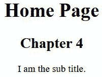

图 4.3 – 项目主页

接下来，让我们使用 `include()` 函数来导入其他应用/包的 URL 模式。

### 函数 – include()

使用 `include()` 函数导入包含自己的 `urlpatterns` 变量的额外 `urls.py` 文件。这就是我们如何编写可重用应用的 URL 模式，并在网站的 `ROOT_URLCONF` 中包含它们以供项目使用。

让我们按照以下步骤来更好地组织我们章节特定的 URL 模式：

1.  如果这个文件还没有为你创建，请继续在 `/becoming_a_django_entdev/chapter_4/` 文件夹内创建一个 `urls.py` 文件，然后向该文件添加以下 URL 模式：

    ```py
    # /becoming_a_django_entdev/chapter_4/urls.py
    from django.urls 
    import path
    from django.views.generic 
    import TemplateView
    urlpatterns = [
        path(
           'chapter-4/', 
           TemplateView.as_view(
                template_name='chapter_4/chapter_4.html'
           )
        ),
    ]
    ```

1.  在我们一直在使用的`/becoming_a_django_entdev/urls.py`主文件中，注释掉本章中创建的先前模式，并添加以下`path`语句：

    ```py
    # /becoming_a_django_entdev/urls.py
    ...
    from django.urls 
    import include, path
    urlpatterns = [
        path(
            '', 
            include(
               'becoming_a_django_entdev.chapter_4.urls'
            )
        ),
    ]
    ```

1.  将本书代码提供的`chapter_4.html`模板文件复制到你的项目中，位于`/becoming_a_django_entdev/chapter_4/templates/chapter_4/`目录下。

1.  导航到 URL `http://localhost:8000/chapter-4/`，你应该看到一个只写着**这是第四章**的空白页面，如下面的截图所示：

![Figure 4.4 – URL pattern – include()

![img/Figure_4.04_B17243.jpg]

图 4.4 – URL 模式 – include()

现在我们已经使`include()`示例工作，我们将把所有新的 URL 模式放入`/chapter_4/urls.py`文件中，并以类似的方式组织所有未来的章节。

现在，让我们练习重定向 URL。

## 重定向模式

与我们之前使用`TemplateView`类不同，我们可以编写 URL 模式来处理项目内的重定向，而无需直接在 Web 服务器中配置。这很方便，因为在传统的 Web 开发中，重定向由 Web 服务器处理，在项目中管理比在 Web 服务器中管理要容易得多。重定向可以使用 Django 提供的`RedirectView`类来处理。

我们将在`http://localhost:8000/my_path/my_unwanted_url/`路径上指定一个重定向规则，将其重定向到`http://localhost:8000/my_wanted_url/`。按照以下步骤配置你的重定向：

1.  将以下模式添加到现有的`/chapter_4/urls.py`文件中：

    ```py
    # /becoming_a_django_entdev/chapter_4/urls.py
    ...
    from django.urls 
    import include, path
    from django.views.generic 
    import (
        TemplateView,
        RedirectView
    )
    urlpatterns = [
        ...,
        path(
            'my_path/my_unwanted_url/', 
            RedirectView.as_view(
                url = 'http://localhost:8000/my_wanted_url/'
            )
        ),
    ]
    ```

1.  运行你的项目并导航到 URL `http://localhost:8000/my_path/my_unwanted_url/`。现在你应该被重定向到，并且在浏览器的地址栏中看到`http://localhost:8000/my_wanted_url/`。在页面主体中，你应该看到一个 404 响应，因为我们还没有为`my_wanted_url`路径定义 URL 模式。在执行此步骤时，这是预期的。

1.  可以包含额外的参数，例如通过以下示例中的路径来指定我们希望这是一个永久或临时重定向：

    ```py
    # /becoming_a_django_entdev/chapter_4/urls.py
    ...
    urlpatterns = [
        ...,
        path(
            'my_path/my_unwanted_url/', 
            RedirectView.as_view(
                url = 'http://localhost:8000/my_wanted_url/', 
                permanent = True
            )
        ),
    ]
    ```

Django 还允许我们定义`pattern_name`和`query_string`作为`RedirectView`类的额外参数。

注意

前面的路径有一个硬编码的值`http://localhost:8000/`，这在不是本地机器的远程环境中可能会成为一个问题。为了克服这个问题，你需要采用本章后面讨论的*创建上下文处理器*小节中提到的全局上下文变量概念。

接下来，让我们讨论使用路径转换器来监听动态路径路由。

## 使用路径转换器

`str`、`int`、`slug`、`uuid` 和 `path`。这些都是预格式化的转换器，允许多种选择，并允许在模式内使用字符串和整数。例如，`path` 路径转换器在以下代码中用于搜索 URL 可以拥有的任何字符、数字和某些符号。

要练习使用路径转换器，请按照以下步骤操作：

1.  将以下 URL 模式添加到你的 `/chapter_4/urls.py` 文件中：

    ```py
    # /becoming_a_django_entdev/chapter_4/urls.py 
    ...
    from django.urls 
    import include, path
    from django.views.generic 
    import ..., TemplateView
    urlpatterns = [
        ...,
        path(
            'my_path/<path:my_pattern>/', 
            TemplateView.as_view(
                template_name = 'chapter_4/index.html'
            )
        ),
    ]
    ```

1.  现在，导航到 URL `http://localhost:8000/my_path/testing/`，你应该看到之前看到的主页。我们看到相同的页面，因为我们指向的是相同的 `index.html` 文件，只是为了确认它正在工作。此外，如果我们导航到 URL `http://localhost:8000/my_path/2022/`，我们也会看到相同的主页。这是预期的。我们不会看到这个页面上的 `sub_title` 关键字参数的值，因为我们没有将此参数传递给这个 URL 模式。在该模板中找到的 `` 条件语句用于防止在没有 `sub_title` 的情况下发生破坏。

1.  将 *步骤 1* 中显示的现有 `my_path` 路径转换器从路径转换为 `int`，并将 `my_path` 更改为 `my_year_path`，如下面的代码所示，允许 URL `http://localhost:8000/my_year_path/2022/` 正常工作：

    ```py
    # /becoming_a_django_entdev/chapter_4/urls.py 
    ...
    from django.urls 
    import include, path
    from django.views.generic 
    import ..., TemplateView
    urlpatterns = [
        ...,
        path(
            'my_year_path/<int:my_year>/', 
            TemplateView.as_view(
                template_name = 'chapter_4/index.html'
            )
        )
    ]
    ```

1.  接下来，再次运行你的项目。使用 `int` 路径转换器时，当我们尝试导航到 `http://localhost:8000/my_year_path/testing/` 这个 URL 时，它将不再工作。相反，我们应该看到之前看到的相同的 404 调试信息。现在它只允许任何长度的数字值。这意味着当我们访问 URL `http://localhost:8000/my_year_path/2/` 或任何数字值时，我们应该看到主页图片。

当我们编写 `int:my_year` 时，此参数中的 `my_year` 可以命名为我们想要的任何名称。同样，`path:my_pattern` 参数中的 `my_pattern` 以及任何其他转换类型中的 `my_pattern` 也适用。第二个参数是用于在视图类或方法中访问该关键字参数的内容。

让我们接下来编写一个自定义路径转换器。

### 自定义路径转换器

自定义路径转换器是我们编写一个使用正则表达式来定义 Django 监听的路径的类的方式。转换器类以返回在视图中预期使用的数据类型的方式进行结构化，例如在上一小节示例中使用的 `int` 数据类型。此类还返回数据类型的另一个字符串表示形式，该表示形式是预期用于 URL 的。例如，如果我们不希望 `http://localhost:8000/my_year_path/2/` 是一个有效的 URL，并且我们只想允许四位数，可以使用自定义路径转换器来完成此操作。

按照以下步骤创建你的自定义路径转换器：

1.  在你的 `/chapter_4/` 应用程序目录中，创建一个名为 `converters.py` 的新文件。

1.  在文件内部，添加以下类，包含提供的两个方法：

    ```py
    # /becoming_a_django_entdev/chapter_4/converters.py
    class YearConverter:
        regex = '[0-9]{4}'
        def to_python(self, value):
            return int(value)
        def to_url(self, value):
            return '%04d' % value
    ```

1.  在你的`/chapter_4/urls.py`文件中，添加以下代码，该代码注册了新创建的转换器类，以便在以下代码块中突出显示的`<year:year>`处使用：

    ```py
    # /becoming_a_django_entdev/chapter_4/urls.py
    ...
    from django.urls 
    import path, register_converter
    from .converters 
    import YearConverter
    register_converter(YearConverter, 'year')
    urlpatterns = [
        ...,
        path(
            'my_year_path/<year:year>/', 
            TemplateView.as_view(
                template_name = 'chapter_4/index.html'
            )
        ),
    ]
    ```

1.  现在，运行你的项目并导航到 URL `http://localhost:8000/my_year_path/2/`；你应该看到一个 404 调试信息。这是因为前面的模式现在只会接受四位数的整数，包括`0001`和`1111`，这是预期的。

我们可以通过编写基于方法或类的视图来进一步深入了解，在该视图中比较年份是否大于，比如说，1900 年，如果不是，则返回 404 响应。我们将在本章的*处理条件响应*部分中很快讨论如何做。

接下来，让我们练习使用正则表达式路径。

### 函数 – re_path()

`re_path()`函数，也称为正则表达式路径函数，类似于`path()`函数，但允许我们传递一个格式化的正则表达式字符串作为路由参数，而无需创建自定义路径转换器。

例如，我们可以像之前一样写出相同的年示例，而不使用转换器类。在你的`/chapter_4/urls.py`文件中，添加以下路径，并注释掉之前的`my_year_path`：

```py
# /becoming_a_django_entdev/chapter_4/urls.py
```

```py
...
```

```py
from django.urls 
```

```py
import path, re_path
```

```py
...
```

```py
urlpatterns = [
```

```py
    ...,
```

```py
    re_path(
```

```py
        'my_year_path/(?P<year>[0-9]{4})/$', 
```

```py
        TemplateView.as_view(
```

```py
            template_name = 'chapter_4/index.html'
```

```py
        )
```

```py
    ),
```

```py
]
```

使用`re_path()`函数和编写自己的转换器类之间实际上是有区别的。区别在于我们在视图类或方法中使用该值时识别到的模式值的类型。使用`re_path()`函数时，该值在视图中的数据类型始终是字符串，而使用转换器类时，该值的数据类型始终是该类`def to_python()`方法定义的数据类型，这意味着如果你需要，你可以将数据类型转换为任何你想要的类型。

在我们说明使用转换器类和使用`re_path()`函数之间的数据类型差异之前，让我们将一个 URL 模式映射到一个简单视图。

# 映射 URL 模式

编写自定义视图是我们执行渲染包含我们想要的所有内容的页面所需的所有任务和服务的一种方式。在视图中，我们可以根据业务逻辑规则进行验证，以确定如何处理请求。

在这个练习中，我们将使用本章前面写下的年模式，只允许年份大于 1900。任何小于这个年份的，我们将告诉 Django 返回 404 响应。

## 使用简单视图

**简单视图**也称为基于方法的视图，是 Python 中的一个可调用函数。

按照以下步骤将映射到你的项目中的简单视图：

1.  在你的`/chapter_4/urls.py`文件中，恢复使用本章*使用路径转换器*小节中编写的相同的转换器类。参考我们将在不同文件中编写的视图`practice_view()`，如下所示：

    ```py
    # /becoming_a_django_entdev/chapter_4/urls.py 
    ...
    from django.urls 
    import ..., register_converter
    from .converters 
    import YearConverter
    from .views 
    import practice_view
    register_converter(YearConverter, 'year')
    urlpatterns = [
        ...,
        path(
            'my_year_path/<year:year>/',
            practice_view
        ),
    ]
    ```

我们与之前不同的地方是，我们将 `TemplateView` 类替换为名为 `practice_view` 的自定义简单视图类。

1.  在你的 `/becoming_a_django_entdev/chapter_4/` 目录下的 `views.py` 文件中创建一个名为 `practice_view()` 的视图方法。然后，添加以下代码：

    ```py
    # /becoming_a_django_entdev/chapter_4/views.py
    from django.template.response 
    import (
        TemplateResponse
    )
    def practice_view(request, year):
        return TemplateResponse(
            request,
            'chapter_4/my_practice_page.html',
            {
               'year': year
            }
        )
    ```

1.  将本书代码中提供的模板文件复制到你的项目中，位于 `/becoming_a_django_entdev/chapter_4/templates/chapter_4/my_practice_page.html`。

1.  导航到 URL `http://localhost:8000/my_year_path/1066/`，你应该能看到以下截图所示的练习页面：


图 4.5 – 超出范围的年份返回有效响应

我们已经接近完成了。这里看到的成功消息是预期的。我们实际上想要返回一个 404 响应而不是有效的路径，以便符合之前讨论的业务逻辑，只允许年份大于或等于 1900。因此，我们需要使用关键字参数和条件语句在处理请求时执行自定义验证，我们将在下一步中这样做。

## 在视图中使用 kwargs

要在视图方法内部访问关键字参数，我们需要将其作为该方法的定位参数传递。在示例 `def practice_view(request, year):` 中，`year` 将是定位关键字参数。由于我们在 `urls.py` 文件中定义了一个名为 `year` 的路径转换器，因此当访问具有相同名称的视图时，我们必须将 `year` 作为定位参数包含在内。如果没有这个参数，Django 在运行时会给我们一个错误。

按照以下步骤配置你的 `view` 方法：

1.  在你的 `/chapter_4/urls.py` 文件中，使用以下 URL 模式，以及我们之前创建的相同的路径转换器类。注释掉其他 `my_year_path` 模式：

    ```py
    # /becoming_a_django_entdev/chapter_4/urls.py 
    ...
    from django.urls 
    import ..., register_converter
    from .converters 
    import YearConverter
    from .views 
    import ..., practice_year_view
    register_converter(YearConverter, 'year')
    urlpatterns = [
        ...,
        path(
            'my_year_path/<year:year>/', 
            practice_year_view
        ),
    ]
    ```

1.  在你的 `/chapter_4/views.py` 文件中，编写这里提供的新方法：

    ```py
    # /becoming_a_django_entdev/chapter_4/views.py
    from django.template.response 
    import (
        TemplateResponse
    )
    ...
    def practice_year_view(request, year):
        print(type(year))
        print(year)
        return TemplateResponse(
            request, 
            'chapter_4/my_year.html', 
            {'year': year}
        )
    ```

1.  复制本书代码中提供的模板文件，位于 `/becoming_a_django_entdev/chapter_4/templates/chapter_4/my_year.html`。

1.  现在，导航到 URL `http://localhost:8000/my_year_path/2022/`，你应该看到一个成功的响应。当我们查看终端或命令行窗口时，我们会看到它告诉我们 `year` 的值是 `2022`，并且它是整数类型，`<class` `'int'>`，如图所示：

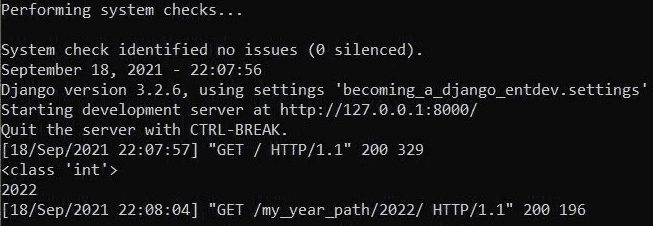

图 4.6 – 转换类 – 整数数据类型

1.  将你的 `/chapter_4/urls.py` 文件中的 URL 模式改回使用 `re_path()` 函数，而不是之前使用的自定义 `YearConverter` 示例，如下所示：

    ```py
    # /becoming_a_django_entdev/chapter_4/urls.py 
    ...
    from .views 
    import ..., practice_year_view
    #register_converter(YearConverter, 'year')
    urlpatterns = [
        ...,
        re_path(
            'my_year_path/(?P<year>[0-9]{4})/$', 
            practice_year_view
        ),
    ]
    ```

你可以注释掉之前使用的 `register_converter`。

1.  再次访问 URL `http://localhost:8000/my_year_path/2022/`。你应该能在你的终端或命令行窗口中看到输出如何从 `<class` `'int'>` 变为 `<class 'str'>`，如图所示：

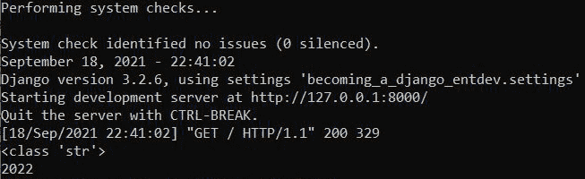

图 4.7 – 转换类 – 字符串数据类型

现在，我们实际上可以看到使用 `re_path()` 编写模式和使用创建自定义转换器类的替代方法的区别。使用 `re_path()` 函数，我们现在必须在视图中采取额外的步骤将关键字参数转换为整数，然后我们才能检查 `year` 值是否大于某个年份。如果我们不进行这种转换，我们最终会收到一个错误，告诉我们 **'>=' 不支持在 'str' 和 'int' 实例之间**。如果使用相同的正则表达式模式重复使用，这意味着将字符串转换为整数多次，每次为使用该模式的每个视图。这就是所谓的 **写两次一切** (**WET**) 设计原则，通常是不受欢迎的。编写转换器类将解决这个问题，并允许你根据 **不要重复自己** (**DRY**) 设计原则只编写一次。

让我们接下来处理条件响应。

## 处理条件响应

与我们在之前的练习中返回有效的 `TemplateResponse()` 不同，我们最终将检查 `year` `kwarg` 的值是否大于或等于 `1900`。如果 `year` 值小于 `1900`，我们将引发一个 `Http404()` 响应。使用我们之前编写的自定义路径转换器 `YearConverter` 类的 URL 模式，我们将以整数而不是字符串作为关键字参数 `year` 的数据类型，这样我们就可以使用该值执行数学运算。

按照以下步骤配置你的条件语句：

1.  在你的 `/chapter_4/urls.py` 文件中，添加以下代码，确保注释掉或删除其他 `my_year_path` 模式：

    ```py
    # /becoming_a_django_entdev/chapter_4/urls.py 
    ...
    from django.urls 
    import ..., register_converter
    from .converters 
    import YearConverter
    from .views 
    import ..., practice_year_view 
    register_converter(YearConverter, 'year')
    urlpatterns = [
        ...,
        path(
            'my_year_path/<year:year>/',
            practice_year_view
        ),
    ]
    ```

1.  在你的 `/chapter_4/views.py` 文件中，修改 `practice_year_view()` 以使其看起来像以下突出显示的代码：

    ```py
    # /becoming_a_django_entdev/chapter_4/views.py
    from django.http 
    import Http404
    from django.template.response 
    import (
        TemplateResponse
    )
    def practice_year_view(request, year):
        if year >= 1900:
            return TemplateResponse(
                request, 
                'chapter_4/my_year.html', 
                {'year': year}
            )
        else:
            raise Http404(f'Year Not Found: {year}')
    ```

1.  现在，访问 URL `http://localhost:8000/my_year_path/1066/`，你应该会看到以下 404 错误消息，这是故意的：

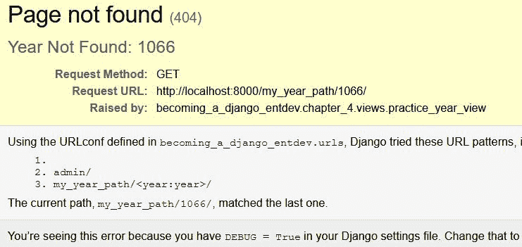


图 4.8 – 超出范围的年份返回无效响应

1.  接下来，访问一个年份大于 `1900` 的路径，例如 `http://localhost:8000/my_year_path/2022/`，你应该会看到一个成功的响应，就像这里所示的年份页面：

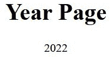


图 4.9 – 在范围内的年份返回有效响应

让我们接下来将模型链接到我们的视图和模板。

## 将模型链接到视图和模板

使用我们在 *第三章* 中创建的相同模型，*模型、关系和继承*，我们可以在模板中提供有关这些对象的信息。我们将编写一个 URL 模式，它将指向一个新的简单视图方法并显示有关车辆的信息。

按照以下步骤在模板中显示模型信息：

1.  在你的 `/chapter_4/urls.py` 文件中，包含以下 URL 模式：

    ```py
    # /becoming_a_django_entdev/chapter_4/urls.py 
    ...
    from .views 
    import ..., vehicle_view 
    urlpatterns = [
        ...,
        path(
            'vehicle/<int:id>/',
            vehicle_view,
            name = 'vehicle-detail'
        ),
    ]
    ```

我们的新视图将监听传递给我们的路径转换器的键，也称为 ID，作为该路径转换器的关键字参数。ID 用于在数据库中查找该对象，如果没有找到，则将提供 404 响应。我们不必写 `<int:id>`，可以针对路径转换器监听字符串，例如 VIN，使用 `<str:vin>`。然后，在执行数据库查询的视图中，搜索与 VIN 匹配的记录而不是车辆的 ID。欢迎你练习这两种选项。

1.  在你的 `/chapter_4/views.py` 文件中，添加以下 `import` 语句和 `view` 方法：

    ```py
    # /becoming_a_django_entdev/chapter_4/views.py
    ...
    from django.http 
    import Http404
    from ..chapter_3.models 
    import Vehicle
    def vehicle_view(request, id):
        try:
            vehicle = Vehicle.objects.get(id=id)
        except Vehicle.DoesNotExist:
            raise Http404(f'Vehicle ID Not Found: {id}')
        return TemplateResponse(
            request,
            'chapter_4/my_vehicle.html',
            {'vehicle': vehicle}
        )
    ```

前面的 `import` 语句使用了两个点（`..`），这是 Python 路径语法，用于向上导航一个目录级别并进入同级的 `chapter_3` 文件夹，以便访问在 `chapter_3` 应用中编写的模型。当你在一个项目中处理许多不同的应用时，这是一种常见的做法。之前显示的 `try`/`except` 块检查请求的对象是否存在，如果存在，则引发一个 404 响应。

1.  复制与本书代码一起提供的模板文件，位于 `/becoming_a_django_entdev/chapter_4/templates/chapter_4/my_vehicle.html`。

我们可以通过使用传递给 `TemplateResponse` 的上下文变量名称，从模板内部访问模型对象的任何字段。例如，当在模板文件中使用时，`vehicle` 上下文变量将被写成 `{{ vehicle.vin }}`。这已经在你刚刚复制到项目中的模板文件中完成了。

1.  运行你的项目并导航到 `http://localhost:8000/vehicle/4/`。你应该在这个页面上看到车辆详细信息，如下面的截图所示：

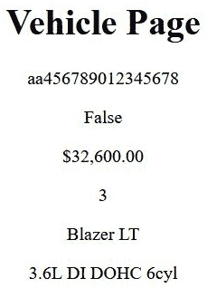

图 4.10 – 车辆 ID = 4

如果你更改 URL 中的 ID，车辆将改变。如果你激活了 VIN 作为路径转换器，那么你将导航到 `http://localhost:8000/vehicle/aa456789012345678/` 以查看相同的结果，使用 `chapter_3` 数据固定提供的数据。

现在我们有了可以工作的视图，我们可以练习在只提供路径转换器的 `kwarg` 和 `name` 属性值时获取反向 URL。

# 解析 URL

解析 URL 是将相对路径或对象转换为与唯一字段（如主键）相关的 URL 的过程。Django 的 URL 模式反向解析是一种使用我们提供的参数值生成 URL 结构的方法，而不是在位置中硬编码 URL 路径，这可能会随时间而损坏。我们可以在整个项目中使用模板标签和语句来使用 URL 模式的 `name` 参数。这被鼓励作为最佳实践，并遵循 DRY 设计原则，这使项目在演变过程中更不容易损坏。

让我们讨论如何使用 `name` 属性来获取反向解析模式。

## 命名 URL 模式

使用与我们在本章前面创建的相同的自定义 `YearConverter` 类和相同的 `my_year_path` URL 模式，执行以下操作以配置您的 URL 模式。

在您的 `/chapter_4/urls.py` 文件中，您应该有如下代码块中显示的路径，使用突出显示的 `name` 属性：

```py
# /becoming_a_django_entdev/chapter_4/urls.py 
```

```py
...
```

```py
from django.urls 
```

```py
import ..., register_converter
```

```py
from .converters 
```

```py
import YearConverter
```

```py
from .views 
```

```py
import ..., practice_year_view 
```

```py
register_converter(YearConverter, 'year')
```

```py
urlpatterns = [
```

```py
    ...,
```

```py
    path(
```

```py
        'my_year_path/<year:year>/', 
```

```py
        practice_year_view,
```

```py
        name = 'year_url'
```

```py
    ),
```

```py
]
```

现在，我们可以使用 `reverse()` 函数，我们将在下一步中这样做。

## 使用 reverse() 函数

`reverse()` 函数为我们提供了对象的相对 URL，提供了 `name` 属性值。在我们的视图中，我们将编写几个 `print` 语句来告诉我们当提供不同的输入参数时对象的相对路径。

按照以下步骤配置您的 `view` 方法：

1.  在您的 `/chapter_4/views.py` 文件中，在现有的 `import` 语句下方添加以下 `import` 语句：

    ```py
    # /becoming_a_django_entdev/chapter_4/views.py
    ...
    from django.urls import reverse
    ```

1.  在您的 `/chapter_4/views.py` 文件中，并在相同的 `practice_year_view()` 方法中，继续包含以下 `print` 语句。确保这些语句放置在执行 `return`/`raise` 调用的条件语句之前：

    ```py
    # /becoming_a_django_entdev/chapter_4/views.py
    ...
    def practice_year_view(request, year):
        ...
        print(reverse('year_url', args=(2023,)))
        print(reverse('year_url', args=(2024,)))
        ...( Repeat as desired )...
    ```

1.  运行您的项目并使用此模式导航到任何 URL，例如 `http://localhost:8000/my_year_path/2022/`。在您的终端或命令行窗口中打印的内容将是每个 URL 的格式化相对路径，如下面的屏幕截图所示：

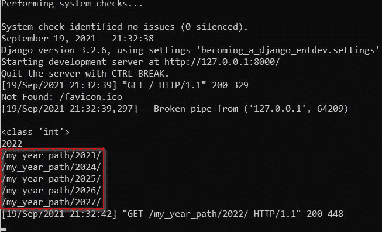

图 4.11 – 命名 URL – 视图使用

`reverse()` 方法是我们如何通过传递给该函数的参数来查找 URL。`reverse()` 方法可以在项目的任何地方导入和使用，而不仅仅是视图类或方法内部。此方法接受两个位置参数，第一个是 URL 模式的名称，例如前一个示例中突出显示的 `year_url`，这是必需的。第二个位置参数是传递给 `reverse()` 方法的关键字参数，有时也是必需的。如果为 URL 模式定义了多个路径转换器，它们将按照为该模式创建的顺序包含在 `reverse()` 方法中，并用逗号分隔。请记住，与每个路径转换器相关的关键字参数的位置很重要，并且遵循为该 URL 模式创建关键字参数的顺序。

## 使用  模板标签

`` 模板标签的工作方式与 `reverse()` 方法类似，但它是直接在模板中使用的。这个标签也接受两个位置参数，就像 `reverse()` 方法一样。第一个参数监听 URL 模式的名称，第二个是参数列表。这些参数在使用此模板标签时用空格分隔。额外的参数按照为该 URL 模式创建路径转换器的顺序提供。当使用 `` 标签时，可以包含使用和未使用关键字语法的参数。例如，以下两个标签及其使用方式都是有效的：

```py
# Dummy Code
```

```py

```

```py

```

上述代码块中的第二个示例将在我们实际上为 URL 模式创建了三个路径转换器（`year`、`month` 和 `day`）时使用。

如果我们创建了三个上下文变量 `year`、`month` 和 `day` 以在模板中使用，它们也可以用上下文变量替换，如下面的代码块所示：

```py
# Dummy Code
```

```py

```

之前显示的代码仅用于说明目的，如果你在没有构建相关的 URL 模式和视图的情况下尝试使用它，它将会出错。

按照以下步骤配置你的项目以进行此练习：

1.  在你现有的 `/chapter_4/my_year.html` 文件中，取消注释以下提供的超链接，这些链接是在你将此文件复制到项目时随书代码一起提供的，或者手动添加，如所示。它们使用 Django 的 `` 模板标签进行格式化：

    ```py
    # /becoming_a_django_entdev/chapter_4/templates/chapter_4/my_year.html
    ...
    <html>
        ...
        <body style="text-align:center">
            ...
            <br /> <br />
            <a href="">2023</a>
            <a href="">2024</a>
            ...( Repeat as desired )...
        </body>
    </html>
    ```

1.  运行你的项目并导航到相同的 URL，`http://localhost:8000/my_year_path/2022/`，你现在应该能看到以下截图所示的内容，其中超链接已渲染到页面中：

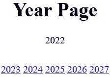

图 4.12 – 命名 URL – 模板使用

每个渲染的超链接都指向 `href="/my_year_path/####/"` 中的相关相对路径。我们可以继续修改这两个示例，将绝对 URL 而不是相对 URL 格式化。这意味着我们将包括 URL 的 `www.example.com` 部分。我们将在本章稍后的标题为 *解析绝对 URL* 的部分中讨论这一点。接下来，让我们处理尾部斜杠。

## 处理尾部斜杠

在 Django 中，我们可以结合使用 `re_path()` 函数和自定义的 `YearConverter` 类来编写一个接受带有和没有尾部斜杠 `/` 的路径的 URL 模式。这意味着我们可以编写一个 URL 来监听 `www.example.com/my_path/`，同时也会允许 `www.example.com/my_path` 渲染成功，本质上是将两个路径合并为一个语句。

要处理你的尾部斜杠，在你的 `/chapter_4/urls.py` 文件中，添加以下路径并取消注释所有其他 `my_year_path` 示例：

```py
# /becoming_a_django_entdev/chapter_4/urls.py
```

```py
...
```

```py
from django.urls import (
```

```py
    ..., 
```

```py
    re_path, 
```

```py
    register_converter
```

```py
)
```

```py
from .converters 
```

```py
import YearConverter
```

```py
from .views 
```

```py
import ..., practice_view
```

```py
register_converter(YearConverter, 'year')
```

```py
urlpatterns = [
```

```py
    ...,
```

```py
    re_path(
```

```py
        r'^my_year_path/(?P<year>[0-9]+)/?$', 
```

```py
        practice_view
```

```py
    ),
```

```py
]
```

`route`在`re_path()`函数中定义为`r'^my_year_path/(?P<year>[0-9]+)/?$'`，它以这种方式构建路径，以便监听可选的前斜杠。`year`也仅使用标签名编写。如果我们像在之前的练习中那样使用`<year:year>`来编写这个语句，那么我们将在终端或命令行窗口收到以下错误信息：

```py
django.core.exceptions.ImproperlyConfigured: "^my_year_path/(?P<year:year>[0-9]+)/?$" is not a valid regular expression: bad character in group name 'year:year' at position 18
```

由于我们通过正则表达式操作监听尾随斜杠，因此无需修改`settings.py`文件中的值，如`APPEND_SLASH`。为了实际使用`APPEND_SLASH`变量，Django 需要安装`common`中间件。您可以在以下链接中了解更多关于使用此方法而不是正则表达式方法的信息：https://docs.djangoproject.com/en/4.0/ref/settings/#append-slash。使用之前显示的正则表达式基本结构，我们不需要担心中间件。

既然我们已经解决了相对 URL，接下来让我们解决绝对 URL。

# 解决绝对 URL

一个绝对 URL 包括 URL 的方案、主机和端口号，如下所示，`scheme://host:port/path?query`。这是一个绝对 URL 的例子：[`www.example.com:8000/my_path?query=my_query_value`](https://www.example.com:8000/my_path?query=my_query_value)。

接下来，我们将介绍使用自定义上下文处理器的实践，同时解决一个绝对 URL。

## 创建上下文处理器

上下文处理器在许多方面都很有用：它们提供了在项目中的所有模板和视图中共享的全局上下文。或者，在视图中创建的上下文只能由使用该视图的模板使用，而不能由其他模板使用。在下一个示例中，我们将创建并激活一个自定义的全局上下文处理器，我们将添加站点的基 URL。我们将上下文变量命名为`base_url`，指的是整个项目站点中找到的 URL 的`scheme://host:port`。

按照以下步骤创建您的上下文处理器：

1.  在您的`settings.py`文件所在的同一文件夹中，创建一个名为`context_processors.py`的新文件。

1.  在此文件中，放置以下提供的代码，这将根据我们在其上运行项目的环境构建站点的`http://localhost:8000`部分：

    ```py
    # /becoming_a_django_entdev/context_processors.py
    def global_context(request):
        return {
            'base_url': request.build_absolute_uri(
                '/'
            )[:-1].strip('/'),
        }
    ```

上下文作为键值对的字典返回，我们可以打包我们想要的任意多的键。

1.  为了在运行时注册此上下文处理器，我们需要将其添加到`settings.py`文件中的`TEMPLATES`变量下。包括您的`global_context()`方法的路径，如下所示：

    ```py
    # /becoming_a_django_entdev/settings.py
    TEMPLATES = [
    {
            ...
            'OPTIONS': 
            {
                'context_processors': [
                    ...,
    'becoming_a_django_entdev.context_processors.global_context',
                ],
            },
    },]
    ```

将您的自定义上下文处理器放置在前面列表中的任何现有`context_processors`下面。

上下文处理器也可以在项目中的各个应用程序中分解。将你创建的每个附加上下文处理器包含在前面列表中，并按所需顺序排列。此外，本书的代码中还包含了一些额外的全局上下文处理器变量，以供额外练习。

让我们接下来在模板中使用我们新创建的`base_url`上下文。

### 在模板中使用上下文处理器数据

使用``模板标签，我们可以修改超链接以使用我们在上一个示例中提供的上下文，该上下文称为`global_context()`。

按照以下步骤配置你的模板：

1.  在你的`/chapter_4/urls.py`文件中，添加以下路径并注释掉所有其他`my_year_path`示例：

    ```py
    # /becoming_a_django_entdev/chapter_4/urls.py
    ...
    from django.urls 
    import ..., register_converter
    from .converters 
    import YearConverter
    from .views 
    import ..., practice_year_view 
    register_converter(YearConverter, 'year')
    urlpatterns = [
        ...,
        path(
    'my_year_path/<year:year>/', 
            practice_year_view,
            name = 'year_url'
        ),
    ]
    ```

1.  在你的`my_year.html`文件中，编写/取消注释以下超链接示例：

    ```py
    # /becoming_a_django_entdev/chapter_4/templates/chapter_4/my_year.html
    ...
    <html>
        ...
        <body style="text-align:center">
            ...
            <br /> <br />
            <a href="{{ base_url }}">2023</a>
            <a href="{{ base_url }}">2024</a>          
            ...( Repeat as desired )...
        </body>
    </html>
    ```

1.  再次导航到`http://localhost:8000/my_year_path/2022/`。现在每个超链接的`href`属性将看起来像`href="http://localhost:8000/my_year_path/####/"`，而不是之前渲染的内容，即`href="/my_year_path/####/"`。

当我们添加了`{{ base_url }}`模板变量时，我们引用了提供的上下文字典的键。

## 从请求对象中

在这个练习中，我们将使用`request`对象解析绝对 URL。按照以下步骤在你的项目中执行：

1.  在你的`/chapter_4/views.py`文件中，在你的现有`practice_year_view()`方法中，包含以下`print`语句。这些语句将使用`request`对象中提供的`build_absolute_uri()`方法，作为 Django 框架的一部分。这将返回给我们反向查找的绝对 URL：

    ```py
    # /becoming_a_django_entdev/chapter_4/views.py
    ...
    from django.urls 
    import reverse
    def practice_year_view(request, year):
        ...
        print(
            request.build_absolute_uri(
                reverse('year_url', args=(2023,))
            )
        )
        print(
            request.build_absolute_uri(
                reverse('year_url', args=(2024,))
            )
        )
        ...( Repeat as desired )...
    ```

前面的`print`语句还利用了在`django.urls`库中找到的`reverse()`方法。

1.  运行你的项目并导航到`http://localhost:8000/my_year_path/2022/`。你应该在终端或命令行窗口中看到以下路径被打印出来：

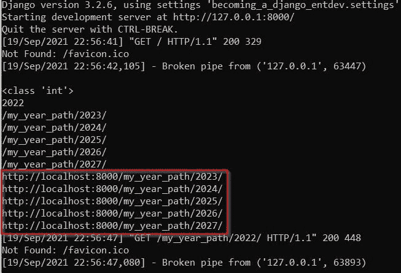

图 4.13 – 命名 URL – 视图使用 – 绝对 URL

注意

当前页面的相对路径可以通过使用`request.path`从`request`对象中检索。在这个页面上，它将返回`/my_year_path/2022/`。使用`print(request.build_absolute_uri())`而不使用`reverse()`查找函数将返回该特定请求的绝对路径。

让我们练习在模型类内部查找绝对 URL。

## 在模型类内部

我们将扩展相同的`vehicle_view()`方法来进行下一个示例，从现有对象中获取格式化的 URL。我们将在这个与我们在*第三章*，“模型、关系和继承”中工作的相同的`/chapter_3/models.py`文件中工作。

按照以下步骤配置你的模型类：

1.  在你的`/chapter_3/models.py`文件中，向现有的`Vehicle`模型类添加以下两个方法（`get_url()`和`get_absolute_url()`）：

    ```py
    # /becoming_a_django_entdev/chapter_3/models.py 
    class Vehicle(models.Model):
        ...
        def get_url(self):
            from django.urls import reverse
            return reverse(
                'vehicle-detail', 
                kwargs = {'id': self.pk}
            )
        def get_absolute_url(self, request):
            from django.urls import reverse
            base_url = request.build_absolute_uri(
                '/'
            )[:-1].strip('/')
            return base_url + reverse(
                'vehicle-detail', 
                kwargs = {'id': self.pk}
            )
    ```

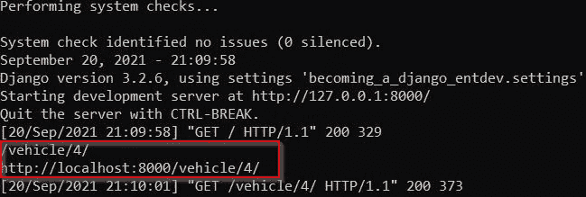

1.  在你的`/chapter_4/views.py`文件中，在现有的`vehicle_view()`方法中，在`except`捕获之后，作为`else`捕获的一部分添加以下`print`语句：

    ```py
    # /becoming_a_django_entdev/chapter_4/views.py
    ...
    from django.http 
    import Http404
    from ..chapter_3.models 
    import Vehicle
    ...
    def vehicle_view(request, id):
        try:
            vehicle = Vehicle.objects.get(id=id)
        except Vehicle.DoesNotExist:
            raise Http404(f'Vehicle ID Not Found: {id}')
        else:
            print(vehicle.get_url())
            print(vehicle.get_absolute_url(request))
        ...
    ```

`else`捕获意味着它所搜索的`Vehicle`对象没有错误地找到。请记住，在`vehicle_view()`方法的末尾留下我们之前写的相同的`return`语句。

1.  运行你的项目，导航到`http://localhost:8000/vehicle/4/`。在你的终端或命令行窗口中，你应该看到在`vehicle_view()`方法中查找的对象的两个不同的相对和绝对路径，如下所示：

图 4.14 – 模型 URLs

![Figure 4.14 – Model URLs

按照以下步骤配置你的基于类的视图：

我们一直在练习简单的视图，也称为基于方法视图。许多项目需要视图提供更多功能和可用性，这可以通过基于类的视图来实现，我们将在下一节中创建它。

# 复杂视图的工作

视图方法适用于许多不同的情况。对于更健壮和大规模的项目，我们可以应用一些技巧来使这些视图在复杂的使用案例中更具适应性。在编写可适应和可重用的应用程序时，我们使用基于类的视图。

## 基于类的视图

使用基于类的视图，我们可以编写易于重用和扩展的代码。就像我们在*第三章*“模型、关系和继承”中扩展模型一样，我们可以以完全相同的方式扩展视图类，而基于函数的视图方法则无法提供这种能力。本书源代码中提供了两个模板，用于下一项练习。这两个文件与`my_vehicle.html`文件完全相同，只是每个文件中`<h1>`标签的标题分别更改为**VehicleView Class 1**和**VehicleView Class 2**，这样当我们运行以下示例时，我们可以看到它们之间的差异。

这些方法导入本节之前介绍的`reverse()`函数，以获取对象的 URL。`import`语句被添加到方法本身，而不是在本文档的顶部，以便在使用这些模型类方法时更好地处理性能。第一个方法`get_url()`用于返回对象的相对 URL 路径，而另一个方法`get_absolute_url()`旨在返回对象的绝对路径。

1.  将名为`my_vehicle_class_1.html`和`my_vehicle_class_2.html`的文件复制到本书提供的代码中的`/becoming_a_django_entdev/chapter_4/templates/chapter_4/`目录，并将它们放入你的项目中的同一目录。

1.  在你的`/chapter_4/urls.py`文件中，添加以下`import`语句和 URL 模式：

    ```py
    # /becoming_a_django_entdev/chapter_4/urls.py
    ...
    from .views 
    import ..., VehicleView
    urlpatterns = [
        ...,
        path(
            'vehicle/<int:id>/', 
            VehicleView.as_view(),
            name = 'vehicle-detail'
        ),
    ]
    ```

不要忘记注释掉之前实验这个模式之前写的旧的`/vehicle/` URL 模式。

1.  在你的 `/chapter_4/views.py` 文件中，创建一个基于类的视图 `VehicleView` 并添加 `import` 语句，如下所示：

    ```py
    # /becoming_a_django_entdev/chapter_4/views.py
    ...
    from django.http 
    import Http404
    from django.template.response 
    import (
        TemplateResponse
    )
    from django.views.generic 
    import View
    from ..chapter_3.models 
    import Vehicle
    ...
    class VehicleView(View):
        template_name = 'chapter_4/my_vehicle_class_1.html'
    ```

1.  将以下 `get()` 方法添加到你的 `VehicleView` 类中：

    ```py
    # /becoming_a_django_entdev/chapter_4/views.py
    ...
    class VehicleView(View):
        ...
        def get(self, request, id, *args, **kwargs):
            try:
                vehicle = Vehicle.objects.get(id=id)
            except Vehicle.DoesNotExist:
                raise Http404(
                    f'Vehicle ID Not Found: {id}'
                )
            return TemplateResponse(
                request,
                self.template_name,
                {'vehicle': vehicle}
            )
    ```

1.  将以下 `post()` 方法及其导入添加到 `VehicleView` 类中：

    ```py
    # /becoming_a_django_entdev/chapter_4/views.py
    ...
    from django.http 
    import ..., HttpResponseRedirect
    ...
    class VehicleView(View):
        ...
        def post(self, request, *args, **kwargs):
            return HttpResponseRedirect(
                '/success/'
            )
    ```

1.  运行你的项目并导航到 `http://localhost:8000/vehicle/4/`。现在你应该看到主标题显示为 **VehicleView Class 1**。

1.  接下来，修改 URL 模式以覆盖 `template_name`，使用以下示例：

    ```py
    # /becoming_a_django_entdev/chapter_4/urls.py
    ...
    from .views 
    import ..., VehicleView
    urlpatterns = [
        ...,
        path(
            'vehicle/<int:id>/', 
            VehicleView.as_view(
                template_name = 'chapter_4/my_vehicle_class_2.html'
            ),
            name = 'vehicle-detail'
        ),
    ]
    ```

1.  现在，重新运行你的项目并导航到 `http://localhost:8000/vehicle/4/` 的 URL。这次你应该在页面上看到标题显示为 **VehicleView Class 2**。

在 *步骤 4* 中描述的 `def get()` 子方法是将方法视图中的所有代码移动到那里的地方。它也是唯一必需的方法。其他可选方法，如 `def post()`，在处理表单对象、执行回发响应时使用。它还可以用于将用户重定向到成功页面，这在 *步骤 5* 的代码中有所说明，但按照我们现在使用这个类的方式，你永远不会触发 Django 的这个重定向，这是可以预料的。我们将在 *第五章* *Django 表单* 中更深入地讨论这个问题。当我们处理 URL 的位置关键字参数时，它们被传递到视图类中，其中 `id` 属性是在前面的 `get()` 方法中编写的。如果你有多个关键字参数，它们将按照在 URL 模式中的顺序添加到 `id` 之后。

我们执行了 *步骤 7* 和 *步骤 8*，只是为了检查这个功能是否正常工作，并看看我们如何仍然可以像在本章早期那样覆盖默认设置。接下来，让我们扩展基于类的视图，也称为继承。

## 扩展基于类的视图

扩展基于类的视图，也称为继承，与我们在 *第三章* *模型、关系和继承* 中扩展模型类的方式完全相同。通过将第一个类扩展到第二个类，我们可以显示相同的标题在页面上，从而消除了在 URL 模式本身中定义 `template_name` 的需要，以及其他许多好处。

按照以下步骤扩展你的类：

1.  在你的 `/chapter_4/urls.py` 文件中，取消注释之前的 URL 模式，并使用提供的代码编写一个新的模式，现在我们使用 `VehicleView2` 作为视图类：

    ```py
    # /becoming_a_django_entdev/chapter_4/urls.py
    ...
    from .views 
    import ..., VehicleView2
    urlpatterns = [
        ...,
        path(
            'vehicle/<int:id>/', 
            VehicleView2.as_view(), 
            name = 'vehicle-detail'
        ),
    ]
    ```

1.  接下来，在你的 `/chapter_4/views.py` 文件中，添加以下由 `VehicleView` 类构造的 `VehicleView2` 类：

    ```py
    # /becoming_a_django_entdev/chapter_4/views.py
    ...
    class VehicleView2(VehicleView):
        template_name = 'chapter_4/my_vehicle_class_2.html'
    ```

1.  运行你的项目并导航到 URL `http://localhost:8000/vehicle/4/`。你应该在页面上看到相同的标题，**VehicleView Class 2**。

上述示例只是对现有的 `VehicleView` 类的一个非常简单的扩展，展示了如何扩展视图类。在这个练习中，我们唯一更改/覆盖的是 `template_name` 变量，以展示这个概念。

接下来，让我们学习异步视图的用途。

## 异步视图

Django 还提供了对异步视图的支持，这是 Django 3.1 中首次引入的功能。异步视图是可以由单个处理线程处理并在同一时间运行的视图。这些用于构建更好的多线程应用程序。传统的 Django 项目默认使用**Web 服务器网关接口**（**WSGI**）。要实际使用基于函数和类的异步视图，我们需要配置项目和服务器以使用**异步服务器网关接口**（**ASGI**）而不是 WSGI。由于这需要配置服务器和可能的主机提供商进行相当多的工作，我们将跳过提供本节示例，但如果这是您项目中的需求，您可以从这里开始：[`docs.djangoproject.com/en/4.0/topics/async/`](https://docs.djangoproject.com/en/4.0/topics/async/)。

到目前为止，我们一直在使用本书提供的预构建模板和代码来演示核心编程概念。接下来，让我们探索如何自己构建这些模板。

# 与模板一起工作

Django 模板语言为我们提供了一套模板标签和模板过滤器，用于在模板中直接执行简单操作。这使得执行简单的逻辑操作变得容易，例如 Python 操作。标签和过滤器实际上是两种相似的东西。Django 模板语言可以与 Shopify 的 Liquid 语法紧密比较，类似于 ASP.NET 框架中使用的 Razor 语法，但 Django 模板语言使用起来和阅读起来要简单一些。Django 还允许我们在项目中创建自定义标签和过滤器。自定义过滤器最常用于转换单个上下文变量。自定义标签提供了更强大和复杂的用例。要详细了解所有存在的模板标签和模板过滤器，请阅读官方 Django 文档，链接如下：[`docs.djangoproject.com/en/4.0/ref/templates/builtins/`](https://docs.djangoproject.com/en/4.0/ref/templates/builtins/)。

接下来，我们将简要介绍最常用的模板标签和过滤器功能。

## 模板标签

我们可以通过将模板分解成更小的组件来使其结构更像是应用程序。这些组件可以在其他模板中互换使用。例如，我们可以编写一个包含页面`<head>`和`<body>`元素的基模板，然后拆分出子模板，这些子模板结构化每个模板的正文内容。我们可以在文档的`<head>`和`<body>`中创建区域，以便将动态文本和 HTML 传递到这些区域中，例如`<title>`标签。

对于下一个示例，让我们使用 ``、`` 和 `` 模板标签来创建两个模板文件，演示如何将模板分解成可管理的部分。

按照以下步骤配置你的模板标签：

1.  在你的 `/chapter_4/urls.py` 文件中，注释掉其他路径，并包含以下路径：

    ```py
    # /becoming_a_django_entdev/chapter_4/urls.py
    ...
    from .views 
    import ..., TestPageView
    urlpatterns = [
        ...,
        path(
            'test_page_1/', 
            TestPageView.as_view(), 
            name = 'test-page'
        ),
    ]
    ```

1.  在你的 `/chapter_4/views.py` 文件中，创建以下基于类的视图 `TestPageView`，使用这里提供的代码：

    ```py
    # /becoming_a_django_entdev/chapter_4/views.py
    ...
    from django.template.response 
    import (
        TemplateResponse
    )
    from django.views.generic 
    import View
    ...
    class TestPageView(View):
        template_name = 'chapter_4/pages/test_page_1.html'
        def get(self, request, *args, **kwargs):
            return TemplateResponse(
                request, 
                self.template_name, 
                {
                    'title': 'My Test Page 1',
                    'page_id': 'test-id-1',
                    'page_class': 'test-page-1',
                    'h1_tag': 'This is Test Page 1'
                }
            )
    ```

在 `TestPageView` 类中，我们定义了一个默认的 `template_name` 为 `'chapter_4/pages/test_page_1.html'`。在 `get()` 方法中，我们传递硬编码的上下文变量用于此演示。在实际场景中，这些信息将在执行生成这些值的逻辑后生成。

1.  创建 `/becoming_a_django_entdev/chapter_4/templates/chapter_4/pages/test_page_1.html` 文件，并添加以下代码：

    ```py
    # /becoming_a_django_entdev/chapter_4/templates/chapter_4/pages/test_page_1.html
    
    
    {{ title }}
    
    
    {{ page_id }}
    {{ block.super }} {{ page_class }}
    
        
            <h1>{{ h1_tag }}</h1>
        
            <h1>Title Not Found</h1>
        
    
    ```

此模板以 `` 模板标签开始，表示我们实际上想从 `/chapter_4/base/base_template_1.html` 文件开始，尽管我们在视图类中指定了 `test_page_1.html` 文件。然后，在这个文件中找到的每个 `` 标签，我们都会覆盖或添加到我们在扩展的 `base_template_1.html` 文件中找到的相同 ``。我们将视图定义中定义的 `{{ title }}` 的值传递到 `/chapter_4/pages/test_page_1.html` 文件的 `` 标签中。可以使用 `{{ block.super }}` 标签来保留 `base_template_1.html` 文件中相同块的内容。如果没有这个标签，父块中的所有代码都将被覆盖。可以在任何块中编写 HTML；在随后的 *步骤 5* 中显示的 `` 块是页面内容的主要部分。

1.  创建 `/chapter_4/base/base_template_1.html` 文件，并添加以下代码：

    ```py
    # /becoming_a_django_entdev/chapter_4/templates/chapter_4/base/base_template_1.html
    
    <!DOCTYPE html>
    <html lang="en" xmlns="http://www.w3.org/1999/xhtml">
        <head>
            <meta charset="utf-8" />
            <title>My Page Title</title>
            <link rel="stylesheet" href="{{ base_url }}">
            
            <script defer type="text/javascript" src="img/site-js.js' %}"></script>
        </head>
    </html>
    ```

1.  在你刚刚创建的同一 `/chapter_4/base/base_template_1.html` 文件中，插入以下提供的主体代码，位于现有的 `</head>` 标签下方：

    ```py
    # /becoming_a_django_entdev/chapter_4/templates/chapter_4/base/base_template_1.html
    ...
        </head>
        <body id="" class="base-template-class" style="text-align: center;">
            
                
            
            
                <div class="site-container">
                    <div class="body-content">
                        
                        
                    </div>
                    
                        
                    
                </div>
            
            
        </body>
    </html>
    ```

1.  将本书代码提供的 `/chapter_4/headers/header_1.html` 和 `/chapter_4/footers/footer_1.html` 文件复制到你的项目中的同一目录。

1.  将本书代码提供的 `/chapter_4/static/chapter_4/css/site.css` 和 `/chapter_4/static/chapter_4/js/site-js.js` 文件复制到你的项目同一目录。

1.  运行你的项目，并导航到 `http://localhost:8000/test_page_1/`。你应该在你的浏览器窗口中看到以下信息：

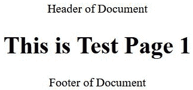

图 4.15 – 扩展模板

在前面的步骤中，页面的主要 HTML 结构被分解为头部、主体内容和页脚格式。之前使用的``标签展示了如何与这些文件进行不同的操作。给任何``标签添加`with`属性，我们就可以从父模板传递上下文到该文件。这就是对前面的页脚文件所做的那样。这意味着我们可以在不使用上下文处理器或重复编写代码的情况下使上下文可用。前面的 HTML 结构是以一种方式组织的，允许我们在需要或想要修改``标签内的所有内容时变得复杂。为了做到这一点，我们会在扩展此模板文件的文件中再次编写``块，并在那里编写修改后的代码。这正是*步骤 3*为我们所做的事情，使用了``标签。

让我们接下来处理模板过滤器。

## 模板过滤器

模板过滤器是一种转换上下文变量值的方法。它们可以执行诸如使用`{{ context_variable|upper }}`或`{{ context_variable|lower }}`过滤器将字符串转换为大写或小写，或者使用`{{ my_list|length }}`过滤器查找列表中的项目数量，甚至使用`{{ my_time|time:"` `n/j/Y" }}`过滤器格式化时间等操作。当使用`time`过滤器时，没有必要指定该过滤器的`:" n/j/Y"`参数。即使没有这些指定，Django 也会默认使用你在`settings.py`文件中指定的`TIME_FORMAT`变量。要了解所有可用的过滤器，请访问以下官方 Django 文档：https://docs.djangoproject.com/en/4.0/ref/templates/builtins/#built-in-filter-reference。

让我们来看看自定义标签和过滤器。

## 自定义标签和过滤器

在前面的*图 4.10*中，我们看到了车辆的制造商值以数字**3**的形式显示。这是一个完美的例子，说明了我们可以编写一个自定义过滤器，该过滤器接受一个数值并返回该值的字符串表示。

按照以下步骤创建你的自定义过滤器：

1.  在`/becoming_a_django_entdev/chapter_4/`目录中创建一个名为`templatetags`的新文件夹。

1.  在这个文件夹中创建一个名为`chapter_4.py`的新文件，并在该文件中放置以下代码：

    ```py
    # /becoming_a_django_entdev/chapter_4/templatetags/chapter_4.py
    from django.template 
    import Library
    register = Library()
    @register.filter(name = 'vehicle_make')
    def vehicle_make(value):
        from ...chapter_3.models import MAKE_CHOICES
        for i, choice in enumerate(MAKE_CHOICES):
            if i == value:
                try:
                    return choice[1]
                except ValueError:
                    pass
        return ''
    ```

在这里，我们编写了一个非常简单的名为`vehicle_make()`的方法，它接受数字值`3`，并在模板中使用时返回字符串表示的`Chevrolet`。在这个方法中，我们使用 Python 路径语法导入我们在*第三章*中创建的`MAKE_CHOICES`变量，该变量位于*模型、关系和继承*部分的*可变对象与不可变对象*小节中。

1.  确保你已经取消注释了之前的 URL 模式，并使用以下代码块中显示的模式：

    ```py
    # /becoming_a_django_entdev/chapter_4/urls.py 
    ... 
    from .views import ..., vehicle_view 
    urlpatterns = [ 
        ..., 
        path( 
            'vehicle/<int:id>/', 
            vehicle_view, 
            name = 'vehicle-detail' 
        ), 
    ]
    ```

1.  在你现有的`/chapter_4/my_vehicle.html`文件中，将`{{ vehicle.make }}`更改为以下代码块中突出显示的语句，并将`chapter_4`模板标签库添加到你的``标签中：

    ```py
    # /becoming_a_django_entdev/chapter_4/templates/chapter_4/my_vehicle.html
    
    ...
            
                ...
                <p>{{ vehicle.make }}</p>
                <p>{{ vehicle.make|vehicle_make }}</p>
                ...
            
    ...
    ```

为了使用我们注册的模板过滤器，我们使用``标签将其导入 HTML 文件，其中我们加载的模板标签集的名称是我们创建在任何`templatetags`文件夹中的应用程序中的 Python 文件名。

1.  现在，确保你的项目正在运行，你可以导航到`http://localhost:8000/vehicle/4/`这个 URL，以查看我们的车辆现在显示为**雪佛兰**。

通过将`@register.filter(name = 'my_filter')`更改为`@register.tag(name = 'my_tag')`，我们可以创建自定义模板标签而不是自定义过滤器。在这种情况下，标签可以在模板中使用，类似于``。要了解更多关于编写自己的模板标签的复杂性以及它们如何在项目中有用的信息，请访问关于该主题的官方文档，链接如下：https://docs.djangoproject.com/en/4.0/howto/custom-template-tags/#writing-custom-template-tags。

接下来，让我们添加一些自定义错误页面。

## 错误页面模板

Django 提供了一个非常简单的方法来创建自定义错误页面模板，用于处理 400、403、404 和 500 等错误。其他错误，如`templates`目录中的`400.html`、`403.html`、`404.html`和`500.html`，只要它们没有被放置在子文件夹中。这四个模板文件与本书的代码一起提供，并遵循本章标题为*模板标签*的子节中描述的设计模式。为了查看自定义调试模板，我们必须在`settings.py`文件中关闭`DEBUG`。

按照以下步骤配置你的错误页面：

1.  将本书代码中提供的`/becoming_a_django_entdev/chapter_4/templates/`目录中的四个错误页面模板文件复制到你的项目相同目录中。这四个文件是`400.html`、`403.html`、`404.html`和`500.html`，同时也要复制同一目录中的`base_error.html`文件。

1.  在你的`settings.py`文件中，将以下值更改为`False`：

    ```py
    # /becoming_a_django_entdev/settings.py
    ...
    DEBUG = False
    ```

1.  确保你的虚拟环境已激活，并运行此处显示的`collectstatic`命令，以便访问到目前为止创建的静态文件：

    ```py
    (virtual_env) PS > python manage.py collectstatic
    ```

1.  当`DEBUG`关闭时，每次静态文件更改，我们必须运行`collectstatic`命令，以便在浏览器中看到更改的反映。

1.  现在，运行你的项目并导航到网站上任何不存在的 URL，例如我们尚未创建 URL 模式的 URL，如`http://localhost:8000/asdfasdf`。你应该在你的浏览器窗口中看到以下消息，而不是我们习惯看到的调试错误消息，如*图 4.2*所示：


图 4.16 – 自定义错误页面

# 摘要

到目前为止，我们可能已经构建了一个看似完整的项目，但实际上，一个应用程序将包含比本章所涵盖的内容多得多的东西。我们所拥有的，是一种将 URL 路径路由到视图并渲染每个模板中不同上下文的方法。我们学习了如何在视图中查询数据库以获取我们在模板中想要渲染的数据。我们甚至涵盖了处理和生成错误页面的不同方式，或者简单地将 URL 重定向到另一个路径。我们还使用了基于类的视图来编写可重用的类结构，从而使项目在长期中更能适应变化。

在下一章中，我们将讨论如何结合本章所学的基于函数和基于类的视图以及模板，来使用表单对象。
