# 第九章：*第九章*：Django 测试

本章致力于测试和调试 Django 项目。Django 在其框架中内置了广泛的测试类，用于编写自动化测试脚本。随着我们构建每个应用程序和/或项目的每个组件，我们可以在任何时候运行一个命令来确保每个组件仍然按预期工作。这对于 **回归测试** 非常有用，这意味着测试新的或更改的组件，确保它不会影响现有组件或整个系统的预期行为。在本章中我们将涵盖的大部分内容中，我们不需要安装任何第三方包。我们将最后涵盖的是 **Django 调试工具栏**（**DjDT**），它确实需要我们安装一个第三方包才能使用。

在本章中，我们将涵盖以下主题：

+   编写自动化测试脚本

+   创建单元测试用例

+   测试视图类及其 get 和 post 方法

+   测试需要用户认证的视图类

+   测试 Django REST API 端点

+   安装 DjDT，一个用于调试的工具

# 技术要求

要使用本章中的代码，你需要在本地机器上安装以下工具：

+   Python 版本 3.9 – 作为项目的底层编程语言

+   Django 版本 4.0 – 作为项目的后端框架

+   pip 包管理器 – 用于管理第三方 Python/Django 包

我们将继续使用在 *第二章* 中创建的解决方案，*项目配置*。然而，使用 Visual Studio IDE 并非必需。主要项目本身可以使用其他 IDE 运行，或者从项目根目录（其中包含 `manage.py` 文件）独立使用终端或命令行窗口运行。无论你使用什么编辑器或 IDE，都需要一个虚拟环境来与 Django 项目一起工作。如何创建项目和虚拟环境的说明可以在 *第二章* 的 *项目配置* 中找到。你需要一个数据库来存储项目中的数据。前几章的示例选择了 PostgreSQL；然而，你可以为你的项目选择任何数据库类型来与本章的示例一起工作。

我们还将使用在 *第三章* 的 *模型、关系和继承* 部分提供的 Django 固件数据，标题为 *加载 chapter_3 数据固件*。请确保 `chapter_3` 固件已加载到你的数据库中。如果这已经完成，则可以跳过下一个命令。如果你已经创建了在 *第三章* 的 *模型、关系和继承* 中找到的表，并且尚未加载该固件，那么在激活你的虚拟环境后，运行以下命令：

```py
(virtual_env) PS > python manage.py loaddata chapter_3
```

本章创建的所有代码都可以在本书的 GitHub 仓库中找到：[`github.com/PacktPublishing/Becoming-an-Enterprise-Django-Developer`](https://github.com/PacktPublishing/Becoming-an-Enterprise-Django-Developer)。本章中展示的大部分代码可以在`/becoming_a_django_entdev/becoming_a_django_entdev/chapter_9/`目录中找到。

查看以下视频，了解*代码的实际应用*：[`bit.ly/3yh0tW6`](https://bit.ly/3yh0tW6)。

# 准备本章内容

首先，按照*第二章*，*项目配置*中标题为*创建 Django 应用*的小节中讨论的步骤，在你的项目中创建一个名为`chapter_9`的新应用。正如该节所述，不要忘记将`/becoming_a_django_entdev/becoming_a_django_entdev/chapter_9/apps.py`文件中你的应用类的`name =`变量的值更改为指向你安装应用的位置。务必还将此应用包含在`settings.py`文件中的`INSTALLED_APPS`变量中。

在网站的主要`urls.py`文件中，添加以下两个路径：

```py
# /becoming_a_django_entdev/urls.py
```

```py
...
```

```py
urlpatterns = [
```

```py
    path(
```

```py
        '',   
```

```py
        include(
```

```py
            'becoming_a_django_entdev.chapter_9.urls'
```

```py
        )
```

```py
    ),
```

```py
    path(
```

```py
        '',   
```

```py
        include(
```

```py
            'becoming_a_django_entdev.chapter_8.urls'
```

```py
        )
```

```py
    ),
```

```py
]
```

这些指向我们将为本章创建的*第九章* URL 模式，并包括我们为*第八章*，*使用 Django REST 框架*创建的所有 URL 模式。我们将需要上一章中创建的 API 端点来进行一些 REST API 测试练习。确保将*第九章*的 URL 放在列表的第一位，以便它们优先于其他 URL。

在你的`/chapter_9/urls.py`文件中，你应该添加以下路径。这些路径在第四章的练习中使用了，*第四章*，*URLs, Views, and Templates*：

```py
# /becoming_a_django_entdev/chapter_9/urls.py 
```

```py
from django.urls import path, register_converter
```

```py
from django.views.generic import TemplateView
```

```py
from ..chapter_4.converters import YearConverter 
```

```py
from ..chapter_4.views import (
```

```py
    practice_year_view,
```

```py
    VehicleView
```

```py
)
```

```py
register_converter(YearConverter, 'year') 
```

```py
urlpatterns = [
```

```py
    path(
```

```py
        '',  
```

```py
        TemplateView.as_view(
```

```py
            template_name = 'chapter_9/index.html'
```

```py
        )
```

```py
    ),
```

```py
    path(
```

```py
        'my_year_path/<year:year>/',
```

```py
        practice_year_view, 
```

```py
        name = 'year_url'
```

```py
    ),
```

```py
    path(
```

```py
        'vehicle/<int:id>/',
```

```py
        VehicleView.as_view(), 
```

```py
        name = 'vehicle-detail'
```

```py
    ),
```

```py
]
```

我们没有包括来自*第四章*，*URLs, Views, and Templates*的所有 URL，而是只提供所需的那些。这样做的原因是，在第四章中，我们讨论了为了学习目的而编写相同路径的几种变体。为了避免混淆，仅包括满足即将进行的测试类型所需的 URL 模式变体，这些变体包含在上面的代码中。

将位于`/chapter_9/templates/chapter_9`目录中的`index.html`文件从本书的代码中复制到你的项目中相同的目录下。同时，将本书代码中的`chapter_9` CSS 和 JavaScript 文件复制到你的项目中。

注意

如果你克隆了本书提供的整个代码库，并且 DjDT 已经开启/启用，请在运行我们即将创建的任何测试用例之前将其禁用。在整个设置和 URL 文件中查找 **Turn Off/Comment Out For the First Half of Chapter 9** 的注释。该工具将在处理一些测试用例之后讨论。

接下来，让我们讨论一下在 Django 中自动化测试是什么以及它是如何被使用的。

# 理解 Django 中的自动化测试

自动化测试有很多好处。开发者在重构需要修改的旧组件时使用它。测试脚本用于回归测试旧组件，以查看它们是否受到任何新添加内容的负面影响。Django 提供了几个测试类，这些类是标准 Python 库 `unittest` 的扩展。您可以在以下链接中了解更多关于此包的信息：[`docs.python.org/3/library/unittest.html`](https://docs.python.org/3/library/unittest.html)。Django 测试类都位于 `django.test` 库中。最常用的类是 `TestCase`。

以下列表描述了 `django.test` 库中可用的所有测试类：

+   `unittest` 库。这个类不会与数据库交互。

+   `SimpleTestCase` 类并允许进行数据库事务。

+   `TransactionTestCase` 类并包含允许与数据库更好交互的功能。这是最常用的测试类。

+   `TransactionTestCase` 类允许使用除 Django 提供的测试客户端以外的测试客户端，例如 Appium、Cypress、Selenium、Serenity 或其他数十种可用的客户端。它实际上会在后台启动一个 live Django 服务器来运行测试，并在测试完成后销毁该服务器。

+   `LiveServerTestCase` 类。这个类专门为使用 Selenium 测试框架作为测试客户端而构建，因为它的流行。

编写测试类就像编写任何其他 Python 类一样。它们必须至少包含一个测试方法，并且通常包含一个 `setUp()` 方法，但这个方法不是必需的。测试方法的名字前缀为 `test_`，例如 `test_one()` 和 `test_two()`。`setUp()` 方法用于为该类中的任何测试方法准备环境或数据库。如果一个类有多个测试方法，一个测试方法中创建的对象将无法在另一个测试方法中使用。如果你需要在类的两个测试方法中都需要一个对象，你需要将这个逻辑放在 `setUp()` 方法中。

测试类还可以有一个`tearDown()`方法，该方法将在执行测试后并在进行下一个测试之前执行任何必要的清理任务。由于 Django 会在测试完成后自动销毁测试期间创建的任何服务器和数据库，所以`tearDown()`方法并不常用。还有其他方法可用，你可以在[`docs.djangoproject.com/en/4.0/topics/testing/tools/`](https://docs.djangoproject.com/en/4.0/topics/testing/tools/)了解更多关于它们的信息。

小贴士

Selenium 是一个第三方工具库，它模拟实际浏览器，允许你在许多不同的浏览器类型和版本上运行自动化测试。执行基本/标准测试用例并不需要 Selenium，这被认为是本书范围之外的进阶主题。要了解更多关于 Selenium 的信息，请访问[`www.selenium.dev/`](https://www.selenium.dev/)、[`pypi.org/project/selenium/`](https://pypi.org/project/selenium/)和[`django-selenium.readthedocs.io/en/latest/`](https://django-selenium.readthedocs.io/en/latest/)。

每次在 Django 中创建新应用时，例如在本章之前创建的所有章节应用，你可能已经注意到在那个应用目录中自动为你创建了一个`tests.py`文件。无论你是使用 IDE 还是命令行创建新应用，这个文件都会被创建。我们之前一直忽略这个文件，因为它对我们没有任何作用，直到现在。本章的代码几乎全部位于`tests.py`文件中。如果你使用的是 Visual Studio IDE，你可能也注意到它已经在你的`tests.py`文件中创建了一个`SimpleTest(TestCase)`类。通过命令行窗口或终端创建的应用不会为你创建这个类。在继续之前，请先注释掉或删除它，这样我们只看到与当前测试相关的结果。

现在我们已经更好地理解了测试是如何执行的，让我们深入探讨并开始测试。

# 开始单元测试

Visual Studio IDE 为我们创建的`SimpleTest`类实际上是在测试的。这些可以是实用方法、条件或比较语句、Django 模型、表单、电子邮件消息等等。

让我们练习编写一个简单的测试脚本，然后编写另一个包含我们模型的脚本。

## 基本单元测试脚本

在这个练习中，我们将编写一个非常基础的测试类，该类执行两种不同的测试方法。这些测试不会与数据库交互，仅用于比较`True`和`False`语句。整个类可以作为创建新测试类时的模板，并根据需要修改。

按照以下步骤操作：

1.  在你的`/chapter_9/tests.py`文件中，添加类的结构，如下所示：

    ```py
    # /becoming_a_django_entdev/chapter_9/tests.py
    from django.test import SimpleTestCase
    class TestingCalibrator(SimpleTestCase):
        def setUp(self):
            pass
        def tearDown(self):
            pass
        def test_pass(self):
            '''Checks if True == True, Value set to 
                True'''
            self.assertTrue(True)
        def test_fail(self):
            '''Checks if False == False, Value set to 
                True'''
            self.assertFalse(True)
    ```

`test_pass(self)` 方法用于比较当将 `True` 传递给函数时，`True` 是否实际上等于 `True`；它旨在进行一次成功的测试。`test_fail(self)` 方法用于比较当将 `True` 传递给函数时，`False` 是否等于 `False`；它旨在产生一个失败。

1.  现在，在你的命令行窗口或终端中，导航到你的项目根目录并激活你的虚拟环境，但此时不要运行项目。相反，执行以下代码中的 Django 测试命令，这将仅执行 `chapter_9` 应用中找到的测试：

    ```py
    (virtual_env) PS > python manage.py test becoming_a_django_entdev.chapter_9
    ```

如果在这个练习中一切按预期进行，它应该在命令行窗口中告诉你进行了两次测试，以及哪个失败了，如下所示：

```py
Found 2 test(s).
System check identified no issues (0 silenced).
F.
======================================================
FAIL: test_fail (becoming_a_django_entdev.chapter_9.tests.TestingCalibrator)
Checks if False == False, Value set to True
------------------------------------------------------
Traceback (most recent call last):
  File "C:\Projects\Packt\Repo\becoming_a_django_entdev\becoming_a_django_entdev\chapter_9\tests.py", line 49, in test_fail
    self.assertFalse(True)
AssertionError: True is not false
------------------------------------------------------
Ran 2 tests in 0.001s
FAILED (failures=1)
Destroying test database for alias 'default'...
```

在前面的输出中的第三行，它打印了 `F.`。大写 `F` 代表有一个测试失败了，而点代表有一个测试成功了。然后它打印出下面那一行中失败的每个测试。对于它打印出的每个测试，Django 会包含为该测试用例编写的注释，例如 `'''Checks if False == False, Value set to True'''`。当你的测试失败时，请使用三重双引号或单引号注释记号来包含有用的信息。然后它提供跟踪信息，指示错误或失败的原因和位置。如果你想在测试方法中提供有关特定测试的额外信息，你还可以在这些测试方法中包含 `print()` 语句。

小贴士

要运行项目中包含的所有应用的测试，请运行以下命令：（虚拟环境）PS > python manage.py test

此外，如果你将单行双引号或单引号注释拆分成多行注释，那么在你的命令行窗口中只会显示该注释的第一行。

现在，在继续下一个练习之前，先注释掉或删除 `TestingCalibrator` 类。

## 测试 Django 模型

在这个练习中，我们将使用 `TestCase` 类，因为我们将会连接到数据库。测试客户端为我们启动的数据库将不会影响所有本地或远程数据库中找到的任何数据。请按照以下步骤操作：

1.  在你的 `/chapter_3/models.py` 文件中，确保 `(8, 'Jeep')` 值存在于 `MAKE_CHOICES` 列表的选择中：

    ```py
    # /becoming_a_django_entdev/chapter_3/models.py
    ...
    MAKE_CHOICES = (
        ...
        (8, 'Jeep'),
        ...
    )
    ```

1.  在你的 `/chapter_9/tests.py` 文件中，添加以下 `import` 语句：

    ```py
    # /becoming_a_django_entdev/chapter_9/tests.py
    from django.test import ..., TestCase
    from djmoney.money import Money
    from ..chapter_3.models import (
        Engine,
        Seller,
        Vehicle,
        VehicleModel
    )
    ```

1.  在相同的文件中，添加以下类和 `setUp()` 方法：

    ```py
    # /becoming_a_django_entdev/chapter_9/tests.py
    ...
    class ModelUnitTestCase(TestCase):
        def setUp(self):
            model = VehicleModel.objects.create(
                name = 'Grand Cherokee Laredo 4WD',
                make = 8
            )
            engine = Engine.objects.create(
                name = '3.6L FI FFV DO',
                vehicle_model = model
            )
            vehicle = Vehicle.objects.create(
                vin = 'aa890123456789012',
                sold = False,
                price = Money(39875, 'USD'),
                make = 8,
                vehicle_model = model,
                engine = engine
            )
            seller = Seller.objects.create_user(
                'test',
                'testing@example.com',
                'testpassword',
                is_staff = True,
                is_superuser = True,
                is_active = True,
                name = 'Chapter 9 Seller 1'
            )
            seller.vehicles.set([vehicle])
    ```

1.  在相同的 `ModelUnitTestCase` 类中，添加以下测试方法：

    ```py
    # /becoming_a_django_entdev/chapter_9/tests.py
    ...
    class ModelUnitTestCase(TestCase):
        ...
        def test_full_vehicle_name(self):
            vehicle_1 = Vehicle.objects.get(
                vin = 'aa890123456789012'
            )
            self.assertEqual(
                vehicle_1.full_vehicle_name(),
                'Jeep Grand Cherokee Laredo 4WD - 3.6L FI 
                    FFV DO'
            )
    ```

之前的 `setUp(self)` 方法将创建一个 `VehicleModel`、`Engine`、`Vehicle` 和 `Seller` 模型对象，这些对象是从 `chapter_3` 应用程序中导入的。`setUp()` 方法在执行该类中的任何测试用例之前创建这些对象。我们创建每个相关对象作为变量，然后使用该变量将下一个创建的对象的相关对象分配给它。`Seller` 对象使用在 *第六章*，*Exploring the Django Admin Site* 中引入的相同的 `create_user()` 方法来创建一个新的 `Seller`，带有为我们格式化的散列密码和日期字段。我们只创建了一个测试，名为 `test_full_vehicle_name()`，它通过 vin 字段值查找在设置时创建的车辆。它使用我们在 *第三章*，*Models, Relations, and Inheritance* 中创建的 `full_vehicle_name()` 方法，返回新创建车辆的定制格式化名称。预期值是 `Jeep Grand Cherokee Laredo 4WD - 3.6L FI FFV DO`，其格式为 `{{ make }} {{ model }} – {{ engine }}`。如果返回的值与该值不匹配，测试将失败。

1.  现在，执行这里显示的运行测试命令：

    ```py
    (virtual_env) PS > python manage.py test becoming_a_django_entdev.chapter_9
    ```

如果你注释掉了之前的所有测试，你应该会看到这里显示的结果：

```py
Found 1 test(s).
Creating test database for alias 'default'...
System check identified no issues (0 silenced).
.
------------------------------------------------------
Ran 1 test in 0.229s
OK
Destroying test database for alias 'default'...
```

1.  在之前步骤 4 中的 `self.assertEqual()` 函数中找到的预期值更改为一个不存在的值，然后再次运行你的测试命令。现在，你应该会看到一个失败消息，如图所示：

    ```py
    Found 1 test(s).
    Creating test database for alias 'default'...
    System check identified no issues (0 silenced).
    F
    ======================================================
    FAIL: test_full_vehicle_name 
    ------------------------------------------------------
    Traceback (most recent call last):
      File "C:\Projects\Packt\Repo\becoming_a_django_entdev\becoming_a_django_entdev\chapter_9\tests.py", line 88, in test_full_vehicle_name
        self.assertEqual(vehicle_1.full_vehicle_name(), 'Jeep Grand Cherokee Laredo 4WD - 3.6L FI FFV DO asdfasdfas') # Incorrect Value
    AssertionError: 'Jeep Grand Cherokee Laredo 4WD - 3.6L FI FFV DO' != 'Jeep Grand Cherokee Laredo 4WD - 3.6L FI FFV DO asdfasdfas'
    - Jeep Grand Cherokee Laredo 4WD - 3.6L FI FFV DO
    + Jeep Grand Cherokee Laredo 4WD - 3.6L FI FFV DO asdfasdfas
    ?                                                +++++++++++
    ------------------------------------------------------
    Ran 1 test in 0.227s
    FAILED (failures=1)
    Destroying test database for alias 'default'...
    ```

在进行下一个练习之前，先注释掉 `ModelUnitTestCase` 类。现在我们已经了解了如何编写简单的测试用例以及测试模型 CRUD 操作的用例，接下来，我们将测试一个在 *第四章*，*URLs, Views, and Templates* 中编写的自定义视图类。

# 测试 HTTP 视图请求

在本节中，我们将扩展我们之前编写的基线测试用例，以包括 HTTP 视图请求。在测试视图类时，无论是基于方法的视图还是基于类的视图，它们都将使用我们迄今为止一直在使用的相同的 `TestCase` 类。

在接下来的子节中，我们将执行两个测试，一个基于方法的视图测试，另一个基于类的视图测试。

## 测试基于方法的视图

在这个练习中，我们将测试在 *第四章*，*URLs, Views, and Templates* 中编写的 `practice_year_view()` 方法。在这个测试中，我们比较的是返回的响应代码是否等于 `200` 的值，这意味着成功的响应。

按照以下步骤创建你的测试用例：

1.  在你的 `/chapter_9/tests.py` 文件中，添加以下 `YearRequestTestCase` 类和方法：

    ```py
    # /becoming_a_django_entdev/chapter_9/tests.py
    ...
    from django.contrib.auth.models import AnonymousUser
    from django.test import ..., RequestFactory, TestCase
    from ..chapter_4.views import practice_year_view
    class YearRequestTestCase(TestCase):
        def setUp(self):
            self.factory = RequestFactory()
        def test_methodbased(self):
            request = self.factory.get(
                '/my_year_path/2022/'
            )
            request.user = AnonymousUser()
            response = practice_year_view(request, 2022)
            self.assertEqual(response.status_code, 200)
    ```

这个测试使用了一个保存为`self.factory`变量的`RequestFactory()`对象。然后使用该工厂构建一个实际的`request`对象。我们想要测试的路径是通过`self.factory.get()`方法传入的`/my_year_path/2022/`。由于我们在`practice_year_view()`中不需要认证，我们将`request.user`对象设置为`django.contrib.auth.models`库中提供的`AnonymousUser()`类对象。响应是通过`practice_year_view(request, 2022)`方法构建的。在这里，我们传入`request`对象和我们试图访问的年份关键字参数的值。最后一行检查`response.status_code`是否实际上等于`200`。

1.  接下来，运行以下测试命令以执行`chapter_9`应用测试用例：

    ```py
    (virtual_env) PS > python manage.py test becoming_a_django_entdev.chapter_9
    ```

如果成功，你应该会看到以下信息：

```py
Found 1 test(s).
Creating test database for alias 'default'...
System check identified no issues (0 silenced).
.
------------------------------------------------------
Ran 1 test in 0.003s
OK
Destroying test database for alias 'default'...
```

返回到*步骤 1*，将所有年份`2022`的实例更改为`12`（在两个地方找到），然后重新运行你的测试命令。你应该会看到这里显示的失败/错误信息：

```py
Found 1 test(s).
Creating test database for alias 'default'...
System check identified no issues (0 silenced).
E
======================================================
ERROR: test_methodbased (becoming_a_django_entdev.chapter_9.tests.YearRequestTestCase)
Checks if the path http://localhost:8000/my_year_path/2022/ actually exists and returns a 200 response code (Valid)
------------------------------------------------------
Traceback (most recent call last):
  File "C:\Projects\Packt\Repo\becoming_a_django_entdev\becoming_a_django_entdev\chapter_9\tests.py", line 115, in test_methodbased
    response = practice_year_view(request, 12)
  File "C:\Projects\Packt\Repo\becoming_a_django_entdev\becoming_a_django_entdev\chapter_4\views.py", line 37, in practice_year_view
    raise Http404('Year Not Found: %s' % year)
django.http.response.Http404: Year Not Found: 12
------------------------------------------------------
Ran 1 test in 0.004s
FAILED (errors=1)
Destroying test database for alias 'default'...
```

这个测试用例失败是因为我们在*第四章*中编写的`practice_year_view()`方法中写入了条件，该条件检查用户是否输入了一个大于或等于`1900`的年份。你还会看到，对于这个测试，它没有打印`F`或句点，而是打印了大写字母`E`，代表错误。错误与失败的区别在于我们正在检查的自定义参数，这意味着 URL 模式是正确的，但视图本身执行了额外的逻辑，触发了页面找不到错误。

在进行下一个练习之前，请先注释掉`YearRequestTestCase`类。

让我们在下一节测试基于类的视图。

## 测试基于类的视图

在这个练习中，我们将测试在*第四章*中编写的`VehicleView`类，*URLs, Views, and Templates*。我们将加载`chapter_3`数据固定文件，而不是在`setUp()`方法中创建对象，就像我们在`ModelUnitTestCase`类中所做的那样。我们已经在创建对象是否成功方面进行了测试。现在我们可以通过只加载固定文件来节省时间和精力。

按照以下步骤创建你的测试用例：

1.  在你的`/chapter_9/tests.py`文件中，添加`VehicleRequestTestCase`类和方法，如下所示：

    ```py
    # /becoming_a_django_entdev/chapter_9/tests.py
    ...
    from django.contrib.auth.models import AnonymousUser
    from django.test import ..., RequestFactory, TestCase
    from ..chapter_4.views import ..., VehicleView
    class VehicleRequestTestCase(TestCase):
        fixtures = ['chapter_3']
        def setUp(self):
            self.factory = RequestFactory()
        def test_classbased(self):
            request = self.factory.get('/vehicle/1/')
            request.user = AnonymousUser()
            response = VehicleView.as_view()(request, 1)
            self.assertEqual(response.status_code, 200)
    ```

我们仍然需要之前使用的`RequestFactory()`对象和`AnonymousUser()`，因为`VehicleView`类也不需要认证。我们使用`VehicleView.as_view()(request, 1)`创建了此测试的响应对象。它看起来类似于任何`urls.py`文件中找到的 URL 模式映射到视图类的`.as_view()`方法。我们再次检查`response.status_code`是否等于`200`，表示成功。

1.  现在，运行以下代码中的测试命令，你应该再次看到成功的测试：

    ```py
    (virtual_env) PS > python manage.py test becoming_a_django_entdev.chapter_9
    ```

1.  现在，将`'/vehicle/1/'`和`(request, 1)`中的*步骤 1*中的数字`1`更改为`99`。这个数字代表我们试图访问的车辆的索引，这个索引目前不应该存在。然后，重新运行你的`test`命令，你应该看到以下消息：

    ```py
    Found 1 test(s).
    Creating test database for alias 'default'...
    System check identified no issues (0 silenced).
    E
    ======================================================
    ERROR: test_classbased (becoming_a_django_entdev.chapter_9.tests.VehicleRequestTestCase)
    Checks if the path http://localhost:8000/vehicle/1/ actually exists and returns a 200 response code (Valid)
    ------------------------------------------------------
    Traceback (most recent call last):
      File "C:\Projects\Packt\Repo\becoming_a_django_entdev\becoming_a_django_entdev\chapter_4\views.py", line 68, in get
        vehicle = Vehicle.objects.get(id=id)
      File "C:\Projects\Packt\Repo\becoming_a_django_entdev\virtual_env\lib\site-packages\django\db\models\manager.py", line 85, in manager_method
        return getattr(self.get_queryset(), name)(*args, **kwargs)
      File "C:\Projects\Packt\Repo\becoming_a_django_entdev\virtual_env\lib\site-packages\django\db\models\query.py", line 439, in get
        raise self.model.DoesNotExist(
    becoming_a_django_entdev.chapter_3.models.Vehicle.DoesNotExist: Vehicle matching query does not exist.
    During handling of the above exception, another exception occurred:
    Traceback (most recent call last):
      File "C:\Projects\Packt\Repo\becoming_a_django_entdev\becoming_a_django_entdev\chapter_9\tests.py", line 143, in test_classbased
        response = VehicleView.as_view()(request, 99)
      File "C:\Projects\Packt\Repo\becoming_a_django_entdev\virtual_env\lib\site-packages\django\views\generic\base.py", line 69, in view
        return self.dispatch(request, *args, **kwargs)
      File "C:\Projects\Packt\Repo\becoming_a_django_entdev\virtual_env\lib\site-packages\django\views\generic\base.py", line 101, in dispatch
        return handler(request, *args, **kwargs)
      File "C:\Projects\Packt\Repo\becoming_a_django_entdev\becoming_a_django_entdev\chapter_4\views.py", line 70, in get
        raise Http404('Vehicle ID Not Found: %s' % id)
    django.http.response.Http404: Vehicle ID Not Found: 99
    ------------------------------------------------------
    Ran 1 test in 0.062s
    FAILED (errors=1)
    Destroying test database for alias 'default'...
    ```

你会注意到，在前面的跟踪消息中，它表明没有找到具有该 ID 的对象。你的跟踪消息底部是你可能找到关于问题原因答案的地方，但这并不总是如此。这是因为我们在`chapter_3`固定中找到的车辆项目少于 10 个。

在进行下一个练习之前，请注释掉`VehicleRequestTestCase`类。

现在我们已经学会了如何测试请求响应并将数据固定加载到测试用例中，让我们在此基础上添加身份验证措施。

# 测试已验证的视图请求

在本节中，我们将基于我们刚刚构建的相同请求测试用例来移除`AnonymousUser`类并执行我们自己的身份验证，只要求允许的用户。我们编写了一些在*第八章*中，*使用 Django REST 框架*中需要用户身份验证的视图类。让我们创建测试脚本，以便在执行自动化测试时使用实际用户进行身份验证。这正是我们在准备本章时加载`chapter_8/urls.py`文件的原因。Django 提供了一个名为`Client`的类，位于`django.test`库中，它允许我们在测试视图类时执行用户身份验证。

在下面的子节中，我们将实现`Client`类以进行身份验证。

## 使用 Client()类

在这个练习中，我们将测试在*第八章*中编写的自定义 API 端点，即`GetSellerHTMLView`类。这是我们编写的用于通过 ID 查询卖家并返回预格式化的 HTML 而不是预期的 JSON 的传统 API 端点。我们将测试的是`seller`上下文对象是否具有我们正在查找的 ID 所期望的商号。当使用`Client`类时，不再需要`RequestFactory`类，也不需要`AnonymousUser`类。

按照以下步骤实现自己的身份验证：

1.  在你的`/chapter_9/tests.py`文件中，添加这里显示的`SellerClientTestCase`类和`setUp()`方法：

    ```py
    # /becoming_a_django_entdev/chapter_9/tests.py
    ...
    from django.test import ..., Client, TestCase
    from ..chapter_3.models import ..., Seller
    class SellerClientTestCase(TestCase):
        fixtures = ['chapter_3']
        def setUp(self):
            self.user = Seller.objects.get(id=1)
            self.client = Client()
            self.client.login(
                username = self.user.username,
                password = 'mynewpassword'
            )
    ```

我们首先将 `self.user` 值设置为等于一个单独的 `Seller`。提供的 ID 是数字 `1`，与使用用户名 `admin` 创建的第一个超级用户相关联。这是在 `chapter_3` 固件中为你提供的唯一卖家对象。接下来，我们将 `self.client` 值设置为一个新的 `Client()` 对象。`setUp(self)` 方法的最后一行是我们模拟登录系统的地方。我们使用 `self.user.username` 来获取我们查询的 `Seller` 的用户名。不要使用 `self.user.password` 作为密码；相反，使用手动写入代码中的未散列密码作为字符串。这是因为没有方法可以检索用户的未散列密码，这是出于安全原因的设计。

注意

当编写自己的测试用例时，明智的做法是将测试用户凭据存储在 `.env` 文件中，并将其导入项目作为 `settings.py` 变量，这样就可以引用它，而不是像之前那样硬编码密码。

1.  在相同的 `SellerClientTestCase` 类中，添加以下测试方法：

    ```py
    # /becoming_a_django_entdev/chapter_9/tests.py
    ...
    class SellerClientTestCase(TestCase):
        ...
        def test_get(self):
            response = self.client.get(
                '/chapter-8/seller/1/'
            )
            self.assertEqual(response.status_code, 200)
            seller = response.context['seller']
    ```

self.assertEqual(**seller.name**, **'Test Biz Name'**)

在前面的 `test_get(self)` 方法中，我们使用 `self.client.get()` 创建了响应对象。在该方法内部，我们传递了我们要测试的路径，即 http://localhost:8000/chapter-8/seller/1/。在这个测试用例中，我们执行了两个检查而不是一个；第一个检查 `response.status_code` 是否实际上等于 `200`，以指示成功。另一个检查卖家业务名称是否是我们正在查找的对象所期望的，即 `Test Biz Name`。

这就是为什么我们要创建小写的 `seller` 变量，它从请求返回的上下文中获取 `seller`。在创建小写的 `seller` 变量之前添加 `self.assertEqual(response.status_code, 200)` 语句也很重要。如果我们由于任何原因没有得到成功的响应，显然 `seller` 对象将不存在，因此测试将失败。当这种情况发生时，它可能会将你引向错误的方向，告诉你真正的问题可能是什么。

1.  现在，运行以下 `test` 命令，你应该再次看到成功的测试：

    ```py
    (virtual_env) PS > python manage.py test becoming_a_django_entdev.chapter_9
    ```

1.  接下来，将 *步骤 1* 中找到的 `password` 值更改为一个错误的密码，例如 `mynewpassword1`，这将强制产生失败的响应。重新运行 `test` 命令，你应该看到以下消息：

    ```py
    Found 1 test(s).
    Creating test database for alias 'default'...
    System check identified no issues (0 silenced).
    F
    ======================================================
    FAIL: test_get (becoming_a_django_entdev.chapter_9.tests.SellerClientTestCase) 
    Tests a custom-built REST-API Endpoint using the Client() class.
    ------------------------------------------------------
    Traceback (most recent call last):
      File "C:\Projects\Packt\Repo\becoming_a_django_entdev\becoming_a_django_entdev\chapter_9\tests.py", line 171, in test_get
        self.assertEqual(response.status_code, 200)
    AssertionError: 401 != 200
    ------------------------------------------------------
    Ran 1 test in 0.356s
    FAILED (failures=1)
    Destroying test database for alias 'default'...
    ```

我们可以看到失败的原因是 **AssertionError: 401 != 200**。一个 **401** 响应表示未授权的响应，这意味着请求的资源没有有效的认证凭据，访问将不会获得批准。

1.  将密码改回正确的 `mynewpassword`，然后返回到 *步骤 2*，将最后一行中的业务名称更改为不正确的名称，例如 `Test Biz Name1`。

1.  再次重新运行 `test` 命令，现在你应该看到以下失败的错误信息：

    ```py
    Found 1 test(s).
    Creating test database for alias 'default'...
    System check identified no issues (0 silenced).
    F
    ======================================================
    FAIL: test_get (becoming_a_django_entdev.chapter_9.tests.SellerClientTestCase)
    Tests a custom-built REST-API Endpoint using the Client() class.
    ------------------------------------------------------
    Traceback (most recent call last):
      File "C:\Projects\Packt\Repo\becoming_a_django_entdev\becoming_a_django_entdev\chapter_9\tests.py", line 175, in test_get
        self.assertEqual(seller.name, 'Test Biz Name1')
    AssertionError: 'Test Biz Name' != 'Test Biz Name1'
    - Test Biz Name
    + Test Biz Name1
    ?              +
    ------------------------------------------------------
    Ran 1 test in 0.561s
    FAILED (failures=1)
    Destroying test database for alias 'default'...
    ```

这也表明我们实现了**200**成功响应代码，因为这是第二个失败的断言，而不是第一个。

在进行下一个练习之前，您可以取消注释`SellerClientTestCase`类。现在，我们已经更好地了解了如何将身份验证措施添加到我们的测试用例中，我们将使用身份验证测试 Django REST API 端点。

# 测试 Django REST API 端点

本节将介绍编写测试用例以测试 Django REST 框架端点。当测试使用 Django REST 框架创建的任何 REST API 端点时，我们需要使用`rest_framework.test`库提供的`APITestCase`类。我们还应该在需要身份验证时使用该库提供的`APIClient()`类，而不是像之前那样使用`Client()`类。

在以下练习中，我们将创建一个测试类，该类执行两个测试：第一个将创建一个引擎对象，另一个将更新一个对象。

## 创建对象测试用例

此测试将使用`POST`请求方法向[`localhost:8000/chapter-8/engines/`](http://localhost:8000/chapter-8/engines/)端点发送数据并在数据库中创建一个引擎对象。由于我们正在加载一个只包含 ID 为`1`和`2`的两个引擎对象的数据固定文件，我们应该期望新对象在索引`3`处创建，但您的结果可能会有所不同。我们将在*更新对象测试用例*子节中回过头来讨论这一点。

按照以下步骤创建您的测试用例：

1.  在您的`/chapter_9/tests.py`文件中，添加以下`EngineAPITestCase`类、`setUp()`方法和`import`语句：

    ```py
    # /becoming_a_django_entdev/chapter_9/tests.py
    ...
    from rest_framework.test import APITestCase, APIClient
    class EngineAPITestCase(APITestCase):
        fixtures = ['chapter_3']
        def setUp(self):
            self.user = Seller.objects.get(id=1)
            self.client = APIClient()
            self.client.login(
                username = self.user.username,
                password = 'mynewpassword'
            )
    ```

上述类的结构非常类似于标题为*使用 Client()类*的子节中执行的模式。在这里，我们将`self.client`的值设置为使用`rest_framework.test`库提供的`APIClient`类。登录与之前相同，在`self.client.login()`声明中完成。

1.  在相同的`EngineAPITestCase`类中，添加以下`test_post()`方法：

    ```py
    # /becoming_a_django_entdev/chapter_9/tests.py
    ...
    class EngineAPITestCase(APITestCase):
        ...
        def test_post(self):
            response = self.client.post(
                '/chapter-8/engines/',
                {'name': 'New Engine'},
                format = 'json'
            )
            self.assertEqual(response.status_code, 201)
            self.assertEqual(response.data['name'], 'New 
                Engine')
    ```

对于响应对象，我们不是使用`self.client.get()`，而是使用`self.client.post()`，因为我们想向测试客户端服务器发送信息。内部是我们要发送的数据，注意最后一个参数是数据的格式，在这个例子中设置为 JSON 格式。然后我们检查`response.status_code`值，这次是要看它是否等于`201`而不是`200`。`201`响应代码表示对象已成功创建。最后一行检查返回给我们的数据，即创建的对象，是否具有我们期望的引擎名称。在这种情况下，我们期望的新引擎名称是`New Engine`。

1.  现在，运行以下`test`命令，您应该再次看到成功的测试：

    ```py
    virtual_env) PS > python manage.py test becoming_a_django_entdev.chapter_9 
    ```

1.  接下来，回到*步骤 1*并添加一个错误的密码，例如`mynewpassword1`，然后再次运行你的`test`命令。你应该会看到以下消息：

    ```py
    Found 1 test(s).
    Creating test database for alias 'default'...
    System check identified no issues (0 silenced).
    F
    ======================================================
    FAIL: test_post (becoming_a_django_entdev.chapter_9.tests.EngineAPITestCase)
    Checks if it returns a 201 response code (Created).
    ------------------------------------------------------
    Traceback (most recent call last):
      File "C:\Projects\Packt\Repo\becoming_a_django_entdev\becoming_a_django_entdev\chapter_9\tests.py", line 203, in test_post
        self.assertEqual(response.status_code, 201)
    AssertionError: 401 != 201
    ------------------------------------------------------
    Ran 1 test in 0.363s
    FAILED (failures=1)
    Destroying test database for alias 'default'...
    ```

在这个测试中，我们可以看到我们被警告`AssertionError: 401 != 201`而不是这次`200`。你可以通过更改引擎名称的预期值来实现相同的效果，你会看到它警告你那个断言。

接下来，让我们添加到这个类中，以便我们可以测试更新对象。

## 更新对象测试用例

此测试将使用`PUT`请求方法向[`localhost:8000/chapter-8/engines/1/`](http://localhost:8000/chapter-8/engines/1/)端点发送数据，这是数据库中要更新的特定引擎对象。

按照以下步骤更新你的类以适应此测试用例：

1.  在同一个`EngineAPITestCase`类中，添加以下`test_put()`方法：

    ```py
    # /becoming_a_django_entdev/chapter_9/tests.py
    ...
    from rest_framework.test import APITestCase, APIClient
    class EngineAPITestCase(APITestCase):
        ...
        def test_put(self):
            response = self.client.put(
                '/chapter-8/engines/1/',
                {'name': 'My Changed Engine Name'},
                format = 'json'
            )
            self.assertEqual(response.status_code, 200)
            self.assertEqual(
                response.data['name'],
                'My Changed Engine Name'
            )
    ```

请保持`setUp()`和`test_post()`方法不变。在先前的`test_put()`方法中，我们使用`self.client.put()`方法来创建响应对象。我们发送的数据是相同的 JSON 格式。注意，在先前的示例中，我们指定路径为`'/chapter-8/engines/1/'`，这指的是 ID 索引为`1`的第一个引擎对象。该对象被插入通过`chapter_3`固定值创建的虚拟数据库中，该固定值仍在本类中使用。我们再次检查`response.status_code`是否等于`200`，成功。我们不需要检查`201`，因为没有创建任何内容，只是更新。然后我们检查确保预期的对象名称等于`My Changed Engine Name`。

1.  现在，运行以下测试命令，你应该会看到两个测试都成功了：

    ```py
    (virtual_env) PS > python3 manage.py test becoming_a_django_entdev.chapter_9
    ```

1.  为了演示在一个测试中创建的项目不能从同一个类中的另一个测试中检索，请在`test_put()`方法中将 ID 的`1`改为`3`，如`'/chapter-8/engines/3/'`。

当我们在`test_post(self)`方法中创建对象时，你可能会期望新创建的对象具有 ID 索引`3`，因为`chapter_3`固定值中只有两个对象。我们找不到更新该对象的新对象的原因是，当`test_post(self)`方法完成时，在该操作期间创建的任何内容都会在完成时被销毁。

1.  重新运行你的`test`命令，现在你应该会看到这里显示的失败消息：

    ```py
    Found 2 test(s).
    Creating test database for alias 'default'...
    System check identified no issues (0 silenced).
    .F
    ======================================================
    FAIL: test_put (becoming_a_django_entdev.chapter_9.tests.EngineAPITestCase)
    Checks if it returns a 200 response code (Success).
    ------------------------------------------------------
    Traceback (most recent call last):
      File "C:\Projects\Packt\Repo\becoming_a_django_entdev\becoming_a_django_entdev\chapter_9\tests.py", line 219, in test_put
        self.assertEqual(response.status_code, 200)
    AssertionError: 404 != 200
    ------------------------------------------------------
    Ran 2 tests in 1.037s
    FAILED (failures=1)
    Destroying test database for alias 'default'...
    ```

我们看到失败的原因是 Django 不会在同一个测试类中保留其他测试用例之间创建的对象。Django 会保留最后创建的对象 ID 的计数器，这意味着如果或当测试用例完成并且对象被销毁时，计数器将继续计数。这可能会在测试时造成挫败感，因此，我们加载了一个固定值，这样我们就可以确信 ID 是我们正在测试的对象应有的 ID。

现在我们对 Django 中的自动化测试工作方式有了更好的理解，接下来介绍 DjDT，这是一套强大的工具，帮助开发者在开发过程中进行调试。

# 使用 DjDT

DjDT 是一个第三方包，它集成了可配置的面板，可以实时向开发者显示调试信息。可以安装其他第三方包以向此工具栏添加更多面板。考虑到这一点，您也可以构建自己的面板。我们只将安装 DjDT 包本身，然后解释其最常见功能，指导您使用它，解释它向您展示的内容。要了解更多关于其所有功能的信息，请访问 [`pypi.org/project/django-debug-toolbar/`](https://pypi.org/project/django-debug-toolbar/) 和 [`django-debug-toolbar.readthedocs.io/en/latest/`](https://django-debug-toolbar.readthedocs.io/en/latest/)。

## 安装 DjDT

要开始安装 DjDT，请按照以下步骤操作：

1.  将 `django-debug-toolbar` 包添加到您的 `requirements.txt` 文件中，并通过该文件或运行以下 `pip` 命令将其安装到您的虚拟环境中，确保您的虚拟环境已经激活：

    ```py
    PS C:\Projects\Packt\Repo\becoming_a_django_entdev> virtual_env/Scripts/activate
    (virtual_env) PS > pip install django-debug-toolbar
    ```

1.  在您的 `settings.py` 文件中，将以下项目添加到您的 `INSTALLED_APPS` 列表中：

    ```py
    # /becoming_a_django_entdev/settings.py
    ...
    INSTALLED_APPS = [
        ...
        'debug_toolbar',
        ...
    ]
    ```

1.  在相同的 `settings.py` 文件中，将以下中间件添加到您的 `MIDDLEWARE` 列表顶部：

    ```py
    # /becoming_a_django_entdev/settings.py
    ...
    MIDDLEWARE = [
        'debug_toolbar.middleware.DebugToolbarMiddleware',
        ...
    ]
    ...
    ```

应该只将 `debug_toolbar` 应用和 `MIDDLEWARE` 项目添加到该文件中。

1.  在 *第二章* 中，当我们在创建和配置项目时，已经添加了 `django.contrib.staticfiles` 应用、`INTERNAL_IPS` 列表和 `STATIC_URL` 变量，即 *Chapter 2*，*项目配置*。请注意，它们对于此工具栏的正常工作是必需的。如果您正在处理一个不遵循本书 `settings.py` 规范的自己的项目，请确保包含这些项目：

    ```py
    # /becoming_a_django_entdev/settings.py
    ...
    INTERNAL_IPS = [
        '127.0.0.1',
    ]
    INSTALLED_APPS = [
        ...
        'django.contrib.staticfiles',
        'debug_toolbar',
        ...
    ]
    STATIC_URL = '/staticfiles/'
    ...
    ```

1.  接下来，您需要导入与该第三方应用相关的 URL 模式。为了确保此工具栏可以在本书的所有章节中使用，请在您的主 `urls.py` 文件中添加以下 `include` 模式：

    ```py
    # /becoming_a_django_entdev/urls.py
    ...
    from django.urls import ..., include, re_path
    ...
    if settings.DEBUG:
        ...
        import debug_toolbar
        urlpatterns = [
            re_path(
                r'^__debug__/', 
                include(debug_toolbar.urls)
            ),
        ] + urlpatterns
    ```

注意，在前面的示例中，我们将导入放在 `settings.DEBUG` 条件语句下，检查我们的环境是否是 `DEBUG` 环境。我们绝对不希望这个工具栏出现在生产或类似生产的环境，如预发布环境。开发环境通常是可接受的。

就这样；到目前为止，这个工具栏应该已经安装并正常工作。接下来，让我们讨论如何调整以与我们的远程环境一起使用。

### 调整 DjDT 设置

你即将了解的任何面板都有可以在你的`settings.py`文件中定义的行为设置。一个常见的例子是我们需要使用`SHOW_TOOLBAR_CALLBACK`设置来允许我们在 Heroku 环境中看到 DjDT。要了解更多关于所有可用设置的信息，请访问[`django-debug-toolbar.readthedocs.io/en/latest/configuration.html#debug-toolbar-config`](https://django-debug-toolbar.readthedocs.io/en/latest/configuration.html#23debug-toolbar-config)。

按照以下步骤激活此设置：

1.  在`settings.py`文件中，添加以下代码：

    ```py
    # /becoming_a_django_entdev/settings.py
    ...
    def show_toolbar(request):
        return True
    if os.getenv('SHOW_TOOLBAR_CALLBACK') == 'True':
        DEBUG_TOOLBAR_CONFIG = {
            'SHOW_TOOLBAR_CALLBACK': show_toolbar,
        }
    ```

我们必须在`.env`文件中使用一个可调用对象和一个变量，因为使用`DEBUG_TOOLBAR_CONFIG`字典并本地运行你的自动化 Django 测试命令会导致由于 DjDT 包的错误。单独使用工具栏或 Django 测试命令时，没有前面的代码也可以，但当它们一起使用时，这个代码是必需的。

1.  要在你的 Heroku 托管环境中显示此工具栏，请在`.env`文件中将以下值设置为`True`。请参阅位于*第二章*，“项目配置”中标题为*远程变量*的子部分：

    ```py
    # .env
    SHOW_TOOLBAR_CALLBACK=True
    ```

1.  在你的本地环境中，将此值保留为`False`。

现在，让我们使用这个工具栏。

## 如何使用 DjDT

确保你的虚拟环境已激活，然后按照以下步骤使用 DjDT：

1.  使用以下命令运行你的项目，或者你可以使用 IDE，如*第二章*，“项目配置”中讨论的那样：

    ```py
    PS C:\Projects\Packt\Repo\becoming_a_django_entdev> virtual_env/Scripts/activate
    (virtual_env) PS > python3 manage.py runserver
    ```

1.  在你的浏览器中，导航到你的主页[`localhost:8000/`](http://localhost:8000/)，你应该看到带有**第九章**副标题的经典主页图片，现在，在窗口右上角有一个选项卡，如下面的截图所示，箭头指向它：


图 9.1 – DjDT – 选项卡

1.  点击这个工具栏以打开它，看看隐藏的秘密，如下面的截图所示：

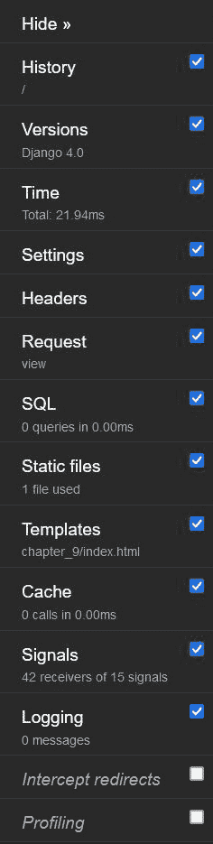

图 9.2 – DjDT – 打开

工具栏中的每个项目都可以点击以进一步展开。以下子部分为你分解了每个面板实际上显示的内容。

### 历史

**历史**面板显示在这个浏览器选项卡内发出的每个请求的列表。每次你刷新页面或在你网站上导航到新的路径时，这些信息都会在这个面板中记录。在这个面板中的每个项目都有一个**切换**按钮。当点击该按钮时，与该请求相关的其他选项卡中的调试信息将更新，如下面的截图所示，其中用箭头突出显示：

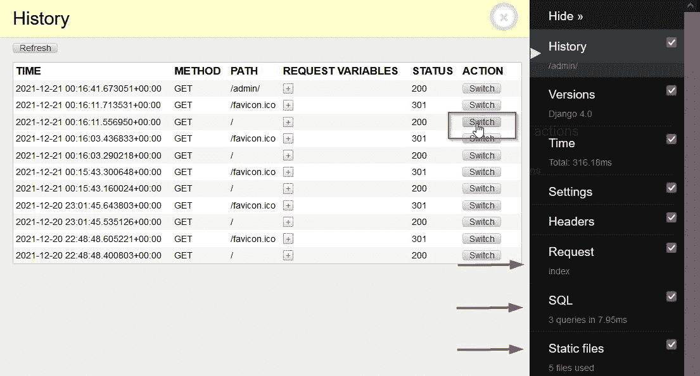

图 9.3 – DjDT – 历史选项卡

当你点击准备本章的`chapter_8`应用 URL 模式时。在这个例子中，我实际上登录到了我的管理面板，在**SQL**标签页中显示有三个查询，然后当我切换到主页面的一个 URL 时，**SQL**标签页更新并告诉我现在有两个查询。我将在接下来的*SQL*子节中解释这些查询的含义。现在，你至少可以看到这些数据是如何变化的。

### 版本

`requirements.txt`文件与开发者共享，用于自动化安装项目所需的包及其版本。以下截图显示了此标签页的外观，验证我们确实在使用 Django 4.0：

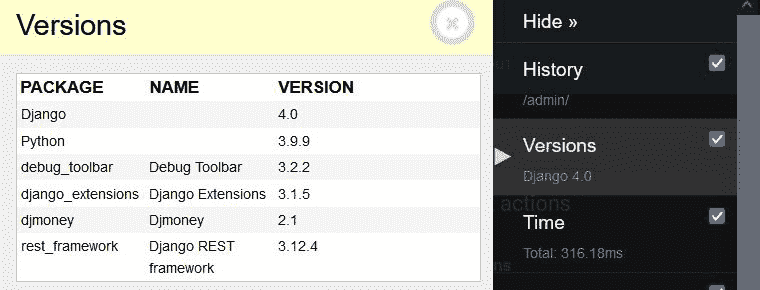

图 9.4 – DjDT – 版本标签页

### 时间

**时间**标签页仅显示执行当前请求所需的时间。它实际上并没有像前两个标签页那样打开一个新的面板。它只是一个占位符标签页，显示有用的信息。

### 设置

`settings.py`变量及其计算值。如果你有计算值的函数，或者如果你正在将许多不同的`settings.py`文件链接到其他包中，这些包覆盖或更改了父文件中的值，它们都可以在这里查看。以下截图显示了它的样子：

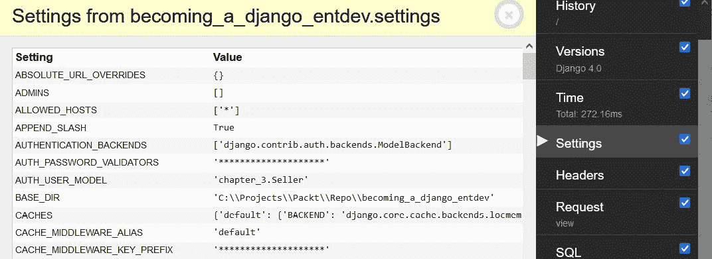

图 9.5 – DjDT – 设置标签页

### 标题

**标题**面板显示与你的 HTTP 请求和响应头相关的所有信息。它还在此面板的底部显示你的 WSGI 或 ASGI 环境变量。当你与 API 端点一起工作时，这非常有帮助，你需要确保请求和响应头中的信息是你预期的。以下截图显示了它的样子：

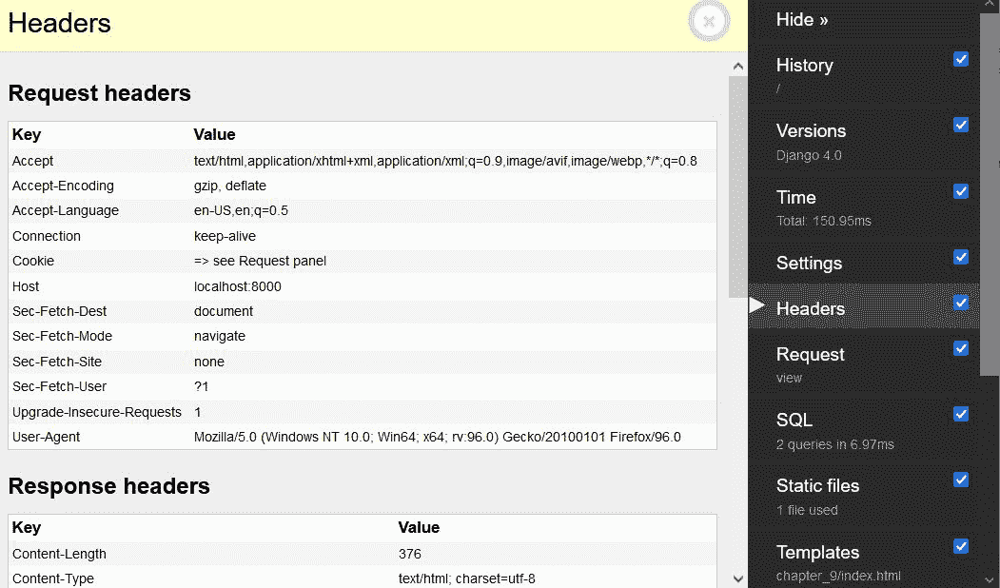

图 9.6 – DjDT – 标题标签页

### 请求

**请求**面板显示了与你的请求相关的所有数据，例如关键字参数和 cookie 和会话数据。此标签页非常有用，可以检查确保这些信息是你预期的。以下截图显示了此面板的样子：

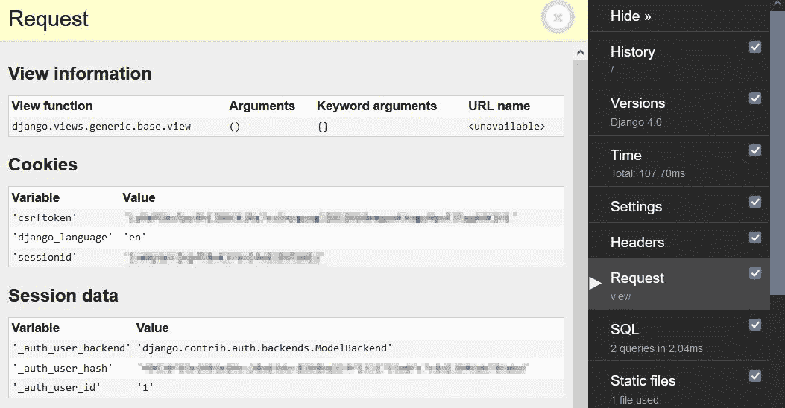

图 9.7 – DjDT – 请求标签页

### SQL

**SQL**面板展示了每个查询的非常详细和分解的视图，以及显示特定请求中涉及的所有查询。例如，如果你在未登录 Django 管理站点的情况下访问主页，**SQL**标签页将告诉你没有查询，如图*图 9.2*所示。然而，如果你已登录 Django 管理站点并访问主页，你应该在**SQL**标签页下看到至少两个查询。当你点击此标签页时，你会看到这两个查询是什么，如下面的截图所示：

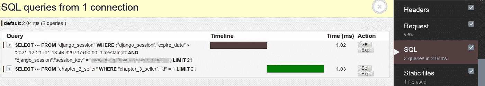

图 9.8 – DjDT – SQL 标签页

在这里，我们可以看到第一个查询为当前请求建立了一个会话，然后查询了系统登录用户的对象。由于我们在 *第三章*，*模型、关系和继承* 中扩展了 `User` 模型，该用户对象是一个 `Seller` 模型对象。每个查询都有一个 **Sel** 和 **Expl** 按钮，它们提供了有关该查询的其他详细信息。点击任何这些查询左侧的加号，可以进一步展开，显示有关该查询的信息，包括跟踪信息，如下所示：

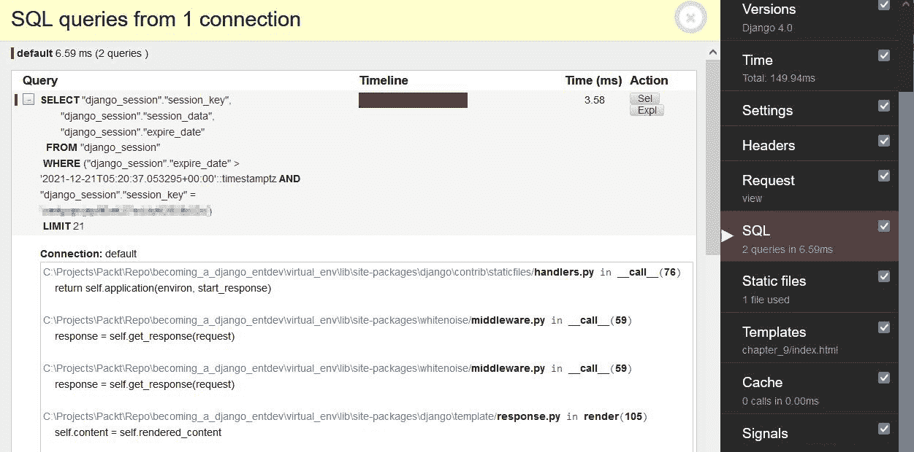

图 9.9 – DjDT – SQL 标签页展开

### 静态文件

**静态文件**面板显示所有已安装且实际包含静态文件的程序。中间部分列出与当前请求相关的所有静态文件。您实际上可以点击它们以在当前标签页或新标签页中打开和查看它们。此面板的最后部分显示所有已安装的应用程序中找到的所有静态文件的列表。如果您正在比较覆盖另一个应用程序相同静态文件的静态文件，这可能有时很有帮助，您可以看到哪个被使用，哪些被忽略。以下截图显示了此面板的外观：

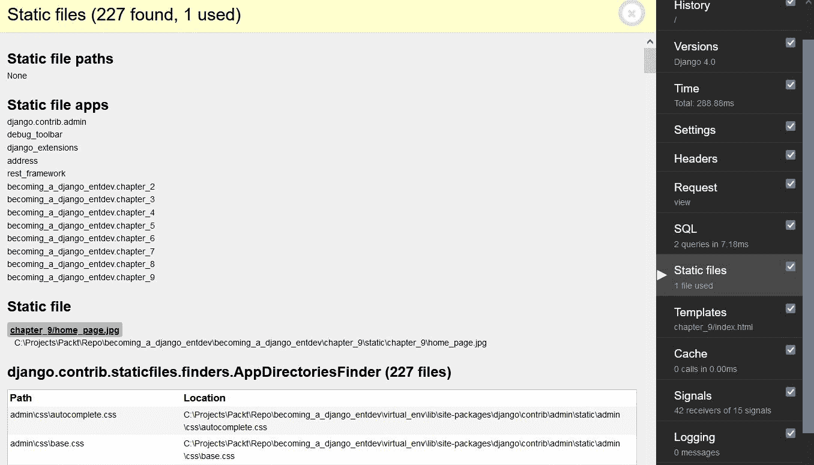

图 9.10 – DjDT – 静态文件标签页

在这里，我们可以看到该页面上正在使用的唯一静态文件是 `home_page.jpg` 文件。由于 `index.html` 文件没有扩展 `base_template_1.html` 文件，因此我们在这个页面上没有使用任何 CSS 或 JavaScript 文件；它们不会被加载。如果您激活 DjDT 并返回到前面的章节，您可能会看到那些额外的资源，因为我们使用了 `base_template_1.html` 文件。任何与 DjDT 相关的调试工具，如 CSS 和 JavaScript 文件，都不会显示在中间部分。我们的想法是这些是调试相关的资源，我们不需要在调试的页面上知道这些。如果您使用浏览器工具检查页面，您将看到与 DjDT 相关的资源；它们不会出现在生产环境中。

### 模板

**模板**面板显示与使用的模板和可用上下文相关的信息。中间部分显示所有模板。如果您使用了包含或扩展的局部 HTML 文件，则每个模板都会按使用顺序出现在此列表中。当您点击下面的截图所示的**切换上下文**箭头时，它将显示与该文件相关的所有上下文变量及其值的列表：

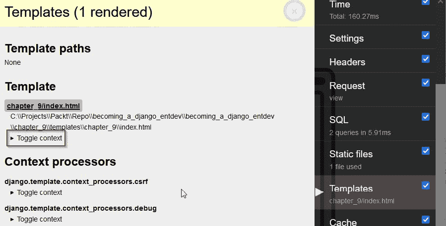

图 9.11 – DjDT – 模板标签页

以下截图展示了点击 **切换上下文** 按钮的样子，显示了在该特定模板或部分文件中可用的上下文：

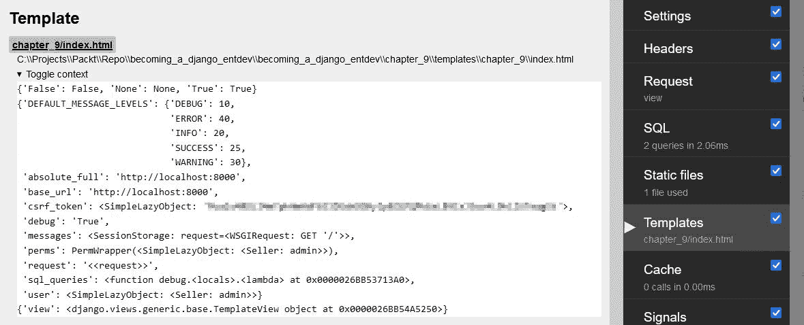

图 9.12 – DjDT – 显示上下文的模板选项卡

在此面板的底部是所有上下文处理器所在的位置。你可以查看每个上下文处理器中可用的上下文。

### 缓存

**缓存**面板显示了与该页面相关的所有缓存对象。这是如果你正在使用帮助提高数据库性能的工具时。这被认为是一个超出本书范围的进阶主题。

注意

DjDT 发布者也在他们的文档中指出，此面板与 Django 的按站点缓存不兼容。

### 信号

**信号**面板显示了应用程序内相互通信的通知者和接收者。这些可以与 **WebSocket** 进行紧密比较。这被认为是一个超出本书范围的进阶主题。

### 记录

`logging` 库。在展示此面板的外观之前，让我们连接一个实际的日志来查看。与 Django 消息框架一样，日志系统有不同的消息级别。默认的最小日志级别是 `WARNING`，但你也可以以相同的方式显示 `DEBUG` 和 `INFO` 级别的日志，无论是通过在 `settings.py` 文件中设置它，还是通过在设置日志的地方声明它，就像我们将在以下步骤中做的那样。要了解更多关于使用日志系统所有功能的信息，请访问 [`docs.djangoproject.com/en/4.0/topics/logging/`](https://docs.djangoproject.com/en/4.0/topics/logging/) 和 [`docs.python.org/3/library/logging.html`](https://docs.python.org/3/library/logging.html)。

按以下步骤练习使用日志系统：

1.  在你的 `/chapter_4/views.py` 文件中，在现有的 `practice_year_view()` 函数开始处添加以下日志语句：

    ```py
    # /becoming_a_django_entdev/chapter_4/views.py
    ...
    import logging
    def practice_year_view(request, year):
        logger = logging.getLogger(__name__)
        logger.setLevel(logging.INFO)
        logger.info('The Requested Year Is: %s' % year)
        ...
    ```

前两行将日志级别降低，以显示所有 `INFO` 级别及以上的日志，允许我们使用 `logger.info()` 方法创建日志消息。否则，默认情况下我们能够使用的最低级别将是 `logger.warning()` 方法。当我们访问 URL 时，期望看到的日志消息应该是 `The Requested Year Is: 2022`。

1.  现在，在浏览器中导航到 [`localhost:8000/my_year_path/2022/`](http://localhost:8000/my_year_path/2022/) 并展开调试工具栏。打开 **记录** 选项卡，现在你应该能看到我们创建的日志，如以下截图所示：

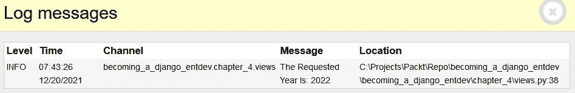

图 9.13 – DjDT – 记录选项卡

### 拦截重定向

**拦截重定向**复选框用于在执行重定向时显示一个中间页面，以显示有关该重定向的信息，在浏览器更新重定向页面之前。

### 性能分析

**配置文件**复选框允许在页面加载时收集额外数据。它是对内存和 CPU 进程的详细分析。每个进程都被分解成可能的最小测量值。默认情况下，此复选框保持未选中状态。以下截图展示了其外观示例：

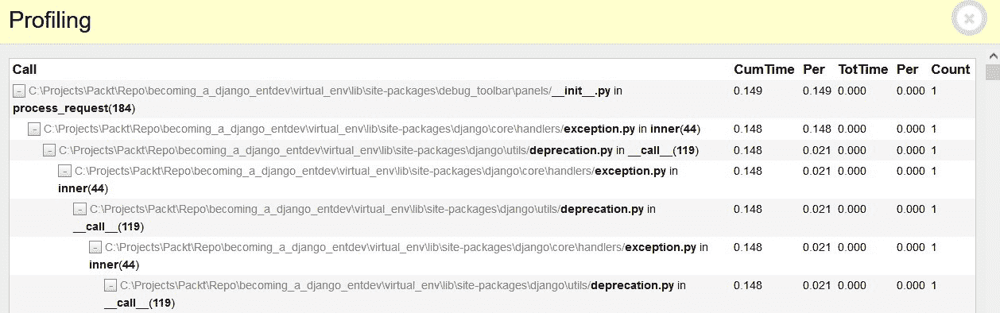

图 9.14 – DjDT – 配置文件选项卡

现在，我们对 DjDT 中所有可用的选项卡及其用途有了更深入的了解。这为我们提供了丰富的工具，帮助我们轻松地制作世界级的应用程序。

# 摘要

到目前为止，我们已经对 Django 中自动测试的执行方式有了坚实的理解。我们编写了几个测试用例，测试了前几章中完成的许多练习。我们练习编写模拟成功的测试用例和其他故意触发失败的测试用例，以更好地理解正在发生的事情。我们甚至发现了如何编写与 Django REST 框架一起工作的测试用例。在处理自动测试后，我们安装了我认为所有工具中最强大的工具，即 DjDT。DjDT 用于开发者在编写代码和本地运行项目时进行实时调试。

在下一章中，我们将学习如何使用 DjDT 来监控性能，同时学习如何优化数据库查询。
