# 第十章：*第十章*：数据库管理

在编程中，数据库管理的主题涵盖了广泛的各种子类别。其中许多类别在早期的章节中已经介绍过，例如在 *第二章* *项目配置* 中，我们讨论了使用数据库管理工具的概念，或者在 *第三章* *模型、关系和继承* 中，我们探讨了模型管理器的概念。虽然这些主题可以被认为是本章的主题，但它们在早期章节中被引入，是为了更好地适应该章节的主题讨论，或者作为适合早期章节练习的工具。在 *第三章* *模型、关系和继承* 中介绍并使用的 Django 固定文件也可以被视为数据库管理工具，并将在本章中更深入地探讨。

Django 固定文件用于导入和导出与 Django 项目连接的数据库中的数据。在本章之前提供的 `chapter_3` 数据固定文件，在每一章中都得到了使用，它通过提供必要的测试/虚拟数据来帮助演示这些练习。我们将介绍如何导出数据，为项目和开发者创建自己的数据固定文件。我们还将更深入地解释我们一直在使用的导入过程以及可用的选项。

在本章中，我们将探讨其他执行查询的方法，这些方法可以增强您系统的整体性能。常用的两种方法是 `select_related()` 和 `prefetch_related()`，在 Django 中分别被称为 `Vehicle` 和 `Seller` 模型类数据，这些数据存在于我们的数据库中。我们将使用在 *第九章* *Django 测试* 中介绍的 **Django Debug Toolbar** (**DjDT**) 来监控性能的变化。

在本章中，我们将涵盖以下内容：

+   将数据导出到数据固定文件

+   从数据固定文件导入数据

+   使用 `select_related()` 方法提升查询性能

+   使用 `prefetch_related()` 方法提升查询性能

+   使用 `Prefetch()` 类提升查询性能

# 技术要求

要在此章节中与代码一起工作，您需要在本地机器上安装以下工具：

+   Python 版本 3.9 – 作为项目的底层编程语言

+   Django 版本 4.0 – 作为项目的后端框架

+   pip 包管理器 – 用于管理第三方 Python/Django 包

我们将继续使用*第二章*中 *Project Configuration* 部分创建的解决方案。然而，没有必要使用 Visual Studio IDE。主要项目本身可以使用其他 IDE 运行，或者从项目根目录（其中包含 `manage.py` 文件）独立使用终端或命令行窗口运行。无论你使用什么编辑器或 IDE，都需要一个虚拟环境来与 Django 项目一起工作。有关如何创建项目和虚拟环境的说明可以在*第二章* *Project Configuration* 中找到。你需要一个数据库来存储项目中的数据。在上一章的示例中选择了 PostgreSQL；然而，你可以为你的项目选择任何数据库类型来与本章的示例一起工作。

我们还将使用*第三章*中提供的 Django fixture 格式的数据，该章节标题为 *Models, Relations, and Inheritance*，子标题为 *Loading the chapter_3 data fixture*。确保 `chapter_3` fixture 已加载到你的数据库中。如果这已经完成，则可以跳过下一个命令。如果你已经创建了*第三章*中 *Models, Relations, and Inheritance* 部分提到的表，并且尚未加载该 fixture，那么在激活你的虚拟环境后，运行以下命令：

```py
(virtual_env) PS > python manage.py loaddata chapter_3
```

本章创建的所有代码都可以在本书的 GitHub 仓库中找到：[`github.com/PacktPublishing/Becoming-an-Enterprise-Django-Developer`](https://github.com/PacktPublishing/Becoming-an-Enterprise-Django-Developer)。本章中展示的大部分代码可以在 `/becoming_a_django_entdev/becoming_a_django_entdev/chapter_10/` 目录中找到。

查看以下视频以查看 *Code in Action*：[`bit.ly/3zYgbqd`](https://bit.ly/3zYgbqd)。

# 准备本章内容

首先，按照*第二章*中讨论的步骤，在你的项目中创建一个名为 `chapter_10` 的新应用。正如该部分所述，不要忘记将 `/becoming_a_django_entdev/becoming_a_django_entdev/chapter_10/apps.py` 文件中你的应用类中 `name =` 变量的值更改为指向你安装应用的位置。务必还将此应用包含在 `settings.py` 文件中的 `INSTALLED_APPS` 变量中。

在网站的主要 `urls.py` 文件中，添加以下路径，该路径指向我们将要创建的本章 URL 模式：

```py
# /becoming_a_django_entdev/urls.py
```

```py
...
```

```py
urlpatterns = [
```

```py
    path(
```

```py
        '',   
```

```py
        include(
```

```py
            'becoming_a_django_entdev.chapter_10.urls'
```

```py
        )
```

```py
    ),
```

```py
]
```

接下来，将本书提供的代码中的 `/chapter_10/urls.py` 文件复制到你的项目中同一目录下。

在以下练习中，我们将使用在 *第九章* 中介绍的 DjDT，即 *Django 测试*，来监控性能。请确保在继续之前，您已经在项目中安装了 DjDT。说明可以在该章节的标题为 *安装 DjDT* 的子节中找到。

既然我们已经为这一章创建了应用程序，让我们首先创建我们自己的数据固定文件。

# 将数据导出到数据固定文件

每个 Django 应用程序中都有一个名为 `fixtures` 的文件夹。此目录也可以通过修改名为 `FIXTURE_DIRS` 的 `settings.py` 变量来更改，但如果您打算使用默认目录和行为，则这不是必需的。Django 固定文件可以编写为 JSON、JSONL、XML 或 YAML 文件格式。这意味着如果您可以将数据导出为这些格式之一，即使该系统不是 Django 项目，您也可以轻松地从其他系统导出数据。请记住，如果要从旧系统进行干净的导出并将其导入到新系统，对象的表结构必须完全匹配。

通常，在从旧版遗留系统导出并导入到新更新的系统时，涉及大量的数据处理。另一种选择是在导出或导入数据时使用一个或多个命令选项的组合，以防止数据结构不匹配时出现错误。有时，使用提供的选项可能不足以完成对数据进行所需的所有操作。**数据处理**是将数据从一种格式或数据类型转换为另一种格式的过程。有时我们必须处理数据，因为较新的系统改变了旧数据结构及其/或对旧数据结构设置的约束。当这种情况发生时，我们有时会在导入过程中遇到错误。有时，数据导入没有问题，但在运行时，由于数据库中找到的不正确格式的数据，您的用户可能会遇到奇怪的行为。在本章中，我们将仅介绍使用提供的选项；如果您的系统中的数据如此复杂，以至于需要处理，您将不得不查找编写自己的 Python 脚本来根据需要转换数据。

让我们练习使用 Django 的 `dumpdata` 管理命令。

## 使用 dumpdata 命令

`dumpdata` 管理命令是我们在导入 `chapter_3` 固定数据时使用的 `loaddata` 命令的反义词。它用于将连接到您的 Django 项目的数据库中的数据导出到数据固定文件中。默认情况下，Django 会将数据固定文件导出为 JSON 格式，但您可以在运行 `dumpdata` 命令时使用 `--format` 选项指定不同的格式。

我们将首先使用`-o`或`--output`选项将所有应用的表导出到我们的项目中的`chapter_10`应用目录，以保持章节练习的整洁组织。本章中的每个`dumpdata`练习都将使用`--output`选项，因为这个选项不是必需的。

关于这些选项以及其他未涵盖的选项的更多信息，可以在此处找到：[`docs.djangoproject.com/en/4.0/ref/django-admin/#dumpdata`](https://docs.djangoproject.com/en/4.0/ref/django-admin/#dumpdata)。

在进行此练习之前，请确保你的数据库中有数据，无论是手动添加的还是从`chapter_3`应用导入的。我们将通过以下步骤将所有现有数据导出到`chapter_10`数据固定文件夹以进行练习：

1.  确保你位于你的项目根目录中，即你的`manage.py`文件所在的同一个文件夹。然后，打开你的命令行窗口或终端，激活你的虚拟环境，但在此时不运行你的项目。

1.  使用以下命令在你的`/becoming_a_django_entdev/chapter_10/`目录中创建一个名为`fixtures`的新文件夹：

    ```py
    (virtual_env) PS > mkdir becoming_a_django_entdev/chapter_10/fixtures
    ```

1.  使用`-o`或`--output`输出选项执行`dumpdata`命令，将导出的数据放入我们刚刚创建的文件夹中的`chapter_10.json`文件中：

    ```py
    (virtual_env) PS > python manage.py dumpdata -o becoming_a_django_entdev/chapter_10/fixtures/chapter_10.json
    ```

如果你操作成功，你现在应该能在你的`/becoming_a_django_entdev/chapter_10/fixtures/`文件夹中看到一个名为`chapter_10.json`的新文件，如下面的截图所示，使用 Visual Studio IDE 中的**解决方案资源管理器**：


图 10.1 – 使用`dumpdata`命令导出所有数据

我们之所以必须首先创建`fixtures`文件夹，是因为如果我们指定了一个不存在的文件夹，`dumpdata`命令将会失败。实际上，`.json`文件不必存在，Django 会为你创建该文件。请记住，如果你的`.json`文件已经存在，并且你运行`dumpdata`命令指定该文件作为输出选项，那么你现有的所有数据都将被覆盖并丢失。

在创建的`chapter_10.json`文件中，你会注意到它是以压缩文件格式存在的。你可以将这份文档格式化成可读的形式。在 Visual Studio 中，你可以在文档内右键点击并选择**格式化文档**来完成此操作。你还可以将数据复制粘贴到在线格式化工具中，例如我最喜欢的[`jsonlint.com/`](https://jsonlint.com/)。格式化文档不是必需的，但如果你想直接在该文件中读取数据对象或编辑它们，这将很有帮助。

您还会注意到，在创建的 `chapter_10.json` 文件中，您将拥有项目中每个应用程序的数据，包括 `auth`、`authtoken` 和 `chapter_3` 数据表以及任何与 Django 相关的数据表，如 `admin` 和 `contenttypes` 表。这比您在 `chapter_3.json` 数据 fixture 中提供的信息要多得多。很可能会发现，您不需要包含诸如 `admin.logentry` 和 `contenttypes.contenttype` 对象的信息，因为它们通常在将数据导入到不同的系统时会引起冲突。

在下一个子节中，我们将通过指定我们想要包含的数据的 `app_name` 和/或 `model_name` 来练习仅导出项目中特定应用程序中找到的表。

### 导出特定应用程序

当使用 `dumpdata` 命令且未指定任何应用程序时，就像我们在之前的练习中所做的那样，Django 将导出项目中所有应用程序中所有表的数据。没有选项语法可以这样做；如果有，它将是 `dumpdata {{ app_name }}` 或 `dumpdata {{ app_name.model_name }}` 格式，当然不包括花括号。

要指定应用程序或表，请按照以下步骤操作：

1.  确保您位于项目根目录内，即您的 `manage.py` 文件所在的文件夹。然后，打开一个命令行窗口或终端并激活您的虚拟环境，但在此时尚未运行您的项目。

1.  执行以下 `dumpdata` 命令，该命令将指定仅在 `chapter_3` 应用程序中找到的所有表：

    ```py
    (virtual_env) PS > python manage.py dumpdata chapter_3 -o becoming_a_django_entdev/chapter_10/fixtures/chapter_3_models.json
    ```

现在，应该为我们创建的文件是一个名为 `chapter_3_models.json` 的单个文件，位于 `/chapter_10/fixtures/` 文件夹中。它应仅包含 `vehiclemodel`、`engine`、`vehicle` 和 `seller` 表的数据。之前在 fixture 文件中看到的其它所有数据将不再出现在这个新文件中。

1.  在该文件中，格式化数据，以便您可以阅读其中的内容。如果您使用的是 Visual Studio，请在文档内部右键单击并选择 **格式化文档**，或者将数据复制粘贴到位于 [`jsonlint.com/`](https://jsonlint.com/) 的在线工具中。您的数据应类似于以下截图所示：

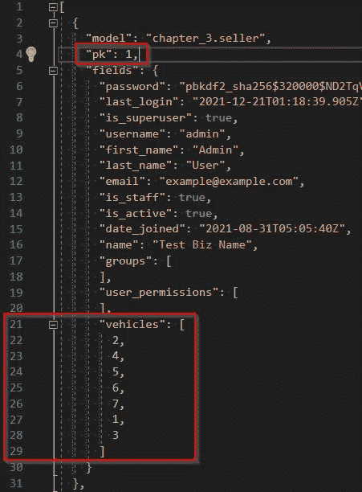

图 10.2 – 导出 chapter_3 应用程序 dumpdata 命令

默认情况下，所有相关对象都使用该相关对象的键来显示。我们可以通过先前的截图中的所有七个相关 `Vehicle` 对象来看到这一点，表示为从 `1` 到 `7` 的数字列表。顺序取决于该模型的默认排序。

注意

JSON 导出不一定遵循相同的或逻辑的顺序。您的结果可能会有所不同。在先前的截图中，每个导出的对象都包括其原始主键，表示为 `"pk"` 字段。我们可以使用 `--natural-primary` 选项来删除它，我们将在稍后讨论。

1.  要练习仅导出特定表，请使用以下命令导出`Seller`模型数据，通过指定`chapter_3.seller`作为源：

    ```py
    (virtual_env) PS > python manage.py dumpdata chapter_3.seller -o becoming_a_django_entdev/chapter_10/fixtures/chapter_3_sellers.json
    ```

如果想进行额外的练习，可以使用相同的点表示法来指定其他模型和/或应用程序。

接下来，让我们再次练习导出所有内容，就像我们在第一个练习中所做的那样。这次，我们将使用`--exclude`选项来排除我们不想包含的应用程序。

### 使用`--exclude`选项

`--exclude`或`-e`选项用于告诉 Django 在`dumpdata`命令的给定包含中排除特定的应用程序或模型。在本练习中，我们将执行与本章标题为*使用 dumpdata 命令*的子节中早些时候执行相同的导出所有内容操作，并排除所有与 Django 相关的表。我们希望通过使用`--exclude`选项而不是告诉 Django 包含什么来产生与*导出特定应用程序*子节中相同的输出结果。

按照以下步骤执行您的`--exclude`操作：

1.  确保您位于项目根目录内，即与您的`manage.py`文件相同的文件夹。然后，打开命令行窗口或终端并激活您的虚拟环境，但在此阶段不要运行您的项目。

1.  执行以下`dumpdata`命令，该命令排除以下应用程序：

    ```py
    dumpdata commands in this chapter are very long single-line commands. Anything broken down onto a new line is likely separated by a single space, as is the case with the preceding command.
    ```

选项也可以使用等号字符来编写，例如`-e=app_name`或`--exclude=app_name`。

新创建的`chapter_10_exclude.json`文件的内容应与我们在上一节标题为*导出特定应用程序*中创建的`chapter_3_models.json`文件的内容相匹配。这是因为我们在技术上执行了相同的行为，第一次我们告诉 Django 包含什么，第二次我们告诉 Django 排除什么。比较您文件的输出以查看结果。

接下来，让我们练习将数据导出为除默认 JSON 格式之外的其他格式。

### 使用`--format`选项

使用`--format`选项来告诉 Django 将数据输出到指定的格式。在导出数据时，我们可以指定的四种格式是 JSON、JSONL、XML 和 YAML。如果没有指定此选项，默认为 JSON。

按照以下步骤以可能的每种格式类型导出您的数据，每一步一个格式：

1.  确保您位于项目根目录内，即与您的`manage.py`文件相同的文件夹。然后，打开命令行窗口或终端并激活您的虚拟环境，但在此阶段不要运行您的项目。

1.  执行以下`dumpdata`命令，该命令将`Sellers`对象以 XML 格式导出：

    ```py
    (virtual_env) PS > python manage.py dumpdata chapter_3.seller --format xml -o becoming_a_django_entdev/chapter_10/fixtures/chapter_3_sellers.xml
    ```

1.  执行以下`dumpdata`命令，该命令将`Sellers`对象以 JSONL 格式导出：

    ```py
    (virtual_env) PS > python manage.py dumpdata chapter_3.seller --format jsonl -o becoming_a_django_entdev/chapter_10/fixtures/chapter_3_sellers.jsonl
    ```

1.  要使用 YAML 格式，您需要安装名为`pyyaml`的`pip`包。将此包添加到您的`requirements.txt`文件中，并从该文件安装它或运行以下命令将此包手动安装到您的虚拟环境中：

    ```py
    (virtual_env) PS > pip install pyyaml
    ```

1.  执行以下 `dumpdata` 命令，该命令将 `Sellers` 对象作为 YAML 导出：

    ```py
    (virtual_env) PS > python manage.py dumpdata chapter_3.seller --format yaml -o becoming_a_django_entdev/chapter_10/fixtures/chapter_3_sellers.yaml
    ```

你现在应该有三个额外的 `chapter_3_sellers` 文件，每个格式一个：`.xml`、`.jsonl` 和 `.yaml`。打开这些文档，查看数据在每个格式中的表示方式以及它们与默认的 `.json` 格式的区别。

接下来，让我们练习在导出数据到 fixture 时使用 `--natural-primary` 选项删除主键，即 `"pk"` 字段。

### 使用 --natural-primary 选项

使用 `--natural-primary` 选项，该选项用于生成一个不包含每个导出对象的 `"pk"` 字段的 fixture。如果你有一个已经包含数据的系统，并且需要将数据追加到现有数据中，这将非常有用。假设主键被包含在内，它可能与具有相同主键但不是同一对象的现有对象冲突。这可能导致丢失或更改数据，从而产生不理想的结果。

按照以下步骤使用 `--natural-primary` 选项：

1.  确保你位于项目的根目录中，即你的 `manage.py` 文件所在的文件夹。然后，打开命令行窗口或终端，激活你的虚拟环境，但在此时不运行你的项目。

1.  执行以下 `dumpdata` 命令，指定 `chapter_3` 应用程序中找到的 `seller` 表：

    ```py
    (virtual_env) PS > python manage.py dumpdata chapter_3.seller --natural-primary -o becoming_a_django_entdev/chapter_10/fixtures/chapter_3_sellers_natural_primary.json
    ```

应该在你的 `/chapter_10/fixtures/` 文件夹中创建一个名为 `chapter_3_sellers_natural_primary.json` 的新文件。

1.  在该文件中，格式化数据，以便你可以阅读其中的内容。如果你正在使用 Visual Studio，请在文档内部右键单击并选择 **格式化文档**，或者将数据复制并粘贴到此处找到的在线工具中：[`jsonlint.com/`](https://jsonlint.com/)。

现在，你应该看到与上一个子节完全相同的数据，只是所有 `"pk"` 字段都已从你的数据中删除，如下所示：

![图 10.3 – `dumpdata --natural-primary` 选项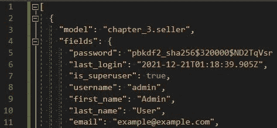

图 10.3 – `dumpdata --natural-primary` 选项

你也应该仍然看到所有 `Vehicles` 的数值外键值，如之前在 *图 10.2* 中所示。如果我们使用 `--natural-primary` 选项导出所有数据，这可能会引起问题。可能发生的情况是，在新数据库中创建了一个具有自己的主键的车辆，该主键与指定的外键不匹配。为了克服这个问题，我们还应该使用 `--natural-foreign` 选项，我们将在下一节中讨论。

### 使用 --natural-foreign 选项

`--natural-foreign` 选项将打印出所有相关对象的字符串表示形式，而不是该对象的数字外键值。我们还需要为所有相关对象编写一个新的模型类方法，以便在以这种方式使用时格式化和结构化该对象的字符串表示形式。输出可能与我们之前在 *第三章*，*模型、关系和继承* 中讨论的 `__str__()` 方法不同。

按照以下步骤将新的模型方法添加到你的 `Vehicle` 模型中，然后再次使用 `--natural-foreign` 选项导出 `Seller` 数据：

1.  在你现有的 `/chapter_3/models.py` 文件中，在现有的 `Vehicle` 模型类中，添加以下 `natural_key()` 方法：

    ```py
    # /becoming_a_django_entdev/chapter_3/models.py
    from django.db import models
    ...
    class Vehicle(models.Model):
        ...
    def natural_key(self):
            return self.full_vehicle_name()
    ```

此方法依赖于在 *第三章*，*模型、关系和继承* 中创建的现有 `full_vehicle_name()` 方法，在标题为 *自定义模型方法* 的子节中。请确保在继续下一步之前，该方法存在于你的 `Vehicle` 模型类中。

1.  确保你位于项目根目录中，即你的 `manage.py` 文件所在的文件夹。然后，打开一个命令行窗口或终端，激活你的虚拟环境，但在此时尚未运行你的项目。

1.  执行以下 `dumpdata` 命令，指定 `chapter_3` 应用程序中找到的所有表：

    ```py
    (virtual_env) PS > python manage.py dumpdata chapter_3.seller --natural-foreign -o becoming_a_django_entdev/chapter_10/fixtures/chapter_3_sellers_natural_foreign.json
    ```

应该在你的 `/chapter_10/fixtures/` 文件夹中创建一个名为 `chapter_3_sellers_natural_foreign.json` 的新文件。

1.  在该文件中，格式化数据，以便你可以阅读其中的内容。如果你使用 Visual Studio，在文档中右键单击并选择 **格式化文档**，或者将数据复制并粘贴到此处找到的在线工具中：[`jsonlint.com/`](https://jsonlint.com/)。

你现在应该看到类似于以下截图的内容，其中车辆列表不再由数字表示；现在它显示了由我们创建的 `natural_key()` 方法返回的字符串：


图 10.4 – `dumpdata` 的 `--natural-foreign` 选项

如果你看到重复的字符串条目，就像你在前面的截图中所看到的那样，这是因为自然键字符串表示形式使用了在这种情况下恰好具有相同值的数据模型，尽管它们是不同的对象。你可能想回去配置 `natural_key()` 方法，使其返回更独特的内容。

你可以为`chapter_3`应用中存在的每个模型创建一个`natural_key()`方法，然后再次运行这些命令的组合以进行练习。在本书提供的代码中，`/chapter_10/fixtures/`文件夹内有许多预先为你生成的不同固定文件，所有这些文件都使用了`chapter_3.json`固定文件中提供的初始数据。在`/chapter_10/readme.md`文件中，你可以找到一个命令列表，这些命令扩展了本章提供的示例。提供的每个命令都会生成一个不同的`chapter_10`固定文件。

注意

你可以将选项组合起来，例如在单个命令中结合`--natural-foreign --natural-primary`。这样做会产生*图 10.4*中所示的结果，但不会包含`"pk"`字段。

接下来，让我们通过使用`loaddata` Django 管理命令来练习导入数据。

# 从数据固定文件导入数据

使用`loaddata` Django 管理命令从固定文件导入数据。只要数据存在于以下四种文件格式之一，JSON、JSONL、XML 或 YAML，就可以使用此命令导入。即使数据不是从 Django 项目导出的，也可以导入数据。`loaddata`管理命令没有`dumpdata`命令那么多选项，但它们确实共享了大部分相同的选项。

我们一直在本书的大部分内容中使用此命令，以确保在处理前几章的练习时我们有可用的测试数据。我们不会深入探讨如何使用此命令的示例，而是简要地提醒自己如何使用它，然后描述每个可用的选项及其用途。

## 使用`importdata`命令

按照以下步骤练习加载本章 earlier 创建的`/chapter_10/fixtures/chapter_3_sellers.json`固定文件。如果我们成功，我们应该看到数据没有变化，因为我们正在导入相同的数据，覆盖了自身。如果你想在导入前练习更改字段值和/或添加新对象到文件中，以便在数据库管理工具中看到数据变化，你可以这样做：

1.  确保你位于项目根目录中，即你的`manage.py`文件所在的文件夹。然后，打开一个命令行窗口或终端，激活你的虚拟环境，但在此阶段不要运行你的项目。

1.  执行以下`loaddata`命令，告诉 Django 只加载`chapter_3_sellers.json`固定文件：

    ```py
    chapter_3_sellers, and different file extensions. Because of this, you will have to include the file extension when executing your command. If you are using anything other than JSON file formats, don't forget to always include the --format option. If you do not have multiple file formats that share the same name, it is not necessary to include the file extension when using the loaddata command.
    ```

这里列出了每个可用的选项及其用途：

+   `--app` – 用于告诉 Django 只在该选项指定的应用目录中搜索固定文件，而不是在 Django 的每个应用目录中搜索。如果你有两个具有相同名称的固定文件存在于两个不同的 Django 应用目录中，这有时很重要。

+   `--database` – 告诉 Django 使用在您的 `settings.py` 文件中配置的数据库，而不是指定的默认数据库。Django 使用您提供的名称在 `settings.py` 文件中标识该数据库。这也可以与 `dumpdata` 命令一起使用。

+   `--format` – 用于告诉 Django 在导入数据文件时使用除默认 JSON 格式以外的格式。

+   `--exclude`, `-e` – 用于告诉 Django 在导入数据时省略提供的 `app_name` 或 `model_name`。

+   `--ignorenonexistent`, `-i` – 用于省略自固定文件创建以来可能已删除的特定字段或模型。

接下来，让我们开始使用性能提升器。

# 使用 select_related() 方法

`select_related()` 方法用于查询所有相关 `ForeignKey` 和 `OneToOneField` 关系时的性能提升。此方法主要用于获取与父对象相关联的单个对象的数据。此方法不适用于 `ManyToManyField` 关系。在 SQL 层面上，此方法通常使用左外连接来查找相关数据。要了解有关 `select_related()` 方法的完整信息，请访问 [`docs.djangoproject.com/en/4.0/ref/models/querysets/#select-related`](https://docs.djangoproject.com/en/4.0/ref/models/querysets/#select-related)。

在这里，我们将监控显示车辆列表及其每个车辆的详细信息（包括相关字段数据）的页面性能。使用以下子节来创建所需的视图类、模板和 URL 模式，以展示这一概念的实际应用。

## 创建视图

按照以下步骤创建您的 `VehicleView` 类：

1.  在您的 `/chapter_10/views.py` 文件中，添加以下 `VehiclesView` 类和 `import` 语句：

    ```py
    # /becoming_a_django_entdev/chapter_10/views.py
    from django.http import Http404
    from django.template.response import (
        TemplateResponse
    )
    from django.views.generic import View
    from ..chapter_3.models import Vehicle
    class VehiclesView(View):
        template_name = 'chapter_10/vehicles.html'
    ```

在这个视图类中，我们告诉 Django 使用我们即将创建的 `/chapter_10/vehicles.html` 文件作为模板。

1.  将以下 `get()` 方法添加到您的 `VehiclesView` 类中：

    ```py
    # /becoming_a_django_entdev/chapter_10/views.py
    ...
    class VehiclesView(View):
        ...
        def get(self, request, *args, **kwargs):
            try:
                vehicles = Vehicle.objects.all()
            except Vehicle.DoesNotExist:
                raise Http404('No Vehicles Found')
            return TemplateResponse(
                request,
                self.template_name,
                {'vehicles': vehicles}
            )
    ```

为了解释这个 `get()` 方法的作用，我们在 `Vehicle` 模型对象上执行了一个 `all()` 查询。如果没有找到车辆，我们随后引发一个 `Http404` 未找到响应。如果找到车辆，我们随后返回一个 `TemplateResponse`，将车辆查询集作为上下文传递到要渲染的模板中。

注意

在 `get()` 方法中执行查询目前没有性能提升。跳到本章标题为 *第一演示* 的子节，以查看性能提升后的查询。

接下来，让我们构建模板。

## 构建模板

按照以下步骤创建您的车辆列表模板文件：

1.  在 `/chapter_10/templates/chapter_10/` 目录下创建一个名为 `vehicles.html` 的文件。在此文件中，添加以下代码：

    ```py
    # /becoming_a_django_entdev/chapter_10/templates/chapter_10/vehicles.html
    
    <html lang="en" xmlns="http://www.w3.org/1999/xhtml">
        <head>
            <title>All Vehicles Page</title>
        </head>
        <body style="text-align:center" 
            class="chapter_10">
            <h1>All Vehicles</h1>
        </body>
    </html>
    ```

`` 标签导入我们在 *第四章* 中创建的 `templatetags` 文件，即 *URLs, Views, and Templates* 小节下的 *自定义标签和过滤器*。如果你此时还没有创建 `chapter_4.py` 文件，只需从前面代码块中的 `` 标签中移除 `chapter_4`，并移除 *步骤 2* 中的 `|vehicle_make`。

1.  在同一文件中，在关闭 `</body>` 标签之前，添加以下条件和 `for` 循环，这将用 `vehicles` 查询集中每个 `vehicle` 的信息填充你的页面：

    ```py
    # /becoming_a_django_entdev/chapter_10/templates/chapter_10/vehicles.html
    ...
        <body ...>
            ...
            
                
                    <br />
                    <p>VIN #: {{ vehicle.vin }}</p>
                    <p>Price: {{ vehicle.price }}</p>
                    <p>Make: {{ vehicle.make|vehicle_make }}</p>
                    <p>Model: {{ vehicle.vehicle_model }}</p>
                    <p>Engine: {{ vehicle.engine }}</p>
                    <p>Is Sold? {{ vehicle.sold }}</p>
                    <br /><hr />
                
            
        </body>
    ...
    ```

前面的条件语句将检查 `vehicles` 查询集对象中是否有任何车辆。尽管我们在视图类中使用 try/except 语句来做这件事，但仍然在模板中这样做是个好习惯，以防视图类/方法中没有设置异常处理程序来检查对象未找到的情况。我们正在显示每个对象存在的所有字段数据。前面代码块中显示的 `Engine` 和 `VehicleModel` 数据是我们将监控其性能的相关对象。

让我们映射我们需要的下一个 URL 模式。

## 映射 URL 模式

按照以下步骤映射我们将用于访问此测试页面的 URL 模式：

1.  在你的 `/chapter_10/urls.py` 文件中，将以下路径添加到 `urlpatterns` 列表中：

    ```py
    from django.urls import path
    from .views import VehiclesView
    urlpatterns = [
        ...
        path(
            'all-vehicles/',
            VehiclesView.as_view(),
            name = 'all-vehicles'
        ),
    ]
    ```

我们刚刚映射到 `VehiclesView` 类的路径将指向 URL http://localhost:8000/all-vehicles/。

接下来，让我们使用 DjDT 检查车辆列表页的性能。

## 第一次演示

按照以下步骤查看车辆列表页并使用 DjDT 检查其数据库查询性能：

1.  确保你的项目正在虚拟环境中运行，并导航到 URL `http://localhost:8000/all-vehicles/`。如果你使用的是 `chapter_3` 应用程序的 `fixture` 提供的数据，你应该看到至少七组车辆，每组车辆之间用一条实线分隔。

1.  打开 DjDT 并查看 **SQL** 部分。你应该看到至少 **15** 个查询，如下面的截图所示：

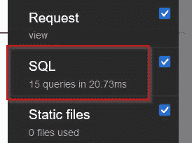

图 10.5 – 不使用 select_related() 方法的查询

1.  现在，在你的 `/chapter_10/views.py` 文件中，在 `VehiclesView` 类的 `get()` 方法下，将你的查询更改为以下片段中突出显示的查询，其中我们向上次使用的查询中添加了 `select_related()` 方法：

    ```py
    # /becoming_a_django_entdev/chapter_10/views.py
    ...
    class VehiclesView(View):
        ...
        def get(self, request, *args, **kwargs):
            try:
                vehicles=Vehicle.objects.select_related(
                    'vehicle_model',
                    'engine'
                ).all()
            ...
    ```

在 `select_related()` 方法中，我们告诉 Django 获取相关的 `vehicle_model` 和 `engine` 字段数据。

1.  在 http://localhost:8000/all-vehicles/ 上刷新页面，并再次检查 DjDT 的 **SQL** 部分。这次，你应该只看到至少 **1** 个查询，如下面的截图所示：

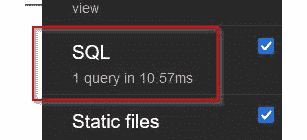

图 10.6 – 使用 select_related() 方法进行查询

如我们所见，对于这组特定的数据，我们能够从这次搜索任务中减少大约 14 个 SQL 查询操作。这也减少了 10.16 毫秒的原始时间。虽然 10.16 毫秒看起来可能很小，但请记住，我们只有大约一打与这个特定数据集相关的记录；想象一下在包含几十万条记录的数据集中的差异。时间会累积起来。

当我们打开 `LEFT OUTER JOIN` 操作以获取所有相关对象时。

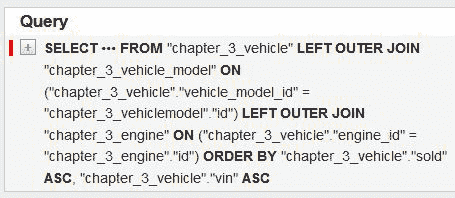

图 10.7 – 检查 select_related() 查询

让我们看看 `prefetch_related()` 方法接下来会做什么。

# 使用 prefetch_related() 方法

`prefetch_related()` 方法被用作与 `ManyToManyField` 关系相关的查询的性能提升器。此方法也可以用于 `ForeignKey` 和 `OneToOneField` 关系，并允许进行正向和反向查找，正如我们很快将要练习的那样。在 SQL 层面上，此方法通常使用 WHERE 或 INNER JOIN 语句来执行查找操作。与 `select_related()` 方法不同，`prefetch_related()` 方法将为每个相关对象集执行单独的 SQL 查询。例如，如果我们查找了一个 `Seller` 并想要相关的 `Vehicles` 以及它们的 `VehicleModel` 和 `Engine` 对象，那么 Django 将执行四个单独的查询来查找所有相关数据。要了解更多关于 `prefetch_related()` 方法的完整信息，请访问 [`docs.djangoproject.com/en/4.0/ref/models/querysets/#prefetch-related`](https://docs.djangoproject.com/en/4.0/ref/models/querysets/#prefetch-related)。

以下是与 *车辆视图* 和 *卖家视图* 相关的两个练习，用于练习以不同方式使用 `prefetch_related()` 方法。

## 车辆视图

在这个练习中，我们将修改本章 *使用 select_related() 方法* 部分中创建的现有 `VehiclesView` 类。在那个练习中，我们创建了一个页面，显示了系统中所有的车辆，然后提升了查找相关 `VehicleModel` 和 `Engine` 对象的性能。使用 `prefetch_related()` 方法，我们将查找相关的 `Seller` 对象以显示谁在销售那辆特定的车辆。

使用以下子节来为这次演示准备你的模板。视图和 URL 模式将与之前保持相同。

### 检查视图

保持现有的 `VehiclesView` 类与之前相同，它使用的是上次演示中的性能提升查询，如下所示：

```py
# /becoming_a_django_entdev/chapter_10/views.py
```

```py
...
```

```py
            Vehicles = Vehicle.objects.select_related(
```

```py
                'vehicle_model',
```

```py
                'engine'
```

```py
            ).all()
```

```py
...
```

我们很快就会修改它，但首先我们想要监控在模板中显示 `seller` 对象将如何改变我们现在拥有的性能提升查询。

### 修改模板

按照以下步骤修改你的车辆列表模板：

1.  在你的 `/chapter_10/vehicles.html` 文件中，在 `<br /><hr />` 行上方和最后一个 `vehicle` 详细信息项下方添加以下突出显示的代码：

    ```py
    # /becoming_a_django_entdev/chapter_10/templates/chapter_10/vehicles.html
    ...
            
                
                    ...
                    <p>Is Sold? {{ vehicle.sold }}</p>
                    
                        {{ seller.username }}
                    
                    <br /><hr />
                
            
    ...
    ```

1.  重要的是要注意，用于访问 `seller` 的名称，如在 `vehicle.vehicle_sellers.all` 中的 `vehicle_sellers`，是在 `Seller` 模型类的 `vehicles` 字段上设置的，使用 `related_name` 参数。确保在你的 `/chapter_3/models.py` 文件中，在 `Seller` 模型类下，`vehicles` 字段使用以下片段中突出显示的参数和值：

    ```py
    related_name or related_query_name argument of a field on a model class ever changes, you will need to rerun your Django migration commands once again to reflect those changes in your database.
    ```

让我们看看这如何改变我们的性能。

### 第二个演示

按照以下步骤查看这些更改如何影响 DjDT 中 **SQL** 选项卡的结果：

1.  确保你的项目正在你的虚拟环境中运行，并导航到或刷新 URL `http://localhost:8000/all-vehicles/` 一次。

1.  检查 `select_related()` 方法。现在，我们至少看到 **8 个查询**，如下面的截图所示：

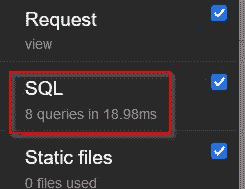

图 10.8 – 使用 select_related() 方法进行查询，显示相关卖家

在我们的搜索中现在看到了七个额外的查询，每个查询对应于与找到的七个车辆相关的每个卖家。

1.  在你的 `/chapter_10/views.py` 文件中，在相同的 `VehiclesView` 类中，将查询更改为以下代码片段所示：

    ```py
    # /becoming_a_django_entdev/chapter_10/views.py
    ...
                Vehicles = Vehicle.objects.prefetch_related(
        'vehicle_sellers'
    ).select_related(
        'vehicle_model',
        'engine'
    ).all()
    ...
    ```

我们刚刚将 `prefetch_related('vehicle_sellers')` 方法添加到之前的查询中，同时保留之前的 `select_related()` 操作。确保你在这个地方遵循正确的 Python 缩进。在上面的示例中，正确显示的空间有限。

1.  再次刷新 URL `http://localhost:8000/all-vehicles/` 并再次检查 DjDT 的 **SQL** 部分。你现在应该至少看到 **2 个查询**，如下面的截图所示：

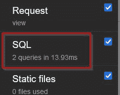

图 10.9 – 使用 select_related() 和 prefetch_related() 方法进行查询

如果我们检查添加了 **INNER JOIN** 和 **WHERE** 查找的 `prefetch_related()` 方法，如下面的截图所示：

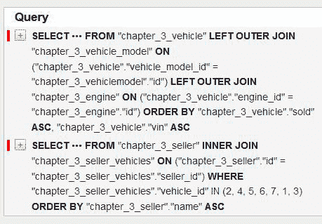

图 10.10 – 检查 select_related() 和 prefetch_related() 查询

我们可以从之前的内容中看到，Django 在尝试显示页面上的 `vehicle_sellers` 对象的用户名时，对每个对象执行了额外的查找。这就是我们在将 `` 循环添加到 `/chapter_10/vehicles.html` 模板文件后，最终得到八个查询的原因。当我们将 `prefetch_related()` 方法添加到 `VehiclesView` 类中的查询操作时，它只是添加了一个额外的查找操作，检索了与这个数据集相关的所有七个 `vehicle_sellers` 对象，从而我们现在有了两个查询，并减少了多余的查询。在您的模板文件中添加更多字段查找和使用上下文有时会增加查询次数。

接下来，让我们将 `prefetch_related()` 方法应用于卖家列表页面，并查看它在反向查找时的行为如何。

## 卖家视图

在这个练习中，我们将创建一个新的 URL 模式、视图类和模板，用于显示卖家及其所售车辆的相关列表。

使用以下子节来创建所需的视图类、模板和 URL 模式，以构建卖家列表页面。

### 创建视图

按照以下步骤创建您的 `SellersView` 类：

1.  在您的 `/chapter_10/views.py` 文件中，添加以下 `SellersView` 类和 `import` 语句：

    ```py
    # /becoming_a_django_entdev/chapter_10/views.py
    from django.http import Http404
    from django.template.response import (
        TemplateResponse
    )
    from django.views.generic import View
    from ..chapter_3.models import Seller, Vehicle
    class SellersView(View):
        template_name = 'chapter_10/sellers.html'
    ```

在这个视图类中，我们告诉 Django 使用 `/chapter_10/sellers.html` 文件作为模板，这是我们很快将要创建的。我们还在之前使用的相同导入基础上添加了 `Seller` 模型类作为新的导入。

1.  将以下 `get()` 方法添加到您的 `SellersView` 类中：

    ```py
    # /becoming_a_django_entdev/chapter_10/views.py
    ...
    class SellersView(View):
        ...
        def get(self, request, *args, **kwargs):
            try:
                sellers = Seller.objects.all()
            except Seller.DoesNotExist:
                raise Http404('No Sellers Found')
            return TemplateResponse(
                request,
                self.template_name,
                {'sellers': sellers}
            )
    ```

`get()` 方法结构与 `VehiclesView` 类相同。唯一的区别是我们正在使用 `Seller` 模型类来执行查询。同样，这个查询目前还没有进行性能优化；我们将在测量这个查询操作后进行。

让我们接下来构建模板。

### 构建模板

按照以下步骤构建卖家列表页面模板：

1.  在 `/chapter_10/templates/chapter_10/` 目录下创建一个名为 `sellers.html` 的文件。在此文件中，添加以下代码：

    ```py
    # /becoming_a_django_entdev/chapter_10/templates/chapter_10/sellers.html
    
    <html lang="en" xmlns="http://www.w3.org/1999/xhtml">
        <head>
            <title>All Sellers Page</title>
            <style type="text/css">
                ...Found With the Code of this Book...
            </style>
        </head>
        <body style="text-align:center" 
            class="chapter_10">
            <h1>All Sellers</h1>
        </body>
    </html>
    ```

`` 标签导入了我们在 *第* *4* *章* *4* 中创建的 `templatetags` 文件，在标题为 *自定义标签和过滤器* 的子节中。如果您在此时尚未创建 `chapter_4.py` 文件，只需从前面代码块中的 `` 标签中删除 `chapter_4`，并在 *步骤 3* 中显示的位置删除 `|vehicle_make`。

本书中的代码还提供了额外的 CSS 类样式。您可以在与本书代码相同的文件中找到这些样式，并将它们复制粘贴到您的文档中，以便以更组织化的方式查看这些对象。这不是继续进行的必要步骤。

1.  在关闭 `</body>` 标签之前，添加以下条件和 `for` 循环，这将使用 `sellers` 查询集中的每个 `seller` 的信息填充你的页面：

    ```py
    # /becoming_a_django_entdev/chapter_10/templates/chapter_10/sellers.html
    ...
        <body ...>
            ...
            
                
                    <p>First Name: {{ seller.first_name }}</p>
                    <p>Last Name: {{ seller.last_name }}</p>
                    <p>Username: {{ seller.username }}</p>
                    <p>Business Name: {{ seller.name }}</p>
                    <p>Email: {{ seller.email }}</p>
                    <p>Last Login: {{ seller.last_login }}</p>
                    <p>Date Joined: {{ seller.date_joined 
                        }}</p>
                    <p>Is Staff? {{ seller.is_staff }}</p>
                    <p>Is Active? {{ seller.is_active 
                        }}</p>
                    <p>Is Superuser? {{ 
                        seller.is_superuser }}</p>
                    <br /><hr /><br />
                
            
        </body>
    ...
    ```

1.  在 `<br /><hr /><br />` 代码片段行之后，插入以下条件和 `for` 循环：

    ```py
    # /becoming_a_django_entdev/chapter_10/templates/chapter_10/sellers.html
    ...
                
                    ...
                    <p>Is Superuser? {{ 
                         seller.is_superuser }}</p>
                    
                        <h2>Seller Vehicles</h2>
                        
                            <div class="vehicle-box">
                                <p>VIN #: {{ vehicle.vin 
                                    }}</p>
                                <p>Price: {{ vehicle.price 
                                    }}</p>
                                <p>Make: {{ vehicle.make
                                    |vehicle_make }}</p>
                                <p>Model: {{ vehicle.
                                    vehicle_model }}</p>
                                <p>Engine: {{ 
                                    vehicle.engine }}</p>
                                <p>Is Sold? {{ vehicle
                                    .sold }}</p>
                            </div>
                        
                    
                    <br /><hr /><br />
                
    ...
    ```

这里的逻辑基本上与之前构建的车辆列表页面相同。我们在 `sellers` 循环内部添加了一个额外的循环层，该循环遍历每个 `seller` 相关的 `vehicles`。

让我们映射我们需要的下一个 URL 模式。

### 映射 URL 模式

执行以下步骤以映射我们将使用的访问此列表页面的 URL 模式。

在你的 `/chapter_10/urls.py` 文件中，将以下路径添加到你的 `urlpatterns` 列表中：

```py
from django.urls import path
```

```py
from .views import SellersView, VehiclesView
```

```py
urlpatterns = [
```

```py
    ...
```

```py
    path(
```

```py
        'all-sellers/',
```

```py
        SellersView.as_view(),
```

```py
        name = 'all-sellers'
```

```py
    )
```

```py
]
```

我们刚刚映射到 `SellersView` 类的路径将指向 URL http://localhost:8000/all-sellers/。

让我们使用 DjDT 检查卖家列表页面的性能。

### 第三次演示

按照以下步骤查看卖家列表页面，并使用 DjDT 检查其数据库查询性能：

1.  确保你的项目正在你的虚拟环境中运行，并导航到 URL http://localhost:8000/all-sellers/。如果你使用的是 `chapter_3` 应用程序固件提供的数据，你应该看到至少一组 `seller` 数据和第一个卖家的七辆车。

如果你一直跟随这本书学习，你应该在你的数据库中有大约三个 `sellers`，这是由于之前章节中执行练习的结果。`chapter_3` 固件中只提供了一个卖家。对于以下步骤中显示的性能结果，假设你有三个 `sellers` 和七辆车，因为你的实际数据可能会有所不同。

1.  打开 DjDT 并查看 **SQL** 选项卡。你应该看到至少 **19** 个查询，如下面的截图所示：

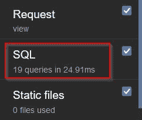

图 10.11 – 卖家列表页面未进行性能优化

因为 Django 一直在重复查找每一辆车及其相关的 `vehicle_model` 和 `engine`，所以执行了如此多的查询。我们编写的 `` 条件，检查是否存在 `vehicles`，并且还添加了一个查询到页面性能中。

1.  现在，在你的 `/chapter_10/views.py` 文件中，在 `SellersView` 类的 `get()` 方法下，将查询更改为以下代码片段中突出显示的查询，我们在之前的基础上添加了 `prefetch_related()` 方法：

    ```py
    # /becoming_a_django_entdev/chapter_10/views.py
    ...
    class SellersView(View):
        ...
        def get(self, request, *args, **kwargs):
            try:
                sellers = Seller.objects.prefetch_related(
        'vehicles',
        'vehicles__vehicle_model',
        'vehicles__engine'
    ).all()
            ...
    ```

在 `prefetch_related()` 方法中，我们告诉 Django 获取相关的 `vehicles`，然后，在单独的操作中，获取每个 `vehicle` 对象的相关 `vehicle_model` 和 `engine`。每当我们需要指定其他相关字段时，就像我们在前面的代码块中所做的那样，我们使用双下划线 `__` 来在一系列关系中向上或向下导航。请确保你遵循了正确的 Python 缩进，这里有限的空间来正确显示之前示例中的内容。

1.  请再次刷新 URL http://localhost:8000/all-sellers/ 并再次检查 DjDT 的 **SQL** 选项卡。你现在应该至少看到 **4 个查询**，如下面的截图所示：

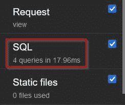

图 10.12 – 卖家列表页面性能提升

我们还使用性能提升的方法在这个查询查找任务中节省了 6.95 毫秒的时间。如果我们检查 `Seller` 对象，一个用于 `Vehicle` 对象，一个用于 `VehicleModel` 对象，最后一个用于 `Engine` 对象。Django 使用 `WHERE` 子句和 `INNER JOIN` 操作的组合来检索相关数据。

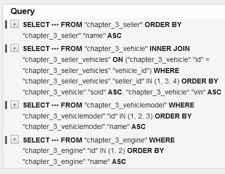

图 10.13 – 检查卖家列表页面查询

Django 还提供了一个 `Prefetch()` 类，可以用来执行具有性能提升能力的更复杂的查询。接下来，让我们使用这个类来对与 `seller` 相关的 `vehicles` 进行高级过滤。

# 使用 Prefetch() 类

在 `django.db.models` 库中提供的 `Prefetch()` 类用于控制 `prefetch_related()` 操作的执行方式。例如，我们将使用它来过滤并仅显示等于 `"Blazer LT"` 的 `VehicleModel` 的 `vehicles`。我们还可以在以这种方式进行过滤时预取所有相关对象。要深入了解如何使用此类，请访问 [`docs.djangoproject.com/en/4.0/ref/models/querysets/#prefetch-objects`](https://docs.djangoproject.com/en/4.0/ref/models/querysets/#prefetch-objects)。

使用以下子节来准备你的视图类和模板以进行此演示。URL 模式将与本章 *Sellers 视图* 子节中找到的演示相同。

## 修改视图

按照以下步骤修改你的现有 `SellersView` 类以进行下一个练习：

1.  在你的 `/chapter_10/views.py` 文件中，添加以下 `import` 语句，最好在现有的 `import` 语句之前：

    ```py
    # /becoming_a_django_entdev/chapter_10/views.py
    from django.db.models import Prefetch
    ...
    ```

1.  在此文件中找到的 `SellersView` 类中，将你的查询语句更改为以下代码片段：

    ```py
    # /becoming_a_django_entdev/chapter_10/views.py
    ...
    class SellersView(View):
        ...
                sellers = Seller.objects.prefetch_related(
                    Prefetch(
                        'vehicles',
                        to_attr  = 'filtered_vehicles',
                        queryset = Vehicle.objects.filter(
                            vehicle_model__name = 
                                'Blazer LT'
    )
                    ),
                    'filtered_vehicles__vehicle_model',
                    'filtered_vehicles__engine'
                ).all()
    ...
    ```

请确保你遵循了正确的 Python 缩进，这里有限的空间来正确显示之前示例中的内容。

我们编写的查询语句与之前写的类似。这次我们不同的地方是将`Prefetch()`类放在`prefetch_related()`方法的第一个参数中。`Prefetch()`类本身接受三个参数。第一个是查找参数，通常是一个字段，但也可以使用双下划线`__`在字符串中遍历上下游关系。第二个和第三个参数是可选的，不需要按确切顺序排列。`to_attr`参数用于将结果 QuerySet 存储为具有指定名称的对象列表。QuerySet 参数用于对那些项目的子集执行特定查询。在先前的示例中，我们执行了`filter()`操作，仅搜索具有`vehicle_model__name`为`"Blazer LT"`的车辆。

在`Prefetch()`类之后，在之前使用的`prefetch_related()`方法中，我们添加了两个额外的字段查找，分别是`filtered_vehicles__vehicle_model`和`filtered_vehicles__engine`对象。这将预取与我们刚刚创建的定制过滤列表相关的相关对象。

接下来，我们需要修改现有的模板文件，以便与`filtered_vehicles`对象列表一起工作。

## 修改模板

按照以下步骤修改现有的卖家列表模板文件，以便与创建的`filtered_vehicles`列表一起使用：

1.  在你现有的`/chapter_10/sellers.html`文件中，将使用`seller.vehicles.all`的两行更改为现在使用`seller.filtered_vehicles`，如下所示：

    ```py
    # /becoming_a_django_entdev/chapter_10/templates/chapter_10/sellers.html
    ...
                
                    ...
                    
                        <h2>Seller Vehicles</h2>
                        
                            ...
                        
                    
                    <br /><hr /><br />
                
    ...
    ```

这就是我们需要修改的所有内容。让我们看看这如何影响我们的性能。

## 第四个演示

按照以下步骤查看卖家列表页面，并使用`Prefetch()`类方法检查其数据库查询性能：

1.  在浏览器中刷新 URL http://localhost:8000/all-sellers/。

1.  打开 DjDT 并查看**SQL**标签。你应该看到至少**4 个查询**，如下面的截图所示：

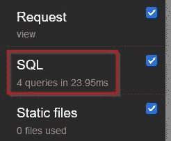

图 10.14 – 使用 Prefetch 类的卖家列表页面

这应该也是我们在之前的示例中看到的相同数量的查询，如图 10.12 所示。在这个数据集中，唯一的区别是我们看到页面上的第一个卖家下有五个`vehicles`，而之前显示的是七个。现在结果只显示**Blazer LT**车辆，如下面的截图所示：

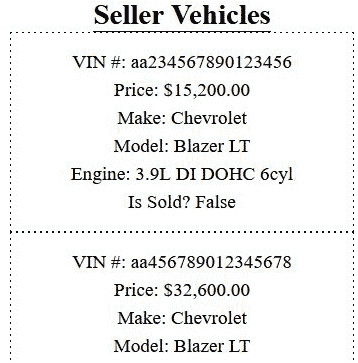

图 10.15 – 使用 Prefetch 类的卖家列表页面结果

虽然结果数量可能不同，但执行的查询数量保持不变。使用这种方法，我们可以定义一个非常细粒度的搜索查询，并且性能得到提升。

# 摘要

我们通过学习如何导入和导出数据以及将性能提升技巧应用于所有查询操作，得以完成如何使用 Django 构建企业级系统的旅程。了解如何处理数据与构建它们所在的数据孤岛一样重要。当你与现有系统合作时，总有从旧系统导出现有数据并将其导入新系统的需求。我们现在知道了如何做到这一点。我们还可以将这项知识与在*第二章*，“项目配置”，标题为“Heroku 数据库推送/拉取操作”的子节中学到的技能结合起来，以便在远程测试和生产环境中处理数据。在整个项目生命周期中，根据需要使用每个工具来执行不同的任务。

本章介绍的性能提升方法旨在应用于任何查询操作。参考*第三章*“模型、关系和继承”中讨论的主题，了解如何构建你的数据以及执行其他查询操作。在同一章节中，你还可以在模型管理器内部查询时应用性能提升器。

这本书没有涵盖与 Django 世界相关的丰富知识、技巧和窍门。我希望你喜欢到目前为止所学的阅读和实践内容，并希望你能继续你的学习之旅，学习更多。利用书中散布的链接、资源和包及工具的引用来扩展你的学习范围。如果你有任何问题，想要指出本书中的错误，或者分享赞美之词，请随时通过提供的任何联系方式联系我。虽然我投入了大量的时间和精力来撰写这本书并检查我的工作，但我们都是凡人，错误难免会出错。我也很乐意听到你阅读这本书后所创造的奇迹。感谢大家抽出时间阅读这本书！
