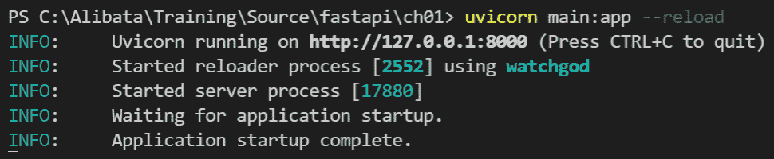
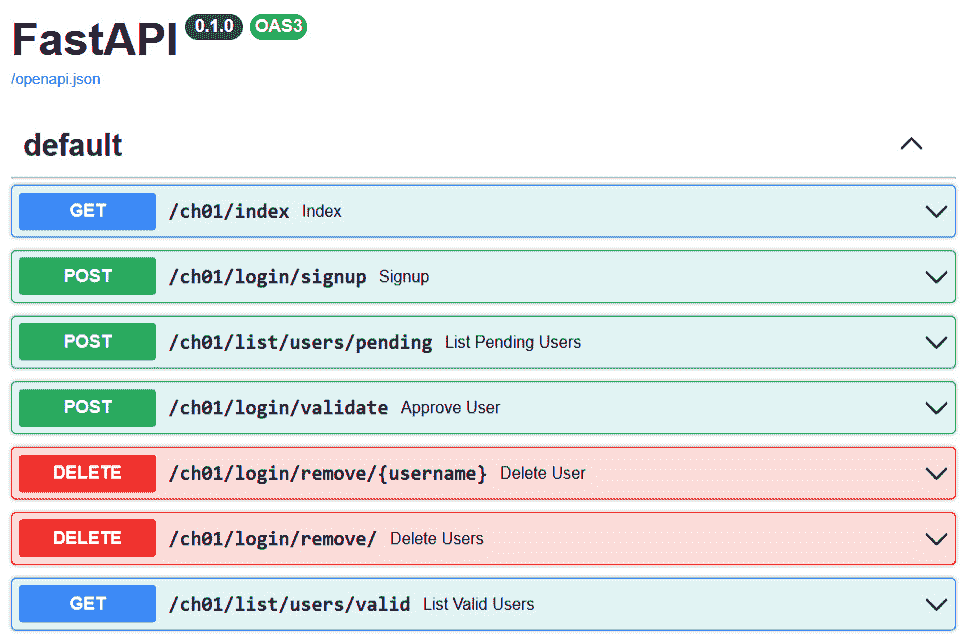

# 第一章：为初学者设置 FastAPI

在任何软件开发工作中，了解项目的业务需求和合适的框架、工具和部署平台始终是重要的，在追求任务之前。易于理解和使用、编码过程中无缝且符合标准的框架总是被选中，因为它们提供的完整性可以在不冒太多开发风险的情况下解决问题。一个名为 **FastAPI** 的有希望的 Python 框架，由 *Sebastian Ramirez* 创建，为经验丰富的开发者、专家和爱好者提供了构建 **REST APIs** 和微服务的最佳选择。

在继续深入探讨使用 FastAPI 构建微服务的核心细节之前，最好首先了解这个框架的构建块，例如它是如何捕获客户端请求的，如何为每个 HTTP 方法构建规则，以及如何管理 HTTP 响应。了解基本组件始终是了解框架的优缺点以及我们可以将 FastAPI 应用于解决不同企业级和微服务相关问题的程度的关键。

因此，在本章中，我们将通过涵盖以下主要主题来对 FastAPI 的基本功能进行概述：

+   开发环境的设置

+   FastAPI 的初始化和配置

+   REST API 的设计和实现

+   管理用户请求和服务器响应

+   处理表单参数

+   处理 cookies

# 技术要求

本章的软件示例是一个典型的管理员管理的*在线学术讨论论坛*，这是一个学术讨论中心，校友、教师和学生可以交流想法。原型正在运行，但它是开放的，因此您可以在阅读本章时修改代码。它没有设计为使用任何数据库管理系统，但所有数据都临时存储在各种 Python 集合中。本书中的所有应用程序都是使用 *Python 3.8* 编译和运行的。所有代码都已上传至[`github.com/PacktPublishing/Building-Python-Microservices-with-FastAPI/tree/main/ch01`](https://github.com/PacktPublishing/Building-Python-Microservices-with-FastAPI/tree/main/ch01)。

# 设置开发环境

FastAPI 框架是一个快速、无缝且健壮的 Python 框架，但只能运行在 Python 版本 *3.6* 及以上。本参考中使用的**集成开发环境**（**IDE**）是**Visual Studio Code**（**VS Code**），这是一个开源工具，我们可以从以下网站下载：[`code.visualstudio.com/`](https://code.visualstudio.com/)。只需确保安装 VSC 扩展，如 *Python*、*Python for VS Code*、*Python Extension Pack*、*Python Indent* 和 *Material Icon Theme*，以提供您的编辑器语法检查、语法高亮和其他编辑器支持。

在成功安装 Python 和 VS Code 之后，我们现在可以使用终端控制台安装 FastAPI。为了确保正确安装，首先通过运行以下命令更新 Python 的包安装程序（`pip`）：

```py
python -m pip install --upgrade pip
```

之后，我们通过运行以下一系列命令来安装框架：

```py
pip install fastapi
pip install uvicorn[standard]
pip install python-multipart
```

重要提示

如果您需要安装完整的 FastAPI 平台，包括所有可选依赖项，适当的命令是`pip install fastapi[all]`。同样，如果您想安装并使用完整的`uvicorn`服务器，应运行`pip install uvicorn`命令。此外，安装`bcrypt`模块以进行加密相关任务。

到目前为止，您应该已经安装了所有需要的 FastAPI 模块依赖项，从`uvicorn`开始，它是一个基于 ASGI 的服务器，用于运行 FastAPI 应用程序。`uvicorn`服务器具有运行同步和异步服务的能力。

在安装和配置了基本工具、模块和 IDE 之后，现在让我们开始使用框架进行第一个 API 实现。

# 初始化和配置 FastAPI

学习如何使用 FastAPI 创建应用程序既简单又直接。只需在您的`/ch01`项目文件夹内创建一个`main.py`文件，就可以创建一个简单的应用程序。例如，在我们的*在线学术讨论论坛*中，应用程序从以下代码开始：

```py
from fastapi import FastAPI
app = FastAPI()
```

这初始化了 FastAPI 框架。应用程序需要从`fastapi`模块实例化核心`FastAPI`类，并使用`app`作为引用变量到对象。然后，这个对象在以后被用作 Python `@app`装饰器，为我们提供一些功能，如*路由*、*中间件*、*异常处理程序*和*路径操作*。

重要提示

您可以将`app`替换为您喜欢的但有效的 Python 变量名，例如`main_app`、`forum`或`myapp`。

现在，您的应用程序已准备好管理技术上是 Python 函数的 REST API。但为了将它们声明为 REST 服务方法，我们需要使用路径操作`@app`装饰器提供的适当 HTTP 请求方法来装饰它们。这个装饰器包含`get()`、`post()`、`delete()`、`put()`、`head()`、`patch()`、`trace()`和`options()`路径操作，它们对应于八个 HTTP 请求方法。而且，这些*路径操作*是装饰或注释在我们想要处理请求和响应的 Python 函数之上的。

在我们的示例中，REST API 创建的第一个样本是：

```py
@app.get("/ch01/index")
def index():
    return {"message": "Welcome FastAPI Nerds"} 
```

上述是一个返回`JSON`对象的`GET` API 服务方法。为了在本地上运行我们的应用程序，我们需要执行以下命令：

```py
uvicorn main:app --reload
```

此命令将通过应用程序的`main.py`文件和 FastAPI 对象引用将论坛应用程序加载到 uvicorn 实时服务器。通过添加`--reload`选项允许实时重新加载，该选项在代码有更改时重启开发服务器。



图 1.1 – uvicorn 控制台日志

*图 1.1* 显示 uvicorn 使用 `localhost` 和默认端口 `8000` 运行应用程序。我们可以通过 `http://localhost:8000/ch01/index` 访问我们的首页。要停止服务器，只需按下 *Ctrl* + *C* 键盘键即可。

在运行了我们的第一个端点之后，现在让我们来探讨如何实现其他类型的 HTTP 方法，即 `POST`、`DELETE`、`PUT` 和 `PATCH`。

# 设计和实现 REST API

**表示状态转移**（**REST**）API 包含了允许微服务之间交互的规则、流程和工具。这些是通过它们的端点 URL 识别和执行的方法服务。如今，在构建整个应用程序之前先关注 API 方法是微服务设计中最流行和最有效的方法之一。这种方法称为 **API 首选** 微服务开发，首先关注客户端的需求，然后确定我们需要实现哪些 API 服务方法来满足这些客户端需求。

在我们的 *在线学术讨论论坛* 应用中，像 *用户注册*、*登录*、*个人资料管理*、*发帖* 和 *管理帖子回复* 这样的软件功能是我们优先考虑的关键需求。在 FastAPI 框架中，这些功能是通过使用 Python 的 `def` 关键字定义的函数实现的，并通过 `@app` 提供的 *路径操作* 关联适当的 HTTP 请求方法。

需要从用户那里获取 `username` 和 `password` 请求参数的 `login` 服务，被实现为一个 `GET` API 方法：

```py
@app.get("/ch01/login/")
def login(username: str, password: str):
    if valid_users.get(username) == None:
        return {"message": "user does not exist"}
    else:
        user = valid_users.get(username)
        if checkpw(password.encode(), 
                   user.passphrase.encode()):
            return user
        else:
            return {"message": "invalid user"}
```

这个 *login* 服务使用 bcrypt 的 `checkpw()` 函数来检查用户的密码是否有效。相反，同样需要从客户端以请求参数形式获取用户凭证的 *sign-up* 服务，被创建为一个 `POST` API 方法：

```py
@app.post("/ch01/login/signup")
def signup(uname: str, passwd: str):
    if (uname == None and passwd == None):
        return {"message": "invalid user"}
    elif not valid_users.get(uname) == None:
        return {"message": "user exists"}
    else:
        user = User(username=uname, password=passwd)
        pending_users[uname] = user
        return user
```

在 *个人资料管理* 服务中，以下 `update_profile()` 服务作为一个 `PUT` API 服务，要求用户使用一个全新的模型对象来替换个人资料信息，并且客户端的用户名作为键：

```py
@app.put("/ch01/account/profile/update/{username}")
def update_profile(username: str, id: UUID, 
                     new_profile: UserProfile):
    if valid_users.get(username) == None:
        return {"message": "user does not exist"}
    else:
        user = valid_users.get(username)
        if user.id == id:
            valid_profiles[username] = new_profile
            return {"message": "successfully updated"}
        else:
            return {"message": "user does not exist"}
```

并非所有执行更新的服务都是 `PUT` API 方法，例如以下 `update_profile_name()` 服务，它只要求用户提交新的名字、姓氏和中间名以部分替换客户端的个人资料。这个比完整的 `PUT` 方法更方便、更轻量级的 HTTP 请求，只需要一个 `PATCH` 操作：

```py
@app.patch("/ch01/account/profile/update/names/{username}")
def update_profile_names(username: str, id: UUID, 
                          new_names: Dict[str, str]):
    if valid_users.get(username) == None:
        return {"message": "user does not exist"}
    elif new_names == None:
        return {"message": "new names are required"}
    else:
        user = valid_users.get(username)
        if user.id == id:
            profile = valid_profiles[username]
            profile.firstname = new_names['fname']
            profile.lastname = new_names['lname']
            profile.middle_initial = new_names['mi']
            valid_profiles[username] = profile
            return {"message": "successfully updated"}
        else:
            return {"message": "user does not exist"}
```

在构建应用程序之前，我们包括的最后必要 HTTP 服务是 `DELETE` API 方法。我们使用这些服务根据唯一的标识符（如 `username` 和散列的 `id`）删除记录或信息。以下是一个示例 `delete_post_discussion()` 服务，允许用户在提供用户名和发布消息的 UUID（通用唯一标识符）时删除发布的讨论：

```py
@app.delete("/ch01/discussion/posts/remove/{username}")
def delete_discussion(username: str, id: UUID):
    if valid_users.get(username) == None:
        return {"message": "user does not exist"}
    elif discussion_posts.get(id) == None:
        return {"message": "post does not exist"}
    else:
        del discussion_posts[id] 
        return {"message": "main post deleted"}
```

所有路径操作都需要一个唯一的端点 URL，格式为 `str`。一个好的做法是让所有 URL 都以相同的顶级基础路径开始，例如 `/ch01`，然后在到达各自的子目录时进行区分。在运行 uvicorn 服务器后，我们可以通过访问文档 URL `http://localhost:8000/docs` 来检查和验证我们所有的 URL 是否有效且正在运行。此路径将显示如图 *图 1.2* 所示的 **OpenAPI** 仪表板，列出为应用程序创建的所有 API 方法。关于 OpenAPI 的讨论将在 *第九章* *利用其他高级功能* 中介绍。



图 1.2 – Swagger OpenAPI 仪表板

在创建端点服务后，让我们仔细看看 FastAPI 如何管理其传入的请求体和传出的响应。

# 管理用户请求和服务器响应

客户端可以通过路径参数、查询参数或头信息将他们的请求数据传递给 FastAPI 端点 URL，以进行服务事务。有标准和方式使用这些参数来获取传入的请求。根据服务目标，我们使用这些参数来影响和构建客户端需要的必要响应。但在我们讨论这些各种参数类型之前，让我们首先探索如何在 FastAPI 的局部参数声明中使用 *类型提示*。

## 参数类型声明

所有请求参数都必须在服务方法的参数签名中声明类型，应用 `None`、`bool`、`int` 和 `float` 以及容器类型，如 `list`、`tuple`、`dict`、`set`、`frozenset` 和 `deque`。还支持其他复杂的 Python 类型，如 `datetime.date`、`datetime.time`、`datetime.datetime`、`datetime.delta`、`UUID`、`bytes` 和 `Decimal`。

该框架还支持 Python 的 `typing` 模块中包含的数据类型，这些数据类型负责 *类型提示*。这些数据类型是 Python 的标准表示法，以及变量类型注释，有助于在编译期间进行类型检查和模型验证，例如 `Optional`、`List`、`Dict`、`Set`、`Union`、`Tuple`、`FrozenSet`、`Iterable` 和 `Deque`。

## 路径参数

FastAPI 允许您通过 API 的端点 URL 的路径参数或路径变量来获取请求数据，这使得 URL 变得有些动态。这个参数持有一个值，该值成为由花括号 (`{}`) 指示的 URL 的一部分。在 URL 中设置这些路径参数之后，FastAPI 需要通过应用 *类型提示* 来声明这些参数。

以下 `delete_user()` 服务是一个使用 `username` 路径参数来搜索用于删除的登录记录的 `DELETE` API 方法：

```py
@app.delete("/ch01/login/remove/{username}")
def delete_user(username: str):
    if username == None:
    return {"message": "invalid user"}
else:
    del valid_users[username]
    return {"message": "deleted user"}
```

如果最左边的变量更有可能被填充值，则可以接受多个路径参数。换句话说，最左边的路径变量的重要性将使过程比右边的更相关和正确。这个标准应用于确保端点 URL 不会看起来像其他 URL，这可能会引起一些冲突和混淆。以下 `login_with_token()` 服务遵循这个标准，因为 `username` 是主键，其强度与下一个参数 `password` 相当，甚至更强。可以保证每次访问端点时 URL 总是唯一的，因为 `username` 总是需要的，以及 `password`：

```py
@app.get("/ch01/login/{username}/{password}")
def login_with_token(username: str, password:str, 
                     id: UUID):
    if valid_users.get(username) == None:
        return {"message": "user does not exist"}
    else:
        user = valid_users[username]
        if user.id == id and checkpw(password.encode(), 
                 user.passphrase):
            return user
        else:
            return {"message": "invalid user"}
```

与其他 Web 框架不同，FastAPI 对属于基本路径或顶级域名路径的不同子目录的端点 URL 不友好。这种情况发生在我们具有动态 URL 模式，当分配一个特定的路径变量时，看起来与其他固定端点 URL 相同。这些固定 URL 在这些动态 URL 之后依次实现。以下服务是这些服务的例子：

```py
@app.get("/ch01/login/{username}/{password}")
def login_with_token(username: str, password:str, 
                     id: UUID):
    if valid_users.get(username) == None:
        return {"message": "user does not exist"}
    else:
        user = valid_users[username]
        if user.id == id and checkpw(password.encode(), 
                      user.passphrase.encode()):
            return user
        else:
            return {"message": "invalid user"}
@app.get("/ch01/login/details/info")
def login_info():
        return {"message": "username and password are 
                            needed"}
```

当访问 `http://localhost:8080/ch01/login/details/info` 时，这将给我们一个 *HTTP 状态码 422* (*不可处理实体*)。由于 API 服务几乎是一个占位符或简单的 JSON 数据，因此访问 URL 应该没有问题。在这个场景中发生的情况是，固定路径的 `details` 和 `info` 路径目录被分别视为 `username` 和 `password` 参数值。由于混淆，FastAPI 的内置数据验证将显示一个 JSON 格式的错误消息，内容为：`{"detail":[{"loc":["query","id"],"msg":"field required","type":"value_error.missing"}]}`。要解决这个问题，所有固定路径应该在带有路径参数的动态端点 URL 之前声明。因此，`login_info()` 服务应该在 `login_with_token()` 之前声明。

## 查询参数

查询参数是一个在端点 URL 末尾提供的 *键值对*，由问号 (`?`) 表示。就像路径参数一样，这也持有请求数据。API 服务可以管理一系列由 ampersand (`&`) 分隔的查询参数。就像在路径参数中一样，所有查询参数也在服务方法中声明。以下 *login* 服务是一个使用查询参数的完美示例：

```py
@app.get("/ch01/login/")
def login(username: str, password: str):
    if valid_users.get(username) == None:
        return {"message": "user does not exist"}
    else:
        user = valid_users.get(username)
        if checkpw(password.encode(), 
               user.passphrase.encode()):
            return user
        else:
            return {"message": "invalid user"}
```

`login`服务方法使用`username`和`password`作为`str`类型的查询参数。这两个都是必填参数，将它们分配给`None`作为参数值将导致编译器错误。

FastAPI 支持复杂类型的查询参数，例如`list`和`dict`。但是，除非我们为 Python 集合应用*泛型类型提示*，否则这些 Python 集合类型无法指定要存储的对象类型。以下`delete_users()`和`update_profile_names()`API 使用泛型类型提示`List`和`Dict`来声明具有类型检查和数据验证的容器类型查询参数：

```py
from typing import Optional, List, Dict
@app.delete("/ch01/login/remove/all")
def delete_users(usernames: List[str]):
    for user in usernames:
        del valid_users[user]
    return {"message": "deleted users"}
@app.patch("/ch01/account/profile/update/names/{username}")
def update_profile_names(username: str, id: UUID, 
                         new_names: Dict[str, str]):
    if valid_users.get(username) == None:
        return {"message": "user does not exist"}
    elif new_names == None:
        return {"message": "new names are required"}
    else:
        user = valid_users.get(username)
        if user.id == id:
            profile = valid_profiles[username]
            profile.firstname = new_names['fname']
            profile.lastname = new_names['lname']
            profile.middle_initial = new_names['mi']
            valid_profiles[username] = profile
            return {"message": "successfully updated"}
        else:
            return {"message": "user does not exist"}
```

FastAPI 还允许您明确地为服务函数参数分配默认值。

## 默认参数

有时候我们需要为某些 API 服务的查询参数和路径参数指定默认值，以避免出现诸如`字段必填`和`value_error.missing`之类的验证错误信息。为参数设置默认值将允许在提供或不提供参数值的情况下执行 API 方法。根据需求，分配的默认值通常是数值类型的`0`，布尔类型的`False`，字符串类型的空字符串，列表类型的空列表（`[]`），以及字典类型的空字典（`{}`）。以下`delete pending users()`和`change_password()`服务展示了如何将默认值应用于查询参数和路径参数：

```py
@app.delete("/ch01/delete/users/pending")
def delete_pending_users(accounts: List[str] = []):
    for user in accounts:
        del pending_users[user]
    return {"message": "deleted pending users"}
@app.get("/ch01/login/password/change")
def change_password(username: str, old_passw: str = '',
                         new_passw: str = ''):
    passwd_len = 8
    if valid_users.get(username) == None:
        return {"message": "user does not exist"}
    elif old_passw == '' or new_passw == '':
        characters = ascii_lowercase
        temporary_passwd = 
             ''.join(random.choice(characters) for i in 
                     range(passwd_len))
        user = valid_users.get(username)
        user.password = temporary_passwd
        user.passphrase = 
                  hashpw(temporary_passwd.encode(),gensalt())
        return user
    else:
        user = valid_users.get(username)
        if user.password == old_passw:
            user.password = new_passw
            user.passphrase = hashpw(new_pass.encode(),gensalt())
            return user
        else:
            return {"message": "invalid user"}
```

`delete_pending_users()`可以在不传递任何`accounts`参数的情况下执行，因为`accounts`默认总是一个空列表（`List`）。同样，`change_password()`也可以在不需要传递任何`old_passwd`和`new_passw`的情况下继续其过程，因为它们都默认为空字符串（`str`）。`hashpw()`是一个`bcrypt`实用函数，它从自动生成的*盐*生成散列密码。

## 可选参数

如果服务的*路径*和/或*查询参数*不是必须由用户提供的，意味着 API 事务可以在请求事务中包含或不包含它们的情况下进行，那么我们将它们设置为*可选的*。为了声明一个可选参数，我们需要从`typing`模块导入`Optional`类型，然后使用它来设置参数。它应该使用括号（`[]`）包装参数的预期数据类型，如果需要，可以具有*任何默认值*。将`Optional`参数分配给`None`值表示服务允许从参数传递中排除它，但它将保留`None`值。以下服务展示了可选参数的使用：

```py
from typing import Optional, List, Dict
@app.post("/ch01/login/username/unlock")
def unlock_username(id: Optional[UUID] = None):
    if id == None:
        return {"message": "token needed"}
    else:
        for key, val in valid_users.items():
            if val.id == id:
                return {"username": val.username}
        return {"message": "user does not exist"}
@app.post("/ch01/login/password/unlock")
def unlock_password(username: Optional[str] = None, 
                    id: Optional[UUID] = None):
    if username == None:
        return {"message": "username is required"}
    elif valid_users.get(username) == None:
        return {"message": "user does not exist"}
    else:
        if id == None:
            return {"message": "token needed"}
        else:
            user = valid_users.get(username)
            if user.id == id:
                return {"password": user.password}
            else:
                return {"message": "invalid token"}
```

在 *在线学术讨论论坛* 应用中，我们有一些服务，如前述的 `unlock_username()` 和 `unlock_password()` 服务，它们将所有参数声明为 `可选`。只是不要忘记在处理这些类型的参数时在你的实现中应用异常处理或防御性验证，以避免 *HTTP 状态 500* (*内部服务器错误*)。

重要提示

FastAPI 框架不允许你直接将 `None` 值分配给参数以声明一个 *可选* 参数。尽管在旧的 Python 行为中这是允许的，但在当前的 Python 版本中，出于内置类型检查和模型验证的目的，不再推荐这样做。

## 混合所有类型的参数

如果你计划实现一个声明可选、必需和默认查询和路径参数的 API 服务方法，你可以这样做，因为框架支持它，但出于一些标准和规则，需要谨慎处理：

```py
@app.patch("/ch01/account/profile/update/names/{username}")
def update_profile_names(id: UUID, username: str = '' , 
           new_names: Optional[Dict[str, str]] = None):
    if valid_users.get(username) == None:
        return {"message": "user does not exist"}
    elif new_names == None:
        return {"message": "new names are required"}
    else:
        user = valid_users.get(username)
        if user.id == id:
            profile = valid_profiles[username]
            profile.firstname = new_names['fname']
            profile.lastname = new_names['lname']
            profile.middle_initial = new_names['mi']
            valid_profiles[username] = profile
            return {"message": "successfully updated"}
        else:
            return {"message": "user does not exist"}
```

前述 `update_profile_names()` 服务更新的版本声明了一个 `username` 路径参数，一个 `UUID` id 查询参数，以及一个可选的 `Dict[str, str]` 类型。在混合参数类型的情况下，所有必需参数应首先声明，然后是默认参数，最后在参数列表中是可选类型。忽略此排序规则将生成一个 *编译器错误*。

## 请求体

*请求体* 是通过 `POST`、`PUT`、`DELETE` 或 `PATCH` HTTP 方法操作从客户端传输到服务器的字节数据体。在 FastAPI 中，一个服务必须声明一个模型对象来表示和捕获这个请求体，以便进行进一步的处理。

要实现一个用于 *请求体* 的模型类，你应该首先从 `pydantic` 模块导入 `BaseModel` 类。然后，创建它的子类以利用路径操作在捕获请求体时所需的所有属性和行为。以下是我们应用程序使用的一些数据模型：

```py
from pydantic import BaseModel
class User(BaseModel):
    username: str
    password: str
class UserProfile(BaseModel):
    firstname: str
    lastname: str
    middle_initial: str
    age: Optional[int] = 0
    salary: Optional[int] = 0
    birthday: date
    user_type: UserType
```

模型类的属性必须通过应用 *类型提示* 和利用在参数声明中使用的常见和复杂数据类型来显式声明。这些属性也可以设置为必需、默认和可选，就像在参数中一样。

此外，`pydantic` 模块允许创建嵌套模型，甚至是深度嵌套的模型。这里展示了一个这样的示例：

```py
class ForumPost(BaseModel):
    id: UUID
    topic: Optional[str] = None
    message: str
    post_type: PostType
    date_posted: datetime
    username: str
class ForumDiscussion(BaseModel):
    id: UUID
    main_post: ForumPost
    replies: Optional[List[ForumPost]] = None
    author: UserProfile
```

如前述代码所示，我们有一个 `ForumPost` 模型，它有一个 `PostType` 模型属性，以及 `ForumDiscussion`，它有一个 `List` 属性为 `ForumPost`，一个 `ForumPost` 模型属性和一个 `UserProfile` 属性。这种模型蓝图被称为 *嵌套模型方法*。

在创建这些模型类之后，你现在可以将这些对象注入到旨在从客户端捕获 *请求体* 的服务中。以下服务利用我们的 `User` 和 `UserProfile` 模型类来管理请求体：

```py
@app.post("/ch01/login/validate", response_model=ValidUser)
def approve_user(user: User):
    if not valid_users.get(user.username) == None:
        return ValidUser(id=None, username = None, 
             password = None, passphrase = None)
    else:
        valid_user = ValidUser(id=uuid1(), 
             username= user.username, 
             password  = user.password, 
             passphrase = hashpw(user.password.encode(),
                          gensalt()))
        valid_users[user.username] = valid_user
        del pending_users[user.username]
        return valid_user
@app.put("/ch01/account/profile/update/{username}")
def update_profile(username: str, id: UUID, 
                   new_profile: UserProfile):
    if valid_users.get(username) == None:
        return {"message": "user does not exist"}
    else:
        user = valid_users.get(username)
        if user.id == id:
            valid_profiles[username] = new_profile
            return {"message": "successfully updated"}
        else:
            return {"message": "user does not exist"}
```

根据 API 的规范，模型可以在服务方法中声明为 *必需的*、带有 *默认实例值* 或 *可选的*。在 `approve_user()` 服务中缺少或错误的详细信息，如 `invalid password` 或 `None` 值，将触发 *状态码 500* (*内部服务器错误*)。FastAPI 如何处理异常将是 *第二章* (*Exploring the Core Features*) 讨论的一部分。

重要提示

在处理 `BaseModel` 类类型时，我们需要强调两个基本点。首先，`pydantic` 模块有一个内置的 JSON 编码器，它将 JSON 格式的请求体转换为 `BaseModel` 对象。因此，无需创建自定义转换器来将请求体映射到 `BaseModel` 模型。其次，要实例化 `BaseModel` 类，必须通过构造函数的命名参数立即初始化其所有必需的属性。

## 请求头

在请求-响应事务中，不仅可以通过 REST API 方法访问参数，还可以访问描述请求来源客户端上下文的信息。一些常见的请求头，如 `User-Agent`、`Host`、`Accept`、`Accept-Language`、`Accept-Encoding`、`Referer` 和 `Connection` 通常在请求事务中与请求参数和值一起出现。

要访问请求头，首先从 `fastapi` 模块导入 `Header` 函数。然后，在方法服务中声明与头名称相同的变量为 `str` 类型，并通过调用 `Header(None)` 函数初始化变量。`None` 参数使 `Header()` 函数能够可选地声明变量，这是一种最佳实践。对于带有连字符的请求头名称，连字符 (`-`) 应转换为下划线 (`_`)；否则，Python 编译器将标记语法错误消息。在请求头处理期间，将下划线 (`_`) 转换为连字符 (`-`) 是 `Header()` 函数的任务。

我们的在线学术讨论论坛应用程序有一个 `verify_headers()` 服务，用于检索验证客户端访问应用程序所需的核心请求头：

```py
from fastapi import Header
@app.get("/ch01/headers/verify")
def verify_headers(host: Optional[str] = Header(None), 
                   accept: Optional[str] = Header(None),
                   accept_language: 
                       Optional[str] = Header(None),
                   accept_encoding: 
                       Optional[str] = Header(None),
                   user_agent: 
                       Optional[str] = Header(None)):
    request_headers["Host"] = host
    request_headers["Accept"] = accept
    request_headers["Accept-Language"] = accept_language
    request_headers["Accept-Encoding"] = accept_encoding
    request_headers["User-Agent"] = user_agent
    return request_headers
```

重要提示

在声明中省略 `Header()` 函数调用将让 FastAPI 将变量视为 *查询参数*。同时也要注意本地参数名称的拼写，因为它们本身就是请求头名称，除了下划线之外。

## 响应数据

FastAPI 中的所有 API 服务都应该返回 `JSON` 数据，否则将无效，默认可能返回 `None`。这些响应可以使用 `dict`、`BaseModel` 或 `JSONResponse` 对象形成。关于 `JSONResponse` 的讨论将在后续章节中讨论。

`pydantic` 模块的内置 JSON 转换器将管理将这些自定义响应转换为 JSON 对象，因此无需创建自定义 JSON 编码器：

```py
@app.post("/ch01/discussion/posts/add/{username}")
def post_discussion(username: str, post: Post, 
                    post_type: PostType):
    if valid_users.get(username) == None:
        return {"message": "user does not exist"}
    elif not (discussion_posts.get(id) == None):
        return {"message": "post already exists"}
    else:
        forum_post = ForumPost(id=uuid1(), 
          topic=post.topic, message=post.message, 
          post_type=post_type, 
          date_posted=post.date_posted, username=username)
        user = valid_profiles[username]
        forum = ForumDiscussion(id=uuid1(), 
         main_post=forum_post, author=user, replies=list())
        discussion_posts[forum.id] = forum
        return forum
```

前面的`post_discussion()`服务返回两个不同的硬编码的`dict`对象，以`message`作为键和一个实例化的`ForumDiscussion`模型。

另一方面，这个框架允许我们指定服务方法的返回类型。返回类型的设置发生在任何`@app`路径操作的`response_model`属性中。不幸的是，该参数只识别`BaseModel`类类型：

```py
@app.post("/ch01/login/validate", response_model=ValidUser)
def approve_user(user: User):

    if not valid_users.get(user.username) == None:
        return ValidUser(id=None, username = None, 
                   password = None, passphrase = None)
    else:
        valid_user = ValidUser(id=uuid1(), 
         username= user.username, password = user.password,
          passphrase = hashpw(user.password.encode(),
                 gensalt()))
        valid_users[user.username] = valid_user
        del pending_users[user.username]
        return valid_user
```

前面的`approve_user()`服务指定了 API 方法的必需返回值，即`ValidUser`。

现在，让我们探索 FastAPI 如何处理表单参数。

# 处理表单参数

当 API 方法设计为处理 Web 表单时，相关的服务需要检索表单参数而不是请求体，因为这种表单数据通常编码为`application/x-www-form-urlencoded`媒体类型。这些表单参数通常是`string`类型，但`pydantic`模块的 JSON 编码器可以将每个参数值转换为相应的有效类型。

所有表单参数变量都可以声明为*必需的*，带有*默认值*，或者使用我们之前使用的相同 Python 类型来声明为*可选的*。然后，`fastapi`模块有一个`Form`函数，需要在声明时导入以初始化这些表单参数变量。要将这些表单参数设置为*必需的*，`Form()`函数必须包含省略号（`…`）参数，因此调用它为`Form(…)`：

```py
from fastapi import FastAPI, Form
@app.post("/ch01/account/profile/add", 
                        response_model=UserProfile)
def add_profile(uname: str, 
                fname: str = Form(...), 
                lname: str = Form(...),
                mid_init: str = Form(...),
                user_age: int = Form(...),
                sal: float = Form(...),
                bday: str = Form(...),
                utype: UserType = Form(...)):
    if valid_users.get(uname) == None:
        return UserProfile(firstname=None, lastname=None, 
              middle_initial=None, age=None, 
              birthday=None, salary=None, user_type=None)
    else:
        profile = UserProfile(firstname=fname, 
             lastname=lname, middle_initial=mid_init, 
             age=user_age, birthday=datetime.strptime(bday,
                '%m/%d/%Y'), salary=sal, user_type=utype)
        valid_profiles[uname] = profile
        return profile
```

前面的`add_profile()`服务展示了如何调用`Form(…)`函数在参数声明期间返回一个`Form`对象。

重要提示

如果没有安装`python-multipart`模块，表单处理服务将无法工作。

有时，我们需要浏览器 cookies 来为我们的应用程序建立身份，为每个用户交易在浏览器中留下痕迹，或者为了某种目的存储产品信息。如果 FastAPI 可以管理表单数据，它也可以对 cookies 做同样的事情。

# 管理 cookies

*cookie*是存储在浏览器中用于追求某些目的的信息片段，例如登录用户授权、网络代理响应生成和会话处理相关任务。一个 cookie 始终是一个键值对，都是字符串类型。

FastAPI 允许服务通过其`fastapi`模块的`Response`库类单独创建 cookies。要使用它，它需要作为服务的第一个局部参数出现，但我们不允许应用程序或客户端向它传递参数。使用依赖注入原则，框架将为服务提供`Response`实例，而不是应用程序。当服务有其他参数要声明时，附加声明应紧接在`Response`参数声明之后发生。

`Response` 对象有一个 `set_cookie()` 方法，其中包含两个必需的命名参数：*key*，用于设置 cookie 名称，和 *value*，用于存储 cookie 值。此方法仅生成一个 cookie 并随后存储在浏览器中：

```py
@app.post("/ch01/login/rememberme/create/")
def create_cookies(resp: Response, id: UUID, 
                   username: str = ''):
    resp.set_cookie(key="userkey", value=username)
    resp.set_cookie(key="identity", value=str(id))
    return {"message": "remember-me tokens created"}
```

之前的 `create_cookies()` 方法向我们展示了如何为 *remember-me* 授权创建 *remember-me tokens*，例如 `userkey` 和 `identity`，用于我们的 *在线学术讨论论坛* 项目。

要检索这些 cookies，在服务方法中声明与 cookies 同名的本地参数为 `str` 类型，因为 cookie 值始终是字符串。与 `Header` 和 `Form` 类似，`fastapi` 模块还提供了一个 `Cookie` 函数，用于初始化每个声明的 cookie 参数变量。`Cookie()` 函数应始终带有 `None` 参数，以可选地设置参数，确保当请求事务中不存在头信息时，API 方法能够无问题执行。以下 `access_cookie()` 服务检索了之前服务创建的所有 *remember-me* 授权 cookies：

```py
@app.get("/ch01/login/cookies")
def access_cookie(userkey: Optional[str] = Cookie(None), 
           identity: Optional[str] = Cookie(None)):
    cookies["userkey"] = userkey
    cookies["identity"] = identity
    return cookies
```

# 摘要

本章对于熟悉 FastAPI 并理解其基本组件至关重要。从本章中我们可以获得的概念可以衡量我们需要投入多少调整和努力来翻译或重写一些现有的应用程序以适应 FastAPI。了解其基础知识将帮助我们学习如何安装其模块、结构化项目目录，以及学习构建简单企业级应用程序所需的核心库类和函数。

在我们的 *在线学术讨论论坛* 应用程序的帮助下，本章向我们展示了如何使用 FastAPI 模块类和 Python `def` 函数构建与 HTTP 方法相关的不同 REST APIs。从那里，我们学习了如何使用 API 方法的本地参数捕获传入的请求数据和头信息，以及这些 API 方法应该如何向客户端返回响应。通过本章，我们看到了 FastAPI 如何轻松地捕获来自任何 UI 模板 `<form></form>` 的表单数据，这是使用 `Form` 函数实现的。除了 `Form` 函数之外，FastAPI 模块还有一个 `Cookie` 函数，帮助我们创建和检索浏览器中的 cookies，以及 `Header` 用于检索传入请求事务的请求头部分。

总体而言，本章为我们准备了高级讨论，这些讨论将集中在 FastAPI 的其他功能上，这些功能可以帮助我们将简单应用程序升级为完整的应用程序。下一章将涵盖这些核心功能，这些功能将为我们的应用程序提供所需响应编码器、生成器、异常处理程序、中间件以及其他与异步事务相关的组件。
