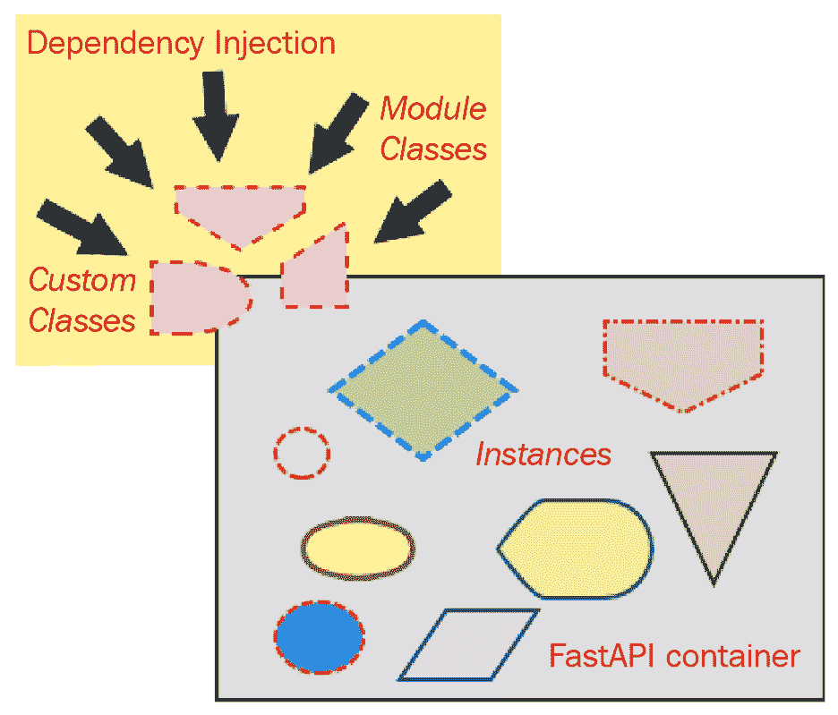
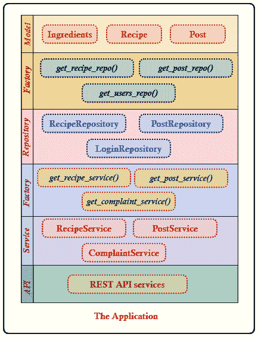
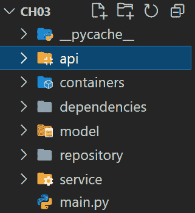

# 3

# 调查依赖注入

自从第一章以来，`BaseModel`、`Request`、`Response` 和 `BackgroundTasks` 在其过程中应用 DI。应用 DI 证明实例化一些 FastAPI 类并不总是理想的方法，因为框架有一个内置的容器可以提供这些类的对象给 API 服务。这种对象管理方法使得 FastAPI 使用起来既简单又高效。

FastAPI 有一个容器，其中 DI 策略被应用于实例化模块类甚至函数。我们只需要将这些模块 API 指定和声明给服务、中间件、验证器、数据源和测试用例，因为其余的对象组装、管理和实例化现在由内置的容器负责。

本章将帮助您了解如何管理应用程序所需的对象，例如最小化某些实例并在它们之间创建松散的绑定。了解 DI 在 FastAPI 上的有效性是我们设计我们的微服务应用程序的第一步。我们的讨论将集中在以下方面：

+   应用 **控制反转**（**IoC**）和 DI

+   探索依赖注入的方法

+   基于依赖关系组织项目

+   使用第三方容器

+   实例的作用域

# 技术要求

本章使用一个名为 *在线食谱系统* 的软件原型，该系统管理、评估、评分和报告不同类型和来源的食谱。应用 DI 模式是这个项目的优先任务，因此请期待在开发策略和方法上的一些变化，例如添加 `model`、`repository` 和 `service` 文件夹。这款软件是为想要分享他们专长的美食爱好者或厨师、寻找食谱进行实验的新手以及喜欢浏览不同食物菜单的客人准备的。这个开放式的应用程序目前还没有使用任何数据库管理系统，因此所有数据都暂时存储在 Python 容器中。代码已全部上传至 [`github.com/PacktPublishing/Building-Python-Microservices-with-FastAPI/tree/main/ch03`](https://github.com/PacktPublishing/Building-Python-Microservices-with-FastAPI/tree/main/ch03)。

# 应用 IoC/DI

FastAPI 是一个支持 IoC 原则的框架，这意味着它有一个容器可以为应用程序实例化对象。在典型的编程场景中，我们实例化类以多种方式使用它们来构建运行中的应用程序。但是，使用 IoC，框架为应用程序实例化组件。*图 3.1* 展示了 IoC 原则的全貌及其一种形式，称为 DI。



图 3.1 – IoC 原则

对于 FastAPI 来说，依赖注入（DI）不仅是一个原则，也是一种将对象集成到组件中的机制，这有助于创建一个*松散耦合*但*高度内聚*的软件结构。几乎所有的组件都可以成为 DI 的候选者，包括*函数*。但就目前而言，让我们专注于*可调用组件*，一旦它们被注入到 API 服务中，就会提供一些 JSON 对象——我们称之为*依赖函数*的可注入和可调用组件。

## 注入依赖函数

如以下代码所示，`create_login()`位于项目的`/api/users.py`模块中：

```py
def create_login(id:UUID, username: str, password:str, 
                 type: UserType):
    account = {"id": id, "username": username, "password":
                 password, "type": type}
    return account
```

该函数需要`id`、`username`、`password`参数以及`type`来继续其过程并返回一个有效的 JSON `account`对象，这些参数是其派生出来的。依赖函数有时会使用一些底层公式、资源或复杂算法来推导其函数值，但就目前而言，我们将其用作*数据占位符*或`dict`。

对于依赖函数来说，常见的做法是将方法参数用作 REST API 接收到的请求的占位符。这些参数通过 DI 连接到 API 的方法参数列表，作为领域模型，对应于查询参数或请求体。`fastapi`模块中的`Depends()`函数在将注入项连接到本地参数之前执行注入。模块函数只能接受一个参数进行注入：

```py
from fastapi import APIRouter, Depends
@router.get("/users/function/add")
def populate_user_accounts(
              user_account=Depends(create_login)):
    account_dict = jsonable_encoder(user_account)
    login = Login(**account_dict)
    login_details[login.id] = login
    return login
```

前面是一个来自我们*在线食谱系统*的代码片段，展示了`Depends()`如何将`create_login()`注入到框架的容器中，并获取其实例以用于将`populate_user_accounts()`服务连接起来。在语法上，注入过程只需要函数依赖项的名称，无需括号。再次强调，`create_login()`的目的在于捕获 API 服务的查询参数。`jsonable_encoder()`对于许多 API 来说非常有用，它可以将这些注入项转换为 JSON 兼容的类型，如`dict`，这对于*实例化所需的数据模型*和*生成响应*至关重要。

重要提示

术语**依赖项**可以与**注入项**、**依赖项**、**资源**、**提供者**或**组件**互换使用。

## 注入一个可调用类

FastAPI 还允许将类注入到任何组件中，因为它们也可以被视为*可调用*组件。一个类在实例化过程中成为可调用，当对其构造函数`__init__(self)`的调用完成时。其中一些类具有*无参*构造函数，而其他类，如以下`Login`类，则需要构造函数参数：

```py
class Login:
    def __init__(self, id: UUID, username: str, 
                 password: str, type: UserType): 
        self.id = id
        self.username = username
        self.password = password
        self.type= type
```

位于`/model/users.py`的`Login`类在实例化之前需要将`id`、`username`、`password`和`type`传递给其构造函数。一个可能的实例化方式是`Login(id='249a0837-c52e-48cd-bc19-c78e6099f931', username='admin', password='admin2255', type=UserType.admin)`。总体来看，我们可以观察到类和依赖函数在可调用行为和捕获请求数据（如模型属性）方面的相似性。

相反，以下代码块中展示的`populate_login_without_service()`显示了`Depends()`如何将`Login`注入到服务中。`Depends()`函数告诉内置容器实例化`Login`并获取该实例，准备分配给`user_account`局部参数：

```py
@router.post("/users/datamodel/add")
def populate_login_without_service(
              user_account=Depends(Login)):
    account_dict = jsonable_encoder(user_account)
    login = Login(**account_dict)
    login_details[login.id] = login
    return login
```

重要提示

所有依赖都应该在服务参数列表的最右侧声明。如果有查询、路径或表单参数，注入式依赖应该放在最后。此外，如果注入式依赖不包含默认难以编码的数据，使用`jsonable_encoder()`函数也是一个选项。

## 构建嵌套依赖

有一些场景下，注入式依赖也依赖于其他依赖。当我们向另一个函数注入函数依赖、向另一个类注入式依赖或向类注入函数资源时，目标是构建嵌套依赖。嵌套依赖对 REST API 有益，特别是对于需要通过子域模型进行结构化和分组的长时间和复杂请求数据。这些子域或模型内的域模型随后被 FastAPI 编码为与 JSON 兼容的类型作为子依赖：

```py
async def create_user_details(id: UUID, firstname: str,
         lastname: str, middle: str, bday: date, pos: str, 
         login=Depends(create_login)):
    user = {"id": id, "firstname": firstname, 
            "lastname": lastname, "middle": middle, 
            "bday": bday, "pos": pos, "login": login}
    return user
```

之前异步的`create_user_details()`函数表明，即使依赖函数也需要另一个依赖来满足其目的。这个函数依赖于`create_login()`，这是另一个可靠的组件。通过这种嵌套依赖设置，将`create_user_details()`连接到 API 服务也包括将`create_login()`注入到容器中。简而言之，当应用嵌套依赖时，将创建一系列依赖注入链：

```py
@router.post("/users/add/profile")
async def add_profile_login(
          profile=Depends(create_user_details)): 
    user_profile = jsonable_encoder(profile)
    user = User(**user_profile)
    login = user.login
    login = Login(**login)
    user_profiles[user.id] = user
    login_details[login.id] = login
    return user_profile
```

之前的`add_profile_login()`服务清楚地展示了其对`create_user_details()`的依赖，包括其底层的登录详情。FastAPI 容器通过链式依赖成功创建了两个函数，以在 API 请求事务中捕获请求数据。

相反，一个类也可以依赖于另一个类。这里以`Profile`类为例，它依赖于`UserDetails`和`Login`类：

```py
class Login:
    def __init__(self, id: UUID, username: str, 
                 password: str, type: UserType): 
        self.id = id
        self.username = username
        self.password = password
        self.type= type
class UserDetails: 
    def __init__(self, id: UUID, firstname: str, 
            lastname: str, middle: str, bday: date, 
               pos: str ):
        self.id = id 
        self.firstname = firstname 
        self.lastname = lastname 
        self.middle = middle 
        self.bday = bday 
        self.pos = pos

class Profile:
    def __init__(self, id: UUID, date_created: date, 
        login=Depends(Login), user=Depends(UserDetails)): 
        self.id = id 
        self.date_created = date_created
        self.login = login 
        self.user = user
```

这里有一个嵌套依赖，因为一旦`Profile`连接到 REST API 服务，两个类将一起注入。

以下`add_profile_login_models()`服务展示了这些链式依赖的明显优势：

```py
@router.post("/users/add/model/profile")
async def add_profile_login_models(
                   profile=Depends(Profile)): 
     user_details = jsonable_encoder(profile.user)
     login_details = jsonable_encoder(profile.login)
     user = UserDetails(**user_details)
     login = Login(**login_details)
     user_profiles[user.id] = user
     login_details[login.id] = login
     return {"profile_created": profile.date_created}
```

提取`profile.user`和`profile.login`使得服务更容易识别需要反序列化的查询数据。它还有助于服务确定哪些数据组需要`Login`实例化，哪些是为`UserDetails`。因此，将更容易管理这些对象在其各自的`dict`存储库中的持久性。

在稍后讨论如何在函数和类之间创建显式依赖关系，但现在，让我们看看如何在应用中使用大量这些嵌套依赖项时进行微调。

## 缓存依赖项

所有依赖项都是*可缓存的*，FastAPI 在请求事务期间会缓存所有这些依赖项。如果一个依赖项对所有服务都是通用的，FastAPI 默认不会允许你从其容器中获取这些对象。相反，它会在其缓存中寻找这个可注入项，以便在 API 层跨多次使用。保存依赖项，特别是嵌套依赖项，是 FastAPI 的一个好特性，因为它优化了 REST 服务的性能。

相反，`Depends()`有一个`use_cache`参数，如果我们想绕过这个缓存机制，我们可以将其设置为`False`。配置这个钩子将不会在请求事务期间从缓存中保存依赖项，允许`Depends()`更频繁地从容器中获取实例。下面所示`add_profile_login_models()`服务的另一个版本展示了如何禁用依赖项缓存：

```py
@router.post("/users/add/model/profile")
async def add_profile_login_models(
   profile:Profile=Depends(Profile, use_cache=False)): 
     user_details = jsonable_encoder(profile.user)
     login_details = jsonable_encoder(profile.login)
     … … … … … …
     return {"profile_created": profile.date_created}
```

在前面服务实现中的另一个明显变化是`Profile`数据类型出现在局部参数声明中。这是 FastAPI 允许的吗？

## 声明 Depends()参数类型

通常，我们不会声明将引用注入依赖项的局部参数的类型。由于*类型提示*，我们可以选择性地将引用与其适当的对象类型关联起来。例如，我们可以重新实现`populate_user_accounts()`以包含`user_account`的类型，如下所示：

```py
@router.get("/users/function/add")
def populate_user_accounts(
           user_account:Login=Depends(create_login)):
    account_dict = jsonable_encoder(user_account)
    login = Login(**account_dict)
    login_details[login.id] = login
    return login
```

这种场景很少发生，因为`create_login()`是一个依赖函数，我们通常不会仅为了提供其返回值的蓝图类型而创建类。但是，当我们使用类依赖项时，将适当的类类型声明给连接的对象是可行的，如下面的`add_profile_login_models()`服务所示，其中将`profile`参数声明为`Profile`：

```py
@router.post("/users/add/model/profile")
async def add_profile_login_models(
              profile:Profile=Depends(Profile)): 
     user_details = jsonable_encoder(profile.user)
     login_details = jsonable_encoder(profile.login)
     … … … … … …
     return {"profile_created": profile.date_created}
```

虽然声明在语法上是有效的，但由于`Profile`类型在声明部分出现了两次，所以表达式看起来*重复*且*冗余*。为了避免这种冗余，我们可以通过在`Depends()`函数内部省略类名来替换语句，使用简写版本。因此，声明前面`profile`的更好方式应该是以下这样：

```py
@router.post("/users/add/model/profile")
async def add_profile_login_models(
              profile:Profile=Depends()): 
     user_details = jsonable_encoder(profile.user)
     ... ... ... ... ... ...
     return {"profile_created": profile.date_created}
```

参数列表上的更改不会影响`add_profile_login_models()`服务请求事务的性能。

## 注入异步依赖项

FastAPI 内置容器不仅管理 *同步* 函数依赖项，还管理 *异步* 依赖项。下面的 `create_user_details()` 是一个异步依赖项，准备好连接到服务：

```py
async def create_user_details(id: UUID, firstname: str, 
       lastname: str, middle: str, bday: date, pos: str, 
       login=Depends(create_login)):
    user = {"id": id, "firstname": firstname, 
            "lastname": lastname, "middle": middle, 
            "bday": bday, "pos": pos, "login": login}
    return user
```

容器可以管理同步和异步函数依赖项。它允许在异步 API 服务上连接 *异步依赖项* 或在同步 API 上连接一些 *异步依赖项*。当依赖项和服务都是异步的情况下，建议使用 `async`/`await` 协议以避免结果的不一致。依赖于同步 `create_login()` 的 `create_user_details()` 在异步 API `add_profile_login()` 上被连接。

在学习 FastAPI 中依赖注入设计模式的工作原理之后，下一步是了解在我们的应用程序中应用 `Depends()` 的不同策略级别。

# 探索注入依赖项的方法

从之前的讨论中，我们知道 FastAPI 有一个内置的容器，通过它一些对象被注入和实例化。同样，我们也了解到，唯一可注入的 FastAPI 组件是那些所谓的依赖项、可注入项或依赖。现在，让我们列举出在我们的应用程序中追求依赖注入模式的不同方法。

## 服务上的依赖注入

DI 发生最常见的地方是在服务方法的 *参数列表* 中。关于这种策略的任何讨论已经在之前的示例中解决，所以我们只需要提出关于这种策略的额外观点：

+   首先，服务方法应该接受的定制可注入项的数量也是需要关注的一部分。当涉及到复杂的查询参数或请求体时，只要这些依赖项中没有相似的实例变量名，API 服务就可以接受多个可注入项。这些依赖项之间的 *变量名冲突* 将导致在请求事务中只有一个参数条目用于冲突变量，从而使得所有这些冲突变量共享相同的值。

+   其次，与可注入项一起工作的合适的 *HTTP 方法操作* 也是需要考虑的一个方面。函数和类依赖项都可以与 `GET`、`POST`、`PUT` 和 `PATCH` 操作一起工作，但那些具有如数值 `Enum` 和 `UUID` 等属性类型的依赖项可能会因为转换问题而导致 *HTTP 状态 422*（**不可处理实体**）。我们必须首先计划适用于某些依赖项的 HTTP 方法，然后再实现服务方法。

+   第三，并非所有依赖项都是请求数据的占位符。与类依赖项不同，依赖函数并不专门用于返回对象或`dict`。其中一些用于**过滤请求数据**、**审查认证细节**、**管理表单数据**、**验证头值**、**处理 cookie**，并在违反某些规则时**抛出一些错误**。以下`get_all_recipes()`服务依赖于一个`get_recipe_service()`注入函数，该函数将从应用的`dict`存储库中查询所有食谱：

```py
@router.get("/recipes/list/all")
def get_all_recipes(handler=Depends(get_recipe_service)):
      return handler.get_recipes()
```

依赖函数提供了所需的交易，例如保存和检索食谱的记录。而不是使用常规的实例化或方法调用，更好的策略是将这些**依赖服务**注入到 API 实现中。`handler`方法参数，它指的是`get_recipe_service()`的实例，调用特定服务的`get_recipes()`交易以检索存储库中存储的所有菜单和成分。

## 路径操作符上的依赖注入

总是有一个选项来实现**触发器**、**验证器**和**异常处理器**作为可注入的函数。由于这些依赖项像**过滤器**一样作用于传入的请求，它们的注入发生在**路径操作符**中，而不是在服务参数列表中。以下代码是`/dependencies/posts.py`中找到的`check_feedback_length()`验证器的实现，该验证器检查用户针对食谱发布的反馈是否至少包含 20 个字符（包括空格）：

```py
def check_feedback_length(request: Request): 
    feedback = request.query_params["feedback"]
    if feedback == None:
        raise HTTPException(status_code=500, 
           detail="feedback does not exist")
    if len(feedback) < 20:
        raise HTTPException(status_code=403, 
           detail="length of feedback … not lower … 20")
```

如果验证器的长度小于 20，验证器会暂停 API 执行以从待验证的帖子中检索反馈。如果依赖函数发现它是`True`，它将抛出**HTTP 状态 403**。如果请求数据中缺少反馈，它将发出**状态码 500**；否则，它将允许 API 事务完成其任务。

与`create_post()`和`post_service()`依赖项相比，以下脚本显示`check_feedback_length()`验证器在`insert_post_feedback()`服务内部没有任何地方被调用：

```py
async def create_post(id:UUID, feedback: str, 
    rating: RecipeRating, userId: UUID, date_posted: date): 
    post = {"id": id, "feedback": feedback, 
            "rating": rating, "userId" : userId, 
            "date_posted": date_posted}
    return post
@router.post("/posts/insert",
      dependencies=[Depends(check_feedback_length)])
async def insert_post_feedback(post=Depends(create_post), 
          handler=Depends(post_service)): 
    post_dict = jsonable_encoder(post)
    post_obj = Post(**post_dict)
    handler.add_post(post_obj)
    return post
```

验证器将始终与传入的请求事务紧密工作，而其他两个注入项`post`和`handler`则是 API 事务的一部分。

重要提示

`APIRouter`的路径路由器可以容纳多个可注入项，这就是为什么它的`dependencies`参数始终需要一个`List`值（`[]`）。

## 路由器上的依赖注入

然而，有些事务并不是专门针对一个特定的 API 进行本地化的。有一些依赖函数被创建出来，用于与一个应用中特定组的 REST API 服务一起工作，例如以下`count_user_by_type()`和`handler check_credential_error()`事件，这些事件被设计用来管理`user.router`组下的 REST API 的传入请求。这种策略需要在`APIRouter`级别进行依赖注入：

```py
from fastapi import Request, HTTPException
from repository.aggregates import stats_user_type
import json
def count_user_by_type(request: Request):
    try:
      count = 
          stats_user_type[request.query_params.get("type")]
      count += 1
      stats_user_type[request.query_params.get("type")] =
          count
      print(json.dumps(stats_user_type))
    except:
      stats_user_type[request.query_params.get("type")] = 1
def check_credential_error(request: Request): 
    try:
      username = request.query_params.get("username")
      password = request.query_params.get("password")
      if username == password:
        raise HTTPException(status_code=403, 
         detail="username should not be equal to password")
    except:
      raise HTTPException(status_code=500, 
           detail="encountered internal problems")         
```

根据 preceding 实现，`count_user_by_type()` 的目标是根据 `UserType` 在 `stats_user_type` 中构建用户的更新频率。它的执行是在 REST API 从客户端接收到新用户和登录详情后立即开始的。在检查新记录的 `UserType` 时，API 服务会短暂暂停，并在函数依赖完成其任务后恢复。

相反，`check_credential_error()` 的任务是确保新用户的 `username` 和 `password` 不应相同。当凭证相同时，它会抛出 *HTTP 状态 403*，这将停止整个 REST 服务事务。

通过 `APIRouter` 注入这两个依赖项意味着在该 `APIRouter` 中注册的所有 REST API 服务都将始终触发这些依赖项的执行。这些依赖项只能与设计用于持久化 `user` 和 `login` 详情的 API 服务一起工作，如下所示：

```py
from fastapi import APIRouter, Depends
router = APIRouter(dependencies=[
                      Depends(count_user_by_type), 
                      Depends(check_credential_error)])
@router.get("/users/function/add")
def populate_user_accounts(
          user_account:Login=Depends(create_login)):
    account_dict = jsonable_encoder(user_account)
    login = Login(**account_dict)
    login_details[login.id] = login
    return login
```

注入到 `APIRouter` 组件中的 `check_credential_error()` 会过滤从 `create_login()` 注入式函数中得到的 `username` 和 `password`。同样，它也会过滤 `add_profile_login()` 服务的 `create_user_details()` 注入式，如下面的片段所示：

```py
@router.post("/users/add/profile")
async def add_profile_login(
          profile=Depends(create_user_details)): 
    user_profile = jsonable_encoder(profile)
    user = User(**user_profile)
    login = user.login
    login = Login(**login)
    user_profiles[user.id] = user
    login_details[login.id] = login
    return user_profile
@router.post("/users/datamodel/add")
def populate_login_without_service(
          user_account=Depends(Login)):
    account_dict = jsonable_encoder(user_account)
    login = Login(**account_dict)
    login_details[login.id] = login
    return login
```

`Login` 注入式类也会通过 `check_credential_error()` 进行过滤。它也包含注入式函数可以过滤的 `username` 和 `password` 参数。相反，以下 `add_profile_login_models()` 服务的 `Profile` 注入式没有被排除在错误检查机制之外，因为它在其构造函数中有一个 `Login` 依赖。拥有 `Login` 依赖意味着 `check_cedential_error()` 也会过滤 `Profile`。

使用 `check_credential_error()` 是 `count_user_by_type()` 注入式，用于统计访问 API 服务的用户数量：

```py
@router.post("/users/add/model/profile")
async def add_profile_login_models(
          profile:Profile=Depends(Profile)): 
     user_details = jsonable_encoder(profile.user)
     ... ... ... ... ... ...
     login = Login(**login_details)
     user_profiles[user.id] = user
     login_details[login.id] = login
     return {"profile_created": profile.date_created}
```

连接到 `APIRouter` 的依赖函数应该应用防御性编程和适当的 `try-except` 来避免与 API 服务发生参数冲突。例如，如果我们用 `list_all_user()` 服务运行 `check_credential_error()`，可能会遇到一些运行时问题，因为在数据检索期间没有涉及 `login` 持久化。

重要提示

类似于其路径操作符，`APIRouter` 的构造函数也可以接受多个注入式，因为它的 `dependencies` 参数将允许一个 `List` (`[]`) 的有效值。

## 在 main.py 上的依赖注入

由于范围广泛且复杂，软件的某些部分很难自动化，因此考虑它们将始终是时间和精力的浪费。这些 *横切关注点* 从 UI 层到数据层，这解释了为什么这些功能在实际管理和实现上是不切实际的，甚至难以想象。这些横切关注点包括如 *异常记录*、*缓存*、*监控* 和 *用户授权* 等事务，这些是任何应用程序都共有的。

FastAPI 有一个简单的解决方案来解决这些 *特性*：将它们作为可注入到 `main.py` 的 FastAPI 实例中的可注入项：

```py
from fastapi import Request
from uuid import uuid1
service_paths_log = dict()
def log_transaction(request: Request): 
    service_paths_log[uuid1()] = request.url.path
```

前面的 `log_transaction()` 是一个简单的记录器，用于记录客户端调用的或访问的 `URL` 路径。当应用程序运行时，这个跨切面应该将不同的 `APIRouter` 发来的不同 `URL` 传播到存储库中。这项任务只能在通过 `main.py` 的 FastAPI 实例注入这个函数时发生：

```py
from fastapi import FastAPI, Depends
from api import recipes, users, posts, login, admin, 
        keywords, admin_mcontainer, complaints
from dependencies.global_transactions import    
        log_transaction
app = FastAPI(dependencies=[Depends(log_transaction)])
app.include_router(recipes.router, prefix="/ch03")
app.include_router(users.router, prefix="/ch03")
   … … … … … …
app.include_router(admin.router, prefix="/ch03")
app.include_router(keywords.router, prefix="/ch03")
app.include_router(admin_mcontainer.router, prefix="/ch03")
app.include_router(complaints.router, prefix="/ch03")
```

与 FastAPI 构造函数自动连接的依赖项被称为 *全局依赖项*，因为它们可以通过任何路由器的 REST API 访问。例如，前面脚本中描述的 `log_transaction()` 将在 `recipes`、`users`、`posts` 或 `complaints` 路由器处理它们各自的请求事务时执行。

重要提示

与 `APIRouter` 类似，`FastAPI` 的构造函数允许更多的函数依赖。

除了这些策略之外，依赖注入（DI）还可以通过拥有 `repository`、`service` 和 `model` 层来组织我们的应用程序。

# 基于依赖关系组织项目

在一些复杂的 FastAPI 应用程序中，可以通过依赖注入（DI）使用 *存储库-服务* 模式。存储库-服务模式负责创建应用程序的 **存储库层**，该层管理数据源的增加、读取、更新和删除（CRUD）。存储库层需要 **数据模型** 来描述集合或数据库的表结构。存储库层需要 **服务层** 来与其他应用程序部分建立连接。服务层就像一个业务层，数据源和业务流程在这里相遇，以生成 REST API 所需的所有必要对象。存储库和服务层之间的通信只能通过创建可注入项来实现。现在，让我们通过可注入组件来探索 *图 3.2* 中显示的层是如何构建的。



图 3.2 – 存储库-服务层

## 模型层

这一层纯粹由 *资源*、*集合* 和 *Python 类* 组成，这些类可以被存储库层用来创建 CRUD 事务。一些模型类依赖于其他模型，但有些只是为数据占位符设计的独立蓝图。以下是一些存储与食谱相关细节的应用程序模型类示例：

```py
from uuid import UUID
from model.classifications import Category, Origin
from typing import Optional, List
class Ingredient:
    def __init__(self, id: UUID, name:str, qty : float,
               measure : str):
        self.id = id
        self.name = name
        self.qty = qty
        self.measure = measure

class Recipe:
    def __init__(self, id: UUID, name: str, 
           ingredients: List[Ingredient], cat: Category, 
             orig: Origin):
        self.id = id
        self.name = name
        self.ingredients = ingredients
        self.cat = cat
        self.orig = orig
```

## 存储库层

这一层由类依赖组成，可以访问 *数据存储* 或即兴的 `dict` 存储库，就像在我们的 *在线食谱系统* 中一样。与模型层一起，这些存储库类构建了 REST API 所需要的 CRUD 事务。以下是一个具有两个事务（即 `insert_recipe()` 和 `query_recipes()`）的 `RecipeRepository` 实现示例：

```py
from model.recipes import Recipe
from model.recipes import Ingredient
from model.classifications import Category, Origin
from uuid import uuid1 
recipes = dict()
class RecipeRepository: 
    def __init__(self): 
        ingrA1 = Ingredient(measure='cup', qty=1, 
             name='grape tomatoes', id=uuid1())
        ingrA2 = Ingredient(measure='teaspoon', qty=0.5, 
             name='salt', id=uuid1())
        ingrA3 = Ingredient(measure='pepper', qty=0.25, 
             name='pepper', id=uuid1())
        … … … … … …
        recipeA = Recipe(orig=Origin.european ,
         ingredients= [ingrA1, ingrA2, ingrA3, ingrA4, 
              ingrA5, ingrA6, ingrA7, ingrA8, ingrA9], 
         cat= Category.breakfast, 
         name='Crustless quiche bites with asparagus and 
               oven-dried tomatoes', 
         id=uuid1())
        ingrB1 = Ingredient(measure='tablespoon', qty=1, 
           name='oil', id=uuid1())
        ingrB2 = Ingredient(measure='cup', qty=0.5, 
           name='chopped tomatoes', id=uuid1())
        … … … … … …
        recipeB = Recipe(orig=Origin.carribean ,
           ingredients= [ingrB1, ingrB2, ingrB3, ingrB4, 
             ingrB5], 
           cat= Category.breakfast, 
           name='Fried eggs, Caribbean style', id=uuid1())
        ingrC1 = Ingredient(measure='pounds', qty=2.25, 
           name='sweet yellow onions', id=uuid1())
        ingrC2 = Ingredient(measure='cloves', qty=10, 
           name='garlic', id=uuid1())
        … … … … … …
        recipeC = Recipe(orig=Origin.mediterranean ,
          ingredients= [ingrC1, ingrC2, ingrC3, ingrC4, 
             ingrC5, ingrC6, ingrC7, ingrC8], 
          cat= Category.soup, 
          name='Creamy roasted onion soup', id=uuid1())

        recipes[recipeA.id] = recipeA
        recipes[recipeB.id] = recipeB
        recipes[recipeC.id] = recipeC

    def insert_recipe(self, recipe: Recipe):
        recipes[recipe.id] = recipe

    def query_recipes(self):
        return recipes
```

其构造函数用于填充一些初始数据。*可注入存储库* 类的构造函数在数据存储设置和配置中发挥作用，这也是我们在这里 *自动连接* 依赖的地方。相反，实现包括两个 `Enum` 类 – `Category` 和 `Origin` – 分别为食谱的菜单类别和产地提供查找值。

## 存储库工厂方法

这一层使用 *工厂设计模式* 在存储库和服务层之间添加了一种更松散的耦合设计。尽管这种方法是可选的，但这仍然是一个管理两层之间相互依赖阈值的选项，尤其是在 CRUD 事务的性能、流程和结果频繁变化时。以下是我们应用程序使用的存储库工厂方法：

```py
def get_recipe_repo(repo=Depends(RecipeRepository)):
    return repo
def get_post_repo(repo=Depends(PostRepository)): 
    return repo
def get_users_repo(repo=Depends(AdminRepository)): 
    return repo
def get_keywords(keywords=Depends(KeywordRepository)): 
    return keywords
def get_bad_recipes(repo=Depends(BadRecipeRepository)): 
    return repo
```

从前面的脚本中我们可以看到，`RecipeRepository` 是工厂方法的可靠对象，这些方法也是可注入的组件，但属于服务层。例如，`get_recipe_repo()` 将与一个服务类连接，以实现需要从 `RecipeRepository` 进行一些事务的原生服务。从某种意义上说，我们间接地将存储库类连接到服务层。

## 服务层

这一层包含所有应用程序的服务和领域逻辑，例如我们的 `RecipeService`，它为 `RecipeRepository` 提供业务流程和算法。`get_recipe_repo()` 工厂通过其构造函数注入，以提供来自 `RecipeRepository` 的 CRUD 事务。这里使用的注入策略是类依赖函数，如下面的代码所示：

```py
from model.recipes import Recipe
from repository.factory import get_recipe_repo
class RecipeService: 
    def __init__(self, repo=Depends(get_recipe_repo)):
        self.repo = repo

    def get_recipes(self):
        return self.repo.query_recipes()

    def add_recipe(self, recipe: Recipe):
        self.repo.insert_recipe(recipe)
```

典型的 Python 类的构造函数始终是注入组件的适当位置，这些组件可以是函数或类依赖。由于前面的 `RecipeService`，其 `get_recipes()` 和 `add_recipe()` 是通过从 `get_recipe_repo()` 得到的事务实现的。

## REST API 和服务层

REST API 方法可以直接注入服务类或工厂方法，如果它需要访问服务层。在我们的应用中，每个服务类都有一个与之关联的工厂方法，以应用在`RecipeRepository`注入中使用的相同策略。这就是为什么在下面的脚本中，`get_recipe_service()`方法被连接到 REST API 而不是`RecipeService`：

```py
class IngredientReq(BaseModel):
    id: UUID 
    name:str
    qty: int
    measure: str

class RecipeReq(BaseModel):
    id: UUID 
    name: str
    ingredients: List[IngredientReq]
    cat: Category
    orig: Origin

router = APIRouter()
@router.post("/recipes/insert")
def insert_recipe(recipe: RecipeReq, 
            handler=Depends(get_recipe_service)): 
    json_dict = jsonable_encoder(recipe)
    rec = Recipe(**json_dict)
    handler.add_recipe(rec)
    return JSONResponse(content=json_dict, status_code=200)
@router.get("/recipes/list/all")
def get_all_recipes(handler=Depends(get_recipe_service)):
    return handler.get_recipes()
```

`insert_recipe()`是一个 REST API，它接受来自客户端的食谱及其成分以进行持久化，而`get_all_recipes()`则返回`List[Recipe]`作为响应。

## 实际项目结构

利用 DI（依赖注入）的力量，我们创建了一个包含组织良好的*模型*、*存储库*和*服务*层的*在线食谱系统*。*图 3.3*中显示的项目结构由于增加了这些层而与之前的原型有很大不同，但它仍然包含`main.py`以及所有带有相应`APIRouter`的包和模块。



图 3.3 – 在线食谱系统的项目结构

到目前为止，DI 已经为 FastAPI 应用提供了许多优势，从对象实例化工程到分解单体组件以设置松散耦合的结构。但只有一个小问题：FastAPI 的默认容器。框架的容器没有简单的配置来将所有管理的对象设置为*单例*范围。大多数应用更喜欢获取单例对象以避免在**Python 虚拟机**（**PVM**）中浪费内存。此外，内置的容器不对更详细的容器配置开放，例如拥有*多个容器*设置。接下来的讨论将集中在 FastAPI 默认容器的限制以及克服它的解决方案。

# 使用第三方容器

DI 为我们提供了很多改进应用的方法，但它仍然依赖于我们使用的框架以充分发挥这种设计模式的潜力。当关注点仅在于对象管理和项目组织时，FastAPI 的容器对一些人来说是非常可接受的。然而，当涉及到配置容器以添加更多高级功能时，对于短期项目来说这是不可行的，而对于大型应用来说由于限制将变得不可能。因此，实际的方法是依靠*第三方模块*来提供支持所有这些进步所需的实用工具集。因此，让我们探索这些与 FastAPI 无缝集成的流行外部模块，即*依赖注入器*和*Lagom*，我们可以使用它们来设置一个完整且可管理的容器。

## 使用可配置的容器 – 依赖注入器

当涉及到可配置的容器时，*依赖注入器*有几个模块 API 可以用来构建自定义容器的变体，这些容器可以管理、组装和注入对象。但在我们能够使用此模块之前，我们需要首先使用`pip`安装它：

```py
pip install dependency-injector
```

### 容器和提供者模块

在所有 API 类型中，*依赖注入器* 因其 *容器* 和 *提供者* 而受到欢迎。其容器类型之一是 `DeclarativeContainer`，它可以被继承以包含所有提供者。其提供者可以是 `Factory`、`Dict`、`List`、`Callable`、`Singleton` 或其他 *容器*。`Dict` 和 `List` 提供者都很容易设置，因为它们只需要分别实例化 `list` 和 `dict`。相反，`Factory` 提供者可以实例化任何类，例如存储库、服务或通用的 Python 类，而 `Singleton` 只为每个类创建一个实例，该实例在整个应用程序的运行期间都是有效的。`Callable` 提供者管理函数依赖关系，而 `Container` 实例化其他容器。另一种容器类型是 `DynamicContainer`，它由配置文件、数据库或其他资源构建而成。

### 容器类型

除了这些容器 API 之外，*依赖注入器* 允许我们根据可信对象的数量、项目结构或其他项目标准来自定义容器。最常见的形式或设置是适合小型、中型或大型应用的单一声明式容器。我们的 *在线食谱系统* 原型拥有一个单一的声明式容器，该容器在以下脚本中实现：

```py
from dependency_injector import containers, providers
from repository.users import login_details
from repository.login import LoginRepository
from repository.admin import AdminRepository
from repository.keywords import KeywordRepository
from service.recipe_utilities import get_recipe_names 
class Container(containers.DeclarativeContainer):
    loginservice = providers.Factory(LoginRepository)
    adminservice = providers.Singleton(AdminRepository)
    keywordservice = providers.Factory(KeywordRepository)
    recipe_util = providers.Callable(get_recipe_names) 
    login_repo = providers.Dict(login_details)
```

通过简单地继承 `DeclarativeContainer`，我们可以轻松地创建一个容器，其实例通过之前提到的各种提供者注入。`LoginRepository` 和 `KeywordRepository` 都是通过 Factory 提供者注入的新实例。`AdminRepository` 是一个注入的单例对象，`get_recipe_names()` 是一个注入的可信函数，而 `login_details` 是一个包含登录凭证的注入字典。

### FastAPI 和依赖注入器集成

要通过依赖注入器将依赖关系连接到组件，请应用 `@inject` 装饰器。`@inject` 从 `dependency_injector.wiring` 模块导入，并装饰在 *依赖* 组件上。

之后，将使用 `Provide` 连接标记从容器中检索实例。连接标记在容器中搜索引用注入对象的 `Provider` 对象，如果存在，它将为 *自动连接* 准备。`@inject` 和 `Provide` 都属于同一个 API 模块：

```py
from repository.keywords import KeywordRepository
from containers.single_container import Container
from dependency_injector.wiring import inject, Provide
from uuid import UUID
router = APIRouter()
@router.post("/keyword/insert")
@inject
def insert_recipe_keywords(*keywords: str, 
         keywordservice: KeywordRepository = 
           Depends(Provide[Container.keywordservice])): 
    if keywords != None:
        keywords_list = list(keywords)
        keywordservice.insert_keywords(keywords_list)
        return JSONResponse(content={"message": 
          "inserted recipe keywords"}, status_code=201)
    else:
        return JSONResponse(content={"message": 
          "invalid operation"}, status_code=403)
```

当调用 `Depends()` 函数指令以注册连接标记和 `Provider` 实例到 FastAPI 时，发生集成。除了确认之外，注册还向第三方 `Provider` 添加 *类型提示* 和 *Pydantic 验证规则*，以便适当地将注入对象连接到 FastAPI。前面的脚本从其模块导入 `Container`，通过 `@inject` 连接标记和 *依赖注入器* 的 `keywordservice` 提供者来连接 `KeywordRepository`。

现在，最后一部分是要通过 FastAPI 平台 *组装*、*创建* 和 *部署* 单个声明性容器。这个最后的集成措施需要在发生注入的模块内部实例化 *容器*，然后调用其 `wire()` 方法，该方法构建组装。由于前面的 `insert_recipe_keywords()` 是 `/api/keywords.py` 的一部分，我们应该在 `keywords` 模块脚本中添加以下行，尤其是在其末尾部分：

```py
import sys
… … … … …
container = Container()
container.wire(modules=[sys.modules[__name__]])
```

### 多容器配置

对于大型应用程序，仓库事务和服务数量根据应用程序的功能和特殊功能而增加。如果单个声明性类型对于不断增长的应用程序来说变得不可行，那么我们总是可以用 *多容器* 设置来替换它。

依赖注入器允许我们为每组服务创建一个单独的容器。我们的应用程序创建了一个示例设置，位于 `/containers/multiple_containers.py` 中，以防这个原型变成完整的产品。以下是如何展示多个声明性容器的示例：

```py
from dependency_injector import containers, providers
from repository.login import LoginRepository
from repository.admin import AdminRepository
from repository.keywords import KeywordRepository
class KeywordsContainer(containers.DeclarativeContainer): 
    keywordservice = providers.Factory(KeywordRepository)
    … … … … …
class AdminContainer(containers.DeclarativeContainer): 
    adminservice = providers.Singleton(AdminRepository)
    … … … … …
class LoginContainer(containers.DeclarativeContainer): 
    loginservice = providers.Factory(LoginRepository)
    … … … … …

class RecipeAppContainer(containers.DeclarativeContainer): 
    keywordcontainer = 
          providers.Container(KeywordsContainer)
    admincontainer = providers.Container(AdminContainer)
    logincontainer = providers.Container(LoginContainer)
    … … … … …
```

基于前面的配置，创建的三个不同的 `DeclarativeContainer` 实例是 `KeywordsContainer`、`AdminContainer` 和 `LoginContainer`。`KeywordsContainer` 实例将组装所有与关键词相关的依赖项，`AdminContainer` 将持有所有与行政任务相关的实例，而 `LoginContainer` 用于登录和用户相关的服务。然后，还有 `RecipeAppContainer`，它将通过 DI 整合所有这些容器。

将依赖注入到 API 的方式与单个声明性风格类似，只是容器需要在连接标记中指明。以下是一个与行政相关的 API，展示了我们如何将依赖项连接到 REST 服务：

```py
from dependency_injector.wiring import inject, Provide
from repository.admin import AdminRepository
from containers.multiple_containers import 
         RecipeAppContainer

router = APIRouter()
@router.get("/admin/logs/visitors/list")
@inject
def list_logs_visitors(adminservice: AdminRepository =    
   Depends(
     Provide[
      RecipeAppContainer.admincontainer.adminservice])): 
    logs_visitors_json = jsonable_encoder(
           adminservice.query_logs_visitor())
    return logs_visitors_json
```

在 `Provide` 中存在 `admincontainer` 之前，它会首先检查同名容器，然后再获取引用服务依赖项的 `adminservice` 提供者。其余的细节与单个声明性相同，包括 FastAPI 集成和对象组装。

这里关于 *依赖注入器* 的亮点只是简单应用程序的基本配置。还有其他功能和集成可以由这个模块提供，以优化我们的应用程序使用 DI。现在，如果我们需要线程安全且非阻塞，但具有简单、精简和直接的 API、设置和配置，那么有 *Lagom* 模块。

## 使用简单的配置 – Lagom

第三方的 *Lagom* 模块因其连接依赖项时的简单性而广泛使用。它也适用于构建异步微服务驱动应用程序，因为它在运行时是线程安全的。此外，它可以轻松集成到许多 Web 框架中，包括 FastAPI。要应用其 API，我们首先需要使用 `pip` 安装它：

```py
pip install lagom
```

### 容器

在 *Lagom* 中，使用其模块中的 `Container` 类可以即时创建容器。与 *Dependency Injector* 不同，Lagom 的容器是在 REST API 模块内部注入发生之前创建的：

```py
from lagom import Container
from repository.complaints import BadRecipeRepository
container = Container()
container[BadRecipeRepository] = BadRecipeRepository()
router = APIRouter()
```

所有依赖项都通过典型实例化注入到容器中。当添加新的依赖项时，容器表现得像 `dict`，因为它也使用 *键值对* 作为条目。当我们注入一个对象时，容器需要其类名作为 *键*，实例作为 *值*。此外，DI 框架还允许在构造函数需要一些参数值时使用带参数的实例化。

## FastAPI 和 Lagom 集成

在进行接线之前，必须首先通过实例化一个名为 `FastApiIntegration` 的新 API 类来集成到 FastAPI 平台，该类位于 `lagom.integrations.fast_api` 模块中。它需要一个名为 `container` 的必需参数：

```py
from lagom.integrations.fast_api import FastApiIntegration
deps = FastApiIntegration(container)
```

### 依赖项

`FastAPIIntegration` 实例有一个 `depends()` 方法，我们将使用它来进行注入。Lagom 的一个最佳特性是它易于无缝集成到任何框架中。因此，不再需要 FastAPI 的 `Depends()` 函数来连接依赖项：

```py
@router.post("/complaint/recipe")
def report_recipe(rid: UUID, 
     complaintservice=deps.depends(BadRecipeRepository)): 
        complaintservice.add_bad_recipe(rid)
        return JSONResponse(content={"message": 
           "reported bad recipe"}, status_code=201)
```

前面的 `report_recipe()` 方法使用了 `BadRecipeRepository` 作为可注入的服务。由于它是容器的一部分，Lagom 的 `depends()` 函数将在容器中搜索该对象，然后如果存在，它将被连接到 API 服务，以将投诉保存到 `dict` 数据存储中。

到目前为止，这两个第三方模块在我们应用中使用 DI 时是最受欢迎和详尽的。这些模块可能会通过未来的更新而改变，但有一点是肯定的：IoC 和 DI 设计模式将始终是管理应用内存使用的强大解决方案。现在让我们讨论围绕内存空间、容器和对象组装的问题。

# 依赖项的作用域

在 FastAPI 中，依赖项的作用域可以是新实例或单例。FastAPI 的依赖注入默认不支持创建单例对象。在每次执行带有依赖项的 API 服务时，FastAPI 总是获取每个已连接依赖项的新实例，这可以通过使用 `id()` 获取 *对象 ID* 来证明。

单例对象由容器创建一次，无论框架注入多少次。其 *对象 ID* 在整个应用运行期间保持不变。服务和存储库类通常被设置为单例，以控制应用内存使用的增加。由于使用 FastAPI 创建单例并不容易，我们可以使用 *Dependency Injector* 或 *Lagom*。

Dependency Injector 中有一个 `Singleton` 提供者，负责创建单例依赖项。在讨论其 `DeclarativeContainer` 设置时已经提到了这个提供者。使用 Lagom，有两种创建单例注入的方式：(a) 使用其 `Singleton` 类，和 (b) 通过 `FastAPIIntegration` 构造函数。

`Singleton` 类在将实例注入容器之前，会包装依赖项的实例。以下示例代码片段展示了其中一个例子：

```py
container = Container()
container[BadRecipeRepository] = 
         Singleton(BadRecipeRepository())
```

另一种方式是在 `FastAPIIntegration` 构造函数的 `request_singletons` 参数中声明依赖项。以下代码片段展示了如何实现：

```py
container = Container()
container[BadRecipeRepository] = BadRecipeRepository()
deps = FastApiIntegration(container,
      request_singletons=[BadRecipeRepository])
```

顺便说一下，`request_singletons` 参数是 `List` 类型，因此当我们想要创建单例时，它将允许我们声明至少一个依赖项。

# 摘要

使框架易于使用且实用的一个方面是其对 IoC 原则的支持。FastAPI 内置了一个容器，我们可以利用它来建立组件之间的依赖关系。通过使用 *DI* 模式通过连接线整合所有这些组件是一个构建微服务驱动应用程序的强烈先决条件。从简单的 `Depends()` 注入开始，我们可以扩展 DI 来构建用于数据库集成、身份验证、安全和单元测试的可插拔组件。

本章还介绍了一些第三方模块，如 *Dependency Injector* 和 *Lagom*，它们可以设计和定制容器。由于 FastAPI 在 DI 方面的限制，存在外部库可以帮助扩展其责任，以在容器中组装、控制和管理工作对象的创建。这些第三方 API 还可以创建单例对象，这有助于减少 PVM 中的堆大小。

除了性能调整和内存管理之外，DI 还可以促进项目的组织，尤其是大型应用程序。添加模型、存储库和服务层是创建依赖项的显著效果。注入使开发面向其他设计模式，例如工厂方法、服务和数据访问对象模式。在下一章中，我们将开始基于微服务的核心设计模式构建一些与微服务相关的组件。
