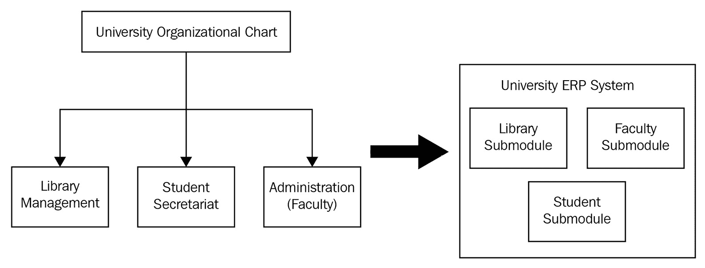
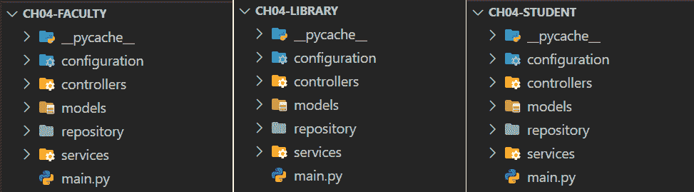
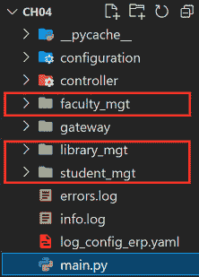

# 第四章：构建微服务应用程序

以前，我们花费了大量时间使用 FastAPI 的核心功能为各种应用程序构建 API 服务。我们还开始应用重要的设计模式，如**控制反转**（**IoC**）和**依赖注入**（**DI**），这对于管理 FastAPI 容器对象至关重要。安装并使用了外部 Python 包来提供在管理对象时选择使用哪些容器的选项。

这些设计模式不仅可以帮助容器中的管理对象，还可以在构建可扩展的、企业级和非常复杂的应用程序时使用。大多数这些设计模式有助于将单体架构分解为松散耦合的组件，这些组件被称为*微服务*。

在本章中，我们将探讨一些架构设计模式和原则，这些模式和原则可以提供策略和方法，从单体应用程序开始构建我们的微服务。我们的重点将放在将大型应用程序分解为业务单元，创建一个单独的网关来捆绑这些业务单元，将领域建模应用于每个微服务，以及管理其他关注点，如日志记录和应用程序配置。

除了阐述每种设计模式的利弊之外，另一个目标是将这些架构模式应用于我们的软件样本，以展示其有效性和可行性。为了支持这些目标，本章将涵盖以下主题：

+   应用分解模式

+   创建通用网关

+   集中日志机制

+   消费 REST API

+   应用领域建模方法

+   管理微服务的配置细节

# 技术要求

本章使用了一个*大学 ERP 系统*原型，该原型专注于学生、教职员工和图书馆子模块，但更侧重于学生-图书馆和教职员工-图书馆操作（例如，借书和发放）。每个子模块都有自己的管理、管理和交易服务，尽管它们是 ERP 规范的一部分，但它们之间是独立的。目前，这个示例原型没有使用任何数据库管理系统，因此所有数据都临时存储在 Python 容器中。代码全部上传到[`github.com/PacktPublishing/Building-Python-Microservices-with-FastAPI`](https://github.com/PacktPublishing/Building-Python-Microservices-with-FastAPI)，在`ch04`、`ch04-student`、`ch04-faculty`和`ch04-library`项目中。

# 应用分解模式

如果我们应用在前面章节中展示的原型中使用的单体策略，那么在资源和工作量方面，构建这个 ERP 将不会具有成本效益。可能会有一些功能可能会过于依赖其他功能，这将在这些紧密耦合的功能因交易问题而出现时，使开发团队陷入困境。实现我们的大学 ERP 原型的最佳方式是在实施开始之前将整个规范分解成更小的模块。

我们有几种合适的方法可以对我们的应用程序原型进行分解，即按业务单元分解和按子域分解：

+   *按业务单元分解*用于当单体应用的分解基于组织结构、架构组件和结构单元时。通常，其结果模块具有固定和结构化的流程和功能，很少进行增强或升级。

+   *按子域分解*使用领域模型及其相应的业务流程作为分解的基础。与前者不同，这种分解策略处理的是持续演变和变化的模块，以捕捉模块的确切结构。

在这两种选择中，按业务单元分解是我们用于单体大学 ERP 原型的更实用的分解策略。由于大学使用的信息和业务流程已经是其多年的基础，我们需要通过学院或部门对其庞大而复杂的操作进行组织和分解。*图 4.1*显示了这些子模块的推导：



图 4.1 – 按业务单元分解

确定子模块后，我们可以使用 FastAPI 框架将它们实现为独立的微服务。如果一个业务单元或模块的服务*可以作为一个组件整体存在*，那么我们可以将其实现称为微服务。此外，它还必须能够通过基于 URL 地址和端口号的*互连*与其他微服务*协作*。*图 4.2*显示了作为 FastAPI 微服务应用程序实现的学院、图书馆和学生管理模块的项目目录。*第一章**，为初学者设置 FastAPI*，到*第三章**，*调查依赖注入*，为我们构建 FastAPI 微服务奠定了基础：



图 4.2 – 学院、图书馆和学生微服务应用程序

在服务器实例和管理方面，这些微服务彼此独立。启动和关闭其中一个不会影响其他两个，因为每个都可以有不同的上下文根和端口。每个应用程序都可以有独立的日志机制、依赖环境、容器、配置文件以及微服务的任何其他方面，这些将在后续章节中讨论。

但 FastAPI 还有另一种使用*挂载*子应用程序设计微服务的方法。

## 创建子应用程序

FastAPI 允许你在*主应用程序*内部构建独立的子应用程序。在这里，`main.py`充当网关，为这些挂载的应用程序提供路径名。它还创建了挂载，指定映射到每个子应用程序 FastAPI 实例的上下文路径。*图 4.3*显示了使用挂载构建的新大学 ERP 实现：



图 4.3 – 带挂载的主项目

在这里，`faculty_mgt`、`library_mgt`和`student_mgt`是典型的独立微服务应用程序，被挂载到`main.py`组件，即顶级应用程序中。每个子应用程序都有一个`main.py`组件，例如`library_mgt`，它在`library_main.py`设置中创建了其 FastAPI 实例，如下面的代码片段所示：

```py
from fastapi import FastAPI
library_app = FastAPI()
library_app.include_router(admin.router)
library_app.include_router(management.router)
```

学生子应用程序有一个`student_main.py`设置，它创建其 FastAPI 实例，如下面的代码所示：

```py
from fastapi import FastAPI
student_app = FastAPI()
student_app.include_router(reservations.router)
student_app.include_router(admin.router)
student_app.include_router(assignments.router)
student_app.include_router(books.router)
```

同样，教师子应用程序也有其`faculty_main.py`设置，如下面的代码所示，出于相同的目的，构建微服务架构：

```py
from fastapi import FastAPI
faculty_app = FastAPI()
faculty_app.include_router(admin.router)
faculty_app.include_router(assignments.router)
faculty_app.include_router(books.router)
```

这些子应用程序是典型的 FastAPI 微服务应用程序，包含所有基本组件，如路由器、中间件异常处理器以及构建 REST API 服务所需的所有必要包。与常规应用程序的唯一区别是，它们的上下文路径或 URL 由处理它们的顶级应用程序定义和决定。

重要提示

可选地，我们可以通过`uvicorn main:library_app --port 8001`命令独立运行`library_mgt`子应用程序，通过`uvicorn main:faculty_app --port 8082`运行`faculty_mgt`，以及通过`uvicorn main:student_app --port 8003`运行`student_mgt`。尽管它们被挂载，但可以独立运行，这解释了为什么这些挂载的子应用程序都是微服务。

# 挂载子模块

每个子应用的所有 FastAPI 装饰器都必须挂载在顶层应用的 `main.py` 组件中，以便在运行时访问。顶层应用的 FastAPI 装饰器对象调用 `mount()` 函数，将子应用的所有 FastAPI 实例添加到网关应用（`main.py`）中，并将每个实例与其对应的 URL 上下文进行映射。以下脚本展示了在大学 ERP 顶层系统的 `main.py` 组件中如何实现 *图书馆*、*学生* 和 *教师* 子系统的挂载：

```py
from fastapi import FastAPI
from student_mgt import student_main
from faculty_mgt import faculty_main
from library_mgt import library_main
app = FastAPI()
app.mount("/ch04/student", student_main.student_app)
app.mount("/ch04/faculty", faculty_main.faculty_app)
app.mount("/ch04/library", library_main.library_app)
```

在这种设置下，挂载的 `/ch04/student` URL 将用于访问 *学生模块* 应用程序的所有 API 服务，`/ch04/faculty` 将用于 *教师模块* 的所有服务，而 `/ch04/library` 将用于与 *图书馆* 相关的 REST 服务。一旦在 `mount()` 中声明，这些挂载路径就变得有效，因为 FastAPI 会自动通过 `root_path` 规范处理所有这些路径。

由于我们 *大学 ERP 系统* 的所有三个子应用都是独立的微服务，现在让我们应用另一种设计策略，该策略可以通过使用 ERP 系统的主 URL 来管理对这些应用的请求。让我们利用 *主应用程序* 作为子应用的网关。

# 创建一个公共网关

如果我们使用主应用程序的 URL 来管理请求并将用户重定向到任何三个子应用程序之一，将会更容易。*主应用程序* 可以作为一个伪反向代理或用户请求的入口点，始终将用户请求重定向到任何所需的子应用程序。这种方法基于称为 *API 网关* 的设计模式。现在，让我们探索如何应用这种设计来管理挂载到主应用程序上的独立微服务，并使用一种变通方法。

# 实现主端点

在实现此网关端点时，有如此多的解决方案，其中之一是在顶层应用程序中有一个简单的 REST API 服务，该服务具有一个整数路径参数，用于识别微服务的 `ID` 参数。如果 `ID` 参数无效，端点将只返回 `{'message': 'University ERP Systems'}` JSON 字符串，而不是错误。以下脚本是这个端点的直接实现：

```py
from fastapi import APIRouter
router = APIRouter()
@router.get("/university/{portal_id}")
def access_portal(portal_id:int): 
    return {'message': 'University ERP Systems'}
```

`access_portal` API 端点是作为一个带有 `portal_id` 作为路径参数的 GET 路径操作创建的。`portal_id` 参数对于此过程至关重要，因为它将确定用户想要访问的 *学生*、*教师* 和 *图书馆* 微服务中的哪一个。因此，访问 `/ch04/university/1` URL 应该将用户引导到学生应用程序，`/ch04/university/2` 到教师微服务，而 `/ch04/university/3` 到图书馆应用程序。

# 评估微服务 ID

`portal_id` 参数将自动使用一个可信赖的函数获取并评估，该函数被注入到实现 API 端点的 `APIRouter` 实例中。正如在 *第三章*，*调查依赖注入* 中所讨论的，一个 *可信赖的函数* 或 *对象* 可以在注入到 `APIRouter` 或 `FastAPI` 实例后作为所有服务的所有传入请求的过滤器或验证器。在以下脚本中，这个 ERP 原型中使用的可信赖函数评估 `portal_id` 参数是否为 `1`、`2` 或 `3`：

```py
def call_api_gateway(request: Request): 
    portal_id = request.path_params['portal_id']
    print(request.path_params)
    if portal_id == str(1): 
        raise RedirectStudentPortalException() 
    elif portal_id == str(2): 
        raise RedirectFacultyPortalException() 
    elif portal_id == str(3): 
        raise RedirectLibraryPortalException()
class RedirectStudentPortalException(Exception):
    pass
class RedirectFacultyPortalException(Exception):
    pass
class RedirectLibraryPortalException(Exception):
    pass
```

给定的解决方案是一个可行的解决方案，用于触发自定义事件，因为 FastAPI 除了启动和关闭事件处理器外没有内置的事件处理功能，这些是 *第八章*，*创建协程、事件和消息驱动事务* 的主题。因此，一旦 `call_api_gateway()` 发现 `portal_id` 是一个有效的微服务 ID，它将引发一些自定义异常。如果用户想要访问 *Student* 微服务，它将抛出 `RedirectStudentPortalException`。另一方面，如果用户想要 *Faculty* 微服务，将引发 `RedirectFacultyPortalException` 错误。否则，当用户想要 *Library* 微服务时，将触发 `RedirectLibraryPortalException` 错误。但首先，我们需要通过顶级 ERP 应用程序的 `main.py` 组件将 `call_api_gateway()` 注入到处理网关端点的 `APIRouter` 实例中。以下脚本展示了如何使用前面讨论的概念将其注入到 `university.router` 中：

```py
from fastapi import FastAPI, Depends, Request, Response
from gateway.api_router import call_api_gateway
from controller import university
app = FastAPI()
app.include_router (university.router, 
           dependencies=[Depends(call_api_gateway)], 
           prefix='/ch04')
```

所有这些引发的异常都需要一个异常处理器来监听抛出并执行追求微服务所需的某些任务。

# 应用异常处理器

异常处理器将重定向到适当的微服务。正如你在 *第二章*，*探索核心功能* 中所学到的，每个抛出的异常都必须有一个相应的异常处理器，在异常处理之后追求所需响应。以下是处理 `call_api_gateway()` 抛出的自定义异常的异常处理器：

```py
from fastapi.responses import RedirectResponse
from gateway.api_router import call_api_gateway, 
     RedirectStudentPortalException, 
     RedirectFacultyPortalException, 
     RedirectLibraryPortalException
@app.exception_handler(RedirectStudentPortalException)
def exception_handler_student(request: Request, 
   exc: RedirectStudentPortalException) -> Response:
    return RedirectResponse(
        url='http://localhost:8000/ch04/student/index')
@app.exception_handler(RedirectFacultyPortalException)
def exception_handler_faculty(request: Request, 
   exc: RedirectFacultyPortalException) -> Response:
    return RedirectResponse(
       url='http://localhost:8000/ch04/faculty/index')
@app.exception_handler(RedirectLibraryPortalException)
def exception_handler_library(request: Request, 
   exc: RedirectLibraryPortalException) -> Response:
    return RedirectResponse(
       url='http://localhost:8000/ch04/library/index')
```

在这里，`exception_handler_student()` 将将用户重定向到 *Student* 微服务的挂载路径，而 `exception_handler_faculty()` 将将用户重定向到 *Faculty* 子应用。此外，`exception_handler_library()` 将允许用户访问 *Library* 微服务。异常处理器是完成 API 网关架构所需的最后一个组件。异常触发将用户重定向到安装在 FastAPI 框架上的独立微服务。

虽然有其他更好的解决方案来实现网关架构，但我们的方法仍然是通过不依赖外部模块和工具，仅使用 FastAPI 的核心组件来进行程序化和实用。*第十一章*，*添加其他微服务功能*，将讨论使用 Docker 和 NGINX 建立有效的 API 网关架构。

现在，让我们探索如何为这种微服务设置设置集中式日志机制。

# 集中式日志机制

我们在*第二章*，*探索核心功能*中创建了一个审计跟踪机制，使用了中间件和 Python 文件事务。我们发现，中间件只能通过顶级应用程序的 FastAPI 装饰器来设置，它可以管理任何 API 服务的传入请求和传出响应。这次，我们将使用自定义中间件来设置一个集中式日志功能，该功能将记录顶级应用程序及其独立挂载的微服务的所有服务事务。在许多将日志关注点集成到应用程序中而不更改 API 服务的方法中，我们将专注于以下具有自定义中间件和*Loguru*模块的实用自定义方法。

## 利用 Loguru 模块

*应用程序日志*对于任何企业级应用都是必不可少的。对于部署在单个服务器上的单体应用，日志意味着让服务事务将它们的日志消息写入单个文件。另一方面，在独立的微服务设置中，日志可能过于复杂和难以实现，尤其是在这些服务需要部署到不同的服务器或 Docker 容器时。如果使用的模块不适应异步服务，其日志机制甚至可能导致运行时问题。

对于同时支持异步和同步 API 服务且运行在 ASGI 服务器上的 FastAPI 实例，使用 Python 的日志模块总是会生成以下错误日志：

```py
2021-11-08 01:17:22,336 - uvicorn.error - ERROR - Exception in ASGI application
Traceback (most recent call last):
  File "c:\alibata\development\language\python\
  python38\lib\site-packages\uvicorn\protocols\http\
  httptools_impl.py", line 371, in run_asgi
    result = await app(self.scope, self.receive, self.send)
  File "c:\alibata\development\language\python\
  python38\lib\site-packages\uvicorn\middleware\
  proxy_headers.py", line 59, in __call__
    return await self.app(scope, receive, send)
```

选择另一个日志扩展是避免由`logging`模块生成的错误的唯一解决方案。最佳选择是能够完全支持 FastAPI 框架的扩展，即`loguru`扩展。但首先，我们需要使用`pip`命令安装它：

```py
pip install loguru
```

Loguru 是一个简单易用的日志扩展。我们可以立即使用其默认处理器，即`sys.stderr`处理器进行日志记录，甚至无需添加太多配置。由于我们的应用程序需要将所有消息放置在日志文件中，我们需要在顶级应用程序的`main.py`组件中`FastAPI`实例化之后添加以下行：

```py
from loguru import logger
from uuid import uuid4
app = FastAPI()
app.include_router (university.router, 
         dependencies=[Depends(call_api_gateway)], 
         prefix='/ch04')
logger.add("info.log",format="Log: [{extra[log_id]}: 
{time} - {level} - {message} ", level="INFO", 
   enqueue = True)
```

注意，它的`logger`实例有一个`add()`方法，我们可以在这里注册*sinks*。*sinks*的第一部分是*handler*，它决定是否在`sys.stdout`或文件中输出日志。在我们大学的 ERP 原型中，我们需要有一个全局的`info.log`文件，其中包含所有子应用程序的日志消息。

日志汇聚器的一个重要部分是`level`类型，它表示需要管理和记录的日志消息的粒度。如果我们将`add()`函数的`level`参数设置为`INFO`，这告诉记录器只考虑那些在`INFO`、`SUCCESS`、`WARNING`、`ERROR`和`CRITICAL`权重下的消息。记录器将跳过这些级别之外的日志消息。

*sinks*的另一部分是`format`日志，我们可以创建一个自定义的日志消息布局来替换其默认格式。这个格式就像一个没有`"f"`的 Python 插值字符串，其中包含占位符，如`{time}`、`{level}`、`{message}`以及任何需要在运行时由`logger`替换的自定义占位符。

在`log.file`中，我们希望我们的日志以`Log`关键字开头，紧接着是自定义生成的`log_id`参数，然后是记录日志的时间、级别和消息。

为了添加对异步日志的支持，`add()`函数有一个`enqueue`参数，我们可以在任何时候启用它。在我们的情况下，这个参数默认为`True`，只是为了准备任何`async/await`执行。

Loguru 的功能和特性有很多可以探索。例如，我们可以为记录器创建额外的处理程序，每个处理程序都有不同的保留、轮换和渲染类型。此外，Loguru 还可以通过一些颜色标记，如`<red>`、`<blue>`或`<cyan>`，为我们添加颜色。它还有一个`@catch()`装饰器，可以在运行时管理异常。我们设置统一应用程序日志所需的所有日志功能都在 Loguru 中。现在我们已经配置了顶层应用程序中的 Loguru，我们需要让它的日志机制在没有修改代码的情况下跨三个子应用程序或微服务工作。

# 构建日志中间件

这个集中式应用程序日志的核心组件是我们必须在`main.py`组件中实现的自定义中间件。FastAPI 的`*mount*`允许我们集中处理一些横切关注点，如日志，而不需要在子应用程序中添加任何内容。顶层应用程序的`main.py`组件中的一个中间件实现就足够了，可以用于跨独立的微服务进行日志记录。以下是我们示例应用程序的中间件实现：

```py
@app.middleware("http")
async def log_middleware(request:Request, call_next):
    log_id = str(uuid4())
    with logger.contextualize(log_id=log_id):
        logger.info('Request to access ' + 
             request.url.path)
        try:
            response = await call_next(request)
        except Exception as ex: 
            logger.error(f"Request to " + 
              request.url.path + " failed: {ex}")
            response = JSONResponse(content=
               {"success": False}, status_code=500)
        finally: 
            logger.info('Successfully accessed ' + 
               request.url.path)
            return response
```

首先，`log_middleware()`每次拦截来自主应用或子应用的任何 API 服务时，都会生成一个`log_id`参数。然后，通过 Loguru 的`contextualize()`方法将`log_id`参数注入到上下文信息的`dict`中，因为`log_id`是日志信息的一部分，正如我们在日志格式设置中所示。之后，在 API 服务执行之前和执行成功之后开始记录日志。如果在过程中遇到异常，记录器仍然会生成带有`Exception`消息的日志消息。因此，无论何时我们从 ERP 原型访问任何 API 服务，以下日志消息都将写入`info.log`：

```py
Log: 1e320914-d166-4f5e-a39b-09723e04400d: 2021-11-28T12:02:25.582056+0800 - INFO - Request to access /ch04/university/1 
Log: [1e320914-d166-4f5e-a39b-09723e04400d: 2021-11-28T12:02:25.597036+0800 - INFO - Successfully accessed /ch04/university/1 
Log: [fd3badeb-8d38-4aec-b2cb-017da853e3db: 2021-11-28T12:02:25.609162+0800 - INFO - Request to access /ch04/student/index 
Log: [fd3badeb-8d38-4aec-b2cb-017da853e3db: 2021-11-28T12:02:25.617177+0800 - INFO - Successfully accessed /ch04/student/index 
Log: [4cdb1a46-59c8-4762-8b4b-291041a95788: 2021-11-28T12:03:25.187495+0800 - INFO - Request to access /ch04/student/profile/add 
Log: [4cdb1a46-59c8-4762-8b4b-291041a95788: 2021-11-28T12:03:25.203421+0800 - 
INFO - Request to access /ch04/faculty/index 
Log: [5cde7503-cb5e-4bda-aebe-4103b2894ffe: 2021-11-28T12:03:33.432919+0800 - INFO - Successfully accessed /ch04/faculty/index 
Log: [7d237742-fdac-4f4f-9604-ce49d3c4c3a7: 2021-11-28T12:04:46.126516+0800 - INFO - Request to access /ch04/faculty/books/request/list 
Log: [3a496d87-566c-477b-898c-8191ed6adc05: 2021-11-28T12:04:48.212197+0800 - INFO - Request to access /ch04/library/book/request/list 
Log: [3a496d87-566c-477b-898c-8191ed6adc05: 2021-11-28T12:04:48.221832+0800 - INFO - Successfully accessed /ch04/library/book/request/list 
Log: [7d237742-fdac-4f4f-9604-ce49d3c4c3a7: 2021-11-28T12:04:48.239817+0800 - 
Log: [c72f4287-f269-4b21-a96e-f8891e0a4a51: 2021-11-28T12:05:28.987578+0800 - INFO - Request to access /ch04/library/book/add 
Log: [c72f4287-f269-4b21-a96e-f8891e0a4a51: 2021-11-28T12:05:28.996538+0800 - INFO - Successfully accessed /ch04/library/book/add
```

给定的日志消息快照证明我们有一个集中式设置，因为中间件过滤了所有 API 服务的执行并执行了日志事务。它显示日志从访问网关开始，一直延伸到执行来自*教师*、*学生*和*图书馆*子应用的 API 服务。使用 FastAPI 的*挂载*功能构建独立微服务时，集中和管理横切关注点是它可以提供的一个优势。

但是，当涉及到这些独立子应用之间的交互时，挂载是否也能成为优势？现在，让我们探索在我们的架构中，独立的微服务如何通过利用彼此的 API 资源进行通信。

## 消费 REST API 服务

就像在未挂载的微服务设置中一样，挂载的微服务也可以通过访问彼此的 API 服务进行通信。例如，如果一位教师或学生想要从图书馆借书，如何无缝地实现这种设置？

在*图 4.4*中，我们可以看到，通过建立客户端-服务器通信，可以实现交互，其中一个 API 服务可以作为资源提供者，而其他的是客户端：

![图 4.4 – 与教师、学生和图书馆微服务的交互

![图 4.4 – 与教师、学生和图书馆微服务的交互

图 4.4 – 与教师、学生和图书馆微服务的交互

在 FastAPI 中，使用`httpx`和`requests`外部模块消费 API 资源可以非常直接。以下讨论将重点介绍这两个模块如何帮助我们挂载的服务相互交互。

# 使用 httpx 模块

`httpx`外部模块是一个 Python 扩展，可以消费异步和同步的 REST API，并支持*HTTP/1.1*和*HTTP/2*。它是一个快速的多功能工具包，用于访问运行在基于 WSGI 平台上的 API 服务，以及像 FastAPI 服务这样的 ASGI。但首先，我们需要使用`pip`安装它：

```py
pip install httpx
```

然后，我们可以直接使用它，无需进一步配置，以使两个微服务交互，例如，我们的*学生*模块向*教师*模块提交作业：

```py
import httpx
@router.get('/assignments/list')
async def list_assignments(): 
   async with httpx.AsyncClient() as client:
    response = await client.get(
     "http://localhost:8000/ch04/faculty/assignments/list")
    return response.json()
@router.post('/assignment/submit')
def submit_assignment(assignment:AssignmentRequest ):
   with httpx.Client() as client:
      response = client.post("http://localhost:8000/
          ch04/faculty/assignments/student/submit",  
           data=json.dumps(jsonable_encoder(assignment)))
      return response.content
```

`httpx` 模块可以处理 `GET`、`POST`、`PATCH`、`PUT` 和 `DELETE` 路径操作。它可以允许在不那么复杂的条件下向请求的 API 传递不同的请求参数。例如，`post()` 客户端操作可以接受头信息、cookies、params、json、files 和模型数据作为参数值。我们使用 `with` 上下文管理器直接管理由其 `Client()` 或 `AsyncClient()` 实例创建的流，这些流是可关闭的组件。

之前提到的 `list_assignments` 服务是一个客户端，它使用 `AsyncClient()` 实例从 `f*aculty*` 模块的异步 `/ch04/faculty/assignments/list` API 端点发起 GET 请求。`AsyncClient` 访问基于 WSGI 的平台以执行任何异步服务，而不是同步服务，否则会抛出 *状态码 500*。在某些复杂情况下，它可能需要在构造函数中提供额外的配置细节，以便进一步通过 ASGI 管理资源访问。

另一方面，`submit_assignment` 服务是一个同步客户端，它访问另一个同步端点 `ch04/faculty/assignments/student/submit`，这是一个 `POST` HTTP 操作。在这种情况下，使用 `Client()` 实例通过 `POST` 请求访问资源，将作业提交给 `*Faculty*` 模块。`AssignmentRequest` 是一个 `BaseModel` 对象，客户端需要将其填充后提交到请求端点。与 `params` 和 `json` 不同，它们直接作为 `dict` 传递，而 `data` 是一个模型对象，必须首先通过 `jsonable_encoder()` 和 `json.dumps()` 转换为 `dict`，以便在 HTTP 上传输。新的转换后的模型成为 POST 客户端操作 `data` 参数的值。

当涉及到客户端服务的响应时，我们可以允许响应被模块的 `content` 或 `json()` 处理为文本，或者作为 JSON 结果。现在这取决于客户端服务的需求，决定应用程序使用哪种响应类型。

# 使用 `requests` 模块

在微服务之间建立客户端-服务器通信的另一种选择是 `requests` 模块。尽管 `httpx` 和 `requests` 几乎兼容，但后者提供了其他功能，如自动重定向和显式会话处理。`requests` 的唯一问题是它不支持异步 API，并且在访问资源时性能较慢。尽管有其缺点，`requests` 模块仍然是 Python 微服务开发中消费 REST API 的标准方式。首先，我们需要安装它才能使用它：

```py
pip install requests
```

在我们的 ERP 原型中，`*faculty*` 微服务使用了 `requests` 扩展从 `*library*` 模块借书。让我们看看 `*Faculty*` 客户端服务，它们展示了如何使用 `requests` 模块访问 `*library*` 的同步 API：

```py
@router.get('/books/request/list')
def list_all_request(): 
    with requests.Session() as sess:
        response = sess.get('http://localhost:8000/
           ch04/library/book/request/list')
        return response.json()
@router.post('/books/request/borrow')
def request_borrow_book(request:BookRequestReq): 
    with requests.Session() as sess:
        response = sess.post('http://localhost:8000/
           ch04/library/book/request', 
             data=dumps(jsonable_encoder(request)))
        return response.content
@router.get('/books/issuance/list')
def list_all_issuance(): 
    with requests.Session() as sess:
        response = sess.get('http://localhost:8000/
            ch04/library/book/issuance/list')
        return response.json()
@router.post('/books/returning')
def return_book(returning: BookReturnReq): 
    with requests.Session() as sess:
        response = sess.post('http://localhost:8000/
            ch04/library/book/issuance/return', 
              data=dumps(jsonable_encoder(returning)))
        return response.json()
```

`requests` 模块有一个 `Session()` 实例，这在 `httpx` 模块中相当于 `Client()`。它提供了所有必要的客户端操作，这些操作将消耗 FastAPI 平台上的 API 端点。由于 `Session` 是一个可关闭的对象，因此上下文管理器再次被用于处理在访问资源和传输某些参数值时将使用的流。就像在 `httpx` 中一样，参数细节，如 `params`、`json`、`header`、`cookies`、`files` 和 `data`，也是 `requests` 模块的一部分，并且如果需要通过客户端操作通过 API 端点传输，它们就准备好了。

从前面的代码中，我们可以看到创建了会话以实现 `list_all_request` 和 `list_all_issuance` 的 `GET` 客户端服务。在这里，`request_borrow_book` 是一个 `POST` 客户端服务，它从 `/ch04/library/book/request` API 端点以 `BookRequestReq` 的形式请求一本书。类似于 `httpx`，必须使用 `jsonable_encoder()` 和 `json.dumps()` 将 `BaseModel` 对象转换为 `dict`，以便作为 `data` 参数值传输。同样的方法也应用于 `return_book` 的 `POST` 客户端服务，该服务返回由教师借阅的书籍。这些客户端服务的响应也可以是 `content` 或 `json()`，就像我们在 `httpx` 扩展中看到的那样。

使用 `requests` 和 `httpx` 模块允许这些挂载的微服务根据某些规范相互交互。从其他微服务中消费公开的端点可以最小化紧密耦合并加强构建独立微服务的分解设计模式的重要性。

下一个技术为您提供使用 *领域建模* 管理微服务内组件的选项。

# 应用领域建模方法

专注于数据库的应用或由核心功能构建而不与模型协作的应用，在扩展时可能难以管理，或者在增强或修复错误时不够友好。背后的原因是缺乏遵循、研究和分析的业务逻辑结构和流程。理解应用程序的行为并推导出具有其背后业务逻辑的领域模型，在建立和组织应用程序结构时是最佳方法。这个原则被称为 *领域建模方法*，我们现在将将其应用于我们的 ERP 示例。

# 创建层

分层是应用领域驱动开发时不可避免的一种实现方式。*层*之间存在依赖关系，有时在开发过程中修复错误时可能会带来问题。但在分层架构中重要的是*分层*可以创建的概念、结构、类别、功能以及角色，这有助于理解应用程序的规范。*图 4.5*显示了子应用程序的*模型*、*存储库*、*服务*和*控制器*：

![图 4.5 – 分层架构


图 4.5 – 分层架构

最关键的一层是`models`层，它由描述应用程序中涉及的领域和业务流程的领域模型类组成。

# 识别领域模型

*领域模型层*是应用程序的初始工件，因为它提供了应用程序的上下文框架。如果在开发的初始阶段首先确定了领域，则可以轻松地对业务流程和交易进行分类和管理。由领域分层创建的代码组织可以提供代码可追溯性，这可以简化源代码更新和调试。

在我们的 ERP 示例中，这些模型分为两类：*数据*模型和*请求*模型。数据模型是用于在临时数据存储中捕获和存储数据的模型，而请求模型是 API 服务中使用的`BaseModel`对象。

例如，*教师*模块有以下数据模型：

```py
class Assignment: 
    def __init__(self, assgn_id:int, title:str, 
        date_due:datetime, course:str):
        self.assgn_id:int = assgn_id 
        self.title:str = title 
        self.date_completed:datetime = None
        self.date_due:datetime = date_due
        self.rating:float = 0.0 
        self.course:str = course

    def __repr__(self): 
      return ' '.join([str(self.assgn_id), self.title,
        self.date_completed.strftime("%m/%d/%Y, %H:%M:%S"),
        self.date_due.strftime("%m/%d/%Y, %H:%M:%S"), 
        str(self.rating) ])
    def __expr__(self): 
      return ' '.join([str(self.assgn_id), self.title, 
       self.date_completed.strftime("%m/%d/%Y, %H:%M:%S"), 
       self.date_due.strftime("%m/%d/%Y, %H:%M:%S"), 
        str(self.rating) ])
class StudentBin: 
    def __init__(self, bin_id:int, stud_id:int, 
      faculty_id:int): 
        self.bin_id:int = bin_id 
        self.stud_id:int = stud_id 
        self.faculty_id:int = faculty_id 
        self.assignment:List[Assignment] = list()

    def __repr__(self): 
        return ' '.join([str(self.bin_id), 
         str(self.stud_id), str(self.faculty_id)])
    def __expr__(self): 
        return ' '.join([str(self.bin_id), 
         str(self.stud_id), str(self.faculty_id)])
```

这些数据模型类在实例化时如果需要构造函数注入，其构造函数总是已实现。此外，`__repr__()`和`__str__()`魔术方法可选地存在，以提供开发者在访问、读取和记录这些对象时的效率。

另一方面，请求模型是熟悉的，因为它们已经在上一章中讨论过了。此外，*教师*模块还有以下请求模型：

```py
class SignupReq(BaseModel):     
    faculty_id:int
    username:str
    password:str
class FacultyReq(BaseModel): 
    faculty_id:int
    fname:str
    lname:str
    mname:str
    age:int
    major:Major
    department:str
class FacultyDetails(BaseModel): 
    fname:Optional[str] = None
    lname:Optional[str] = None
    mname:Optional[str] = None
    age:Optional[int] = None
    major:Optional[Major] = None
    department:Optional[str] = None
```

前面片段中列出的请求模型只是简单的`BaseModel`类型。有关如何创建`BaseModel`类的更多详细信息，请参阅*第一章*，*为初学者设置 FastAPI*，它提供了创建不同类型的`BaseModel`类的指南，以捕获来自客户端的不同请求。

# 构建存储库和服务层

在构建这种方法的层级结构中至关重要的两个最流行的领域建模模式是 *仓库* 和 *服务层模式*。仓库旨在创建管理数据访问的策略。一些仓库层仅提供数据存储的数据连接，就像我们这里的示例一样，但通常，仓库的目标是与 **对象关系模型**（**ORM**）框架交互以优化和管理数据事务。但除了访问之外，这一层还为应用程序提供了一个高级抽象，使得特定的数据库技术或 *方言* 对应用程序来说并不重要。它充当任何数据库平台的适配器，以追求应用程序的数据事务，仅此而已。以下是一个 *教师* 模块的仓库类，它管理为他们的学生创建作业的领域：

```py
from fastapi.encoders import jsonable_encoder
from typing import List, Dict, Any
from faculty_mgt.models.data.facultydb import 
     faculty_assignments_tbl
from faculty_mgt.models.data.faculty import Assignment
from collections import namedtuple
class AssignmentRepository: 

    def insert_assignment(self, 
           assignment:Assignment) -> bool: 
        try:
            faculty_assignments_tbl[assignment.assgn_id] = 
                assignment
        except: 
            return False 
        return True

    def update_assignment(self, assgn_id:int, 
           details:Dict[str, Any]) -> bool: 
       try:
           assignment = faculty_assignments_tbl[assgn_id]
           assignment_enc = jsonable_encoder(assignment)
           assignment_dict = dict(assignment_enc)
           assignment_dict.update(details)         
           faculty_assignments_tbl[assgn_id] =   	 	 	           Assignment(**assignment_dict)
       except: 
           return False 
       return True

    def delete_assignment(self, assgn_id:int) -> bool: 
        try:
            del faculty_assignments_tbl[assgn_id] 
        except: 
            return False 
        return True

    def get_all_assignment(self):
        return faculty_assignments_tbl 
```

在这里，`AssignmentRepository` 使用其四个仓库事务管理 `Assignment` 领域对象。此外，`insert_assignment()` 在 `faculty_assignment_tbl` 字典中创建一个新的 `Assignment` 条目，而 `update_assignment()` 接受现有作业的新细节或更正信息并更新它。另一方面，`delete_assignment()` 使用其 `assign_id` 参数从数据存储中删除现有的 `Assignment` 条目。为了检索所有创建的作业，仓库类有 `get_all_assignment()`，它返回 `faculty_assignments_tbl` 中的所有条目。

服务层模式定义了应用程序的算法、操作和流程。通常，它与仓库交互以构建应用程序其他组件（如 API 服务或控制器）所需的基本业务逻辑、管理和控制。通常，一个服务针对一个或多个仓库类，具体取决于项目的具体要求。以下是一个服务示例，它通过接口仓库提供额外的任务，例如为学生工作区生成 UUID：

```py
from typing import List, Dict , Any
from faculty_mgt.repository.assignments import  
            AssignmentSubmissionRepository
from faculty_mgt.models.data.faculty import Assignment
from uuid import uuid4
class AssignmentSubmissionService: 

    def __init__(self): 
        self.repo:AssignmentSubmissionRepository = 
            AssignmentSubmissionRepository()

    def create_workbin(self, stud_id:int, faculty_id:int): 
        bin_id = uuid4().int
        result = self.repo.create_bin(stud_id, bin_id, 
                     faculty_id )
        return (result, bin_id)

    def add_assigment(self, bin_id:int, 
                   assignment: Assignment): 
        result = self.repo.insert_submission(bin_id, 
                     assignment ) 
        return result

    def remove_assignment(self, bin_id:int, 
                   assignment: Assignment): 
        result = self.repo.insert_submission(bin_id, 
                      assignment )
        return result
    def list_assignments(self, bin_id:int): 
        return self.repo.get_submissions(bin_id)
```

在前面的代码中引用的 `AssignmentSubmissionService` 有使用 `AssignmentSubmissionRepository` 事务的方法。它为它们提供参数，并返回 `bool` 结果供其他组件评估。其他服务可能比这个示例更复杂，因为算法和任务通常被添加以满足层的要求。

仓库类与服务之间的成功连接发生在后者的构造函数中。通常，仓库类就像在先前的示例中那样被实例化。另一个绝佳的选择是使用前面讨论的 DI（依赖注入），见 *第三章*。

## 使用工厂方法模式

*工厂方法设计模式*始终是使用`Depends()`组件管理可注入类和函数的一个好方法。*第三章*展示了如何将工厂方法作为将存储库组件注入服务的中介，而不是直接在服务内部实例化它们。这种设计模式提供了组件或层之间的松耦合。这种方法非常适合大型应用程序，其中一些模块和子组件被重用和继承。

现在，让我们看看顶级应用程序如何管理这些挂载的和独立的微服务应用程序的不同配置细节。

# 管理微服务的配置细节

到目前为止，本章为我们提供了一些流行的设计模式和策略，这些模式和策略可以帮助我们了解如何为我们的 FastAPI 微服务提供最佳的结构和架构。这次，让我们探索 FastAPI 框架如何支持将存储、分配和读取配置细节到挂载的微服务应用程序中，例如数据库凭证、网络配置数据、应用程序服务器信息和部署细节。首先，我们需要使用`pip`安装`python-dotenv`：

```py
pip install python-dotenv
```

所有这些设置都是外部于微服务应用程序实现的值。我们通常将它们存储在*env*、*属性*或*INI*文件中，而不是将它们作为变量数据硬编码到代码中。然而，将这些设置分配给不同的微服务时会出现挑战。

支持外部化配置设计模式的框架具有一个内部处理功能，可以获取环境变量或设置，而无需额外的解析或解码技术。例如，FastAPI 框架通过 pydantic 的`BaseSettings`类内置了对外部化设置的 支持。

## 将设置存储为类属性

在我们的架构设置中，应该是顶级应用程序来管理外部化值。一种方法是将它们作为属性存储在`BaseSettings`类中。以下是与各自应用程序详情相关的`BaseSettings`类型的类：

```py
from pydantic import BaseSettings
from datetime import date
class FacultySettings(BaseSettings): 
    application:str = 'Faculty Management System' 
    webmaster:str = 'sjctrags@university.com'
    created:date = '2021-11-10'
class LibrarySettings(BaseSettings): 
    application:str = 'Library Management System' 
    webmaster:str = 'sjctrags@university.com'
    created:date = '2021-11-10' 
class StudentSettings(BaseSettings): 
    application:str = 'Student Management System' 
    webmaster:str = 'sjctrags@university.com'
    created:date = '2021-11-10'
```

在这里，`FacultySettings`将被分配给*学院*模块，因为它携带有关模块的一些信息。`LibrarySettings`用于*图书馆*模块，而`StudentSettings`用于*学生*模块。

要获取值，首先，模块中的一个组件必须从主项目的`/configuration/config.py`模块中导入`BaseSettings`类。然后，它需要一个可注入的函数来在将其注入到需要利用这些值的组件之前实例化它。以下脚本是`/student_mgt/student_main.py`的一部分，其中需要检索设置：

```py
from configuration.config import StudentSettings
student_app = FastAPI()
student_app.include_router(reservations.router)
student_app.include_router(admin.router)
student_app.include_router(assignments.router)
student_app.include_router(books.router)
def build_config(): 
    return StudentSettings()
@student_app.get('/index')
def index_student(
   config:StudentSettings = Depends(build_config)): 
    return {
        'project_name': config.application,
        'webmaster': config.webmaster,
        'created': config.created
      }
```

在这里，`build_config()` 是一个可注入的函数，它将 `StudentSettings` 实例注入到 *学生* 微服务的 `/index` 端点。在 DI 之后，应用程序、网站管理员和创建的值将可以通过 `config` 连接对象访问。这些设置将在调用 `/ch04/university/1` 网关 URL 后立即出现在浏览器上。

## 在属性文件中存储设置

另一个选项是将所有这些设置存储在一个扩展名为 `.env`、`.properties` 或 `.ini` 的物理文件中。例如，这个项目在 `/configuration` 文件夹中有一个名为 `erp_settings.properties` 的文件，它以 *键值对* 格式包含以下应用程序服务器细节：

```py
production_server = prodserver100
prod_port = 9000
development_server = devserver200
dev_port = 10000
```

为了获取这些细节，应用程序需要另一个 `BaseSettings` 类的实现，该实现声明 *键值对* 的 *键* 作为属性。以下类展示了如何声明 `production_server`、`prod_port`、`development_server` 和 `dev_port` 而不分配任何值：

```py
import os
class ServerSettings(BaseSettings): 
    production_server:str
    prod_port:int
    development_server:str 
    dev_port:int

    class Config: 
        env_file = os.getcwd() + 
           '/configuration/erp_settings.properties'
```

除了类变量声明之外，`BaseSetting` 还需要一个实现一个 *内部类*，称为 `Config`，它将预定义的 `env_file` 分配给属性文件当前的位置。

当涉及到从文件访问属性细节时，涉及到的过程是相同的。在导入 `ServerSettings` 之后，它需要一个可注入的函数来注入其实例到需要这些细节的组件中。以下脚本是 `/student_mgt/student_main.py` 的更新版本，其中包括对 `development_server` 和 `development_port` 设置的访问：

```py
from fastapi import FastAPI, Depends
from configuration.config import StudentSettings, 
      ServerSettings
student_app = FastAPI()
student_app.include_router(reservations.router)
student_app.include_router(admin.router)
student_app.include_router(assignments.router)
student_app.include_router(books.router)
def build_config(): 
    return StudentSettings()
def fetch_config():
    return ServerSettings()
@student_app.get('/index')
def index_student(
     config:StudentSettings = Depends(build_config), 
     fconfig:ServerSettings = Depends(fetch_config)): 
    return {
        'project_name': config.application,
        'webmaster': config.webmaster,
        'created': config.created,
        'development_server' : fconfig.development_server,
        'dev_port': fconfig.dev_port
      }
```

基于这个增强的脚本，运行 `/ch04/university/1` URL 将会将浏览器重定向到一个显示来自属性文件的额外服务器详细信息的屏幕。在 FastAPI 中管理配置细节非常简单，因为我们要么将它们保存在类内部，要么保存在文件内部。不需要外部模块，也不需要特殊的编码工作来获取所有这些设置，只需创建 `BaseSettings` 类即可。这种简单的设置有助于构建灵活且适应性强的微服务应用程序，这些应用程序可以在不同的配置细节上运行。

# 摘要

本章从分解模式开始，这种模式对于将单体应用程序分解为粒度化、独立和可扩展的模块非常有用。实现了这些模块的 FastAPI 应用展示了包括在微服务 *12-Factor 应用原则* 中的某些原则，例如具有独立性、配置文件、日志系统、代码库、端口绑定、并发性和易于部署。

除了分解之外，本章还展示了将不同的独立子应用*安装*到 FastAPI 平台上的过程。只有 FastAPI 能够使用安装功能将独立的微服务分组，并将它们绑定到一个端口上，同时使用相应的上下文根。从这个特性中，我们创建了一个伪 API 网关模式，该模式作为独立子应用的门面。

尽管可能存在一些缺点，但本章还强调了领域建模作为在 FastAPI 微服务中组织组件的选项。*领域*、*存储库*和*服务*层有助于根据项目规范管理信息流和任务分配。当领域层就绪时，跟踪、测试和调试变得容易。

在下一章中，我们将专注于将我们的微服务应用程序与关系型数据库平台集成。重点是建立数据库连接并利用我们的数据模型在存储库层实现 CRUD 事务。

# 第二部分：以数据为中心和以通信为重点的微服务关注点和问题

在本书的这一部分，我们将探讨其他 FastAPI 组件和功能，以解决 API 框架可以构建的其他设计模式，包括数据、通信、消息、可靠性和安全性。外部模块也将被突出显示，以追求其他行为和框架，例如 ORM 和响应式编程。

本部分包括以下章节：

+   *第五章*，连接到关系型数据库

+   *第六章*，使用非关系型数据库

+   *第七章*，保护 REST API 的安全

+   *第八章*，创建协程、事件和消息驱动的交易
