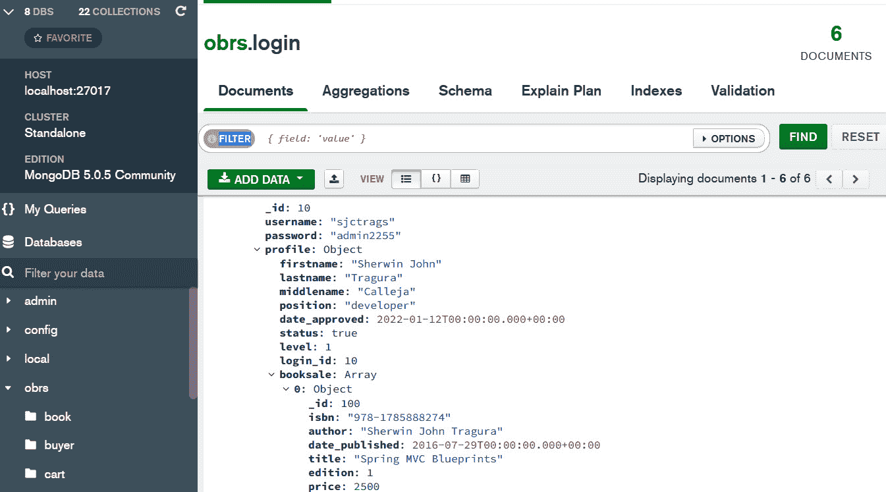
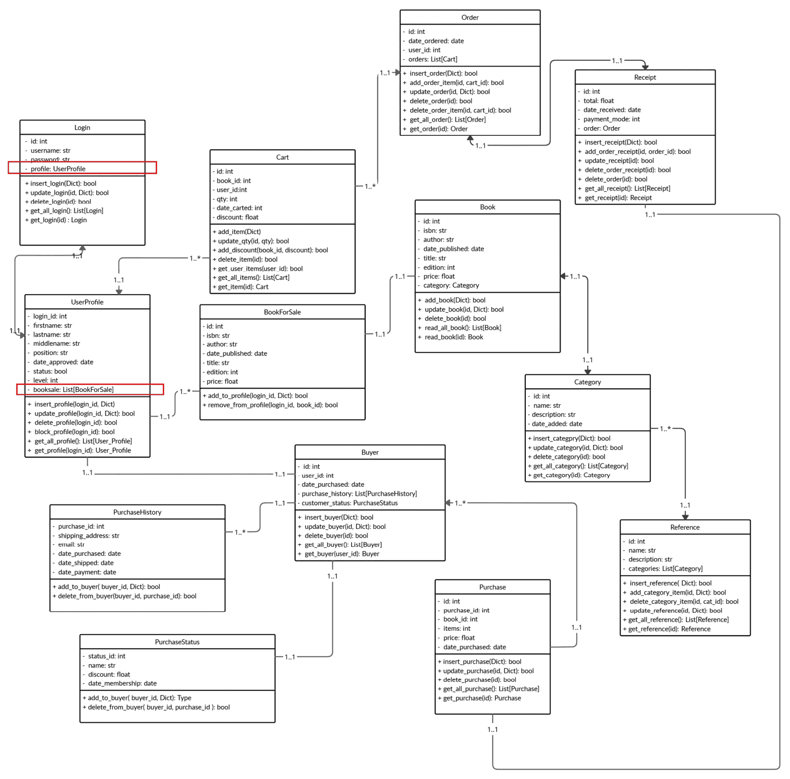
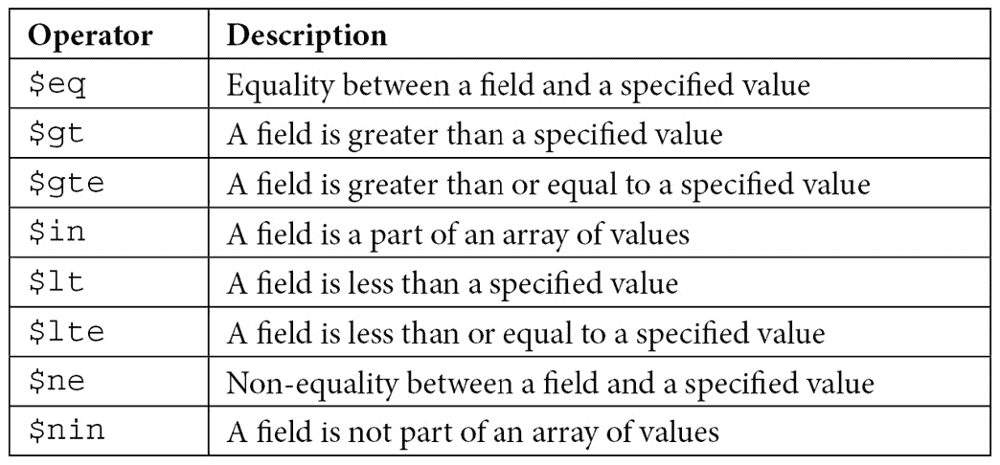
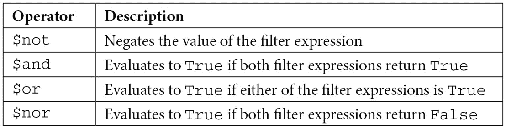

# 6

# 使用非关系型数据库

到目前为止，我们已经了解到关系型数据库使用表列和行来存储数据。所有这些表记录都是通过不同的键（如主键、唯一键和组合键）进行结构优化和设计的。表通过外键/参考键连接。外键完整性在数据库模式表的表关系方面起着重要作用，因为它为存储在表中的数据提供了一致性和完整性。第五章，*连接到关系型数据库*，提供了相当多的证据，表明 FastAPI 可以通过任何现有的 ORM 平滑地连接到关系型数据库，而无需大量复杂性。这次，我们将专注于将非关系型数据库作为我们的 FastAPI 微服务应用程序的数据存储。

如果 FastAPI 使用 ORM 进行关系型数据库，它使用 **对象文档映射** (**ODM**) 来管理使用非关系型数据存储或 **NoSQL** 数据库的数据。ODM 不涉及表、键和外键约束，但需要一个 JSON 文档来存储各种信息。不同的 NoSQL 数据库在存储模型类型上有所不同，用于存储数据。这些数据库中最简单的是将数据管理为键值对，例如 **Redis**，而复杂的数据库则使用无模式的文档结构，这些结构可以轻松地映射到对象。这通常在 **MongoDB** 中完成。一些使用列式数据存储，如 **Cassandra**，而一些则具有图导向的数据存储，如 **Neo4j**。然而，本章将重点介绍 FastAPI-MongoDB 连接以及我们可以应用的不同 ODM，以实现基于文档的数据库的数据管理。

本章的主要目标是研究、规范和审查不同的方法，以将 MongoDB 作为我们的 FastAPI 应用程序的数据库。构建存储库层和展示 CRUD 实现将是主要亮点。

在本章中，我们将涵盖以下主题：

+   设置数据库环境

+   应用 PyMongo 驱动程序进行同步连接

+   使用 Motor 创建异步 CRUD 事务

+   使用 MongoEngine 实现 CRUD 事务

+   使用 Beanie 实现异步 CRUD 事务

+   使用 ODMantic 为 FastAPI 构建异步存储库

+   使用 MongoFrames 创建 CRUD 事务

# 技术要求

本章重点介绍一个电子书店网络门户，*在线图书转售系统*，用户可以通过互联网在家买卖书籍。虚拟商店允许用户查看*卖家资料*、*图书目录*、*订单列表*和*购买档案*。在电子商务方面，用户可以选择他们偏好的书籍并将它们添加到购物车中。然后，他们可以检查订单并随后进行支付交易。所有数据都存储在 MongoDB 数据库中。本章的代码可以在[`github.com/PacktPublishing/Building-Python-Microservices-with-FastAPI`](https://github.com/PacktPublishing/Building-Python-Microservices-with-FastAPI)的`ch06`项目中找到。

# 设置数据库环境

在我们开始讨论应用程序的数据库连接之前，我们需要从[`www.mongodb.com/try/download/community`](https://www.mongodb.com/try/download/community)下载适当的 MongoDB 数据库服务器。*在线图书转售系统*在 Windows 平台上使用 MongoDB 5.0.5。安装将提供默认的服务配置详细信息，包括服务名称、数据目录和日志目录。然而，建议您使用不同的目录路径而不是默认路径。

安装完成后，我们可以通过运行`/bin/mongod.exe`来启动 MongoDB 服务器。这将自动在`C:/`驱动器（Windows）中创建一个名为`/data/db`的数据库目录。我们可以将`/data/db`目录放置在其他位置，但请确保在运行`mongod`命令时使用`--dbpath`选项并指定`<new path>/data/db`。

MongoDB 平台有可以辅助管理数据库集合的工具，其中之一是**MongoDB Compass**。它可以提供一个 GUI 体验，允许您浏览、探索并轻松操作数据库及其集合。此外，它还内置了性能指标、查询视图和模式可视化功能，有助于检查数据库结构的正确性。以下截图显示了 MongoDB Compass 版本 1.29.6 的仪表板：



图 6.1 – MongoDB Compass 仪表板

前面的仪表板显示了`profile`和销售书籍列表的文档结构。

一旦服务器和实用工具安装完成，我们需要使用`obrs`为我们的数据库设计数据集合。



图 6.2 – obrs 数据库的类图

我们的应用程序使用前面图中显示的所有集合来存储从客户端捕获的所有信息。每个上下文框代表一个集合，框内显示了所有属性和预期的底层事务。它还显示了将这些集合关联起来的关联，例如`login`和`profile`之间的一对一关联以及`BookForSale`和`UserProfile`之间的多对一关联。

现在数据库服务器已经安装和设计好了，让我们看看从我们的 FastAPI 微服务应用程序到其 MongoDB 数据库的不同连接方式。

# 应用 PyMongo 驱动程序进行同步连接

我们将首先学习 FastAPI 应用程序如何使用 PyMongo 数据库驱动程序连接到 MongoDB。此驱动程序相当于`psycopg2`，它允许我们无需使用任何 ORM 即可访问 PostgreSQL。一些流行的 ODM（对象文档映射器），如 MongoEngine 和 Motor，使用 PyMongo 作为其核心驱动程序，这让我们有理由在触及关于流行 ODM 的问题之前首先探索 PyMongo。研究驱动程序的行为可以提供基线事务，这将展示 ODM 如何构建数据库连接、模型和 CRUD 事务。但在我们深入细节之前，我们需要使用`pip`安装`pymongo`扩展：

```py
pip install pymongo 
```

## 设置数据库连接

PyMongo 使用其`MongoClient`模块类来连接到任何 MongoDB 数据库。我们通过指定主机和端口来实例化它，以提取客户端对象，例如`MongoClient("localhost", "27017")`，或数据库 URI，例如`MongoClient('mongodb://localhost:27017/')`。我们的应用程序使用后者来连接到其数据库。但如果我们在实例化时未提供参数，它将使用默认的`localhost`和`27017`详情。

在提取客户端对象之后，我们可以通过点操作符（`.`）或`attribute-style access`（属性式访问）来使用它访问数据库，前提是数据库名称遵循 Python 命名约定；例如，`client.obrs`。否则，我们可以使用方括号符号（`[]`）或字典式访问；例如，`client["obrs_db"]`。一旦检索到数据库对象，我们就可以使用访问规则来访问集合。请注意，集合在关系型数据库中相当于表，其中存储了称为文档的已排序记录。以下代码展示了应用程序用于打开数据库连接并访问准备 CRUD 实现所需集合的生成器函数：

```py
from pymongo import MongoClient
def create_db_collections():
    client = MongoClient('mongodb://localhost:27017/')
    try:
        db = client.obrs
        buyers = db.buyer
        users = db.login
        print("connect")
        yield {"users": users, "buyers": buyers}
    finally:
        client.close()
```

像这样的生成器函数，如`create_db_collections()`，更受欢迎，因为`yield`语句在管理数据库连接时比`return`语句表现得更好。当`yield`语句向调用者发送一个值时，它会暂停函数的执行，但保留函数可以从中恢复执行的状态。这个特性被生成器应用于在`finally`子句中恢复执行时关闭数据库连接。另一方面，`return`语句不适用于此目的，因为`return`会在向调用者发送值之前完成整个事务。

然而，在我们调用生成器之前，让我们仔细审查 PyMongo 如何构建其模型层以追求必要的 CRUD 事务。

## 构建模型层

MongoDB 中的文档以 JSON 风格的格式表示和整理，具体来说是 BSON 文档。BSON 文档比 JSON 结构提供了更多的数据类型。我们可以使用字典来表示和持久化这些 BSON 文档在 PyMongo 中。一旦字典被持久化，BSON 类型的文档将看起来像这样：

```py
{
   _id:ObjectId("61e7a49c687c6fd4abfc81fa"),
   id:1,
   user_id:10,
   date_purchased:"2022-01-19T00:00:00.000000",
   purchase_history: 
   [
       {
        purchase_id:100,
        shipping_address:"Makati City",
        email:"mailer@yahoo.com",
        date_purchased:"2022-01-19T00:00:00.000000",
        date_shipped:"2022-01-19T00:00:00.000000",
        date_payment:"2022-01-19T00:00:00.000000"
      },
      {
        purchase_id:110,
        shipping_address:"Pasig City",
        email:"edna@yahoo.com",
        date_purchased:"2022-01-19T00:00:00.000000",
        date_shipped:"2022-01-19T00:00:00.000000",
        date_payment:"2022-01-19T00:00:00.000000"
      }
    ],
   customer_status: 
   {
        status_id:90,
        name:"Sherwin John C. Tragura",
        discount:50,
        date_membership:"2022-01-19T00:00:00.000000"
   }
}
```

常见的 Python 数据类型，如`str`、`int`和`float`，都由 BSON 规范支持，但有一些类型，如`ObjectId`、`Decimal128`、`RegEx`和`Binary`，仅限于`bson`模块。规范只支持`timestamp`和`datetime`时间类型。要安装`bson`，请使用以下`pip`命令：

```py
pip install bson
```

重要注意事项

**BSON**代表**Binary JSON**，是类似 JSON 文档的序列化和二进制编码。其背后的规范轻量级且灵活。高效的编码格式在[`bsonspec.org/spec.html`](https://bsonspec.org/spec.html)中解释得更详细。

`ObjectId`是 MongoDB 文档中的一个基本数据类型，因为它作为主文档结构的**唯一标识符**。它是一个**12 字节**的字段，由一个 4 字节的 UNIX**嵌入时间戳**、MongoDB 服务器的 3 字节**机器 ID**、2 字节**进程 ID**和 3 字节**任意值**组成，用于 ID 的增加。通常，文档中声明的字段`_id`始终指的是文档结构的`ObjectId`值。我们可以允许 MongoDB 服务器为文档生成`_id`对象，或者在持久化期间创建该对象类型的实例。当检索时，`ObjectId`可以是**24 个十六进制数字**或**字符串**格式。请注意，`_id`字段是字典准备好作为有效 BSON 文档持久化的关键指标。现在，BSON 文档也可以通过一些关联相互链接。

### 建立文档关联

MongoDB 没有参照完整性约束的概念，但基于结构，文档之间可以存在关系。存在两种类型的文档：*主*文档和*嵌入*文档。如果一个文档是另一个文档的嵌入文档，则它与另一个文档具有*一对一关联*。同样，如果一个文档中的列表与主文档结构相关联，则该文档具有*多对一关联*。

之前的购买 BSON 文档显示了具有与`客户状态`嵌入文档一对一关联和与`购买历史记录`文档多对一关联的主要`买家`文档的样本。从该样本文档中可以看出，嵌入文档没有单独的集合，因为它们没有相应的主`_id`字段来使它们成为主文档。

### 使用 BaseModel 类进行事务

由于 PyMongo 没有预定义的模型类，FastAPI 的 Pydantic 模型可以用来表示 MongoDB 文档，并包含所有必要的验证规则和编码器。我们可以使用`BaseModel`类来包含文档细节，并执行*插入*、*更新*和*删除*事务，因为 Pydantic 模型与 MongoDB 文档兼容。以下模型正在我们的在线二手书销售应用程序中使用，以存储和检索`买家`、`购买历史记录`和`客户状态`文档细节：

```py
 from pydantic import BaseModel, validator
from typing import List, Optional, Dict
from bson import ObjectId
from datetime import date
class PurchaseHistoryReq(BaseModel):
    purchase_id: int
    shipping_address: str 
    email: str   
    date_purchased: date
    date_shipped: date
    date_payment: date
    @validator('date_purchased')
    def date_purchased_datetime(cls, value):
        return datetime.strptime(value, 
           "%Y-%m-%dT%H:%M:%S").date()

    @validator('date_shipped')
    def date_shipped_datetime(cls, value):
        return datetime.strptime(value, 
           "%Y-%m-%dT%H:%M:%S").date()

    @validator('date_payment')
    def date_payment_datetime(cls, value):
        return datetime.strptime(value, 
           "%Y-%m-%dT%H:%M:%S").date()

    class Config:
        arbitrary_types_allowed = True
        json_encoders = {
            ObjectId: str
        }

class PurchaseStatusReq(BaseModel):
    status_id: int 
    name: str
    discount: float 
    date_membership: date
    @validator('date_membership')
    def date_membership_datetime(cls, value):
        return datetime.strptime(value, 
            "%Y-%m-%dT%H:%M:%S").date()

    class Config:
        arbitrary_types_allowed = True
        json_encoders = {
            ObjectId: str
        }

class BuyerReq(BaseModel):
    _id: ObjectId
    Buyer_id: int
    user_id: int
    date_purchased: date
    purchase_history: List[Dict] = list()
    customer_status: Optional[Dict]
    @validator('date_purchased')
    def date_purchased_datetime(cls, value):
        return datetime.strptime(value, 
            "%Y-%m-%dT%H:%M:%S").date()

    class Config:
        arbitrary_types_allowed = True
        json_encoders = {
            ObjectId: str
        }
```

为了让这些请求模型识别 BSON 数据类型，我们需要对这些模型的默认行为进行一些修改。就像在本章早期，我们添加了`orm_mode`选项一样，我们还需要在`BaseModel`蓝图上添加一个嵌套的`Config`类，并将`arbitrary_types_allowed`选项设置为`True`。这个额外的配置将识别在属性声明中使用的 BSON 数据类型，包括符合对应 BSON 数据类型所需的基本验证规则。此外，`json_encoders`选项也应包含在配置中，以便在查询事务期间将文档的`ObjectId`属性转换为字符串。

### 使用 Pydantic 验证

然而，某些其他类型对于`json_encoders`来说过于复杂，无法处理，例如将 BSON 的`datettime`字段转换为 Python 的`datetime.date`。由于 ODM 无法自动将 MongoDB 的日期时间转换为 Python 的`date`类型，我们需要创建自定义验证并通过 Pydantic 的`@validation`装饰器解析这个 BSON `datetime`。我们还需要在 FastAPI 服务中使用自定义验证器和解析器将所有传入的 Python 日期参数转换为 BSON 日期时间。这将在稍后进行介绍。

`@validator`创建一个接受字段（s）的`class name`作为第一个参数的方法，而不是要验证和解析的实例。它的第二个参数是一个选项，指定需要转换为其他数据类型（如`PurchaseRequestReq`模型的`date_purchased`、`date_shipped`或`date_payment`）的字段名或类属性。`@validator`的`pre`属性告诉 FastAPI 在 API 服务实现中执行任何内置验证之前先处理类方法。如果请求模型有任何自定义和内置的 FastAPI 验证规则，这些方法将在`APIRouter`运行其自定义和内置的 FastAPI 验证规则之后立即执行。

注意，这些请求模型已被放置在应用程序的`/models/request/buyer.py`模块中。

### 使用 Pydantic 的`@dataclass`查询文档

使用`BaseModel`模型类包装查询的 BSON 文档仍然是实现查询事务的最佳方法。但由于 BSON 与 Python 的`datetime.date`字段存在问题，我们并不能总是通过包装检索到的 BSON 文档来利用用于 CRUD 事务的请求模型类。有时，使用模型会导致出现`"invalid date format (type=value_error.date)"`错误，因为所有模型都有 Python 的`datetime.date`字段，而传入的数据有 BSON 的`datetime`或`timestamp`。为了避免在请求模型中增加更多复杂性，我们应该求助于另一种提取文档的方法——即利用 Pydantic 的`@dataclass`。以下数据类被定义为包装提取的`buyer`文档：

```py
from pydantic.dataclasses import dataclass
from dataclasses import field
from pydantic import validator
from datetime import date, datetime
from bson import ObjectId
from typing import List, Optional
class Config:
        arbitrary_types_allowed = True
@dataclass(config=Config)
class PurchaseHistory:
    purchase_id: Optional[int] = None
    shipping_address: Optional[str] = None
    email: Optional[str] = None   
    date_purchased: Optional[date] = "1900-01-01T00:00:00"
    date_shipped: Optional[date] = "1900-01-01T00:00:00"
    date_payment: Optional[date] = "1900-01-01T00:00:00"

    @validator('date_purchased', pre=True)
    def date_purchased_datetime(cls, value):
        return datetime.strptime(value, 
           "%Y-%m-%dT%H:%M:%S").date()

    @validator('date_shipped', pre=True)
    def date_shipped_datetime(cls, value):
        return datetime.strptime(value, 
           "%Y-%m-%dT%H:%M:%S").date()

    @validator('date_payment', pre=True)
    def date_payment_datetime(cls, value):
        return datetime.strptime(value, 
           "%Y-%m-%dT%H:%M:%S").date()
@dataclass(config=Config)
class PurchaseStatus:
    status_id: Optional[int] = None
    name: Optional[str] = None
    discount: Optional[float] = None
    date_membership: Optional[date] = "1900-01-01T00:00:00"

    @validator('date_membership', pre=True)
    def date_membership_datetime(cls, value):
        return datetime.strptime(value, 
           "%Y-%m-%dT%H:%M:%S").date()

@dataclass(config=Config)
class Buyer:
    buyer_id: int 
    user_id: int 
    date_purchased: date 
    purchase_history: List[PurchaseHistory] = 
          field(default_factory=list )
    customer_status: Optional[PurchaseStatus] = 
          field(default_factory=dict)
    _id: ObjectId = field(default=ObjectId())

    @validator('date_purchased', pre=True)
    def date_purchased_datetime(cls, value):
        print(type(value))
        return datetime.strptime(value, 
             "%Y-%m-%dT%H:%M:%S").date()
```

`@dataclass`是一个装饰器函数，它向 Python 类添加一个`__init__()`方法来初始化其属性和其他特殊函数，例如`__repr__()`。前面代码中显示的`PurchasedHistory`、`PurchaseStatus`和`Buyer`自定义类是典型的可以转换为请求模型类的类。FastAPI 在创建模型类时支持`BaseModel`和数据类。除了位于`Pydantic`模块下外，使用`@dataclass`在创建模型类时并不是`BaseModel`的替代品。这是因为这两个组件在灵活性、特性和钩子方面有所不同。`BaseModel`易于配置，可以适应许多验证规则和类型提示，而`@dataclass`在识别某些`Config`属性方面存在问题，例如`extra`、`allow_population_by_field_name`和`json_encoders`。如果一个数据类需要一些额外的细节，就需要一个自定义类来定义这些配置并设置装饰器的`config`参数。例如，前面代码中的`Config`类，它将`arbitrary_types_allowed`设置为`True`，已被添加到三个模型类中。

除了 `config`，装饰器还有其他参数，如 `init`、`eq` 和 `repr`，它们接受 `bool` 值以生成它们各自的钩子方法。当设置为 `True` 时，`frozen` 参数启用有关字段类型不匹配的异常处理。

当涉及到数据处理、转换时，`@dataclass` 总是依赖于增强验证，与可以通过添加 `json_encoders` 简单处理数据类型转换的 `BaseModel` 不同。在之前展示的数据类中，所有验证器都集中在文档检索过程中的 BSON `datetime` 到 Python `datetime.date` 的转换。这些验证将在 `APIRouter` 中的任何自定义或内置验证之前发生，因为 `@validator` 装饰器的 `pre` 参数被设置为 `True`。

在处理默认值时，`BaseModel` 类可以使用典型的类型提示，如 `Optional`，或对象实例化，如 `dict()` 或 `list()`，来定义其复杂属性的预条件状态。使用 `@dataclass`，当类型提示应用于设置复杂字段类型（如 `list`、`dict` 和 `ObjectId`）的默认值时，总是在编译时抛出 `ValueError` 异常。它需要 Python 的 `dataclasses` 模块的 `field()` 指定器来设置这些字段的默认值，无论是通过指定器的 `default` 参数分配实际值，还是通过 `default_factory` 参数调用函数或 lambda 来返回有效值。使用 `field()` 指示 Pydantic 的 `@dataclass` 是 Python 核心数据类的精确替代，但有一些附加功能，例如 `config` 参数和包含 `@validator` 组件。

注意，建议在使用类型提示或 `field()` 时，所有 `@dataclass` 模型都有默认值，特别是对于嵌入文档和具有 `date` 或 `datetime` 类型的模型，以避免一些缺少构造函数参数的错误。另一方面，`@dataclass` 也可以在 `BaseModel` 类中创建嵌入结构，例如，通过定义具有类类型的属性。这在 `Buyer` 模型中得到了强调。

所有这些模型类都放置在 `/models/data/pymongo.py` 脚本中。现在让我们应用这些数据模型来创建存储层。

## 实现存储层

PyMongo 需要 `collection` 来构建应用程序的存储层。除了 `collection` 对象外，`insert`、`delete` 和 `update` 事务还需要 `BaseModel` 类来包含客户端的所有详细信息，并在事务后将它们转换为 BSON 文档。同时，我们的查询事务将需要数据类在文档检索过程中将所有 BSON 文档转换为可 JSON 化的资源。现在，让我们看看如何使用 PyMongo 驱动程序实现存储层。

### 构建 CRUD 事务

下面的代码块中的仓库类实现了基于*在线二手书交易平台*基本规范的`buyer`、`purchase_history`和`customer_status`信息管理的 CRUD 事务：

```py
from typing import Dict, Any
class BuyerRepository: 

    def __init__(self, buyers): 
        self.buyers = buyers

    def insert_buyer(self, users, 
          details:Dict[str, Any]) -> bool: 
        try:
           user = users.find_one(
                {"_id": details["user_id"]})
           print(user)
           if user == None:
               return False
           else: 
               self.buyers.insert_one(details)

        except Exception as e:
            return False 
        return True
```

让我们检查`insert_buyer()`，它插入有关在系统中作为`login`用户进行了一些先前交易的注册书买家的详细信息。PyMongo 集合提供了处理 CRUD 事务的辅助方法，例如`insert_one()`，它从其`Dict`参数添加单个主要文档。它还有一个`insert_many()`，它接受一个有效的字典列表，可以作为多个文档持久化。这两个方法在插入过程中可以为 BSON 文档的`_id`字段生成`ObjectId`。买家的详细信息是从`BuyerReq` Pydantic 模型中提取的。

接下来，`update_buyer()`展示了如何更新`buyer`集合中的特定文档：

```py
    def update_buyer(self, id:int, 
              details:Dict[str, Any]) -> bool: 
       try:
          self.buyers.update_one({"buyer_id": id},
                  {"$set":details})
       except: 
           return False 
       return True

    def delete_buyer(self, id:int) -> bool: 
        try:
            self.buyers.delete_one({"buyer_id": id})
        except: 
            return False 
        return True
```

集合有一个`update_one()`方法，需要两个参数：一个唯一且有效的字段/值字典对，将作为记录搜索的*搜索键*，以及另一个具有预定义的`$set`键的字典对，包含更新的*替换详情*。它还有一个`update_many()`，可以更新多个文档，前提是主要字典字段/值参数不是唯一的。

`delete_buyer()`是删除`buyer`文档的事务，使用唯一且有效的字段/值对，例如`{"buyer_id": id}`。如果此参数或搜索键是常见/非唯一数据，集合提供`delete_many()`，可以删除多个文档。现在，以下脚本展示了如何在 PyMongo 中实现查询事务

```py
from dataclasses import asdict
from models.data.pymongo import Buyer
from datetime import datetime
from bson.json_util import dumps
import json
    … … …
    … … …  
    … … …
    def get_all_buyer(self):
        buyers = [asdict(Buyer(**json.loads(dumps(b)))) 
              for b in self.buyers.find()]
        return buyers

    def get_buyer(self, id:int): 
        buyer = self.buyers.find_one({"buyer_id": id})
        return asdict(Buyer(**json.loads(dumps(buyer))))
```

在查询文档时，PyMongo 有一个`find()`方法，用于检索集合中的所有文档，还有一个`find_one()`方法，可以获取一个唯一且单个文档。这两种方法都需要两个参数：以字典字段/值对形式表示的条件或逻辑查询参数，以及需要在记录中出现的字段集合。前一个代码块中的`get_buyer()`展示了如何通过唯一的`buyer_id`字段检索买家文档。其第二个参数的缺失意味着结果中包含所有字段。同时，`get_all_buyer()`在不加任何约束的情况下检索所有买家文档。约束或过滤表达式使用 BSON 比较运算符来制定，如下表所示：



例如，检索`user_id`大于 5 的买家文档需要使用`buyers.find({"user_id": {"$gte": 5}})`查询操作。如果我们需要构建复合过滤器，我们必须应用以下逻辑运算符：



检索`buyer_id`小于 50 且`buyer_id`大于 10 的买家文档需要使用`find({'and': [{'buyer_id': {'$lt': 50}}, {'user_id':{'$gt':10}}]})`查询。

两种方法都返回不是 FastAPI 框架可序列化为 JSON 的 BSON 文档。要将文档转换为 JSON，`bson.json_util` 扩展有一个 `dumps()` 方法可以将单个文档或文档列表转换为 JSON 字符串。`get_all_buyer()` 和 `get_buyer()` 都将检索到的每个文档转换为 JSON，以便每个文档都可以映射到 `Buyer` 数据类。映射的主要目标是转换 `datetime` 字段为 Python `datetime.date`，同时利用 `Buyer` 数据类的验证器。映射只有在使用 `json` 扩展的 `loads()` 方法将 `str` 转换为 `dict` 数据结构时才会成功。在生成 `Buyer` 数据类的列表后，需要 Python 的 `dataclasses` 模块的 `asdict()` 方法将 `Buyer` 数据类的列表转换为字典列表，以便由 `APIRouter` 消费。

### 管理文档关联

在 PyMongo 中，技术上构建文档关联有两种方式。第一种是使用 `bison.dbref` 模块的 `DBRef` 类来链接父文档和子文档。唯一的前提是两个文档都必须有一个 `ObjectId` 类型的 `_id` 值，并且它们各自的集合必须存在。例如，如果 `PurchaseHistoryReq` 是核心文档，我们可以通过以下查询将一条购买记录插入列表中：

```py
buyer["purchase_history"].append(new  DBRef("purchase_history", "49a3e4e5f462204490f70911"))
```

在这里，`DBRef` 构造函数的第一个参数是子文档放置的集合名称，而第二个参数是子文档的 `ObjectId` 属性的字符串格式。然而，有些人使用 `ObjectId` 实例而不是字符串版本。另一方面，要使用 `DBRef` 从 `buyer` 集合中查找特定的 `purchase_history` 文档，我们可以编写如下查询：

```py
buyer.find({ "purchase_history ": DBRef("purchase_history",ObjectId("49a3e4e5f462204490f70911")) })
```

第二种方法是通过 `BuyerReq` 模型将整个 BSON 文档结构添加到 `buyer` 的 `list` 字段中。此解决方案适用于没有 `_id` 和 `collection` 但对核心文档至关重要的嵌入式文档。以下代码中的 `add_purchase_history()` 展示了如何应用这种方法在 `purchase_history` 和 `buyer` 文档之间创建多对一关联：

```py
def add_purchase_history(self, id:int, 
                details:Dict[str, Any]): 
        try:
            buyer = self.buyers.find_one({"buyer_id": id})
            buyer["purchase_history"].append(details)
            self.buyers.update_one({"buyer_id": id},
           {"$set": {"purchase_history": 
                     buyer["purchase_history"]}})
        except Exception as e: 
           return False 
        return True

    def add_customer_status(self, id:int, 
                  details:Dict[str, Any]): 
        try:
            buyer = self.buyers.find_one({"buyer_id": id})
            self.buyers.update_one({"buyer_id": id},
                {"$set":{"customer_status": details}})
        except Exception as e: 
           return False 
        return True
```

`add_customer_status()` 方法展示了如何实现第二种方法，在 `buyer` 和 `purchase_status` 文档之间建立一对一关联。如果 `PurchaseStatusReq` 是独立的核心文档，则涉及使用 `DBRef` 的第一种方法也可以应用。

完整的仓库类可以在 `/repository/pymongo/buyer.py` 脚本文件中找到。现在，让我们将这些 CRUD 事务应用到我们的 API 服务中。

## 执行事务

在执行`BuyerRepository`事务之前，应使用`Depends`将`create_db_collections()`生成器注入到 API 服务中。由于 PyMongo 难以处理非 BSON 支持的 Python 类型，例如`datetime.date`，有时需要自定义验证和序列化器来执行某些事务。

重要提示

在`@dataclass`和`BaseModel`内部的`@validator`实现将查询检索期间的输出 BSON `datetime`参数转换为 Python `date`。同时，在此 API 层中的 JSON 编码器验证在从应用程序到 MongoDB 的转换过程中将传入的 Python `date`值转换为 BSON `datetime`值。

例如，以下代码中的`add_buyer()`、`update_buyer()`和`add_purchase_history()`事务方法需要自定义序列化器，如`json_serialize_date()`，以将 Python `datetime.date`值转换为`datetime.datetime`类型，以便符合 PyMongo 的 BSON 规范：

```py
from fastapi import APIRouter, Depends
from fastapi.responses import JSONResponse
from models.request.buyer import BuyerReq, 
      PurchaseHistoryReq, PurchaseStatusReq
from repository.pymongo.buyer import BuyerRepository
from db_config.pymongo_config import create_db_collections
from datetime import date, datetime
from json import dumps, loads
from bson import ObjectId
router = APIRouter()
def json_serialize_date(obj):
    if isinstance(obj, (date, datetime)):
        return obj.strftime('%Y-%m-%dT%H:%M:%S')
    raise TypeError ("The type %s not serializable." % 
            type(obj))
def json_serialize_oid(obj):
    if isinstance(obj, ObjectId):
        return str(obj)
    elif isinstance(obj, date):
        return obj.isoformat()
    raise TypeError ("The type %s not serializable." % 
            type(obj))
@router.post("/buyer/add")
def add_buyer(req: BuyerReq, 
            db=Depends(create_db_collections)): 
    buyer_dict = req.dict(exclude_unset=True)
    buyer_json = dumps(buyer_dict, 
              default=json_serialize_date)
    repo:BuyerRepository = BuyerRepository(db["buyers"])
    result = repo.insert_buyer(db["users"], 
            loads(buyer_json))  

    if result == True: 
        return JSONResponse(content={"message": 
          "add buyer successful"}, status_code=201) 
    else: 
        return JSONResponse(content={"message": 
          "add buyer unsuccessful"}, status_code=500) 
@router.patch("/buyer/update")
def update_buyer(id:int, req:BuyerReq, 
           db=Depends(create_db_collections)): 
    buyer_dict = req.dict(exclude_unset=True)
    buyer_json = dumps(buyer_dict, 
             default=json_serialize_date)
    repo:BuyerRepository = BuyerRepository(db["buyers"])
    result = repo.update_buyer(id, loads(buyer_json))  

    if result == True: 
        return JSONResponse(content={"message": 
         "update buyer successful"}, status_code=201) 
    else: 
        return JSONResponse(content={"message": 
         "update buyer unsuccessful"}, status_code=500)
@router.post("/buyer/history/add")
def add_purchase_history(id:int, req:PurchaseHistoryReq, 
           db=Depends(create_db_collections)): 
    history_dict = req.dict(exclude_unset=True)
    history_json = dumps(history_dict, 
           default=json_serialize_date)
    repo:BuyerRepository = BuyerRepository(db["buyers"])
    result = repo.add_purchase_history(id, 
           loads(history_json))  
```

`json_serialize_date()`函数成为`dumps()`方法的 JSON 序列化过程的一部分，但仅处理在将`buyer`详细信息转换为 JSON 对象时的类型转换。它在存储库类的*INSERT*和*UPDATE*事务中应用，以提取`BuyerReq`、`PurchaseHistoryReq`和`PurchaseStatusReq`模型的序列化 JSON 字符串等效物。

现在，另一个自定义转换器应用于`list_all_buyer()`和`get_buyer()`方法的数据检索：

```py
@router.get("/buyer/list/all")
def list_all_buyer(db=Depends(create_db_collections)): 
  repo:BuyerRepository = BuyerRepository(db["buyers"])
  buyers = repo.get_all_buyer() 
  return loads(dumps(buyers, default=json_serialize_oid))
@router.get("/buyer/get/{id}")
def get_buyer(id:int, db=Depends(create_db_collections)): 
  repo:BuyerRepository = BuyerRepository(db["buyers"])
  buyer = repo.get_buyer(id)
  return loads(dumps(buyer, default=json_serialize_oid))
```

我们查询事务中涉及的数据模型是数据类，因此前两个查询方法的结果已经映射并转换为 JSON 格式。然而，不幸的是，它们对于 FastAPI 框架来说并不足以进行 JSON 序列化。除了 BSON `datetime`类型外，PyMongo ODM 无法自动将`ObjectId`转换为 Python 中的默认类型，因此在从 MongoDB 检索数据时抛出`ValueError`。为了解决这个问题，`dumps()`需要一个自定义序列化器，如`json_serialize_oid()`，将 MongoDB 中的所有`ObjectId`参数转换为 FastAPI 转换。它还将 BSON `datetime`值转换为遵循*ISO-8601*格式的 Python `date`值。来自`dumps()`的有效 JSON 字符串将使`loads()`方法能够为 FastAPI 服务生成可 JSON 序列化的结果。完整的 API 服务可以在`/api/buyer.py`脚本文件中找到。

在满足所有要求后，PyMongo 可以帮助使用 MongoDB 服务器存储和管理所有信息。然而，该驱动程序仅适用于同步 CRUD 事务。如果我们选择异步方式实现 CRUD，我们必须始终求助于 Motor 驱动程序。

# 使用 Motor 创建异步 CRUD 事务

电机是一个异步驱动器，它依赖于 FastAPI 的 AsyncIO 环境。它封装了 PyMongo，以产生创建异步存储库层所需的非阻塞和基于协程的类和方法。在大多数需求方面，它几乎与 PyMongo 相同，除了数据库连接和存储库实现。

但在继续之前，我们需要使用以下`pip`命令安装`motor`扩展：

```py
pip install motor
```

## 设置数据库连接

使用 FastAPI 的`AsyncIO`平台，Motor 驱动器通过其`AsyncIOMotorClient`类打开到 MongoDB 数据库的连接。当实例化时，默认连接凭据始终是`localhost`的`27017`端口。或者，我们可以通过其构造函数指定新的详细信息，格式为`str`。以下脚本展示了如何使用指定的数据库凭据创建全局`AsyncIOMotorClient`引用：

```py
from motor.motor_asyncio import AsyncIOMotorClient
def create_async_db():
    global client
    client = AsyncIOMotorClient(str("localhost:27017"))
def create_db_collections():
    db = client.obrs
    buyers = db["buyer"]
    users = db["login"]
    return {"users": users, "buyers": buyers}
def close_async_db(): 
    client.close()
```

数据库 URI 的格式是一个包含冒号（`:`）分隔的详细信息的字符串。现在，应用程序需要以下 Motor 方法来启动数据库事务：

+   `create_async_db()`: 用于建立数据库连接和加载模式定义的方法

+   `close_async_db()`: 用于关闭连接的方法

`APIRouter`将需要事件处理器来管理这两个核心方法作为应用级事件。稍后，我们将注册`create_async_db()`作为启动事件，将`close_async_db()`作为关闭事件。另一方面，`create_db_collections()`方法创建了对`login`和`buyer`集合的一些引用，这些引用将在后续的存储库事务中需要。

通常，创建数据库连接和获取文档集合的引用不需要`async/await`表达式，因为在这个过程中不涉及 I/O。这些方法可以在`/db_config/motor_config.py`脚本文件中找到。现在是时候创建 Motor 的存储库层了。

## 创建模型层

PyMongo 和 Motor 在创建请求和数据模型方面采用相同的方法。所有由 PyMongo 使用的基模型、数据类、验证器和序列化器也适用于 Motor 的连接。

### 构建异步存储库层

当涉及到 CRUD 实现时，PyMongo 和 Motor 在语法上略有不同，但在每个事务的性能上存在相当大的差异。它们用于插入、更新和删除文档的辅助方法，包括必要的方法参数，都是相同的，除了 Motor 有非阻塞版本。在存储库中调用非阻塞的 Motor 方法需要 async/await 表达式。以下是一个异步版本的 PyMongo 的`BuyerRepository`：

```py
class BuyerRepository: 

    def __init__(self, buyers): 
        self.buyers = buyers

    async def insert_buyer(self, users, 
           details:Dict[str, Any]) -> bool: 
        try:
           user = await users.find_one({"_id": 
                details["user_id"]})
           … … … … …
           else: 
               await self.buyers.insert_one(details)
           … … … … …
        return True

    async def add_purchase_history(self, id:int, 
            details:Dict[str, Any]): 
        try:
            … … … … …
            await self.buyers.update_one({"buyer_id": id},
                   {"$set":{"purchase_history": 
                     buyer["purchase_history"]}})
            … … … … …
        return True
```

前述代码块中的`insert_buyer()`被定义为`async`，因为`insert_one()`是一个非阻塞操作，需要`await`调用。同样，对于`add_purchase_history()`，它使用非阻塞的`update_one()`更新`purchase_history`嵌入文档：

```py
    async def get_all_buyer(self):
        cursor = self.buyers.find()
        buyers = [asdict(Buyer(**json.loads(dumps(b)))) 
           for b in await cursor.to_list(length=None)]
        return buyers

    async def get_buyer(self, id:int): 
        buyer = await self.buyers.find_one(
                    {"buyer_id": id})
        return asdict(Buyer(**json.loads(dumps(buyer))))
```

`delete_many()`和`find_one()`操作也是通过`await`表达式调用的。然而，在 Motor 中，`find()`不是异步的，其行为与 PyMongo 不同。原因是`find()`在 Motor 中不是一个 I/O 操作，它返回一个`AsyncIOMotorCursor`或异步游标，这是一个包含所有 BSON 文档的可迭代类型。我们在检索所有存储的文档时将`async`应用于游标。前述代码中的`get_all_buyer()`事务展示了我们如何调用`find()`操作并调用游标以提取 JSON 转换所需的必要文档。这个仓库类可以在`/repository/motor/buyer.py`脚本文件中找到。现在让我们将这些 CRUD 事务应用到我们的 API 服务中。

## 运行 CRUD 事务

为了让仓库与`APIRouter`一起工作，我们需要创建两个事件处理器来管理数据库连接和文档集合检索。第一个事件是启动事件，Uvicorn 服务器在应用程序运行之前执行，应该触发`create_async_db()`方法的执行以实例化`AsyncIOMotorClient`并对集合进行引用。第二个事件是关闭事件，当 Uvicorn 服务器关闭时运行，应该触发`close_async_db()`的执行以关闭连接。`APIRouter`有一个`add_event_handler()`方法来创建这两个事件处理器。以下是从`APIRouter`脚本中摘取的部分，展示了如何为`BuyerRepository`事务准备数据库连接：

```py
… … … … … …
from db_config.motor_config import create_async_db,
  create_db_collections, close_async_db
… … … … … …
router = APIRouter()
router.add_event_handler("startup", 
            create_async_db)
router.add_event_handler("shutdown", 
            close_async_db)
```

`"startup"`和`"shutdown"`值是预构建的配置值，而不仅仅是任何任意的字符串值，用于指示事件处理器的类型。我们将在*第八章*《创建协程、事件和消息驱动事务》中更详细地讨论这些事件处理器。

在设置这些事件处理器之后，API 服务现在可以使用 await/async 表达式异步调用仓库事务。在 PyMongo 中应用的有效性和序列化工具也可以在这个版本的`BuyerRepository`中使用。在将`create_db_collections()`注入到 API 服务中后，集合将可供 API 服务使用。`add_buyer()` API 服务展示了使用 Motor 驱动程序实现异步 REST 事务的实现：

```py
@router.post("/buyer/async/add")
async def add_buyer(req: BuyerReq, 
          db=Depends(create_db_collections)): 
    buyer_dict = req.dict(exclude_unset=True)
    buyer_json = dumps(buyer_dict, 
              default=json_serialize_date)
    repo:BuyerRepository = BuyerRepository(db["buyers"])

    result = await repo.insert_buyer(db["users"], 
                  loads(buyer_json))  
    if result == True: 
        return JSONResponse(content={"message":
            "add buyer successful"}, status_code=201) 
    else: 
        return JSONResponse(content={"message": 
            "add buyer unsuccessful"}, status_code=500)
```

使用 PyMongo 和 Mongo 驱动程序提供了 MongoDB 事务的最小和详尽的实现。每个 CRUD 事务的核心实现因开发者而异，用于审查和分析涉及过程的方法也以不同的方式管理。此外，没有定义文档字段的标准，例如*数据唯一性*、*字段值长度*、*值范围*，甚至添加*唯一 ID*的想法。为了解决围绕 PyMongo 和 Motor 的问题，让我们探索其他打开 MongoDB 连接以创建 CRUD 事务的方法，例如使用**ODM**。

# 使用 MongoEngine 实现 CRUD 事务

MongoEngine 是一个 ODM，它使用 PyMongo 创建一个易于使用的框架，可以帮助管理 MongoDB 文档。它提供了 API 类，可以帮助使用其字段类型和属性元数据生成模型类。它提供了一种声明式的方式来创建和结构化嵌入文档。

在我们探索这个 ODM 之前，我们需要使用以下`pip`命令来安装它：

```py
pip install mongoengine
```

## 建立数据库连接

MongoEngine 有建立连接最直接的方法之一。它的`mongoengine`模块有一个`connect()`辅助方法，当提供适当的数据库连接时，它会连接到 MongoDB 数据库。我们的应用程序必须有一个生成器方法来创建数据库连接的引用，并在事务过期后关闭此创建的连接。以下脚本展示了 MongoEngine 数据库连接性：

```py
from mongoengine import connect
def create_db():
    try:
        db = connect(db="obrs", host="localhost", 
                 port=27017)
        yield db
    finally: 
        db.close()
```

`connect()`方法有一个强制性的第一个参数，名为`db`，它表示数据库名称。其余参数指的是数据库连接的其他详细信息，如`host`、`port`、`username`和`password`。此配置可以在`/db_config/mongoengine_config.py`脚本文件中找到。现在让我们为我们的 MongoEngine 存储库创建数据模型。

## 构建模型层

MongoEngine 通过其`Document` API 类提供了一个方便且声明式的方式来将 BSON 文档映射到模型类。一个模型类必须继承自`Document`以继承合格和有效 MongoDB 文档的结构和属性。以下是一个使用`Document` API 类创建的`Login`定义：

```py
from mongoengine import Document, StringField, 
         SequenceField, EmbeddedDocumentField
import json
class Login(Document): 
    id = SequenceField(required=True, primary_key=True)
    username = StringField(db_field="username", 
         max_length=50, required=True, unique=True)
    password = StringField(db_field="password", 
         max_length=50, required=True)
    profile = EmbeddedDocumentField(UserProfile, 
         required=False)

    def to_json(self):
            return {
            "id": self.id,
            "username": self.username,
            "password": self.password,
            "profile": self.profile
        }

    @classmethod
    def from_json(cls, json_str):
        json_dict = json.loads(json_str)
        return cls(**json_dict)
```

与 PyMongo 和 Motor 驱动程序不同，MongoEngine 可以使用其`Field`类及其属性来定义类属性。其中一些`Field`类包括`StringField`、`IntField`、`FloatField`、`BooleanField`和`DateField`。这些可以分别声明`str`、`int`、`float`、`bool`和`datetime.date`类属性。

另一个这个 ODM 的便利功能是它可以创建 `SequenceField`，它在关系数据库中的行为与 `auto_increment` 列字段相同，或者在对象关系数据库中的 `Sequence` 相同。模型类的 `id` 字段应声明为 `SequenceField`，以便作为文档的主键。像典型的序列一样，这个字段有增加其值或将其重置为零的实用程序，具体取决于必须访问哪个文档记录。

除了字段类型外，字段类还可以为 `choices`、`required`、`unique`、`min_value`、`max_value`、`max_length` 和 `min_length` 等属性提供字段参数，以对字段值施加约束。例如，`choices` 参数接受一个字符串值的可迭代对象，用作枚举。`required` 参数表示字段是否始终需要字段值，而 `unique` 参数表示字段值在集合中没有重复。违反 `unique` 参数将导致以下错误消息：

```py
Tried to save duplicate unique keys (E11000 duplicate key error collection: obrs.login index: username_...)
```

`min_value` 和 `max_value` 分别表示数值字段的最低和最高值。`min_length` 指定字符串值的最低长度，而 `max_length` 设置最大字符串长度。另一方面，`db_field` 参数在指定另一个文档字段名而不是类属性名时也可以应用。给定的 `Login` 类还定义了用于存储字符串值的 `username` 和 `password` 字段，将主键定义为 `SequenceField`，并定义了一个嵌入文档字段以建立文档关联。

### 创建文档关联

`Login` 的 `profile` 字段在 `Login` 文档和 `UserProfile` 之间创建了一个一对一的关联。但在关联可以工作之前，我们需要将 `profile` 字段定义为 `EmbeddedDocumentField` 类型，并将 `UserProfile` 定义为 `EmbeddedDocument` 类型。以下是 `UserProfile` 的完整蓝图：

```py
class UserProfile(EmbeddedDocument):
   firstname = StringField(db_field="firstname", 
          max_length=50, required=True)
   lastname = StringField(db_field="lastname", 
          max_length=50, required=True)
   middlename = StringField(db_field="middlename", 
          max_length=50, required=True)
   position = StringField(db_field="position", 
          max_length=50, required=True)
   date_approved = DateField(db_field="date_approved", 
          required=True)
   status = BooleanField(db_field="status", required=True)
   level = IntField(db_field="level", required=True)
   login_id = IntField(db_field="login_id", required=True)
   booksale = EmbeddedDocumentListField(BookForSale, 
           required=False)

   def to_json(self):
            return {
            "firstname": self.firstname,
            "lastname": self.lastname,
            "middlename": self.middlename,
            "position": self.position,
            "date_approved": 
               self.date_approved.strftime("%m/%d/%Y"),
            "status": self.status,
            "level": self.level,
            "login_id": self.login_id,
            "books": self.books
        }

   @classmethod
   def from_json(cls, json_str):
        json_dict = json.loads(json_str)
        return cls(**json_dict)
```

`EmbeddedDocument` API 是一个没有 `id` 的 `Document`，并且没有自己的集合。这个 API 的子类是模型类，被创建为成为核心文档结构的一部分，例如 `UserProfile` 是 `Login` 详细信息的一部分。现在，指向这个文档的字段有一个 `required` 属性设置为 `False`，因为嵌入文档并不总是存在。

另一方面，声明为 `EmbeddedDocumentList` 的字段用于在文档之间创建多对一关联。由于声明的 `booksale` 字段，前面的 `UserProfile` 类与一系列 `BookForSale` 嵌入文档紧密相连。再次强调，字段类型应始终将其 `required` 属性设置为 `False`，以避免处理空值时出现问题。

### 应用自定义序列化和反序列化

在这个 ODM 中没有内置的验证和序列化钩子。在*在线二手书交易*应用程序中，每个模型类都实现了`from_json()`类方法，该方法将 JSON 详情转换为有效的`Document`实例。当将 BSON 文档转换为 JSON 对象时，模型类必须具有自定义的`to_json()`实例方法，该方法构建 JSON 结构，并通过格式化自动将 BSON `datetime`转换为可 JSON 化的`date`对象。现在让我们使用模型类创建仓库层。

## 实现 CRUD 事务

MongoEngine 提供了构建应用程序仓库层的最便捷和直接的方法。所有操作都来自`Document`模型类，并且易于使用。`LoginRepository`使用 ODM 来实现其 CRUD 事务：

```py
from typing import Dict, Any
from models.data.mongoengine import Login
class LoginRepository: 

    def insert_login(self, details:Dict[str, Any]) -> bool: 
        try:
            login = Login(**details)
            login.save()
        except Exception as e:
            print(e)
            return False 
        return True

    def update_password(self, id:int, newpass:str) -> bool: 
       try:
          login = Login.objects(id=id).get()
          login.update(password=newpass)
       except: 
           return False 
       return True

    def delete_login(self, id:int) -> bool: 
        try:
            login = Login.objects(id=id).get()
            login.delete()
        except: 
            return False 
        return True
```

`insert_login()`方法仅需要两行代码来保存`Login`文档。在创建具有必要文档详情的`Login`实例后，我们只需调用`Document`实例的`save()`方法来执行插入事务。当涉及到修改某些文档值时，`Document` API 类有一个`update()`方法来管理每个类属性的状态变化。但首先，我们需要使用`objects()`实用方法来查找文档，该方法从集合中检索文档结构。此`objects()`方法可以通过提供带有`id`字段值的参数来获取文档，或者通过向方法提供通用搜索表达式来提取文档记录列表。检索到的文档实例必须调用其`update()`方法来执行某些字段值（如果不是所有字段值）的修改。给定的`update_password()`方法更新了`Login`的密码字段，这为我们提供了一个关于如何对其他字段属性执行更新操作的优秀模板。

另一方面，`delete_login()`展示了如何使用实例的简单`delete()`方法搜索对象后从其集合中删除`Login`文档。以下脚本展示了如何在 MongoEngine 中执行查询事务：

```py
    def get_all_login(self):
        login = Login.objects()
        login_list = [l.to_json() for l in login]
        return login_list

    def get_login(self, id:int): 
        login = Login.objects(id=id).get()
        return login.to_json()
```

执行单文档或多文档检索的唯一方法是利用`objects()`方法。不需要为查询结果实现 JSON 转换器，因为每个`Document`模型类都有一个`to_json()`方法来提供实例的可 JSON 化等效物。给定的`get_all_login()`事务使用列表推导从`objects()`的结果创建 JSON 文档列表，而`get_login()`方法在提取单个文档后调用`to_json()`。

### 管理嵌入式文档

使用 ODM 实现文档关联比使用核心 PyMongo 和 Motor 数据库驱动程序更容易。由于 MongoEngine 的操作使用起来很舒适，因此只需几行代码就可以管理嵌入式文档。在下面的 `UserProfileRepository` 脚本中，`insert_profile()` 展示了如何通过执行简单的对象搜索和 `update()` 调用来将 `UserProfile` 细节添加到 `Login` 文档中：

```py
from typing import Dict, Any
from models.data.mongoengine import Login, UserProfile, 
      BookForSale
class UserProfileRepository(): 

    def insert_profile(self, login_id:int, 
             details:Dict[str, Any]) -> bool: 
        try:
            profile = UserProfile(**details)
            login = Login.objects(id=login_id).get()
            login.update(profile=profile)
        except Exception as e:
            print(e)
            return False 
        return True

    def add_book_sale(self, login_id:int, 
             details:Dict[str, Any]): 
        try:
            sale = BookForSale(**details)
            login = Login.objects(id=login_id).get()
            login.profile.booksale.append(sale) 
            login.update(profile=login.profile)
        except Exception as e:
            print(e)
            return False 
        return True
```

同样，给定的 `add_book_sale()` 事务使用与 `insert_profile()` 中相同的方法创建 `BookForSale` 和 `UserProfile` 之间的多对一关联，并添加了一个列表的 `append()` 操作。

在 MongoEngine 中查询嵌入式文档也是可行的。该 ODM 有一个 `filter()` 方法，它使用 *字段查找语法* 来引用特定的文档结构或嵌入式文档列表。这种字段查找语法由 *嵌入式文档的字段名* 组成，后面跟着一个 *双下划线* 来代替通常对象属性访问语法中的点。然后，它还有一个 *另一个双下划线* 来适应一些 *运算符*，例如 `lt`、`gt`、`eq` 和 `exists`。在下面的代码中，`get_all_profile()` 使用 `profile__login_id__exists=True` 字段查找来过滤所有具有有效 `login` 结构的 `user_profile` 嵌入式文档。然而，`get_profile()` 事务不需要使用 `filter()` 和字段查找，因为它可以直接访问特定的登录文档来获取其配置文件详细信息：

```py
     def get_all_profile(self):
        profiles = Login.objects.filter(
               profile__login_id__exists=True)
        profiles_dict = list(
              map(lambda h: h.profile.to_json(), 
                Login.objects().filter(
                    profile__login_id__exists=True)))
        return profiles_dict

    def get_profile(self, login_id:int): 
        login = Login.objects(id=login_id).get()
        profile = login.profile.to_json()
        return profile
```

与一些其他复杂的 MongoEngine 查询相比，前面的查询事务只是简单的实现，这些查询涉及复杂的嵌入式文档结构，需要复杂的字段查找语法。现在，让我们将 CRUD 事务应用到我们的 API 服务中。

## 运行 CRUD 事务

如果不在 *启动* 事件中传递我们的 `create_db()` 方法到 *启动* 事件，以及不在 *关闭* 事件中传递 `disconnect_db()`，则 CRUD 将无法工作。前者将在 Uvicorn 启动期间打开 MongoDB 连接，而后者将在服务器关闭期间关闭它。

以下脚本显示了应用程序的 `profile` 路由器，其中包含一个 `create_profile()` REST 服务，该服务要求客户端提供一个配置文件详情，给定一个特定的登录记录，并使用 `UserProfileRepository` 追踪插入事务：

```py
from fastapi import APIRouter, Depends
from fastapi.responses import JSONResponse
from models.request.profile import UserProfileReq, 
         BookForSaleReq
from repository.mongoengine.profile import 
         UserProfileRepository
from db_config.mongoengine_config import create_db
router = APIRouter()
@router.post("/profile/login/add", 
      dependencies=[Depends(create_db)])
def create_profile(login_id:int, req:UserProfileReq): 
    profile_dict = req.dict(exclude_unset=True)
    repo:UserProfileRepository = UserProfileRepository()
    result = repo.insert_profile(login_id, profile_dict)
    if result == True: 
        return req 
    else: 
        return JSONResponse(content={"message": 
          "insert profile unsuccessful"}, status_code=500) 
```

`create_profile()` 是一个标准的 API 服务，它处理 MongoEngine 的同步 `insert_profile()` 事务。当涉及到异步 REST 服务时，不建议使用 MongoEngine，因为它的平台仅适用于同步服务。在下一节中，我们将讨论一个在构建异步存储层时流行的 ODM。

# 使用 Beanie 实现异步事务

**Beanie** 是一个非模板映射器，它利用了 Motor 和 Pydantic 的核心功能。这个 ODM 提供了一种比其前身 Motor 驱动程序更直接的方法来实现异步 CRUD 事务。

要使用 Beanie，我们需要使用以下 `pip` 命令进行安装：

```py
pip install beanie
```

重要提示

安装 Beanie 可能会卸载你当前版本的 Motor 模块，因为它有时需要较低版本的 Motor 模块。继续这样做将在你的现有 Motor 事务中产生错误。

## 创建数据库连接

Beanie 使用 Motor 驱动程序打开到 MongoDB 的数据库连接。使用数据库 URL 实例化 Motor 的 `AsyncIOMotorClient` 类是配置它的第一步。但与其它 ODM 相比，Beanie 的独特之处在于它如何预先初始化和识别将参与 CRUD 事务的模型类。该 ODM 有一个异步的 `init_beanie()` 辅助方法，使用数据库名称来初始化模型类。调用此方法还将设置集合域映射，其中所有模型类都注册在 `init_beanie()` 的 `document_models` 参数中。以下脚本展示了访问我们的 MongoDB 数据库 `obrs` 所需的数据库配置：

```py
from motor.motor_asyncio import AsyncIOMotorClient
from beanie import init_beanie
from models.data.beanie import Cart, Order, Receipt
async def db_connect():
    global client
    client = 
     AsyncIOMotorClient(f"mongodb://localhost:27017/obrs")
    await init_beanie(client.obrs, 
         document_models=[Cart, Order, Receipt])

async def db_disconnect():
     client.close()
```

在这里，`db_connect()` 使用了 async/await 表达式，因为它的方法调用 `init_beanie()` 是异步的。`db_disconnect()` 将通过调用 `AsyncIOMotorClient` 实例的 `close()` 方法来关闭数据库连接。这两个方法都作为事件执行，就像在 MongoEngine 中一样。它们的实现可以在 `/db_config/beanie_config.py` 脚本文件中找到。现在让我们创建模型类。

## 定义模型类

Beanie ODM 拥有一个 `Document` API 类，该类负责定义其模型类，将它们映射到 MongoDB 集合，并处理存储库事务，就像在 MongoEngine 中一样。尽管没有用于定义类属性的 `Field` 指令，但 ODM 支持 Pydantic 的验证和解析规则以及 `typing` 扩展来声明模型及其属性。但它也具有内置的验证和编码功能，可以与 Pydantic 一起使用。以下脚本展示了如何在配置过程中定义 Beanie 模型类：

```py
from typing import Optional, List
from beanie import Document
from bson import datetime 
class Cart(Document):
    id: int 
    book_id: int 
    user_id: int
    qty: int
    date_carted: datetime.datetime
    discount: float

    class Collection:
        name = "cart"
    … … … … … …

class Order(Document):
    id: int 
    user_id: int
    date_ordered: datetime.datetime
    orders: List[Cart] = list()

    class Collection:
        name = "order"
    … … … … … …

class Receipt(Document): 
    id: int 
    date_receipt: datetime.datetime 
    total: float 
    payment_mode: int
    order: Optional[Order] = None

    class Collection:
        name = "receipt"
    class Settings:
        use_cache = True
        cache_expiration_time =    
             datetime.timedelta(seconds=10)
        cache_capacity = 10
```

给定 `Document` 类的 `id` 属性自动转换为 `_id` 值。这作为文档的主键。Beanie 允许你将默认的 `ObjectId` 类型的 `_id` 替换为另一种类型，例如 `int`，这在其他 ODM 中是不可能的。并且与 Motor 一起，这个 ODM 需要自定义 JSON 序列化器，因为它在 CRUD 事务期间难以将 BSON `datetime` 类型转换为 Python `datetime.date` 类型。

Beanie 中的文档可以通过添加`Collection`和`Settings`嵌套类进行配置。`Collection`类可以替换模型应该映射到的默认集合名称。如果需要，它还可以为文档字段提供索引。另一方面，`Settings`内部类可以覆盖现有的 BSON 编码器，应用缓存，管理并发更新，并在保存文档时添加验证。这三个模型类在其定义中将集合配置包含在内，以用它们的类名替换各自的集合名称。

### 创建文档关联

在这个映射器中，使用 Python 语法、Pydantic 规则和 API 类来建立文档之间的链接。例如，为了在`Order`和`Receipt`之间创建一对一的关联，我们只需要设置一个将链接到单个`Receipt`实例的`Order`字段属性。对于多对一关联，例如`Order`和`Cart`之间的关系，`Cart`文档只需要一个包含所有嵌入的`Order`文档的列表字段。

然而，ODM 有一个`Link`类型，可以用来定义类字段以生成这些关联。它的 CRUD 操作，如`save()`、`insert()`和`update()`，在提供`link_rule`参数的情况下，强烈支持这些`Link`类型。对于查询事务，如果将`fetch_links`参数设置为`True`，`find()`方法可以在获取文档时包括`Link`文档。现在，让我们使用模型类实现存储库层。

## 实现 CRUD 事务

使用 Beanie 实现存储库与 MongoEngine 类似——也就是说，由于`Document` API 类提供的方便的辅助方法（如 create()、update()和 delete()），它使用简短直接的 CRUD 语法。然而，Beanie 映射器创建了一个异步存储库层，因为所有继承自模型类的 API 方法都是非阻塞的。以下`CartRepository`类的代码展示了使用这个 Beanie ODM 的异步存储库类的示例实现：

```py
from typing import Dict, Any
from models.data.beanie import Cart
class CartRepository: 

    async def add_item(self, 
             details:Dict[str, Any]) -> bool: 
        try:
            receipt = Cart(**details)
            await receipt.insert()
        except Exception as e:
            print(e)
            return False 
        return True

    async def update_qty(self, id:int, qty:int) -> bool: 
       try:
          cart = await Cart.get(id)
          await cart.set({Cart.qty:qty})
       except: 
           return False 
       return True

    async def delete_item(self, id:int) -> bool: 
        try:
            cart = await Cart.get(id)
            await cart.delete()
        except: 
            return False 
        return True
```

`add_item()`方法展示了使用异步`insert()`方法持久化新创建的`Cart`实例。`Document` API 还有一个`create()`方法，它的工作方式类似于`insert()`。另一个选择是使用`insert_one()`类方法而不是实例方法。此外，由于存在`insert_many()`操作，这个 ODM 允许添加多个文档。

更新文档可以使用两种方法，即`set()`和`replace()`。在前面的脚本中，`update_qty()`选择`set()`操作来更新放置在购物车中的项目的当前`qty`值。

当涉及到文档删除时，ODM 只有`delete()`方法来追求事务。这在前面代码的`delete_item()`事务中是存在的。

使用此 ODM 检索单个文档或文档列表非常简单。在其查询操作期间不需要进一步的序列化和光标包装。在获取单个文档结构时，如果获取过程只需要`_id`字段，映射器提供`get()`方法；如果获取过程需要条件表达式，则提供`find_one()`。此外，Beanie 有一个`find_all()`方法，可以无约束地获取所有文档，以及用于有条件地检索数据的`find()`方法。以下代码显示了从数据库中检索购物车项的查询事务：

```py
async def get_cart_items(self):
        return await Cart.find_all().to_list()

    async def get_items_user(self, user_id:int): 
        return await Cart.find(
              Cart.user_id == user_id).to_list()

    async def get_item(self, id:int): 
        return await Cart.get(id)
```

在方法中使用`find()`和`find_all()`操作，以返回一个具有`to_list()`实用程序的`FindMany`对象，该实用程序返回一个可 JSON 化的文档列表。现在让我们将我们的 CRUD 事务应用到 API 服务中。

## 运行存储库事务

`CartRepository`方法只有在将配置文件中的`db_connect()`注入到路由器中时才能成功运行。虽然将其注入到每个 API 服务中是可以接受的，但我们的解决方案更喜欢使用`Depends`将组件注入到`APIRouter`中：

```py
from repository.beanie.cart import CartRepository
from db_config.beanie_config import db_connect
router = APIRouter(dependencies=[Depends(db_connect)])
@router.post("/cart/add/item")
async def add_cart_item(req:CartReq): 
    repo:CartRepository = CartRepository()
    result = await repo.add_item(loads(cart_json))
          "insert cart unsuccessful"}, status_code=500)
```

异步的`add_cart_item()`服务使用`CartRepository`异步地将购物车账户插入到数据库中。

另一个可以完美集成到 FastAPI 中的异步映射器是*ODMantic*。

# 使用 ODMantic 为 FastAPI 构建异步存储库

Beanie 和 ODMantic 的依赖关系来自 Motor 和 Pydantic。ODMantic 还利用 Motor 的`AsyncIOMotorClient`类来打开数据库连接。它还使用 Pydantic 功能进行类属性验证，Python 的类型扩展进行类型提示，以及其他 Python 组件进行管理。但它的优势在于它符合 ASGI 框架，如 FastAPI。

要追求 ODMantic，我们需要使用以下`pip`命令安装扩展：

```py
pip install odmantic
```

## 创建数据库连接

在 ODMantic 中设置数据库连接与使用 Beanie 映射器所做的设置相同，但设置包括创建一个将处理所有 CRUD 操作引擎。这个引擎是来自`odmantic`模块的`AIOEngine`，它需要创建成功的同时具有 motor 客户端对象和数据库名称。以下是需要 ODMantic 映射器使用的数据库连接的完整实现：

```py
from odmantic import AIOEngine
from motor.motor_asyncio import AsyncIOMotorClient
def create_db_connection():
   global client_od
   client_od = 
     AsyncIOMotorClient(f"mongodb://localhost:27017/")
def create_db_engine():
   engine = AIOEngine(motor_client=client_od, 
         database="obrs")
   return engine
def close_db_connection():
    client_od.close() 
```

我们需要在`APIRouter`中创建事件处理器来运行`create_db_connection()`和`close_db_connection()`，以便我们的存储库事务能够工作。现在让我们实现 ODM 的模型层。

## 创建模型层

ODMantic 有一个`Model` API 类，当子类化时，它为模型类提供属性。它依赖于 Python 类型和 BSON 规范来定义类属性。在转换字段类型时，例如将 BSON `datetime`值转换为 Python `datetime.date`值，映射器允许你在模型类中添加自定义的`@validator`方法以实现适当的对象序列化器。通常，ODMantic 在数据验证方面依赖于`pydantic`模块，与 Beanie 映射器不同。以下是一个标准的 ODMantic 模型类定义：

```py
from odmantic import Model
from bson import datetime
class Purchase(Model): 
    purchase_id: int
    buyer_id: int 
    book_id: int 
    items: int 
    price: float 
    date_purchased: datetime.datetime

    class Config:
        collection = "purchase"
```

对于高级配置，我们可以在模型类中添加一个嵌套的`Config`类来设置这些附加选项，例如`collection`选项，它用自定义名称替换集合的默认名称。我们还可以配置一些熟悉选项，例如`json_encoders`，将一个字段类型转换为另一个受支持的类型。

### 建立文档关联

在创建关联时，尽管在这个对象文档映射（ODM）中仍然适用典型的 Python 方法，即声明字段以便它们引用嵌入的文档（s），但这个 ODM 映射器有一个`EmbeddedModel` API 类来创建没有`_id`字段的模型；这可以链接到另一个文档。另一方面，`Model`类可以定义一个字段属性，该属性将引用`EmbeddedModel`类以建立一对一关联或多个`EmbeddedModel`实例的多个一对一关联。

## 实现 CRUD 事务

使用 ODMantic 创建仓库层始终需要创建在启动事件中创建的引擎对象。这是因为所有需要的 CRUD 操作都将来自这个引擎。以下`PurchaseRepository`展示了我们需要创建 CRUD 事务的`AIOEngine`对象的操作：

```py
from typing import List, Dict, Any
from models.data.odmantic import Purchase
class PurchaseRepository: 

    def __init__(self, engine): 
        self.engine = engine

    async def insert_purchase(self, 
              details:Dict[str, Any]) -> bool: 
        try:
           purchase = Purchase(**details)
           await self.engine.save(purchase)

        except Exception as e:
            print(e)
            return False 
        return True
```

这个`insert_purchase()`方法展示了使用 ODMantic 将记录插入数据库的标准方式。通过引擎的`save()`方法，我们可以使用模型类一次持久化一个文档。`AIOEngine`还提供了`save_all()`方法，用于将多个文档列表插入关联的 MongoDB 集合。

现在，没有特定的方法来更新事务，但 ODMantic 允许你获取需要更新的记录。以下代码可以用来使用 ODMantic 更新记录：

```py
    async def update_purchase(self, id:int, 
              details:Dict[str, Any]) -> bool: 
       try:
          purchase = await self.engine.find_one(
                Purchase, Purchase.purchase_id == id)

          for key,value in details.items():
            setattr(purchase,key,value)

          await self.engine.save(purchase)
       except Exception as e:
           print(e) 
           return False 
       return True
```

在访问和更改字段值之后，使用`save()`方法将获取的文档对象重新保存，以反映在物理存储中的更改。完整过程在先前的`update_purchase()`事务中实现：

```py
     async def delete_purchase(self, id:int) -> bool: 
        try:
            purchase = await self.engine.find_one(
                Purchase, Purchase.purchase_id == id) 
            await self.engine.delete(purchase)
        except: 
            return False 
        return True
```

当涉及到文档删除时，你必须获取要删除的文档。我们将获取的文档对象传递给引擎的`delete()`方法以继续删除过程。这种实现方式在`delete_purchase()`方法中展示。

当需要获取单个文档以便更新或删除时，`AIOEngine` 提供了一个 `find_one()` 方法，该方法需要两个参数：模型类名称和条件表达式，该表达式涉及 `id` 主键或某些非唯一字段。所有字段都可以像类变量一样访问。以下 `get_purchase()` 方法检索具有指定 `id` 的 `Purchase` 文档：

```py
    async def get_all_purchase(self):
        purchases = await self.engine.find(Purchase)
        return purchases

    async def get_purchase(self, id:int): 
        purchase = await self.engine.find_one(
            Purchase, Purchase.purchase_id == id) 
        return purchase
```

引擎有一个 `find()` 操作来检索所有 `Purchase` 文档，例如从数据库中。它只需要一个参数——模型类的名称。现在让我们将我们的存储库层应用到 API 服务中。

## 运行 CRUD 事务

为了使存储库类运行，所有路由服务都必须是异步的。然后，我们需要为 `create_db_connection()` 和 `close_db_connection()` 分别创建启动和关闭事件处理器，以打开存储库事务的连接。最后，为了使存储库类工作，`create_db_engine()` 必须注入到每个 API 服务中，以获取引擎对象：

```py
from fastapi import APIRouter, Depends
from fastapi.responses import JSONResponse
from models.request.purchase import PurchaseReq
from repository.odmantic.purchase import PurchaseRepository
from db_config.odmantic_config import create_db_engine, 
    create_db_connection, close_db_connection
from datetime import date, datetime
from json import dumps, loads
router = APIRouter()
router.add_event_handler("startup", create_db_connection)
router.add_event_handler("shutdown", close_db_connection)
@router.post("/purchase/add")
async def add_purchase(req: PurchaseReq, 
          engine=Depends(create_db_engine)): 
     purchase_dict = req.dict(exclude_unset=True) 
     purchase_json = dumps(purchase_dict, 
                default=json_serial)
     repo:PurchaseRepository = PurchaseRepository(engine)
     result = await 
            repo.insert_purchase(loads(purchase_json))
     if result == True: 
        return req 
     else: 
        return JSONResponse(content={"message": 
          "insert purchase unsuccessful"}, status_code=500)
     return req
```

到目前为止，我们应该知道如何比较这些映射器和驱动程序在设置和程序方面的差异，这些差异是管理 MongoDB 文档所需的。每个都有其优点和缺点，这取决于它们产生的代码以及解决方案的性能、普及度、支持和复杂性。有些可能适用于其他要求，而有些可能不适用。我们将要介绍的最后一个 ODM 专注于成为最轻量级和最不干扰的映射器。它的目标是适应现有应用程序，而不会产生语法和性能问题。

# 使用 MongoFrames 创建 CRUD 事务

如果你厌倦了使用复杂且负载沉重的 ODM，那么 MongoFrames 是满足你需求的不二之选。MongoFrames 是最新的 ODM 之一，使用起来非常方便，尤其是在为已经存在的复杂和遗留 FastAPI 微服务应用程序构建新的存储库层时。但这个映射器只能创建同步和标准类型的 CRUD 事务。

但在我们继续之前，让我们使用 `pip` 安装扩展模块：

```py
pip install MongoFrames
```

## 创建数据库连接

MongoFrames 平台运行在 PyMongo 之上，这就是为什么它不能构建异步存储库层。为了创建数据库连接，它使用 `pymongo` 模块中的 `MongoClient` API 类，数据库 URL 以字符串格式提供。与其他 ODM 不同，我们在其中创建一个客户端变量，在这个映射器中，我们通过 `Frame` API 类访问 `variable _client` 类来引用客户端连接对象。以下代码展示了 `create_db_client()`，它将为我们的应用程序打开数据库连接，以及 `disconnect_db_client()`，它将关闭此连接：

```py
from pymongo import MongoClient
from mongoframes import Frame
def create_db_client():
    Frame._client = 
        MongoClient('mongodb://localhost:27017/obrs')

def disconnect_db_client():
    Frame._client.close()
```

就像在之前的 ODM 中一样，我们需要事件处理器来执行这些核心方法，以开始构建模型和存储库层。

## 构建模型层

在 MongoFrames 中创建模型类的过程称为 `Frame` API 类来定义模型类。一旦继承，`Frame` 不需要模型类来定义其属性。它使用 `_fields` 属性来包含文档的所有必要字段，而不指示任何元数据。以下模型类是由 `Frame` API 类定义的：

```py
from mongoframes import Frame, SubFrame
class Book(Frame):
    _fields = {
        'id ',
        'isbn',
        'author', 
        'date_published', 
        'title', 
        'edition',
        'price',
        'category'
    }
    _collection = "book"

class Category(SubFrame):

    _fields = {
        'id',
        'name',
        'description',
        'date_added'
        }

    _collection = "category"
class Reference(Frame):
    _fields = {
        'id',
        'name',
        'description',
        'categories'
        }

    _collection = "reference"
```

一个 `Frame` 模型类可以包裹字典形式的文档或包含文档结构键值详情的 `kwargs`。它还可以提供属性和辅助方法，这些方法可以帮助执行 CRUD 事务。模型类的所有字段都可以通过点（`.`）表示法访问，就像典型的类变量一样。

### 创建文档关联

在创建这些文档之间的关联之前，我们需要定义 `SubFrame` 模型。`SubFrame` 模型类映射到一个嵌入文档结构，并且没有自己的集合表。MongoFrames 映射器提供了操作，允许您对 `Frame` 实例的 `SubFrame` 类进行追加、更新、删除和查询。这些操作将确定文档之间的关联类型，因为 `Frame` 的字段引用没有特定的字段类型。例如，`Reference` 文档将有一个与它的 `categories` 字段链接的类别列表，因为我们的交易将按照设计构建这个关联。另一方面，一个 `Book` 文档将通过其 `category` 字段引用一个 `Category` 子文档，因为交易将在运行时构建这个关联。所以，MongoFrames 在定义这些文档之间关联类型时既受限制又非严格。

## 创建仓库层

`Frame` API 类提供了模型类和必要的辅助方法，以实现异步仓库事务。以下代码展示了使用 MongoFrames 创建 CRUD 事务的仓库类的实现：

```py
from mongoframes.factory.makers import Q
from models.data.mongoframe import Book, Category
from typing import List, Dict, Any
class BookRepository: 
    def insert_book(self, 
             details:Dict[str, Any]) -> bool: 
        try:
           book = Book(**details)
           book.insert()

        except Exception as e:
            return False 
        return True
```

给定的 `insert_book()` 事务将一个书籍实例插入其映射的集合中。`Frame` API 提供了一个 `insert()` 方法，该方法将给定的模型对象保存到数据库中。它还有一个 `insert_many()` 方法，可以插入多个 BSON 文档或模型实例的列表。以下脚本展示了如何在 MongoFrames 中创建一个 *更新* 事务：

```py
    def update_book(self, id:int, 
            details:Dict[str, Any]) -> bool: 
       try:
        book = Book.one(Q.id == id)
        for key,value in details.items():
            setattr(book,key,value)
        book.update()
       except: 
           return False 
       return True
```

给定的 `update_book()` 事务表明 `Frame` 模型类还有一个 `update()` 方法，该方法在从集合中检索后立即识别并保存文档对象字段值中反映的变化。类似的流程应用于 `delete_book()` 过程，它将在从集合中检索文档对象后立即调用文档对象的 `delete()` 操作：

```py
    def delete_book(self, id:int) -> bool: 
        try:
           book = Book.one(Q.id == id)
           book.delete()
        except: 
            return False 
        return True
```

在创建查询事务时，`Frame` API 提供了两个类方法——`many()` 方法，它提取所有 BSON 文档，以及 `one()` 方法，它返回单个文档对象。如果存在任何约束，这两个操作都可以接受一个查询表达式作为参数。此外，MongoFrames 有一个 `Q` 查询构建器类，用于在查询表达式中构建条件。表达式以 `Q` 开头，后跟点（`.`）表示法来定义字段名或路径——例如，`Q.categories.fiction`——然后是一个运算符（例如，`==`、`!=`、`>`、`>=`、`<` 或 `<=`），最后是一个值。以下代码展示了使用 MongoFrames ODM 语法进行查询事务翻译的示例：

```py
    def get_all_book(self):
        books = [b.to_json_type() for b in Book.many()]
        return books

    def get_book(self, id:int): 
        book = Book.one(Q.id == id).to_json_type()
        return book
```

`get_book()` 方法展示了如何使用 `Q` 表达式提取单个 `Book` 文档，该表达式过滤出正确的 `id`，而 `get_all_book()` 则在没有任何约束的情况下检索所有 `Book` 文档。

`many()` 操作符返回一个 `Frame` 对象的列表，而 `one()` 操作符返回单个 `Frame` 实例。要将结果转换为可 JSON 化的组件，我们需要在每个 `Frame` 实例中调用 `to_json_type()` 方法。

如前所述，嵌入文档的添加是由操作决定的，而不是由模型属性决定的。在以下 `add_category()` 事务中，很明显已经将一个 `Category` 对象分配给了 `Book` 实例的 `category` 字段，即使该字段没有定义为引用 `Category` 类型的嵌入文档。而不是抛出异常，MongoFrame 将在 `update()` 调用后立即更新 `Book` 文档：

```py
    def add_category(self, id:int, 
               category:Category) -> bool: 
       try:
        book = Book.one(Q.id == id)
        book.category = category
        book.update()
       except: 
           return False 
       return True
```

现在，是时候将这些 CRUD 事务应用到我们的 API 服务中了。

## 应用仓库层

如果我们没有将 `create_db_client()` 注入器注入到路由器中，我们的仓库类将无法工作。以下解决方案将组件注入到 `APIRouter` 中，即使将其注入到每个 API 服务实现中也是可接受的：

```py
from fastapi import APIRouter, Depends
from fastapi.responses import JSONResponse
from models.request.category import BookReq
from repository.mongoframe.book import BookRepository
from db_config.mongoframe_config import create_db_client
from datetime import date, datetime
from json import dumps, loads
router = APIRouter(
         dependencies=[Depends(create_db_client)])
@router.post("/book/create")
def create_book(req:BookReq): 
    book_dict = req.dict(exclude_unset=True) 
    book_json = dumps(book_dict, default=json_serial)
    repo:BookRepository = BookRepository()
    result = repo.insert_book(loads(book_json))
    if result == True: 
        return req 
    else: 
        return JSONResponse(content={"message": 
          "insert book unsuccessful"}, status_code=500)
```

`create_book()` 服务使用 `BookRepository` 将书籍详情插入到 MongoDB 数据库中。一般来说，MongoFrames 设置起来很简单，因为它创建数据库连接、构建模型层和实现仓库事务所需的配置细节较少。其平台可以适应应用程序的现有需求，并且如果需要对其映射机制进行修改，可以轻松地反映变化。

# 摘要

在本章中，我们探讨了使用 MongoDB 管理数据的各种方法。由于我们预计在书买家和转售商之间交换信息时数据量会变得很大，我们利用 MongoDB 来存储我们的 *在线书籍转售系统* 中的非关系型数据。此外，交易中涉及到的细节主要是字符串、浮点数和整数，这些都是顺序和购买值，如果存储在无模式的存储中，将更容易进行挖掘和分析。

本章采用了非关系型数据管理路线图，用于在销售预测、书籍读者需求的回归分析以及其他描述性数据分析形式中利用数据。

首先，你学习了如何使用 PyMongo 和 Motor 驱动程序将 FastAPI 应用程序连接到 MongoDB 数据库。在理解了使用这些驱动程序创建 CRUD 事务的细节之后，你了解到 ODM 是追求 MongoDB 连接性的更好选择。我们探讨了 MongoEngine、Beanie、ODMantic 和 MongoFrames 的功能，并研究了它们作为 ODM 映射器的优缺点。所有这些 ODM 都可以很好地与 FastAPI 平台集成，并为应用程序提供了一种标准化的数据备份方式。

现在我们已经用两章的篇幅涵盖了数据管理，在下一章中，我们将学习如何确保我们的 FastAPI 微服务应用程序的安全。
