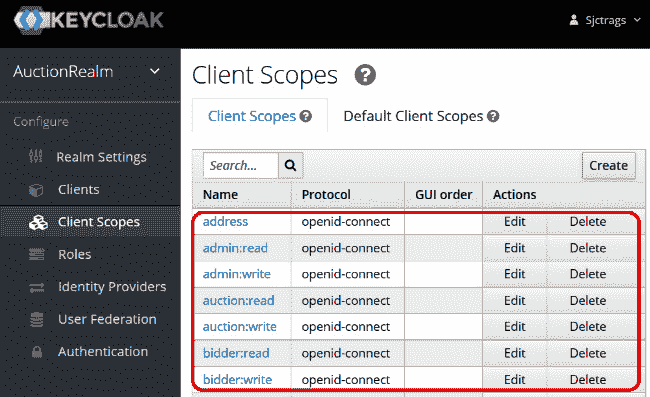

# 第七章：保护 REST API

构建微服务意味着将整个应用程序暴露给全球互联网。对于每一次请求-响应事务，客户端都会公开访问 API 的端点，这对应用程序构成了潜在风险。与基于 Web 的应用程序不同，API 服务在管理用户访问方面具有较弱的控制机制。因此，本章将提供几种保护使用 FastAPI 框架创建的 API 服务的方法。

没有绝对的安全。主要目标是建立与这些服务的*机密性*、*完整性*和*可用性*相关的政策和解决方案。*机密性政策*需要使用令牌、加密和解密以及证书作为机制来使某些 API 私有化。另一方面，*完整性政策*涉及在认证和授权过程中使用“状态”和散列码来维护数据交换的真实性、准确性和可靠性。*可用性政策*意味着使用可靠的工具和 Python 模块来保护端点访问，防止 DoS 攻击、钓鱼攻击和时间攻击。总的来说，安全模型这三个方面是构建微服务安全解决方案时必须考虑的基本要素。

尽管 FastAPI 没有内置的安全框架，但它支持不同的认证模式，如*基本*和*摘要*。它还内置了实现安全规范（如*OAuth2*、*OpenID*和*OpenAPI*）的模块。本章将涵盖以下主要主题，以解释和说明确保我们的 FastAPI 服务概念和解决方案：

+   实现基本和摘要认证

+   实现基于密码的认证

+   应用 JWT

+   创建基于范围的授权

+   构建授权代码流

+   应用 OpenID Connect 规范

+   使用内置中间件进行认证

# 技术要求

本章的软件原型是一个*安全的在线拍卖系统*，旨在管理其注册用户拍卖的各种物品的在线竞标。系统可以在价格范围内对任何物品进行竞标，甚至宣布竞标胜利者。系统需要保护一些敏感交易，以避免数据泄露和结果偏差。原型将使用*SQLAlchemy*作为 ORM 来管理数据。将有 10 个版本的我们的原型，每个原型将展示不同的认证方案。所有 10 个这些项目（`ch07a`到`ch07j`）都可以在这里找到：[`github.com/PacktPublishing/Building-Python-Microservices-with-FastAPI`](https://github.com/PacktPublishing/Building-Python-Microservices-with-FastAPI)。

# 实现基本和摘要认证

基本认证和摘要认证方案是我们可以使用来保护 API 端点的最简单认证解决方案。这两种方案都是可以作为替代认证机制应用于小型和低风险应用，而不需要复杂的配置和编码。现在让我们使用这些方案来保护我们的原型。

## 使用基本认证

保护 API 端点最直接的方法是*基本认证*方法。然而，这种认证机制不应应用于高风险应用，因为从客户端发送到安全方案提供者的凭据，通常是一个用户名和密码，是以*Base64 编码*格式发送的，容易受到许多攻击，如*暴力破解*、*时间攻击*和*嗅探*。Base64 不是一个加密算法，而是一种将凭据表示为*密文格式*的方法。

### 应用 HttpBasic 和 HttpBasicCredentials

原型`ch07a`使用基本认证模式来确保其管理和投标及拍卖交易的安全。其在`/security/secure.py`模块中的实现如下所示：

```py
from passlib.context import CryptContext
from fastapi.security import HTTPBasicCredentials
from fastapi.security import HTTPBasic
from secrets import compare_digest
from models.data.sqlalchemy_models import Login
crypt_context = CryptContext(schemes=["sha256_crypt", 
                    "md5_crypt"])
http_basic = HTTPBasic()
```

FastAPI 框架通过其`fastapi.security`模块支持不同的认证模式和规范。为了追求*基本*认证方案，我们需要实例化模块中的`HTTPBasic`类并将其注入到每个 API 服务中，以保护端点访问。一旦`http_basic`实例被注入到 API 服务中，就会导致浏览器弹出登录表单，通过该表单我们输入`用户名`和`密码`凭据。登录将触发浏览器向应用程序发送包含凭据的头部信息。如果应用程序在接收凭据时遇到问题，`HTTPBasic`方案将抛出*HTTP 状态码 401*并带有*"未经授权"*的消息。如果没有表单处理错误，应用程序必须接收到一个带有`Basic`值和可选的`realm`参数的`WWW-Authenticate`头部。

另一方面，`/ch07/login`服务将调用`authentication()`方法来验证浏览器凭据是否真实且正确。在从浏览器接受用户凭据时，我们需要非常小心，因为它们容易受到各种攻击。首先，我们可以要求端点用户使用*电子邮件地址*作为用户名，并要求使用不同字符、数字和符号组合的长密码。所有存储的密码都必须使用最可靠的加密工具进行编码，例如`passlib`模块中的`CryptContext`类。`passlib`扩展提供了比任何 Python 加密模块更安全的哈希算法。我们的应用程序使用`SHA256`和`MD5`哈希算法，而不是推荐的`bcrypt`，因为`bcrypt`速度较慢且容易受到攻击。

其次，我们可以避免在源代码中存储凭证，而是使用数据库存储或 `.env` 文件。`authenticate()` 方法将凭证与 API 服务提供的 `Login` 数据库记录进行核对以确保正确性。

最后，始终在比较来自浏览器的凭证与数据库中存储的 `Login` 凭证时使用 `secret` 模块中的 `compare_digest()`。此函数在随机比较两个字符串的同时，保护操作免受时间攻击。时间攻击是一种攻击方式，它破坏了加密算法的执行，这发生在系统中对字符串进行线性比较时：

```py
def verify_password(plain_password, hashed_password):
    return crypt_context.verify(plain_password, 
        hashed_password)
def authenticate(credentials: HTTPBasicCredentials, 
         account:Login):
    try:
        is_username = compare_digest(credentials.username,
             account.username)
        is_password = compare_digest(credentials.password, 
             account.username)
        verified_password = 
             verify_password(credentials.password, 
                   account.passphrase)
        return (verified_password and is_username and 
               is_password)
    except Exception as e:
        return False
```

我们的 `authenticate()` 方法具有所有必要的功能，有助于减少来自外部因素的攻击。但确保基本认证安全性的最终解决方案是为应用程序安装和配置 *传输层安全性* (*TLS*)（或 *HTTPS*，或 *SSL*）连接。

现在，我们需要实现一个 `/ch07/login` 端点以应用 *基本* 认证方案。`http_basic` 实例被注入到这个 API 服务中，用于提取 `HTTPBasicCredentials`，这是一个包含从浏览器中获取的 *用户名* 和 *密码* 详细信息的对象。此服务也是调用 `authenticate()` 方法来检查用户凭证的服务。如果该方法返回一个 `False` 值，服务将抛出一个 *HTTP 状态码 400* 并带有 *"凭证错误"* 的消息：

```py
from fastapi import APIRouter, Depends, HTTPException
from fastapi.security import HTTPBasicCredentials
from security.secure import authenticate, 
            get_password_hash, http_basic
router = APIRouter()
@router.get("/login")
def login(credentials: HTTPBasicCredentials = 
     Depends(http_basic), sess:Session = Depends(sess_db)):

    loginrepo = LoginRepository(sess)
    account = loginrepo.get_all_login_username(
                     credentials.username)
    if authenticate(credentials, account) and 
            not account == None:
        return account
    else:
        raise HTTPException(
            status_code=400, 
               detail="Incorrect credentials")

@router.get("/login/users/list")
def list_all_login(credentials: HTTPBasicCredentials = 
     Depends(http_basic), sess:Session = Depends(sess_db)):
    loginrepo = LoginRepository(sess)
    users = loginrepo.get_all_login()
    return jsonable_encoder(users)
```

*在线拍卖系统* 的每个端点都必须注入 `http_basic` 实例以防止公共访问。例如，引用的 `list_all_login()` 服务只能返回所有用户的列表，如果用户是经过认证的。顺便说一下，没有可靠的方法使用 *基本* 认证注销。如果 `WWW-Authenticate` 标头已被浏览器发出并识别，我们很少会看到浏览器登录表单弹出。

### 执行登录事务

我们可以使用 `curl` 命令或浏览器来执行 `/ch07/login` 事务。但为了突出 FastAPI 的支持，我们将使用其 OpenAPI 仪表板来运行 `/ch07/login`。在浏览器上访问 `http://localhost:8000/docs` 后，定位到 `/ch07/login` GET 事务并点击 **尝试它** 按钮。点击按钮后，浏览器登录表单，如 *图 7.1* 所示，将弹出：


图 7.1 – 浏览器的登录表单

在 `/ch07/signup/add` 和 `/ch07/approve/signup` 后添加您想要测试的用户凭证。请记住，所有存储的密码都是加密的。*图 7.2* 展示了在认证过程发现用户凭证有效后，`/ch07/login` 将如何输出用户的 `登录` 记录：


图 7.2 – /login 响应

现在用户已经认证，通过 OpenAPI 控制台运行 `/ch07/login/users/list` 来检索登录详情。`uvicorn` 服务器日志将显示以下日志信息：

```py
INFO: 127.0.0.1:53150 - "GET /ch07/login/users/list HTTP/1.1" 200 OK
```

这意味着用户有权运行该端点。现在，让我们将 Digest 认证方案应用到我们的原型中。

## 使用 Digest 认证

Digest 认证比基本方案更安全，因为前者需要在发送到应用程序的哈希版本之前先对用户凭据进行哈希处理。FastAPI 中的 Digest 认证不包括使用默认 *MD5* 加密的自动加密用户凭据的过程。它是一种将凭据存储在 `.env` 或 `.config` 属性文件中，并在认证之前为这些凭据创建哈希字符串值的认证方案。`ch07b` 项目应用 Digest 认证方案以保护投标和拍卖交易。

### 生成哈希凭据

因此，在我们开始实现之前，我们首先需要创建一个自定义实用脚本 `generate_hash.py`，该脚本使用 Base64 编码生成二进制的摘要。该脚本必须包含以下代码：

```py
from base64 import urlsafe_b64encode
h = urlsafe_b64encode(b"sjctrags:sjctrags")
```

`base64` 模块中的 `urlsafe_b64encode()` 函数从 `username:password` 凭据格式创建一个二进制的摘要。在运行脚本后，我们将摘要值保存在任何安全的地方，但不能在源代码中。

### 传递用户凭据

除了摘要之外，我们还需要保存 Digest 方案提供者的用户凭据，以便稍后使用。与标准 Digest 认证过程不同，在该过程中用户与浏览器协商，FastAPI 需要将用户凭据存储在我们的应用程序内的 `.env` 或 `.config` 文件中，以便在认证过程中检索。在 `ch07b` 项目中，我们将用户名和密码保存在 `.config` 文件中，如下所示：

```py
[CREDENTIALS]
USERNAME=sjctrags
PASSWORD=sjctrags
```

然后，我们通过 `ConfigParser` 工具创建一个解析器，从 `.config` 文件中提取以下详细信息，并使用序列化的用户详情构建一个 `dict`。以下 `build_map()` 是解析器实现的示例：

```py
import os
from configparser import ConfigParser
def build_map():
    env = os.getenv("ENV", ".config")
    if env == ".config":
        config = ConfigParser()
        config.read(".config")
        config = config["CREDENTIALS"]
    else:
        config = {
            "USERNAME": os.getenv("USERNAME", "guest"),
            "PASSWORD": os.getenv("PASSWORD", "guest"),
        }
    return config
```

### 使用 HTTPDigest 和 HTTPAuthorizationCredentials

FastAPI 框架在其 `fastapi.security` 模块中有一个 `HTTPDigest`，它以不同的方式管理用户凭据并生成摘要，实现了 Digest 认证方案。与基本认证不同，`HTTPDigest` 认证过程发生在 `APIRouter` 层级。我们通过 HTTP 操作将以下 `authenticate()` 可依赖项注入到 API 服务中，包括 `/login`，认证从这里开始：

```py
from fastapi import Security, HTTPException, status
from fastapi.security import HTTPAuthorizationCredentials
from fastapi.security import HTTPDigest
from secrets import compare_digest
from base64 import standard_b64encode
http_digest = HTTPDigest()
def authenticate(credentials: 
    HTTPAuthorizationCredentials = Security(http_digest)):

    hashed_credentials = credentials.credentials
    config = build_map()
    expected_credentials = standard_b64encode(
        bytes(f"{config['USERNAME']}:{config['PASSWORD']}",
           encoding="UTF-8")
    )
    is_credentials = compare_digest(
          bytes(hashed_credentials, encoding="UTF-8"),
               expected_credentials)

    if not is_credentials:
        raise HTTPException(
            status_code=status.HTTP_401_UNAUTHORIZED,
            detail="Incorrect digest token",
            headers={"WWW-Authenticate": "Digest"},
        )
```

`authenticate()`方法是将`http_digest`注入到提取包含摘要字节的`HTTPAuthorizationCredentials`的地方。提取后，它会检查摘要是否与保存在`.config`文件中的凭证匹配。我们还使用`compare_digest`来比较来自头部的`hashed_credentials`和来自`.config`文件的 Base64 编码的凭证。

### 执行登录事务

在实现`authenticate()`方法后，我们将它注入到 API 服务中，不是在方法参数中，而是在其 HTTP 操作符中。请注意，与*基本*认证方案不同，`http_digest`对象不是直接注入到 API 服务中的。以下实现展示了如何将`authenticate()`方法应用于保护应用程序的所有关键端点：

```py
from security.secure import authenticate
@router.get("/login", dependencies=[Depends(authenticate)])
def login(sess:Session = Depends(sess_db)):
    return {"success": "true"}

@router.get("/login/users/list",   
      dependencies=[Depends(authenticate)])
def list_all_login(sess:Session = Depends(sess_db)):
    loginrepo = LoginRepository(sess)
    users = loginrepo.get_all_login()
    return jsonable_encoder(users)
```

由于摘要认证方案的行为类似于*OpenID 认证*，我们将使用`curl`命令运行`/ch07/login`。命令的关键部分是发出包含由我们之前执行的`generate_hash.py`脚本生成的 Base64 编码的`username:password`摘要值的`Authorization`头。以下`curl`命令是正确登录我们使用摘要认证方案的 FastAPI 应用程序的方法：

```py
curl --request GET --url http://localhost:8000/ch07/login --header "accept: application/json"                  --header "Authorization: Digest c2pjdHJhZ3M6c2pjdHJhZ3M=" --header "Content-Type: application/json"
```

我们也使用相同的命令来运行其他受保护的 API 服务。

如今，大多数企业应用程序很少使用基本和摘要认证方案，因为它们容易受到许多攻击。不仅如此，这两种认证方案都需要将凭证发送到受保护的 API 服务，这也是另一个风险。此外，在撰写本文时，FastAPI 尚未完全支持标准的摘要认证，这对需要标准认证的其他应用程序来说也是一个劣势。因此，现在让我们来探讨使用*OAuth 2.0 规范*来保护 API 端点的解决方案。

# 实现基于密码的认证

*OAuth 2.0 规范*，或称 OAuth2，是认证 API 端点访问最首选的解决方案。OAuth2 授权框架定义了四种授权流程，分别是*隐式*、*客户端凭证*、*授权码*和*资源密码流程*。这三种流程可以与第三方认证提供商一起使用，以授权访问 API 端点。在 FastAPI 平台上，资源密码流程可以在应用程序内部自定义和实现，以执行认证过程。现在让我们来探讨 FastAPI 如何支持 OAuth2 规范。

## 安装 python-multipart 模块

由于没有表单处理程序，OAuth2 认证将无法进行，因此我们需要在继续实施部分之前安装`python-multipart`模块。我们可以运行以下命令来安装扩展：

```py
pip install python-multipart
```

## 使用 OAuth2PasswordBearer 和 OAuth2PasswordRequestForm

FastAPI 框架完全支持 OAuth2，特别是 OAuth2 规范的密码流类型。它的 `fastapi.security` 模块有一个 `OAuth2PasswordBearer`，作为基于密码认证的提供者。它还有一个 `OAuth2PasswordRequestForm`，可以声明一个包含所需参数（`username` 和 `password`）和一些可选参数（如 `scope`、`grant_type`、`client_id` 和 `client_secret`）的表单体。此类直接注入到 `/ch07/login` API 端点以从浏览器登录表单中提取所有参数值。但始终可以选择使用 `Form(…)` 来捕获所有单个参数。

因此，让我们通过创建要注入到自定义函数依赖项中的 `OAuth2PasswordBearer` 来开始解决方案，该依赖项将验证用户凭据。以下实现显示 `get_current_user()` 是我们新应用程序 `ch07c` 中的可注入函数，它利用 `oath2_scheme` 可注入项提取 `token`：

```py
from fastapi.security import OAuth2PasswordBearer
from sqlalchemy.orm import Session
from repository.login import LoginRepository
from db_config.sqlalchemy_connect import sess_db
oauth2_scheme = 
    OAuth2PasswordBearer(tokenUrl="ch07/login/token")
def get_current_user(token: str = Depends(oauth2_scheme), 
           sess:Session = Depends(sess_db) ):
    loginrepo = LoginRepository(sess)
    user = loginrepo.get_all_login_username(token)
    if user == None:
        raise HTTPException(
            status_code=status.HTTP_401_UNAUTHORIZED,
            detail="Invalid authentication credentials",
            headers={"WWW-Authenticate": "Bearer"},
        )
    return user
```

对于资源密码流，注入 `oauth2_scheme` 将返回一个作为 token 的 `username`。`get_current_user()` 将检查该用户名是否属于存储在数据库中的有效用户账户。

## 执行登录事务

在此认证方案中，`/ch07/login/token` 也是 `OAuth2PasswordBearer` 的 `tokenUrl` 参数。`tokenUrl` 参数对于基于密码的 OAuth2 认证是必需的，因为这是从浏览器登录表单中捕获用户凭据的端点服务。`OAuth2PasswordRequestForm` 注入到 `/cho07/login/token` 中以检索未认证用户的 `username`、`password` 和 `grant_type` 参数。这三个参数是调用 `/ch07/login/token` 以生成 *token* 的基本要求。这种依赖关系在以下登录 API 服务的实现中显示：

```py
from sqlalchemy.orm import Session
from db_config.sqlalchemy_connect import sess_db
from repository.login import LoginRepository
from fastapi.security import OAuth2PasswordRequestForm
from security.secure import get_current_user, authenticate
@router.post("/login/token")
def login(form_data: OAuth2PasswordRequestForm = Depends(),
             sess:Session = Depends(sess_db)):
    username = form_data.username
    password = form_data.password
    loginrepo = LoginRepository(sess)
    account = loginrepo.get_all_login_username(username)
    if authenticate(username, password, account) and 
              not account == None:
        return {"access_token": form_data.username, 
                  "token_type": "bearer"}
    else:
        raise HTTPException(
            status_code=400, 
               detail="Incorrect username or password")
```

除了从数据库验证之外，`login()` 服务还将检查 `password` 值是否与从查询的 `account` 中检索到的加密密码匹配。如果所有验证都成功，则 `/ch07/login/token` 必须返回一个包含所需属性 `access_token` 和 `token_type` 的 JSON 对象。`access_token` 属性必须具有 `username` 值，而 `token_type` 必须是 `"bearer"` 值。

我们将利用框架中 OpenAPI 提供的 OAuth2 表单来代替创建自定义的前端登录表单。我们只需在 OpenAPI 仪表板的右上角点击 **授权** 按钮，如 *图 7.3* 所示：


图 7.3 – 授权按钮

该按钮将触发一个内置的登录表单弹出，如 *图 7.4* 所示，我们可以使用它来测试我们的解决方案：


图 7.4 – OAuth2 登录表单

如果 OAuth2 登录表单检测到在`OAuth2PasswordBearer`实例化中指定的正确`tokenURL`，则一切正常。登录表单中指示的 OAuth2 流程或`grant_type`必须是`"password"`。在记录验证凭证后，表单的**授权**按钮将重定向用户到如*图 7.5*所示的授权表单，该表单将提示用户注销或继续进行经过认证的访问：


图 7.5 – 授权表单

通常，OAuth2 规范认可两种客户端或应用程序类型：*机密*和*公开*客户端。机密客户端使用认证服务器进行安全，例如在这个使用 OpenAPI 平台通过 FastAPI 服务器进行的*在线拍卖系统*中。在其设置中，不需要向登录表单提供`client_id`和`client_secret`值，因为服务器将在认证过程中生成这些参数。但不幸的是，这些值并未向客户端透露，如*图 7.5*所示。另一方面，公开客户端没有生成和使用客户端密钥的手段，就像典型的基于 Web 和移动应用程序一样。因此，这些应用程序必须在登录时包含`client_id`、`client_secret`和其他所需参数。

## 保护端点

要保护 API 端点，我们需要将`get_current_user()`方法注入到每个 API 服务方法中。以下是一个使用`get_current_user()`方法的受保护`add_auction()`服务实现的示例：

```py
@router.post("/auctions/add")
def add_auction(req: AuctionsReq, 
      current_user: Login = Depends(get_current_user), 
      sess:Session = Depends(sess_db)): 
    auc_dict = req.dict(exclude_unset=True)
    repo:AuctionsRepository = AuctionsRepository(sess)
    auction = Auctions(**auc_dict)
    result = repo.insert_auction(auction)
    if result == True:
        return auction
    else: 
        return JSONResponse(content=
         {'message':'create auction problem encountered'}, 
            status_code=500)  
```

如果允许访问，`get_current_user()`注入方法将返回一个有效的`Login`账户。此外，您会注意到所有包含`/ch07/auctions/add`的受保护 API 端点的锁形图标，如*图 7.6*所示，都是关闭的。这表明它们已经准备好执行，因为用户已经是一个经过认证的用户：


图 7.6 – 展示受保护 API 的 OpenAPI 仪表板

这种解决方案对于开放网络设置来说是一个问题，例如，因为使用的令牌是一个密码。这种设置允许攻击者轻松地在发行者向客户端传输令牌期间伪造或修改令牌。保护令牌的一种方法是用**JSON Web Token**（JWT）。

# 应用 JWT

JWT 是一个开源标准，用于定义在发行者和客户端之间进行身份验证和授权过程中发送任何信息的解决方案。其目标是生成数字签名、URL 安全且始终可由客户端验证的`access_token`属性。然而，它并不完全安全，因为任何人如果需要都可以解码令牌。因此，建议不要在令牌字符串中包含所有有价值且机密的信息。JWT 是提供比密码更可靠令牌的有效方式，用于 OAuth2 和 OpenID 规范。

## 生成密钥

但在我们开始构建认证方案之前，我们首先需要生成一个`*secret key*`，这是创建`*signature*`的一个基本元素。JWT 有一个`ssh`或`openssl`是生成这个长且随机化的密钥的适当工具。在这里，在`ch07d`中，我们从 GIT 工具或任何 SSL 生成器运行以下`openssl`命令来创建密钥：

```py
openssl rand -hex 32
```

## 创建 access_token

在`ch07d`项目中，我们将在其`/security/secure.py`模块脚本中的某些引用变量中存储`*secret key*`和`*algorithm type*`。这些变量由 JWT 编码过程用于生成令牌，如下面的代码所示：

```py
from jose import jwt, JWTError
from datetime import datetime, timedelta
SECRET_KEY = "tbWivbkVxfsuTxCP8A+Xg67LcmjXXl/sszHXwH+TX9w="
ALGORITHM = "HS256"
ACCESS_TOKEN_EXPIRE_MINUTES = 30
def create_access_token(data: dict, 
           expires_after: timedelta):
    plain_text = data.copy()
    expire = datetime.utcnow() + expires_after
    plain_text.update({"exp": expire})
    encoded_jwt = jwt.encode(plain_text, SECRET_KEY, 
            algorithm=ALGORITHM)
    return encoded_jwt
```

在 JWT Python 扩展中，我们选择了`python-jose`模块来生成令牌，因为它可靠并且具有额外的加密功能，可以签名复杂的数据内容。在使用它之前，请先使用`pip`命令安装此模块。

因此，现在`/ch07/login/token`端点将调用`create_access_token()`方法来请求 JWT。*login*服务将提供数据，通常是`username`，以构成令牌的有效负载部分。由于 JWT 必须是短暂的，这个过程必须更新有效负载的`expire`部分为几分钟或几秒钟的`datetime`值，适合应用程序。

## 创建登录事务

`*login*`服务的实现与之前的基于密码的 OAuth2 认证类似，但这个版本有一个用于 JWT 生成的`create_access_token()`调用，以替换密码凭据。以下脚本显示了`ch07d`项目的`/ch07/login/token`服务：

```py
@router.post("/login/token")
def login(form_data: OAuth2PasswordRequestForm = Depends(),
          sess:Session = Depends(sess_db)):
    username = form_data.username
    password = form_data.password
    loginrepo = LoginRepository(sess)
    account = loginrepo.get_all_login_username(username)
    if authenticate(username, password, account):
        access_token = create_access_token(
          data={"sub": username}, 
           expires_after=timedelta(
              minutes=ACCESS_TOKEN_EXPIRE_MINUTES))
        return {"access_token": access_token, 
             "token_type": "bearer"}
    else:
        raise HTTPException(
            status_code=400, 
            detail="Incorrect username or password")
```

端点仍然应该返回`access_token`和`token_type`，因为这仍然是基于密码的 OAuth2 认证，它从`OAuth2PasswordRequestForm`检索用户凭据。

## 访问受保护的端点

与之前的 OAuth2 方案一样，我们需要将`get_current_user()`注入到每个 API 服务中，以实施安全和限制访问。注入的`OAuthPasswordBearer`实例将使用指定的解码算法通过 JOSE 解码器返回 JWT 以提取有效负载。如果令牌被篡改、修改或过期，该方法将抛出异常。否则，我们需要继续提取有效负载数据，检索用户名，并将其存储在`@dataclass`实例中，例如`TokenData`。然后，用户名将进行进一步的验证，例如检查数据库中是否有该用户名的`Login`账户。以下代码片段显示了此解码过程，位于`ch07d`项目的`/security/secure.py`模块中：

```py
from models.request.tokens import TokenData
from fastapi.security import OAuth2PasswordBearer
from jose import jwt, JWTError
from models.data.sqlalchemy_models import Login
from sqlalchemy.orm import Session
from db_config.sqlalchemy_connect import sess_db
from repository.login import LoginRepository
from datetime import datetime, timedelta
oauth2_scheme = 
     OAuth2PasswordBearer(tokenUrl="ch07/login/token")
def get_current_user(token: str = Depends(oauth2_scheme),
    sess:Session = Depends(sess_db)):
    credentials_exception = HTTPException(
        status_code=status.HTTP_401_UNAUTHORIZED,
        detail="Could not validate credentials",
        headers={"WWW-Authenticate": "Bearer"}
    )
    try:
        payload = jwt.decode(token, SECRET_KEY, 
           algorithms=[ALGORITHM])
        username: str = payload.get("sub")
        if username is None:
            raise credentials_exception
        token_data = TokenData(username=username)
    except JWTError:
        raise credentials_exception

    loginrepo = LoginRepository(sess)
    user = 
      loginrepo.get_all_login_username(token_data.username)
    if user is None:
        raise credentials_exception
    return user
```

`get_current_user()`必须注入到每个服务实现中，以限制用户访问。但这次，该方法不仅会验证凭据，还会执行*JWT 有效负载解码*。下一步是向 OAuth2 解决方案添加*用户授权*。

# 创建基于范围的授权

FastAPI 完全支持基于*作用域的认证*，它使用 OAuth2 协议的`scopes`参数来指定哪些端点可供一组用户访问。`scopes`参数是一种放置在令牌中的权限，为用户提供额外的细粒度限制。在这个项目版本`ch07e`中，我们将展示基于 OAuth2 密码的认证和用户授权。

## 自定义 OAuth2 类

首先，我们需要创建一个自定义类，该类继承自`fastapi.security`模块中的`OAuth2` API 类的属性，以在用户凭证中包含`scopes`参数或“角色”选项。以下是一个自定义 OAuth2 类`OAuth2PasswordBearerScopes`，它将实现带有授权的认证流程：

```py
class OAuth2PasswordBearerScopes(OAuth2):
    def __init__(
        self,
        tokenUrl: str,
        scheme_name: str = None,
        scopes: dict = None,
        auto_error: bool = True,

    ):
    if not scopes:
         scopes = {}
    flows = OAuthFlowsModel(
       password={"tokenUrl": tokenUrl, "scopes": scopes})
    super().__init__(flows=flows, 
       scheme_name=scheme_name, auto_error=auto_error)
    async def __call__(self, request: Request) -> 
             Optional[str]:
        header_authorization: str = 
              request.headers.get("Authorization")
        … … … … … …
        return param
```

这个`OAuth2PasswordBearerScopes`类需要两个构造函数参数，`tokenUrl`和`scopes`，以实现认证流程。`OAuthFlowsModel`将`scopes`参数定义为使用`Authorization`头进行认证的用户凭证的一部分。

## 构建权限字典

在我们进行身份验证实现之前，我们需要首先构建 OAuth2 方案在身份验证过程中将应用的作用域参数。这个设置是`OAuth2PasswordBearerScopes`实例化的一部分，我们将这些参数分配给其`scopes`参数。以下脚本展示了如何将所有自定义定义的用户作用域保存到一个*字典*中，其中*键*是作用域名称，*值*是对应的描述：

```py
oauth2_scheme = OAuth2PasswordBearerScopes(
    tokenUrl="/ch07/login/token",
    scopes={"admin_read": 
              "admin role that has read only role",
            "admin_write":
              "admin role that has write only role",
            "bidder_read":
              "customer role that has read only role",
            "bidder_write":
              "customer role that has write only role",
            "auction_read":
              "buyer role that has read only role",
            "auction_write":
              "buyer role that has write only role",
            "user":"valid user of the application",
            "guest":"visitor of the site"},
)
```

在实现这个项目的过程中，没有直接将`OAuth2PasswordBearerScopes`类连接到数据库以动态查找权限集的可行方法。唯一的解决方案是将所有这些授权“角色”直接静态存储到`OAuth2PasswordBearerScopes`构造函数中。

## 实现登录事务

所有作用域都将作为选项添加到 OAuth2 表单登录中，并成为用户登录凭证的一部分。以下是在这个新的`ch07e`项目中实现`/ch07/login/token`的示例，展示了如何从`OAuth2PasswordRequestForm`中检索作用域参数和凭证：

```py
@router.post("/login/token")
def login(form_data: OAuth2PasswordRequestForm = Depends(),
         sess:Session = Depends(sess_db)):
    username = form_data.username
    password = form_data.password
    loginrepo = LoginRepository(sess)
    account = loginrepo.get_all_login_username(username)
    if authenticate(username, password, account):
        access_token = create_access_token(
            data={"sub": username, "scopes": 
              form_data.scopes},  
               expires_delta=timedelta(
               minutes=ACCESS_TOKEN_EXPIRE_MINUTES))
        return {"access_token": access_token, 
                "token_type": "bearer"}
    else:
        raise HTTPException(
            status_code=400, 
            detail="Incorrect username or password")
```

被选中的作用域存储在一个列表中，例如`['user', 'admin_read', 'admin_write', 'bidder_write']`，这意味着一个用户拥有*用户*、*管理员（写）*、*管理员（读）*和*竞标者（写）*权限。`create_access_token()`将包括这个作用域列表或“角色”作为*负载*的一部分，该负载将通过`get_current_valid_user()`通过`get_current_user()`注入器进行解码和提取。顺便说一下，`get_current_valid_user()`通过应用身份验证方案来确保每个 API 免受用户访问。

## 将作用域应用于端点

来自`fastapi`模块的`Security` API 替换了注入`get_current_valid_user()`时的`Depends`类，因为它除了具有执行依赖注入的能力外，还能为每个 API 服务分配权限。它有一个`scopes`属性，其中定义了一个有效权限参数列表，限制了用户的访问。例如，以下`update_profile()`服务仅对包含`bidder_write`和`buyer_write`角色的用户可访问：

```py
from fastapi.security import SecurityScopes
@router.patch("/profile/update")
def update_profile(id:int, req: ProfileReq, 
    current_user: Login = Security(get_current_valid_user, 
        scopes=["bidder_write", "buyer_write"]), 
    sess:Session = Depends(sess_db)): 
    … … … … … …
    if result: 
        return JSONResponse(content=
         {'message':'profile updated successfully'}, 
              status_code=201)
    else: 
        return JSONResponse(content=
           {'message':'update profile error'}, 
               status_code=500)
```

现在，以下代码片段展示了由`Security`注入到每个 API 服务中的`get_current_valid_user()`的实现：

```py
def get_current_valid_user(current_user: 
   Login = Security(get_current_user, scopes=["user"])):
    if current_user == None:
        raise HTTPException(status_code=400, 
           detail="Invalid user")
    return current_user
```

当涉及到 JWT 有效载荷解码、凭证验证和用户权限验证时，此方法依赖于`get_current_user()`。用户至少必须拥有`user`权限，授权过程才能继续。`Security`类负责将`get_current_user()`注入到`get_current_valid_user()`中，并附带默认的`user`权限。以下是`get_current_user()`方法的实现：

```py
def get_current_user(security_scopes: SecurityScopes, 
      token: str = Depends(oauth2_scheme), 
           sess:Session = Depends(sess_db)):
    if security_scopes.scopes:
        authenticate_value = 
          f'Bearer scope="{security_scopes.scope_str}"'
    else:
        authenticate_value = f"Bearer" 
    … … … … … …
    try:
        payload = jwt.decode(token, SECRET_KEY, 
                   algorithms=[ALGORITHM])
        username: str = payload.get("sub")
        if username is None:
            raise credentials_exception
        token_scopes = payload.get("scopes", [])
        token_data = TokenData(scopes=token_scopes, 
               username=username)
    except JWTError:
        raise credentials_exception
    … … … … … …
    for scope in security_scopes.scopes:
        if scope not in token_data.scopes:
            raise HTTPException(
                status_code=status.HTTP_401_UNAUTHORIZED,
                detail="Not enough permissions",
                headers={"WWW-Authenticate": 
                    authenticate_value},
            )
    return user
```

给定的`get_current_user()`函数中的`SecurityScopes`类提取了用户试图访问的 API 服务分配的权限范围。它有一个包含所有这些 API 权限参数的`scope`实例变量。另一方面，`token_scopes`携带从解码的 JWT 有效载荷中提取的所有权限或“角色”。`get_current_user()`遍历`SecurityScopes`中的 API 权限，以检查它们是否全部出现在用户的`token_scopes`中。如果是，`get_current_user()`将验证并授权用户访问 API 服务。否则，它将抛出一个异常。`TokenData`的目的在于管理来自`token_scopes`有效载荷值和用户名的权限参数。

FastAPI 可以支持的下一类 OAuth2 认证方案是授权码流方法。

# 构建授权码流

如果应用程序是*公开*类型，并且没有授权服务器来处理`client_id`参数、`client_secret`参数和其他相关参数，那么使用 OAuth2 授权码流方法是很合适的。在这个方案中，客户端将从`authorizationUrl`创建一个短生命周期的授权请求，以获取一个授权码。然后客户端将使用生成的代码从`tokenUrl`请求令牌。在这个讨论中，我们将展示我们*在线拍卖系统*的另一个版本，该版本将使用 OAuth2 授权码流方案。

## 应用 OAuth2AuthorizationCodeBearer

`OAuth2AuthorizationCodeBearer`类是`fastapi.security`模块中的一个类，用于构建授权码流。它的构造函数在实例化之前需要`authorizationUrl`、`tokenUrl`和可选的`scopes`。以下代码展示了如何创建这个 API 类，并在将其注入到`get_current_user()`方法之前：

```py
from fastapi.security import OAuth2AuthorizationCodeBearer
oauth2_scheme = OAuth2AuthorizationCodeBearer(
    authorizationUrl='ch07/oauth2/authorize',
    tokenUrl="ch07/login/token",  
    scopes={"admin_read": "admin … read only role",
            "admin_write":"admin … write only role",
            … … … … … …
            "guest":"visitor of the site"},
    )
```

这两个端点，`authorizationUrl` 和 `tokenUrl`，是本方案认证和授权过程中的关键参数。与之前的解决方案不同，我们在生成 `access_token` 时不会依赖于授权服务器。相反，我们将实现一个 `authorizationUrl` 端点，该端点将捕获来自客户端的基本参数，这些参数将构成生成 `access_token` 的授权请求。`client_secret` 参数始终不会被暴露给客户端。

## 实施授权请求

在之前的方案中，`/ch07/login/` 令牌或 `tokenUrl` 端点总是在登录事务之后成为重定向点。但这次，用户将被转发到自定义的 `/ch07/oauth2/authorize` 或 `authorizationUrl` 端点以生成 *认证码*。查询参数如 `response_type`、`client_id`、`redirect_uri`、`scope` 和 `state` 是 `authorizationUrl` 服务的必要输入。以下代码来自 `ch07f` 项目的 `/security/secure.py` 模块，将展示 `authorizationUrl` 事务的实现：

```py
@router.get("/oauth2/authorize")
def authorizationUrl(state:str, client_id: str, 
       redirect_uri: str, scope: str, response_type: str, 
       sess:Session = Depends(sess_db)):

    global state_server
    state_server = state

    loginrepo = LoginRepository(sess)
    account = loginrepo.get_all_login_username(client_id)
    auth_code = f"{account.username}:{account.password}
                    :{scope}"
    if authenticate(account.username, 
              account.password, account):
        return RedirectResponse(url=redirect_uri 
          + "?code=" + auth_code 
          + "&grant_type=" + response_type
          + "&redirect_uri=" + redirect_uri 
          + "&state=" + state)
    else:
        raise HTTPException(status_code=400, 
               detail="Invalid account")
```

这些是 `authorizationUrl` 事务所需的查询参数：

+   `response_type`: 自定义生成的授权码

+   `client_id`: 应用程序的公共标识符，例如 `username`

+   `redirect_uri`: 服务器默认 URI 或一个自定义端点，用于将用户重定向回应用程序

+   `scope`: 范围参数字符串，如果涉及至少两个参数，则由空格分隔

+   `state`: 一个任意的字符串值，用于确定请求的状态

`redirect_uri` 参数是认证和授权过程将发生的目的点，这些查询参数将一起使用。

`auth_code` 的生成是 `authorizationUrl` 事务的关键任务之一，包括认证过程。*认证码*表示认证过程的 ID，通常与其他所有认证都不同。有许多生成代码的方法，但在我们的应用程序中，它只是用户凭证的组合。传统上，`auth_code` 需要加密，因为它包含了用户凭证、范围和其他请求相关细节。

如果用户有效，`authorizationUrl` 事务将重定向用户到 `redirect_uri` 参数，回到 FastAPI 层，并带有 `auth_code`、`grant_type` 和 `state` 参数，以及 `redirect_uri` 参数本身。`grant_type` 和 `redirect_uri` 参数只有在应用程序不需要它们时才是可选的。此响应将调用 `tokenUrl` 端点，该端点恰好是 `redirectURL` 参数，以继续基于范围的授权的认证过程。

## 实施授权码响应

`/ch07/login/token` 服务，或 `tokenUrl`，必须具有 `Form(…)` 参数来捕获 `authorizationUrl` 事务中的 `code`、`grant_type` 和 `redirect_uri` 参数，而不是 `OAuth2PasswordRequestForm`。以下代码片段显示了其实现：

```py
@router.post("/login/token")
def access_token(code: str = Form(...), 
  grant_type:str = Form(...), redirect_uri:str = Form(...), 
  sess:Session = Depends(sess_db)):
    access_token_expires = 
       timedelta(minutes=ACCESS_TOKEN_EXPIRE_MINUTES)

    code_data = code.split(':')
    scopes = code_data[2].split("+")
    password = code_data[1]
    username = code_data[0]

    loginrepo = LoginRepository(sess)
    account = loginrepo.get_all_login_username(username)
    if authenticate(username, password, account):
        access_token = create_access_token(
            data={"sub": username, "scopes": scopes},
            expires_delta=access_token_expires,
        )

        global state_server
        state = state_server
        return {
            "access_token": access_token,
            "expires_in": access_token_expires,
            "token_type": "Bearer",
            "userid": username,
            "state": state,
            "scope": "SCOPE"
        }
    else:
        raise HTTPException(
            status_code=400, 
             detail="Incorrect credentials")
```

`authorizationUrl` 发送的响应数据中，只有 `state` 参数是 `tokenUrl` 无法访问的。一种解决方案是在 `authorizationURL` 中将 `state` 变量声明为 `global`，使其在任何地方都可以访问。`state` 变量是服务 JSON 响应的一部分，API 认证需要它。同样，`tokenUrl` 无法访问用户凭据，但解析 `auth_code` 是推导用户名、密码和作用域的可能方法。

如果用户有效，`tokenUrl` 必须提交包含 `access_token`、`expires_in`、`token_type`、`userid` 和 `state` 的 JSON 数据，以继续进行认证方案。

此授权代码流方案为 *OpenID Connect* 认证提供了基本协议。各种身份和访问管理解决方案，如 *Okta*、*Auth0* 和 *Keycloak*，应用涉及响应 _type 代码的授权请求和响应。下一个主题将强调 FastAPI 对 OpenID Connect 规范的支持。

# 应用 OpenID Connect 规范

已创建了三个 *在线拍卖* 项目，以实施 *OAuth2 OpenID Connect* 认证方案。所有这些项目都使用第三方工具执行认证和授权流程。`ch07g` 项目使用 *Auth0*，`ch07h` 使用 *Okta*，而 `ch07i` 在认证客户端访问 API 服务时应用了 *Keycloak* 政策。让我们首先强调 Keycloak 对 OpenID Connect 协议的支持。

## 使用 HTTPBearer

`HTTPBearer` 类是 `fastapi.security` 模块中的一个实用工具类，它提供了一个依赖于带有 `Bearer` 令牌的授权头的授权方案。与其他 OAuth2 方案不同，这需要在运行认证服务器之前在 *Keycloak* 端生成 `access_token`。在此阶段，框架没有直接访问凭证和 `access_token` 的简单方法。要使用此类，我们只需要实例化它，无需任何构造函数参数。

## 安装和配置 Keycloak 环境

Keycloak 是一个基于 Java 的应用程序，我们可以从以下链接下载：[`www.keycloak.org/downloads`](https://www.keycloak.org/downloads)。下载后，我们可以将其内容解压缩到任何目录。但在运行之前，我们需要在我们的开发机器上至少安装 Java 12 SDK。一旦完成设置，请在控制台运行其 `bin\standalone.bat` 或 `bin\standalone.sh`，然后在浏览器中打开 `http://localhost:8080`。之后，创建一个管理账户来设置 *realm*、*clients*、*users* 和 *scopes*。

## 设置 Keycloak 领域和客户端

Keycloak 的 *领域* 是一个对象，它包含所有客户端及其 *凭证*、*作用域* 和 *角色*。在创建用户配置文件之前的第一步是构建一个领域，如图 7.7 所示：


图 7.7 - 创建 Keycloak 领域

在领域之后，Keycloak 的 *客户端*，它管理用户配置文件和凭证，是下一个优先级。它是在**配置** | **客户端**面板上创建的，如图所示：


图 7.8 – 创建 Keycloak 客户端

在创建客户端后，我们需要编辑每个客户端配置文件以输入以下详细信息：

+   其访问类型必须是 `confidential`

+   `授权启用`已开启

+   提供以下值：`根 URL`、`基本 URL` 和 `管理 URL`，它们都指向 API 服务应用程序的 `http://localhost:8000`

+   指定一个 `有效的重定向 URI` 端点，或者如果我们没有特定的自定义端点，我们可以直接分配 `http://localhost:8080/*`

+   在 `高级设置` 中，设置 `访问令牌有效期`（例如，15 分钟）

+   在 `身份验证流程覆盖` 下，将 `浏览器流程` 设置为 `browser`，将 `直接授权流程` 设置为 `direct grant`。

在 `client_secret` 值所在的位置。设置完成后，我们现在可以将用户分配给客户端。

## 创建用户和用户角色

首先，我们在**配置 | 角色**面板上创建 *角色*，为稍后的用户分配做准备。图 7.9 显示了将处理应用程序的 *管理*、*拍卖* 和 *竞标* 任务的三个用户角色：


图 7.9 – 创建用户角色

创建角色后，我们需要在**管理 | 用户**面板上构建用户列表。图 7.10 显示了三个创建的用户，每个用户都分配了相应的角色：


图 7.10 – 创建客户端用户

为了为用户提供其角色，我们需要点击 `joey_admin` 具有具有 `auc_admin_role` 角色的权限，授权用户执行应用程序的行政任务。顺便说一句，不要忘记在**凭证**面板为每个用户创建密码：


图 7.11 – 映射用户角色

## 将角色分配给客户端

除了用户角色外，客户端还可以分配角色。一个 *客户端角色* 定义了客户端在其范围内必须拥有的用户类型。它还提供了客户端访问 API 服务的边界。图 7.12 显示了具有 `admin` 角色的 `auc_admin`：


图 7.12 – 创建客户端角色

然后，我们需要返回到 `joey_admin` 具有具有 `admin` 角色的配置，因为 `auc_admin` 角色已被添加到其配置文件中。所有将 `auc_admin` 客户端添加到其设置的用户的用户都具有应用程序的 *管理员* 访问权限，包括 `joey_admin`：


图 7.13 – 将客户端角色映射到用户

## 通过作用域创建用户权限

为了为每个客户端分配权限，我们需要在 `Audience` 类型的令牌映射器上创建 *客户端作用域*。*图 7.14* 显示了 `auc_admin` 客户端的 `admin:read` 和 `admin:write` 作用域，`auc_customer` 的 `auction:read` 和 `auction:write`，以及 `auc_bidder` 的 `bidder:write` 和 `bidder:read`：



图 7.14 – 创建客户端作用域

这些 *客户端作用域* 是每个 API 服务 `Security` 注入中的关键细节，如果 *基于作用域的授权* 是方案的一部分。

## 将 Keycloak 与 FastAPI 集成

由于 FastAPI 应用程序无法直接访问 Keycloak 客户端凭证进行身份验证，应用程序有一个 `login_keycloak()` 服务来将用户重定向到 *AuctionRealm URI*，我们自定义的 Keycloak 中的 `authorizationUrl`。该 URI 是 `/auth/realms/AuctionRealm/protocol/openid-connect/auth`。首先，访问 `http://localhost:8080/auth/realms/AuctionRealm/account/` 使用授权用户凭证（如 `joey_admin`）登录，然后再调用 `login_keycloak()` 服务。

现在，重定向必须包含 `client_id`，就像 `auc_admin` 客户端一样，以及名为 `redirect_uri` 的自定义回调处理程序。所有 Keycloak 实体详情都必须在 `.config` 属性文件中。以下代码显示了 `login_keycloak()` 服务的实现：

```py
import hashlib
import os
import urllib.parse as parse
@router.get("/auth/login")
def login_keycloak() -> RedirectResponse:
    config = set_up()
    state = hashlib.sha256(os.urandom(32)).hexdigest()

    AUTH_BASE_URL = f"{config['KEYCLOAK_BASE_URL']}
     /auth/realms/AuctionRealm/protocol/
         openid-connect/auth"
    AUTH_URL = AUTH_BASE_URL + 
     '?{}'.format(parse.urlencode({
        'client_id': config["CLIENT_ID"],
        'redirect_uri': config["REDIRECT_URI"],
        'state': state,
        'response_type': 'code'
    }))
    response = RedirectResponse(AUTH_URL)
    response.set_cookie(key="AUTH_STATE", value=state)
    return response
```

*状态* 是 `login_keycloak()` 回调方法的响应的一部分，用于验证身份验证，这与我们在利用 `OAuth2AuthorizationCodeBearer` 时的方法类似。该服务使用 `hashlib` 模块通过 *SHA256* 加密算法生成一个随机的哈希字符串值作为状态。另一方面，Keycloak 的 *AuctionRealm URI* 必须返回以下 JSON 结果：

```py
{"access_token":"eyJhbGciOiJSUzI1NiIsInR5cCIgOiAiSldUIiwia2lkI iA6ICJJMFR3YVhiZnh0MVNQSnNzVTByQ09hMzVDaTdZNDkzUnJIeDJTM3paa0V VIn0.eyJleHAiOjE2NDU0MTgzNTAsImlhdCI6MTY0NTQxNzQ1MCwiYXV0aF90a W1lIjoxNjQ1NDE3NDM3LCJqdGkiOiI4YTQzMjBmYi0xMzg5LTQ2NzU……………………………2YTU2In0.UktwOX7H2ZdoyP1VZ5V2MXUX2Gj41D2cuusvwEZXBtVMvnoTDh KJgN8XWL7P3ozv4A1ZlBmy4NX1HHjPbSGsp2cvkAWwlyXmhyUzfQslf8Su00-4 e9FR4i4rOQtNQfqHM7cLhrzr3-od-uyj1m9KsrpbqdLvPEl3KZnmOfFbTwUXfE 9YclBFa8zwytEWb4qvLvKrA6nPv7maF2_MagMD_0Mh9t95N9_aY9dfquS9tcEV Whr3d9B3ZxyOtjO8WiQSJyjLCT7IW1hesa8RL3WsiG3QQQ4nUKVHhnciK8efRm XeaY6iZ_-8jm-mqMBxw00-jchJE8hMtLUPQTMIK0eopA","expires_in":900,"refresh_expires_in":1800,"refresh_token":"eyJhbGciOiJIUzI1NiIs InR5cCIgOiAiSldUIiwia2lkIiA6ICJhNmVmZGQ0OS0yZDIxLTQ0NjQtOGUyOC0 4ZWJkMjdiZjFmOTkifQ.eyJleHAiOjE2NDU0MTkyNTAsImlhdCI6MTY0NTQxNzQ 1MCwianRpIjoiMzRiZmMzMmYtYjAzYi00MDM3LTk5YzMt………………………zc2lvbl9z dGF0ZSI6ImM1NTE3ZDIwLTMzMTgtNDFlMi1hNTlkLWU2MGRiOWM1NmE1NiIsIn Njb3BlIjoiYWRtaW46d3JpdGUgYWRtaW46cmVhZCB1c2VyIiwic2lkIjoiYzU1 MTdkMjAtMzMxOC00MWUyLWE1OWQtZTYwZGI5YzU2YTU2In0.xYYQPr8dm7_o1G KplnS5cWmLbpJTCBDfm1WwZLBhM6k","token_type":"Bearer","not-before-policy":0,"session_state":"c5517d20-3318-41e2-a59d-e60d b9c56a56","scope":"admin:write admin:read user"}
```

这包含基本凭证，例如 `access_token`、`expires_in`、`session_state` 和 `scope`。

## 实现令牌验证

应用程序的 `HTTPBearer` 需要 `access_token` 来进行客户端身份验证。在 OpenAPI 仪表板上，我们点击 Keycloak 的 `authorizationUrl` 提供的 `access_token` 值。在身份验证成功后，`get_current_user()` 将根据从 `access_token` 中提取的凭证验证对每个 API 端点的访问。以下代码突出了 `get_current_user()`，它使用 `PyJWT` 工具和算法（如 `RSAAlgorithm`）从 Keycloak 的 *token* 中构建用户凭证：

```py
from jwt.algorithms import RSAAlgorithm
from urllib.request import urlopen
import jwt
def get_current_user(security_scopes: SecurityScopes, 
        token: str = Depends(token_auth_scheme)):
    token = token.credentials
    config = set_up()
    jsonurl = urlopen(f'{config["KEYCLOAK_BASE_URL"]}
        /auth/realms/AuctionRealm/protocol
        /openid-connect/certs')
    jwks = json.loads(jsonurl.read())
    unverified_header = jwt.get_unverified_header(token)

    rsa_key = {}
    for key in jwks["keys"]:
        if key["kid"] == unverified_header["kid"]:
            rsa_key = {
                "kty": key["kty"],
                "kid": key["kid"],
                "use": key["use"],
                "n": key["n"],
                "e": key["e"]
            }

    if rsa_key:
        try:
                public_key = RSAAlgorithm.from_jwk(rsa_key)
                payload = jwt.decode(
                    token,
                    public_key,
                    algorithms=config["ALGORITHMS"],
                    options=dict(
                           verify_aud=False,
                           verify_sub=False,
                           verify_exp=False,
                     )
                )
    … … … … … …
    token_scopes = payload.get("scope", "").split()

    for scope in security_scopes.scopes:
        if scope not in token_scopes:
            raise AuthError(
               {
                 "code": "Unauthorized",
                 "description": Invalid Keycloak details,
               },403,
            )
    return payload
```

首先安装 `PyJWT` 模块以利用所需的编码和解码函数。`jwt` 模块有 `RSAAlgorithm`，它可以帮助使用一些选项禁用（如客户端 `audience` 的验证）从令牌中解码 rsa_key。 

## 将 Auth0 与 FastAPI 集成

*Auth0*也可以是一个第三方认证提供者，它可以认证并授权访问我们应用程序的 API 端点。但首先，我们需要在[`auth0.com/`](https://auth0.com/)注册一个账户。

在注册账户后，创建一个 Auth0 应用程序以获取**域名**、**客户端 ID**和**客户端密钥**，并配置一些 URI 和令牌相关的细节。*图 7.15*显示了创建 Auth0 应用程序的仪表板：


图 7.15 – 创建 Auth0 应用程序

Auth0 应用程序还有一个客户端认证所需的生成*受众 API* URI。另一方面，认证参数的一部分是*发行者*，我们可以从生成`auth_token`的`/oauth/token`服务中获取，类似于 Keycloak 的领域。我们将所有这些 Auth0 详细信息放在`.config`文件中，包括用于解码`auth_token`的`PyJWT`算法。

`ch07g`有其自己的`get_current_user()`版本，该版本处理来自`.config`文件中 Auth0 详细信息的 API 认证和授权的*负载*。但首先，`HTTPBearer`类需要`auth_token`值，并通过运行以下我们的 Auth0 应用程序*AuctionApp*的`tokenURL`来获取它：

```py
curl --request POST                                      --url https://dev-fastapi1.us.auth0.com/oauth/token   --header
'content-type: application/json'              --data "{"client_id":"KjdwFzHrOLXC3IKe kw8t6YhX4xUV1ZNd",   "client_secret":"_KyPEUOB7DA5Z3mmRXpnqWA3EXfrjLw2R5SoUW7m1wLMj7 KoElMyDLiZU8SgMQYr","audience":"https://fastapi.auction.com/","grant_type":"client_credentials"}"
```

## 将 Okta 集成到 FastAPI 中

在 Auth0 中执行的一些过程也出现在 Okta 的程序中，当从`ch07h`项目中提取时，这些详细信息存储在`app.env`文件中，由其`get_current_user()`用于生成负载。但再次强调，`HTTPBearer`类需要从基于账户发行者的以下 Okta 的`tokenURL`执行中获取`auth_token`：

```py
curl --location --request POST "https://dev-5180227.okta.com/oauth2/default/v1/token?grant_type=client_credentials&client_id=0oa3tvejee5UPt7QZ5d7&client_secret=LA4WP8lACWKu4Ke9fReol0fNSUvxsxTvGLZdDS5-"   --header "Content-Type: application/x-www-form-urlencoded"
```

除了基本、摘要、OAuth2 和 OpenID Connect 认证方案之外，FastAPI 可以利用一些内置中间件来帮助保护 API 端点。现在让我们确定这些中间件是否可以提供自定义认证过程。

# 使用内置中间件进行认证

FastAPI 可以使用 Starlette 中间件，如`AuthenticationMiddleware`，来实现任何自定义认证。它需要一个`AuthenticationBackend`来实现我们应用程序安全模型的方案。以下自定义的`AuthenticationBackend`检查`Authorization`凭证是否是`Bearer`类，并验证`username`令牌是否与中间件提供的固定用户名凭证等效：

```py
class UsernameAuthBackend(AuthenticationBackend):
    def __init__(self, username): 
        self.username = username    

    async def authenticate(self, request):
        if "Authorization" not in request.headers:
            return
        auth = request.headers["Authorization"]
        try:
            scheme, username = auth.split()
            if scheme.lower().strip() != 'bearer'.strip():
                return
        except:
            raise AuthenticationError(
             'Invalid basic auth credentials')
        if not username == self.username:
            return

        return AuthCredentials(["authenticated"]), 
             SimpleUser(username)
```

激活这个`UsernameAuthBackend`意味着将其注入到`main.py`中的 FastAPI 构造函数中，使用`AuthenticationMiddleware`。它还需要指定的`username`才能使其认证过程正常工作。以下代码片段显示了如何在`main.py`文件中激活整个认证方案：

```py
from security.secure import UsernameAuthBackend
from starlette.middleware import Middleware
from starlette.middleware.authentication import 
    AuthenticationMiddleware
middleware = [Middleware(AuthenticationMiddleware, 
    backend=UsernameAuthBackend("sjctrags"))]
app = FastAPI(middleware=middleware)
```

将 FastAPI 的 `Request` 注入是应用认证方案的第一步。然后，我们在 `@router` 装饰器之后，用 `@requires("authenticated")` 装饰每个 API。我们可以通过添加 JWT 编码和解码、加密或基于角色的自定义授权来进一步扩展 `UsernameAuthBackend` 的处理过程。

# 摘要

保护任何应用程序始终是生产高质量软件时的主要优先事项。我们总是选择支持可靠和可信安全解决方案的框架，并且至少可以防止外部环境中的恶意攻击。尽管我们知道完美的安全模型是一个神话，但我们总是开发能够应对我们所知威胁的安全解决方案。

FastAPI 是具有内置支持许多流行认证过程的 API 框架之一，从基本认证到 OpenID Connect 规范。它完全支持所有有效的 OAuth2 认证方案，并且甚至允许进一步自定义其安全 API。

尽管它没有直接支持 OpenID Connect 规范，但它仍然可以无缝集成到不同的流行身份和用户管理系统，例如 Auth0、Okta 和 Keycloak。这个框架未来可能会给我们带来许多安全实用工具和类，我们可以将这些工具应用于构建可扩展的微服务应用。

下一章将重点介绍关于非阻塞 API 服务、事件和消息驱动事务的主题。
