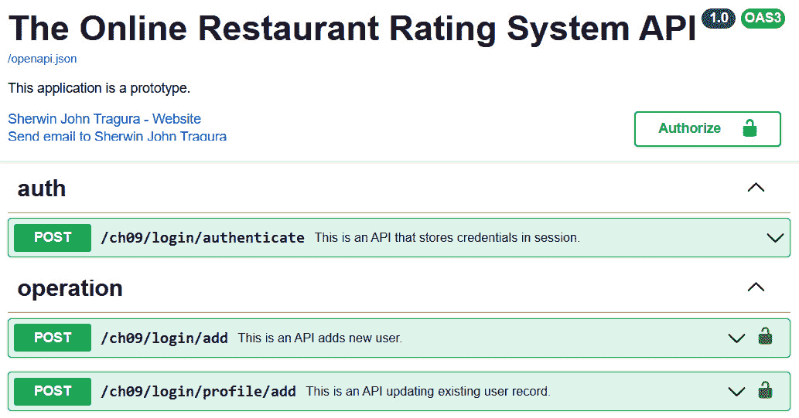
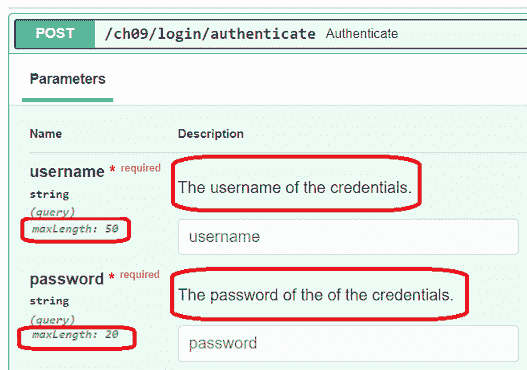
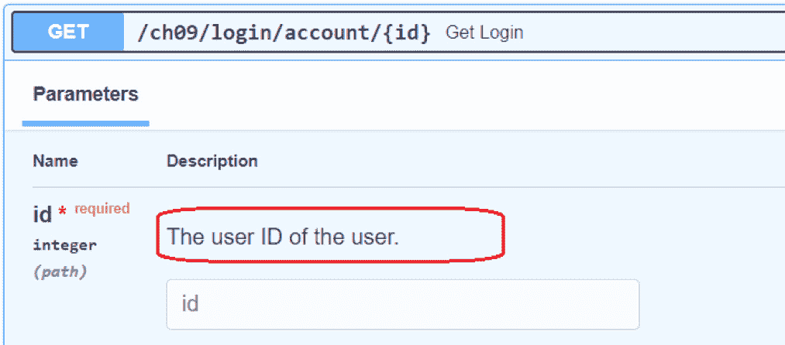
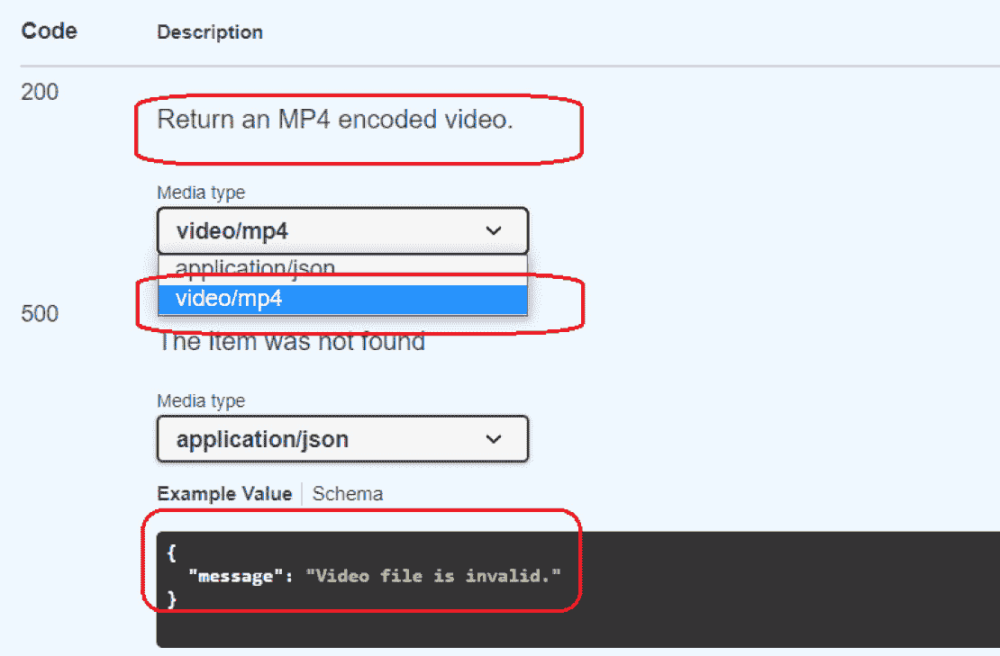

# 第九章：利用其他高级功能

前几章已经展示了 FastAPI 框架的一些基本核心功能。然而，有一些功能并非真正固有的框架功能，可以帮助我们微调性能和修补实现中的缺失环节。这些包括会话处理、管理 **跨源资源共享**（**CORS**）相关问题和为应用程序选择合适的渲染类型。

除了内置功能外，还有一些经过验证的解决方案可以在应用到应用程序时与 FastAPI 一起使用，例如其会话处理机制，它可以使用 `SessionMiddleware` 运行良好。关于中间件，本章还将探讨除了应用 `@app.middleware` 装饰器之外自定义请求和响应过滤器的方法。本章还将涵盖其他问题，例如使用自定义 `APIRoute` 和 `Request`，以指导我们管理传入的 *字节* *正文*、*表单* 或 *JSON* 数据。此外，本章将强调如何使用 `pytest` 框架和 `fastapi.testclient` 库测试 FastAPI 组件，以及如何使用 *OpenAPI 3.x* 规范来记录端点。

总体而言，本章的主要目标是提供其他解决方案，帮助我们完成我们的微服务应用程序。在本章中，包括以下主题：

+   应用会话管理

+   管理 CORS 机制

+   自定义 `APIRoute` 和 `Request`

+   选择合适的响应

+   应用 OpenAPI 3.x 规范

+   测试 API 端点

# 技术要求

虽然与数据分析无关，但本章的应用原型是 `ch09` 项目。

# 应用会话管理

会话管理是一种用于管理由用户访问应用程序创建的请求和响应的功能。它还涉及在用户会话中创建和共享数据。许多框架通常在它们的插件中包含会话处理功能，但 FastAPI 除外。在 FastAPI 中，创建用户会话和存储会话数据是两个独立的编程问题。我们使用 JWT 来建立用户会话，并使用 Starlette 的 `SessionMiddleware` 来创建和检索会话数据。在 FastAPI 中，创建用户会话和存储会话数据是两种完全不同的编程解决方案。我们使用 JWT 来建立用户会话，并使用 Starlette 的 `SessionMiddleware` 来创建和检索会话数据。

## 创建用户会话

我们已经证明了 JWT 在确保 FastAPI 微服务应用程序安全方面的重要性，见 *第七章**，* “保护 REST API”。然而，在这里，JWT 被应用于根据用户凭证创建会话。在 `api/login.py` 路由器中，实现了 `authenticate()` API 服务以创建认证用户的用户会话。FastAPI 生成用户会话利用浏览器 cookie 是固有的。以下代码片段显示了使用 cookie 值的认证过程：

```py
from util.auth_session import secret_key
from jose import jwt
@router.post("/login/authenticate")
async def authenticate(username:str, password: str, 
   response: Response, engine=Depends(create_db_engine)):
    repo:LoginRepository = LoginRepository(engine)
    login = await repo.get_login_username(username, 
                       password)
    if login == None:
            raise HTTPException(
                status_code=status.HTTP_403_FORBIDDEN, 
                detail="Invalid authentication"
            )
    token = jwt.encode({"sub": username}, secret_key)
    response.set_cookie("session", token)
    return {"username": username}
```

该服务将通过 `LoginRepository` 使用其 `username` 和 `password` 凭证验证用户是否是有效账户。如果用户是认证的，它将使用 JWT 创建一个基于以下命令生成的 `secret_key` 生成的令牌：

```py
openssl rand -hex 32
```

令牌密钥将作为基于 cookie 的会话的会话 ID。JWT 将以 `username` 凭证作为有效载荷存储为名为 `session` 的浏览器 cookie。 

为了确保会话已被应用，所有后续请求都必须通过 `APIKeyCookie` 类（`fastapi.security` 模块的基于 cookie 的认证 API 类）进行基于 cookie 的会话认证。`APIKeyCookie` 类在将其注入到用于 JWT 解码的可靠函数之前，会通过用于生成会话 ID 的 `secret_key` 值获取会话。`util/auth_session.py` 中的以下可靠函数将验证对应用程序每个端点的每次访问：

```py
from fastapi.security import APIKeyCookie
from jose import jwt
cookie_sec = APIKeyCookie(name="session")
secret_key = "pdCFmblRt4HWKNpWkl52Jnq3emH3zzg4b80f+4AFVC8="
async def get_current_user(session: str = 
   Depends(cookie_sec), engine=Depends(create_db_engine)):
    try:
        payload = jwt.decode(session, secret_key)
        repo:LoginRepository = LoginRepository(engine)
        login = await repo.validate_login(
                    payload["sub"])
        if login == None:
            raise HTTPException(
                status_code=status.HTTP_403_FORBIDDEN, 
                detail="Invalid authentication"
            )
        else:
            return login
    except Exception:
        raise HTTPException(
            status_code=status.HTTP_403_FORBIDDEN, 
            detail="Invalid authentication"
        )
```

上述函数被注入到每个 API 端点以强制进行用户会话验证。当请求端点时，此函数将解码令牌并提取 `username` 凭证以进行账户验证。然后，如果用户是未认证的或会话无效，它将发出 *状态码 403 (禁止)*。一个认证服务的示例可以在以下实现中找到：

```py
from util.auth_session import get_current_user
@router.post("/restaurant/add")
async def add_restaurant(req:RestaurantReq, 
         engine=Depends(create_db_engine), 
         user: str = Depends(get_current_user)):
    restaurant_dict = req.dict(exclude_unset=True) 
    restaurant_json = dumps(restaurant_dict, 
              default=json_datetime_serializer)
    repo:RestaurantRepository = 
             RestaurantRepository(engine)
    result = await repo.insert_restaurant(
               loads(restaurant_json))
    if result == True: 
        return req 
    else: 
        return JSONResponse(content={"message": 
         "insert login unsuccessful"}, status_code=500)
```

`add_restaurant()` 服务是一个端点，它将一个 `Document` 类型的餐厅添加到 MongoDB 集合中。但在事务进行之前，它首先通过注入的 `get_current_user()` 可靠函数检查是否存在基于 cookie 的会话。

## 管理会话数据

很遗憾，在基于 `APIKeyCookie` 的会话认证中，添加和检索会话数据并不是其功能的一部分。JWT 负载必须仅包含用户名，但不能包含所有凭证和数据主体。为了管理会话数据，我们需要使用 Starlette 的 `SessionMiddleware` 创建一个单独的会话。尽管 FastAPI 有其 `fastapi.middleware` 模块，但它仍然支持 Starlette 内置的中间件。

我们在*第二章**，*探索核心功能*中提到了中间件，并展示了使用`@app.middleware`装饰器来实现它的方法。我们已经证明它作为所有传入请求和传出响应到服务的过滤器。这次，我们不会自定义实现中间件，而是使用内置的中间件类。

中间件在`main.py`模块中实现、配置和激活，因为`APIRouter`无法添加中间件。我们启用`FastAPI`构造函数的`middleware`参数，并将内置的`SessionMiddleware`及其`secret_key`和新的会话名称作为构造参数添加到该 List-type 参数中，使用可注入的类`Middleware`。以下`main.py`的代码片段显示了如何配置它：

```py
from starlette.middleware.sessions import SessionMiddleware
app = FastAPI(middleware=[
        Middleware(SessionMiddleware, 
        secret_key=
            '7UzGQS7woBazLUtVQJG39ywOP7J7lkPkB0UmDhMgBR8=', 
        session_cookie="session_vars")])
```

添加中间件的另一种方式是利用`FastAPI`装饰器的`add_middleware()`函数。最初，添加`SessionMiddleware`将创建另一个基于 cookie 的会话，该会话将处理*会话范围内的数据*。这是唯一的方法，因为 FastAPI 没有直接支持会话处理机制，其中用户会话不仅用于安全，还用于处理会话对象。

要将会话数据添加到我们新创建的会话`session_vars`中，我们需要将`Request`注入到每个端点服务中，并利用其会话字典来存储会话范围内的对象。以下`list_restaurants()`服务从数据库中检索餐厅列表，提取所有餐厅名称，并通过`request.session[]`在会话中共享名称列表：

```py
@router.get("/restaurant/list/all")
async def list_restaurants(request: Request, 
       engine=Depends(create_db_engine), 
       user: str = Depends(get_current_user)):
    repo:RestaurantRepository = 
             RestaurantRepository(engine)
    result = await repo.get_all_restaurant()
    resto_names = [resto.name for resto in result]
    request.session['resto_names'] = resto_names
    return result
@router.get("/restaurant/list/names")
async def list_restaurant_names(request: Request, 
           user: str = Depends(get_current_user)):
    resto_names = request.session['resto_names']
    return resto_names
```

另一方面，`list_restaurant_names()`服务通过`request.session[]`检索`resto_names`会话数据，并将其作为其响应返回。顺便说一句，正是由于`SessionMiddleware`的存在，`session[]`才存在。否则，使用此字典将引发异常。

## 移除会话

完成事务后，始终必须从应用程序中注销以移除所有创建的会话。由于创建会话最简单和最直接的方式是通过浏览器 cookie，移除所有会话可以保护应用程序免受任何妥协。以下`/ch09/logout`端点移除了我们的会话，`session`和`session_vars`，这在技术上意味着用户从应用程序中注销：

```py
@router.get("/logout")
async def logout(response: Response, 
            user: str = Depends(get_current_user)):
    response.delete_cookie("session")
    response.delete_cookie("session_vars")
    return {"ok": True}
```

`Response`类的`delete_cookie()`方法移除了应用程序使用的任何现有浏览器会话。

## 自定义 BaseHTTPMiddleware

管理 FastAPI 会话的默认方法是通过 cookie，并且它不提供其他选项，如数据库支持、缓存和基于文件的会话。实现基于非 cookie 策略来管理用户会话和会话数据的最佳方法是自定义`BaseHTTPMiddleware`。以下自定义中间件是一个原型，为认证用户创建会话：

```py
from repository.login import LoginRepository
from repository.session import DbSessionRepository
from starlette.middleware.base import BaseHTTPMiddleware
from datetime import date, datetime
import re
from odmantic import AIOEngine
from motor.motor_asyncio import AsyncIOMotorClient
class SessionDbMiddleware(BaseHTTPMiddleware):
    def __init__(self, app, sess_key: str, 
                    sess_name:str, expiry:str):
        super().__init__(app)
        self.sess_key = sess_key
        self.sess_name = sess_name 
        self.expiry = expiry
        self.client_od = 
         AsyncIOMotorClient(f"mongodb://localhost:27017/")
        self.engine = 
         AIOEngine(motor_client=self.client_od, 
            database="orrs")

    async def dispatch(self, request: Request, call_next):
        try:
            if re.search(r'\bauthenticate\b', 
                    request.url.path):
                credentials = request.query_params
                username = credentials['username']
                password = credentials['password']
                repo_login:LoginRepository = 
                      LoginRepository(self.engine)
                repo_session:DbSessionRepository = 
                      DbSessionRepository(self.engine)

                login = await repo_login.
                  get_login_credentials(username, password)

                if login == None:
                    self.client_od.close()
                    return JSONResponse(status_code=403) 
                else:
                    token = jwt.encode({"sub": username}, 
                        self.sess_key)
                    sess_record = dict()
                    sess_record['session_key'] = 
                        self.sess_key
                    sess_record['session_name'] = 
                        self.sess_name
                    sess_record['token'] = token
                    sess_record['expiry_date'] = 
                       datetime.strptime(self.expiry, 
                            '%Y-%m-%d')
                    await repo_session.
                        insert_session(sess_record)
                    self.client_od.close()
                    response = await call_next(request)
                    return response
            else:
                response = await call_next(request)
                return response
        except Exception as e :
            return JSONResponse(status_code=403)
```

如在第 *第二章** *探索核心功能* 中所述，`SessionDbMiddleware` 将过滤我们的 `/ch09/login/authenticate` 端点上的 `username` 和 `password` 查询参数，检查用户是否是已注册用户，并从 JWT 生成数据库支持的会话。之后，端点可以验证存储在数据库中的会话的所有请求。`/ch09/logout` 端点将不会包括使用其仓库事务从数据库中删除会话，如下面的代码所示：

```py
@router.get("/logout")
async def logout(response: Response, 
       engine=Depends(create_db_engine), 
       user: str = Depends(get_current_user)):
    repo_session:DbSessionRepository = 
             DbSessionRepository(engine)
    await repo_session.delete_session("session_db")
    return {"ok": True}
```

注意，`DbSessionRepository` 是我们原型的一个自定义仓库实现，它有一个 `delete_session()` 方法，可以通过其名称从我们的 MongoDB 数据库的 `db_session` 集合中删除会话。

另一种可以帮助 FastAPI 应用程序解决与 CORS 浏览器机制相关问题的中间件是 `CORSMiddleware`。

# 管理 CORS 机制

当将 API 端点与各种前端框架集成时，我们经常遇到浏览器返回的 "*没有‘access-control-allow-origin’头存在*" 错误。如今，这已成为任何浏览器的基于 HTTP 头的机制，它要求后端服务器向浏览器提供服务器端应用程序的 "origin" 细节，包括服务器域名、方案和端口。这种机制称为 CORS，当前端应用程序及其网络资源属于与后端应用程序不同的域区域时发生。如今，出于安全原因，浏览器禁止服务器端和前端应用程序之间的跨域请求。

为了解决这个问题，我们需要在 `main.py` 模块中将我们应用程序的所有来源以及原型使用的其他集成资源放在一个 `List` 中。然后，我们从 `fastapi.middleware.cors` 模块导入内置的 `CORSMiddleware`，并将其添加到 `FastAPI` 构造函数中，与来源列表一起，这个列表不应太长，以避免验证每个 URL 时的开销。以下代码片段显示了将 `CORSMiddleware` 注入到 `FastAPI` 构造函数中：

```py
origins = [
    "https://192.168.10.2",
    "http://192.168.10.2",
    "https://localhost:8080",
    "http://localhost:8080"
]
app = FastAPI(middleware=[
           Middleware(SessionMiddleware, secret_key=
            '7UzGQS7woBazLUtVQJG39ywOP7J7lkPkB0UmDhMgBR8=', 
               session_cookie="session_vars"),
           Middleware(SessionDbMiddleware, sess_key=
            '7UzGQS7woBazLUtVQJG39ywOP7J7lkPkB0UmDhMgBR8=',
              sess_name='session_db', expiry='2020-10-10')
            ])
app.add_middleware(CORSMiddleware, max_age=3600,
     allow_origins=origins, allow_credentials=True,
     allow_methods= ["POST", "GET", "DELETE", 
       "PATCH", "PUT"], allow_headers=[
            "Access-Control-Allow-Origin", 
            "Access-Control-Allow-Credentials", 
            "Access-Control-Allow-Headers",
            "Access-Control-Max-Age"])
```

这次，我们使用了 FastAPI 的`add_middleware()`函数来为我们的应用程序添加 CORS 支持。除了`allow_origins`之外，我们还需要将`allow_credentials`参数添加到`CORSMiddleware`中，该参数将`Access-Control-Allow-Credentials: true`添加到响应头，以便浏览器识别域名来源匹配并发送一个`Authorization` cookie 以允许请求。此外，我们还必须包括`allow_headers`参数，该参数在浏览器交互期间注册一组可接受的头键。除了默认包含的`Accept`、`Accept-Language`、`Content-Language`和`Content-Type`之外，我们还需要显式注册`Access-Control-Allow-Origin`、`Access-Control-Allow-Credentials`、`Access-Control-Allow-Headers`和`Access-Control-Max-Age`而不是使用通配符（`*`）。`allow_headers`参数还必须是中间件的一部分，以指定浏览器需要支持的其他 HTTP 方法。最后，`max_age`参数也必须在配置中，因为我们需要告诉浏览器它将缓存加载到浏览器中的所有资源的时间。

如果应用程序需要额外的 CORS 支持功能，自定义`CORSMiddleware`以扩展一些内置实用程序和功能来管理 CORS 是一个更好的解决方案。

顺便说一句，我们不仅可以对中间件进行子类化并用于创建自定义实现，还可以对`Request`数据和 API 路由进行自定义。

# 自定义 APIRoute 和 Request

中间件可以处理 FastAPI 应用程序中所有 API 方法的传入`Request`数据和传出`Response`对象，但无法操作消息正文，从`Request`数据中附加状态对象，或修改客户端消费之前的响应对象。只有`APIRoute`和`Request`的自定义才能让我们全面掌握如何控制请求和响应事务。控制可能包括确定传入数据是字节正文、表单还是 JSON，并提供有效的日志记录机制、异常处理、内容转换和提取。

## 管理正文、表单或 JSON 数据

与中间件不同，自定义`APIRoute`不适用于所有 API 端点。为某些`APIRouter`实现`APIRoute`只会为受影响的端点施加新的路由规则，而其他服务可以继续使用默认的请求和响应过程。例如，以下自定义仅适用于`api.route_extract.router`端点的数据提取：

```py
from fastapi.routing import APIRoute
from typing import Callable
from fastapi import Request, Response
class ExtractContentRoute(APIRoute):
    def get_route_handler(self) -> Callable:
        original_route_handler = 
                super().get_route_handler()

        async def custom_route_handler(request: Request) 
                    -> Response:
            request = ExtractionRequest(request.scope, 
                        request.receive)
            response: Response = await 
                    original_route_handler(request)
            return response
        return custom_route_handler
```

自定义`APIRoute`需要从`APIRoute`的`original_route_handler`创建一个 Python `Request`和`Response`流程。另一方面，我们的`ExtractContentRoute`过滤器使用一个自定义的`ExtractionRequest`，该请求识别并分别处理每种传入请求数据。以下是将替换默认`Request`对象的`ExtractionRequest`的实现：

```py
class ExtractionRequest(Request):
    async def body(self):
        body = await super().body()
        data = ast.literal_eval(body.decode('utf-8'))
        if isinstance(data, list):
            sum = 0
            for rate in data:
                sum += rate 
            average = sum / len(data)
            self.state.sum = sum 
            self.state.avg = average
        return body 

    async def form(self):
        body = await super().form()
        user_details = dict()
        user_details['fname'] = body['firstname']
        user_details['lname'] = body['lastname']
        user_details['age'] = body['age']
        user_details['bday'] = body['birthday']
        self.session["user_details"] = user_details
        return body

    async def json(self):
        body = await super().json()
        if isinstance(body, dict):

            sum = 0
            for rate in body.values():
                sum += rate  

            average = sum / len(body.values())
            self.state.sum = sum 
            self.state.avg = average
        return body
```

要激活此`ExtractionRequest`，我们需要将端点的`APIRouter`的`route_class`设置为`ExtractContentRoute`，如下面的代码片段所示：

```py
router = APIRouter()
router.route_class = ExtractContentRoute
```

在管理各种请求体时，有三个方法可以选择覆盖：

+   `body()`: 这管理传入的字节数据请求

+   `form()`: 这处理传入的表单数据

+   `json()`: 这管理传入的解析 JSON 数据

+   `stream()`: 这通过使用`async for`构造访问字节块中的消息体

所有这些方法都将原始请求数据以字节形式返回给服务。

在`ExtractionRequest`中，我们从给定的选项中实现了三个接口方法来过滤和处理所有来自`/api/route_extract.py`模块中定义的 API 端点的传入请求。

以下`create_profile()`服务从客户端接收配置文件数据并实现`ExtractContentRoute`过滤器，该过滤器将使用会话处理将所有这些配置文件数据存储在字典中：

```py
@router.post("/user/profile")
async def create_profile(req: Request, 
        firstname: str = Form(...), 
        lastname: str = Form(...), age: int = Form(...), 
        birthday: date = Form(...), 
        user: str = Depends(get_current_user)):
    user_details = req.session["user_details"]
    return {'profile' : user_details} 
```

被覆盖的`form()`方法`ExtractionRequest`负责包含所有用户详情的`user_details`属性。

另一方面，给定的`set_ratings()`方法有一个包含各种评分的传入字典，其中`json()`覆盖将推导出一些基本统计信息。所有结果都将作为`Request`的状态对象或请求属性返回：

```py
@router.post("/rating/top/three")
async def set_ratings(req: Request, data : 
 Dict[str, float], user: str = Depends(get_current_user)):
    stats = dict()
    stats['sum'] = req.state.sum
    stats['average'] = req.state.avg
    return {'stats' : stats } 
```

最后，前面的`compute_data()`服务将有一个包含评分的传入列表作为一些基本统计信息（如前一个服务中所示）的来源。`ExtractionRequest`的`body()`方法覆盖将处理计算：

```py
@router.post("/rating/data/list")
async def compute_data(req: Request, data: List[float], 
  user: str = Depends(get_current_user)):
    stats = dict()
    stats['sum'] = req.state.sum
    stats['average'] = req.state.avg
    return {'stats' : stats }
```

## 加密和解密消息体

另一个需要自定义端点路由的场景是我们必须通过加密来保护消息体。以下自定义请求使用 Python 的`cryptography`模块和加密消息体的密钥解密加密的消息体：

```py
from cryptography.fernet import Fernet
class DecryptRequest(Request):
    async def body(self):
        body = await super().body()
        login_dict = ast.literal_eval(body.decode('utf-8'))
        fernet = Fernet(bytes(login_dict['key'], 
             encoding='utf-8'))
        data = fernet.decrypt(
          bytes(login_dict['enc_login'], encoding='utf-8'))
        self.state.dec_data = json.loads(
             data.decode('utf-8'))
        return body
```

重要提示

`cryptography`模块需要安装`itsdangerous`扩展来执行本项目中的加密/解密过程。

`DecryptRequest`将解密消息并返回登录记录列表作为请求`state`对象。以下服务提供加密的消息体和密钥，并从`DecryptRequest`返回解密后的登录记录列表作为响应：

```py
@router.post("/login/decrypt/details")
async def send_decrypt_login(enc_data: EncLoginReq, 
   req:Request, user: str = Depends(get_current_user)):
    return {"data" : req.state.dec_data}
```

注意`send_decrypt_login()`有一个包含加密消息体和加密密钥的`EncLoginReq`请求模型。

自定义路由及其`Request`对象可以帮助优化和简化微服务事务，特别是那些需要大量负载在消息体转换、转换和计算上的 API 端点。

现在，我们的下一次讨论将集中在为 API 服务应用不同的`Response`类型。

# 选择合适的响应

FastAPI 框架除了最常见的 `JsonResponse` 选项外，还提供了其他用于渲染 API 端点响应的选项。以下是我们应用程序支持的响应类型列表及其示例：

+   如果 API 端点的响应仅基于文本，则可以利用 `PlainTextResponse` 类型。以下 `intro_list_restaurants()` 服务向客户端返回一个基于文本的消息：

    ```py
    @router.get("/restaurant/index")
    def intro_list_restaurants():
      return PlainTextResponse(content="The Restaurants")
    ```

+   如果服务需要导航到另一个完全不同的应用程序或同一应用程序的另一个端点，可以使用 `RedirectResponse`。以下端点跳转到一个关于一些知名米其林星级餐厅的超文本引用：

    ```py
    @router.get("/restaurant/michelin")
    def redirect_restaurants_rates():
      return RedirectResponse(
          url="https://guide.michelin.com/en/restaurants")
    ```

+   `FileResponse` 类型可以帮助服务渲染文件的一些内容，最好是文本文件。以下 `load_questions()` 服务显示了保存在应用程序 `/file` 文件夹中的 `questions.txt` 文件中的问题列表：

    ```py
    @router.get("/question/load/questions")
    async def load_questions(user: str = 
                        Depends(get_current_user)):
        file_path = os.getcwd() + 
          '\\files\\questions.txt';
        return FileResponse(path=file_path, 
                     media_type="text/plain")
    ```

+   `StreamingResponse` 是另一种响应类型，它为我们提供了对 `EventSourceResponse` 类型的另一种方法：

    ```py
    @router.get("/question/sse/list")    
    async def list_questions(req:Request, 
             engine=Depends(create_db_engine), 
                user: str = Depends(get_current_user)):
        async def print_questions():
            repo:QuestionRepository = 
                    QuestionRepository(engine)
            result = await repo.get_all_question()
            for q in result:
                disconnected = await req.is_disconnected()
                if disconnected:
                    break
                yield 'data: {}\n\n.format(
                   json.dumps(jsonable_encoder(q), 
                          cls=MyJSONEncoder))
                await asyncio.sleep(1)
        return StreamingResponse(print_questions(), 
                    media_type="text/event-stream")
    ```

+   可以渲染图像的服务也可以使用 `StreamingResponse` 类型。以下 `logo_upload_png()` 服务上传任何 **JPEG** 或 **PNG** 文件并在浏览器中渲染：

    ```py
    @router.post("/restaurant/upload/logo")
    async def logo_upload_png(logo: UploadFile = File(...)):
        original_image = Image.open(logo.file)
        original_image = 
             original_image.filter(ImageFilter.SHARPEN)
        filtered_image = BytesIO()
        if logo.content_type == "image/png":
            original_image.save(filtered_image, "PNG")
            filtered_image.seek(0)
            return StreamingResponse(filtered_image, 
                     media_type="image/png")
        elif logo.content_type == "image/jpeg":
            original_image.save(filtered_image, "JPEG")
            filtered_image.seek(0)
            return StreamingResponse(filtered_image, 
                   media_type="image/jpeg") 
    ```

+   `StreamingResponse` 类型在渲染各种格式的视频（如 `sample.mp4`）并将其发布到浏览器方面也非常有效：

    ```py
    @router.get("/restaurant/upload/video")
    def video_presentation():
        file_path = os.getcwd() + '\\files\\sample.mp4'
        def load_file():  
            with open(file_path, mode="rb") as video_file:  
                yield from video_file  
        return StreamingResponse(load_file(), 
                  media_type="video/mp4")
    ```

+   如果服务想要发布一个简单的 HTML 标记页面，而不引用静态 CSS 或 JavaScript 文件，那么 `HTMLResponse` 就是正确的选择。以下服务渲染了一个由某些 CDN 库提供的 Bootstrap 框架的 HTML 页面：

    ```py
    @router.get("/signup")
    async def signup(engine=Depends(create_db_engine), 
           user: str = Depends(get_current_user) ):
       signup_content = """
        <html lang='en'>
            <head>
              <meta charset="UTF-8">
              <script src="https://code.jquery.com/jquery-
                        3.4.1.min.js"></script>
              <link rel="stylesheet" 
                href="https://stackpath.bootstrapcdn.com/
                  bootstrap/4.4.1/css/bootstrap.min.css">
              <script src="https://cdn.jsdelivr.net/npm/
                popper.js@1.16.0/dist/umd/popper.min.js">
              </script>
              <script   
               src="https://stackpath.bootstrapcdn.com/
           bootstrap/4.4.1/js/bootstrap.min.js"></script>

            </head>
            <body>
              <div class="container">
                <h2>Sign Up Form</h2>
                <form>
                    <div class="form-group">
                       <label for="firstname">
                              Firstname:</label>
                       <input type='text' 
                           class="form-control" 
                           name='firstname' 
                           id='firstname'/><br/>
                    </div>
                    … … … … … … … …
                    <div class="form-group">
                       <label for="role">Role:</label>
                       <input type='text' 
                         class="form-control" 
                         name='role' id='role'/><br/>
                    </div>
                    <button type="submit" class="btn 
                        btn-primary">Sign Up</button>
                </form>
               </div>
            </body>
        </html>
        """
        return HTMLResponse(content=signup_content, 
                   status_code=200)
    ```

+   如果 API 端点需要发布其他渲染类型，可以通过 `Response` 类的 `media_type` 属性进行自定义。以下是一个将 JSON 数据转换为 XML 内容的服务，通过将 `Response` 的 `media_type` 属性设置为 `application/xml` MIME 类型：

    ```py
    @router.get("/keyword/list/all/xml")
    async def 
       convert_to_xml(engine=Depends(create_db_engine), 
            user: str = Depends(get_current_user)): 
        repo:KeyRepository = KeyRepository(engine)
        list_of_keywords = await repo.get_all_keyword()
        root = minidom.Document() 
        xml = root.createElement('keywords') 
        root.appendChild(xml) 

        for keyword in list_of_keywords:
            key = root.createElement('keyword')
            word = root.createElement('word')
            key_text = root.createTextNode(keyword.word)
            weight= root.createElement('weight')
            weight_text = 
                 root.createTextNode(str(keyword.weight))
            word.appendChild(key_text)
            weight.appendChild(weight_text)
            key.appendChild(word)
            key.appendChild(weight)
            xml.appendChild(key)
        xml_str = root.toprettyxml(indent ="\t") 
        return Response(content=xml_str, 
                media_type="application/xml")
    ```

虽然 FastAPI 不是一个 Web 框架，但它可以支持 Jinja2 模板，在 API 服务需要将响应渲染为 HTML 页面的罕见情况下。让我们突出 API 服务如何将 Jinja2 模板作为响应的一部分来使用。

## 设置 Jinja2 模板引擎

首先，我们需要使用 `pip` 安装 `jinja2` 模块：

```py
pip install jinja2
```

然后，我们需要创建一个文件夹来存放所有的 Jinja2 模板。Jinja2 必须通过在 `FastAPI` 或任何 `APIRouter` 中创建 `Jinja2Templates` 实例来定义这个文件夹，通常命名为 `templates`。以下代码片段是 `/api/login.py` 路由的一部分，展示了 Jinja2 模板引擎的设置和配置：

```py
from fastapi.templating import Jinja2Templates
router = APIRouter()
templates = Jinja2Templates(directory="templates")
```

## 设置静态资源

在 `templates` 文件夹之后，Jinja2 引擎要求应用程序在项目目录中有一个名为 `static` 的文件夹来存放 Jinja2 模板的 CSS、JavaScript、图像和其他静态文件。然后，我们需要实例化 `StaticFiles` 实例来定义 `static` 文件夹并将其映射到一个虚拟名称。此外，必须通过 `FastAPI` 的 `mount()` 方法将 `StaticFiles` 实例挂载到特定的路径。我们还需要将 `StaticFiles` 实例的 `html` 属性设置为 `True` 以将文件夹设置为 HTML 模式。以下配置展示了如何在 `main.py` 模块中设置静态资源文件夹：

```py
from fastapi.staticfiles import StaticFiles
app.mount("/static", StaticFiles(directory="static", 
          html=True), name="static")
```

为了让 FastAPI 组件访问这些静态文件，引擎需要安装 `aiofiles` 扩展：

```py
pip install aiofiles
```

## 创建模板布局

以下模板是 `static` 文件夹，由于模板引擎和 `aiofiles` 模块：

```py
<!DOCTYPE html>
<html lang="en">
    <head>
        <meta charset="UTF-8">
        <meta http-equiv="X-UA-Compatible" 
              content="IE=edge">
        <meta name="viewport" content="width=device-width, 
             initial-scale=1.0, shrink-to-fit=no">
        <meta name="apple-mobile-web-app-capable" 
             content="yes">

        <link rel="stylesheet" type="text/css" 
            href="{{url_for('static', 
               path='/css/bootstrap.min.css')}}">
        <script src="{{url_for('static', path='/js/
               jquery-3.6.0.js')}}"></script>
        <script src="{{url_for('static', 
              path='/js/bootstrap.min.js')}}"></script>
    </head>
    <body>
        
        
    </body>
</html>
```

其他模板可以使用 `` 标签继承此 `layout.html` 的结构和设计。与我们的 `layout.html` 一样，Jinja2 基础模板具有这些 Jinja2 标签，即 `` 和 `` 标签，它们指示子模板在翻译阶段可以插入其内容。但是，为了使所有这些模板都能正常工作，它们必须保存在 `/templates` 目录中。以下是一个名为 `users.html` 的示例子模板，它从上下文数据生成一个配置文件表：

```py


<div class="container">
<h2>List of users </h2>
<p>This is a Boostrap 4 table applied to JinjaTemplate.</p>
<table class="table">
    <thead>
        <tr>
          <th>Login ID</th>
          <th>Username</th>
          <th>Password</th>
          <th>Passphrase</th>
        </tr>
      </thead>
      <tbody>
     
    <tr>
        <td>{{ login.login_id}}</td>
        <td>{{ login.username}}</td>
        <td>{{ login.password}}</td>
        <td>{{ login.passphrase}}</td>
    </tr>
    
</tbody>
</table>
</div>

```

注意，子 Jinja2 模板也有 "block" 标签来标记要合并到父模板中的内容。

为了让 API 渲染模板，服务必须使用 Jinja2 引擎的 `TemplateResponse` 类型作为响应类型。`TemplateResponse` 需要模板的文件名、`Request` 对象以及如果有任何上下文数据，还需要上下文数据。以下是一个渲染之前 `users.html` 模板的 API 服务：

```py
@router.get("/login/html/list")
async def list_login_html(req: Request,
       engine=Depends(create_db_engine), 
       user: str = Depends(get_current_user)):
    repo:LoginRepository = LoginRepository(engine)
    result = await repo.get_all_login()
    return templates.TemplateResponse("users.html", 
           {"request": req, "data": result})
```

## 使用 ORJSONResponse 和 UJSONResponse

当需要返回大量字典或可 JSON 化的组件时，使用 `ORJSONResponse` 或 `UJSONResponse` 都很合适。`ORJSONResponse` 使用 `orjson` 将大量的字典对象序列化为 JSON 字符串作为响应。因此，在使用 `ORJSONResponse` 之前，我们需要使用 `pip` 命令安装 `orjson`。`ORJSONResponse` 比常见的 `JSONResponse` 更快地序列化 UUID、`numpy`、数据类和 datetime 对象。

然而，`UJSONResponse` 相比于 `ORJSONResponse` 要快一些，因为它使用了 `ujson` 序列化器。在使用 `UJSONResponse` 之前，必须首先安装 `ujson` 序列化器。

以下两个 API 服务使用了这两个快速的 JSON 序列化器替代方案：

```py
@router.get("/login/list/all")
async def list_all_login(engine=Depends(create_db_engine), 
         user: str = Depends(get_current_user)): 
    repo:LoginRepository = LoginRepository(engine)
    result = await repo.get_all_login()
    return ORJSONResponse(content=jsonable_encoder(result),
             status_code=201)
@router.get("/login/account")
async def get_login(id:int, 
       engine=Depends(create_db_engine), 
       user: str = Depends(get_current_user) ):
    repo:LoginRepository = LoginRepository(engine)
    result = await repo.get_login_id(id)
    return UJSONResponse(content=jsonable_encoder(result), 
             status_code=201)
```

我们仍然需要在两个响应继续其序列化过程之前，将结果的 `BSON` 的 `ObjectId` 转换为 `str`，应用 `jsonable_encoder()` 组件。现在，让我们关注我们如何使用 OpenAPI 3.0 规范提供内部 API 文档。

# 应用 OpenAPI 3.x 规范

OpenAPI 3.0 规范是一种标准的 API 文档和语言无关的规范，可以描述 API 服务，而无需了解其来源、阅读其文档或理解其业务逻辑。此外，FastAPI 支持 OpenAPI，甚至可以根据 OpenAPI 标准自动生成 API 的默认内部文档。

使用规范文档我们的 API 服务有三种方式：

+   通过扩展 OpenAPI 架构定义

+   通过使用内部代码库属性

+   通过使用 `Query`、`Body`、`Form` 和 `Path` 函数

## 扩展 OpenAPI 架构定义

FastAPI 从其 `fastapi.openapi.utils` 扩展中有一个 `get_openapi()` 方法，可以覆盖一些架构描述。我们可以通过 `get_openapi()` 函数修改架构定义的 `info`、`servers` 和 `paths` 细节。该函数返回一个包含应用程序 OpenAPI 架构定义所有详细信息的 `dict`。

默认的 OpenAPI 架构文档始终设置在 `main.py` 模块中，因为它始终与 FastAPI 实例相关联。为了生成包含架构详细信息的 `dict` 函数，它必须接受至少 `title`、`version` 和 `routes` 参数值。以下自定义函数提取默认的 *OpenAPI* 架构以进行更新：

```py
def update_api_schema():
   DOC_TITLE = "The Online Restaurant Rating System API"
   DOC_VERSION = "1.0"
   openapi_schema = get_openapi(
       title=DOC_TITLE,
       version=DOC_VERSION,
       routes=app.routes,
   )
app.openapi_schema = openapi_schema
return openapi_schema
```

`title` 参数值是文档标题，`version` 参数值是 API 实现的版本，`routes` 包含注册的 API 服务列表。注意，在 `return` 语句之前的最后一行更新了 FastAPI 内置的 `openapi_schema` 默认值。现在，为了更新一般信息细节，我们使用架构定义的 `info` 键来更改一些值，如下面的示例所示：

```py
openapi_schema["info"] = {
       "title": DOC_TITLE,
       "version": DOC_VERSION,
       "description": "This application is a prototype.",
       "contact": {
           "name": "Sherwin John Tragura",
           "url": "https://ph.linkedin.com/in/sjct",
           "email": "cowsky@aol.com"
       },
       "license": {
           "name": "Apache 2.0",
           "url": "https://www.apache.org/
                  licenses/LICENSE-2.0.html"
       },
   }
```

前面的信息架构更新也必须是 `update_api_schema()` 函数的一部分，包括对每个注册的 API 服务文档的更新。这些细节可以包括 API 服务的描述和摘要、POST 端点的 `requestBody` 描述和 GET 端点的参数细节，以及 API 标签。添加以下 `paths` 更新：

```py
openapi_schema["paths"]["/ch09/login/authenticate"]["post"]["description"] = "User Authentication Session"
openapi_schema["paths"]["/ch09/login/authenticate"]["post"]["summary"] = "This is an API that stores credentials in session."
openapi_schema["paths"]["/ch09/login/authenticate"]["post"]["tags"] = ["auth"]

openapi_schema["paths"]["/ch09/login/add"]["post"]
["description"] = "Adding Login User"
openapi_schema["paths"]["/ch09/login/add"]["post"]
["summary"] = "This is an API adds new user."
openapi_schema["paths"]["/ch09/login/add"]["post"]
["tags"] = ["operation"]
openapi_schema["paths"]["/ch09/login/add"]["post"]
["requestBody"]["description"]="Data for LoginReq"

openapi_schema["paths"]["/ch09/login/profile/add"]
["description"] = "Updating Login User"
openapi_schema["paths"]["/ch09/login/profile/add"]
["post"]["summary"] = "This is an API updating existing user record."
openapi_schema["paths"]["/ch09/login/profile/add"]
["post"]["tags"] = ["operation"]
openapi_schema["paths"]["/ch09/login/profile/add"]
["post"]["requestBody"]["description"]="Data for LoginReq"

openapi_schema["paths"]["/ch09/login/html/list"]["get"]["description"] = "Renders Jinja2Template with context data."
openapi_schema["paths"]["/ch09/login/html/list"]["get"]["summary"] = "Uses Jinja2 template engine for rendition."
openapi_schema["paths"]["/ch09/login/html/list"]["get"]["tags"] = ["rendition"]
openapi_schema["paths"]["/ch09/login/list/all"]["get"]["description"] = "List all the login records."
openapi_schema["paths"]["/ch09/login/list/all"]["get"]["summary"] = "Uses JsonResponse for rendition."
openapi_schema["paths"]["/ch09/login/list/all"]["get"]["tags"] = ["rendition"]
```

前面的操作将为我们提供一个新的 OpenAPI 文档仪表板，如图 *9.1* 所示：



图 9.1 – 定制的 OpenAPI 仪表板

标签是 OpenAPI 文档的关键变量，因为它们根据路由器、业务流程、需求和模块组织 API 端点。使用标签是一种最佳实践。

一旦所有更新都设置完毕，将 FastAPI 的 `openapi()` 函数替换为新的 `update_api_schema()` 函数。

## 使用内部代码库属性

FastAPI 的构造函数有参数可以替换默认的 info 文档细节，而不使用 `get_openapi()` 函数。以下代码片段展示了 OpenAPI 文档的 `title`、`description`、`version` 和 `servers` 细节的示例文档更新：

```py
app = FastAPI(… … … …, 
            title="The Online Restaurant Rating 
                       System API",
            description="This a software prototype.",
            version="1.0.0",
            servers= [
                {
                    "url": "http://localhost:8000",
                    "description": "Development Server"
                },
                {
                    "url": "https://localhost:8002",
                    "description": "Testing Server",
                }
            ])
```

在向 API 端点添加文档时，`FastAPI` 和 `APIRouter` 的路径操作符也有参数允许更改分配给每个端点的默认 OpenAPI 变量。以下是一个示例服务，它通过 `post()` 路径操作符更新其 `summary`、`description`、`response_description` 和其他响应细节：

```py
@router.post("/restaurant/add",
     summary="This API adds new restaurant details.",
     description="This operation adds new record to the 
          database. ",
     response_description="The message body.",
     responses={
        200: {
            "content": {
                "application/json": {
                    "example": {
                        "restaurant_id": 100,
                        "name": "La Playa",
                        "branch": "Manila",
                        "address": "Orosa St.",
                        "province": "NCR",
                        "date_signed": "2022-05-23",
                        "city": "Manila",
                        "country": "Philippines",
                        "zipcode": 1603
                    }
                }
            },
        },
        404: {
            "description": "An error was encountered during 
                     saving.",
            "content": {
                "application/json": {
                    "example": {"message": "insert login 
                       unsuccessful"}
                }
            },
        },
    },
    tags=["operation"])
async def add_restaurant(req:RestaurantReq, 
        engine=Depends(create_db_engine), 
          user: str = Depends(get_current_user)):
    restaurant_dict = req.dict(exclude_unset=True) 
    restaurant_json = dumps(restaurant_dict, 
           default=json_datetime_serializer)
    repo:RestaurantRepository = 
            RestaurantRepository(engine)
    result = await repo.insert_restaurant(
              loads(restaurant_json))
    if result == True: 
        return req 
    else: 
        return JSONResponse(content={"message": 
           "insert login unsuccessful"}, status_code=500)
```

## 使用 Query、Form、Body 和 Path 函数

除了声明和额外的验证之外，`Query`、`Path`、`Form` 和 `Body` 参数函数也可以用来向 API 端点添加一些元数据。以下 `authenticate()` 端点通过 `Query()` 函数添加了描述和验证：

```py
@router.post("/login/authenticate")
async def authenticate(response: Response, 
    username:str = Query(..., 
       description='The username of the credentials.', 
       max_length=50), 
    password: str = Query(..., 
     description='The password of the of the credentials.', 
     max_length=20), 
    engine=Depends(create_db_engine)):
    repo:LoginRepository = LoginRepository(engine)
    … … … … … …
    response.set_cookie("session", token)
    return {"username": username}
```

以下 `get_login()` 使用 `Path()` 指令插入 `id` 参数的描述：

```py
@router.get("/login/account/{id}")
async def get_login(id:int = Path(..., 
description="The user ID of the user."), 
   engine=Depends(create_db_engine), 
   user: str = Depends(get_current_user) ):
    … … … … … …
    return UJSONResponse(content=jsonable_encoder(result),
         status_code=201)
```

`Query()` 函数的 `description` 和 `max_length` 元数据将成为 `authenticate()` 的 OpenAPI 文档的一部分，如图 *9.2* 所示：



图 *9.2* – 查询元数据

此外，`Path()` 指令的 `description` 元数据也将出现在 `get_login()` 文档中，如图 *9.3* 所示：



图 *9.3* – 路径元数据

同样，我们可以使用 `Form` 指令为表单参数添加描述。以下服务展示了如何通过 `Form` 指令插入文档：

```py
@router.post("/user/profile")
async def create_profile(req: Request, 
firstname: str = Form(..., 
description='The first name of the user.'), 
lastname: str = Form(..., 
description='The last name of the user.'), 
age: int = Form(..., 
description='The age of the user.'), 
birthday: date = Form(..., 
description='The birthday of the user.'), 
        user: str = Depends(get_current_user)):
    user_details = req.session["user_details"]
    return {'profile' : user_details}

```

此外，还可以通过路径操作符的 `responses` 参数记录 API 服务可能抛出的所有类型的 HTTP 响应或状态码。以下 `video_presentation()` 服务提供了在遇到无错误（*HTTP 状态码 200*）和运行时错误（*HTTP 状态码 500*）时其响应性质的元数据：

```py
from models.documentation.response import Error500Model
… … … … …
@router.get("/restaurant/upload/video",responses={
        200: {
            "content": {"video/mp4": {}},
            "description": "Return an MP4 encoded video.",
        },
        500:{
"model": Error500Model, 
            "description": "The item was not found"
        }
    },)
def video_presentation():
    file_path = os.getcwd() + '\\files\\sample.mp4'
    def load_file():  
        with open(file_path, mode="rb") as video_file:  
            yield from video_file  
    return StreamingResponse(load_file(), 
              media_type="video/mp4")
```

`Error500Model` 是一个 `BaseModel` 类，当应用程序遇到 *HTTP 状态码 500* 错误时，它将给出清晰的响应图景，并且只会在 OpenAPI 文档中使用。它包含诸如包含硬编码错误消息的消息等元数据。*图 *9.4* 显示了在为 `video_presentation()` 的响应添加元数据后，其 OpenAPI 文档的结果：



图 *9.4* – API 响应的文档

现在，对于我们的最后一次讨论，让我们探讨如何在 FastAPI 中执行单元测试，这可能导致测试驱动开发环境。

# 测试 API 端点

FastAPI 使用 `pytest` 框架来运行其测试类。因此，在我们创建测试类之前，首先需要使用 `pip` 命令安装 `pytest` 框架：

```py
pip install pytest
```

FastAPI 有一个名为 `fastapi.testclient` 的模块，其中所有组件都是基于 `Request` 的，包括 `TestClient` 类。为了访问所有 API 端点，我们需要 `TestClient` 对象。但是，首先我们需要创建一个如 `test` 的文件夹，它将包含实现我们的测试方法的测试模块。我们将测试方法放在 `main.py` 或路由器模块之外，以保持代码的整洁和组织。

## 编写单元测试用例

最好的做法是每个路由器组件写一个测试模块，除非这些路由器之间存在紧密的联系。我们将这些测试模块放在 `test` 目录中。为了追求自动化测试，我们需要将 `APIRouter` 实例或 `FastAPI` 实例导入到测试模块中，以设置 `TestClient`。当涉及到用于消费 API 的辅助方法时，`TestClient` 几乎就像 Python 的客户端模块 `requests`。

测试用例的方法名必须以 `test_` 前缀开头，这是 `pytest` 的要求。测试方法都是标准的 Python 方法，不应是异步的。以下是在 `test/test_restaurants.py` 中的一个测试方法，它检查端点是否返回正确的基于文本的响应：

```py
from fastapi.testclient import TestClient
from api import restaurant
client = TestClient(restaurant.router)
def test_restaurant_index():
    response = client.get("/restaurant/index")
    assert response.status_code == 200
    assert response.text == "The Restaurants"
```

`TestClient` 支持断言语句来检查其辅助方法（如 `get()`、`post()`、`put()` 和 `delete()`）的响应，包括 API 的状态码和响应体。例如，`test_restaurant_index()` 方法使用 TestClient API 的 `get()` 方法来运行 `/restaurant/index` GET 服务并提取其响应。如果 `statuc_code` 和 `response.text` 正确，则使用断言语句。端点没有强加依赖，因此测试模块是基于路由器的。

## 模拟依赖项

测试具有依赖关系的 API 端点不如上一个例子直接。我们的端点通过 JWT 和 `APIKeyCookie` 类实现基于会话的安全，因此不能仅通过运行 `pytest` 来测试它们。首先，我们需要通过将这些依赖项添加到 `FastAPI` 实例的 `dependency_overrides` 中来对这些依赖项进行模拟。由于 `APIRouter` 不能模拟依赖项，我们需要使用 `FastAPI` 实例来设置 `TestClient`。如果路由器是 FastAPI 配置的一部分，通过 `include_router()`，则所有端点都可以进行单元测试：

```py
from fastapi.testclient import TestClient
from models.data.orrs import Login
from main import app
from util.auth_session import get_current_user
client = TestClient(app)
async def get_user():
    return Login(**{"username": "sjctrags", 
      "login_id": 101,  
      "password":"sjctrags", "passphrase": None, 
      "profile": None})
app.dependency_overrides[get_current_user] =  get_user
def test_rating_top_three():
   response = client.post("/ch09/rating/top/three", 
     json={
          "rate1": 10.0, 
          "rate2": 20.0 ,
          "rate3": 30.0

    })
    assert response.status_code == 200
    assert response.json() == { "stats": {
          "sum": 60.0,
          "average": 20.0
      }
}
```

`/rating/top/three` API 来自 `/api/route_extract.py` 路由器，需要 `dict` 类型的评分来生成包含 `average` 和 `sum` 的 JSON 结果。`TestClient` 的路径操作符具有 JSON 和数据参数，我们可以通过它们向 API 传递测试数据。同样，`TestClient` 的响应具有可以推导出预期响应体的方法，例如，在这个例子中，`json()` 函数。

运行测试方法将导致一些`APIKeyCookie`异常，这是由于依赖于基于会话的安全性的原因。为了绕过这个问题，我们需要创建一个假的`get_current_user()`依赖函数以继续测试。我们将`get_current_user()`依赖函数添加到覆盖列表中，并将其与假的函数，如我们的`get_user()`函数，映射以替换其执行。这个过程就是我们所说的在 FastAPI 上下文中的**模拟**。

除了安全性之外，我们还可以通过创建模拟数据库对象或数据库引擎来模拟数据库连接，具体取决于它是关系型数据库还是 NoSQL 数据库。在下面的测试用例中，我们在`/ch09/login/list/all`路径下执行单元测试，该测试需要 MongoDB 连接来访问登录配置文件列表。为了使测试工作，我们需要创建一个名为`orrs_test`的虚拟测试数据库的`AsyncIOMotorClient`对象。以下是`test_list_login()`测试用例，它实现了这种数据库模拟：

```py
def db_connect():
client_od = 
         AsyncIOMotorClient(f"mongodb://localhost:27017/")
engine = AIOEngine(motor_client=client_od, 
            database="orrs_test")
    return engine
async def get_user():
    return Login(**{"username": "sjctrags", "login_id": 101,
           "password":"sjctrags", "passphrase": None, 
           "profile": None})
app.dependency_overrides[get_current_user] =  get_user
app.dependency_overrides[create_db_engine] = db_connect
def test_list_login():
    response = client.get("/ch09/login/list/all")
    assert response.status_code == 201
```

## 运行测试方法

在命令行上运行`pytest`命令以执行所有单元测试。`pytest`引擎将编译并运行`test`文件夹中所有的`TestClient`应用，从而运行所有测试方法。*图 9.5*显示了测试结果的快照：

![图 9.5 – 测试结果

![img/Figure_9.05_B17975.jpg]

图 9.5 – 测试结果

了解更多关于`pytest`框架的知识有助于理解 FastAPI 中测试用例的自动化。在应用程序的测试阶段，通过模块组织所有测试方法是非常重要的，因为我们以批量方式运行它们。

# 摘要

本章展示了之前章节中没有涉及的一些基本功能，但在微服务开发过程中可以帮助填补一些空白。其中之一是在将大量数据转换为 JSON 时，选择更好、更合适的 JSON 序列化和反序列化工具。此外，高级定制、会话处理、消息体加密和解密以及测试 API 端点让我们对 FastAPI 创建前沿和进步的微服务解决方案的潜力有了清晰的认识。本章还介绍了 FastAPI 支持的不同的 API 响应，包括 Jinja2 的`TemplateResponse`。

下一章将展示 FastAPI 在解决数值和符号计算方面的优势。
