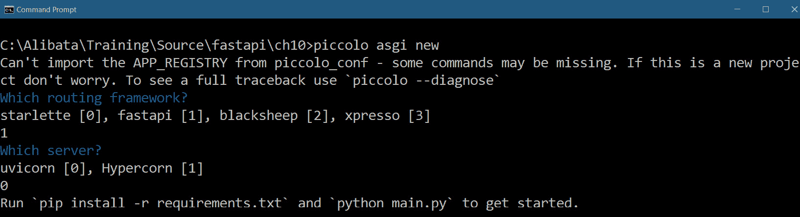
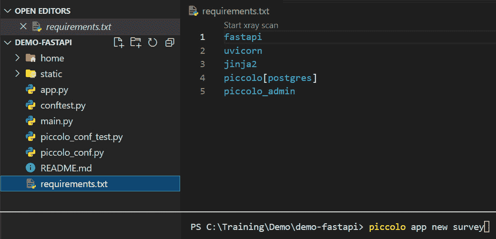
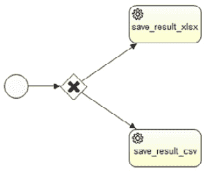
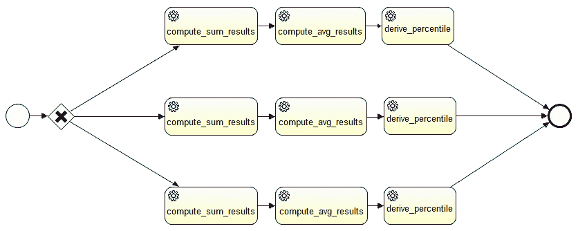
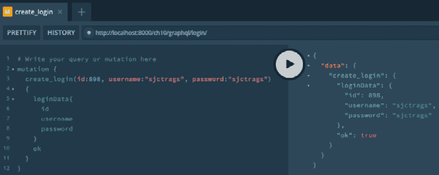
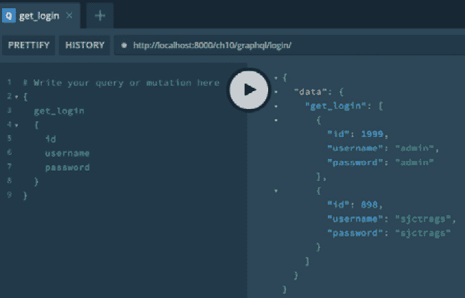

# 10

# 解决数值、符号和图形问题

微服务架构不仅用于在银行、保险、生产、人力资源和制造业中构建细粒度、优化和可扩展的应用程序。它还用于开发科学和计算相关的研究和科学软件原型，例如 **实验室信息管理系统**（**LIMSs**）、天气预报系统、**地理信息系统**（**GISs**）和医疗保健系统。

FastAPI 是构建这些细粒度服务中最佳选择之一，因为它们通常涉及高度计算的任务、工作流和报告。本章将突出一些在前几章中未涉及的交易，例如使用 `sympy` 进行符号计算，使用 `numpy` 求解线性系统，使用 `matplotlib` 绘制数学模型，以及使用 `pandas` 生成数据存档。本章还将向您展示 FastAPI 如何通过模拟一些业务流程建模符号（BPMN）任务来灵活解决与工作流相关的交易。对于开发大数据应用程序，本章的一部分将展示用于大数据应用程序的 GraphQL 查询和用于图形相关项目的框架 Neo4j 图数据库。

本章的主要目标是介绍 FastAPI 框架作为提供科学研究与计算科学微服务解决方案的工具。

在本章中，我们将涵盖以下主题：

+   设置项目

+   实现符号计算

+   创建数组和 DataFrame

+   执行统计分析

+   生成 CSV 和 XLSX 报告

+   绘制数据模型

+   模拟 BPMN 工作流

+   使用 GraphQL 查询和突变

+   利用 Neo4j 图数据库

# 技术要求

本章提供了 `ch10` 项目的基骨架。

# 设置项目

PCCS 项目有两个版本：`ch10-relational`，它使用 PostgreSQL 数据库和 Piccolo ORM 作为数据映射器，以及 `ch10-mongo`，它使用 Beanie ODM 将数据保存为 MongoDB 文档。

## 使用 Piccolo ORM

`ch10-relational` 使用一个快速的 Piccolo ORM，它可以支持同步和异步 CRUD 事务。这个 ORM 在 *第五章**，连接到关系型数据库* 中没有介绍，因为它更适合计算、数据科学相关和大数据应用程序。Piccolo ORM 与其他 ORM 不同，因为它为项目构建了一个包含初始项目结构和自定义模板的项目框架。但在创建项目之前，我们需要使用 `pip` 安装 `piccolo` 模块：

```py
pip install piccolo
```

然后，安装 `piccolo-admin` 模块，它为其项目提供辅助类，用于 GUI 管理员页面：

```py
pip install piccolo-admin
```

现在，我们可以通过运行 CLI 命令 `piccolo asgi new` 在新创建的根项目文件夹内创建一个项目，该命令用于搭建 Piccolo 项目目录。该过程将询问要使用的 API 框架和应用服务器，如以下截图所示：



图 10.1 – 为 Piccolo ORM 项目搭建框架

你必须使用 FastAPI 作为应用程序框架，`uvicorn` 是推荐的 ASGI 服务器。现在，我们可以在项目文件夹内运行 `piccolo app new` 命令来添加 Piccolo 应用程序。以下截图显示了主项目目录，我们在其中执行 CLI 命令创建 Piccolo 应用程序：



图 10.2 – Piccolo 项目目录

搭建好的项目总是有一个默认的应用程序名为 `home`，但可以进行修改或删除。一旦删除，Piccolo 平台允许你通过在项目文件夹内运行 `piccolo app new` 命令来添加一个新的应用程序替换 `home`，如前一张截图所示。一个 Piccolo 应用包含 ORM 模型、BaseModel、服务、仓库类和 API 方法。每个应用程序都有一个自动生成的 `piccolo_app.py` 模块，其中我们需要配置一个 `APP_CONFIG` 变量来注册所有的 ORM 详细信息。以下是我们项目调查应用的配置：

```py
APP_CONFIG = AppConfig(
    app_name="survey",
    migrations_folder_path=os.path.join(
        CURRENT_DIRECTORY, "piccolo_migrations"
    ),
    table_classes=[Answers, Education, Question, Choices, 
       Profile, Login, Location, Occupation, Respondent],
    migration_dependencies=[],
    commands=[],
)
```

为了让 ORM 平台识别新的 Piccolo 应用，必须在主项目的 `piccolo_conf.py` 模块的 `APP_REGISTRY` 中添加 `piccolo_app.py` 文件。以下是我们 `ch10-piccolo` 项目的 `piccolo_conf.py` 文件内容：

```py
from piccolo.engine.postgres import PostgresEngine
from piccolo.conf.apps import AppRegistry
DB = PostgresEngine(
    config={
        "database": "pccs",
        "user": "postgres",
        "password": "admin2255",
        "host": "localhost",
        "port": 5433,
    }
)
APP_REGISTRY = AppRegistry(
    apps=["survey.piccolo_app", 
          "piccolo_admin.piccolo_app"]
)
```

`piccolo_conf.py` 文件也是我们建立 PostgreSQL 数据库连接的模块。除了 PostgreSQL，Piccolo ORM 还支持 SQLite 数据库。

### 创建数据模型

与 Django ORM 类似，Piccolo ORM 有迁移命令可以根据模型类生成数据库表。但首先，我们需要利用其 `Table` API 类创建模型类。它还提供了辅助类来建立列映射和外键关系。以下是我们数据库 `pccs` 中的一些数据模型类：

```py
from piccolo.columns import ForeignKey, Integer, Varchar,
       Text, Date, Boolean, Float
from piccolo.table import Table
class Login(Table):
    username = Varchar(unique=True)
    password = Varchar()
class Education(Table):
    name = Varchar()
class Profile(Table):
    fname = Varchar()
    lname = Varchar()
    age = Integer()
    position = Varchar()
    login_id = ForeignKey(Login, unique=True)
    official_id = Integer()
    date_employed = Date()
```

在创建模型类之后，我们可以通过创建迁移文件来更新数据库。迁移是更新项目数据库的一种方式。在 Piccolo 平台上，我们可以运行 `piccolo migrations new <app_name>` 命令来在 `piccolo_migrations` 文件夹中生成文件。这些被称为迁移文件，它们包含迁移脚本。但为了节省时间，我们将为命令包含 `--auto` 选项，让 ORM 检查最近执行的迁移文件并自动生成包含新反映的架构更新的迁移脚本。在运行 `piccolo migrations forward <app_name>` 命令执行迁移脚本之前，首先检查新创建的迁移文件。这个最后的命令将根据模型类自动创建数据库中的所有表。

### 实现存储库层

在执行所有必要的迁移之后创建存储库层。Piccolo 的 CRUD 操作类似于 Peewee ORM 中的操作。它快速、简洁且易于实现。以下代码展示了 `insert_respondent()` 事务的实现，该事务添加一个新的受访者资料：

```py
from survey.tables import Respondent
from typing import Dict, List, Any
class RespondentRepository:
    async def insert_respondent(self, 
             details:Dict[str, Any]) -> bool: 
        try:
            respondent = Respondent(**details)
            await respondent.save()
        except Exception as e: 
            return False 
        return True
```

与 Peewee 一样，Piccolo 的模型类可以持久化记录，如 `insert_respondent()` 所示，它实现了一个异步的 `INSERT` 事务。另一方面，`get_all_respondent()` 获取所有受访者资料，其方法与 Peewee 相同，如下所示：

```py
    async def get_all_respondent(self):
        return await Respondent.select()
                  .order_by(Respondent.id)
```

项目中的 `/survey/repository/respondent.py` 模块创建了类似 Peewee 的 `DELETE` 和 `UPDATE` 受访者事务。

## Beanie ODM

PCCS 项目的第二个版本 `ch10-mongo` 使用 MongoDB 数据存储库，并使用 Beanie ODM 来实现其异步 CRUD 事务。我们已经在 *第六章**，使用非关系型数据库* 中介绍了 Beanie。现在，让我们学习如何将 FastAPI 应用于符号计算。我们将使用 `ch10-piccolo` 项目来完成这项工作。

# 实现符号计算

使用 `pip` 命令安装 `sympy` 模块：

```py
pip install sympy
```

让我们现在开始创建我们的第一个符号表达式。

## 创建符号表达式

实现执行符号计算的 FastAPI 端点的一种方法是为接受一个数学模型或方程作为字符串的服务创建一个服务，并将该字符串转换为 `sympy` 符号表达式。以下 `substitute_eqn()` 处理 `str` 格式的方程，并将其转换为包含 `x` 和 `y` 变量的有效线性或非线性二元方程。它还接受 `x` 和 `y` 的值来推导表达式的解：

```py
from sympy import symbols, sympify
@router.post("/sym/equation")
async def substitute_bivar_eqn(eqn: str, xval:int, 
               yval:int):
    try:
        x, y = symbols('x, y')
        expr = sympify(eqn)
        return str(expr.subs({x: xval, y: yval}))
    except:
        return JSONResponse(content={"message": 
            "invalid equations"}, status_code=500)
```

在将字符串方程转换为 `sympy` 表达式之前，我们需要使用 `symbols()` 工具将 `x` 和 `y` 变量定义为 `Symbols` 对象。此方法接受一个以逗号分隔的变量名字符串，并返回一个与变量等价的符号元组。在创建所有需要的 `Symbols()` 对象之后，我们可以使用以下任何 `sympy` 方法将我们的方程转换为 `sympy` 表达式：

+   `sympify()`: 此方法使用 `eval()` 将字符串方程转换为有效的 `sympy` 表达式，并将所有 Python 类型转换为它们的 `sympy` 等价物

+   `parse_expr()`: 一个完整的表达式解析器，它转换和修改表达式的标记，并将它们转换为它们的 `sympy` 等价物

由于 `substitute_bivar_eqn()` 服务使用 `sympify()` 方法，因此在 `sympify()` 之前需要对字符串表达式进行清理，以避免任何妥协。

另一方面，`sympy` 表达式对象有一个 `subs()` 方法来替换值以推导出解。其结果对象必须转换为 `str` 格式，以便 `Response` 渲染数据。否则，`Response` 将引发 `ValueError`，将结果视为非可迭代对象。

## 解决线性表达式

`sympy` 模块允许你实现解决多元线性方程组的服务的功能。以下 API 服务突出显示了一个实现，它接受两个以字符串格式表示的双变量线性模型及其相应的解：

```py
from sympy import Eq, symbols, Poly, solve, sympify
@router.get("/sym/linear")
async def solve_linear_bivar_eqns(eqn1:str, 
            sol1: int, eqn2:str, sol2: int):
    x, y = symbols('x, y')

    expr1 = parse_expr(eqn1, locals())
    expr2 = parse_expr(eqn2, locals())

    if Poly(expr1, x).is_linear and 
                 Poly(expr1, x).is_linear:
        eq1 = Eq(expr1, sol1)
        eq2 = Eq(expr2, sol2)
        sol = solve([eq1, eq2], [x, y])
        return str(sol)
    else:
        return None
```

`solve_linear_bivar_eqns()` 服务接受两个双变量线性方程及其相应的输出（或截距）并旨在建立一个线性方程组。首先，它将 `x` 和 `y` 变量注册为 `sympy` 对象，然后使用 `parser_expr()` 方法将字符串表达式转换为它们的 `sympy` 等价物。之后，该服务需要使用 `Eq()` 求解器建立这些方程的线性等式，该求解器将每个 `sympy` 表达式映射到其解。然后，API 服务将所有这些线性方程传递给 `solve()` 方法以推导出 `x` 和 `y` 的值。`solve()` 的结果也需要像替换一样以字符串形式呈现。

除了 `solve()` 方法之外，API 还使用 `Poly()` 工具从表达式创建多项式对象，以便能够访问方程的基本属性，例如 `is_linear()`。

## 解决非线性表达式

之前的 `solve_linear_bivar_eqns()` 可以重用来解决非线性系统。调整是将验证从过滤线性方程更改为任何非线性方程。以下脚本突出了此代码更改：

```py
@router.get("/sym/nonlinear")
async def solve_nonlinear_bivar_eqns(eqn1:str, sol1: int, 
           eqn2:str, sol2: int):
    … … … … … …
    … … … … … …    
    if not Poly(expr1, x, y).is_linear or 
              not Poly(expr1, x, y).is_linear:
    … … … … … …
    … … … … … …
        return str(sol)
    else:
        return None
```

## 解决线性和非线性不等式

`sympy`模块支持解决线性和非线性不等式，但仅限于单变量方程。以下是一个 API 服务，它接受一个带有其输出或截距的单变量字符串表达式，并使用`solve()`方法提取解：

```py
@router.get("/sym/inequality")
async def solve_univar_inequality(eqn:str, sol:int):
    x= symbols('x')
    expr1 = Ge(parse_expr(eqn, locals()), sol)
    sol = solve([expr1], [x])
    return str(sol)
```

`sympy`模块有`Gt()`或`StrictGreaterThan`、`Lt()`或`StrictLessThan`、`Ge()`或`GreaterThan`、`Le()`或`LessThan`求解器，我们可以使用它们来创建不等式。但首先，我们需要使用`parser_expr()`方法将`str`表达式转换为`Symbols()`对象，然后再将它们传递给这些求解器。前面的服务使用`GreaterThan`求解器，它创建一个方程，其中表达式的左侧通常大于右侧。

大多数用于数学建模和数据科学的应用程序设计和开发都使用`sympy`来创建复杂的数学模型符号，直接从`sympy`方程中绘制数据，或根据数据集或实时数据生成结果。现在，让我们继续到下一组 API 服务，这些服务涉及使用`numpy`、`scipy`和`pandas`进行数据分析和处理。

# 创建数组和 DataFrame

当数值算法需要一些数组来存储数据时，一个称为**NumPy**（代表**Numerical Python**）的模块是一个很好的资源，用于创建、转换和操作数组的实用函数、对象和类。

该模块最著名的是其 n 维数组或 ndarrays，它们比典型的 Python 列表消耗更少的内存存储。在执行数据操作时，`ndarray`产生的开销比执行列表操作的总开销要小。此外，`ndarray`是严格异构的，与 Python 的列表集合不同。

但在我们开始 NumPy-FastAPI 服务实现之前，我们需要使用`pip`命令安装`numpy`模块：

```py
pip install numpy
```

我们的第一个 API 服务将处理一些调查数据，并以`ndarray`形式返回。以下`get_respondent_answers()` API 通过 Piccolo 从 PostgreSQL 检索调查数据列表，并将数据列表转换为`ndarray`：

```py
from survey.repository.answers import AnswerRepository
from survey.repository.location import LocationRepository
import ujson
import numpy as np
@router.get("/answer/respondent")
async def get_respondent_answers(qid:int):
    repo_loc = LocationRepository()
    repo_answers = AnswerRepository()
    locations = await repo_loc.get_all_location()
    data = []
    for loc in locations:
        loc_q = await repo_answers
            .get_answers_per_q(loc["id"], qid)
        if not len(loc_q) == 0:
            loc_data = [ weights[qid-1]
              [str(item["answer_choice"])] 
                for item in loc_q]
            data.append(loc_data)
    arr = np.array(data)
    return ujson.loads(ujson.dumps(arr.tolist())) 
```

根据检索到的数据大小，如果我们应用`ujson`或`orjson`序列化和反序列化器将`ndarray`转换为 JSON 数据，将会更快。尽管`numpy`有`uint`、`single`、`double`、`short`、`byte`和`long`等数据类型，但 JSON 序列化器仍然可以成功地将它们转换为标准的 Python 等效类型。我们的 API 示例样本更喜欢使用`ujson`工具将数组转换为可序列化为 JSON 的响应。

除了 NumPy 之外，`pandas`是另一个在数据分析、操作、转换和检索中广泛使用的流行模块。但为了使用 pandas，我们需要安装 NumPy，然后是`pandas`、`matplotlib`和`openpyxl`模块：

```py
pip install pandas matplotlib openpxyl
```

让我们讨论一下 numpy 模块中的 ndarray。

## 应用 NumPy 的线性系统操作

在`ndarray`中进行数据处理更容易、更快，与列表集合相比，后者需要列表推导和循环。`numpy`创建的向量和矩阵具有操作其项的功能，例如标量乘法、矩阵乘法、转置、向量化以及重塑。以下 API 服务展示了如何使用`numpy`模块推导出标量梯度与调查数据数组之间的乘积：

```py
@router.get("/answer/increase/{gradient}")
async def answers_weight_multiply(gradient:int, qid:int):
    repo_loc = LocationRepository()
    repo_answers = AnswerRepository()
    locations = await repo_loc.get_all_location()
    data = []
    for loc in locations:
        loc_q = await repo_answers
            .get_answers_per_q(loc["id"], qid)
        if not len(loc_q) == 0:
            loc_data = [ weights[qid-1]
             [str(item["answer_choice"])] 
                 for item in loc_q]
            data.append(loc_data)
    arr = np.array(list(itertools.chain(*data)))
    arr = arr * gradient
    return ujson.loads(ujson.dumps(arr.tolist()))
```

如前述脚本所示，所有由任何`numpy`操作产生的`ndarray`实例都可以使用各种 JSON 序列化器序列化为可 JSON 化的组件。`numpy`还可以执行其他线性代数操作，而不会牺牲微服务应用程序的性能。现在，让我们看看 pandas 的 DataFrame。

## 应用 pandas 模块

在此模块中，数据集被创建为一个`DataFrame`对象，类似于 Julia 和 R。它包含数据行和列。FastAPI 可以使用任何 JSON 序列化器渲染这些 DataFrame。以下 API 服务从所有调查地点检索所有调查结果，并从这些数据集创建一个 DataFrame：

```py
import ujson
import numpy as np
import pandas as pd
@router.get("/answer/all")
async def get_all_answers():
    repo_loc = LocationRepository()
    repo_answers = AnswerRepository()
    locations = await repo_loc.get_all_location()
    temp = []
    data = []
    for loc in locations:
        for qid in range(1, 13):
            loc_q1 = await repo_answers
               .get_answers_per_q(loc["id"], qid)
            if not len(loc_q1) == 0:
                loc_data = [ weights[qid-1]
                   [str(item["answer_choice"])] 
                      for item in loc_q1]
                temp.append(loc_data)
        temp = list(itertools.chain(*temp))
        if not len(temp) == 0:
            data.append(temp)
        temp = list()
    arr = np.array(data)
    return ujson.loads(pd.DataFrame(arr)
           .to_json(orient='split'))
```

`DataFrame`对象有一个`to_json()`实用方法，它返回一个 JSON 对象，可以选择根据所需类型格式化生成的 JSON。另一方面，`pandas`还可以生成时间序列，这是一个表示 DataFrame 列的一维数组。DataFrame 和时间序列都内置了用于添加、删除、更新以及将数据集保存到 CSV 和 XLSX 文件的有用方法。但在我们讨论 pandas 的数据转换过程之前，让我们看看另一个与`numpy`在许多统计计算（如微分、积分和线性优化）中协同工作的模块：`scipy`模块。

# 执行统计分析

`scipy`模块使用`numpy`作为其基础模块，这就是为什么安装`scipy`之前需要先安装`numpy`。我们可以使用`pip`命令来安装模块：

```py
pip install scipy
```

我们的应用程序使用该模块来推导调查数据的声明性统计信息。以下`get_respondent_answers_stats()`API 服务使用`scipy`的`describe()`方法计算数据集的均值、方差、偏度和峰度：

```py
from scipy import stats
def ConvertPythonInt(o):
    if isinstance(o, np.int32): return int(o)  
    raise TypeError
@router.get("/answer/stats")
async def get_respondent_answers_stats(qid:int):
    repo_loc = LocationRepository()
    repo_answers = AnswerRepository()
    locations = await repo_loc.get_all_location()
    data = []
    for loc in locations:
        loc_q = await repo_answers
           .get_answers_per_q(loc["id"], qid)
             if not len(loc_q) == 0:
                 loc_data = [ weights[qid-1]
                   [str(item["answer_choice"])] 
                       for item in loc_q]
            data.append(loc_data)
    result = stats.describe(list(itertools.chain(*data)))
    return json.dumps(result._asdict(), 
                  default=ConvertPythonInt)
```

`describe()`方法返回一个`DescribeResult`对象，其中包含所有计算结果。为了将所有统计信息作为`Response`的一部分渲染，我们可以调用`DescribeResult`对象的`as_dict()`方法，并使用 JSON 序列化器进行序列化。

我们的 API 示例还使用了额外的实用工具，例如来自`itertools`的`chain()`方法来展平数据列表，以及自定义转换器`ConvertPythonInt`，将 NumPy 的`int32`类型转换为 Python `int`类型。现在，让我们探索如何使用`pandas`模块将数据保存到 CSV 和 XLSX 文件中。

# 生成 CSV 和 XLSX 报告

`DataFrame`对象具有内置的`to_csv()`和`to_excel()`方法，分别将数据保存到 CSV 或 XLSX 文件中。但主要目标是创建一个 API 服务，该服务将返回这些文件作为响应。以下实现展示了 FastAPI 服务如何返回包含受访者列表的 CSV 文件：

```py
from fastapi.responses import StreamingResponse
import pandas as pd
from io import StringIO
from survey.repository.respondent import 
        RespondentRepository
@router.get("/respondents/csv", response_description='csv')
async def create_respondent_report_csv():
    repo = RespondentRepository()
    result = await repo.get_all_respondent()

    ids = [ item["id"] for item in result ]
    fnames = [ f'{item["fname"]}' for item in result ]
    lnames = [ f'{item["lname"]}' for item in result ]
    ages = [ item["age"] for item in result ]
    genders = [ f'{item["gender"]}' for item in result ]
    maritals = [ f'{item["marital"]}' for item in result ]

    dict = {'Id': ids, 'First Name': fnames, 
            'Last Name': lnames, 'Age': ages, 
            'Gender': genders, 'Married?': maritals} 

    df = pd.DataFrame(dict)
    outFileAsStr = StringIO()
    df.to_csv(outFileAsStr, index = False)
    return StreamingResponse(
        iter([outFileAsStr.getvalue()]),
        media_type='text/csv',
        headers={
            'Content-Disposition': 
              'attachment;filename=list_respondents.csv',
            'Access-Control-Expose-Headers': 
               'Content-Disposition'
        }
    )
```

我们需要创建一个包含来自存储库的数据列的`dict()`，以创建`DataFrame`对象。从给定的脚本中，我们将每个数据列存储在一个单独的`list()`中，将所有列表添加到`dict()`中，键为列标题名称，并将`dict()`作为参数传递给`DataFrame`构造函数。

在创建`DataFrame`对象后，调用`to_csv()`方法将其列数据集转换为文本流`io.StringIO`，该流支持 Unicode 字符。最后，我们必须通过 FastAPI 的`StreamResponse`渲染`StringIO`对象，并将`Content-Disposition`头设置为重命名 CSV 对象的默认文件名。

我们的在线调查应用程序没有使用 pandas 的`ExcelWriter`，而是选择了通过`xlsxwriter`模块保存`DataFrame`的另一种方式。此模块有一个`Workbook`类，它创建一个包含工作表的电子表格，我们可以按行绘制所有列数据。以下 API 服务使用此模块来渲染 XLSX 内容：

```py
import xlsxwriter
from io import BytesIO
@router.get("/respondents/xlsx", 
          response_description='xlsx')
async def create_respondent_report_xlsx():
    repo = RespondentRepository()
    result = await repo.get_all_respondent()
    output = BytesIO()
    workbook = xlsxwriter.Workbook(output)
    worksheet = workbook.add_worksheet()
    worksheet.write(0, 0, 'ID')
    worksheet.write(0, 1, 'First Name')
    worksheet.write(0, 2, 'Last Name')
    worksheet.write(0, 3, 'Age')
    worksheet.write(0, 4, 'Gender')
    worksheet.write(0, 5, 'Married?')
    row = 1
    for respondent in result:
        worksheet.write(row, 0, respondent["id"])
        … … … … … …
        worksheet.write(row, 5, respondent["marital"])
        row += 1
    workbook.close()
    output.seek(0)
    headers = {
        'Content-Disposition': 'attachment; 
             filename="list_respondents.xlsx"'
    }
    return StreamingResponse(output, headers=headers)
```

给定的`create_respondent_report_xlsx()`服务从数据库中检索所有受访者记录，并将每个个人资料记录按行绘制在新创建的`Workbook`的工作表中。而不是写入文件，`Workbook`将内容存储在字节流`io.ByteIO`中，该流将由`StreamResponse`渲染。

`pandas`模块还可以帮助 FastAPI 服务读取 CSV 和 XLSX 文件进行渲染或数据分析。它有一个`read_csv()`，可以从 CSV 文件中读取数据并将其转换为 JSON 内容。`io.StringIO`流对象将包含完整内容，包括其 Unicode 字符。以下服务检索有效 CSV 文件的内容并返回 JSON 数据：

```py
@router.post("/upload/csv")
async def upload_csv(file: UploadFile = File(...)):
    df = pd.read_csv(StringIO(str(file.file.read(), 
            'utf-8')), encoding='utf-16')
    return orjson.loads(df.to_json(orient='split'))
```

在 FastAPI 中处理`multipart`文件上传有两种方式：

+   使用`bytes`包含文件

+   使用`UploadFile`包装文件对象

*第九章**，利用其他高级功能*，介绍了用于捕获上传文件的`UploadFile`类，因为它支持更多的 Pydantic 功能，并且具有与协程一起工作的内置操作。它可以在上传过程达到内存限制时不会引发异常的情况下处理大文件上传，与使用`bytes`类型存储文件内容不同。因此，给定的`read-csv()`服务使用`UploadFile`来捕获任何 CSV 文件，并使用`orjson`作为其 JSON 序列化器进行数据分析。

处理文件上传事务的另一种方式是通过 Jinja2 表单模板。我们可以使用 `TemplateResponse` 来实现文件上传，并使用 Jinja2 模板语言渲染文件内容。以下服务使用 `read_csv()` 读取 CSV 文件，并将其序列化为 HTML 表格格式的文本：

```py
@router.get("/upload/survey/form", 
          response_class = HTMLResponse)
def upload_survey_form(request:Request):
    return templates.TemplateResponse("upload_survey.html",
             {"request": request})
@router.post("/upload/survey/form")
async def submit_survey_form(request: Request, 
              file: UploadFile = File(...)):
    df = pd.read_csv(StringIO(str(file.file.read(), 
               'utf-8')), encoding='utf-8')
    return templates.TemplateResponse('render_survey.html', 
         {'request': request, 'data': df.to_html()})
```

除了 `to_json()` 和 `to_html()`，`TextFileReader` 对象还有其他转换器可以帮助 FastAPI 渲染各种内容类型，包括 `to_latex()`、`to_excel()`、`to_hdf()`、`to_dict()`、`to_pickle()` 和 `to_xarray()`。此外，`pandas` 模块有一个 `read_excel()` 可以读取 XLSX 内容并将其转换为任何版本类型，就像它的 `read_csv()` 对应物一样。

现在，让我们探索 FastAPI 服务如何绘制图表和图形，并通过 `Response` 输出它们的图形结果。

# 绘制数据模型

在 `numpy` 和 `pandas` 模块的帮助下，FastAPI 服务可以使用 `matplotlib` 工具生成和渲染不同类型的图表和图形。就像之前的讨论一样，我们将使用 `io.ByteIO` 流和 `StreamResponse` 为 API 端点生成图形结果。以下 API 服务从存储库检索调查数据，计算每个数据层的平均值，并以 PNG 格式返回数据的折线图：

```py
from io import BytesIO
import matplotlib.pyplot as plt
from survey.repository.answers import AnswerRepository
from survey.repository.location import LocationRepository
@router.get("/answers/line")
async def plot_answers_mean():
    x = [1, 2, 3, 4, 5, 6, 7]
    repo_loc = LocationRepository()
    repo_answers = AnswerRepository()
    locations = await repo_loc.get_all_location()
    temp = []
    data = []
    for loc in locations:
        for qid in range(1, 13):
            loc_q1 = await repo_answers
               .get_answers_per_q(loc["id"], qid)
            if not len(loc_q1) == 0:
                loc_data = [ weights[qid-1]
                  [str(item["answer_choice"])] 
                     for item in loc_q1]
                temp.append(loc_data)
        temp = list(itertools.chain(*temp))
        if not len(temp) == 0:
            data.append(temp)
        temp = list()
    y = list(map(np.mean, data))
    filtered_image = BytesIO()
    plt.figure()

    plt.plot(x, y)

    plt.xlabel('Question Mean Score')
    plt.ylabel('State/Province')
    plt.title('Linear Plot of Poverty Status')

    plt.savefig(filtered_image, format='png')
    filtered_image.seek(0)

    return StreamingResponse(filtered_image, 
                media_type="image/png")
```

`plot_answers_mean()` 服务利用 `matplotlib` 模块的 `plot()` 方法，在折线图中绘制每个位置的 APP 平均调查结果。该服务不是将文件保存到文件系统，而是使用模块的 `savefig()` 方法将图像存储在 `io.ByteIO` 流中。流使用 `StreamResponse` 渲染，就像之前的示例一样。以下图显示了通过 `StreamResponse` 渲染的流图像，格式为 PNG：

![Figure 10.3 – StreamResponse 生成的折线图]

![Figure 10.03 – B17975.jpg]

Figure 10.3 – StreamResponse 生成的折线图

我们 APP 的其他 API 服务，例如 `plot_sparse_data()`，会创建一些模拟或派生数据的条形图图像，格式为 JPEG：

```py
@router.get("/sparse/bar")
async def plot_sparse_data():
   df = pd.DataFrame(np.random.randint(10, size=(10, 4)),
      columns=["Area 1", "Area 2", "Area 3", "Area 4"])
   filtered_image = BytesIO()
   plt.figure()
   df.sum().plot(kind='barh', color=['red', 'green', 
          'blue', 'indigo', 'violet'])
   plt.title("Respondents in Survey Areas")
   plt.xlabel("Sample Size")
   plt.ylabel("State")
   plt.savefig(filtered_image, format='png')

   filtered_image.seek(0)
   return StreamingResponse(filtered_image, 
           media_type="image/jpeg")
```

方法与我们的折线图版本相同。使用相同的策略，以下服务创建了一个饼图，显示了被调查的男性和女性受访者的百分比：

```py
@router.get("/respondents/gender")
async def plot_pie_gender():
    repo = RespondentRepository()
    count_male = await repo.list_gender('M')
    count_female = await repo.list_gender('F')
    gender = [len(count_male), len(count_female)]
    filtered_image = BytesIO()
    my_labels = 'Male','Female'
    plt.pie(gender,labels=my_labels,autopct='%1.1f%%')
    plt.title('Gender of Respondents')
    plt.axis('equal')
    plt.savefig(filtered_image, format='png')
    filtered_image.seek(0)

    return StreamingResponse(filtered_image, 
               media_type="image/png")
```

`plot_sparse_data()` 和 `plot_pie_gender()` 服务生成的响应如下：

![Figure 10.4 – StreamResponse 生成的条形图和饼图]

![Figure 10.04 – B17975.jpg]

Figure 10.4 – StreamResponse 生成的条形图和饼图

本节将介绍一种创建 API 端点的方法，这些端点使用 `matplotlib` 生成图形结果。但你可以使用 `numpy`、`pandas`、`matplotlib` 和 FastAPI 框架在更短的时间内创建其他描述性、复杂和令人惊叹的图表和图形。这些扩展甚至可以在适当的硬件资源下解决复杂的数学和数据科学相关的问题。

现在，让我们将注意力转向另一个项目 `ch10-mongo`，以解决有关工作流程、GraphQL、Neo4j 图数据库事务以及 FastAPI 如何利用它们的问题。

# 模拟 BPMN 工作流程

虽然 FastAPI 框架没有内置的实用工具来支持其工作流程，但它足够灵活和流畅，可以通过扩展模块、中间件和其他自定义来集成到其他工作流程工具，如 Camunda 和 Apache Airflow。但本节将仅关注使用 Celery 模拟 BPMN 工作流程的原始解决方案，这可以扩展为一个更灵活、实时和面向企业的方法，如 Airflow 集成。

## 设计 BPMN 工作流程

`ch10-mongo` 项目使用 Celery 实现了以下 BPMN 工作流程设计：

+   一系列服务任务，用于推导调查数据结果的百分比，如下所示图所示：


图 10.5 – 百分比计算工作流程设计

+   一组批处理操作，将数据保存到 CSV 和 XLSX 文件中，如下所示图所示：



图 10.6 – 数据归档工作流程设计

+   一组链式任务，独立地对每个位置的数据进行操作，如下所示图所示：



图 10.7 – 分层调查数据分析工作流程设计

实现给定设计的方法有很多，但最直接的方法是利用我们在 *第七章**，Securing the REST APIs* 中使用的 Celery 设置。

## 实现工作流程

Celery 的 `chain()` 方法实现了一个链式任务执行的工作流程，如图 10.5 所示，其中每个父任务将结果返回给下一个任务的第一个参数。链式工作流程在运行时每个任务都成功执行且未遇到任何异常的情况下工作。以下是在 `/api/survey_workflow.py` 中实现的 API 服务，它实现了链式工作流程：

```py
@router.post("/survey/compute/avg")
async def chained_workflow(surveydata: SurveyDataResult):
    survey_dict = surveydata.dict(exclude_unset=True)
    result = chain(compute_sum_results
        .s(survey_dict['results']).set(queue='default'), 
            compute_avg_results.s(len(survey_dict))
             .set(queue='default'), derive_percentile.s()
             .set(queue='default')).apply_async()
    return {'message' : result.get(timeout = 10) }
```

`compute_sum_results()`、`compute_avg_results()` 和 `derive_percentile()` 是绑定任务。绑定任务是 Celery 任务，实现时将第一个方法参数分配给任务实例本身，因此在参数列表中出现了 `self` 关键字。它们的任务实现总是带有 `@celery.task(bind=True)` 装饰器。Celery 任务管理器在将工作流程原语签名应用于创建工作流程时更喜欢绑定任务。以下代码显示了在链式工作流程设计中使用的绑定任务：

```py
@celery.task(bind=True)
def compute_sum_results(self, results:Dict[str, int]):
    scores = []
    for key, val in results.items():
        scores.append(val)
    return sum(scores)
```

`compute_sum_results()` 计算每个州的调查结果总和，而 `compute_avg_results()` 消耗 `compute_sum_results()` 计算出的总和以得出平均值：

```py
@celery.task(bind=True)
def compute_avg_results(self, value, len):
    return (value/len)
```

另一方面，`derive_percentile()` 消耗 `compute_avg_results()` 生成的平均值，以返回一个百分比值：

```py
@celery.task(bind=True)
def derive_percentile(self, avg):
    percentage = f"{avg:.0%}"
    return percentage
```

给定的 `derive_percentile()` 消耗 `compute_avg_results()` 生成的平均值，以返回一个百分比值。

为了实现网关方法，Celery 有一个 `group()` 原始签名，用于实现并行任务执行，如图 *图 10.6* 所示。以下 API 展示了具有并行执行的流程结构实现：

```py
@router.post("/survey/save")
async def grouped_workflow(surveydata: SurveyDataResult):
    survey_dict = surveydata.dict(exclude_unset=True)
    result = group([save_result_xlsx
       .s(survey_dict['results']).set(queue='default'), 
         save_result_csv.s(len(survey_dict))
          .set(queue='default')]).apply_async()
    return {'message' : result.get(timeout = 10) } 
```

*图 10.7* 中所示的工作流程展示了分组和链式工作流程的混合。在许多现实世界的微服务应用程序中，使用不同 Celery 签名（包括 `chord()`、`map()` 和 `starmap()`）的混合来解决与工作流程相关的问题是很常见的。以下脚本实现了一个具有混合签名的流程：

```py
@router.post("/process/surveys")
async def process_surveys(surveys: List[SurveyDataResult]):
    surveys_dict = [s.dict(exclude_unset=True) 
         for s in surveys]
    result = group([chain(compute_sum_results
       .s(survey['results']).set(queue='default'), 
         compute_avg_results.s(len(survey['results']))
         .set(queue='default'), derive_percentile.s()
         .set(queue='default')) for survey in 
                surveys_dict]).apply_async()
    return {'message': result.get(timeout = 10) }
```

Celery 签名在构建工作流程中起着至关重要的作用。在构造中出现的 `signature()` 方法或 `s()` 管理任务的执行，包括接受初始任务参数值（s）并利用 Celery 工作者使用的队列来加载任务。如*第七章**，*保护 REST API*所述，`apply_async()` 触发整个工作流程执行并检索结果。

除了工作流程之外，FastAPI 框架还可以使用 GraphQL 平台来构建 CRUD 事务，尤其是在处理微服务架构中的大量数据时。

# 使用 GraphQL 查询和变更

GraphQL 是一个同时实现 REST 和 CRUD 事务的 API 标准。它是一个高性能平台，用于构建只需几步即可设置的 REST API 端点。其目标是创建用于数据操作和查询事务的端点。

## 设置 GraphQL 平台

Python 扩展，如 Strawberry、Ariadne、Tartiflette 和 Graphene，支持 GraphQL-FastAPI 集成。本章介绍了使用新的 Ariadne 3.x 版本为以 MongoDB 作为存储库的 `ch10-mongo` 项目构建 CRUD 事务。

首先，我们需要使用 `pip` 命令安装最新的 `graphene` 扩展：

```py
pip install graphene
```

在 GraphQL 库中，Graphene 是设置最简单的，具有更少的装饰器和需要覆盖的方法。它很容易与 FastAPI 框架集成，无需额外的中间件和过多的自动连接。

## 创建记录插入、更新和删除

数据操作操作始终是 GraphQL 变更机制的一部分。这是一个 GraphQL 功能，它修改应用程序的服务器端状态，并返回任意数据作为状态成功变更的标志。以下是一个 GraphQL 变更的实现，用于插入、删除和更新记录：

```py
from models.data.pccs_graphql import LoginData
from graphene import String, Int, Mutation, Field
from repository.login import LoginRepository
class CreateLoginData(Mutation):
    class Arguments:
      id = Int(required=True)
      username = String(required=True)
      password = String(required=True)
    ok = Boolean()
    loginData = Field(lambda: LoginData)
    async def mutate(root, info, id, username, password):
        login_dict = {"id": id, "username": username, 
                   "password": password}
        login_json = dumps(login_dict, default=json_serial)
        repo = LoginRepository()
        result = await repo.add_login(loads(login_json))
        if not result == None:
          ok = True
        else: 
          ok = False
        return CreateLoginData(loginData=result, ok=ok)
```

`CreateLoginData`是一个突变，它将新的登录记录添加到数据存储中。内部类`Arguments`指示将组成新登录记录以插入的记录字段。这些参数必须在重写的`mutate()`方法中出现，以捕获这些字段的值。此方法还将调用 ORM，以持久化新创建的记录。

在成功插入事务后，`mutate()`必须返回突变类内部定义的类变量，如`ok`和`loginData`对象。这些返回值必须是突变实例的一部分。

更新登录属性与`CreateLoginData`的实现类似，除了需要公开参数。以下是一个更新使用其`username`检索到的登录记录的`password`字段的突变类：

```py
class ChangeLoginPassword(Mutation):
    class Arguments:
      username = String(required=True)
      password = String(required=True)
    ok = Boolean()
    loginData = Field(lambda: LoginData)
    async def mutate(root, info, username, password):       
        repo = LoginRepository()
        result = await repo.change_password(username, 
                  password)

        if not result == None:
          ok = True
        else: 
          ok = False
        return CreateLoginData(loginData=result, ok=ok)
```

同样，删除突变类通过`id`检索记录并将其从数据存储中删除：

```py
class DeleteLoginData(Mutation):
    class Arguments:
      id = Int(required=True)

    ok = Boolean()
    loginData = Field(lambda: LoginData)
    async def mutate(root, info, id):       
        repo = LoginRepository()
        result = await repo.delete_login(id)
        if not result == None:
          ok = True
        else: 
          ok = False
        return DeleteLoginData(loginData=result, ok=ok)
```

现在，我们可以将所有突变类存储在一个`ObjectType`类中，该类将这些事务暴露给客户端。我们将字段名分配给给定突变类的每个`Field`实例。这些字段名将作为事务的查询名称。以下代码显示了定义我们的`CreateLoginData`、`ChangeLoginPassword`和`DeleteLoginData`突变的`ObjectType`类：

```py
class LoginMutations(ObjectType):
    create_login = CreateLoginData.Field()
    edit_login = ChangeLoginPassword.Field()
    delete_login = DeleteLoginData.Field()
```

## 实现查询事务

GraphQL 查询事务是`ObjectType`基类的实现。在这里，`LoginQuery`从数据存储中检索所有登录记录：

```py
class LoginQuery(ObjectType):
    login_list = None
    get_login = Field(List(LoginData))

    async def resolve_get_login(self, info):
      repo = LoginRepository()
      login_list = await repo.get_all_login()
      return login_list
```

该类必须有一个查询字段名，例如`get_login`，它在查询执行期间将作为其查询名称。字段名必须是`resolve_*()`方法名的一部分，以便在`ObjectType`类下注册。必须声明一个类变量，例如`login_list`，以便它包含所有检索到的记录。

## 运行 CRUD 事务

在运行 GraphQL 事务之前，我们需要一个 GraphQL 模式来集成 GraphQL 组件并注册 FastAPI 框架的突变和查询类。以下脚本显示了使用`LoginQuery`和`LoginMutations`实例化 GraphQL 的`Schema`类：

```py
from graphene import Schema 
schema = Schema(query=LoginQuery, mutation=LoginMutations,
    auto_camelcase=False)
```

我们将`Schema`实例的`auto_camelcase`属性设置为`False`，以保持使用带下划线的原始字段名，并避免使用驼峰命名法。

之后，我们使用模式实例创建`GraphQLApp()`实例。GraphQLApp 相当于一个需要挂载到 FastAPI 框架中的应用程序。我们可以使用 FastAPI 的`mount()`实用工具将`GraphQLApp()`实例与其 URL 模式以及选择的 GraphQL 浏览器工具集成，以运行 API 事务。以下代码显示了如何将 GraphQL 应用程序与 Playground 作为浏览器工具集成以运行 API：

```py
from starlette_graphene3 import GraphQLApp, 
          make_playground_handler
app = FastAPI()
app.mount("/ch10/graphql/login", 
       GraphQLApp(survey_graphene_login.schema, 
          on_get=make_playground_handler()) )
app.mount("/ch10/graphql/profile", 
       GraphQLApp(survey_graphene_profile.schema, 
          on_get=make_playground_handler()) )
```

我们可以使用左侧面板通过包含 `CreateLoginData` 事务字段名 `create_login` 的 JSON 脚本插入新的记录，并传递必要的记录数据，如下面的屏幕截图所示：



图 10.8 – 运行 create_login 事务

要执行查询事务，我们必须创建一个具有 `LoginQuery` 字段名的 JSON 脚本，该字段为 `get_login`，以及需要检索的记录字段。以下屏幕截图显示了如何运行 `LoginQuery` 事务：



图 10.9 – 运行 get_login 查询事务

GraphQL 可以通过简单的设置和配置帮助整合来自不同微服务的所有 CRUD 事务。它可以作为 API 网关，将来自多个微服务的所有 GraphQLApps 挂载以创建单个门面应用程序。现在，让我们将 FastAPI 集成到图数据库中。

# 利用 Neo4j 图数据库

对于需要强调数据记录之间关系的数据存储的应用程序，图数据库是合适的存储方法之一。使用图数据库的平台之一是 Neo4j。FastAPI 可以轻松地与 Neo4j 集成，但我们需要使用 `pip` 命令安装 `Neo4j` 模块：

```py
pip install neo4j
```

Neo4j 是一个灵活且强大的 NoSQL 数据库，可以根据相关属性管理和连接不同的企业相关数据。它具有半结构化数据库架构，具有简单的 ACID 属性和非 JOIN 策略，这使得其操作快速且易于执行。

注意

ACID，即原子性、一致性、隔离性和持久性，描述数据库事务为一组作为单个单元执行的正确性和一致性的操作。

## 设置 Neo4j 数据库

`neo4j` 模块包括 `neo4j-driver`，这是建立与图数据库连接所需的。它需要一个包含 `bolt` 协议、服务器地址和端口的 URI。默认数据库端口为 `7687`。以下脚本显示了如何创建 Neo4j 数据库连接：

```py
from neo4j import GraphDatabase
uri = "bolt://127.0.0.1:7687"
driver = GraphDatabase.driver(uri, auth=("neo4j", 
      "admin2255"))
```

## 创建 CRUD 事务

Neo4j 有一种称为 Cypher 的声明式图查询语言，允许执行图数据库的 CRUD 事务。这些 Cypher 脚本需要编码为 `str` SQL 命令，以便由其查询运行器执行。以下 API 服务将新的数据库记录添加到图数据库：

```py
@router.post("/neo4j/location/add")
def create_survey_loc(node_name: str, 
        node_req_atts: LocationReq):
    node_attributes_dict = 
          node_req_atts.dict(exclude_unset=True)
    node_attributes = '{' + ', '.join(f'{key}:\'{value}\''
        for (key, value) in node_attributes_dict.items()) 
              + '}'
    query = f"CREATE ({node_name}:Location  
         {node_attributes})"
    try:
        with driver.session() as session:
            session.run(query=query)
        return JSONResponse(content={"message":
         "add node location successful"}, status_code=201)
    except Exception as e:
        print(e)
        return JSONResponse(content={"message": "add node 
            location unsuccessful"}, status_code=500)
```

`create_survey_loc()` 将新的调查位置详细信息添加到 Neo4j 数据库。在图数据库中，记录被视为具有名称和属性与关系数据库中记录字段等效的节点。我们使用连接对象创建一个会话，该会话具有 `run()` 方法以执行 Cypher 脚本。

添加新节点的命令是 `CREATE`，而更新、删除和检索节点的语法可以通过 `MATCH` 命令添加。以下 `update_node_loc()` 服务根据节点的名称搜索特定节点，并执行 `SET` 命令来更新指定的字段：

```py
@router.patch("/neo4j/update/location/{id}")
async def update_node_loc(id:int, 
           node_req_atts: LocationReq):
    node_attributes_dict = 
         node_req_atts.dict(exclude_unset=True)
    node_attributes = '{' + ', '.join(f'{key}:\'{value}\'' 
       for (key, value) in 
            node_attributes_dict.items()) + '}'
    query = f"""
        MATCH (location:Location)
        WHERE ID(location) = {id}
        SET location += {node_attributes}"""
    try:
        with driver.session() as session:
            session.run(query=query)
        return JSONResponse(content={"message": 
          "update location successful"}, status_code=201)
    except Exception as e:
        print(e)
        return JSONResponse(content={"message": "update 
           location  unsuccessful"}, status_code=500)
```

同样，删除事务使用 `MATCH` 命令搜索要删除的节点。以下服务实现了 `Location` 节点的删除：

```py
@router.delete("/neo4j/delete/location/{node}")
def delete_location_node(node:str):
    node_attributes = '{' + f"name:'{node}'" + '}'
    query = f"""
        MATCH (n:Location {node_attributes})
        DETACH DELETE n
    """
    try:
        with driver.session() as session:
            session.run(query=query)
        return JSONResponse(content={"message": 
          "delete location node successful"}, 
             status_code=201)
    except:
        return JSONResponse(content={"message": 
           "delete location node unsuccessful"}, 
               status_code=500)
```

当检索节点时，以下服务从数据库中检索所有节点：

```py
@router.get("/neo4j/nodes/all")
async def list_all_nodes():
    query = f"""
        MATCH (node)
        RETURN node"""
    try:
        with driver.session() as session:
            result = session.run(query=query)
            nodes = result.data()
        return nodes
    except Exception as e:
        return JSONResponse(content={"message": "listing
            all nodes unsuccessful"}, status_code=500)
```

以下服务仅基于节点的 `id` 检索单个节点：

```py
@router.get("/neo4j/location/{id}")
async def get_location(id:int):
    query = f"""
        MATCH (node:Location)
        WHERE ID(node) = {id}
        RETURN node"""
    try:
        with driver.session() as session:
            result = session.run(query=query)
            nodes = result.data()
        return nodes
    except Exception as e:
        return JSONResponse(content={"message": "get 
          location node unsuccessful"}, status_code=500)
```

如果我们没有将节点基于属性链接的 API 端点，我们的实现将不会完整。节点基于可更新和可删除的关系名称和属性相互链接。以下 API 端点创建 `Location` 节点和 `Respondent` 节点之间的节点关系：

```py
@router.post("/neo4j/link/respondent/loc")
def link_respondent_loc(respondent_node: str, 
    loc_node: str, node_req_atts:LinkRespondentLoc):
    node_attributes_dict = 
         node_req_atts.dict(exclude_unset=True)

    node_attributes = '{' + ', '.join(f'{key}:\'{value}\'' 
       for (key, value) in 
          node_attributes_dict.items()) + '}'

    query = f"""
        MATCH (respondent:Respondent), (loc:Location)
        WHERE respondent.name = '{respondent_node}' AND 
            loc.name = '{loc_node}'
        CREATE (respondent) -[relationship:LIVES_IN 
              {node_attributes}]->(loc)"""
    try:
        with driver.session() as session:
            session.run(query=query)
        return JSONResponse(content={"message": "add … 
            relationship successful"}, status_code=201)
    except:
        return JSONResponse(content={"message": "add 
          respondent-loc relationship unsuccessful"}, 
                 status_code=500)
```

FastAPI 框架可以轻松集成到任何数据库平台。前几章已经证明 FastAPI 可以通过 ORM 处理关系型数据库事务，并通过 ODM 处理基于文档的 NoSQL 事务，而本章已经证明了 Neo4j 图数据库同样可以轻松配置，证明了这一点。

# 摘要

本章通过展示 API 服务可以通过 `numpy`、`pandas`、`sympy` 和 `matplotlib` 模块提供数值计算、符号公式和数据的图形解释，介绍了 FastAPI 的科学方面。本章还帮助我们理解我们可以将 FastAPI 与新技术和设计策略集成到何种程度，以提供微服务架构的新思路，例如使用 GraphQL 来管理 CRUD 事务，使用 Neo4j 进行实时和基于节点的数据管理。我们还介绍了 FastAPI 可以应用于解决各种 BPMN 工作流的基本方法，即使用 Celery 任务。有了这些，我们开始理解框架在构建微服务应用中的强大功能和灵活性。

下一章将涵盖最后一组主题，以完成我们对 FastAPI 的深入研究。我们将介绍一些部署策略、Django 和 Flask 集成，以及前几章未讨论的其他微服务设计模式。
