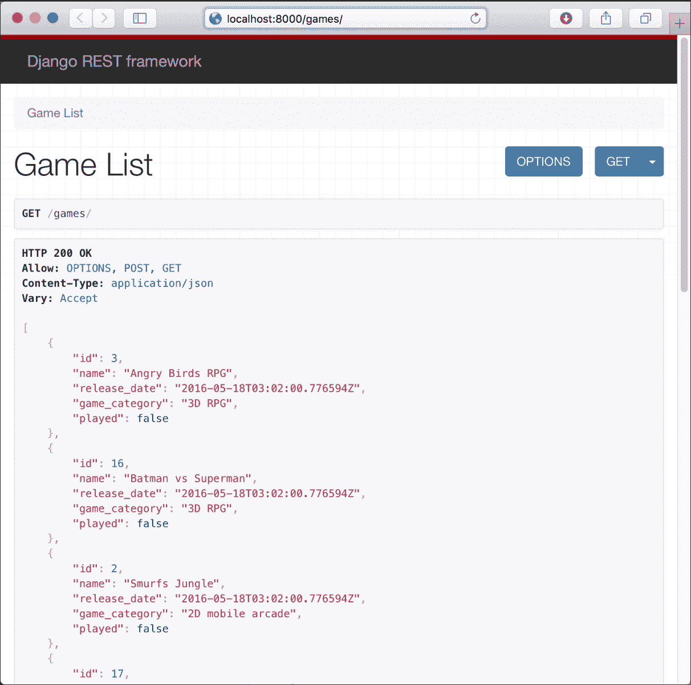
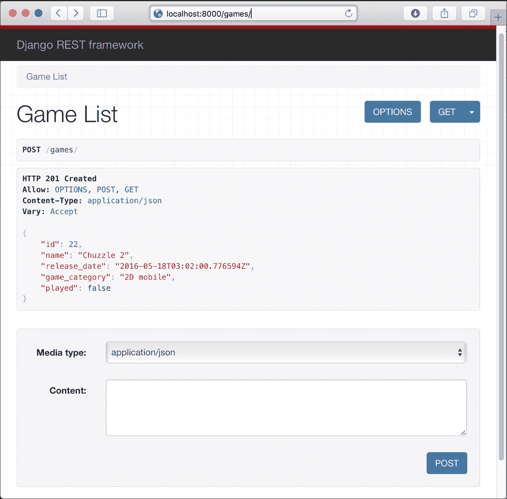
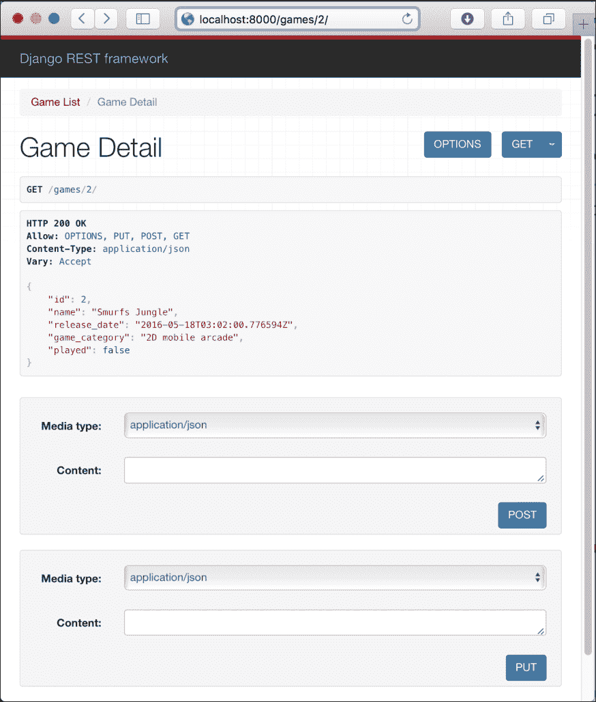
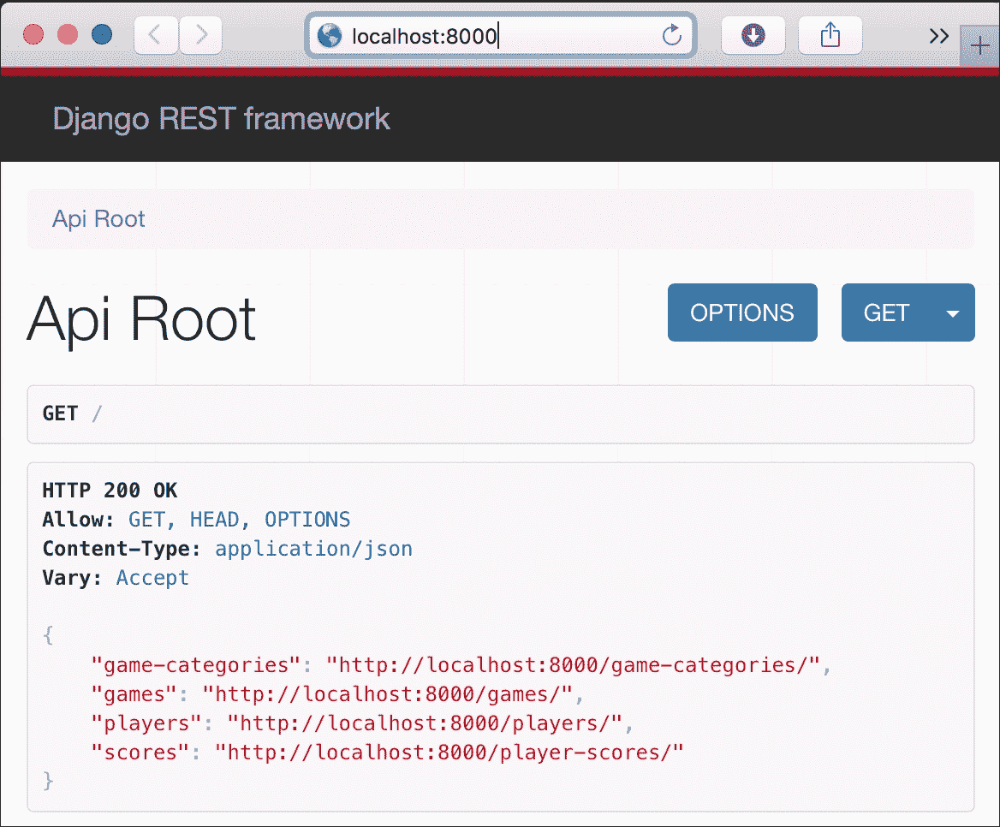
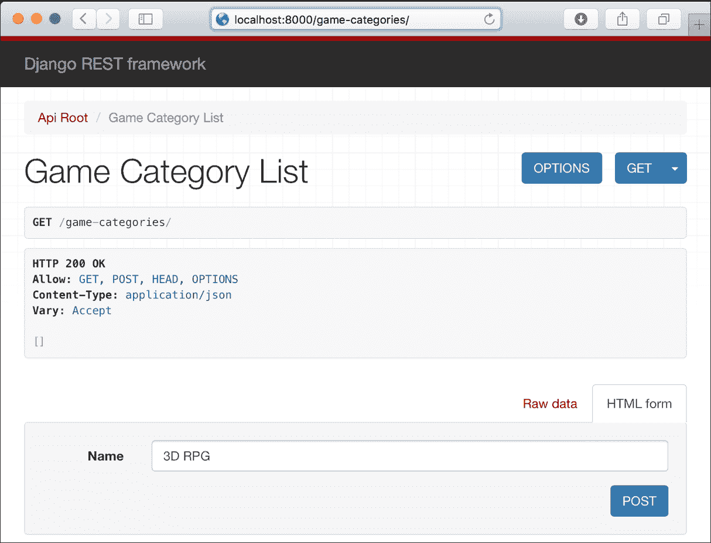
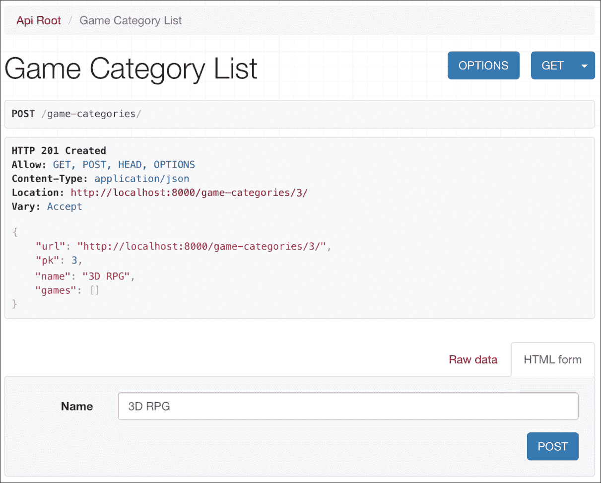
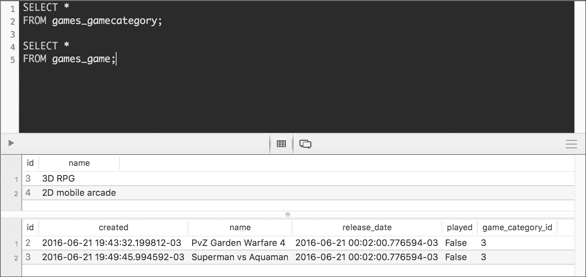

# 第二章。在 Django 中使用基于类的视图和超链接 API 工作

在本章中，我们将扩展我们在上一章中开始的 RESTful API 的功能。我们将更改 ORM 设置以使用更强大的 PostgreSQL 数据库，并利用 Django REST Framework 中包含的先进功能，这些功能允许我们减少复杂 API（如基于类的视图）的样板代码。我们将：

+   使用模型序列化器来消除重复代码

+   使用包装器编写 API 视图

+   使用默认解析和渲染选项，并超越 JSON

+   浏览 API

+   设计一个 RESTful API 以与复杂的 PostgreSQL 数据库交互

+   理解每个`HTTP`方法执行的任务

+   声明与模型的关系

+   使用关系和超链接管理序列化和反序列化

+   创建基于类的视图并使用通用类

+   与 API 端点一起工作

+   创建和检索相关资源

# 使用模型序列化器来消除重复代码

`GameSerializer`类声明了许多与我们在`Game`模型中使用的相同名称的属性，并重复了信息，例如类型和`max_length`值。`GameSerializer`类是`rest_framework.serializers.Serializer`的子类，它声明了我们将手动映射到适当类型的属性，并重写了`create`和`update`方法。

现在，我们将创建一个新版本的`GameSerializer`类，该类将继承自`rest_framework.serializers.ModelSerializer`类。`ModelSerializer`类自动填充了一组默认字段和一组默认验证器。此外，该类还为`create`和`update`方法提供了默认实现。

### 小贴士

如果你有 Django Web 框架的经验，你会注意到`Serializer`和`ModelSerializer`类与`Form`和`ModelForm`类相似。

现在，前往`gamesapi/games`文件夹并打开`serializers.py`文件。将此文件中的代码替换为以下代码，该代码声明了`GameSerializer`类的新版本。示例代码文件包含在`restful_python_chapter_02_01`文件夹中：

```py
from rest_framework import serializers 
from games.models import Game 

class GameSerializer(serializers.ModelSerializer): 
    class Meta: 
        model = Game 
        fields = ('id',  
                  'name',  
                  'release_date', 
                  'game_category',  
                  'played') 

```

新的`GameSerializer`类声明了一个`Meta`内部类，该类声明了两个属性：`model`和`fields`。`model`属性指定与序列化器相关的模型，即`Game`类。`fields`属性指定一个字符串元组，其值表示我们想要从相关模型中包含在序列化中的字段名称。

在这种情况下，无需重写`create`或`update`方法，因为通用行为就足够了。`ModelSerializer`超类为这两种方法提供了实现。

我们已经减少了在 `GameSerializer` 类中不需要的样板代码。我们只需要在元组中指定所需的字段集。现在，与游戏字段相关的类型仅包含在 `Game` 类中。

### 提示

按 *Ctrl + C* 退出 Django 开发服务器，并执行以下命令重新启动它：

```py
python manage.py runserver

```

# 使用包装器编写 API 视图

我们在 `games/views.py` 文件中的代码声明了一个 `JSONResponse` 类和两个基于函数的视图。这些函数在需要返回 JSON 数据时返回 `JSONResponse`，而在响应只是 HTTP 状态码时返回 `django.Http.Response.HttpResponse` 实例。

无论 HTTP 请求头中指定的接受内容类型如何，视图函数始终在响应体中提供相同的内容-JSON。运行以下两个命令以检索具有不同 `Accept` 请求头值（`text/html` 和 `application/json`）的所有游戏：

```py
http :8000/games/ Accept:text/html
http :8000/games/ Accept:application/json

```

以下是对应的 curl 命令：

```py
curl -H 'Accept: text/html' -iX GET :8000/games/
curl -H 'Accept: application/json' -iX GET :8000/games/

```

前面的命令将组成并发送以下 HTTP 请求：`GET http://localhost:8000/games/`。第一个命令为 `Accept` 请求头定义了 `text/html` 值。第二个命令为 `Accept` 请求头定义了 `application/json` 值。

你会注意到这两个命令产生了相同的结果，因此视图函数没有考虑 HTTP 请求头中指定的 `Accept` 值。这两个命令的响应头将包括以下行：

```py
Content-Type: application/json

```

第二个请求指定它只接受 `text/html`，但响应中包含了 JSON 主体，即 `application/json` 内容。因此，我们的第一个版本的 RESTful API 没有准备好渲染除 JSON 之外的内容。我们将进行一些更改，以使 API 能够渲染其他内容。

无论何时我们对 RESTful API 中资源或资源集合支持的方法有疑问，我们都可以使用 `OPTIONS` HTTP 动词和资源或资源集合的 URL 组成并发送 HTTP 请求。如果 RESTful API 为资源或资源集合实现了 `OPTIONS` HTTP 动词，它会在响应的 `Allow` 头中提供一个以逗号分隔的 HTTP 动词或方法列表，作为其支持值的列表。此外，响应头还将包括有关其他支持选项的附加信息，例如它能够从请求中解析的内容类型以及它能够在响应中呈现的内容类型。

例如，如果我们想知道游戏集合支持哪些 HTTP 动词，我们可以运行以下命令：

```py
http OPTIONS :8000/games/

```

以下是对应的 curl 命令：

```py
curl -iX OPTIONS :8000/games/

```

之前的命令将组合并发送以下 HTTP 请求：`OPTIONS http://localhost:8000/games/`。请求将匹配并运行`views.game_list`函数，即`games/views.py`文件中声明的`game_list`函数。此函数仅在`request.method`等于`'GET'`或`'POST'`时运行代码。在这种情况下，`request.method`等于`'OPTIONS'`，因此，该函数不会运行任何代码，也不会返回任何响应，特别是，它不会返回`HttpResponse`实例。因此，我们将在 Django 开发服务器控制台输出中看到以下`Internal Server Error`：

```py
Internal Server Error: /games/ 
Traceback (most recent call last): 
  File "/Users/gaston/Projects/PythonRESTfulWebAPI/Django01/lib/python3.5/site-packages/django/core/handlers/base.py", line 158, in get_response 
    % (callback.__module__, view_name)) 
ValueError: The view games.views.game_list didn't return an HttpResponse object. It returned None instead. 
[08/Jun/2016 20:21:40] "OPTIONS /games/ HTTP/1.1" 500 49173 

```

以下行显示了输出头部，其中还包括一个包含关于错误详细信息的 HTML 文档，因为 Django 的调试模式已激活。我们收到`500 Internal Server Error`状态码：

```py
HTTP/1.0 500 Internal Server Error 
Content-Type: text/html 
Date: Wed, 08 Jun 2016 20:21:40 GMT 
Server: WSGIServer/0.2 CPython/3.5.1 
X-Frame-Options: SAMEORIGIN 

```

显然，我们希望提供一个更一致的 API，并且我们希望在收到对游戏资源或游戏集合的`OPTIONS`动词请求时提供准确的响应。

如果我们使用`OPTIONS`动词向游戏资源发送一个 HTTP 请求，我们将看到相同的错误，并且会有类似的响应，因为`views.game_detail`函数仅在`request.method`等于`'GET'`、`'PUT'`或`'DELETE'`时运行代码。

以下命令将在我们尝试查看 id 或主键等于`3`的游戏资源的选项时产生解释性错误。别忘了将`3`替换为你配置中现有游戏的某个主键值：

```py
http OPTIONS :8000/games/3/

```

以下是对应的 curl 命令：

```py
curl -iX OPTIONS :8000/games/3/

```

我们只需要在`games/views.py`文件中做一些修改，以解决我们一直在分析的问题，以解决我们的 RESTful API。我们将使用在`rest_framework.decorators`中声明的`@api_view`装饰器来处理基于函数的视图。此装饰器允许我们指定我们的函数可以处理的 HTTP 动词。如果需要由视图函数处理的请求的 HTTP 动词不包括在作为`@api_view`装饰器的`http_method_names`参数指定的字符串列表中，则默认行为返回`405 Method Not Allowed`状态码。这样，我们确保每当收到不在我们的函数视图中考虑的 HTTP 动词时，我们不会生成意外的错误，因为装饰器处理了不受支持的 HTTP 动词或方法。

### 小贴士

在幕后，`@api_view`装饰器是一个包装器，它将基于函数的视图转换为`rest_framework.views.APIView`类的子类。这个类是 Django REST Framework 中所有视图的基类。正如我们可能猜测的那样，如果我们想使用基于类的视图，我们可以创建从该类继承的类，我们将获得与使用装饰器的基于函数的视图相同的优势。我们将在接下来的示例中使用基于类的视图。

此外，由于我们指定了一个支持 HTTP 动词的字符串列表，装饰器会自动为支持的 HTTP 动词`OPTIONS`构建响应，包括支持的方法、解析器和渲染能力。我们实际的 API 版本仅能够渲染 JSON 作为其输出。装饰器的使用确保了在 Django 调用我们的视图函数时，我们总是接收到`rest_framework.request.Request`类的实例。装饰器还处理当我们的函数视图访问可能引起解析问题的`request.data`属性时可能发生的`ParserError`异常。

# 使用默认的解析和渲染选项，超越 JSON

`APIView`类为每个视图指定默认设置，我们可以通过在`gamesapi/settings.py`文件中指定适当的值或在子类中覆盖类属性来覆盖这些设置。如前所述，`APIView`类在内部使用使装饰器应用这些默认设置。因此，每次我们使用装饰器时，默认解析器类和默认渲染器类都将与函数视图相关联。

默认情况下，`DEFAULT_PARSER_CLASSES`的值是以下类元组：

```py
( 
    'rest_framework.parsers.JSONParser', 
    'rest_framework.parsers.FormParser', 
    'rest_framework.parsers.MultiPartParser' 
) 

```

当我们使用装饰器时，API 将能够通过适当的解析器处理访问`request.data`属性时可能使用的以下任何内容类型：

+   `application/json`

+   `application/x-www-form-urlencoded`

+   `multipart/form-data`

### 提示

当我们在函数中访问`request.data`属性时，Django REST Framework 会检查传入请求中的`Content-Type`头部的值，并确定适当的解析器来解析请求内容。如果我们使用之前解释的默认值，Django REST Framework 将能够解析之前列出的内容类型。然而，请求在`Content-Type`头部指定适当的值是极其重要的。

我们必须在函数中移除对`rest_framework.parsers.JSONParser`类的使用，以便能够使用所有配置的解析器，并停止使用仅适用于 JSON 的解析器。当`request.method`等于`'POST'`时，`game_list`函数执行以下两行代码：

```py
game_data = JSONParser().parse(request) 
game_serializer = GameSerializer(data=game_data) 

```

我们将移除使用`JSONParser`的第一行，并将`request.data`作为`GameSerializer`的数据参数传递。以下行将替换之前的行：

```py
game_serializer = GameSerializer(data=request.data) 

```

当`request.method`等于`'PUT'`时，`game_detail`函数执行以下两行代码：

```py
game_data = JSONParser().parse(request) 
game_serializer = GameSerializer(game, data=game_data) 

```

我们将对`game_list`函数中的代码进行相同的编辑。我们将移除使用`JSONParser`的第一行，并将`request.data`作为数据参数传递给`GameSerializer`。以下行将替换之前的行：

```py
game_serializer = GameSerializer(game, data=request.data) 

```

默认情况下，`DEFAULT_RENDERER_CLASSES`的值是以下类元组：

```py
( 
    'rest_framework.renderers.JSONRenderer', 
    'rest_framework.renderers.BrowsableAPIRenderer', 
) 

```

当我们使用装饰器时，API 将能够通过适当的渲染器在响应中渲染以下内容类型，当与`rest_framework.response.Response`对象一起工作时：

+   `application/json`

+   `text/html`

默认情况下，`DEFAULT_CONTENT_NEGOTIATION_CLASS`的值是`rest_framework.negotiation.DefaultContentNegotiation`类。当我们使用装饰器时，API 将使用此内容协商类根据传入的请求选择适当的渲染器。这样，当请求指定它将接受`text/html`时，内容协商类选择`rest_framework.renderers.BrowsableAPIRenderer`来渲染响应并生成`text/html`而不是`application/json`。

我们必须在函数中替换`JSONResponse`和`HttpResponse`类的使用，使用`rest_framework.response.Response`类。`Response`类使用之前解释的内容协商功能，将接收到的数据渲染到适当的内容类型，并将其返回给客户端。

现在，前往`gamesapi/games`文件夹并打开`views.py`文件。将此文件中的代码替换为以下代码，该代码移除了`JSONResponse`类，并使用`@api_view`装饰器为函数和`rest_framework.response.Response`类。修改的行已突出显示。示例代码文件包含在`restful_python_chapter_02_02`文件夹中：

```py
from rest_framework.parsers import JSONParser 
from rest_framework import status 
from rest_framework.decorators import api_view 
from rest_framework.response import Response 
from games.models import Game 
from games.serializers import GameSerializer 

@api_view(['GET', 'POST']) 
def game_list(request): 
    if request.method == 'GET': 
        games = Game.objects.all() 
        games_serializer = GameSerializer(games, many=True) 
        return Response(games_serializer.data) 

    elif request.method == 'POST': 
        game_serializer = GameSerializer(data=request.data) 
        if game_serializer.is_valid(): 
            game_serializer.save() 
            return Response(game_serializer.data, status=status.HTTP_201_CREATED) 
return Response(game_serializer.errors, status=status.HTTP_400_BAD_REQUEST) 

@api_view(['GET', 'PUT', 'POST']) 
def game_detail(request, pk): 
    try: 
        game = Game.objects.get(pk=pk) 
    except Game.DoesNotExist: 
        return Response(status=status.HTTP_404_NOT_FOUND) 

    if request.method == 'GET': 
        game_serializer = GameSerializer(game) 
        return Response(game_serializer.data) 

    elif request.method == 'PUT': 
        game_serializer = GameSerializer(game, data=request.data) 
        if game_serializer.is_valid(): 
            game_serializer.save() 
            return Response(game_serializer.data) 
        return Response(game_serializer.errors, status=status.HTTP_400_BAD_REQUEST) 

    elif request.method == 'DELETE': 
        game.delete() 
    return Response(status=status.HTTP_204_NO_CONTENT) 

```

保存上述更改后，运行以下命令：

```py
http OPTIONS :8000/games/

```

以下是对应的`curl`命令：

```py
curl -iX OPTIONS :8000/games/

```

之前的命令将组合并发送以下 HTTP 请求：`OPTIONS http://localhost:8000/games/`。请求将匹配并运行`views.game_list`函数，即`games/views.py`文件中声明的`game_list`函数。我们为此函数添加了`@api_view`装饰器，因此它现在能够确定支持的 HTTP 动词、解析和渲染能力。以下行显示了输出：

```py
HTTP/1.0 200 OK
Allow: GET, POST, OPTIONS
Content-Type: application/json
Date: Thu, 09 Jun 2016 20:24:31 GMT
Server: WSGIServer/0.2 CPython/3.5.1
Vary: Accept, Cookie
X-Frame-Options: SAMEORIGIN
{
 "description": "", 
 "name": "Game List", 
 "parses": [
 "application/json", 
 "application/x-www-form-urlencoded", 
 "multipart/form-data"
 ], 
 "renders": [
 "application/json", 
 "text/html"
 ]
}

```

响应头包含一个`Allow`键，其值为资源集合支持的 HTTP 动词的逗号分隔列表：`GET, POST, OPTIONS`。由于我们的请求没有指定允许的内容类型，函数以默认的`application/json`内容类型渲染了响应。响应体指定了资源集合解析和渲染的`Content-type`。

运行以下命令以使用`OPTIONS`动词为游戏资源组合并发送 HTTP 请求。别忘了将`3`替换为配置中现有游戏的主键值。

```py
http OPTIONS :8000/games/3/

```

以下是对应的 curl 命令：

```py
curl -iX OPTIONS :8000/games/3/

```

之前的命令将编写并发送以下 HTTP 请求：`OPTIONS http://localhost:8000/games/3/`。该请求将匹配并运行`views.game_detail`函数，即`games/views.py`文件中声明的`game_detail`函数。我们还为此函数添加了`@api_view`装饰器，因此它能够确定支持的 HTTP 动词、解析和渲染能力。以下行显示了输出：

```py
HTTP/1.0 200 OK
Allow: GET, POST, OPTIONS, PUT
Content-Type: application/json
Date: Thu, 09 Jun 2016 21:35:58 GMT
Server: WSGIServer/0.2 CPython/3.5.1
Vary: Accept, Cookie
X-Frame-Options: SAMEORIGIN
{
 "description": "", 
 "name": "Game Detail", 
 "parses": [
 "application/json", 
 "application/x-www-form-urlencoded", 
 "multipart/form-data"
 ], 
 "renders": [
 "application/json", 
 "text/html"
 ]
}

```

响应头包括一个`Allow`键，其值为资源支持的 HTTP 动词的逗号分隔列表：`GET, POST, OPTIONS, PUT`。响应体指定了资源解析和渲染的内容类型，与之前收到的`OPTIONS`请求中应用于资源集合（即游戏集合）的相同内容。

在第一章 *使用 Django 开发 RESTful API* 中，当我们编写并发送 POST 和 PUT 命令时，我们必须使用`-H "Content-Type: application/json"`选项来告诉 curl 将`-d`选项之后指定的数据作为`application/json`发送，而不是默认的`application/x-www-form-urlencoded`。现在，除了`application/json`之外，我们的 API 还能够解析`POST`和`PUT`请求中指定的`application/x-www-form-urlencoded`和`multipart/form-data`数据。因此，我们可以编写并发送一个 POST 命令，将数据作为`application/x-www-form-urlencoded`发送，并且对 API 所做的更改已经生效。

我们将编写并发送一个 HTTP 请求来创建一个新的游戏。在这种情况下，我们将使用 HTTPie 的-f 选项，该选项将命令行中的数据项序列化为表单字段，并将`Content-Type`头键设置为`application/x-www-form-urlencoded`值：

```py
http -f POST :8000/games/ name='Toy Story 4' game_category='3D RPG'
    played=false release_date='2016-05-18T03:02:00.776594Z'

```

以下是对应的 curl 命令。请注意，我们不使用`-H`选项，curl 将以默认的`application/x-www-form-urlencoded`发送数据：

```py
curl -iX POST -d '{"name":"Toy Story 4", "game_category":"3D RPG", "played":
    "false", "release_date": "2016-05-18T03:02:00.776594Z"}' :8000/games/

```

之前的命令将编写并发送以下 HTTP 请求：`POST http://localhost:8000/games/`，并将`Content-Type`头键设置为`application/x-www-form-urlencoded`值，以及以下数据：

```py
name=Toy+Story+4&game_category=3D+RPG&played=false&release_date=2016-05-18T03%3A02%3A00.776594Z 

```

请求指定`/games/`，因此，它将匹配`'^games/$'`并运行`views.game_list`函数，即`games/views.py`文件中声明的更新后的`game_detail`函数。由于请求的 HTTP 动词是`POST`，`request.method`属性等于`'POST'`，因此，该函数将执行创建`GameSerializer`实例的代码，并将`request.data`作为其创建的数据参数。`rest_framework.parsers.FormParser`类将解析请求中接收到的数据，代码创建一个新的`Game`对象，如果数据有效，则将其保存。如果新的`Game`对象成功持久化到数据库中，该函数返回`HTTP 201 Created`状态码，并在响应体中将最近持久化的`Game`对象序列化为 JSON。以下行显示了 HTTP 请求的示例响应，其中包含 JSON 响应中的新`Game`对象：

```py
HTTP/1.0 201 Created
Allow: OPTIONS, POST, GET
Content-Type: application/json
Date: Fri, 10 Jun 2016 20:38:40 GMT
Server: WSGIServer/0.2 CPython/3.5.1
Vary: Accept, Cookie
X-Frame-Options: SAMEORIGIN
{
 "game_category": "3D RPG", 
 "id": 20, 
 "name": "Toy Story 4", 
 "played": false, 
 "release_date": "2016-05-18T03:02:00.776594Z"
}

```

我们可以在对代码进行更改后运行以下命令，以查看当我们使用不被支持的 HTTP 动词组成并发送 HTTP 请求时会发生什么：

```py
http PUT :8000/games/

```

以下是对应的`curl`命令：

```py
curl -iX PUT :8000/games/

```

之前的命令将组成并发送以下 HTTP 请求：`PUT http://localhost:8000/games/`。请求将匹配并尝试运行`views.game_list`函数，即`games/views.py`文件中声明的`game_list`函数。我们添加到这个函数的`@api_view`装饰器不包括`'PUT'`在允许的 HTTP 动词的字符串列表中，因此，默认行为返回`405 Method Not Allowed`状态码。以下行显示了输出以及之前请求的响应。一个 JSON 内容提供了一个`detail`键，其字符串值指示`PUT`方法不被允许：

```py
HTTP/1.0 405 Method Not Allowed
Allow: GET, OPTIONS, POST
Content-Type: application/json
Date: Sat, 11 Jun 2016 00:49:30 GMT
Server: WSGIServer/0.2 CPython/3.5.1
Vary: Accept, Cookie
X-Frame-Options: SAMEORIGIN
{
 "detail": "Method "PUT" not allowed."
}

```

# 浏览 API

通过最近的编辑，我们使我们的 API 能够使用 Django REST Framework 中配置的默认内容渲染器，因此，我们的 API 能够渲染`text/html`内容。我们可以利用可浏览的 API，这是 Django REST Framework 中包含的一个特性，它会在请求指定请求头中的`Content-type`键值为`text/html`时，为每个资源生成人类友好的 HTML 输出。

每当我们在一个网络浏览器中输入 API 资源的 URL 时，浏览器将需要一个 HTML 响应，因此，Django REST Framework 将提供一个使用 Bootstrap 构建的 HTML 响应([`getbootstrap.com`](http://getbootstrap.com))。此响应将包括一个显示资源内容的 JSON 部分，执行不同请求的按钮，以及提交数据到资源的表单。正如 Django REST Framework 中的所有内容一样，我们可以自定义用于生成可浏览 API 的模板和主题。

打开一个网络浏览器并输入`http://localhost:8000/games/`。可浏览的 API 将编写并发送一个对`/games/`的`GET`请求，并将显示其执行结果，即头部信息和 JSON 游戏列表。以下截图显示了在网页浏览器中输入 URL 后的渲染网页，其中包含资源描述-**游戏列表**：



### 提示

如果你决定在另一台运行在局域网内的计算机或设备上的网络浏览器中浏览 API，请记住你必须使用开发计算机分配的 IP 地址而不是`localhost`。例如，如果计算机分配的 IPv4 IP 地址是`192.168.1.106`，那么你应该使用`http://192.168.1.106:8000/games/`而不是`http://localhost:8000/games/`。当然，你也可以使用主机名而不是 IP 地址。

可浏览的 API 使用有关资源允许的方法的信息，为我们提供按钮来运行这些方法。在资源描述的右侧，可浏览的 API 显示了一个**OPTIONS**按钮和一个**GET**下拉按钮。**OPTIONS**按钮允许我们向`/games/`发送一个`OPTIONS`请求，即当前资源。**GET**下拉按钮允许我们再次向`/games/`发送一个`GET`请求。如果我们点击或轻触向下箭头，我们可以选择**json**选项，可浏览的 API 将显示`GET`请求的原始 JSON 结果，而不显示头部信息。

在渲染的网页底部，可浏览的 API 为我们提供了一些控制，以生成对`/games/`的`POST`请求。**媒体类型**下拉菜单允许我们在为我们的 API 配置的解析器之间进行选择：

+   `application/json`

+   `application/x-www-form-urlencoded`

+   `multipart/form-data`

**内容**文本框允许我们指定要发送到`POST`请求的数据，格式与**媒体类型**下拉菜单中指定的一致。在**媒体类型**下拉菜单中选择**application/json**，并在**内容**文本框中输入以下 JSON 内容：

```py
{ 
    "name": "Chuzzle 2", 
    "release_date": "2016-05-18T03:02:00.776594Z", 
    "game_category": "2D mobile", 
    "played": false 
} 

```

点击或轻触`POST`。可浏览的 API 将编写并发送一个包含之前指定数据的`POST`请求到`/games/`，我们将在网络浏览器中看到调用结果。

以下截图显示了一个网页浏览器在响应中显示了 HTTP 状态码`201 Created`，以及之前解释过的下拉菜单和带有`POST`按钮的文本框，允许我们继续编写并发送对`/games/`的`POST`请求：



现在，输入现有游戏资源的 URL，例如`http://localhost:8000/games/2/`。确保将 2 替换为之前渲染的**游戏列表**中现有游戏的 id 或主键。可浏览的 API 将编写并发送一个对`/games/2/`的`GET`请求，并将显示其执行结果，即游戏的头部和 JSON 数据。

以下截图显示了在网页浏览器中输入 URL 后渲染的网页，其中包含资源描述-**游戏详情**：



### 提示

可浏览的 API 功能使我们能够轻松检查 API 的工作方式，并向任何可以访问我们局域网的浏览器发送不同方法的 HTTP 请求。我们将利用可浏览 API 中包含的附加功能，例如 HTML 表单，它允许我们轻松创建新资源，在我们使用 Python 和 Django REST 框架构建新的 RESTful API 之后。

# 设计一个与复杂的 PostgreSQL 数据库交互的 RESTful API

到目前为止，我们的 RESTful API 已经在单个数据库表上执行了 CRUD 操作。现在，我们想要使用 Django REST 框架创建一个更复杂的 RESTful API，以与一个复杂的数据库模型交互，该模型必须允许我们为分组到游戏类别的已玩游戏注册玩家分数。在我们的上一个 RESTful API 中，我们使用一个字符串字段来指定游戏的类别。在这种情况下，我们希望能够轻松检索属于特定游戏类别的所有游戏，因此，我们将有一个游戏和游戏类别之间的关系。

我们应该能够在不同的相关资源和资源集合上执行 CRUD 操作。以下列表列出了我们将使用以在 Django REST 框架中表示它们的资源和模型名称：

+   游戏类别（`GameCategory`模型）

+   游戏（`Game`模型）

+   玩家（`Player`模型）

+   玩家分数（`PlayerScore`模型）

游戏类别（`GameCategory`）只需要一个名称，而对于游戏（`Game`），我们需要以下数据：

+   一个指向游戏类别（`GameCategory`）的外键

+   一个名称

+   发布日期

+   一个布尔值，表示游戏是否至少被玩家玩过一次

+   一个时间戳，表示游戏被插入数据库的日期和时间

对于玩家（`Player`），我们需要以下数据：

+   一个性别值

+   一个名称

+   一个时间戳，表示玩家被插入数据库的日期和时间

对于玩家获得的分数（`PlayerScore`），我们需要以下数据：

+   一个指向玩家（`Player`）的外键

+   一个指向游戏（`Game`）的外键

+   一个分数值

+   玩家获得分数值的日期

### 提示

我们将利用所有资源和它们之间的关系来分析 Django REST 框架在处理相关资源时为我们提供的不同选项。我们不会构建使用相同配置来显示相关资源的 API，而是将使用不同的配置，这将允许我们根据我们正在开发的 API 的特定要求选择最合适的选项。

# 理解每个 HTTP 方法执行的任务

以下表格显示了我们的新 API 必须支持的 HTTP 动词、作用域和语义。每个方法由一个 HTTP 动词和一个作用域组成，并且所有方法对所有资源和集合都有明确的含义。

| **HTTP 动词** | **作用域** | **语义** |
| --- | --- | --- |
| `GET` | 游戏类别集合 | 获取集合中所有存储的游戏类别，按名称升序排序。每个游戏类别必须包括属于该类别的每个游戏资源的 URL 列表。 |
| `GET` | 游戏类别 | 获取单个游戏类别。游戏类别必须包括属于该类别的每个游戏资源的 URL 列表。 |
| `POST` | 游戏类别集合 | 在集合中创建一个新的游戏类别。 |
| `PUT` | 游戏类别 | 更新现有的游戏类别。 |
| `PATCH` | 游戏类别 | 更新现有游戏类别的多个字段。 |
| `DELETE` | 游戏类别 | 删除现有的游戏类别。 |
| `GET` | 游戏集合 | 获取集合中所有存储的游戏，按名称升序排序。每个游戏必须包括其游戏类别描述。 |
| `GET` | 游戏 | 获取单个游戏。游戏必须包括其游戏类别描述。 |
| `POST` | 游戏集合 | 在集合中创建一个新的游戏。 |
| `PUT` | 游戏类别 | 更新现有游戏。 |
| `PATCH` | 游戏类别 | 更新现有游戏的多个字段。 |
| `DELETE` | 游戏类别 | 删除现有的游戏。 |
| `GET` | 玩家集合 | 获取集合中所有存储的玩家，按名称升序排序。每个玩家必须包括按分数降序排序的已注册分数列表。列表必须包括玩家获得的分数及其相关游戏的详细信息。 |
| `GET` | 玩家 | 获取单个玩家。玩家必须包括按分数降序排序的已注册分数列表。列表必须包括玩家获得的分数及其相关游戏的详细信息。 |
| `POST` | 玩家集合 | 在集合中创建一个新的玩家。 |
| `PUT` | 玩家 | 更新现有的玩家。 |
| `PATCH` | 玩家 | 更新现有玩家的多个字段。 |
| `DELETE` | 玩家 | 删除现有的玩家。 |
| `GET` | 分数集合 | 获取集合中所有存储的分数，按分数降序排序。每个分数必须包括获得分数的玩家姓名和游戏名称。 |
| `GET` | 分数 | 获取单个分数。该分数必须包括获得分数的玩家姓名和游戏名称。 |
| `POST` | 分数集合 | 在集合中创建一个新的分数。该分数必须与现有玩家和现有游戏相关。 |
| `PUT` | 分数 | 更新现有的分数。 |
| `PATCH` | 分数 | 更新现有分数的多个字段。 |
| `DELETE` | 分数 | 删除现有的分数。 |

我们希望我们的 API 能够更新现有资源的单个字段，因此我们将提供一个 `PATCH` 方法的实现。`PUT` 方法旨在替换整个资源，而 `PATCH` 方法旨在对现有资源应用增量。此外，我们的 RESTful API 必须支持所有资源及其集合的 `OPTIONS` 方法。

我们不想花费时间选择和配置最合适的 ORM，就像我们在之前的 API 中看到的那样；我们只想尽快完成 RESTful API 以开始与之交互。我们将使用 Django REST Framework 中包含的所有功能和可重用元素，以简化我们的 API 构建。我们将使用 PostgreSQL 数据库。然而，如果你不想花费时间安装 PostgreSQL，你可以跳过我们在 Django REST Framework ORM 配置中做出的更改，并继续使用默认的 SQLite 数据库。

在前面的表中，我们有许多方法和作用域。以下列表列出了表中提到的每个作用域的 URI，其中 `{id}` 需要替换为资源的数字 ID 或主键：

+   **游戏类别集合**: `/game-categories/`

+   **游戏类别**: `/game-category/{id}/`

+   **游戏集合**: `/games/`

+   **游戏**: `/game/{id}/`

+   **玩家集合**: `/players/`

+   **玩家**: `/player/{id}/`

+   **分数集合**: `/player-scores/`

+   **分数**: `/player-score/{id}/`

让我们假设 `http://localhost:8000/` 是运行在 Django 开发服务器上的 API 的 URL。我们必须使用以下 HTTP 动词 (`GET`) 和请求 URL (`http://localhost:8000/game-categories/`) 来组合和发送一个 HTTP 请求，以检索存储在集合中的所有游戏类别：

```py
GET http://localhost:8000/game-categories/ 

```

# 声明与模型的关系

确保你已退出 Django 的开发服务器。记住，你只需在运行开发服务器的终端或命令提示符窗口中按 ***Ctrl*** + ***C*** 即可。现在，我们将创建我们将要用来表示和持久化游戏类别、游戏、玩家和分数及其关系的模型。打开 `games/models.py` 文件，并用以下代码替换其内容。声明与其他模型相关字段的行在代码列表中突出显示。示例代码文件包含在 `restful_python_chapter_02_03` 文件夹中。

```py
from django.db import models 

class GameCategory(models.Model): 
    name = models.CharField(max_length=200) 

    class Meta: 
        ordering = ('name',) 

    def __str__(self): 
        return self.name 

class Game(models.Model): 
    created = models.DateTimeField(auto_now_add=True) 
    name = models.CharField(max_length=200) 
    game_category = models.ForeignKey( 
        GameCategory,  
        related_name='games',  
        on_delete=models.CASCADE) 
    release_date = models.DateTimeField() 
    played = models.BooleanField(default=False) 

    class Meta: 
        ordering = ('name',) 

    def __str__(self): 
        return self.name 

class Player(models.Model): 
    MALE = 'M' 
    FEMALE = 'F' 
    GENDER_CHOICES = ( 
         (MALE, 'Male'), 
         (FEMALE, 'Female'), 
    ) 
    created = models.DateTimeField(auto_now_add=True) 
    name = models.CharField(max_length=50, blank=False, default='') 
    gender = models.CharField( 
        max_length=2, 
        choices=GENDER_CHOICES, 
        default=MALE, 
    ) 

    class Meta: 
        ordering = ('name',) 

    def __str__(self): 
        return self.name 

class PlayerScore(models.Model): 
    player = models.ForeignKey( 
        Player,  
        related_name='scores',  
        on_delete=models.CASCADE) 
    game = models.ForeignKey( 
        Game,  
        on_delete=models.CASCADE) 
    score = models.IntegerField() 
    score_date = models.DateTimeField() 

    class Meta: 
        # Order by score descending 
        ordering = ('-score',) 

```

上述代码声明了以下四个模型，具体是四个作为 `django.db.models.Model` 类子类的类：

+   `GameCategory`

+   `Game`

+   `Player`

+   `PlayerScore`

Django 在创建与每个模型相关的数据库表时自动添加一个名为 `id` 的自增整数主键列。我们指定了许多属性的字段类型、最大长度和默认值。每个类声明一个 `Meta` 内部类，该类声明一个排序属性。在 `PlayerScore` 类中声明的 `Meta` 内部类指定 `'-score'` 作为 `ordering` 元组的值，以字段名前缀的形式使用连字符，并按 `score` 降序排序，而不是默认的升序排序。

`GameCategory`、`Game` 和 `Player` 类声明了 `__str__` 方法，该方法返回 `name` 属性的内容，为这些模型中的每个提供名称或标题。因此，Django 在需要为模型提供人类可读表示时将调用此方法。

`Game` 模型使用以下行声明了 `game_category` 字段：

```py
game_category = models.ForeignKey( 
    GameCategory,  
    related_name='games',  
    on_delete=models.CASCADE) 

```

前一行使用 `django.db.models.ForeignKey` 类为 `GameCategory` 模型提供多对一关系。为相关名参数指定的 `'games'` 值创建了一个从 `GameCategory` 模型到 `Game` 模型的反向关系。此值表示从相关的 `GameCategory` 对象返回到 `Game` 对象所使用的名称。现在，我们将能够访问属于特定游戏类别的所有游戏。每当删除一个游戏类别时，我们希望属于此类别的所有游戏也被删除，因此，我们为 `on_delete` 参数指定了 `models.CASCADE` 值。

`PlayerScore` 模型使用以下行声明了 `player` 字段：

```py
player = models.ForeignKey( 
    Player,  
    related_name='scores',  
    on_delete=models.CASCADE) 

```

前一行使用 `django.db.models.ForeignKey` 类为 `Player` 模型提供多对一关系。为相关名参数指定的 `'scores'` 值创建了一个从 `Player` 模型到 `PlayerScore` 模型的反向关系。此值表示从相关的 `Player` 对象返回到 `PlayerScore` 对象所使用的名称。现在，我们将能够访问特定玩家归档的所有分数。每当删除一个玩家时，我们希望此玩家所获得的所有分数也被删除，因此，我们为 `on_delete` 参数指定了 `models.CASCADE` 值。

`PlayerScore` 模型使用以下行声明了 `game` 字段：

```py
game = models.ForeignKey( 
    Game,  
    on_delete=models.CASCADE) 

```

前一行使用 `django.db.models.ForeignKey` 类为 `Game` 模型提供多对一关系。在这种情况下，我们不创建反向关系，因为我们不需要它。因此，我们不指定相关名参数的值。每当删除一个游戏时，我们希望删除此游戏的所有已注册分数，因此，我们为 `on_delete` 参数指定了 `models.CASCADE` 值。

如果您为处理此示例创建了新的虚拟环境或下载了本书的示例代码，您不需要删除任何现有数据库。然而，如果您正在修改我们之前的 API 示例中的代码，您必须删除 gamesapi/db.sqlite3 文件和 games/migrations 文件夹。

然后，我们需要为最近编写的新的模型创建初始迁移。我们只需运行以下 Python 脚本，我们还将首次同步数据库。正如我们从之前的示例 API 中学到的那样，默认情况下，Django 使用 SQLite 数据库。在这个例子中，我们将使用 PostgreSQL 数据库。但是，如果您想使用 SQLite，可以跳过与 PostgreSQL 相关的步骤，包括在 Django 中的配置，并跳转到迁移生成命令。

如果您在计算机或开发服务器上尚未运行 PostgreSQL 数据库，您将需要下载并安装它。您可以从其网页-[`www.postgresql.org`](http://www.postgresql.org)下载并安装此数据库管理系统。如果您在 macOS 上工作，`Postgres.app`提供了一个在操作系统上安装和使用 PostgreSQL 的简单方法-[`postgresapp.com`](http://postgresapp.com)。

### 小贴士

您必须确保 PostgreSQL bin 文件夹包含在`PATH`环境变量中。您应该能够从当前的终端或命令提示符中执行`psql`命令行实用程序。如果文件夹未包含在 PATH 中，当尝试安装`psycopg2`包时，您将收到一个错误，指示找不到`pg_config`文件。此外，您将不得不使用后续步骤中我们将使用的每个 PostgreSQL 命令行工具的完整路径。

我们将使用 PostgreSQL 命令行工具创建一个名为`games`的新数据库。如果您已经有一个同名 PostgreSQL 数据库，请确保在所有命令和配置中使用另一个名称。您可以使用任何 PostgreSQL GUI 工具执行相同的任务。如果您在 Linux 上开发，必须以`postgres`用户身份运行命令。在 macOS 或 Windows 上运行以下命令以创建一个名为`games`的新数据库。请注意，该命令不会产生任何输出：

```py
createdb games

```

在 Linux 上，运行以下命令以使用`postgres`用户：

```py
sudo -u postgres createdb games

```

现在，我们将使用`psql`命令行工具运行一些 SQL 语句来创建我们将用于 Django 的特定用户，并为其分配必要的角色。在 macOS 或 Windows 上，运行以下命令以启动`psql`：

```py
psql

```

在 macOS 上，如果您发现之前的命令不起作用，可能需要运行以下命令以使用`postgres`启动 psql，这取决于您安装 PostgreSQL 的方式：

```py
sudo -u postgres psql

```

在 Linux 上，运行以下命令以使用`postgres`用户。

```py
sudo -u psql

```

然后，运行以下 SQL 语句，最后输入`\q`退出 psql 命令行工具。将`user_name`替换为您在新的数据库中希望使用的用户名，将密码替换为您选择的密码。我们将使用 Django 配置中的用户名和密码。如果您已经在 PostgreSQL 中与特定用户一起工作，并且已经为该用户授予了数据库权限，则不需要运行这些步骤：

```py
CREATE ROLE user_name WITH LOGIN PASSWORD 'password';
GRANT ALL PRIVILEGES ON DATABASE games TO user_name;
ALTER USER user_name CREATEDB;
\q

```

默认的 SQLite 数据库引擎和数据库文件名在`gamesapi/settings.py`Python 文件中指定。如果您决定使用 PostgreSQL 而不是 SQLite 进行此示例，请将`DATABASES`字典的声明替换为以下行。嵌套字典将名为`default`的数据库映射到`django.db.backends.postgresql`数据库引擎、所需的数据库名称及其设置。在这种情况下，我们将创建一个名为`games`的数据库。请确保在`'NAME'`键的值中指定所需的数据库名称，并根据您的 PostgreSQL 配置配置用户、密码、主机和端口。如果您遵循了之前的步骤，请使用这些步骤中指定的设置：

```py
DATABASES = { 
    'default': { 
        'ENGINE': 'django.db.backends.postgresql', 
        # Replace games with your desired database name 
        'NAME': 'games', 
        # Replace username with your desired user name 
        'USER': 'user_name', 
        # Replace password with your desired password 
        'PASSWORD': 'password', 
        # Replace 127.0.0.1 with the PostgreSQL host 
        'HOST': '127.0.0.1', 
        # Replace 5432 with the PostgreSQL configured port 
        # in case you aren't using the default port 
        'PORT': '5432', 
    } 
} 

```

如果您决定使用 PostgreSQL，在做出上述更改后，有必要安装 Psycopg 2 包（psycopg2）。此包是 Python-PostgreSQL 数据库适配器，Django 使用它来与 PostgreSQL 数据库交互。

在 macOS 安装中，我们必须确保 PostgreSQL 的 bin 文件夹包含在`PATH`环境变量中。例如，如果 bin 文件夹的路径是`/Applications/Postgres.app/Contents/Versions/latest/bin`，我们必须执行以下命令将此文件夹添加到`PATH`环境变量中：

```py
export PATH=$PATH:/Applications/Postgres.app/Contents/Versions/latest/bin

```

一旦我们确认 PostgreSQL 的`bin`文件夹已包含在 PATH 环境变量中，我们只需运行以下命令即可安装此包：

```py
pip install psycopg2

```

输出的最后一行将指示`psycopg2`包已成功安装：

```py
Collecting psycopg2
Installing collected packages: psycopg2
Running setup.py install for psycopg2
Successfully installed psycopg2-2.6.2

```

现在，运行以下 Python 脚本以生成允许我们首次同步数据库的迁移：

```py
python manage.py makemigrations games

```

以下行显示了运行上一条命令后生成的输出：

```py
Migrations for 'games':
 0001_initial.py:
 - Create model Game
 - Create model GameCategory
 - Create model Player
 - Create model PlayerScore
 - Add field game_category to game

```

输出表明`gamesapi/games/migrations/0001_initial.py`文件包含了创建`Game`、`GameCategory`、`Player`和`PlayerScore`模型的代码。以下行显示了由 Django 自动生成的此文件的代码。示例的代码文件包含在`restful_python_chapter_02_03`文件夹中：

```py
# -*- coding: utf-8 -*- 
# Generated by Django 1.9.7 on 2016-06-17 20:39 
from __future__ import unicode_literals 

from django.db import migrations, models 
import django.db.models.deletion 

class Migration(migrations.Migration): 

    initial = True 

    dependencies = [ 
    ] 

    operations = [ 
        migrations.CreateModel( 
            name='Game', 
            fields=[ 
                ('id', models.AutoField(auto_created=True, primary_key=True, serialize=False, verbose_name='ID')), 
                ('created', models.DateTimeField(auto_now_add=True)), 
                ('name', models.CharField(max_length=200)), 
                ('release_date', models.DateTimeField()), 
                ('played', models.BooleanField(default=False)), 
            ], 
            options={ 
                'ordering': ('name',), 
            }, 
        ), 
        migrations.CreateModel( 
            name='GameCategory', 
            fields=[ 
                ('id', models.AutoField(auto_created=True, primary_key=True, serialize=False, verbose_name='ID')), 
                ('name', models.CharField(max_length=200)), 
            ], 
            options={ 
                'ordering': ('name',), 
            }, 
        ), 
        migrations.CreateModel( 
            name='Player', 
            fields=[ 
                ('id', models.AutoField(auto_created=True, primary_key=True, serialize=False, verbose_name='ID')), 
                ('created', models.DateTimeField(auto_now_add=True)), 
                ('name', models.CharField(default='', max_length=50)), 
                ('gender', models.CharField(choices=[('M', 'Male'), ('F', 'Female')], default='M', max_length=2)), 
            ], 
            options={ 
                'ordering': ('name',), 
            }, 
        ), 
        migrations.CreateModel( 
            name='PlayerScore', 
            fields=[ 
                ('id', models.AutoField(auto_created=True, primary_key=True, serialize=False, verbose_name='ID')), 
                ('score', models.IntegerField()), 
                ('score_date', models.DateTimeField()), 
                ('game', models.ForeignKey(on_delete=django.db.models.deletion.CASCADE, to='games.Game')), 
                ('player', models.ForeignKey(on_delete=django.db.models.deletion.CASCADE, related_name='scores', to='games.Player')), 
            ], 
            options={ 
                'ordering': ('-score',), 
            }, 
        ), 
        migrations.AddField( 
            model_name='game', 
            name='game_category', 
            field=models.ForeignKey(on_delete=django.db.models.deletion.CASCADE, related_name='games', to='games.GameCategory'), 
        ), 
    ] 

```

上述代码定义了一个名为`Migration`的`django.db.migrations.Migration`类的子类，该类定义了一个包含许多`migrations.CreateModel`的`operations`列表。每个`migrations.CreateModel`将为每个相关模型创建一个表。请注意，Django 已经为每个模型自动添加了一个`id`字段。`operations`按列表中出现的顺序执行。该代码创建了`Game`、`GameCategory`、`Player`、`PlayerScore`表，并最终将`game_category`字段添加到`Game`中，该字段具有指向`GameCategory`的外键，因为它在创建`GameCategory`模型之前创建了`Game`模型。当创建模型时，它为`PlayerScore`创建了外键：

现在，运行以下 Python 脚本以应用所有生成的迁移。

```py
python manage.py migrate

```

以下行显示了运行上一个命令后的输出：

```py
Operations to perform:
 Apply all migrations: sessions, contenttypes, games, admin, auth
Running migrations:
 Rendering model states... DONE
 Applying contenttypes.0001_initial... OK
 Applying auth.0001_initial... OK
 Applying admin.0001_initial... OK
 Applying admin.0002_logentry_remove_auto_add... OK
 Applying contenttypes.0002_remove_content_type_name... OK
 Applying auth.0002_alter_permission_name_max_length... OK
 Applying auth.0003_alter_user_email_max_length... OK
 Applying auth.0004_alter_user_username_opts... OK
 Applying auth.0005_alter_user_last_login_null... OK
 Applying auth.0006_require_contenttypes_0002... OK
 Applying auth.0007_alter_validators_add_error_messages... OK
 Applying games.0001_initial... OK
 Applying sessions.0001_initial... OK

```

在我们运行上一个命令后，我们可以使用 PostgreSQL 命令行或任何允许我们轻松检查 PostreSQL 数据库内容的其他应用程序来检查 Django 生成的表。如果你正在使用 SQLite，我们已经在第一章*使用 Django 开发 RESTful API*中学习了如何检查表。

运行以下命令以列出生成的表：

```py
psql --username=user_name --dbname=games --command="\dt"

```

以下行显示了所有生成的表名的输出：

```py
 List of relations
 Schema |            Name            | Type  |   Owner 
--------+----------------------------+-------+-----------
 public | auth_group                 | table | user_name
 public | auth_group_permissions     | table | user_name
 public | auth_permission            | table | user_name
 public | auth_user                  | table | user_name
 public | auth_user_groups           | table | user_name
 public | auth_user_user_permissions | table | user_name
 public | django_admin_log           | table | user_name
 public | django_content_type        | table | user_name
 public | django_migrations          | table | user_name
 public | django_session             | table | user_name
 public | games_game                 | table | user_name
 public | games_gamecategory         | table | user_name
 public | games_player               | table | user_name
 public | games_playerscore          | table | user_name
(14 rows)

```

如前一个示例所示，Django 使用`games_`前缀为与`games`应用相关的以下四个表名。Django 的集成 ORM 根据我们模型中包含的信息生成了这些表和外键：

+   `games_game`: 持久化`Game`模型

+   `games_gamecategory`: 持久化`GameCategory`模型

+   `games_player`: 持久化`Player`模型

+   `games_playerscore`: 持久化`PlayerScore`模型

以下命令将在我们向 RESTful API 发送 HTTP 请求并执行对四个表的 CRUD 操作后允许您检查四个表的内容。这些命令假设您正在同一台运行命令的计算机上运行 PostgreSQL。

```py
psql --username=user_name --dbname=games --command="SELECT * FROM games_gamecategory;"
psql --username=user_name --dbname=games --command="SELECT * FROM games_game;"
psql --username=user_name --dbname=games --command="SELECT * FROM games_player;"
psql --username=user_name --dbname=games --command="SELECT * FROM games_playerscore;"

```

### 提示

除了使用 PostgreSQL 命令行工具外，您还可以使用 GUI 工具来检查 PostgreSQL 数据库的内容。您还可以使用您最喜欢的 IDE 中包含的数据库工具来检查 SQLite 数据库的内容。

Django 生成了一些额外的表，这些表是它支持 Web 框架和我们将要使用的认证功能所必需的。

# 使用关系和超链接管理序列化和反序列化

我们新的 RESTful Web API 必须能够将`GameCategory`、`Game`、`Player`和`PlayerScore`实例序列化和反序列化为 JSON 表示。在这种情况下，我们还需要在创建序列化器类以管理 JSON 序列化和反序列化时特别注意不同模型之间的关系。

在我们之前版本的 API 中，我们创建了一个`rest_framework.serializers.ModelSerializer`类的子类，以便更容易生成序列化器并减少样板代码。在这种情况下，我们也将声明一个继承自`ModelSerializer`的类，但其他类将继承自`rest_framework.serializers.HyperlinkedModelSerializer`类。

`HyperlinkedModelSerializer`是一种`ModelSerializer`类型，它使用超链接关系而不是主键关系，因此它使用超链接而不是主键值来表示与其他模型实例的关系。此外，`HyperlinkedModelSerializer`生成一个名为`url`的字段，其值为资源的 URL。正如在`ModelSerializer`的案例中看到的那样，`HyperlinkedModelSerializer`类为`create`和`update`方法提供了默认实现。

现在，转到`gamesapi/games`文件夹，并打开`serializers.py`文件。用以下代码替换此文件中的代码，以声明所需的导入和`GameCategorySerializer`类。我们稍后将在该文件中添加更多类。示例代码文件包含在`restful_python_chapter_02_03`文件夹中：

```py
from rest_framework import serializers 
from games.models import GameCategory 
from games.models import Game 
from games.models import Player 
from games.models import PlayerScore 
import games.views 

class GameCategorySerializer(serializers.HyperlinkedModelSerializer): 
    games = serializers.HyperlinkedRelatedField( 
        many=True, 
        read_only=True, 
        view_name='game-detail') 

    class Meta: 
        model = GameCategory 
        fields = ( 
            'url', 
            'pk', 
            'name', 
            'games') 

```

`GameCategorySerializer`类是`HyperlinkedModelSerializer`类的子类。`GameCategorySerializer`类声明了一个`games`属性，它是一个`serializers.HyperlinkedRelatedField`实例，`many`和`read_only`都设置为`True`，因为它是一对多关系且只读。我们使用在创建`Game`模型中的`game_category`字段时指定的`related_name`字符串值`'games'`。这样，`games`字段将为我们提供指向属于游戏类别的每个游戏的超链接数组。`view_name`的值是`'game-detail'`，因为我们希望可浏览的 API 功能使用游戏详情视图来渲染超链接，当用户点击或轻触时。

`GameCategorySerializer`类声明了一个`Meta`内部类，该类声明了两个属性：`model`和`fields`。`model`属性指定了与序列化器相关的模型，即`GameCategory`类。`fields`属性指定了一个字符串元组，其值表示我们想要包含在序列化中的相关模型的字段名称。我们希望包含主键和 URL，因此代码指定了元组的成员`'pk'`和`'url'`。在这种情况下，没有必要重写`create`或`update`方法，因为通用行为将足够。`HyperlinkedModelSerializer`超类提供了这两个方法的实现。

现在，将以下代码添加到`serializers.py`文件中，以声明`GameSerializer`类。示例代码文件包含在`restful_python_chapter_02_03`文件夹中：

```py
class GameSerializer(serializers.HyperlinkedModelSerializer): 
    # We want to display the game cagory's name instead of the id 
    game_category = serializers.SlugRelatedField(queryset=GameCategory.objects.all(), slug_field='name') 

    class Meta: 
        model = Game 
        fields = ( 
            'url', 
            'game_category', 
            'name', 
            'release_date', 
            'played') 

```

`GameSerializer` 类是 `HyperlinkedModelSerializer` 类的子类。`GameSerializer` 类声明了一个 `game_category` 属性，它是一个 `serializers.SlugRelatedField` 的实例，其 `queryset` 参数设置为 `GameCategory.objects.all()`，其 `slug_field` 参数设置为 `'name'`。`SlugRelatedField` 是一个读写字段，它通过唯一的 slug 属性（即描述）表示关系的目标。我们已在 `Game` 模型中创建了一个 `game_category` 字段，并希望将游戏类别的名称作为相关 `GameCategory` 的描述（slug 字段）显示。因此，我们指定了 `'name'` 作为 `slug_field`。如果需要在可浏览的 API 中的表单中显示相关游戏类别的可能选项，Django 将使用在 `queryset` 参数中指定的表达式检索所有可能的实例，并显示它们指定的 slug 字段。

`GameCategorySerializer` 类声明了一个 `Meta` 内部类，该类声明了两个属性：`model` 和 `fields`。`model` 属性指定了与序列器相关的模型，即 `Game` 类。`fields` 属性指定了一个字符串元组，其值表示我们希望在序列化相关模型时包含的字段名称。我们只想包含 URL，因此代码将 `'url'` 作为元组的一个成员。`game_category` 字段将指定相关 `GameCategory` 的 `name` 字段。

现在，将以下代码添加到 `serializers.py` 文件中，以声明 `ScoreSerializer` 类。示例代码文件包含在 `restful_python_chapter_02_03` 文件夹中：

```py
class ScoreSerializer(serializers.HyperlinkedModelSerializer): 
    # We want to display all the details for the game 
    game = GameSerializer() 
    # We don't include the player because it will be nested in the player 
    class Meta: 
        model = PlayerScore 
        fields = ( 
            'url', 
            'pk', 
            'score', 
            'score_date', 
            'game', 
            ) 

```

`ScoreSerializer` 类是 `HyperlinkedModelSerializer` 类的子类。我们将使用 `ScoreSerializer` 类来序列化与 `Player` 相关的 `PlayerScore` 实例，即在我们序列化 `Player` 时显示特定玩家的所有分数。我们希望显示相关 `Game` 的所有详细信息，但不包括相关 `Player`，因为 `Player` 将使用此 `ScoreSerializer` 序列器。

`ScoreSerializer` 类声明了一个 `game` 属性，它是一个之前编写的 `GameSerializer` 类的实例。我们在 `PlayerScore` 模型中创建了一个 `game` 字段，作为 `models.ForeignKey` 实例，并希望序列化与 `GameSerializer` 类中编写的游戏相同的数据。

`ScoreSerializer` 类声明了一个 `Meta` 内部类，该类声明了两个属性：`model` 和 `fields`。`model` 属性指定了与序列器相关的模型，即 `PlayerScore` 类。正如之前解释的那样，我们不在 `fields` 字符串元组中包含 `'player'` 字段名称，以避免再次序列化玩家。我们将使用 `PlayerSerializer` 作为主序列器，而将 `ScoreSerializer` 作为详细序列器。

现在，将以下代码添加到`serializers.py`文件中，以声明`PlayerSerializer`类。示例代码文件包含在`restful_python_chapter_02_03`文件夹中：

```py
class PlayerSerializer(serializers.HyperlinkedModelSerializer): 
    scores = ScoreSerializer(many=True, read_only=True) 
    gender = serializers.ChoiceField( 
        choices=Player.GENDER_CHOICES) 
    gender_description = serializers.CharField( 
        source='get_gender_display',  
        read_only=True) 

    class Meta: 
        model = Player 
        fields = ( 
            'url', 
            'name', 
            'gender', 
            'gender_description', 
            'scores', 
            ) 

```

`PlayerSerializer`类是`HyperlinkedModelSerializer`类的子类。我们将使用`PlayerSerializer`类来序列化`Player`实例，并使用之前声明的`ScoreSerializer`类来序列化与`Player`相关的所有`PlayerScore`实例。

`PlayerSerializer`类声明了一个`scores`属性，作为之前编写的`ScoreSerializer`类的实例。`many`参数设置为`True`，因为它是一对多关系。我们使用在创建`PlayerScore`模型中的`player`字段时指定的`scores`名称作为`related_name`字符串值。这样，`scores`字段将使用之前声明的`ScoreSerializer`渲染属于`Player`的每个`PlayerScore`。

`Player`模型将`gender`声明为`models.CharField`的实例，其`choices`属性设置为`Player.GENDER_CHOICES`字符串元组。`ScoreSerializer`类声明一个`gender`属性，作为`serializers.ChoiceField`的实例，其`choices`参数设置为`Player.GENDER_CHOICES`字符串元组。此外，该类还声明了一个`gender_description`属性，将`read_only`设置为`True`，并将`source`参数设置为`'get_gender_display'`。`source`字符串是通过`get_`后跟字段名`gender`和`_display`构建的。这样，只读的`gender_description`属性将渲染性别选择的描述，而不是存储的单个字符值。

`ScoreSerializer`类声明了一个`Meta`内部类，该类声明了两个属性：`model`和`fields`。`model`属性指定与序列化器相关的模型，即`PlayerScore`类。如前所述，我们不在`fields`字符串元组中包含`'player'`字段名，以避免再次序列化玩家。我们将使用`PlayerSerializer`作为主序列化器，将`ScoreSerializer`作为详细信息序列化器。

最后，将以下代码添加到`serializers.py`文件中，以声明`PlayerScoreSerializer`类。示例代码文件包含在`restful_python_chapter_02_03`文件夹中：

```py
class PlayerScoreSerializer(serializers.ModelSerializer): 
    player = serializers.SlugRelatedField(queryset=Player.objects.all(), slug_field='name') 
    # We want to display the game's name instead of the id 
    game = serializers.SlugRelatedField(queryset=Game.objects.all(), slug_field='name') 

    class Meta: 
        model = PlayerScore 
        fields = ( 
            'url', 
            'pk', 
            'score', 
            'score_date', 
            'player', 
            'game', 
            ) 

```

`PlayerScoreSerializer`类是`HyperlinkedModelSerializer`类的子类。我们将使用`PlayerScoreSerializer`类来序列化`PlayerScore`实例。之前，我们创建了`ScoreSerializer`类来序列化`PlayerScore`实例作为玩家的详细信息。当我们想要显示相关玩家的姓名和相关游戏的名称时，我们将使用新的`PlayerScoreSerializer`类。在其他`serializer`类中，我们没有包含任何与玩家相关的信息，并包含了游戏的全部详细信息。

`PlayerScoreSerializer` 类声明了一个 `player` 属性，它是一个 `serializers.SlugRelatedField` 的实例，其 `queryset` 参数设置为 `Player.objects.all()`，其 `slug_field` 参数设置为 `'name'`。我们在 `PlayerScore` 模型中创建了一个 `player` 字段作为 `models.ForeignKey` 实例，并希望将玩家名称（slug 字段）作为相关 `Player` 的描述（slug 字段）显示。因此，我们指定了 `'name'` 作为 `slug_field`。如果需要在可浏览的 API 中的表单中显示相关游戏类别的可能选项，Django 将使用在 `queryset` 参数中指定的表达式检索所有可能的玩家并显示他们指定的 slug 字段。

`PlayerScoreSerializer` 类声明了一个 `game` 属性，它是一个 `serializers.SlugRelatedField` 的实例，其 `queryset` 参数设置为 `Game.objects.all()`，其 `slug_field` 参数设置为 `'name'`。我们在 `PlayerScore` 模型中创建了一个 `game` 字段作为 `models.ForeignKey` 实例，并希望将游戏名称（slug 字段）作为相关 `Game` 的描述（slug 字段）显示。

# 创建基于类的视图和使用通用类

这次，我们将通过声明基于类的视图来编写我们的 API 视图，而不是基于函数的视图。我们可能会编写继承自 `rest_framework.views.APIView` 类的类，并声明与我们要处理的 HTTP 动词（`get`、`post`、`put`、`patch`、`delete` 等）具有相同名称的方法。这些方法接收一个 `request` 参数，就像我们为视图创建的函数一样。然而，这种方法将需要我们编写大量代码。相反，我们可以利用一组通用视图，我们可以将它们用作我们基于类的视图的基础类，以将所需的代码量减少到最小，并利用 Django REST Framework 中已泛化的行为。

我们将创建 `rest_framework.generics` 中声明的两个通用类视图的子类：

+   `ListCreateAPIView`：实现了 `get` 方法，用于检索查询集的列表，以及 `post` 方法，用于创建模型实例。

+   `RetrieveUpdateDestroyAPIView`：实现了 `get`、`put`、`patch` 和 `delete` 方法，用于检索、完全更新、部分更新或删除模型实例。

这两个通用视图是通过组合 Django REST Framework 中实现的 mixin 类的可重用行为来构成的，这些 mixin 类在 `rest_framework.mixins` 中声明。我们可以创建一个使用多继承的类，结合许多这些 mixin 类提供的功能。以下行显示了 `ListCreateAPIView` 类的声明，作为 `ListModelMixin`、`CreateModelMixin` 和 `rest_framework.generics.GenericAPIView` 的组合：

```py
class ListCreateAPIView(mixins.ListModelMixin, 
                        mixins.CreateModelMixin, 
                        GenericAPIView): 

```

以下行显示了 `RetrieveUpdateDestroyAPIView` 类的声明，它是 `RetrieveModelMixin`、`UpdateModelMixin`、`DestroyModelMixin` 和 `rest_framework.generics.GenericAPIView` 的组合：

```py
class RetrieveUpdateDestroyAPIView(mixins.RetrieveModelMixin, 
                                   mixins.UpdateModelMixin, 
                                   mixins.DestroyModelMixin, 
                                   GenericAPIView): 

```

现在，我们将创建一个 Django 类视图，它将使用之前解释过的通用类和序列化器类来为我们的 API 将要处理的每个 HTTP 请求返回 JSON 表示。我们只需指定一个 `queryset`，它检索 `queryset` 属性中的所有对象，并在每个声明的子类中指定 `serializer_class` 属性。通用类将为我们完成剩余的工作。此外，我们还将声明一个 `name` 属性，使用该字符串名称来识别视图。

# 利用基于通用类的视图

前往 `gamesapi/games` 文件夹并打开 `views.py` 文件。用以下代码替换此文件中的代码，该代码声明所需的导入和类视图。我们稍后会向此文件添加更多类。示例的代码文件包含在 `restful_python_chapter_02_03` 文件夹中：

```py
from games.models import GameCategory 
from games.models import Game 
from games.models import Player 
from games.models import PlayerScore 
from games.serializers import GameCategorySerializer 
from games.serializers import GameSerializer 
from games.serializers import PlayerSerializer 
from games.serializers import PlayerScoreSerializer 
from rest_framework import generics 
from rest_framework.response import Response 
from rest_framework.reverse import reverse 

class GameCategoryList(generics.ListCreateAPIView): 
    queryset = GameCategory.objects.all() 
    serializer_class = GameCategorySerializer 
    name = 'gamecategory-list' 

class GameCategoryDetail(generics.RetrieveUpdateDestroyAPIView): 
    queryset = GameCategory.objects.all() 
    serializer_class = GameCategorySerializer 
    name = 'gamecategory-detail' 

class GameList(generics.ListCreateAPIView): 
    queryset = Game.objects.all() 
    serializer_class = GameSerializer 
    name = 'game-list' 

class GameDetail(generics.RetrieveUpdateDestroyAPIView): 
    queryset = Game.objects.all() 
    serializer_class = GameSerializer 
    name = 'game-detail' 

class PlayerList(generics.ListCreateAPIView): 
    queryset = Player.objects.all() 
    serializer_class = PlayerSerializer 
    name = 'player-list' 

class PlayerDetail(generics.RetrieveUpdateDestroyAPIView): 
    queryset = Player.objects.all() 
    serializer_class = PlayerSerializer 
    name = 'player-detail' 

class PlayerScoreList(generics.ListCreateAPIView): 
    queryset = PlayerScore.objects.all() 
    serializer_class = PlayerScoreSerializer 
    name = 'playerscore-list' 

class PlayerScoreDetail(generics.RetrieveUpdateDestroyAPIView): 
    queryset = PlayerScore.objects.all() 
    serializer_class = PlayerScoreSerializer 
    name = 'playerscore-detail' 

```

以下表格总结了每个基于类的视图将要处理的方法：

| **范围** | **类视图名称** | **它将处理的 HTTP 动词** |
| --- | --- | --- |
| 游戏类别集合-`/game-categories/` | `GameCategoryList` | `GET` 和 `POST` |
| 游戏类别-`/game-category/{id}/` | `GameCategoryDetail` | `GET`, `PUT`, `PATCH` 和 `DELETE` |
| 游戏集合-`/games/` | `GameList` | `GET` 和 `POST` |
| 游戏-`/game/{id}/` | `GameDetail` | `GET`, `PUT`, `PATCH` 和 `DELETE` |
| 玩家集合-`/players/` | `PlayerList` | `GET` 和 `POST` |
| 玩家-`/player/{id}/` | `PlayerDetail` | `GET`, `PUT`, `PATCH` 和 `DELETE` |
| 分数集合-`/player-scores/` | PlayerScoreList | `GET` 和 `POST` |
| 分数-`/player-score/{id}/` | PlayerScoreDetail | `GET`, `PUT`, `PATCH` 和 `DELETE` |

此外，我们还将能够在任何范围内执行 `OPTIONS` HTTP 动词。

# 与 API 的端点一起工作

我们希望为 API 的根创建一个端点，以便更容易地使用可浏览的 API 功能浏览 API 并了解其工作原理。将以下代码添加到 `views.py` 文件中，以声明 `ApiRoot` 类。示例的代码文件包含在 `restful_python_chapter_02_03` 文件夹中。

```py
class ApiRoot(generics.GenericAPIView): 
    name = 'api-root' 
    def get(self, request, *args, **kwargs): 
        return Response({ 
            'players': reverse(PlayerList.name, request=request), 
            'game-categories': reverse(GameCategoryList.name, request=request), 
            'games': reverse(GameList.name, request=request), 
            'scores': reverse(PlayerScoreList.name, request=request) 
            }) 

```

`ApiRoot` 类是 `rest_framework.generics.GenericAPIView` 类的子类，并声明了 `get` 方法。`GenericAPIView` 类是所有其他通用视图的基类。`ApiRoot` 类定义了返回 `Response` 对象的 `get` 方法，该对象包含字符串键值对，为视图及其 URL 提供描述性名称，该 URL 由 `rest_framework.reverse.reverse` 函数生成。此 URL 解析函数返回视图的完全限定 URL。

前往`gamesapi/games`文件夹并打开`urls.py`文件。用以下代码替换此文件中的代码。以下行显示了此文件的代码，该代码定义了 URL 模式，该模式指定了请求中必须匹配的正则表达式，以便运行在`views.py`文件中定义的基于类的视图的特定方法。我们不是指定表示视图的函数，而是调用基于类的视图的`as_view`方法。我们使用`as_view`方法。示例代码文件包含在`restful_python_chapter_02_03`文件夹中：

```py
from django.conf.urls import url 
from games import views 

urlpatterns = [ 
    url(r'^game-categories/$',  
        views.GameCategoryList.as_view(),  
        name=views.GameCategoryList.name), 
    url(r'^game-categories/(?P<pk>[0-9]+)/$',  
        views.GameCategoryDetail.as_view(), 
        name=views.GameCategoryDetail.name), 
    url(r'^games/$',  
        views.GameList.as_view(), 
        name=views.GameList.name), 
    url(r'^games/(?P<pk>[0-9]+)/$',  
        views.GameDetail.as_view(), 
        name=views.GameDetail.name), 
    url(r'^players/$',  
        views.PlayerList.as_view(), 
        name=views.PlayerList.name), 
    url(r'^players/(?P<pk>[0-9]+)/$',  
        views.PlayerDetail.as_view(), 
        name=views.PlayerDetail.name), 
    url(r'^player-scores/$',  
        views.PlayerScoreList.as_view(), 
        name=views.PlayerScoreList.name), 
    url(r'^player-scores/(?P<pk>[0-9]+)/$',  
        views.PlayerScoreDetail.as_view(), 
        name=views.PlayerScoreDetail.name), 
    url(r'^$', 
        views.ApiRoot.as_view(), 
        name=views.ApiRoot.name), 
] 

```

当我们编写我们之前的 API 版本时，我们在`gamesapi`文件夹中的`urls.py`文件中替换了代码，具体来说，是`gamesapi/urls.py`文件。我们对根 URL 配置进行了必要的修改，并包含了之前编写的`games/urls.py`文件中声明的 URL 模式。

现在，我们可以启动 Django 的开发服务器，以编写和发送 HTTP 请求到我们仍然不安全的，但更加复杂的 Web API（我们肯定会稍后添加安全性）。根据您的需求执行以下两个命令之一，以在其他连接到您的局域网的设备或计算机上访问 API。请记住，我们在第一章中分析了它们之间的差异，*使用 Django 开发 RESTful API*：

```py
python manage.py runserver
python manage.py runserver 0.0.0.0:8000

```

在我们运行之前的任何命令后，开发服务器将开始监听端口`8000`。

打开一个网页浏览器并输入`http://localhost:8000/`或您使用另一台计算机或设备访问可浏览 API 的适当 URL。可浏览的 API 将编写并发送一个`GET`请求到`/`，并将显示其执行的输出结果，即从`views.py`文件中定义的`ApiRoot`类执行的`get`方法的头部和 JSON 响应。以下截图显示了在网页浏览器中输入 URL 后的渲染网页，资源描述为：**API 根**。

API 根提供了查看游戏类别、游戏、玩家和得分的超链接。这样，通过可浏览的 API 访问列表并执行不同资源上的操作变得极其容易。此外，当我们访问其他 URL 时，面包屑导航将允许我们返回到**API 根**。

在这个 API 的新版本中，我们使用了提供许多功能的通用视图，因此，可浏览的 API 将比之前的版本提供更多功能。点击或轻触**游戏类别**右侧的 URL。如果你在本地主机上浏览，URL 将是`http://localhost:8000/game-categories/`。可浏览的 API 将渲染**游戏类别列表**的网页。

在渲染的网页底部，可浏览的 API 为我们提供了一些控件来生成一个`POST`请求到`/game-categories/`。在这种情况下，默认情况下，可浏览的 API 显示 HTML 表单标签，其中包含一个自动生成的表单，我们可以使用它来生成 POST 请求，而无需像我们之前版本那样处理原始数据。HTML 表单使得生成测试 API 的请求变得容易。以下截图显示了创建新游戏类别的 HTML 表单：



我们只需在**名称**文本框中输入所需的名称，**3D RPG**，然后点击或轻触**POST**按钮来创建一个新的游戏类别。可浏览的 API 将组合并发送一个`POST`请求到`/game-categories/`，并在网页浏览器中显示调用结果。以下截图显示了网页浏览器显示的 HTTP 状态码`201 Created`以及之前解释的带有**POST**按钮的 HTML 表单，允许我们继续在`/game-categories/`上组合和发送`POST`请求：



现在，点击显示在 JSON 数据中 url 键值的 URL，例如`http://localhost:8000/game-categories/3/`。确保将 2 替换为之前渲染的**游戏列表**中现有游戏类别的 id 或主键。可浏览的 API 将组合并发送一个`GET`请求到`/game-categories/3/`，并将显示其执行结果，即游戏类别的头部和 JSON 数据。网页将显示一个**删除**按钮，因为我们正在处理**游戏类别详情**视图。

### 小贴士

我们可以使用面包屑导航回到 API 根目录，并开始创建与游戏类别、玩家和最终与游戏及玩家相关的分数相关的游戏。我们可以通过易于使用的 HTML 表单和可浏览的 API 功能完成所有这些操作。

# 创建和检索相关资源

现在，我们将使用 HTTPie 命令或其 curl 等价物来组合并发送 HTTP 请求到 API。我们将使用 JSON 进行需要额外数据的请求。记住，你可以使用你喜欢的基于 GUI 的工具或使用可浏览的 API 执行相同的任务。

首先，我们将组合并发送一个 HTTP 请求来创建一个新的游戏类别。记住，我们使用可浏览的 API 创建了一个名为`'3D RPG'`的游戏类别。

```py
http POST :8000/game-categories/ name='2D mobile arcade'

```

以下是对应的`curl`命令：

```py
curl -iX POST -H "Content-Type: application/json" -d '{"name":"2D mobile arcade"}' :8000/game-categories/

```

前面的命令将组合并发送一个带有指定 JSON 键值对的 `POST` HTTP 请求。请求指定 `/game-categories/`，因此它将匹配 `'^game-categories/$'` 并运行 `views.GameCategoryList` 类视图的 `post` 方法。请记住，该方法是在 `ListCreateAPIView` 超类中定义的，并最终调用在 `mixins.CreateModelMixin` 中定义的创建方法。如果新的 `GameCategory` 实例成功持久化到数据库中，对该方法的调用将返回 `HTTP 201 Created` 状态码，并将最近持久化的 `GameCategory` 序列化为 JSON 的响应体。以下一行显示了带有新 `GameCategory` 对象的 HTTP 请求的样本响应。响应不包括头部信息。请注意，响应包括创建的类别的 `pk` 和 `url`。`games` 数组为空，因为没有与新类别相关的游戏：

```py
{ 
    "games": [],  
    "name": "2D mobile arcade",  
    "pk": 4,  
    "url": "http://localhost:8000/game-categories/4/" 
} 

```

现在，我们将组合并发送 HTTP 请求来创建属于我们最近创建的第一个类别 `3D RPG` 的两个游戏。我们将指定 `game_category` 的值为所需的 `game category` 名称。然而，持久化 `Game` 模型的数据库表将保存与提供的名称值匹配的相关 `GameCategory` 的主键值：

```py
http POST :8000/games/ name='PvZ Garden Warfare 4' game_category='3D RPG' played=false release_date='2016-06-21T03:02:00.776594Z'
http POST :8000/games/ name='Superman vs Aquaman' game_category='3D RPG' played=false release_date='2016-06-21T03:02:00.776594Z'

```

以下是对应的 `curl` 命令：

```py
curl -iX POST -H "Content-Type: application/json" -d '{"name":"PvZ Garden Warfare 4", "game_category":"3D RPG", "played": "false", "release_date": "2016-06-21T03:02:00.776594Z"}' :8000/games/
curl -iX POST -H "Content-Type: application/json" -d '{"name":" Superman vs Aquaman", "game_category":"3D RPG", "played": "false", "release_date": "2016-06-21T03:02:00.776594Z"}' :8000/games/

```

之前的命令将组合并发送两个带有指定 JSON 键值对的 `POST` HTTP 请求。请求指定 `/games/`，因此它将匹配 `'^games/$'` 并运行 `views.GameList` 类视图的 `post` 方法。以下几行显示了两个 HTTP 请求的样本响应，其中包含 JSON 响应中的新 `Game` 对象。响应不包括头部信息。请注意，响应只包括创建的游戏的 `url`，不包括主键。`game_category` 的值是相关 `GameCategory` 的 `name`：

```py
{ 
    "game_category": "3D RPG",  
    "name": "PvZ Garden Warfare 4",  
    "played": false,  
    "release_date": "2016-06-21T03:02:00.776594Z",  
    "url": "http://localhost:8000/games/2/" 
} 
{ 
    "game_category": "3D RPG",  
    "name": "Superman vs Aquaman",  
    "played": false,  
    "release_date": "2016-06-21T03:02:00.776594Z",  
    "url": "http://localhost:8000/games/3/" 
} 

```

我们可以运行之前解释过的命令来检查 Django 在 PostgreSQL 数据库中创建的表的内容。我们会注意到，`games_game` 表的 `game_category_id` 列保存了 `games_game_category` 表中相关行的主键值。`GameSerializer` 类使用 `SlugRelatedField` 来显示相关 `GameCategory` 的名称值。以下截图显示了在运行 HTTP 请求后 PostgreSQL 数据库中 `games_game_category` 和 `games_game` 表的内容：



现在，我们将组合并发送一个 HTTP 请求来检索包含两个游戏的游戏类别，即 ID 或主键等于 `3` 的游戏类别资源。不要忘记将 `3` 替换为您配置中名称等于 `'3D RPG'` 的游戏的主键值：

```py
http :8000/game-categories/3/

```

以下是对应的 curl 命令：

```py
curl -iX GET :8000/game-categories/3/

```

之前的命令将编写并发送以下 HTTP 请求：`GET http://localhost:8000/game-categories/3/`。请求在 `/game-categories/` 后面有一个数字，因此它将匹配 `'^game-categories/(?P<pk>[0-9]+)/$'` 并运行基于 `views.GameCategoryDetail` 类视图的 `get` 方法。请记住，该方法是在 `RetrieveUpdateDestroyAPIView` 超类中定义的，并最终调用在 `mixins.RetrieveModelMixin` 中定义的 `retrieve` 方法。以下几行显示了 HTTP 请求的样本响应，其中包含 JSON 响应中的 `GameCategory` 对象和相关游戏的超链接：

```py
HTTP/1.0 200 OK
Allow: GET, PUT, PATCH, DELETE, HEAD, OPTIONS
Content-Type: application/json
Date: Tue, 21 Jun 2016 23:32:04 GMT
Server: WSGIServer/0.2 CPython/3.5.1
Vary: Accept, Cookie
X-Frame-Options: SAMEORIGIN
{
 "games": [
 "http://localhost:8000/games/2/", 
 "http://localhost:8000/games/3/"
 ], 
 "name": "3D RPG", 
 "pk": 3, 
 "url": "http://localhost:8000/game-categories/3/"
}

```

`GameCategorySerializer` 类将 `games` 属性定义为 `HyperlinkedRelatedField`，因此序列化器会在 `games` 数组的值中渲染每个相关 `Game` 实例的 URL。如果我们通过可浏览的 API 在网页浏览器中查看结果，我们将能够点击或轻触超链接以查看每个游戏的详细信息。

现在，我们将编写并发送一个创建与不存在游戏类别名称相关的游戏的 `POST` HTTP 请求：`'Virtual reality'`：

```py
http POST :8000/games/ name='Captain America vs Thor' game_category='Virtual reality' played=false release_date='2016-06-21T03:02:00.776594Z'

```

以下是对应的 curl 命令：

```py
curl -iX POST -H "Content-Type: application/json" -d '{"name":"'Captain America vs Thor", "game_category":"Virtual reality", "played": "false", "release_date": "2016-06-21T03:02:00.776594Z"}' :8000/games/

```

Django 无法检索一个 `name` 等于指定值的 `GameCategory` 实例，因此我们将在响应头部收到 `400 Bad Request` 状态码，并在 JSON 体的 `game_category` 中指定相关消息。以下几行显示了样本响应：

```py
HTTP/1.0 400 Bad Request
Allow: GET, POST, HEAD, OPTIONS
Content-Type: application/json
Date: Tue, 21 Jun 2016 23:51:19 GMT
Server: WSGIServer/0.2 CPython/3.5.1
Vary: Accept, Cookie
X-Frame-Options: SAMEORIGIN
{
 "game_category": [
 "Object with name=Virtual reality does not exist."
 ]
}

```

现在，我们将编写并发送 HTTP 请求来创建两个玩家：

```py
http POST :8000/players/ name='Brandon' gender='M'
http POST :8000/players/ name='Kevin' gender='M'

```

以下是对应的 `curl` 命令：

```py
curl -iX POST -H "Content-Type: application/json" -d '{"name":"Brandon", "gender":"M"}' :8000/players/
curl -iX POST -H "Content-Type: application/json" -d '{"name":" Kevin", "gender":"M"}' :8000/players/

```

之前的命令将编写并发送两个带有指定 JSON 键值对的 `POST` HTTP 请求。请求指定 `/players/`，因此它将匹配 `'^players/$'` 并运行 `views.PlayerList` 类视图的 `post` 方法。以下几行显示了两个 HTTP 请求的样本响应，其中包含 JSON 响应中的新 `Player` 对象。响应不包括头部信息。注意，响应仅包括创建的玩家的 `url`，而不包括主键。`gender_description` 的值是 `gender` 字段的选项描述。`scores` 数组为空，因为没有与每个新玩家相关的分数：

```py
{ 
    "gender": "M",  
    "name": "Brandon",  
    "scores": [],  
    "url": "http://localhost:8000/players/2/" 
} 
{ 
    "gender": "M",  
    "name": "Kevin",  
    "scores": [],  
    "url": "http://localhost:8000/players/3/" 
} 

```

现在，我们将编写并发送 HTTP 请求来创建四个分数：

```py
http POST :8000/player-scores/ score=35000 score_date='2016-06-21T03:02:00.776594Z' player='Brandon' game='PvZ Garden Warfare 4'
http POST :8000/player-scores/ score=85125 score_date='2016-06-22T01:02:00.776594Z' player='Brandon' game='PvZ Garden Warfare 4'
http POST :8000/player-scores/ score=123200 score_date='2016-06-22T03:02:00.776594Z' player='Kevin' game='Superman vs Aquaman'
http POST :8000/player-scores/ score=11200 score_date='2016-06-22T05:02:00.776594Z' player='Kevin' game='PvZ Garden Warfare 4'

```

以下是对应的 curl 命令：

```py
curl -iX POST -H "Content-Type: application/json" -d '{"score":"35000", "score_date":"2016-06-21T03:02:00.776594Z", "player":"Brandon", "game":"PvZ Garden Warfare 4"}' :8000/player-scores/
curl -iX POST -H "Content-Type: application/json" -d '{"score":"85125", "score_date":"2016-06-22T01:02:00.776594Z", "player":"Brandon", "game":"PvZ Garden Warfare 4"}' :8000/player-scores/
curl -iX POST -H "Content-Type: application/json" -d '{"score":"123200", "score_date":"2016-06-22T03:02:00.776594Z", "player":"Kevin", "game":"'Superman vs Aquaman"}' :8000/player-scores/
curl -iX POST -H "Content-Type: application/json" -d '{"score":"11200", "score_date":"2016-06-22T05:02:00.776594Z", "player":"Kevin", "game":"PvZ Garden Warfare 4"}' :8000/player-scores/

```

之前的命令将编写并发送四个带有指定 JSON 键值对的 `POST` HTTP 请求。请求指定 `/player-scores/`，因此它将匹配 `'^player-scores/$'` 并运行 `views.PlayerScoreList` 类视图的 `post` 方法。以下几行显示了四个 HTTP 请求的样本响应，其中包含 JSON 响应中的新 `Player` 对象。响应不包括头部信息。

Django REST Framework 使用`PlayerScoreSerializer`类来生成 JSON 响应。因此，`game`的值是相关`Game`实例的名称，而`player`的值是相关`Player`实例的名称。`PlayerScoreSerializer`类为这两个字段都使用了`SlugRelatedField`：

```py
{ 
    "game": "PvZ Garden Warfare 4",  
    "pk": 3,  
    "player": "Brandon",  
    "score": 35000,  
    "score_date": "2016-06-21T03:02:00.776594Z",  
    "url": "http://localhost:8000/player-scores/3/" 
} 
{ 
    "game": "PvZ Garden Warfare 4",  
    "pk": 4,  
    "player": "Brandon",  
    "score": 85125,  
    "score_date": "2016-06-22T01:02:00.776594Z",  
    "url": "http://localhost:8000/player-scores/4/" 
} 
{ 
    "game": "Superman vs Aquaman",  
    "pk": 5,  
    "player": "Kevin",  
    "score": 123200,  
    "score_date": "2016-06-22T03:02:00.776594Z",  
    "url": "http://localhost:8000/player-scores/5/" 
} 
{ 
    "game": "PvZ Garden Warfare 4",  
    "pk": 6,  
    "player": "Kevin",  
    "score": 11200,  
    "score_date": "2016-06-22T05:02:00.776594Z",  
    "url": "http://localhost:8000/player-scores/6/" 
} 

```

我们可以运行之前解释的命令来检查 Django 在 PostgreSQL 数据库中创建的表的内容。我们会注意到`games_playerscore`表的`game_id`列保存了`games_game`表中相关行的主键值。此外，`games_playerscore`表的`player_id`列保存了`games_player`表中相关行的主键值。以下截图显示了在运行 HTTP 请求后，PostgreSQL 数据库中`games_game_category`、`games_game`、`games_player`和`games_playerscore`表的内容：



现在，我们将组合并发送一个 HTTP 请求来检索包含两个分数的特定玩家，该玩家的 id 或主键等于`3`。不要忘记将`3`替换为配置中名称等于`'Kevin'`的玩家的主键值：

```py
http :8000/players/3/

```

以下是对应的 curl 命令：

```py
curl -iX GET :8000/players/3/

```

之前的命令将组合并发送以下 HTTP 请求：`GET http://localhost:8000/players/3/`。请求在`/players/`之后有一个数字，因此，它将匹配`'^players/(?P<pk>[0-9]+)/$'`并运行`views.PlayerDetail`类的视图方法。记住，该方法是在`RetrieveUpdateDestroyAPIView`超类中定义的，并且最终调用在`mixins.RetrieveModelMixin`中定义的`retrieve`方法。以下行显示了 HTTP 请求的示例响应，其中包含`Player`对象、相关的`PlayerScore`对象以及与每个`PlayerScore`对象相关的`Game`对象，在 JSON 响应中：

```py
HTTP 200 OK
Allow: GET, PUT, PATCH, DELETE, HEAD, OPTIONS
Content-Type: application/json
Vary: Accept
{
 "url": "http://localhost:8000/players/3/",
 "name": "Kevin",
 "gender": "M",
 "gender_description": "Male",
 "scores": [
 {
 "url": "http://localhost:8000/player-scores/5/",
 "pk": 5,
 "score": 123200,
 "score_date": "2016-06-22T03:02:00.776594Z",
 "game": {
 "url": "http://localhost:8000/games/3/",
 "game_category": "3D RPG",
 "name": "Superman vs Aquaman",
 "release_date": "2016-06-21T03:02:00.776594Z",
 "played": false
 }
 },
 {
 "url": "http://localhost:8000/player-scores/6/",
 "pk": 6,
 "score": 11200,
 "score_date": "2016-06-22T05:02:00.776594Z",
 "game": {
 "url": "http://localhost:8000/games/2/",
 "game_category": "3D RPG",
 "name": "PvZ Garden Warfare 4",
 "release_date": "2016-06-21T03:02:00.776594Z",
 "played": false
 }
 }
 ]
}

```

`PlayerSerializer`类将`scores`属性定义为具有`many=True`的`ScoreSerializer`，因此，这个序列化器渲染与玩家相关的每个分数。`ScoreSerializer`类将`game`属性定义为`GameSerializer`，因此，这个序列化器渲染与分数相关的每个游戏。如果我们通过可浏览的 API 在网页浏览器中查看结果，我们将能够点击或轻触每个相关资源的超链接。然而，在这种情况下，我们还可以看到所有它们的详细信息，而无需跟随超链接。

# 测试你的知识

1.  在内部，`@api_view` 装饰器是：

    1.  一个将基于函数的视图转换为`rest_framework.views.APIView`类子类的包装器。

    1.  一个将基于函数的视图转换为序列化器的包装器。

    1.  一个将基于函数的视图转换为`rest_framework.views.api_view`类子类的包装器。

1.  可浏览的 API，这是 Django REST Framework 中包含的一个特性：

    1.  当请求指定请求头中的`Content-type`键值为`application/json`时，为每个资源生成人类友好的 JSON 输出。

    1.  当请求指定请求头中的`Content-type`键值为`text/html`时，为每个资源生成人类友好的 HTML 输出。

    1.  当请求指定请求头中的`Content-type`键值为`application/json`时，为每个资源生成人类友好的 JSON 输出。

1.  `rest_framework.serializers.ModelSerializer`类：

    1.  自动填充一组默认约束和一组默认解析器。

    1.  自动填充一组默认字段，但不会自动填充一组默认验证器。

    自动填充一组默认字段，但不会自动填充一组默认验证器。自动填充一组默认字段和一组默认验证器。

1.  `rest_framework.serializers.ModelSerializer`类：

    1.  为`get`和`patch`方法提供默认实现。

    1.  为`get`和`put`方法提供默认实现。

    1.  为`create`和`update`方法提供默认实现。

1.  Django REST Framework 中的`Serializer`和`ModelSerializer`类类似于 Django Web Framework 中的以下两个类：

    1.  `Form`和`ModelForm`类。

    1.  `View`和`ModelView`类。

    1.  `Controller`和`ModelController`类。

# 摘要

在本章中，我们利用了 Django REST Framework 中包含的各种特性，这些特性使我们能够消除重复代码并重用通用行为来构建我们的 API。我们使用了模型序列化器、包装器、默认解析和渲染选项、基于类的视图和通用类。

我们使用了可浏览的 API 特性，并设计了一个与复杂的 PostgreSQL 数据库交互的 RESTful API。我们声明了与模型的关联，使用关系管理序列化和反序列化，以及超链接。最后，我们创建了相关资源并检索了它们，我们理解了内部的工作原理。

现在我们已经使用 Django REST Framework 构建了一个复杂的 API，我们将使用框架中包含的额外抽象来改进我们的 API，我们将添加安全和认证，这是我们将在下一章讨论的内容。
