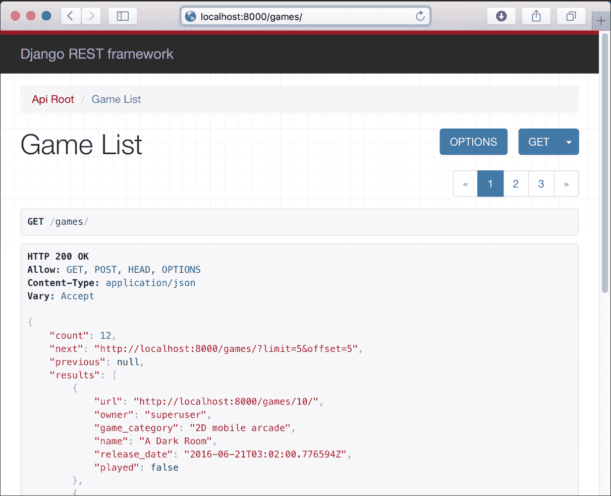

# 第三章. 使用 Django 改进和添加身份验证到 API

在本章中，我们将改进上一章开始构建的 RESTful API，并为其添加与身份验证相关的安全功能。我们将：

+   为模型添加唯一约束

+   使用 `PATCH` 方法更新资源的单个字段

+   利用分页功能

+   自定义分页类

+   理解身份验证、权限和节流

+   将安全相关数据添加到模型中

+   为对象级权限创建自定义权限类

+   持久化发起请求的用户

+   配置权限策略

+   在迁移中为新的必填字段设置默认值

+   使用必要的身份验证来组合请求

+   使用身份验证凭据浏览 API

# 为模型添加唯一约束

我们的 API 存在一些需要解决的问题。目前，可以创建许多具有相同名称的游戏类别。我们不应该能够这样做，因此，我们将对 `GameCategory` 模型进行必要的更改，以在 `name` 字段上添加唯一约束。我们还将为 `Game` 和 `Player` 模型的 `name` 字段添加唯一约束。这样，我们将学习必要的步骤来更改多个模型的约束，并通过迁移在底层数据库中反映这些更改。

确保您已退出 Django 的开发服务器。请记住，您只需在运行它的终端或命令提示符窗口中按 ***Ctrl* + *C*** 即可。现在，我们将进行更改，为用于表示和持久化游戏类别、游戏和玩家的模型引入对名称字段的唯一约束。打开 `games/models.py` 文件，将声明 `GameCategory`、`Game` 和 `Player` 类的代码替换为以下代码。代码列表中突出显示的三个行发生了变化。`PlayerScore` 类的代码保持不变。示例代码文件包含在 `restful_python_chapter_03_01` 文件夹中，如下所示：

```py
class GameCategory(models.Model): 
    name = models.CharField(max_length=200, unique=True) 

    class Meta: 
        ordering = ('name',) 

    def __str__(self): 
        return self.name 

class Game(models.Model): 
    created = models.DateTimeField(auto_now_add=True) 
    name = models.CharField(max_length=200, unique=True) 
    game_category = models.ForeignKey( 
        GameCategory,  
        related_name='games',  
        on_delete=models.CASCADE) 
    release_date = models.DateTimeField() 
    played = models.BooleanField(default=False) 

    class Meta: 
        ordering = ('name',) 

    def __str__(self): 
        return self.name 

class Player(models.Model): 
    MALE = 'M' 
    FEMALE = 'F' 
    GENDER_CHOICES = ( 
        (MALE, 'Male'), 
        (FEMALE, 'Female'), 
    ) 
    created = models.DateTimeField(auto_now_add=True) 
    name = models.CharField(max_length=50, blank=False, default='', unique=True) 
    gender = models.CharField( 
        max_length=2, 
        choices=GENDER_CHOICES, 
        default=MALE, 
    ) 

    class Meta: 
        ordering = ('name',) 

    def __str__(self): 
        return self.name 

```

我们只需要将 `unique=True` 作为 `models.CharField` 的命名参数之一添加。这样，我们表明该字段必须是唯一的，Django 将为底层数据库表中的字段创建必要的唯一约束。

现在，运行以下 Python 脚本来生成迁移，这将允许我们同步数据库，以与我们在模型字段中添加的唯一约束保持一致：

```py
python manage.py makemigrations games

```

以下行显示了运行上一条命令后生成的输出：

```py
Migrations for 'games':
 0002_auto_20160623_2131.py:
 - Alter field name on game
 - Alter field name on gamecategory
 - Alter field name on player

```

输出表明`gamesapi/games/migrations/0002_auto_20160623_2131.py`文件包含了更改`game`、`gamecategory`和`player`上名为`name`的字段的代码。请注意，由于它包含编码的日期和时间，生成的文件名在您的配置中可能会有所不同。以下行显示了此文件的代码，该代码由 Django 自动生成。示例的代码文件包含在`restful_python_chapter_03_01`文件夹中：

```py
# -*- coding: utf-8 -*- 
# Generated by Django 1.9.7 on 2016-06-23 21:31 
from __future__ import unicode_literals 

from django.db import migrations, models 

class Migration(migrations.Migration): 

    dependencies = [ 
        ('games', '0001_initial'), 
    ] 

    operations = [ 
        migrations.AlterField( 
            model_name='game', 
            name='name', 
            field=models.CharField(max_length=200, unique=True), 
        ), 
        migrations.AlterField( 
            model_name='gamecategory', 
            name='name', 
            field=models.CharField(max_length=200, unique=True), 
        ), 
        migrations.AlterField( 
            model_name='player', 
            name='name', 
            field=models.CharField(default='', max_length=50, unique=True), 
        ), 
    ] 

```

代码定义了一个名为`Migration`的`django.db.migrations.Migration`类的子类，该类定义了一个包含许多`migrations.AlterField`的`operations`列表。每个`migrations.AlterField`将更改相关模型中每个相关表的字段。

现在，运行以下 Python 脚本来应用所有生成的迁移并在数据库表中执行更改：

```py
python manage.py migrate

```

以下行显示了运行上述命令后生成的输出。请注意，迁移的顺序在您的配置中可能会有所不同。

```py
Operations to perform:
Operations to perform:
 Apply all migrations: admin, auth, contenttypes, games, sessions
Running migrations:
 Rendering model states... DONE
 Applying games.0002_auto_20160623_2131... OK

```

在我们运行前面的命令之后，我们将在 PostgreSQL 数据库的`games_game`、`games_gamecategory`和`games_player`表上的`name`字段上拥有唯一的索引。我们可以使用 PostgreSQL 命令行或任何允许我们轻松检查 PostreSQL 数据库内容的其他应用程序来检查 Django 更新的表。如果您决定继续使用 SQLite，请使用与此数据库相关的命令或工具。

现在，我们可以启动 Django 的开发服务器来编写和发送 HTTP 请求。根据您的需求执行以下两个命令之一，以在其他连接到您的局域网的其他设备或计算机上访问 API。请记住，我们在第一章中分析了它们之间的区别：*使用 Django 开发 RESTful API：*

```py
python manage.py runserver
python manage.py runserver 0.0.0.0:8000

```

在我们运行上述任何命令之后，开发服务器将开始监听端口`8000`。

现在，我们将编写并发送一个 HTTP 请求来创建一个名为`'3D RPG'`的游戏类别：

```py
http POST :8000/game-categories/ name='3D RPG'

```

以下是对应的`curl`命令：

```py
curl -iX POST -H "Content-Type: application/json" -d '{"name":"3D RPG"}'
    :8000/game-categories/

```

Django 无法持久化`GameCategory`实例，其实例的`name`等于指定的值，因为这会违反添加到`name`字段的唯一约束。因此，我们将在响应头中收到`400 Bad Request`状态码，并在 JSON 正文中收到与`name`指定的值相关的消息。以下行显示了示例响应：

```py
HTTP/1.0 400 Bad Request
Allow: GET, POST, HEAD, OPTIONS
Content-Type: application/json
Date: Sun, 26 Jun 2016 03:37:05 GMT
Server: WSGIServer/0.2 CPython/3.5.1
Vary: Accept, Cookie
X-Frame-Options: SAMEORIGIN
{
 "name": [
 "GameCategory with this name already exists."
 ]
}

```

在我们进行了更改之后，我们无法在游戏类别、游戏或玩家中为`name`字段添加重复的值。这样，我们可以确保每次我们指定这些资源的名称时，我们都会引用相同的唯一资源。

# 使用 PATCH 方法更新资源的单个字段

正如我们在第二章中解释的那样，*在 Django 中使用基于类的视图和超链接 API*，我们的 API 可以更新现有资源的单个字段，因此，我们提供了一个`PATCH`方法的实现。例如，我们可以使用`PATCH`方法来更新一个现有的游戏，并将它的`played`字段的值设置为`true`。我们不希望使用`PUT`方法，因为这个方法旨在替换整个游戏。`PATCH`方法旨在将增量应用到现有游戏上，因此，它是仅更改`played`字段值的适当方法。

现在，我们将组合并发送一个 HTTP 请求来更新一个现有的游戏，具体来说，是更新`played`字段的值并将其设置为`true`，因为我们只想更新单个字段，所以我们将使用`PATCH`方法而不是`PUT`。确保将`2`替换为您配置中现有游戏的 id 或主键：

```py
http PATCH :8000/games/2/ played=true

```

以下是对应的`curl`命令：

```py
curl -iX PATCH -H "Content-Type: application/json" -d '{"played":"true"}'
    :8000/games/2/

```

前面的命令将组合并发送一个带有指定 JSON 键值对的`PATCH` HTTP 请求。请求在`/games/`之后有一个数字，因此，它将匹配`'^games/(?P<pk>[0-9]+)/$'`并运行`views.GameDetail`基于类的视图的`patch`方法。请记住，该方法是在`RetrieveUpdateDestroyAPIView`超类中定义的，并且最终会调用在`mixins.UpdateModelMixin`中定义的`update`方法。如果具有更新`played`字段值的`Game`实例有效并且已成功持久化到数据库中，对该方法的调用将返回`200 OK`状态码，并将最近更新的`Game`序列化为 JSON 格式放在响应体中。以下行显示了示例响应：

```py
HTTP/1.0 200 OK
Allow: GET, PUT, PATCH, DELETE, HEAD, OPTIONS
Content-Type: application/json
Date: Sun, 26 Jun 2016 04:09:22 GMT
Server: WSGIServer/0.2 CPython/3.5.1
Vary: Accept, Cookie
X-Frame-Options: SAMEORIGIN
{
 "game_category": "3D RPG", 
 "name": "PvZ Garden Warfare 4", 
 "played": true, 
 "release_date": "2016-06-21T03:02:00.776594Z", 
 "url": "http://localhost:8000/games/2/"
}

```

# 利用分页功能

我们的数据库在每个表中都有几行，用于持久化我们定义的模型。然而，在我们开始在现实生活中的生产环境中使用我们的 API 之后，我们将有数千个玩家得分、玩家、游戏和游戏类别，因此，我们将不得不处理大量结果集。我们可以利用 Django REST Framework 中可用的分页功能，使其容易指定我们希望如何将大量结果集拆分为单个数据页。

首先，我们将组合并发送 HTTP 请求来创建属于我们创建的某个类别（例如`2D mobile arcade`）的 10 个游戏。这样，我们将有总共 12 个游戏持久保存在数据库中。我们原本有 2 个游戏，并将再添加 10 个：

```py
http POST :8000/games/ name='Tetris Reloaded' game_category='2D mobile arcade' played=false release_date='2016-06-21T03:02:00.776594Z'
http POST :8000/games/ name='Puzzle Craft' game_category='2D mobile arcade' played=false release_date='2016-06-21T03:02:00.776594Z'
http POST :8000/games/ name='Blek' game_category='2D mobile arcade' played=false release_date='2016-06-21T03:02:00.776594Z'
http POST :8000/games/ name='Scribblenauts Unlimited' game_category='2D mobile arcade' played=false release_date='2016-06-21T03:02:00.776594Z'
http POST :8000/games/ name='Cut the Rope: Magic' game_category='2D mobile arcade' played=false release_date='2016-06-21T03:02:00.776594Z'
http POST :8000/games/ name='Tiny Dice Dungeon' game_category='2D mobile arcade' played=false release_date='2016-06-21T03:02:00.776594Z'
http POST :8000/games/ name='A Dark Room' game_category='2D mobile arcade' played=false release_date='2016-06-21T03:02:00.776594Z'
http POST :8000/games/ name='Bastion' game_category='2D mobile arcade' played=false release_date='2016-06-21T03:02:00.776594Z'
http POST :8000/games/ name='Welcome to the Dungeon' game_category='2D mobile arcade' played=false release_date='2016-06-21T03:02:00.776594Z'
http POST :8000/games/ name='Dust: An Elysian Tail' game_category='2D mobile arcade' played=false release_date='2016-06-21T03:02:00.776594Z'

```

以下是对应的`curl`命令：

```py
curl -iX POST -H "Content-Type: application/json" -d '{"name":"Tetris Reloaded", "game_category":"2D mobile arcade", "played": "false", "release_date": "2016-06-21T03:02:00.776594Z"}' :8000/games/
curl -iX POST -H "Content-Type: application/json" -d '{"name":"Puzzle Craft", "game_category":"2D mobile arcade", "played": "false", "release_date": "2016-06-21T03:02:00.776594Z"}' :8000/games/
curl -iX POST -H "Content-Type: application/json" -d '{"name":"Blek", "game_category":"2D mobile arcade", "played": "false", "release_date": "2016-06-21T03:02:00.776594Z"}' :8000/games/
curl -iX POST -H "Content-Type: application/json" -d '{"name":"Scribblenauts Unlimited", "game_category":"2D mobile arcade", "played": "false", "release_date": "2016-06-21T03:02:00.776594Z"}' :8000/games/
curl -iX POST -H "Content-Type: application/json" -d '{"name":"Cut the Rope: Magic", "game_category":"2D mobile arcade", "played": "false", "release_date": "2016-06-21T03:02:00.776594Z"}' :8000/games/
curl -iX POST -H "Content-Type: application/json" -d '{"name":"Tiny Dice Dungeon", "game_category":"2D mobile arcade", "played": "false", "release_date": "2016-06-21T03:02:00.776594Z"}' :8000/games/
curl -iX POST -H "Content-Type: application/json" -d '{"name":"A Dark Room", "game_category":"2D mobile arcade", "played": "false", "release_date": "2016-06-21T03:02:00.776594Z"}' :8000/games/
curl -iX POST -H "Content-Type: application/json" -d '{"name":"Bastion", "game_category":"2D mobile arcade", "played": "false", "release_date": "2016-06-21T03:02:00.776594Z"}' :8000/games/
curl -iX POST -H "Content-Type: application/json" -d '{"name":"Welcome to the Dungeon", "game_category":"2D mobile arcade", "played": "false", "release_date": "2016-06-21T03:02:00.776594Z"}' :8000/games/
curl -iX POST -H "Content-Type: application/json" -d '{"name":"Dust: An Elysian Tail", "game_category":"2D mobile arcade", "played": "false", "release_date": "2016-06-21T03:02:00.776594Z"}' :8000/games/

```

前面的命令将组合并发送十个带有指定 JSON 键值对的`POST` HTTP 请求。请求指定`/games/`，因此，它将匹配`'^games/$'`并运行`views.GameList`基于类的视图的`post`方法。

现在，我们的数据库中有 12 场比赛。然而，当我们向`/games/`发送一个`GET` HTTP 请求来组合和发送时，我们不想检索这 12 场比赛。我们将配置 Django REST Framework 中包含的可定制的分页样式之一，以在每个数据页面上包含最多五个资源。

### 提示

我们的 API 使用与可以处理分页响应的混合类一起工作的通用视图，因此，它们将自动考虑我们在 Django REST Framework 中配置的分页设置。

打开`gamesapi/settings.py`文件，并添加以下行，声明一个名为`REST_FRAMEWORK`的字典，其中包含配置全局分页设置的键值对。示例代码文件包含在`restful_python_chapter_03_02`文件夹中：

```py
REST_FRAMEWORK = { 
    'DEFAULT_PAGINATION_CLASS': 
    'rest_framework.pagination.LimitOffsetPagination', 
    'PAGE_SIZE': 5 
} 

```

`DEFAULT_PAGINATION_CLASS`设置键的值指定了一个全局设置，即通用视图将使用的默认分页类，以提供分页响应。在这种情况下，我们将使用`rest_framework.pagination.LimitOffsetPagination`类，它提供基于限制/偏移的分页样式。这种分页样式与`limit`一起工作，表示要返回的最大项目数，以及指定查询起始位置的`offset`。`PAGE_SIZE`设置键的值指定了一个全局设置，即`limit`的默认值，也称为页面大小。我们可以在执行 HTTP 请求时指定不同的限制值，通过在`limit`查询参数中指定所需的值。我们可以配置类以具有最大的`limit`值，以避免不希望的大结果集。

现在，我们将组合并发送一个 HTTP 请求来检索所有比赛，具体来说，是以下 HTTP `GET`方法到`/games/`：

```py
http GET :8000/games/

```

以下是对应的`curl`命令：

```py
curl -iX GET :8000/games/

```

通用视图将使用我们添加的新设置来启用偏移/限制分页，并且结果将为我们提供前 5 个游戏资源（`results`键），查询的游戏总数（`count`键），以及指向下一页（`next`键）和上一页（`previous`键）的链接。在这种情况下，结果集是第一页，因此，上一页的链接（previous `key`）是`null`。我们将在响应头中收到`200 OK`状态码，以及`results`数组中的 5 场比赛：

```py
HTTP/1.0 200 OK
Allow: GET, POST, HEAD, OPTIONS
Content-Type: application/json
Date: Fri, 01 Jul 2016 00:57:55 GMT
Server: WSGIServer/0.2 CPython/3.5.1
Vary: Accept, Cookie
X-Frame-Options: SAMEORIGIN
{
 "count": 12, 
 "next": "http://localhost:8000/games/?limit=5&offset=5", 
 "previous": null, 
 "results": [
 {
 "game_category": "2D mobile arcade", 
 "name": "A Dark Room", 
 "played": false, 
 "release_date": "2016-06-21T03:02:00.776594Z", 
 "url": "http://localhost:8000/games/10/"
 }, 
 {
 "game_category": "2D mobile arcade", 
 "name": "Bastion", 
 "played": false, 
 "release_date": "2016-06-21T03:02:00.776594Z", 
 "url": "http://localhost:8000/games/11/"
 }, 
 {
 "game_category": "2D mobile arcade", 
 "name": "Blek", 
 "played": false, 
 "release_date": "2016-06-21T03:02:00.776594Z", 
 "url": "http://localhost:8000/games/6/"
 }, 
 {
 "game_category": "2D mobile arcade", 
 "name": "Cut the Rope: Magic", 
 "played": false, 
 "release_date": "2016-06-21T03:02:00.776594Z", 
 "url": "http://localhost:8000/games/8/"
 }, 
 {
 "game_category": "2D mobile arcade", 
 "name": "Dust: An Elysian Tail", 
 "played": false, 
 "release_date": "2016-06-21T03:02:00.776594Z", 
 "url": "http://localhost:8000/games/13/"
 }
 ]
}

```

在前面的 HTTP 请求中，我们没有指定限制或偏移参数的任何值。然而，由于我们在全局设置中指定了默认的限制值为 5 项，通用视图使用此配置值并为我们提供第一页。如果我们通过指定偏移值为`1`来组合并发送以下 HTTP 请求以检索所有游戏的首页，API 将提供之前显示的相同结果：

```py
http GET ':8000/games/?offset=0'

```

以下是对应的`curl`命令：

```py
curl -iX GET ':8000/games/?offset=0'

```

如果我们编写并发送以下 HTTP 请求以通过将偏移量值指定为 0 和限制值指定为 5 来检索所有游戏的首页，API 也将提供与前面所示相同的相同结果：

```py
http GET ':8000/games/?limit=5&offset=0'

```

以下是对应的 curl 命令：

```py
curl -iX GET ':8000/games/?limit=5&offset=0'

```

现在，我们将编写并发送一个 HTTP 请求以检索下一页，即游戏的第二页，具体是一个到 `/games/` 的 HTTP `GET` 方法，并将 `offset` 值设置为 `5`。请记住，前一个结果 JSON 体的 `next` 键返回的值为我们提供了下一页的 URL：

```py
http GET ':8000/games/?limit=5&offset=5'

```

以下是对应的 `curl` 命令：

```py
curl -iX GET ':8000/games/?limit=5&offset=5'

```

结果将为我们提供第 5 个游戏资源集（`results` 键），查询到的游戏总数（`count` 键），以及指向下一页（`next` 键）和上一页（`previous` 键）的链接。在这种情况下，结果集是第二页，因此，指向上一页的链接（`previous` 键）是 `http://localhost:8000/games/?limit=5`。我们将在响应头中收到 `200 OK` 状态码，并在 `results` 数组中收到 5 个游戏：

```py
HTTP/1.0 200 OK
Allow: GET, POST, HEAD, OPTIONS
Content-Type: application/json
Date: Fri, 01 Jul 2016 01:25:10 GMT
Server: WSGIServer/0.2 CPython/3.5.1
Vary: Accept, Cookie
X-Frame-Options: SAMEORIGIN
{
 "count": 12, 
 "next": "http://localhost:8000/games/?limit=5&offset=10", 
 "previous": "http://localhost:8000/games/?limit=5", 
 "results": [
 {
 "game_category": "2D mobile arcade", 
 "name": "Puzzle Craft", 
 "played": false, 
 "release_date": "2016-06-21T03:02:00.776594Z", 
 "url": "http://localhost:8000/games/5/"
 }, 
 {
 "game_category": "3D RPG", 
 "name": "PvZ Garden Warfare 4", 
 "played": true, 
 "release_date": "2016-06-21T03:02:00.776594Z", 
 "url": "http://localhost:8000/games/2/"
 }, 
 {
 "game_category": "2D mobile arcade", 
 "name": "Scribblenauts Unlimited", 
 "played": false, 
 "release_date": "2016-06-21T03:02:00.776594Z", 
 "url": "http://localhost:8000/games/7/"
 }, 
 {
 "game_category": "3D RPG", 
 "name": "Superman vs Aquaman", 
 "played": true, 
 "release_date": "2016-06-21T03:02:00.776594Z", 
 "url": "http://localhost:8000/games/3/"
 }, 
 {
 "game_category": "2D mobile arcade", 
 "name": "Tetris Reloaded", 
 "played": false, 
 "release_date": "2016-06-21T03:02:00.776594Z", 
 "url": "http://localhost:8000/games/4/"
 }
 ]
}

```

在先前的 HTTP 请求中，我们为 `limit` 和 `offset` 参数指定了值。然而，由于我们在全局设置中将 `limit` 的默认值指定为 `5` 项，因此以下请求将产生与先前请求相同的结果：

```py
http GET ':8000/games/?offset=5'

```

以下是对应的 curl 命令：

```py
curl -iX GET ':8000/games/?offset=5'

```

最后，我们将编写并发送一个 HTTP 请求以检索最后一页，即游戏的第三页，具体是一个到 `/games/` 的 HTTP `GET` 方法，并将 `offset` 值设置为 `10`。请记住，前一个结果 JSON 体的 `next` 键返回的值为我们提供了下一页的 URL：

```py
http GET ':8000/games/?limit=5&offset=10'

```

以下是对应的 `curl` 命令：

```py
curl -iX GET ':8000/games/?limit=5&offset=10'

```

结果将为我们提供最后一个包含 2 个游戏资源（`results` 键），查询到的游戏总数（`count` 键），以及指向下一页（`next` 键）和上一页（`previous` 键）的链接。在这种情况下，结果集是最后一页，因此，指向下一页的链接（`next` 键）是 `null`。我们将在响应头中收到 `200 OK` 状态码，并在 `results` 数组中收到 2 个游戏：

```py
HTTP/1.0 200 OK
Allow: GET, POST, HEAD, OPTIONS
Content-Type: application/json
Date: Fri, 01 Jul 2016 01:28:13 GMT
Server: WSGIServer/0.2 CPython/3.5.1
Vary: Accept, Cookie
X-Frame-Options: SAMEORIGIN
{
 "count": 12, 
 "next": null, 
 "previous": "http://localhost:8000/games/?limit=5&offset=5", 
 "results": [
 {
 "game_category": "2D mobile arcade", 
 "name": "Tiny Dice Dungeon", 
 "played": false, 
 "release_date": "2016-06-21T03:02:00.776594Z", 
 "url": "http://localhost:8000/games/9/"
 }, 
 {
 "game_category": "2D mobile arcade", 
 "name": "Welcome to the Dungeon", 
 "played": false, 
 "release_date": "2016-06-21T03:02:00.776594Z", 
 "url": "http://localhost:8000/games/12/"
 }
 ]
}

```

# 自定义分页类

我们使用的`rest_framework.pagination.LimitOffsetPagination`类，用于提供分页响应，声明了一个`max_limit`类属性，默认值为`None`。此属性允许我们指定可以使用`limit`查询参数指定的最大允许限制。使用默认设置，没有限制，我们将能够处理指定`1000000`作为限制查询参数值的请求。我们绝对不希望我们的 API 能够通过单个请求生成包含一百万个玩家分数或玩家的响应。不幸的是，没有设置可以更改类分配给`max_limit`类属性的值。因此，我们将创建 Django REST Framework 提供的限制/偏移分页样式的自定义版本。

在`games`文件夹中创建一个名为`pagination.py`的新 Python 文件，并输入以下代码，该代码声明了新的`LimitOffsetPaginationWithMaxLimit`类。示例代码文件包含在`restful_python_chapter_03_03`文件夹中：

```py
from rest_framework.pagination import LimitOffsetPagination 

class LimitOffsetPaginationWithMaxLimit(LimitOffsetPagination): 
    max_limit = 10 

```

前面的行声明了`LimitOffsetPaginationWithMaxLimit`类作为`rest_framework.pagination.LimitOffsetPagination`类的子类，并覆盖了为`max_limit`类属性指定的值，将其设置为`10`。

打开`gamesapi/settings.py`文件，将指定`REST_FRAMEWORK`字典中`DEFAULT_PAGINATION_CLASS`键值的行替换为高亮显示的行。以下行显示了名为`REST_FRAMEWORK`的新字典声明。示例代码文件包含在`restful_python_chapter_03_03`文件夹中：

```py
REST_FRAMEWORK = { 
    'DEFAULT_PAGINATION_CLASS': 
    'games.pagination.LimitOffsetPaginationWithMaxLimit', 
    'PAGE_SIZE': 5 
} 

```

现在，通用视图将使用最近声明的`games.pagination.LimitOffsetPaginationWithMaxLimit`类，该类提供了一个最大`limit`值为`10`的限制/偏移分页样式。如果请求指定了大于`10`的限制值，该类将使用最大限制值，即 10，并且我们永远不会在分页响应中返回超过`10`个条目。

现在，我们将编写并发送一个 HTTP 请求来检索游戏的第一个页面，具体是一个设置`limit`值为`10000`的`/games/`的 HTTP `GET`方法：

```py
http GET ':8000/games/?limit=10000'

```

以下是对应的 curl 命令：

```py
curl -iX GET ':8000/games/?limit=10000'

```

结果将使用`10`作为限制值，而不是指示的`10000`，因为我们正在使用我们自定义的分页类。结果将提供包含 10 个游戏资源的第一个集合（`results`键），查询的游戏总数（`count`键），以及指向下一页（`next`键）和上一页（`previous`键）的链接。在这种情况下，结果集是第一页，因此，指向下一页的链接（`next`键）是`http://localhost:8000/games/?limit=10&offset=10`。我们将在响应头中收到`200 OK`状态码，并在`results`数组中收到前`10`个游戏。以下行显示了头信息和输出内容的第一行：

```py
HTTP/1.0 200 OK
Allow: GET, POST, HEAD, OPTIONS
Content-Type: application/json
Date: Fri, 01 Jul 2016 16:34:01 GMT
Server: WSGIServer/0.2 CPython/3.5.1
Vary: Accept, Cookie
X-Frame-Options: SAMEORIGIN
{
 "count": 12, 
 "next": "http://localhost:8000/games/?limit=10&offset=10", 
 "previous": null, 
 "results": [
 {

```

### 提示

配置最大限制是一个良好的实践，以避免生成巨大的响应。

打开网页浏览器并输入 `http://localhost:8000/games/`。如果您使用另一台计算机或设备运行浏览器，请将 localhost 替换为运行 Django 开发服务器的计算机的 IP 地址。可浏览的 API 将会组成并发送一个 `GET` 请求到 `/games/`，并显示其执行结果，即头部信息和 JSON 游戏列表；由于我们已配置分页，渲染的网页将包括与我们所使用的基分页类关联的默认分页模板，并在网页右上角显示可用的页码。以下截图显示了在网页浏览器中输入 URL 后渲染的网页，其中包含资源描述、**游戏列表**和三个页面。

# 理解认证、权限和限制

我们当前版本的 API 处理所有传入的请求，而不需要任何类型的认证。Django REST 框架允许我们轻松地使用不同的认证方案来识别发起请求的用户或签名请求的令牌。然后，我们可以使用这些凭证来应用权限和限制策略，这将决定请求是否必须被允许。

与其他配置类似，我们可以全局设置认证方案，并在必要时在基于类的视图或函数视图中覆盖它们。一个类列表指定了认证方案。Django REST 框架将在运行视图代码之前使用列表中指定的所有类来认证请求。如果指定了多个类，则列表中第一个成功认证的类将负责设置以下两个属性的值：

+   `request.user`: 用户模型实例。在我们的示例中，我们将使用 `django.contrib.auth.User` 类的实例，即 Django 的 `User` 实例。

+   `request.auth`: 额外的认证信息，例如认证令牌。

在成功认证后，我们可以在接收 `request` 参数的类视图方法中使用 `request.user` 属性来检索关于发起请求的用户的额外信息。

Django REST 框架在 `rest_framework.authentication` 模块中提供了以下三个认证类。它们都是 `BaseAuthentication` 类的子类：

+   `BasicAuthentication`: 提供基于用户名和密码的 HTTP Basic 认证。如果我们用于生产，我们必须确保 API 只通过 HTTPS 提供访问。

+   `SessionAuthentication`: 与 Django 的会话框架一起用于认证。

+   `TokenAuthentication`：提供基于简单令牌的身份验证。请求必须包含在 `Authorization` HTTP 头中为用户生成的令牌，令牌前缀为 `"Token "`。

首先，我们将使用 `BasicAuthentication` 和 `SessionAuthentication` 的组合。我们还可以稍后利用 `TokenAuthentication` 类。确保您已退出 Django 的开发服务器。请记住，您只需在终端或命令提示符窗口中按 ***Ctrl*** + ***C*** 即可。

打开 `gamesapi/settings.py` 文件，并将高亮显示的行添加到名为 `REST_FRAMEWORK` 的字典中，以键值对的形式配置全局默认身份验证类。示例代码文件包含在 `restful_python_chapter_03_04` 文件夹中，如下所示：

```py
REST_FRAMEWORK = { 
    'DEFAULT_PAGINATION_CLASS': 
    'games.pagination.LimitOffsetPaginationWithMaxLimit', 
    'PAGE_SIZE': 5, 
    'DEFAULT_AUTHENTICATION_CLASSES': ( 
        'rest_framework.authentication.BasicAuthentication', 
        'rest_framework.authentication.SessionAuthentication', 
        ) 
} 

```

`DEFAULT_AUTHENTICATION_CLASSES` 设置键的值指定了一个全局设置，它是一个字符串元组，其值指示我们想要用于身份验证的类。

权限使用 `request.user` 和 `request.auth` 属性中包含的认证信息来确定是否应授予或拒绝请求访问。权限允许我们控制哪些用户类别将被授予或拒绝访问我们 API 的不同功能或部分。

例如，我们将使用 Django REST framework 中的权限功能，允许经过身份验证的用户创建游戏。未经身份验证的用户将仅被允许对游戏进行只读访问。只有创建游戏的用户才能对其进行更改，因此，我们将在我们的 API 中进行必要的更改，使游戏具有所有者用户。我们将使用预定义的权限类和自定义权限类来定义所解释的权限策略。

限制也决定了请求是否必须被授权。限制控制用户对我们 API 发出请求的速率。例如，我们希望限制未经身份验证的用户每小时最多请求 5 次。我们希望限制经过身份验证的用户每天对游戏相关视图的请求最多为 20 次。

# 将安全相关数据添加到模型中

我们将把一个游戏与创建者或所有者关联起来。只有经过身份验证的用户才能创建新游戏。只有游戏的创建者才能更新或删除它。所有未经身份验证的请求都只能对游戏进行只读访问。

打开 `games/models.py` 文件，并用以下代码替换声明 `Game` 类的代码。代码列表中更改的行被高亮显示。示例代码文件包含在 `restful_python_chapter_03_04` 文件夹中。

```py
class Game(models.Model): 
    owner = models.ForeignKey( 
        'auth.User',  
        related_name='games', 
        on_delete=models.CASCADE) 
    created = models.DateTimeField(auto_now_add=True) 
    name = models.CharField(max_length=200, unique=True) 
    game_category = models.ForeignKey( 
        GameCategory,  
        related_name='games',  
        on_delete=models.CASCADE) 
    release_date = models.DateTimeField() 
    played = models.BooleanField(default=False) 

    class Meta: 
        ordering = ('name',) 

    def __str__(self): 
        return self.name 

```

`Game` 模型声明了一个新的 `owner` 字段，该字段使用 `django.db.models.ForeignKey` 类来提供与 `auth.User` 模型的多对一关系，具体来说，是与 `django.contrib.auth.User` 模型。这个 `User` 模型代表 Django 认证系统中的用户。为 `related_name` 参数指定的 `'games'` 值创建了一个从 `User` 模型到 `Game` 模型的反向关系。这个值表示从相关的 `User` 对象回指到 `Game` 对象时要使用的名称。这样，我们将能够访问特定用户拥有的所有游戏。每当我们要删除一个用户时，我们希望删除该用户拥有的所有游戏，因此，我们为 `on_delete` 参数指定了 `models.CASCADE` 值。

现在，我们将运行 `manage.py` 的 `createsuperuser` 子命令来创建 Django 的 `superuser`，我们将使用它来轻松地验证我们的请求。我们将在稍后创建更多用户：

```py
python manage.py createsuperuser

```

命令将要求你输入用于 `superuser` 的 `username`。输入你想要的用户名并按 **Enter**。在这个例子中，我们将使用 `superuser` 作为用户名。你将看到类似以下的一行：

```py
Username (leave blank to use 'gaston'):

```

然后，命令将要求你输入电子邮件地址。输入一个电子邮件地址并按 *Enter*：

```py
Email address:

```

最后，命令将要求你输入新超级用户的密码。输入你想要的密码并按 *Enter*。

```py
Password:

```

命令将要求你再次输入密码。输入它并按 *Enter*。如果输入的两个密码匹配，超级用户将被创建：

```py
Password (again): 
Superuser created successfully.

```

现在，转到 `gamesapi/games` 文件夹并打开 `serializers.py` 文件。在声明导入的最后一行之后，在 `GameCategorySerializer` 类声明之前添加以下代码。示例代码文件包含在 `restful_python_chapter_03_04` 文件夹中：

```py
from django.contrib.auth.models import User 

class UserGameSerializer(serializers.HyperlinkedModelSerializer): 
    class Meta: 
        model = Game 
        fields = ( 
            'url', 
            'name') 

class UserSerializer(serializers.HyperlinkedModelSerializer): 
    games = UserGameSerializer(many=True, read_only=True) 

    class Meta: 
        model = User 
        fields = ( 
            'url',  
            'pk', 
            'username', 
            'games') 

```

`UserGameSerializer` 类是 `HyperlinkedModelSerializer` 类的子类。我们使用这个新的序列化器类来序列化与用户相关的游戏。这个类声明了一个 `Meta` 内部类，该类声明了两个属性：`model` 和 `fields`。`model` 属性指定了与序列化器相关的模型，即 `Game` 类。`fields` 属性指定了一个字符串值的元组，其值表示我们想要在序列化中包含的相关模型的字段名称。我们只想包含 URL 和游戏名称，因此，代码将 `'url'` 和 `'name'` 作为元组的成员。我们不想使用 `GameSerializer` 序列化器类来序列化与用户相关的游戏，因为我们想序列化更少的字段，因此，我们创建了 `UserGameSerializer` 类。

`UserSerializer`类是`HyperlinkedModelSerializer`类的子类。这个类声明了一个`Meta`内部类，该类声明了两个属性-`model`和`fields`。`model`属性指定了与序列化器相关的模型，即`django.contrib.auth.models.User`类。

`UserSerializer`类声明了一个`games`属性，它是一个之前解释过的`UserGameSerializer`的实例，其中`many`和`read_only`等于`True`，因为这是一个一对多关系，并且是只读的。我们使用`games`名称，我们在将`owner`字段作为`models.ForeignKey`实例添加到`Game`模型时指定的`related_name`字符串值。这样，`games`字段将为我们提供属于用户的每个游戏的 URL 和名称数组。

我们将对`gamesapi/games`文件夹中的`serializers.py`文件进行更多修改。我们将在现有的`GameSerializer`类中添加一个`owner`字段。以下行显示了`GameSerializer`类的新代码。新行被突出显示。示例的代码文件包含在`restful_python_chapter_03_04`文件夹中：

```py
class GameSerializer(serializers.HyperlinkedModelSerializer): 
    # We just want to display the owner username (read-only) 
    owner = serializers.ReadOnlyField(source='owner.username') 
    # We want to display the game cagory's name instead of the id 
    game_category = serializers.SlugRelatedField(queryset=GameCategory.objects.all(), slug_field='name') 

    class Meta: 
        model = Game 
        depth = 4 
        fields = ( 
                'url', 
                'owner', 
                'game_category', 
                'name', 
                'release_date', 
                'played') 

```

现在，`GameSerializer`类声明了一个`owner`属性，它是一个`serializers.ReadOnlyField`的实例，其`source`等于`'owner.username'`。这样，我们将序列化相关`django.contrib.auth.User`类中`owner`字段持有的`username`字段的值。我们使用`ReadOnlyField`是因为当认证用户创建游戏时，所有者会自动填充，因此，在创建游戏后不可能更改所有者。这样，`owner`字段将为我们提供创建游戏的用户名。此外，我们还向字段字符串元组中添加了`'owner'`。

# 为对象级权限创建自定义权限类

在`games`文件夹中创建一个名为`permissions.py`的新 Python 文件，并输入以下代码，该代码声明了新的`IsOwnerOrReadOnly`类。示例的代码文件包含在`restful_python_chapter_03_04`文件夹中：

```py
from rest_framework import permissions 

class IsOwnerOrReadOnly(permissions.BasePermission): 
    def has_object_permission(self, request, view, obj): 
        if request.method in permissions.SAFE_METHODS: 
            return True 
        else: 
            return obj.owner == request.user 

```

`rest_framework.permissions.BasePermission`类是所有权限类应该继承的基础类。前面的行声明了`IsOwnerOrReadOnly`类作为`BasePermission`类的子类，并覆盖了在超类中定义的`has_object_permission`方法，该方法返回一个`bool`值，指示是否应该授予权限。如果请求中指定的 HTTP 动词（`request.method`）是`permission.SAFE_METHODS`（`GET`、`HEAD`或`OPTIONS`）中指定的三个安全方法之一，则`has_object_permission`方法返回`True`并授予请求权限。这些 HTTP 动词不会更改相关资源，因此它们包含在字符串元组`permissions.SAFE_METHODS`中。

如果请求中指定的 HTTP 动词（`request.method`）不是三种安全方法中的任何一种，代码返回`True`，并且只有当接收到的`obj`（`obj.owner`）的`owner`属性与创建请求的用户（`request.user`）匹配时，才授予权限。这样，只有相关资源的所有者才会被授予包含非安全 HTTP 动词的请求的权限。

我们将使用新的`IsOwnerOrReadOnly`权限类来确保只有游戏的所有者才能修改现有的游戏。我们将此权限类与`rest_framework.permissions.IsAuthenticatedOrReadOnly`权限类结合使用，后者在请求未以用户身份认证时只允许对资源进行只读访问。

# 持续请求的用户

我们希望能够列出所有用户并检索单个用户的详细信息。我们将创建`rest_framework.generics`中声明的两个通用类视图的子类：

+   `ListAPIView`：实现`get`方法，用于检索查询集的列表

+   `RetrieveAPIView`：实现`get`方法，用于检索模型实例

前往`gamesapi/games`文件夹，打开`views.py`文件。在声明导入的最后一行之后，在`GameCategoryList`类声明之前添加以下代码。示例的代码文件包含在`restful_python_chapter_03_04`文件夹中：

```py
from django.contrib.auth.models import User 
from games.serializers import UserSerializer 
from rest_framework import permissions 
from games.permissions import IsOwnerOrReadOnly 

class UserList(generics.ListAPIView): 
    queryset = User.objects.all() 
    serializer_class = UserSerializer 
    name = 'user-list' 

class UserDetail(generics.RetrieveAPIView): 
    queryset = User.objects.all() 
    serializer_class = UserSerializer 
    name = 'user-detail' 

```

将以下高亮显示的行添加到`views.py`文件中声明的`ApiRoot`类。现在，我们能够通过可浏览的 API 导航到与用户相关的视图。示例的代码文件包含在`restful_python_chapter_03_04`文件夹中。

```py
class ApiRoot(generics.GenericAPIView): 
    name = 'api-root' 
    def get(self, request, *args, **kwargs): 
        return Response({ 
            'players': reverse(PlayerList.name, request=request), 
            'game-categories': reverse(GameCategoryList.name, request=request), 
            'games': reverse(GameList.name, request=request), 
            'scores': reverse(PlayerScoreList.name, request=request), 
            'users': reverse(UserList.name, request=request), 
            }) 

```

前往`gamesapi/games`文件夹，打开`urls.py`文件。将以下元素添加到`urlpatterns`字符串列表中。新字符串定义了 URL 模式，该模式指定了请求中必须匹配的正则表达式，以运行在`views.py`文件中创建的基于类的视图的特定方法：`UserList`和`UserDetail`。示例的代码文件包含在`restful_python_chapter_03_04`文件夹中：

```py
    url(r'^users/$', 
        views.UserList.as_view(), 
        name=views.UserList.name), 
    url(r'^users/(?P<pk>[0-9]+)/$', 
        views.UserDetail.as_view(), 
        name=views.UserDetail.name), 

```

我们必须在`gamesapi`文件夹中的`urls.py`文件中添加一行，具体来说，是`gamesapi/urls.py`文件。该文件定义了根 URL 配置，我们希望包含 URL 模式以允许可浏览的 API 显示登录和注销视图。以下是在`gamesapi/urls.py`文件中的新代码行，新行已高亮显示。示例的代码文件包含在`restful_python_chapter_03_04`文件夹中：

```py
from django.conf.urls import url, include 

urlpatterns = [ 
    url(r'^', include('games.urls')), 
    url(r'^api-auth/', include('rest_framework.urls')) 
] 

```

我们需要对`GameList`类视图进行修改。我们将重写`perform_create`方法，在将新的`Game`实例持久化到数据库之前，先填充`owner`字段。以下是在`views.py`文件中`GameList`类的新的代码行，新行已高亮显示。示例的代码文件包含在`restful_python_chapter_03_04`文件夹中：

```py
class GameList(generics.ListCreateAPIView): 
    queryset = Game.objects.all() 
    serializer_class = GameSerializer 
    name = 'game-list' 
    def perform_create(self, serializer): 
        # Pass an additional owner field to the create method 
        # To Set the owner to the user received in the request 
        serializer.save(owner=self.request.user)

```

`GameList` 类从 `rest_framework.mixins.CreateModelMixin` 类继承了 `perform_create` 方法。请记住，`generics.ListCreateAPIView` 类也继承了 `CreateModelMixin` 类和其他类。重写的 `perform_create` 方法的代码通过为 `serializer.save` 方法的 `owner` 参数设置值，将额外的 `owner` 字段传递给创建方法。代码将所有者属性设置为 `self.request.user` 的值，即与请求关联的用户。这样，每当持久化一个新的游戏时，它都会将请求关联的用户保存为其所有者。

# 配置权限策略

现在，我们将为与游戏相关的基于类的视图配置权限策略。我们将覆盖 `GameList` 和 `GameDetail` 类的 `permission_classes` 类属性值。

以下行显示了 `views.py` 文件中 `GameList` 类的新代码。新行被突出显示。请不要删除为此类添加的 `perform_create` 方法的代码。示例的代码文件包含在 `restful_python_chapter_03_04` 文件夹中：

```py
class GameList(generics.ListCreateAPIView): 
    queryset = Game.objects.all() 
    serializer_class = GameSerializer 
    name = 'game-list' 
    permission_classes = ( 
        permissions.IsAuthenticatedOrReadOnly, 
        IsOwnerOrReadOnly, 
        )

```

以下行显示了 `views.py` 文件中 `GameDetail` 类的新代码。新行被突出显示。请不要删除为此类添加的 `perform_create` 方法的代码。示例的代码文件包含在 `restful_python_chapter_03_04` 文件夹中：

```py
class GameDetail(generics.RetrieveUpdateDestroyAPIView): 
    queryset = Game.objects.all() 
    serializer_class = GameSerializer 
    name = 'game-detail' 
    permission_classes = ( 
        permissions.IsAuthenticatedOrReadOnly, 
        IsOwnerOrReadOnly) 

```

我们在两个类中添加了相同的行。我们在 `permission_classes` 元组中包含了 `IsAuthenticatedOrReadOnly` 类和之前创建的 `IsOwnerOrReadOnly` 权限类。

# 在迁移中为新的必填字段设置默认值

我们已经在数据库中持久化了许多游戏，并为游戏添加了一个新的必填字段 `owner`。我们不想删除所有现有游戏，因此我们将利用 Django 中的一些功能，这些功能使我们能够在不丢失现有数据的情况下轻松地在底层数据库中做出更改。

现在，我们需要检索我们创建的 `superuser` 的 `id`，以便将其用作现有游戏的默认所有者。Django 将允许我们轻松地更新现有游戏，为它们设置所有者用户。

运行以下命令以从 `auth_user` 表中检索 `id`，该行的用户名为 `'superuser'`。将 `superuser` 替换为之前创建的超级用户的用户名。此外，将命令中的 `user_name` 替换为您用于创建 PostgreSQL 数据库的用户名，将 `password` 替换为您为该数据库用户选择的密码。该命令假设您在运行命令的同一台计算机上运行 PostgreSQL。如果您正在使用 SQLite 数据库，您可以在 PostgreSQL 命令行或基于 GUI 的工具中运行等效命令以执行相同的查询。

```py
psql --username=user_name --dbname=games --command="SELECT id FROM auth_user WHERE username = 'superuser';"

```

以下行显示了带有 `id` 值的输出：1

```py
id 
----
 1
(1 row)

```

现在，运行以下 Python 脚本来生成迁移，这将允许我们同步数据库与添加到 Game 模型的新字段：

```py
python manage.py makemigrations games

```

Django 将显示以下问题：

```py
You are trying to add a non-nullable field 'owner' to game without a default; we can't do that (the database needs something to populate existing rows).
Please select a fix:
 1) Provide a one-off default now (will be set on all existing rows)
 2) Quit, and let me add a default in models.py
Select an option: 

```

我们希望提供一个一次性默认值，该值将设置在所有现有行上，因此输入 `1` 以选择第一个选项并按 ***Enter*** 键。

Django 将显示以下文本，要求我们输入默认值：

```py
Please enter the default value now, as valid Python
The datetime and django.utils.timezone modules are available, so you can do e.g. timezone.now()
>>>

```

输入之前检索到的 id 值，在我们的例子中是 `1`，然后按 Enter。以下行显示了运行前面命令后生成的输出：

```py
Migrations for 'games':
 0003_game_owner.py:
 - Add field owner to game

```

输出表明 `gamesapi/games/migrations/0003_game_owner.py` 文件包含了将名为 `owner` 的字段添加到 `game` 的代码。以下行显示了由 Django 自动生成的此文件的代码。示例代码文件包含在 `restful_python_chapter_03_04` 文件夹中：

```py
# -*- coding: utf-8 -*-
# Generated by Django 1.9.7 on 2016-07-01 21:06
from __future__ import unicode_literals
from django.conf import settings
from django.db import migrations, models
import django.db.models.deletion
class Migration(migrations.Migration):
 dependencies = [
 migrations.swappable_dependency(settings.AUTH_USER_MODEL),
 ('games', '0002_auto_20160623_2131'),
 ]
 operations = [
 migrations.AddField(
 model_name='game',
 name='owner',
 field=models.ForeignKey(default=1, on_delete=django.db.models.deletion.CASCADE, related_name='games', to=settings.AUTH_USER_MODEL),
 preserve_default=False,
 ),
 ]

```

代码声明了一个名为 `Migration` 的 `django.db.migrations.Migration` 类的子类，该类定义了一个包含 `migrations.AddField` 的 `operations` 列表，该列表将添加所有者字段到与 `game` 模型相关的表中。

现在，运行以下 Python 脚本来应用所有生成的迁移并执行数据库表中的更改：

```py
python manage.py migrate

```

以下行显示了运行前面命令后生成的输出。请注意，迁移的顺序可能因你的配置而异：

```py
Operations to perform:
 Apply all migrations: admin, auth, contenttypes, games, sessions
Running migrations:
 Rendering model states... DONE
 Applying games.0003_game_owner... OK

```

在我们运行前面的命令后，PostgreSQL 数据库中的 `games_game` 表将新增一个 `owner_id` 字段。`games_game` 表中现有的行将使用 Django 指示我们用于新 `owner_id` 字段的默认值。我们可以使用 PostgreSQL 命令行或任何其他允许我们轻松检查 PostgreSQL 数据库内容的应用程序来检查 Django 更新的 `games_game` 表。如果你决定继续使用 SQLite，请使用与此数据库相关的命令或工具。

运行以下命令以启动交互式外壳。确保你在终端或命令提示符中的 `gamesapi` 文件夹内：

```py
python manage.py shell

```

你会注意到在介绍默认 Python 交互式外壳的常规行之后，会显示一行写着（**InteractiveConsole**）。在 Python 交互式环境中输入以下代码以创建另一个非超级用户。我们将使用此用户和超级用户来测试我们的权限策略更改。示例代码文件包含在 `restful_python_chapter_03_04` 文件夹中的 `users_test_01.py` 文件中。

你可以将 `kevin` 替换为你想要的用户名，将 `kevin@eaxmple.com` 替换为电子邮件，将 `kevinpassword` 替换为你想要为此用户使用的密码。然而，请注意，我们将在以下部分使用这些凭据。确保你始终使用你自己的凭据替换这些凭据：

```py
from django.contrib.auth.models import User 
user = User.objects.create_user('kevin', 'kevin@example.com', 'kevinpassword')  
user.save() 

```

最后，通过输入以下命令退出交互式控制台：

```py
quit() 

```

现在，我们可以启动 Django 的开发服务器来编写并发送 HTTP 请求。根据您的需求执行以下两个命令之一以访问连接到您的局域网的其他设备或计算机上的 API。请记住，我们在 第一章 中分析了它们之间的区别，*使用 Django 开发 RESTful API*：

```py
python manage.py runserver
python manage.py runserver 0.0.0.0:8000

```

在运行上述任何命令之后，开发服务器将开始监听端口 `8000`。

# 编写带有必要身份验证的请求

现在，我们将编写并发送一个不包含身份验证凭据的 HTTP 请求来创建一个新的游戏：

```py
http POST :8000/games/ name='The Last of Us' game_category='3D RPG' played=false release_date='2016-06-21T03:02:00.776594Z'

```

以下是对应的 `curl` 命令：

```py
curl -iX POST -H "Content-Type: application/json" -d '{"name":"The Last of Us", "game_category":"3D RPG", "played": "false", "release_date": "2016-06-21T03:02:00.776594Z"}' :8000/games/

```

我们将在响应头中收到一个 `401 未授权` 状态码和一个详细消息，表明我们没有在 JSON 主体中提供身份验证凭据。以下是一些示例响应的行：

```py
HTTP/1.0 401 Unauthorized
Allow: GET, POST, HEAD, OPTIONS
Content-Type: application/json
Date: Sun, 03 Jul 2016 22:23:07 GMT
Server: WSGIServer/0.2 CPython/3.5.1
Vary: Accept, Cookie
WWW-Authenticate: Basic realm="api"
X-Frame-Options: SAMEORIGIN
{
 "detail": "Authentication credentials were not provided."
}

```

如果我们想要创建一个新的游戏，即向 `/games/` 发送一个 `POST` 请求，我们需要使用 HTTP 身份验证提供身份验证凭据。现在，我们将编写并发送一个包含身份验证凭据的 HTTP 请求来创建一个新的游戏，即使用 `superuser` 名称和他的密码。请记住将 `superuser` 替换为你为 `superuser` 使用的名称，将 `password` 替换为你为该用户配置的密码：

```py
http -a superuser:'password' POST :8000/games/ name='The Last of Us' game_category='3D RPG' played=false release_date='2016-06-21T03:02:00.776594Z'

```

以下是对应的 `curl` 命令：

```py
curl --user superuser:'password' -iX POST -H "Content-Type: application/json" -d '{"name":"The Last of Us", "game_category":"3D RPG", "played": "false", "release_date": "2016-06-21T03:02:00.776594Z"}' :8000/games/

```

如果以 `superuser` 用户作为其拥有者的新 `Game` 对象成功持久化到数据库中，函数将返回一个 `HTTP 201 已创建` 状态码，并将最近持久化的 `Game` 对象序列化为 JSON 格式在响应体中。以下是一些示例响应的行，其中包含 JSON 响应中的新 `Game` 对象：

```py
HTTP/1.0 201 Created
Allow: GET, POST, HEAD, OPTIONS
Content-Type: application/json
Date: Mon, 04 Jul 2016 02:45:36 GMT
Location: http://localhost:8000/games/16/
Server: WSGIServer/0.2 CPython/3.5.1
Vary: Accept
X-Frame-Options: SAMEORIGIN
{
 "game_category": "3D RPG", 
 "name": "The Last of Us", 
 "owner": "superuser", 
 "played": false, 
 "release_date": "2016-06-21T03:02:00.776594Z", 
 "url": "http://localhost:8000/games/16/"
}

```

现在，我们将编写并发送一个包含身份验证凭据的 HTTP 请求来更新之前创建的游戏的 `played` 字段值。然而，在这种情况下，我们将使用在 Django 中创建的另一个用户来对请求进行身份验证。请记住将 `kevin` 替换为您为该用户使用的名称，将 `kevinpassword` 替换为您为该用户配置的密码。此外，将 `16` 替换为您在配置中为之前创建的游戏生成的 id。我们将使用 `PATCH` 方法。

```py
http -a kevin:'kevinpassword' PATCH :8000/games/16/ played=true

```

以下是对应的 `curl` 命令：

```py
curl --user kevin:'kevinpassword' -iX PATCH -H "Content-Type: application/json" -d '{"played": "true"}' :8000/games/16/

```

我们将在响应头中收到一个 `403 禁止` 状态码和一个详细消息，表明我们没有权限在 JSON 主体中执行该操作。我们想要更新的游戏的拥有者是 `superuser`，而此请求的身份验证凭据使用的是不同的用户。因此，操作被 `IsOwnerOrReadOnly` 类中的 `has_object_permission` 方法拒绝。以下是一些示例响应的行：

```py
HTTP/1.0 403 Forbidden
Allow: GET, PUT, PATCH, DELETE, HEAD, OPTIONS
Content-Type: application/json
Date: Mon, 04 Jul 2016 02:59:15 GMT
Server: WSGIServer/0.2 CPython/3.5.1
Vary: Accept
X-Frame-Options: SAMEORIGIN
{
 "detail": "You do not have permission to perform this action."
}

```

如果我们使用相同的认证凭据，通过`GET`方法向同一资源发送 HTTP 请求，我们将能够检索到指定用户不拥有的游戏。这将会成功，因为`GET`是安全方法之一，非所有者用户被允许读取资源。请记住将`kevin`替换为你为用户使用的名称，将`kevinpassword`替换为你为该用户配置的密码。此外，将`16`替换为你配置中为之前创建的游戏生成的 ID：

```py
http -a kevin:'kevinpassword' GET :8000/games/16/

```

以下是对应的`curl`命令：

```py
curl --user kevin:'kevinpassword' -iX GET :8000/games/16/

```

# 使用认证凭据浏览 API

打开一个网络浏览器，输入`http://localhost:8000/`。如果你使用另一台计算机或设备运行浏览器，请将 localhost 替换为运行 Django 开发服务器的计算机的 IP 地址。可浏览 API 将组成并发送一个`GET`请求到`/`，并显示其执行结果，即 API 根目录。你会注意到右上角有一个**登录**超链接。

点击“登录”，浏览器将显示 Django REST 框架的登录页面。在用户名中输入`kevin`，在密码中输入`kevinpassword`，然后点击**登录**。请记住将`kevin`替换为你为用户使用的名称，将`kevinpassword`替换为你为该用户配置的密码。现在，你将作为`kevin`登录，并且你通过可浏览 API 编写的所有请求都将使用此用户。你将被重定向回**API 根目录**，你会注意到**登录**超链接被用户名（**kevin**）和一个允许你注销的下拉菜单所替换。以下截图显示了登录为`kevin`后的 API 根目录。

点击或轻触**用户**右侧的 URL。如果你在本地主机上浏览，URL 将是`http://localhost:8000/users/`。可浏览 API 将渲染**用户列表**的网页。以下行显示了`GET`请求到`localhost:8000/users/`的结果的 JSON 体。

`games`数组包含了用户拥有的每个游戏的 URL 和名称，因为`UserGameSerializer`类正在为每个游戏序列化内容：

```py
HTTP 200 OK
Allow: GET, HEAD, OPTIONS
Content-Type: application/json
Vary: Accept
{
 "count": 2,
 "next": null,
 "previous": null,
 "results": [
 {
 "url": "http://localhost:8000/users/1/",
 "pk": 1,
 "username": "superuser",
 "games": [
 {
 "url": "http://localhost:8000/games/10/",
 "name": "A Dark Room"
 },
 {
 "url": "http://localhost:8000/games/11/",
 "name": "Bastion"
 },
 ...
 ]
 },
 {
 "url": "http://localhost:8000/users/3/",
 "pk": 3,
 "username": "kevin",
 "games": []
 }
 ]
}

```

点击或轻触列表中列出的由`superuser`用户拥有的游戏之一的 URL。可浏览 API 将渲染**游戏详情**的网页。点击或轻触**OPTIONS**，**DELETE**按钮将出现。点击或轻触**DELETE**。网络浏览器将显示一个确认对话框。点击或轻触**DELETE**。我们将在响应头中收到`403 Forbidden`状态码，并在 JSON 体中收到一条表示我们没有权限执行该操作的详细消息。

我们想要删除的游戏的所有者是`superuser`，而这个请求的身份验证凭据使用了一个不同的用户，具体是`kevin`。因此，操作被`IsOwnerOrReadOnly`类中的`has_object_permission`方法拒绝。以下截图显示了示例响应：



### 小贴士

我们还可以利用 Django REST Framework 为我们提供的其他身份验证插件。您可以在[`www.django-rest-framework.org/api-guide/authentication/`](http://www.django-rest-framework.org/api-guide/authentication/)了解更多关于框架为我们提供的所有身份验证可能性。

# 测试你的知识

1.  对于现有资源更新单个字段，最合适的 HTTP 方法是什么：

    1.  `PUT`

    1.  `POST`

    1.  `PATCH`

1.  以下哪个分页类在 Django REST Framework 中提供了基于限制/偏移的样式：

    1.  `rest_framework.pagination.LimitOffsetPagination`

    1.  `rest_framework.pagination.LimitOffsetPaging`

    1.  `rest_framework.styles.LimitOffsetPagination`

1.  `rest_framework.authentication.BasicAuthentication`类：

    1.  与 Django 的会话框架一起用于身份验证。

    1.  提供基于用户名和密码的 HTTP 基本身份验证。

    1.  提供基于简单令牌的身份验证。

1.  `rest_framework.authentication.SessionAuthentication`类：

    1.  与 Django 的会话框架一起用于身份验证。

    1.  提供基于用户名和密码的 HTTP 基本身份验证。

    1.  提供基于简单令牌的身份验证。

1.  以下哪个设置键的值指定了一个全局设置，该设置是一个字符串值的元组，表示我们想要用于身份验证的类：

    1.  `DEFAULT_AUTH_CLASSES`

    1.  `AUTHENTICATION_CLASSES`

    1.  `DEFAULT_AUTHENTICATION_CLASSES`

# 摘要

在本章中，我们从多个方面改进了 REST API。我们向模型添加了唯一约束并更新了数据库，我们使使用`PATCH`方法更新单个字段变得容易，并且我们利用了分页。

然后，我们开始处理身份验证、权限和节流。我们将与模型相关的安全数据添加到数据库中，并进行了更新。我们在不同的代码片段中进行了多次更改，以实现特定的安全目标，并利用了 Django REST Framework 的身份验证和权限功能。

现在我们已经构建了一个改进且复杂的 API，它考虑了身份验证并使用了权限策略，我们将使用框架中包含的额外抽象，我们将添加节流和测试，这就是我们将在下一章中讨论的内容。
