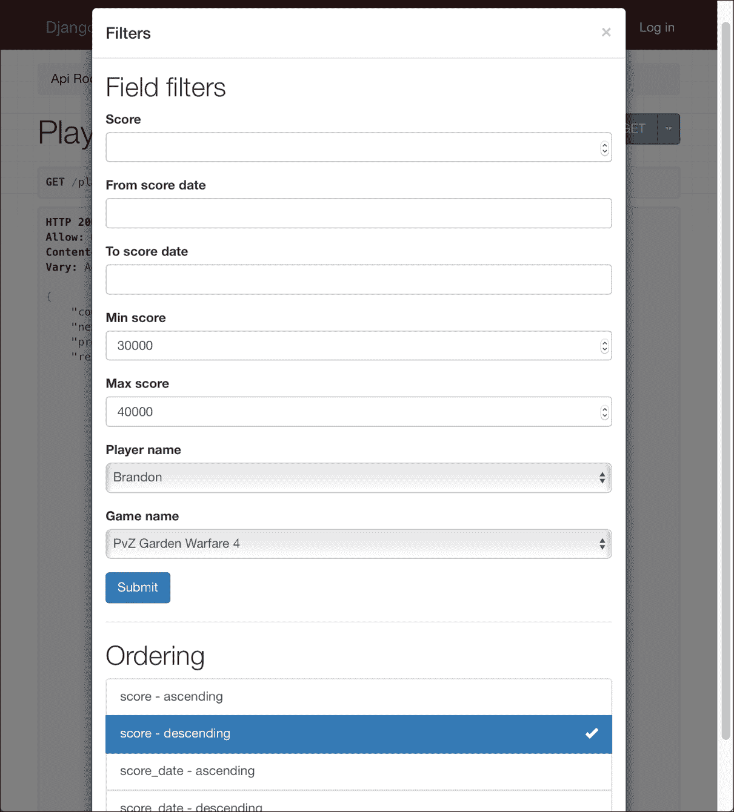
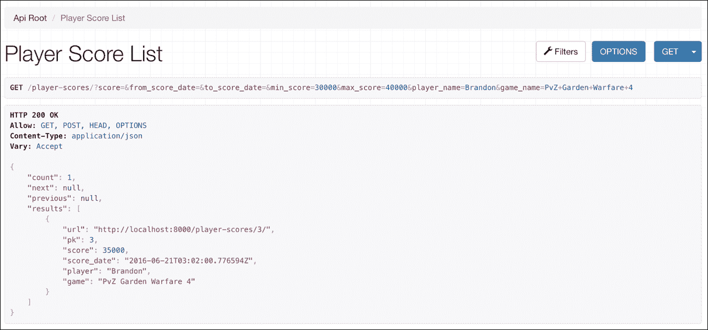
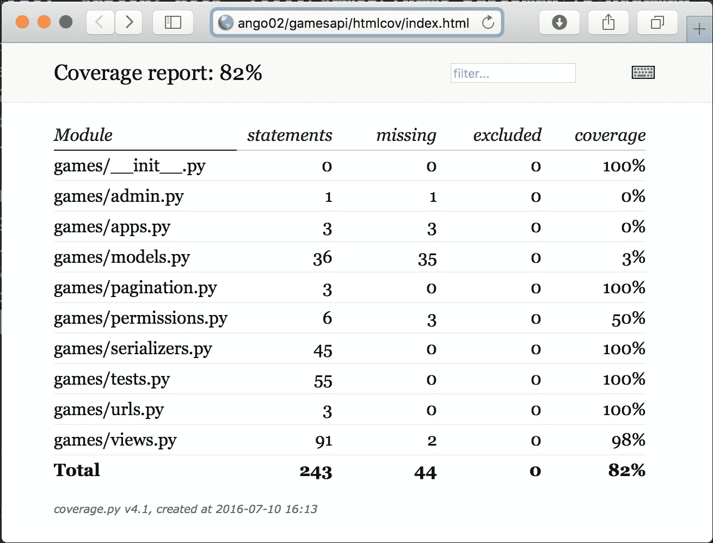
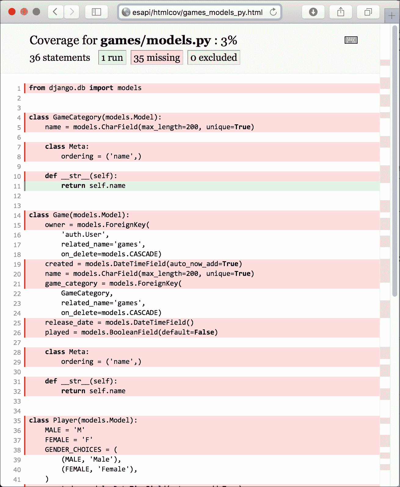

# 第四章：使用 Django 限制、过滤、测试和部署 API

在本章中，我们将使用 Django 和 Django REST Framework 中包含的附加功能来改进我们的 RESTful API。我们还将编写和执行单元测试，并学习一些与部署相关的内容。本章将涵盖以下主题：

+   理解限制类

+   配置限制策略

+   测试限制策略

+   理解过滤、搜索和排序类

+   为视图配置过滤、搜索和排序

+   测试过滤、搜索和排序功能

+   在可浏览的 API 中进行过滤、搜索和排序

+   编写第一轮单元测试

+   运行单元测试并检查测试覆盖率

+   提高测试覆盖率

+   理解部署和可扩展性的策略

# 理解限制类

到目前为止，我们还没有对我们的 API 使用设置任何限制，因此，认证用户和非认证用户都可以随意组合并发送尽可能多的请求。我们只是利用了 Django REST Framework 中可用的分页功能来指定我们希望将大量结果集拆分为单独的数据页面的方式。然而，任何用户都可以发送成千上万的请求进行处理，而没有任何限制。

我们将使用限制来配置以下 API 使用的限制：

+   **非认证用户**：每小时最多 5 个请求。

+   **认证用户**：每小时最多 20 个请求。

此外，我们希望配置每小时最多 100 个请求到游戏类别相关视图，无论用户是否认证。

Django REST Framework 在`rest_framework.throttling`模块中提供了以下三个限制类。它们都是`SimpleRateThrottle`类的子类，而`SimpleRateThrottle`类又是`BaseThrottle`类的子类。这些类允许我们根据不同的机制设置每个周期内最大请求数量，这些机制基于用于指定范围的前一个请求信息。限制的前一个请求信息存储在缓存中，并且这些类覆盖了`get_cache_key`方法，该方法确定范围。

+   `AnonRateThrottle`：此类限制了匿名用户可以发起的请求数量。请求的 IP 地址是唯一的缓存键，因此，来自同一 IP 地址的所有请求将累积总请求数量。

+   `UserRateThrottle`：此类限制了特定用户发起请求的速度。对于认证用户，认证用户 ID 是唯一的缓存键。对于匿名用户，请求的 IP 地址是唯一的缓存键。

+   `ScopedRateThrottle`：此类限制了与`throttle_scope`属性分配的值标识的 API 特定部分的请求速率。当我们需要以不同的速率限制对 API 特定部分的访问时，此类非常有用。

# 配置速率限制策略

我们将使用前面讨论的三个速率限制类的组合，以实现我们之前解释的目标。确保您退出 Django 的开发服务器。请记住，您只需在运行它的终端或命令提示符窗口中按***Ctrl*** + ***C***即可。

打开`gamesapi/settings.py`文件，并将高亮显示的行添加到名为`REST_FRAMEWORK`的字典中，包含两个键值对，用于配置全局默认的速率限制类及其速率。示例代码文件包含在`restful_python_chapter_04_01`文件夹中：

```py
REST_FRAMEWORK = { 
    'DEFAULT_PAGINATION_CLASS': 
    'games.pagination.LimitOffsetPaginationWithMaxLimit', 
    'PAGE_SIZE': 5, 
    'DEFAULT_AUTHENTICATION_CLASSES': ( 
        'rest_framework.authentication.BasicAuthentication', 
        'rest_framework.authentication.SessionAuthentication', 
        ), 
    'DEFAULT_THROTTLE_CLASSES': ( 
        'rest_framework.throttling.AnonRateThrottle', 
        'rest_framework.throttling.UserRateThrottle', 
    ), 
    'DEFAULT_THROTTLE_RATES': { 
        'anon': '5/hour', 
        'user': '20/hour', 
        'game-categories': '30/hour', 
    } 
}

```

`DEFAULT_THROTTLE_CLASSES`设置键的值指定了一个全局设置，是一个字符串值的元组，表示我们想要用于速率限制的默认类-`AnonRateThrottle`和`UserRateThrottle`。`DEFAULT_THROTTLE_RATES`设置键指定了一个包含默认速率限制的字典。对于`'anon'`键指定的值表示我们希望匿名用户每小时最多有五个请求。对于`'user'`键指定的值表示我们希望认证用户每小时最多有 20 个请求。对于`'game-categories'`键指定的值表示我们希望该名称的作用域每小时最多有 30 个请求。

最大速率是一个字符串，指定了每期的请求数量，格式如下：`'number_of_requests/period'`，其中`period`可以是以下任何一个：

+   `s`: 秒

+   `sec`: 秒

+   `m`: 分钟

+   `min`: 分钟

+   `h`: 小时

+   `hour`: 小时

+   `d`: 天

+   `day`: 天

现在，我们将为与游戏类别相关的基于类的视图配置速率限制策略。我们将覆盖`GameCategoryList`和`GameCategoryDetail`类的`throttle_scope`和`throttle_classes`类属性。首先，我们必须在`views.py`文件中的最后一个导入语句之后添加以下`import`语句。示例代码文件包含在`restful_python_chapter_04_01`文件夹中：

```py
from rest_framework.throttling import ScopedRateThrottle 

```

以下行显示了`views.py`文件中`GameCategoryList`类的新代码。以下代码中的新行被高亮显示。示例代码文件包含在`restful_python_chapter_04_01`文件夹中：

```py
class GameCategoryList(generics.ListCreateAPIView): 
    queryset = GameCategory.objects.all() 
    serializer_class = GameCategorySerializer 
    name = 'gamecategory-list' 
    throttle_scope = 'game-categories' 
    throttle_classes = (ScopedRateThrottle,)

```

以下行显示了`views.py`文件中`GameCategoryDetail`类的新代码。以下代码中的新行被高亮显示。示例代码文件包含在`restful_python_chapter_04_01`文件夹中：

```py
class GameCategoryDetail(generics.RetrieveUpdateDestroyAPIView): 
    queryset = GameCategory.objects.all() 
    serializer_class = GameCategorySerializer 
    name = 'gamecategory-detail' 
    throttle_scope = 'game-categories' 
    throttle_classes = (ScopedRateThrottle,)

```

我们在两个类中添加了相同的行。我们将`'game-categories'`设置为`throttle_scope`类属性的值，并将`ScopedRateThrottle`包含在定义`throttle_classes`值的元组中。这样，两个基于类的视图将使用为`'game-categories'`作用域指定的设置和`ScopeRateThrottle`类进行节流。这些视图每小时将能够服务 30 次请求，并且不会考虑适用于我们用于节流的默认类的全局设置：`AnonRateThrottle`和`UserRateThrottle`。

在 Django 运行视图的主体之前，它会为在节流类中指定的每个节流类执行检查。在游戏类别相关的视图中，我们编写了覆盖默认设置的代码。如果单个节流检查失败，代码将引发一个`Throttled`异常，Django 将不会执行视图的主体。缓存负责存储之前请求的信息以供节流检查。

# 测试节流策略

现在，我们可以启动 Django 的开发服务器来组合和发送 HTTP 请求。根据您的需求，执行以下两个命令之一以访问连接到您的局域网的其他设备或计算机上的 API。请记住，我们在第一章 *《使用 Django 开发 RESTful API》*中分析了它们之间的区别。

```py
python manage.py runserver
python manage.py runserver 0.0.0.0:8000

```

在我们运行任何之前的命令后，开发服务器将开始监听端口`8000`。

现在，我们将六次发送一个不包含认证凭据的 HTTP 请求来检索所有玩家的分数：

```py
http :8000/player-scores/

```

我们还可以使用 macOS 或 Linux 中 shell 的功能，通过单行命令运行之前的命令六次。我们也可以在 Windows 的 Cygwin 终端中运行该命令。我们可以在 bash shell 中执行下一行。然而，我们将依次看到所有结果，您需要滚动以了解每次执行的情况：

```py
for i in {1..6}; do http :8000/player-scores/; done;

```

以下是我们必须执行六次的等效 curl 命令：

```py
curl -iX GET :8000/player-scores/

```

以下是在 macOS 或 Linux 的 bash shell 中，或 Windows 的 Cygwin 终端中，通过单行执行六次的一个等效 curl 命令：

```py
for i in {1..6}; do curl -iX GET :8000/player-scores/; done;

```

Django 不会处理第六个请求，因为`AnonRateThrottle`被配置为默认节流类之一，并且其节流设置指定每小时五次请求。因此，我们将在响应头中收到一个`429 Too many requests`状态码，以及一个指示请求被节流和服务器将能够处理额外请求的时间的消息。响应头中的`Retry-After`键提供了等待下一次请求所需的秒数：`3189`。以下行显示了一个示例响应：

```py
HTTP/1.0 429 Too Many Requests
Allow: GET, POST, HEAD, OPTIONS
Content-Type: application/json
Date: Tue, 05 Jul 2016 03:37:50 GMT
Retry-After: 3189
Server: WSGIServer/0.2 CPython/3.5.1
Vary: Accept, Cookie
X-Frame-Options: SAMEORIGIN
{
 "detail": "Request was throttled. Expected available in 3189 seconds."
}

```

现在，我们将发送一个包含认证凭据的 HTTP 请求来检索玩家的分数，即使用 `superuser` 用户名和他的密码。我们将执行相同的请求六次。请记住将 `superuser` 替换为你用于 `superuser` 的名称，将 `password` 替换为你为该用户配置的密码，在第三章 *改进和添加 API 认证：*

```py
http -a superuser:'password' :8000/player-scores/

```

我们也可以用单行运行之前的命令六次：

```py
for i in {1..6}; do http -a superuser:'password' :8000/player-scores/; done;

```

以下是我们必须执行六次的等效 curl 命令：

```py
curl --user superuser:'password' -iX GET :8000/player-scores/

```

以下是一个单行执行六次的等效 `curl` 命令：

```py
for i in {1..6}; do curl --user superuser:'password' -iX GET :8000/player-scores/; done;

```

Django 将处理第六个请求，因为我们已经用同一个用户 `UserRateThrottle` 组成了并发送了六个认证请求，`UserRateThrottle` 被配置为默认限制类之一，其限制设置指定每小时 20 个请求。

如果我们再运行之前的命令 15 次，我们将累积 21 个请求，并在响应头中收到一个 `429 Too many requests` 状态码，以及一条消息表明请求已被限制，并且在最后一次执行后服务器将能够处理额外请求的时间。

现在，我们将三十次发送一个不包含认证凭据的 HTTP 请求来检索所有游戏类别：

```py
http :8000/game-categories/

```

我们也可以用单行运行之前的命令三十次：

```py
for i in {1..30}; do http :8000/game-categories/; done;

```

以下是我们必须执行三十次的等效 `curl` 命令：

```py
curl -iX GET :8000/game-categories/

```

以下是一个单行执行三十次的等效 `curl` 命令：

```py
for i in {1..30}; do curl -iX GET :8000/game-categories/; done;

```

Django 将处理三十个请求，因为我们已经向一个被 `'game-categories'` 限制范围识别的 URL 发送了 30 个未认证的请求，该 URL 使用 `ScopedRateThrottle` 类进行限制权限控制。`'game-categories'` 限制范围的限制设置被配置为每小时 30 个请求。

如果我们再次运行之前的命令，我们将累积 31 个请求，并在响应头中收到一个 `429 Too many requests` 状态码，以及一条消息表明请求已被限制，并且在最后一次执行后服务器将能够处理额外请求的时间。

# 理解过滤、搜索和排序类

我们利用 Django REST Framework 中可用的分页功能来指定我们希望如何将大型结果集拆分为单个数据页。然而，我们一直都在使用整个查询集作为结果集。Django REST Framework 使得我们可以轻松地自定义过滤、搜索和排序功能，以适应我们已编写的视图。

首先，我们将在虚拟环境中安装`django-filter`包。这样，我们将能够使用 Django REST Framework 中易于定制的字段过滤功能。确保您已退出 Django 的开发服务器。请记住，您只需在运行开发服务器的终端或命令提示符窗口中按***Ctrl*** + ***C***即可。然后，我们只需运行以下命令来安装`django-filter`包：

```py
pip install django-filter

```

输出的最后几行将指示`django-filter`包已成功安装。

```py
Collecting django-filter
 Downloading django_filter-0.13.0-py2.py3-none-any.whl
Installing collected packages: django-filter
Successfully installed django-filter-0.13.0

```

此外，我们将在我们的虚拟环境中安装`django-cripsy-forms`包。这个包增强了可浏览 API 渲染不同过滤器的方式。运行以下命令来安装`django-cripsy-forms`包：我们只需要运行以下命令来安装此包：

```py
pip install django-crispy-forms

```

输出的最后几行将指示`django-crispy-forms`包已成功安装：

```py
Collecting django-crispy-forms
Installing collected packages: django-crispy-forms
 Running setup.py install for django-crispy-forms
Successfully installed django-crispy-forms-1.6.0

```

打开`gamesapi/settings.py`文件，并将突出显示的行添加到`REST_FRAMEWORK`字典中。示例代码文件包含在`restful_python_chapter_04_02`文件夹中：

```py
REST_FRAMEWORK = { 
    'DEFAULT_PAGINATION_CLASS': 
    'games.pagination.LimitOffsetPaginationWithMaxLimit', 
    'PAGE_SIZE': 5, 
    'DEFAULT_FILTER_BACKENDS': ( 
        'rest_framework.filters.DjangoFilterBackend', 
        'rest_framework.filters.SearchFilter', 
        'rest_framework.filters.OrderingFilter', 
        ), 
    'DEFAULT_AUTHENTICATION_CLASSES': ( 
        'rest_framework.authentication.BasicAuthentication', 
        'rest_framework.authentication.SessionAuthentication', 
        ), 
    'DEFAULT_THROTTLE_CLASSES': ( 
        'rest_framework.throttling.AnonRateThrottle', 
        'rest_framework.throttling.UserRateThrottle', 
    ), 
    'DEFAULT_THROTTLE_RATES': { 
        'anon': '5/hour', 
        'user': '20/hour', 
        'game-categories': '30/hour', 
    } 
} 

```

`'DEFAULT_FILTER_BACKENDS'`设置键的值指定了一个全局设置，其值是一个字符串元组，表示我们想要用于过滤器后端的默认类。我们将使用以下三个类：

+   `rest_framework.filters.DjangoFilterBackend`: 这个类提供字段过滤功能。它使用之前安装的`django-filter`包。我们可以指定我们想要能够过滤的字段集，或者创建一个具有更多自定义设置的`rest_framework.filters.FilterSet`类，并将其与视图关联。

+   `rest_framework.filters.SearchFilter`: 这个类提供基于单个查询参数的搜索功能，它基于 Django 管理员的搜索功能。我们可以指定我们想要包含在搜索中的字段集，客户端将通过对这些字段进行单个查询的查询来过滤项目。当我们想要使请求能够通过单个查询搜索多个字段时，这非常有用。

+   `rest_framework.filters.OrderingFilter`: 这个类允许客户端通过单个查询参数来控制结果的排序。我们还可以指定可以排序的字段。

### 小贴士

我们还可以通过在元组中包含之前列出的任何类来配置过滤器后端，并将其分配给通用视图类的`filter_backends`类属性。然而，在这种情况下，我们将使用所有基于类的视图的默认配置。

将`'crispy_forms'`添加到`settings.py`文件中已安装的应用程序列表中，具体来说，添加到`INSTALLED_APPS`字符串列表中。以下代码显示了我们必须添加的突出显示的代码。示例代码文件包含在`restful_python_chapter_04_02`文件夹中：

```py
INSTALLED_APPS = [ 
    'django.contrib.admin', 
    'django.contrib.auth', 
    'django.contrib.contenttypes', 
    'django.contrib.sessions', 
    'django.contrib.messages', 
    'django.contrib.staticfiles', 
    # Django REST Framework 
    'rest_framework', 
    # Games application 
    'games.apps.GamesConfig', 
    # Crispy forms 
    'crispy_forms', 
] 

```

### 小贴士

我们必须小心配置可用于过滤、搜索和排序功能的字段。配置将对数据库执行的查询产生影响，因此我们必须确保我们有适当的数据库优化，考虑到将要执行的查询。

# 配置视图的过滤、搜索和排序

前往 `gamesapi/games` 文件夹并打开 `views.py` 文件。在声明导入的最后一行之后但在 `UserList` 类声明之前添加以下代码。示例代码文件包含在 `restful_python_chapter_04_02` 文件夹中：

```py
from rest_framework import filters 
from django_filters import NumberFilter, DateTimeFilter, AllValuesFilter 

```

将以下加粗的行添加到在 `views.py` 文件中声明的 `GameCategoryList` 类中。示例代码文件包含在 `restful_python_chapter_04_02` 文件夹中：

```py
class GameCategoryList(generics.ListCreateAPIView): 
    queryset = GameCategory.objects.all() 
    serializer_class = GameCategorySerializer 
    name = 'gamecategory-list' 
    throttle_scope = 'game-categories' 
    throttle_classes = (ScopedRateThrottle,) 
    filter_fields = ('name',) 
    search_fields = ('^name',) 
    ordering_fields = ('name',) 

```

`filter_fields` 属性指定了一个字符串元组，其值表示我们希望能够过滤的字段名称。在底层，Django REST Framework 将自动创建一个 `rest_framework.filters.FilterSet` 类并将其关联到 `GameCategoryList` 视图。这样，我们就可以对 `name` 字段进行过滤。

`search_fields` 属性指定了一个字符串元组，其值表示我们希望在搜索功能中包含的文本类型字段名称。在这种情况下，我们只想针对名称字段进行搜索并执行以开头匹配。字段名称前包含的 `'^'` 前缀表示我们希望将搜索行为限制为以开头匹配。

`ordering_fields` 属性指定了一个字符串元组，其值表示客户端可以指定的字段名称，以对结果进行排序。如果客户端没有指定排序字段，则响应将使用与视图相关的模型中指示的默认排序字段。

将以下加粗的行添加到在 `views.py` 文件中声明的 `GameList` 类中。新行指定了用于过滤、搜索和排序功能的字段。示例代码文件包含在 `restful_python_chapter_04_02` 文件夹中：

```py
class GameList(generics.ListCreateAPIView): 
    queryset = Game.objects.all() 
    serializer_class = GameSerializer 
    name = 'game-list' 
    permission_classes = ( 
        permissions.IsAuthenticatedOrReadOnly, 
        IsOwnerOrReadOnly, 
        ) 
    filter_fields = ( 
        'name',  
        'game_category',  
        'release_date',  
        'played',  
        'owner', 
        ) 
    search_fields = ( 
        '^name', 
        ) 
    ordering_fields = ( 
        'name', 
        'release_date', 
        ) 

    def perform_create(self, serializer): 
        serializer.save(owner=self.request.user) 

```

在这种情况下，我们在 `filter_fields` 属性中指定了许多字段名称。我们在字符串元组中包含了 `'game_category'` 和 `'owner'`，因此客户端将能够包含这两个字段中的任何一个的字段值。我们将利用其他相关模型选项，这将在以后允许我们通过字段过滤相关模型。这样，我们将了解可用的不同自定义选项。

`ordering_fields` 属性指定了字符串元组中的两个字段名称，因此客户端将能够通过 `name` 或 `release_date` 对结果进行排序。

将以下突出显示的行添加到`views.py`文件中声明的`PlayerList`类。新行指定了用于过滤、搜索和排序功能的字段。示例代码文件包含在`restful_python_chapter_04_02`文件夹中：

```py
class PlayerList(generics.ListCreateAPIView): 
    queryset = Player.objects.all() 
    serializer_class = PlayerSerializer 
    name = 'player-list' 
    filter_fields = ( 
        'name',  
        'gender',  
        )
search_fields = ( 
        '^name', 
        ) 
    ordering_fields = ( 
        'name', 
        )

```

将以下行添加到`views.py`文件中，在`PlayerScoreList`类声明之前创建新的`PlayerScoreFilter`类。示例代码文件包含在`restful_python_chapter_04_02`文件夹中：

```py
class PlayerScoreFilter(filters.FilterSet): 
    min_score = NumberFilter( 
        name='score', lookup_expr='gte') 
    max_score = NumberFilter( 
        name='score', lookup_expr='lte') 
    from_score_date = DateTimeFilter( 
        name='score_date', lookup_expr='gte') 
    to_score_date = DateTimeFilter( 
        name='score_date', lookup_expr='lte') 
    player_name = AllValuesFilter( 
        name='player__name') 
    game_name = AllValuesFilter( 
        name='game__name') 

    class Meta: 
        model = PlayerScore 
        fields = ( 
            'score', 
            'from_score_date', 
            'to_score_date', 
            'min_score', 
            'max_score', 
            #player__name will be accessed as player_name 
            'player_name', 
            #game__name will be accessed as game_name 
            'game_name', 
            ) 

```

`PlayerScoreFilter`是`rest_framework.filters.FilterSet`类的子类。我们希望为在`PlayerScoreList`基于类的视图中用于过滤的字段自定义设置，因此创建了新的`PlayerScoreFilter`类。该类声明了以下六个类属性：

+   `min_score`：它是一个`django_filters.NumberFilter`实例，允许客户端过滤得分数值大于或等于指定数字的玩家得分。`name`的值表示应用于数字过滤器的字段，即`'score'`，而`lookup_expr`的值表示查找表达式，即`'gte'`，表示大于或等于。

+   `max_score`：它是一个`django_filters.NumberFilter`实例，允许客户端过滤得分数值小于或等于指定数字的玩家得分。`name`的值表示应用于数字过滤器的字段，即`'score'`，而`lookup_expr`的值表示查找表达式，即`'lte'`，表示小于或等于。

+   `from_score_date`：它是一个`django_filters.DateTimeFilter`实例，允许客户端过滤得分日期时间值大于或等于指定日期时间的玩家得分。`name`的值表示应用于日期时间过滤器的字段，即`'score_date'`，而`lookup_expr`的值表示查找表达式，即`'gte'`。

+   `to_score_date`：它是一个`django_filters.DateTimeFilter`实例，允许客户端过滤得分日期时间值小于或等于指定日期时间的玩家得分。`name`的值表示应用于日期时间过滤器的字段，即`'score_date'`，而`lookup_expr`的值表示查找表达式，即`'lte'`。

+   `player_name`：这是一个 `django_filters.AllValuesFilter`：它是一个实例，允许客户端过滤与指定的字符串值匹配的玩家得分。`name` 的值表示过滤器应用到的字段，`'player__name'`。请注意，该值有一个双下划线（`__`），你可以将其读作 `player` 模型的 `name` 字段，或者简单地用点替换双下划线并读取 `player.name`。名称使用 Django 的双下划线语法。然而，我们不想让客户端使用 `player__name` 来指定玩家名称的过滤器。因此，该实例存储在名为 `player_name` 的类属性中，玩家和名称之间只有一个单下划线。可浏览的 API 将显示一个下拉菜单，其中包含所有可能的玩家名称值，用作过滤器。下拉菜单将仅包括已注册得分的玩家名称，因为我们使用了 `AllValuesFilter` 类。

+   `game_name`：这是一个 `django_filters.AllValuesFilter` 实例，允许客户端过滤与指定的字符串值匹配的游戏名称的玩家得分。`name` 的值表示过滤器应用到的字段，`'game__name'`。名称使用之前解释过的 Django 的双下划线语法。与 `player_name` 的情况一样，我们不想让客户端使用 `game__name` 来指定游戏名称的过滤器，因此，我们将该实例存储在名为 `game_name` 的类属性中，游戏和名称之间只有一个单下划线。可浏览的 API 将显示一个下拉菜单，其中包含所有可能的游戏名称值，用作过滤器。下拉菜单将仅包括已注册得分的游戏名称，因为我们使用了 `AllValuesFilter` 类。

此外，`PlayerScoreFilter` 类声明了一个 `Meta` 内部类，该类声明了两个属性：`model` 和 `fields`。`model` 属性指定与过滤器集相关的模型，即 `PlayerScore` 类。`fields` 属性指定一个字符串元组，其值表示我们想在相关模型的过滤器中包含的字段名称和过滤器名称。我们包含了 `'scores'` 和之前声明的所有过滤器名称。字符串 `'scores'` 指的是 `score` 字段名称，我们希望应用默认的数值过滤器，该过滤器将在幕后构建，以便客户端可以通过 `score` 字段上的精确匹配进行过滤。

最后，将以下突出显示的行添加到在 `views.py` 文件中声明的 `PlayerScoreList` 类。示例的代码文件包含在 `restful_python_chapter_04_02` 文件夹中：

```py
class PlayerScoreList(generics.ListCreateAPIView): 
    queryset = PlayerScore.objects.all() 
    serializer_class = PlayerScoreSerializer 
    name = 'playerscore-list' 
    filter_class = PlayerScoreFilter 
    ordering_fields = ( 
        'score', 
        'score_date', 
        ) 

```

`filter_class` 属性指定了我们想用于此类视图的 `FilterSet` 子类：`PlayerScoreFilter`。此外，我们在 `ordering_fields` 字符串元组中指定了客户端将能够用于排序的两个字段名称。

# 测试过滤、搜索和排序

现在，我们可以启动 Django 的开发服务器来编写和发送 HTTP 请求。根据您的需求，执行以下两个命令之一以在其他连接到您局域网的设备或计算机上访问 API。请记住，我们在第一章中分析了它们之间的区别，*使用 Django 开发 RESTful API*。

```py
python manage.py runserver
python manage.py runserver 0.0.0.0:8000

```

在我们运行任何之前的命令后，开发服务器将监听端口`8000`：

现在，我们将编写并发送一个 HTTP 请求来检索所有名称匹配`3D RPG`的游戏类别：

```py
http :8000/game-categories/?name=3D+RPG

```

以下是对应的`curl`命令：

```py
curl -iX GET :8000/game-categories/?name=3D+RPG

```

以下行显示了与过滤器中指定的名称匹配的单个游戏类别的示例响应。以下行仅显示 JSON 正文，不包含头部信息：

```py
{
 "count": 1, 
 "next": null, 
 "previous": null, 
 "results": [
 {
 "games": [
 "http://localhost:8000/games/2/", 
 "http://localhost:8000/games/15/", 
 "http://localhost:8000/games/3/", 
 "http://localhost:8000/games/16/"
 ], 
 "name": "3D RPG", 
 "pk": 3, 
 "url": "http://localhost:8000/game-categories/3/"
 }
 ]
}

```

我们将编写并发送一个 HTTP 请求来检索所有相关类别 ID 等于`3`且玩过的字段值等于`True`的游戏。我们希望按`release_date`降序排序结果，因此，我们在`ordering`的值中指定`-release_date`。字段名前的连字符（`-`）指定了使用降序而不是默认升序的排序功能。确保将`3`替换为之前检索到的名为`3D RPG`的游戏类别的 pk 值。玩过的字段是一个`bool`字段，因此，在指定过滤器中`bool`字段的期望值时，我们必须使用 Python 有效的`bool`值（`True`和`False`）：

```py
http ':8000/games/?game_category=3&played=True&ordering=-release_date'

```

以下是对应的`curl`命令：

```py
curl -iX GET ':8000/games/?game_category=3&played=True&ordering=-release_date'

```

以下行显示了与过滤器中指定的标准匹配的两个游戏的示例响应。以下行仅显示 JSON 正文，不包含头部信息：

```py
{
 "count": 2, 
 "next": null, 
 "previous": null, 
 "results": [
 {
 "game_category": "3D RPG", 
 "name": "PvZ Garden Warfare 4", 
 "owner": "superuser", 
 "played": true, 
 "release_date": "2016-06-21T03:02:00.776594Z", 
 "url": "http://localhost:8000/games/2/"
 }, 
 {
 "game_category": "3D RPG", 
 "name": "Superman vs Aquaman", 
 "owner": "superuser", 
 "played": true, 
 "release_date": "2016-06-21T03:02:00.776594Z", 
 "url": "http://localhost:8000/games/3/"
 }
 ]
}

```

在`GameList`类中，我们将`'game_category'`指定为`filter_fields`元组中的字符串之一。因此，我们必须在过滤器中使用游戏类别 ID。现在，我们将使用与已注册分数相关的游戏名称的过滤器。`PlayerScoreFilter`类为我们提供了在`game_name`中相关游戏的过滤器。我们将该过滤器与另一个与已注册分数相关的玩家名称的过滤器结合起来。`PlayerScoreFilter`类为我们提供了在`player_name`中相关玩家的过滤器。必须满足标准中指定的两个条件，因此，过滤器使用`AND`运算符组合：

```py
http ':8000/player-scores/?player_name=Kevin&game_name=Superman+vs+Aquaman'

```

以下是对应的`curl`命令：

```py
curl -iX GET ':8000/player-scores/?player_name=Kevin&game_name=Superman+vs+Aquaman'

```

以下行显示了与过滤器中指定的标准匹配的分数的示例响应。以下行仅显示 JSON 正文，不包含头部信息：

```py
{ 
    "count": 1,  
    "next": null,  
    "previous": null,  
    "results": [ 
        { 
            "game": "Superman vs Aquaman",  
            "pk": 5,  
            "player": "Kevin",  
            "score": 123200,  
            "score_date": "2016-06-22T03:02:00.776594Z",  
            "url": "http://localhost:8000/player-scores/5/" 
        } 
    ] 
} 

```

我们将编写并发送一个 HTTP 请求来检索所有符合以下标准的分数。结果将按`score_date`降序排序。

+   `score`的值在 30,000 到 150,000 之间

+   `score_date`的值在 2016-06-21 和 2016-06-22 之间

```py
http ':8000/player-scores/?score=&from_score_date=2016-06-01&to_score_date=2016-06-28&min_score=30000&max_score=150000&ordering=-score_date'

```

以下是对应的`curl`命令：

```py
curl -iX GET ':8000/player-scores/?score=&from_score_date=2016-06-01&to_score_date=2016-06-28&min_score=30000&max_score=150000&ordering=-score_date'

```

以下几行显示了一个示例响应，其中包含符合筛选器中指定标准的三个游戏。我们用请求中指定的排序覆盖了模型中指定的默认排序。以下几行仅显示 JSON 主体，不包含头部信息：

```py
{
 "count": 3, 
 "next": null, 
 "previous": null, 
 "results": [
 {
 "game": "Superman vs Aquaman", 
 "pk": 5, 
 "player": "Kevin", 
 "score": 123200, 
 "score_date": "2016-06-22T03:02:00.776594Z", 
 "url": "http://localhost:8000/player-scores/5/"
 }, 
 {
 "game": "PvZ Garden Warfare 4", 
 "pk": 4, 
 "player": "Brandon", 
 "score": 85125, 
 "score_date": "2016-06-22T01:02:00.776594Z", 
 "url": "http://localhost:8000/player-scores/4/"
 }, 
 {
 "game": "PvZ Garden Warfare 4", 
 "pk": 3, 
 "player": "Brandon", 
 "score": 35000, 
 "score_date": "2016-06-21T03:02:00.776594Z", 
 "url": "http://localhost:8000/player-scores/3/"
 }
 ]
}

```

### 小贴士

在前面的请求中，所有响应的页面不超过一页。如果响应需要超过一页，`previous` 和 `next` 键的值将显示包含筛选、搜索、排序和分页组合的 URL。

我们将组合并发送一个 HTTP 请求来检索所有以 `'S'` 开头的游戏。我们将使用我们配置的搜索功能，将搜索行为限制在 `name` 字段的以开始匹配上：

```py
http ':8000/games/?search=S'

```

以下是对应的 `curl` 命令：

```py
curl -iX GET ':8000/games/?search=S'

```

以下几行显示了一个示例响应，其中包含符合指定搜索标准的两个游戏。以下几行仅显示 JSON 主体，不包含头部信息：

```py
{
 "count": 2, 
 "next": null, 
 "previous": null, 
 "results": [
 {
 "game_category": "2D mobile arcade", 
 "name": "Scribblenauts Unlimited", 
 "owner": "superuser", 
 "played": false, 
 "release_date": "2016-06-21T03:02:00.776594Z", 
 "url": "http://localhost:8000/games/7/"
 }, 
 {
 "game_category": "3D RPG", 
 "name": "Superman vs Aquaman", 
 "owner": "superuser", 
 "played": true, 
 "release_date": "2016-06-21T03:02:00.776594Z", 
 "url": "http://localhost:8000/games/3/"
 }
 ]
}

```

### 小贴士

我们可以更改搜索和排序参数的默认名称：`'search'` 和 `'ordering'`。我们只需在 `SEARCH_PARAM` 和 `ORDERING_PARAM` 设置中指定所需的名称。

# 可浏览 API 中的筛选、搜索和排序

我们可以利用可浏览的 API，通过网页浏览器轻松测试筛选、搜索和排序功能。打开网页浏览器，输入 `http://localhost:8000/player-scores/`。如果你使用另一台计算机或设备运行浏览器，请将 `localhost` 替换为运行 Django 开发服务器的计算机的 IP 地址。可浏览的 API 将组合并发送一个 `GET` 请求到 `/player-scores/`，并将显示其执行结果，即头部信息和 JSON 玩家得分列表。你会注意到在 **OPTIONS** 按钮的左侧有一个新的 **筛选器** 按钮。

点击 **筛选器**，可浏览的 API 将显示 **筛选器** 对话框，其中包含适用于每个筛选器的适当控件，这些控件位于 **字段筛选器** 下方，以及位于 **排序** 下的不同排序选项。以下截图显示了 **筛选器** 对话框：



**玩家姓名** 和 **游戏名称** 下拉菜单将只包括已注册得分的相关玩家和游戏名称，因为我们为两个筛选器都使用了 `AllValuesFilter` 类。在输入所有筛选器的值后，我们可以选择所需的排序选项或点击 **提交**。可浏览的 API 将组合并发送适当的 HTTP 请求，并渲染一个显示其执行结果的网页。结果将包括发送到 Django 服务器的 HTTP 请求。以下截图显示了执行下一个请求的示例结果，即我们使用可浏览的 API 构建的请求：

```py
GET /player-scores/?score=&from_score_date=&to_score_date=&min_score=30000&max_score=40000&player_name=Brandon&game_name=PvZ+Garden+Warfare+4

```



# 设置单元测试

首先，我们将安装 `coverage` 和 `django-nose` 包到我们的虚拟环境中。我们将进行必要的配置以使用 `django_nose.NoseTestRunner` 类来运行所有编写的测试，并且我们将使用必要的配置来提高测试覆盖率测量的准确性。

确保您退出 Django 的开发服务器。请记住，您只需在终端或正在运行的命令提示符窗口中按 **Ctrl** + **C** 即可。我们只需运行以下命令来安装 `coverage` 包：

```py
pip install coverage

```

输出的最后几行表明 `django-nose` 包已成功安装：

```py
Collecting coverage
 Downloading coverage-4.1.tar.gz
Installing collected packages: coverage
 Running setup.py install for coverage
Successfully installed coverage-4.1

```

我们只需运行以下命令来安装 `django-nose` 包：

```py
pip install django-nose

```

输出的最后几行表明 `django-nose` 包已成功安装。

```py
Collecting django-nose
 Downloading django_nose-1.4.4-py2.py3-none-any.whl
Collecting nose>=1.2.1 (from django-nose)
 Downloading nose-1.3.7-py3-none-any.whl
Installing collected packages: nose, django-nose
Successfully installed django-nose-1.4.4 nose-1.3.7

```

将 `'django_nose'` 添加到 `settings.py` 文件中已安装的应用程序，具体来说，添加到 `INSTALLED_APPS` 字符串列表中。以下代码显示了我们需要添加的突出显示的代码行。示例代码文件包含在 `restful_python_chapter_04_03` 文件夹中：

```py
INSTALLED_APPS = [ 
    'django.contrib.admin', 
    'django.contrib.auth', 
    'django.contrib.contenttypes', 
    'django.contrib.sessions', 
    'django.contrib.messages', 
    'django.contrib.staticfiles', 
    # Django REST Framework 
    'rest_framework', 
    # Games application 
    'games.apps.GamesConfig', 
    # Crispy forms 
    'crispy_forms', 
    # Django nose 
    'django_nose', 
] 

```

打开 `gamesapi/settings.py` 文件，并添加以下行以配置 `django_nose.NoseTestRunner` 类作为我们的测试运行器，并指定我们在运行测试时将使用的默认命令行选项。示例代码文件包含在 `restful_python_chapter_04_03` 文件夹中：

```py
# We want to use nose to run all the tests 
TEST_RUNNER = 'django_nose.NoseTestSuiteRunner' 

# We want nose to measure coverage on the games app 
NOSE_ARGS = [ 
    '--with-coverage', 
    '--cover-erase', 
    '--cover-inclusive', 
    '--cover-package=games', 
] 

```

`NOSE_ARGS` 设置指定了 nose 测试套件运行器和覆盖率所使用的以下命令行选项：

+   `--with-coverage`: 这个选项指定我们始终想要生成测试覆盖率报告。

+   `--cover-erase`: 这个选项确保测试运行器从之前的运行中删除覆盖率测试结果。

+   `--cover-inclusive`: 这个选项将工作目录下的所有 Python 文件包含在覆盖率报告中。这样，我们确保在测试套件中没有导入所有文件时，能够发现测试覆盖的漏洞。我们将创建一个不会导入所有文件的测试套件，因此，这个选项对于获得准确的测试覆盖率报告非常重要。

+   `--cover-package=games`: 这个选项表示我们想要覆盖的模块：`games`。

最后，在 `gamesapi` 根目录下创建一个名为 `.coveragerc` 的新文本文件，内容如下：

```py
[run] 
omit = *migrations* 

```

这样，`coverage` 工具在提供测试覆盖率报告时不会考虑与生成的迁移相关的许多事情。我们将使用这个设置文件获得更准确的测试覆盖率报告。

# 编写第一轮单元测试

现在，我们将编写第一轮单元测试。具体来说，我们将编写与基于类的游戏类别视图相关的单元测试：`GameCategoryList`和`GameCategoryDetail`。打开现有的`games/test.py`文件，并用以下行替换现有代码，这些行声明了许多`import`语句和`GameCategoryTests`类。示例代码文件包含在`restful_python_chapter_04_04`文件夹中，如下所示：

```py
from django.test import TestCase 
from django.core.urlresolvers import reverse 
from django.utils.http import urlencode 
from rest_framework import status 
from rest_framework.test import APITestCase 
from games.models import GameCategory 

class GameCategoryTests(APITestCase): 
    def create_game_category(self, name): 
        url = reverse('gamecategory-list') 
        data = {'name': name} 
        response = self.client.post(url, data, format='json') 
        return response 

    def test_create_and_retrieve_game_category(self): 
        """ 
        Ensure we can create a new GameCategory and then retrieve it 
        """ 
        new_game_category_name = 'New Game Category' 
        response = self.create_game_category(new_game_category_name) 
        self.assertEqual(response.status_code, status.HTTP_201_CREATED) 
        self.assertEqual(GameCategory.objects.count(), 1) 
        self.assertEqual( 
            GameCategory.objects.get().name,  
            new_game_category_name) 
        print("PK {0}".format(GameCategory.objects.get().pk)) 

```

`GameCategoryTests`类是`rest_framework.test.APITestCase`的子类。该类声明了`create_game_category`方法，该方法将新游戏类别的所需`name`作为参数。该方法构建 URL 和数据字典，以向与`gamecategory-list`视图名称关联的视图发送 HTTP `POST`方法，并返回此请求生成的响应。代码使用`self.client`来访问允许我们轻松组合和发送 HTTP 请求进行测试的`APIClient`实例。在这种情况下，代码使用构建的`url`、`data`字典和所需的数据格式`'json'`调用`post`方法。许多测试方法将调用`create_game_category`方法来创建游戏类别，然后向 API 发送其他 HTTP 请求。

`test_create_and_retrieve_game_category`方法测试我们是否可以创建一个新的`GameCategory`并检索它。该方法调用前面解释的`create_game_category`方法，然后使用`assertEqual`检查以下预期结果：

+   响应的`status_code`是 HTTP 201 Created（`status.HTTP_201_CREATED`）

+   从数据库检索到的`GameCategory`对象总数为`1`

将以下方法添加到我们在`games/test.py`文件中创建的`GameCategoryTests`类中。示例代码文件包含在`restful_python_chapter_04_04`文件夹中：

```py
 def test_create_duplicated_game_category(self): 
        """ 
        Ensure we can create a new GameCategory. 
        """ 
        url = reverse('gamecategory-list') 
        new_game_category_name = 'New Game Category' 
        data = {'name': new_game_category_name} 
        response1 = self.create_game_category(new_game_category_name) 
        self.assertEqual( 
            response1.status_code,  
            status.HTTP_201_CREATED) 
        response2 = self.create_game_category(new_game_category_name) 
        self.assertEqual( 
            response2.status_code,  
            status.HTTP_400_BAD_REQUEST) 

    def test_retrieve_game_categories_list(self): 
        """ 
        Ensure we can retrieve a game cagory 
        """ 
        new_game_category_name = 'New Game Category' 
        self.create_game_category(new_game_category_name) 
        url = reverse('gamecategory-list') 
        response = self.client.get(url, format='json') 
        self.assertEqual( 
            response.status_code,  
            status.HTTP_200_OK) 
        self.assertEqual( 
            response.data['count'], 
            1) 
        self.assertEqual( 
            response.data['results'][0]['name'], 
            new_game_category_name) 

    def test_update_game_category(self): 
        """ 
        Ensure we can update a single field for a game category 
        """ 
        new_game_category_name = 'Initial Name' 
        response = self.create_game_category(new_game_category_name) 
        url = reverse( 
            'gamecategory-detail',  
            None,  
            {response.data['pk']}) 
        updated_game_category_name = 'Updated Game Category Name' 
        data = {'name': updated_game_category_name} 
        patch_response = self.client.patch(url, data, format='json') 
        self.assertEqual( 
            patch_response.status_code,  
            status.HTTP_200_OK) 
        self.assertEqual( 
            patch_response.data['name'], 
            updated_game_category_name) 

    def test_filter_game_category_by_name(self): 
        """ 
        Ensure we can filter a game category by name 
        """ 
        game_category_name1 = 'First game category name' 
        self.create_game_category(game_category_name1) 
        game_caregory_name2 = 'Second game category name' 
        self.create_game_category(game_caregory_name2) 
        filter_by_name = { 'name' : game_category_name1 } 
        url = '{0}?{1}'.format( 
            reverse('gamecategory-list'), 
            urlencode(filter_by_name)) 
        response = self.client.get(url, format='json') 
        self.assertEqual( 
            response.status_code,  
            status.HTTP_200_OK) 
        self.assertEqual( 
            response.data['count'], 
            1) 
        self.assertEqual( 
            response.data['results'][0]['name'], 
            game_category_name1) 

```

我们添加了以下以`test_`前缀开头的方法：

+   `test_create_duplicated_game_category`: 测试唯一约束是否使我们无法创建两个具有相同名称的游戏类别。当我们第二次使用重复的类别名称组合并发送 HTTP POST 请求时，我们必须收到一个`HTTP 400 Bad Request`状态码（`status.HTTP_400_BAD_REQUEST`）

+   `test_retrieve_game_categories_list`: 测试我们是否可以通过主键或 id 检索特定的游戏类别

+   `test_update_game_category`: 测试我们是否可以更新游戏类别的单个字段

+   `test_filter_game_category_by_name`: 测试我们是否可以通过名称过滤游戏类别

### 提示

注意，每个需要在数据库中具有特定条件的测试都必须执行使数据库处于该特定条件的所有必要代码。例如，为了更新现有的游戏类别，我们首先必须创建一个新的游戏类别，然后我们才能更新它。每个测试方法将在数据库中不包含先前执行的测试方法的数据的情况下执行，也就是说，每个测试都将使用从先前测试中清除数据的数据库运行。

上一列表中的最后三种方法通过检查响应 JSON 体的 `data` 属性来验证包含在响应中的数据。例如，第一行检查 `count` 的值是否等于 `1`，接下来的行检查 `results` 数组中第一个元素的 `name` 键是否等于 `new_game_category_name` 变量中持有的值：

```py
self.assertEqual(response.data['count'], 1) 
self.assertEqual( 
    response.data['results'][0]['name'], 
    new_game_category_name) 

```

`test_filter_game_category_by_name` 方法调用 `django.utils.http.urlencode` 函数，从指定字段名称和我们要用于过滤检索数据的值的 `filter_by_name` 字典生成一个编码的 URL。以下行显示了生成 URL 并将其保存到 `url` 变量的代码。如果 `game_cagory_name1` 是 `'First game category name'`，则 `urlencode` 函数调用的结果将是 `'name=First+game+category+name'`。

```py
filter_by_name = { 'name' : game_category_name1 } 
url = '{0}?{1}'.format( 
    reverse('gamecategory-list'), 
    urlencode(filter_by_name)) 

```

# 运行单元测试并检查测试覆盖率

现在，运行以下命令以创建测试数据库，运行所有迁移，并使用 Django nose 测试运行器执行我们创建的所有测试。测试运行器将执行以 `test_` 前缀开始的我们 `GameCategoryTests` 类的所有方法，并将显示结果。

### 小贴士

在处理 API 时，测试不会更改我们一直在使用的数据库。

记住我们配置了许多默认的命令行选项，它们将在不输入它们的情况下使用。在我们在其中使用的同一虚拟环境中运行以下命令。我们将使用 `-v 2` 选项来使用 2 级详细程度，因为我们想检查测试运行器正在执行的所有事情：

```py
python manage.py test -v 2

```

以下行显示了示例输出：

```py
nosetests --with-coverage --cover-package=games --cover-erase --cover-inclusive -v --verbosity=2
Creating test database for alias 'default' ('test_games')...
Operations to perform:
 Synchronize unmigrated apps: django_nose, staticfiles, crispy_forms, messages, rest_framework
 Apply all migrations: games, admin, auth, contenttypes, sessions
Synchronizing apps without migrations:
 Creating tables...
 Running deferred SQL...
Running migrations:
 Rendering model states... DONE
 Applying contenttypes.0001_initial... OK
 Applying auth.0001_initial... OK
 Applying admin.0001_initial... OK
 Applying admin.0002_logentry_remove_auto_add... OK
 Applying contenttypes.0002_remove_content_type_name... OK
 Applying auth.0002_alter_permission_name_max_length... OK
 Applying auth.0003_alter_user_email_max_length... OK
 Applying auth.0004_alter_user_username_opts... OK
 Applying auth.0005_alter_user_last_login_null... OK
 Applying auth.0006_require_contenttypes_0002... OK
 Applying auth.0007_alter_validators_add_error_messages... OK
 Applying games.0001_initial... OK
 Applying games.0002_auto_20160623_2131... OK
 Applying games.0003_game_owner... OK
 Applying sessions.0001_initial... OK
Ensure we can create a new GameCategory and then retrieve it ... ok
Ensure we can create a new GameCategory. ... ok
Ensure we can filter a game category by name ... ok
Ensure we can retrieve a game cagory ... ok
Ensure we can update a single field for a game category ... ok
Name                   Stmts   Miss  Cover
------------------------------------------
games.py                   0      0   100%
games/admin.py             1      1     0%
games/apps.py              3      3     0%
games/models.py           36     35     3%
games/pagination.py        3      0   100%
games/permissions.py       6      3    50%
games/serializers.py      45      0   100%
games/urls.py              3      0   100%
games/views.py            91      2    98%
------------------------------------------
TOTAL                    188     44    77%
------------------------------------------
Ran 5 tests in 0.143s
OK
Destroying test database for alias 'default' ('test_games')...

```

输出提供了详细信息，表明测试运行器执行了 5 个测试，并且所有测试都通过了。在执行迁移的详细信息之后，输出显示了我们在 `GameCategoryTests` 类中为每个方法包含的注释，这些注释以 `test_` 前缀开头，代表要执行的测试。以下列表显示了注释中包含的描述以及它们所代表的方法：

+   确保我们可以创建一个新的 GameCategory 并然后检索它：`test_create_and_retrieve_game_category`。

+   确保我们可以创建一个新的 GameCategory：`test_create_duplicated_game_category`。

+   确保我们可以通过名称过滤游戏类别：`test_retrieve_game_categories_list`。

+   确保我们可以检索一个游戏类别：`test_update_game_category`。

+   确保我们可以更新游戏类别的单个字段：`test_filter_game_category_by_name`。

`coverage` 包提供的测试代码覆盖率测量报告使用 Python 标准库中包含的代码分析工具和跟踪钩子来确定哪些代码行是可执行的，以及哪些行已被执行。报告提供了一个包含以下列的表格：

+   `名称`：Python 模块名称。

+   `Stmts`：Python 模块的语句计数。

+   `Miss`：未执行的语句数量，即未执行的语句。

+   `覆盖率`：可执行语句的覆盖率，以百分比表示。

根据报告中显示的测量结果，`models.py` 的覆盖率肯定非常低。实际上，我们只编写了一些与 `GameCategory` 模型相关的测试，因此，覆盖率对于模型来说确实很低：

我们可以使用带有 `-m` 命令行选项的 `coverage` 命令来显示缺失语句的行号，并在新的 `Missing` 列中显示。

```py
coverage report -m

```

命令将使用上次执行的信息，并显示缺失的语句。以下几行显示了与之前单元测试执行相对应的示例输出：

```py
Name                   Stmts   Miss  Cover   Missing
----------------------------------------------------
games/__init__.py          0      0   100%
games/admin.py             1      1     0%   1
games/apps.py              3      3     0%   1-5
games/models.py           36     35     3%   1-10, 14-70
games/pagination.py        3      0   100%
games/permissions.py       6      3    50%   6-9
games/serializers.py      45      0   100%
games/tests.py            55      0   100%
games/urls.py              3      0   100%
games/views.py            91      2    98%   83, 177
----------------------------------------------------
TOTAL                    243     44    82%

```

现在，运行以下命令以获取详细说明缺失行的注释 HTML 列表：

```py
coverage html

```

使用您的网络浏览器打开在 `htmlcov` 文件夹中生成的 `index.html` HTML 文件。以下图片显示了以 HTML 格式生成的覆盖率报告示例。



点击或轻触 `games/models.py`，网页浏览器将渲染一个显示已运行、缺失和排除的语句的网页，不同颜色区分。我们可以点击或轻触 **运行**、**缺失** 和 **排除** 按钮，以显示或隐藏代表每行代码状态的背景色。默认情况下，缺失的代码行将以粉色背景显示。因此，我们必须编写针对这些代码行的单元测试来提高我们的测试覆盖率：



# 提高测试覆盖率

现在，我们将编写额外的单元测试来提高测试覆盖率。具体来说，我们将编写与玩家类视图相关的单元测试：`PlayerList` 和 `PlayerDetail`。打开现有的 `games/test.py` 文件，在声明导入的最后一行之后插入以下行。我们需要一个新的 `import` 语句，并将声明新的 `PlayerTests` 类。示例代码文件包含在 `restful_python_chapter_04_05` 文件夹中：

```py
from games.models import Player 

class PlayerTests(APITestCase): 
    def create_player(self, name, gender): 
        url = reverse('player-list') 
        data = {'name': name, 'gender': gender} 
        response = self.client.post(url, data, format='json') 
        return response 

    def test_create_and_retrieve_player(self): 
        """ 
        Ensure we can create a new Player and then retrieve it 
        """ 
        new_player_name = 'New Player' 
        new_player_gender = Player.MALE 
        response = self.create_player(new_player_name, new_player_gender) 
        self.assertEqual(response.status_code, status.HTTP_201_CREATED) 
        self.assertEqual(Player.objects.count(), 1) 
        self.assertEqual( 
            Player.objects.get().name,  
            new_player_name) 

    def test_create_duplicated_player(self): 
        """ 
        Ensure we can create a new Player and we cannot create a duplicate. 
        """ 
        url = reverse('player-list') 
        new_player_name = 'New Female Player' 
        new_player_gender = Player.FEMALE 
        response1 = self.create_player(new_player_name, new_player_gender) 
        self.assertEqual( 
            response1.status_code,  
            status.HTTP_201_CREATED) 
        response2 = self.create_player(new_player_name, new_player_gender) 
        self.assertEqual( 
            response2.status_code,  
            status.HTTP_400_BAD_REQUEST) 

    def test_retrieve_players_list(self): 
        """ 
        Ensure we can retrieve a player 
        """ 
        new_player_name = 'New Female Player' 
        new_player_gender = Player.FEMALE 
        self.create_player(new_player_name, new_player_gender) 
        url = reverse('player-list') 
        response = self.client.get(url, format='json') 
        self.assertEqual( 
            response.status_code,  
            status.HTTP_200_OK) 
        self.assertEqual( 
            response.data['count'], 
            1) 
        self.assertEqual( 
            response.data['results'][0]['name'], 
            new_player_name) 
        self.assertEqual( 
            response.data['results'][0]['gender'], 
            new_player_gender) 

```

`PlayerTests`类是`rest_framework.test.APITestCase`的子类。该类声明了`create_player`方法，该方法接收新玩家所需的`name`和`gender`作为参数。该方法构建 URL 和数据字典，以组成并发送一个 HTTP `POST`方法到与`player-list`视图名称关联的视图，并返回此请求生成的响应。许多测试方法将调用`create_player`方法来创建玩家，然后组成并发送其他 HTTP 请求到 API。

该类声明了以下以`test_`前缀开始的方法：

+   `test_create_and_retrieve_player`：测试我们是否可以创建一个新的`Player`并检索它。

+   `test_create_duplicated_player`：测试唯一约束是否使我们无法创建具有相同名称的两个玩家。当我们第二次使用重复的玩家名称组成并发送 HTTP POST 请求时，我们必须收到 HTTP 400 Bad Request 状态码（`status.HTTP_400_BAD_REQUEST`）。

+   `test_retrieve_player_list`：测试我们是否可以通过其主键或 id 检索特定的游戏类别。

我们只是编写了一些与玩家相关的测试来提高测试覆盖率，并注意到对测试覆盖率报告的影响。

现在，在同一个虚拟环境中运行以下命令。我们将使用`-v 2`选项来使用 2 级详细程度，因为我们想检查测试运行器所做的一切：

```py
python manage.py test -v 2

```

以下行显示了样本输出的最后几行：

```py
Ensure we can create a new GameCategory and then retrieve it ... ok
Ensure we can create a new GameCategory. ... ok
Ensure we can filter a game category by name ... ok
Ensure we can retrieve a game cagory ... ok
Ensure we can update a single field for a game category ... ok
Ensure we can create a new Player and then retrieve it ... ok
Ensure we can create a new Player and we cannot create a duplicate. ... ok
Ensure we can retrieve a player ... ok
Name                   Stmts   Miss  Cover
------------------------------------------
games.py                   0      0   100%
games/admin.py             1      1     0%
games/apps.py              3      3     0%
games/models.py           36     34     6%
games/pagination.py        3      0   100%
games/permissions.py       6      3    50%
games/serializers.py      45      0   100%
games/urls.py              3      0   100%
games/views.py            91      2    98%
------------------------------------------
TOTAL                    188     43    77%
----------------------------------------------------------------------
Ran 8 tests in 0.168s
OK
Destroying test database for alias 'default' ('test_games')...

```

输出提供了细节，表明测试运行器执行了 8 个测试，并且所有测试都通过了。由`coverage`包提供的测试代码覆盖率测量报告将前一次运行的`Cover`百分比从 3%提高到 6%。我们编写的附加测试执行了`Player`模型的代码，因此，覆盖率报告中有所影响。

### 小贴士

我们只是创建了一些单元测试来了解我们如何编写它们。然而，当然，编写更多的测试以提供 API 中包含的所有功能和执行场景的适当覆盖率是必要的。

# 理解部署和可扩展性的策略

与 Django 和 Django REST Framework 相关的一个最大的缺点是每个 HTTP 请求都是阻塞的。因此，每当 Django 服务器收到一个 HTTP 请求时，它不会开始处理队列中的任何其他 HTTP 请求，直到服务器为它收到的第一个 HTTP 请求发送响应。

然而，RESTful Web 服务的最大优点之一是它们是无状态的，也就是说，它们不应该在任何服务器上保持客户端状态。我们的 API 是一个无状态 RESTful Web 服务的良好例子。因此，我们可以让 API 在尽可能多的服务器上运行，以实现我们的可扩展性目标。显然，我们必须考虑到我们很容易将数据库服务器转化为我们的可扩展性瓶颈。

### 小贴士

现在，我们有大量的基于云的替代方案来部署使用 Django 和 Django REST Framework 的 RESTful Web 服务，使其具有极高的可扩展性。仅举几个例子，我们有 Heroku、PythonAnywhere、Google App Engine、OpenShift、AWS Elastic Beanstalk 和 Windows Azure。

每个平台都包含了部署我们应用程序的详细说明。所有这些都需要我们生成`requirements.txt`文件，该文件列出了应用程序及其版本依赖项。这样，平台就能够安装文件中列出的所有必要依赖项。

运行以下`pip freeze`命令，以生成`requirements.txt`文件：

```py
pip freeze > requirements.txt

```

以下行显示了示例生成的`requirements.txt`文件的内容。然而，请注意，许多包的版本号增长很快，你可能会在你的配置中看到不同的版本：

```py
coverage==4.1
Django==1.9.7
django-braces==1.9.0
django-crispy-forms==1.6.0
django-filter==0.13.0
django-nose==1.4.4
django-oauth-toolkit==0.10.0
djangorestframework==3.3.3
nose==1.3.7
oauthlib==1.0.3
psycopg2==2.6.2
six==1.10.0

```

在部署我们的第一个版本的 RESTful Web 服务之前，我们始终要确保对 API 和数据库进行性能分析。确保生成的查询在底层数据库上运行正常，以及最常用的查询不会最终变成顺序扫描，这一点非常重要。通常情况下，需要在数据库中的表上添加适当的索引。

我们一直在使用基本的 HTTP 身份验证。如果我们决定使用这种身份验证或其他机制，我们必须确保 API 在生产环境中运行在 HTTPS 下。此外，我们必须确保我们更改`settings.py`文件中的以下行：

```py
DEBUG = True 

```

我们必须始终在生产环境中关闭调试模式，因此，我们必须将上一行替换为以下一行：

```py
DEBUG = False 

```

# 测试你的知识

1.  `ScopedRateThrottle`类：

    1.  限制特定用户可以发起的请求数量。

    1.  限制使用`throttle_scope`属性值标识的 API 特定部分的请求数量。

    1.  限制匿名用户可以发起的请求数量。

1.  `UserRateThrottle`类：

    1.  限制特定用户可以发起的请求数量。

    1.  限制使用`throttle_scope`属性值标识的 API 特定部分的请求数量。

    1.  限制匿名用户可以发起的请求数量。

1.  `DjangoFilterBackend`类：

    1.  提供基于单个查询参数的搜索功能，并且基于 Django 管理员的搜索功能。

    1.  允许客户端通过单个查询参数控制结果的排序方式。

    1.  提供字段过滤功能。

1.  `SearchFilter`类：

    1.  提供基于单个查询参数的搜索功能，并且基于 Django 管理员的搜索功能。

    1.  允许客户端通过单个查询参数控制结果的排序方式。

    1.  提供字段过滤功能。

1.  在`APITestCase`的子类中，`self.client`是：

    1.  `APIClient`实例允许我们轻松地组合和发送 HTTP 请求进行测试。

    1.  允许我们轻松组合和发送 HTTP 请求进行测试的 `APITestClient` 实例。

    1.  允许我们轻松组合和发送 HTTP 请求进行测试的 `APITestCase` 实例。

# 摘要

在本章中，我们利用 Django REST Framework 包含的功能来定义限流策略。我们使用了过滤、搜索和排序类，使得配置过滤器、搜索查询和结果排序变得容易。我们使用了可浏览的 API 功能来测试我们 API 中包含的新特性。

我们编写了第一轮单元测试，测量了测试覆盖率，然后编写了额外的单元测试以提高测试覆盖率。最后，我们了解了关于部署和可扩展性的许多考虑因素。

现在我们已经使用 Django REST Framework 构建了一个复杂的 API 并对其进行了测试，接下来我们将转向另一个流行的 Python 网络框架 Flask，这是我们将在下一章中讨论的内容。
