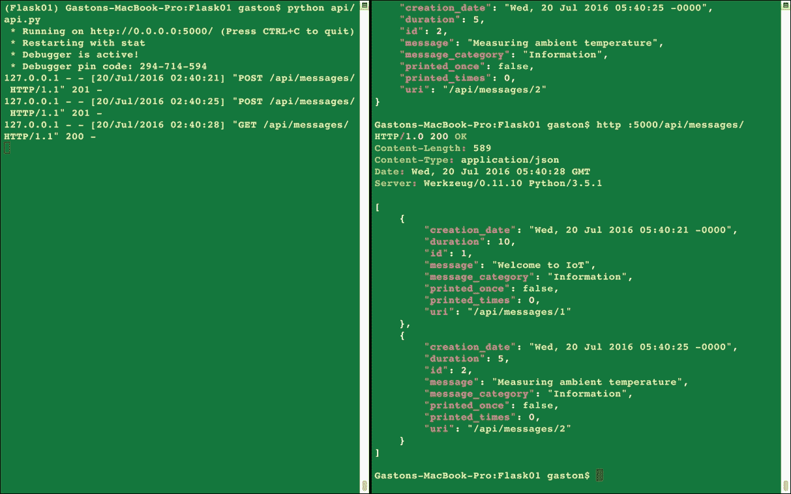
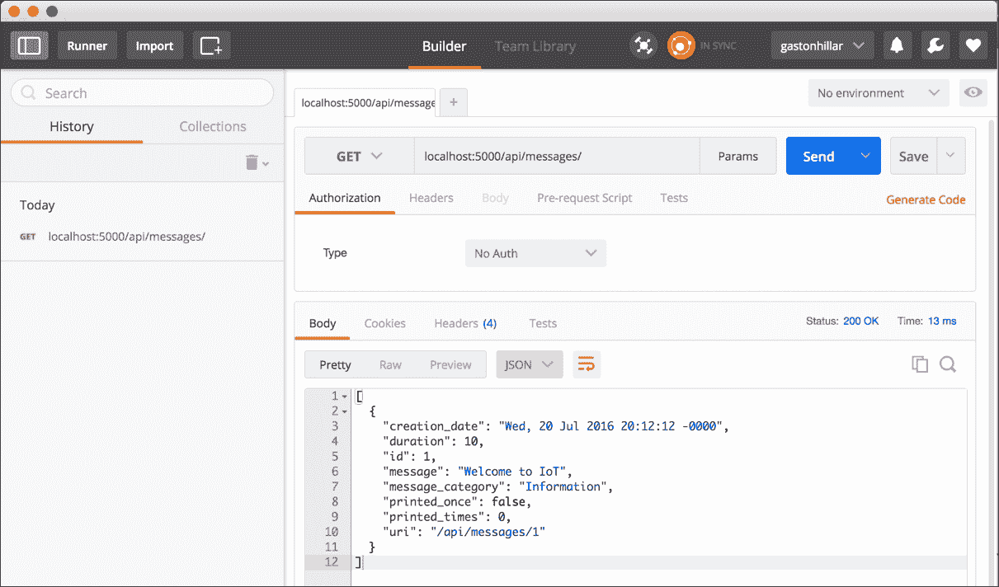
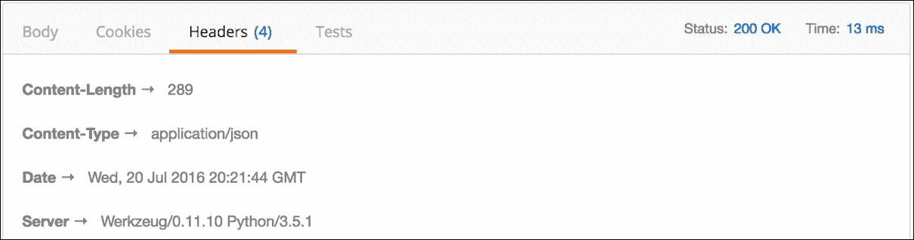
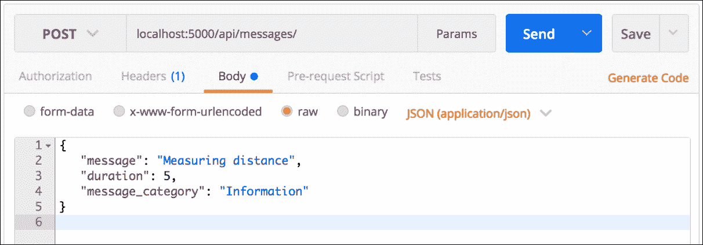
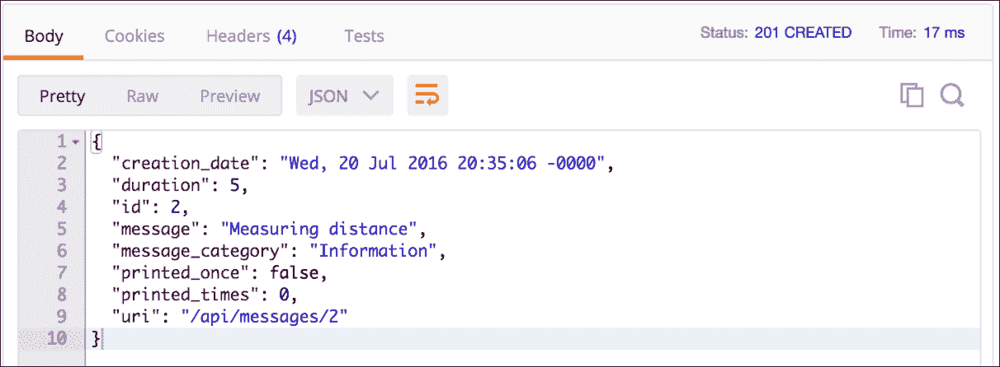
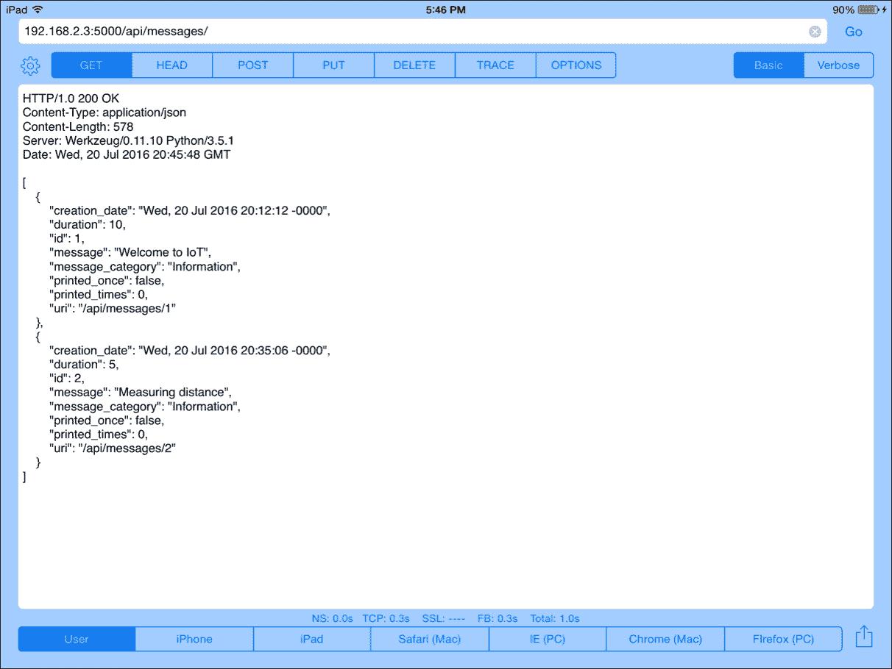

# 第五章. 使用 Flask 开发 RESTful API

在本章中，我们将开始使用 Flask 及其 Flask-RESTful 扩展；我们还将创建一个执行简单列表的 CRUD 操作的 RESTful Web API。我们将：

+   设计一个使用 Flask 和 Flask-RESTful 扩展执行 CRUD 操作的 RESTful API

+   理解每个 HTTP 方法执行的任务

+   使用 Flask 及其 Flask-RESTful 扩展设置虚拟环境

+   声明响应的状态码

+   创建表示资源的模型

+   使用字典作为存储库

+   配置序列化响应的输出字段

+   在 Flask 的可插拔视图之上进行资源路由

+   配置资源路由和端点

+   向 Flask API 发送 HTTP 请求

+   使用命令行工具与 Flask API 交互

+   使用 GUI 工具与 Flask API 交互

# 设计一个与简单数据源交互的 RESTful API

假设我们必须配置要显示在连接到**物联网**（**Internet of Things**）设备的 OLED 显示屏上的消息，该物联网设备能够运行 Python 3.5、Flask 和其他 Python 包。有一个团队正在编写代码，从字典中检索字符串消息并在连接到物联网设备的 OLED 显示屏上显示它们。我们必须开始开发一个移动应用和网站，该应用和网站需要与 RESTful API 交互以执行字符串消息的 CRUD 操作。

我们不需要 ORM，因为我们不会将字符串消息持久化到数据库中。我们只需使用内存中的字典作为我们的数据源。这是此 RESTful API 的要求之一。在这种情况下，RESTful 网络服务将在物联网设备上运行，即我们将在物联网设备上运行 Flask 开发服务器。

### 小贴士

我们肯定会失去 RESTful API 的可扩展性，因为我们服务器中有内存数据源，因此，我们无法在另一个物联网设备上运行 RESTful API。然而，我们将与另一个示例合作，该示例涉及更复杂的数据源，该数据源将能够以后以 RESTful 方式扩展。第一个示例将使我们了解 Flask 和 Flask-RESTful 如何与一个非常简单的内存数据源一起工作。

我们选择 Flask，因为它比 Django 更轻量级，我们不需要配置 ORM，我们希望尽快在物联网设备上运行 RESTful API，以便所有团队都能与之交互。我们也将使用 Flask 编写网站，因此，我们希望使用相同的 Web 微框架来驱动网站和 RESTful 网络服务。

Flask 有许多可用的扩展，使得使用 Flask 微框架执行特定任务变得更容易。我们将利用 Flask-RESTful 扩展，这将允许我们在构建 RESTful API 时鼓励最佳实践。在这种情况下，我们将使用 Python 字典作为数据源。如前所述，在未来的示例中，我们将使用更复杂的数据源。

首先，我们必须指定我们主要资源（消息）的要求。对于消息，我们需要以下属性或字段：

+   一个整数标识符

+   一个字符串消息

+   一个表示消息在 OLED 显示屏上打印时间的秒数

+   创建日期和时间——当向集合添加新消息时，时间戳将自动添加

+   一个消息类别描述，例如“警告”和“信息”

+   一个表示消息在 OLED 显示屏上打印次数的整数计数器

+   一个表示消息是否至少在 OLED 显示屏上打印过一次的布尔值

以下表格显示了我们的 API 第一版必须支持的 HTTP 动词、作用域和语义。每个方法由一个 HTTP 动词和一个作用域组成，并且所有方法对所有消息和集合都有一个明确的含义。在我们的 API 中，每个消息都有自己的唯一 URL。

| **HTTP 动词** | **作用域** | **语义** |
| --- | --- | --- |
| `GET` | 消息集合 | 获取集合中存储的所有消息，按名称升序排序 |
| `GET` | 消息 | 获取单个消息 |
| `POST` | 消息集合 | 在集合中创建一个新的消息 |
| `PATCH` | 消息 | 更新现有消息的字段 |
| `DELETE` | 消息 | 删除现有的消息 |

# 理解每个 HTTP 方法执行的任务

让我们考虑`http://localhost:5000/api/messages/`是消息集合的 URL。如果我们向前面的 URL 添加一个数字，我们就能识别一个特定的消息，其 id 等于指定的数值。例如，`http://localhost:5000/api/messsages/6`标识了 id 等于`6`的消息。

### 小贴士

我们希望我们的 API 能够在 URL 中区分集合和集合的单个资源。当我们引用集合时，我们将使用斜杠（`/`）作为 URL 的最后一个字符，如`http://localhost:5000/api/messages/`。当我们引用集合的单个资源时，我们不会在 URL 的最后一个字符使用斜杠（`/`），如`http://localhost:5000/api/messages/6`。

我们必须使用`POST` HTTP 动词和请求 URL `http://localhost:5000/api/messages/`来编写并发送一个 HTTP 请求以创建一条新消息。此外，我们必须提供包含字段名称和值的 JSON 键值对以创建新消息。作为请求的结果，服务器将验证提供的字段值，确保它是一个有效的消息，并将其持久化到消息字典中。

服务器将返回一个`201 Created`状态码和一个包含最近添加的消息序列化为 JSON 的 JSON 体，包括服务器自动生成并分配给消息对象的 ID：

```py
POST http://localhost:5000/api/messages/ 

```

我们必须使用`GET` HTTP 动词和请求 URL `http://localhost:5000/api/messages/{id}`来编写并发送一个 HTTP 请求，以检索与在 `{id}` 处写入的指定数值匹配的消息。例如，如果我们使用请求 URL `http://localhost:5000/api/messages/82`，服务器将检索 ID 匹配 82 的游戏。作为请求的结果，服务器将从字典中检索具有指定 ID 的消息。

如果找到消息，服务器将序列化消息对象为 JSON，并返回一个`200 OK`状态码和一个包含序列化消息对象的 JSON 体。如果没有找到与指定 ID 或主键匹配的消息，服务器将返回一个`404 Not Found`状态：

```py
GET http://localhost:5000/api/messages/{id} 

```

我们必须使用`PATCH` HTTP 动词和请求 URL `http://localhost:5000/api/messages/{id}`来编写并发送一个 HTTP 请求以更新与在 `{id}` 处写入的指定数值匹配的消息的一个或多个字段。此外，我们必须提供包含要更新的字段名称及其新值的 JSON 键值对。作为请求的结果，服务器将验证提供的字段值，更新与指定 ID 匹配的消息上的这些字段，并在字典中更新消息，如果它是有效的消息。

服务器将返回一个`200 OK`状态码和一个包含最近更新的游戏序列化为 JSON 的 JSON 体。如果我们为要更新的字段提供无效数据，服务器将返回一个`400 Bad Request`状态码。如果服务器找不到具有指定 ID 的消息，服务器将仅返回一个`404 Not Found`状态：

```py
PATCH http://localhost:5000/api/messages/{id} 

```

### 小贴士

PATCH 方法将使我们能够轻松地更新消息的两个字段：表示消息被打印次数的整数计数器，以及指定消息是否至少被打印一次的布尔值。

我们必须使用`DELETE` HTTP 动词和`http://localhost:5000/api/messages/{id}`请求 URL 来组合和发送一个 HTTP 请求，以删除与在`{id}`位置指定的数值匹配的消息。例如，如果我们使用请求 URL `http://localhost:5000/api/messages/15`，服务器将删除`id`匹配`15`的消息。请求的结果是，服务器将从字典中检索具有指定`id`的消息。如果找到消息，服务器将请求字典删除与该消息对象关联的条目，并返回`204 No Content`状态码。如果没有找到与指定`id`匹配的消息，服务器将返回`404 Not Found`：

```py
DELETE http://localhost:5000/api/messages/{id} 

```

# 使用 Flask 和 Flask-RESTful 设置虚拟环境

在第一章 "*使用 Django 开发 RESTful API*"中，我们了解到，在本书中，我们将使用 Python 3.4 中引入并改进的轻量级虚拟环境。现在，我们将按照步骤创建一个新的轻量级虚拟环境，以便使用 Flask 和 Flask-RESTful。如果你没有 Python 中轻量级虚拟环境的经验，强烈建议阅读*第一章*，*使用 Django 开发 RESTful API*。该章节包含了我们将要遵循的步骤的所有详细解释。

首先，我们必须选择我们的虚拟环境的目标文件夹或目录。在示例中，我们将使用以下路径。虚拟环境的目标文件夹将是我们主目录中的`PythonREST/Flask01`文件夹。例如，如果我们的 macOS 或 Linux 中的主目录是`/Users/gaston`，虚拟环境将在`/Users/gaston/PythonREST/Flask01`中创建。您可以在每个命令中将指定的路径替换为您想要的路径，如下所示：

```py
~/PythonREST/Flask01 

```

在示例中，我们将使用以下路径。虚拟环境的目标文件夹将是我们用户配置文件中的`PythonREST\Flask01`文件夹。例如，如果我们的用户配置文件是`C:\Users\Gaston`，虚拟环境将在`C:\Users\gaston\PythonREST\Flask01`中创建。您可以在每个命令中将指定的路径替换为您想要的路径，如下所示：

```py
%USERPROFILE%\PythonREST\Flask01 

```

在 macOS 或 Linux 中打开终端并执行以下命令以创建虚拟环境：

```py
python3 -m venv ~/PythonREST/Flask01

```

在 Windows 中，执行以下命令以创建虚拟环境：

```py
python -m venv %USERPROFILE%\PythonREST\Flask01

```

上述命令不会产生任何输出。现在我们已经创建了虚拟环境，我们将运行一个特定平台的脚本以激活它。激活虚拟环境后，我们将安装只在此虚拟环境中可用的包。

如果您的终端配置为在 macOS 或 Linux 中使用 `bash` shell，请运行以下命令来激活虚拟环境。该命令也适用于 `zsh` shell：

```py
source ~/PythonREST/Flask01/bin/activate

```

如果您的终端配置为使用 `csh` 或 `tcsh` shell，请运行以下命令来激活虚拟环境：

```py
source ~/PythonREST/Flask01/bin/activate.csh

```

如果您的终端配置为使用 `fish` shell，请运行以下命令来激活虚拟环境：

```py
source ~/PythonREST/Flask01/bin/activate.fish

```

在 Windows 中，您可以在命令提示符中运行批处理文件或 Windows PowerShell 脚本来激活虚拟环境。如果您更喜欢命令提示符，请在 Windows 命令行中运行以下命令来激活虚拟环境：

```py
%USERPROFILE%\PythonREST\Flask01\Scripts\activate.bat

```

如果您更喜欢 Windows PowerShell，启动它并运行以下命令来激活虚拟环境。但是请注意，您应该在 Windows PowerShell 中启用脚本执行才能运行脚本：

```py
cd $env:USERPROFILE
PythonREST\Flask01\Scripts\Activate.ps1

```

激活虚拟环境后，命令提示符将显示虚拟环境根文件夹名称，用括号括起来，作为默认提示的前缀，以提醒我们我们正在虚拟环境中工作。在这种情况下，我们将看到 (`Flask01`) 作为命令提示符的前缀，因为激活的虚拟环境的根文件夹是 `Flask01`。

我们已创建并激活了虚拟环境。现在是时候运行将在 macOS、Linux 或 Windows 上相同的命令了；我们必须运行以下命令使用 pip 安装 Flask-RESTful。Flask 是 Flask-RESTful 的依赖项，因此 pip 也会自动安装它：

```py
pip install flask-restful

```

输出的最后几行将指示所有成功安装的包，包括 `flask-restful` 和 `Flask`：

```py
Installing collected packages: six, pytz, click, itsdangerous, MarkupSafe, Jinja2, Werkzeug, Flask, python-dateutil, aniso8601, flask-restful
 Running setup.py install for click
 Running setup.py install for itsdangerous
 Running setup.py install for MarkupSafe
 Running setup.py install for aniso8601
Successfully installed Flask-0.11.1 Jinja2-2.8 MarkupSafe-0.23 Werkzeug-0.11.10 aniso8601-1.1.0 click-6.6 flask-restful-0.3.5 itsdangerous-0.24 python-dateutil-2.5.3 pytz-2016.4 six-1.10.0

```

# 声明响应的状态码

无论是 Flask 还是 Flask-RESTful 都没有包含不同 HTTP 状态码的变量声明。我们不希望返回数字作为状态码。我们希望我们的代码易于阅读和理解，因此，我们将使用描述性的 HTTP 状态码。我们将从 Django REST Framework 包含的 `status.py` 文件中借用声明与 HTTP 状态码相关的有用函数和变量的代码，即我们在前几章中使用过的框架。

首先，在最近创建的虚拟环境的根目录下创建一个名为 `api` 的文件夹，然后在 `api` 文件夹中创建一个新的 `status.py` 文件。以下行展示了从 `rest_framework.status` 模块借用的 `api/models.py` 文件中声明的具有描述性 HTTP 状态码的函数和变量的代码。我们不希望重新发明轮子，该模块提供了我们在基于 Flask 的 API 中处理 HTTP 状态码所需的一切。示例代码文件包含在 `restful_python_chapter_05_01` 文件夹中：

```py
def is_informational(code): 
    return code >= 100 and code <= 199 

def is_success(code): 
    return code >= 200 and code <= 299 

def is_redirect(code): 
    return code >= 300 and code <= 399 

def is_client_error(code): 
    return code >= 400 and code <= 499 

def is_server_error(code): 
    return code >= 500 and code <= 599 

HTTP_100_CONTINUE = 100 
HTTP_101_SWITCHING_PROTOCOLS = 101 
HTTP_200_OK = 200 
HTTP_201_CREATED = 201 
HTTP_202_ACCEPTED = 202 
HTTP_203_NON_AUTHORITATIVE_INFORMATION = 203 
HTTP_204_NO_CONTENT = 204 
HTTP_205_RESET_CONTENT = 205 
HTTP_206_PARTIAL_CONTENT = 206 
HTTP_300_MULTIPLE_CHOICES = 300 
HTTP_301_MOVED_PERMANENTLY = 301 
HTTP_302_FOUND = 302 
HTTP_303_SEE_OTHER = 303 
HTTP_304_NOT_MODIFIED = 304 
HTTP_305_USE_PROXY = 305 
HTTP_306_RESERVED = 306 
HTTP_307_TEMPORARY_REDIRECT = 307 
HTTP_400_BAD_REQUEST = 400 
HTTP_401_UNAUTHORIZED = 401 
HTTP_402_PAYMENT_REQUIRED = 402 
HTTP_403_FORBIDDEN = 403 
HTTP_404_NOT_FOUND = 404 
HTTP_405_METHOD_NOT_ALLOWED = 405 
HTTP_406_NOT_ACCEPTABLE = 406 
HTTP_407_PROXY_AUTHENTICATION_REQUIRED = 407 
HTTP_408_REQUEST_TIMEOUT = 408 
HTTP_409_CONFLICT = 409 
HTTP_410_GONE = 410 
HTTP_411_LENGTH_REQUIRED = 411 
HTTP_412_PRECONDITION_FAILED = 412 
HTTP_413_REQUEST_ENTITY_TOO_LARGE = 413 
HTTP_414_REQUEST_URI_TOO_LONG = 414 
HTTP_415_UNSUPPORTED_MEDIA_TYPE = 415 
HTTP_416_REQUESTED_RANGE_NOT_SATISFIABLE = 416 
HTTP_417_EXPECTATION_FAILED = 417 
HTTP_428_PRECONDITION_REQUIRED = 428 
HTTP_429_TOO_MANY_REQUESTS = 429 
HTTP_431_REQUEST_HEADER_FIELDS_TOO_LARGE = 431 
HTTP_451_UNAVAILABLE_FOR_LEGAL_REASONS = 451 
HTTP_500_INTERNAL_SERVER_ERROR = 500 
HTTP_501_NOT_IMPLEMENTED = 501 
HTTP_502_BAD_GATEWAY = 502 
HTTP_503_SERVICE_UNAVAILABLE = 503 
HTTP_504_GATEWAY_TIMEOUT = 504 
HTTP_505_HTTP_VERSION_NOT_SUPPORTED = 505 
HTTP_511_NETWORK_AUTHENTICATION_REQUIRED = 511 

```

代码声明了五个函数，这些函数接收 HTTP 状态码作为`code`参数，并确定状态码属于以下哪个类别：信息性、成功、重定向、客户端错误或服务器错误类别。当我们需要返回特定的状态码时，我们将使用前面的变量。例如，如果我们需要返回`404 Not Found`状态码，我们将返回`status.HTTP_404_NOT_FOUND`，而不是仅仅`404`。

# 创建模型

现在，我们将创建一个简单的`MessageModel`类，我们将使用它来表示消息。请记住，我们不会在数据库中持久化模型，因此在这种情况下，我们的类将只提供所需的属性而没有映射信息。在`api`文件夹中创建一个新的`models.py`文件。以下行显示了在`api/models.py`文件中创建`MessageModel`类的代码。示例的代码文件包含在`restful_python_chapter_05_01`文件夹中：

```py
class MessageModel: 
    def __init__(self, message, duration, creation_date, message_category): 
        # We will automatically generate the new id 
        self.id = 0 
        self.message = message 
        self.duration = duration 
        self.creation_date = creation_date 
        self.message_category = message_category 
        self.printed_times = 0 
        self.printed_once = False 

```

`MessageModel`类仅声明了一个构造函数，即`__init__`方法。此方法接收许多参数，然后使用它们来初始化具有相同名称的属性：`message`、`duration`、`creation_date`和`message_category`。`id`属性设置为 0，`printed_times`设置为`0`，`printed_once`设置为`False`。我们将自动通过 API 调用为每个新生成的消息递增标识符。

# 使用字典作为存储库

现在，我们将创建一个`MessageManager`类，我们将使用它将`MessageModel`实例持久化到内存字典中。我们的 API 方法将调用`MessageManager`类的相关方法来检索、插入、更新和删除`MessageModel`实例。在`api`文件夹中创建一个新的`api.py`文件。以下行显示了在`api/api.py`文件中创建`MessageManager`类的代码。此外，以下行声明了我们将需要用于此文件中所有代码的所有`导入`。示例的代码文件包含在`restful_python_chapter_05_01`文件夹中。

```py
from flask import Flask 
from flask_restful import abort, Api, fields, marshal_with, reqparse, Resource 
from datetime import datetime 
from models import MessageModel 
import status 
from pytz import utc 

class MessageManager(): 
    last_id = 0 
    def __init__(self): 
        self.messages = {} 

    def insert_message(self, message): 
        self.__class__.last_id += 1 
        message.id = self.__class__.last_id 
        self.messages[self.__class__.last_id] = message 

    def get_message(self, id): 
        return self.messages[id] 

    def delete_message(self, id): 
         del self.messages[id] 

```

`MessageManager`类声明了一个`last_id`类属性，并将其初始化为 0。这个类属性存储了最后生成的并分配给存储在字典中的`MessageModel`实例的 id。构造函数，即`__init__`方法，创建并初始化`messages`属性为一个空字典。

代码为该类声明了以下三个方法：

+   `insert_message`：此方法接收一个最近创建的`MessageModel`实例，作为`message`参数。代码增加`last_id`类属性的值，然后将结果值分配给接收到的消息的 id。代码使用`self.__class__`来引用当前实例的类型。最后，代码将`message`作为值添加到由生成的 id，即`last_id`，标识的`self.messages`字典中的键。

+   `get_message`: 此方法接收要从中检索的 `self.messages` 字典中消息的 `id`。代码返回与接收到的 `id` 匹配的键在 `self.messages` 字典中我们用作数据源的相关值。

+   `delete_message`: 此方法接收要从中移除的 `self.messages` 字典中消息的 `id`。代码删除了与接收到的 `id` 匹配的键值对，该键值对位于我们用作数据源的 `self.messages` 字典中。

我们不需要一个更新消息的方法，因为我们只需更改已存储在 `self.messages` 字典中的 `MessageModel` 实例的属性。字典中存储的值是对我们正在更新的 `MessageModel` 实例的引用，因此我们不需要调用特定的方法来更新字典中的实例。然而，如果我们正在与数据库一起工作，我们需要调用我们的 ORM 或数据仓库的更新方法。

# 配置输出字段

现在，我们将创建一个 `message_fields` 字典，我们将使用它来控制我们想要 Flask-RESTful 在响应中渲染的数据。打开之前创建的 `api/api.py` 文件，并添加以下行。示例的代码文件包含在 `restful_python_chapter_05_01` 文件夹中。

```py
message_fields = { 
    'id': fields.Integer, 
    'uri': fields.Url('message_endpoint'), 
    'message': fields.String, 
    'duration': fields.Integer, 
    'creation_date': fields.DateTime, 
    'message_category': fields.String, 
    'printed_times': fields.Integer, 
    'printed_once': fields.Boolean 
} 

message_manager = MessageManager() 

```

我们声明了 `message_fields` 字典（`dict`），其中包含 `flask_restful.fields` 模块中声明的字符串和类的键值对。键是我们想要从 `MessageModel` 类中渲染的属性名称，值是格式化和返回字段值的类。在前面的代码中，我们使用了以下类，这些类格式化和返回键中指定的字段值：

+   `field.Integer`: 输出一个整数值。

+   `fields.Url`: 生成一个 URL 的字符串表示。默认情况下，此类为请求的资源生成相对 URI。代码指定了 `'message_endpoint'` 作为 `endpoint` 参数。这样，该类将使用指定的端点名称。我们将在 `api.py` 文件中稍后声明此端点。我们不希望在生成的 URI 中包含主机名，因此我们使用 `absolute` 布尔属性的默认值，即 `False`。

+   `fields.DateTime`: 输出 UTC 格式的格式化 `datetime` 字符串，默认采用 RFC 822 格式。

+   `fields.Boolean`: 生成一个布尔值的字符串表示。

`'uri'` 字段使用 `fields.Url`，它与指定的端点相关联，而不是与 `MessageModel` 类的属性相关联。这是唯一一个指定的字段名在 `MessageModel` 类中没有属性的情况。其他指定为键的字符串表示我们在使用 `message_fields` 字典来构建最终的序列化响应输出时想要渲染的所有属性。

在我们声明了`message_fields`字典之后，下一行代码创建了一个名为`message_manager`的之前创建的`MessageManager`类实例。我们将使用此实例来创建、检索和删除`MessageModel`实例。

# 在 Flask 可插拔视图之上进行资源路由操作

Flask-RESTful 使用基于 Flask 可插拔视图的资源作为构建 RESTful API 的主要构建块。我们只需要创建一个`flask_restful.Resource`类的子类，并声明每个支持的 HTTP 动词的方法。`flask_restful.Resource`的子类代表 RESTful 资源，因此，我们将必须声明一个类来表示消息集合，另一个类来表示消息资源。

首先，我们将创建一个`Message`类，我们将使用它来表示消息资源。打开之前创建的`api/api.py`文件，并添加以下行。示例代码文件包含在`restful_python_chapter_05_01`文件夹中，如下所示：

```py
class Message(Resource): 
    def abort_if_message_doesnt_exist(self, id): 
        if id not in message_manager.messages: 
            abort( 
                status.HTTP_404_NOT_FOUND,  
                message="Message {0} doesn't exist".format(id)) 

    @marshal_with(message_fields) 
    def get(self, id): 
        self.abort_if_message_doesnt_exist(id) 
        return message_manager.get_message(id) 

    def delete(self, id): 
        self.abort_if_message_doesnt_exist(id) 
        message_manager.delete_message(id) 
        return '', status.HTTP_204_NO_CONTENT 

    @marshal_with(message_fields) 
    def patch(self, id): 
        self.abort_if_message_doesnt_exist(id) 
        message = message_manager.get_message(id) 
        parser = reqparse.RequestParser() 
        parser.add_argument('message', type=str) 
        parser.add_argument('duration', type=int) 
        parser.add_argument('printed_times', type=int) 
        parser.add_argument('printed_once', type=bool) 
        args = parser.parse_args() 
        if 'message' in args: 
            message.message = args['message'] 
        if 'duration' in args: 
            message.duration = args['duration'] 
        if 'printed_times' in args: 
            message.printed_times = args['printed_times'] 
        if 'printed_once' in args: 
            message.printed_once = args['printed_once'] 
        return message 

```

`Message`类是`flask_restful.Resource`的子类，并声明了以下三个方法，当在表示的资源上接收到与同名 HTTP 方法请求时将被调用：

+   `get`: 此方法通过`id`参数接收要检索的消息的 ID。代码调用`self.abort_if_message_doesnt_exist`方法，如果请求的 ID 没有消息则终止。如果消息存在，代码将返回由`message_manager.get_message`方法返回的与指定`id`匹配的`MessageModel`实例。`get`方法使用`@marshal_with`装饰器，并将`message_fields`作为参数。装饰器将获取`MessageModel`实例，并应用`message_fields`中指定的字段过滤和输出格式。

+   `delete`: 此方法通过`id`参数接收要删除的消息的 ID。代码调用`self.abort_if_message_doesnt_exist`方法以终止，如果请求的 ID 没有消息。如果存在```py` ``` ```py`message exists, the code calls the `message_manager.delete_message` method with the received id as an argument to remove the `MessageModel` instance from our data repository. Then, the code returns an empty response body and a `204 No Content` status code.
*   `patch`: This method receives the id of the message that has to be updated or patched in the `id` argument. The code calls the `self.abort_if_message_doesnt_exist` method to abort in case there is no message with the requested id. In case the message exists, the code saves the `MessageModel` instance whose `id` that matches the specified `id` returned by the `message_manager.get_message` method in the `message` variable. The next line creates a `flask_restful.reqparse.RequestParser` instance named `parser`. The `RequestParser` instance allows us to add arguments with their names and types and then easily parse the arguments received with the request. The code makes four calls to the `parser.add_argument` with the argument name and the type of the four arguments we want to parse. Then, the code calls the `parser.parse_args` method to parse all the arguments from the request and saves the returned dictionary (`dict`) in the `args` variable. The code updates all the attributes that have new values in the `args` dictionary in the `MessageModel` instance: `message`. In case the request didn't include values for certain fields, the code won't make changes to the realted attributes. The request doesn't require to include the four fields that can be updated with values. The code returns the updated `message`. The `patch` method uses the `@marshal_with` decorator with `message_fields` as an argument. The decorator will take the `MessageModel` instance, `message`, and apply the field filtering and output formatting specified in `message_fields`.

### Tip

We used multiple return values to set the response code.

As previously explained, the three methods call the internal `abort_if_message_doesnt_exist` method that receives the id for an existing `MessageModel` instance in the `id` argument. If the received `id` is not present in the keys of the `message_manager.messages` dictionary, the method calls the `flask_restful.abort` function with `status.HTTP_404_NOT_FOUND` as the `http_status_code` argument and a message indicating that the message with the specified id doesn't exists. The `abort` function raises an `HTTPException` for the received `http_status_code` and attaches the additional keyword arguments to the exception for later processing. In this case, we generate an HTTP `404 Not Found` status code.

Both the `get` and `patch` methods use the `@marshal_with` decorator that takes a single data object or a list of data objects and applies the field filtering and output formatting specifies as an argument. The marshalling can also work with dictionaries (dicts). In both methods, we specified `message_fields` as an argument, and therefore, the code renders the following fields: `id`, `uri`, `message`, `duration`, `creation_date`, `message_category`, `printed_times` and `printed_once`. When we use the `@marshal_with` decorator, we are automatically returning an HTTP 200 `OK` status code.

The following `return` statement with the `@marshal_with(message_fields)` decorator returns an `HTTP 200 OK` status code because we didn't specify any status code after the returned object (`message`):

```

return message

```py

The next line is the line of code that is really executed with the `@marshal_with(message_fields)` decorator, and we can use it instead of working with the decorator:

```

return marshal(message, resource_fields), status.HTTP_200_OK

```py

For example, we can call the `marshal` function as shown in the previous line instead of using the `@marshal_with` decorator and the code will produce the same result.

Now, we will create a `MessageList` class that we will use to represent the collection of messages. Open the previously created `api/api.py` file and add the following lines. The code file for the sample is included in the `restful_python_chapter_05_01` folder:

```

class MessageList(Resource):

    @marshal_with(message_fields)

    def get(self):

        return [v for v in message_manager.messages.values()]

    @marshal_with(message_fields)

    def post(self):

        parser = reqparse.RequestParser()

        parser.add_argument('message', type=str, required=True, help='消息不能为空！')

        parser.add_argument('duration', type=int, required=True, help='持续时间不能为空！')

        parser.add_argument('message_category', type=str, required=True, help='消息类别不能为空！')

        args = parser.parse_args()

        message = MessageModel(

            message=args['message'],

            duration=args['duration'],

            creation_date=datetime.now(utc),

            message_category=args['message_category']

            )

        message_manager.insert_message(message)

        return message, status.HTTP_201_CREATED

```py

The `MessageList` class is a subclass of `flask_restful.Resource` and declares the following two methods that will be called when the HTTP method with the same name arrives as a request on the represented resource:

*   `get`: This method returns a list with all the `MessageModel` instances saved in the `message_manager.messages` dictionary. The `get` method uses the `@marshal_with` decorator with `message_fields` as an argument. The decorator will take each `MessageModel` instance in the returned list and apply the field filtering and output formatting specified in `message_fields`.
*   `post`: This method creates a `flask_restful.reqparse.RequestParser` instance named `parser`. The `RequestParser` instance allows us to add arguments with their names and types and then easily parse the arguments received with the `POST` request to create a new `MessageModel` instance. The code makes three calls to the `parser.add_argument` with the argument name and the type of the three arguments we want to parse. Then, the code calls the `parser.parse_args` method to parse all the arguments from the request and saves the returned dictionary (`dict`) in the `args` variable. The code uses the parsed arguments in the dictionary to specify the values for the `message`, `duration` and `message_category` attributes to create a new `MessageModel` instance and save it in the `message` variable. The value for the `creation_date` argument is set to the current `datetime` with time zone info, and therefore, it isn't parsed from the request. Then, the code calls the `message_manager.insert_message` method with the new `MessageModel` instance (`message`) to add this new instance to the dictionary. The `post` method uses the `@marshal_with` decorator with `message_fields` as an argument. The decorator will take the recently created and stored `MessageModel` instance, `message`, and apply the field filtering and output formatting specified in `message_fields`. The code returns an HTTP `201 Created` status code.

The following table shows the method of our previously created classes that we want to be executed for each combination of HTTP verb and scope:

| **HTTP verb** | **Scope** | **Class and method** |
| `GET` | Collection of messages | MessageList.get |
| `GET` | Message | Message.get |
| `POST` | Collection of messages | MessageList.post |
| `PATCH` | Message | Message.patch |
| `DELETE` | Message | Message.delete |

If the request results in the invocation of a resource with an unsupported HTTP method, Flask-RESTful will return a response with the HTTP `405 Method Not Allowed` status code.

# Configuring resource routing and endpoints

We must make the necessary resource routing configurations to call the appropriate methods and pass them all the necessary arguments by defining URL rules. The following lines create the main entry point for the application, initialize it with a Flask application and configure the resource routing for the `api`. Open the previously created `api/api.py` file and add the following lines. The code file for the sample is included in the `restful_python_chapter_05_01` folder:

```

app = Flask(__name__)

api = Api(app)

api.add_resource(MessageList, '/api/messages/')

api.add_resource(Message, '/api/messages/<int:id>', endpoint='message_endpoint')

if __name__ == '__main__':

    app.run(debug=True)

```py

The code creates an instance of the `flask_restful.Api` class and saves it in the `api` variable. Each call to the `api.add_resource` method routes a URL to a resource, specifically to one of the previously declared subclasses of the `flask_restful.Resource` class. When there is a request to the API and the URL matches one of the URLs specified in the `api.add_resource` method, Flask will call the method that matches the HTTP verb in the request for the specified class. The method follows standard Flask routing rules.

For example, the following line will make an HTTP GET request to `/api/messages/` without any additional parameters to call the `MessageList.get` method:

```

api.add_resource(MessageList, '/api/messages/')

```py

Flask will pass the URL variables to the called method as arguments. For example, the following line will make an HTTP `GET` request to `/api/messages/12` to call the `Message.get` method with `12` passed as the value for the `id` argument:

```

api.add_resource(Message, '/api/messages/<int:id>', endpoint='message_endpoint')

```py

In addition, we can specify a string value for the endpoint argument to make it easy to reference the specified route in `fields.Url` fields. We pass the same endpoint name, `'message_endpoint'` as an argument in the `uri` field declared as `fields.Url` in the `message_fields` dictionary that we use to render each `MessageModel` instance. This way, `fields.Url` will generate a URI considering this route.

We just required a few lines of code to configure resource routing and endpoints. The last line just calls the `app.run` method to start the Flask application with the `debug` argument set to `True` to enable debugging. In this case, we start the application by calling the `run` method to immediately launch a local server. We could also achieve the same goal by using the `flask` command-line script. However, this option would require us to configure environment variables and the instructions are different for the platforms that we are covering in this book-macOS, Windows and Linux.

### Tip

As with any other Web framework, you should never enable debugging in a production environment.

# Making HTTP requests to the Flask API

Now, we can run the `api/api.py` script that launches Flask's development server to compose and send HTTP requests to our unsecure and simple Web API (we will definitely add security later). Execute the following command.

```

python api/api.py

```py

The following lines show the output after we execute the previous command. The development server is listening at port `5000`.

```

* 在 http://127.0.0.1:5000/ 上运行（按 CTRL+C 退出）

* 使用 stat 重启

* 调试器处于活动状态！

* 调试器密码：294-714-594

```py

With the previous command, we will start Flask development server and we will only be able to access it in our development computer. The previous command starts the development server in the default IP address, that is, `127.0.0.1` (`localhost`). It is not possible to access this IP address from other computers or devices connected on our LAN. Thus, if we want to make HTTP requests to our API from other computers or devices connected to our LAN, we should use the development computer IP address, `0.0.0.0` (for IPv4 configurations) or `::` (for IPv6 configurations), as the desired IP address for our development server.

If we specify `0.0.0.0` as the desired IP address for IPv4 configurations, the development server will listen on every interface on port 5000\. In addition, it is necessary to open the default port `5000` in our firewalls (software and/or hardware) and configure port-forwarding to the computer that is running the development server.

We just need to specify `'0.0.0.0'` as the value for the host argument in the call to the `app.run` method, specifically, the last line in the `api/api.py` file. The following line shows the new call to `app.run` that launches Flask's development server in an IPv4 configuration and allows requests to be made from other computers and devices connected to our LAN. The line generates an externally visible server. The code file for the sample is included in the `restful_python_chapter_05_02` folder:

```

if __name__ == '__main__':

    app.run(host='0.0.0.0', debug=True)

```py

### Tip

If you decide to compose and send HTTP requests from other computers or devices connected to the LAN, remember that you have to use the development computer's assigned IP address instead of `localhost`. For example, if the computer's assigned IPv4 IP address is `192.168.1.103`, instead of `localhost:5000`, you should use `192.168.1.103:5000`. Of course, you can also use the host name instead of the IP address. The previously explained configurations are very important because mobile devices might be the consumers of our RESTful APIs and we will always want to test the apps that make use of our APIs in our development environments. In addition, we can work with useful tools such as ngrok that allow us to generate secure tunnels to localhost. You can read more information about ngrok at [`www.ngrok.com`](http://www.ngrok.com).

The Flask development server is running on localhost (`127.0.0.1`), listening on port `5000`, and waiting for our HTTP requests. Now, we will compose and send HTTP requests locally in our development computer or from other computer or devices connected to our LAN.

## Working with command-line tools – curl and httpie

We will start composing and sending HTTP requests with the command-line tools we have introduced in *Chapter 1* , *Developing RESTful APIs with Django*, curl and HTTPie. In case you haven't installed HTTPie, make sure you activate the virtual environment and then run the following command in the terminal or command prompt to install the HTTPie package.

```

pip install --upgrade httpie

```py

### Tip

In case you don't remember how to activate the virtual environment that we created for this example, read the following section in this chapter-*Setting up the virtual environment with Django REST framework*.

Open a Cygwin Terminal in Windows or a Terminal in macOS or Linux, and run the following command. It is very important that you enter the ending slash (`/`) when specified /api/messages won't match any of the configured URL routes. Thus, we must enter `/api/messages/`, including the ending slash (/). We will compose and send an HTTP request to create a new message:

```

http POST :5000/api/messages/ message='欢迎来到物联网' duration=10 message_category='信息'

```py

The following is the equivalent curl command. It is very important to use the `-H "Content-Type: application/json"` option to indicate curl to send the data specified after the `-d` option as `application/json` instead of the default `application/x-www-form-urlencoded`:

```

curl -iX POST -H "Content-Type: application/json" -d '{"message":"测量环境温度", "duration":10, "message_category": "信息"}' :5000/api/messages/

```py

The previous commands will compose and send the following HTTP request: `POST http://localhost:5000/api/messages/` with the following JSON key-value pairs:

```

{

    "message": "欢迎来到物联网",

    "duration": 10,

    "message_category": "信息"

}

```py

The request specifies `/api/messages/`, and therefore, it will match `'/api/messages/'` and run the `MessageList.post` method. The method doesn't receive arguments because the URL route doesn't include any parameters. As the HTTP verb for the request is `POST`, Flask calls the `post` method. If the new `MessageModel` was successfully persisted in the dictionary, the function returns an `HTTP 201 Created` status code and the recently persisted `MessageModel` serialized serialized to JSON in the response body. The following lines show an example response for the HTTP request, with the new `MessageModel` object in the JSON response:

```

HTTP/1.0 201 CREATED

Content-Length: 245

Content-Type: application/json

Date: Wed, 20 Jul 2016 04:43:24 GMT

Server: Werkzeug/0.11.10 Python/3.5.1

{

"creation_date": "Wed, 20 Jul 2016 04:43:24 -0000",

"duration": 10,

"id": 1,

"message": "欢迎来到物联网",

"message_category": "信息",

"printed_once": false,

"printed_times": 0,

"uri": "/api/messages/1"

}

```py

We will compose and send an HTTP request to create another message. Go back to the Cygwin terminal in Windows or the Terminal in macOS or Linux, and run the following command:

```

http POST :5000/api/messages/ message='测量环境温度' duration=5 message_category='信息'

```py

The following is the equivalent `curl` command:

```

curl -iX POST -H "Content-Type: application/json" -d '{"message":"测量环境温度", "duration":5, "message_category": "信息"}' :5000/api/messages/

```py

The previous commands will compose and send the following HTTP request, `POST http://localhost:5000/api/messages/`, with the following JSON key-value pairs:

```

{

    "message": "测量环境温度",

    "duration": 5,

    "message_category": "信息"

}

```py

The following lines show an example response for the HTTP request, with the new `MessageModel` object in the JSON response:

```

HTTP/1.0 201 CREATED

Content-Length: 259

Content-Type: application/json

Date: Wed, 20 Jul 2016 18:27:05 GMT

Server: Werkzeug/0.11.10 Python/3.5.1

{

"creation_date": "Wed, 20 Jul 2016 18:27:05 -0000",

"duration": 5,

"id": 2,

"message": "测量环境温度",

"message_category": "信息",

"printed_once": false,

"printed_times": 0,

"uri": "/api/messages/2"

}

```py

We will compose and send an HTTP request to retrieve all the messages. Go back to the Cygwin terminal in Windows or the Terminal in macOS or Linux, and run the following command:

```

http :5000/api/messages/

```py

The following is the equivalent curl command:

```

curl -iX GET -H :5000/api/messages/

```py

The previous commands will compose and send the following HTTP request: `GET http://localhost:5000/api/messages/`. The request specifies `/api/messages/`, and therefore, it will match `'/api/messages/'` and run the `MessageList.get` method. The method doesn't receive arguments because the URL route doesn't include any parameters. As the HTTP verb for the request is `GET`, Flask calls the `get` method. The method retrieves all the `MessageModel` objects and generates a JSON response with all of these `MessageModel` objects serialized.

The following lines show an example response for the HTTP request. The first lines show the HTTP response headers, including the status (200 OK) and the Content-type (application/json). After the HTTP response headers, we can see the details for the two `MessageModel` objects in the JSON response:

```

HTTP/1.0 200 OK

Content-Length: 589

Content-Type: application/json

Date: Wed, 20 Jul 2016 05:32:28 GMT

Server: Werkzeug/0.11.10 Python/3.5.1

[

{

"creation_date": "Wed, 20 Jul 2016 05:32:06 -0000",

"duration": 10,

"id": 1,

"message": "欢迎来到物联网",

"message_category": "信息",

"printed_once": false,

"printed_times": 0,

"uri": "/api/messages/1"

},

{

"creation_date": "Wed, 20 Jul 2016 05:32:18 -0000",

"duration": 5,

"id": 2,

"message": "测量环境温度",

"message_category": "信息",

"printed_once": false,

"printed_times": 0,

"uri": "/api/messages/2"

}

]

```py

After we run the three requests, we will see the following lines in the window that is running the Flask development server. The output indicates that the server received three HTTP requests, specifically two `POST` requests and one `GET` request with `/api/messages/` as the URI. The server processed the three HTTP requests, returned status code 201 for the first two requests and 200 for the last request:

```

127.0.0.1 - - [20/Jul/2016 02:32:06] "POST /api/messages/ HTTP/1.1" 201 -

127.0.0.1 - - [20/Jul/2016 02:32:18] "POST /api/messages/ HTTP/1.1" 201 -

127.0.0.1 - - [20/Jul/2016 02:32:28] "GET /api/messages/ HTTP/1.1" 200 -

```py

The following image shows two Terminal windows side-by-side on macOS. The Terminal window at the left-hand side is running the Flask development server and displays the received and processed HTTP requests. The Terminal window at the right-hand side is running `http` commands to generate the HTTP requests. It is a good idea to use a similar configuration to check the output while we compose and send the HTTP requests:



Now, we will compose and send an HTTP request to retrieve a message that doesn't exist. For example, in the previous list, there is no message with an `id` value equal to `800`. Run the following command to try to retrieve this message. Make sure you use an `id` value that doesn't exist. We must make sure that the utilities display the headers as part of the response to see the returned status code:

```

http :5000/api/messages/800

```py

The following is the equivalent `curl` command:

```

curl -iX GET :5000/api/messages/800

```py

The previous commands will compose and send the following HTTP request: `GET http://localhost:5000/api/messages/800`. The request is the same than the previous one we have analyzed, with a different number for the `id` parameter. The server will run the `Message.get` method with `800` as the value for the `id` argument. The method will execute the code that retrieves the `MessageModel` object whose id matches the `id` value received as an argument. However, the first line in the `MessageList.get` method calls the `abort_if_message_doesnt_exist` method that won't find the id in the dictionary keys and it will call the `flask_restful.abort` function because there is no message with the specified `id` value. Thus, the code will return an HTTP `404 Not Found` status code. The following lines show an example header response for the HTTP request and the message included in the body. In this case, we just leave the default message. Of course, we can customize it based on our specific needs:

```

HTTP/1.0 404 NOT FOUND

Content-Length: 138

Content-Type: application/json

日期：Wed, 20 Jul 2016 18:08:04 GMT

Server: Werkzeug/0.11.10 Python/3.5.1

{

"message": "消息 800 不存在。您请求了这个 URI [/api/messages/800]，但您是指 /api/messages/<int:id> 吗？"

}

```py

Our API is able to update a single field for an existing resource, and therefore, we provide an implementation for the `PATCH` method. For example, we can use the `PATCH` method to update two fields for an existing message and set the value for its `printed_once` field to `true` and `printed_times` to `1`. We don't want to use the `PUT` method because this method is meant to replace an entire message. The `PATCH` method is meant to apply a delta to an existing message, and therefore, it is the appropriate method to just change the value of the `printed_once` and `printed_times` fields.

Now, we will compose and send an HTTP request to update an existing message, specifically, to update the value of two fields. Make sure you replace `2` with the id of an existing message in your configuration:

```

http PATCH :5000/api/messages/2 printed_once=true printed_times=1

```py

The following is the equivalent `curl` command:

```

curl -iX PATCH -H "Content-Type: application/json" -d '{"printed_once":"true", "printed_times":1}' :5000/api/messages/2

```py

The previous command will compose and send a `PATCH` HTTP request with the specified JSON key-value pairs. The request has a number after `/api/messages/`, and therefore, it will match `'/api/messages/<int:id>'` and run the `Message.patch` method, that is, the `patch` method for the `Message` class. If a `MessageModel` instance with the specified id exists and it was successfully updated, the call to the method will return an HTTP `200 OK` status code and the recently updated `MessageModel` instance serialized to JSON in the response body. The following lines show a sample response:

```

HTTP/1.0 200 OK

Content-Length: 231

Content-Type: application/json

日期：Wed, 20 Jul 2016 18:28:01 GMT

Server: Werkzeug/0.11.10 Python/3.5.1

{

"creation_date": "Wed, 20 Jul 2016 18:27:05 -0000",

"duration": 0,

"id": 2,

"message": "测量环境温度",

"message_category": "Information",

"printed_once": true,

"printed_times": 1,

"uri": "/api/messages/2"

}

```py

### Tip

The IoT device will make the previously explained HTTP request when it displays the message for the first time. Then, it will make additional PATCH requests to update the value for the `printed_times` field.

Now, we will compose and send an HTTP request to delete an existing message, specifically, the last message we added. As happened in our last HTTP requests, we have to check the value assigned to `id` in the previous response and replace `2` in the command with the returned value:

```

http DELETE :5000/api/messages/2

```py

The following is the equivalent `curl` command:

```

curl -iX DELETE :5000/api/messages/2

```py

The previous commands will compose and send the following HTTP request: `DELETE http://localhost:5000/api/messages/2`. The request has a number after `/api/messages/`, and therefore, it will match `'/api/messages/<int:id>'` and run the `Message.delete` method, that is, the `delete` method for the `Message` class. If a `MessageModel` instance with the specified id exists and it was successfully deleted, the call to the method will return an HTTP `204 No Content` status code. The following lines show a sample response:

```

HTTP/1.0 204 NO CONTENT

Content-Length: 0

Content-Type: application/json

日期：Wed, 20 Jul 2016 18:50:12 GMT

Server: Werkzeug/0.11.10 Python/3.5.1

```py

## Working with GUI tools - Postman and others

So far, we have been working with two terminal-based or command-line tools to compose and send HTTP requests to our Flask development server-cURL and HTTPie. Now, we will work with one of the GUI tools we used when composing and sending HTTP requests to the Django development server-Postman.

Now, we will use the **Builder** tab in Postman to easily compose and send HTTP requests to `localhost:5000` and test the RESTful API with this GUI tool. Remember that Postman doesn't support curl-like shorthands for localhost, and therefore, we cannot use the same shorthands we have been using when composing requests with curl and HTTPie.

Select **GET** in the dropdown menu at the left-hand side of the **Enter request URL** textbox, and enter `localhost:5000/api/messages/` in this textbox at the right-hand side of the dropdown. Then, click **Send** and Postman will display the Status (**200 OK**), the time it took for the request to be processed and the response body with all the games formatted as JSON with syntax highlighting (**Pretty** view). The following screenshot shows the JSON response body in Postman for the HTTP GET request.



Click on **Headers** at the right-hand side of **Body** and **Cookies** to read the response headers. The following screenshot shows the layout for the response headers that Postman displays for the previous response. Notice that Postman displays the **Status** at the right-hand side of the response and doesn't include it as the first line of the Headers, as happened when we worked with both the cURL and HTTPie utilities:



Now, we will use the **Builder** tab in Postman to compose and send an HTTP request to create a new message, specifically, a POST request. Follow the next steps:

1.  Select **POST** in the drop-down menu at the left-hand side of the **Enter request URL** textbox, and enter `localhost:5000/api/messages/` in this textbox at the right-hand side of the dropdown.
2.  Click **Body** at the right-hand side of **Authorization** and **Headers**, within the panel that composes the request.
3.  Activate the **raw** radio button and select **JSON (application/json)** in the dropdown at the right-hand side of the **binary** radio button. Postman will automatically add a **Content-type** = **application/json** header, and therefore, you will notice the **Headers** tab will be renamed to **Headers (1)**, indicating us that there is one key-value pair specified for the request headers.
4.  Enter the following lines in the textbox below the radio buttons, within the **Body** tab:

```

{

"message": "测量距离",

"duration": 5,

"message_category": "Information"

}

```

以下截图显示了 Postman 中的请求体：



我们遵循了必要的步骤来创建一个带有 JSON 体的 HTTP POST 请求，该请求指定了创建新游戏所需的关键字段值对。点击**发送**，Postman 将显示状态（**201 已创建**），请求处理所需的时间以及以格式化 JSON 并具有语法高亮（**美化**视图）的响应体。以下截图显示了 Postman 中 HTTP POST 请求的 JSON 响应体：



### 小贴士

如果我们想使用 Postman 为我们的 API 编写并发送 HTTP PATCH 请求，必须遵循之前解释的步骤，在请求体中提供 JSON 数据。

点击或轻触 JSON 响应体中 url 字段的值 -`/api/messages/2`。当您将鼠标指针悬停在它上面时，您会注意到值会被下划线。Postman 将自动生成一个到 `localhost:5000/api/messages/2` 的 `GET` 请求。点击**发送**来运行它并检索最近添加的消息。该字段对于使用 Postman 等工具浏览 API 很有用。

由于我们对生成外部可见的 Flask 开发服务器进行了必要的更改，我们还可以使用能够从移动设备编写并发送 HTTP 请求的应用程序来与 RESTful API 一起工作。例如，我们可以在 iPad Pro 和 iPhone 等 iOS 设备上使用 iCurlHTTP 应用程序。在 Android 设备上，我们可以使用之前介绍的 HTTP Request 应用程序。

以下截图显示了使用 iCurlHTTP App 组合和发送以下 HTTP 请求的结果：`GET http://192.168.2.3:5000/api/messages/`。请记住，你必须在你的 LAN 和路由器中执行之前解释的配置，才能从连接到你的 LAN 的其他设备访问 Flask 开发服务器。在这种情况下，运行 Flask Web 服务器的计算机分配的 IP 地址是`192.168.2.3`，因此，你必须将此 IP 替换为分配给你的开发计算机的 IP 地址。



# 测试你的知识

1.  Flask-RESTful 使用以下哪个作为构建 RESTful API 的主要构建块？

    1.  基于 Flask 可插拔视图构建的资源

    1.  基于 Flask 资源视图构建的状态。

    1.  基于 Flask 可插拔控制器的资源。

1.  为了能够处理资源上的 HTTP POST 请求，我们必须在`flask_restful.Resource`的子类中声明一个具有以下名称的方法。

    1.  `post_restful`

    1.  `post_method`

    1.  `post`

1.  为了能够处理资源上的 HTTP `GET`请求，我们必须在`flask_restful.Resource`的子类中声明一个具有以下名称的方法。

    1.  `get_restful`

    1.  `get_method`

    1.  `get`

1.  `flask_restful.Resource`的子类表示：

    1.  `一个控制器资源。`

    1.  `一个 RESTful 资源。`

    1.  `一个单一的 RESTful HTTP 动词。`

1.  如果我们使用`@marshal_with`装饰器并将`message_fields`作为参数，装饰器将：

    1.  将`message_fields`中指定的字段过滤和输出格式应用于适当的实例。

    1.  将`message_fields`中指定的字段过滤应用于适当的实例，不考虑输出格式。

    1.  将`message_fields`中指定的输出格式应用于适当的实例，不考虑字段过滤。

# 摘要

在本章中，我们设计了一个 RESTful API 来与一个简单的字典交互，该字典充当数据存储库，并使用消息执行 CRUD 操作。我们定义了我们 API 的要求，并理解了每个 HTTP 方法执行的任务。我们使用 Flask 和 Flask-RESTful 设置了虚拟环境。

我们创建了一个模型来表示和持久化消息。我们学会了使用 Flask-RESTful 中包含的功能配置消息的序列化为 JSON 表示。我们编写了代表资源并处理不同 HTTP 请求的类，并配置了 URL 模式以将 URL 路由到类。

最后，我们启动了 Flask 开发服务器，并使用命令行工具来组合和发送 HTTP 请求到我们的 RESTful API，并分析了我们的代码中如何处理每个 HTTP 请求。我们还使用 GUI 工具来组合和发送 HTTP 请求。

现在我们已经了解了如何结合 Flask 和 Flask-RESTful 创建 RESTful API 的基础知识，我们将通过利用 Flask-RESTful 和相关 ORM 包含的高级功能来扩展 RESTful Web API 的功能，这正是我们将在下一章中讨论的内容。
