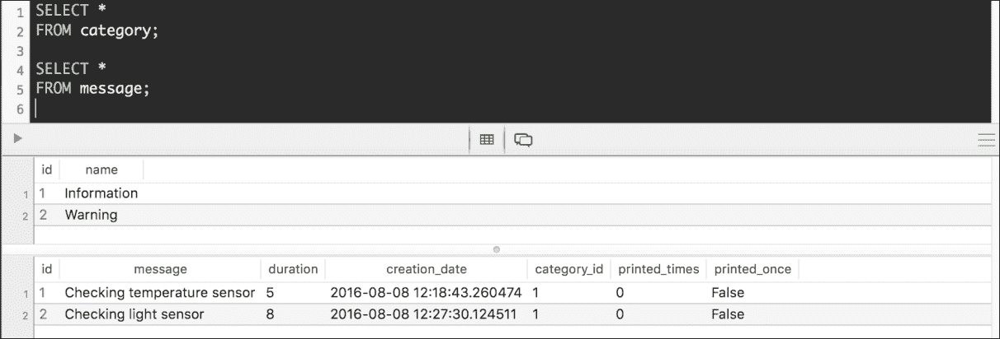
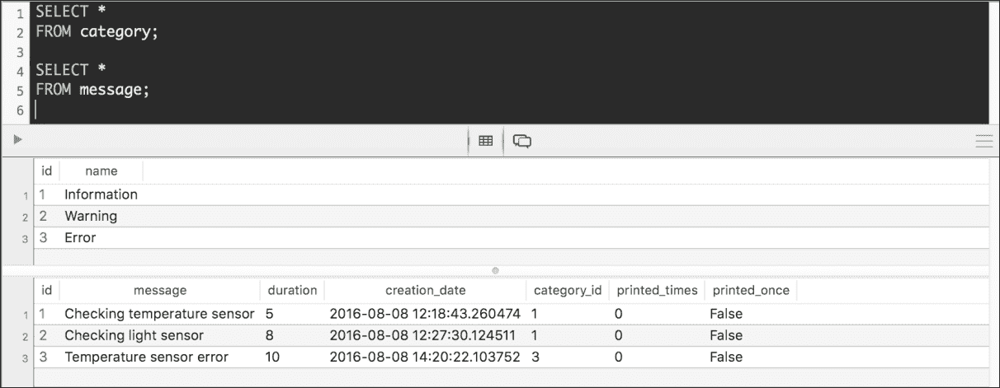

# 第六章。在 Flask 中使用模型、SQLAlchemy 和超链接 API 进行工作

在本章中，我们将扩展上一章开始构建的 RESTful API 的功能。我们将使用 SQLAlchemy 作为我们的 ORM 来与 PostgreSQL 数据库交互，并且我们将利用 Flask 和 Flask-RESTful 中包含的先进功能，这将使我们能够轻松组织代码以构建复杂的 API，如模型和蓝图。在本章中，我们将：

+   设计一个 RESTful API 以与 PostgreSQL 数据库交互

+   理解每个 HTTP 方法执行的任务

+   安装包以简化我们的常见任务

+   创建和配置数据库

+   为模型编写包含其关系的代码

+   使用模式来验证、序列化和反序列化模型

+   将蓝图与资源路由相结合

+   注册蓝图并运行迁移

+   创建和检索相关资源

# 设计一个与 PostgreSQL 数据库交互的 RESTful API

到目前为止，我们的 RESTful API 已经在充当数据存储库的简单字典上执行了 CRUD 操作。现在，我们想要使用 Flask RESTful 创建一个更复杂的 RESTful API，以与必须允许我们处理分组到消息类别中的消息的数据库模型交互。在我们的上一个 RESTful API 中，我们使用一个字符串属性来指定消息的消息类别。在这种情况下，我们希望能够轻松检索属于特定消息类别的所有消息，因此，我们将有一个消息与消息类别之间的关系。

我们必须能够对不同的相关资源和资源集合执行 CRUD 操作。以下列表列举了我们将创建以表示模型的资源和类名：

+   消息类别（`Category`模型）

+   消息（`Message`模型）

消息类别（`Category`）只需要一个整数字符串名称，而对于消息（`Message`），我们需要以下数据：

+   一个整数标识符

+   一个指向消息类别（`Category`）的外键

+   一个字符串消息

+   将指示消息在 OLED 显示屏上打印时间的秒数

+   创建日期和时间。时间戳将在将新消息添加到集合时自动添加

+   一个指示消息在 OLED 显示屏上打印次数的整数计数器

+   一个`bool`值，指示消息是否至少在 OLED 显示屏上打印过一次

### 小贴士

我们将利用与 Flask RESTful 和 SQLAlchemy 相关的许多包，这些包使得序列化和反序列化数据、执行验证以及将 SQLAlchemy 与 Flask 和 Flask RESTful 集成变得更加容易。

# 理解每个 HTTP 方法执行的任务

以下表格显示了我们的新 API 必须支持的方法的 HTTP 动词、作用域和语义。每个方法由一个 HTTP 动词、一个作用域以及所有方法对所有资源和集合都有明确定义的意义组成：

| **HTTP 动词** | **作用域** | **语义** |
| --- | --- | --- |
| `GET` | 消息类别集合 | 获取集合中所有存储的消息类别，并按名称升序排序返回它们。每个类别必须包括资源的完整 URL。每个类别必须包括一个包含属于该类别所有消息详细信息的列表。消息不必包括类别，以避免重复数据。 |
| `GET` | 消息类别 | 获取单个消息类别。该类别必须包括我们在检索消息类别集合时为每个类别解释的相同信息。 |
| `POST` | 消息类别集合 | 在集合中创建一个新的消息类别。 |
| `PATCH` | 消息类别 | 更新现有消息类别的名称。 |
| `DELETE` | 消息类别 | 删除现有的消息类别。 |
| `GET` | 消息集合 | 获取集合中所有存储的消息，按消息升序排序。每条消息必须包括其消息类别详情，包括访问相关资源的完整 URL。消息类别详情不必包括属于该类别的消息。消息必须包括访问资源的完整 URL。 |
| `GET` | 消息 | 获取单个消息。消息必须包括我们在检索消息集合时为每个消息解释的相同信息。 |
| `POST` | 消息集合 | 在集合中创建一个新的消息。 |
| `PATCH` | 消息 | 更新现有消息的以下字段：消息、持续时间、打印次数和打印一次。 |
| `DELETE` | 消息 | 删除一个现有的消息。 |

此外，我们的 RESTful API 必须支持所有资源及其集合的`OPTIONS`方法。我们将使用 SQLAlchemy 作为我们的 ORM，并将与 PostgreSQL 数据库一起工作。然而，如果你不想花时间安装 PostgreSQL，你可以使用 SQLAlchemy 支持的任何其他数据库，例如 MySQL。如果你想要最简单的数据库，你可以使用 SQLite。

在前面的表中，有许多方法和范围。以下列表列举了前面表中提到的每个范围的 URI，其中`{id}`需要替换为资源的数字 ID 或主键。正如前一个示例中发生的那样，我们希望我们的 API 在 URL 中区分集合和单个集合资源。当我们提到一个集合时，我们将使用斜杠（`/`）作为 URL 的最后一个字符，当我们提到集合的单个资源时，我们不会使用斜杠（`/`）作为 URL 的最后一个字符：

+   **消息类别集合**: `/categories/`

+   **消息类别**: `/category/{id}`

+   **消息集合**: `/messages/`

+   **消息**: `/message/{id}`

让我们假设 `http://localhost:5000/api/` 是 Flask 开发服务器上运行的 API 的 URL。我们必须使用以下 HTTP 动词 (`GET`) 和请求 URL (`http://localhost:5000/api/categories/`) 来组合和发送一个 HTTP 请求，以检索存储在集合中的所有消息类别。每个类别将包含一个列表，列出属于该类别的所有消息。

```py
GET http://localhost:5000/api/categories/ 

```

# 安装包以简化我们的常见任务

确保您已退出 Flask 的开发服务器。请记住，您只需在运行它的终端或命令提示符窗口中按 ***Ctrl*** + ***C*** 即可。现在，我们将安装许多额外的包。确保您已激活我们在上一章中创建并命名为 `Flask01` 的虚拟环境。如果您为处理此示例或下载了本书的示例代码创建了新的虚拟环境，请确保您安装了我们在上一示例中使用的包。

在激活虚拟环境后，现在是时候运行适用于 macOS、Linux 或 Windows 的相同命令了。我们可以使用单个命令使用 pip 安装所有必要的包。然而，我们将运行独立的命令，以便在特定安装失败时更容易检测到任何问题。

现在，我们必须运行以下命令使用 pip 安装 Flask-SQLAlchemy。Flask-SQLAlchemy 为 Flask 应用程序添加了对 SQLAlchemy ORM 的支持。此扩展简化了在 Flask 应用程序中执行常见 SQLAlchemy 任务。SQLAlchemy 是 Flask-SQLAlchemy 的依赖项，因此，pip 也会自动安装它：

```py
pip install Flask-SQLAlchemy

```

输出的最后几行将指示所有成功安装的包，包括 `SQLAlchemy` 和 `Flask-SQLAlchemy`：

```py
Installing collected packages: SQLAlchemy, Flask-SQLAlchemy
 Running setup.py install for SQLAlchemy
 Running setup.py install for Flask-SQLAlchemy
Successfully installed Flask-SQLAlchemy-2.1 SQLAlchemy-1.0.14

```

运行以下命令使用 pip 安装 Flask-Migrate。Flask-Migrate 使用 Alembic 包来处理 Flask 应用程序的 SQLAlchemy 数据库迁移。我们将使用 Flask-Migrate 来设置我们的 PostgreSQL 数据库。Flask-Script 是 Flask-Migrate 的一个依赖项，因此，pip 也会自动安装它。Flask-Script 为 Flask 添加了编写外部脚本的支持，包括设置数据库的脚本。

```py
pip install Flask-Migrate

```

输出的最后几行将指示所有成功安装的包，包括 `Flask-Migrate` 和 `Flask-Script`。其他已安装的包是额外的依赖项：

```py
Installing collected packages: Mako, python-editor, alembic, Flask-Script, Flask-Migrate
 Running setup.py install for Mako
 Running setup.py install for python-editor
 Running setup.py install for alembic
 Running setup.py install for Flask-Script
 Running setup.py install for Flask-Migrate
Successfully installed Flask-Migrate-2.0.0 Flask-Script-2.0.5 Mako-1.0.4 alembic-0.8.7 python-editor-1.0.1

```

运行以下命令使用 pip 安装 marshmallow。Marshmallow 是一个轻量级库，用于将复杂的数据类型转换为原生 Python 数据类型，反之亦然。Marshmallow 提供了我们可以用来验证输入数据、将输入数据反序列化为应用级对象以及将应用级对象序列化为 Python 原始类型的模式：

```py
pip install marshmallow

```

输出的最后几行将指示 `marshmallow` 已成功安装：

```py
Installing collected packages: marshmallow
Successfully installed marshmallow-2.9.1

```

运行以下命令使用 pip 安装 Marshmallow-sqlalchemy。Marshmallow-sqlalchemy 提供了与之前安装的 marshmallow 验证、序列化和反序列化轻量级库的 SQLAlchemy 集成：

```py
pip install marshmallow-sqlalchemy

```

输出的最后几行将指示`marshmallow-sqlalchemy`已成功安装：

```py
Installing collected packages: marshmallow-sqlalchemy
Successfully installed marshmallow-sqlalchemy-0.10.0

```

最后，运行以下命令使用 pip 安装 Flask-Marshmallow。Flask-Marshmallow 将之前安装的`marshmallow`库与 Flask 应用程序集成，使得生成 URL 和超链接字段变得简单：

```py
pip install Flask-Marshmallow

```

输出的最后几行将指示`Flask-Marshmallow`已成功安装：

```py
Installing collected packages: Flask-Marshmallow
Successfully installed Flask-Marshmallow-0.7.0

```

# 创建和配置数据库

现在，我们将创建一个 PostgreSQL 数据库，我们将使用它作为 API 的存储库。如果你还没有在电脑或开发服务器上运行 PostgreSQL 数据库，你需要下载并安装它。你可以从其网页：[`www.postgresql.org`](http://www.postgresql.org)下载并安装这个数据库管理系统。如果你在 macOS 上工作，`Postgres.app`提供了一个非常简单的方法来安装和使用 PostgreSQL 在这个操作系统上：[`postgresapp.com`](http://postgresapp.com)：

### 小贴士

你必须确保 PostgreSQL 的 bin 文件夹包含在`PATH`环境变量中。你应该能够从当前的终端或命令提示符中执行`psql`命令行工具。如果文件夹没有包含在 PATH 中，当你尝试安装`psycopg2`包时，你会收到一个错误，指示找不到`pg_config`文件。此外，你将不得不使用每个我们将要使用的 PostgreSQL 命令行工具的完整路径。

我们将使用 PostgreSQL 命令行工具创建一个名为`messages`的新数据库。如果你已经有一个同名 PostgreSQL 数据库，确保你在所有命令和配置中使用另一个名称。你可以使用任何 PostgreSQL GUI 工具执行相同的任务。如果你在 Linux 上开发，运行命令时必须以`postgres`用户身份。在 macOS 或 Windows 上运行以下命令以创建一个名为`messages`的新数据库。请注意，该命令不会产生任何输出：

```py
createdb messages

```

在 Linux 上，运行以下命令以使用`postgres`用户：

```py
sudo -u postgres createdb messages

```

现在，我们将使用`psql`命令行工具运行一些 SQL 语句来创建一个特定的用户，我们将在 Flask 中使用它，并为其分配必要的角色。在 macOS 或 Windows 上，运行以下命令来启动 psql：

```py
psql

```

在 Linux 上，运行以下命令以使用`postgres`用户：

```py
sudo -u psql

```

然后，运行以下 SQL 语句，最后输入 \q 以退出 psql 命令行工具。将 user_name 替换为您在新的数据库中希望使用的用户名，将 password 替换为您选择的密码。我们将在 Flask 配置中使用用户名和密码。如果您已经在 PostgreSQL 中使用特定的用户并且已经为该用户授予了数据库权限，则无需运行这些步骤。您将看到表示权限已授予的输出。

```py
CREATE ROLE user_name WITH LOGIN PASSWORD 'password';
GRANT ALL PRIVILEGES ON DATABASE messages TO user_name;
ALTER USER user_name CREATEDB;
\q

```

必须安装 Psycopg 2 软件包（psycopg2）。此软件包是一个 Python-PostgreSQL 数据库适配器，SQLAlchemy 将使用它来与我们的新创建的 PostgreSQL 数据库交互。

一旦我们确认 PostgreSQL 的 `bin` 文件夹已包含在 PATH 环境变量中，我们只需运行以下命令来安装此软件包：

```py
pip install psycopg2

```

输出的最后几行将指示 `psycopg2` 软件包已成功安装：

```py
Collecting psycopg2
Installing collected packages: psycopg2
 Running setup.py install for psycopg2
Successfully installed psycopg2-2.6.2

```

如果您正在使用我们为上一个示例创建的相同虚拟环境，`api` 文件夹已经存在。如果您创建一个新的虚拟环境，请在创建的虚拟环境根目录下创建一个名为 `api` 的文件夹。

在 `api` 文件夹内创建一个新的 `config.py` 文件。以下行显示了声明变量以确定 Flask 和 SQLAlchemy 配置的代码。`SQL_ALCHEMY_DATABASE_URI` 变量生成用于 PostgreSQL 数据库的 SQLAlchemy URI。

确保您在 `DB_NAME` 的值中指定了所需的数据库名称，并根据您的 PostgreSQL 配置配置用户、密码、主机和端口。如果您遵循了前面的步骤，请使用这些步骤中指定的设置。示例代码文件包含在 `restful_python_chapter_06_01` 文件夹中：

```py
import os 

basedir = os.path.abspath(os.path.dirname(__file__)) 
DEBUG = True 
PORT = 5000 
HOST = "127.0.0.1" 
SQLALCHEMY_ECHO = False 
SQLALCHEMY_TRACK_MODIFICATIONS = True 
SQLALCHEMY_DATABASE_URI = "postgresql://{DB_USER}:{DB_PASS}@{DB_ADDR}/{DB_NAME}".format(DB_USER="user_name", DB_PASS="password", DB_ADDR="127.0.0.1", DB_NAME="messages") 
SQLALCHEMY_MIGRATE_REPO = os.path.join(basedir, 'db_repository') 

```

我们将指定之前创建的模块作为创建 *Flask* 应用的函数的参数。这样，我们有一个模块指定了所有不同的配置变量，另一个模块创建了一个 *Flask* 应用。我们将创建 Flask 应用工厂作为我们迈向新 API 的最后一步。

# 创建具有其关系的模型

现在，我们将创建可以用来表示和持久化消息类别、消息及其关系的模型。打开 `api/models.py` 文件，并用以下代码替换其内容。与其它模型相关的字段声明在代码列表中突出显示。如果您创建了一个新的虚拟环境，请在 `api` 文件夹中创建一个新的 `models.py` 文件。示例代码文件包含在 `restful_python_chapter_06_01` 文件夹中：

```py
from marshmallow import Schema, fields, pre_load 
from marshmallow import validate 
from flask_sqlalchemy import SQLAlchemy 
from flask_marshmallow import Marshmallow 

db = SQLAlchemy() 
ma = Marshmallow() 

class AddUpdateDelete():    
    def add(self, resource): 
        db.session.add(resource) 
        return db.session.commit() 

    def update(self): 
        return db.session.commit() 

    def delete(self, resource): 
        db.session.delete(resource) 
        return db.session.commit() 

class Message(db.Model, AddUpdateDelete): 
    id = db.Column(db.Integer, primary_key=True) 
    message = db.Column(db.String(250), unique=True, nullable=False) 
    duration = db.Column(db.Integer, nullable=False) 
    creation_date = db.Column(db.TIMESTAMP, server_default=db.func.current_timestamp(), nullable=False) 
    category_id = db.Column(db.Integer, db.ForeignKey('category.id', ondelete='CASCADE'), nullable=False) 
    category = db.relationship('Category', backref=db.backref('messages', lazy='dynamic' , order_by='Message.message')) 
    printed_times = db.Column(db.Integer, nullable=False, server_default='0') 
    printed_once = db.Column(db.Boolean, nullable=False, server_default='false') 

    def __init__(self, message, duration, category): 
        self.message = message 
        self.duration = duration 
        self.category = category 

class Category(db.Model, AddUpdateDelete): 
    id = db.Column(db.Integer, primary_key=True) 
    name = db.Column(db.String(150), unique=True, nullable=False) 

    def __init__(self, name): 
        self.name = name 

```

首先，代码创建了一个名为 `db` 的 `flask_sqlalchemy.SQLAlchemy` 类的实例。这个实例将允许我们控制 Flask 应用程序的 SQLAlchemy 集成。此外，该实例将提供访问所有 SQLAlchemy 函数和类的方法。

然后，代码创建了一个名为 `ma` 的 `flask_marshmallow.Marshmallow` 类的实例。在创建 `Marshmallow` 实例之前创建 `flask_sqlalchemy.SQLAlchemy` 实例非常重要，因此在这种情况下，顺序很重要。Marshmallow 是一个包装类，它将 Mashmallow 与 *Flask* 应用程序集成。名为 `ma` 的实例将提供对 `Schema` 类、在 `marshmallow.fields` 中定义的字段以及声明在 `flask_marshmallow.fields` 中的 Flask 特定字段的访问。我们将在声明与我们的模型相关的模式时使用它们。

代码创建了一个名为 `AddUpdateDelete` 的类，该类声明了以下三个方法，通过 SQLAlchemy 会话添加、更新和删除资源：

+   `add`：此方法接收要添加的对象，并将其作为 `resource` 参数传递，然后使用接收到的资源作为参数调用 `db.session.add` 方法，在底层数据库中创建对象。最后，代码提交会话。

+   `update`：此方法只是提交会话，以持久化对底层数据库中对象所做的更改。

+   `delete`：此方法接收要删除的对象，并将其作为 `resource` 参数传递，然后使用接收到的资源作为参数调用 `db.session.delete` 方法，从底层数据库中删除对象。最后，代码提交会话。

代码声明了以下两个模型，具体来说，是两个类，作为 `db.Model` 和 `AddUpdateDelete` 类的子类：

+   `Message`

+   `Category`

我们指定了许多属性的字段类型、最大长度和默认值。表示没有任何关系的字段属性是 `db.Column` 类的实例。两个模型都声明了一个 `id` 属性，并指定了 `primary_key` 参数的 `True` 值，以指示它是主键。SQLAlchemy 将使用这些数据在 PostgreSQL 数据库中生成必要的表。

`Message` 模型使用以下行声明了 `category` 字段：

```py
category = db.relationship('Category', backref=db.backref('messages', lazy='dynamic', order_by='Message.message')) 

```

上一行使用 `db.relationship` 函数提供了到 `Category` 模型的多对一关系。`backref` 参数指定了一个调用 `db.backref` 函数的调用，其中 `'messages'` 作为第一个值，表示从相关的 `Category` 对象返回到 `Message` 对象的关系名称。`order_by` 参数指定 `'Message.message'`，因为我们希望每个类别的消息按消息字段的值升序排序。

两个模型都声明了一个构造函数，即 `__init__` 方法。`Message` 模型的构造函数接收许多参数，并使用它们来初始化具有相同名称的属性：`message`、`duration` 和 `category`。`Category` 模型的构造函数接收一个 `name` 参数，并使用它来初始化具有相同名称的属性。

# 创建用于验证、序列化和反序列化模型的模式

现在，我们将创建 Flask-Marshmallow 模式，我们将使用这些模式来验证、序列化和反序列化之前声明的`Category`和`Message`模型及其关系。打开`api/models.py`文件，在现有行之后添加以下代码。与其它模式相关的字段声明在代码列表中被突出显示。示例的代码文件包含在`restful_python_chapter_06_01`文件夹中：

```py
class CategorySchema(ma.Schema): 
    id = fields.Integer(dump_only=True) 
    name = fields.String(required=True, validate=validate.Length(3)) 
    url = ma.URLFor('api.categoryresource', id='<id>', _external=True) 
    messages = fields.Nested('MessageSchema', many=True, exclude=('category',)) 

 class MessageSchema(ma.Schema): 
    id = fields.Integer(dump_only=True) 
    message = fields.String(required=True, validate=validate.Length(1)) 
    duration = fields.Integer() 
    creation_date = fields.DateTime() 
    category = fields.Nested(CategorySchema, only=['id', 'url', 'name'], required=True) 
    printed_times = fields.Integer() 
    printed_once = fields.Boolean() 
    url = ma.URLFor('api.messageresource', id='<id>', _external=True) 

    @pre_load 
    def process_category(self, data): 
        category = data.get('category') 
        if category: 
            if isinstance(category, dict): 
                category_name = category.get('name') 
            else: 
                category_name = category 
            category_dict = dict(name=category_name)                 
        else: 
            category_dict = {} 
        data['category'] = category_dict 
        return data 

```

代码声明了以下两个模式，具体来说，是`ma.Schema`类的两个子类：

+   `CategorySchema`

+   `MessageSchema`

我们不使用 Flask-Marshmallow 提供的特性，这些特性允许我们根据模型中声明的字段自动确定每个属性的适当类型，因为我们想为每个字段使用特定的选项。我们将表示字段的属性声明为`marshmallow.fields`模块中声明的适当类的实例。当我们指定`dump_only`参数的`True`值时，这意味着我们希望该字段为只读。例如，我们无法为任何模式中的`id`字段提供值。该字段的值将由数据库中的自增主键自动生成。

`CategorySchema`类将`name`属性声明为`fields.String`的实例。将`required`参数设置为`True`以指定该字段不能为空字符串。将`validate`参数设置为`validate.Length(3)`以指定该字段必须至少有 3 个字符长。

该类通过以下行声明了`url`字段：

```py
url = ma.URLFor('api.categoryresource', id='<id>', _external=True) 

```

`url`属性是`ma.URLFor`类的实例，该字段将输出资源的完整 URL，即消息类别资源的 URL。第一个参数是 Flask 端点名称-`'api.categoryresource'`。我们将在稍后创建`CategoryResource`类，`URLFor`类将使用它来生成 URL。`id`参数指定`'<id>'`，因为我们想从要序列化的对象中提取`id`。小于（`<`）和大于（`>`）符号内的`id`字符串指定我们希望从必须序列化的对象中提取字段。`_external`属性设置为`True`，因为我们想为资源生成完整的 URL。这样，每次我们序列化`Category`时，它都会在`url`键中包含资源的完整 URL。

### 小贴士

在这种情况下，我们正在使用不安全的 API 通过 HTTP。如果我们的 API 配置为 HTTPS，那么在创建`ma.URLFor`实例时，我们应该将`_scheme`参数设置为`'https'`。

该类通过以下行声明了`messages`字段：

```py
messages = fields.Nested('MessageSchema', many=True, exclude=('category',)0029 

```

`messages` 属性是 `marshmallow.fields.Nested` 类的实例，并且这个字段将嵌套一个 `Schema` 集合，因此我们为 `many` 参数指定了 `True`。第一个参数指定了嵌套 `Schema` 类的名称，作为一个字符串。我们在定义了 `CategorySchema` 类之后声明了 `MessageSchema` 类。因此，我们指定 `Schema` 类的名称为一个字符串，而不是使用我们尚未定义的类型。

事实上，我们将最终得到两个相互嵌套的对象，也就是说，我们将在类别和消息之间创建双向嵌套。我们使用一个字符串元组作为 `exclude` 参数，以指示我们希望从为每个消息序列化的字段中排除 `category` 字段。这样，我们可以避免无限递归，因为包含类别字段将序列化与该类别相关的所有消息。

当我们声明 `Message` 模型时，我们使用了 `db.relationship` 函数来提供与 `Category` 模型的多对一关系。`backref` 参数指定了一个调用 `db.backref` 函数的调用，其中 `'messages'` 作为第一个值，表示从相关的 `Category` 对象返回到 `Message` 对象的关系名称。通过之前解释的行，我们创建了使用我们为 `db.backref` 函数指定的相同名称的消息字段。

`MessageSchema` 类将 `message` 属性声明为 `fields.String` 类的实例。`required` 参数设置为 `True`，以指定该字段不能为空字符串。`validate` 参数设置为 `validate.Length(1)`，以指定该字段必须至少有 1 个字符长。该类使用与我们在 `Message` 模型中使用的类型相对应的类声明了 `duration`、`creation_date`、`printed_times` 和 `printed_once` 字段。

类使用以下行声明了 `category` 字段：

```py
category = fields.Nested(CategorySchema, only=['id', 'url', 'name'], required=True) 

```

`category` 属性是 `marshmallow.fields.Nested` 类的实例，并且这个字段将嵌套一个 `CategorySchema`。我们为 `required` 参数指定了 `True`，因为消息必须属于一个类别。第一个参数指定了嵌套 `Schema` 类的名称。我们已经声明了 `CategorySchema` 类，因此我们指定 `CategorySchema` 作为第一个参数的值。我们使用一个包含字符串列表的唯一参数来指示在序列化嵌套 `CategorySchema` 时要包含的字段名称。我们希望包含 `id`、`url` 和 `name` 字段。我们没有指定 `messages` 字段，因为我们不希望类别序列化属于它的消息列表。

类使用以下行声明了 `url` 字段：

```py
url = ma.URLFor('api.messageresource', id='<id>', _external=True) 

```

`url`属性是`ma.URLFor`类的一个实例，这个字段将输出资源的完整 URL，即消息资源的 URL。第一个参数是 Flask 端点名称：`'api.messageresource'`。我们将在稍后创建`MessageResource`类，`URLFor`类将使用它来生成 URL。`id`参数指定为`'<id>'`，因为我们希望从要序列化的对象中提取`id`。`_external`属性设置为`True`，因为我们希望为资源生成完整的 URL。这样，每次我们序列化一个`Message`时，它将在`url`键中包含资源的完整 URL。

`MessageSchema`类声明了一个使用`@pre_load`装饰器的方法，具体来说，是`marshmallow.pre_load`。这个装饰器注册了一个在反序列化对象之前调用的方法。这样，在 Marshmallow 反序列化消息之前，`process_category`方法将被执行。

该方法接收在`data`参数中的要反序列化的数据，并返回处理后的数据。当我们收到一个`POST`新消息的请求时，可以在名为`'category'`的键中指定类别名称。如果存在具有指定名称的类别，我们将使用现有的类别作为与新的消息相关联的类别。如果不存在具有指定名称的类别，我们将创建一个新的类别，然后我们将使用这个新类别作为与新的消息相关联的类别。这样，我们使得用户创建新消息变得容易。

`data`参数可能指定了作为`'category'`键的字符串形式的类别名称。然而，在其他情况下，`'category'`键将包括具有字段名称和字段值的现有类别的键值对。`process_category`方法中的代码检查`'category'`键的值，并返回一个包含适当数据的字典，以确保我们能够使用适当的键值对反序列化类别，无论传入数据的不同。最后，这些方法返回处理后的字典。我们将在开始编写和发送 HTTP 请求到 API 时，深入探讨`process_category`方法所做的工作。

# 将蓝图与资源丰富的路由相结合

现在，我们将创建组成我们的 RESTful API 主要构建块的资源。首先，我们将创建一些实例，我们将在不同的资源中使用它们。然后，我们将创建一个`MessageResource`类，我们将使用它来表示消息资源。在`api`文件夹内创建一个新的`views.py`文件，并添加以下行。示例的代码文件包含在`restful_python_chapter_06_01`文件夹中，如下所示：

```py
from flask import Blueprint, request, jsonify, make_response 
from flask_restful import Api, Resource 
from models import db, Category, CategorySchema, Message, MessageSchema 
from sqlalchemy.exc import SQLAlchemyError 
import status 

api_bp = Blueprint('api', __name__) 
category_schema = CategorySchema() 
message_schema = MessageSchema() 
api = Api(api_bp) 

class MessageResource(Resource): 
 def get(self, id): 
        message = Message.query.get_or_404(id) 
        result = message_schema.dump(message).data 
        return result 

    def patch(self, id): 
        message = Message.query.get_or_404(id) 
        message_dict = request.get_json(force=True) 
        if 'message' in message_dict: 
            message.message = message_dict['message'] 
        if 'duration' in message_dict: 
            message.duration = message_dict['duration'] 
        if 'printed_times' in message_dict: 
            message.printed_times = message_dict['printed_times'] 
        if 'printed_once' in message_dict: 
            message.printed_once = message_dict['printed_once'] 
        dumped_message, dump_errors = message_schema.dump(message) 
        if dump_errors: 
            return dump_errors, status.HTTP_400_BAD_REQUEST 
        validate_errors = message_schema.validate(dumped_message) 
        #errors = message_schema.validate(data) 
        if validate_errors: 
            return validate_errors, status.HTTP_400_BAD_REQUEST 
        try: 
            message.update() 
            return self.get(id) 
        except SQLAlchemyError as e: 
                db.session.rollback() 
                resp = jsonify({"error": str(e)}) 
                return resp, status.HTTP_400_BAD_REQUEST 

    def delete(self, id): 
        message = Message.query.get_or_404(id) 
        try: 
            delete = message.delete(message) 
            response = make_response() 
            return response, status.HTTP_204_NO_CONTENT 
        except SQLAlchemyError as e: 
                db.session.rollback() 
                resp = jsonify({"error": str(e)}) 
                return resp, status.HTTP_401_UNAUTHORIZED 

```

前几行声明了导入并创建了以下实例，我们将在不同的类中使用它们：

+   `api_bp`: 它是`flask.Blueprint`类的一个实例，这将使我们能够将 Flask 应用程序分解为这个蓝图。第一个参数指定了我们想要注册蓝图的 URL 前缀：`'api'`。

+   `category_schema`: 它是我们在`models.py`模块中声明的`CategorySchema`类的一个实例。我们将使用`category_schema`来验证、序列化和反序列化类别。

+   `message_schema`: 它是我们在`models.py`模块中声明的`MessageSchema`类的一个实例。我们将使用`message_schema`来验证、序列化和反序列化类别。

+   `api`: 它是`flask_restful.Api`类的一个实例，代表应用程序的主要入口点。我们将之前创建的名为`api_bp`的`flask.Blueprint`实例作为参数传递，以将`Api`链接到`Blueprint`。

`MessageResource`类是`flask_restful.Resource`的子类，并声明了以下三个方法，当 HTTP 方法以相同的名称作为对表示资源的请求到达时将被调用：

+   `get`: 这个方法接收要检索的消息的 id，作为`id`参数。代码调用`Message.query.get_or_404`方法，在底层数据库中没有请求 id 的消息时返回 HTTP `404 Not Found`状态。如果消息存在，代码将调用`message_schema.dump`方法，将检索到的消息作为参数，使用`MessageSchema`实例序列化与指定`id`匹配的`Message`实例。`dump`方法接收`Message`实例，并应用在`MessageSchema`类中指定的字段过滤和输出格式化。代码返回`dump`方法返回的结果的`data`属性，即序列化的消息以 JSON 格式作为正文，带有默认的 HTTP `200 OK`状态码。

+   `delete`: 这个方法接收要删除的消息的 id，作为`id`参数。代码调用`Message.query.get_or_404`方法，在底层数据库中没有请求 id 的消息时返回 HTTP `404 Not Found`状态。如果消息存在，代码将调用`message.delete`方法，将检索到的消息作为参数，使用`Message`实例从数据库中删除自身。然后，代码返回一个空的响应体和一个`204 No Content`状态码。

+   `patch`: 此方法接收要更新或修补的消息的 id，作为`id`参数。代码调用`Message.query.get_or_404`方法，在底层数据库中没有请求 id 的消息时返回 HTTP `404 Not Found`状态。如果消息存在，代码调用`request.get_json`方法来检索请求中作为参数接收到的键值对。代码在`Message`实例的`message_dict`字典中更新特定属性，如果它们有新值：`message`。然后，代码调用`message_schema.dump`方法来检索序列化更新消息时生成的任何错误。如果有错误，代码返回错误和 HTTP `400 Bad Request`状态。如果没有生成错误，代码调用`message_schema.validate`方法来检索在验证更新消息时生成的任何错误。如果有验证错误，代码返回验证错误和 HTTP `400 Bad Request`状态。如果验证成功，代码调用 Message 实例的更新方法以在数据库中持久化更改，并返回调用之前解释的`self.get`方法的结果，其中将更新消息的 id 作为参数。这样，该方法以 JSON 格式作为主体返回序列化的更新消息，并带有默认的 HTTP `200 OK`状态码。

现在，我们将创建一个`MessageListResource`类，我们将使用它来表示消息集合。打开之前创建的`api/views.py`文件，并添加以下行。示例的代码文件包含在`restful_python_chapter_06_01`文件夹中：

```py
class MessageListResource(Resource): 
    def get(self): 
        messages = Message.query.all() 
        result = message_schema.dump(messages, many=True).data 
        return result 

    def post(self): 
        request_dict = request.get_json() 
        if not request_dict: 
            response = {'message': 'No input data provided'} 
            return response, status.HTTP_400_BAD_REQUEST 
        errors = message_schema.validate(request_dict) 
        if errors: 
            return errors, status.HTTP_400_BAD_REQUEST 
        try: 
            category_name = request_dict['category']['name'] 
            category = Category.query.filter_by(name=category_name).first() 
            if category is None: 
                # Create a new Category 
                category = Category(name=category_name) 
                db.session.add(category) 
            # Now that we are sure we have a category 
            # create a new Message 
            message = Message( 
                message=request_dict['message'], 
                duration=request_dict['duration'], 
                category=category) 
            message.add(message) 
            query = Message.query.get(message.id) 
            result = message_schema.dump(query).data 
            return result, status.HTTP_201_CREATED 
        except SQLAlchemyError as e: 
            db.session.rollback() 
            resp = jsonify({"error": str(e)}) 
            return resp, status.HTTP_400_BAD_REQUEST 

```

`MessageListResource`类是`flask_restful.Resource`的子类，并声明了以下两个方法，当在表示的资源上接收到具有相同名称的`HTTP`方法请求时将被调用：

+   `get`: 此方法返回一个包含数据库中保存的所有`Message`实例的列表。首先，代码调用`Message.query.all`方法来检索数据库中持久化的所有`Message`实例。然后，代码调用`message_schema.dump`方法，将检索到的消息和`many`参数设置为`True`以序列化对象的可迭代集合。`dump`方法将取自数据库检索到的每个`Message`实例，并应用由`MessageSchema`类指定的字段过滤和输出格式。代码返回由`dump`方法返回的结果的`data`属性，即以默认 HTTP `200 OK`状态码作为主体的 JSON 格式的序列化消息。

+   `post`: 此方法检索 JSON 体中接收到的键值对，创建一个新的`Message`实例并将其持久化到数据库中。如果指定的类别名称存在，则使用现有的类别。否则，该方法创建一个新的`Category`实例并将新消息关联到这个新类别。首先，代码调用`request.get_json`方法来检索请求中作为参数接收的键值对。然后，代码调用`message_schema.validate`方法来验证使用检索到的键值对构建的新消息。请记住，在调用验证方法之前，`MessageSchema`类将执行之前解释的`process_category`方法，因此数据将在验证之前进行处理。如果存在验证错误，代码将返回验证错误和 HTTP `400 Bad Request`状态。如果验证成功，代码将检索 JSON 体中接收到的类别名称，具体是在`'category'`键的`'name'`键的值中。然后，代码调用`Category.query.filter_by`方法来检索与检索到的类别名称匹配的类别。如果没有找到匹配项，代码将使用检索到的名称创建一个新的`Category`并将其持久化到数据库中。然后，代码创建一个新的消息，包含`message`、`duration`和适当的`Category`实例，并将其持久化到数据库中。最后，代码以 JSON 格式返回序列化的已保存消息作为正文，并带有 HTTP `201 Created`状态码。

现在，我们将创建一个`CategoryResource`类，我们将使用它来表示类别资源。打开之前创建的`api/views.py`文件，并添加以下行。示例的代码文件包含在`restful_python_chapter_06_01`文件夹中：

```py
class CategoryResource(Resource): 
    def get(self, id): 
        category = Category.query.get_or_404(id) 
        result = category_schema.dump(category).data 
        return result 

    def patch(self, id): 
        category = Category.query.get_or_404(id) 
        category_dict = request.get_json() 
        if not category_dict: 
            resp = {'message': 'No input data provided'} 
            return resp, status.HTTP_400_BAD_REQUEST 
        errors = category_schema.validate(category_dict) 
        if errors: 
            return errors, status.HTTP_400_BAD_REQUEST 
        try: 
            if 'name' in category_dict: 
                category.name = category_dict['name'] 
            category.update() 
            return self.get(id) 
        except SQLAlchemyError as e: 
                db.session.rollback() 
                resp = jsonify({"error": str(e)}) 
                return resp, status.HTTP_400_BAD_REQUEST 

    def delete(self, id): 
        category = Category.query.get_or_404(id) 
        try: 
            category.delete(category) 
            response = make_response() 
            return response, status.HTTP_204_NO_CONTENT 
        except SQLAlchemyError as e: 
                db.session.rollback() 
                resp = jsonify({"error": str(e)}) 
                return resp, status.HTTP_401_UNAUTHORIZED 

```

`CategoryResource`类是`flask_restful.Resource`的子类，并声明了以下三个方法，当在表示的资源上接收到具有相同名称的 HTTP 方法请求时将被调用：

+   `get`: 此方法接收要检索的类别的 id 作为`id`参数。如果底层数据库中没有与请求的 id 匹配的类别，代码将调用`Category.query.get_or_404`方法返回 HTTP `404 Not Found`状态。如果消息存在，代码将调用`category_schema.dump`方法，将检索到的类别作为参数，使用`CategorySchema`实例来序列化与指定的`id`匹配的`Category`实例。`dump`方法接受`Category`实例并应用在`CategorySchema`类中指定的字段过滤和输出格式。代码返回`dump`方法返回的结果的`data`属性，即作为正文的序列化消息，以 JSON 格式，并带有默认的 HTTP `200 OK`状态码。

+   `patch`：此方法接收要更新或修补的类别的 id，作为 `id` 参数。代码调用 `Category.query.get_or_404` 方法，在底层数据库中没有请求 id 的类别时返回 HTTP `404 Not Found` 状态。如果类别存在，代码调用 `request.get_json` 方法检索请求中作为参数接收的键值对。如果 `category_dict` 字典中的 `Category` 实例 `category` 有新值，则仅更新名称属性。然后，代码调用 `category_schema.validate` 方法检索在验证更新类别时生成的任何错误。如果有验证错误，代码返回验证错误和 HTTP `400 Bad Request` 状态。如果验证成功，代码调用 `Category` 实例的更新方法以将更改持久化到数据库，并返回调用之前解释的 `self.get` 方法的结果，其中以更新类别的 id 作为参数。这样，该方法以 JSON 格式序列化的更新消息作为正文返回，默认 HTTP `200 OK` 状态码。

+   `delete`：此方法接收要删除的类别的 id，作为 `id` 参数。代码调用 `Category.query.get_or_404` 方法，在底层数据库中没有请求 id 的类别时返回 HTTP `404 Not Found` 状态。如果类别存在，代码调用 `category.delete` 方法，将检索到的类别作为参数，使用 `Category` 实例将其从数据库中删除。然后，代码返回一个空的响应体和一个 `204 No Content` 状态码。

现在，我们将创建一个 `CategoryListResource` 类，我们将使用它来表示类别集合。打开之前创建的 `api/views.py` 文件，并添加以下行。示例的代码文件包含在 `restful_python_chapter_06_01` 文件夹中：

```py
class CategoryListResource(Resource): 
    def get(self): 
        categories = Category.query.all() 
        results = category_schema.dump(categories, many=True).data 
        return results 

    def post(self): 
        request_dict = request.get_json() 
        if not request_dict: 
            resp = {'message': 'No input data provided'} 
            return resp, status.HTTP_400_BAD_REQUEST 
        errors = category_schema.validate(request_dict) 
        if errors: 
            return errors, status.HTTP_400_BAD_REQUEST 
        try: 
            category = Category(request_dict['name']) 
            category.add(category) 
            query = Category.query.get(category.id) 
            result = category_schema.dump(query).data 
            return result, status.HTTP_201_CREATED 
        except SQLAlchemyError as e: 
            db.session.rollback() 
            resp = jsonify({"error": str(e)}) 
            return resp, status.HTTP_400_BAD_REQUEST 

```

`CategoryListResource` 类是 `flask_restful.Resource` 的子类，并声明了以下两个方法，当在表示的资源上接收到具有相同名称的 HTTP 方法请求时，将调用这些方法：

+   `get`：此方法返回一个包含在数据库中保存的所有 `Category` 实例的列表。首先，代码调用 `Category.query.all` 方法检索数据库中持久化的所有 `Category` 实例。然后，代码调用 `category_schema.dump` 方法，将检索到的消息和 `many` 参数设置为 `True` 以序列化对象的可迭代集合。`dump` 方法将取从数据库检索到的每个 `Category` 实例，并应用由 `CategorySchema` 类指定的字段过滤和输出格式化。代码返回由 `dump` 方法返回的结果的 `data` 属性，即以 JSON 格式序列化的消息作为正文，默认 HTTP `200 OK` 状态码。

+   `post`：此方法检索 JSON 主体中接收到的键值对，创建一个新的 `Category` 实例并将其持久化到数据库中。首先，代码调用 `request.get_json` 方法来检索作为请求参数接收到的键值对。然后，代码调用 `category_schema.validate` 方法来验证使用检索到的键值对构建的新类别。如果存在验证错误，代码将返回验证错误和 HTTP `400 请求错误` 状态。如果验证成功，代码将创建一个新的类别，并使用指定的 `name` 持久化它。最后，代码以 JSON 格式返回序列化的已保存类别作为主体，并带有 HTTP `201 已创建` 状态码。

以下表格显示了我们要为每个 HTTP 动词和作用域组合执行的先前创建的类的函数：

| **HTTP 动词** | **作用域** | **类和方法** |
| --- | --- | --- |
| `GET` | 消息集合 | MessageListResource.get |
| `GET` | 消息 | MessageResource.get |
| `POST` | 消息集合 | MessageListResource.post |
| `PATCH` | 消息 | MessageResource.patch |
| `DELETE` | 消息 | MessageResource.delete |
| `GET` | 分类集合 | CategoryListResource.get |
| `GET` | 消息 | CategoryResource.get |
| `POST` | 消息集合 | CategoryListResource.post |
| `PATCH` | 消息 | CategoryResource.patch |
| `DELETE` | 消息 | CategoryResource.delete |

如果请求导致调用一个不支持 `HTTP` 方法的资源，Flask-RESTful 将返回一个包含 HTTP `405 方法不允许` 状态码的响应。

我们必须通过定义 URL 规则来进行必要的资源路由配置，以调用适当的方法，并通过传递所有必要的参数。以下行配置了 api 的资源路由。打开之前创建的 `api/views.py` 文件，并添加以下行。示例的代码文件包含在 `restful_python_chapter_06_01` 文件夹中：

```py
api.add_resource(CategoryListResource, '/categories/') 
api.add_resource(CategoryResource, '/categories/<int:id>') 
api.add_resource(MessageListResource, '/messages/') 
api.add_resource(MessageResource, '/messages/<int:id>') 

```

每次调用 `api.add_resource` 方法都会将一个 URL 路由到一个资源，具体是到 `flask_restful.Resource` 类之前声明的子类之一。当有 API 请求且 URL 与 `api.add_resource` 方法中指定的 URL 匹配时，Flask 将调用与请求中 HTTP 动词匹配的指定类的相应方法。

# 注册蓝图和运行迁移

在 `api` 文件夹中创建一个新的 `app.py` 文件。以下行显示了创建 Flask 应用的代码。示例的代码文件包含在 `restful_python_chapter_06_01` 文件夹中。

```py
from flask import Flask 

def create_app(config_filename): 
    app = Flask(__name__) 
    app.config.from_object(config_filename) 

    from models import db 
    db.init_app(app) 

    from views import api_bp 
    app.register_blueprint(api_bp, url_prefix='/api') 

    return app 

```

`api/app.py`文件中的代码声明了一个`create_app`函数，该函数接收配置文件名作为`config_filename`参数，使用此配置文件设置一个`Flask`应用程序，并返回`app`对象。首先，该函数创建 Flask 应用程序的主要入口点，命名为`app`。然后，代码调用`app.config.from_object`方法，将接收到的`config_filename`作为参数。这样，Flask 应用程序使用作为参数接收到的 Python 模块中定义的变量指定的值来设置`Flask`应用程序的设置。

下一行调用`models`模块中创建的`flask_sqlalchemy.SQLAlchemy`实例`db`的`init_app`方法。代码将`app`作为参数传递，以将创建的 Flask 应用程序与 SQLAlchemy 实例链接起来。

下一行调用`app.register_blueprint`方法来注册在`views`模块中创建的蓝图，命名为`api_bp`。`url_prefix`参数设置为`'/api'`，因为我们希望资源以`/api`作为前缀可用。现在`http://localhost:5000/api/`将是运行在 Flask 开发服务器上的 API 的 URL。最后，函数返回`app`对象。

在`api`文件夹内创建一个新的`run.py`文件。以下行展示了使用之前定义的`create_app`函数创建 Flask 应用程序并运行的相关代码。示例代码文件包含在`restful_python_chapter_06_01`文件夹中。

```py
from app import create_app 

app = create_app('config') 

if __name__ == '__main__': 
    app.run(host=app.config['HOST'], 
            port=app.config['PORT'], 
            debug=app.config['DEBUG']) 

```

`api/run.py`文件中的代码调用在`app`模块中声明的`create_app`函数，参数为`'config'`。该函数将以该模块作为配置文件设置一个`Flask`应用程序。

最后一行只是调用`app.run`方法，以从`config`模块读取的主机、端口和调试值启动 Flask 应用程序。代码通过调用`run`方法立即启动本地服务器。记住，我们也可以使用`flask`命令行脚本来达到相同的目的。

在`api`文件夹内创建一个新的`migrate.py`文件。以下行展示了使用`flask_script`和`flask_migrate`运行迁移的代码。示例代码文件包含在`restful_python_chapter_06_01`文件夹中：

```py
from flask_script import Manager 
from flask_migrate import Migrate, MigrateCommand 
from models import db 
from run import app 

migrate = Migrate(app, db) 
manager = Manager(app) 
manager.add_command('db', MigrateCommand) 

if __name__ == '__main__': 
    manager.run() 

```

代码创建了一个`flask_migrate.Migrate`实例，该实例使用之前在`run`模块中解释的`app`模块创建的`Flask`应用程序和`models`模块中创建的`flask_sqlalchemy.SQLAlchemy`实例`db`。然后，代码创建了一个`flask_script.Manager`类，将 Flask 应用程序作为参数传递，并将它的引用保存在`manager`变量中。下一行调用`add_command`方法，参数为`'db'`和`MigrateCommand`。主函数调用`Manager`实例的`run`方法。

这样，在扩展初始化后，代码向命令行选项中添加了一个 db 组。该 db 组有许多子命令，我们将通过`migrate.py`脚本使用这些子命令。

现在，我们将运行脚本以在 PostgreSQL 数据库中运行迁移并生成必要的表。请确保您在激活了虚拟环境的终端或命令提示符窗口中运行脚本，并且您位于`api`文件夹中。

运行第一个脚本，该脚本初始化应用程序的迁移支持。

```py
python migrate.py db init

```

以下行显示了运行之前的脚本后生成的示例输出。您的输出将根据您创建虚拟环境的基准文件夹而有所不同：

```py
Creating directory /Users/gaston/PythonREST/Flask02/api/migrations ... done
Creating directory /Users/gaston/PythonREST/Flask02/api/migrations/versions ... done
Generating /Users/gaston/PythonREST/Flask02/api/migrations/alembic.ini ... done
Generating /Users/gaston/PythonREST/Flask02/api/migrations/env.py ... done
Generating /Users/gaston/PythonREST/Flask02/api/migrations/README ... done
Generating /Users/gaston/PythonREST/Flask02/api/migrations/script.py.mako ... done
Please edit configuration/connection/logging settings in
'/Users/gaston/PythonREST/Flask02/api/migrations/alembic.ini' before proceeding.

```

脚本在`api`文件夹内生成了一个名为`migrations`的子文件夹，其中包含一个名为`versions`的子文件夹和许多其他文件。

运行第二个脚本，该脚本将检测到的模型更改填充到迁移脚本中。在这种情况下，这是我们第一次填充迁移脚本，因此迁移脚本将生成将持久化我们的两个模型（`Category`和`Message`）的表：

```py
python migrate.py db migrate

```

以下行显示了运行之前的脚本后生成的示例输出。您的输出将根据您创建虚拟环境的基准文件夹而有所不同：

```py
INFO  [alembic.runtime.migration] Context impl PostgresqlImpl.
INFO  [alembic.runtime.migration] Will assume transactional DDL.
INFO  [alembic.autogenerate.compare] Detected added table 'category'
INFO  [alembic.autogenerate.compare] Detected added table 'message'
 Generating /Users/gaston/PythonREST/Flask02/api/migrations/versions/417543056ac3_.py ... done

```

输出指示`api/migrations/versions/417543056ac3_.py`文件包含了创建`category`和`message`表的代码。以下行显示了基于模型自动生成的此文件的代码。请注意，在您的配置中文件名将会不同。示例的代码文件包含在`restful_python_chapter_06_01`文件夹中：

```py
"""empty message 

Revision ID: 417543056ac3 
Revises: None 
Create Date: 2016-08-08 01:05:31.134631 

""" 

# revision identifiers, used by Alembic. 
revision = '417543056ac3' 
down_revision = None 

from alembic import op 
import sqlalchemy as sa 

def upgrade(): 
    ### commands auto generated by Alembic - please adjust! ### 
    op.create_table('category', 
    sa.Column('id', sa.Integer(), nullable=False), 
    sa.Column('name', sa.String(length=150), nullable=False), 
    sa.PrimaryKeyConstraint('id'), 
    sa.UniqueConstraint('name') 
    ) 
    op.create_table('message', 
    sa.Column('id', sa.Integer(), nullable=False), 
    sa.Column('message', sa.String(length=250), nullable=False), 
    sa.Column('duration', sa.Integer(), nullable=False), 
    sa.Column('creation_date', sa.TIMESTAMP(), server_default=sa.text('CURRENT_TIMESTAMP'), nullable=False), 
    sa.Column('category_id', sa.Integer(), nullable=False), 
    sa.Column('printed_times', sa.Integer(), server_default='0', nullable=False), 
    sa.Column('printed_once', sa.Boolean(), server_default='false', nullable=False), 
    sa.ForeignKeyConstraint(['category_id'], ['category.id'], ondelete='CASCADE'), 
    sa.PrimaryKeyConstraint('id'), 
    sa.UniqueConstraint('message') 
    ) 
    ### end Alembic commands ### 

def downgrade(): 
    ### commands auto generated by Alembic - please adjust! ### 
    op.drop_table('message') 
    op.drop_table('category') 
    ### end Alembic commands ### 

```

代码定义了两个函数：`upgrade`和`downgrade`。`upgrade`函数通过调用`alembic.op.create_table`来运行创建`category`和`message`表的必要代码。`downgrade`函数运行必要的代码以回到上一个版本。

运行第三个脚本以升级数据库：

```py
python migrate.py db upgrade

```

以下行显示了运行之前的脚本后生成的示例输出：

```py
INFO  [alembic.runtime.migration] Context impl PostgresqlImpl.
INFO  [alembic.runtime.migration] Will assume transactional DDL.
INFO  [alembic.runtime.migration] Running upgrade  -> 417543056ac3, empty message

```

之前的脚本调用了在自动生成的`api/migrations/versions/417543056ac3_.py`脚本中定义的`upgrade`函数。别忘了在您的配置中文件名将会不同。

在我们运行之前的脚本后，我们可以使用 PostgreSQL 命令行或任何允许我们轻松验证 PostreSQL 数据库内容的其他应用程序来检查迁移生成的表。

运行以下命令以列出生成的表。如果您使用的数据库名称不是`messages`，请确保您使用适当的数据库名称。

```py
psql --username=user_name --dbname=messages --command="\dt"

```

以下行显示了所有生成的表名的输出：

```py
 List of relations
 Schema |      Name       | Type  |   Owner 
--------+-----------------+-------+-----------
 public | alembic_version | table | user_name
 public | category        | table | user_name
 public | message         | table | user_name
(3 rows)

```

SQLAlchemy 根据我们模型中包含的信息生成了表、唯一约束和外键。

+   `category`：持久化`Category`模型。

+   `message`：持久化`Message`模型。

以下命令将允许您在我们编写并发送 HTTP 请求到 RESTful API 并对两个表执行 CRUD 操作后检查四个表的内容。这些命令假设您在运行命令的同一台计算机上运行 PostgreSQL：

```py
psql --username=user_name --dbname=messages --command="SELECT * FROM category;"
psql --username=user_name --dbname=messages --command="SELECT * FROM message;"

```

### 提示

您可以使用 GUI 工具而不是 PostgreSQL 命令行实用程序来检查 PostgreSQL 数据库的内容。您还可以使用您最喜欢的 IDE 中包含的数据库工具来检查 SQLite 数据库的内容。

Alembic 生成了一个名为 `alembic_version` 的附加表，该表在 `version_num` 列中保存数据库的版本号。这个表使得迁移脚本能够检索数据库的当前版本，并根据我们的需求升级或降级它。

# 创建和检索相关资源

现在，我们可以运行`api/run.py`脚本以启动 Flask 的开发模式。在 api 文件夹中执行以下命令。

```py
python run.py

```

以下行显示了执行上述命令后的输出。开发服务器正在端口 `5000` 上监听。

```py
 * Running on http://127.0.0.1:5000/ (Press CTRL+C to quit)
 * Restarting with stat
 * Debugger is active!
 * Debugger pin code: 198-040-402

```

现在，我们将使用 HTTPie 命令或其 curl 等效命令来编写并发送 HTTP 请求到 API。对于需要额外数据的请求，我们将使用 JSON。请记住，您可以使用您喜欢的基于 GUI 的工具执行相同的任务。

首先，我们将编写并发送 HTTP 请求来创建两个消息类别：

```py
http POST :5000/api/categories/ name='Information'
http POST :5000/api/categories/ name='Warning'

```

以下是与 `curl` 命令等效的命令：

```py
curl -iX POST -H "Content-Type: application/json" -d '{"name":"Information"}' :5000/api/categories/
curl -iX POST -H "Content-Type: application/json" -d '{"name":"Warning"}' :5000/api/categories/

```

上述命令将编写并发送两个带有指定 JSON 键值对的 `POST` HTTP 请求。请求指定 `/api/categories/`，因此它们将匹配 `api_bp` 蓝图的 `'/api'url_prefix`。然后，请求将匹配 `'/categories/'` URL 路由，并运行 `CategoryList.post` 方法。由于 URL 路由不包含任何参数，该方法不接收任何参数。由于请求的 HTTP 动词是 `POST`，Flask 调用 `post` 方法。如果两个新的 `Category` 实例成功持久化到数据库中，这两个调用将返回 `HTTP 201 Created` 状态码，并在响应体中将最近持久化的 `Category` 序列化为 JSON。以下行显示了两个 HTTP 请求的示例响应，其中包含 JSON 响应中的新 `Category` 对象。

注意，响应包括创建的类别的 URL，`url`。在两种情况下，`messages`数组都是空的，因为没有与每个新类别相关的消息：

```py
HTTP/1.0 201 CREATED
Content-Length: 116
Content-Type: application/json
Date: Mon, 08 Aug 2016 05:26:58 GMT
Server: Werkzeug/0.11.10 Python/3.5.1
{
 "id": 1, 
 "messages": [], 
 "name": "Information", 
 "url": "http://localhost:5000/api/categories/1"
}
HTTP/1.0 201 CREATED
Content-Length: 112
Content-Type: application/json
Date: Mon, 08 Aug 2016 05:27:05 GMT
Server: Werkzeug/0.11.10 Python/3.5.1
{
 "id": 2, 
 "messages": [], 
 "name": "Warning", 
 "url": "http://localhost:5000/api/categories/2"
}

```

现在，我们将编写并发送 HTTP 请求来创建两个属于我们最近创建的第一个消息类别的消息：`信息`。我们将使用所需消息类别的名称指定`category`键。持久化`Message`模型的数据库表将保存与名称值匹配的关联`Category`的主键值：

```py
http POST :5000/api/messages/ message='Checking temperature sensor' duration=5 category="Information"
http POST :5000/api/messages/ message='Checking light sensor' duration=8 category="Information"

```

以下是对应的 `curl` 命令：

```py
curl -iX POST -H "Content-Type: application/json" -d '{"message":" Checking temperature sensor", "category":"Information"}' :5000/api/messages/
curl -iX POST -H "Content-Type: application/json" -d '{"message":" Checking light sensor", "category":"Information"}' :5000/api/messages/

```

第一个命令将编写并发送以下 HTTP 请求：`POST http://localhost:5000/api/messages/`，并带有以下 JSON 键值对：

```py
{  
    "message": "Checking temperature sensor",  
    "category": "Information" 
} 

```

第二个命令将使用以下 JSON 键值对编写并发送相同的 HTTP 请求：

```py
{  
    "message": "Checking light sensor",  
    "category": "Information" 
} 

```

请求指定了 `/api/categories/`，因此，它们将与 `api_bp` 蓝图的 `'/api'url_prefix` 匹配。然后，请求将与 `MessageList` 资源的 `'/messages/'` URL 路由匹配，并运行 `MessageList.post` 方法。由于 URL 路由不包含任何参数，该方法不接收任何参数。由于请求的 HTTP 动词是 `POST`，Flask 调用 `post` 方法。`MessageSchema.process_category` 方法将处理类别的数据，而 `MessageListResource.post` 方法将从数据库中检索与指定的类别名称匹配的 `Category`，用作新消息的相关类别。如果两个新的 `Message` 实例成功持久化到数据库中，这两个调用将返回 `HTTP 201 Created` 状态码，并在响应体中将最近持久化的 `Message` 序列化为 JSON。以下行显示了两个 HTTP 请求的示例响应，其中包含 JSON 响应中的新 `Message` 对象。请注意，响应包括创建消息的 URL，即 `url`。此外，响应还包括相关类别的 `id`、`name` 和 `url`。

```py
HTTP/1.0 201 CREATED
Content-Length: 369
Content-Type: application/json
Date: Mon, 08 Aug 2016 15:18:43 GMT
Server: Werkzeug/0.11.10 Python/3.5.1
{
 "category": {
 "id": 1, 
 "name": "Information", 
 "url": "http://localhost:5000/api/categories/1"
 }, 
 "creation_date": "2016-08-08T12:18:43.260474+00:00", 
 "duration": 5, 
 "id": 1, 
 "message": "Checking temperature sensor", 
 "printed_once": false, 
 "printed_times": 0, 
 "url": "http://localhost:5000/api/messages/1"
}
HTTP/1.0 201 CREATED
Content-Length: 363
Content-Type: application/json
Date: Mon, 08 Aug 2016 15:27:30 GMT
Server: Werkzeug/0.11.10 Python/3.5.1
{
 "category": {
 "id": 1, 
 "name": "Information", 
 "url": "http://localhost:5000/api/categories/1"
 }, 
 "creation_date": "2016-08-08T12:27:30.124511+00:00", 
 "duration": 8, 
 "id": 2, 
 "message": "Checking light sensor", 
 "printed_once": false, 
 "printed_times": 0, 
 "url": "http://localhost:5000/api/messages/2"
}

```

我们可以运行前面的命令来检查在 PostgreSQL 数据库中创建的迁移的表内容。我们会注意到 `message` 表的 `category_id` 列保存了 `category` 表中相关行的主键值。`MessageSchema` 类使用 `fields.Nested` 实例来渲染相关 `Category` 的 `id`、`url` 和名称字段。以下截图显示了在运行 HTTP 请求后 PostgreSQL 数据库中 `category` 和 `message` 表的内容：



现在，我们将编写并发送一个 HTTP 请求来检索包含两个消息的类别，即 id 或主键等于 `1` 的类别资源。不要忘记将 `1` 替换为您配置中名称等于 `'Information'` 的类别的主键值：

```py
http :5000/api/categories/1

```

以下是对应的 curl 命令：

```py
curl -iX GET :5000/api/categories/1

```

前面的命令将组合并发送一个 `GET` HTTP 请求。请求在 `/api/categories/` 后面有一个数字，因此，它将匹配 `'/categories/<int:id>'` 并运行 `CategoryResource.get` 方法，即 `CategoryResource` 类的 `get` 方法。如果数据库中存在具有指定 id 的 `Category` 实例，该方法调用将返回 `HTTP200 OK` 状态码，并在响应体中将 `Category` 实例序列化为 JSON。`CategorySchema` 类使用一个 `fields.Nested` 实例来渲染与类别相关的所有消息的字段，除了类别字段。以下行显示了一个示例响应：

```py
HTTP/1.0 200 OK
Content-Length: 1078
Content-Type: application/json
Date: Mon, 08 Aug 2016 16:09:10 GMT
Server: Werkzeug/0.11.10 Python/3.5.1
{
 "id": 1, 
 "messages": [
 {
 "category": {
 "id": 1, 
 "name": "Information", 
 "url": "http://localhost:5000/api/categories/1"
 }, 
 "creation_date": "2016-08-08T12:27:30.124511+00:00", 
 "duration": 8, 
 "id": 2, 
 "message": "Checking light sensor", 
 "printed_once": false, 
 "printed_times": 0, 
 "url": "http://localhost:5000/api/messages/2"
 }, 
 {
 "category": {
 "id": 1, 
 "name": "Information", 
 "url": "http://localhost:5000/api/categories/1"
 }, 
 "creation_date": "2016-08-08T12:18:43.260474+00:00", 
 "duration": 5, 
 "id": 1, 
 "message": "Checking temperature sensor", 
 "printed_once": false, 
 "printed_times": 0, 
 "url": "http://localhost:5000/api/messages/1"
 }
 ], 
 "name": "Information", 
 "url": "http://localhost:5000/api/categories/1"
}

```

现在，我们将组合并发送一个 `POST` HTTP 请求来创建一个与不存在类别名称相关的消息：`'Error'`：

```py
http POST :5000/api/messages/ message='Temperature sensor error' duration=10 category="Error"

```

以下是对应的 curl 命令：

```py
curl -iX POST -H "Content-Type: application/json" -d '{"message":" Temperature sensor error", "category":"Error"}' :5000/api/messages/

```

`CategoryListResource.post` 方法无法检索一个 `name` 等于指定值的 `Category` 实例，因此，该方法将创建一个新的 `Category`，保存它并将其用作新消息的相关类别。以下行显示了一个 HTTP 请求的示例响应，其中包含 JSON 响应中的新 `Message` 对象以及与消息相关的新 `Category` 对象的详细信息：

```py
HTTP/1.0 201 CREATED
Content-Length: 361
Content-Type: application/json
Date: Mon, 08 Aug 2016 17:20:22 GMT
Server: Werkzeug/0.11.10 Python/3.5.1
{
 "category": {
 "id": 3, 
 "name": "Error", 
 "url": "http://localhost:5000/api/categories/3"
 }, 
 "creation_date": "2016-08-08T14:20:22.103752+00:00", 
 "duration": 10, 
 "id": 3, 
 "message": "Temperature sensor error", 
 "printed_once": false, 
 "printed_times": 0, 
 "url": "http://localhost:5000/api/messages/3"
}

```

我们可以运行前面解释的命令来检查在 PostgreSQL 数据库中由迁移创建的表的内容。当我们创建新消息时，我们会注意到类别表中出现了一行新行，其中包含最近添加的类别。以下屏幕截图显示了在运行 HTTP 请求后 PostgreSQL 数据库中 `category` 和 `message` 表的内容：



# 测试你的知识

1.  Marshmallow 是：

    1.  一个用于将复杂数据类型转换为和从原生 Python 数据类型转换的轻量级库。

    1.  一个 ORM。

    1.  一个轻量级 Web 框架，用于替代 Flask。

1.  SQLAlchemy 是：

    1.  一个用于将复杂数据类型转换为和从原生 Python 数据类型转换的轻量级库。

    1.  一个 ORM。

    1.  一个轻量级 Web 框架，用于替代 Flask。

1.  `marshmallow.pre_load` 装饰器：

    1.  在创建 `MessageSchema` 类的任何实例之后注册一个要运行的方法。

    1.  在序列化对象之后注册一个要调用的方法。

    1.  在反序列化对象之前注册一个要调用的方法。

1.  任何 Schema 子类实例的 `dump` 方法：

    1.  将 URL 路由到 Python 原语。

    1.  将作为参数传递的实例或实例集合持久化到数据库。

    1.  接受作为参数传递的实例或实例集合，并将 Schema 子类中指定的字段过滤和输出格式应用于实例或实例集合。

1.  当我们声明一个属性为 `marshmallow.fields.Nested` 类的实例时：

    1.  该字段将根据 `many` 参数的值嵌套单个 `Schema` 或 `Schema` 的集合。

    1.  该字段将嵌套一个单个 `Schema`。如果我们想嵌套一个 `Schema` 集合，我们必须使用 `marshmallow.fields.NestedCollection` 类的实例。

    1.  该字段将嵌套一个 `Schema` 集合。如果我们想嵌套一个单个 `Schema`，我们必须使用 `marshmallow.fields.NestedSingle` 类的实例。

# 摘要

在本章中，我们扩展了上一章中创建的 RESTful API 的功能。我们使用 SQLAlchemy 作为我们的 ORM 与 PostgreSQL 数据库一起工作。我们安装了许多包以简化许多常见任务，为模型及其关系编写了代码，并使用模式来验证、序列化和反序列化这些模型。

我们将蓝图与资源路由相结合，能够从模型生成数据库。我们对 RESTful API 发送了许多 HTTP 请求，并分析了每个 HTTP 请求在我们的代码中是如何处理的，以及模型如何在数据库表中持久化。

现在我们已经使用 Flask、Flask-RESTful 和 SQLAlchemy 构建了一个复杂的 API，我们将使用额外的功能并添加安全性和认证，这是我们将在下一章中讨论的内容。
