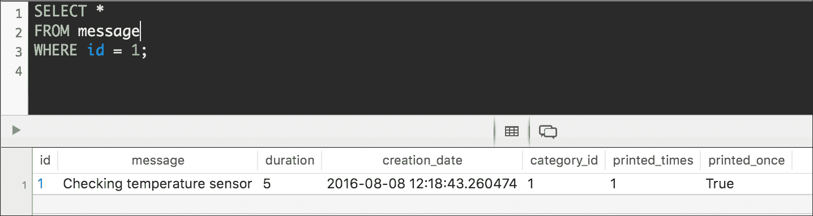
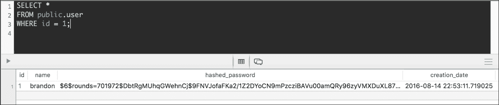

# 第七章. 使用 Flask 改进和添加认证到 API

在本章中，我们将改进上一章中开始构建的 RESTful API，并将与之相关的认证安全添加到其中。我们将：

+   改进模型中的唯一约束

+   使用`PATCH`方法更新资源的字段

+   编写一个通用的分页类

+   为 API 添加分页功能

+   理解添加认证和权限的步骤

+   添加用户模型

+   创建一个模式来验证、序列化和反序列化用户

+   为资源添加认证

+   创建用于处理用户的资源类

+   运行迁移以生成用户表

+   使用必要的认证组合请求

# 改进模型中的唯一约束

当我们创建`Category`模型时，我们在创建名为`name`的`db.Column`实例时指定了唯一参数的`True`值。因此，迁移生成了必要的唯一约束，以确保`name`字段在`category`表中具有唯一值。这样，数据库将不允许我们为`category.name`插入重复值。然而，当我们尝试这样做时生成的错误信息并不清晰。

运行以下命令以创建一个具有重复名称的类别。已经存在一个名为`'Information'`的现有类别：

```py
http POST :5000/api/categories/ name='Information'

```

以下是对应的`curl`命令：

```py
curl -iX POST -H "Content-Type: application/json" -d '{"name":"Information"}'
    :5000/api/categories/

```

之前的命令将组合并发送一个带有指定 JSON 键值对的`POST` HTTP 请求。`category.name`字段中的唯一约束将不允许数据库表持久化新的类别。因此，请求将返回一个带有完整性错误信息的 HTTP `400 Bad Request`状态码。以下行显示了示例响应：

```py
HTTP/1.0 400 BAD REQUEST
Content-Length: 282
Content-Type: application/json
Date: Mon, 15 Aug 2016 03:53:27 GMT
Server: Werkzeug/0.11.10 Python/3.5.1
{
 "error": "(psycopg2.IntegrityError) duplicate key value violates unique
         constraint "category_name_key"\nDETAIL:  Key (name)=(Information)
         already exists.\n [SQL: 'INSERT INTO category (name) VALUES (%(name)s)
         RETURNING category.id'] [parameters: {'name': 'Information'}]"
}

```

显然，错误信息非常技术化，提供了太多关于数据库和失败查询的细节。我们可能会解析错误信息以自动生成一个更用户友好的错误信息。然而，我们不想尝试插入一个我们知道会失败的行。我们将在尝试持久化之前添加代码以确保类别是唯一的。当然，仍然有可能在我们运行代码和将更改持久化到数据库之间，有人插入了一个具有相同名称的类别，这表明类别名称是唯一的。然而，这种情况的可能性较低，我们可以降低之前显示的错误信息被显示的可能性。

### 小贴士

在一个生产就绪的 REST API 中，我们永远不应该返回由 SQLAlchemy 或其他数据库相关数据返回的错误信息，因为这可能包括我们不希望 API 用户能够检索的敏感数据。在这种情况下，我们返回所有错误是为了调试目的，并能够改进我们的 API。

现在，我们将在 `Category` 类中添加一个新的类方法，以便我们能够确定名称是否唯一。打开 `api/models.py` 文件，在 `Category` 类的声明中添加以下行。示例代码文件包含在 `restful_python_chapter_07_01` 文件夹中：

```py
    @classmethod 
    def is_unique(cls, id, name): 
        existing_category = cls.query.filter_by(name=name).first() 
        if existing_category is None: 
            return True 
        else: 
            if existing_category.id == id: 
                return True 
            else: 
                return False 

```

新的 `Category.is_unique` 类方法接收我们想要确保具有唯一名称的类别的 `id` 和 `name`。如果类别是新的且尚未保存，我们将收到 `id` 值为 `0`。否则，我们将收到作为参数传递的类别 `id`。

该方法调用当前类的 `query.filter_by` 方法来检索一个名称与另一个类别名称匹配的类别。如果存在匹配条件的类别，则方法将仅在 `id` 与参数中接收的 `id` 相同时返回 `True`。如果没有类别匹配条件，则方法将返回 `True`。

我们将在创建并持久化之前使用之前创建的类方法来检查类别是否唯一。打开 `api/views.py` 文件，并用以下行替换 `CategoryListResource` 类中声明的现有 `post` 方法。已添加或修改的行已突出显示。示例代码文件包含在 `restful_python_chapter_07_01` 文件夹中：

```py
    def post(self): 
        request_dict = request.get_json() 
        if not request_dict: 
            resp = {'message': 'No input data provided'} 
            return resp, status.HTTP_400_BAD_REQUEST 
        errors = category_schema.validate(request_dict) 
        if errors: 
            return errors, status.HTTP_400_BAD_REQUEST 
        category_name = request_dict['name'] 
        if not Category.is_unique(id=0, name=category_name): 
            response = {'error': 'A category with the same name already exists'} 
            return response, status.HTTP_400_BAD_REQUEST 
        try:  
            category = Category(category_name) 
            category.add(category) 
            query = Category.query.get(category.id) 
            result = category_schema.dump(query).data 
            return result, status.HTTP_201_CREATED 
            except SQLAlchemyError as e: 
            db.session.rollback() 
            resp = {"error": str(e)} 
            return resp, status.HTTP_400_BAD_REQUEST 

```

现在，我们将在 `CategoryResource.patch` 方法中执行相同的验证。打开 `api/views.py` 文件，并用以下行替换 `CategoryResource` 类中声明的现有 `patch` 方法。已添加或修改的行已突出显示。示例代码文件包含在 `restful_python_chapter_07_01` 文件夹中：

```py
    def patch(self, id): 
        category = Category.query.get_or_404(id) 
        category_dict = request.get_json() 
        if not category_dict: 
            resp = {'message': 'No input data provided'} 
            return resp, status.HTTP_400_BAD_REQUEST 
        errors = category_schema.validate(category_dict) 
        if errors: 
            return errors, status.HTTP_400_BAD_REQUEST 
        try: 
            if 'name' in category_dict: 
                category_name = category_dict['name']  
                if Category.is_unique(id=id, name=category_name): 
                    category.name = category_name 
                else: 
                    response = {'error': 'A category with the same name already
 exists'} 
                    return response, status.HTTP_400_BAD_REQUEST 
            category.update() 
            return self.get(id) 
                except SQLAlchemyError as e: 
                db.session.rollback() 
                resp = {"error": str(e)} 
                return resp, status.HTTP_400_BAD_REQUEST 

```

运行以下命令再次创建一个具有重复名称的类别：

```py
http POST :5000/api/categories/ name='Information'

```

以下是对应的 `curl` 命令：

```py
curl -iX POST -H "Content-Type: application/json" -d '{"name":"Information"}'
    :5000/api/categories/

```

之前的命令将组合并发送一个带有指定 JSON 键值对的 `POST` HTTP 请求。我们所做的更改将生成一个带有用户友好错误消息的响应，并避免尝试持久化更改。请求将返回一个带有 JSON 主体中错误消息的 HTTP `400 Bad Request` 状态码。以下行显示了一个示例响应：

```py
HTTP/1.0 400 BAD REQUEST
Content-Length: 64
Content-Type: application/json
Date: Mon, 15 Aug 2016 04:38:43 GMT
Server: Werkzeug/0.11.10 Python/3.5.1
{
 "error": "A category with the same name already exists"
}

```

现在，我们将在 `Message` 类中添加一个新的 `class` 方法，以便我们能够确定消息是否唯一。打开 `api/models.py` 文件，在 `Message` 类的声明中添加以下行。示例代码文件包含在 `restful_python_chapter_07_01` 文件夹中：

```py
    @classmethod 
    def is_unique(cls, id, message): 
        existing_message = cls.query.filter_by(message=message).first() 
        if existing_message is None: 
            return True 
        else: 
            if existing_message.id == id: 
                return True 
            else: 
                return False 

```

新的 `Message.is_unique` 类方法接收我们想要确保消息字段具有唯一值的消息的 `id` 和 `message`。如果消息是新的且尚未保存，我们将收到 `id` 值为 `0`。否则，我们将收到作为参数传递的消息 `id`。

该方法调用当前类的`query.filter_by`方法来检索一个消息字段与另一个消息的消息字段匹配的消息。如果存在符合条件的信息，则方法将仅在 id 与参数中接收到的 id 相同时返回`True`。如果没有消息符合条件，则方法将返回`True`。

我们将在创建并持久化到`MessageListResource.post`方法之前，使用之前创建的类方法来检查消息是否唯一。打开`api/views.py`文件，将`MessageListResource`类中声明的现有`post`方法替换为以下行。已添加或修改的行已突出显示。示例的代码文件包含在`restful_python_chapter_07_01`文件夹中：

```py
    def post(self): 
        request_dict = request.get_json() 
        if not request_dict: 
            response = {'message': 'No input data provided'} 
            return response, status.HTTP_400_BAD_REQUEST 
        errors = message_schema.validate(request_dict) 
        if errors: 
            return errors, status.HTTP_400_BAD_REQUEST 
        message_message = request_dict['message'] 
        if not Message.is_unique(id=0, message=message_message): 
            response = {'error': 'A message with the same message already
 exists'} 
            return response, status.HTTP_400_BAD_REQUEST 
        try: 
            category_name = request_dict['category']['name'] 
            category = Category.query.filter_by(name=category_name).first() 
            if category is None: 
                # Create a new Category 
                category = Category(name=category_name) 
                db.session.add(category) 
            # Now that we are sure we have a category 
            # create a new Message 
            message = Message( 
                message=message_message, 
                duration=request_dict['duration'], 
                category=category) 
            message.add(message) 
            query = Message.query.get(message.id) 
            result = message_schema.dump(query).data 
            return result, status.HTTP_201_CREATED 
        except SQLAlchemyError as e: 
            db.session.rollback() 
            resp = {"error": str(e)} 
            return resp, status.HTTP_400_BAD_REQUEST 

```

现在，我们将在`MessageResource.patch`方法中执行相同的验证。打开`api/views.py`文件，将`MessageResource`类中声明的现有`patch`方法替换为以下行。已添加或修改的行已突出显示。示例的代码文件包含在`restful_python_chapter_07_01`文件夹中：

```py
    def patch(self, id): 
        message = Message.query.get_or_404(id) 
        message_dict = request.get_json(force=True) 
        if 'message' in message_dict: 
            message_message = message_dict['message']  
            if Message.is_unique(id=id, message=message_message): 
                message.message = message_message 
            else: 
                response = {'error': 'A message with the same message already
 exists'} 
                return response, status.HTTP_400_BAD_REQUEST 
        if 'duration' in message_dict: 
            message.duration = message_dict['duration'] 
        if 'printed_times' in message_dict: 
            message.printed_times = message_dict['printed_times'] 
        if 'printed_once' in message_dict: 
            message.printed_once = message_dict['printed_once'] 
        dumped_message, dump_errors = message_schema.dump(message) 
        if dump_errors: 
            return dump_errors, status.HTTP_400_BAD_REQUEST 
        validate_errors = message_schema.validate(dumped_message) 
        if validate_errors: 
            return validate_errors, status.HTTP_400_BAD_REQUEST 
        try: 
            message.update() 
            return self.get(id) 
        except SQLAlchemyError as e: 
                db.session.rollback() 
                resp = {"error": str(e)} 
                return resp, status.HTTP_400_BAD_REQUEST 

```

运行以下命令以创建一个消息字段值为重复的消息：

```py
http POST :5000/api/messages/ message='Checking temperature sensor' duration=25 category="Information"

```

以下是对应的`curl`命令：

```py
curl -iX POST -H "Content-Type: application/json" -d '{"message":"Checking temperature sensor", "duration":25, "category": "Information"}' :5000/api/messages/

```

之前的命令将组合并发送一个带有指定 JSON 键值对的`POST` HTTP 请求。我们所做的更改将生成一个带有用户友好错误消息的响应，并避免尝试在消息中持久化更改。请求将返回带有 JSON 正文中的错误消息的 HTTP `400 Bad Request`状态码。以下行显示了示例响应：

```py
HTTP/1.0 400 BAD REQUEST
Content-Length: 66
Content-Type: application/json
Date: Mon, 15 Aug 2016 04:55:46 GMT
Server: Werkzeug/0.11.10 Python/3.5.1
{
 "error": "A message with the same message already exists"
}

```

# 使用`PATCH`方法更新资源的字段

正如我们在第六章中解释的，*在 Flask 中使用模型、SQLAlchemy 和超链接 API*，我们的 API 能够更新现有资源的单个字段，因此，我们提供了一个`PATCH`方法的实现。例如，我们可以使用`PATCH`方法来更新现有的消息，并将其`printed_once`和`printed_times`字段的值设置为`true`和`1`。我们不希望使用`PUT`方法，因为这个方法旨在替换整个消息。`PATCH`方法旨在将增量应用于现有消息，因此，它是仅更改这两个字段值的适当方法。

现在，我们将编写并发送一个 HTTP 请求来更新现有的消息，具体来说，是更新`printed_once`和`printed_times`字段的值。因为我们只想更新两个字段，所以我们将使用`PATCH`方法而不是`PUT`。确保将`1`替换为您配置中现有消息的 id 或主键：

```py
http PATCH :5000/api/messages/1 printed_once=true printed_times=1

```

以下是对应的`curl`命令：

```py
curl -iX PATCH -H "Content-Type: application/json" -d '{"printed_once":"true", "printed_times":1}' :5000/api/messages/1

```

之前的命令将编写并发送一个包含以下指定 JSON 键值对的 `PATCH` HTTP 请求：

```py
{ 
    "printed_once": true, 
    "printed_times": 1 
} 

```

请求在 `/api/messages/` 后面有一个数字，因此，它将匹配 `'/messages/<int:id>'` 并运行 `MessageResource.patch` 方法，即 `MessageResource` 类的 `patch` 方法。如果存在具有指定 id 的 `Message` 实例，代码将检索请求字典中 `printed_times` 和 `printed_once` 键的值，更新 `Message` 实例并验证它。

如果更新的 `Message` 实例有效，代码将在数据库中持久化更改，并且对方法的调用将返回 HTTP `200 OK` 状态码，以及最近更新的 `Message` 实例序列化为 JSON 的响应体。以下行显示了示例响应：

```py
HTTP/1.0 200 OK
Content-Length: 368
Content-Type: application/json
Date: Tue, 09 Aug 2016 22:38:39 GMT
Server: Werkzeug/0.11.10 Python/3.5.1
{
 "category": {
 "id": 1, 
 "name": "Information", 
 "url": "http://localhost:5000/api/categories/1"
 }, 
 "creation_date": "2016-08-08T12:18:43.260474+00:00", 
 "duration": 5, 
 "id": 1, 
 "message": "Checking temperature sensor", 
 "printed_once": true, 
 "printed_times": 1, 
 "url": "http://localhost:5000/api/messages/1"
}

```

我们可以运行第六章“使用 Flask 中的模型、SQLAlchemy 和超链接 API”中解释的命令，*“使用 Flask 中的模型、SQLAlchemy 和超链接 API”*，以检查在 PostgreSQL 数据库中创建的迁移创建的表的内容。我们会注意到消息表中的 `printed_times` 和 `printed_once` 值已被更新。以下屏幕截图显示了在运行 HTTP 请求后 PostgreSQL 数据库中更新后的 `message` 表的行内容。屏幕截图显示了执行以下 SQL 查询的结果：`SELECT * FROM message WHERE id = 1`：



# 编写一个通用的分页类

我们的数据库为每个持久化我们定义的模型的表都保留了几行。然而，在我们开始在现实生活中的生产环境中使用我们的 API 之后，我们将有数百条消息，因此，我们将不得不处理大量结果集。因此，我们将创建一个通用的分页类，并使用它来轻松指定我们希望如何将大量结果集分割成单独的数据页。

首先，我们将编写并发送 HTTP 请求来创建属于我们创建的某个类别（`Information`）的 `9` 条消息。这样，我们将有总共 12 条消息持久化在数据库中。我们原本有 3 条消息，然后又增加了 9 条。

```py
http POST :5000/api/messages/ message='Initializing light controller' duration=25 category="Information"
http POST :5000/api/messages/ message='Initializing light sensor' duration=20 category="Information"
http POST :5000/api/messages/ message='Checking pressure sensor' duration=18 category="Information"
http POST :5000/api/messages/ message='Checking gas sensor' duration=14 category="Information"
http POST :5000/api/messages/ message='Setting ADC resolution' duration=22 category="Information"
http POST :5000/api/messages/ message='Setting sample rate' duration=15 category="Information"
http POST :5000/api/messages/ message='Initializing pressure sensor' duration=18 category="Information"
http POST :5000/api/messages/ message='Initializing gas sensor' duration=16 category="Information"
http POST :5000/api/messages/ message='Initializing proximity sensor' duration=5 category="Information"

```

以下是对应的 `curl` 命令：

```py
curl -iX POST -H "Content-Type: application/json" -d '{"message":" Initializing light controller", "duration":25, "category": "Information"}' :5000/api/messages/
curl -iX POST -H "Content-Type: application/json" -d '{"message":"Initializing light sensor", "duration":20, "category": "Information"}' :5000/api/messages/
curl -iX POST -H "Content-Type: application/json" -d '{"message":"Checking pressure sensor", "duration":18, "category": "Information"}' :5000/api/messages/
curl -iX POST -H "Content-Type: application/json" -d '{"message":"Checking gas sensor", "duration":14, "category": "Information"}' :5000/api/messages/
curl -iX POST -H "Content-Type: application/json" -d '{"message":"Setting ADC resolution", "duration":22, "category": "Information"}' :5000/api/messages/
curl -iX POST -H "Content-Type: application/json" -d '{"message":"Setting sample rate", "duration":15, "category": "Information"}' :5000/api/messages/
curl -iX POST -H "Content-Type: application/json" -d '{"message":"Initializing pressure sensor", "duration":18, "category": "Information"}' :5000/api/messages/
curl -iX POST -H "Content-Type: application/json" -d '{"message":"Initializing gas sensor", "duration":16, "category": "Information"}' :5000/api/messages/
curl -iX POST -H "Content-Type: application/json" -d '{"message":"Initializing proximity sensor", "duration":5, "category": "Information"}' :5000/api/messages/

```

之前的命令将编写并发送九个包含指定 JSON 键值对的 `POST` HTTP 请求。请求指定 `/api/messages/`，因此，它将匹配 `'/messages/'` 并运行 `MessageListResource.post` 方法，即 `MessageListResource` 类的 `post` 方法。

现在，我们数据库中有 12 条消息。然而，当我们编写并发送一个 `GET` HTTP 请求到 `/api/messages/` 时，我们不想检索这 12 条消息。我们将创建一个可定制的通用分页类，以在每个单独的数据页中包含最多 5 个资源。

打开`api/config.py`文件，并添加以下行，声明两个变量以配置全局分页设置。示例代码文件包含在`restful_python_chapter_07_01`文件夹中：

```py
PAGINATION_PAGE_SIZE = 5 
PAGINATION_PAGE_ARGUMENT_NAME = 'page' 

```

`PAGINATION_PAGE_SIZE`变量的值指定了一个全局设置，其默认值为页面大小，也称为限制。`PAGINATION_PAGE_ARGUMENT_NAME`变量的值指定了一个全局设置，其默认值为我们将用于请求中指定要检索的页码的参数名称。

在`api`文件夹中创建一个新的`helpers.py`文件。以下行显示了创建新的`PaginationHelper`类的代码。示例代码文件包含在`restful_python_chapter_07_01`文件夹中：

```py
from flask import url_for 
from flask import current_app 

class PaginationHelper(): 
    def __init__(self, request, query, resource_for_url, key_name, schema): 
        self.request = request 
        self.query = query 
        self.resource_for_url = resource_for_url 
        self.key_name = key_name 
        self.schema = schema 
        self.results_per_page = current_app.config['PAGINATION_PAGE_SIZE'] 
        self.page_argument_name =
        current_app.config['PAGINATION_PAGE_ARGUMENT_NAME'] 

    def paginate_query(self): 
        # If no page number is specified, we assume the request wants page #1 
        page_number = self.request.args.get(self.page_argument_name, 1, type=int) 
        paginated_objects = self.query.paginate( 
            page_number, 
            per_page=self.results_per_page, 
            error_out=False) 
        objects = paginated_objects.items 
        if paginated_objects.has_prev: 
            previous_page_url = url_for( 
                self.resource_for_url,  
                page=page_number-1,  
                _external=True) 
        else: 
            previous_page_url = None 
        if paginated_objects.has_next: 
            next_page_url = url_for( 
                self.resource_for_url, 
                page=page_number+1, 
                _external=True) 
        else: 
            next_page_url = None 
        dumped_objects = self.schema.dump(objects, many=True).data 
        return ({ 
            self.key_name: dumped_objects, 
            'previous': previous_page_url, 
            'next': next_page_url, 
            'count': paginated_objects.total 
        }) 

```

`PaginationHelper`类声明了一个构造函数，即`__init__`方法，它接收许多参数并使用它们来初始化具有相同名称的属性：

+   `request`：Flask 请求对象，它将允许`paginate_query`方法检索通过 HTTP 请求指定的页码值。

+   `query`：`paginate_query`方法必须分页的 SQLAlchemy 查询。

+   `resource_for_url`：一个字符串，包含`paginate_query`方法将用于生成上一页和下一页的完整 URL 的资源名称。

+   `key_name`：一个字符串，包含`paginate_query`方法将使用的关键名称来返回序列化的对象。

+   `schema`：`paginate_query`方法必须使用的 Flask-Marshmallow `Schema`子类，用于序列化对象。

此外，构造函数读取并保存了我们添加到`config.py`文件中的配置变量的值，并将其保存到`results_per_page`和`page_argument_name`属性中。

类声明了`paginate_query`方法。首先，代码检索请求中指定的页码并将其保存到`page_number`变量中。如果没有指定页码，代码假定请求需要第一页。然后，代码调用`self.query.paginate`方法，根据`self.results_per_page`属性的值检索数据库中对象的分页结果中指定的`page_number`页码，每页的结果数量由`self.results_per_page`属性的值指示。下一行将`paginated_object.items`属性中的分页项保存到`objects`变量中。

如果`paginated_objects.has_prev`属性的值为`True`，则表示有上一页可用。在这种情况下，代码调用`flask.url_for`函数，使用`self.resource_for_url`属性的值生成上一页的完整 URL。`_external`参数设置为`True`，因为我们想提供完整的 URL。

如果`paginated_objects.has_next`属性的值为`True`，则表示存在下一页。在这种情况下，代码会调用`flask.url_for`函数，生成包含`self.resource_for_url`属性值的下一页的完整 URL。

然后，代码调用`self.schema.dump`方法，将之前保存在`object`变量中的部分结果序列化，将`many`参数设置为`True`。`dumped_objects`变量保存了对`dump`方法返回的结果的`data`属性的引用。

最后，该方法返回一个包含以下键值对的字典：

+   `self.key_name`：保存于`dumped_objects`变量中的序列化部分结果。

+   `'previous'`：保存于`previous_page_url`变量中的上一页的完整 URL。

+   `'previous'`：保存于`next_page_url`变量中的下一页的完整 URL。

+   `'count'`：从`paginated_objects.total`属性检索到的完整结果集中可用的对象总数。

# 添加分页功能

打开`api/views.py`文件，将`MessageListResource.get`方法的代码替换为下一列表中突出显示的行。此外，请确保添加导入语句。示例代码文件包含在`restful_python_chapter_07_01`文件夹中：

```py
from helpers import PaginationHelper 

class MessageListResource(Resource): 
    def get(self): 
        pagination_helper = PaginationHelper( 
            request, 
            query=Message.query, 
            resource_for_url='api.messagelistresource', 
            key_name='results', 
            schema=message_schema) 
        result = pagination_helper.paginate_query() 
        return result

```

`get`方法的新代码创建了一个名为`pagination_helper`的之前解释过的`PaginationHelper`类实例，将`request`对象作为第一个参数。命名参数指定了`PaginationHelper`实例必须使用的`query`、`resource_for_url`、`key_name`和`schema`，以提供分页查询结果。

下一行调用`pagination_helper.paginate_query`方法，该方法将返回指定请求中页码的分页查询结果。最后，该方法返回包含之前解释过的字典的调用结果。在这种情况下，包含消息的分页结果集将作为`'results'`键的值渲染，该键由`key_name`参数指定。

现在，我们将编写并发送一个 HTTP 请求来检索所有消息，具体是一个针对`/api/messages/`的 HTTP `GET`方法。

```py
http :5000/api/messages/

```

以下是对应的 curl 命令：

```py
curl -iX GET :5000/api/messages/

```

`MessageListResource.get`方法的新代码将支持分页，并提供的结果将包括前 5 条消息（`results`键）、查询的总消息数（`count`键）以及指向下一页（`next`键）和上一页（`previous`键）的链接。在这种情况下，结果集是第一页，因此，指向上一页的链接（`previous`键）是`null`。我们将在响应头中收到`200 OK`状态码，并在`results`数组中收到 5 条消息：

```py
HTTP/1.0 200 OK
Content-Length: 2521
Content-Type: application/json
Date: Wed, 10 Aug 2016 18:26:44 GMT
Server: Werkzeug/0.11.10 Python/3.5.1
{
 "count": 12, 
 "results": [
 {
 "category": {
 "id": 1, 
 "name": "Information", 
 "url": "http://localhost:5000/api/categories/1"
 }, 
 "creation_date": "2016-08-08T12:27:30.124511+00:00", 
 "duration": 8, 
 "id": 2, 
 "message": "Checking light sensor", 
 "printed_once": false, 
 "printed_times": 0, 
 "url": "http://localhost:5000/api/messages/2"
 }, 
 {
 "category": {
 "id": 3, 
 "name": "Error", 
 "url": "http://localhost:5000/api/categories/3"
 }, 
 "creation_date": "2016-08-08T14:20:22.103752+00:00", 
 "duration": 10, 
 "id": 3, 
 "message": "Temperature sensor error", 
 "printed_once": false, 
 "printed_times": 0, 
 "url": "http://localhost:5000/api/messages/3"
 }, 
 {
 "category": {
 "id": 1, 
 "name": "Information", 
 "url": "http://localhost:5000/api/categories/1"
 }, 
 "creation_date": "2016-08-08T12:18:43.260474+00:00", 
 "duration": 5, 
 "id": 1, 
 "message": "Checking temperature sensor", 
 "printed_once": true, 
 "printed_times": 1, 
 "url": "http://localhost:5000/api/messages/1"
 }, 
 {
 "category": {
 "id": 1, 
 "name": "Information", 
 "url": "http://localhost:5000/api/categories/1"
 }, 
 "creation_date": "2016-08-09T20:18:26.648071+00:00", 
 "duration": 25, 
 "id": 4, 
 "message": "Initializing light controller", 
 "printed_once": false, 
 "printed_times": 0, 
 "url": "http://localhost:5000/api/messages/4"
 }, 
 {
 "category": {
 "id": 1, 
 "name": "Information", 
 "url": "http://localhost:5000/api/categories/1"
 }, 
 "creation_date": "2016-08-09T20:19:16.174807+00:00", 
 "duration": 20, 
 "id": 5, 
 "message": "Initializing light sensor", 
 "printed_once": false, 
 "printed_times": 0, 
 "url": "http://localhost:5000/api/messages/5"
 }
 ], 
 "next": "http://localhost:5000/api/messages/?page=2", 
 "previous": null
}

```

在之前的 HTTP 请求中，我们没有指定`page`参数的任何值，因此`PaginationHelper`类中的`paginate_query`方法请求分页查询的第一页。如果我们构建并发送以下 HTTP 请求以通过将`page`值指定为 1 来检索所有消息的第一页，API 将提供之前显示的相同结果：

```py
http ':5000/api/messages/?page=1'

```

以下是对应的 curl 命令：

```py
curl -iX GET ':5000/api/messages/?page=1'

```

### 小贴士

`PaginationHelper`类中的代码认为第一页是页码 1。因此，我们不对页码使用基于 0 的编号。

现在，我们将构建并发送一个 HTTP 请求来检索下一页，即消息的第二页，具体是一个到`/api/messages/`的 HTTP `GET`方法，将`page`值设置为`2`。请记住，前一个结果 JSON 体中返回的`next`键的值为我们提供了到下一页的完整 URL：

```py
http ':5000/api/messages/?page=2'

```

以下是对应的`curl`命令：

```py
curl -iX GET ':5000/api/messages/?page=2'

```

结果将为我们提供五条消息资源的第二批（`results`键），查询的消息总数（`count`键），到下一页（`next`键）和上一页（`previous`键）的链接。在这种情况下，结果集是第二页，因此，到上一页的链接（`previous`键）是`http://localhost:5000/api/messages/?page=1`。我们将在响应头中收到`200 OK`状态码，并在`results`数组中收到 5 条消息。

```py
HTTP/1.0 200 OK
Content-Length: 2557
Content-Type: application/json
Date: Wed, 10 Aug 2016 19:51:50 GMT
Server: Werkzeug/0.11.10 Python/3.5.1
{
 "count": 12, 
 "next": "http://localhost:5000/api/messages/?page=3", 
 "previous": "http://localhost:5000/api/messages/?page=1", 
 "results": [
 {
 "category": {
 "id": 1, 
 "name": "Information", 
 "url": "http://localhost:5000/api/categories/1"
 }, 
 "creation_date": "2016-08-09T20:19:22.335600+00:00", 
 "duration": 18, 
 "id": 6, 
 "message": "Checking pressure sensor", 
 "printed_once": false, 
 "printed_times": 0, 
 "url": "http://localhost:5000/api/messages/6"
 }, 
 {
 "category": {
 "id": 1, 
 "name": "Information", 
 "url": "http://localhost:5000/api/categories/1"
 }, 
 "creation_date": "2016-08-09T20:19:26.189009+00:00", 
 "duration": 14, 
 "id": 7, 
 "message": "Checking gas sensor", 
 "printed_once": false, 
 "printed_times": 0, 
 "url": "http://localhost:5000/api/messages/7"
 }, 
 {
 "category": {
 "id": 1, 
 "name": "Information", 
 "url": "http://localhost:5000/api/categories/1"
 }, 
 "creation_date": "2016-08-09T20:19:29.854576+00:00", 
 "duration": 22, 
 "id": 8, 
 "message": "Setting ADC resolution", 
 "printed_once": false, 
 "printed_times": 0, 
 "url": "http://localhost:5000/api/messages/8"
 }, 
 {
 "category": {
 "id": 1, 
 "name": "Information", 
 "url": "http://localhost:5000/api/categories/1"
 }, 
 "creation_date": "2016-08-09T20:19:33.838977+00:00", 
 "duration": 15, 
 "id": 9, 
 "message": "Setting sample rate", 
 "printed_once": false, 
 "printed_times": 0, 
 "url": "http://localhost:5000/api/messages/9"
 }, 
 {
 "category": {
 "id": 1, 
 "name": "Information", 
 "url": "http://localhost:5000/api/categories/1"
 }, 
 "creation_date": "2016-08-09T20:19:37.830843+00:00", 
 "duration": 18, 
 "id": 10, 
 "message": "Initializing pressure sensor", 
 "printed_once": false, 
 "printed_times": 0, 
 "url": "http://localhost:5000/api/messages/10"
 }
 ]
}

```

最后，我们将构建并发送一个 HTTP 请求来检索最后一页，即消息的第三页，具体是一个到`/api/messages/`的 HTTP `GET`方法，将`page`值设置为`3`。请记住，前一个结果 JSON 体中返回的`next`键的值为我们提供了到下一页的 URL：

```py
http ':5000/api/messages/?page=3'

```

以下是对应的 curl 命令：

```py
curl -iX GET ':5000/api/messages/?page=3'

```

结果将为我们提供最后一批包含两个消息资源（`results`键），查询的消息总数（`count`键），到下一页（`next`键）和上一页（`previous`键）的链接。在这种情况下，结果集是最后一页，因此，下一页的链接（`next`键）是`null`。我们将在响应头中收到`200 OK`状态码，并在`results`数组中收到 2 条消息：

```py
HTTP/1.0 200 OK
Content-Length: 1090
Content-Type: application/json
Date: Wed, 10 Aug 2016 20:02:00 GMT
Server: Werkzeug/0.11.10 Python/3.5.1
{
 "count": 12, 
 "next": null, 
 "previous": "http://localhost:5000/api/messages/?page=2", 
 "results": [
 {
 "category": {
 "id": 1, 
 "name": "Information", 
 "url": "http://localhost:5000/api/categories/1"
 }, 
 "creation_date": "2016-08-09T20:19:41.645628+00:00", 
 "duration": 16, 
 "id": 11, 
 "message": "Initializing gas sensor", 
 "printed_once": false, 
 "printed_times": 0, 
 "url": "http://localhost:5000/api/messages/11"
 }, 
 {
 "category": {
 "id": 1, 
 "name": "Information", 
 "url": "http://localhost:5000/api/categories/1"
 }, 
 "creation_date": "2016-08-09T20:19:45.304391+00:00", 
 "duration": 5, 
 "id": 12, 
 "message": "Initializing proximity sensor", 
 "printed_once": false, 
 "printed_times": 0, 
 "url": "http://localhost:5000/api/messages/12"
 }
 ]
}

```

# 理解添加身份验证和权限的步骤

我们当前版本的 API 处理所有传入的请求，无需任何类型的身份验证。我们将使用 Flask 扩展和其他包来使用 HTTP 身份验证方案来识别发起请求的用户或签名请求的令牌。然后，我们将使用这些凭据来应用权限，这将决定请求是否必须被允许。不幸的是，Flask 和 Flask-RESTful 都没有提供我们可以轻松插入和配置的身份验证框架。因此，我们将不得不编写代码来执行与身份验证和权限相关的许多任务。

我们希望能够在没有任何身份验证的情况下创建新用户。然而，所有其他 API 调用都只为已认证的用户提供。

首先，我们将安装一个 Flask 扩展以使我们更容易处理 HTTP 身份验证，`Flask-HTTPAuth`，以及一个允许我们对密码进行散列并检查提供的密码是否有效的包，`passlib`。

我们将创建一个新的`User`模型来表示用户。该模型将提供方法，使我们能够对密码进行散列并验证提供给用户的密码是否有效。我们将创建一个`UserSchema`类来指定我们想要如何序列化和反序列化用户。

然后，我们将配置 Flask 扩展以与我们的`User`模型一起工作，以验证密码并设置与请求关联的已认证用户。我们将对现有资源进行更改以要求身份验证，并将新资源添加以允许我们检索现有用户并创建一个新的用户。最后，我们将配置与用户相关的资源路由。

一旦我们完成了之前提到的任务，我们将运行迁移来生成新的表，该表将持久化数据库中的用户。然后，我们将编写并发送 HTTP 请求以了解我们的新版本 API 中的身份验证和权限是如何工作的。

确保您已退出 Flask 开发服务器。请记住，您只需在终端或正在运行的命令提示符窗口中按***Ctrl*** + ***C***即可。现在是运行许多命令的时候了，这些命令对 macOS、Linux 或 Windows 都适用。我们可以使用单个命令使用 pip 安装所有必要的包。然而，我们将运行两个独立的命令，以便在特定安装失败时更容易检测到任何问题。

现在，我们必须运行以下命令来使用 pip 安装 Flask-HTTPAuth。这个包使得向任何 Flask 应用程序添加基本 HTTP 身份验证变得简单：

```py
pip install Flask-HTTPAuth

```

输出的最后几行将指示`Flask-HTTPAuth`包已成功安装：

```py
Installing collected packages: Flask-HTTPAuth
 Running setup.py install for Flask-HTTPAuth
Successfully installed Flask-HTTPAuth-3.2.1

```

运行以下命令使用 pip 安装 passlib。这个包是一个流行的包，它提供了一个支持 30 多种方案的全面密码散列框架。我们绝对不想编写我们自己的容易出错且可能非常不安全的密码散列代码，因此，我们将利用一个提供这些服务的库：

```py
pip install passlib

```

输出的最后几行将指示`passlib`包已成功安装：

```py
Installing collected packages: passlib
Successfully installed passlib-1.6.5

```

# 添加用户模型

现在，我们将创建我们将用来表示和持久化用户的模型。打开`api/models.py`文件，在`AddUpdateDelete`类的声明之后添加以下行。确保添加导入语句。示例代码文件包含在`restful_python_chapter_07_02`文件夹中：

```py
from passlib.apps import custom_app_context as password_context 
import re 

class User(db.Model, AddUpdateDelete): 
    id = db.Column(db.Integer, primary_key=True) 
    name = db.Column(db.String(50), unique=True, nullable=False) 
    # I save the hashed password 
    hashed_password = db.Column(db.String(120), nullable=False) 
    creation_date = db.Column(db.TIMESTAMP, server_default=db.func.current_timestamp(), nullable=False) 

    def verify_password(self, password): 
        return password_context.verify(password, self.hashed_password) 

    def check_password_strength_and_hash_if_ok(self, password): 
        if len(password) < 8: 
            return 'The password is too short', False 
        if len(password) > 32: 
            return 'The password is too long', False 
        if re.search(r'[A-Z]', password) is None: 
            return 'The password must include at least one uppercase letter',
            False 
        if re.search(r'[a-z]', password) is None: 
            return 'The password must include at least one lowercase letter',
            False 
        if re.search(r'\d', password) is None: 
            return 'The password must include at least one number', False 
        if re.search(r"[ !#$%&'()*+,-./[\\\]^_`{|}~"+r'"]', password) is None: 
            return 'The password must include at least one symbol', False 
        self.hashed_password = password_context.encrypt(password) 
        return '', True 

    def __init__(self, name): 
        self.name = name 

```

代码声明了`User`模型，具体是`db.Model`和`AddUpdateDelete`类的子类。我们指定了以下三个属性的字段类型、最大长度和默认值-`id`、`name`、`hashed_password`和`creation_date`。这些属性代表没有关系的字段，因此它们是`db.Column`类的实例。模型声明了一个`id`属性，并指定了`primary_key`参数的`True`值，以指示它是主键。SQLAlchemy 将使用这些数据在 PostgreSQL 数据库中生成必要的表。

`User`类声明了以下方法：

+   `check_password_strength_and_hash_if_ok`: 此方法使用`re`模块提供的正则表达式匹配操作来检查作为参数接收的`password`是否满足许多定性要求。代码要求密码长度超过八个字符，最大为 32 个字符。密码必须包含至少一个大写字母、一个小写字母、一个数字和一个符号。代码通过多次调用`re.search`方法来检查接收到的密码是否满足每个要求。如果任何要求未满足，代码将返回一个包含错误消息和`False`的元组。否则，代码将调用导入为`password_context`的`passlib.apps.custom_app_context`实例的`encrypt`方法，并将接收到的`password`作为参数。`encrypt`方法根据平台选择一个合理的强加密方案，默认设置轮数选择，并将加密后的密码保存在`hash_password`属性中。最后，代码返回一个包含空字符串和`True`的元组，表示密码满足了定性要求并且已被加密。

### 提示

默认情况下，`passlib`库将为 64 位平台使用 SHA-512 方案，为 32 位平台使用 SHA-256 方案。此外，最小轮数将设置为 535,000。我们将使用此示例的默认配置值。然而，你必须考虑到这些值可能需要太多的处理时间来验证每个请求的密码。你应该根据你的安全要求选择最合适的算法和轮数。

+   `verify_password`: 此方法调用导入为`password_context`的`passlib.apps.custom_app_context`实例的`verify`方法，将接收到的`password`和存储的用户哈希密码`self.hashed_password`作为参数。`verify`方法对接收到的密码进行哈希处理，只有当接收到的哈希密码与存储的哈希密码匹配时才返回`True`。我们永远不会恢复保存的密码到其原始状态。我们只是比较哈希值。

模型声明了一个构造函数，即`__init__`方法。这个构造函数接收`name`参数中的用户名并将其保存为具有相同名称的属性。

# 创建用于验证、序列化和反序列化用户的模式

现在，我们将创建 Flask-Marshmallow 模式，我们将使用它来验证、序列化和反序列化之前声明的`User`模型。打开`api/models.py`文件，在现有行之后添加以下代码。示例的代码文件包含在`restful_python_chapter_07_02`文件夹中：

```py
class UserSchema(ma.Schema): 
    id = fields.Integer(dump_only=True) 
    name = fields.String(required=True, validate=validate.Length(3)) 
    url = ma.URLFor('api.userresource', id='<id>', _external=True) 

```

代码声明了`UserSchema`模式，具体是`ma.Schema`类的子类。记住，我们之前为`api/models.py`文件编写的代码创建了一个名为`ma`的`flask_marshmallow.Mashmallow`实例。

我们将表示字段的属性声明为`marshmallow.fields`模块中声明的适当类的实例。`UserSchema`类将`name`属性声明为`fields.String`的实例。`required`参数设置为`True`，以指定该字段不能为空字符串。`validate`参数设置为`validate.Length(3)`，以指定该字段必须至少有 3 个字符长。

密码验证未包含在模式中。我们将使用在`User`类中定义的`check_password_strength_and_hash_if_ok`方法来验证密码。

# 为资源添加身份验证

我们将配置`Flask-HTTPAuth`扩展与我们的`User`模型一起工作，以验证密码并设置与请求关联的已验证用户。我们将声明一个自定义函数，该扩展将使用该函数作为回调来验证密码。我们将为需要身份验证的资源创建一个新的基类。打开`api/views.py`文件，在最后一个使用`import`语句的行之后和声明`Blueprint`实例的行之前添加以下代码。示例的代码文件包含在`restful_python_chapter_07_02`文件夹中：

```py
from flask_httpauth import HTTPBasicAuth 
from flask import g 
from models import User, UserSchema 

auth = HTTPBasicAuth() 

@auth.verify_password 
def verify_user_password(name, password): 
    user = User.query.filter_by(name=name).first() 
    if not user or not user.verify_password(password): 
        return False 
    g.user = user 
    return True 

class AuthRequiredResource(Resource): 
    method_decorators = [auth.login_required] 

```

首先，我们创建了一个名为`auth`的`flask_httpauth.HTTPBasicAuth`类的实例。然后，我们声明了一个接收名称和密码作为参数的`verify_user_password`函数。该函数使用`@auth.verify_password`装饰器使该函数成为`Flask-HTTPAuth`将用于验证特定用户密码的回调函数。该函数检索与参数中指定的`name`匹配的用户，并将它的引用保存到`user`变量中。如果找到用户，代码将检查`user.verify_password`方法的结果与接收到的密码作为参数。

如果找不到用户或`user.verify_password`的调用返回`False`，则该函数返回`False`，身份验证将失败。如果`user.verify_password`的调用返回`True`，则该函数将已验证的`User`实例存储在`flask.g`对象的`user`属性中。

### 小贴士

`flask.g` 对象是一个代理，它允许我们在这个对象上存储我们只想在单个请求中共享的任何内容。我们添加到 `flask.g` 对象中的 `user` 属性将只对活动请求有效，并且它将为每个不同的请求返回不同的值。这样，就可以在请求期间调用的另一个函数或方法中使用 `flask.g.user` 来访问有关已验证用户的详细信息。

最后，我们将 `AuthRequiredResource` 类声明为 `flask_restful.Resource` 的子类。我们只需将 `auth.login_required` 指定为从基类继承的 `method_decorators` 属性所分配的列表中的一个成员。这样，使用新的 `AuthRequiredResource` 类作为其超类的资源中声明的所有方法都将应用 `auth.login_required` 装饰器，因此，调用资源的任何方法都需要进行身份验证。

现在，我们将替换现有资源类的基类，使它们从 `AuthRequiredResource` 继承而不是从 `Resource` 继承。我们希望任何检索或修改类别和消息的请求都需要进行身份验证。

以下行显示了四个资源类的声明：

```py
class MessageResource(Resource): 
class MessageListResource(Resource): 
class CategoryResource(Resource): 
class CategoryListResource(Resource): 

```

打开 `api/views.py` 文件，将之前显示的四个声明资源类的行中的 `Resource` 替换为 `AuthRequiredResource`。以下行显示了每个资源类声明的新的代码：

```py
class MessageResource(AuthRequiredResource): 
class MessageListResource(AuthRequiredResource): 
class CategoryResource(AuthRequiredResource): 
class CategoryListResource(AuthRequiredResource): 

```

# 创建资源类来处理用户

我们只想能够创建用户并使用他们来验证请求。因此，我们只需关注创建只有少数方法的资源类。我们不会创建一个完整的用户管理系统。

我们将创建表示用户和用户集合的资源类。首先，我们将创建一个 `UserResource` 类，我们将使用它来表示用户资源。打开 `api/views.py` 文件，在创建 `Api` 实例的行之后添加以下行。示例的代码文件包含在 `restful_python_chapter_07_02` 文件夹中：

```py
class UserResource(AuthRequiredResource): 
    def get(self, id): 
        user = User.query.get_or_404(id) 
        result = user_schema.dump(user).data 
        return result 

```

`UserResource` 类是之前编写的 `AuthRequiredResource` 类的子类，并声明了一个 `get` 方法，当具有相同名称的 `HTTP` 方法作为对表示的资源请求到达时，将调用此方法。该方法接收一个 `id` 参数，其中包含要检索的用户 id。代码调用 `User.query.get_or_404` 方法，如果底层数据库中没有具有请求 id 的用户，则返回 HTTP `404 Not Found` 状态。如果用户存在，代码将调用 `user_schema.dump` 方法，并将检索到的用户作为参数传递，以使用 `UserSchema` 实例序列化与指定 `id` 匹配的 `User` 实例。`dump` 方法接收 `User` 实例，并应用在 `UserSchema` 类中指定的字段过滤和输出格式。字段过滤指定我们不想序列化散列密码。代码返回 `dump` 方法返回结果的 `data` 属性，即作为主体的 JSON 格式序列化消息，带有默认的 HTTP `200 OK` 状态码。

现在，我们将创建一个 `UserListResource` 类，我们将使用它来表示用户集合。打开 `api/views.py` 文件，并在创建 `UserResource` 类的代码之后添加以下行。示例代码文件包含在 `restful_python_chapter_07_02` 文件夹中：

```py
class UserListResource(Resource): 
    @auth.login_required 
    def get(self): 
        pagination_helper = PaginationHelper( 
            request, 
            query=User.query, 
            resource_for_url='api.userlistresource', 
            key_name='results', 
            schema=user_schema) 
        result = pagination_helper.paginate_query() 
        return result 

    def post(self): 
        request_dict = request.get_json() 
        if not request_dict: 
            response = {'user': 'No input data provided'} 
            return response, status.HTTP_400_BAD_REQUEST 
        errors = user_schema.validate(request_dict) 
        if errors: 
            return errors, status.HTTP_400_BAD_REQUEST 
        name = request_dict['name'] 
        existing_user = User.query.filter_by(name=name).first() 
        if existing_user is not None: 
            response = {'user': 'An user with the same name already exists'} 
            return response, status.HTTP_400_BAD_REQUEST 
        try: 
            user = User(name=name) 
            error_message, password_ok = \ 
                user.check_password_strength_and_hash_if_ok(request_dict['password']) 
            if password_ok: 
                user.add(user) 
                query = User.query.get(user.id) 
                result = user_schema.dump(query).data 
                return result, status.HTTP_201_CREATED 
            else: 
                return {"error": error_message}, status.HTTP_400_BAD_REQUEST 
        except SQLAlchemyError as e: 
            db.session.rollback() 
            resp = {"error": str(e)} 
            return resp, status.HTTP_400_BAD_REQUEST 

```

`UserListResource` 类是 `flask_restful.Resource` 的子类，因为我们不希望所有方法都需要身份验证。我们希望能够在未经身份验证的情况下创建新用户，因此，我们只为 `get` 方法应用 `@auth.login_required` 装饰器。`post` 方法不需要身份验证。该类声明了以下两个方法，当具有相同名称的 `HTTP` 方法作为对表示的资源请求到达时，将调用这些方法：

+   `get`：此方法返回一个包含数据库中保存的所有 `User` 实例的列表。首先，代码调用 `User.query.all` 方法检索数据库中持久化的所有 `User` 实例。然后，代码调用 `user_schema.dump` 方法，并将检索到的消息和 `many` 参数设置为 `True` 以序列化可迭代的对象集合。`dump` 方法将应用从数据库检索到的每个 `User` 实例，并应用在 `CategorySchema` 类中指定的字段过滤和输出格式。代码返回 `dump` 方法返回结果的 `data` 属性，即作为主体的 JSON 格式序列化消息，带有默认的 HTTP `200 OK` 状态码。

+   `post`：此方法检索 JSON 主体中接收到的键值对，创建一个新的`User`实例并将其持久化到数据库中。首先，代码调用`request.get_json`方法来检索作为请求参数接收到的键值对。然后，代码调用`user_schema.validate`方法来验证使用检索到的键值对构建的新用户。在这种情况下，对这个方法的调用将仅验证用户的`name`字段。如果有验证错误，代码将返回验证错误和 HTTP `400 Bad Request`状态。如果验证成功，代码将检查数据库中是否已存在具有相同名称的用户，以返回适当的错误，该字段必须是唯一的。如果用户名是唯一的，代码将创建一个新的用户，并调用其`check_password_strength_and_hash_if_ok`方法。如果提供的密码满足所有质量要求，代码将使用其散列密码在数据库中持久化用户。最后，代码以 JSON 格式返回序列化的已保存用户作为主体，并带有 HTTP `201 Created`状态码：

以下表格显示了与我们之前创建的与用户相关的类相关的方法，我们希望在每个`HTTP`动词和作用域的组合中执行。

| **HTTP 动词** | **作用域** | **类和方法** | **需要认证** |
| --- | --- | --- | --- |
| `GET` | 用户集合 | UserListResource.get | 是 |
| `GET` | 用户 | UserResource.get | 是 |
| `POST` | 用户集合 | UserListResource.post | 否 |

我们必须进行必要的资源路由配置，通过定义 URL 规则来调用适当的方法，并通过传递所有必要的参数。以下行配置了与 API 相关的用户相关资源的资源路由。打开`api/views.py`文件，并在代码末尾添加以下行。示例代码文件包含在`restful_python_chapter_07_02`文件夹中：

```py
api.add_resource(UserListResource, '/users/') 
api.add_resource(UserResource, '/users/<int:id>') 

```

每次调用`api.add_resource`方法都会将一个 URL 路由到之前编写的用户相关资源之一。当有 API 请求，并且 URL 与`api.add_resource`方法中指定的 URL 之一匹配时，Flask 将调用与请求中指定的类匹配的`HTTP`动词的方法。

# 正在运行迁移以生成用户表

现在，我们将运行多个脚本来运行迁移并生成 PostgreSQL 数据库中必要的表。确保你在激活了虚拟环境并位于`api`文件夹的终端或命令提示符窗口中运行这些脚本。

运行第一个脚本，将模型中检测到的更改填充到迁移脚本中。在这种情况下，这是我们第二次填充迁移脚本，因此迁移脚本将生成新的表，以持久化我们的新`User`模型：`model`：

```py
python migrate.py db migrate

```

以下行显示了运行上一条脚本后生成的示例输出。您的输出将根据您创建虚拟环境的基准文件夹而有所不同。

```py
INFO [alembic.runtime.migration] Context impl PostgresqlImpl.
INFO [alembic.runtime.migration] Will assume transactional DDL.
INFO [alembic.autogenerate.compare] Detected added table 'user'
INFO [alembic.ddl.postgresql] Detected sequence named 'message_id_seq' as owned by integer column 'message(id)', assuming SERIAL and omitting
Generating
 /Users/gaston/PythonREST/Flask02/api/migrations/versions/c8c45e615f6d_.py ... done

```

输出指示 `api/migrations/versions/c8c45e615f6d_.py` 文件包含了创建 `user` 表的代码。以下行显示了基于模型自动生成的此文件的代码。请注意，在您的配置中文件名可能会有所不同。示例的代码文件包含在 `restful_python_chapter_06_01` 文件夹中：

```py
"""empty message 

Revision ID: c8c45e615f6d 
Revises: 417543056ac3 
Create Date: 2016-08-11 17:31:44.989313 

""" 

# revision identifiers, used by Alembic. 
revision = 'c8c45e615f6d' 
down_revision = '417543056ac3' 

from alembic import op 
import sqlalchemy as sa 

def upgrade(): 
    ### commands auto generated by Alembic - please adjust! ### 
    op.create_table('user', 
    sa.Column('id', sa.Integer(), nullable=False), 
    sa.Column('name', sa.String(length=50), nullable=False), 
    sa.Column('hashed_password', sa.String(length=120), nullable=False), 
    sa.Column('creation_date', sa.TIMESTAMP(), server_default=sa.text('CURRENT_TIMESTAMP'), nullable=False), 
    sa.PrimaryKeyConstraint('id'), 
    sa.UniqueConstraint('name') 
    ) 
    ### end Alembic commands ### 

def downgrade(): 
    ### commands auto generated by Alembic - please adjust! ### 
    op.drop_table('user') 
    ### end Alembic commands ### 

```

代码定义了两个函数：`upgrade` 和 `downgrade`。`upgrade` 函数通过调用 `alembic.op.create_table` 来执行必要的代码以创建 `user` 表。`downgrade` 函数运行必要的代码以回到上一个版本。

运行第二个脚本以升级数据库：

```py
python migrate.py db upgrade

```

以下行显示了运行上一条脚本后生成的示例输出：

```py
INFO  [alembic.runtime.migration] Context impl PostgresqlImpl.
INFO  [alembic.runtime.migration] Will assume transactional DDL.
INFO  [alembic.runtime.migration] Running upgrade 417543056ac3 ->
    c8c45e615f6d, empty message

```

上一条脚本调用了自动生成的 `api/migrations/versions/c8c45e615f6d_.py` 脚本中定义的 `upgrade` 函数。别忘了，在您的配置中文件名可能会有所不同。

在我们运行上一条脚本后，我们可以使用 PostgreSQL 命令行或任何允许我们轻松验证 PostgreSQL 数据库内容的其他应用程序来检查迁移生成的新的表。运行以下命令以列出生成的表。如果您使用的数据库名称不是 `messages`，请确保您使用适当的数据库名称：

```py
psql --username=user_name --dbname=messages --command="\dt"

```

以下行显示了包含所有生成表名的输出。迁移升级生成了一个名为 `user` 的新表。

```py
 **List of relations** 
 **Schema |      Name       | Type  |   Owner** 
 **--------+-----------------+-------+-----------** 
 **public | alembic_version | table | user_name** 
 **public | category        | table | user_name** 
 **public | message         | table | user_name** 
 **public | user            | table | user_name** 
(4 rows)

```

SQLAlchemy 根据我们 `User` 模型中包含的信息生成了用户表，其中包含主键、对名称字段和密码字段的唯一约束。

以下命令将在我们向 RESTful API 发送 HTTP 请求并创建新用户后，允许您检查用户表的内容。这些命令假设您正在同一台计算机上运行 PostgreSQL 和命令：

```py
psql --username=user_name --dbname=messages --command="SELECT * FROM
    public.user;"

```

现在，我们可以运行 `api/run.py` 脚本以启动 Flask 的开发。在 `api` 文件夹中执行以下命令：

```py
python run.py

```

执行上一条命令后，开发服务器将在端口 `5000` 上开始监听。

# 编写带有必要身份验证的请求

现在，我们将编写并发送一个不包含身份验证凭据的 HTTP 请求以检索消息的第一页：

```py
http POST ':5000/api/messages/?page=1'

```

以下是对应的 `curl` 命令：

```py
curl -iX GET ':5000/api/messages/?page=1'

```

我们将在响应头中收到 `401 未授权` 状态码。以下行显示了示例响应：

```py
HTTP/1.0 401 UNAUTHORIZED
Content-Length: 19
Content-Type: text/html; charset=utf-8
Date: Mon, 15 Aug 2016 01:16:36 GMT
Server: Werkzeug/0.11.10 Python/3.5.1
WWW-Authenticate: Basic realm="Authentication Required"

```

如果我们想检索消息，即对 `/api/messages/` 进行 `GET` 请求，我们需要使用 HTTP 身份验证提供身份验证凭据。然而，在我们能够这样做之前，有必要创建一个新的用户。我们将使用这个新用户来测试我们与用户相关的新的资源类以及我们在权限策略中的更改。

```py
http POST :5000/api/users/ name='brandon' password='brandonpassword'

```

以下是对应的 `curl` 命令：

```py
curl -iX POST -H "Content-Type: application/json" -d '{"name": "brandon",
    "password": "brandonpassword"}' :5000/api/users/

```

### 小贴士

当然，创建用户和执行需要身份验证的方法只能在 HTTPS 下进行。这样，用户名和密码就会被加密。

之前的命令将编写并发送一个带有指定 JSON 键值对的 `POST` HTTP 请求。请求指定 `/api/user/`，因此它将匹配 `'/users/'` URL 路由的 `UserList` 资源，并运行不需要身份验证的 `UserList.post` 方法。由于 URL 路由不包含任何参数，该方法不接收任何参数。由于请求的 HTTP 动词是 `POST`，Flask 调用 `post` 方法。

之前指定的密码仅包含小写字母，因此它不符合我们在 `User.check_password_strength_and_hash_if_ok` 方法中指定的密码的所有质量要求。因此，我们将在响应头中收到 `400 Bad Request` 状态码，并在 JSON 主体中显示未满足要求的错误消息。以下行显示了示例响应：

```py
HTTP/1.0 400 BAD REQUEST 
Content-Length: 75 
Content-Type: application/json 
Date: Mon, 15 Aug 2016 01:29:55 GMT 
Server: Werkzeug/0.11.10 Python/3.5.1 

{ 
    "error": "The password must include at least one uppercase letter" 
} 

```

以下命令将创建一个具有有效密码的用户：

```py
http POST :5000/api/users/ name='brandon' password='iA4!V3riS#c^R9'

```

以下是对应的 `curl` 命令：

```py
curl -iX POST -H "Content-Type: application/json" -d '{"name": "brandon", "password": "iA4!V3riS#c^R9"}' :5000/api/users/

```

如果新的 `User` 实例成功持久化到数据库中，调用将返回 `HTTP 201 Created` 状态码，并在响应体中将最近持久化的 `User` 序列化为 JSON。以下行显示了 HTTP 请求的示例响应，其中包含 JSON 响应中的新 `User` 对象。请注意，响应包括创建用户的 URL，即 `url`，并且不包含任何与密码相关的信息。

```py
HTTP/1.0 201 CREATED
Content-Length: 87
Content-Type: application/json
Date: Mon, 15 Aug 2016 01:33:23 GMT
Server: Werkzeug/0.11.10 Python/3.5.1
{
 "id": 1, 
 "name": "brandon", 
 "url": "http://localhost:5000/api/users/1"
}

```

我们可以运行之前解释的命令来检查在 PostgreSQL 数据库中由迁移创建的 `user` 表的内容。我们会注意到 `hashed_password` 字段的内容为新行在 `user` 表中进行了哈希处理。以下截图显示了在运行 HTTP 请求后 PostgreSQL 数据库中 `user` 表新行的内容：



如果我们想检索第一页的消息，即对 `/api/messages/` 进行 `GET` 请求，我们需要使用 HTTP 身份验证提供身份验证凭据。现在，我们将编写并发送一个带有身份验证凭据的 HTTP 请求来检索第一页的消息，即使用我们最近创建的用户名和密码：

```py
http -a 'brandon':'iA4!V3riS#c^R9' ':5000/api/messages/?page=1'

```

以下是对应的 `curl` 命令：

```py
curl --user 'brandon':'iA4!V3riS#c^R9' -iX GET ':5000/api/messages/?page=1'

```

用户将成功认证，我们将能够处理请求以检索消息的第一页。在我们对 API 所做的所有更改中，未认证的请求只能创建新用户。

# 测试你的知识

1.  `flask.g`对象是：

    1.  一个提供对当前请求访问的代理。

    1.  `flask_httpauth.HTTPBasicAuth`类的一个实例。

    1.  一个代理，允许我们仅存储一次请求中想要共享的内容。

1.  `passlib`包提供：

    1.  一个支持超过 30 种方案的密码哈希框架。

    1.  一个认证框架，它自动将用户和权限模型添加到 Flask 应用程序中。

    1.  一个轻量级 Web 框架，用于替代 Flask。

1.  应用到函数上的`auth.verify_password`装饰器：

    1.  使此函数成为`Flask-HTTPAuth`将用于为特定用户哈希密码的回调函数。

    1.  使此函数成为`SQLAlchemy`将用于验证特定用户密码的回调函数。

    1.  使此函数成为`Flask-HTTPAuth`将用于验证特定用户密码的回调函数。

1.  当你将包含`auth.login_required`的列表分配给`flask_restful.Resource`任何子类的`method_decorators`属性时，考虑到 auth 是`flask_httpauth.HTTPBasicAuth()`的一个实例：

    1.  资源中声明的所有方法都将应用`auth.login_required`装饰器。

    1.  资源中声明的`post`方法将应用`auth.login_required`装饰器。

    1.  在资源中声明的以下任何方法都将应用`auth.login_required`装饰器：`delete`、`patch`、`post`和`put`。

1.  在以下代码行中，考虑到代码将在`flask_restful.Resource`类子类的定义方法中运行，以下哪一行从请求对象中检索`'page'`参数的整数值？

    1.  `page_number = request.get_argument('page', 1, type=int)`

    1.  `page_number = request.args.get('page', 1, type=int)`

    1.  `page_number = request.arguments.get('page', 1, type=int)`

# 摘要

在本章中，我们从许多方面改进了 RESTful API。当资源不唯一时，我们添加了用户友好的错误消息。我们测试了如何使用`PATCH`方法更新单个或多个字段，并创建了我们自己的通用分页类。

然后，我们开始处理认证和权限。我们添加了用户模型并更新了数据库。我们在不同的代码片段中进行了许多更改，以实现特定的安全目标，并利用 Flask-HTTPAuth 和 passlib 在我们的 API 中使用 HTTP 认证。

现在我们已经构建了一个改进的复杂 API，该 API 使用分页和认证，我们将使用框架中包含的额外抽象，我们将编写、执行和改进单元测试，这是我们将在下一章讨论的内容。
