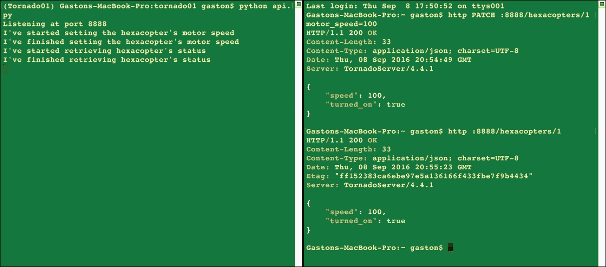
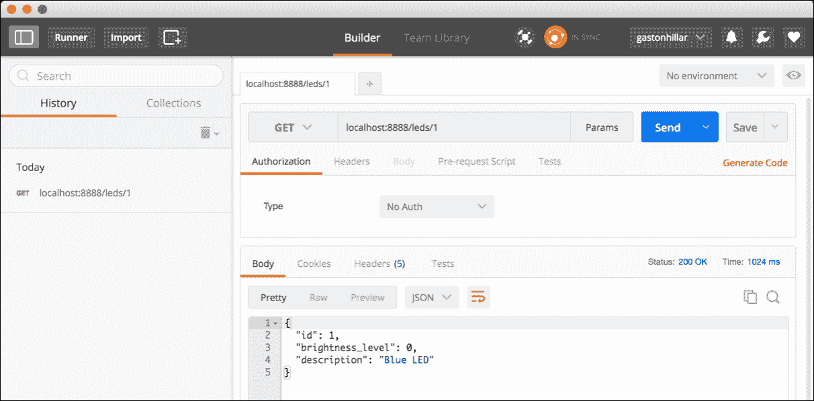
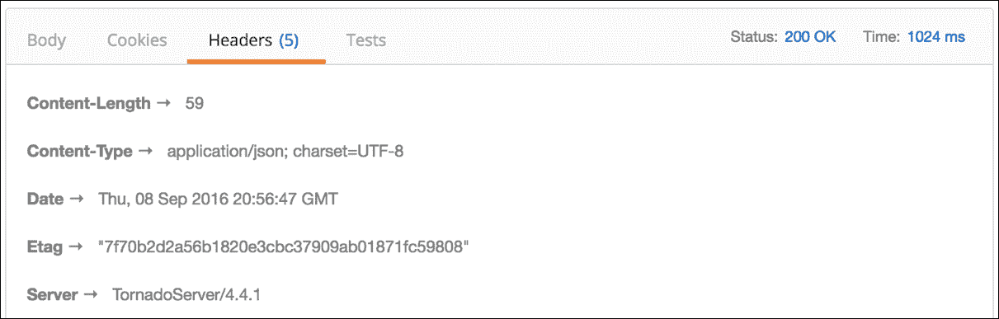
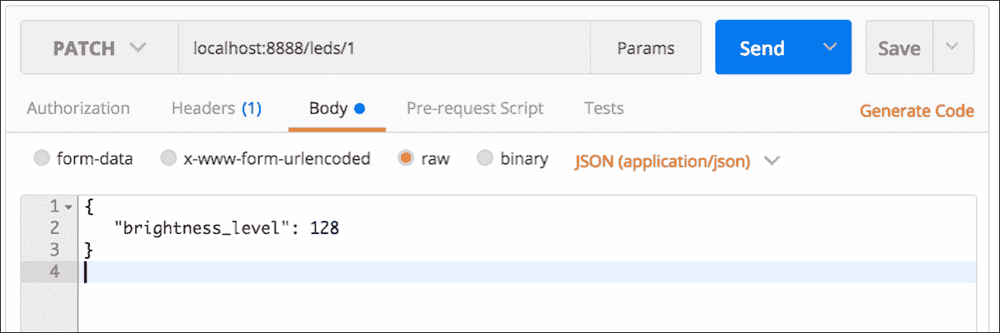
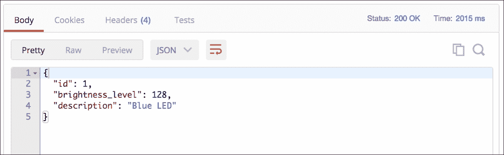
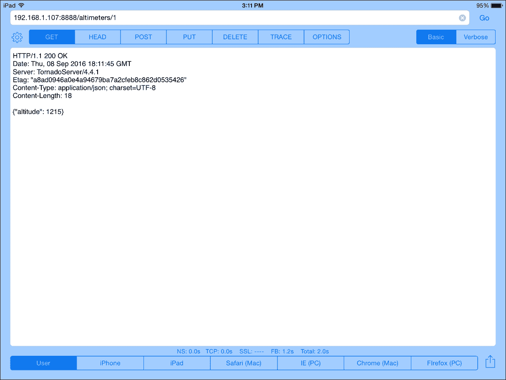

# 第九章：使用 Tornado 开发 RESTful API

在本章中，我们将使用 Tornado 创建 RESTful 网络 API，并开始使用这个轻量级网络框架。我们将涵盖以下主题：

+   设计一个与慢速传感器和执行器交互的 RESTful API

+   理解每个 `HTTP` 方法执行的任务

+   使用 Tornado 设置虚拟环境

+   声明响应的状态码

+   创建表示无人机的类

+   编写请求处理器

+   将 URL 模式映射到请求处理器

+   向 Tornado API 发送 HTTP 请求

+   使用命令行工具 - curl 和 HTTPie

+   使用 GUI 工具 - Postman 以及其他工具

# 设计一个与慢速传感器和执行器交互的 RESTful API

假设我们必须创建一个 RESTful API 来控制无人机，也称为**无人驾驶飞行器**（**UAV**）。无人机是一个物联网设备，与许多传感器和执行器交互，包括与发动机、螺旋桨和伺服电机连接的数字电子速度控制器。

物联网设备资源有限，因此我们必须使用轻量级网络框架。我们的 API 不需要与数据库交互。我们不需要像 Django 这样的重型网络框架，我们希望能够在不阻塞 Web 服务器的情况下处理许多请求。我们需要 Web 服务器为我们提供良好的可扩展性，同时消耗有限的资源。因此，我们的选择是使用 Tornado，这是 FriendFeed Web 服务器的开源版本。

物联网设备能够运行 Python 3.5、Tornado 以及其他 Python 包。Tornado 是一个 Python 网络框架和异步网络库，由于其非阻塞网络 I/O，提供了出色的可扩展性。此外，Tornado 将使我们能够轻松快速地构建轻量级的 RESTful API。

我们选择 Tornado 是因为它比 Django 更轻量级，它使我们能够轻松创建一个利用非阻塞网络 I/O 的 API。我们不需要使用 ORM，并希望尽快在物联网设备上运行 RESTful API，以便所有团队都能与之交互。

我们将交互一个库，允许我们在**全局解释器锁**（**GIL**）之外执行与传感器和执行器交互的慢速 I/O 操作。因此，当请求需要执行这些慢速 I/O 操作之一时，我们将利用 Tornado 的非阻塞特性。在我们的 API 第一个版本中，我们将使用同步执行，因此，当我们的 API 的 HTTP 请求需要运行慢速 I/O 操作时，我们将阻塞请求处理队列，直到传感器或执行器的慢速 I/O 操作提供响应。我们将使用同步执行执行 I/O 操作，并且 Tornado 不会继续处理其他传入的 HTTP 请求，直到向 HTTP 请求发送响应。

然后，我们将创建我们 API 的第二个版本，该版本将利用 Tornado 中包含的非阻塞特性，结合异步操作。在第二个版本中，当我们的 API 的 HTTP 请求需要运行慢速 I/O 操作时，我们不会阻塞请求处理队列，直到慢速 I/O 操作（与传感器或执行器）提供响应。我们将以异步执行执行 I/O 操作，Tornado 将继续处理其他传入的 HTTP 请求。

### 小贴士

我们将保持示例简单，并且不会使用库与传感器和执行器交互。我们只需打印出这些传感器和执行器将要执行的操作信息。然而，在我们的 API 第二个版本中，我们将编写代码以进行异步调用，以便理解 Tornado 的非阻塞特性的优势。我们将使用简化的传感器和执行器集——请记住，无人机通常有更多的传感器和执行器。我们的目标是学习如何使用 Tornado 构建 RESTful API；我们不想成为构建无人机的专家。

以下每个传感器和执行器都将成为我们 RESTful API 中的一个资源：

+   六旋翼飞行器，即六叶旋翼直升机

+   高空计（高度传感器）

+   蓝色**LED**（发光二极管）

+   白色 LED

以下表格显示了我们的 API 第一个版本必须支持的 HTTP 动词、作用域和语义。每个方法由一个 HTTP 动词和一个作用域组成，并且所有方法对所有传感器和执行器都有一个明确的含义。在我们的 API 中，每个传感器或执行器都有自己的唯一 URL：

| **HTTP 动词** | **作用域** | **语义** |
| --- | --- | --- |
| `GET` | 六旋翼飞行器 | 获取当前六旋翼飞行器的电机速度（RPM）及其状态（开启或关闭） |
| `PATCH` | 六旋翼飞行器 | 设置当前六旋翼飞行器的电机速度（RPM） |
| `GET` | LED | 获取单个 LED 的亮度级别 |
| `PATCH` | LED | 更新单个 LED 的亮度级别 |
| `GET` | 高空计 | 获取当前高度（英尺） |

# 理解每个 HTTP 方法执行的任务

假设`http://localhost:8888/hexacopters/1`是标识我们无人机六旋翼飞行器的 URL。

我们必须使用以下 HTTP 动词（`PATCH`）和请求 URL（`http://localhost:8888/hexacopters/1`）来组合并发送一个 HTTP 请求，以设置六旋翼飞行器的电机速度（RPM）及其状态。此外，我们必须提供 JSON 键值对，包含必要的字段名和值，以指定所需的速度。作为请求的结果，服务器将验证提供的字段值，确保它是一个有效的速度，并以异步执行调用必要的操作来调整速度。在设置六旋翼飞行器的速度后，服务器将返回`200 OK`状态码和一个 JSON 体，其中最近更新的六旋翼飞行器值序列化为 JSON：

```py
PATCH http://localhost:8888/hexacopters/1 

```

我们必须使用以下 HTTP 动词 (`GET`) 和请求 URL (`http://localhost:8888/hexacopter/1`) 编写并发送一个 HTTP 请求，以检索六旋翼飞行器的当前值。服务器将以异步执行的方式调用必要的操作来检索六旋翼飞行器的状态和速度。请求的结果是，服务器将返回一个 `200 OK` 状态码和一个包含序列化键值对的 JSON 主体，这些键值对指定了六旋翼飞行器的状态和速度。如果指定的数字不是 1，服务器将仅返回一个 `404 Not Found` 状态：

```py
GET http://localhost:8888/hexacopters/1 

```

我们必须使用以下 HTTP 动词 (`PATCH`) 和请求 URL (`http://localhost:8888/led/{id}`) 编写并发送一个 HTTP 请求，以设置 ID 与 `{id}` 位置指定的数值相匹配的特定 LED 的亮度级别。例如，如果我们使用请求 URL `http://localhost:8888/led/1`，服务器将为 ID 与 1 匹配的 LED 设置亮度级别。此外，我们必须提供包含必要字段名称和值的 JSON 键值对，以指定所需的亮度级别。请求的结果是，服务器将验证提供的字段值，确保它是一个有效的亮度级别，并以异步执行的方式调用必要的操作来调整亮度级别。在设置 LED 的亮度级别后，服务器将返回一个 `200 OK` 状态码和一个包含最近更新的 LED 值序列化为 JSON 的 JSON 主体：

```py
PATCH http://localhost:8888/led/{id} 

```

我们必须使用以下 HTTP 动词 (`GET`) 和请求 URL (`http://localhost:8888/led/{id}`) 编写并发送一个 HTTP 请求，以检索 ID 与 `{id}` 位置指定的数值相匹配的 LED 的当前值。例如，如果我们使用请求 URL `http://localhost:8888/led/1`，服务器将检索 ID 与 1 匹配的 LED。服务器将以异步执行的方式调用必要的操作来检索 LED 的值。请求的结果是，服务器将返回一个 `200 OK` 状态码和一个包含序列化键值对的 JSON 主体，这些键值对指定了 LED 的值。如果没有 LED 与指定的 ID 匹配，服务器将仅返回一个 `404 Not Found` 状态：

```py
GET http://localhost:8888/led/{id} 

```

我们必须使用以下 HTTP 动词 (`GET`) 和请求 URL (`http://localhost:8888/altimeter/1`) 编写并发送一个 HTTP 请求，以检索高度计的当前值。服务器将以异步执行的方式调用必要的操作来检索高度计的值。请求的结果是，服务器将返回一个 `200 OK` 状态码和一个包含序列化键值对的 JSON 主体，这些键值对指定了高度计的值。如果指定的数字不是 1，服务器将仅返回一个 `404 Not Found` 状态：

```py
GET http://localhost:8888/altimeter/1 

```

# 使用 Tornado 设置虚拟环境

在第一章《使用 Django 开发 RESTful API》中，我们了解到，在本书中，我们将使用 Python 3.3 中引入并 Python 3.4 中改进的轻量级虚拟环境。现在，我们将遵循多个步骤创建一个新的轻量级虚拟环境以使用 Tornado。强烈建议阅读第一章《使用 Django 开发 RESTful API》，以防你对 Python 中的轻量级虚拟环境没有经验。该章节包含了我们将遵循的步骤的所有详细解释。

首先，我们必须选择我们的虚拟环境的目标文件夹或目录。以下是我们将在示例中使用的路径，用于 macOS 和 Linux。虚拟环境的目标文件夹将是我们主目录中的`PythonREST/Tornado01`文件夹。例如，如果我们的 macOS 或 Linux 中的主目录是`/Users/gaston`，虚拟环境将创建在`/Users/gaston/PythonREST/Tornado01`中。您可以在每个命令中将指定的路径替换为您想要的路径：

```py
~/PythonREST/Tornado01

```

在示例中，我们将使用以下路径，用于 Windows。虚拟环境的目标文件夹将是我们用户配置文件文件夹中的`PythonREST\Tornado01`文件夹。例如，如果我们的用户配置文件文件夹是`C:\Users\Gaston`，虚拟环境将创建在`C:\Users\gaston\PythonREST\Tornado01`中。您可以在每个命令中将指定的路径替换为您想要的路径：

```py
%USERPROFILE%\PythonREST\Tornado01

```

在 macOS 或 Linux 中打开一个终端并执行以下命令以创建虚拟环境：

```py
python3 -m venv ~/PythonREST/Tornado01

```

在 Windows 中，执行以下命令以创建虚拟环境：

```py
python -m venv %USERPROFILE%\PythonREST\Tornado01

```

上述命令不会产生任何输出。现在我们已经创建了一个虚拟环境，我们将运行一个特定平台的脚本以激活它。激活虚拟环境后，我们将安装只在此虚拟环境中可用的包。

如果您的终端配置为在 macOS 或 Linux 中使用`bash` shell，请运行以下命令以激活虚拟环境。该命令也适用于`zsh` shell：

```py
source ~/PythonREST/Torando01/bin/activate

```

如果您的终端配置为使用`csh`或`tcsh` shell，请运行以下命令以激活虚拟环境：

```py
source ~/PythonREST/Torando01/bin/activate.csh

```

如果您的终端配置为使用`fish` shell，请运行以下命令以激活虚拟环境：

```py
source ~/PythonREST/Tornado01/bin/activate.fish

```

在 Windows 中，您可以在命令提示符中运行批处理文件或在 Windows PowerShell 中运行脚本以激活虚拟环境。如果您更喜欢命令提示符，请在 Windows 命令行中运行以下命令以激活虚拟环境：

```py
%USERPROFILE%\PythonREST\Tornado01\Scripts\activate.bat

```

如果您更喜欢 Windows PowerShell，启动它并运行以下命令以激活虚拟环境。但是请注意，您需要在 Windows PowerShell 中启用脚本执行才能运行脚本：

```py
cd $env:USERPROFILE
PythonREST\Tornado01\Scripts\Activate.ps1

```

在激活虚拟环境后，命令提示符将显示括号内的虚拟环境根文件夹名称作为默认提示的前缀，以提醒我们我们正在虚拟环境中工作。在这种情况下，我们将看到（`Tornado01`）作为命令提示符的前缀，因为激活的虚拟环境的根文件夹是 `Tornado01`。

我们已经创建并激活了虚拟环境。现在是时候运行许多命令了，这些命令对 macOS、Linux 或 Windows 都是一样的。现在，我们必须运行以下命令来使用 pip 安装 Tornado：

```py
pip install tornado

```

输出的最后几行将指示所有成功安装的包，包括 `tornado`：

```py
Collecting tornado
 Downloading tornado-4.4.1.tar.gz (456kB)
Installing collected packages: tornado
 Running setup.py install for tornado
Successfully installed tornado-4.4.1

```

# 声明响应的状态码

Tornado 允许我们生成包含在 `http.HTTPStatus` 字典中的任何状态码的响应。我们可能会使用这个字典来返回易于理解的状态码描述，例如在从 `http` 模块导入 `HTTPStatus` 字典后使用 `HTTPStatus.OK` 和 `HTTPStatus.NOT_FOUND`。这些名称易于理解，但它们的描述中不包含状态码数字。

在本书中，我们已经使用了许多不同的框架和微框架，因此，我们将从包含在 Django REST Framework 中的 `status.py` 文件中借用声明与 HTTP 状态码相关的非常有用的函数和变量的代码，即我们在第一章中使用过的框架。使用这些变量作为 HTTP 状态码的主要优点是它们的名称既包含数字又包含描述。当我们阅读代码时，我们将理解状态码数字及其含义。例如，我们不会使用 `HTTPStatus.OK`，而是使用 `status.HTTP_200_OK`。

在最近创建的虚拟环境根目录下创建一个新的 `status.py` 文件。以下行展示了在 `status.py` 文件中声明带有描述性 HTTP 状态码的函数和变量的代码，这些代码是从 `rest_framework.status` 模块借用的。我们不希望重新发明轮子，该模块提供了我们在基于 Tornado 的 API 中处理 HTTP 状态码所需的一切。示例代码文件包含在 `restful_python_chapter_09_01` 文件夹中：

```py
def is_informational(code): 
    return code >= 100 and code <= 199 

def is_success(code): 
    return code >= 200 and code <= 299 

def is_redirect(code): 
    return code >= 300 and code <= 399 

def is_client_error(code): 
    return code >= 400 and code <= 499 

def is_server_error(code): 
    return code >= 500 and code <= 599 

HTTP_100_CONTINUE = 100 
HTTP_101_SWITCHING_PROTOCOLS = 101 
HTTP_200_OK = 200 
HTTP_201_CREATED = 201 
HTTP_202_ACCEPTED = 202 
HTTP_203_NON_AUTHORITATIVE_INFORMATION = 203 
HTTP_204_NO_CONTENT = 204 
HTTP_205_RESET_CONTENT = 205 
HTTP_206_PARTIAL_CONTENT = 206 
HTTP_300_MULTIPLE_CHOICES = 300 
HTTP_301_MOVED_PERMANENTLY = 301 
HTTP_302_FOUND = 302 
HTTP_303_SEE_OTHER = 303 
HTTP_304_NOT_MODIFIED = 304 
HTTP_305_USE_PROXY = 305 
HTTP_306_RESERVED = 306 
HTTP_307_TEMPORARY_REDIRECT = 307 
HTTP_400_BAD_REQUEST = 400 
HTTP_401_UNAUTHORIZED = 401 
HTTP_402_PAYMENT_REQUIRED = 402 
HTTP_403_FORBIDDEN = 403 
HTTP_404_NOT_FOUND = 404 
HTTP_405_METHOD_NOT_ALLOWED = 405 
HTTP_406_NOT_ACCEPTABLE = 406 
HTTP_407_PROXY_AUTHENTICATION_REQUIRED = 407 
HTTP_408_REQUEST_TIMEOUT = 408 
HTTP_409_CONFLICT = 409 
HTTP_410_GONE = 410 
HTTP_411_LENGTH_REQUIRED = 411 
HTTP_412_PRECONDITION_FAILED = 412 
HTTP_413_REQUEST_ENTITY_TOO_LARGE = 413 
HTTP_414_REQUEST_URI_TOO_LONG = 414 
HTTP_415_UNSUPPORTED_MEDIA_TYPE = 415 
HTTP_416_REQUESTED_RANGE_NOT_SATISFIABLE = 416 
HTTP_417_EXPECTATION_FAILED = 417 
HTTP_428_PRECONDITION_REQUIRED = 428 
HTTP_429_TOO_MANY_REQUESTS = 429 
HTTP_431_REQUEST_HEADER_FIELDS_TOO_LARGE = 431 
HTTP_451_UNAVAILABLE_FOR_LEGAL_REASONS = 451 
HTTP_500_INTERNAL_SERVER_ERROR = 500 
HTTP_501_NOT_IMPLEMENTED = 501 
HTTP_502_BAD_GATEWAY = 502 
HTTP_503_SERVICE_UNAVAILABLE = 503 
HTTP_504_GATEWAY_TIMEOUT = 504 
HTTP_505_HTTP_VERSION_NOT_SUPPORTED = 505 
HTTP_511_NETWORK_AUTHENTICATION_REQUIRED = 511 

```

代码声明了五个函数，这些函数接收代码参数中的 HTTP 状态码，并确定状态码属于以下哪个类别：信息性、成功、重定向以及客户端错误或服务器错误类别。当我们需要返回特定的状态码时，我们将使用之前的变量。例如，如果我们需要返回 `404 Not Found` 状态码，我们将返回 `status.HTTP_404_NOT_FOUND`，而不是仅仅 `404` 或 `HTTPStatus.NOT_FOUND`。

# 创建表示无人机的类

我们将创建尽可能多的类来表示无人机不同组件。在现实生活中的例子中，这些类将与与传感器和执行器交互的库进行交互。为了使我们的示例简单，我们将调用 `time.sleep` 来模拟设置或从传感器和执行器设置或获取值所需的时间。

首先，我们将创建一个 `Hexacopter` 类，我们将使用它来表示六旋翼机，以及一个 `HexacopterStatus` 类，我们将使用它来存储六旋翼机的状态数据。创建一个新的 `drone.py` 文件。以下行显示了我们将创建的类所需的全部导入，以及 `drone.py` 文件中声明 `Hexacopter` 和 `HexacopterStatus` 类的代码。示例的代码文件包含在 `restful_python_chapter_09_01` 文件夹中：

```py
from random import randint 
from time import sleep 

class HexacopterStatus: 
    def __init__(self, motor_speed, turned_on): 
        self.motor_speed = motor_speed 
        self.turned_on = turned_on 

class Hexacopter: 
    MIN_SPEED = 0 
    MAX_SPEED = 1000 

    def __init__(self): 
        self.motor_speed = self.__class__.MIN_SPEED 
        self.turned_on = False 

    def get_motor_speed(self): 
        return self.motor_speed 

    def set_motor_speed(self, motor_speed): 
        if motor_speed < self.__class__.MIN_SPEED: 
            raise ValueError('The minimum speed is {0}'.format(self.__class__.MIN_SPEED)) 
        if motor_speed > self.__class__.MAX_SPEED: 
            raise ValueError('The maximum speed is {0}'.format(self.__class__.MAX_SPEED)) 
        self.motor_speed = motor_speed 
        self.turned_on = (self.motor_speed is not 0) 
        sleep(2) 
        return HexacopterStatus(self.get_motor_speed(), self.is_turned_on()) 

    def is_turned_on(self): 
        return self.turned_on 

    def get_hexacopter_status(self): 
        sleep(3) 
        return HexacopterStatus(self.get_motor_speed(), self.is_turned_on()) 

```

`HexacopterStatus` 类仅声明了一个构造函数，即 `__init__` 方法。该方法接收许多参数，并使用它们以相同的名称初始化属性：`motor_speed` 和 `turned_on`。

`Hexacopter` 类声明了两个类属性，指定最小和最大速度值：`MIN_SPEED` 和 `MAX_SPEED`。构造函数，即 `__init__` 方法，使用 `MIN_SPEED` 值初始化 `motor_speed` 属性，并将 `turned_on` 属性设置为 `False`。

`get_motor_speed` 方法返回 `motor_speed` 属性的值。`set_motor_speed` 方法检查 `motor_speed` 参数的值是否在有效范围内。如果验证失败，该方法将抛出 `ValueError` 异常。否则，该方法将使用接收到的值设置 `motor_speed` 属性的值，如果 `motor_speed` 大于 0，则将 `turned_on` 属性的值设置为 `True`。最后，该方法调用 sleep 来模拟获取六旋翼机状态需要两秒钟，然后返回一个使用 `motor_speed` 和 `turned_on` 属性值初始化的 `HexacopterStatus` 实例，这些值通过特定方法检索得到。

`get_hexacopter_status` 方法调用 sleep 来模拟获取六旋翼机状态需要三秒钟，然后返回一个使用 `motor_speed` 和 `turned_on` 属性值初始化的 `HexacopterStatus` 实例。

现在，我们将创建一个 `LightEmittingDiode` 类，我们将使用它来表示每个 LED。打开之前创建的 `drone.py` 文件，并添加以下行。示例的代码文件包含在 `restful_python_chapter_09_01` 文件夹中：

```py
class LightEmittingDiode: 
    MIN_BRIGHTNESS_LEVEL = 0 
    MAX_BRIGHTNESS_LEVEL = 255 

    def __init__(self, identifier, description): 
        self.identifier = identifier 
        self.description = description 
        self.brightness_level = self.__class__.MIN_BRIGHTNESS_LEVEL 

    def get_brightness_level(self): 
        sleep(1) 
        return self.brightness_level 

    def set_brightness_level(self, brightness_level): 
        if brightness_level < self.__class__.MIN_BRIGHTNESS_LEVEL: 
            raise ValueError('The minimum brightness level is {0}'.format(self.__class__.MIN_BRIGHTNESS_LEVEL)) 
        if brightness_level > self.__class__.MAX_BRIGHTNESS_LEVEL: 
            raise ValueError('The maximum brightness level is {0}'.format(self.__class__.MAX_BRIGHTNESS_LEVEL)) 
        sleep(2) 
        self.brightness_level = brightness_level 

```

`LightEmittingDiode` 类声明了两个类属性，指定最小和最大亮度级别值：`MIN_BRIGHTNESS_LEVEL` 和 `MAX_BRIGHTNESS_LEVEL`。构造函数，即 `__init__` 方法，使用 `MIN_BRIGHTNESS_LEVEL` 初始化 `brightness_level` 属性，并使用具有相同名称的参数值初始化 `id` 和 `description` 属性。

`get_brightness_level`方法调用`sleep`来模拟，获取有线 LED 的亮度级别需要 1 秒钟，然后返回`brightness_level`属性的值。

`set_brightness_level`方法检查`brightness_level`参数的值是否在有效范围内。如果验证失败，该方法将引发`ValueError`异常。否则，该方法调用`sleep`来模拟设置新的亮度级别需要两秒钟，最后使用接收到的值设置`brightness_level`属性的值。

现在，我们将创建一个`Altimeter`类，我们将使用它来表示高度计。打开之前创建的`drone.py`文件，并添加以下几行。示例的代码文件包含在`restful_python_chapter_09_01`文件夹中：

```py
class Altimeter: 
    def get_altitude(self): 
        sleep(1) 
        return randint(0, 3000) 

```

`Altimeter`类声明了一个`get_altitude`方法，它调用`sleep`来模拟从高度计获取高度需要一秒钟，最后生成一个从 0 到`3000`（包含）的随机整数并返回它。

最后，我们将创建一个`Drone`类，我们将使用它来表示带有其传感器和执行器的无人机。打开之前创建的`drone.py`文件，并添加以下几行。示例的代码文件包含在`restful_python_chapter_09_01`文件夹中

```py
class Drone: 
    def __init__(self): 
        self.hexacopter = Hexacopter() 
        self.altimeter = Altimeter() 
        self.blue_led = LightEmittingDiode(1, 'Blue LED') 
        self.white_led = LightEmittingDiode(2, 'White LED') 
        self.leds = { 
            self.blue_led.identifier: self.blue_led, 
            self.white_led.identifier: self.white_led 
            } 

```

`Drone`类仅声明了一个构造函数，即`__init__`方法，它创建了代表无人机不同组件的先前声明的类的实例。`leds`属性保存了一个字典，其中每个`LightEmittingDiode`实例都有一个键值对，包含其 id 和实例。

# 编写请求处理器

在 tornado 中，RESTful API 的主要构建块是`tornado.web.RequestHandler`类的子类，即 Tornado 中 HTTP 请求处理器的基类。我们只需要创建这个类的子类，并声明每个支持的 HTTP 动词的方法。我们必须重写这些方法来处理 HTTP 请求。然后，我们必须将 URL 模式映射到代表 Tornado Web 应用的`tornado.web.Application`实例中的每个`tornado.web.RequestHandler`的子类。

首先，我们将创建一个`HexacopterHandler`类，我们将使用它来处理对六旋翼资源的需求。创建一个新的`api.py`文件。以下几行展示了我们将创建的类所需的全部导入，以及`drone.py`文件中声明`HexacopterHandler`类的代码。在新的`api.py`文件中输入以下几行。示例的代码文件包含在`restful_python_chapter_09_01`文件夹中：

```py
import status 
from datetime import date 
from tornado import web, escape, ioloop, httpclient, gen 
from drone import Altimeter, Drone, Hexacopter, LightEmittingDiode 

drone = Drone() 

class HexacopterHandler(web.RequestHandler): 
    SUPPORTED_METHODS = ("GET", "PATCH") 
    HEXACOPTER_ID = 1 

    def get(self, id): 
        if int(id) is not self.__class__.HEXACOPTER_ID: 
            self.set_status(status.HTTP_404_NOT_FOUND) 
            return 
        print("I've started retrieving hexacopter's status") 
        hexacopter_status = drone.hexacopter.get_hexacopter_status() 
        print("I've finished retrieving hexacopter's status") 
        response = {  
            'speed': hexacopter_status.motor_speed, 
            'turned_on': hexacopter_status.turned_on, 
            } 
        self.set_status(status.HTTP_200_OK) 
        self.write(response) 

    def patch(self, id): 
        if int(id) is not self.__class__.HEXACOPTER_ID: 
            self.set_status(status.HTTP_404_NOT_FOUND) 
            return 
        request_data = escape.json_decode(self.request.body)  
        if ('motor_speed' not in request_data.keys()) or \ 
            (request_data['motor_speed'] is None): 
            self.set_status(status.HTTP_400_BAD_REQUEST) 
            return 
        try: 
            motor_speed = int(request_data['motor_speed']) 
            print("I've started setting the hexacopter's motor speed") 
            hexacopter_status = drone.hexacopter.set_motor_speed(motor_speed) 
            print("I've finished setting the hexacopter's motor speed") 
            response = {  
                'speed': hexacopter_status.motor_speed, 
                'turned_on': hexacopter_status.turned_on, 
                } 
            self.set_status(status.HTTP_200_OK) 
            self.write(response) 
        except ValueError as e: 
            print("I've failed setting the hexacopter's motor speed") 
            self.set_status(status.HTTP_400_BAD_REQUEST) 
            response = { 
                'error': e.args[0] 
                } 
            self.write(response) 

```

`HexacopterHandler`类是`tornado.web.RequestHandler`的子类，并声明了以下两个方法，当具有相同名称的 HTTP 方法作为请求到达此 HTTP 处理器时将被调用：

+   `get`: 此方法通过`id`参数接收需要检索状态的六旋翼飞行器的`id`。如果接收到的`id`与`HEXACOPTER_ID`类属性的值不匹配，代码将调用`self.set_status`方法，并将`status.HTTP_404_NOT_FOUND`作为参数来设置响应的状态码为`HTTP 404 Not Found`。否则，代码将打印一条消息，表明它开始检索六旋翼飞行器的状态，并使用同步执行调用`drone.hexacopter.get_hexacopter_status`方法，并将结果保存到`hexacopter_status`变量中。然后，代码将写入一条消息，表明它已完成状态的检索，并生成一个包含`'speed'`和`'turned_on'`键及其值的`response`字典。最后，代码将调用`self.set_status`方法，并将`status.HTTP_200_OK`作为参数来设置响应的状态码为`HTTP 200 OK`，并调用`self.write`方法，将`response`字典作为参数。由于`response`是一个字典，Tornado 自动将块写入 JSON 格式，并将`Content-Type`头部的值设置为`application/json`。

+   `patch`: 此方法通过`id`参数接收需要更新或修补的六旋翼飞行器的`id`。正如之前解释的`get`方法中发生的情况，如果接收到的`id`与`HEXACOPTER_ID`类属性的值不匹配，代码将返回`HTTP 404 Not Found`。否则，代码将调用`tornado.escape.json_decode`方法，并将`self.request.body`作为参数来生成请求体 JSON 字符串的 Python 对象，并将生成的字典保存到`request_data`变量中。如果字典中不包含名为`'motor_speed'`的键，代码将返回`HTTP 400 Bad Request`状态码。如果存在该键，代码将打印一条消息，表明它开始设置六旋翼飞行器的速度，并使用同步执行调用`drone.hexacopter.set_motor_speed`方法，并将结果保存到`hexacopter_status`变量中。如果指定的电机速度值无效，将捕获`ValueError`异常，代码将返回`HTTP 400 Bad Request`状态码，并将验证错误消息作为响应体。否则，代码将写入一条消息，表明它已完成电机速度的设置，并生成一个包含`'speed'`和`'turned_on'`键及其值的`response`字典。最后，代码将调用`self.set_status`方法，并将`status.HTTP_200_OK`作为参数来设置响应的状态码为 HTTP 200 OK，并调用`self.write`方法，将`response`字典作为参数。由于`response`是一个字典，Tornado 自动将块写入 JSON 格式，并将`Content-Type`头部的值设置为`application/json`。

该类覆盖了`SUPPORTED_METHODS`类变量，使用一个元组表示该类仅支持`GET`和`PATCH`方法。这样，如果请求的处理程序请求的不是一个包含在`SUPPORTED_METHODS`元组中的方法，服务器将自动返回`405 Method Not Allowed`状态码。

现在，我们将创建一个`LedHandler`类，用于表示 LED 资源。打开之前创建的`api.py`文件，并添加以下行。示例的代码文件包含在`restful_python_chapter_09_01`文件夹中：

```py
class LedHandler(web.RequestHandler): 
    SUPPORTED_METHODS = ("GET", "PATCH") 

    def get(self, id): 
        int_id = int(id) 
        if int_id not in drone.leds.keys(): 
            self.set_status(status.HTTP_404_NOT_FOUND) 
            return 
        led = drone.leds[int_id] 
        print("I've started retrieving {0}'s status".format(led.description)) 
        brightness_level = led.get_brightness_level() 
        print("I've finished retrieving {0}'s status".format(led.description)) 
        response = { 
            'id': led.identifier, 
            'description': led.description, 
            'brightness_level': brightness_level 
            } 
        self.set_status(status.HTTP_200_OK) 
        self.write(response) 

    def patch(self, id): 
        int_id = int(id) 
        if int_id not in drone.leds.keys(): 
            self.set_status(status.HTTP_404_NOT_FOUND) 
            return 
        led = drone.leds[int_id] 
        request_data = escape.json_decode(self.request.body)  
        if ('brightness_level' not in request_data.keys()) or \ 
            (request_data['brightness_level'] is None): 
            self.set_status(status.HTTP_400_BAD_REQUEST) 
            return 
        try: 
            brightness_level = int(request_data['brightness_level']) 
            print("I've started setting the {0}'s brightness
            level".format(led.description)) 
            led.set_brightness_level(brightness_level) 
            print("I've finished setting the {0}'s brightness 
            level".format(led.description)) 
            response = { 
                'id': led.identifier, 
                'description': led.description, 
                'brightness_level': brightness_level 
                } 
            self.set_status(status.HTTP_200_OK) 
            self.write(response) 
        except ValueError as e: 
            print("I've failed setting the {0}'s brightness
            level".format(led.description)) 
            self.set_status(status.HTTP_400_BAD_REQUEST) 
            response = { 
                'error': e.args[0] 
                } 
            self.write(response) 

```

`LedHandler`类是`tornado.web.RequestHandler`的子类。该类覆盖了`SUPPORTED_METHODS`类变量，使用一个元组表示该类仅支持`GET`和`PATCH`方法。此外，该类声明了以下两个方法，当 HTTP 处理程序接收到具有相同名称的 HTTP 方法请求时，将调用这些方法：

+   `get`：此方法接收`id`参数中要检索状态的 LED 的`id`。如果接收到的 id 不是`drone.leds`字典的键之一，代码将调用`self.set_status`方法，并将`status.HTTP_404_NOT_FOUND`作为参数来设置响应的状态码为`HTTP 404 Not Found`。否则，代码检索与`drone.leds`字典中匹配 id 的键关联的值，并将检索到的`LightEmittingDiode`实例保存到`led`变量中。代码打印一条消息，表明它开始检索 LED 的亮度级别，然后以同步方式调用`led.get_brightness_level`方法，并将结果保存到`brightness_level`变量中。然后，代码打印一条消息，表明它已完成亮度级别的检索，并生成一个包含`'id'`、`'description'`和`'brightness_level'`键及其值的`response`字典。最后，代码调用`self.set_status`方法，并将`status.HTTP_200_OK`作为参数来设置响应的状态码为 HTTP 200 OK，并调用`self.write`方法，将`response`字典作为参数。由于`response`是一个字典，Tornado 会自动将块作为 JSON 写入，并将`Content-Type`头部的值设置为`application/json`。

+   `patch` 方法：该方法接收需要更新或修补的 LED 的 id，作为 `id` 参数。与之前解释的 `get` 方法一样，如果接收到的 id 不匹配 `drone.leds` 字典中的任何键，则代码返回 `HTTP 404 Not Found`。否则，代码使用 `self.request.body` 作为参数调用 `tornado.escape.json_decode` 方法，以生成请求体 JSON 字符串的 Python 对象，并将生成的字典保存到 `request_data` 变量中。如果字典中不包含名为 `'brightness_level'` 的键，则代码返回 `HTTP 400 Bad Request` 状态码。如果存在该键，代码将打印一条消息，表明它开始设置 LED 的亮度级别，包括 LED 的描述，调用 `drone.hexacopter.set_brightness_level` 方法进行同步执行。如果指定的 `brightness_level` 值无效，将捕获 `ValueError` 异常，并返回 `HTTP 400 Bad Request` 状态码以及验证错误消息作为响应体。否则，代码将写入一条消息，表明它已完成设置 LED 的亮度值，并生成一个包含 `'id'`、`'description'` 和 `'brightness_level'` 键及其值的 `response` 字典。最后，代码使用 `status.HTTP_200_OK` 作为参数调用 `self.set_status` 方法，将响应的状态码设置为 HTTP 200 OK，并使用 `response` 字典作为参数调用 `self.write` 方法。由于 `response` 是一个字典，Tornado 自动将块作为 JSON 写入，并将 `Content-Type` 标头的值设置为 `application/json`。

现在，我们将创建一个 `AltimeterHandler` 类，我们将使用它来表示高度计资源。打开之前创建的 `api.py` 文件，并添加以下行。示例的代码文件包含在 `restful_python_chapter_09_01` 文件夹中：

```py
class AltimeterHandler(web.RequestHandler): 
    SUPPORTED_METHODS = ("GET") 
    ALTIMETER_ID = 1 

    def get(self, id): 
        if int(id) is not self.__class__.ALTIMETER_ID: 
            self.set_status(status.HTTP_404_NOT_FOUND) 
            return 
        print("I've started retrieving the altitude") 
        altitude = drone.altimeter.get_altitude() 
        print("I've finished retrieving the altitude") 
        response = {  
            'altitude': altitude 
            } 
        self.set_status(status.HTTP_200_OK) 
        self.write(response) 

```

`AltimeterHandler` 类是 `tornado.web.RequestHandler` 的子类。该类通过一个表示仅支持 `GET` 方法的元组覆盖了 `SUPPORTED_METHODS` 类变量。此外，该类声明了一个 `get` 方法，当以相同名称的 HTTP 方法作为请求到达此 HTTP 处理程序时，将调用该方法。

`get` 方法接收 `id` 参数中要检索高度计的 `id`。如果接收到的 `id` 与 `ALTIMETER_ID` 类属性的值不匹配，代码将调用 `self.set_status` 方法，并将 `status.HTTP_404_NOT_FOUND` 作为参数来设置响应的状态码为 HTTP 404 Not Found。否则，代码打印一条消息，表明它开始检索高度计的高度，调用 `drone.hexacopter.get_altitude` 方法进行同步执行，并将结果保存到 `altitude` 变量中。然后，代码写入一条消息，表明它已完成高度检索，并生成一个包含 `'altitude'` 键及其值的 `response` 字典。最后，代码调用 `self.set_status` 方法，并将 `status.HTTP_200_OK` 作为参数来设置响应的状态码为 HTTP 200 OK，并调用 `self.write` 方法，将 `response` 字典作为参数。由于 `response` 是一个字典，Tornado 自动将块作为 JSON 写入，并将 `Content-Type` 头的值设置为 `application/json`。

以下表格显示了我们要为每个 HTTP 动词和作用域组合执行的之前创建的 HTTP 处理器类的函数：

| **HTTP verb** | **Scope** | **Class and method** |
| --- | --- | --- |
| `GET` | Hexacopter | `HexacopterHandler.get` |
| `PATCH` | Hexacopter | `HexacopterHandler.patch` |
| `GET` | LED | `LedHandler.get` |
| `PATCH` | LED | `LedHandler.patch` |
| `GET` | Altimeter | `AltimeterHandler.get` |

如果请求导致调用一个不支持 HTTP 方法的 HTTP 处理器类，Tornado 将返回一个带有 HTTP `405 Method Not Allowed` 状态码的响应。

# 将 URL 模式映射到请求处理器

我们必须将 URL 模式映射到之前编写的 `tornado.web.RequestHandler` 的子类。以下行创建了应用程序的主要入口点，使用 API 的 URL 模式对其进行初始化，并开始监听请求。打开之前创建的 `api.py` 文件并添加以下行。示例的代码文件包含在 `restful_python_chapter_09_01` 文件夹中：

```py
application = web.Application([ 
    (r"/hexacopters/([0-9]+)", HexacopterHandler), 
    (r"/leds/([0-9]+)", LedHandler), 
    (r"/altimeters/([0-9]+)", AltimeterHandler), 
], debug=True) 

if __name__ == "__main__": 
    port = 8888 
    print("Listening at port {0}".format(port)) 
    application.listen(port) 
    ioloop.IOLoop.instance().start() 

```

之前的代码创建了一个名为 `application` 的 `tornado.web.Application` 实例，其中包含构成 Web 应用程序的请求处理器集合。代码将一个元组列表传递给 `Application` 构造函数。列表由一个正则表达式（`regexp`）和一个 `tornado.web.RequestHandler` 子类（`request_class`）组成。此外，代码将 `debug` 参数设置为 `True` 以启用调试。

`main` 方法调用 `application.listen` 方法，在指定的端口上为应用程序构建一个遵循定义规则的 HTTP 服务器。在这种情况下，代码将 `8888` 指定为端口，保存在 `port` 变量中，这是 Tornado HTTP 服务器的默认端口。然后，对 `tornado.ioloop.IOLoop.instance().start()` 的调用启动了通过之前的 `application.listen` 方法创建的服务器。

### 小贴士

与任何其他 Web 框架一样，你永远不应该在生产环境中启用调试。

# 向 Tornado API 发送 HTTP 请求

现在，我们可以运行 `api.py` 脚本，它启动 Tornado 的开发服务器，以便我们可以编写和发送 HTTP 请求到我们的不安全且简单的 Web API。执行以下命令：

```py
python api.py

```

以下行显示了执行之前命令后的输出。Tornado HTTP 开发服务器正在端口 `8888` 上监听：

```py
Listening at port 8888

```

使用之前的命令，我们将启动 Tornado HTTP 服务器，它将在每个接口上监听端口 `8888`。因此，如果我们想从连接到我们局域网的其它计算机或设备向我们的 API 发送 HTTP 请求，我们不需要任何额外的配置。

### 小贴士

如果你决定从连接到局域网的其它计算机或设备发送和发送 HTTP 请求，请记住你必须使用开发计算机分配的 IP 地址而不是 `localhost`。例如，如果计算机分配的 IPv4 IP 地址是 `192.168.1.103`，那么你应该使用 `192.168.1.103:8888` 而不是 `localhost:8888`。当然，你也可以使用主机名而不是 IP 地址。之前解释的配置非常重要，因为移动设备可能是我们 RESTful API 的消费者，我们总是希望在开发环境中测试使用我们 API 的应用程序。

Tornado HTTP 服务器正在本地主机 (`127.0.0.1`) 上运行，监听端口 `8888`，等待我们的 HTTP 请求。现在，我们将在我们开发计算机本地或从连接到我们的局域网的其它计算机或设备发送 HTTP 请求。

## 使用命令行工具——curl 和 httpie

我们将使用我们在 第一章 中介绍的命令行工具——*使用 Django 开发 RESTful API*、curl 和 HTTPie 来编写和发送 HTTP 请求。如果你还没有安装 HTTPie，请确保激活虚拟环境，然后在终端或命令提示符中运行以下命令来安装 HTTPie 包：

```py
pip install --upgrade httpie

```

### 小贴士

如果你忘记了如何激活为我们这个示例创建的虚拟环境，请阅读本章的以下部分*——使用 Django REST Framework 设置虚拟环境*。

在 Windows 中打开 Cygwin 终端或在 macOS 或 Linux 中打开终端，并运行以下命令。我们将编写和发送一个 HTTP 请求来打开六旋翼飞行器并将其电机速度设置为 100 RPM：

```py
http PATCH :8888/hexacopters/1 motor_speed=100

```

以下是对应的 `curl` 命令。非常重要的一点是使用 `-H "Content-Type: application/json"` 选项来指示 `curl` 将 `-d` 选项之后指定的数据作为 `application/json` 而不是默认的 `application/x-www-form-urlencoded` 发送：

```py
curl -iX PATCH -H "Content-Type: application/json" -d '{"motor_speed":100}' 
    :8888/hexacopters/1

```

前面的命令将组合并发送以下 HTTP 请求，`PATCH http://localhost:8888/hexacopters/1`，附带以下 JSON 键值对：

```py
{  
    "motor_speed": 100 
} 

```

请求指定了 `/hexacopters/1`，因此，Tornado 将遍历包含正则表达式和请求类的元组列表，并匹配 `'/hexacopters/([0-9]+)'`。Tornado 将创建 `HexacopterHandler` 类的一个实例，并使用 `1` 作为 `id` 参数的值来运行 `HexacopterHandler.patch` 方法。由于请求的 HTTP 动词是 `PATCH`，Tornado 调用 `patch` 方法。如果成功设置了六旋翼飞行器的速度，该方法将返回 `HTTP 200 OK` 状态码，并将速度和状态作为键值对序列化为 JSON 格式放在响应体中。以下几行显示了 HTTP 请求的一个示例响应：

```py
HTTP/1.1 200 OK
Content-Length: 33
Content-Type: application/json; charset=UTF-8
Date: Thu, 08 Sep 2016 02:02:27 GMT
Server: TornadoServer/4.4.1
{
 "speed": 100,
 "turned_on": true
}

```

我们将组合并发送一个 HTTP 请求以检索六旋翼飞行器的状态和电机速度。回到 Windows 的 Cygwin 终端或 macOS 或 Linux 的终端，并运行以下命令：

```py
http :8888/hexacopters/1

```

以下是对应的 `curl` 命令：

```py
curl -iX GET -H :8888/hexacopters/1

```

前面的命令将组合并发送以下 HTTP 请求：`GET http://localhost:8888/hexacopters/1`。请求指定了 `/hexacopters/1`，因此，它将匹配 `'/hexacopters/([0-9]+)'` 并运行 `HexacopterHandler.get` 方法，其中 `1` 作为 `id` 参数的值。由于请求的 HTTP 动词是 `GET`，Tornado 调用 `get` 方法。该方法检索六旋翼飞行器的状态，并生成包含键值对的 JSON 响应。

以下几行显示了 HTTP 请求的一个示例响应。前几行显示了 HTTP 响应头，包括状态（`200 OK`）和 `Content-type`（`application/json`）。在 HTTP 响应头之后，我们可以在 JSON 响应中看到六旋翼飞行器的状态详情：

```py
HTTP/1.1 200 OK
Content-Length: 33
Content-Type: application/json; charset=UTF-8
Date: Thu, 08 Sep 2016 02:26:00 GMT
Etag: "ff152383ca6ebe97e5a136166f433fbe7f9b4434"
Server: TornadoServer/4.4.1
{
 "speed": 100,
 "turned_on": true
}

```

在我们运行三个请求之后，我们将在运行 Tornado HTTP 服务器的窗口中看到以下几行。输出显示了执行描述代码何时开始设置或检索信息以及何时完成的打印语句的结果：

```py
I've started setting the hexacopter's motor speed
I've finished setting the hexacopter's motor speed
I've started retrieving hexacopter's status
I've finished retrieving hexacopter's status

```

我们在请求处理类中编写的不同方法最终都会调用 `time.sleep` 来模拟与六旋翼无人机的操作需要一些时间。在这种情况下，我们的代码是以同步执行方式运行的，因此，每次我们编写和发送请求时，Tornado 服务器都会被阻塞，直到与六旋翼无人机的操作完成并且方法发送响应。我们将在稍后创建此 API 的新版本，该版本将使用异步执行，我们将了解 Tornado 非阻塞功能的优点。然而，首先，我们将了解 API 的同步版本是如何工作的。

以下图像显示了 macOS 上并排的两个终端窗口。左侧的终端窗口正在运行 Tornado HTTP 服务器，并显示处理 HTTP 请求的方法中打印的消息。右侧的终端窗口正在运行 `http` 命令以生成 HTTP 请求。在编写和发送 HTTP 请求时检查输出，使用类似的配置是一个好主意：



现在，我们将编写和发送一个 HTTP 请求以检索一个不存在的六旋翼无人机。请记住，我们只有一个六旋翼无人机。运行以下命令尝试检索具有无效 `id` 的六旋翼无人机的状态。我们必须确保实用程序将标题作为响应的一部分显示，以便查看返回的状态码：

```py
http :8888/hexacopters/8

```

以下是对应的 `curl` 命令：

```py
curl -iX GET :8888/hexacopters/8

```

之前的命令将组合并发送以下 HTTP 请求：`GET http://localhost:8888/hexacopters/8`。该请求与之前我们分析过的请求相同，只是 `id` 参数的数字不同。服务器将使用 `8` 作为 `id` 参数的值来运行 `HexacopterHandler.get` 方法。`id` 不等于 1，因此，代码将返回 HTTP `404 Not Found` 状态码。以下行显示了 HTTP 请求的一个示例响应头：

```py
HTTP/1.1 404 Not Found
Content-Length: 0
Content-Type: text/html; charset=UTF-8
Date: Thu, 08 Sep 2016 04:31:53 GMT
Server: TornadoServer/4.4.1

```

## 使用 GUI 工具 - Postman 及其他

到目前为止，我们一直在使用两个基于终端或命令行的工具来编写和发送 HTTP 请求到我们的 Tornado HTTP 服务器 - cURL 和 HTTPie。现在，我们将使用我们在编写和发送 HTTP 请求到 Django 开发服务器和 Flask 开发服务器时使用的 GUI 工具之一：Postman。

现在，我们将使用 Postman 中的 **Builder** 选项卡轻松地组合和发送 HTTP 请求到 `localhost:8888`，并使用此 GUI 工具测试 RESTful API。请记住，Postman 不支持 curl 类型的本地主机缩写，因此，我们无法在用 curl 和 HTTPie 编写请求时使用相同的缩写。

在**输入请求 URL**文本框左侧的下拉菜单中选择**GET**，并在右侧的文本框中输入`localhost:8888/leds/1`。现在，点击**发送**，Postman 将显示状态（`200 OK`）、请求处理所需的时间以及以 JSON 格式显示并带有语法高亮的响应体（**美化**视图）。

以下截图显示了 Postman 中 HTTP GET 请求的 JSON 响应体：



点击**Body**右侧的**头部**和**Cookies**以读取响应头部。以下截图显示了 Postman 为之前响应显示的响应头部布局。请注意，Postman 在响应右侧显示**状态**，并且不将其作为头部第一行，这与我们使用 cURL 和 HTTPie 工具时的情况不同：



现在，我们将使用 Postman 的**Builder**标签来编写并发送一个创建新消息的 HTTP 请求，具体来说，是一个 PATCH 请求。按照以下步骤操作：

1.  在**输入请求 URL**文本框左侧的下拉菜单中选择**PATCH**，并在右侧的文本框中输入`localhost:8888/leds/1`。

1.  点击请求面板右侧的**Body**，以在**Authorization**和**Headers**右侧点击。

1.  激活**原始**单选按钮，并在**二进制**单选按钮右侧的下拉菜单中选择`JSON (application/json)`。Postman 将自动添加`Content-type = application/json`头信息，因此，你会注意到**头部**标签将被重命名为**头部（1）**，这表明我们已为请求头部指定了一个键值对。

1.  在**Body**标签下方的文本框中输入以下行：

```py
{ 
   "brightness_level": 128 
} 

```

以下截图显示了 Postman 中的请求体：



我们遵循了必要的步骤来创建一个带有 JSON 体、指定创建新游戏所需键值对的 HTTP `PATCH`请求。点击**发送**，Postman 将显示状态（`200 OK`）、请求处理所需的时间以及以 JSON 格式显示并带有语法高亮的最近添加的游戏响应体（**美化**视图）。以下截图显示了 Postman 中 HTTP POST 请求的 JSON 响应体。



Tornado HTTP 服务器正在监听所有接口的`8888`端口，因此，我们也可以使用能够从移动设备组成并发送 HTTP 请求的应用程序来与 RESTful API 一起工作。例如，我们可以在 iPad Pro 和 iPhone 等 iOS 设备上使用之前介绍的 iCurlHTTP 应用程序。在 Android 设备上，我们可以使用之前介绍的 HTTP Request 应用程序。

以下截图显示了使用 iCurlHTTP 应用程序组成并发送以下 HTTP 请求的结果——`GET http://192.168.2.3:8888/altimeters/1`。请记住，你必须在你的 LAN 和路由器中执行之前解释的配置，才能从连接到你的 LAN 的其他设备访问 Flask 开发服务器。在这种情况下，运行 Tornado HTTP 服务器的计算机分配的 IP 地址是`192.168.2.3`，因此，你必须将此 IP 替换为分配给你的开发计算机的 IP 地址：



# 测试你的知识

1.  Tornado 中 RESTful API 的主要构建块是以下类的子类：

    1.  `tornado.web.GenericHandler`

    1.  `tornado.web.RequestHandler`

    1.  `tornado.web.IncomingHTTPRequestHandler`

1.  如果我们只想支持`GET`和`PATCH`方法，我们可以用以下哪个值覆盖`SUPPORTED_METHODS`类变量：

    1.  `("GET", "PATCH")`

    1.  ` {0: "GET", 1: "PATCH"}`

    1.  `{"GET": True, "PATCH": True, "POST": False, "PUT": False}`

1.  `tornado.Web.Application`构造函数的元组列表由以下组成：

    1.  一个正则表达式（`regexp`）和一个`tornado.web.RequestHandler`子类（`request_class`）。

    1.  一个正则表达式（`regexp`）和一个`tornado.web.GenericHandler`子类（`request_class`）。

    1.  一个正则表达式（`regexp`）和一个`tornado.web.IncomingHTTPRequestHandler`子类（`request_class`）。

1.  当我们在请求处理器中调用`self.write`方法并将字典作为参数时，Tornado：

    1.  自动将块写入 JSON 格式，但我们必须手动将`Content-Type`头部的值设置为`application/json`。

    1.  需要我们使用`json.dumps`方法并将`Content-Type`头部的值设置为`application/json`。

    1.  自动将块写入 JSON 格式，并将`Content-Type`头部的值设置为`application/json`。

1.  在请求处理器中调用`tornado.escape.json_decode`方法，并将`self.request.body`作为参数：

    1.  为请求体的 JSON 字符串生成 Python 对象，并返回生成的元组。

    1.  为请求体的 JSON 字符串生成 Python 对象，并返回生成的字典。

    1.  为请求体的 JSON 字符串生成 Python 对象，并返回生成的列表。

# 摘要

在本章中，我们设计了一个 RESTful API 来与慢速传感器和执行器交互。我们定义了 API 的要求，理解了每个 HTTP 方法执行的任务，并使用 Tornado 设置了一个虚拟环境。

我们创建了代表无人机的类，并编写了代码来模拟每个 HTTP 请求方法所需的慢速 I/O 操作，编写了代表请求处理器并处理不同 HTTP 请求的类，并配置了 URL 模式以将 URL 路由到请求处理器及其方法。

最后，我们启动了 Tornado 开发服务器，使用命令行工具来组合并发送 HTTP 请求到我们的 RESTful API，并分析了我们的代码中每个 HTTP 请求的处理方式。我们还使用 GUI 工具来组合并发送 HTTP 请求。

现在我们已经了解了 Tornado 的基本知识以创建 RESTful API，我们将利用 Tornado 的非阻塞特性结合异步操作在 API 的新版本中，这就是我们将在下一章中讨论的内容。
