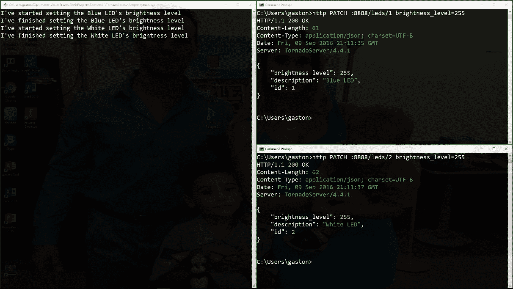
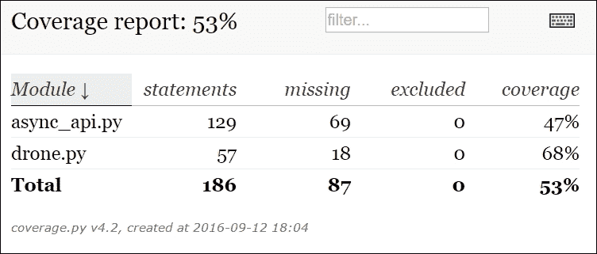
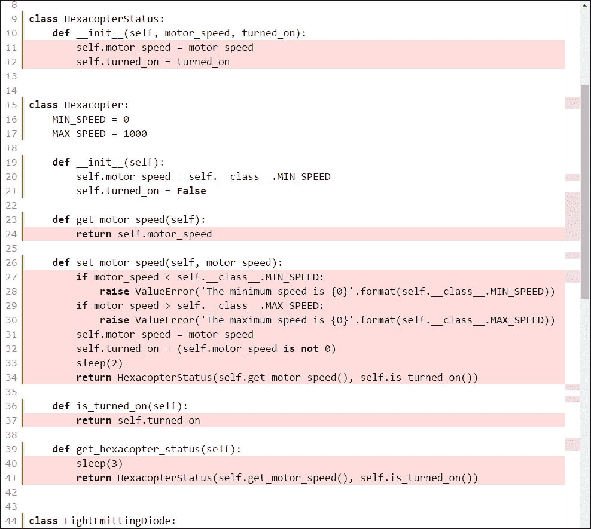

# 第十章. 使用 Tornado 处理异步代码、测试和部署 API

在本章中，我们将利用 Tornado 的非阻塞特性以及异步操作，为我们在上一章中构建的 API 创建一个新版本。我们将配置、编写和执行单元测试，并学习一些与部署相关的内容。我们将涵盖以下主题：

+   理解同步和异步执行

+   使用异步代码

+   重新设计代码以利用异步装饰器

+   将 URL 模式映射到异步和非阻塞请求处理器

+   向 Tornado 非阻塞 API 发送 HTTP 请求

+   设置单元测试

+   编写第一轮单元测试

+   使用`nose2`运行单元测试并检查测试覆盖率

+   提高测试覆盖率

# 理解同步和异步执行

在我们当前的 API 版本中，每个 HTTP 请求都是阻塞的，就像 Django 和 Flask 一样。因此，每当 Tornado HTTP 服务器收到一个 HTTP 请求时，它不会开始处理队列中的任何其他 HTTP 请求，直到服务器为它收到的第一个 HTTP 请求发送响应。我们在请求处理器中编写的代码是以同步执行方式工作的，并且没有利用 Tornado 中包含的非阻塞特性与异步执行相结合的优势。

为了设置蓝色和白色 LED 的亮度，我们必须发出两个 HTTP PATCH 请求。我们将发出这些请求来了解我们当前版本的 API 如何处理两个传入的请求。

在 Windows 中打开两个 Cygwin 终端或在 macOS 或 Linux 中打开两个终端，并在第一个终端中输入以下命令。我们将编写并发送一个 HTTP 请求来设置蓝色`LED`的亮度为`255`。在第一个窗口中写下这一行，但不要按*Enter*键，因为我们将在两个窗口中几乎同时尝试启动两个命令：

```py
http PATCH :8888/leds/1 brightness_level=255

```

以下是对应的`curl`命令：

```py
curl -iX PATCH -H "Content-Type: application/json" -d
   '{"brightness_level":255}' :8888/leds/1

```

现在，转到第二个窗口，并输入以下命令。我们将编写并发送一个 HTTP 请求来设置白色 LED 的亮度为 255。在第二个窗口中写下这一行，但不要按*Enter*键，因为我们将在两个窗口中几乎同时尝试启动两个命令：

```py
http PATCH :8888/leds/2 brightness_level=255

```

以下是对应的`curl`命令：

```py
curl -iX PATCH -H "Content-Type: application/json" -d
   '{"brightness_level":255}' :8888/leds/2

```

现在，转到第一个窗口，按下***Enter***。然后，转到第二个窗口并迅速按下*Enter*。你将在运行 Tornado HTTP 服务器的窗口中看到以下行：

```py
I've started setting the Blue LED's brightness level

```

然后，你将看到以下行，它们显示了执行描述代码何时完成以及随后开始设置 LED 亮度级别的打印语句的结果：

```py
I've finished setting the Blue LED's brightness level
I've started setting the White LED's brightness level
I've finished setting the White LED's brightness level

```

在服务器能够处理改变白色 LED 亮度级别的 HTTP 请求之前，必须等待改变蓝色 LED 亮度级别的请求完成。以下截图显示了 Windows 上的三个窗口。左侧的窗口正在运行 Tornado HTTP 服务器，并显示处理 HTTP 请求的方法中打印的消息。右上角的窗口正在运行 `http` 命令以生成改变蓝色 LED 亮度级别的 HTTP 请求。右下角的窗口正在运行 `http` 命令以生成改变白色 LED 亮度级别的 HTTP 请求。在编写和发送 HTTP 请求以及检查当前 API 版本的同步执行情况时，使用类似的配置是一个好主意：



### 小贴士

记住，我们在请求处理类中编写的不同方法最终都会调用 `time.sleep` 来模拟操作执行所需的时间。

由于每个操作都需要一些时间并且会阻塞处理其他传入的 HTTP 请求，我们将创建这个 API 的新版本，它将使用异步执行，我们将了解 Tornado 非阻塞特性的优势。这样，在处理其他请求改变蓝色 LED 亮度级别的同时，就可以改变白色 LED 的亮度级别。Tornado 将能够在 I/O 操作与无人机完成所需时间的同时开始处理请求。

# 将代码重构以利用异步装饰器

将代码拆分到不同的方法中，如需要处理异步执行完成后执行的回调的异步代码，是非常难以阅读和理解的。幸运的是，Tornado 提供了一个基于生成器的接口，使我们能够在请求处理程序中编写异步代码，并且使用单个生成器。我们可以通过使用 Tornado 提供的 `tornado.gen` 基于生成器的接口来避免将方法拆分成多个带有回调的方法，从而使在异步环境中工作变得更加容易。

在 Tornado 中编写异步代码的推荐方法是使用协程。因此，我们将重构现有代码，在处理 `tornado.web.RequestHandler` 子类中不同 HTTP 请求的必要方法中使用 `@tornado.gen.coroutine` 装饰器来处理异步生成器。

### 小贴士

与使用回调链工作不同，协程使用 Python 的 `yield` 关键字来暂停和恢复执行。通过使用协程，我们的代码将像编写同步代码一样简单易懂和维护。

我们将使用 `concurrent.futures.ThreadPoolExecutor` 类的实例，它为我们提供了一个异步执行可调用对象的高级接口。异步执行将通过线程执行。我们还将使用 `@tornado.concurrent.run_on_executor` 装饰器在执行器上异步运行同步方法。在这种情况下，我们无人机不同组件提供用于获取和设置数据的方法具有同步执行。我们希望它们以异步执行运行。

创建一个新的 `async_api.py` 文件。以下行显示了我们将创建的类所需的全部必要导入以及创建名为 `thread_pool` 的 `concurrent.futures.ThreadPoolExecutor` 类实例的代码。我们将使用此实例在将重构以进行异步调用的不同方法中。示例的代码文件包含在 `restful_python_chapter_10_01` 文件夹中：

```py
import status 
from datetime import date 
from tornado import web, escape, ioloop, httpclient, gen 
from concurrent.futures import ThreadPoolExecutor 
from tornado.concurrent import run_on_executor 
from drone import Altimeter, Drone, Hexacopter, LightEmittingDiode 

thread_pool = ThreadPoolExecutor() 
drone = Drone() 

```

现在，我们将创建一个 `AsyncHexacopterHandler` 类，我们将使用它以异步执行来处理对六旋翼机资源的请求。与名为 `HexacopterHandler` 的同步版本相比，以下行是新的或已更改的。打开先前创建的 `async_pi.py` 文件，并添加以下行。示例的代码文件包含在 `restful_python_chapter_10_01` 文件夹中：

```py
class AsyncHexacopterHandler(web.RequestHandler): 
    SUPPORTED_METHODS = ("GET", "PATCH") 
    HEXACOPTER_ID = 1 
    _thread_pool = thread_pool
 @gen.coroutine 
    def get(self, id): 
        if int(id) is not self.__class__.HEXACOPTER_ID: 
            self.set_status(status.HTTP_404_NOT_FOUND) 
            self.finish() 
            return 
        print("I've started retrieving hexacopter's status") 
        hexacopter_status = yield self.retrieve_hexacopter_status() 
        print("I've finished retrieving hexacopter's status") 
        response = {  
            'speed': hexacopter_status.motor_speed, 
            'turned_on': hexacopter_status.turned_on, 
            } 
        self.set_status(status.HTTP_200_OK) 
        self.write(response) 
        self.finish()
 @run_on_executor(executor="_thread_pool") 
    def retrieve_hexacopter_status(self): 
        return drone.hexacopter.get_hexacopter_status()
 @gen.coroutine 
    def patch(self, id): 
        if int(id) is not self.__class__.HEXACOPTER_ID: 
            self.set_status(status.HTTP_404_NOT_FOUND) 
            self.finish() 
            return 
        request_data = escape.json_decode(self.request.body)  
        if ('motor_speed' not in request_data.keys()) or \ 
            (request_data['motor_speed'] is None): 
            self.set_status(status.HTTP_400_BAD_REQUEST) 
            self.finish() 
            return 
        try: 
            motor_speed = int(request_data['motor_speed']) 
            print("I've started setting the hexacopter's motor speed") 
            hexacopter_status = yield
            self.set_hexacopter_motor_speed(motor_speed) 
            print("I've finished setting the hexacopter's motor speed") 
            response = {  
                'speed': hexacopter_status.motor_speed, 
                'turned_on': hexacopter_status.turned_on, 
                } 
            self.set_status(status.HTTP_200_OK) 
            self.write(response) 
            self.finish() 
        except ValueError as e: 
            print("I've failed setting the hexacopter's motor speed") 
            self.set_status(status.HTTP_400_BAD_REQUEST) 
            response = { 
                'error': e.args[0] 
                } 
            self.write(response) 
            self.finish()
 @run_on_executor(executor="_thread_pool") 
    def set_hexacopter_motor_speed(self, motor_speed): 
        return drone.hexacopter.set_motor_speed(motor_speed)

```

`AsyncHexacopterHandler` 类声明了一个 `_thread_pool` 类属性，该属性保存了对先前创建的 `concurrent.futures.ThreadPoolExecutor` 实例的引用。该类声明了两个带有 `@run_on_executor(executor="_thread_pool")` 装饰器的方法，这使得同步方法可以异步地使用保存在 `_thread_pool` 类属性中的 `concurrent.futures.ThreadPoolExecutor` 实例运行。以下是有两个方法：

+   `retrieve_hexacopter_status`：此方法返回调用 `drone.hexacopter.get_hexacopter_status` 方法的结果。

+   `set_hexacopter_motor_speed`：此方法接收 `motor_speed` 参数，并返回调用 `drone.hexacopter.set_motor_speed` 方法的结果，其中接收到的 `motor_speed` 作为参数。

我们在 `get` 和 `patch` 方法上都添加了 `@gen.coroutine` 装饰器。每当我们需要完成 HTTP 请求时，我们都添加了对 `self.finish` 的调用。当我们使用 `@gen.coroutine` 装饰器时，我们有责任调用此方法来完成响应并结束 HTTP 请求。

`get` 方法使用以下行以非阻塞和异步执行来检索六旋翼机的状态：

```py
hexacopter_status = yield self.retrieve_hexacopter_status() 

```

代码使用 `yield` 关键字从 `self.retrieve_hexacopter_status` 返回的 `Future` 中检索 `HexacopterStatus`，该 `Future` 是以异步方式运行的。`Future` 封装了可调用的异步执行。在这种情况下，`Future` 封装了 `self.retrieve_hexacopter_status` 方法的异步执行。接下来的几行不需要更改，我们只需在写入响应后作为最后一行添加对 `self.finish` 的调用。

`get` 方法使用以下行以非阻塞和异步方式检索六旋翼机的状态：

```py
hexacopter_status = yield self.retrieve_hexacopter_status() 

```

代码使用 `yield` 关键字从 `self.retrieve_hexacopter_status` 返回的 `Future` 中检索 `HexacopterStatus`，该 `Future` 是以异步方式运行的。

`patch` 方法使用以下行以非阻塞和异步方式设置六旋翼机的电机速度：

```py
hexacopter_status = yield self.set_hexacopter_motor_speed(motor_speed) 

```

代码使用 `yield` 关键字从 `self.set_hexacopter_motor_speed` 返回的 `Future` 中检索 `HexacopterStatus`，该 `Future` 是以异步方式运行的。接下来的几行不需要更改，我们只需在写入响应后作为最后一行添加对 `self.finish` 的调用。

现在，我们将创建一个 `AsyncLedHandler` 类，我们将使用它来表示 LED 资源并使用异步执行处理请求。与名为 `LedHandler` 的此处理器的同步版本相比，以下行是新的或已更改的。打开之前创建的 `async_pi.py` 文件，并添加以下行。示例的代码文件包含在 `restful_python_chapter_10_01` 文件夹中：

```py
class AsyncLedHandler(web.RequestHandler): 
    SUPPORTED_METHODS = ("GET", "PATCH") 
    _thread_pool = thread_pool
 @gen.coroutine 
    def get(self, id): 
        int_id = int(id) 
        if int_id not in drone.leds.keys(): 
            self.set_status(status.HTTP_404_NOT_FOUND) 
            self.finish() 
            return 
        led = drone.leds[int_id] 
        print("I've started retrieving {0}'s status".format(led.description)) 
        brightness_level = yield
 self.retrieve_led_brightness_level(led) 
        print("I've finished retrieving {0}'s status".format(led.description)) 
        response = { 
            'id': led.identifier, 
            'description': led.description, 
            'brightness_level': brightness_level 
            } 
        self.set_status(status.HTTP_200_OK) 
        self.write(response) 
        self.finish() 

    @run_on_executor(executor="_thread_pool") 
    def retrieve_led_brightness_level(self, led): 
        return led.get_brightness_level()
 @gen.coroutine 
    def patch(self, id): 
        int_id = int(id) 
        if int_id not in drone.leds.keys(): 
            self.set_status(status.HTTP_404_NOT_FOUND) 
            self.finish() 
            return 
        led = drone.leds[int_id] 
        request_data = escape.json_decode(self.request.body)  
        if ('brightness_level' not in request_data.keys()) or \ 
            (request_data['brightness_level'] is None): 
            self.set_status(status.HTTP_400_BAD_REQUEST) 
            self.finish() 
            return 
        try: 
            brightness_level = int(request_data['brightness_level']) 
            print("I've started setting the {0}'s brightness
            level".format(led.description)) 
            yield self.set_led_brightness_level(led, brightness_level) 
            print("I've finished setting the {0}'s brightness
            level".format(led.description)) 
            response = { 
                'id': led.identifier, 
                'description': led.description, 
                'brightness_level': brightness_level 
                } 
            self.set_status(status.HTTP_200_OK) 
            self.write(response) 
            self.finish() 
        except ValueError as e: 
            print("I've failed setting the {0}'s brightness level".format(led.description)) 
            self.set_status(status.HTTP_400_BAD_REQUEST) 
            response = { 
                'error': e.args[0] 
                } 
            self.write(response) 
            self.finish()
 @run_on_executor(executor="_thread_pool") 
    def set_led_brightness_level(self, led, brightness_level): 
        return led.set_brightness_level(brightness_level)

```

`AsyncLedHandler` 类声明了一个 `_thread_pool` 类属性，该属性保存了对之前创建的 `concurrent.futures.ThreadPoolExecutor` 实例的引用。该类声明了两个带有 `@run_on_executor(executor="_thread_pool")` 装饰器的方法，这使得同步方法可以与保存在 `_thread_pool` 类属性中的 `concurrent.futures.ThreadPoolExecutor` 实例异步运行。以下是有两个方法的示例：

+   `retrieve_led_brightness_level`: 此方法接收一个在 `led` 参数中的 `LightEmittingDiode` 实例，并返回调用 `led.get_brightness_level` 方法的结果。

+   `set_led_brightness_level`: 此方法接收一个在 `led` 参数中的 `LightEmittingDiode` 实例和 `brightness_level` 参数。代码使用接收到的 `brightness_level` 作为参数调用 `led.set_brightness_level` 方法并返回结果。

我们在 `get` 和 `patch` 方法上都添加了 `@gen.coroutine` 装饰器。此外，每当我们想要完成 HTTP 请求时，我们都添加了对 `self.finish` 的调用。

`get` 方法使用以下行以非阻塞和异步方式检索 LED 的亮度级别：

```py
brightness_level = yield self.retrieve_led_brightness_level(led) 

```

代码使用 `yield` 关键字从 `self.retrieve_led_brightness_level` 返回的 `Future` 中检索 `int`，该 `Future` 以异步执行方式运行。接下来的行不需要更改，我们只需在写入响应后作为最后一行添加对 `self.finish` 的调用。

`patch` 方法使用以下行以非阻塞和异步执行方式检索六旋翼机的状态：

```py
hexacopter_status = yield self.retrieve_hexacopter_status() 

```

代码使用 `yield` 关键字从 `self.retrieve_hexacopter_status` 返回的 `Future` 中检索 `HexacopterStatus`，该 `Future` 以异步执行方式运行。

`patch` 方法使用以下行以非阻塞和异步执行来设置 LED 的亮度级别：

```py
yield self.set_led_brightness_level(led, brightness_level) 

```

代码使用 `yield` 关键字以异步执行方式调用 `self.set_led_brightness_level`。接下来的行不需要更改，我们只需在写入响应后作为最后一行添加对 `self.finish` 的调用。

现在，我们将创建一个 `AsyncAltimeterHandler` 类，我们将使用该类来表示高度计资源，并以异步执行方式处理 `get` 请求。与名为 `AltimeterHandler` 的同步版本相比，新或更改的行被突出显示。打开先前创建的 `async_pi.py` 文件，并添加以下行。示例的代码文件包含在 `restful_python_chapter_10_01` 文件夹中。

```py
class AsyncAltimeterHandler(web.RequestHandler): 
    SUPPORTED_METHODS = ("GET") 
    ALTIMETER_ID = 1 
    _thread_pool = thread_pool 

    @gen.coroutine 
    def get(self, id): 
        if int(id) is not self.__class__.ALTIMETER_ID: 
            self.set_status(status.HTTP_404_NOT_FOUND) 
            self.finish() 
            return 
        print("I've started retrieving the altitude") 
        altitude = yield self.retrieve_altitude() 
        print("I've finished retrieving the altitude") 
        response = {  
            'altitude': altitude 
            } 
        self.set_status(status.HTTP_200_OK) 
        self.write(response) 
        self.finish()
@run_on_executor(executor="_thread_pool") 
    def retrieve_altitude(self): 
        return drone.altimeter.get_altitude()

```

`AsyncAltimeterHandler` 类声明了一个 `_thread_pool` 类属性，该属性保存了对先前创建的 `concurrent.futures.ThreadPoolExecutor` 实例的引用。该类使用 `@run_on_executor(executor="_thread_pool")` 装饰器声明了 `retrieve_altitude` 方法，该装饰器使得同步方法可以异步运行，其引用保存在 `_thread_pool` 类属性中。`retrieve_altitude` 方法返回调用 `drone.altimeter.get_altitude` 方法的结果。

我们在 `get` 方法中添加了 `@gen.coroutine` 装饰器。此外，每当我们要完成 HTTP 请求时，我们都添加了对 `self.finish` 的调用。

`get` 方法使用以下行以非阻塞和异步执行方式检索高度计的 altitude 值：

```py
altitude = yield self.retrieve_altitude() 

```

代码使用 `yield` 关键字从 `self.retrieve_altitude` 返回的 `Future` 中检索 `int`，该 `Future` 以异步执行方式运行。接下来的行不需要更改，我们只需在写入响应后作为最后一行添加对 `self.finish` 的调用。

# 将 URL 模式映射到异步请求处理器

我们必须将 URL 模式映射到我们之前编写的 `tornado.web.RequestHandler` 的子类，这些子类为我们提供了请求处理器的异步方法。以下行创建了应用程序的主入口点，用 API 的 URL 模式初始化它，并开始监听请求。打开之前创建的 `async_api.py` 文件，并添加以下行。示例代码文件位于 `restful_python_chapter_10_01` 文件夹中：

```py
application = web.Application([ 
    (r"/hexacopters/([0-9]+)", AsyncHexacopterHandler), 
    (r"/leds/([0-9]+)", AsyncLedHandler), 
    (r"/altimeters/([0-9]+)", AsyncAltimeterHandler), 
],debug=True) 

if __name__ == "__main__": 
    port = 8888 
    print("Listening at port {0}".format(port)) 
    application.listen(port) 
    ioloop.IOLoop.instance().start() 

```

代码创建了一个名为 `application` 的 `tornado.web.Application` 实例，其中包含构成 Web 应用的请求处理器集合。我们只是将处理器的名称更改为带有 `Async` 前缀的新名称。

### 小贴士

与任何其他 Web 框架一样，你永远不应该在生产环境中启用调试。

# 向 Tornado 非阻塞 API 发送 HTTP 请求

现在，我们可以运行 `async_api.py` 脚本，启动 Tornado 的开发服务器，以编写和发送 HTTP 请求到我们新版本的 Web API，该 API 结合了 Tornado 的非阻塞特性和异步执行。执行以下命令：

```py
python async_api.py

```

以下行显示了执行上一条命令后的输出。Tornado HTTP 开发服务器正在 `8888` 端口上监听：

```py
Listening at port 8888

```

使用之前的命令，我们将启动 Tornado HTTP 服务器，它将在 `8888` 端口上的每个接口上监听。因此，如果我们想从连接到我们局域网的其它计算机或设备向我们的 API 发送 HTTP 请求，我们不需要任何额外的配置。

在我们 API 的新版本中，每个 HTTP 请求都是非阻塞的。因此，每当 Tornado HTTP 服务器收到一个 HTTP 请求并执行异步调用时，它能够在服务器发送第一个接收到的 HTTP 请求的响应之前，开始处理队列中的任何其他 HTTP 请求。我们在请求处理器中编写的这些方法正在使用异步执行，并利用了 Tornado 中包含的非阻塞特性，结合了异步执行。

为了设置蓝色和白色 LED 的亮度级别，我们必须发送两个 HTTP `PATCH` 请求。我们将通过发送这两个请求来了解我们 API 的新版本如何处理两个传入的请求。

在 Windows 中打开两个 Cygwin 终端，或在 macOS 或 Linux 中打开两个终端，并在第一个终端中写下以下命令。我们将编写并发送一个 HTTP 请求来设置蓝色 LED 的亮度级别为 `255`。在第一个窗口中写下这一行，但不要按 *Enter*，因为我们将在两个窗口中几乎同时尝试启动两个命令：

```py
http PATCH :8888/leds/1 brightness_level=255

```

以下是对应的 `curl` 命令：

```py
curl -iX PATCH -H "Content-Type: application/json" -d 
    '{"brightness_level":255}' :8888/leds/1

```

现在，转到第二个窗口，并写下以下命令。我们将编写并发送一个 HTTP 请求来设置白色 LED 的亮度级别为 `255`。在第二个窗口中写下这一行，但不要按 *Enter*，因为我们将在两个窗口中几乎同时尝试启动两个命令：

```py
http PATCH :8888/leds/2 brightness_level=255

```

以下是对应的`curl`命令：

```py
curl -iX PATCH -H "Content-Type: application/json" -d '{"brightness_level":255}' :8888/leds/2

```

现在，转到第一个窗口，按***Enter***。然后，转到第二个窗口并快速按*Enter*。您将在运行 Tornado HTTP 服务器的窗口中看到以下几行：

```py
I've started setting the Blue LED's brightness level
I've started setting the White LED's brightness level

```

然后，您将看到以下几行，它们显示了执行描述代码完成设置 LED 亮度级别的 print 语句的结果：

```py
I've finished setting the Blue LED's brightness level
I've finished setting the White LED's brightness level

```

服务器可以在更改白色 LED 亮度级别的请求完成其执行之前开始处理更改蓝色 LED 亮度级别的请求。以下截图显示了 Windows 上的三个窗口。左侧的窗口正在运行 Tornado HTTP 服务器并显示处理 HTTP 请求的方法中打印的消息。右上角的窗口正在运行`http`命令以生成更改蓝色 LED 亮度级别的 HTTP 请求。右下角的窗口正在运行`http`命令以生成更改白色 LED 亮度级别的 HTTP 请求。在我们编写和发送 HTTP 请求以及检查新版本的 API 上的异步执行如何工作时，使用类似的配置来检查输出是一个好主意：


每个操作都需要一些时间，但由于我们对 API 所做的更改以利用异步执行，因此不会阻塞处理其他传入的 HTTP 请求的可能性。这样，在处理其他请求更改蓝色 LED 亮度级别的同时，可以更改白色 LED 的亮度级别。Tornado 能够在与无人机进行 I/O 操作需要一些时间来完成时开始处理请求。

# 设置单元测试

我们将使用`nose2`来简化单元测试的发现和运行。我们将测量测试覆盖率，因此我们将安装必要的包，以便我们可以使用`nose2`运行覆盖率。首先，我们将在我们的虚拟环境中安装`nose2`和`cov-core`包。`cov-core`包将允许我们使用`nose2`测量测试覆盖率。

确保您退出 Tornado 的 HTTP 服务器。请记住，您只需在运行它的终端或命令提示符窗口中按***Ctrl*** + ***C***即可。我们只需运行以下命令来安装`nose2`包，该包还将安装`six`依赖项：

```py
pip install nose2

```

输出的最后几行将指示`nose2`包已成功安装：

```py

    Collecting nose2
    Collecting six>=1.1 (from nose2)
      Downloading six-1.10.0-py2.py3-none-any.whl
    Installing collected packages: six, nose2
    Successfully installed nose2-0.6.5 six-1.10.0

```

我们只需运行以下命令来安装`cov-core`包，该包还将安装`coverage`依赖项：

```py
pip install cov-core

```

输出的最后几行将指示`django-nose`包已成功安装：

```py
Collecting cov-core
Collecting coverage>=3.6 (from cov-core)
Installing collected packages: coverage, cov-core
Successfully installed cov-core-1.15.0 coverage-4.2

```

打开之前创建的 `async_api.py` 文件，删除创建名为 `application` 的 `web.Application` 实例和 `__main__` 方法的行。删除这些行后，添加以下行。示例代码文件包含在 `restful_python_chapter_10_02` 文件夹中：

```py
class Application(web.Application): 
    def __init__(self, **kwargs): 
        handlers = [ 
            (r"/hexacopters/([0-9]+)", AsyncHexacopterHandler), 
            (r"/leds/([0-9]+)", AsyncLedHandler), 
            (r"/altimeters/([0-9]+)", AsyncAltimeterHandler), 
        ] 
        super(Application, self).__init__(handlers, **kwargs) 

if __name__ == "__main__": 
    application = Application() 
    application.listen(8888) 
    tornado_ioloop = ioloop.IOLoop.instance() 
    ioloop.PeriodicCallback(lambda: None, 500, tornado_ioloop).start() 
    tornado_ioloop.start() 

```

代码声明了一个 `Application` 类，具体来说，是 `tornado.web.Application` 的子类，它重写了继承的构造函数，即 `__init__` 方法。构造函数声明了 `handlers` 列表，该列表将 URL 模式映射到异步请求处理器，然后使用列表作为其参数之一调用继承的构造函数。我们创建这个类是为了使测试能够使用这个类。

然后，主方法创建 `Application` 类的一个实例，注册一个周期性回调，该回调将由 `IOLoop` 每 `500` 毫秒执行，以便可以使用 ***Ctrl*** + ***C*** 停止 HTTP 服务器，并最终调用 `start` 方法。`async_api.py` 脚本将继续以相同的方式工作。主要区别在于我们可以在测试中重用 `Application` 类。

最后，在虚拟环境根文件夹中创建一个名为 `.coveragerc` 的新文本文件，内容如下。示例代码文件包含在 `restful_python_chapter_10_02` 文件夹中：

```py
[run] 
include = async_api.py, drone.py 

```

这样，`coverage` 工具在提供测试覆盖率报告时，只会考虑 `async_api.py` 和 `drone.py` 文件中的代码。使用这个设置文件，我们将得到一个更准确的测试覆盖率报告。

### 小贴士

在这种情况下，我们不会为每个环境使用配置文件。然而，在更复杂的应用程序中，你肯定会想使用配置文件。

# 编写第一轮单元测试

现在，我们将编写第一轮单元测试。具体来说，我们将编写与 LED 资源相关的单元测试。在虚拟环境根文件夹中创建一个新的 `tests` 子文件夹。然后，在新的 `tests` 子文件夹中创建一个新的 `test_hexacopter.py` 文件。添加以下行，声明许多 `import` 语句和 `TextHexacopter` 类。示例代码文件包含在 `restful_python_chapter_10_02` 文件夹中：

```py
import unittest 
import status 
import json 
from tornado import ioloop, escape 
from tornado.testing import AsyncHTTPTestCase, gen_test, gen 
from async_api import Application 

class TestHexacopter(AsyncHTTPTestCase): 
    def get_app(self): 
        self.app = Application(debug=False) 
        return self.app 

    def test_set_and_get_led_brightness_level(self): 
        """ 
        Ensure we can set and get the brightness levels for both LEDs 
        """ 
        patch_args_led_1 = {'brightness_level': 128} 
        patch_args_led_2 = {'brightness_level': 250} 
        patch_response_led_1 = self.fetch( 
            '/leds/1',  
            method='PATCH',  
            body=json.dumps(patch_args_led_1)) 
        patch_response_led_2 = self.fetch( 
            '/leds/2',  
            method='PATCH',  
            body=json.dumps(patch_args_led_2)) 
        self.assertEqual(patch_response_led_1.code, status.HTTP_200_OK) 
        self.assertEqual(patch_response_led_2.code, status.HTTP_200_OK) 
        get_response_led_1 = self.fetch( 
            '/leds/1', 
            method='GET') 
        get_response_led_2 = self.fetch( 
            '/leds/2', 
            method='GET') 
        self.assertEqual(get_response_led_1.code, status.HTTP_200_OK) 
        self.assertEqual(get_response_led_2.code, status.HTTP_200_OK) 
        get_response_led_1_data = escape.json_decode(get_response_led_1.body) 
        get_response_led_2_data = escape.json_decode(get_response_led_2.body) 
        self.assertTrue('brightness_level' in get_response_led_1_data.keys()) 
        self.assertTrue('brightness_level' in get_response_led_2_data.keys()) 
        self.assertEqual(get_response_led_1_data['brightness_level'],  
                         patch_args_led_1['brightness_level']) 
        self.assertEqual(get_response_led_2_data['brightness_level'],  
                         patch_args_led_2['brightness_level']) 

```

`TestHexacopter` 类是 `tornado.testing.AsyncHTTPTestCase` 的子类，即一个启动 Tornado HTTP 服务器的测试用例。该类重写了 `get_app` 方法，该方法返回我们想要测试的 `tornado.web.Application` 实例。在这种情况下，我们返回 `async_api` 模块中声明的 `Application` 类的一个实例，将 `debug` 参数设置为 `False`。

`test_set_and_get_led_brightness_level` 方法测试我们是否可以设置和获取白色和蓝色 LED 的亮度级别。代码组合并发送了两个 HTTP `PATCH` 方法，为 ID 等于 `1` 和 `2` 的 LED 设置新的亮度级别值。代码为每个 LED 设置不同的亮度级别。

代码调用 self.fetch 方法来组合并发送 HTTP `PATCH` 请求，并将要发送到主体的字典作为参数调用 `json.dumps`。然后，代码再次使用 `self.fetch` 来组合并发送两个 HTTP `GET` 方法，以检索亮度值已更改的 LED 的亮度级别值。代码使用 `tornado.escape.json_decode` 将响应主体的字节转换为 Python 字典。该方法使用 `assertEqual` 和 `assertTrue` 来检查以下预期结果：

+   两个 HTTP `PATCH` 响应的 `status_code` 是 HTTP 200 OK (`status.HTTP_200_OK`)

+   两个 HTTP `GET` 响应的 `status_code` 是 HTTP 200 OK (`status.HTTP_200_OK`)

+   两个 HTTP `GET` 响应的响应体包含一个名为 `brigthness_level` 的键

+   HTTP `GET` 响应中 `brightness_level` 键的值等于每个 LED 设置的亮度级别

# 使用 nose2 运行单元测试并检查测试覆盖率

现在，运行以下命令以在我们的测试数据库中创建所有必要的表，并使用 nose2 测试运行器执行我们创建的所有测试。测试运行器将执行我们 `TestHexacopter` 类中以 `test_` 前缀开头的方法，并将显示结果。在这种情况下，我们只有一个符合标准的方法，但稍后我们会添加更多。

在我们一直在使用的同一虚拟环境中运行以下命令。我们将使用 `-v` 选项指示 nose2 打印测试用例名称和状态。`--with-coverage` 选项打开测试覆盖率报告生成：

```py
nose2 -v --with-coverage

```

以下行显示了示例输出。请注意，如果我们的代码包含额外的行或注释，报告中显示的数字可能会有所不同：

```py
test_set_and_get_led_brightness_level (test_hexacopter.TestHexacopter) ... 
I've started setting the Blue LED's brightness level
I've finished setting the Blue LED's brightness level
I've started setting the White LED's brightness level
I've finished setting the White LED's brightness level
I've started retrieving Blue LED's status
I've finished retrieving Blue LED's status
I've started retrieving White LED's status
I've finished retrieving White LED's status
ok
----------------------------------------------------------------
Ran 1 test in 1.311s
OK
----------- coverage: platform win32, python 3.5.2-final-0 -----
Name           Stmts   Miss  Cover
----------------------------------
async_api.py     129     69    47%
drone.py          57     18    68%
----------------------------------
TOTAL            186     87    53%

```

默认情况下，`nose2` 会查找以 `test` 前缀开头的模块。在这种情况下，唯一符合标准的模块是 `test_hexacopter` 模块。在符合标准的模块中，`nose2` 会从 `unittest.TestCase` 的所有子类以及以 `test` 前缀开头的方法中加载测试。`tornado.testing.AsyncHTTPTestCase` 在其类层次结构中将 `unittest.TestCase` 作为其超类之一。

提供的输出详细说明了测试运行器发现并执行了一个测试，并且它通过了。输出显示了 `TestHexacopter` 类中以 `test_` 前缀开头的方法及其类名，这些方法代表要执行的测试。

根据报告中显示的测量结果，`async_api.py` 和 `drone.py` 的覆盖率确实非常低。实际上，我们只编写了一个与 LED 相关的测试，因此提高覆盖率是有意义的。我们没有创建与其他六旋翼机资源相关的测试。

我们可以使用带有 `-m` 命令行选项的 `coverage` 命令来显示新 `Missing` 列中缺失语句的行号：

```py
coverage report -m

```

命令将使用上次执行的信息，并显示遗漏的语句。以下几行显示了与之前单元测试执行相对应的示例输出。请注意，如果我们的代码包含额外的行或注释，报告中显示的数字可能会有所不同：

```py
Name           Stmts   Miss  Cover   Missing
--------------------------------------------
async_api.py     129     69    47%   137-150, 154, 158-187, 191, 202-204, 226-228, 233-235, 249-256, 270-282, 286, 311-315
drone.py          57     18    68%   11-12, 24, 27-34, 37, 40-41, 59, 61, 68-69
--------------------------------------------
TOTAL            186     87    53%

```

现在，运行以下命令以获取详细说明遗漏行的注释 HTML 列表：

```py
coverage html

```

使用您的 Web 浏览器打开在`htmlcov`文件夹中生成的`index.html` HTML 文件。以下截图显示了一个示例报告，该报告以 HTML 格式生成覆盖率：



点击或轻触`drony.py`，Web 浏览器将渲染一个显示已运行语句、遗漏语句和排除语句的 Web 页面，这些语句用不同的颜色表示。我们可以点击或轻触**运行**、**遗漏**和**排除**按钮来显示或隐藏代表每行代码状态的背景颜色。默认情况下，遗漏的代码行将以粉红色背景显示。因此，我们必须编写针对这些代码行的单元测试来提高我们的测试覆盖率。



# 提高测试覆盖率

现在，我们将编写额外的单元测试来提高测试覆盖率。具体来说，我们将编写与六旋翼电机和高度计相关的单元测试。打开现有的`test_hexacopter.py`文件，在最后一行之后插入以下行。示例的代码文件包含在`restful_python_chapter_10_03`文件夹中：

```py
    def test_set_and_get_hexacopter_motor_speed(self): 
        """ 
        Ensure we can set and get the hexacopter's motor speed 
        """ 
        patch_args = {'motor_speed': 700} 
        patch_response = self.fetch( 
            '/hexacopters/1',  
            method='PATCH',  
            body=json.dumps(patch_args)) 
        self.assertEqual(patch_response.code, status.HTTP_200_OK) 
        get_response = self.fetch( 
            '/hexacopters/1', 
            method='GET') 
        self.assertEqual(get_response.code, status.HTTP_200_OK) 
        get_response_data = escape.json_decode(get_response.body) 
        self.assertTrue('speed' in get_response_data.keys()) 
        self.assertTrue('turned_on' in get_response_data.keys()) 
        self.assertEqual(get_response_data['speed'],  
                         patch_args['motor_speed']) 
        self.assertEqual(get_response_data['turned_on'],  
                         True) 

    def test_get_altimeter_altitude(self): 
        """ 
        Ensure we can get the altimeter's altitude 
        """ 
        get_response = self.fetch( 
            '/altimeters/1', 
            method='GET') 
        self.assertEqual(get_response.code, status.HTTP_200_OK) 
        get_response_data = escape.json_decode(get_response.body) 
        self.assertTrue('altitude' in get_response_data.keys()) 
        self.assertGreaterEqual(get_response_data['altitude'],  
                         0) 
        self.assertLessEqual(get_response_data['altitude'],  
                         3000) 

```

之前的代码向`TestHexacopter`类添加了以下两个以`test_`前缀开头的方法：

+   `test_set_and_get_hexacopter_motor_speed`：这个测试检查我们是否可以设置和获取六旋翼的电机速度。

+   `test_get_altimeter_altitude`：这个测试检查我们是否可以从高度计检索高度值。

我们只是编写了一些与六旋翼和高度计相关的测试，以提高测试覆盖率并注意对测试覆盖率报告的影响。

现在，在同一个虚拟环境中运行以下命令：

```py
nose2 -v --with-coverage

```

以下几行显示了示例输出。请注意，如果我们的代码包含额外的行或注释，报告中显示的数字可能会有所不同：

```py
test_get_altimeter_altitude (test_hexacopter.TestHexacopter) ... 
I've started retrieving the altitude
I've finished retrieving the altitude
ok
test_set_and_get_hexacopter_motor_speed (test_hexacopter.TestHexacopter) ... I've started setting the hexacopter's motor speed
I've finished setting the hexacopter's motor speed
I've started retrieving hexacopter's status
I've finished retrieving hexacopter's status
ok
test_set_and_get_led_brightness_level (test_hexacopter.TestHexacopter) ... I've started setting the Blue LED's brightness level
I've finished setting the Blue LED's brightness level
I've started setting the White LED's brightness level
I've finished setting the White LED's brightness level
I've started retrieving Blue LED's status
I've finished retrieving Blue LED's status
I've started retrieving White LED's status
I've finished retrieving White LED's status
ok
--------------------------------------------------------------
Ran 3 tests in 2.282s
OK
----------- coverage: platform win32, python 3.5.2-final-0 ---
Name           Stmts   Miss  Cover
----------------------------------
async_api.py     129     38    71%
drone.py          57      4    93%
----------------------------------
TOTAL            186     42    77%

```

输出提供了详细信息，表明测试运行器执行了`3`个测试，并且所有测试都通过了。由`coverage`包提供的测试代码覆盖率测量报告将`async_api.py`模块的`Cover`百分比从上次运行的`47%`提高到`71%`。此外，`drone.py`模块的百分比从`68%`提高到`93%`，因为我们编写了与无人机所有组件一起工作的测试。我们编写的新附加测试在这两个模块中执行了额外的代码，因此覆盖率报告中有影响。

如果我们查看未执行的语句，我们会注意到我们没有测试验证失败的场景。现在，我们将编写额外的单元测试来进一步提高测试覆盖率。具体来说，我们将编写单元测试以确保我们无法为 LED 设置无效的亮度级别，我们无法为六旋翼机设置无效的电机速度，并且当我们尝试访问不存在的资源时，我们会收到 HTTP 404 Not Found 状态码。打开现有的 `test_hexacopter.py` 文件，在最后一行之后插入以下行。示例代码文件包含在 `restful_python_chapter_10_04` 文件夹中：

```py
    def test_set_invalid_brightness_level(self): 
        """ 
        Ensure we cannot set an invalid brightness level for a LED 
        """ 
        patch_args_led_1 = {'brightness_level': 256} 
        patch_response_led_1 = self.fetch( 
            '/leds/1',  
            method='PATCH',  
            body=json.dumps(patch_args_led_1)) 
        self.assertEqual(patch_response_led_1.code, status.HTTP_400_BAD_REQUEST) 
        patch_args_led_2 = {'brightness_level': -256} 
        patch_response_led_2 = self.fetch( 
            '/leds/2',  
            method='PATCH',  
            body=json.dumps(patch_args_led_2)) 
        self.assertEqual(patch_response_led_2.code, status.HTTP_400_BAD_REQUEST) 
        patch_response_led_3 = self.fetch( 
            '/leds/2',  
            method='PATCH',  
            body=json.dumps({})) 
        self.assertEqual(patch_response_led_3.code, status.HTTP_400_BAD_REQUEST) 

    def test_set_brightness_level_invalid_led_id(self): 
        """ 
        Ensure we cannot set the brightness level for an invalid LED id 
        """ 
        patch_args_led_1 = {'brightness_level': 128} 
        patch_response_led_1 = self.fetch( 
            '/leds/100',  
            method='PATCH',  
            body=json.dumps(patch_args_led_1)) 
        self.assertEqual(patch_response_led_1.code, status.HTTP_404_NOT_FOUND) 

    def test_get_brightness_level_invalid_led_id(self): 
        """ 
        Ensure we cannot get the brightness level for an invalid LED id 
        """ 
        patch_response_led_1 = self.fetch( 
            '/leds/100',  
            method='GET') 
        self.assertEqual(patch_response_led_1.code, status.HTTP_404_NOT_FOUND) 

    def test_set_invalid_motor_speed(self): 
        """ 
        Ensure we cannot set an invalid motor speed for the hexacopter 
        """ 
        patch_args_hexacopter_1 = {'motor_speed': 89000} 
        patch_response_hexacopter_1 = self.fetch( 
            '/hexacopters/1',  
            method='PATCH',  
            body=json.dumps(patch_args_hexacopter_1)) 
        self.assertEqual(patch_response_hexacopter_1.code,
        status.HTTP_400_BAD_REQUEST) 
        patch_args_hexacopter_2 = {'motor_speed': -78600} 
        patch_response_hexacopter_2 = self.fetch( 
            '/hexacopters/1',  
            method='PATCH',  
            body=json.dumps(patch_args_hexacopter_2)) 
        self.assertEqual(patch_response_hexacopter_2.code,
        status.HTTP_400_BAD_REQUEST) 
        patch_response_hexacopter_3 = self.fetch( 
            '/hexacopters/1',  
            method='PATCH',  
            body=json.dumps({})) 
        self.assertEqual(patch_response_hexacopter_3.code,
        status.HTTP_400_BAD_REQUEST) 

    def test_set_motor_speed_invalid_hexacopter_id(self): 
        """ 
        Ensure we cannot set the motor speed for an invalid hexacopter id 
        """ 
        patch_args_hexacopter_1 = {'motor_speed': 128} 
        patch_response_hexacopter_1 = self.fetch( 
            '/hexacopters/100',  
            method='PATCH',  
            body=json.dumps(patch_args_hexacopter_1)) 
        self.assertEqual(patch_response_hexacopter_1.code,
        status.HTTP_404_NOT_FOUND) 

    def test_get_motor_speed_invalid_hexacopter_id(self): 
        """ 
        Ensure we cannot get the motor speed for an invalid hexacopter id 
        """ 
        patch_response_hexacopter_1 = self.fetch( 
            '/hexacopters/5',  
            method='GET') 
        self.assertEqual(patch_response_hexacopter_1.code,
        status.HTTP_404_NOT_FOUND) 

    def test_get_altimeter_altitude_invalid_altimeter_id(self): 
        """ 
        Ensure we cannot get the altimeter's altitude for an invalid altimeter id 
        """ 
        get_response = self.fetch( 
            '/altimeters/5', 
            method='GET') 
        self.assertEqual(get_response.code, status.HTTP_404_NOT_FOUND) 

```

之前的代码向 `TestHexacopter` 类添加了以下七个以 `test_` 前缀开头的方法：

+   `test_set_invalid_brightness_level`: 这确保了我们无法通过 HTTP `PATCH` 请求为 LED 设置无效的亮度级别。

+   `test_set_brightness_level_invalid_led_id`: 这确保了我们无法通过 HTTP `PATCH` 请求为无效的 LED ID 设置亮度级别。

+   `test_get_brightness_level_invalid_led_id`: 这确保了我们无法获取无效 LED ID 的亮度级别。

+   `test_set_invalid_motor_speed`: 这确保了我们无法通过 HTTP `PATCH` 请求为六旋翼机设置无效的电机速度。

+   `test_set_motor_speed_invalid_hexacopter_id`: 这确保了我们无法通过 HTTP `PATCH` 请求为无效的六旋翼机 ID 设置电机速度。

+   `test_get_motor_speed_invalid_hexacopter_id`: 这确保了我们无法获取无效六旋翼机 ID 的电机速度。

+   `test_get_altimeter_altitude_invalid_altimeter_id`: 这确保了我们无法获取无效高度计 ID 的高度值。

我们编写了许多测试，以确保所有验证都能按预期工作。现在，在同一个虚拟环境中运行以下命令：

```py
nose2 -v --with-coverage

```

以下行显示了示例输出。请注意，如果我们的代码包含额外的行或注释，报告中显示的数字可能会有所不同：

```py
I've finished retrieving the altitude
ok
test_get_altimeter_altitude_invalid_altimeter_id (test_hexacopter.TestHexacopter) ... WARNING:tornado.access:404 GET /altimeters/5 (127.0.0.1) 1.00ms
ok
test_get_brightness_level_invalid_led_id (test_hexacopter.TestHexacopter) ... WARNING:tornado.access:404 GET /leds/100 (127.0.0.1) 2.01ms
ok
test_get_motor_speed_invalid_hexacopter_id (test_hexacopter.TestHexacopter) ... WARNING:tornado.access:404 GET /hexacopters/5 (127.0.0.1) 2.01ms
ok
test_set_and_get_hexacopter_motor_speed (test_hexacopter.TestHexacopter) ... I've started setting the hexacopter's motor speed
I've finished setting the hexacopter's motor speed
I've started retrieving hexacopter's status
I've finished retrieving hexacopter's status
ok
test_set_and_get_led_brightness_level (test_hexacopter.TestHexacopter) ... I've started setting the Blue LED's brightness level
I've finished setting the Blue LED's brightness level
I've started setting the White LED's brightness level
I've finished setting the White LED's brightness level
I've started retrieving Blue LED's status
I've finished retrieving Blue LED's status
I've started retrieving White LED's status
I've finished retrieving White LED's status
ok
test_set_brightness_level_invalid_led_id (test_hexacopter.TestHexacopter) ... WARNING:tornado.access:404 PATCH /leds/100 (127.0.0.1) 1.01ms
ok
test_set_invalid_brightness_level (test_hexacopter.TestHexacopter) ... I've started setting the Blue LED's brightness level
I've failed setting the Blue LED's brightness level
WARNING:tornado.access:400 PATCH /leds/1 (127.0.0.1) 13.51ms
I've started setting the White LED's brightness level
I've failed setting the White LED's brightness level
WARNING:tornado.access:400 PATCH /leds/2 (127.0.0.1) 10.03ms
WARNING:tornado.access:400 PATCH /leds/2 (127.0.0.1) 2.01ms
ok
test_set_invalid_motor_speed (test_hexacopter.TestHexacopter) ... I've started setting the hexacopter's motor speed
I've failed setting the hexacopter's motor speed
WARNING:tornado.access:400 PATCH /hexacopters/1 (127.0.0.1) 19.27ms
I've started setting the hexacopter's motor speed
I've failed setting the hexacopter's motor speed
WARNING:tornado.access:400 PATCH /hexacopters/1 (127.0.0.1) 9.04ms
WARNING:tornado.access:400 PATCH /hexacopters/1 (127.0.0.1) 1.00ms
ok
test_set_motor_speed_invalid_hexacopter_id (test_hexacopter.TestHexacopter) ... WARNING:tornado.access:404 PATCH /hexacopters/100 (127.0.0.1) 1.00ms
ok
----------------------------------------------------------------------
Ran 10 tests in 5.905s
OK
----------- coverage: platform win32, python 3.5.2-final-0 -----------
Name           Stmts   Miss  Cover
----------------------------------
async_api.py     129      5    96%
drone.py          57      0   100%
----------------------------------
TOTAL            186      5    97%

```

输出提供了详细信息，表明测试运行器执行了 `10` 个测试，并且所有测试都通过了。由 `coverage` 包提供的测试代码覆盖率测量报告将 `async_api.py` 模块的 `Cover` 百分比从上一次运行的 `71%` 提高到了 `97%`。此外，`drone.py` 模块的百分比从 `93%` 提高到了 `100%`。如果我们检查覆盖率报告，我们会注意到未执行的唯一语句是 `async_api.py` 模块主方法中包含的语句，因为它们不是测试的一部分。因此，我们可以说是 `100%` 的覆盖率。

现在我们有了很好的测试覆盖率，我们可以生成包含应用程序依赖及其版本的 `requirements.txt` 文件。这样，我们决定部署 RESTful API 的任何平台都将能够轻松安装文件中列出的所有必要依赖项。

执行以下 `pip freeze` 命令以生成 `requirements.txt` 文件：

```py
pip freeze > requirements.txt

```

以下行显示了生成的示例 `requirements.txt` 文件的内容。然而，请注意，许多包的版本号更新很快，您可能在自己的配置中看到不同的版本：

```py
cov-core==1.15.0
coverage==4.2
nose2==0.6.5
six==1.10.0
tornado==4.4.1

```

# 用于构建 RESTful API 的其他 Python Web 框架

我们使用 Django、Flask 和 Tornado 构建了 RESTful Web 服务。然而，Python 有许多其他适合构建 RESTful API 的 Web 框架。本书中关于设计、构建、测试和部署 RESTful API 的所有知识也适用于我们决定使用的任何其他 Python Web 框架。以下列表列举了额外的框架及其主要网页：

+   **Pyramid**: [`www.pylonsproject.org/`](http://www.pylonsproject.org/)

+   **Bottle**: [`bottlepy.org/`](http://bottlepy.org/)

+   **Falcon**: [`falconframework.org/`](https://falconframework.org/)

就像任何 Python Web 框架一样，可能还有额外的包可以简化我们的常见任务。例如，可以使用 Ramses 与 Pyramid 结合，通过使用 **RAML**（**RESTful API Modeling Language**）来创建 RESTful API，其规范可在 [`github.com/raml-org/raml-spec`](http://github.com/raml-org/raml-spec) 找到。您可以在 [`ramses.readthedocs.io/en/stable/getting_started.html`](http://ramses.readthedocs.io/en/stable/getting_started.html) 阅读更多关于 Ramses 的详细信息。

# 测试您的知识

1.  `concurrent.futures.ThreadPoolExecutor` 类为我们提供：

    1.  一个用于同步执行可调用对象的高级接口。

    1.  一个用于异步执行可调用对象的高级接口。

    1.  一个用于组合 HTTP 请求的高级接口。

1.  `@tornado.concurrent.run_on_executor` 装饰器允许我们：

    1.  在执行器上同步运行异步方法。

    1.  在执行器上运行异步方法而不生成 Future。

    1.  在执行器上异步运行同步方法。

1.  在 Tornado 中编写异步代码的推荐方法是使用：

    1.  协程。

    1.  链式回调。

    1.  子程序。

1.  `tornado.Testing.AsyncHTTPTestCase` 类表示：

    1.  启动 Flask HTTP 服务器的测试用例。

    1.  启动 Tornado HTTP 服务器的测试用例。

    1.  不启动任何 HTTP 服务器的测试用例。

1.  如果我们要将 JSON 响应体中的字节转换为 Python 字典，可以使用以下函数：

    1.  `tornado.escape.json_decode`

    1.  `tornado.escape.byte_decode`

    1.  `tornado.escape.response_body_decode`

# 摘要

在本章中，我们理解了同步执行和异步执行之间的区别。我们创建了一个新的 RESTful API 版本，它利用了 Tornado 中的非阻塞特性以及异步执行。我们提高了现有 API 的可扩展性，并使其在等待传感器和执行器的慢速 I/O 操作时能够开始执行其他请求。我们通过使用 Tornado 提供的基于 `tornado.gen` 生成器的接口来避免将方法拆分成多个带有回调的方法，这使得在异步环境中工作变得更加容易。

然后，我们设置了测试环境。我们安装了 nose2 以便于发现和执行单元测试。我们编写了一轮单元测试，测量了测试覆盖率，然后编写了额外的单元测试以提高测试覆盖率。我们创建了所有必要的测试，以确保对所有代码行都有完整的覆盖。

我们使用 Django、Flask 和 Tornado 构建了 RESTful Web 服务。我们为每种情况选择了最合适的框架。我们学会了从头设计 RESTful API，并运行所有必要的测试以确保我们的 API 在发布新版本时没有问题。现在，我们准备好使用本书中一直使用的任何 Web 框架来创建 RESTful API。
