# 第一章：设置虚拟环境

一个好的程序员不怕技术，因为他们的信心不在于编程语言，而在于他们自己的技能和经验。工具只会让他们更有效率。没有合适的软件，我们甚至无法在可接受的时间内构建一个最简单的网站。使用 Python 构建网站在任何现代操作系统上都是可能的，无论其背后的硬件如何。维护这个出色语言的核心团队已经负责了一些比较繁琐的任务，例如编译它并针对您所使用的处理器进行优化。

然而，即使在 Python 中构建一个简单的基于文本的 Web 应用程序，也需要大量的知识，包括服务器和 Web 应用程序的知识，以及 WSGI 或 ASGI 接口。我们需要抽象出这种复杂性来响应请求、环境、异步性、WebSocket、数据库连接以及其他定义当前 Web 应用程序的元素。这就是为什么我们将设置一个桌面，其中包含您成为高效现代 Django 开发者所需的一切。我们将使用 Channels 提供的技术构建不同的实时应用程序，Channels 是 Django 的一个扩展（由同一个 Django 团队开发），它包括 WebSocket 服务器和 WebSocket 集成。应用程序的架构将与服务器端渲染不同。服务器和客户端之间的通信路径将是双向的，允许我们用它来接收或发送事件和/或 HTML。我的意图是，在完成本章后，您的关注点将集中在代码上，而不是可能分散您注意力的复杂配置。为了实现这一点，我们将利用 Docker，这个著名的容器管理器，它将打开添加各种预先配置好的软件的可能性，以便快速启动，而无需投入大量时间：数据库、Web 服务器、邮件服务器和缓存等。如果您没有 Docker 的经验，请不要担心。我将向您介绍基础知识，而不会涉及底层细节。经过几次调整后，您几乎会忘记它在后台运行。

不仅要我们知道如何编写 Python 并使用 Django 创建实时基础设施，而且我们还需要具备在部署或团队工作中独立于操作系统的技能。通过虚拟化（或隔离）进程，我们可以不必关心它运行的操作系统，使项目对任何专家都容易继续，并且我们可以预测在部署到生产服务器时可能出现的未来问题。

在本章中，我们将涵盖以下主题：

+   探索所需的软件

+   添加依赖项

+   配置 IDE

+   安装 Django

+   创建我们的项目

# 探索所需的软件

在本节中，我们将查看本书中将要使用的软件以及如何安装它。本章的代码可以在[`github.com/PacktPublishing/Building-SPAs-with-Django-and-HTML-Over-the-Wire/tree/main/chapter-1`](https://github.com/PacktPublishing/Building-SPAs-with-Django-and-HTML-Over-the-Wire/tree/main/chapter-1)找到。

## 操作系统

你应该在支持 Docker 的操作系统上工作，以下是一些选择：

+   Linux 发行版，最好是**Ubuntu**或**Debian**

+   最新的 macOS 版本

+   Windows 10 或更高版本，最好有激活的 Linux 子系统并安装了 Ubuntu 或 Debian

+   BSD 后裔，最好是 FreeBSD

## 代码编辑器

我假设如果你在阅读这本书，你已经有了 Python 的经验，并且你有一个 IDE 或功能丰富的编辑器已经准备好了。如果你需要更换 IDE，我在以下列表中从最推荐到最不推荐地列出了一些我认为非常适合与 Python 一起使用的 IDE：

+   **PyCharm Professional**：如果你是认可学校的学生，你可以从 JetBrains 那里申请免费的学生许可证。否则，我鼓励你购买许可证或使用他们的演示版。IDE 有一个免费版本，**PyCharm Community Edition**，但你将无法使用 Docker 解释器，因为这是专业版的功能。你可以从[`www.jetbrains.com/pycharm/`](https://www.jetbrains.com/pycharm/)下载此编辑器。

+   **Visual Studio Code**（**VSCode**）：这是一个在 Web 开发中非常受欢迎的编辑器，由微软创建和维护。你可以从[`code.visualstudio.com/`](https://code.visualstudio.com/)下载此编辑器。

+   **Emacs**：如果你使用的是预配置的框架，如 Spacemacs 或 Doom，它非常容易使用。你可以从[`www.gnu.org/software/emacs/`](https://www.gnu.org/software/emacs/)下载此编辑器。

+   **Sublime Text**搭配**Djaneiro**插件：如果你不希望遇到复杂的情况，这是最简单的选择。你可以从[`www.sublimetext.com/`](https://www.sublimetext.com/)下载此编辑器。

不要强迫自己改变。代码编辑器是一个非常个人化的东西，就像选择内衣品牌一样：一旦找到适合你生活方式的，你就不会想改变。我理解你可能也不愿意学习新的快捷键或工作流程。否则，如果你没有偏好，你可以自由地访问任何前面提到的编辑器的网站，下载并安装到你的电脑上。

书中的所有示例、活动和代码片段都将与你的编辑器或 IDE 选择兼容。它们将主要帮助你处理语法错误、自动完成和提示，但你的代码将是自包含的，因为它们总是以纯文本形式存储。Python 程序员在任何编辑器中都是 Python 程序员，但并非所有编辑器都与 Python 配合得很好。

## Python

你不需要安装它。你读得对；编辑器在审阅时没有出错。我们将使用 Docker 来安装一个能够启动 Django 基本命令的 Python 容器，例如创建项目或应用或启动开发服务器。

我假设如果你在这里，那是因为你感觉使用 Python 编程很舒服。如果不是，我建议你阅读一些 Packt 的书籍：

+   *《Python 编程学习 - 第三版》*，作者：Fabrizio Romano 和 Heinrich Kruger，出版社：*Packt Publishing* ([`bit.ly/3yikXfg`](https://bit.ly/3yikXfg))

+   *《专家 Python 编程 - 第四版》*，作者：Michał Jaworski 和 Tarek Ziadé，出版社：*Packt Publishing* ([`bit.ly/3pUi9kZ`](https://bit.ly/3pUi9kZ))

## Docker

安装 Docker 最快的方式是通过 **Docker Desktop**。它在 Windows、macOS 和 Linux（在我撰写此内容时处于测试版）上可用。只需访问官方网站，下载并安装：

[`www.docker.com/get-started`](https://www.docker.com/get-started)

如果你想要直接通过终端安装它，你需要搜索 *Docker Engine* ([`docs.docker.com/engine/`](https://docs.docker.com/engine/))。如果你使用 Linux 或 BSD，这强烈推荐。

还要安装 **Docker Compose**，这将简化镜像和服务声明的管理：

[`docs.docker.com/compose/install/`](https://docs.docker.com/compose/install/)

## Git

没有开发是不涉及版本控制系统的。Git 是最受欢迎的选择，几乎是必学的。

如果你对此没有知识或相对基本的经验，我建议查看 Packt 的另一本书，例如 *《Git 基础 - 第二版》*，作者：Ferdinando Santacroce，出版社：*Packt Publishing* ([`bit.ly/3rYVvKL`](https://bit.ly/3rYVvKL))。

或者，你也可以选择查看官方 Git 网站的更详细文档：

[`git-scm.com/`](https://git-scm.com/)

## 浏览器

我们将避免关注浏览器的视觉方面，这意味着前端实现特性，如 CSS 兼容性或 JavaScript 功能并不重要。最重要的是在调试后端时感到舒适。大多数时候，我们将在控制台检查请求（`GET`、`POST` 等）是否按预期工作，观察 **WebSocket** 通信以使其流畅，并偶尔操作渲染的 HTML。

WebSocket

WebSocket 是一种双向通信协议，与 HTTP 不同，它便于在服务器和客户端之间实时发送数据，在我们的例子中，是在 Django 服务器和前端客户端之间。

在这本书中，我将使用**Firefox 开发者版**([`www.mozilla.org/en-US/firefox/developer/`](https://www.mozilla.org/en-US/firefox/developer/))浏览器，因为它非常方便地管理使用它时提到的各个方面。你可以自由地使用任何其他浏览器，例如**Chrome**、**Safari**或**Edge**，但我不确定我将会使用的所有功能是否都可用。

软件安装完毕后，我们可以开始使用 Python 和 Docker 的准备工作来运行 Django 或未来的 Python 代码。

# 添加依赖项

我们将通过 Docker 和配置文件运行 Python。这样，任何开发者都可以复制我们的代码，无论他们是否在自己的机器上安装了 Python，他们只需一个命令就可以运行相关服务。

首先，我们将创建一个名为`hello.py`的 Python 文件，其内容如下：

```py
print(“Wow, I have run in a Docker container!”)
```

代码已经准备好了。我们可以继续。

目标将是配置 Docker 以运行该文件。听起来很简单，不是吗？我们开始吧！

我们将创建一个名为`Dockerfile`的文件，其代码如下：

```py
# Image
```

```py
FROM python:3.10
```

```py
# Display the Python output through the terminal
```

```py
ENV PYTHONUNBUFFERED: 1
```

```py
# Set work directory
```

```py
WORKDIR /usr/src/app
```

```py
# Add Python dependencies
```

```py
## Update pip
```

```py
RUN pip install --upgrade pip
```

```py
## Copy requirements
```

```py
COPY requirements.txt ./requirements.txt
```

```py
## Install requirements
```

```py
RUN pip3 install -r requirements.txt
```

此文件用于创建一个 Docker 镜像，或模板，其中包含将被缓存的指令。由于它们是预缓存的，它们的启动几乎是瞬间的。让我们来看看代码中发生了什么：

+   使用`FROM python:3.10`，我们正在使用另一个现有的镜像作为基础。我们正在扩展已经完成的工作。但是...它在哪？Docker 有一个名为`python`的图像存储库，或模板库，我们用标签标记它以使用 3.10 版本。如果你之前使用过 Docker，你可能想知道为什么我们不使用*Alpine*版本，这个在全世界服务器上节省了大量空间的著名操作系统。有两个原因：Python 运行速度较慢([`pythonspeed.com/articles/alpine-docker-python/`](https://pythonspeed.com/articles/alpine-docker-python/))，并且它没有编译依赖项的能力。*Slim*版本也加剧了最后一个问题，并且仅推荐用于空间不足的生产版本。

+   `ENV PYTHONUNBUFFERED: 1`会显示 Python 消息，例如，当我们使用`print()`时。如果没有添加，它们会直接进入 Docker 日志。

+   通过添加`WORKDIR /usr/src/app`，我们定义了在 Docker 容器内部执行命令的路径，而不是在我们的操作系统内部。这相当于使用`cd`更改目录。

+   我们也将利用这个机会，在`requirements.txt`文件中安装我们未来将要添加的 Python 依赖。我们通过`RUN pip install --upgrade pip`更新*pip*，使用`COPY requirements.txt ./requirements. Txt`将依赖列表从文件夹复制到镜像中，最后，通过`RUN pip3 install -r requirements.txt`运行*pip*来安装所有内容。

+   在项目的根目录下，我们创建另一个名为`docker-compose.yaml`的文件，其内容如下：

    ```py
    version: '3.8'

    services:

      python:
        build:
          context: ./
          dockerfile: ./Dockerfile
        entrypoint: python3 hello.py
        volumes:
          - .:/usr/src/app/
    ```

这是编排器，一个文件，我们在这里定义每个服务和其配置。在这种情况下，我们只将有一个名为 `python` 的服务。通过 `build`，我们告诉 Docker 使用我们在 `Dockerfile` 中定义的镜像。通过 `entrypoint`，我们指示服务启动时应该做什么：`python3 hello.py`。最后，在 `volumes` 中，我们告诉它将根目录（由一个点表示）挂载到 `/usr/src/app/`，这是镜像的一个内部目录。这样，服务将能够访问文件夹中的所有文件。

+   接下来，我们创建一个名为 `requirements.txt` 的空文件。尽管文件必须存在，但我们不会添加任何行。

我们准备出发了！打开终端，转到工作文件夹，并告诉 `docker-compose` 启动服务：

```py
cd [your folder]
docker-compose up
```

Docker 将逐步执行几个任务：它将下载基本的 `python` 镜像，通过执行我们定义的指令构建自己的镜像，并启动 `python` 服务。它将在控制台打印 2 行，如下所示：

```py
python_1 | Wow, I have run in a Docker container!
python_1 exited with code 0
```

我们已经执行了 Python 文件！胜利！

随着最近使用 Docker 运行 Python 的能力，现在是时候将其集成到 IDE 中，以便更容易地运行而无需使用终端。

# 配置 IDE

**PyCharm** 非常受欢迎，因为它是一款专门为与 Python 一起工作而准备的工具，它还包含与数据库、Git、HTTP 客户端、环境等有趣的集成。最常用的之一肯定是与 Docker 相关的，因此我将在未来的示例中使用这个出色的 IDE。然而，正如我之前所说的，使用它不是强制性的；有足够的替代方案来满足每个人。本章中显示的所有代码和活动都将独立于编辑器工作。

要设置 IDE，请按照以下步骤操作：

1.  使用 PyCharm（**文件** | **打开**）打开您想要工作的文件夹。目录树将在左侧显示。

1.  点击 Python 文件 (`hello.py`)。如果不使用终端，则无法运行 Python 代码；PyCharm 否则不知道 Python 解释器或可执行文件在哪里。它位于操作系统目前无法访问的 Docker 镜像中。

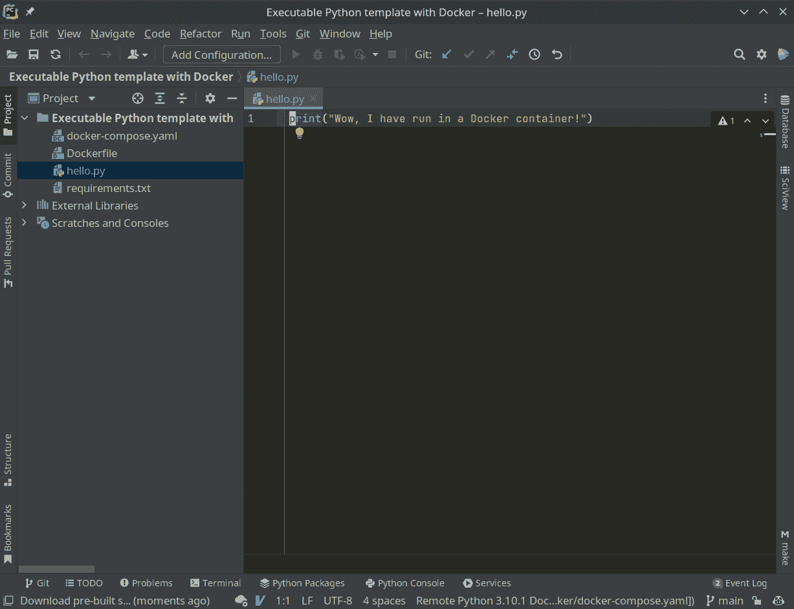

图 1.1 – 打开 Python 文件

1.  PyCharm 可能会打开一个弹出窗口，建议创建虚拟环境。您可以跳过此步骤或关闭窗口；我们将使用 Docker 来完成这项工作。如果您没有看到窗口，您可以继续而无需担心。

1.  我们接下来检查是否已安装 Docker 插件。转到 **文件** | **设置** | **插件** 并查找 **Docker**。

1.  如果已安装，它将出现在 **已安装** 选项卡中。如果没有，您将不得不在 **市场** 中查找它，然后点击 **安装** 按钮。然后，重新启动 PyCharm。请确保这样做。否则，我们无法继续。

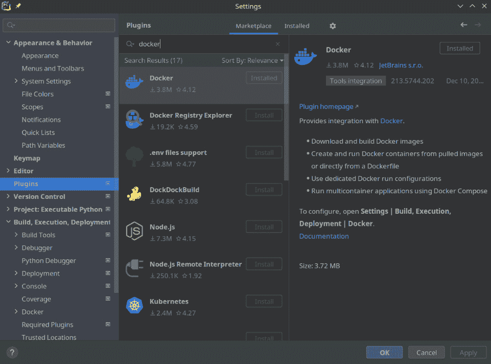

图 1.2 – 安装 Docker 插件

1.  现在打开**文件** | **设置** | **构建、执行、部署** | **Docker**，然后按下**+**按钮。接着，搜索**Docker**。

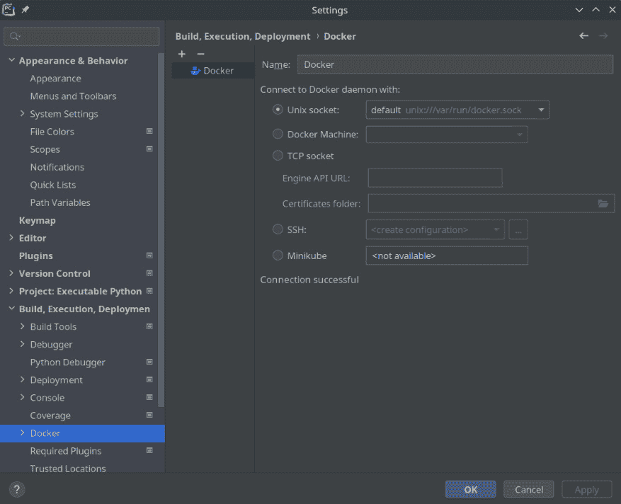

图 1.3 – 通过 Docker 连接

1.  在**名称**字段中输入`Docker`，例如，并激活**Unix 套接字**。在底部，你会看到**连接成功**的消息。

1.  我们只需要告诉 PyCharm 不要在机器上（如果有）查找 Python 解释器或可执行文件，而是使用我们创建的 Docker 服务。

1.  前往**文件** | **设置** | **项目：可执行 Python**。在这里，我们部署**Python 解释器**，选择**远程 Python xxx Docker Compose**，然后点击**应用**。解释器名称可能会根据文件夹名称而改变。

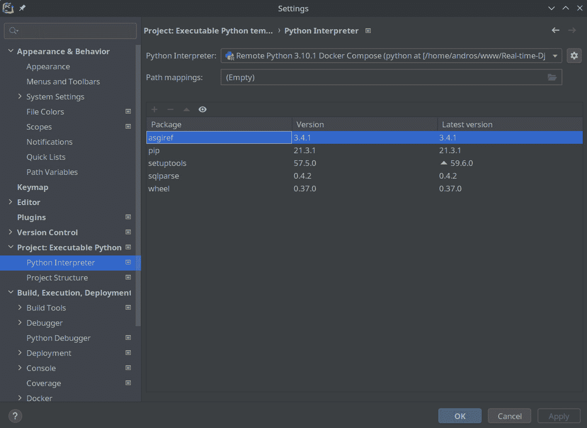

图 1.4 – 添加 Python 解释器

1.  它将自动检测机器上已安装的依赖项，但我们将忽略它们。顺便说一句，这是一个管理所有 Python 依赖项的好地方。

1.  现在，是时候使用你刚刚创建的配置运行 Python 代码了。

1.  关闭`hello.py`然后**运行‘hello’**。

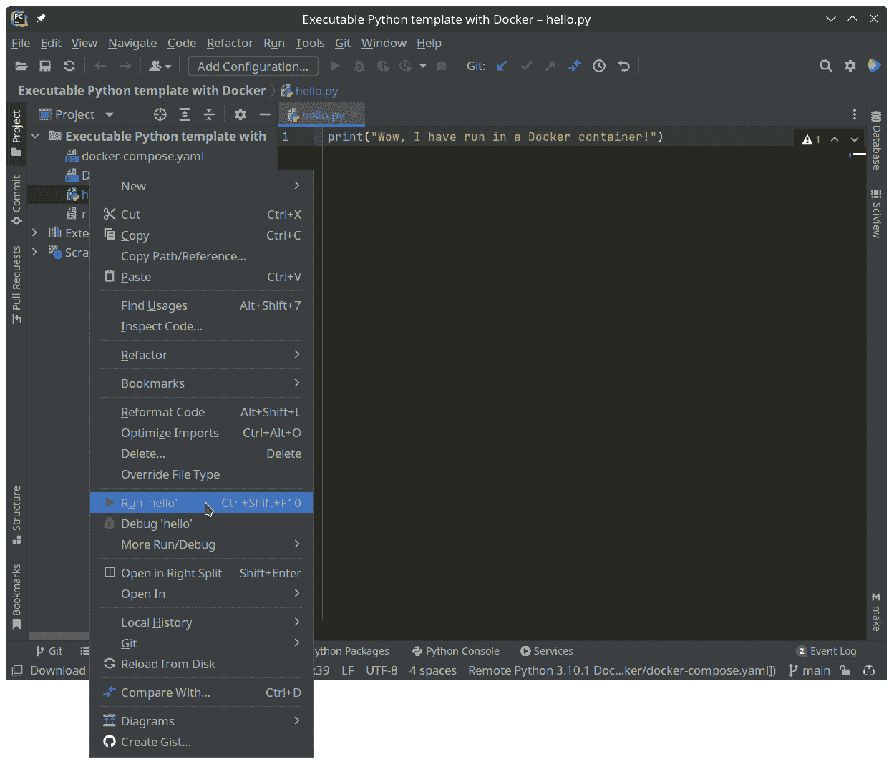

图 1.5 – 使用 PyCharm 运行 Python

1.  在编辑器的底部，将打开一个包含执行日志的区域。作为成功完成的证明，我们可以看到`print`语句。

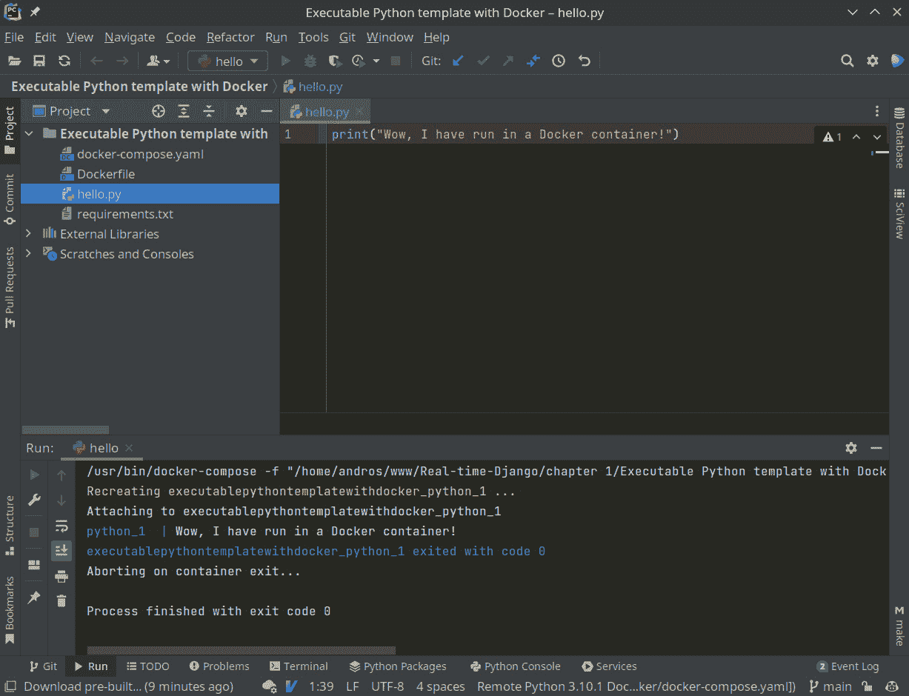

图 1.6 – 通过 Docker 集成查看 Python 执行日志

1.  此外，如果我们打开`docker-compose.yaml`文件，我们可以单独运行容器。

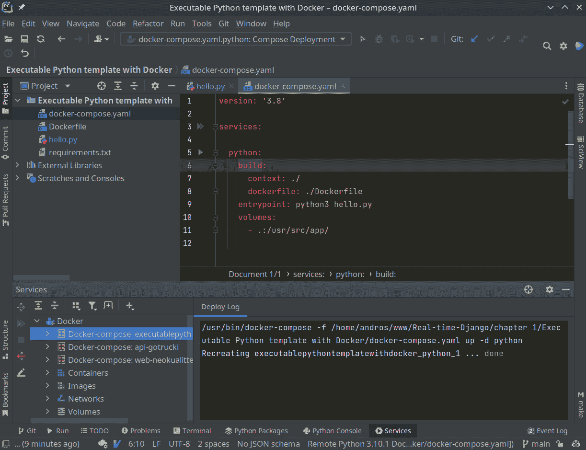

图 1.7 – 通过 Docker 集成启动容器

1.  在*图 1.7*的第 5 行，你可以看到一个绿色的箭头；当你点击它时，它将启动服务，再次运行 Python 代码。

PyCharm 已经集成了 Docker，并且能够以隔离操作系统的方式启动带有其依赖项的 Python。我们现在可以直接使用 Django 了。我们将使用官方 Django 客户端创建一个简单的项目，以便在开发时拥有最小化的结构。

# 安装 Django

我们已经有了与 Python 一起工作的基础；现在，是时候安装 Django 中实际需要的最小依赖项和工具了。

我们将把以下内容添加到当前为空的`requirements.txt`文件中：

```py
# Django
```

```py
django===4.0
```

```py
# Django Server
```

```py
daphne===3.0.2
```

```py
asgiref===3.4.1
```

```py
# Manipulate images
```

```py
Pillow===8.2.0
```

```py
# Kit utilities
```

```py
django-extensions===3.1.3
```

```py
# PostgreSQL driver
```

```py
psycopg2===2.9.1
```

```py
# Django Channels
```

```py
channels===3.0.4
```

```py
# Redis Layer
```

```py
channels_redis===3.2.0
```

你可能不知道其中的一些，因为它们是添加 WebSocket 到 Django 的项目的一部分。让我们逐一审查：

+   **Django**：这个框架自动化了许多重要任务，例如数据库连接、迁移、HTML 渲染、会话和表单。此外，作为最常用和最活跃的框架之一，它为我们提供了高度的安全性。

+   **Daphne**: Django 团队自己维护的异步服务器。我们需要它来处理 WebSocket，以便在不阻塞应用程序的情况下发送或接收数据。

+   **asgiref**: 一个需要 Channels 来工作的 ASGI 库。

+   **Pillow**: Django 必须的库，用于处理图像。

+   **django-extensions**: 一组扩展，添加了诸如 *jobs*、脚本执行、数据库同步以及 *S3* 中的静态存储等元素。

+   **Psycopg2**: 连接到 PostgreSQL 数据库的驱动程序，这是我们将会使用并且最推荐与 Django 一起使用的数据库。

+   **Channels**: 为 Django 的核心添加了处理 WebSocket 的协议和功能。

+   **channels_redis**: 我们必须记录我们活跃的连接以及它们所属的组。使用写入硬盘的数据库来管理它是一种低效的方式。为了解决这个问题，我们将在稍后连接到一个 Redis 服务，因为它在易失性内存上工作，并且速度极快。

PyCharm 可能会建议你安装一个插件，如下面的截图所示：

![Figure 1.8 – PyCharm 询问是否要安装新依赖项]

![Figure 1.8 – 图像 1.8]

Figure 1.8 – PyCharm 询问是否要安装新依赖项

如果你点击 **安装插件**，它将显示一个窗口，如下所示：

![Figure 1.9 – 图像 1.9]

![Figure 1.9 – 图像 1.9]

Figure 1.9 – PyCharm 询问是否要安装需求插件

通过点击 `requirements.txt`。

![Figure 1.10 – 图像 1.10]

![Figure 1.10 – 图像 1.10]

Figure 1.10 – 图像 1.10

现在，我们将重新编译镜像，以便安装我们已添加的所有依赖项。

使用 PyCharm，这可以通过可视化的方式完成。转到 **Dockerfile**，在下面的截图所示的箭头处右键单击，并选择 **为 'Dockerfile' 构建镜像**：

![Figure 1.11 – 图像 1.11]

![Figure 1.11 – 图像 1.11]

Figure 1.11 – 使用 PyCharm 编译 Dockerfile 镜像

如果你正在使用终端或其他编辑器，我们将在目录中使用 `docker-compose`：

```py
docker-compose build
```

通过重新创建镜像，我们在镜像中集成了所有依赖项；现在，Django 拥有我们所需的一切。为了检查它是否已安装并且我们有版本 4，我们将暂时修改 `entrypoint`：

```py
Entrypoint: django-admin --version
```

然后，我们将运行服务。

记住，你可以通过点击 Python 旁边的绿色箭头（*Figure 1.12* 中的第 5 行）或通过 `docker-compose` 来做这件事。

```py
docker-compose up
```

![Figure 1.12 – 检查已安装的 Django 版本]

![Figure 1.12 – 图像 1.12]

Figure 1.12 – 检查已安装的 Django 版本

在这两种情况下，你可以看到它返回 `4.0` 或 `requirements.txt` 中指定的版本。我们已经准备好了！

所有这些工作都可以作为未来 Python 开发的模板。不要丢失它！

通过 Django 客户端创建最小模板后，我们将配置它，以便每次服务启动时都启动测试服务器。

# 创建我们的项目

Django 需要自己的目录和文件结构才能工作。这就是为什么我们需要通过 `django-admin` 生成项目，这是一个用于启动 Django 任务的终端客户端。别担心！您不需要安装任何新东西；它是在我们添加 Django 依赖项时添加的。

让我们创建一个包含 shell 指令的文件，一次性执行所有任务。我们创建一个名为 `start-project.sh` 的文件，其中包含以下内容：

```py
# Create the 'hello-word' project
```

```py
django-admin startproject hello_world 
```

```py
# Create a folder to host the future App with the name 
```

```py
    'simple-app'.
```

```py
mkdir -p app/simple_app
```

```py
# Create the 'simple-app' App
```

```py
django-admin startapp simple_app app/simple_app
```

下面是我们正在做的事情：

+   在第一条指令 `django-admin startproject hello_world .` 中，我们创建了一个名为 `hello_world` 的项目（`startproject`），并通过最后的点告诉它在我们运行它的目录中创建。

+   当我们运行 `mkdir -p app/simple_app` 时，我们创建了一个名为 `simple_app` 的目录，它位于 app 目录内。目标是组织应用程序，将它们全部保存在同一个目录中；我们也创建了第一个应用程序将被保存的文件夹：`simple_app`。

+   最后，我们使用 `django-admin startapp simple_app app/simple_app` 创建应用程序。`simple_app` 和 `app/simple_app` 参数分别定义了应用程序的名称和位置，这是我们之前创建的。

+   简而言之，我们将项目命名为 `hello_world`，并在其中创建一个名为 `simple_app` 的单个应用程序。

PyCharm 可能会建议您安装一个插件来检查语法错误；这样做是个好主意。

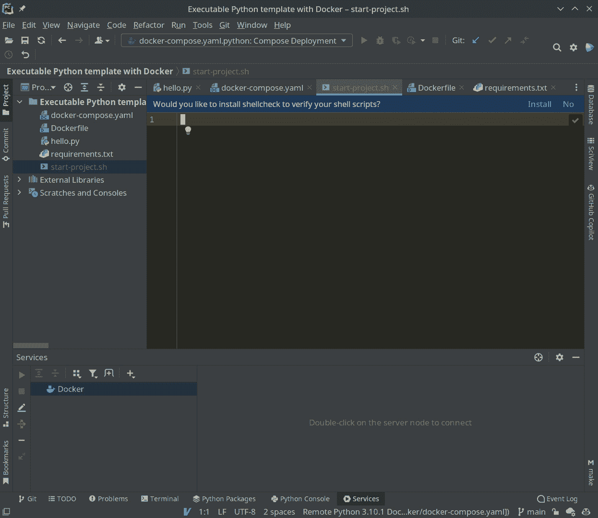

图 1.13 – PyCharm 建议为 shell 文件安装语法检查器

要执行脚本，我们再次必须临时修改 `entrypoint`，使用 `bash start-project.sh`：

```py
version: '3.8'
```

```py
services:
```

```py
  python:
```

```py
    build:
```

```py
      context: ./
```

```py
      dockerfile: ./Dockerfile
```

```py
        entrypoint: bash start-project.sh
```

```py
    volumes:
```

```py
      - .:/usr/src/app/
```

我们像之前学习的那样启动容器：打开 `docker-compose.yaml` 文件，然后在 `services` 或 `python` 中的双绿色箭头或单箭头处点击。

如果您正在使用终端或其他编辑器，我们将在目录中使用 `docker-compose`：

```py
docker-compose up
```

当 Docker 完成后，新的文件和目录将出现。如果您在 PyCharm 中看不到它们，请耐心等待；有时当新文件出现时，它很难刷新。您可以等待或右键单击任何文件，然后点击 **从磁盘重新加载**。

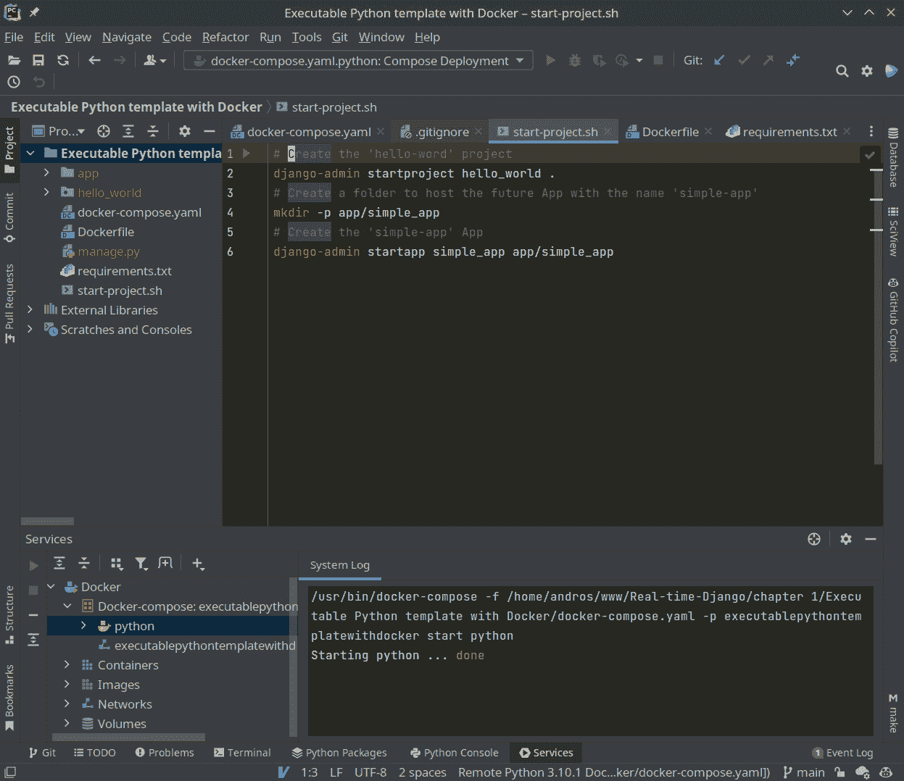

图 1.14 – 新生成的 Django 项目

现在是时候最后一次修改 `entrypoint` 了。让我们启动开发服务器。现在是收获我们劳动成果的时候了。

通过添加以下内容进行修改：

```py
python3 manage.py runserver 0.0.0.0.0:8000
```

如果您之前没有使用过 Django，`manage.py` 等同于使用 `django-admin`。前者的优点是它使用项目的配置，而 `django-admin` 更通用，您必须告诉它配置在哪里；因此，当项目存在时，使用 `manage.py` 更实用。

我们想要执行的操作是使用`runserver`启动开发服务器。`0.0.0.0.0:8000`参数表示我们对外开放任何发起请求的*IP*，最后，我们将使用端口`8000`来接受连接。

另一方面，为了让 Docker 将服务中的端口`8000`路由到外部，我们将在服务内部某处添加端口`8000:8000`。

总体来说，它看起来会是这样：

```py
version: '3.8'
```

```py
services:
```

```py
  python:
```

```py
    build:
```

```py
      context: ./
```

```py
      dockerfile: ./Dockerfile
```

```py
    entrypoint: python3 manage.py runserver 0.0.0.0:8000
```

```py
    ports:
```

```py
      - “8000:8000”
```

```py
    volumes:
```

```py
      - .:/usr/src/app/
```

我们再次启动服务。现在，打开您喜欢的浏览器并输入`127.0.0.1:8000`。您将找到 Django 欢迎网页。

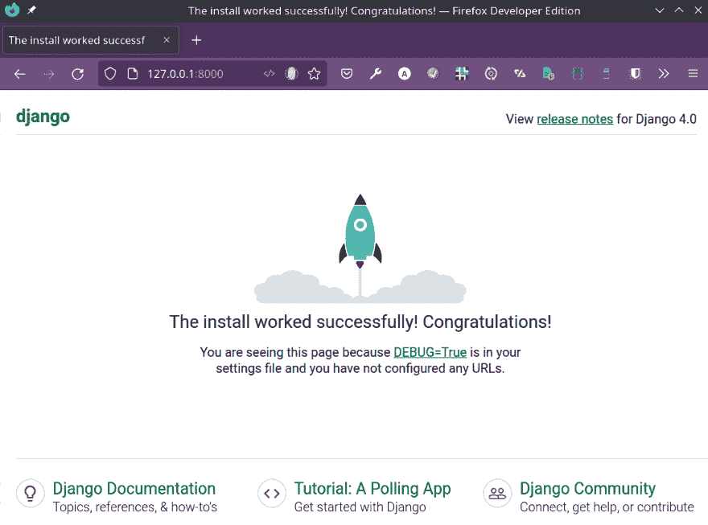

图 1.15 – Django 默认页面

我们做到了！Django 已经在 Docker 上运行。

作为最后的细节，如果您正在使用终端，您会发现容器永远不会停止。这是因为作为优秀服务器的 Web 服务器，它始终在运行并等待请求，直到我们告诉它停止。如果您想关闭它，请按*Ctrl* + *C*。在 PyCharm 中，您应该点击红色的**停止**方块。

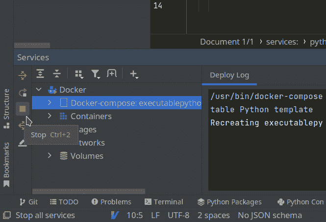


# 摘要

我们刚刚掌握了使用 Docker 容器配置和构建 Python 项目的技能。我们从基础知识开始，创建了一个运行 Python 脚本并安装我们在`requirements.txt`中声明的所有依赖项的镜像。然后，我们通过一个简单的脚本自动化创建 Django 项目，并设置了开发服务器。

另一方面，为了使容器管理更简单，我们将 IDE 集成到流程中，在我们的例子中是 PyCharm。它为我们提供了启动我们将最常使用的功能的机会：构建自定义镜像、执行容器组合（现在我们只有一个 Python 服务）、查看日志以及重启和停止容器。但不要忘记，所有这些任务都可以通过终端使用`docker-compose`访问。

在下一章中，我们将使用 Django 构建一个包含各种数据库、Web 服务器和其他工具的完整项目。此外，我们还将集成 Django 的配置与 Docker，以便于使用不同配置的部署。
