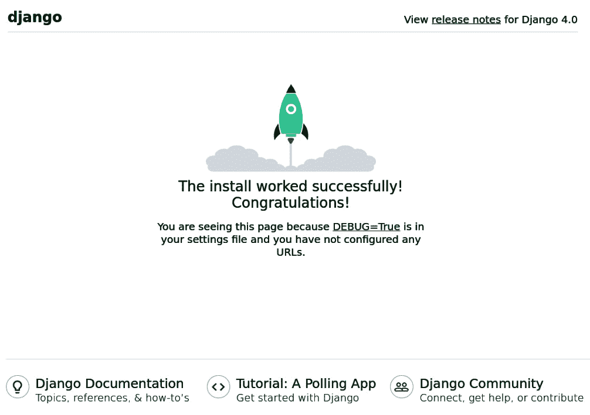
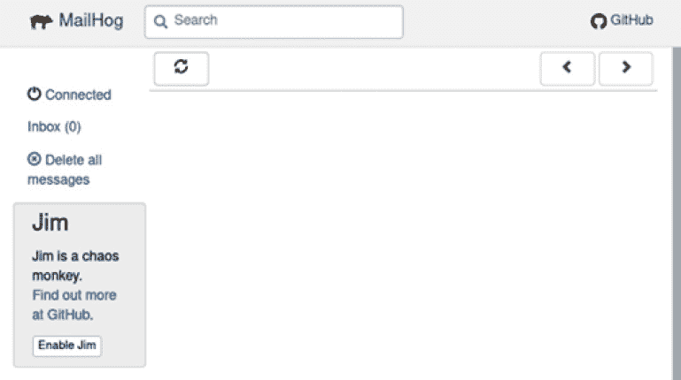

# 第二章：围绕 Docker 创建 Django 项目

在上一章中，我们学习了如何使用像 **Docker** 这样的容器系统启动用 Python 制成的应用程序。此外，我们还创建了一个 **Django** 项目，始终关注 WebSockets 以便未来的实时通信。目前，我们只有一个简单的*可执行文件*；我们需要创建一个补充 Django 的服务架构。诸如用于存储和检索信息的数据库（以及其他诸如假邮件服务器等）等重要组件对于开发将非常有用。通过配置这些工具，我们将完成围绕 Docker 的最佳工作环境的构建，然后专注于代码。

我们还将致力于环境变量的通信和集成，以通过`docker-compose.yaml`配置项目的某些方面。我们将修改部署的关键元素，如激活或停用调试模式，更改域名，指示静态文件存储的路径，以及其他一些重要的特殊性，这些特殊性区分了本地开发和生产服务器。

到本章结束时，我们将拥有一个完全集成的项目，包含 Django，准备好在测试或真实服务器上部署，这将也非常便于其他团队成员上手。

在本章中，我们将涵盖以下主题：

+   探索用于构建我们的应用程序的容器

+   添加 Django 服务

+   配置数据库

+   将 Django 连接到一个 web 服务器

+   添加一个假的 SMTP 邮件服务器

+   测试正确运行

# 技术要求

本章的代码可以在[`github.com/PacktPublishing/Building-SPAs-with-Django-and-HTML-Over-the-Wire/tree/main/chapter-2`](https://github.com/PacktPublishing/Building-SPAs-with-Django-and-HTML-Over-the-Wire/tree/main/chapter-2)找到。

# 探索用于构建我们的应用程序的容器

容器是隔离于操作系统的进程。Docker 允许我们修改它们，添加工具，执行脚本等，而无需离开 Docker 为我们保留的运行时的内存空间。当我们想要停止与容器的交互时，我们可以停止它，我们执行的所有操作都将不复存在。当然，如果我们需要的话，我们可以将更改保存到*卷*中。这些是 Docker 虚拟硬盘，可以连接到任何挂载在文件夹中的容器；这对于容器访问项目文件或配置非常有用。

我们将使用容器创建一个易于部署的环境，无论机器上安装的软件或 Python 版本如何。此外，我们还可以以透明的方式为每个软件选择版本。

让我们先通过添加以下服务来扩展`docker-compose.yaml`：

**Django**：我们将大幅度修改 Python 服务。我们不仅会更改其名称，还会添加环境变量和执行管理任务的脚本。

+   **PostgreSQL**：这将是我们将使用的数据库。尽管 Django 是数据库无关的，但框架本身推荐使用它（[`bit.ly/3JUyfUB`](https://bit.ly/3JUyfUB)），因为 PostgreSQL 具有丰富的字段类型和有趣的扩展。

+   **Caddy**：这是一个出色的 Web 服务器。它将负责管理域名，自动续订 SSL 证书，提供静态文档，并作为反向代理来访问 Django 服务。

+   **Redis**：如果您还不知道，这是一个使用非常快速的关键值模式的内存数据库。我们不会直接与之通信，但在打开或关闭房间时将通过通道进行通信。另一方面，无论我们是否使用 WebSockets，集成它都是一个好主意，因为它是出色的缓存系统。

+   **MailHog**：这是一个简单的 SMTP 服务器，它将捕获所有发送的邮件流量，并在图形界面上显示，供用户可视化。

使用 Python 服务足以启动简单的代码，但现在我们必须有一个集成了所有配置并启动 Django 服务器的 Docker 服务。

# 添加 Django 服务

在 `docker-compose.yaml` 中，将整个 `python` 块替换为以下内容：

```py
django:
```

```py
    build:
```

```py
      context: ./
```

```py
      dockerfile: ./Dockerfile
```

```py
    entrypoint: bash ./django-launcher.sh
```

```py
    volumes:
```

```py
      - .:/usr/src/app/
```

```py
    environment:
```

```py
      DEBUG: "True"
```

```py
      ALLOWED_HOSTS: hello.localhost
```

```py
      SECRET_KEY: mysecret
```

```py
      DB_ENGINE: django.db.backends.postgresql
```

```py
      DB_NAME: hello_db
```

```py
      DB_USER: postgres
```

```py
      DB_PASSWORD: postgres
```

```py
      DB_HOST: postgresql
```

```py
      DB_PORT: 5432
```

```py
      DOMAIN: hello.localhost
```

```py
      DOMAIN_URL: http://hello.localhost
```

```py
      REDIS_HOST: redis
```

```py
      REDIS_PORT: 6379
```

```py
      DEFAULT_FROM_EMAIL: no-reply@hello.localhost
```

```py
      STATIC_URL: /static/
```

```py
      STATIC_ROOT: static
```

```py
      MEDIA_URL: /media/
```

```py
      EMAIL_HOST: mailhog
```

```py
      EMAIL_USE_TLS: "False"
```

```py
      EMAIL_USE_SSL: "False"
```

```py
      EMAIL_PORT: 1025
```

```py
      EMAIL_USER:
```

```py
      EMAIL_PASSWORD:
```

```py
    expose:
```

```py
      - 8000
```

```py
    depends_on:
```

```py
      - postgresql
```

```py
      - redis
```

让我们逐一过目每个点：

+   使用 `build`，就像我们使用 `python` 一样，我们表示我们将生成在 `Dockerfile` 中定义的 Python 映像：

    ```py
    build:
          context: ./
          dockerfile: ./Dockerfile
    ```

+   如您所见，我们已经修改了在服务启动时将执行的命令。在这种情况下，将需要启动多个命令，因此我们将选择将其保存到一个我们将调用的 shell 文件中：

    ```py
    entrypoint: bash ./django-launcher.sh
    ```

我们将在稍后创建 `django-launcher.sh`，所以现在我们将忽略它。

+   我们将挂载并同步卷，即服务空间，与当前所在的文件夹。当前文件夹的结构如下：

    ```py
    folder/project:folder/container
    ```

在下一个片段中，点 (`.`) 代表项目的位置，冒号 (`:`) 是分隔符，`/usr/src/app/` 是项目将位于的容器的路径：

```py
volumes:
  - .:/usr/src/app/
```

+   我们定义所有我们将后来与 Django 配置集成的环境变量，以便我们可以在任何时间在本地和生产服务器之间迁移：

    ```py
    environment:
      KEY: value
    ```

+   我们激活开发模式：

    ```py
    DEBUG: True
    ```

+   我们指定允许的域名（目前我们将使用一个虚构的域名）：

    ```py
    ALLOWED_HOSTS: hello.localhost
    ```

+   我们定义一个加密密钥：

    ```py
    SECRET_KEY: mysecret
    ```

当在本地工作的时候，其复杂性不应该很重要。

+   我们将 PostgreSQL 配置为我们的数据库：

    ```py
    DB_ENGINE: django.db.backends.postgresql
    ```

+   我们指定数据库的名称：

    ```py
    DB_NAME: hello_db
    ```

这将在稍后使用我们尚未添加的 PostgreSQL 服务时创建。

+   我们定义一个数据库用户：

    ```py
    DB_USER: postgres
    ```

+   我们为数据库添加一个密码：

    ```py
    DB_PASSWORD: postgres
    ```

+   我们使用未来数据库服务的名称配置数据库：

    ```py
    DB_HOST: postgresql
    ```

+   我们指定 PostgreSQL 端口（默认使用端口 `5432`）：

    ```py
    DB_PORT: 5432
    ```

+   我们添加我们将使用的域名（不要添加协议，如 `https://`）：

    ```py
    DOMAIN: hello.localhost
    ```

+   我们定义要使用的路径，它将匹配 *协议* 和 *域名*：

    ```py
    DOMAIN_URL: http://hello.localhost
    ```

+   我们告诉 Django Redis 的地址和端口，这是另一个我们已经设置的服务：

    ```py
          REDIS_HOST: redis
          REDIS_PORT: 6379
    ```

+   我们给 `static` 添加前缀：

    ```py
    STATIC_URL: /static/
    ```

+   我们创建一个文件夹，用于保存静态文件：

    ```py
    STATIC_ROOT: static
    ```

我们将在同一项目的 `static` 文件夹中使用。

+   我们定义了多媒体内容的路径：

    ```py
    MEDIA_URL: /media/
    ```

+   我们定义了所有伪造 SMTP 服务器的配置：

    ```py
    DEFAULT_FROM_EMAIL: no-reply@hello.localhost
    EMAIL_HOST: mailhog
    EMAIL_USE_TLS: False
    EMAIL_USE_SSL: False
    EMAIL_PORT: 1025
    EMAIL_USER:
    EMAIL_PASSWORD:
    ```

我们告诉它使用 `mailhog` 服务，该服务目前还不存在，端口为 `1025`。在实际服务器上，它可能为 `25`。

+   网络服务器需要访问 Django 服务器。我们将它打开在端口 `8000`。有两种方式可以实现，对所有可见（`ports`）或仅对 Docker 子网可见（`expose`）。它只需要对其他服务可访问：

    ```py
    expose:
      - 8000
    ```

+   最后，请在启动之前等待数据库。它们目前还不存在，但很快就会出现：

    ```py
    depends_on:
      - postgresql
      - redis
    ```

接下来，我们将创建一个脚本来控制启动 Django 服务时的操作。

## 创建 Django 启动器

记录每次 Django 服务启动时将执行的命令是一种良好的实践。因此，我们将在项目的根目录下创建 `django-launcher.sh` 文件，内容如下：

```py
#!/bin/sh
```

```py
# Collect static files
```

```py
python3 manage.py collectstatic --noinput
```

```py
# Apply database migrations
```

```py
python3 manage.py migrate
```

```py
# Start server with debug mode
```

```py
python3 manage.py runserver 0.0.0.0 8000
```

这样，每次我们启动 Django 服务时，都会获取静态文件，启动新的迁移，并在端口 `8000` 上启动开发服务器。

我们编辑 `hello_world/settings.py`。我们将导入 `os` 以访问环境变量：

```py
import os
```

接下来，我们修改以下行：

```py
SECRET_KEY = os.environ.get("SECRET_KEY")
```

```py
DEBUG = os.environ.get("DEBUG", "True") == "True"
```

```py
ALLOWED_HOSTS = os.environ.get("ALLOWED_HOSTS"). split(",")
```

```py
DATABASES = {
```

```py
    "default": {
```

```py
        "ENGINE": os.environ.get("DB_ENGINE"),
```

```py
        "NAME": os.environ.get("DB_NAME"),
```

```py
        "USER": os.environ.get("DB_USER"),
```

```py
        "PASSWORD": os.environ.get("DB_PASSWORD"),
```

```py
        "HOST": os.environ.get("DB_HOST"),
```

```py
        "PORT": os.environ.get("DB_PORT"),
```

```py
    }
```

```py
}
```

```py
STATIC_ROOT = os.environ.get("STATIC_ROOT")
```

```py
STATIC_URL = os.environ.get("STATIC_URL")
```

```py
MEDIA_ROOT = os.path.join(BASE_DIR, "media")
```

```py
MEDIA_URL = os.environ.get("MEDIA_URL")
```

```py
DOMAIN = os.environ.get("DOMAIN")
```

```py
DOMAIN_URL = os.environ.get("DOMAIN_URL")
```

```py
CSRF_TRUSTED_ORIGINS = [DOMAIN_URL]
```

```py
"""EMAIL CONFIG"""
```

```py
DEFAULT_FROM_EMAIL = os.environ.get("EMAIL_ADDRESS")
```

```py
EMAIL_USE_TLS = os.environ.get("EMAIL_USE_TLS") == "True"
```

```py
EMAIL_HOST = os.environ.get("EMAIL_HOST")
```

```py
EMAIL_PORT = os.environ.get("EMAIL_PORT")
```

```py
EMAIL_HOST_USER = os.environ.get("EMAIL_HOST_USER")
```

```py
EMAIL_HOST_PASSWORD = os.environ.get("EMAIL_HOST_PASSWORD")
```

```py
STATIC_ROOT = os.environ.get("STATIC_ROOT")
```

```py
STATIC_URL = os.environ.get("STATIC_URL")
```

```py
MEDIA_ROOT = os.path.join(BASE_DIR, "media")
```

```py
MEDIA_URL = os.environ.get("MEDIA_URL")
```

```py
DOMAIN = os.environ.get("DOMAIN")
```

```py
DOMAIN_URL = os.environ.get("DOMAIN_URL")
```

```py
CSRF_TRUSTED_ORIGINS = [DOMAIN_URL]
```

```py
"""EMAIL CONFIG"""
```

```py
DEFAULT_FROM_EMAIL = os.environ.get("EMAIL_ADDRESS")
```

```py
EMAIL_USE_TLS = os.environ.get("EMAIL_USE_TLS") == "True"
```

```py
EMAIL_USE_SSL = os.environ.get("EMAIL_USE_SSL") == "True"
```

```py
EMAIL_HOST = os.environ.get("EMAIL_HOST")
```

```py
EMAIL_PORT = os.environ.get("EMAIL_PORT")
```

```py
EMAIL_HOST_USER = os.environ.get("EMAIL_HOST_USER")
```

```py
EMAIL_HOST_PASSWORD = os.environ.get("EMAIL_HOST_PASSWORD")
```

```py
CHANNEL_LAYERS = {
```

```py
    "default": {
```

```py
        "BACKEND": "channels_redis.core.RedisChannelLayer",
```

```py
        "CONFIG": {
```

```py
            "hosts": [(os.environ.get("REDIS_HOST"), os.environ.get("REDIS_PORT"))],
```

```py
        },
```

```py
    },
```

```py
}
```

这样，你将完美地集成 Django。如果你遇到问题，请随时复制在线的示例材料：

[`github.com/PacktPublishing/Building-SPAs-with-Django-and-HTML-Over-the-Wire/tree/main/chapter-2`](https://github.com/PacktPublishing/Building-SPAs-with-Django-and-HTML-Over-the-Wire/tree/main/chapter-2)

没有数据库的应用程序用途非常有限。因此，我们将为 Django 提供两个数据库：PostgreSQL 和 Redis。你很快就会明白为什么。

# 配置数据库

我们继续在 `docker-compose.yaml` 中添加服务。在 Django 服务之后，我们添加以下配置：

```py
postgresql:
```

```py
    image: postgres
```

```py
    environment:
```

```py
      POSTGRES_USER: postgres
```

```py
      POSTGRES_PASSWORD: postgres
```

```py
      POSTGRES_DB: hello_db
```

```py
    volumes:
```

```py
      - ./postgres_data:/var/lib/postgresql/data/
```

```py
    expose:
```

```py
      - 5432
```

在 `image: postgres` 中，我们使用官方的 PostgreSQL 镜像。它将从官方仓库自动下载。接下来，我们配置环境变量以指示用户凭据（`POSTGRES_USER` 和 `POSTGRES_PASSWORD`）和数据库的名称（`POSTGRES_DB`）。这些变量必须与 Django 服务中声明的变量匹配；否则，它将无法连接。

保留数据库副本非常重要，否则重启时所有内容都会丢失。`postgres_data:/var/lib/postgresql/data/` 表示容器中所有 PostgreSQL 内容都保存在 `postgres_data` 文件夹中。最后，我们暴露 Django 将使用的端口（`5432`）。

然后，我们添加 Redis，另一个键值数据库：

```py
redis:
```

```py
    image: redis:alpine
```

```py
    expose:
```

```py
      - 6379
```

就这么简单。我们使用带有 `alpine` 标签的官方镜像，使其尽可能轻量，并暴露端口 `6379`。

我们已经准备好了 Django 和数据库。下一步是将 Django 连接到一个暴露项目并自动管理 SSL 证书的 Web 服务器。

# 将 Django 连接到 Web 服务器

我们必须有一个管理静态内容网关服务。我们将使用 Caddy，因为它简单。

Caddy 使用一个名为 `Caddyfile` 的平面文件进行配置。我们必须创建它并添加以下内容：

```py
http://hello.localhost {
```

```py
    root * /usr/src/app/
```

```py
    @notStatic {
```

```py
      not path /static/* /media/*
```

```py
    }
```

```py
    reverse_proxy @notStatic django:8000
```

```py
    file_server
```

```py
}
```

```py
http://webmail.localhost {
```

```py
    reverse_proxy mailhog:8025
```

```py
}
```

第一行，`http://hello.localhost`，我们指明了我们将使用的域名。由于我们处于开发环境，我们将指示 `http` 协议而不是 `https`。接下来，通过 `root * /usr/src/app/` 和 `file_server`，我们告诉 Caddy 暴露静态文件（图像、CSS 文件、JavaScript 文件等），因为这不是 Django 的任务。最后，我们通过端口 `8000` 反向代理 `django` 服务，忽略其静态或媒体路由以避免冲突。

第二个块再次是一个反向代理，它将指向具有 `webmail.localhost` 域名的假 SMTP 邮件界面。

在配置就绪后，我们必须创建服务。我们将 `docker-compose.yaml` 添加到 `Caddy` 服务中：

```py
caddy:
```

```py
    image: caddy:alpine
```

```py
    ports:
```

```py
      - 80:80
```

```py
      - 443:443
```

```py
    volumes:
```

```py
      - ./Caddyfile:/etc/caddy/Caddyfile
```

```py
      - ./caddy_data:/data
```

```py
    depends_on:
```

```py
      - django
```

就像 Redis 一样，我们使用其 alpine 版本的官方镜像：`image: caddy:alpine`。我们公开打开端口 `80` 和 `443`，以便任何访客都可以访问网站。接下来是连接两个卷：`Caddyfile` 配置文件与容器内部的配置文件（`./Caddyfile:/etc/caddy/Caddyfile`）以及 Caddy 信息与一个我们将保存在项目中的文件夹 `caddy_data`（`./caddy_data:/data`）。

下一步将是添加一个邮件服务器来测试未来邮件是否被用户正确接收。此外，我们还将测试其他服务是否按预期工作。

# 添加一个假 SMTP 邮件服务器

在 `docker-compose.yaml` 的末尾，我们添加最后一个服务：

```py
mailhog:
```

```py
    image: mailhog/mailhog:latest
```

```py
    expose:
```

```py
      - 1025
```

```py
      - 8025
```

使用的端口将是 `1025`，用于 Django 连接到 SMTP 服务器，以及 `8025`，通过 `webmail.localhost` 域名访问 Web 界面，因为 Caddy 将充当反向代理。

现在我们已经添加了所有容器，是时候测试容器是否运行并且可以相互工作了。

# 测试正确运行

最后，我们将从 `docker-compose.yaml` 中拉取所有服务来测试容器是否运行并且可以相互工作。

## Caddy 和 Django

Caddy 和 Django 很容易检查，因为当你输入 `hello.localhost` 域名时，你会看到 Django 完全运行，并带有其欢迎页面：



图 2.1 – Django 在 hello.localhost 域名下运行

我们知道 Django 已经连接到 PostgreSQL，因为我们可以在日志中看到它如何应用迁移：

```py
Running migrations:
Applying contenttypes.0001_initial... OK
Applying auth.0001_initial... OK
Applying admin.0001_initial... OK
Applying admin.0002_logentry_remove_auto_add... OK
Applying admin.0003_logentry_add_action_flag_choices... OK
Applying contenttypes.0002_remove_content_type_name... OK
Applying auth.0002_alter_permission_name_max_length... OK
...
```

## MailHog

MailHog 很简单，因为当你输入 `webmail.localhost` 域名时，你会看到带有空收件箱的 Web 界面：



图 2.2 – 拥有空收件箱的 MailHog WebMail

最后，使用 Redis，我们只需确保日志中没有错误。否则，它将保持沉默。

# 摘要

在上一章中，我们能够使 Python 在完全隔离操作系统的环境中运行，包括其依赖项。这并不比创建一个虚拟环境有太大的区别。但在这个版本中，我们更进一步，将所有外部软件整合进了 Django。容器已经成为了网站的核心，包括像数据库和自身网络服务器这样重要的元素。更重要的是，与 Django 的集成不仅仅是装饰性的，因为最关键的配置都源自 Docker 环境变量，这些变量直接影响到 `settings.py` 文件。目前，如果我们愿意的话，只需一条命令就可以在任何安装了 Docker 的服务器上部署网站。在 Docker 的每一行中，我们都能找到和谐与架构。

现在，我们已经准备好深入异步操作、WebSocket、通道和实时请求了。
