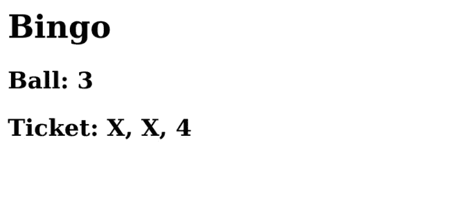

# 第三章：将 WebSocket 添加到 Django

Channels 是一个 Django 扩展，它允许我们使用除 HTTP 之外的其他协议。Django 团队了解到包含其他协议的现有局限性，因此不得不创建一个新的服务器，名为 Daphne，它与**异步服务器网关接口**（**ASGI**）本机兼容，这是**Web 服务器网关接口**（**WSGI**）的更新。没有 Channels，将无法使用 WebSocket 协议。

你可能会想知道为什么从 WSGI 迁移到 ASGI 如此重要。首先，我们需要了解什么是通信接口。当我们想为 Python 站点提供服务，无论是 Django 还是任何其他框架时，我们需要运行能够保持实例活跃并介助于任何请求的 Web 服务器的软件。有多个接口让 Web 服务器理解 Python，但最推荐的是 WSGI 规范，这是 Python 标准，用于 Web 服务器（Apache、Nginx、Caddy 等）与任何 Python Web 应用或框架（Django、Flask、FastAPI 等）之间的通信。不幸的是，存在一个限制。

当我们想与其他协议（如 WebSocket）一起使用 HTTP 时，这是不可能的；HTTP 并非设计为与其他协议一起工作。替代方案是使用 ASGI 规范，这将允许我们接受不同的协议和异步请求，将任务拆分为事件，并在响应后保持请求活跃。此外，它与使用 WSGI 的应用程序兼容，因此它将完美地与现有应用程序一起工作。这就是为什么 Daphne（记住它是 Django 的新 ASGI 服务器）是精神上的继承者，因为它保持了兼容性并扩展了 Django 的可能性。这也是为什么我们在创建 Docker 容器时包括了**daphne**、**asgiref**和**channels**的依赖项，在*第二章*，“围绕 Docker 创建 Django 项目”中，它们是能够与 WebSocket 协议一起工作的最小工具。

在本章中，我们将学习如何激活 Channels，配置 Django 以使用 Daphne，在前后端之间创建通信通道，发送不同格式（纯文本、JSON 和 HTML），其中 Django 将生成将在前端显示的 HTML 块。我们还将深入了解其他重要的 Channels 组件，如**作用域**、**消费者**、**路由**和**事件**。

到本章结束时，我们将掌握使用 Django 在服务器和客户端之间建立双向通信所需的最基本技能。

本章我们将涵盖以下主题：

+   使用 Daphne 创建我们的第一个页面

+   使用消费者监听事件

+   从后端发送纯文本

+   发送和接收 JSON 消息

+   在后端渲染 HTML

# 技术要求

本章的代码可以在 [`github.com/PacktPublishing/Building-SPAs-with-Django-and-HTML-Over-the-Wire/tree/main/chapter-3`](https://github.com/PacktPublishing/Building-SPAs-with-Django-and-HTML-Over-the-Wire/tree/main/chapter-3) 找到。

# 使用 Daphne 创建我们的第一个页面

让我们从激活 Channels 提供的所有实时功能开始。因此，我们将启用配置中的 Channels，更改 ASGI 的 WSGI 服务器，并构建一个最小的 HTML 页面来检查一切是否运行正确。我们将继续我们在 *第二章* 中开始的应用程序，即 *围绕 Docker 创建 Django 项目*。如果您没有代码，您可以使用以下存储库中的示例：[`github.com/PacktPublishing/Building-SPAs-with-Django-and-HTML-Over-the-Wire/tree/main/chapter-2`](https://github.com/PacktPublishing/Building-SPAs-with-Django-and-HTML-Over-the-Wire/tree/main/chapter-2)。

让我们开始：

1.  我们将要做的第一件事是激活 Channels。为此，我们打开 `hello_world/settings.py`，并在 `INSTALLED_APPS` 下添加 `app.simple_app`（放在末尾）和 `channels`（放在最前面）：

    ```py
    INSTALLED_APPS = [
        ' channels', # New line
        'django.contrib.admin',
        'django.contrib.auth',
        'django.contrib.contenttypes',
        'django.contrib.sessions',
        'django.contrib.messages',
        'django.contrib.staticfiles',
        'app.simple_app', #New line
    ]
    ```

1.  正如我们在介绍中学习的，Channels 需要一个 ASGI 兼容的服务器才能工作。如果我们不满足这一要求，Django 甚至无法启动。这就是为什么我们必须指出配置 Daphne 或任何其他管理界面的服务器的配置文件所在位置。在我们的例子中，我们将前往 `settings.py` 的末尾并添加以下行：

    ```py
    ASGI_APPLICATION = "hello_world.asgi.application"
    ```

1.  由于项目位于 `app` 文件夹中，Django 可能无法正确处理导入。为了解决这个问题，我们将更改我们应用程序的名称。我们打开 `app/simple_app/apps.py` 并将其保留如下：

    ```py
    from django.apps import AppConfig
    class SimpleAppConfig(AppConfig):
        default_auto_field = 'django.db.models.
            BigAutoField'.
        name = 'app.simple_app' # Update
    ```

1.  接下来，我们将创建一个基本的 HTML 页面，其中 JavaScript 将与未来的 WebSocket 服务器交互。

在 `app/simple_app/` 内部，我们创建一个名为 `templates` 的文件夹，并在其中创建一个名为 `index.html` 的新文件。完整路径为 `app/simple_app/templates/index.html`。我们包含以下内容：

```py
<html lang="en">
<head>
    <meta charset="UTF-8">
    <meta name="viewport" content="width=device-width, 
      user-scalable=no, initial-scale=1.0, maximum- 
        scale=1.0, minimum-scale=1.0">
    <title> Index </title>
</head>
<body>
    <h1> Hello Django! <h1>
</body>
</html>
```

1.  接下来，让我们创建一个视图来展示我们刚刚创建的 HTML 文件。我们打开 `app/simple_app/views.py` 并创建一个名为 `index` 的视图。在 `return` 中，我们将告诉它以模板的内容进行响应：

    ```py
    from django.shortcuts import render

    def index(request):
        return render(request, 'index.html', {})
    ```

1.  现在我们只需要提供一个路由。我们进入 `hello_world/urls.py`，导入视图并添加一个新的 `path`：

    ```py
    from django.contrib import admin
    from django.urls import path
    from app.simple_app import views

    urlpatterns = [
        path('', views.index, name='index'), # New line
        path('admin/', admin.site.urls),
    ]
    ```

1.  我们启动 Docker 并进入 `http://hello.localhost/`。它将响应一个简约的消息：

![Figure 3.1 – Displaying a static HTML page on the domain hello.localhost]

![Figure 3.1_B18321.jpg]

Figure 3.1 – Displaying a static HTML page on the domain hello.localhost

恭喜！您已经使用 Daphne 和 Django 构建了一个网页，它准备好处理 WebSocket 连接。

下一步是构建并了解消费者概念，这是 Channels 处理事件的方式。我们将连接前端与一个简单的消费者，它将作为中介在 Django 和 JavaScript WebSocket 客户端之间进行通信。

# 使用消费者监听事件

我们将构建一个示例，在这个示例中，我们可以在后端和前端之间实时发送消息。我们需要一个中介来监听两者并做出决定。Channels 自带一个特别准备好的工具，称为消费者。它是一系列在 WebSocket 客户端触发事件时被调用的函数。

在这里，你可以看到 WebSocket 的最小消费者结构：

```py
from channels.generic.websocket import WebsocketConsumer
```

```py
class NameConsumer(WebsocketConsumer):
```

```py
    def connect(self):
```

```py
        """Event when client connects"""
```

```py
        # Informs client of successful connection
```

```py
        self.accept()
```

```py
    def disconnect(self, close_code):
```

```py
        """Event when client disconnects"""
```

```py
        pass
```

```py
    def receive(self, text_data):
```

```py
        """Event when data is received"""
```

```py
        pass
```

让我们逐一了解前述代码片段中每个事件的作用：

+   `connect`：请求连接权限。如果我们接受，我们将分配一个组。关于这一点，我们稍后再谈。

+   `receive`：向我们发送信息，我们决定如何处理它。它可能触发一些操作，或者我们可能忽略它；我们没有义务处理它。

+   `disconnect`：通知我们将要关闭连接。提前意识到连接将要关闭是很重要的。

作为技术性的，消费者是使用 ASGI 创建事件驱动应用程序的一种抽象。它们允许我们在发生变化时执行所需的代码。如果你曾经使用过 JavaScript 事件，你会非常熟悉它们。如果你还没有，你可以将它们视为视图的通道，除了，它们不是通过请求到我们链接到视图的 URL 来触发的，而是执行函数的动作。

Django 能够捕获客户端事件。Channels 知道是否有新的客户端已连接、断开连接或发送了信息。然而，后端有一个非常强大的能力：选择信息接收者。当客户端请求连接时，Django 必须为客户端分配一个组或通道。客户端可以单独存在，或者与其他客户端分组，这取决于需要。当发送消息的时间到来时，我们必须决定谁将接收它——一个特定的客户端或一个组。

在什么情况下我需要向客户端或一组发送数据？让我们以聊天为例。当我发送一条私信时，Django 会将新文本发送给特定的客户端，即我正在与之交谈的特定用户。另一方面，如果我与其他用户在同一个组中，当我发送消息时，后端只会将文本发送给特定的选择，即所有订阅聊天室的用户。前端不会决定是否接收新信息或接收者是谁；消费者是掌握谁移动可用信息的主导者。

现在我们已经看到了消费者如何有用，让我们看看它们在向服务器/客户端发送纯文本时扮演的角色。我们将探讨客户端如何捕获从通道接收到的信息。

# 从后端发送纯文本

让我们构建第一个最小化的消费者，当 WebSocket 客户端连接时，它会向客户端打招呼。稍后，我们将增加复杂性和其他操作。

示例的所有代码都可以在 [`github.com/PacktPublishing/Building-SPAs-with-Django-and-HTML-Over-the-Wire/tree/main/chapter-3/Sending%20plain%20text`](https://github.com/PacktPublishing/Building-SPAs-with-Django-and-HTML-Over-the-Wire/tree/main/chapter-3/Sending%20plain%20text) 找到：

1.  我们使用以下内容创建 `app/simple_app/consumers.py`：

    ```py
    # app/simple_app/consumers.py
    from channels.generic.websocket import WebsocketConsumer

    class EchoConsumer(WebsocketConsumer):

        def connect(self):
            """Event when client connects"""

            # Informs client of successful connection
            self.accept()

            # Send message to client
            self.send(text_data="You are connected by WebSockets!")

        def disconnect(self, close_code):
            """Event when client disconnects"""
            pass

        def receive(self, text_data):
            """Event when data is received"""
            pass
    ```

让我们解释一下我们刚刚创建的文件中的每个元素：

+   通过 `from channels.generic.websocket import WebsocketConsumer`，我们导入了用于 WebSockets 的消费者对象。

+   我们使用 `class EchoConsumer(WebsocketConsumer):` 声明消费者，并将其命名为 `EchoConsumer`。

+   你至少需要三个函数，这些函数是前端操作将触发的事件：`connect`、`disconnect` 和 `receive`。我们将重点关注 `connect`。

+   当客户端连接时，我们首先会确认连接，以建立 Django 和客户端之间的未来通信。我们使用 `self.accept()`。

+   最后，我们将使用 `self.send` 发送一条消息，内容为 `"You are connected by WebSockets!"`。这样，每个连接的客户端都会收到一条问候。

1.  现在我们需要为消费者分配一个路由，以便 WebSocket 客户端可以连接到。为此，我们在 ASGI 服务器上添加了连接到消费者的路由。我们打开 `hello_world/asgi.py` 并更新路径 `/ws/echo/`，指向 `EchoConsumer`：

    ```py
    # hello_world/asgi.py
    import os
    from django.core.asgi import get_asgi_application
    from channels.auth import AuthMiddlewareStack
    from channels.routing import ProtocolTypeRouter, 
        URLRouter
    from django.urls import re_path
    from app.simple_app.consumers import EchoConsumer
     os.environ.setdefault('DJANGO_SETTINGS_MODULE', 
        'hello_world.settings')

    application = ProtocolTypeRouter({
        # Django's ASGI application to handle traditional 
        HTTP requests
        "http": get_asgi_application(),
        # WebSocket handler
        "websocket": AuthMiddlewareStack(
            URLRouter([
                re_path(r"^ws/echo/$", EchoConsumer.
                    as_asgi()),
            ])
        ),
    })
    ```

在 `asgi.py` 文件中，你可以找到所有可以应用于 ASGI 服务器的配置：

+   由于 ASGI 在 Django 之前加载，它无法知道 Django 自身配置文件的路径。我们必须使用 `os.environ.setdefault('DJANGO_SETTINGS_MODULE', 'hello_world.settings')` 来先发制人。

+   在 `application` 中，我们配置所有路由，无论是 HTTP 还是其他协议。我们使用 `ProtocolTypeRouter` 对象来指示每个路由的类型和目的地。

+   仍然需要使用传统的 HTTP 请求：通过 HTTP 加载页面、管理会话、cookies 以及其他特定功能。为此任务，我们在 `ProtocolTypeRouter` 中包含 `"http": get_asgi_application()`。

+   最后，我们使用 `re_path(r'ws/echo/$', consumers.EchoConsumer.as_asgi())` 包含消费者路径。现在连接到 `EchoConsumer` 的路径是 `/ws/echo/`。

1.  接下来，我们将 WebSocket 客户端连接到 Django。

我们前往 `app/simple_app/templates/index.html`，我们将在这里使用 JavaScript 定义一个连接到我们刚刚创建的路径的 WebSocket 客户端：

```py
{# app/simple_app/templates/index.html #}
<! doctype html>
<html lang="en">
<head>
    <meta charset="UTF-8">
    <meta name="viewport" content="width=device-width, 
      user-scalable=no, initial-scale=1.0, maximum-
        scale=1.0, minimum-scale=1.0">
    < title> Index </title>
</head>
<body>
    <h1>Hello Django!</h1>

    <!-- Place where we will display the connection 
    message. -->
    <h2 id="welcome"></h2>
    <script>
        // Connect to WebSockets server (EchoConsumer)
        const myWebSocket = new WebSocket("ws://{{ 
            request.get_host }}/ws/echo/");

        // Event when a new message is received by 
        WebSockets
        myWebSocket.addEventListener("message", 
            (event) => {
            // Display the message in '#welcome'.
            document.querySelector("#welcome").
                textContent = event.data;
        });
    </script>
</body>
</html>
```

我们已经使用 JavaScript 创建了一个最小化的 WebSocket 客户端来监听从后端接收到的所有内容：

+   我们定义一个 HTML 标签来显示后端将发送给我们的欢迎消息。添加 `<h2 id="welcome"></h2>` 就足够了；稍后，我们将用 JavaScript 填充它。

+   我们通过 `new WebSocket()` 连接到 `/ws/echo/`。地址必须包含以下结构：`protocol://domain/path`。在我们的例子中，它将是 `ws://hello.localhost/ws/echo/`。

+   当后端发送消息时，将触发 `message` 事件。一旦我们连接到 Django，我们就会收到我们已编程的消息，然后在 `<h2>` 中显示它。

WebSocket 安全协议

我们可以使用 `ws://` 协议，其中信息以纯文本形式发送，或者使用 `wss://` 来保持安全连接。这种差异类似于使用 `http://` 或 `https://`。当我们在生产环境中或者能够提供 SSL 证书时，我们将更改协议以保持安全；而在开发过程中，这并不是必需的。

在您喜欢的浏览器中打开地址 `http://hello.localhost`。


图 3.2 – 从后端发送纯文本（“您通过 WebSockets 连接”）并在标题下方的 HTML 元素中渲染消息

我们刚刚学习了如何通过 WebSockets 从后端异步发送纯文本到前端。OK！这并不非常引人注目；它是在我们连接的同一时刻发送的。然而，正如我们构建的那样，我们可以随时发送消息。

让它更有趣：我们是否同步所有访客的时间？换句话说，实时向所有连接的客户端发送相同的信息。当然！

我们回到 `app/simple_app/consumers.py`。我们将创建一个无限循环，其中每秒向前端发送一个文本，特别是当前时间。我们将使用 **threading** 创建一个后台任务，不会产生任何中断：

```py
# app/simple_app/consumers.py
```

```py
from channels.generic.websocket import WebsocketConsumer
```

```py
from datetime import datetime # New line
```

```py
import time # New line
```

```py
import threading # New line
```

```py
class EchoConsumer(WebsocketConsumer):
```

```py
    def connect(self):
```

```py
        """Event when client connects"""
```

```py
        # Informs client of successful connection
```

```py
        self.accept()
```

```py
        # Send message to client
```

```py
        self.send(text_data="You are connected by 
```

```py
            WebSockets!")
```

```py
        # Send message to client every second
```

```py
        def send_time(self): # New line
```

```py
            while True:
```

```py
                # Send message to client
```

```py
                self.send(text_data=str(datetime.now(). 
```

```py
                    Strftime("%H:%M:%S")))
```

```py
                # Sleep for 1 second
```

```py
                time.sleep(1)
```

```py
        threading.Thread(target=send_time, args=(self,)).
```

```py
            start() # New line
```

```py
    def disconnect(self, close_code):
```

```py
        """Event when client disconnects"""
```

```py
        pass
```

```py
    def receive(self, text_data):
```

```py
        """Event when data is received"""
```

```py
        pass
```

现在，在不同的标签页或浏览器中打开相同的地址 `hello.localhost`；您将看到它们显示的确切相同的时间。所有客户端都是同步的，接收相同的信息。无需等待，无需询问后端。


图 3.3 – 实时向所有访客显示相同的时间

眼前的实时力量。也许它正在激发你的想象力；可能性是无限的：一个选举系统？一个拍卖网站？通知？出租车定位器？食品订单？聊天？我们将通过小型项目继续探索。

在接下来的章节中，我们将继续学习如何以不同的格式从后端发送消息，例如 JSON 或 HTML。

# 从后端发送 JSON

我们将从后端以 JSON 格式发送内容，并在前端消费它。此外，我们将为代码提供一个可重用的结构，这在整本书中都将是有用的。

示例的所有代码都可以在 [`github.com/PacktPublishing/Building-SPAs-with-Django-and-HTML-Over-the-Wire/tree/main/chapter-3/Sending%20JSON`](https://github.com/PacktPublishing/Building-SPAs-with-Django-and-HTML-Over-the-Wire/tree/main/chapter-3/Sending%20JSON) 找到。

我们有一个名为 `JsonWebsocketConsumer` 的消费者类型，适用于发送或接收 JSON。它与 `WebsocketConsumer` 相同，除了两点不同：

+   我们需要添加 `send_json` 函数来编码成 JSON：

    ```py
    book = {
        'title': 'Don Quixote',
        author': 'Miguel de Cervantes'.
    }
    self.send_json(content=book)
    ```

+   我们有一个新的事件，称为 `receive_json`，当从客户端接收到消息时会自动解码 JSON：

    ```py
    def receive_json(self, data):
        """Event when data is received"""
        pass
    ```

为了说明我们如何以 JSON 格式发送内容，我们将创建一个宾果项目。

## 示例项目 – 生成随机数字的票据

当客户端连接时，将生成一个包含一系列随机数字的票据，并通过 WebSockets 交付给他们。然后，我们不时地发送一个 Django 随机球。当玩家拥有所有数字时，我们将显示获胜信息。

让我们开始吧：

1.  我们在 `app/simple_app/consumers.py` 中添加了一个新的消费者，它扩展了 `JsonWebsocketConsumer`：

    ```py
    from channels.generic.websocket import JsonWebsocketConsumer
    class BingoConsumer(JsonWebsocketConsumer):

        def connect(self):
            self.accept()

        def disconnect(self, close_code):
            """Event when client disconnects"""
            pass

        def receive_json(self, data):
            """Event when data is received"""
            Pass
    ```

1.  我们生成一个包含 1 到 10 之间五个数字的票据。我们将使用 `set()` 来避免重复：

    ```py
    class BingoConsumer(JsonWebsocketConsumer):

        def connect(self):
            self.accept()
            ## Send numbers to client
            # Generates numbers 5 random numbers,  
               approximately, between 1 and 10
            random_numbers = list(set([randint(1, 10) for 
                _ in range(5)])))
            message = {
                ' action': 'New ticket',
                ' ticket': random_numbers
            }
            self.send_json(content=message)

        def disconnect(self, close_code):
            """Event when client disconnects"""
            pass

        def receive_json(self, data):
            """Event when data is received"""
            pass
    ```

为了通知客户端我们将执行哪种操作，我们在发送的 JSON 中包含 `action`。另外，在 `ticket` 中包含数字列表。

1.  编辑 `hello_world/asgi.py` 并添加指向 `BingoConsumer` 的路径 `/ws/bingo/`。别忘了导入它。现在我们有一个新的端点来为未来的 WebSockets 客户端提供数据。是时候创建 HTML 了：

    ```py
    # hello_world/asgi.py
    import os 
    from django.core.asgi import get_asgi_application
    from channels.auth import AuthMiddlewareStack
    from channels.routing import ProtocolTypeRouter, URLRouter
    from django.urls import re_path
    from app.simple_app.consumers import EchoConsumer, BingoConsumer # Update

    os.environ.setdefault('DJANGO_SETTINGS_MODULE', 
        'hello_world.settings')

    application = ProtocolTypeRouter({
        # Django's ASGI application to handle traditional 
        HTTP requests
        "http": get_asgi_application(),
        # WebSocket handler
        "websocket": AuthMiddlewareStack(
            URLRouter([
                re_path(r"^ws/echo/$", EchoConsumer.
                    as_asgi()),
                re_path(r"^ws/bingo/$", BingoConsumer.
                    as_asgi()), # New line
            ])
        ),
    })
    ```

消费者准备向每个连接的客户端发送带有随机数字的票据。下一步将是准备前端以接收它并在适当的 HTML 元素中渲染它。

# 前端接收 JSON

目标是接收来自后端的异步 JSON，JavaScript 将在事件中检测到它。有了这些数据，我们将在 HTML 中向访客展示信息：

1.  我们在 `app/simple_app/templates/bingo.html` 中创建一个新的 HTML 文件，它将包含所有前端：

    ```py
    {# app/simple_app/templates/bingo.html #}
    <! doctype html>
    <html lang="en">
    <head>
        <meta charset="UTF-8">
        <meta name="viewport"
              content="width=device-width, user
                scalable=no, initial-scale=1.0, maximum-
                  scale=1.0, minimum-scale=1.0">
        <title>Bingo</title>
    </head>
    <body>
        <h1>Bingo</h1>
        <h2>Ball: <span id="ball"></span></h2>.
        <h2 id="ticket"></h2>

        <script>
            // Connect to WebSockets server
            (BingoConsumer)
            const myWebSocket = new WebSocket("ws://{{ 
                request.get_host }}/ws/bingo/");
            let ticket = [];

            // Event when a new message is received by 
               WebSockets
            myWebSocket.addEventListener("message", 
                (event) => {
                const myData = JSON.parse(event.data);
                switch (myData.action) {
                    case "New ticket":
                        // Save the new ticket
                        ticket = myData.ticket;
                        // Render ticket
                        document.getElementById("ticket"). 
                             textContent = "Ticket: " + 
                                 ticket.join(", ");
                        break;
                    } }
            });
        </script>
    </body>
    </html>
    ```

1.  我们将需要一个视图来为我们的模板创建视图。我们在 `app/simple_app/views.py` 中添加了以下函数：

    ```py
    from django.shortcuts import render

    def index(request):
        return render(request, 'index.html', {})

    def bingo(request): # New function
        return render(request, 'bingo.html', {})
    ```

1.  在 `hello_world/urls.py` 中，我们包括 `/bingo/` 路径：

    ```py
    from django.contrib import admin
    from django.urls import path
    from app.simple_app import views

    urlpatterns = [
        path('', views.index, name='index'),
        path('bingo/', views.bingo, name='bingo'), # New line
        path('admin/', admin.site.urls),
    ]
    ```

通过这个更改，票据生成就准备好了。

1.  当我们输入 `http://hello.localhost/bingo/` 时，我们将看到一个随机数字的票据，它只会给我们：


图 3.4 – 通过 WebSockets 连接时后端返回一组随机数字

目前，消费者返回如下 JSON 给任何连接到 `/ws/bingo/` 的客户端：

```py
{
" action": " New ticket "
" ticket": [1, 2, 3...] // Random numbers
}
```

JavaScript 等待，监听。如果它接收到一个 `"action"` 为 `"New ticket"` 的 JSON，它将把 `"ticket"` 的全部内容存储在 `ticket` 变量中。最后，JSON 显示 HTML：

```py
myWebSocket.addEventListener("message", (event) => {
const myData = JSON.parse(event.data);
switch (myData.action) {
case "New ticket":
// Save the new ticket
ticket = myData.ticket;
// Render ticket
document.getElementById("ticket"). textContent = 
    "Ticket: " + ticket.join(", ");
                    break;
} 
}
});
```

我们现在为每位客户都有一套自动生成的数字来玩。下一步将是向所有客户发送相同的随机数字来代表球。

## 示例项目 – 检查匹配的数字

下一个里程碑是定期从后端发送随机数字，供前端检查匹配。是时候混合球了！

1.  我们创建一个线程生成随机数字，并每秒发送一次。我们将调用动作`'New ball'`：

    ```py
    # app/simple_app/consumers.py
    from channels.generic.websocket import WebsocketConsumer
    from datetime import datetime
    import time
    import threading
    from random import randint
    from channels.generic.websocket import JsonWebsocketConsumer

    class EchoConsumer(WebsocketConsumer):
     # Echo Code
    class BingoConsumer(JsonWebsocketConsumer):

        def connect(self):
            self.accept()
            ## Send numbers to client
            # Generates numbers 5 random numbers, approximately, between 1 and 10
            random_numbers = list(set([randint(1, 10) for 
                _ in range(5)]))
            message = {
                ' action': 'New ticket',
                ' ticket': random_numbers
            }
            self.send_json(content=message)

            ## Send balls
            def send_ball(self):
                while True:
                    # Send message to client
                    random_ball = randint(1, 10)
                    message = {
                        ' action': 'New ball',
                        ' ball': random_ball
                    }
                    self.send_json(content=message)
                    # Sleep for 1 second
                    time.sleep(1)

            threading.Thread(target=send_ball, 
                args=(self,)). start()

        def disconnect(self, close_code):
            """Event when client disconnects"""
            pass

        def receive_json(self, data):
            """Event when data is received"""
            Pass
    ```

1.  在监听 Django 的 JavaScript 事件中，我们将添加一个案例来检测是否到达了带有`"New ball"`的动作：

    ```py
    {# app/simple_app/templates/bingo.html #}
    <! doctype html>
    <html lang="en">
    <head>
        <meta charset="UTF-8">
        <meta name="viewport"
              content="width=device-width, user-
                scalable=no, initial-scale=1.0, maximum-
                  scale=1.0, minimum-scale=1.0">
        <title>Bingo</title>
    </head>
    < body>
        <h1>Bingo</h1>
        <h2>Ball: <span id="ball"></span></h2>.
        <h2 id="ticket"></h2>

        <script>
            // Connect to WebSockets server (BingoConsumer)
            const myWebSocket = new WebSocket("ws://{{ 
                request.get_host }}/ws/bingo/");
            let ticket = [];

            // Event when a new message is received by 
            WebSockets
            myWebSocket.addEventListener("message", 
               (event) => {
                const myData = JSON.parse(event.data);
                switch (myData.action) {
                    case "New ticket":
                        // Save the new ticket
                        ticket = myData.ticket;
                        // Render ticket
                        document.getElementById("ticket"). 
                            textContent = "Ticket: " + 
                                ticket.join(", ");
                        break;
                    case "New ball":
                        // Get the ball number
                        ball = myData.ball;
                        // Check if ball is in the ticket 
                        and remove it
                        ticket = ticket.map(item => item 
                            === ball ? "X" : item);
                        // Render ticket
                        document.getElementById("ticket"). 
                            textContent = "Ticket: " + 
                                ticket.join(", ");
                        // Render ball
                        document.getElementById("ball"). 
                            textContent = ball;
                        // Check if we have a winner
                        if (ticket.find(number => number 
                            !== "X") === undefined) {
                            // We have a winner
                            document.getElementById
                                ("ticket"). textContent = 
                                    "Winner!";
                        }
                        break;
                }
            });

        </script>
    </body>
    </html>
    ```

1.  如果是这样，我们将在票据数组中搜索匹配项，并用`X`替换数字：



图 3.5 – 如果任何球与票据上的数字匹配，我们将用 X 替换它

那我们怎么知道我们赢了？如果我的票据上的所有内容都是`X`：游戏结束！


图 3.6 – 所有票据数字已被划掉，因此我们显示获胜信息

到目前为止，前端所做的只是像好孩子一样听从和服从。然而，他们现在已经足够成熟，可以被人听到。从 JavaScript 开始，我们将通过发出请求或发送信息与 Django 进行通信，后端将以两种方式做出回应：要么以 JSON（如我们在本节中学到的）形式，要么以渲染的 HTML 形式。

# 后端渲染 HTML

在本章中，我们将迈出 HTML over WebSockets 原理的第一步。后端将负责渲染 HTML，将责任从 JavaScript 中移除，简化其任务。另一方面，我们将避免需要集成 React、Vue 或 Angular 等框架以及 HTTP 客户端的 API。

目标将是使用公制系统为成年人构建一个**体质指数**（**BMI**）计算器。所有计算和 HTML 创建都将由 Django 任务处理。

示例中的所有代码都可以在[`github.com/PacktPublishing/Building-SPAs-with-Django-and-HTML-Over-the-Wire/tree/main/chapter-3/Rendering%20HTML`](https://github.com/PacktPublishing/Building-SPAs-with-Django-and-HTML-Over-the-Wire/tree/main/chapter-3/Rendering%20HTML)找到。

我们将要求输入身高（厘米）和体重（公斤）。获取它的公式是*体重（公斤）/（身高（米））*2。

在 Python 中，它将被翻译为以下内容：`weight / (height ** 2)`。

其结果将指示状态：


表 1.1 – BMI 状态

例如，如果我体重 78 公斤，身高 180 厘米（或 1.8 米），计算结果将是 78 / (1.8 ** 2)，结果是`24`。我会处于**正常**状态，仅差一点就到**超重** – 我想这是生活对我放弃每天巧克力的警告：

1.  我首先在 `app/simple_app/consumers.py` 中添加了一个名为 `BMIConsumer` 的消费者：

    ```py
    from django.template.loader import render_to_string
    class BMIConsumer(JsonWebsocketConsumer):

        def connect(self):
            self.accept()

        def disconnect(self, close_code):
            """Event when client disconnects"""
            pass

        def receive_json(self, data):
            """Event when data is received"""
            height = data['height'] / 100
            weight = data['weight']
            bmi = round(weight / (height ** 2), 1)
            self.send_json(
                content={
                        "action": "BMI result",
                        "html": render_to_string(
                            "components/_bmi_result.html",
                            {"height": height, "weight": 
                                weight, "bmi": bmi}
                        )
                }
            )
    ```

第一次，我们将从客户端接收信息。客户端将提供未来表单的体重和身高值，而我们则返回准备显示的 HTML。

让我们解释一下前面代码片段中发生的事情：

+   我们导入 Django 函数以渲染 HTML：`from django.template.loader import render_to_string`。

+   所有事情都发生在 `receive_json` 函数中。通过 `data['height']` 和 `data['weight']`，我们收集了我们将从 JavaScript 发送的两条数据。

+   使用 `round(weight / (height ** 2), 1)` 计算指数。

+   我们向客户端发送一个包含两个字段的 JSON：`"action"`，我们简单地通知客户端要采取什么操作，以及 `"html"`，其中包含从 **render_to_string** 生成的 HTML。

1.  编辑 `hello_world/asgi.py` 并添加指向 `BMIConsumer` 的 `/ws/bmi/` 路径。

    ```py
    # hello_world/asgi.py
    Import
    from django.core.asgi import get_asgi_application
    from channels.auth import AuthMiddlewareStack
    from channels.routing import ProtocolTypeRouter, URLRouter
    from django.urls import re_path
    from app.simple_app.consumers import EchoConsumer, BingoConsumer, BMIConsumer # Update

    os.environ.setdefault('DJANGO_SETTINGS_MODULE', 'hello_world.settings')

    application = ProtocolTypeRouter({
        # Django's ASGI application to handle traditional 
        HTTP requests
        "http": get_asgi_application(),
        # WebSocket handler
        "websocket": AuthMiddlewareStack(
            URLRouter([
                re_path(r"^ws/echo/$", EchoConsumer.
                    as_asgi()),
                re_path(r"^ws/bingo/$", BingoConsumer.
                    as_asgi()),
                re_path(r"^ws/bmi/$", BMIConsumer.
                    as_asgi()), # New line
            ])
        ),
    })
    ```

1.  我们在 `app/simple_app/templates/bmi.html` 中创建一个新的 HTML 文件，它将包含表单和将发送信息的 JavaScript：

    ```py
    {# app/simple_app/templates/bmi.html #}
    <! doctype html>
    <html lang="en">
    <head>
        <meta charset="UTF-8">
        <meta name="viewport"
              content="width=device-width, user-
                scalable=no, initial-scale=1.0, maximum-
                  scale=1.0, minimum-scale=1.0">
        <title>BMI Calculator</title>.
    </head>
    <body>
        <h1>BMI Calculator</h1>
        <label for="height"> Height (cm):
            <input type="text" name="height" id="height">
        </label>
        <label for="weight"> Weight (kg)
            <input type="text" name="weight" id="weight">
        </label>
        <input type="button" id="calculate" value=
            "Calculate">
        <div id="result"></div>

        <script>
            // Connect to WebSockets server 
            (BingoConsumer)
            const myWebSocket = new WebSocket("ws://{{ 
                request.get_host }}/ws/bmi/");

            // Event when a new message is received by 
            WebSockets
            myWebSocket.addEventListener("message", 
               (event) => {
                const myData = JSON.parse(event.data);
                switch (myData.action) {
                    case "BMI result":
                        document.getElementById("result"). 
                            innerHTML = myData.html;
                        break;
                }
            });

            document.querySelector('#calculate'). 
                addEventListener('click', () => {
                const height = parseFloat(document.
                    querySelector('#height'). value);
                const weight = parseFloat(document.
                    querySelector('#weight'). value);
                myWebSocket.send(JSON.stringify({
                    height: height,
                    weight: weight
                }));
            });

        </script>
    </body>
    </html>
    ```

机制很简单。当 `"action"` 为 `"BMI results"` 时，它将在适当的位置注入 HTML。

1.  我们需要一个视图来显示我们创建的模板。我们在 `app/simple_app/views.py` 中添加了指向模板的 `bmi` 函数：

    ```py
    from django.shortcuts import render

    def index(request):
        return render(request, 'index.html', {})

    def bingo(request):
        return render(request, 'bingo.html', {})

    def bmi(request): # New function
        return render(request, 'bmi. html', {})
    ```

1.  在 `hello_world/urls.py` 中，我们包含了 `/bmi/` 路径：

    ```py
    from django.contrib import admin
    from django.urls import path
    from app.simple_app import views

    urlpatterns = [
        path('', views.index, name='index'),
        path('bingo/', views.bingo, name='bingo'),
        path('bmi/', views.bmi, name='bmi'), # New line
        path('admin/', admin.site.urls),
    ]
    ```

现在，当我们输入 `http://hello.localhost/bmi/` 时，我们将看到带有表单的网站：


图 3.7 – 表单已显示，准备使用

1.  我们只需要我们将用于显示内容的 HTML 组件。我们在 `app/simple_app/templates/components/_bmi_result.html` 中创建了一个包含以下内容的文档：

    ```py
    <p><strong> Weight</strong> {{ weight }} Kg</p>
    <p><strong>Height</strong> {{ height }} m</p>
    <p><p><strong>BMI</strong> {{ bmi }}< /p>
    
    <p>Underweight</p>
    
    <p>Normal</p>
    
    <p>Overweight</p>
    
    <p>Obese</p>
    
    ```

一切准备就绪，你现在可以计算你的体质指数。警告！我只负责错误；对于任何其他问题，你应该咨询营养师。


图 3.8 – 当表单填写完毕并点击“计算”时，组件的 HTML 显示

# 摘要

我们已经掌握了使用 WebSocket 协议在前后端之间创建双向通信通道的技能。我们可以发送纯文本、JSON 或 HTML——完全异步，无需等待。我们甚至知道如何让后端处理渲染 HTML 片段，这样访客就不会注意到延迟。

尽管我们已经学到了很多东西，但我们仍然有一些问题，比如后端只能向单个客户端发送信息，而不能向组发送。此外，我们仍然不知道如何与数据库交互、创建会话或识别用户。没有所有这些元素，我们将无法制作一个促进两个访客之间通信或操作数据库的应用程序。我们需要更深入地学习。

在下一章中，我们将介绍数据库模型，并创建一个全新的**浏览-读取-编辑-添加-删除**（**BREAD**）功能，用于一个全新的项目。

BREAD 是 CRUD 的一种进化

当你想创建一个完整的数据处理系统（**创建-读取-更新-删除**）时，**CRUD**是众所周知的。它传统上用于接口、API、数据库和 Web 应用中，但它没有考虑分页、搜索或排序等操作。BREAD 作为一种扩展而生，旨在强调信息必须是可导航的，浏览：浏览-读取-编辑-添加-删除。

参考：[`guvena.wordpress.com/2017/11/12/bread-is-the-new-crud/`](https://guvena.wordpress.com/2017/11/12/bread-is-the-new-crud/).
