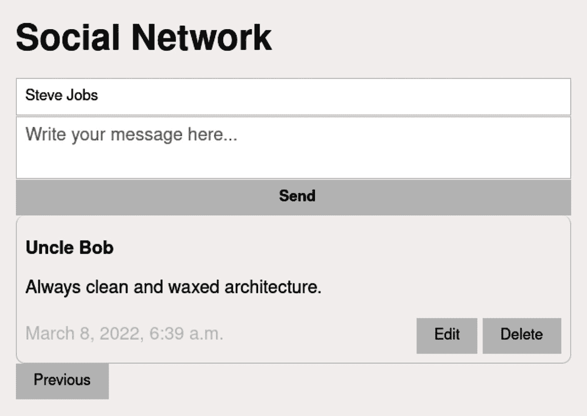

# 第四章：与数据库一起工作

本章的目的是不教你如何使用 Django 与数据库交互或创建迁移——我假设你已经具备这些基本技能。本章将展示如何在现实场景中与 Channels 实例反复交互的模型进行工作。

除非应用程序仅由外部 API 供电，否则在任何现代 Web 开发中，拥有数据库是一个基本要求。需求范围可以从简单地以有序方式存储纯文本，到认证系统，再到管理用户之间复杂连接结构。换句话说，如果你想构建一个实用的项目，你必须连接到数据库。

幸运的是，Django 与最流行的关系型数据库兼容：PostgreSQL、MariaDB、MySQL、Oracle 和 SQLite。而且如果还不够，我们还可以通过社区创建的扩展连接到其他可能性：**CockroachDB**、**Firebird**、**Google Cloud Spanner**和**Microsoft SQL Server**。

我们将专注于创建一个实时应用程序来管理数据库。我们将学习如何执行**BREAD**的最小功能：**浏览-读取-编辑-添加-删除**，包括简单的分页。还有什么比创建一个社交网络更好的例子吗？信息应该尽可能少地延迟保存、排序和显示给所有用户。如果响应非常慢，那么我们就未能提供一个实时系统，而是一个无聊的电子邮件系统。

为了教学目的，我们将创建一个无政府主义社交网络。任何访客，无需预先注册，都将能够操纵任何用户的数据。如果你觉得不安全，可以创建一个免责声明页面，呼吁人性，并建议不要更改他人的内容或等待下一章，我们将加入一个完整的注册和身份验证系统。

本章我们将涵盖以下主题：

+   将信息插入数据库

+   渲染数据库信息

+   使用分页器限制查询

+   从数据库中删除行

+   更新数据库中的行

此外，我们将加入一些 CSS 代码以增强视觉效果，并将所有逻辑移至后端，只留下客户端管理事件的责任。

# 技术要求

我们将基于前几章积累的所有知识。如果你想从一个模板开始，可以使用以下结构，我将在未来的项目中使用：

[`github.com/PacktPublishing/Building-SPAs-with-Django-and-HTML-Over-the-Wire/tree/main/chapter-4/initial-template`](https://github.com/PacktPublishing/Building-SPAs-with-Django-and-HTML-Over-the-Wire/tree/main/chapter-4/initial-template)

在这里，你将找到一个样本项目，该项目已经准备好包含我们在前几章中提到的不同点：

+   与 Docker 集成

+   与通道一起工作的最小结构

+   使用 PostgreSQL 连接到数据库

+   一个 HTML 主页

+   一个连接到 Channels 的最小 JavaScript 文件

对于这个项目，我创建了一个模板的分支并做了一些小的修改。您可以使用这两个模板中的任何一个，尽管我推荐使用分支以获得简单的美学。您可以从这里下载它：[`github.com/PacktPublishing/Building-SPAs-with-Django-and-HTML-Over-the-Wire/tree/main/chapter-4/social-network_step_1`](https://github.com/PacktPublishing/Building-SPAs-with-Django-and-HTML-Over-the-Wire/tree/main/chapter-4/social-network_step_1)。我已经将项目名称改为 `social_network`，应用改为 `website`。我还将消费者重命名为 `SocialNetworkConsumer`。

最后，数据库或模型中已添加了一个名为 `Message` 的模式，位于 `app/website/models.py`，我们将使用它来管理用户创建的所有消息：

```py
from django.db import models
```

```py
class Message(models.Model):
```

```py
    author = models.CharField(max_length=100)
```

```py
    text = models.TextField(max_length=200)
```

```py
    created_at = models.DateTimeField(auto_now_add=True)
```

```py
    class Meta:
```

```py
        db_table = "messages"
```

```py
        verbose_name_plural = "Messages"
```

```py
    def __str__(self):
```

```py
        return self.text[:10] + "..."
```

包含的字段是最少的：`author` 用于存储作者姓名，`text` 用于消息文本，`created_at` 用于记录创建日期，以便稍后排序。

要设置项目，您必须使用 Docker：

```py
docker-compose up
```

打开您喜欢的浏览器，输入 `http://social-network.localhost`。您应该找到以下结果。


图 4.1 – 在域名 http://social-network.localhost 上显示静态 HTML 页面

从视觉上看，它过于...简约。但它包含了所有与工作相关的基本元素。

接下来，我们将逐步构建应用程序，涉及编辑 `Message` 表或之后查询整个流程。

# 将信息插入数据库

现在我们已经准备好了一个几乎空的项目，但配置了 Channels，渲染了一个简单的静态 HTML。第一步是在数据库中 `INSERT` 或保存新信息。为此，我们需要最少的 HTML。我们将包括一个包含两个字段的表单：`name` 和 `message`。我们还将留出一个空间来显示我们列出的未来消息。

在 `app/website/templates/index.html` 中创建一个 HTML 文件，内容如下。

首先，我们将引入一个 CSS 文件和一个 JavaScript 文件。目前，我们将文件包含在标题中：

```py

```

```py
<!doctype html>
```

```py
<html lang="en">
```

```py
<head>
```

```py
    <meta charset="UTF-8">
```

```py
    <meta name="viewport"
```

```py
          content="width=device-width, user-scalable=no,
```

```py
              initial-scale=1.0, maximum-scale=1.0, 
```

```py
                  minimum-scale=1.0">
```

```py
    <title>Social Network</title>
```

```py
    <link rel="stylesheet" href="">
```

```py
    <script defer src="img/index.js' %}">
```

```py
    </script>
```

```py
</head>
```

接下来，为了拥有主机和方案（HTTP 或 HTTPS），我们必须将其作为一个数据集包含在内，我们将在 JavaScript 中稍后收集它。我们已添加一个表单框和另一个用于列出消息的表单，目前我们不会使用它：

```py
<body
```

```py
        data-host="{{ request.get_host }}"
```

```py
        data-scheme="{{ request.scheme }}"
```

```py
>
```

以下是我们将使用的 HTML 表单来捕获和保存新消息。在未来，JavaScript 将负责检索所有信息：

```py
    <div class="container">
```

```py
        <header>
```

```py
            <h1>Social Network</h1>
```

```py
        </header>
```

```py
        <main id="main">
```

```py
            <section class="message-form">
```

```py
                <form>
```

```py
                    <input
```

```py
                            type="text"
```

```py
                            placeholder="Name"
```

```py
                            id="message-form__author"
```

```py
                            class="message-form__author" 
```

```py
                               class="message-form__author"
```

```py
                            name="author"
```

```py
                            required
```

```py
                    >
```

```py
                    <textarea
```

```py
                            name="message"
```

```py
                            placeholder="Write your message 
```

```py
                               here..."
```

```py
                            id="message-form__text"
```

```py
                            class="message-form__text" 
```

```py
                                class="message-form__text"
```

```py
                            required
```

```py
                    ></textarea>
```

```py
                    <input
```

```py
type="submit"
```

```py
class="message-form__submit"id="message-form__submit"
```

```py
value="Send"
```

```py
                    >
```

```py
                </form>
```

```py
            </section>
```

```py
            <!-- End Form for adding new messages -->
```

然后，我们将定义一个地方来列出从数据库接收到的所有消息。我们还将包括按钮，以五元素为一组分页显示结果：

```py
            <section id="messages">
```

```py
                <div id="messages__list"></div>
```

```py
                <button class="button" 
```

```py
                    id="messages__previous-page" disabled> 
```

```py
                        Previous</button>
```

```py
                <button class="button" id="messages__next-
```

```py
                    page">Next</button>
```

```py
            </section>
```

```py
            <!-- End Messages -->
```

```py
        </main>
```

```py
    </div>
```

```py
</body>
```

```py
</html>
```

在 `/static/css/main.css` 文件中，我们将添加一些最小化样式，以便感觉我们身处 21 世纪：

```py
:root {
```

```py
    --color__background: #f6f4f3;
```

```py
    --color__gray: #ccc;
```

```py
}
```

我们添加了一些字体，使视觉效果更加明亮。Helvetica 与所有东西都很搭配，但您可以使用您喜欢的任何字体。您不会伤害 Django 的感情：

```py
* {
```

```py
    font-family: "Helvetica Neue", Helvetica, Arial, sans-serif;
```

```py
    box-sizing: border-box;
```

```py
}
```

我们添加的一些改进包括纠正正文边距和将内容居中于`container`：

```py
body {
```

```py
    margin: 0;
```

```py
    background-color: var(--color__background);
```

```py
}
```

```py
.container {
```

```py
    margin: 0 auto;
```

```py
    padding: 1rem;
```

```py
    max-width: 40rem;
```

```py
}
```

我们还将对按钮进行样式设计，使其看起来不像 90 年代的产品：

```py
. button {
```

```py
    display: inline-block;
```

```py
    padding: 0.5rem 1rem;
```

```py
    background-color: var(--color__gray);
```

```py
    border: 0;
```

```py
    cursor: pointer;
```

```py
    text-decoration: none;
```

```py
}
```

```py
. button:hover {
```

```py
    filter: brightness(90%);
```

```py
}
```

我们还使用了一种不那么复古的外观来设计表单或元素。设计不应与后端工作冲突：

```py
.message-form__author, .message-form__text {
```

```py
    display: block;
```

```py
    width: 100%;
```

```py
    outline: none;
```

```py
    padding: .5rem;
```

```py
    resize: none;
```

```py
    border: 1px solid var(--color__gray);
```

```py
    box-sizing: border-box;
```

```py
}
```

```py
.message-form__submit {
```

```py
    display: block;
```

```py
    width: 100%;
```

```py
    outline: none;
```

```py
    padding: .5rem;
```

```py
    background-color: var(--color__gray);
```

```py
    border: none;
```

```py
    cursor: pointer;
```

```py
    font-weight: bold;
```

```py
}
```

```py
.message-form__submit:hover {
```

```py
    filter: brightness(90%);
```

```py
}
```

```py
.message {
```

```py
    border: 1px solid var(--color__gray);
```

```py
    border-top: 0;
```

```py
    padding: .5rem;
```

```py
    border-radius: .5rem;
```

```py
}
```

```py
.message__author {
```

```py
    font-size: 1rem;
```

```py
}
```

```py
.message__created_at {
```

```py
    colour: var(--color__gray);
```

```py
}
```

```py
.message__footer {
```

```py
    display: flex;
```

```py
    justify-content: space-between;
```

```py
    align-items: center;
```

```py
}
```

如果您启动 Docker，并输入`http://social-network.localhost`，您将找到以下页面：


Figure 4.2 – 带有 CSS 样式的输入新消息的表单

随意添加您需要的任何内容，甚至是一个 CSS 框架。

现在我们将包括 JavaScript 事件，将表单数据发送到消费者。我们将在`/static/js/index.js`中创建一个新文件，内容如下：

```py
/*
```

```py
    VARIABLES
```

```py
*/
```

```py
// Connect to WebSockets server (SocialNetworkConsumer)
```

```py
const myWebSocket = new WebSocket(`${document.body.
```

```py
    dataset.scheme === 'http' ? 'ws' : 'wss'}://${ 
```

```py
    document.body.dataset.host }/ws/social-network/`);
```

```py
const inputAuthor = document.querySelector("#message-
```

```py
    form__author");
```

```py
const inputText = document.querySelector("#message-
```

```py
    form__text");
```

```py
const inputSubmit = document.querySelector("#message-
```

```py
    form__submit");
```

```py
/*
```

```py
    FUNCTIONS
```

```py
*/
```

```py
/**
```

```py
* Send data to WebSockets server
```

```py
* @param {string} message
```

```py
* @param {WebSocket} webSocket
```

```py
* @return {void}
```

```py
*/
```

```py
function sendData(message, webSocket) {
```

```py
    webSocket.send(JSON.stringify(message));
```

```py
}
```

```py
/**
```

```py
* Send new message
```

```py
* @param {Event} event
```

```py
* @return {void}
```

```py
*/
```

```py
function sendNewMessage(event) {
```

```py
    event.preventDefault();
```

```py
    // Prepare the information we will send
```

```py
    const newData = {
```

```py
        "action": "add message",
```

```py
        "data": {
```

```py
            "author": inputAuthor.value,
```

```py
            "text": inputText.value
```

```py
        }
```

```py
    };
```

```py
    // Send the data to the server
```

```py
    sendData(newData, myWebSocket);
```

```py
    // Clear message form
```

```py
    inputText.value = "";
```

```py
}
```

```py
/*
```

```py
    EVENTS
```

```py
*/
```

```py
// Event when a new message is received by WebSockets
```

```py
myWebSocket.addEventListener("message", (event) => {
```

```py
    // Parse the data received
```

```py
    const data = JSON.parse(event.data);
```

```py
    // Renders the HTML received from the Consumer
```

```py
    document.querySelector(data.selector). innerHTML = 
```

```py
        data.html;
```

```py
});
```

```py
// Sends new message when you click on Submit
```

```py
inputSubmit.addEventListener("click", sendNewMessage);
```

在变量部分，我们捕获所有需要捕获所有事件的 HTML 元素，并创建一个`WebSockets`连接。`sendData`函数用于向后端发送消息，而`sendNewMessage`在点击**提交**按钮时执行。JSON 将始终以以下结构发送：

```py
{
```

```py
        "action": "text",
```

```py
        "data": {}
```

```py
}
```

我们修改消费者以接收信息并保存它。使用以下内容编辑`app/website/consumers.py`：

```py
from channels.generic.websocket import JsonWebsocketConsumer
```

```py
from django.template.loader import render_to_string
```

```py
from . models import Message
```

```py
from asgiref.sync import async_to_sync
```

```py
class SocialNetworkConsumer(JsonWebsocketConsumer):
```

```py
    room_name = 'broadcast
```

```py
    def connect(self):
```

```py
        """Event when client connects"""
```

```py
        # Accept the connection
```

```py
        self.accept()
```

```py
        # Assign the Broadcast group
```

```py
        async_to_sync(self.channel_layer.group_add)
```

```py
            (self.room_name, self.channel_name)
```

```py
        # Send you all the messages stored in the database.
```

```py
    def disconnect(self, close_code):
```

```py
        """Event when client disconnects"""
```

```py
        # Remove from the Broadcast group
```

```py
        async_to_sync(self.channel_layer.group_discard)
```

```py
            (self.room_name, self.channel_name)
```

```py
    def receive_json(self, data_received):
```

```py
        """
```

```py
            Event when data is received
```

```py
            All information will arrive in 2 variables:
```

```py
            'action', with the action to be taken
```

```py
            'data' with the information
```

```py
        """
```

```py
        # Get the data
```

```py
        data = data_received['data']
```

```py
        # Depending on the action we will do one task or 
```

```py
        another.
```

```py
        match data_received['action']:
```

```py
            case 'add message':
```

```py
                # Add message to database
```

```py
                Message.objects.create(
```

```py
                    author=data['author'],
```

```py
                    text=data['text'],
```

```py
                )
```

您可以看到，当连接时，客户端被添加到房间中，当断开连接时被移除。在*第五章* *分离房间中的通信*中，我们将深入讨论房间的可能性，但现在，我们将所有用户分组到一个名为*broadcast*的单个房间中。

当接收到文本为`'add message'`的操作时，我们直接使用从前端发送的信息创建一个新的消息。

我们已经存储了信息！尽管我们目前无法看到或排序它。

到目前为止的所有代码都可以在以下存储库中找到，这是活动的第一部分：

[`github.com/PacktPublishing/Building-SPAs-with-Django-and-HTML-Over-the-Wire/tree/main/chapter-4/social-network_step_2`](https://github.com/PacktPublishing/Building-SPAs-with-Django-and-HTML-Over-the-Wire/tree/main/chapter-4/social-network_step_2)

在下一节中，我们将通过 WebSockets 直接以 HTML 格式打印我们保存的所有消息。

# 渲染数据库信息

我们已经构建了一个表单，通过 WebSockets 连接将新消息发送到后端，我们在消费者中捕获它，然后将其存储在数据库中。

现在我们将获取数据库中的所有消息，使用 Django 的模板引擎渲染它们，通过我们保持的连接将 HTML 发送到客户端，并将内容注入到适当的前端元素中。

在 `/app/website/templates/components/_list-messages.html` 路径下创建一个 HTML 模板，该模板将生成所有消息块，其内容如下：

```py

```

```py
    <article class="message" id="message--{{ message.id
```

```py
        }}">
```

```py
        <h2 class="message__author">{{ message.author }}
```

```py
        </h2>
```

```py
        <p class="message__text">{{ message.text }}</p>
```

```py
        <footer class="message__footer">
```

```py
            <time class="message__created_at">{{ 
```

```py
                message.created_at }}</time>
```

```py
            <div class="message__controls">
```

```py
                <button class="button messages__update" 
```

```py
                  data-id="{{ message.id }}"> Edit</button>
```

```py
                <button class="button messages__delete" 
```

```py
                    data-id="{{ message.id }}"> Delete
```

```py
                        </button>
```

```py
            </div>
```

```py
        </footer>
```

```py
    </article>
```

```py

```

目前，**编辑**和**删除**按钮仅用于装饰。稍后，我们将赋予它们功能。

编辑 `app/website/consumers.py` 中的消费者，以包括一个返回消息的操作：

```py
from channels.generic.websocket import JsonWebsocketConsumer
```

```py
from django.template.loader import render_to_string
```

```py
from . models import Message
```

```py
from asgiref.sync import async_to_sync
```

```py
class SocialNetworkConsumer(JsonWebsocketConsumer):
```

```py
    room_name = 'broadcast'
```

```py
    def connect(self):
```

```py
        """Event when client connects"""
```

```py
        # Accept the connection
```

```py
        self.accept()
```

```py
        # Assign the Broadcast group
```

```py
        async_to_sync(self.channel_layer.group_add)
```

```py
            (self.room_name, self.channel_name)
```

```py
        # Send you all the messages stored in the database.
```

```py
        self.send_list_messages()
```

```py
    def disconnect(self, close_code):
```

```py
        """Event when client disconnects"""
```

```py
        # Remove from the Broadcast group
```

```py
        async_to_sync(self.channel_layer.group_discard)
```

```py
            (self.room_name, self.channel_name)
```

```py
    def receive_json(self, data_received):
```

```py
        """
```

```py
            Event when data is received
```

```py
            All information will arrive in 2 variables:
```

```py
            'action', with the action to be taken
```

```py
            'data' with the information
```

```py
        """
```

```py
        # Get the data
```

```py
        data = data_received['data']
```

```py
        # Depending on the action we will do one task or 
```

```py
          another.
```

```py
        match data_received['action']:
```

```py
            case 'add message':
```

```py
                # Add message to database
```

```py
                Message.objects.create(
```

```py
                    author=data['author'],
```

```py
                    text=data['text'],
```

```py
                )
```

```py
                # Send messages to all clients
```

```py
                self.send_list_messages()
```

```py
            case 'list messages':
```

```py
                # Send messages to all clients
```

```py
                self.send_list_messages()
```

```py
    def send_html(self, event):
```

```py
        """Event: Send html to client"""
```

```py
        data = {
```

```py
            'selector': event['selector'],
```

```py
            'html': event['html'],
```

```py
        }
```

```py
        self.send_json(data)
```

```py
    def send_list_messages(self):
```

```py
        """ Send list of messages to client"""
```

```py
        # Filter messages to the current page
```

```py
        messages = Message.objects.order_by('-created_at')
```

```py
        # Render HTML and send to client
```

```py
        async_to_sync(self.channel_layer.group_send)(
```

```py
            self.room_name, {
```

```py
                type': 'send.html', # Run 'send_html()' 
```

```py
                    method
```

```py
                'selector': '#messages__list',
```

```py
                'html': render_to_string
```

```py
                ('components/_list-messages.html', { 
```

```py
                    'messages': messages})
```

```py
            }
```

```py
        )
```

当前端发送 `'list messages'` 动作或创建 WebSockets 连接时，我们将执行 `send_list_messages()` 函数。后端将获取所有消息，渲染 HTML，并将消息发送到前端。在函数内部，我们执行一个查询以按降序获取所有消息，如果你之前已经与模型工作过，这是一个基本操作。重要的是下一部分的内容：

```py
async_to_sync(self.channel_layer.group_send)(
```

```py
            self.room_name, {
```

```py
                type': 'send.html', # Run 'send_html()' 
```

```py
                    method
```

```py
                'selector': '#messages__list',
```

```py
                'html': render_to_string('components/_list-
```

```py
                   messages.html', { 'messages': messages})
```

```py
            }
```

```py
        )
```

当向一个组发送信息时，它将始终异步执行，以避免阻塞主线程，但与数据库通信时必须同步。这两种类型的逻辑如何共存？通过将 `self.channel_layer.group_send()` 转换为同步函数，这得益于 `async_to_sync()`。

`self.channel_layer.group_send()` 是一个不寻常的函数。它的第一个参数必须是您想要发送信息到的房间名称，在我们的例子中将是 `self.room_name`，它在消费者开始时声明。第二个参数必须有一个字典，其中 `type` 是要执行函数的名称（如果有 `_`，则必须替换为点），其余的键是我们想要传递给函数的信息。在 `send_html` 函数内部，我们使用 `event[]` 捕获先前信息。最后，我们以与 *第三章* 中相同的方式，即通过 `send_json()`，将数据发送到客户端，该章节是 *将 WebSockets 添加到 Django*。

当我们想要注入 HTML 时，我们将发送 `html` 键和渲染的 HTML，以及 `selector` 来告诉 JavaScript 将其注入的位置。后端将决定每个元素应该放在哪里。

当在浏览器中查看时，我们将找到我们添加的消息，如图 *图 4.3* 所示：

![Figure 4.3 – 我们在数据库中保存的所有消息都显示出来]


Figure 4.3 – 我们在数据库中保存的所有消息都显示出来

到目前为止的所有代码都可以在以下链接中找到：

[`github.com/PacktPublishing/Building-SPAs-with-Django-and-HTML-Over-the-Wire/tree/main/chapter-4/social-network_step_3`](https://github.com/PacktPublishing/Building-SPAs-with-Django-and-HTML-Over-the-Wire/tree/main/chapter-4/social-network_step_3)

如果我们为每个用户显示数百或数千条消息会发生什么？性能和内存后果将是灾难性的。我们必须通过限制可以显示的消息数量来避免烟花。因此，我们将将其限制为每页五条消息，并添加一些按钮来在各个切片之间导航。让我们在下一节中看看这个。

# 使用分页器限制查询

我们可以从数据库中添加和列出消息。但我们必须限制用户可以看到的信息量。一个好的做法是提供一个分页器，以便用户可以浏览所有数据。

按照以下步骤添加简单的分页器：

1.  修改模板 `/app/website/templates/components/_list-messages.html`，添加一个简单的分页器，分为两个按钮（前进和后退）：

    ```py
    
        <article class="message" id="message--{{ 
            message.id }}">
            <h2 class="message__author">{{ message.author 
            }}</h2>
            <p class="message__text">{{ message.text }}
            </p>
            <footer class="message__footer">
                <time class="message__created_at">{{ 
                    message.created_at }}</time>
                <div class="message__controls">
                    <button class="button 
                        messages__update" data-id="{{ 
                            message.id }}"> Edit</button>
                    <button class="button 
                        messages__delete" data-id="{{ 
                           message.id }}"> Delete</button>
                </div>
            </footer>
        </article>
    
    
        <!-- Paginator -->
        <div id="paginator" data-page="{{ page }}">
            {# The back button on the first page is not 
            displayed #}
            
            <button class="button" id="messages__previous-
                page"> Previous</button>
            

            {# The forward button on the last page is not 
            displayed #}
            
            <button class="button" id="messages__next-
                page">Next</button>
            
        </div>
        <!-- End Paginator -->
    
    ```

    +   使用 `data-page="{{ page }}"`，我们向 JavaScript 提供了一个计数器，表示我们所在的页面。我们将使用这个数据来创建一个新事件，该事件将触发一个动作，指示我们是否想要转到下一页或返回。

    +   条件 `` 用于避免在第一页时显示后退按钮。

    +   条件 `` 忽略了在最后一页时渲染前进按钮。

1.  我们向消费者（`/app/website/consumers.py`）添加了 `send_list_messages()` 的切片系统：

    ```py
    from channels.generic.websocket import JsonWebsocketConsumer
    from django.template.loader import render_to_string
    from . models import Message
    from asgiref.sync import async_to_sync
    import math

    class SocialNetworkConsumer(JsonWebsocketConsumer):

        room_name = 'broadcast
        max_messages_per_page = 5 # New line

        def connect(self):
            """Event when client connects"""
            # Accept the connection
            self.accept()
            # Assign the Broadcast group
            async_to_sync(self.channel_layer.group_add)(self.room_name, self.channel_name)
            # Send you all the messages stored in the database.
            self.send_list_messages()

        def disconnect(self, close_code):
            """Event when client disconnects"""
            # Remove from the Broadcast group
            async_to_sync(self.channel_layer.
                group_discard)(self.room_name, 
                    self.channel_name)

        def receive_json(self, data_received):
            """
                Event when data is received
                All information will arrive in 2 
                variables:
                'action', with the action to be taken
                'data' with the information
            """

            # Get the data
            data = data_received['data']
            # Depending on the action we will do one task
             or another.
            match data_received['action']:
                case 'add message':
                    # Add message to database
                    Message.objects.create(
                        author=data['author'],
                        text=data['text'],
                    )
                    # Send messages to all clients
                    self.send_list_messages()
                case 'list messages':
                    # Send messages to all clients
                    self.send_list_messages(data['page'])
                    # Update line

        def send_html(self, event):
            """Event: Send html to client"""
            data = {
                'selector': event['selector'],
                'html': event['html'],
            }
            self.send_json(data)

        def send_list_messages(self, page=1): 
        # Update line
            "Send list of messages to client"""""
            # Filter messages to the current page
            start_pager = self.max_messages_per_page * 
                (page - 1) # New line
            end_pager = start_pager + 
                self.max_messages_per_page # New line
            messages = Message.objects.order_by('-
                created_at')
            messages_page = messages[start_pager:
                end_pager] # New line
            # Render HTML and send to client
            total_pages = math.ceil(messages.count() / 
                self.max_messages_per_page) # New line    
            async_to_sync(self.channel_layer.group_send)(
                self.room_name, {
                    'type': 'send.html', # Run 
                        'send_html()' method
                    'selector': '#messages__list',
                    'html': render_to_string
                      ('components/_list-messages.html', {
                        'messages': messages_page, 
                        # Update line
                        'page': page, # New line
                        total_pages': total_pages, 
                        # New line
                    })
                }
            )
    ```

    +   变量 `max_messages_per_page = 5` 已被添加，用于表示每页的项目数量。

    +   `'list messages'` 动作现在收集并将要显示的页面传递给 `send_list_messages` 函数。

    +   我们已更新 `send_list_messages`。我们允许你指定要显示的页面，我们计算查询切片，并将带有切片、`page` 和 `total_pages` 变量的 `messages` 传递给 `render_to_string`，这样我们就可以知道我们是否在最后一页。

1.  在 `/static/js/index.js` 中，添加两个 JavaScript 函数（`goToNextPage` 和 `goToPreviousPage`），它们将负责翻页。实际上，它们只是使用带有请求列表消息的操作，但在另一个切片中：

    ```py
    /*
        VARIABLES
    */
    // Connect to WebSockets server (SocialNetworkConsumer)
    const myWebSocket = new WebSocket
    (`${document.body.dataset.scheme === 'http' ? 'ws' : 
    'wss'}://${ document.body.dataset.host }/ws/social-
        network/`);
    const inputAuthor = document.querySelector("#message-
        form__author");
    const inputText = document.querySelector("#message-
        form__text");
    const inputSubmit = document.querySelector("#message-
        form__submit");

    /*
        FUNCTIONS
    */

    /**
    * Send data to WebSockets server
    * @param {string} message
    * @param {WebSocket} webSocket
    * @return {void}
    */
    function sendData(message, webSocket) {
        webSocket.send(JSON.stringify(message));
    }

    /**
    * Send new message
    * @param {Event} event
    * @return {void}
    */
    function sendNewMessage(event) {
        event.preventDefault();
        // Prepare the information we will send
        const newData = {
            "action": "add message",
            "data": {
                "author": inputAuthor.value,
                "text": inputText.value
            }
        };
        // Send the data to the server
        sendData(newData, myWebSocket);
        // Clear message form
        inputText.value = "";
    }

    /**
    * Get current page stored in #paginator as dataset
    * @returns {number}
    */
    function getCurrentPage() {
        return parseInt(document.
            querySelector("#paginator"). dataset.page);
    }

    /**
    * Switch to the next page
    * @param {Event} event
    * @return {void}
    */
    function goToNextPage(event) {
        // Prepare the information we will send
        const newData = {
            "action": "list messages",
            "data": {
                "page": getCurrentPage() + 1,
            }
        };
        // Send the data to the server
        sendData(newData, myWebSocket);
    }

    /**
    * Switch to the previous page
    * @param {Event} event
    * @return {void}
    */
    function goToPreviousPage(event) {
        // Prepare the information we will send
        const newData = {
            "action": "list messages",
            "data": {
                "page": getCurrentPage() - 1,
            }
        };
        // Send the data to the server
        sendData(newData, myWebSocket);
    }

    /*
        EVENTS
    */

    // Event when a new message is received by WebSockets
    myWebSocket.addEventListener("message", (event) => {
        // Parse the data received
        const data = JSON.parse(event.data);
        // Renders the HTML received from the Consumer
        document.querySelector(data.selector). innerHTML = 
            data.html;
        /* Reassigns the events of the newly rendered HTML */
        // Pagination
        document.querySelector("#messages__next-page")?. 
            addEventListener("click", goToNextPage);
        document.querySelector("#messages__previous-
            page")?. addEventListener("click", 
                goToPreviousPage);
    });

    // Sends new message when you click on Submit
    inputSubmit.addEventListener("click", sendNewMessage);
    ```

那么我们在哪里添加按钮的监听器以执行函数？在 `WebSockets` 的 `"message"` 事件中。为什么？每次消息部分更新时，所有的 HTML 都会被删除并重新创建，从后端接收的内容。事件会随着每次更新而消失。我们必须重新分配它们。在重新绘制消息后，我们将分配监听器：

```py
document.querySelector("#messages__next-page")?. 
    addEventListener("click", goToNextPage); 
document.querySelector("#messages__previous-page")?. 
    addEventListener("click", goToPreviousPage);
```

尝试创建尽可能多的消息（至少六条）以检查分页器是否正常工作。


图 4.4 – 我们显示消息的第一页

如果我们通过点击**下一页**按钮翻页，将渲染下一块消息。



图 4.5 – 我们显示消息的最后一页

到目前为止的所有代码都可以在以下链接中找到：

[Building SPAs with Django and HTML Over-the-Wire 社交网络步骤 4](https://github.com/PacktPublishing/Building-SPAs-with-Django-and-HTML-Over-the-Wire/tree/main/chapter-4/social-network_step_4)

下一个目标是使用 `WebSockets` 删除消息，这是一个带有删除具有具体消息 `id` 的消息的指令的动作——我们将像狙击手一样精确。

# 从数据库中删除行

在前面的章节中，我们成功构建了一个系统，可以添加新消息、列出它们并进行分页。但到目前为止，我们无法删除任何内容。

项目的结构使得实现起来非常快：

1.  在 `/app/website/templates/components/_list-messages.html` 中，我们检查是否为每个按钮添加了一个带有 `id` 的数据集。我们在列出消息时执行此任务；我们必须知道我们将使用的 `id` 的来源，以便知道要删除哪个消息：

    ```py
    <button class="button messages__delete" data-id="{{ 
        message.id }}"> Delete</button>
    ```

1.  在 `/static/js/index.js` 文件中，添加 `deleteMessage` 函数。我们将使用 ID 捕获数据集，并通过动作 `"delete message"` 发送到消费者。此外，我们将在分页器的监听器之后添加每个监听器。让我们不要忘记这个位置的原因：每次更改或注入 HTML 的新后端消息后，所有事件都必须重新分配：

    ```py
    /*
        VARIABLES
    */
    // Connect to WebSockets server (SocialNetworkConsumer)
    const myWebSocket = new WebSocket
        (`${document.body.dataset.scheme === 'http' ? 'ws' 
        : 'wss'}://${ document.body.dataset.host 
        }/ws/social-network/`);
    const inputAuthor = document.querySelector("#message-
        form__author");
    const inputText = document.querySelector("#message-
        form__text");
    const inputSubmit = document.querySelector("#message-
        form__submit");

    /*
        FUNCTIONS
    */

    /**
    * Send data to WebSockets server
    * @param {string} message
    * @param {WebSocket} webSocket
    * @return {void}
    */
    function sendData(message, webSocket) {
        webSocket.send(JSON.stringify(message));
    }

    /**
    * Delete message
    * @param {Event} event
    * @return {void}
    */
    function deleteMessage(event) {
        const message = {
            "action": "delete message",
            "data": {
                "id": event.target.dataset.id
            }
        };
        sendData(message, myWebSocket);
    }

    /**
    * Send new message
    * @param {Event} event
    * @return {void}
    */
    function sendNewMessage(event) {
        event.preventDefault();
        // Prepare the information we will send
        const newData = {
            "action": "add message",
            "data": {
                "author": inputAuthor.value,
                "text": inputText.value
            }
        };
        // Send the data to the server
        sendData(newData, myWebSocket);
        // Clear message form
        inputText.value = "";
    }

    /**
    * Get current page stored in #paginator as dataset
    * @returns {number}
    */
    function getCurrentPage() {
        return parseInt(document.querySelector("#paginator"). dataset.page);
    }

    /**
    * Switch to the next page
    * @param {Event} event
    * @return {void}
    */
    function goToNextPage(event) {
        // Prepare the information we will send
        const newData = {
            "action": "list messages",
            "data": {
                "page": getCurrentPage() + 1,
            }
        };
        // Send the data to the server
        sendData(newData, myWebSocket);
    }

    /**
    * Switch to the previous page
    * @param {Event} event
    * @return {void}
    */
    function goToPreviousPage(event) {
        // Prepare the information we will send
        const newData = {
            "action": "list messages",
            "data": {
                "page": getCurrentPage() - 1,
            }
        };
        // Send the data to the server
        sendData(newData, myWebSocket);
    }

    /*
        EVENTS
    */

    // Event when a new message is received by WebSockets
    myWebSocket.addEventListener("message", (event) => {
        // Parse the data received
        const data = JSON.parse(event.data);
        // Renders the HTML received from the Consumer
        document.querySelector(data.selector). innerHTML = 
            data.html;
        /* Reassigns the events of the newly rendered HTML */
        // Pagination
        document.querySelector("#messages__next-
          page")?.addEventListener("click", goToNextPage);
        document.querySelector("#messages__previous-
           page")?.addEventListener("click", 
               goToPreviousPage);
        // Add to all delete buttons the event
        document.querySelectorAll
            (".messages__delete").forEach(button => {
            button.addEventListener("click", 
                deleteMessage);
        });
    });

    // Sends new message when you click on Submit
    inputSubmit.addEventListener("click", sendNewMessage);
    ```

1.  现在，使用动作 `'delete message'` 编辑 `/app/website/consumers.py`：

    ```py
    # app/website/consumers.py
    from channels.generic.websocket import JsonWebsocketConsumer
    from django.template.loader import render_to_string
    from .models import Message
    from asgiref.sync import async_to_sync
    import math

    class SocialNetworkConsumer(JsonWebsocketConsumer):

        room_name = 'broadcast'
        max_messages_per_page = 5

        def connect(self):
            """Event when client connects"""
            # Accept the connection
            self.accept()
            # Assign the Broadcast group
            async_to_sync(self.channel_layer.group_add)
                (self.room_name, self.channel_name)
            # Send you all the messages stored in the 
            database.
            self.send_list_messages()

        def disconnect(self, close_code):
            """Event when client disconnects"""
            # Remove from the Broadcast group
            async_to_sync(self.channel_layer.group_
               discard)(self.room_name, self.channel_name)

        def receive_json(self, data_received):
            """
                Event when data is received
                All information will arrive in 2 variables:
                'action', with the action to be taken
                'data' with the information
            """

            # Get the data
            data = data_received['data']
            # Depending on the action we will do one task or another.
            match data_received['action']:
                case 'add message':
                    # Add message to database
                    Message.objects.create(
                        author=data['author'],
                        text=data['text'],
                    )
                    # Send messages to all clients
                    self.send_list_messages()
                case 'list messages':
                    # Send messages to all clients
                    self.send_list_messages(data['page'])
                case 'delete message':
                    # Delete message from database
                    Message.objects.get
                       (id=data['id']).delete() # New line
                    # Send messages to all clients
                    self.send_list_messages() # New line

        def send_html(self, event):
            """Event: Send html to client"""
            data = {
                'selector': event['selector'],
                'html': event['html'],
            }
            self.send_json(data)

        def send_list_messages(self, page=1):
            """Send list of messages to client"""
            # Filter messages to the current page
            start_pager = self.max_messages_per_page * 
               (page - 1)
            end_pager = start_pager + 
                self.max_messages_per_page
            messages = Message.objects.order_by('-
                created_at')
            messages_page = messages
                [start_pager:end_pager]
            # Render HTML and send to client
            total_pages = math.ceil(messages.count() / 
                self.max_messages_per_page)
            async_to_sync(self.channel_layer.group_send)(
                self.room_name, {
                    'type': 'send.html', # Run 
                     'send_html()' method
                    'selector': '#messages__list',
                    'html': render_to_string
                      ('components/_list-messages.html', {
                        'messages': messages_page,
                        'page': page,
                        'total_pages': total_pages,
                    }) 
                }
            )
    ```

使用 `Message.objects.get(id=data['id']).delete()`，我们直接从前端发送给我们的 `id` 删除消息。最后，我们使用 `self.send_list_messages()` 更新所有客户端的消息列表。

到目前为止的所有代码都可以在以下链接中找到：

[Building SPAs with Django and HTML Over-the-Wire 社交网络步骤 5](https://github.com/PacktPublishing/Building-SPAs-with-Django-and-HTML-Over-the-Wire/tree/main/chapter-4/social-network_step_5)

我们已经完成了创建数据库中删除行的功能。现在，我们可以选择性地删除消息。在练习的下一部分，我们将通过添加修改现有消息的能力来完成构建社交网络。有了这个新功能，我们将拥有所有 BREAD 的字母。

# 更新数据库中的行

在这个练习的最后部分，我们将通过添加一个表单来修改信息来完成构建社交网络。

所有完成的代码都可以在以下链接中找到：

[Building SPAs with Django and HTML Over-the-Wire 社交网络步骤 6](https://github.com/PacktPublishing/Building-SPAs-with-Django-and-HTML-Over-the-Wire/tree/main/chapter-4/social-network_step_6)

让我们开始：

1.  在 `/app/website/templates/components/_edit-message.html` 中创建一个新的 HTML 组件，内容如下：

    ```py
    <form class="update-form" data-id="{{ message.id }}">
        <input
                type="text"
                placeholder="Name"
                id="message-form__author--update"
                class="message-form__author" 
                name="author"
                required
                value="{{ message.author }}"
        >
        <textarea
                name="message"
                placeholder="Write your message here..."
                id="message-form__text--update"
                class="message-form__text" 
                required
        >{{ message.text }}</textarea>
        <input
                type="submit"
                class="message-form__submit" class="message-form__submit" 
                id="message-form__submit--update"
                value="Update"
        >
    </form>
    ```

HTML 组件在创建消息时几乎相同，只是细节上有所不同，我们将要修改的消息的`id`存储在一个我们托管在`<form>`标签中的数据集中，使用`data-id="{{ message.id }}"`进行填充，并填写所有字段。

1.  在消费者中创建一个请求编辑表单的操作：

    ```py
    case 'open edit page':
    self.open_edit_page(data['id'])
    ```

此操作仅渲染并发送前一个组件，以便用户可以编辑以下信息：

```py
def open_edit_page(self, id):
        """Send the form to edit the message"""
        message = Message.objects.get(id=id)
        async_to_sync(self.channel_layer.group_send)(
            self.room_name, {
                'type': 'send.html', # Run 
                   'send_html()' method
                'selector': f'#message--{id}',
                'html': render_to_string
                   ('components/_edit-message.html',
                       {'message': message})
            }
        )
```

1.  现在，在消费者中添加操作以从表单收集信息、更新数据库并渲染消息列表：

    ```py
    case 'update message':
                    # Update message in database
                    Message.objects.filter(id=data['id']). update(
                        author=data['author'],
                        text=data['text'],
                    )
                    # Send messages to all clients
                    self.send_list_messages()
    ```

整个集成消费者，包括更新操作，将看起来像这样：

```py
from channels.generic.websocket import JsonWebsocketConsumer
from django.template.loader import render_to_string
from .models import Message
from asgiref.sync import async_to_sync
import math

class SocialNetworkConsumer(JsonWebsocketConsumer):

    room_name = 'broadcast'
    max_messages_per_page = 5

    def connect(self):
        """Event when client connects"""
        # Accept the connection
        self.accept()
        # Assign the Broadcast group
        async_to_sync(self.channel_layer.group_add)(self.room_name, self.channel_name)
        # Send you all the messages stored in the database.
        self.send_list_messages()

    def disconnect(self, close_code):
        """Event when client disconnects"""
        # Remove from the Broadcast group
        async_to_sync(self.channel_layer.
           group_discard)(self.room_name, 
              self.channel_name)

    def receive_json(self, data_received):
        """
            Event when data is received
            All information will arrive in 2 variables:
            'action', with the action to be taken
            'data' with the information
        """

        # Get the data
        data = data_received['data']
        # Depending on the action we will do one task or another.
        match data_received['action']:
            case 'add message':
                # Add message to database
                Message.objects.create(
                    author=data['author'],
                    text=data['text'],
                )
                # Send messages to all clients
                self.send_list_messages()
            case 'list messages':
                # Send messages to all clients
                self.send_list_messages(data['page'])
            case 'delete message':
                # Delete message from database
                Message.objects.get
                   (id=data['id']).delete()
                # Send messages to all clients
                self.send_list_messages()
            case 'open edit page':
                self.open_edit_page(data['id'])
            case 'update message':
                # Update message in database
                Message.objects.filter(id=data['id']). 
                    update(
                    author=data['author'],
                    text=data['text'],
                ) # New block
                # Send messages to all clients
                self.send_list_messages() # New line

    def send_html(self, event):
        """Event: Send html to client"""
        data = {
            'selector': event['selector'],
            'html': event['html'],
        }
        self.send_json(data)

    def send_list_messages(self, page=1):
        """Send list of messages to client"""
        # Filter messages to the current page
        start_pager = self.max_messages_per_page * (page - 1)
        end_pager = start_pager + 
            self.max_messages_per_page
        messages = Message.objects.order_by('-
            created_at')
        messages_page = 
            messages[start_pager:end_pager].
        # Render HTML and send to client
        total_pages = math.ceil(messages.count() / 
            self.max_messages_per_page)
        async_to_sync(self.channel_layer.group_send)(
            self.room_name, {
                'type': 'send.html', # Run 
                    'send_html()' method
                'selector': '#messages__list',
                'html': render_to_string
                  ('components/_list-messages.html', {
                    'messages': messages_page,
                    'page': page,
                    'total_pages': total_pages,
                })
            }
        )

    def open_edit_page(self, id):
        """Send the form to edit the message"""
        message = Message.objects.get(id=id)
        async_to_sync(self.channel_layer.group_send)(
            self.room_name, {
                'type': 'send.html', # Run 
                    'send_html()' method
                'selector': f'#message--{id}',
                'html': render_to_string
                    ('components/_edit-message.html', 
                        {'message': message})
            }
        )
```

1.  我们在前端创建了必要的事件，以请求表单、收集信息并发送它。

我们连接到频道并收集用户可以写入新消息的表单字段：

```py
/*
    VARIABLES
*/
// Connect to WebSockets server (SocialNetworkConsumer)
const myWebSocket = new WebSocket(`${document.body.dataset.scheme === 'http' ? 'ws' : 'wss'}://${ document.body.dataset.host }/ws/social-network/`);
const inputAuthor = document.querySelector("#message-
     form__author");
const inputText = document.querySelector("#message-  
    form__text");
const inputSubmit = document.querySelector("#message-
    form__submit");
```

我们使用最小化和基本的功能，如发送新信息、显示更新表单、发送更新信息、删除特定元素和分页管理：

```py
/*
    FUNCTIONS
*/

/**
* Send data to WebSockets server
* @param {string} message
* @param {WebSocket} webSocket
* @return {void}
*/
function sendData(message, webSocket) {
    webSocket.send(JSON.stringify(message));
}

/**
* Displays the update form
* @param {Event} event
* @return {void}
*/
function displayUpdateForm(event) {
    const message = {
        "action": "open edit page",
        "data": {
            "id": event.target.dataset.id
        }
    };
    sendData(message, myWebSocket);
}

/**
* Update message
* @param {Event} event
* @return {void}
*/
function updateMessage(event) {
    event.preventDefault();
    const message = {
        "action": "update message",
        "data": {
            "id": event.target.dataset.id,
            "author": event.target.querySelector("#message-form__author--update"). value,
            "text": event.target.querySelector("#message-form__text--update"). value
        }
    };
    sendData(message, myWebSocket);
}

/**
* Delete message
* @param {Event} event
* @return {void}
*/
function deleteMessage(event) {
    const message = {
        "action": "delete message",
        "data": {
            "id": event.target.dataset.id
        }
    };
    sendData(message, myWebSocket);
}

/**
* Send new message
* @param {Event} event
* @return {void}
*/
function sendNewMessage(event) {
    event.preventDefault();
    // Prepare the information we will send
    const newData = {
        "action": "add message",
        "data": {
            "author": inputAuthor.value,
            "text": inputText.value
        }
    };
    // Send the data to the server
    sendData(newData, myWebSocket);
    // Clear message form
    inputText.value = "";
}

/**
* Get current page stored in #paginator as dataset
* @returns {number}
*/

function getCurrentPage() {
    return parseInt(document.querySelector("#paginator"). dataset.page);
}

/**
* Switch to the next page
* @param {Event} event
* @return {void}
*/
function goToNextPage(event) {
    // Prepare the information we will send
    const newData = {
        "action": "list messages",
        "data": {
            "page": getCurrentPage() + 1,
        }
    };
    // Send the data to the server
    sendData(newData, myWebSocket);
}

/**
* Switch to the previous page
* @param {Event} event
* @return {void}
*/
function goToPreviousPage(event) {
    // Prepare the information we will send
    const newData = {
        "action": "list messages",
        "data": {
            "page": getCurrentPage() - 1,
        }
    };
    // Send the data to the server
    sendData(newData, myWebSocket);
}

```

接收来自后端信息的最重要的事件是"`message`"。每次我们收到新数据时，我们都会打印它并重新捕获所有事件。如果没有这个持续的重新分配，我们将在每次新的渲染或 HTML 重绘中丢失所有事件：

```py
/*
    EVENTS
*/

// Event when a new message is received by WebSockets
myWebSocket.addEventListener("message", (event) => {
    // Parse the data received
    const data = JSON.parse(event.data);
    // Renders the HTML received from the Consumer
    document.querySelector(data.selector). innerHTML = 
        data.html;
    /* Reassigns the events of the newly rendered HTML */
    // Pagination
    document.querySelector("#messages__next-page")?. 
        addEventListener("click", goToNextPage);
    document.querySelector("#messages__previous-   
        page")?. addEventListener("click", 
            goToPreviousPage);
    // Add to all delete buttons the event
    document.querySelectorAll(". messages__delete"). forEach(button => {
        button.addEventListener("click", deleteMessage);
    });
    // Add to all update buttons the event
    document.querySelectorAll(". messages__update"). forEach(button => {
        button.addEventListener("click", displayUpdateForm);
    });
    // Add to the update form the event
    document.querySelectorAll(". update-form"). forEach(form => {
        form.addEventListener("submit", updateMessage);
    });
});

// Sends new message when you click on Submit
inputSubmit.addEventListener("click", sendNewMessage);
```

所有前面的代码都是 JavaScript 的最终版本：

+   已添加`displayUpdateForm`函数，用于要求消费者在消息所在的位置绘制编辑表单。

+   已创建`updateMessage`函数，用于将新信息发送到消费者以更新消息。

+   包含了按钮监听器，以便在分页和删除事件后立即更新。


图 4.6 – 点击编辑时显示编辑表单

我们做到了！BREAD 已经完成。我们现在可以把它涂上黄油，让它尽可能多地被顾客消费。

记得用不同的浏览器打开练习，以欣赏同步的魔法。任何用户的任何操作都将被其他人可视化。

# 摘要

我们已经能够将消费者连接到数据库以管理其信息，并通过注入新的渲染 HTML 结构来回复。逐渐地，一个非常基本的实时社交网络被建立起来，用于插入消息、列出消息、过滤消息、更新消息和删除消息。前端有一个简单的角色——处理事件、发送数据和通过 WebSockets 接收 HTML。

目前，与群体歧视相关的限制有几个。当一个动作被执行时，它会传播到所有用户，意味着所有动作都会同时影响所有访客。基本上，这是好事，我们希望它发生，但并非在所有流程中。当插入新消息时，我想让每个人都更新他们的消息列表吗？当然，是的——当编辑或删除时也是如此。尽管应该避免某些应该私有的动作。目前，如果一个用户更改页面，所有人都会更改页面。这就是我们要深入研究频道房间提供的可能性的原因：一种允许我们向特定的客户端或我们定义的特定组发送数据的机制。使用这种技术，我们可以通过整合私人房间或仅限于某些客户的信息来更进一步。

在下一章中，我们将讨论创建房间和它们最佳管理的不同技术。关于数据库所获得的所有知识将帮助我们创建一个简单的聊天工具，这将允许我们在两个客户之间保持私密对话，限制群组，或向所有连接的用户广播。
