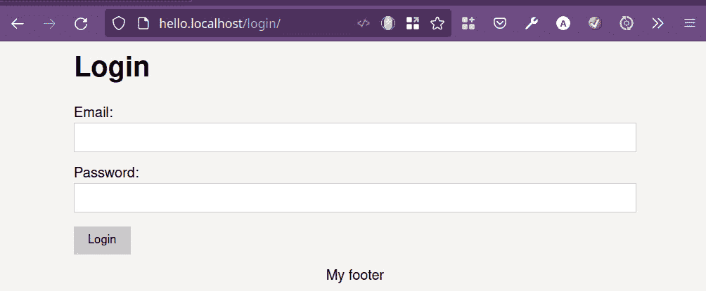
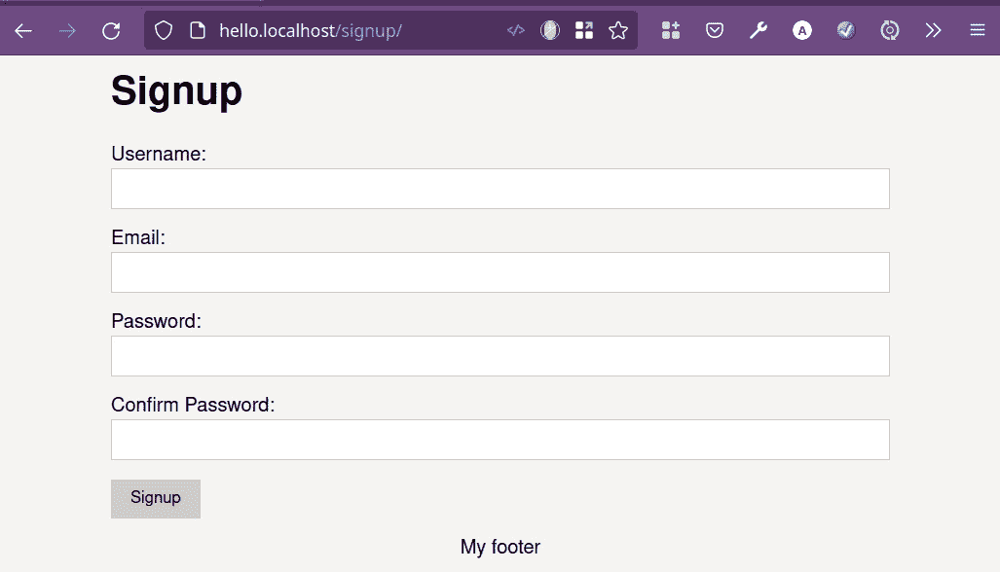
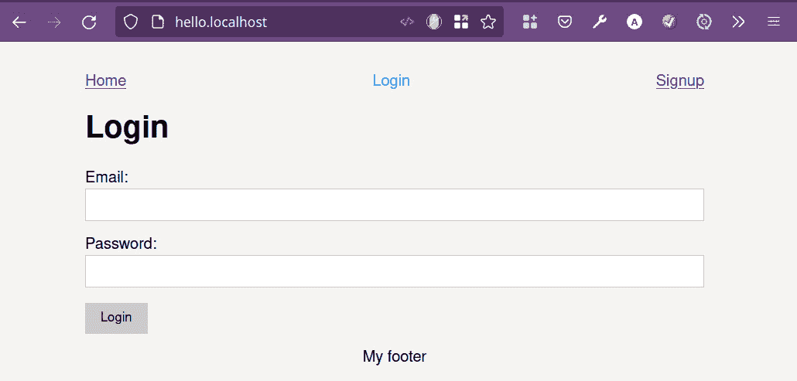
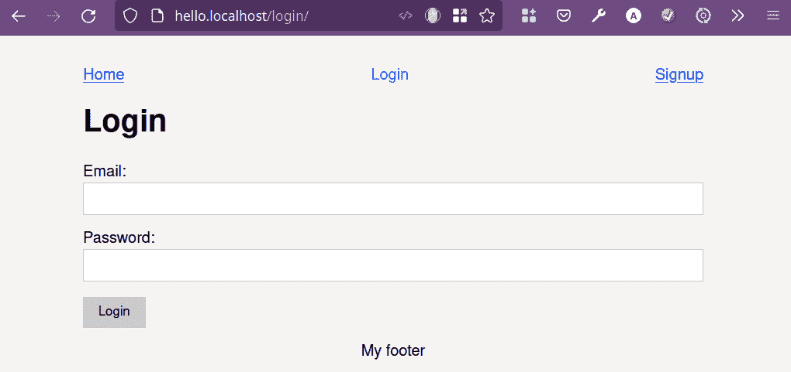
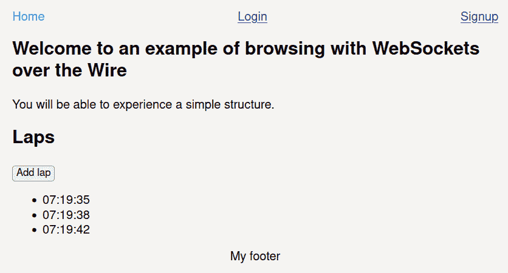
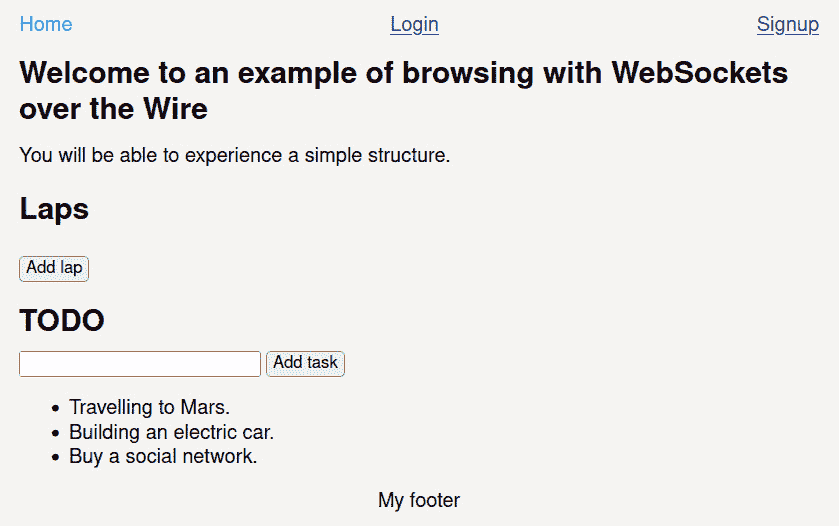

# 第六章：在后端创建 SPAs

我们不能仅仅通过管理组和向客户端发送 HTML 来创建一个完整的网站。我们必须首先掌握各种小型解决方案，以便能够构建一个与用户交互的动态页面，具有页面切换等基本功能！

当最初的单页应用（**SPAs**）被创建时，当时的开发者被迫花费许多小时在 HTTP 协议使用时免费的那些功能上：路由、会话、身份验证或源验证等。可怜的他们！他们不得不使用叛逆的青少年 JavaScript 重新发明轮子，而这种 JavaScript 并不非常跨浏览器兼容。然而，他们幸存了下来，或者至少我希望如此，通过在前端定义技术，这些技术成功地模仿了 HTTP 的行为；这些技术一直持续到今天。例如，在一个路由系统中，当 SPA 重绘屏幕时，浏览器 URL 会被修改以将用户置于上下文中。另一方面，如果访客手动输入地址，应用程序会通过加载构成屏幕的组件来做出反应。所有这些任务都使用 JavaScript 实现起来非常耗时。不发送新请求就更改内容并不便宜。如果我们只是使用纯 HTML，我们就不需要做任何事情，但当然，用户会每次更改时都经历页面刷新。这一切与我们有什么关系呢？如果我们使用 WebSockets 协议创建页面，我们会发现自己处于类似的情况；我们必须发明公式来模拟礼貌用户期望我们提供的行为。

与其他库相比，Channels 在功能上简单，但同时也非常成熟且与现实世界保持一致。它是一个因需求而生的框架。它依赖于 Django 为我们提供解决典型问题的基本要素，同时提供灵活性。

在本章中，我们将回顾以下不同方法：

+   在页面之间切换

+   为每个路由进行服务器端渲染

+   包含浏览器以实现动态导航

+   更改 URL

+   润滑部分或组件

+   为会话创建临时会话

+   使用 WebSockets 避免**跨站请求伪造**（**CSRF**）

因此，我们将专注于如何解决每个问题，以便为准备在*第七章*，“仅使用 Django 创建实时博客”做准备。

让我们更好地组织我们的项目。从现在开始，我们将把 Channels 分成两个文件：`consumers.py`，它将是`views.py`或前端和后端之间的通信网关，以及`actions.py`，其中将放置逻辑或函数。

我们将从添加一个完整的页面切换系统开始。你不需要按顺序遵循每个点，因为你会找到我们如何解决每个任务的示例，而不是一个教程。

# 技术要求

所有不同部分的代码都可以在以下链接中找到：

[`github.com/PacktPublishing/Building-SPAs-with-Django-and-HTML-Over-the-Wire/tree/main/chapter-6`](https://github.com/PacktPublishing/Building-SPAs-with-Django-and-HTML-Over-the-Wire/tree/main/chapter-6)

# 在页面之间切换

在某个时候，用户将需要转到另一个页面或更改上下文。我们将让他们认为这是在发生，但实际上，这将会是一个魔术，因为实际上，他们永远不会从我们最初给他们的第一个 HTML 页面移动。然而，关键在于，他们会感觉到页面正在改变。为了实现这种欺骗（抱歉，成就），我们将执行以下任务：

1.  更改主内容或属于`<main>`的任何内容的 HTML。同时，我们将始终保留页面的静态部分，如`<header>`、`<aside>`或`<footer>`。

1.  实现服务器端渲染以渲染属于每个 URL 的 HTML。

1.  使用 CSS 样式在`<nav>`中视觉标记我们的位置。

1.  通过 JavaScript API 修改浏览器 URL。这是一个美学上的改变，但 URL 充当面包屑以引导访客。

目标是建立一个包含三个页面的网站：`base.html`：

```py

```

```py
<!doctype html>
```

```py
<html lang="en">
```

```py
<head>
```

```py
    <meta charset="UTF-8">
```

```py
    <meta name="viewport" content="width=device-width, 
```

```py
        user-scalable=no, initial-scale=1.0, maximum-
```

```py
            scale=1.0, minimum-scale=1.0">
```

```py
    <title>Example website</title>
```

```py
    <link rel="stylesheet" href="">
```

```py
    <script defer src="img/index.js' %}">
```

```py
    </script>
```

```py
</head>
```

```py
<body
```

```py
        data-host="{{ request.get_host }}"
```

```py
        data-scheme="{{ request.scheme }}">
```

```py
    <div class="container">
```

```py
        <header>
```

```py
            <nav id="nav" class="nav"></nav>
```

```py
        </header>
```

```py
        <main id="main"></main>
```

```py
        <footer class="footer">My footer</footer>
```

```py
    </div>
```

```py
</body>
```

```py
</html>
```

`components/_nav.html`组件将在我们讨论导航时再进行讨论。重要的是，我们将在`<main>`内部嵌入一个`include`，我们将使用它来创建未来的服务器端渲染系统。

接下来，在`Consumer`类中，我们将创建`"Change page"`动作，该动作将在`actions.py`内部调用`send_page (self, "page name")`函数：

```py
# app/app_template/consumers.py
```

```py
from channels.generic.websocket import JsonWebsocketConsumer
```

```py
import app.app_template.actions as actions
```

```py
class ExampleConsumer(JsonWebsocketConsumer):
```

```py
    def connect(self):
```

```py
        """Event when client connects"""
```

```py
        # Accept the connection
```

```py
        self.accept() 
```

```py
    def disconnect(self, close_code):
```

```py
        """Event when client disconnects"""
```

```py
        pass
```

```py
    def receive_json(self, data_received):
```

```py
        """
```

```py
            Event when data is received
```

```py
            All information will arrive in 2 variables:
```

```py
            "action", with the action to be taken
```

```py
            "data" with the information
```

```py
        """
```

```py
        # Get the data
```

```py
        data = data_received["data"]
```

```py
        # Depending on the action we will do one task or another.
```

```py
        match data_received["action"]:
```

```py
            case "Change page":
```

```py
                actions.send_page(self, data["page"]) 
```

```py
    def send_html(self, event):
```

```py
        """Event: Send html to client"""
```

```py
        data = {
```

```py
            "selector": event["selector"],
```

```py
            "html": event["html"],
```

```py
            "append": "append" in event and event["append"],
```

```py
            "url": event["url"] if "url" in event else "",
```

```py
        }
```

```py
        self.send_json(data)
```

如您可能已经注意到的，`send_html`也已经修改，以包含`append`，我们将使用它来指示我们是否想要向选择器添加一个 HTML 块或替换所有内容（目前我们不会实现它），而`url`将用于指示将在浏览器中显示的 URL。

在`app/app_template/actions.py`中，我们将定义一个渲染 HTML 并将其发送到前端的功能：

```py
from .forms import LoginForm, SignupForm
```

```py
from asgiref.sync import async_to_sync
```

```py
from django.template.loader import render_to_string
```

```py
from django.urls import reverse
```

```py
from datetime import datetime
```

```py
def send_page(self, page):
```

```py
    """Render HTML and send page to client""""
```

```py
    # Prepare context data for page
```

```py
    context = {}
```

```py
    match page:
```

```py
        case "login":
```

```py
            context = {"form": LoginForm()}
```

```py
        case "signup":
```

```py
            context = {"form": SignupForm()}
```

```py
     context.update({"active_nav": page})
```

我们准备将用于渲染 HTML 模板的变量，每个页面对应的`Form`对象，以及我们所在页面的名称：

```py
    # Render HTML nav and send to client
```

```py
    self.send_html({
```

```py
        "selector": "#nav",
```

```py
        "html": render_to_string("components/_nav.html", 
```

```py
            context),
```

```py
    })
```

在每次页面更改时，我们必须重新绘制`main`浏览器以标记我们的位置：

```py
    # Render HTML page and send to client
```

```py
    self.send_html({
```

```py
        "selector": "#main",
```

```py
        "html": render_to_string(f"pages/{page}.html", 
```

```py
            context),
```

```py
        "url": reverse(page),
```

```py
    })
```

最后，我们使用名为`url`的变量将页面的 HTML 发送到`<main>`前端。这将在稍后由 JavaScript 用于修改浏览器的地址。

在我们继续实现页面切换之前，让我们停下来，使用 Django 实现每个视图的渲染。这将简化创建浏览器以在页面之间移动的任务。

# 为每个路由实现服务器端渲染

在准备好`Consumer`类以动态更改页面后，我们将使用 Django 引入一个简单的系统来管理路由和渲染每个页面，而不依赖于 Channels，以便爬虫可以索引内容。我们将定义三个模板（`home.html`、`login.html`和`signup.html`）。

`app/app_template/templates/pages/home.html`的内容将是几行 HTML：

```py
<section>
```

```py
    <h1>Welcome to an example of browsing with WebSockets over the Wire.</h1>
```

```py
    <p>You will be able to experience a simple structure. </p>
```

```py
</section>
```

然后，在第二页，代表登录表单，我们将使用`form`对象列出所有字段并进行验证。这将是我们渲染模板时传递的参数。

我们在`app/app_template/templates/pages/login.html`中编写以下代码：

```py
<h1>Login</h1>
```

```py
<form id="login-form">
```

```py
    {{ form.as_p }}
```

```py
    <input type="submit" class="button" value="Login">
```

```py
</form>
```

最后，我们在`app/app_template/templates/pages/signup.html`中使用`form`对象重复相同的结构：

```py
<h1>Signup</h1>
```

```py
<form id="signup-form">
```

```py
    {{ form.as_p }}
```

```py
    <input type="submit" class="button" value="Signup">
```

```py
</form>
```

在定义视图之前，我们需要构建表单。在`app/app_template/forms.py`中，我们添加以下内容：

```py
from django import forms
```

```py
class LoginForm(forms.Form):
```

```py
    email = forms.CharField(
```

```py
        label="Email",
```

```py
        max_length=255,
```

```py
        widget=forms.EmailInput(attrs={"id": "login-email", 
```

```py
            "class": "input"}),
```

```py
    )
```

```py
    password = forms.CharField(
```

```py
        label="Password",
```

```py
        max_length=255,
```

```py
        widget=forms.PasswordInput(attrs={"id": "login-
```

```py
            password", "class": "input"}),
```

```py
    )
```

```py
class SignupForm(forms.Form):
```

```py
    username = forms.CharField(
```

```py
        label="Username",
```

```py
        max_length=255,
```

```py
        widget=forms.TextInput(attrs={"id": "signup-
```

```py
            username", "class": "input"}),
```

```py
    )
```

```py
    email = forms.EmailField(
```

```py
        label="Email",
```

```py
        max_length=255,
```

```py
        widget=forms.EmailInput(attrs={"id": "signup-
```

```py
            email", "class": "input"}),
```

```py
    )
```

```py
    password = forms.CharField(
```

```py
        label="Password",
```

```py
        max_length=255,
```

```py
        widget=forms.PasswordInput(attrs={"id": "signup-
```

```py
            password", "class": "input"}),
```

```py
    )
```

```py
    password_confirm = forms.CharField(
```

```py
        label="Confirm Password",
```

```py
        max_length=255,
```

```py
        widget=forms.PasswordInput(
```

```py
            attrs={"id": "signup-password-confirm", 
```

```py
                "class": "input"}
```

```py
        ),
```

```py
    )
```

准备好要渲染的模板和表单后，我们编辑`app/app_template/views.py`：

```py
from django.shortcuts import render
```

```py
from .forms import LoginForm, SignupForm 
```

```py
def home(request):
```

```py
    return render(
```

```py
        request,
```

```py
        "base.html",
```

```py
        {
```

```py
            "page": "pages/home.html",
```

```py
            "active_nav": "home",
```

```py
        },
```

```py
    )
```

```py
def login(request):
```

```py
    return render(
```

```py
        request,
```

```py
        "base.html",
```

```py
        { "page": "pages/login.html", "active_nav":
```

```py
            "login", "form": LoginForm()},
```

```py
                 )
```

```py
def signup(request):
```

```py
    return render(
```

```py
        request,
```

```py
        "base.html",
```

```py
        { "page": "pages/signup.html", "active_nav": "signup", "form": SignupForm()},
```

```py
    )
```

在所有情况下，我们使用`base.html`作为主布局，其中我们将使用`page`变量更改`<main>`的内容：

```py
<main id="main"></main>
```

`active_nav`变量是一个视觉资源，通过改变适当超链接的颜色来通知访客他们所在的位置。我们暂时可以忽略它。

现在，我们编辑`project_template/urls.py`以定义所有路径：

```py
from django.contrib import admin
```

```py
from django.urls import path
```

```py
from app.app_template import views
```

```py
urlpatterns = 
```

```py
    path("", views.home, name="home"),
```

```py
    path("login/", views.login, name="login"),
```

```py
    path("signup/", views.signup, name="signup"),
```

```py
    path("admin/", admin.site.urls),
```

没有什么异常；这是 Django 自己的路由系统。除了一个细节：我们从未对其进行扩展。通常的方法是渲染`home.html`而不是`base.html`。换句话说，`home.html`是页面的内容，它使用`base.html`作为其结构：

```py

```

```py
<section>
```

```py
    <h1>Welcome to an example of browsing with WebSockets over the Wire</h1>.
```

```py
    <p>You will be able to experience a simple structure.</p>
```

```py
</section>
```

我们这样做是因为 Django 必须适应我们通过 WebSockets 绘制 HTML 的方式。我们只对修改`<main>`感兴趣，模板必须作为组件隔离以这种方式工作。

您现在可以打开三个路径，看看它们在不使用`Consumer`类的情况下是如何渲染的。

我们可以看到网站根目录的渲染方式：



图 6.2 – 使用 Django 渲染登录页

当我们渲染注册页面时，情况相同：



图 6.3 – 使用 Django 渲染注册页

在服务器端渲染系统就绪后，我们将引入一个浏览器来执行操作以动态修改页面主体或其小部分。

# 包括浏览器以实现动态导航

在引入模板、视图和传统导航的路由后，我们将创建一个动态导航系统。

我们在`app/app_template/components/_nav.html`路径中声明一个文件，内容如下：

```py
<ul class="nav__ul">
```

```py
    <li>
```

```py
        <a
```

```py
                href="#"
```

```py
                class="nav__link nav__link nav__link--
```

```py
                    page 
```

```py
                        active"
```

```py
                data-target="home"
```

```py
        >
```

```py
            Home
```

```py
        </a>
```

```py
    </li>
```

```py
    <li>
```

```py
        <a
```

```py
                href="#"
```

```py
                class="nav__link nav__link--page active"
```

```py
                data-target="login"
```

```py
        >
```

```py
            Login
```

```py
        </a>
```

```py
    </li>
```

```py
    <li>
```

```py
        <a
```

```py
                href="#"
```

```py
                class="nav__link nav__link nav__link--   
```

```py
                    page 
```

```py
                        active"
```

```py
                data-target="signup"
```

```py
        >
```

```py
            Signup
```

```py
        </a>
```

```py
    </li>
```

```py
</ul>
```

我们将传递 `active_nav` 到模板中，带有我们想要用 CSS 标记的页面名称，添加 `active` 类。另一方面，`data-target` 是一个数据集，它将收集要发送到 `Consumer` 类的 JavaScript，并告诉它要渲染哪个页面。

在 JavaScript 中，我们将为每个 `<a>` 分配一个 `click` 事件，将更改所需页面的动作发送到 `Consumer` 类。哪个页面？我们在 `data-target` 中保存的那个页面。在添加新事件监听器之前，我们必须小心，强烈建议我们删除之前的监听器以避免将事件重复发送到同一函数。记住，HTML 已经交换，但 JavaScript 保持静态。

编辑 `static/js/index.js`，添加浏览器事件：

```py
/**
```

```py
* Send message to update page
```

```py
* @param {Event} event
```

```py
* @return {void}
```

```py
*/
```

```py
function handleClickNavigation(event) {
```

```py
    event.preventDefault();
```

```py
    sendData({
```

```py
        action: 'Change page',
```

```py
        data: {
```

```py
            page: event.target.dataset.target
```

```py
        }
```

```py
    }, myWebSocket);
```

```py
}
```

```py
/**
```

```py
* Send message to WebSockets server to change the page
```

```py
* @param {WebSocket} webSocket
```

```py
* @return {void}
```

```py
*/
```

```py
function setEventsNavigation(webSocket) {
```

```py
    // Navigation
```

```py
    document.querySelectorAll('.nav__link--
```

```py
        page').forEach(link => {
```

```py
        link.removeEventListener('click', 
```

```py
            handleClickNavigation, false);
```

```py
        link.addEventListener('click', 
```

```py
            handleClickNavigation, false);
```

```py
    });
```

```py
}
```

```py
// Event when a new message is received by WebSockets
```

```py
myWebSocket.addEventListener("message", (event) => {
```

```py
    // Parse the data received
```

```py
    const data = JSON.parse(event.data);
```

```py
    // Renders the HTML received from the Consumer
```

```py
    const selector = document.querySelector(data.selector);
```

```py
    selector.innerHTML = data.html;
```

```py
    /**
```

```py
     * Reassigns the events of the newly rendered HTML
```

```py
     */
```

```py
    updateEvents();
```

```py
});
```

```py
/**
```

```py
* Update events in every page
```

```py
* return {void}
```

```py
*/
```

```py
function updateEvents() {
```

```py
    // Nav
```

```py
    setEventsNavigation(myWebSocket);
```

```py
}
```

```py
    INITIALIZATION
```

```py
*/
```

```py
updateEvents();
```

现在，我们只需要在 `static/css/main.css` 中添加一些 CSS 来改变我们所在位置的链接颜色：

```py
.nav__link.active {
```

```py
    color: var(--color__active);
```

```py
    text-decoration: none;
```

```py
}
```

现在，我们可以切换页面，尽管这不会在浏览器的地址栏中反映出来。



图 6.4 – 加载了动态在首页和注册页之间导航功能的登录页面

我们已经构建了一个可以在页面之间导航的网站，并且集成了传统的渲染来向搜索引擎蜘蛛提供内容。然而，我们没有向访客提供反馈。下一个目标将是显示 URL 中的页面层次结构或名称。

# 更改 URL

我们已经成功实现了更改页面并在浏览器中视觉上标记我们的位置，但浏览器 URL 仍然是被动的。我们将添加一个机制，每次我们更改页面时都会更新路径。

在 JavaScript 中，我们可以使用 History API 来操作访客在浏览器中看到的地址。例如，如果你想显示你处于 `/login/`，你会实现以下操作：

```py
history.pushState({}, '', '/login/')
```

我们将要做的就是在事件监听器消息中添加我们刚刚提到的行，以及一个新参数，该参数将始终发送一个名为 `url` 的 `Consumer` 类：

```py
// Event when a new message is received by WebSockets
```

```py
myWebSocket.addEventListener("message", (event) => {
```

```py
    // Parse the data received
```

```py
    const data = JSON.parse(event.data);
```

```py
    // Renders the HTML received from the Consumer
```

```py
    const selector = document.querySelector(data.selector);
```

```py
    selector.innerHTML = data.html;
```

```py
    // Update URL
```

```py
    history.pushState({}, '', data.url) // New line
```

```py
    /**
```

```py
     * Reassigns the events of the newly rendered HTML
```

```py
     */
```

```py
    updateEvents();
```

```py
});
```

在 `Consumer` 中，我们将修改 `send_html` 函数以支持 `url` 参数：

```py
def send_html(self, event):
```

```py
        """Event: Send html to client"""
```

```py
        data = {
```

```py
            "selector": event["selector"],
```

```py
            "html": event["html"],
```

```py
            "url": event["url"] if "url" in event else "", # New line
```

```py
        }
```

```py
        self.send_json(data)
```

当在 `actions.py` 中，我们将修改 `send_page` 以发送路由，但路由是什么？多亏了 Django 和 `urls.py`，我们可以使用 `reverse`，它将返回完整路径：

```py
from django.urls import reverse
```

```py
def send_page(self, page):
```

```py
...
```

```py
        self.send_html({
```

```py
        "selector": "#main",
```

```py
        "html": render_to_string(f "pages/{page}. html", 
```

```py
            context),
```

```py
        "url": reverse(page),
```

```py
    })
```

```py
...
```

现在，我们在导航时可以可视化路由。



图 6.5 – 动态浏览时显示 URL

尽管如此，我们有一个严重的限制：我们无法添加 HTML 块。如果我们只想向现有列表添加新元素，例如，渲染整个页面是不高效的。因此，我们将包括一个系统，使我们能够决定是否要将 HTML 块替换或添加到任何可用的选择器。

# 激活部分或组件

虽然我们有一个可以动态包含从模板渲染的 HTML 并将其应用到文档中现有标签的功能，但我们不能决定我们想要替换还是插入 HTML，换句话说，是进行 hydration 还是替换 DOM。

**Hydration**是网络开发中的一种技术，其中客户端 JavaScript 通过将事件处理程序附加到 HTML 元素，将静态 HTML 网页转换为动态网页。这允许快速**首次内容绘制**（**FCP**），但在之后有一段时间页面看起来已经完全加载并且可以交互。然而，直到客户端 JavaScript 执行并且事件处理程序被附加，这才会发生。

为了解决这个问题，我们首先记住`Consumer`类已经准备好接收`append`指令：

```py
    def send_html(self, event):
```

```py
        """Event: Send html to client"""
```

```py
        data = {
```

```py
            "selector": event["selector"],
```

```py
            "html": event["html"],
```

```py
            "append": "append" in event and 
```

```py
                event["append"],
```

```py
            "url": event["url"] if "url" in event else "",
```

```py
        }
```

```py
        self.send_json(data)
```

默认情况下，`append`将是一个`False`变量。但如果客户端发送给我们`append`数据并且它是`True`，我们将发送我们想要添加到前端的内容，而 JavaScript 将处理其余部分。

我们在`static/js/index.js`中包含了以下内容，一个条件来控制`append`：

```py
myWebSocket.addEventListener("message", (event) => {
```

```py
    // Parse the data received
```

```py
    const data = JSON.parse(event.data);
```

```py
    // Renders the HTML received from the Consumer
```

```py
    const selector = document.querySelector(data.selector);
```

```py
    // If append is received, it will be appended. 
```

```py
     Otherwise the entire DOM will be replaced.
```

```py
    if (data.append) {
```

```py
        selector.innerHTML += data.html;
```

```py
    } else {
```

```py
        selector.innerHTML = data.html;
```

```py
    }
```

```py
    // Update URL
```

```py
    history.pushState({}, '', data.url)
```

```py
    /**
```

```py
     * Reassigns the events of the newly rendered HTML
```

```py
     */
```

```py
    updateEvents();
```

```py
});
```

为了检查它是否工作，我们将添加一个**laps**列表到**主页**。laps 是一个时间单位，它作为计时器中记录的时间段的记录存储在计时器中。例如，如果是一个一级方程式赛车比赛，你只需通过查看记录的 laps 时间，就可以可视化每辆车完成一圈所需的时间。

每次按按钮时，都会添加一个包含当前时间的新项：

1.  我们编辑了托管在`app/app_template/templates/pages/home.html`中的`Home`模板。我们包括一个按钮和无序列表：

    ```py
    <section>
        <h2>Laps</h2>
        <p>
            <button id="add-lap">Add lap</button>
        </p>
        <ul id="laps"></ul>
    </section>
    ```

1.  在`static/js/index.js`示例中，我们用 JavaScript 将事件整合到按钮中。它将只发送一个动作而不带任何数据：

    ```py
    /**
    * Send new Lap
    * @param {Event} event
    * @return {void}
    */
    function addLap(event) {
        sendData({
            action: 'Add lap',
            data: {}
        }, myWebSocket);
    }
    /**
    * Update events in every page
    * return {void}
    */
    function updateEvents() {
        // Nav
        setEventsNavigation(myWebSocket);
        // Add lap
        const addLapButton = document.querySelector('#add-
            lap');
        if (addLapButton !== null) {
            addLapButton.removeEventListener('click', 
                addLap, false);
            addLapButton.addEventListener('click', addLap, false);
        }
    }
    ```

1.  在`Consumer`类中，在`app/app_template/consumers.py`路径下，我们捕获动作并调用一个未来的`add_lap`函数：

    ```py
        def receive_json(self, data_received):
            """
                Event when data is received
                All information will arrive in 2 variables:
                "action", with the action to be taken
                "data" with the information
            """
            # Get the data
            data = data_received["data"]
            # Depending on the action we will do one task or another.
            match data_received["action"]:
                case "Change page":
                    actions.send_page(self, data["page"])
                case "Add lap":
                    actions.add_lap(self)
    ```

1.  在`actions`中，位于`app/app_template/actions.py`，我们包含了之前提到的`add_lap`函数。我们在`#laps`选择器中包含了由名为`time`的变量渲染的 HTML 片段，该变量包含当前时间：

    ```py
    def add_lap(self):
        """Add lap to Home page"""
        # Send current time to client
        self.send_html({
            "selector": "#laps",
            "html": render_to_string
                ("components/_lap.html", 
                    {"time": datetime.now()}),
            "append: True,
        })
    ```

1.  最后，我们构建了`app/app_template/templates/components/_lap.html`组件：

    ```py
    <li>{{ time|date: "h:i:s" }}</li>
    ```

就这样。我们通过按**主页**中的**添加 laps**按钮来测试我们如何随着时间的推移更新列表。



图 6.6 – 向无序列表中添加 HTML 片段以保留按钮点击时记录的内容

我们已经改进了 HTML 渲染系统，使其更加选择性和高效。我们现在可以决定何时添加或替换一个 DOM。

如果你更改页面并返回**主页**，你会发现所有的时间都被删除了。为了避免这个问题，我们可以在数据库中保存时间，或者我们可以通过为用户创建一个临时会话来找到一个最优解。

# 为客户端创建临时会话

为了为每位客户创建独特的会话，我们需要激活启用此功能的中间件。Channels 为我们提供了`SessionMiddlewareStack`或`AuthMiddlewareStack`，它们还包括构建登录或注销功能所需的工具。只要可能，我们就会使用`AuthMiddlewareStack`。

我们按照以下方式编辑`project_template/asgi.py`：

```py
import django
```

```py
os.environ.setdefault("DJANGO_SETTINGS_MODULE", "project_template.settings")
```

```py
from django.conf import settings
```

```py
django.setup()
```

```py
from django.core.asgi import get_asgi_application
```

```py
from channels.auth import AuthMiddlewareStack
```

```py
from channels.routing import ProtocolTypeRouter, URLRouter
```

```py
from django.urls import re_path
```

```py
from app.app_template.consumers import ExampleConsumer
```

```py
application = ProtocolTypeRouter(
```

```py
    {
```

```py
        # Django's ASGI application to handle traditional HTTP requests
```

```py
        "http": get_asgi_application(),
```

```py
        # WebSocket handler
```

```py
        "websocket": AuthMiddlewareStack(
```

```py
            URLRouter(
```

```py
                [
```

```py
                    re_path(r"^ws/example/$", ExampleConsumer.as_asgi()),   
```

```py
    }
```

我们现在可以在`Consumer`类中创建会话，如下所示：

```py
self.scope["session"]["my name"] = "value".
```

```py
self.scope["session"]. save()
```

获取它将与从任何 Python 字典中读取相同：

```py
print(self.scope["session"]["my name"])
```

```py
# value
```

为了展示其潜力，我们将在主页上创建一个经典的待办事项应用。即使我们更改页面，我们留下的所有待办任务在我们回来时总是存在，就像现实生活中一样。请看以下：

1.  在`home`模板的末尾，我们包括一个`<input>`来添加任务的文本，一个触发动作的按钮，以及将要显示的列表：

    ```py
    <section>
        <h2>TODO</h2>
        <input type="text" id="task">
        <button id="add-task"> Add task</button>
        <ul id="todo"></ul>
    </section>
    ```

1.  我们需要一个组件来列出所有任务。因此，在`app/app_template/templates/components/_tasks.html`中，我们包含以下代码：

    ```py
    
        
    
    ```

1.  在前面的组件中，我们使用另一个组件来渲染项目。我们声明`app/app_template/templates/components/_task-item.html`，其中包含一个`<li>`和任务的名称：

    ```py
    <li>{{ task }}</li>
    ```

1.  在`Consumer`类中，当用户连接时，我们创建一个名为`tasks`的会话，其中包含一个空列表，我们可以填充它。另一方面，我们捕获从前端接收到的名为"`Add task`"的动作，并调用`actions.py`中的`add_task`函数：

    ```py
    import app.app_template.actions as actions
    class ExampleConsumer(JsonWebsocketConsumer):

        def connect(self):
            """Event when client connects"""
            # Accept the connection
            self.accept()
            # Make session task list
            if "tasks" not in self.scope["session"]:
                self.scope["session"]["tasks"] = []
                self.scope["session"].save()
    def receive_json(self, data_received):
            # Get the data
            data = data_received["data"]
            # Depending on the action we will do one task or another.
            match data_received["action"]:
     # Other actions
                case "Add task":
                    actions.add_task(self, data)
    ```

1.  在`actions.py`中，我们声明了`add_task`函数，该函数将任务添加到会话中，但我们还将创建带有`session`变量的`home`的`context`：

    ```py
    from .forms import LoginForm, SignupForm
    from asgiref.sync import async_to_sync
    from django.template.loader import render_to_string
    from django.urls import reverse
    from channels.auth import login, logout
    from django.contrib.auth.models import User
    from django.contrib.auth import authenticate
    from datetime import datetime

    def send_page(self, page):
        """Render HTML and send page to client"""

        # Prepare context data for page
        context = {}
        match page:
            case "home":
                context = {"tasks": self.scope["session"]
                    ["tasks"] if "tasks" in self.scope
                        ["session"] else []}
            case "login":
                context = {"form": LoginForm()}
            case "signup":
                context = {"form": SignupForm()}
    ...

    def add_lap(self):
        "Add lap to Home page"""""
        # Send current time to client
        self.send_html({
            "selector": "#laps",
            "html": render_to_string
                ("components/_lap.html", {"time": 
                    datetime.now()}),
            "append: True,
        })

    def add_task(self, data):
        "Add task from TODO section"""""
        # Update task list
        self.send_html({
            "selector": "#all",
            "html": render_to_string("components/_task-
                item.html", {"task": data["task"]}),
            "append: True,
        })
        # Add task to list
        self.scope["session"]["tasks"].append(data["task"])
        self.scope["session"].save()
    ```

1.  最后，在 JavaScript 中，我们给按钮添加一个`click`事件，以便将文本和任务发送到`Consumer`类：

    ```py
    /**
    * Send new task to TODO list
    * @param event
    * @return {void}
    */
    function addTask(event) {
        const task = document.querySelector('#task');
        sendData({
            action: 'Add task',
            data: {
                task: task.value
            }
        }, myWebSocket);
        // Clear input
        task.value = '';
    }
    /**
    * Update events in every page
    * return {void}
    */
    function updateEvents() {
        // Nav
        setEventsNavigation(myWebSocket);
    ...
        // Add task
        const addTaskButton = document.querySelector
            ('#add-task');
        if (addTaskButton !== null) {
            addTaskButton.removeEventListener('click', 
                addTask, false);
            addTaskButton.addEventListener('click', 
                addTask, false);
        }
    }
    ```

如果出现新的 DOM 元素，我们必须更新。否则，如果之前的 HTML 已被删除，事件将停止工作。要遵循的步骤是停止监听之前存在的事件，并添加新的。如果我们不这样做，事件可能会丢失或重复。

要执行的事件很简单。我们捕获`#task`字段，并将任务的文本发送给`Consumer`类。



图 6.7 – 从会话中显示任务列表

我们已经能够处理会话并从其内容创建 HTML。现在，我们只需要实施一些安全措施来防止 CSRF 攻击。

# 使用 WebSockets 避免跨站请求伪造（CSRF）

通过使用会话，我们正在将用户暴露于 CSRF 攻击之中，除非我们采取适当的措施。

CSRF 攻击

CSRF 攻击是对网站的一种恶意攻击，其中未经授权的命令从一个用户发送到第二个网站，通过隐藏表单、AJAX 请求或任何其他隐藏方式。

你可以在这里找到参考：[`en.wikipedia.org/wiki/Cross-site_request_forgery`](https://en.wikipedia.org/wiki/Cross-site_request_forgery)。

Channels 提供了一个工具，可以帮助我们以简单的方式避免此类攻击：

1.  我们在 `project_template/settings.py` 中定义允许的 `Hosts`。在我们的案例中，我们正在使用 Docker 中的环境变量：

    ```py
    ALLOWED_HOSTS = os.environ.get("ALLOWED_HOSTS"). split(",")
    ```

1.  我们编辑 `project_template/asgi.py` 文件，通过导入 `OriginValidator`。我们必须传递两个参数：`URLRouter`（或任何中间件）以及我们想要保护的 `Hosts`：

    ```py
    # project_template/asgi.py
    import django

    os.environ.setdefault("DJANGO_SETTINGS_MODULE", "project_template.settings")
    from django.conf import settings
    django.setup()
    from django.core.asgi import get_asgi_application
    from channels.security.websocket import OriginValidator # New line
    from channels.auth import AuthMiddlewareStack
    from channels.routing import ProtocolTypeRouter, URLRouter
    from django.urls import re_path
    from app.app_template.consumers import ExampleConsumer

    application = ProtocolTypeRouter(
        {
            # Django's ASGI application to handle traditional HTTP requests
            "http": get_asgi_application(),
            # WebSocket handler
            # Update
            "websocket": OriginValidator
                (AuthMiddlewareStack(
                URLRouter(
                    
                        re_path(r"^ws/example/$", 
                            ExampleConsumer.as_asgi()),

            ), settings.ALLOWED_HOSTS)
        }
    ```

由于此功能实现起来非常快，强烈建议它始终是我们未来项目的一部分或集成到我们用作基础的模板中。

# 摘要

在本章中，我们为我们项目添加了一些非常有趣的新功能：在页面之间切换、创建每个路径的服务器端渲染版本、创建动态页面、修改 URL、更新特定部分、使用会话以及通过 WebSockets 避免 CSRF 攻击。

现在我们已经拥有了构建具有数据库访问、分组管理、部分或完整 HTML 渲染、触发后端操作的事件控制、表单创建和一些安全措施的基本技能。可能有一个问题在你的脑海中回响：这一切的努力是否值得？只需想想我们现在可以以最小的 JavaScript 使用量创建单页应用（SPAs），我们不需要构建一个 API 来连接前端和后端，请求和响应之间的时间非常低，在很多情况下避免了加载。项目的复杂性也降低了，我们可以避免安装多个前端库。由你自己来判断。最令人惊讶的是，我们只使用了 Django 和 Channels；通过添加其他 Python 扩展，我们可以实现无限的可能性。

在下一章，[*第七章*，*仅使用 Django 创建实时博客*，我们将把所有这些部分组合起来，以展示一个我们可以用于我们自己的项目或外部项目的实际案例。
