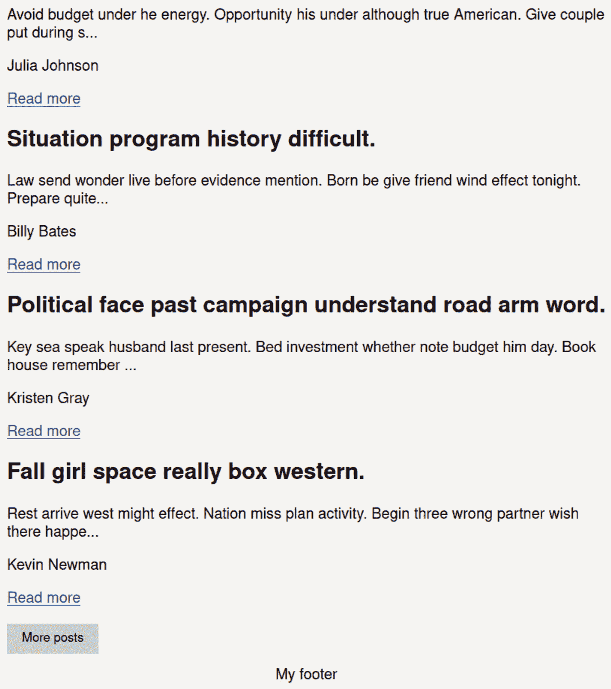
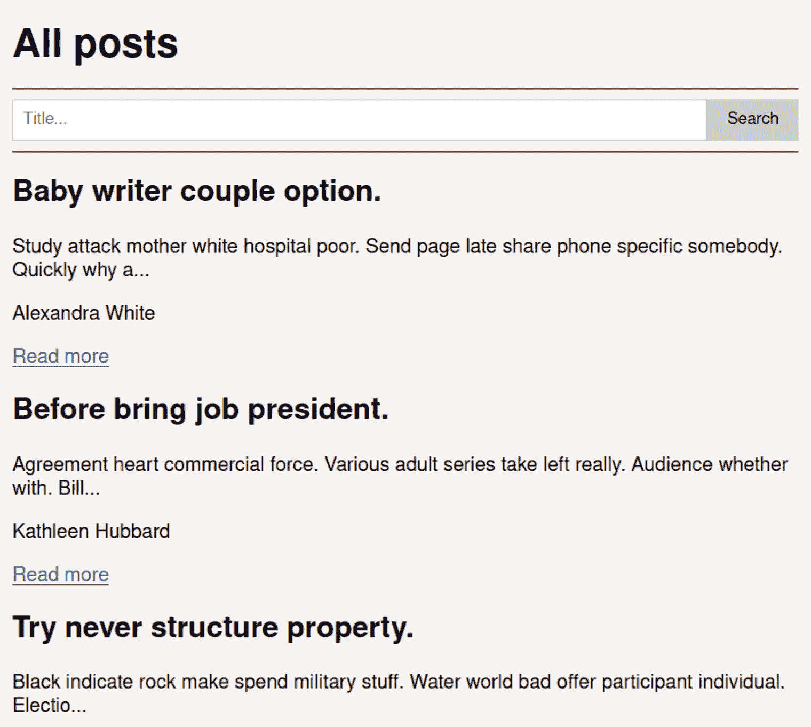
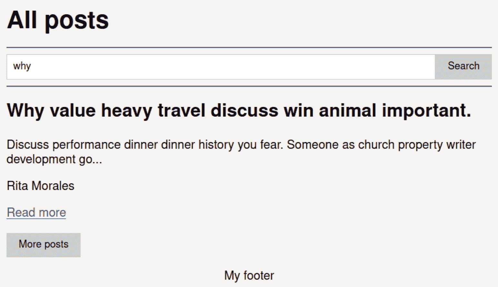
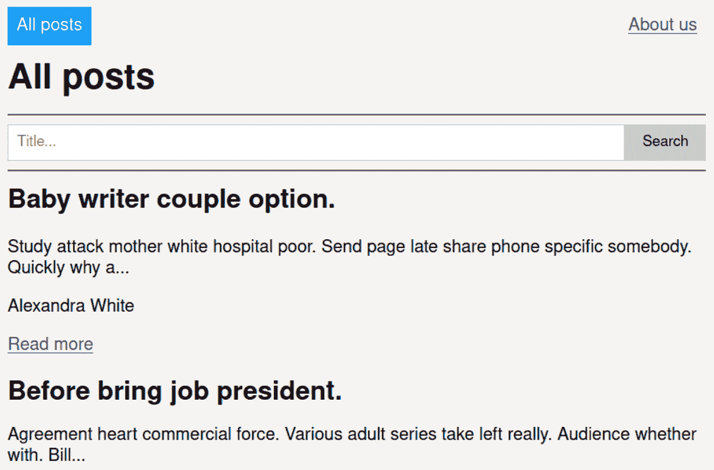
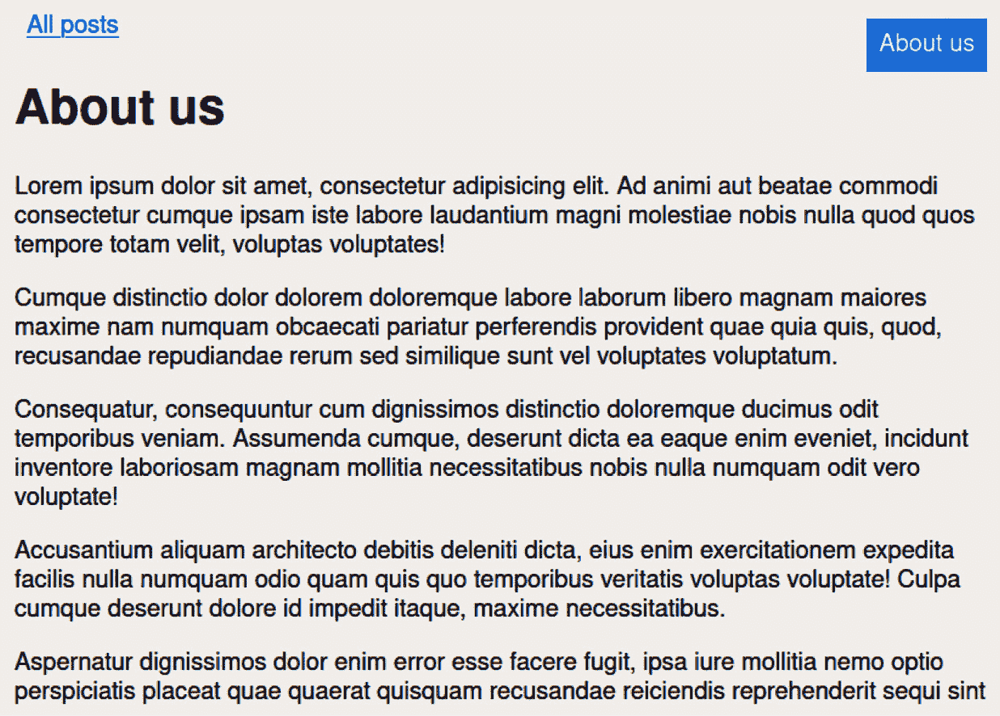
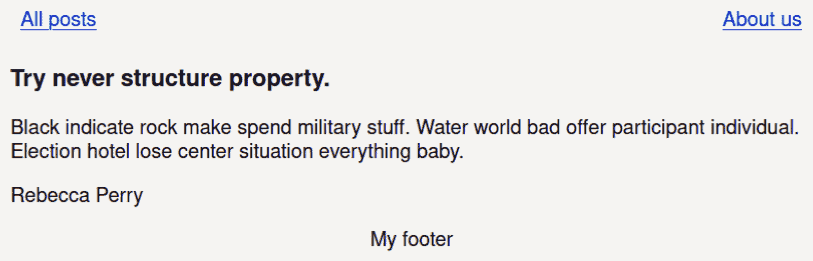
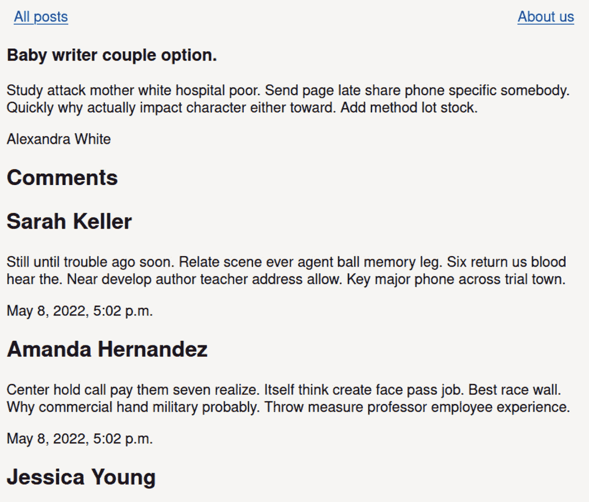
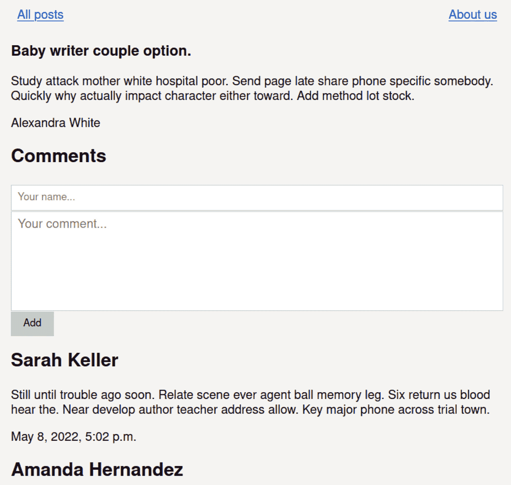

# 第七章：仅使用 Django 创建实时博客

在*第六章*，“在后端创建 SPAs”中，我们学习了使用 HTML 通过 WebSockets 设置 SPA 的基本特性，例如更改页面、组件和会话。我们甚至更进一步，为每个页面创建了一个服务器端渲染系统，以便搜索引擎可以索引所有内容——这个特性在我们使用 Django 时不需要太多努力。

现在我们有了制作包含 SPA 开发所需所有特性的应用程序的技能和成熟度。现在是时候了！我们将统一在创建一个完美准备的博客中获得的全部知识。毫无疑问，无论我们想要吸收的语言或框架如何，这都是一个极好的练习；它涵盖了任何网络开发的基本任务：查询、过滤和添加到数据库（搜索引擎和评论）、从结果生成 HTML（文章列表和单个页面）、使用视图（SSR）、路由（静态页面）、处理和验证表单（添加新评论），最后，分页。

这是一个证明给世界和你自己看，你对该学科有基本知识的考试。甚至可以是一个好的技术测试。

在创建博客的过程中，我们将执行以下操作：

+   为数据库创建模型

+   生成假文章和评论

+   文章列表

+   使用分页在文章之间导航

+   添加文章搜索引擎

+   创建静态页面

+   在页面之间移动并生成浏览器

+   为每篇文章实现一个单独的页面

+   添加评论列表

+   添加新评论

+   提供一个**非常简单的聚合**（**RSS**）源

在本章中，我们将以小里程碑的形式进行工作，遵循一个允许我们有机地融入每个元素的顺序，避免从一个特性跳到另一个特性直到完成。你可以找到我们将要单独实现的每个特性的代码（在先前的列表中）。

为了不使示例过于复杂，我们将从一个我们在前几章中使用的代码库开始。

# 技术要求

所有不同部分的代码都可以在以下链接中找到：

[`github.com/PacktPublishing/Building-SPAs-with-Django-and-HTML-Over-the-Wire/tree/main/chapter-7`](https://github.com/PacktPublishing/Building-SPAs-with-Django-and-HTML-Over-the-Wire/tree/main/chapter-7)

就像其他示例一样，我将从我们在*第四章*，“使用数据库工作”中构建的模板开始：

[`github.com/PacktPublishing/Building-SPAs-with-Django-and-HTML-Over-the-Wire/tree/main/chapter-4/initial-template`](https://github.com/PacktPublishing/Building-SPAs-with-Django-and-HTML-Over-the-Wire/tree/main/chapter-4/initial-template)

如果你发现一些小的差异，那是因为我进行了一些小的调整。例如，我已将项目命名为`blog`，应用命名为`website`，并将路径更改为`http://blog.localhost`，尽管如此，你仍然可以自由地为每个元素命名。

# 为数据库创建模型

我们将在数据库中建立两个表：`Post`，它将包含文章，以及`Comment`，以便读者可以在文章旁边留下他们的意见。

在`app/website/models.py`中添加以下数据库结构：

```py
from django.db import models
```

```py
from django.utils.text import slugify
```

```py
from django.urls import reverse
```

```py
class Post(models.Model):
```

```py
    # Fields: Title of the article, name of the author, 
```

```py
    content of the article and date of creation.
```

```py
    title = models.CharField(max_length=200, unique=True)
```

```py
    author = models.CharField(max_length=20)
```

```py
    content = models.TextField()
```

```py
    created_at = models.DateTimeField(auto_now_add=True)
```

```py
    class Meta:
```

```py
        ordering = ["-created_at"]
```

```py
    @property
```

```py
    def slug(self):
```

```py
        return slugify(self.title)
```

```py
    @property
```

```py
    def summary(self):
```

```py
        return self.content[:100] + "..."
```

```py
    @property 
```

```py
    def get_absolute_url(self):
```

```py
        return reverse("single post", kwargs={"slug": 
```

```py
            self.slug})
```

```py
    def __str__(self):
```

```py
        return self.title
```

```py
class Comment(models.Model):
```

```py
    # Fields: Name of the author, content of the comment, 
```

```py
    relation to the article and date of creation.
```

```py
    author = models.CharField(max_length=20)
```

```py
    content = models.TextField()
```

```py
    post = models.ForeignKey(Post, on_delete=models.
```

```py
        CASCADE)
```

```py
    created_at = models.DateTimeField(auto_now_add=True)
```

```py
    def __str__(self):
```

```py
        return self.name
```

让我们看看`Post`的属性：

+   `slug`：我们将使用文章的标题来区分路由。例如，如果标题为`Penguins have just conquered the world`，其最终路径将是`http://blog.localhost/penguins-have-just-conquered-the-world`。利用这个属性，我们准备好标题用于不同的目的，例如填充其他属性或搜索文章的 ID。

Slug

Slug 是一种用于 URL 的格式，用于使 URL 更易读，其中空格被单个破折号替换，文本被转换为小写。在 SEO 等区域，它用于解释页面内容。

+   `summary`：当我们列出文章时，我们将显示原始文章的一小部分。利用这个属性，我们限制显示文章的部分为 100 个字符，并在句尾添加一些漂亮的点。它并不完美，因为它计算空格，并且不检查初始长度，但肯定足以满足目的。

+   `get_absolute_url`：通过在`urls.py`中定义的路径，我们将为每篇文章构建超链接。为什么？我们将动态移动。例如，它们用于 RSS 源，或未来的网站地图。

下一步，就像我们在每个活动中所做的那样，是进入 Django 容器终端并执行以下操作：

```py
python3 manage.py makemigrations
python3 manage.py migrate
```

数据库已就绪。然而，没有数据，它并不实用。像其他时候一样，我们将创建模拟博客最终外观的假内容。

# 生成假文章和评论

在从模型定义数据库之后，我们将生成随机数据，以便我们能够更舒适地工作。

我们创建`make_fake_data.py`，内容如下：

```py
from app.website.models import Post, Comment
```

```py
from faker import Faker
```

```py
# Delete all posts and comments
```

```py
Post.objects.all().delete()
```

```py
# Create fake object
```

```py
fake = Faker()
```

```py
def get_full_name():
```

```py
    return f"{fake.first_name()} {fake.last_name()}"
```

```py
# Create 30 posts
```

```py
for _ in range(30):
```

```py
    post = Post(
```

```py
        title=fake.sentence()[:200],
```

```py
        content=fake.text(),
```

```py
        author=get_full_name()[:20],
```

```py
    )
```

```py
    post.save()
```

```py
# Create 150 comments
```

```py
for _ in range(150):
```

```py
    comment = Comment(
```

```py
        author=get_full_name()[:20],
```

```py
        content=fake.text(),
```

```py
        post=Post.objects.order_by("?").first(),
```

```py
    )
```

```py
    comment.save()
```

我们将要运行的代码将生成随机信息。我们遵循的步骤如下：

1.  我们删除所有文章，或`Post`。第一次运行时，将没有东西可以删除，但之后，它将删除它找到的每一项。

1.  我们生成 30 篇新文章。

1.  我们生成 150 条评论，或`Comment`，并将它们随机分配给文章。这样，它们将不规则地分布，有些文章没有评论，而有些文章有大量评论。

最后，在 Django 容器终端中，我们执行我们刚刚构建的脚本：

```py
python3 manage.py shell < make_fake_data.py
```

我们的数据库已填充信息。现在，我们将专注于博客的逻辑——例如，以 HTML 格式列出所有文章。

# 文章列表

我们通过模型和包含必要的元素来准备数据库，并添加虚假信息，使我们能够专注于客户如何可视化内容。

在构建不同的页面之前，我们需要一个所有模板的基础。在`app/website/templates/base.html`中，我们包含了主布局：

```py

```

```py
<!doctype html>
```

```py
<html lang="en">
```

```py
<head>
```

```py
    <meta charset="UTF-8">
```

```py
    <meta name="viewport" content="width=device-width,
```

```py
        user-scalable=no, initial-scale=1.0, maximum-
```

```py
            scale=1.0, minimum-scale=1.0">
```

```py
    <title>Example website</title>
```

```py
    <link rel="stylesheet" href="">
```

```py
    <script defer src="img/index.js' %}">
```

```py
    </script>
```

```py
</head>
```

```py
<body
```

```py
        data-host="{{ request.get_host }}"
```

```py
        data-scheme="{{ request.scheme }}"
```

```py
>
```

```py
    <div class="container">
```

```py
        <header>
```

```py
            <nav id="nav" class="nav"></nav>
```

```py
        </header>
```

```py
        <main id="main"></main>
```

```py
        <footer class="footer">My footer</footer>
```

```py
    </div>
```

```py
</body>
```

```py
</html>
```

我们已经包含了用于重绘元素的区域，例如浏览器中的`#nav`和未来页面的主要内容`#main`。

现在，我们将创建博客的欢迎页面，我们将列出文章。

第一步将是创建一个 HTML 模板来生成不同博客文章的列表，它将由未来的数据库查询提供数据。在`app/website/templates/pages/all_posts.html`中，我们添加以下代码：

```py
<h1> All posts</h1>
```

```py
<hr>
```

```py
<section>
```

```py
    {# List posts #}
```

```py
    <div id="all-posts">
```

```py
        
```

```py
    </div>
```

```py
    {# End list posts #}
```

```py
</section>
```

我们将文章列表分离到一个托管在`app/website/templates/components/all_posts/list.html`的组件中，因为当进行分页时这将很有用。

使用以下代码，我们将通过`include`展示`#all-posts`内部将显示的所有文章列表：

```py

```

```py
    <article>
```

```py
        <header>
```

```py
            <h2>{{ post.title }}</h2>
```

```py
        </header>
```

```py
        <p>{{ post.summary }}</p>
```

```py
        <p>{{ post.author }}</p>
```

```py
        <footer>
```

```py
            <p>
```

```py
                <a class="post-item__link" href="#" data-
```

```py
                    target="single post" data-id="{{ 
```

```py
                        post.id }}"> Read more</a>
```

```py
            </p>
```

```py
        </footer>
```

```py
    </article>
```

```py

```

目前，指向文章单独页面的超链接无法工作。当我们有了正确的模板，我们将回来用 JavaScript 给它添加逻辑。然而，我们已经为动态页面更改准备了数据集：要加载的页面名称（`data-target`）及其 ID（`data-id`）。

在`app/website/views.py`中，我们创建了以下视图：

```py
from django.shortcuts import render
```

```py
from .forms import SearchForm, CommentForm
```

```py
from .models import Post, Comment
```

```py
def all_posts(request):
```

```py
    return render(
```

```py
        request,
```

```py
        "base.html",
```

```py
        {
```

```py
            "posts": Post.objects.all()[:5],
```

```py
            "page": "pages/all_posts.html",
```

```py
            "active_nav": "all posts",
```

```py
        },
```

```py
    )
```

我们将只列出前五项；这是我们每页将显示的项目数量。

在`blog/urls.py`中，我们分配网站的根路径：

```py
from django.contrib import admin
```

```py
from django.urls import path
```

```py
from app.website import views, feed
```

```py
urlpatterns = [
```

```py
    path("", views.all_posts, name="all posts"),
```

```py
    path("admin/", admin.site.urls),
```

```py
]
```

当你通过`docker-compose.yaml`启动 Docker，并访问`http://blog.localhost`时，你将找到文章：

![图 7.1 – 显示博客根目录下的前五篇文章

![img/Figure_7.01_B18321.jpg]

图 7.1 – 显示博客根目录下的前五篇文章

如果我想看到更多文章怎么办？我们目前还不能，尽管我们将在下一节中解决这个问题。下一个挑战将是通过分页或连续渲染下一篇文章来解决此问题。

# 使用分页在文章之间导航

我们能够向访客展示最新的文章，但他们无法查看之前的帖子。我们将包含一个按钮，允许我们在欢迎页面上渲染其他文章，并将它们以五个一组的形式包含在内。

我们添加了一个带有按钮的组件。在`app/website/templates/components/all_posts/_button_paginator.html`中添加以下 HTML：

```py

```

```py
<button class="button" id="paginator" data-next-page="{{ 
```

```py
    next_page }}">More posts</button>
```

```py

```

我们只有在不是最后一页时才会显示按钮，我们将使用`is_last_page`变量来管理这一点。此外，我们将包含一个带有`next_page`变量的数据集，以告诉后端我们想要渲染的下一页。

组件嵌入在`app/website/templates/components/all_posts/list.html`中：

```py
<h1>All posts</h1>
```

```py
<hr>
```

```py
<section>
```

```py
    {# List posts #}
```

```py
    ...
```

```py
    {# End list posts #}
```

```py
    {# Paginator #}
```

```py
    <div id="paginator">
```

```py
        
```

```py
    </div>
```

```py
    {# End paginator #}
```

```py
</section>
```

在设计视觉部分之后，我们将关注常规流程以提供逻辑。

我们转到 `static/js/index.js` 来捕获点击事件，并将 `"Add next posts"` 操作与我们要渲染的页码一起发送给 Consumer。

我省略了模板中已经存在的行，以简化示例：

```py
/**
```

```py
* Event to add a next page with the pagination
```

```py
* @param event
```

```py
*/
```

```py
function addNextPaginator(event) {
```

```py
    const nextPage = event.target.dataset.nextPage;
```

```py
    sendData({
```

```py
        action: "Add next posts",
```

```py
        data: {
```

```py
            page: nextPage
```

```py
        },
```

```py
    }, myWebSocket);
```

```py
} 
```

```py
/**
```

```py
* Update events in every page
```

```py
* return {void}
```

```py
*/
```

```py
function updateEvents() {
```

```py
...
```

```py
    // Paginator
```

```py
    const paginator = document.querySelector("#paginator");
```

```py
    if (paginator !== null) {
```

```py
        paginator.removeEventListener("click", 
```

```py
            addNextPaginator, false);
```

```py
        paginator.addEventListener("click", 
```

```py
            addNextPaginator, false);
```

```py
    }
```

```py
…
```

```py
}
```

我们向托管在 `app/website/consumers.py` 中的 Consumer 添加了如果收到 `"Add next posts"` 的适当调用操作。

正如我们在几次场合所做的那样，我们将在 `Consumer` 类中创建一个链接，将前端所需操作与 `actions.py` 中托管的功能连接起来：

```py
from channels.generic.websocket import 
```

```py
    JsonWebsocketConsumer
```

```py
from asgiref.sync import async_to_sync
```

```py
import app.website.actions as actions
```

```py
class BlogConsumer(JsonWebsocketConsumer):
```

```py
    room_name = "broadcast"
```

```py
    def connect(self):
```

```py
        """Event when client connects"""
```

```py
        # Accept the connection
```

```py
        self.accept()
```

```py
        # Assign the Broadcast group
```

```py
        async_to_sync(self.channel_layer.group_add)
```

```py
            (self.room_name, self.channel_name)
```

```py
    def disconnect(self, close_code):
```

```py
        """Event when client disconnects"""
```

```py
        pass
```

```py
    def receive_json(self, data_received):
```

```py
        ...
```

```py
        # Get the data
```

```py
        data = data_received["data"]
```

```py
        # Depending on the action we will do one task or 
```

```py
         another.
```

```py
        match data_received["action"]:
```

```py
            case "Change page":
```

```py
                actions.send_page(self, data)
```

```py
            case "Add next posts":
```

```py
                actions.add_next_posts(self, data)
```

```py
    def send_html(self, event):
```

```py
        ...
```

在 `app/website/actions.py` 中，我们声明 `add_next_posts` 函数：

```py
POST_PER_PAGE = 5
```

```py
def add_next_posts(self, data={}):
```

```py
    """Add next posts from pagination"""
```

```py
    # Prepare context data for page
```

```py
    page = int(data["page"]) if "page" in data else 1
```

```py
    start_of_slice = (page - 1) * POST_PER_PAGE
```

```py
    end_of_slice = start_of_slice + POST_PER_PAGE
```

```py
    context = {
```

```py
        "posts": Post.objects.all()[start_of_slice:end_of_slice],
```

```py
        "next_page": page + 1,
```

```py
        "is_last_page": (Post.objects.count() // 
```

```py
            POST_PER_PAGE) == page,
```

```py
    }
```

```py
    # Add and render HTML with new posts
```

```py
    self.send_html(
```

```py
        {
```

```py
            "selector": "#all-posts",
```

```py
            "html": render_to_string
```

```py
               ("components/all_posts/list.html", context),
```

```py
            "append: True,
```

```py
        }
```

```py
    # Update paginator
```

```py
    self.send_html(
```

```py
        {
```

```py
            "selector": "#paginator",
```

```py
            "html": render_to_string(
```

```py
                "components/all_posts/_button_paginator.
```

```py
                     html", context
```

```py
            ),
```

```py
        }
```

我们正在进行一系列重要的操作：

+   我们正在保存要显示的页面。如果没有提供，我们假设它是第一个。

+   我们正在计算结果的初始和最终截止点。

+   我们正在执行查询。

+   我们正在计算下一页将是什么——当前页加一。

+   我们正在检查我们是否在最后一页。知道是否应该打印分页按钮将非常重要。

+   我们正在渲染新的文章并将它们添加到 `#all-posts`。

+   我们正在重新绘制分页按钮，因为它需要存储下一页的内容，如果没有更多文章，则隐藏它。

只剩下一个小细节。将初始参数传递给视图 (`app/website/views.py`)：

```py
def all_posts(request):
```

```py
    return render(
```

```py
        request,
```

```py
        "base.html",
```

```py
        {
```

```py
            "posts": Post.objects.all()[:5],
```

```py
            "page": "pages/all_posts.html",
```

```py
            "active_nav": "all posts",
```

```py
            "next_page": 2, # New
```

```py
            "is_last_page": (Post.objects.count() //
```

```py
               POST_PER_PAGE) == 2, # New
```

```py
        },
```

我们现在可以开始渲染新的结果：



图 7.2 – 文章分页

如果有一个漂亮的动画或延迟，体验会更好；它加载得如此快，以至于访客可能不会注意到新元素。我们可以将这个问题留给未来的网页设计师。我们的任务还没有完成——如果访客正在寻找特定的文章呢？分页变得繁琐；如果有一个简单的搜索引擎，一切都会更容易。

# 添加文章搜索引擎

为访客提供分页是一种优化资源并提供受控导航的好方法。此外，包括文章搜索引擎将提供完整的探索。这就是为什么我们将集成一个文本字段来通过标题查找文章。

在 `app/website/forms.py` 中，我们整合了以下表单，它将只有一个字段：

```py
from django import forms
```

```py
from . models import Comment
```

```py
class SearchForm(forms.Form):
```

```py
    search = forms.CharField(
```

```py
        label="Search",
```

```py
        max_length=255,
```

```py
        required=False,
```

```py
        widget=forms.TextInput(
```

```py
            attrs={
```

```py
                "id": "search",
```

```py
                "class": "input",
```

```py
                "placeholder": "Title...",
```

```py
            }
```

```py
        ),
```

我们需要一个组件来渲染我们刚刚定义的表单。我们创建 `app/website/templates/components/all_posts/form_search.html` 文件，并在表单内添加 `search` 字段：

```py
<form id="search-form" action="">
```

```py
    {{ form.search }}
```

```py
    <input class="button" type="submit" value="Search">
```

```py
</form>
```

在文章列表页面，`app/website/templates/pages/all_posts.html`，我们包含 `search` 组件：

```py
<h1> All posts</h1>
```

```py
<hr>
```

```py
{# Search #}
```

```py
<section id="form-search">
```

```py
    
```

```py
</section>
```

```py
{# End search #}
```

```py
<hr>
```

```py
<section>
```

```py
    {# List posts #}
```

```py
    ...
```

```py
    {# End list posts #}
```

```py
    {# Paginator #}
```

```py
    ...
```

```py
    {# End paginator #}
```

```py
</section>
```

不要忘记将其包含在视图 (`app/website/views.py`) 中：

```py
def all_posts(request):
```

```py
    return render(
```

```py
        request,
```

```py
        "base.html",
```

```py
        {
```

```py
            "posts": Post.objects.all()[:5],
```

```py
            "page": "pages/all_posts.html",
```

```py
            "active_nav": "all posts",
```

```py
            "form": SearchForm(), # New
```

```py
            "next_page": 2,
```

```py
            "is_last_page": (Post.objects.count() // 
```

```py
                POST_PER_PAGE) == 2,
```

```py
        },
```

当页面加载时，我们将看到其形式，尽管目前它只是装饰性的，因为它背后没有逻辑：



图 7.3 – 显示浏览器

现在，让我们转到 `static/js/index.js` 来使其工作。我们将捕获表单的提交事件，并将 `"Search"` 操作与要搜索的文本一起发送给 Consumer：

```py
/**
```

```py
* Event to request a search
```

```py
* @param event
```

```py
*/
```

```py
function search(event) {
```

```py
    event.preventDefault();
```

```py
    const search = event.target.querySelector("#search"). value;
```

```py
    sendData({
```

```py
        action: "Search",
```

```py
        data: {
```

```py
            search: search
```

```py
        },
```

```py
    }, myWebSocket);
```

```py
}
```

```py
/**
```

```py
* Update events in every page
```

```py
* return {void}
```

```py
*/
```

```py
function updateEvents() {
```

```py
...
```

```py
    // Search form
```

```py
    const searchForm = document.querySelector("#search-
```

```py
        form");
```

```py
    if (searchForm !== null) {
```

```py
        searchForm.removeEventListener("submit", search,         
```

```py
            false);
```

```py
        searchForm.addEventListener("submit", search, 
```

```py
            false);
```

```py
    }
```

```py
...
```

```py
}
```

前端已经发送了我们需要请求和信息。现在，消费者（`app/website/consumers.py`）应该执行适当的操作：

```py
match data_received["action"]:
```

```py
...
```

```py
             case "Search":
```

```py
                actions.search(self, data)
```

```py
...
```

然后，在操作（`app/website/actions.py`）中，我们包括`search`函数：

```py
def search(self, data={}):
```

```py
    "Search for posts"    ""
```

```py
    # Prepare context data for page
```

```py
    context = {
```

```py
        "posts": Post.objects.filter
```

```py
            (title__icontains=data["search"])
```

```py
                [:POST_PER_PAGE].
```

```py
    }
```

```py
    # Render HTML page and send to client
```

```py
    self.send_html(
```

```py
        {
```

```py
            "selector": "#all-posts",
```

```py
            "html": render_to_string
```

```py
               ("components/all_posts/list.html", context),
```

```py
        }
```

如您所见，代码很简单。我们只是通过获取包含`data["search"]`的所有文章来过滤数据库，忽略大小写文本（`icontains`）。我们还限制结果为五篇文章。

就这样。我们可以搜索并动态显示结果：



图 7.4 – 显示对单词“为什么”的搜索结果

如果您通过留空字符串进行搜索，您将返回到上一个状态，其中项目未经过滤地列出。

接下来要讨论的是页面之间的导航。为此，我们将创建一个静态页面，其中我们可以描述博客或显示**关于我们**页面，以及一个导航器来在现有页面之间移动。

# 创建静态页面

我们处于需要通过添加新页面来扩展逻辑和 HTML 结构的情况。第一步将是创建一个静态页面。

我们创建`app/website/templates/pages/about_us.html`，其中包含简单的文本：

```py
<h1> About us</h1>
```

```py
<p> Lorem ipsum dolor sit amet, consectetur adipisicing elit. Ad animi aut beatae commodi consectetur cumque ipsam iste labore laudantium magni molestiae nobis nulla quod quos tempore totam velit, voluptas voluptates!</p>
```

我们编辑视图（`app/website/views.py`），包括`about`：

```py
def about(request):
```

```py
    return render(
```

```py
        request,
```

```py
        "base.html",
```

```py
        { "page": "pages/about_us.html", "active_nav": 
```

```py
           "about us"},
```

然后，我们在`blog/urls.py`中为其提供一个路径：

```py
urlpatterns = 
```

```py
...
```

```py
        path("about-us/", views.about, name="about us"),
```

```py
...
```

现在，我们可以访问`http://blog.localhost/about-us/`来查看页面：

![图 7.5 – 渲染“关于我们”页面


图 7.5 – 渲染“关于我们”页面

我完全同意你的观点；这一部分并没有做得很好...我承认错误！在 Django 中，创建一个静态页面是我们能做的最基本的事情。现在，是时候处理困难的部分了：在页面之间动态滚动并创建一个浏览器。

# 在页面之间移动和生成浏览器

访问者需要在不同的页面之间导航；需要整合一个简单的按钮结构和相应的逻辑来加载适当的模板。

我们将创建一个浏览器，以动态地在页面之间跳转，换句话说，请求后端在正确的位置渲染页面：

1.  第一步是创建一个带有超链接的组件。我们在`app/website/templates/components/_nav.html`中创建一个文件，具有以下结构：

    ```py
    <ul class="nav__ul">
        <li>
            <a
                    href="#"
                    class="nav__link nav__link nav__link--page active""
                    data-target="all posts"
            >
                All posts
            </a>
        </li>
        <li>
            <a
                    href="#"
                    class="nav__link nav__link nav__link
                        page active"
                    data-target="about us"
            >
                About us
            </a>
        </li>
    </ul>
    ```

`The active_nav`变量值得提一下。我们为这个特定的组件在每个视图中定义了它。它将添加一个 CSS 类，从视觉上标记访问者的位置。我们还包含了`target`数据集，以了解每个超链接应该指向哪里。

接下来，我们将捕获 JavaScript 中超链接的事件，其目的是更改页面，包括浏览器中现有的和文章列表中的：

1.  我们在`static/js/index.js`中添加以下内容：

    ```py
    /**
    * Send message to update page
    * @param {Event} event
    * @returns {void}
    */
    function changePage(event) {
        event.preventDefault();
        sendData({
            action: "Change page",
            data: {
                page: event.target.dataset.target,
                id: event.target. dataset?.id
            }
        }, myWebSocket);
    }
    /**
    * Update events in every page
    * return {void}
    */
    function updateEvents() {
    ...
        // Navigation
        document.querySelectorAll(".nav__link--page").forEach(link => {
            link.removeEventListener("click", changePage, false);
            link.addEventListener("click", changePage, false);
        });
        // Link to single post
        const linksPostItem = document.querySelectorAll
            (".post-item__link");
        if (linksPostItem !== null) {
            linksPostItem.forEach(link => {
                link.removeEventListener("click", 
                    changePage, false);
                link.addEventListener("click", changePage,       
                    false);
            });
        }
    …
     }
    ```

当点击超链接时，将向消费者发送请求，通过发送模板名称来更改页面，如果存在，则发送帖子的 ID。

1.  我们在消费者模块 (`app/website/consumers.py`) 中包含了对 `"Change page"` 的 `send_page` 调用：

    ```py
    ...
    ca"e "Change page":
    actions.send_page(self, data)
    ...
    ```

1.  在实际操作中，我们通过添加模板上下文模板来编辑 `send_page` 函数，就像我们在以前的项目中所做的那样：

    ```py
    POST_PER_PAGE = 5

    def send_page(self, data={}):
    ...
         match page:
            case "all posts":
                context = {
                    "posts": Post.objects.all()
                        [:POST_PER_PAGE],
                    "form": SearchForm(),
                    "next_page": 2,
                    "is_last_page": (Post.objects.count() 
                    // POST_PER_PAGE) == 2,
                }
     ...
    ```

这实际上与负责显示所有项目的视图相同。

我们现在可以通过 CSS 样式来在页面间移动并可视化我们的位置：



图 7.6 – 浏览器显示我们处于“所有文章”页面

我们管理所有情况。访客可以从任何类型的页面导航，从动态页面到内容静态的另一个页面。



图 7.7 – 浏览器显示我们处于“关于我们”页面

然而，显示文章全文和评论的动态页面仍然缺失。通过有一个导航系统，将其集成将相对容易。

# 实现每个文章的独立页面

我们有机会创建一个渲染整篇文章的页面，这将作为整个评论系统的基石。

我们在 `app/website/templates/pages/single_post.html` 中创建模板，其中包含基本的但足以显示最小 `Post` 字段的 HTML：

```py
<section>
```

```py
    {# Post #}
```

```py
    <article>
```

```py
        <header>
```

```py
            <h1>{{ post.title }}</h1>
```

```py
        </header>
```

```py
        <div>{{ post.content }}</div>
```

```py
        <footer>
```

```py
            <p>{{ post.author }}</p>
```

```py
        </footer>
```

```py
    </article>
```

```py
    {# End post #}
```

```py
</section>
```

现在，我们将专注于服务器端渲染，通过创建视图及其路径。

在 `app/website/views.py` 中，我们包含了以下函数：

```py
from .models import Post
```

```py
def single_post(request, slug):
```

```py
    post = list(filter(lambda post: post.slug == slug, Post.objects.all()))[0]
```

```py
    return render(
```

```py
        request,
```

```py
        "base.html",
```

```py
        {
```

```py
            "post: post,
```

```py
            "page": "pages/single_post.html",
```

```py
        },
```

为什么使用 `filter` 函数？因为我们已经决定 URL 将由一个 slug 组成，当我们收到渲染视图的请求时，我们需要查找具有 `slug` 属性的文章。Django 不允许你通过属性进行查询。换句话说，我们不得不进行手动过滤。

我们在 `blog/urls.py` 中整合了路由：

```py
urlpatterns = [
```

```py
    ...
```

```py
    path("article/<slug:slug>/", views.single_post, 
```

```py
        name="single post"),
```

```py
    ...
```

现在，我们需要在前端请求切换页面时，整合一个上下文，或者一组用于渲染新 HTML 的变量。在 `app/website/actions.py` 中，我们添加了以下内容：

```py
data_reverse = {}
```

```py
match page:
```

```py
...
```

```py
        case "single post":
```

```py
            post = Post.objects.get(id=data["id"])
```

```py
            context = {
```

```py
                "post: post,
```

```py
            }
```

```py
            data_reverse = {"slug": post.slug}
```

```py
...
```

```py
self.send_html(
```

```py
        {
```

```py
            "selector": "#main",
```

```py
            "html": render_to_string(f 
```

```py
                "pages/{template_page}.html", context),
```

```py
            "url": reverse(page, kwargs=data_reverse),
```

```py
        }
```

在这个时刻，从文章列表中，我们将能够加载单个模板。同时，路径也将随着 slug 的 URL 结构而改变：



![Figure 7.8 – 单篇文章页面已渲染然而，页面还没有完成；我们仍然需要在模板底部列出评论并包含一个表单来添加新的评论。# 添加评论列表博客功能齐全：我们可以列出文章、在页面间导航、分页和进行搜索。但还缺少一个基本元素：评论。这就是为什么我们将打印属于一篇文章的所有评论。我们首先创建一个列出所有评论的模板。我们在 `app/website/templates/components/_list_of_comments.html` 中添加了一个新的组件，内容如下：```py``````py    ``````py```这反过来又需要 `app/website/templates/components/_single_comment.html` 组件：```py<article>``````py    <h2>{{ comment.author }}</h2>``````py    <p>{{ comment.content }}</p>``````py    <p>{{ comment.created_at }}</p>``````py</article>```在视图 (`app/website/views.py`) 中，我们查询属于我们正在查看的帖子的所有评论，并将其发送到模板：```pyfrom .models import Post, Comment``````pydef single_post(request, slug):``````py    ...``````py        {``````py            "post: post,``````py            "page": "pages/single_post.html",``````py            "active_nav": "single post",``````py            "comments": Comment.objects.filter(post=post), # New``````py        },``````py...```我们现在可以显示文章上的评论列表。

图 7.9 – 所有评论都渲染在文章页面上

然而，为了在动态更改页面时也显示评论，我们必须在操作中的 `send_page` 内包含评论变量：

```py
def send_page(self, data={}):
```

```py
        ...
```

```py
        case "single post":
```

```py
            post = Post.objects.get(id=data["id"])
```

```py
            context = {
```

```py
                "post: post,
```

```py
                "form": CommentForm(),
```

```py
                "comments": Comment.objects.filter(post=post), # New
```

```py
            }
```

```py
            data_reverse = {"slug": post.slug}
```

```py
 ...
```

我们现在将包含一个供访客添加评论的表单。但不仅如此：我们已经生成了随机信息、文章列表、每篇文章的单页、动态切换页面的系统、浏览器、搜索引擎和服务器端渲染系统。目前，我们有一个非常有趣的博客。接下来，我们将看到如何添加新的评论。

# 添加新评论

如果所有评论都是我们写的，那就有点不道德了。我们将包含一个表单，以便任何阅读文章的人都可以留下个人意见。如果你不喜欢他们说的话，你总是可以用 Django 的管理面板来“管理”它。但现在，让我们不要玩弄技巧；让我们专注于更技术的一面。

首先，我们在 `app/website/forms.py` 中添加以下表单：

```py
class CommentForm(forms.ModelForm):
```

```py
    author = forms.CharField(
```

```py
        widget=forms.TextInput(
```

```py
            attrs={
```

```py
                "id": "author",
```

```py
                "class": "input",
```

```py
                "placeholder": "Your name...",
```

```py
            }
```

```py
        ),
```

```py
    content = forms.CharField(
```

```py
        widget=forms.Textarea(
```

```py
            attrs={
```

```py
                "id": "content",
```

```py
                "class": "input",
```

```py
                "placeholder": "Your comment...",
```

```py
            }
```

```py
        ),
```

```py
    class Meta:
```

```py
        model = Comment
```

```py
        fields = ("author", "content", "post")
```

与搜索引擎表单相比，有一个重要的区别：我们使用 `ModelForm`。现在我们可以从表单对象本身创建新的评论。

在视图 (`app/website/views.py`) 中，我们导入并包含表单对象到模板中：

```py
from . forms import SearchForm, CommentForm
```

```py
def single_post(request, slug):
```

```py
    ...
```

```py
        {
```

```py
            "post: post,
```

```py
            "page": "pages/single_post.html",
```

```py
            "active_nav": "single post",
```

```py
            "comments": Comment.objects.filter(post=post),
```

```py
            "form": CommentForm(), # New
```

```py
        },
```

```py
...
```

现在，在 `app/website/templates/pages/single_post.html` 中，我们渲染表单：

```py
   ...
```

```py
{# Comments #}
```

```py
    <div id="comments">
```

```py
        <h2> Comments</h2>
```

```py
        <form id="comment-form" action="" data-post-id="{{ 
```

```py
            post.id }}">
```

```py
            {{ form.author }}
```

```py
            {{ form.content }}
```

```py
            <input class="button" type="submit" 
```

```py
                value="Add">
```

```py
        </form>
```

```py
        <div id="list-of-comments">
```

```py
            
```

```py
        </div>
```

```py
    </div>
```

```py
    {# End comments #}
```

```py
</section>
```

点击任何项目，您将能够查看表单：



图 7.10 – 渲染表单以添加新评论

现在，我们将处理前端表单。我们捕获提交事件，当它触发时，我们将获取三个字段：作者、内容和文章 ID。我们将发送一个请求来执行 `"Add comment"` 操作。

我们在 `static/js/index.js` 中添加了以下函数：

```py
function addComment(event) {
```

```py
    event.preventDefault();
```

```py
    const author = event.target.querySelector("#author"). value;
```

```py
    const content = event.target.querySelector("#content"). value;
```

```py
    const postId = event.target.dataset.postId;
```

```py
    sendData({
```

```py
        action: "Add comment",
```

```py
        data: {
```

```py
            author: author,
```

```py
            content: content,
```

```py
            post_id: postId
```

```py
        },
```

```py
    }, myWebSocket);
```

```py
}
```

```py
function updateEvents() {
```

```py
    ...
```

```py
    // Comment form
```

```py
    const commentForm = document.querySelector("#comment-form");
```

```py
    if (commentForm !== null) {
```

```py
        commentForm.removeEventListener("submit", addComment, false);
```

```py
        commentForm.addEventListener("submit", addComment, false);
```

```py
    }
```

```py
...
```

```py
}
```

在消费者 `app/website/consumers.py` 中，如果我们收到 `"Add comment"`，我们将在操作中调用 `add_comment` 函数：

```py
        match data_received["action"]:
```

```py
...            
```

```py
            case "Add comment":
```

```py
                actions.add_comment(self, data)
```

为了完成流程，在操作 (`app/website/actions.py`) 中，我们创建了一个调用消费者 – `add_comment` 的函数：

```py
from . models import Post, Comment
```

```py
from . forms import SearchForm, CommentForm
```

```py
def add_comment(self, data):
```

```py
    """Add new comment to database""""
```

```py
    # Add post
```

```py
    data_with_post = data.copy()
```

```py
    post = Post.objects.get(id=data["post_id"])
```

```py
    data_with_post["post"] = post
```

```py
    # Set initial values by CommentForm
```

```py
    form = CommentForm(data_with_post)
```

```py
    # Check if form is valid
```

```py
    if form.is_valid():
```

```py
        # Save comment
```

```py
        form.save()
```

```py
        # Render HTML with new comment to all clients
```

```py
        async_to_sync(self.channel_layer.group_send)(
```

```py
            self.room_name,
```

```py
            {
```

```py
                "type": "send.html", # Run "send_html()" 
```

```py
                    method
```

```py
                "selector": "#comments",
```

```py
                "html": render_to_string(
```

```py
                    "components/_single_comment.html", 
```

```py
                      {"comment": data}, {"comment": data}.
```

```py
                ),
```

```py
                "append": True,
```

```py
                "broadcast: True,
```

```py
                "url": reverse("single post", 
```

```py
                    kwargs={"slug": post.slug}),
```

```py
            },
```

我们执行一系列操作，这些操作必须按以下顺序进行：

1.  我们从接收到的 ID 中获取帖子。

1.  我们在字典中包含了所有信息，并将帖子包含在内。我们需要添加一个对象来执行表单的验证。

1.  使用字典，我们初始化表单。

1.  我们验证字段是否正确。如果不正确，则其余代码将被简单地忽略。

1.  如果它们是正确的，我们将使用 `form.save()` 在数据库中创建新的评论。表单知道要创建哪个模型，因为它是内部 `ModelForm`，我们在 `forms.py` 中告诉它。

1.  我们将新评论的 HTML 发送到所有连接的客户端。

1.  不仅评论经过验证并保存，而且还会实时发送给所有文章的读者。然而，您应该意识到，如果字段无效，我们不会提供反馈。简单来说，直到所有字段都填写完毕，信息才不会被处理。

我们可以在这里停止，但如果我们要创建一个博客，还有一个细节我认为是必不可少的：一个 RSS 订阅源，这样我们的未来访客就可以了解到最新的消息。

# 提供 RSS 订阅源

技术博客通常被机器人消费，特别是被订阅源消费。如果我们想在 Django 中构建一个订阅源，那是非常方便的。Django 集成了一个名为**Syndication**的框架，它可以自动化诸如动态生成 XML、字段和缓存等任务。

在`app/website/feed.py`中，我们添加以下从`Feed`继承的类：

```py
from django.contrib.syndication.views import Feed
```

```py
from django.urls import reverse
```

```py
from .models import Post
```

```py
class LatestEntriesFeed(Feed):
```

```py
    title = "My blog"
```

```py
    link = "/feed/"
```

```py
    description = "Updates to posts."
```

```py
    def items(self):
```

```py
        return Post.objects.all()[:5]
```

```py
    def item_title(self, item):
```

```py
        return item.title
```

```py
    def item_description(self, item):
```

```py
        return item.summary
```

```py
    def item_link(self, item):
```

```py
        return reverse("single post", kwargs={"slug": 
```

```py
            item.slug})
```

最后，我们在`blog/urls.py`中包含其路径：

```py
...
```

```py
from app.website import views, feed
```

```py
urlpatterns = 
```

```py
    ...
```

```py
    path("feed/", feed.LatestEntriesFeed(), name="feed"),
```

```py
    ...
```

您可以将您喜欢的订阅源客户端的路径`http://blog.localhost/feed/`提供给它们。如果您直接从浏览器中输入，将会下载一个 XML 文件。

# 摘要

我们可以将这一章视为本书所学所有技能的总结。我们不仅能够通过 channels 将 WebSocket 服务器集成到 Django 中，现在我们还拥有了使用 Python 创建实时、单页应用的技术。我们现在拥有与使用其他类似项目（如 Elixir 生态系统中最受欢迎的框架 Phoenix 中的 LiveView、StimulusReflex、Turbo、Action Cable 或 Ruby on Rails 中的 Hotwire）所能实现的结果相匹配的深入知识。

如果我们想要抽象部分过程，Django 中存在一些框架可能很有用，例如 Django Sockpuppet 或 Django Reactor。不幸的是，它们都没有收到更新，尽管了解它们的构建方式以进一步扩展我们的知识是一个很好的想法。

虽然后端已经覆盖，但与前端工作仍然很繁琐。每次绘制时都必须重新声明事件，而且我们重复执行的任务很多，每次都要管理每个元素。我们需要简化这个过程。

在下一章（[*第八章*）*简化前端*中，我们将使用一个专门设计用来重建 DOM 而不改变其工作方式的 JavaScript 事件库。
