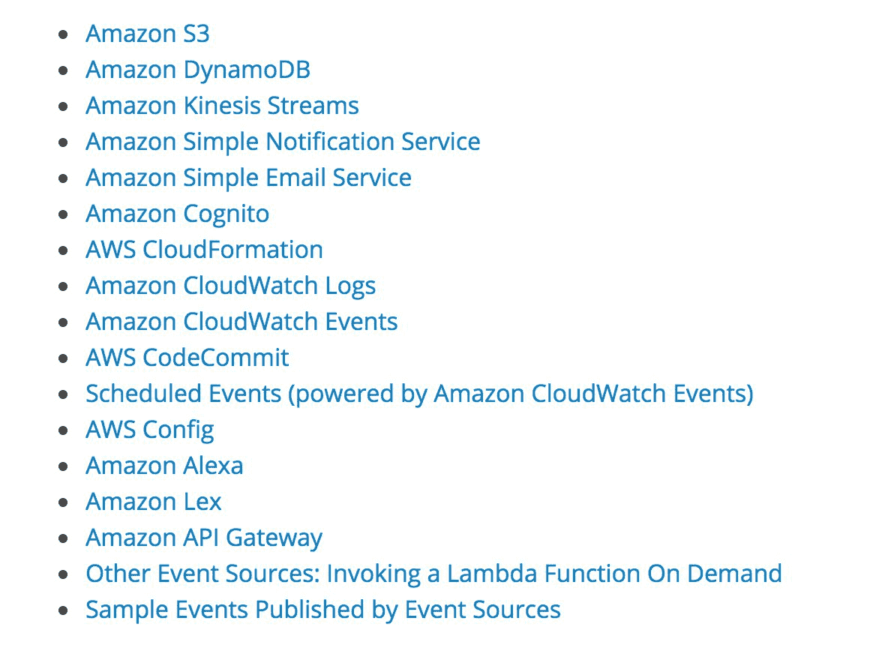
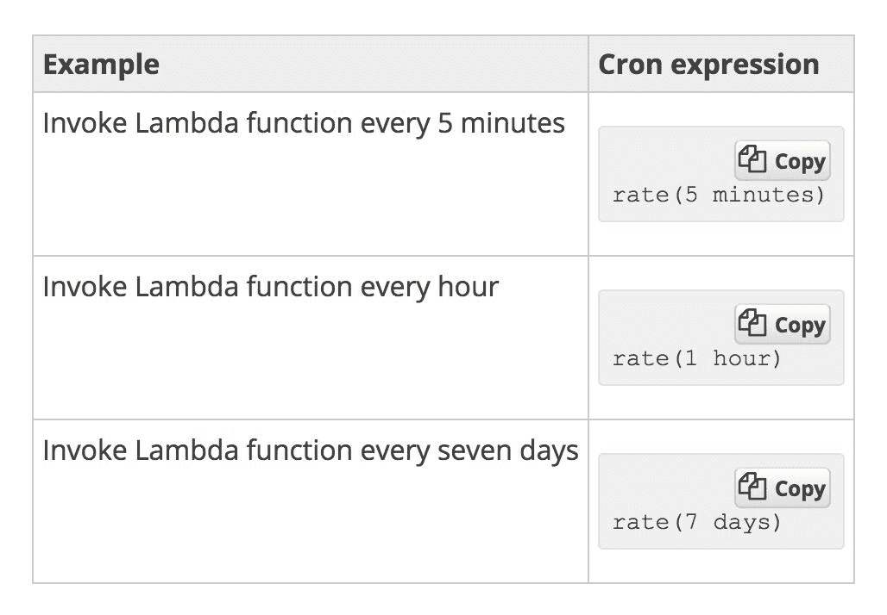

# 无服务器范式

很可能，如果你正在阅读这本书，你已经听说过无服务器范式以及无服务器工程和无服务器架构这些术语。如今，开发人员部署应用程序的方式已经发生了巨大变化，尤其是在数据工程和 Web 开发领域，这得益于**基于事件的架构设计**，也称为**无服务器架构**。

在服务器工作负载完成后，生产环境中出现空闲资源和服务器闲置，或者在等待下一个工作负载到来时闲置，这种情况并不少见。这会在基础设施中引入一些冗余。如果在没有工作负载时不需要闲置资源会怎样？如果资源可以在需要时创建，一旦工作完成就销毁会怎样？

在本章结束时，你将了解无服务器架构和函数即服务是如何工作的，以及如何将它们构建到现有的软件基础设施中。你还将了解什么是微服务，并决定微服务或无服务器操作是否适合你的架构。你还将学习如何使用 Python 在主要的云服务提供商上构建无服务器应用程序，例如**亚马逊网络服务**（**AWS**）和**微软的 Azure**）。

本章将涵盖以下内容：

+   理解无服务器架构

+   理解微服务

+   无服务器架构不一定是实时性的

+   无服务器架构的优缺点

# 理解无服务器架构

无服务器架构或无服务器工程的概念完全围绕理解函数即服务的概念。互联网上对无服务器计算最技术性和准确的定义如下：

"无服务器计算，也称为**函数即服务**（**FAAS**），是一种云计算和代码执行模型，其中云服务提供商完全管理函数容器的启动和停止**平台即服务**（**PaaS**）。"

现在，让我们深入了解该定义的每一部分，以更好地理解无服务器计算范式。我们将从“函数即服务”这个术语开始。这意味着每个无服务器模型都有一个在云上执行的函数。这些函数不过是根据与函数关联的触发器执行的代码块。这是 AWS Lambda 环境中触发器的完整列表：

现在我们来了解管理函数启动和停止的是什么。每当函数通过这些可用的触发器之一被触发时，云服务提供商就会启动一个容器，函数在其中执行。此外，函数成功执行并返回某些内容后，或者如果函数运行时间耗尽，容器就会被移除或销毁。移除容器是为了在需求高峰时和两个触发器之间时间非常短的情况下可以重用容器。现在，我们来到句子的下一部分，即函数的容器。这意味着函数是在容器中启动和执行的。这是 Docker 公司的标准容器定义，该公司使容器概念变得非常流行：

“容器镜像是一个轻量级、独立、可执行的软件包，它包含了运行所需的一切：代码、运行时、系统工具、系统库、设置。”

这有助于将函数的代码、运行时环境等打包成一个单一的部署包，以便无缝执行。**部署包**包含了函数的主要代码文件，以及函数执行所需的所有非标准库。部署包的创建过程与 Python 虚拟环境的创建过程非常相似。

因此，我们可以清楚地看出，在无服务器基础设施的情况下，没有服务器是全天候运行的。这有一个明显的优势，包括不需要专门的运维团队成员来监控服务器。所以，如果有额外的成员，他们可以专注于更好的事情，比如软件研究等等。全天候不运行服务器可以为公司和/或个人节省大量的金钱和资源。这种好处在利用 GPU 实例进行常规工作的机器学习和数据工程团队中表现得非常明显。因此，拥有按需运行的无服务器 GPU 实例可以节省大量的金钱，而无需开发人员或运维团队全天候维护它们。

# 理解微服务

与无服务器概念类似，以微服务为导向的设计策略也最近变得非常流行。尽管这种架构设计在无服务器概念出现之前就已经存在了。正如我们试图从互联网上的技术定义来理解无服务器架构一样，我们也应该尝试对微服务做同样的了解。微服务的技术定义是：

“微服务，也称为**微服务架构**，是一种将应用程序构建为一系列松散耦合的服务集合的架构风格，这些服务实现了业务能力。”

以微服务的形式规划和设计架构有其优点和缺点，就像无服务器架构一样。了解这两者都很重要，以便欣赏和理解在现有架构中何时以及何时不应利用微服务。让我们先看看微服务架构的优点，然后再转向其缺点。

微服务帮助软件团队保持敏捷，并逐步改进。用更简单的术语来说，由于服务之间是解耦的，因此升级和改进一个服务而不会导致其他服务崩溃是非常容易的。例如，在社会网络软件中，如果聊天和动态都是微服务，那么当软件团队试图升级或对聊天服务进行小修小补时，动态服务就不必关闭。然而，在大型的单体系统中，像微服务那样轻松地分解事物是困难的。因此，对架构中的任何小部件的修复或升级都会带来停机时间，修复所需的时间比预期的时间更长。

单体架构的代码库规模本身在出现任何小故障时就会成为进步的阻碍。另一方面，微服务通过保持代码库精简，极大地提高了开发者的生产力，这样他们就可以以非常小的或没有开销和停机时间来修复和改进服务。通过容器，可以更好地利用微服务，容器提供了有效的完整虚拟操作系统环境、隔离的进程以及专用访问底层硬件资源。

然而，微服务也带来了一系列的缺点和劣势，其中主要的是必须处理分布式系统。现在每个服务都是独立生存的，架构师需要弄清楚每个服务如何与其他服务交互，以便制作一个完全功能的产品。因此，服务之间适当的协调以及关于服务之间如何移动数据的决策是一个非常困难的选择，需要由架构师做出。如*一致性*、*CAP 定理*、*维护一致性稳定性*和*连接*等主要分布式问题是一些工程师在为微服务架构设计时需要处理的问题。确保和维护安全性也是分布式系统和微服务中的一个主要问题。您需要为每个微服务决定单独的安全模式和层，以及服务之间数据交互所需的安全决策。

# 无服务器架构不一定是实时性的

无服务器架构通常被用作实时系统，因为它们作为*服务函数*工作，由一组可用的触发器触发。然而，这是一个非常常见的误解，因为无服务器系统同样可以很好地作为实时和批量架构使用。了解如何利用无服务器系统作为批量架构的概念将打开许多工程可能性，因为并非所有工程团队都需要或拥有实时系统来运行。

无服务器系统可以通过以下方式批量处理：

+   触发器中的 cron 功能

+   队列的概念

首先，让我们了解触发器中**cron 功能**的概念。云上的无服务器系统具有设置监控的能力，这使得触发器可以每隔几分钟或几小时触发一次，并且可以设置为常规的 cron 作业。这有助于利用无服务器作为常规 cron 批量作业的概念。在 AWS 环境中，可以通过 AWS CloudWatch 将 Lambda 触发器作为 cron 触发，通过手动输入时间间隔作为输入并输入 cron 格式的时间间隔来设置 cron 的频率：

在构建无服务器批量架构时，也可以利用队列的概念。让我们通过设置一个示例数据管道来理解这一点。假设我们打算构建的系统执行以下任务：

1.  用户或服务将一些数据发送到数据库或更简单的数据存储，例如 AWS 的 S3。

1.  当我的数据存储中有超过 100 个文件时，我们将想要执行一些任务。比如说，对它们进行一些分析，例如，比如计算页数。

这可以通过队列实现，这是我们可以考虑作为示例的更简单的无服务器系统之一。因此，可以这样实现：

1.  用户或服务将数据上传或发送到我们选择的存储。

1.  为此任务配置了一个队列。

1.  可以配置事件到 S3 存储桶或数据存储，以便数据进入存储后，立即向之前配置的队列发送消息。

1.  监控系统可以设置为监控队列中的消息数量。建议使用您使用的云提供商的监控系统，以确保系统完全无服务器。

1.  可以设置监控系统的警报，为这些警报配置一个阈值。例如，当队列中的消息数量达到或超过 100 时，需要触发警报。

1.  这个警报可以作为触发 Lambda 函数的触发器，该函数首先接收队列中的消息，然后使用从消息中接收到的文件名查询数据存储。

1.  一旦文件上的分析完成，处理后的文件可以推送到另一个数据存储进行存储。

1.  在整个任务完成后，运行 Lambda 函数的容器或服务器将被终止，从而使此管道完全无服务器。

# 无服务器系统的优缺点：

既然我们现在已经了解了无服务器架构和管道的样貌，以及它们如何被利用到现有架构中，以及微服务如何帮助保持架构更精简并提高开发者生产力，我们将详细探讨无服务器系统的优缺点，以便软件开发人员和架构师能够决定何时将无服务器范式引入现有系统，何时不引入。

无服务器系统的优点是：

+   **更低的基础设施成本**：通过部署无服务器系统，可以大大优化基础设施成本，因为不需要每天 24 小时不间断运行服务器。由于服务器仅在函数被触发时启动，并在函数成功执行时停止，因此计费仅限于函数运行的那短暂时间。

+   **维护需求减少**：由于上述原因，也不需要持续监控和服务器维护。由于函数和触发器是自动化的，因此无服务器系统几乎不需要维护。

+   **更高的开发者生产力**：由于开发者无需担心停机时间和服务器维护，他们可以专注于并致力于更好的软件挑战，例如扩展和设计功能。

本书剩余部分将向您展示无服务器系统如何改变软件开发的模式。因此，鉴于本章旨在帮助架构师决定无服务器系统是否适合他们的架构，我们现在应考虑无服务器系统的缺点。

无服务器系统的缺点是：

+   **函数的时间限制**：无论执行与否，无论是 AWS 的 Lambda 还是 GCP 的云函数，函数的执行时间上限为 5 分钟。这使得执行重计算变得不可能。然而，这可以通过在 nohup 模式下执行预配工具的 playbook 来解决。这将在本章的后面详细说明。然而，准备 playbook、设置容器以及任何其他事情都应该在 5 分钟的时间限制内完成。当超过 5 分钟的限制时，容器会自动被终止。

+   **对容器环境的无控制权**：开发者无法控制为执行函数而创建的容器环境。操作系统、文件系统等都是由云服务提供商决定的。例如，AWS 的 Lambda 函数是在运行 Amazon Linux 操作系统的容器内执行的。

+   **容器监控**：除了云提供商通过其内部监控工具提供的基本监控能力外，没有机制可以对执行无服务器函数的容器进行详细监控。当将无服务器系统扩展以适应分布式系统时，这变得更加困难。

+   **安全控制缺失**：无法控制数据流的安全性，因为对容器环境的控制非常有限。然而，容器可以在开发者选择的 VPC 和子网中运行，这有助于克服这一缺点。

然而，无服务器系统可以扩展到分布式系统，用于大规模计算，开发者无需担心时间限制。如前所述，这将在接下来的章节中详细讨论。然而，为了了解如何在大规模计算中选择无服务器系统而不是单体系统的一些重要要点，让我们理解在做出该架构决策时需要考虑的一些重要指针。

在将无服务器系统扩展到分布式系统时需要考虑的指针包括：

+   要将无服务器系统扩展到无服务器分布式系统，必须理解 nohup 的概念。这是一个**POSIX**命令，允许程序和进程在后台运行。

+   应确保对 nohup 进程进行适当的记录，包括输出日志和错误日志。这是您进程的唯一信息来源。

+   需要利用如**Ansible**或**Chef**或类似的配置工具来创建一个由在容器中执行无服务器函数的 nohup 模式下的 playbook 启动的主从架构。

+   确保通过主服务器执行的所有任务都得到适当的监控和记录是一个好的做法，因为一旦整个设置执行完毕，就无法检索日志。

+   需要通过云提供商提供的临时凭证服务来确保适当的安全性。

+   应确保系统的适当关闭。在任务执行管道完成后，工作者和主节点应立即自我终止。这非常重要，这也是使系统成为无服务器的关键。

+   通常，临时凭证都有过期时间，对于大多数环境来说，这个时间是 3,600 秒。因此，如果开发者使用临时凭证执行一个预计需要超过过期时间的任务，那么凭证过期就有风险。

+   调试分布式无服务器系统是一项极其困难的任务，原因如下：

    +   监控和调试 nohup 进程极其困难。每次你想调试一个进程时，你必须要么参考进程创建的日志文件，要么使用进程 ID 杀死 nohup 进程，然后手动运行脚本进行调试。

    +   由于任务列表在配置工具中以顺序执行，存在一个风险，即实例可能会因为开发者忘记在开始调试过程之前杀死 nohup 进程而被终止。

    +   由于这是一个分布式系统，不言而喻，在发生任何故障或灾难的情况下，架构应该能够自我修复。一个例子场景可以是，当某个工作进程在处理大量文件时发生故障。现在，整个文件组都丢失了，而且没有恢复的方法。

    +   另一个高级灾难场景可以是，当两个工作服务器在处理大量文件时发生故障。在这种情况下，开发者不知道哪些文件已经成功执行，哪些还没有。

+   确保所有工作实例接收相等量的负载以执行，这样分布式系统中的负载就可以保持均匀，时间和资源得到良好优化，这是一个好习惯。

# 摘要

在本章中，我们学习了什么是无服务器架构。最重要的是，本章帮助架构师决定无服务器是否是他们团队和工程的未来之路，以及如何从现有基础设施过渡/迁移到无服务器范式。我们还探讨了微服务范式以及它们如何帮助构建轻量级和高度敏捷的架构。本章还详细介绍了团队何时应该开始考虑微服务，以及何时可以迁移或将其现有的单体（monoliths）拆分为微服务。

我们随后学习了在无服务器领域构建批处理架构的艺术。最常见的误解之一是，无服务器系统仅适用于实时计算目的。然而，我们已经学会了如何利用这些系统进行批处理计算，从而促进大量应用采用无服务器范式。我们研究了走向无服务器的利弊，以便据此做出更好的工程决策。

在下一章中，我们将深入探讨 AWS Lambda 的工作原理，这是 AWS 云环境中无服务器工程的核心组件。我们将了解触发器的工作方式以及 AWS Lambda 函数的工作原理。你将学习到利用容器执行无服务器函数的概念及其相关的计算工作量。随后，我们还将学习如何配置和测试 Lambda 函数，并在这一过程中理解最佳实践。我们还将涵盖 Lambda 函数的版本控制，就像在代码中版本控制一样，然后为 AWS Lambda 创建部署包，以便开发者能够舒适地使用第三方库以及标准库。
