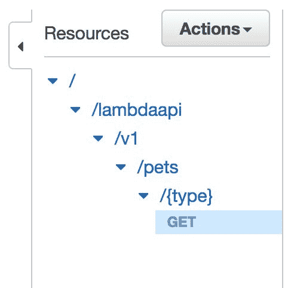

# 部署无服务器 API

到目前为止，我们在学习无服务器应用程序和构建无服务器工程的道路上已经走得很远了。我们已经了解了无服务器范式实际上是什么，AWS Lambda 函数是如何工作的，理解了 AWS Lambda 的内部结构，以及如何详细理解几个触发器的运作方式。我们还进行了几个关于实验触发器并将它们作为端到端无服务器管道部署的迷你项目。

在本章中，您将学习如何使用 AWS Lambda 和 AWS API Gateway 服务构建高效且可扩展的无服务器 API。我们将从了解 API Gateway 的工作原理开始，而不是直接进入构建无服务器 API。之后，我们将了解 API Gateway 和 AWS Lambda 如何相互集成。最后，我们将创建并部署一个完全功能的无服务器 API，作为您从本章学习的一部分。

本章涵盖了以下主题：

+   API 方法与资源

+   设置集成

+   将 Lambda 函数部署为 API 执行

+   处理身份验证和用户控制

# API 方法与资源

在本节中，我们将学习 AWS 的 API 服务，即 API Gateway，并了解用户在控制台创建 API 时可用的组件和设置。我们将逐一介绍所有组件，以更好地理解 API Gateway。创建无服务器 API 的步骤如下：

1.  我们将首先打开 API Gateway 控制台，它看起来如下所示：

1.  在 API Gateway 控制台中，点击“开始使用”按钮以开始创建 API。它将带您进入一个 API 创建向导，并弹出一个提示框说“创建示例 API”：

1.  一旦您点击“确定”按钮，您将被重定向到一个显示 Example API 的页面，从中您可以了解 API 响应的外观：

在本例中，我们构建的 API 是针对宠物商店以及维护商店内的宠物。通过使用 API，您将看到 API 的各个组成部分。API 看起来如下所示：

1.  一旦您点击末尾的导入按钮，您将被重定向到我们刚刚创建的 PetStore (b7exp0d681) API 页面。包含所有组件的 API 页面看起来如下所示：

1.  此 API 中的资源是 GET 和 POST 资源，您可以在其中添加宠物并查看宠物，这些宠物以列表形式提供。我们创建的 API 的资源列表如下：

1.  通过点击第一个 GET 资源，我们可以看到一个从客户端到端点再返回客户端的详细执行流程。资源的执行流程如下所示：

1.  现在，如果我们点击 POST 资源，我们会找到一个类似 POST 资源的模型执行流程。它看起来与 GET 资源的非常相似，然而，在这里 API 端点被提及为一个 URL，因为我们正在尝试从它检索结果。执行模型看起来如下：

在 API 网关中，有一种称为阶段（Stages）的东西，可以用作 API 的版本控制模型。实践中阶段的一些常见名称是**测试**、**开发**和**生产**。阶段菜单看起来如下：

1.  当你点击创建选项时，它将打开阶段的创建向导。这看起来如下：

1.  你可以为阶段名称值选择任何名称，并根据你分配的名称和这个阶段的目的添加阶段描述值。在此之前，你需要部署你创建的 API。这可以在“操作”下拉菜单中作为部署 API 按钮选择，如下所示：

1.  在下一个菜单中，你可以选择阶段名称和其他详细信息，然后最终点击部署按钮，这将使用该特定阶段部署你的 API。这可以如下所示：

部署的阶段看起来如下：

# 设置集成

既然我们已经了解了 AWS API 网关服务在基本层面的工作原理，我们将继续使用这些知识来构建一个端到端的项目，该项目涉及部署一个完全无服务器的 API。

在本节中，我们将从头开始构建和部署一个完全无服务器的 API 函数，同时学习 AWS Lambda 与 AWS API 网关集成的内部结构和其它实现细节。我们将逐步构建无服务器 API。所以，按照以下顺序跟随步骤。程序如下：

1.  首先，我们将开始创建一个新的 API。这可以通过看起来如下所示的 Lambda 控制台完成：

1.  一旦你点击了“+创建 API”按钮，你将被重定向到 API 创建向导，在那里你将被要求输入你打算构建的 API 的名称和描述。目前，我已经将名称输入为`TestLambdaAPI`。然而，你可以自由地添加你想要的任何名称和描述。API 创建控制台看起来如下：

1.  一旦你点击创建 API 按钮，你将被重定向到你创建的 API 页面。API 页面看起来可能如下：

1.  现在我们已经成功创建了一个 API，我们现在将创建 API 中的资源。你可以通过点击操作下拉菜单中的创建资源选项来完成：

1.  这将打开一个资源创建向导，您可以在其中添加我们打算构建的 API 资源的名称和资源路径。创建资源后，点击“创建资源”按钮，以创建相应的 API 资源设置。为了本教程的目的，我将其命名为`LambdaAPI`。然而，您可以给它任何您想要的名称。API 创建向导如下所示：

您刚刚创建的资源现在已在 API 控制台中上线；您可以在“资源”部分下看到它：

1.  您可以创建资源的版本，甚至可以在资源下创建资源。让我们继续创建一个。为此，您需要点击您已经创建的资源。然后，在操作菜单的下拉菜单中点击“创建资源”选项：

1.  这将在我们已创建的资源下打开一个类似的资源创建向导。您可以将该资源命名为`version1`或简单地命名为`v1`，这是一个常规的软件实践。我将其命名为`v1`。然而，您可以将其命名为任何您想要的名称：

现在，我们在已存在的资源`/lambdaapi`下有一个名为`v1`的资源。我们可以在“资源”部分下看到这一点。因此，现在我们的 API 资源层次结构如下所示：

1.  我们将创建一个无服务器 API，用于获取和查询宠物商店中的宠物列表。因此，以下步骤将相应地进行。API 应返回宠物的名称。因此，我们将为此目的创建一个新的宠物资源。我们将在`/v1`资源下创建这个资源：

1.  在`/v1`资源下添加`/pets`资源后，我们的 API 的最终层次结构如下所示：

1.  现在，我们将添加一个自定义资源，使我们能够查询 API。在这里，我们所说的自定义是指，在向该 API 发送请求时，可以添加任何字符串到资源中，API 会在通过 Lambda 代码检查和查询该字符串后返回请求。自定义资源可以与普通资源区分开来，因为它们可以用花括号创建。下面的截图将帮助您了解如何创建它们：

1.  点击“创建资源”按钮后，将为`/pets`创建一个新的自定义子资源。资源的层次结构现在如下所示：

1.  API 的整体结构如下，如以下截图右上角所示：

1.  现在，我们将向这个自定义资源添加方法。由于我们只会查询宠物列表，所以我们只会添加 GET 方法。这可以通过点击{type}资源，然后在顶部面板的“操作”菜单中选择“创建方法”来完成：

1.  这将在{type}资源下创建一个小型下拉式菜单，您可以从可用方法中选择一个方法：

1.  我们需要从可用选项中选择 GET 选项。这看起来如下所示：

1.  选择 GET 选项并点击其旁边的较小勾选按钮后，我们将在我们的{type}资源下创建 GET 方法。现在的层次结构如下所示：

# 部署 Lambda 函数以执行 API

在本节中，我们将查看部署 Lambda 函数的步骤：

1.  当您点击该方法时，GET 方法的详细信息也可以在 API 控制台的右侧看到，如下所示：

1.  在 GET 方法控制台中，点击 Lambda 函数 选项。根据您的偏好选择任何区域。我选择了 us-east-1 区域，如下截图所示：

1.  如预期的那样，它说我们在这个区域没有 Lambda 函数。因此，我们需要继续创建一个。点击创建 Lambda 函数链接。这将带您到我们已熟悉的 Lambda 创建控制台：

1.  从这里，从蓝图列表中选择关键字： hello-world-python 蓝图：

1.  在下一个控制台中，选择 Lambda 函数的基本信息，就像我们在前面的章节中所做的那样：

1.  添加相关详细信息后，点击橙色 创建函数 按钮。这将带您到您刚刚创建的 Lambda 函数页面。代码可以从那里开始编辑：

1.  在函数的代码中，使用此代码而不是蓝图提供的代码：

1.  我们现在已经完成了函数代码的调整。现在，你可以继续保存函数：

1.  现在，返回到 API 网关控制台中的 GET 方法页面。在这里，在 us-east-1 区域的 Lambda 函数下，我开始获取我刚刚创建的 Lambda 函数（serverless-api）作为选项：

1.  点击保存，您将看到一个弹出窗口要求您确认您正在授予 API 网关调用您的 Lambda 函数的权限，您可以通过点击 确定 来确认：

1.  点击 确定 后，您将被重定向到 GET 方法的 数据流页面，看起来如下所示：

# 处理身份验证和用户控制

部署完成后，接下来我们将讨论如何处理身份验证和用户控制。步骤如下：

1.  现在我们已经成功创建了无服务器 API 的骨架，接下来我们将着手处理使其成为一个完全功能 API 所需的细节。我们将从应用映射模板开始。这可以在集成请求菜单中完成。点击集成请求链接将带您到一个看起来像这样的控制台：

1.  如果在同一个控制台中向下滚动一点，您会注意到末尾的身体映射模板部分：

1.  点击身体映射模板将展开该特定部分可用的选项：

1.  选择第二个选项，即当没有定义模板时（推荐）。然后，点击添加映射模板选项，并添加`application/json`，然后点击其旁边的灰色勾选符号：

1.  点击它旁边的灰色勾选符号后，身体映射模板部分的空间将看起来像这样：

1.  现在，在模板文本框中添加以下代码，然后点击文本框下方的保存按钮：

1.  因此，经过所有这些步骤后，结果的身体映射模板部分将看起来像这样：

1.  现在，回到方法执行页面，我们可以看到左侧的 TEST 选项，其下方有一个闪电符号：

1.  点击左侧客户端部分中的 TEST 按钮，以及上方闪电选项，将带您到一个可以测试您刚刚创建的 API 的页面：

1.  现在，在下面的{type}文本框中输入`Exotic`，然后点击底部的 Test 按钮。如果一切顺利，我们应该能看到我们在 Lambda 函数代码中输入的所有异国宠物的列表：

1.  如此一来，我们确实得到了目录中所有异国宠物的列表。因此，这章的内容到此结束，您已经学习了如何从头开始构建一个完整的无服务器 API，包括如何部署它。

1.  此外，如果您想添加额外的安全设置，例如授权和 API 密钥要求，您可以在方法请求菜单中完成：

# 摘要

在本章中，我们学习了如何从头开始构建一个完全无服务器的 API。我们还学习了如何为 API 添加更多资源和方法，以及如何成功地将它部署到多个开发阶段，以及如何添加额外的安全设置，如授权和 API 密钥以用于认证目的。

我们接着学习了如何将 Lambda 函数与我们的 API 网关的 API 服务关联起来，以处理 API 的计算任务。

在下一章中，我们将学习关于无服务器应用程序的日志记录和监控。在那个章节中，我们将详细学习 AWS 的日志记录和监控服务，例如 CloudWatch Metrics、CloudWatch Logs 和 CloudWatch Dashboards，并尝试为我们的无服务器应用程序设置它们。我们还将学习如何使用一些 AWS 服务，从 AWS Lambda 创建一个日志记录和监控管道到这些监控工具。
