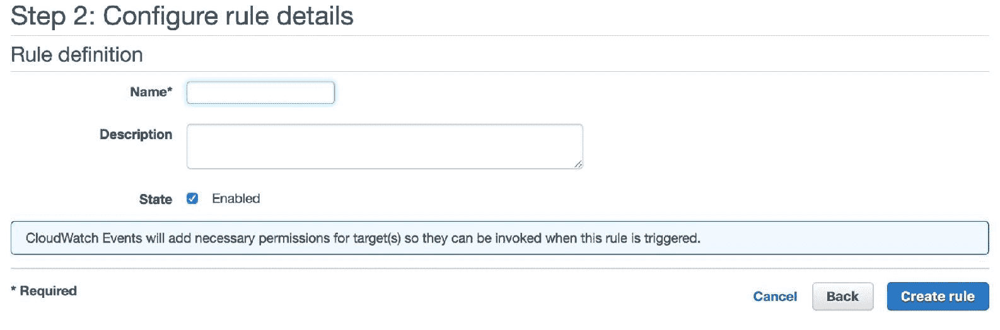
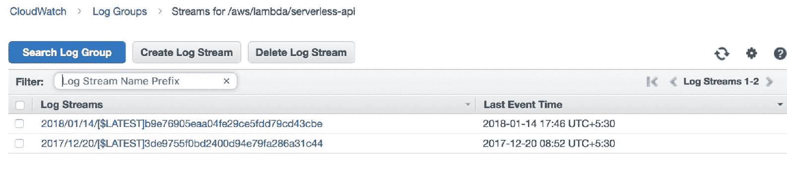

# 第五章：日志和监控

我们已经了解了无服务器架构的概念，并理解了 AWS 无服务器服务 AWS Lambda 的基本和内部结构。我们还创建了一些示例无服务器项目来更好地理解这些概念。在学习过程中，我们还学习了其他几个 AWS 服务的基础知识，例如警报、SNS、SQS、S3 存储桶和 CloudWatch。

在本章中，我们将学习如何为我们构建的无服务器系统进行日志记录和监控。日志记录和监控系统代码和系统非常重要，因为它们帮助我们进行遥测和灾难恢复。日志记录是一个过程，我们将代码或整个架构产生的日志存储起来。监控是一个过程，我们密切监控代码或架构中组件和进程的活动、状态和健康状况。

因此，你将学习如何设置和理解 AWS Lambda 的监控套件，它与 AWS 的监控服务 CloudWatch Dashboards 紧密集成。我们还将学习 AWS 的日志服务，即 CloudWatch Logs 服务。最后，我们还将了解和理解 AWS 的分布式跟踪和监控服务，即 CloudTrail 服务。

本章涵盖以下主题：

+   理解 CloudWatch

+   理解 CloudTrail

+   CloudWatch 中的 Lambda 指标

+   CloudWatch 中的 Lambda 日志

+   Lambda 中的日志语句

# 理解 CloudWatch

如前所述，CloudWatch 是 AWS 的日志和监控服务。我们已经查看并学习了 CloudWatch Alarms，它是 CloudWatch 的一个子功能。现在我们将学习该服务的图形套件。AWS 环境中的几乎每个服务都有一种方式将其日志和指标发送到 CloudWatch 进行日志记录和监控。每个服务可能都有几个可以监控的指标，这取决于功能。

同样，AWS Lambda 也有一些指标，例如调用次数、调用运行时间等，它将它们发送到 CloudWatch。值得注意的是，开发者也可以将自定义指标发送到 CloudWatch。因此，在以下步骤中，我们将学习 AWS CloudWatch 对应于 AWS Lambda 的不同部分和功能：

1.  首先，让我们看看 CloudWatch 控制台的外观，并通过在控制台中进行导航来感受它。[控制台链接](https://signin.aws.amazon.com/signin?redirect_uri=https%3A%2F%2Fconsole.aws.amazon.com%2Fcloudwatch%2F%3Fstate%3DhashArgs%2523%26isauthcode%3Dtrue&client_id=arn%3Aaws%3Aiam%3A%3A015428540659%3Auser%2Fcloudwatch&forceMobileApp=0):


1.  如我们所见，CloudWatch 控制台中有很多信息。因此，我们现在将逐一尝试理解每个组件。在左侧，我们可以看到一个选项列表，包括仪表板、警报、计费等。我们将尝试理解它们以及它们的功能，作为理解 CloudWatch 控制台的一部分。

1.  在这里，仪表板是用户可以配置的 CloudWatch 指标面板。例如，用户可能希望将一组特定的服务器（EC2）指标放在一个地方，以便更好地监控它们。这就是 AWS CloudWatch 仪表板发挥作用的地方。当您点击左侧的仪表板选项时，您可以看到仪表板控制台，如下所示：


1.  让我们继续创建一个新的仪表板，点击控制台左上角的蓝色创建仪表板按钮。以下框将出现：


1.  这将带您进入下一步，您将在此处被要求为仪表板选择一个小部件类型。目前有四种类型的小部件可供选择。小部件选择屏幕看起来如下：


1.  为了本教程的目的，我选择了线条样式小部件。您可以选择适合您绘图风格和所需监控的任何小部件。一旦您选择了一个小部件样式并点击蓝色的配置按钮，您将被重定向到一个向导，您将在此处被要求添加一个指标，如下面的截图所示：


1.  在底部选择一个可用的指标，它将被添加到小部件中。一旦您完成选择指标，点击页面右下角的蓝色创建小部件按钮，如下面的截图所示：


1.  现在，您可以在仪表板部分看到您刚刚创建的仪表板：


1.  我们已经成功学习和创建了 AWS CloudWatch 仪表板。我们现在将学习关于 CloudWatch 事件。在前面的章节中，我们已经学习了 CloudWatch 警报的功能以及如何创建和使用它们。

1.  点击左侧的 CloudWatch 菜单中的事件链接。您将被重定向到 CloudWatch 事件的页面，如下面的截图所示：


1.  一旦您点击蓝色的创建规则按钮，您将被重定向到事件创建向导，其外观如下：


1.  事件可以分为两种类型，即事件模式和计划，每种类型都有不同的用途。在这里，我们将只学习计划类型，因为它对于安排 Lambda 函数非常有用：


1.  速率可以设置为分钟、小时或天，或者可以设置为 cron 表达式，您可以选择您舒适的方式。现在，需要选择目标。目标可以是任何有效的 Lambda 函数，如下面的下拉菜单所示：


1.  一旦您选择了函数，您就可以点击底部的蓝色“配置详情”。它将带您到如下截图所示的配置规则详情页面：



1.  一旦您输入您想要创建的规则名称和描述，您就可以点击底部的蓝色“创建规则”按钮。这将成功创建一个事件，并在您的 CloudWatch 控制台中反映出来：


我们已成功为 Lambda 函数添加了一个 cron 事件，这意味着 Lambda 将按照用户在事件设置中指定的定期间隔被调用。

1.  现在，我们将尝试理解 AWS CloudWatch 的日志功能。这是 Lambda 函数存储日志的地方。您可以通过点击左侧菜单中的“日志”链接来访问 CloudWatch 日志控制台：


1.  我们可以看到在整个书籍过程中创建的所有 Lambda 函数的完整日志列表。当您点击一个日志组时，您可以找到更多关于它的详细信息，以及自定义选项。每个日志流都与日志关联的 Lambda 函数的调用：



1.  您还可以利用 CloudWatch 提供的附加功能来处理日志数据，这可以在日志组中的“操作”下拉菜单中看到：


1.  最后，我们将通过探索和学习 CloudWatch 指标来结束本节。您可以通过点击 CloudWatch 控制台左侧的“指标”选项来访问指标控制台：


1.  您可以选择菜单底部的任何选项来绘制指标。在本教程中，我添加了一个 Lambda 指标，即函数中的错误数量，`serverless-api`：


# 理解 CloudTrail

CloudTrail 是 AWS 的另一个监控服务，您可以在其中查看您 AWS 账户中发生的所有事件和跟踪。与 CloudWatch 服务相比，该服务在记录和存储事件和跟踪方面更为详细。

因此，我们将按以下步骤探索和学习此服务：

1.  您可以通过访问 [console.aws.amazon.com/cloudtrail/](https://signin.aws.amazon.com/signin?redirect_uri=https%3A%2F%2Fconsole.aws.amazon.com%2Fcloudtrail%2Fhome%3Fstate%3DhashArgs%2523%26isauthcode%3Dtrue&client_id=arn%3Aaws%3Aiam%3A%3A015428540659%3Auser%2Fcloudtrail&forceMobileApp=0) 来访问 AWS CloudTrail 的仪表板：


1.  当您点击 CloudTrail 菜单中的“事件历史”按钮时，可以在左侧看到您 AWS 账户中事件列表。事件历史页面看起来是这样的：


1.  CloudTrail 的第三个功能是跟踪。用户可以为他们的 AWS 服务设置跟踪，例如 Lambda。已设置的跟踪可以在跟踪仪表板中找到。可以通过点击左侧菜单中的“跟踪”选项进入跟踪控制台：


1.  现在，让我们了解如何在 CloudTrail 仪表板中创建跟踪。您可以去 CloudTrail 的主仪表板，点击蓝色“创建跟踪”按钮。这将带您到跟踪创建向导：


1.  您可以在此处输入跟踪的详细信息。对于“将跟踪应用于所有区域”和“管理事件”选项，您可以保留默认选项：


1.  现在，继续到下一个设置，选择 Lambda 选项，并在选项列表中点击“记录所有当前和未来的函数”。这将确保我们的所有 Lambda 函数都通过 CloudTrail 正确记录：


1.  现在，在最终的“存储位置”选项中，选择一个 S3 存储桶来存储 CloudTrail 日志。这可以是一个已存在的存储桶，或者您也可以要求 CloudTrail 为此创建一个新的存储桶。我正在使用一个现有的存储桶：


1.  在所有细节和设置都相应配置完毕后，您可以在蓝色“创建跟踪”按钮上点击以创建跟踪。现在，您可以在 CloudTrail 仪表板中看到您刚刚创建的跟踪，如下面的截图所示：


1.  现在，当您点击您刚刚创建的跟踪时，您可以看到它配置的所有详细信息，如下面的截图所示：


1.  您还可以注意到一个非常有趣的功能，它允许您配置 CloudWatch 日志以及 SNS 来通知您任何特定的活动，例如当 Lambda 函数中发生错误时：


1.  最后，您还可以像对其他 AWS 服务一样，为跟踪添加标签：


1.  此外，让我们了解如何为我们的跟踪配置 CloudWatch 日志。因此，为此您需要点击上方标签部分以上的 CloudWatch 日志部分中的蓝色“配置”按钮：


1.  当您点击“继续”时，它将带您到创建向导，在那里您需要根据您的 IAM 角色设置相应地配置权限。为了本教程的目的，我选择了以下截图所示的“创建新的 IAM 角色”选项：


1.  在完成 IAM 角色设置配置后，您可以在底部点击蓝色的“允许”按钮。经过几秒钟的验证后，CloudWatch 日志配置完成，您可以在同一 CloudWatch 日志部分中看到：


# CloudWatch 中的 Lambda 指标

既然我们已经学习和理解了 CloudWatch 和 CloudTrail 服务在日志和监控方面的运作方式，我们将继续尝试为我们的 Lambda 函数实现它们。在本节中，你将了解 Lambda 拥有的指标类型，这些指标由 CloudWatch 监控，以及如何创建包含所有这些指标的仪表板。

与本章和本书前面的部分类似，我们将尝试以下步骤来理解这些概念：

1.  当你导航到你的 AWS Lambda 控制台时，你将看到你已创建的 Lambda 函数，在可用函数列表中：


1.  当你点击函数时，你将看到顶部有两个可用的选项：配置和监控。导航到监控部分。你将看到一个指标仪表板，其中包含以下内容：

    +   调用

    +   持续时间

    +   错误

    +   限制

    +   迭代器年龄

    +   死信队列错误


调用和持续时间


错误和限制


迭代器年龄和死信队列错误

1.  让我们详细理解每一个。第一个指标是调用指标，它在*x*轴上有时间，在*y*轴上有 Lambda 函数的调用次数。这个指标帮助我们了解 Lambda 函数何时以及被调用了多少次：


当你点击“跳转到日志”时，它会带你进入 Lambda 调用的 CloudWatch 日志控制台，看起来如下所示：


当你点击“跳转到指标”选项时，它将带你去该特定指标的 CloudWatch 指标仪表板，它为你提供了一个更定制化和更细粒度的同一指标的图表，看起来如下所示：


1.  Lambda 监控仪表板中的第二个指标是持续时间指标，它告诉我们 Lambda 函数每次调用的持续时间。它也有时间作为*X*轴，以毫秒为单位，在*Y*轴上的持续时间时间。它还告诉你 Lambda 函数在一定时间内的最大、平均和最小持续时间：


1.  再次点击“跳转到日志”按钮将带你去与上一个指标相同的页面。点击“跳转到指标”按钮将带你去持续时间指标的 CloudWatch 指标页面，看起来如下所示：


1.  第三个指标是错误指标，它帮助我们关注 Lambda 函数调用中的错误。*Y*轴是错误数量，而*X*轴是时间线：


1.  通过点击“跳转到指标”链接，你可以看到相同指标的 CloudWatch 仪表板：


1.  第四个指标是节流。这个指标统计了您的 Lambda 函数被节流（即函数的并发执行次数超过了每个区域设置的 1,000 个限制）的次数。我们不会经常遇到这个指标，因为我们在这本书中构建的 Lambda 函数示例都远远在并发限制之内：


1.  通过点击“跳转到指标”链接，我们也可以在我们的 CloudWatch 指标仪表板中看到这个指标：


1.  第五个指标是迭代器年龄。这个指标仅适用于由 DynamoDB 流或 Kinesis 流触发的函数。它给出了函数处理最后一条记录的年龄：


“跳转到指标”链接将带您到这个指标的 CloudWatch 指标仪表板：


1.  第六个也是最后一个指标是死信队列错误指标。这个指标给出了在向死信队列发送消息（失败的事件负载）时发生的错误数量。大多数情况下，错误是由于权限配置错误和超时引起的：


“跳转到指标”链接将带您到同一指标的 CloudWatch 指标仪表板：


# Lambda 的日志在 CloudWatch 中

到目前为止，我们已经详细了解了 AWS Lambda 的指标。现在，我们将继续了解 Lambda 函数的日志。和往常一样，我们将通过以下步骤来理解它们：

1.  AWS Lambda 函数的日志存储在 CloudWatch 的日志服务中。您可以通过点击主 CloudWatch 仪表板上的日志仪表板来访问 CloudWatch 日志服务。

1.  当您在列表中点击 serverless-api 的日志，/aws/lambda/serverless-api，我们将进入 serverless API 的日志流，看起来像这样：


1.  这里每个日志流都是一个 Lambda 调用。所以，每当你的 Lambda 函数被调用时，它都会在这里创建一个新的日志流。如果调用是 Lambda 重试过程的一部分，那么该特定调用的日志将被写入最新的日志流下。单个日志流可以包含多个细节。但首先，让我们看看一个特定的日志流是什么样子的：


1.  此外，如果您仔细观察，您还可以发现 Lambda 的日志还提供了关于 Lambda 函数调用持续时间、计费持续时间和函数使用的内存的信息。这些指标有助于更好地理解我们函数的性能，以及进行进一步的优化和微调：


1.  CloudWatch 日志中有几个列可供选择，这些列在上面的截图中没有显示。这些是可用的选项：


因此，当你选择更多的这些选项时，你将在仪表板上看到它们作为列。这些在执行对 Lambda 函数的更精细的调试时非常有用：


# Lambda 中的日志记录

清晰地记录注释和错误始终是良好的软件开发实践。因此，我们现在将了解如何在 Lambda 函数内部进行日志记录。在 Lambda 函数内部进行日志记录大致有两种方式。我们现在将通过以下步骤中的示例来学习和理解它们：

1.  第一种方式是使用 Python 的`logging`库。这被广泛用作 Python 脚本中日志记录的标准实践。我们将编辑我们之前为无服务器 API 编写的代码，并在其中添加日志语句。代码将看起来像这样：


上一张截图中的代码如下：

```py
import logging
logger = logging.getLogger()
logger.setLevel(logging.INFO)
def lambda_handler(event, context):
 mobs = {
 "Sea": ["GoldFish", "Turtle", "Tortoise", "Dolphin", "Seal"],
 "Land": ["Labrador", "Cat", "Dalmatian", "German Shepherd",
 "Beagle", "Golden Retriever"],
 "Exotic": ["Iguana", "Rock Python"]
 }

 logger.info('got event{}'.format(event))
 logger.error('something went wrong')

 return 'Hello from Lambda!'
 #return {"type": mobs[event['type']]}
```

1.  现在，当你保存后运行 Lambda 函数，你可以在绿色字体中看到成功的执行语句，看起来像这样：


1.  当你点击“详情”选项时，你可以清楚地看到正在执行的日志语句：


1.  记录日志语句的另一种方式是简单地使用 Python 中的`print`语句。这是在 Python 脚本中打印日志语句最常见的方式。因此，我们将在我们的函数代码中添加一个`Hello from Lambda`的打印语句，并查看我们是否能在 Lambda 执行中获得日志：


这个 Lambda 函数的代码如下：

```py
 def lambda_handler(event, context):
 mobs = {
     "Sea": ["GoldFish", "Turtle", "Tortoise", "Dolphin", "Seal"],
     "Land": ["Labrador", "Cat", "Dalmatian", "German Shepherd",
     "Beagle", "Golden Retriever"],
     "Exotic": ["Iguana", "Rock Python"]
}
print 'Hello from Lambda!'
return 1
#return {"type": mobs[event['type']]}
```

1.  当我们点击“测试”以执行代码时，我们应该看到一个绿色的消息，这表示执行成功：


1.  同样，就像我们之前做的那样，点击“详情”切换按钮将给出完整的执行日志：


1.  我们也可以看到`Hello from Lambda`的消息。在我们的 Lambda 函数可用的两种日志记录选项中，始终首选使用第一种，即通过 Python 的日志模块。这是因为该模块提供了更大的灵活性，并有助于你区分 info、error 和 debug 日志。

# 摘要

在本章中，我们学习了 AWS 的监控和日志记录功能。我们还学习了 AWS 环境中可用的监控和日志记录工具。我们还学习了如何监控我们的 Lambda 函数以及如何为我们的 Lambda 函数设置日志记录。

我们已经了解了行业遵循的日志和监控实践，以及一个人如何在 Lambda 函数内部记录语句的各种方式。

在下一章中，我们将学习如何将我们的无服务器架构扩展为分布式，以便能够处理大量工作负载，同时仍然保留无服务器设置的优势。
