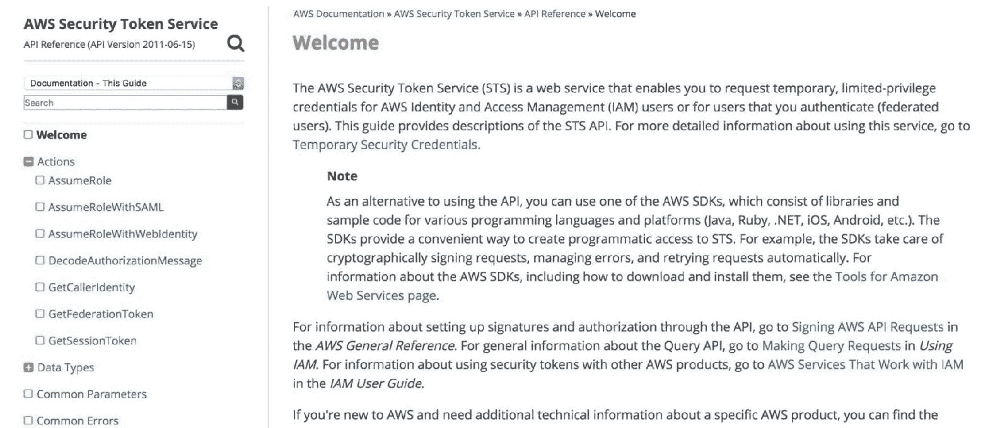

# 扩展无服务器架构

到目前为止，我们已经学习了如何构建、监控和记录无服务器函数。在本章中，我们将学习有助于扩展无服务器应用以实现分布式，并能够以高安全性和吞吐量处理重负载的概念和工程技术。在本章中，我们还将使用一些第三方工具，如 Ansible，来扩展我们的 Lambda 函数。我们将扩展 Lambda 函数以生成分布式无服务器架构，这将涉及生成多个服务器（或 AWS 环境中的实例）。因此，在遵循本章中提到的示例时，您需要记住这一点。

本章假设您对配置工具（如 **Ansible**、**Chef** 等）有一定的了解。您可以在各自的网站上快速查阅或更新这些知识，那里有快速教程。如果没有，您可以安全地跳过本章，继续阅读下一章。

本章包含五个部分，涵盖了扩展无服务器架构的所有基础知识，并为您构建更大、更复杂的无服务器架构奠定了基础：

+   第三方编排工具

+   服务器创建和终止

+   安全最佳实践

+   扩展的困难

+   处理困难

# 第三方编排工具

在本节中，我们将学习并精通基础设施配置和编排的概念。我们将探索几个工具，即 Chef 和 Ansible。让我们按照以下步骤开始：

1.  我们将从了解 Chef 开始。您可以访问 Chef 的官方网站 [`www.chef.io/chef/`](https://www.chef.io/chef/)：


1.  Chef 提供了一套非常好的教程，可以帮助您快速上手。这些教程以 10 到 15 分钟的小教程形式组织，便于阅读。前往 [`learn.chef.io/`](https://learn.chef.io/) 访问它们：


1.  要开始学习基础设施配置和编排，您可以参考 Chef 文档，网址为 [`docs.chef.io/`](https://docs.chef.io/)。页面看起来是这样的：


1.  您可以在文档中的 AWS 驱动资源页面了解如何通过 Chef 与各种 AWS 服务交互：[`docs.chef.io/provisioning_aws.html`](https://docs.chef.io/provisioning_aws.html)。页面看起来是这样的：


1.  您也可以参考 aws Cookbook 来达到同样的目的。这个资源提供了非常好的文档和 API，用于与多个 AWS 服务交互。该文档的网址是 [`supermarket.chef.io/cookbooks/aws`](https://supermarket.chef.io/cookbooks/aws)。页面看起来是这样的：


1.  当您在食谱标题下方向下滚动时，可以看到食谱的详细描述：


1.  另一个用于配置和编排软件资源的优秀工具是 Ansible。这有助于软件工程师通过 *yaml 脚本* 自动化他们基础设施的多个部分。与 Chef 环境相似，这些脚本被称为 **cookbooks**。

1.  我们将在后续章节中使用这个工具来学习如何在我们的基础设施中配置资源。Ansible 的文档可以在以下网址找到：[`docs.ansible.com/`](http://docs.ansible.com/)：


1.  本书不涉及 ANSIBLE TOWER 产品。我们将学习并使用 ANSIBLE CORE，这是 Ansible 及其母公司 Red Hat 的旗舰产品。

1.  Ansible 提供了一个非常有帮助的视频，可以帮助你更好地理解和掌握这个工具。你可以在文档页面点击“快速入门视频”链接来访问它：


1.  观看视频后，你可以直接从文档本身开始理解产品。Ansible 的完整文档可以在以下网址访问：[`docs.ansible.com/ansible/latest/index.html`](http://docs.ansible.com/ansible/latest/index.html)：


1.  EC2 模块是我们将用于配置和编排我们的 AWS EC2 实例的工具。本部分的文档对启动和终止 EC2 实例、添加和挂载卷有非常清晰的解释和演示；它还使我们能够将我们的 EC2 实例配置到我们自己的特定 **虚拟私有云**（**VPC**）和/或我们自己的 **安全组**（**SGs**）中。EC2 文档屏幕看起来像这样：


1.  你可以在以下 Ansible 核心文档的网址找到它：[`docs.ansible.com/ansible/latest/ec2_module.html`](http://docs.ansible.com/ansible/latest/ec2_module.html)。当你继续向下滚动时，你可以看到如何使用 Ansible 的 EC2 模块来完成各种与 AWS EC2 实例相关的任务的几个示例。以下是一些示例：


# 服务器创建和终止

在本章中，我们将学习如何使用一些第三方工具，这些工具将帮助我们构建所需的架构。与本章的所有部分一样，信息将被分解成步骤：

1.  我们将首先学习的是 Ansible。它是一个配置和编排工具，有助于自动化基础设施的多个部分。根据你阅读本书的时间，Ansible 项目的首页（[`www.ansible.com/`](https://www.ansible.com/））看起来可能如下所示：


1.  Ansible 的安装过程因操作系统而异。以下是一些流行操作系统的安装说明：

+   +   **针对 Ubuntu**:

```py
sudo apt-get update
sudo apt-get install software-properties-common
sudo apt-add-repository ppa:ansible/ansible
sudo apt-get update
sudo apt-get install ansible
```

+   +   **针对 Linux**:

```py
git clone https://github.com/ansible/ansible.git
cd ./ansible
make rpm
sudo rpm -Uvh ./rpm-build/ansible-*.noarch.rpm
```

+   +   **针对 OS X**:

```py
sudo pip install ansible
```

1.  现在，我们将了解**nohup**的概念。因此，你不需要保持对服务器的持久 SSH 连接来运行`nohup`命令，因此我们将使用这项技术来运行我们的主-服务器架构（了解更多关于 nohup 的信息，请参阅：[`en.wikipedia.org/wiki/Nohup`](https://en.wikipedia.org/wiki/Nohup))。

让我们看看维基百科上的定义（从撰写本书的时间），**nohup**是一个 POSIX 命令，用于忽略 HUP（挂起）信号。按照惯例，HUP 信号是终端警告依赖进程注销的方式。

1.  我们现在将学习如何从 Ansible 配置服务器，SSH 进入它们，在它们中运行一个简单的`apt-get update`任务，并终止它们。通过这个过程，你将学习如何编写 Ansible 脚本，以及了解 Ansible 如何处理云资源的配置。以下 Ansible 脚本将帮助你理解如何配置 EC2 实例：

```py
- hosts: localhost
  connection: local
  remote_user: test
  gather_facts: no

  environment:
    AWS_ACCESS_KEY_ID: "{{ aws_id }}"
    AWS_SECRET_ACCESS_KEY: "{{ aws_key }}"

    AWS_DEFAULT_REGION: "{{ aws_region }}"

  tasks: 
- name: Provisioning EC2 instaces 
  ec2: 
    assign_public_ip: no
    aws_access_key: "{{ access_key }}"
    aws_secret_key: "{{ secret_key }}"
    region: "{{ aws_region }}"
    image: "{{ image_instance }}"
    instance_type: "{{ instance_type }}"
    key_name: "{{ ssh_keyname }}"
    state: present
    group_id: "{{ security_group }}"
    vpc_subnet_id: "{{ subnet }}"
    instance_profile_name: "{{ Profile_Name }}"
    wait: true
    instance_tags: 
      Name: "{{ Instance_Name }}" 
    delete_on_termination: yes
    register: ec2 
    ignore_errors: True
```

`{{ }}`括号中的值需要根据你的方便和规格进行填写。前面的代码将在你的控制台中创建一个 EC2 实例，并根据`{{ Instance_Name }}`部分中给出的规格为其命名。

1.  `ansible.cfg`文件应包含所有提供关于控制路径、代理转发细节以及 EC2 实例密钥路径的指令的详细信息。`ansible.cfg`文件应如下所示：

```py
[ssh_connection]
ssh_args=-o ControlMaster=auto -o ControlPersist=60s -o ControlPath=/tmp/ansible-ssh-%h-%p-%r -o ForwardAgent=yes

[defaults]
private_key_file=/path/to/key/key.pem
```

1.  当你使用`ansible-playbook -vvv < name-of-playbook >.yml`执行此代码时，你可以在你的 EC2 控制台中看到正在创建的 EC2 实例：


1.  现在，我们将通过 Ansible 终止我们刚刚创建的实例。这也会在 Ansible 脚本中完成，类似于我们配置实例的方式。以下代码会这样做：

```py
  tasks:
    - name: Terminate instances that were previously launched
      connection: local
      become: false
      ec2:
        state: 'absent'
        instance_ids: '{{ ec2.instance_ids }}'
        region: '{{ aws_region }}'
      register: TerminateWorker
      ignore_errors: True
```

1.  现在，你可以在控制台中看到实例正在被终止。请注意，代码在任务（如配置和终止实例）之前是相同的，所以你可以从配置任务复制粘贴：


因此，我们已经成功地学习了如何通过 Ansible 脚本配置和终止 EC2 实例。我们将使用这些知识进行配置，并同时终止 EC2 实例。

1.  在我们之前使用的 yaml 脚本中的配置代码上进行微小修改，我们可以通过简单地添加`count`参数同时配置多个服务器（EC2 实例）。以下代码将根据`jinja 模板`中指定的数量配置实例。在我们的例子中，它是`ninstances`：

```py
- hosts: localhost
  connection: local
  remote_user: test
  gather_facts: no

  environment:
    AWS_ACCESS_KEY_ID: "{{ aws_id }}"
    AWS_SECRET_ACCESS_KEY: "{{ aws_key }}"

    AWS_DEFAULT_REGION: "{{ aws_region }}"

  tasks: 
- name: Provisioning EC2 instaces 
  ec2: 
    assign_public_ip: no
    aws_access_key: "{{ access_key }}"
    aws_secret_key: "{{ secret_key }}"
    region: "{{ aws_region }}"
    image: "{{ image_instance }}"
    instance_type: "{{ instance_type }}"
    key_name: "{{ ssh_keyname }}"
    count: "{{ ninstances }}"
    state: present
    group_id: "{{ security_group }}"
    vpc_subnet_id: "{{ subnet }}"
    instance_profile_name: "{{ Profile_Name }}"
    wait: true
    instance_tags: 
      Name: "{{ Instance_Name }}" 
    delete_on_termination: yes
    register: ec2 
```

1.  现在，既然我们的 Ansible 脚本已经准备好了，我们将使用它从 Lambda 函数启动我们的基础设施。为此，我们将利用我们对 nohup 的知识。

1.  在你的 Lambda 函数中，你只需要编写创建服务器的逻辑，然后使用`paramiko`库进行一些基本的安装，然后以 nohup 模式运行 Ansible 脚本，如下所示：

```py
import paramiko
import boto3
import logging

logger = logging.getLogger(__name__)
logger.setLevel(logging.CRITICAL)
region = 'us-east-1'
image = 'ami-<>'
ubuntu_image = 'ami-<>'
keyname = '<>'

def lambda_handler(event, context):
    credentials = {<>}
    k = paramiko.RSAKey.from_private_key_file("<>")
        c = paramiko.SSHClient()
    c.set_missing_host_key_policy(paramiko.AutoAddPolicy())
    logging.critical("Creating Session")
    session = boto3.Session(credentials['AccessKeyId'], 
    credentials['SecretAccessKey'],
    aws_session_token=credentials['SessionToken'], region_name=region)
    logging.critical("Created Session")
    logging.critical("Create Resource")
    ec2 = session.resource('ec2', region_name=region)
    logging.critical("Created Resource")
    logging.critical("Key Verification")

    key = '<>'
    k = paramiko.RSAKey.from_private_key_file(key)
    c = paramiko.SSHClient()
    c.set_missing_host_key_policy(paramiko.AutoAddPolicy())
    logging.critical("Key Verification done")
    # Generate Presigned URL for downloading EC2 key from    an S3 bucket into master
    s3client = session.client('s3')

# Presigned url for downloading pem file of the server from an S3 bucket
    url = s3client.generate_presigned_url('get_object',     Params={'Bucket': '<bucket_name>', 'Key': '<file_name_of_key>'},
ExpiresIn=300)
    command = 'wget ' + '-O <>.pem ' + "'" + url + "'"
    logging.critical("Create Instance")

while True:
    try:
        logging.critical("Trying")
        c.connect(hostname=dns_name, username="ubuntu", pkey=k)
    except:
        logging.critical("Failed")
    continue
        break
    logging.critical("connected")

    if size == 0:
        s3client.upload_file('<>.pem', '<bucket_name>', '<>.pem')
    else:
        pass
    set_key = credentials['AccessKeyId']
    set_secret = credentials['SecretAccessKey']
    set_token = credentials['SessionToken']

# Commands to run inside the SSH session of the server
    commands = [command,
"sudo apt-get -y update",
"sudo apt-add-repository -y ppa:ansible/ansible",
"sudo apt-get -y update",
"sudo apt-get install -y ansible python-pip git awscli",
"sudo pip install boto markupsafe boto3 python-dateutil     futures",
"ssh-keyscan -H github.com >> ~/.ssh/known_hosts",
"git clone <repository where your ansible script is> /home/ubuntu/<>/",
"chmod 400 <>.pem",
"cd <>/<>/; pwd ; nohup ansible-playbook -vvv provision.yml > ansible.out 2> ansible.err < /dev/null &"]

# Running the commands
    for command in commands:
        logging.critical("Executing %s", command)
stdin, stdout, stderr = c.exec_command(command)
    logging.critical(stdout.read())
    logging.critical("Errors : %s", stderr.read())
        c.close()
    return dns_name
```

# 安全最佳实践

确保高级别的安全性一直是微服务的一个主要问题。在设计安全层时，你需要考虑多个软件级别。工程师需要为每个服务定义安全协议，然后还要定义服务之间以及数据交互和传输的协议。

在设计分布式无服务器系统之前，你必须牢记所有这些方面，其中（几乎）每个 Ansible 任务都是一个微服务。在本节中，我们将了解如何设计安全协议，并使用 AWS 的一些内置服务来监控它们。

我们将逐步了解如何为我们的无服务器架构编写安全协议：

1.  首先，每次你在 AWS Python 脚本内部创建会话时使用 **Boto**，尽量使用 **AWS Secure Token Service**（**STS**）创建临时凭证，它为特定时间段创建临时凭证：



你可以在以下位置查看 STS 的文档：[`docs.aws.amazon.com/STS/latest/APIReference/Welcome.html`](https://docs.aws.amazon.com/STS/latest/APIReference/Welcome.html)。

1.  STS 服务的 AssumeRole API 允许程序员在代码中假定 IAM 角色：


你可以在以下页面找到它的文档：[`docs.aws.amazon.com/STS/latest/APIReference/API_AssumeRole.html`](https://docs.aws.amazon.com/STS/latest/APIReference/API_AssumeRole.html)

1.  你可以在 `boto3` 文档中参考此 Python 版本：


此文档可以在以下位置找到：[`boto3.readthedocs.io/en/latest/reference/services/sts.html`](http://boto3.readthedocs.io/en/latest/reference/services/sts.html)。

1.  滚动页面，你可以找到 AssumeRole API 在 Python 中的用法：


1.  应当注意适当的安全措施，以确保微服务之间以及微服务与其他 AWS 资源之间的数据交换在认证下安全进行。例如，开发者可以配置 S3 桶以限制诸如未加密上传、下载和不安全的文件传输等操作。桶策略可以编写如下，以确保所有这些事项都得到妥善处理：

```py
{
    "Version": "2012-10-17",
    "Id": "PutObjPolicy",
    "Statement": [
    {
        "Sid": "DenyIncorrectEncryptionHeader",
        "Effect": "Deny",
        "Principal": "*",
        "Action": "s3:PutObject",
        "Resource": "arn:aws:s3:::<bucket_name>/*",
        "Condition": {
            "StringNotEquals": {
                "s3:x-amz-server-side-encryption": "aws:kms"
            }
        }
    },
    {
        "Sid": "DenyUnEncryptedObjectUploads",
        "Effect": "Deny",
        "Principal": "*",
        "Action": "s3:PutObject",
        "Resource": "arn:aws:s3:::<bucket_name2>/*",
        "Condition": {
            "Null": {
                "s3:x-amz-server-side-encryption": "true"
            }
        }
    },
    {
        "Sid": "DenyNonSecureTraffic",
        "Effect": "Deny",
        "Principal": "*",
        "Action": "s3:*",
        "Resource": "arn:aws:s3:::<bucket_name>/*",
        "Condition": {
            "Bool": {
                "aws:SecureTransport": "false"
            }
        }
    },
    {
        "Sid": "DenyNonSecureTraffic",
        "Effect": "Deny",
        "Principal": "*",
        "Action": "s3:*",
        "Resource": "arn:aws:s3:::<bucket_name2>/*",
        "Condition": {
            "Bool": {
                "aws:SecureTransport": "false"
            }
        }
    }
]
}
```

1.  一旦你完成了桶策略的编写，你可以在 S3 的桶策略部分更新它：


1.  AWS Config 提供了一个非常实用的接口，用于监控多个安全威胁，并有助于有效地避免或捕捉它们。AWS Config 的仪表板看起来如下所示：


1.  你可以看到仪表板显示了 2 个不合规的资源（资源），这意味着我的两个 AWS 资源没有遵守我放入配置中的规则。让我们来看看这些规则：


这意味着我们有两个 AWS S3 存储桶，它们通过存储桶策略没有开启 SSL 请求。一旦您点击“规则”链接，您可以看到更多详细信息，包括存储桶（s）的名称，以及记录这些配置更改的时间戳：


# 识别和处理扩展中的困难

扩展分布式无服务器系统伴随着其自身的工程障碍和问题，而服务器无服务器系统的概念仍然处于非常幼稚的阶段，这意味着大多数这些问题仍然没有解决。但这不应该阻止我们尝试解决和绕过这些障碍。

我们将尝试理解一些这些障碍，并学习如何解决或绕过它们，正如这里所讨论的：

+   这更多的是一个架构师错误，而不是一个障碍。然而，解决这个问题也很重要，因为太多的架构师/软件工程师都陷入了高估或低估的陷阱。我们将尝试解决的问题是在扩展时需要启动的确切实例数量。在大多数自托管的 MapReduce 风格系统中，这通常是默认处理的。

+   通过事先在不同类型的实例上对工作负载进行适当的基准测试，并相应地进行扩展，可以解决这个问题。让我们通过一个机器学习管道的例子来理解这一点。多亏了我们的基准测试努力，我们已经知道一个*m3.medium*实例可以在 10 分钟内处理 100 个文件。所以，如果我的工作负载有 202 个文件，并且我想在接近 10 分钟内完成，我想要两个这样的实例来处理这个任务。即使我们事先不知道工作负载，我们也可以编写一个 Python 脚本来从数据源获取那个数字，无论是 SQS 队列指针、S3 还是其他数据库；然后那个数字可以输入到 Ansible 脚本中，使 playbook 运行。

+   由于我们已经学习了如何在大型无服务器系统中处理安全问题，我们将简要介绍。在大型分布式无服务器工作负载内部发生着多种复杂的数据移动。使用适当的协议并对其进行监控，如前一个安全部分中详细提到的，将有助于克服这个问题。

+   日志记录是分布式无服务器系统中的一个主要问题，这个问题也完全未解决。由于系统和容器在工作负载完成后被销毁，因此日志记录是一个非常困难的任务。您可以通过几种方式记录工作流程。最受欢迎的方法是分别记录每个 Ansible 任务，以及最后一个 Ansible 任务是压缩日志并发送压缩文件到数据存储，如 S3 或 Logstash。最后一个方法是最受欢迎的，因为它更好地捕捉了执行流程，因为整个日志跟踪都在一个文件中。

+   监控与日志记录类似。监控这些系统也是一个未解决的问题。由于服务器一旦运行工作负载就会被终止，我们无法从服务器中轮询历史日志，延迟也无法被容忍，或者更确切地说，将不可能实现。通过在每个 Ansible 任务之后添加一个任务，该任务在先前任务成功执行或未成功执行的情况下向 CloudWatch 发送自定义指标来监控每个 Ansible 任务。这看起来可能像这样：


+   调试试运行也可能变得非常令人沮丧，而且非常快。这是因为，如果您不够快，整个系统可能会在您有机会查看日志之前就被终止。此外，Ansible 在调试时会产生非常冗长的日志，当生成多个实例时可能会显得令人难以承受。

+   一些基本的 Unix 技巧可以帮助处理这些问题。其中最重要的一点是监控日志文件的尾部，大约 50 行左右。这有助于避免被大量日志所淹没，并且还能关注 Ansible 笔记本的执行情况。

# 摘要

在本章中，我们学习了如何将我们的无服务器架构扩展到大规模分布式的无服务器基础设施。我们学习了如何利用我们构建和部署 Lambda 基础设施的现有知识来处理大量工作负载。

我们已经学会了使用 nohup 的概念，将我们的 Lambda 函数作为构建考虑并行计算的 master-worker 架构的发射板。我们已经学会了如何利用配置和编排工具，如 Ansible 和 Chef，来生成和编排多个 EC2 实例。

从本章获得的知识将为构建许多复杂的基础设施打开大门，这些基础设施可以处理数据和请求，无论是从规模还是速度上。这将使您能够操作紧密交织在一起的多项微服务。这还将帮助您构建类似 MapReduce 的系统，并与其他 AWS 服务无缝交互。
