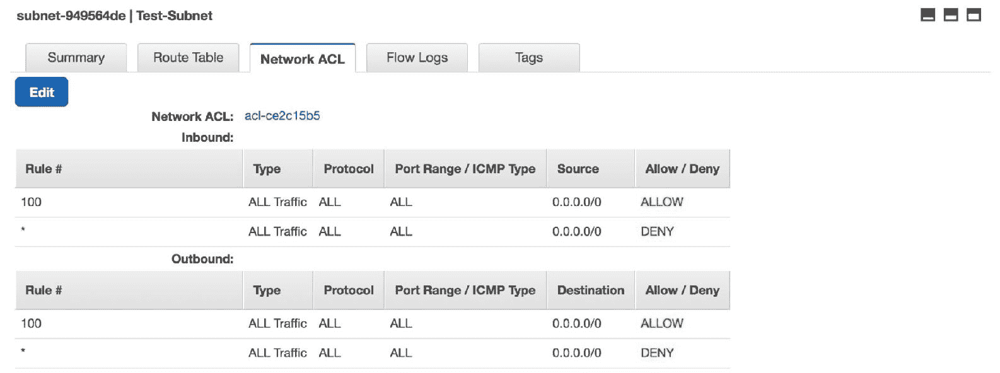

# AWS Lambda 中的安全性

我们已经学习了如何在 AWS Lambda 中构建和配置无服务器函数。我们已经学习了如何使用第三方工具进行扩展。我们还仔细研究了微服务的工作原理以及如何确保它们的安全性，同时确保弹性和速度。

在本章中，我们将了解 AWS 环境中的安全性，考虑到我们的 Lambda 函数。我们将了解 AWS VPC、安全组和子网等服务的运作方式，以及它们与 Lambda 函数的关系。

本章涵盖了以下主题：

+   理解 AWS VPC

+   理解 VPC 中的子网

+   在私有子网中保护 Lambda

+   控制对 Lambda 函数的访问

+   在 Lambda 内部使用 STS 进行基于会话的安全执行

# 理解 AWS 虚拟专用云（VPC）

在本节中，我们将理解 AWS VPC。**VPC**是 AWS 环境中安全层的一个非常常见的组件；它们是云中的隔离部分，用户可以在其中托管他们的服务并构建他们的基础设施。VPC 是安全的第一层。我们将尝试在 Lambda 函数的上下文中理解 VPC，以下是以项目符号形式给出的：

1.  VPC 可以在 AWS 的 VPC 服务仪表板中创建和修改，看起来如下：

1.  现在，让我们快速学习如何创建我们自己的 VPC。为此，请点击“创建 VPC”。您将看到一个弹出框，要求您为新的 VPC 输入更多元信息：

1.  名称标签框需要填写 VPC 的名称。IPv4 CIDR 块是您输入无类别域间路由的 IP 范围的地方。然后，您可以选择是否需要 IPv6 CIDR 块。您还可以选择租户设置；这定义了您的 EC2 实例如何在 VPC 中运行以及相应的资源共享：

1.  我们已成功创建带有必要设置和`Test-VPC`名称的 VPC。我们可以在仪表板中看到所有相应的元设置：

1.  您还可以看到 VPC 的摘要，包括 IPv4 设置、**网络访问控制列表**（**ACL**）设置、**动态主机配置协议**（**DHCP**）选项，以及 DNS 设置，所有这些都可以根据我们的需求稍后进行配置。您还可以在下一个标签页“下一个 CIDR 块”下看到 IPv4 CIDR 块：

1.  我们还可以创建 VPC 流日志，这些日志记录 VPC 内外的流量和数据移动。这将促进更好的日志管理，确保安全，并更好地监控。目前，流日志尚未设置：

1.  要创建 VPC 流日志，您只需在底部点击“创建流日志”按钮。这将打开一个流日志创建向导，您可以在其中输入各种设置的详细信息，相应地进行设置。创建向导看起来如下：

1.  一旦输入了所有详细信息，您就可以点击底部的“创建流日志”选项，这将创建具有所需设置的 VPC 流日志：

1.  创建完成后，您可以在“流日志”选项卡下看到新创建的 VPC 流日志，如图所示：

1.  现在，让我们从 AWS Lambda 的角度来理解 VPC。就像任何其他 AWS 资源一样，Lambda 函数也可以托管在 VPC 内部。您可以在 AWS Lambda 函数的“网络”部分下看到这个设置。它看起来是这样的：

1.  从下拉列表中，您可以选择一个您想要托管 Lambda 函数的 VPC：

1.  一旦选择了一个 VPC，它将进一步要求您提供有关子网、安全组等的详细信息，如下面的截图所示。我们将在接下来的章节中了解它们，因此，我们将稍后为 Lambda 函数配置 VPC。

# 理解 VPC 中的子网

在本节中，我们将了解并理解 AWS 子网，它们是 AWS VPC 的子部分。VPC 可以进一步划分为多个子网。这些子网可以是公共的或私有的，具体取决于您架构的安全需求。我们将从 AWS Lambda 函数的角度来看待子网的概念。

我们将执行以下步骤：

1.  您可以通过 VPC 页面本身进入子网菜单。您需要在左侧的“您的 VPC”选项下点击“子网”选项：

1.  这将带您进入子网控制台，在那里您将看到一些已经存在的子网。这些是您所在区域每个可用区的默认子网：

1.  现在，要创建一个新的子网，您需要点击控制台左上角的蓝色“创建子网”按钮。在创建向导中，您将被要求输入以下详细信息——子网名称、您想要放置它的 VPC、可用区以及首选的 IPv4 CIDR 块。我已经将此子网放置在上一节中创建的 VPC 内：

1.  当您点击创建向导右下角的“是，创建”按钮时，新的子网被创建。您可以在控制台上的子网列表中看到它：

1.  现在，我们将使用我们刚刚创建的 VPC 和子网来填写 Lambda 函数的安全设置。目前，AWS Lambda 的网络设置如下所示：

1.  在添加所需的设置后，包括 VPC、子网和安全组的详细信息，我们的 Lambda 函数的网络设置将如下所示：

...

1.  在设置 Lambda 函数的网络设置后，点击 Lambda 控制台右上角的橙色“保存”按钮，将这些设置保存到 Lambda 函数中。

# 在私有子网中保护 Lambda

**私有子网**是不向互联网开放的子网。它们的所有流量都通过同一 VPC 中的公共子网使用路由表的概念进行路由。让我们了解如何在私有子网中定位我们的 Lambda 函数以添加额外的安全层：

1.  在 AWS 控制台中创建的子网默认情况下不是私有的。让我们通过查看我们刚刚创建的子网的详细信息来评估和确认这一点：

1.  点击“路由表”标签将显示我们子网的路由设置，这基本上告诉我们允许什么类型的流量进入：

1.  在“网络 ACL”标签下，您可以查看为我们的子网分配的网络规则。在这里，我们可以看到子网对所有流量（0.0.0.0/0）都是开放的。因此，为了使我们的子网私有，我们需要解决这个问题：

1.  通过点击控制台左侧的链接进入“网络 ACL”控制台。您将到达以下页面：

1.  现在，点击蓝色“创建网络 ACL”按钮创建一个新的 ACL。选择我们的 VPC，然后在创建向导中为 ACL 输入一个名称：

1.  现在，在新 ACL 的入站规则中添加以下规则。在“源”部分添加任何公共子网的 IPv4 设置，然后点击保存：

1.  现在，用新的 ACL 替换我们当前子网的 ACL，使我们的子网成为私有子网：

现在，我们的 Lambda 函数位于私有子网中，使其更加安全。

# 控制对 Lambda 函数的访问

我们已经通过了所有必要的安全设置，以确保我们的 Lambda 函数和我们的无服务器架构是安全的。因此，在从安全角度设计他们的基础设施时，从事无服务器系统工作的工程师应该牢记以下要点：

+   可以在 Lambda 函数的“网络”部分下添加 VPC 和子网设置。

+   建议将 Lambda 函数放置在至少两个子网中，以实现容错。然而，这并非强制性的。

+   如果您将 Lambda 函数放置在私有子网中，您需要确保私有子网正在从该 VPC 中的公共子网接收适当的流量。如果不是，那么 Lambda 函数实际上是被锁定的。

# 在 Lambda 中使用 STS 以实现基于会话的安全执行

当从您的 Lambda 函数内部访问其他 AWS 服务和组件时，您可以使用 **AWS 的简单令牌服务**（**STS**）来确保基于会话的访问，这将本质上添加一个额外的安全层。正如我们已经讨论过的，并且我们已经学会了如何在代码中使用 STS 凭证，我们将跳过文档链接。

AWS STS 的官方文档将帮助你理解基于会话的访问是如何工作的：[`docs.aws.amazon.com/IAM/latest/UserGuide/id_credentials_temp.html`](https://docs.aws.amazon.com/IAM/latest/UserGuide/id_credentials_temp.html)。

这就是使用 Python 代码中的 STS 凭证的*Boto3 Python 文档*：[`boto3.readthedocs.io/en/latest/reference/services/sts.html`](http://boto3.readthedocs.io/en/latest/reference/services/sts.html)。

# 摘要

在本章中，我们深入学习了 Lambda 函数中的安全机制。我们理解了在 AWS 环境中 VPC 和子网是如何工作的。我们学习了如何创建 VPC，也创建了公共和私有子网。这将使你更好地理解从整个 AWS 视角来看安全是如何工作的。

我们也学习了如何在整章中放置你的 Lambda 函数到我们创建的 VPC 和子网中。我们理解了如何在我们的 VPC 和子网内部处理和路由流量。

最后，我们还学习了如何通过基于会话访问其他 AWS 组件来在我们的 Python 代码中实现更好的安全机制，从而将安全控制权交给了开发者。

在下一章中，你将学习关于**无服务器应用程序模型**（**SAM**）以及如何通过它们编写 SAM 模型并部署你的 Lambda 应用程序。
