# 第八章：使用 SAM 部署 Lambda 函数

到目前为止，我们已经了解了 Lambda 函数及其构建方法。我们了解到 Lambda 函数有一组明确的触发器，这些触发器会触发函数执行特定任务。任务以 Python 模块的形式编写，脚本就是我们所说的函数。我们还学习了 Lambda 函数的不同设置，包括其核心设置以及其他设置，如安全和网络。

除了创建和部署 Lambda 函数之外，还有另一种选择，那就是**AWS 无服务器应用程序模型**（**AWS SAM**）。这种格式基于**基础设施即代码**的概念。这个概念受到了**AWS CloudFormation**的启发，它是一种基础设施即代码的形式。

我们将学习 AWS CloudFormation，并利用这些知识来理解和构建用于创建 Lambda 函数的 AWS SAM 模型。在本章中，我们将涵盖以下概念：

+   Lambda 函数的部署

+   使用 CloudFormation 进行无服务器服务

+   使用 SAM 进行部署

+   在 SAM 中理解安全性

# SAM 简介

在本节中，我们将学习 SAM，这将帮助我们构建和部署无服务器函数：

1.  如前所述，SAM 是关于编写基础设施即代码。因此，这就是在 SAM 中描述 Lambda 函数的方式：

```py
AWSTemplateFormatVersion: '2010-09-09'
Transform: AWS::Serverless-2016-10-31
Resources:
    < Name of function >:
        Type: AWS::Serverless::Function
        Properties:
            Handler: < index.handler >
            Runtime: < runtime >
            CodeUri: < URI of the bucket >
```

1.  在这段代码块中，我们输入详细信息——函数的名称和我们的代码包托管在 S3 存储桶中的 URI。就像我们在 Lambda 设置中命名索引和处理程序一样，我们在这里也需要输入这些详细信息。`index.handler`是我们函数代码所在的文件。`Handler`是我们 Lambda 逻辑编写的函数的名称。此外，`Runtime`是用户定义的。您可以从 AWS Lambda 支持的所有语言中选择。本书的范围限于 Python 语言，因此我们将坚持使用可用的 Python 版本：

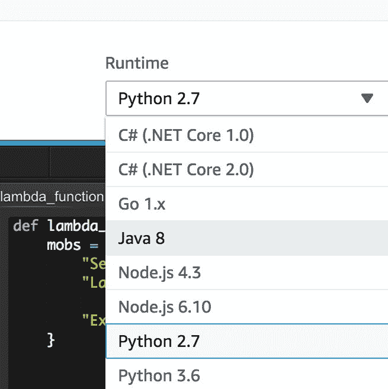

1.  我们也可以在我们的 Lambda 函数中添加环境变量，就像这里展示的那样。这些变量可以非常容易地编辑和配置，就像我们添加、更新和/或删除代码一样，这是基础设施即代码风格构建基础设施的额外优势：

```py
AWSTemplateFormatVersion: '2010-09-09'
Transform: AWS::Serverless-2016-10-31
Resources:
    PutFunction:
        Type: AWS::Serverless::Function
        Properties:
            Handler: index.handler
            Runtime: < runtime >
            Policies: < AWSLambdaDynamoDBExecutionRole >
            CodeUri: < URI of the zipped function package >
            Environment:
                Variables:
                     TABLE_NAME: !Ref Table
DeleteFunction:
    Type: AWS::Serverless::Function
     Properties:
         Handler: index.handler
         Runtime: nodejs6.10
         Policies: AWSLambdaDynamoDBExecutionRole
          CodeUri: s3://bucketName/codepackage.zip
          Environment:
              Variables:
                  TABLE_NAME: !Ref Table
          Events:
              Stream:
                  Type: DynamoDB
                  Properties:
                      Stream: !GetAtt DynamoDBTable.StreamArn
                      BatchSize: 100
                      StartingPosition: TRIM_HORIZON
DynamoDBTable:
    Type: AWS::DynamoDB::Table
    Properties:
        AttributeDefinitions:
            - AttributeName: id
                AttributeType: S
        KeySchema:
             - AttributeName: id
                 KeyType: HASH
        ProvisionedThroughput:
              ReadCapacityUnits: 5
              WriteCapacityUnits: 5
        StreamSpecification:
              StreamViewType: streamview type
```

1.  前面的 SAM 代码调用了两个指向 AWS `DynamoDB`表的 Lambda 函数。整个 SAM 代码是一个应用程序，由几个 Lambda 函数组成。您需要输入必要的详细信息以使其工作。`Runtime`需要更新为可用的 Python 运行时之一。在`Policies`部分需要更新处理`DynamoDB`表的相应策略。`CodeUri`部分需要更新为代码包的 S3 URI。

1.  应注意，对于所有 SAM，应始终包含元信息，包括 `AWSTemplateFormatVersion` 和 `Transform`。这将告诉 `CloudFormation` 您编写的代码是 AWS SAM 代码和无服务器应用程序。这两行如下：

```py
AWSTemplateFormatVersion: '2010-09-09'
Transform: AWS::Serverless-2016-10-31 
```

1.  如果您的无服务器函数需要访问 `DynamoDB` 的单个表，您可以通过使用 SAM 函数本身的 `SimpleTable` 属性创建一个 `DynamoDB` 表来开始。这可以按以下方式完成：

```py
AWSTemplateFormatVersion: '2010-09-09'
Transform: AWS::Serverless-2016-10-31
Resources:
    < TableName >:
        Type: AWS::Serverless::SimpleTable
         Properties:
             PrimaryKey:
                 Name: id
                 Type: String
             ProvisionedThroughput:
                 ReadCapacityUnits: 5
                  WriteCapacityUnits: 5
```

1.  现在，我们将学习如何创建一个具有触发器的 Lambda 函数。由于我们已经在示例中使用了 `DynamoDB`，因此我们将在此步骤中使用相同的 `DynamoDB` 作为触发器。此 SAM 代码将如下所示：

```py
AWSTemplateFormatVersion: '2010-09-09'
Transform: AWS::Serverless-2016-10-31
Resources:
    < Name of the function >:
        Type: AWS::Serverless::Function
        Properties:
            Handler: index.handler
            Runtime: < runtime >
            Events:
                Stream:
                    Type: DynamoDB
                    Properties:
                        Stream: !GetAtt DynamoDBTable.StreamArn
                        BatchSize: 100
                        StartingPosition: TRIM_HORIZON
< Name of the table >:
    Type: AWS::DynamoDB::Table
    Properties:
         AttributeDefinitions:
            - AttributeName: id
                AttributeType: S
        KeySchema:
            - AttributeName: id
                KeyType: HASH
        ProvisionedThroughput:
             ReadCapacityUnits: 5
             WriteCapacityUnits: 5
```

# 服务器无服务 CloudFormation

在本节中，我们将学习如何使用 CloudFormation 构建和部署 Lambda 函数。我们将执行以下操作：

1.  我们将编写一个 CloudFormation 模板，用于创建一个 Lambda 函数，该函数会定期 ping 一个网站，并在过程中出现任何失败时返回错误。此 CloudFormation 模板的格式如下：

```py
AWSTemplateFormatVersion: '2010-09-09'
Transform: 'AWS::Serverless-2016-10-31'
Description: 'Performs a periodic check of the given site, erroring out on test failure.'
Resources:
lambdacanary:
    Type: 'AWS::Serverless::Function'
    Properties:
        Handler: lambda_function.lambda_handler
        Runtime: python2.7
        CodeUri: .
        Description: >-
            Performs a periodic check of the given site, 
erroring out on test failure.
    MemorySize: 128
    Timeout: 10
    Events:
        Schedule1:
        Type: Schedule
        Properties:
            Schedule: rate(1 minute)
    Environment:
        Variables:
            site: 'https://www.google.com/'
            expected: Search site.
```

1.  这个 CloudFormation 片段中有许多语法。我们现在将更详细地尝试理解它：

    1.  在包含 Lambda 函数元详细信息的头三行中，我们有以下行——“`Transform: 'AWS::Serverless-2016-10-31'”。此行用于定义用户将通过 CloudFormation 模板使用/访问的资源。由于我们使用 Lambda 函数，我们将其指定为 `Serverless`。

    1.  我们还定义了我们的函数将使用的内存大小。这与我们在 Lambda 控制台中查看和更改内存设置的方式类似。

    1.  `Timeout` 是 Lambda 函数在将尝试视为失败之前可以持续重试的时间量。

您还可以看到，我们已经为我们的 Lambda 函数添加了环境变量，这些变量将被存储在 Lambda 容器中，并在系统需要时使用。

# 使用 SAM 部署

在本节中，我们将学习如何部署 SAM 应用程序。我们已经学习了 SAM 应用程序和代码的样子，所以我们将学习如何通过 AWS CloudFormation 部署它们：

1.  首先，让我们为部署目的设置我们的本地环境，然后从 `pip` 开始安装 `awscli`：

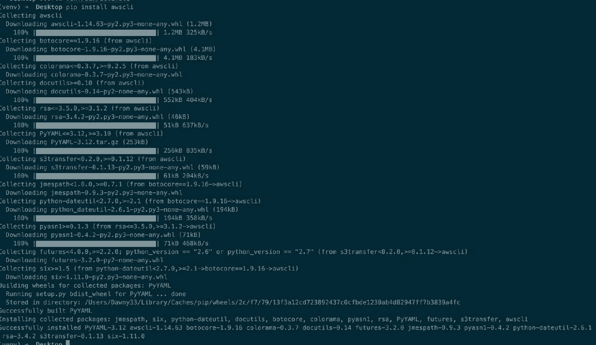

1.  接下来，您需要使用您的凭证配置您的 AWS 环境：

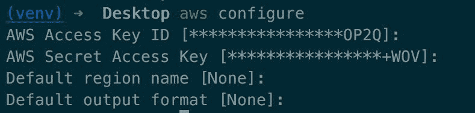

1.  您需要输入以下详细信息以确保您的 AWS 环境配置成功：

    +   您的 AWS 访问密钥

    +   您的 AWS 密钥

    +   您希望操作的默认区域

    +   您希望数据输出的默认格式

1.  现在，让我们尝试通过 SAM 部署一个简单的 `Hello World` Lambda 应用程序。为此，我们将有两个代码文件。一个是 Python 文件，另一个是模板 `yaml` 文件。

1.  我们将使用默认的 Python `Hello World` 示例，因为我们现在试图理解 SAM 部署的工作原理，而不是过于关注代码。Python 脚本如下：

```py
import json
print('Loading function')
def lambda_handler(event, context):
    #print("Received event: " + json.dumps(event, indent=2))
    print("value1 = " + event['key1'])
    print("value2 = " + event['key2'])
    print("value3 = " + event['key3'])
    return event['key1'] # Echo back the first key value
    #raise Exception('Something went wrong')
```

1.  我们也将为 SAM 函数使用一个基本的模板 `yaml` 文件，它的唯一任务是定义其元信息以及运行之前提到的 Python 脚本。这个模板 `yaml` 文件看起来是这样的：

```py
AWSTemplateFormatVersion: '2010-09-09'
Transform: 'AWS::Serverless-2016-10-31'
Description: A starter AWS Lambda function.
Resources:
    helloworldpython3:
        Type: 'AWS::Serverless::Function'
        Properties:
            Handler: lambda_function.lambda_handler
            Runtime: python3.6
            CodeUri: .
            Description: A starter AWS Lambda function.
            MemorySize: 128
            Timeout: 3
```

1.  现在，我们将使用命令行打包我们刚刚创建的 SAM 模板。打包代码的说明如下：

```py
aws cloudformation package --template-file template.yaml --output-template-file output.yaml --s3-bucket receiver-bucket
```

你将得到以下输出：

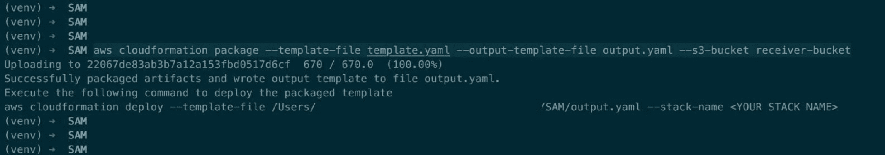

1.  这将创建一个需要部署的输出 `yaml` 文件，正如前面跟踪中提到的。`output.yaml` 文件看起来是这样的：

```py
AWSTemplateFormatVersion: '2010-09-09'
Description: A starter AWS Lambda function.
Resources:
    helloworldpython3:
        Properties:
            CodeUri: s3://receiver-bucket/22067de83ab3b7a12a153fbd0517d6cf
            Description: A starter AWS Lambda function.
            Handler: lambda_function.lambda_handler
            MemorySize: 128
            Runtime: python3.6
            Timeout: 3
        Type: AWS::Serverless::Function
Transform: AWS::Serverless-2016-10-31
```

1.  现在，随着我们已经打包了 SAM 模板，我们将现在部署它。我们将使用在打包时显示的说明进行部署过程。部署说明如下：

```py
aws cloudformation deploy --template-file /Users/<path>/SAM/output.yaml --stack-name 'TestSAM' --capabilities CAPABILITY_IAM 
```

这将给出以下输出：

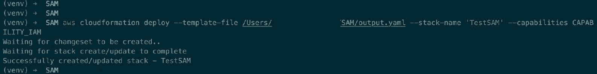

1.  我们可以转到 CloudFormation 控制台查看我们刚刚部署的模板。部署的模板看起来可能如下所示：

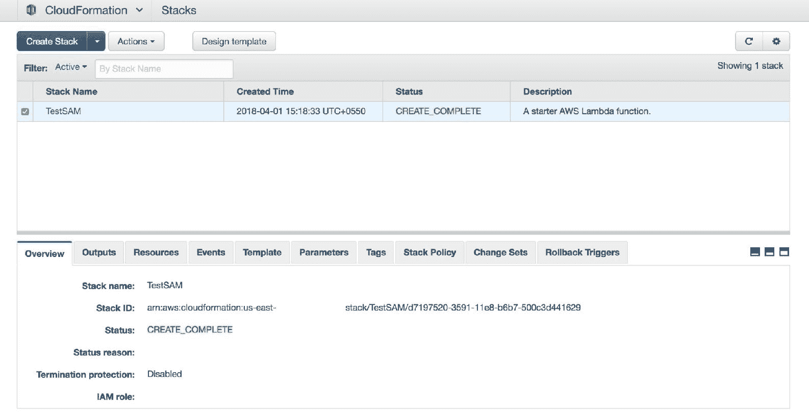

1.  在这里显示的模板选项卡中，我们可以看到原始模板和已处理的模板。通过选择第一个单选按钮可以看到原始模板：

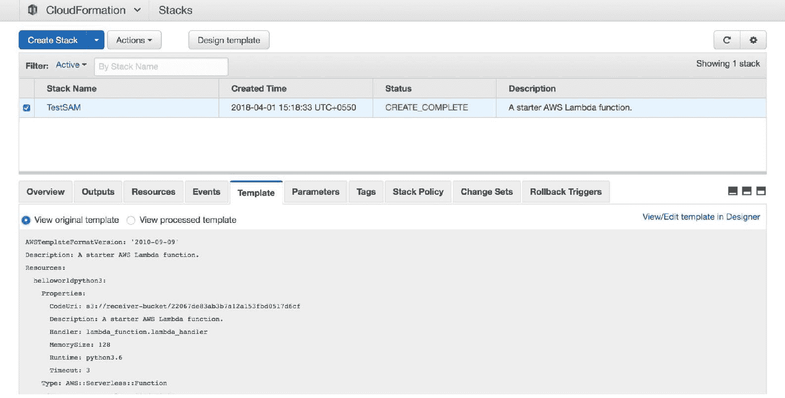

1.  通过在底部的模板选项卡下选择第二个单选按钮，我们可以看到已处理的模板：

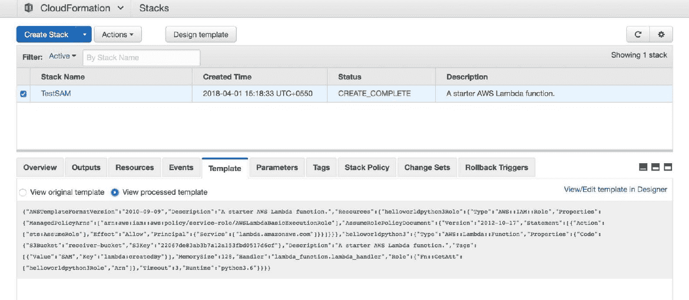

1.  如果我们转到 Lambda 控制台，我们将看到通过 SAM 创建的新 Lambda 函数，并带有相应的名称：

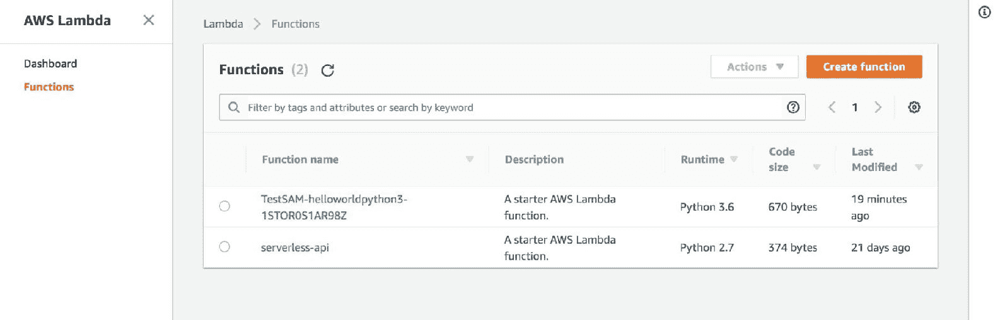

1.  点击函数将给我们更多关于它的信息。它还提到了创建它的 SAM 模板和 CloudFormation 模板：

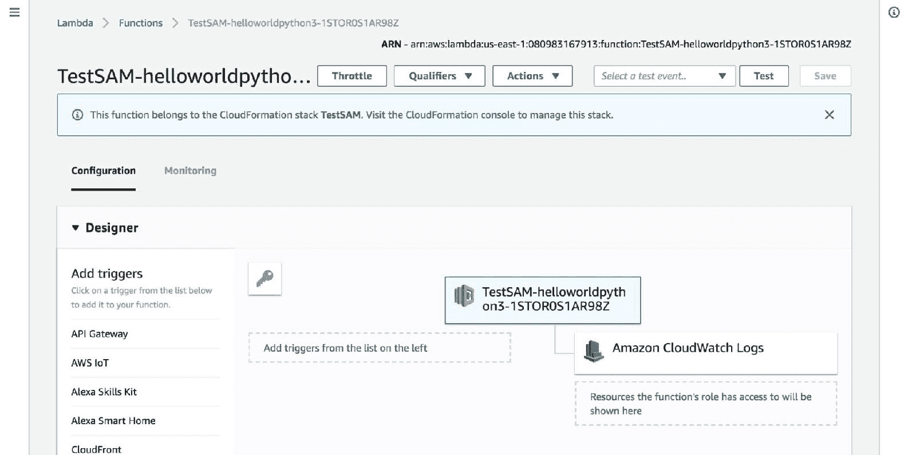

1.  让我们为 Lambda 函数创建基本的测试。可以通过点击 Test 按钮打开测试创建控制台：

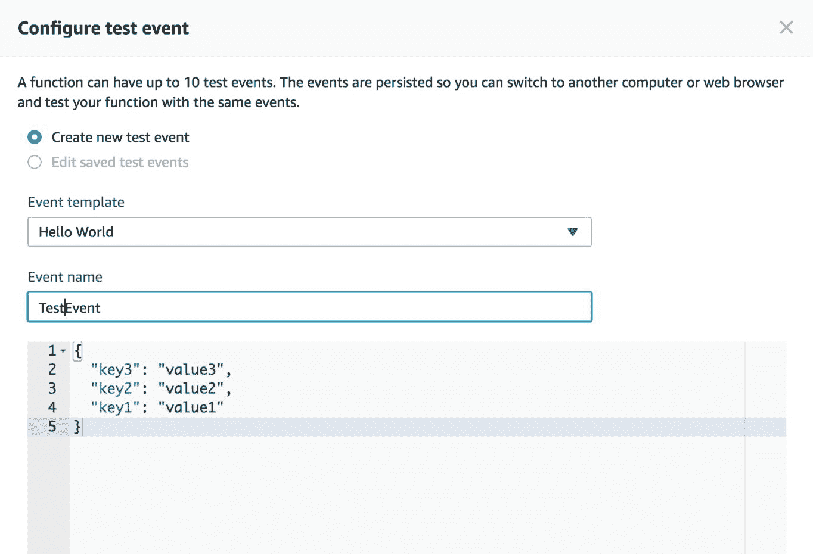

1.  现在，一旦创建了测试，你还可以再次点击 Test 按钮。这将使用更新的测试用例运行测试。成功的运行日志将看起来像这样：

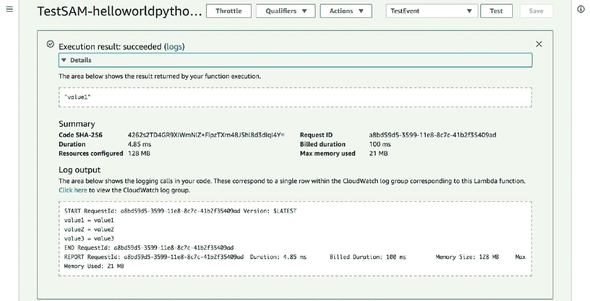

1.  现在，让我们正确地逐一介绍 Lambda 函数的各个组件。配置显示了我们的 Lambda 函数的触发器和日志设置。我们正在登录到 AWS 的 CloudWatch 服务：

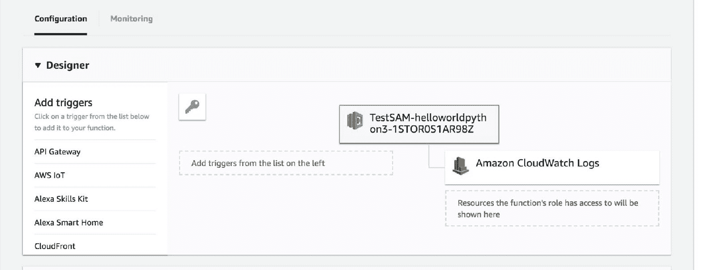

1.  我们还可以在 Lambda 控制台的监控选项中看到调用指标。我们可以看到精确的一个 Lambda 调用：

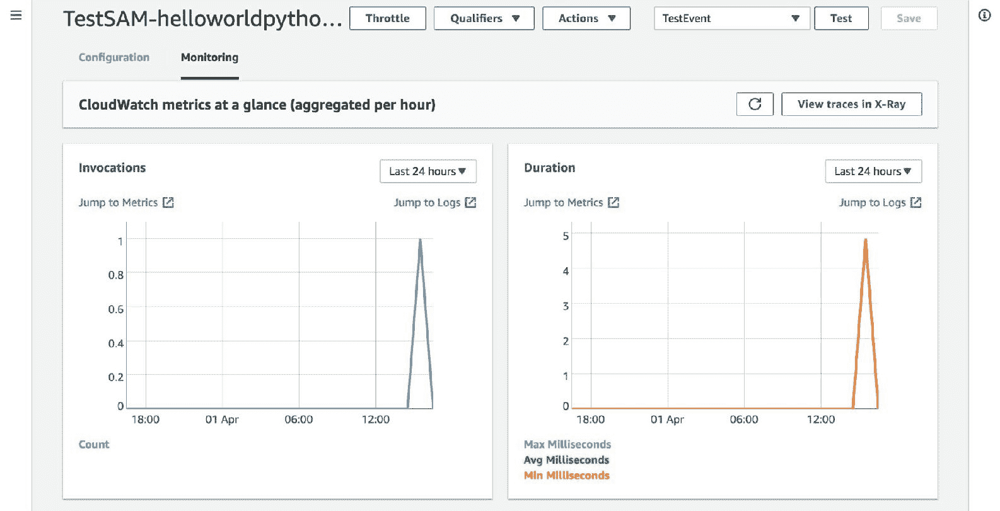

1.  你可以在函数代码部分看到代码文件。你可以在交互式代码编辑器的左侧看到文件夹结构，其中包含 `template.yaml` 文件和函数代码：

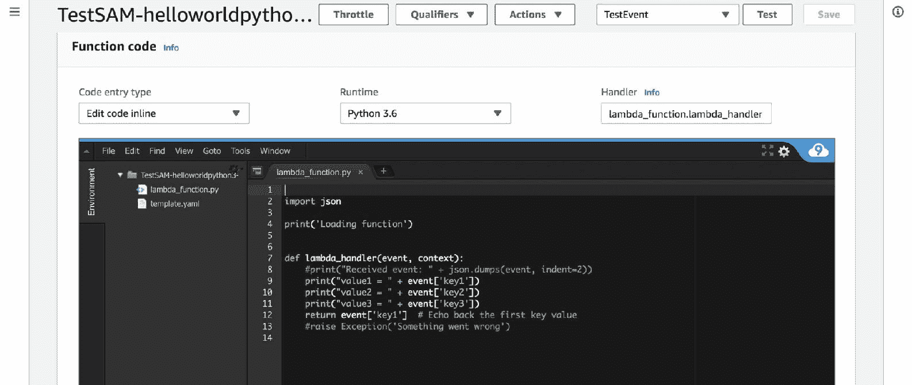

1.  在此之下，你可以看到预先存在的环境变量名为 `lambda:createdBy`，以及我们在模板中提到的超时设置。

# 理解 SAM 中的安全性

到目前为止，我们已经学习了如何使用 SAM 编写、构建、打包和部署 Lambda 函数。现在我们将了解它们内部的安全机制：

1.  你可以滚动到 Lambda 控制台的底部，以查看网络和安全设置，其中提到了 VPC 和子网详情：

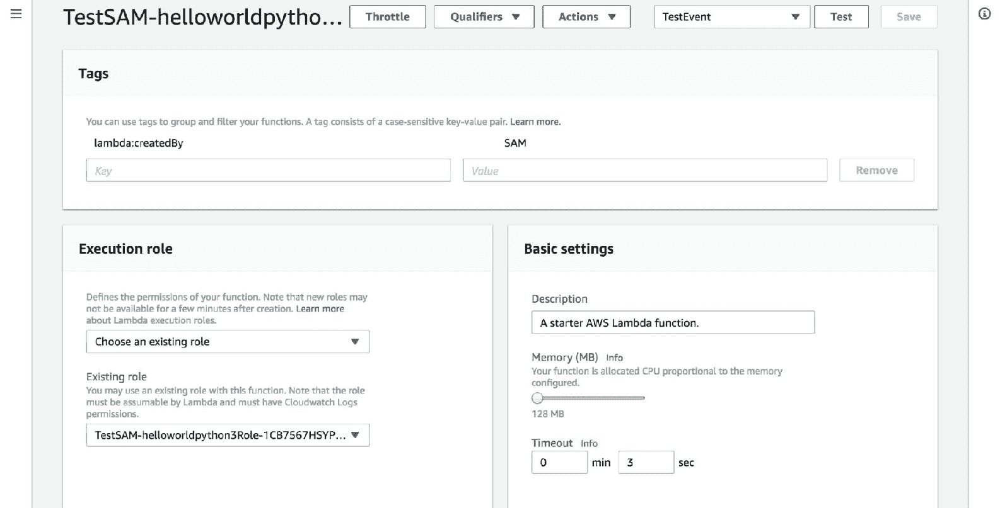

1.  现在，我们将添加网络设置，包括安全组和子网 ID：

```py
AWSTemplateFormatVersion: '2010-09-09'
Transform: 'AWS::Serverless-2016-10-31'
Description: A starter AWS Lambda function.
Resources:
    helloworldpython3:
        Type: 'AWS::Serverless::Function'
        Properties:
            Handler: lambda_function.lambda_handler
            Runtime: python3.6
            CodeUri: .
            Description: A starter AWS Lambda function.
            MemorySize: 128
            Timeout: 3
            VpcConfig:
                SecurityGroupIds:
                    - sg-9a19c5ec
                SubnetIds:
                    - subnet-949564de
```

1.  现在，就像我们在上一节中所做的那样，打包和部署新更新的 SAM 模板：

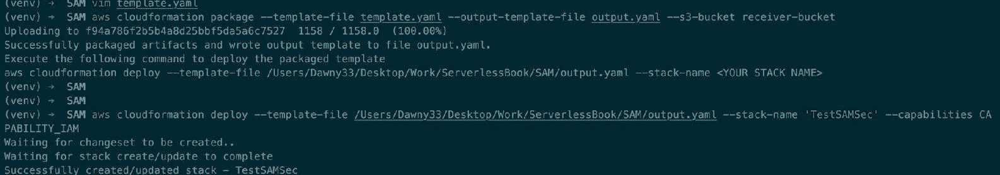

1.  现在你将看到相应的网络和安全设置，一旦你在进行相应的编辑后打包和部署了 CloudFormation 模板。网络部分看起来如下：

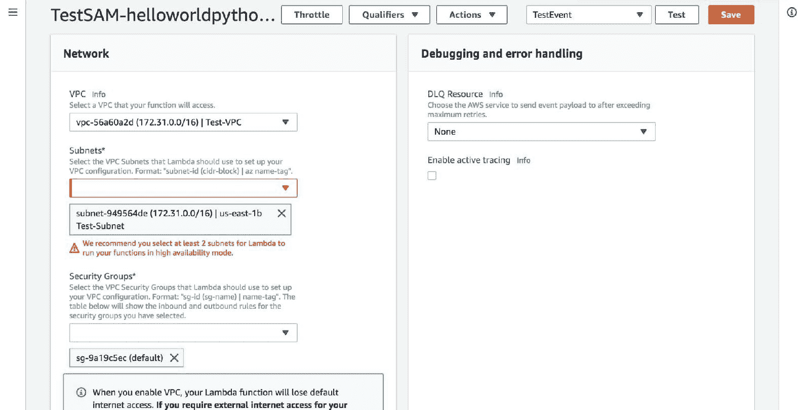

1.  你还可以在你的网络设置中看到与你的 VPC 关联的对应安全组的入站规则：

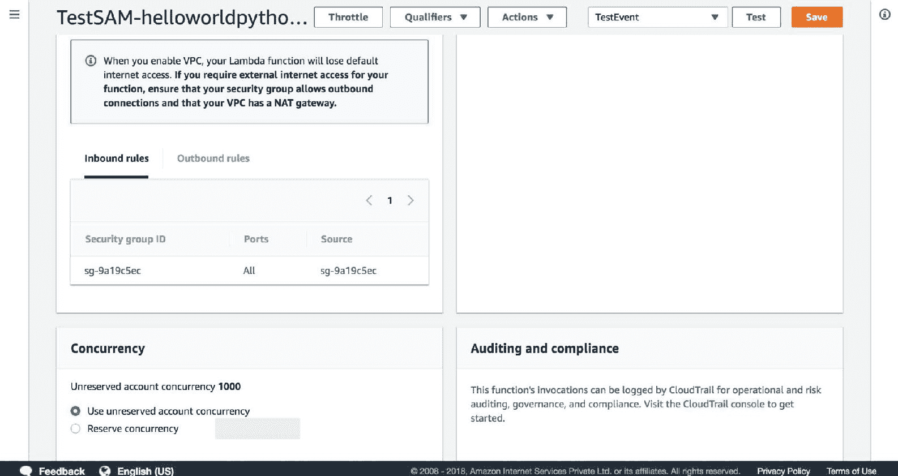

1.  你还可以在你的控制台中看到带有更新后的网络和安全设置的完成 CloudFormation 模板，这意味着部署已成功：

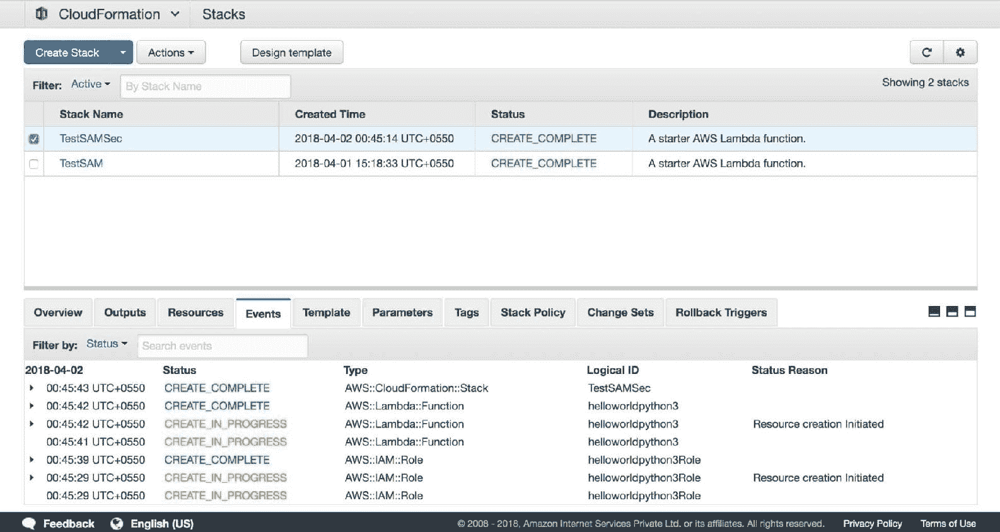

1.  你还可以在控制台底部的模板选项中看到原始模板：

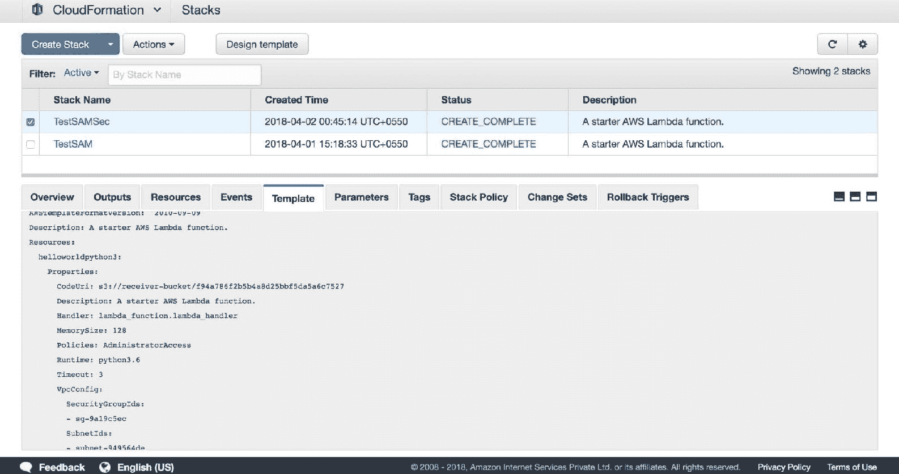

1.  处理后的模板可以通过在控制台底部的原始模板选项旁边选择“查看处理后的模板”选项来找到：

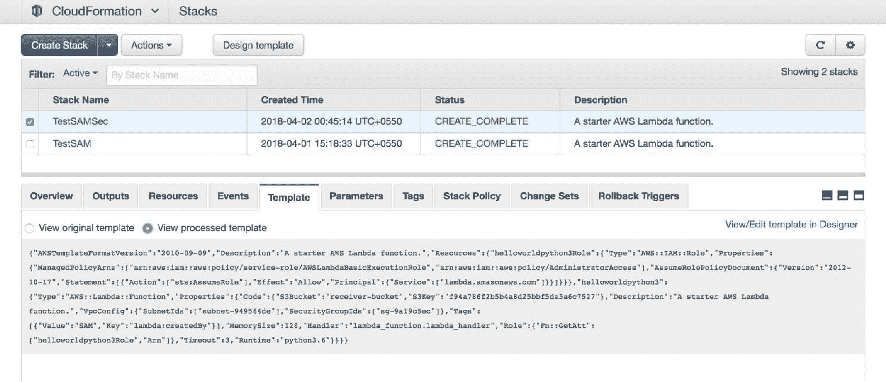

# 摘要

在本章中，我们学习了如何通过 SAM 将 Lambda 函数作为基础设施代码进行部署，这是一种编写和部署 Lambda 函数的新方法。这使得它更容易与其他 IaaS 服务集成，例如 CloudFormation。我们还学习了 AWS CloudFormation 服务，这是一种允许并促进基础设施代码化的服务。我们还学习了如何在 SAM 代码内部工作安全以及如何配置 VPC 和子网设置。

在下一章中，你将介绍 Microsoft Azure 函数，以及配置和理解该工具的组件。
