# 第一章. 开始使用 BeagleBone

如果您现在正在阅读这本书，这意味着您已经迈出了第一步，开始使用您的 BeagleBone 板和 Python 编程语言构建实时物理计算系统。本章将教您如何首次设置您的 BeagleBone 板，并在其上编写您的第一个 Python 代码。

到本书结束时，您将学习如何使用 Python 将电子设备连接到 BeagleBone 板的基本知识，这将允许您通过本书中给出的示例构建几乎任何东西，从家庭自动化系统到机器人。

首先，在本章中，您将学习如何使用新操作系统首次设置您的 BeagleBone 板，然后使用一些基本的 Linux Shell 命令，这些命令将帮助您在 Shell 终端上编写和执行 Python 代码，并执行更多操作，如安装不同的库和软件到您的 BeagleBone 板上。一旦您熟悉了 Linux 终端的使用，您将在 Python 上编写您的第一个代码，该代码将在您的 BeagleBone 板上运行。一旦您对此感到舒适，我们将在下一章中修改代码，使其执行更多操作。大多数时候，我们将使用互联网上免费提供的开源代码和库来编写程序，并使用它来满足我们的需求，而不是从头开始编写代码来构建我们的嵌入式系统，使用 BeagleBone 板。本章内容分为以下部分：

+   前提条件

+   关于单板计算机 - BeagleBone 板

+   了解您的 BeagleBone 板

+   设置您的 BeagleBone 板

+   在 Linux Shell 上工作

+   在 BeagleBone 板上用 Python 编程

# 前提条件

本主题将涵盖您开始使用 BeagleBone Black 所需的部分。您可以在网上购买，或者在您所在地区的任何电子产品店购买。

以下是需要开始所需的材料列表：

+   1x BeagleBone Black

+   1x miniUSB 类型 B 到类型 A 的线缆

+   1x microSD 卡（4 GB 或以上）

+   1x microSD 卡读卡器

+   1x 5V DC，2A 电源

+   1x 以太网线

### 注意

BeagleBone 板有不同版本，如 BeagleBone、BeagleBone Black、BeagleBone Green 以及一些更老的版本。这本书中大部分图片将展示 BeagleBone Black。请注意，BeagleBone Black 可以替换其他 BeagleBone 板，如 BeagleBone 或 BeagleBone Green，在大多数项目中使用。这些板子有自己的额外特性。例如，BeagleBone Black 有更多的 RAM，它的 RAM 大小几乎是 BeagleBone 的两倍，并且内置 eMMC 来存储操作系统，而不是像 BeagleBone White 那样仅通过安装在 microSD 卡上的操作系统启动。考虑到这本书应该能够指导人们使用大多数的 BeagleBone 板变体，本书中的教程将基于从 BeagleBone 板上插入的 microSD 卡启动的操作系统。我们将在本章的“设置你的 BeagleBone 板和安装操作系统”主题中详细讨论这一点。

# BeagleBone Black – 单板计算机

这个主题将为你提供关于单板计算机的简要信息，让你了解它们是什么，以及 BeagleBone 板在这个类别中的位置。

你是否曾经想过你的智能手机、智能电视和机顶盒是如何工作的？

所有这些设备都运行基于不同 Linux 和 Unix 内核为特定应用开发的定制固件。当你听到 Linux 这个词，如果你熟悉 Linux，你可能会想到它不过是一个操作系统，就像 Windows 或 Mac OS X 一样，在桌面和服务器计算机上运行。但近年来，Linux 内核被广泛应用于大多数嵌入式系统，包括消费电子产品，如你的智能手机、智能电视、机顶盒等等。大多数人知道 Android 和 iOS 是智能手机上的操作系统。但只有少数人知道，这两个操作系统都是基于 Linux 和 Unix 内核的。

你是否曾经质疑过他们是如何开发出这样的设备的？应该有一个开发板吧？它们是什么？

这就是 Linux 开发板，如我们的 BeagleBone 板，被使用的场合。

通过添加外围设备，如触摸屏、GSM 模块、麦克风和扬声器到这些单板计算机，并编写操作系统软件，带有图形用户界面，使它们能够与物理世界交互，我们现在有了许多智能设备，人们每天都在使用。

现在，在你的智能手机上，你有了接近传感器、加速度计、陀螺仪、摄像头、红外发射器等等。这些传感器和发射器通过 CPU 的输入输出端口连接到你的手机 CPU 上，当整个操作系统在智能手机上运行时，有一小块软件正在运行以与这些电子设备通信，以实时获取这些传感器的读数。就像最新智能手机上的屏幕自动旋转。有一小块软件正在读取手机上的加速度计和陀螺仪传感器的数据，并根据手机的方向旋转图形显示。

因此，所有这些 Linux 开发板都是工具和基础板，使用它们你可以构建出色的现实世界智能设备，或者我们可以称它们为物理计算系统，因为它们与物理世界互动并产生输出。

# 了解你的板子——BeagleBone Black

BeagleBone Black 可以被描述为一种低成本的单板计算机，可以通过 HDMI 线缆插入计算机显示器或电视进行输出，并使用标准键盘和鼠标进行输入。它能够完成你期望台式计算机所能做的所有事情，如播放视频、文字处理、浏览互联网等。你甚至可以在 BeagleBone Black 上设置一个网络服务器，就像你想要在 Linux 或 Windows PC 上设置一个网络服务器一样。

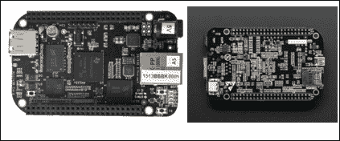

但是，与你的台式计算机不同，BeagleBone 板具有使用板上可用的 GPIO 引脚与物理世界互动的能力，并且已被用于各种物理计算应用中。从物联网、智能家居项目到机器人、或推特鲨鱼入侵系统。BeagleBone 板被世界各地的硬件制造商用来构建出色的物理计算系统，这些系统正在成为市场上的商业产品。OpenROV，一个水下机器人，是某人可以使用 BeagleBone Black 构建并可能成为成功商业产品的良好例子。

# BeagleBone Black 硬件规格

*“一图胜千言”。以下图片描述了 BeagleBone Black 的硬件规格。但当你阅读以下图片中的内容时，你将了解到关于板子上每个部分的更多细节。*

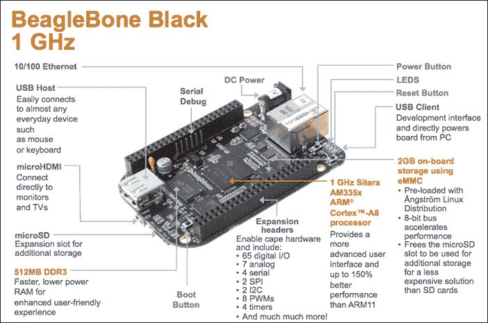

如果你熟悉计算机的基本设置，你会知道它有一个 CPU、RAM 和硬盘。你可以将键盘、鼠标和显示器连接到 CPU 上，这些设备通过电源系统供电。

在 BeagleBone Black 上也有相同的设置。它配备了一个 1GHz 处理器、512MB 的 DDR3 RAM 和 4GB 板载 eMMC 存储，用于存储操作系统，取代了硬盘。如果你想要更多的存储空间来使用不同的操作系统启动，你可以使用一个外部 microSD 卡，该卡可以插入 microSD 卡槽以提供额外存储。

正如每台计算机一样，该板包含一个电源按钮用于开启和关闭板子，一个复位按钮用于重置板子。此外，还有一个启动按钮，当操作系统加载到 microSD 卡而不是 eMMC 时，用于启动板子。我们将在本章的安装操作系统主题中详细学习这个按钮的用法。

板上有一个 Type A USB 主机端口，你可以连接外围设备，如 USB 键盘、USB 鼠标、USB 摄像头等，前提是连接到 BeagleBone Black 的外围设备有可用的 Linux 驱动程序。

### 小贴士

需要注意的是，BeagleBone Black 只有一个 USB 主机端口，所以你需要一个 USB Hub 来获得多个 USB 端口，以便同时连接多个 USB 设备。我建议使用无线键盘和鼠标，当你通过 HDMI 端口连接 BeagleBone Black 到显示器时，可以消除额外的 USB Hub。

BeagleBone Black 上可用的 microHDMI 端口使该板能够像任何计算机一样输出到 HDMI 显示器和 HDMI 电视。

你可以使用板左下角的 DC 圆柱形插头，通过 5V DC、2A 适配器为 BeagleBone Black 供电。虽然不推荐，但也可以使用 USB 供电，因为 USB 端口有电流限制。我们将在接下来的章节中详细介绍这一点，当我们连接 USB Wi-Fi 模块和 USB 摄像头到 BeagleBone Black 时。

板上共有 4 个 LED 灯，用于指示板子的状态，并帮助我们识别从 microSD 卡启动 BeagleBone Black。这些 LED 灯与 BeagleBone Black 上的 GPIO 引脚相连，可以在需要时使用。

你可以使用板上的以太网端口通过以太网线将 BeagleBone Black 连接到局域网或互联网。你甚至可以使用 USB Wi-Fi 模块为 BeagleBone Black 提供互联网接入。在第五章“将物理计算系统连接到互联网”中，你将学习如何做到这一点。

通常被称为通用输入输出（GPIO）引脚的扩展引脚包括 65 个数字引脚。这些引脚可以用作数字输入或输出引脚，您可以将开关、LED 以及许多其他数字输入输出组件连接到这些引脚上，7 个模拟输入，您可以将模拟传感器如电位计或模拟温度传感器连接到这些输入上，4 个串行端口，您可以将串行蓝牙或 Xbee 模块连接到这些端口上用于无线通信或任何其他用途，2 个 SPI 和 2 个 I2C 端口，用于连接不同的模块，如传感器或其他模块，使用 SPI 或 I2C 通信。它还有 8 个 PWM 输出引脚，可用于如淡入淡出和 LED 或用于在机器人应用中改变电机速度等应用，我们将在接下来的章节中讨论这些应用。

我们还有一个串行调试端口，在系统加载和运行时，可以通过串行监视器使用外部串行到 USB 转换器查看低级固件预启动和后关机/重启消息。操作系统启动后，这也作为一个完全交互式的 Linux 控制台。

# 设置您的 BeagleBone 板

您开始使用 BeagleBone 板的第一步是按照 BeagleBone 社区的建议设置并测试它，使用预装在 eMMC 上的 Debian Linux 发行版在 BeagleBone Black 上运行。本节将指导您完成这个过程，然后安装不同的操作系统到您的 BeagleBone 板上并登录到它。然后开始通过 SSH 使用文件和执行 Linux Shell 命令。

1.  使用 USB 线将您的 BeagleBone Black 连接到您的笔记本电脑或 PC。

    这是将您的 BeagleBone Black 启动并运行的最简单方法。一旦您连接了 BeagleBone Black，它将开始使用 eMMC 存储上的操作系统启动。要登录操作系统并开始工作，BeagleBone Black 必须连接到网络，而 BeagleBoard 制造商提供的驱动程序允许我们在通过 USB 线连接时在您的 BeagleBone Black 和电脑之间创建一个本地网络。为此，您需要按照步骤 2 中的说明在您的 PC 上下载并安装 BeagleBone 板制造商提供的设备驱动程序。

    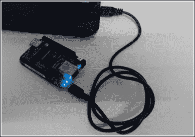

1.  下载并安装设备驱动程序。

    +   转到[`beagleboard.org/getting-started`](http://beagleboard.org/getting-started)

    +   根据您的操作系统点击并下载驱动程序包。我的操作系统是 Windows（64 位），所以我将下载那个

    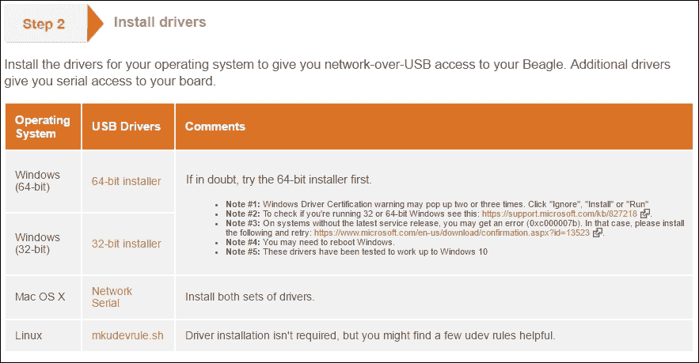

    安装完成后，点击**完成**。如下截图所示：

    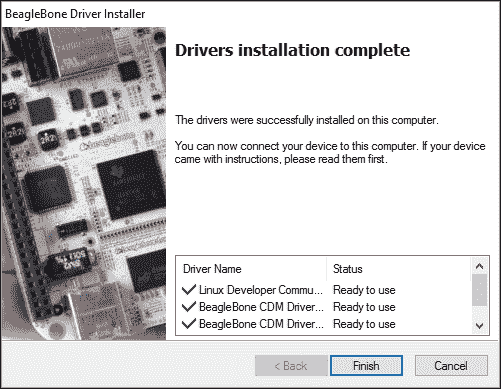

    安装完成后，重新启动您的 PC。确保您的笔记本电脑上的 Wi-Fi 已关闭，并且没有以太网连接到您的笔记本电脑。因为现在 BeagleBone Black 设备驱动程序将尝试在您的笔记本电脑和 BeagleBone Black 之间创建一个 LAN 连接，以便您可以访问默认在 BeagleBone Black 上运行的 Web 服务器以测试其是否一切正常、运行良好。一旦您重新启动 PC，进入第 3 步。

1.  连接到运行在 BeagleBone Black 上的 Web 服务器。

    打开您喜欢的网页浏览器，并在 URL 栏中输入 IP 地址 `192.168.7.2`，这是分配给 BeagleBone Black 的默认静态 IP 地址。

    这应该会打开以下截图所示的网页：

    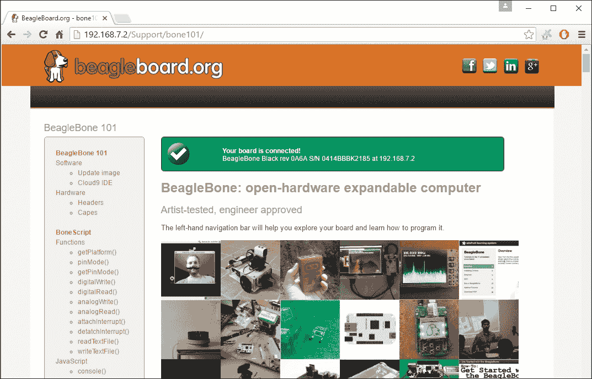

    如果您看到一个绿色的勾号，并显示您的板已连接的消息，您可以确保您之前的步骤是正确的，并且您已成功连接到您的板。

    ### 小贴士

    如果您没有收到此消息，请尝试移除连接到 BeagleBone Black 的 USB 线，重新连接并再次检查。如果您仍然没有收到，那么请检查您是否正确完成了前两个步骤。

1.  通过 Web 服务器玩板载 LED。

    如果您在连接到的网页上向下滚动，您将找到以下截图所示的章节：

    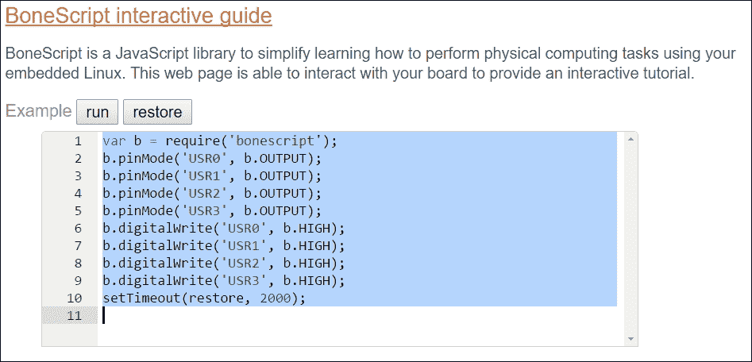

这是一个由 BeagleBone 制造商制作的示例设置，作为第一次交互界面，让您了解使用 BeagleBone Black 可以实现什么。在这个网页页面部分，您可以运行一个小脚本。当您点击**运行**时，根据操作系统状态闪烁的板载状态 LED 将停止其功能，并开始根据页面上的脚本工作。代码是基于由 BeagleBone 制造商构建的 JavaScript 库运行的，称为**BoneScript**。我们不会详细探讨这一点，因为我们将会更专注于使用 Python 编写自己的程序来与板上的 GPIO 进行交互。但为了让您理解，这里有一个简单的说明，关于脚本上有什么，以及当您在网页上点击运行按钮时会发生什么。

`pinMode` 函数将板载 LED 引脚定义为输出，`digitalWrite` 函数设置输出的状态为高（HIGH）或低（LOW）。而 `setTimeout` 函数将在设置的超时后恢复 LED 的正常功能，也就是说，程序将在 `setTimeout` 函数中设置的时间后停止运行。

假设我将代码修改为以下截图所示：

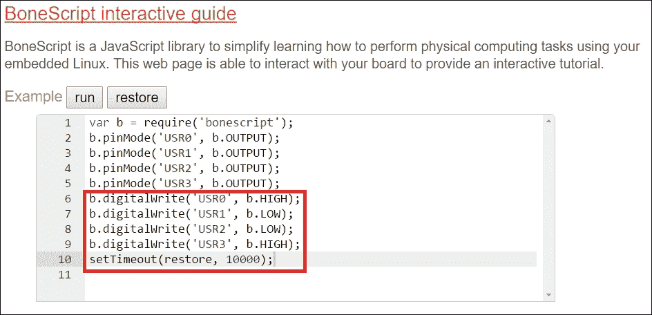

### 注意

您可以注意到，我已经将两个 LED 的状态更改为低（LOW），另外两个是高（HIGH），超时设置为 10,000 毫秒。

因此，当您点击“运行”按钮时，LED 将切换到这些状态，并保持 10 秒钟，然后恢复到其正常状态指示程序，即闪烁。

您可以尝试不同的 HIGH 和 LOW 状态以及 setTimeout 值的组合，以便您可以查看和理解正在发生的事情。

您可以在以下屏幕截图中看到我们之前执行的程序的 BeagleBone Black LED 输出状态：

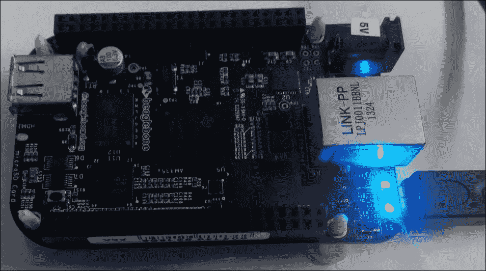

您可以看到中间的两个 LED 处于低电平状态。当您运行脚本时，它会保持这种状态 10 秒钟，然后恢复到其常规程序。您可以在网页上提供的脚本中尝试不同的超时值和 LED 状态，并点击“运行”按钮以查看其工作情况。

就这样，我们将编写自己的 Python 程序，并设置服务器，使用 BeagleBone Black 上可用的 GPIO 来实现我们想要的方式，以便在每个项目中构建不同的应用程序。

# 安装操作系统

我们可以使 BeagleBone Black 使用不同的操作系统启动和运行，就像任何计算机一样。这些板子上主要使用 Linux 系统，它是免费和开源的，但需要注意的是，这些板子上也提供了特定的 Linux、Android 和 Windows CE 发行版，您可以尝试使用。

这些操作系统的稳定版本可在 [`beagleboard.org/latest-images`](http://beagleboard.org/latest-images) 获取。

默认情况下，BeagleBone Black 在板子的 eMMC 上预装了 Debian 版本的 Linux。然而，如果您愿意，您可以像在电脑上的硬盘上一样刷新这个 eMMC，并在上面安装不同的操作系统。

### 注意

如本章开头所述的注意事项中提到的，考虑到本书中的所有教程都应适用于拥有 BeagleBone 和 BeagleBone Black 的人。我们将选择 [www.BeagleBoard.org](http://www.BeagleBoard.org) 基金会推荐的 Debian 软件包，并且每次启动板子时都将使用 microSD 卡上的操作系统。

执行以下步骤以准备 microSD 卡并使用它启动 BeagleBone：

1.  转到：[`beagleboard.org/latest-images`](http://beagleboard.org/latest-images)。

1.  下载最新的 Debian 镜像。

    以下截图突出了可用于在 microSD 卡上刷新的最新 Debian 镜像：

    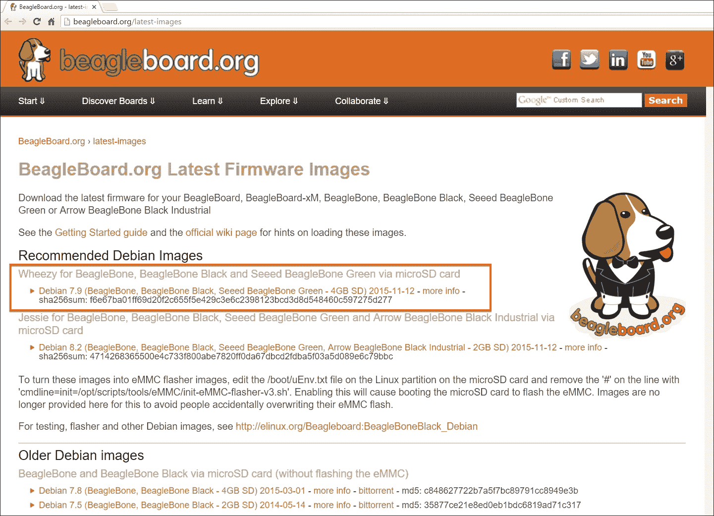

1.  提取下载的 RAR 文件中的镜像文件：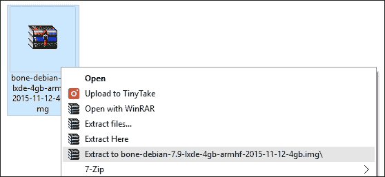

    ### 小贴士

    如果您的电脑中没有 WinRAR 或其他 `.rar` 文件提取软件，您可能需要安装。

1.  安装 Win32 Disk Imager 软件。

    要将映像文件写入 microSD 卡，我们需要此软件。您可以通过 Google 或任何其他搜索引擎输入`win32 disk imager`作为关键词进行搜索，以获取以下截图所示的下载此软件的网页链接：

    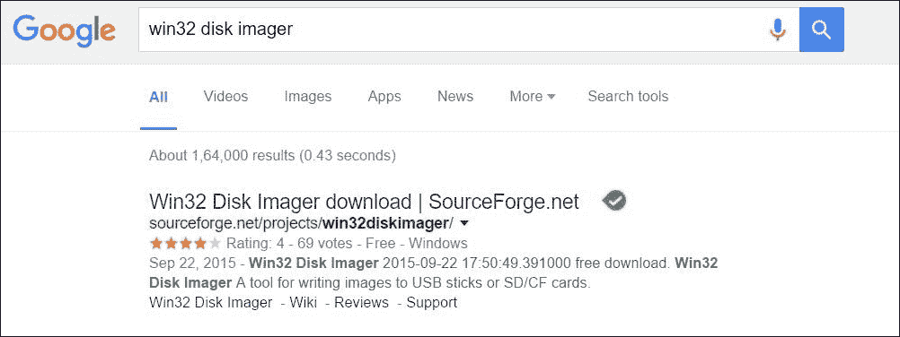

    您可以在以下网页链接中找到此软件：[`sourceforge.net/projects/win32diskimager/`](http://sourceforge.net/projects/win32diskimager/)。但由于它经常变化，因此我建议您可以通过任何搜索引擎使用关键词进行搜索。

1.  下载并安装软件后，当您打开 Win32 Disk Imager 时，应该能够看到以下截图所示的窗口：

    现在您已经准备好软件，可以使用它来刷写我们下载的操作系统映像。让我们进入下一步，在那里您可以使用 Win32 Disk Imager 软件来刷写 microSD 卡。

1.  格式化 microSD 卡。

    将 microSD 卡插入 microSD 卡读卡器，并将其连接到您的计算机。卡读卡器显示您的 microSD 卡可能需要一些时间。一旦显示，您应该能够在 Win32 Disk Imager 软件的以下截图中选择 USB 驱动器。

    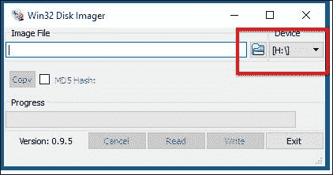

1.  现在，点击以下截图中突出显示的图标以打开文件资源管理器并选择我们在第 3 步中提取的图像文件：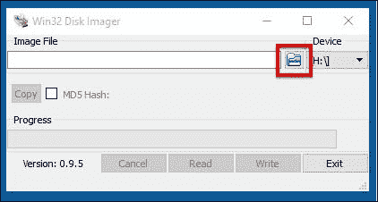

1.  前往您提取最新 Debian 映像文件的文件夹，并选择它。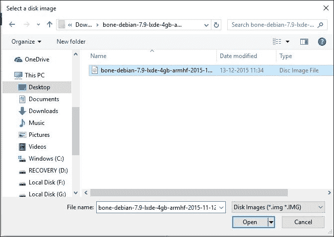

1.  现在，您可以通过点击 Win32 Disk Imager 上的**写入**按钮将映像文件写入 microSD 卡。如果您看到以下截图所示的提示，请点击**是**并继续：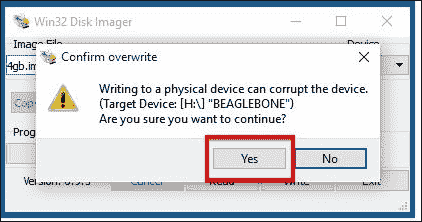

1.  一旦您点击**是**，刷写过程将开始，映像文件将被写入到 microSD 卡。以下截图显示了刷写过程的进度：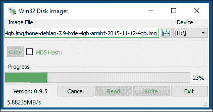

    一旦格式化完成，您将看到以下截图所示的提示信息：

    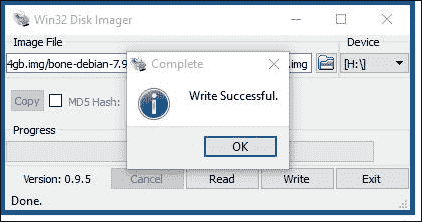

1.  现在，您可以点击**确定**，退出 Win32 Disk Imager 软件，并安全地从计算机中移除 microSD 卡。

现在，您已经成功地将最新的 Debian 操作系统准备就绪，适用于 BeagleBone Black。此过程适用于所有其他适用于 BeagleBone 板的操作系统。您可以在熟悉 BeagleBone 板的过程中尝试不同的操作系统，如 Angstrom Linux、Android 或 Windows CE 等。

对于 Mac 用户，您可以参考[`learn.adafruit.com/ssh-to-beaglebone-black-over-usb/installing-drivers-mac`](https://learn.adafruit.com/ssh-to-beaglebone-black-over-usb/installing-drivers-mac)或[`learn.adafruit.com/beaglebone-black-installing-operating-systems/mac-os-x`](https://learn.adafruit.com/beaglebone-black-installing-operating-systems/mac-os-x)。

# 从 SD 卡启动您的 BeagleBone 板

由于您现在已经在 microSD 卡上有了操作系统，让我们继续从该 microSD 卡启动您的 BeagleBone 板，并看看如何通过 Linux Shell 登录和访问文件系统。

您需要将您的计算机通过以太网或 Wi-Fi 连接到您的路由器，并且您应该将一根以太网线连接到您的路由器和 BeagleBone 板之间。最后但同样重要的是，需要一个外部电源，您将使用它来为 BeagleBone 板供电，因为当从 microSD 卡启动时，通过 USB 供电将不足以运行 BeagleBone 板。

1.  将 microSD 卡插入到 BeagleBone 板。

    现在，您应该将您准备好的 microSD 卡插入到 BeagleBone 板上的 microSD 卡槽中。

    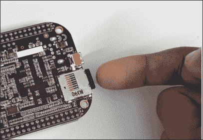

1.  将您的 BeagleBone 连接到您的局域网。

    现在，使用以太网线将您的 BeagleBone 板连接到您的互联网路由器。

    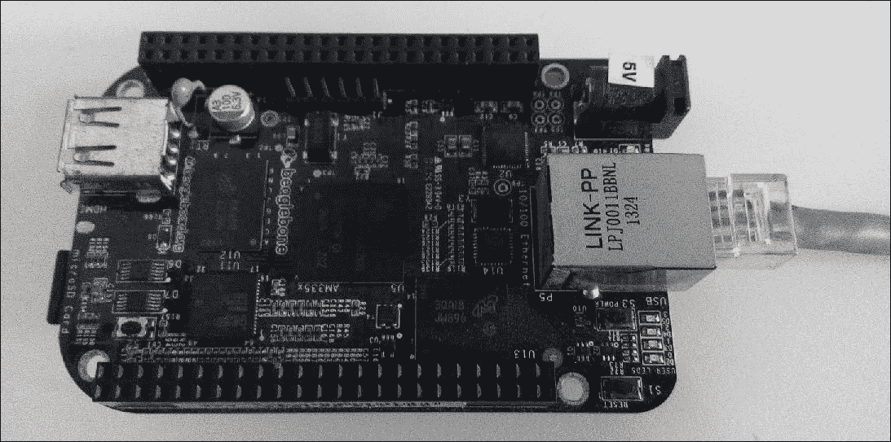

    您需要确保您的 BeagleBone 板和您的计算机连接到同一路由器，以便执行下一步。

1.  将外部电源连接到您的 BeagleBone 板。从 SD 卡启动您的 BeagleBone 板

1.  从 microSD 卡启动您的 BeagleBone 板。

    在 BeagleBone Black 和 BeagleBone Green 上，您有一个启动按钮，您需要在打开 BeagleBone 板时按住它，以便它从 microSD 卡启动，而不是默认模式，默认模式是从板载 eMMC 存储启动，该存储包含操作系统。在 BeagleBone White 的情况下，您没有这个按钮，它将从 microSD 卡本身启动，因为它没有板载 eMMC 存储。

    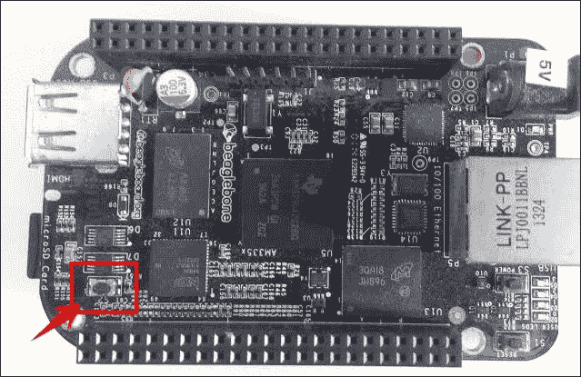

根据您拥有的板子，您可以决定是否从 microSD 卡或 eMMC 启动板子。假设您有一个 BeagleBone Black，就像我在前面的图片中展示的那样。您按下图像上突出显示的用户启动按钮，并打开电源。一旦您在按住按钮的情况下打开板子，四个板载 LED 灯将亮起并保持 HIGH 状态，如以下图片所示，持续 1 到 2 秒，然后它们将开始随机闪烁。

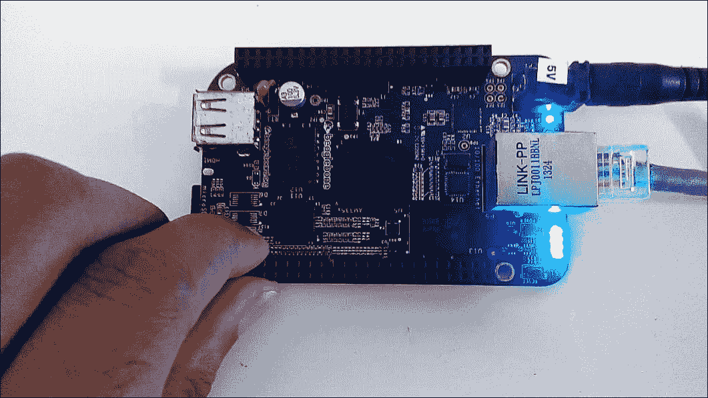

一旦它们开始闪烁，您就可以松开按钮。

现在你的 BeagleBone 板必须已经开始从 microSD 卡启动，所以我们的下一步将是登录到系统并开始工作。下一个主题将指导你如何进行这一步骤。

# 通过以太网 SSH 登录到板

如果你熟悉 Linux 操作，那么你可能已经猜到了本节的内容。但对于那些不是日常 Linux 用户或者从未听说过 SSH 术语的人来说，**安全外壳**（**SSH**）是一种网络协议，它允许网络服务和远程登录能够在不安全的网络上以安全的方式操作。用基本的话来说，它是一种协议，通过它可以登录到计算机并检查其文件系统，还可以使用特定的命令在该系统上创建和操作文件。

在接下来的步骤中，你将使用一些 Linux 命令来理解这种登录系统并在其上工作的方法。

1.  设置 SSH 软件。

    要开始，现在从 Windows PC 登录到你的 BeagleBone 板，你需要为 Windows 安装任何 SSH 终端软件。

    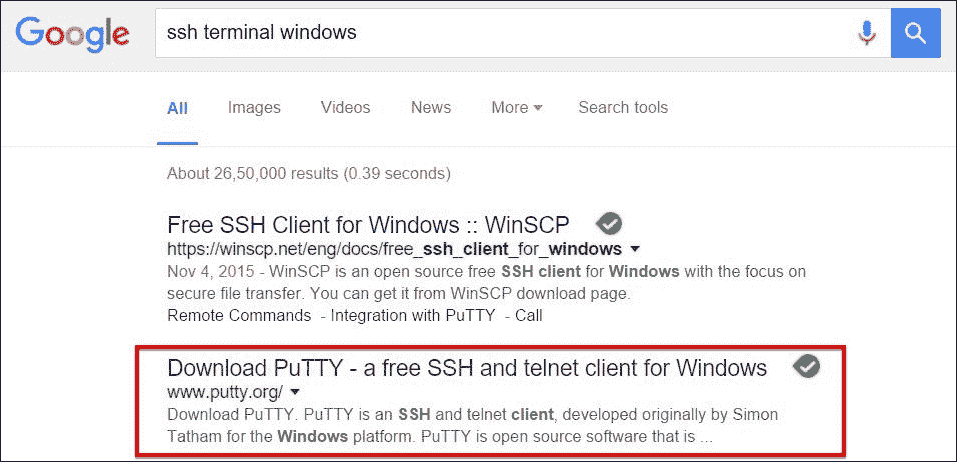

    我最喜欢的工具是 PuTTY，所以接下来的步骤中我会使用它。如果你是 SSH 的新手，我建议你也获取 PuTTY。

    PuTTY 的软件界面将如下截图所示：

    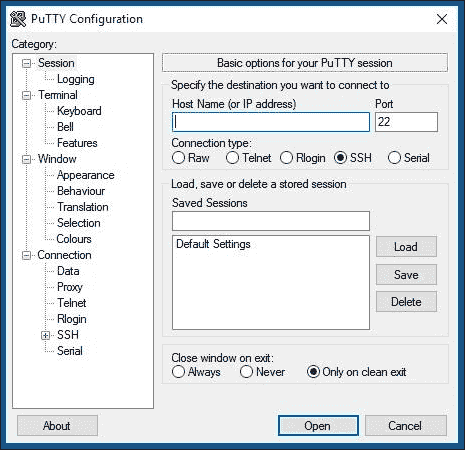

    你需要知道你的 BeagleBone Black 的 IP 地址或主机名，才能通过 SSH 登录到它。默认的主机名是`beaglebone`，但在某些路由器上，根据其安全设置，这种方法使用主机名登录可能不起作用。因此，我建议你首先尝试使用主机名登录。如果你无法登录，请遵循步骤 2。如果你成功连接并使用主机名获得登录提示，你可以跳过步骤 2，直接进入步骤 3。

    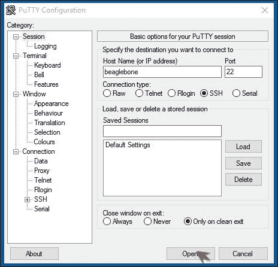

    但如果你遇到了以下截图所示的错误，请执行步骤 2。

    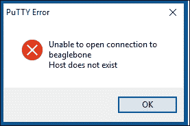

1.  查找分配给 BeagleBone 板的 IP 地址。

    每次你将设备连接到你的路由器，比如你的电脑、打印机或手机。路由器会给这些设备分配一个唯一的 IP 地址。同样，路由器也必须给你的 BeagleBone 板分配了一个 IP 地址。我们可以在连接到该路由器的任何电脑的浏览器中查看路由器的配置页面来获取这个详细信息。

    在大多数情况下，可以通过输入 IP `192.168.1.1`来访问路由器，但有些路由器制造商在极少数情况下有不同的 IP 地址。如果你无法使用这个 IP `192.168.1.1`访问你的路由器，请参考你的路由器手册以获取访问此页面的方法。

    ### 注意

    本节中显示的图像是为了让您了解如何登录到您的路由器并从路由器获取分配给您的 BeagleBone 板的 IP 地址详情。配置页面和设备在路由器上的显示方式将根据您拥有的路由器而有所不同。

    在您的浏览器中输入`192.168.1.1`地址。

    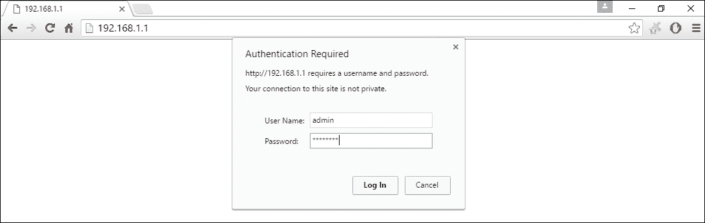

    当它要求**用户名**和**密码**时，输入**用户名**为`admin`，**密码**为`password`。

    这些是在大多数路由器中默认最常用的凭证。如果在这个步骤中失败，请检查您的路由器用户手册。

    假设您已成功登录到路由器配置页面，您将看到如图所示的屏幕详情：

    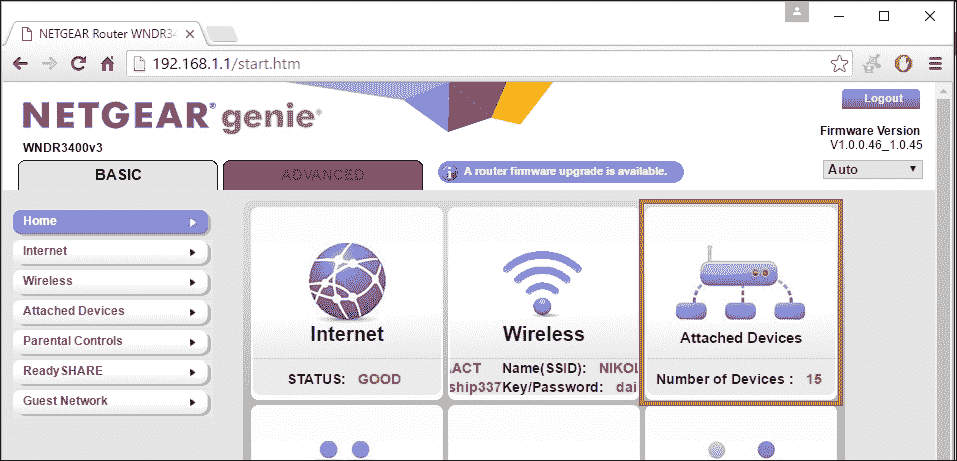

    如果您点击突出显示的部分**附加设备**，您将能够看到如图所示的设备列表及其 IP 地址，在那里您可以找到分配给您的 BeagleBone 板的 IP 地址详情。

    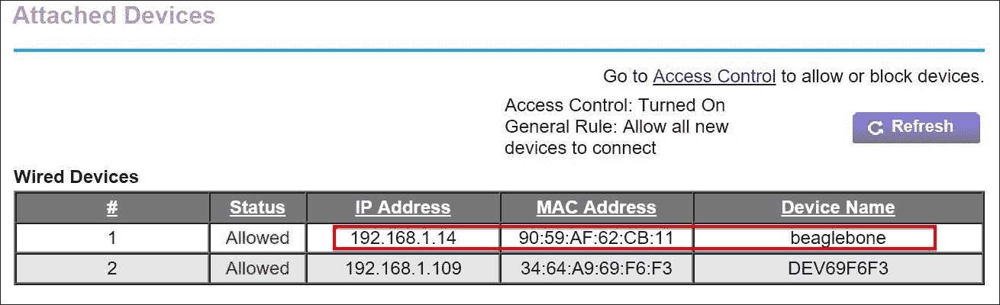

    因此，现在您可以记下分配给您的 BeagleBone 板的 IP 地址。在我之前的屏幕截图中，它显示为`192.168.1.14`。我们将在下一步使用此 IP 地址通过 SSH 连接到 BeagleBone 板。

1.  使用 IP 地址通过 SSH 连接。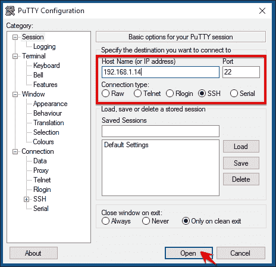

    一旦您点击**打开**，您可能会收到如图所示的提示。点击**是**并继续。

    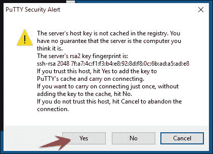

    现在，您将在终端屏幕上看到登录提示，如图所示：

    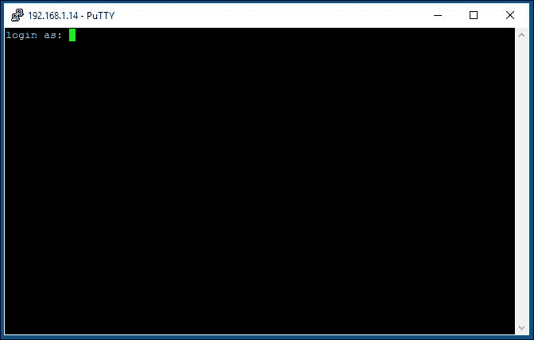

    如果您成功完成了这一步，那么现在是时候登录到您的 BeagleBone 板并开始通过 Linux Shell 工作了。

1.  登录到 BeagleBone 板。

    当您得到如图所示的登录提示时，您需要输入默认用户名`debian`和默认密码`temppwd`。现在您应该已经以用户名`debian`登录到您的 BeagleBone 板的 Linux Shell。

    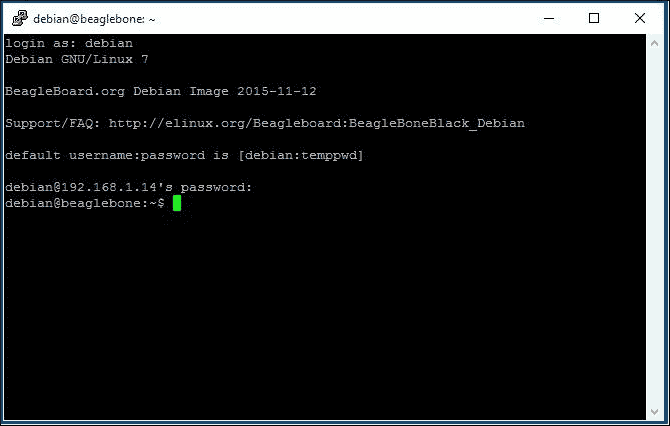

现在您已经成功登录到您的 BeagleBone 板的 Linux Shell，您可以使用 Linux Shell 命令开始工作，就像在运行 Linux 的任何计算机上一样。

下一节将向您介绍一些基本的 Linux Shell 命令，这些命令对于您使用任何 Linux 系统都很有用。

# 在 Linux Shell 中工作

简而言之，Shell 是一个程序，它从键盘接收命令并将其传递给操作系统执行。由于我们将把 BeagleBone 板作为开发板用于构建电子项目，所以每次都要将其连接到显示器、键盘和鼠标来像计算机一样工作，这在大多数情况下可能是不必要的，而且您可能还需要更多资源，这些资源在所有时候都是不必要的。因此，我们将使用 Shell 命令行界面来在 BeagleBone 板上工作。如果您想了解更多关于 Linux 命令行界面的信息，我建议您访问 [`linuxcommand.org/`](http://linuxcommand.org/)。

现在让我们继续尝试一些基本的 Shell 命令，并在您的 BeagleBone 板上做一些事情。

您可以使用 `uname -r` 命令查看内核版本。只需输入命令并在键盘上按回车键，命令将被执行，您将看到如下所示的输出：

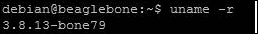

接下来，让我们检查 BeagleBone 板上的 `date`：

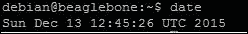

就这样，Shell 将执行您的命令，您可以通过 Shell 在 BeagleBone 板上工作。

获取内核版本和日期只是为了进行示例测试。现在让我们继续前进，开始与文件系统一起工作。

+   `ls`: 这代表列表命令。此命令将列出并显示当前工作目录中可用的文件夹和文件名称。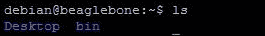

+   `pwd`: 这代表打印工作目录命令。此命令将打印您当前所在的当前工作目录。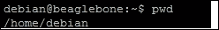

+   `mkdir`: 这代表创建目录命令。此命令将在其他词中创建一个目录，即文件夹，但您需要在命令中指定您想要创建的目录名称。

假设我想创建一个名为 `WorkSpace` 的文件夹，我应该输入以下命令：


当您执行此命令时，它将在您当前所在的工作目录中创建一个名为 `WorkSpace` 的文件夹，以检查目录是否已创建。您可以再次尝试 ls 命令，并看到名为 `WorkSpace` 的目录已创建。

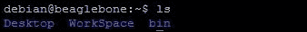

要更改工作目录并进入 `WorkSpace` 目录，您可以使用我们接下来将要看到的下一个命令。

+   `cd`: 这代表更改目录命令。此命令将帮助您根据与该命令一起提供的路径在目录之间切换。

现在要切换并进入您创建的 `WorkSpace` 目录，您可以输入以下命令：

```py
cd WorkSpace

```

你可以注意，每次你输入一个命令，它都会在你当前所在的工作目录中执行。所以现在执行`cd WorkSpace`将等同于`cd /home/debian/WorkSpace`，因为你的当前工作目录是`/home/debian`。

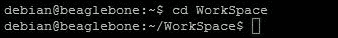

现在你可以看到你已经进入了`WorkSpace`文件夹，目前它是空的，所以如果你现在输入`ls`命令，它将在 shell 终端的下一行，不会输出任何内容，因为文件夹是空的。

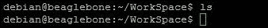

现在如果你执行`pwd`命令，你会看到你的当前工作目录已经改变。

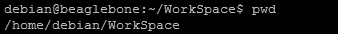

+   `cat`：这代表`cat`命令。这是最基础的命令之一，用于在 shell 中读取、写入和追加数据到文件。

要创建一个文本文件并向其中添加一些内容，你只需要输入`cat`命令`cat > filename.txt`

假设我想创建一个`sample.txt`文件，我会输入下面的命令：

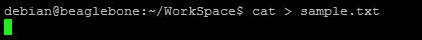

一旦你输入，光标将等待你在创建的文本文件中输入的文本。现在你可以输入任何你想要的文本，完成后按*Ctrl* + *D*。这将保存文件并返回到命令行界面。

假设我输入了**这是一个测试**然后按下了*Ctrl + D*。shell 将看起来如下所示。


现在你输入`ls`命令，你可以在`WorkSpace`目录中看到文本文件。

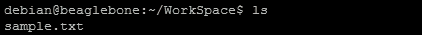

如果你想要读取`sample.txt`文件的内容，你同样可以使用`cat`命令，如下所示：

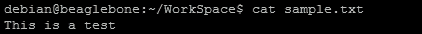

或者，你甚至可以使用`more`命令，这是我们将会主要使用的命令：

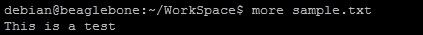

现在我们已经看到了如何创建一个文件，接下来让我们看看如何删除我们创建的内容。

+   `rm`：这代表删除命令。这将允许你通过输入文件名或文件名及路径后跟命令来删除任何文件。

假设现在我们想要删除我们创建的`sample.txt`文件，命令可以是`rm sample.txt`，这将等同于`rm /home/debian/WorkSpace/sample.txt`，因为你的当前工作目录是`/home/debian/Workspace`。


执行这个命令后，如果你尝试列出目录的内容，你会注意到文件已经被删除，现在目录是空的。


就这样，你可以通过 SSH 通过以太网或 Wi-Fi 在你的 BeagleBone 板上使用 shell 命令。我们将在 第五章 中看到如何将你的 BeagleBone 板连接到 Wi-Fi，*将物理计算系统连接到互联网*，在那里你可以设置你的 BeagleBone 板通过 Wi-Fi 连接到你的路由器，而不是通过以太网，以给你的 BeagleBone 板提供无线访问。

现在，你已经对使用 Linux Shell 有了一个清晰的概念和实际操作经验，让我们继续前进，开始使用 Python，并在 Linux 文本编辑器上编写一个示例程序，然后在本章的下一节和最后一节中进行测试。

# 在 BeagleBone 板上编写自己的 Python 程序

在本节中，我们将在你的 BeagleBone 板上编写一些 Python 代码。这些代码将根据输入做出决策，并根据我们编写的代码打印输出。本主题中有三个示例代码，可以帮助你掌握任何编程语言的基本知识，包括定义变量、使用算术运算符、获取输入和打印输出、循环和决策算法。

在我们编写和执行 Python 程序之前，让我们通过 Linux shell 进入 Python 的交互式壳界面，并尝试一些基本操作，比如创建变量和在那些变量上执行数学运算。

要打开 Python 壳界面，你只需在 Linux shell 中输入 python，就像你在本章前面的部分中为任何 Linux shell 命令所做的那样。

一旦你输入 `python` 并按 *Enter*，你应该能看到如下截图所示的终端：

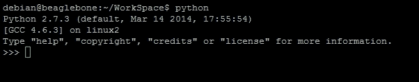

现在，你已经进入了 Python 的交互式壳界面，在这里，你输入的每一行都是你在每一步同时编写的代码和执行的代码。要了解更多信息，请访问 [`www.python.org/shell/`](https://www.python.org/shell/)，或者要开始学习 Python 编程语言，你可以购买我们出版的 *Python By Example* 书籍。

让我们在 Python 的交互式壳界面中执行一系列语法，看看它是否正常工作。

让我们创建一个名为 `A` 的变量，并将其值 `20` 赋予它：

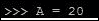

现在，让我们 `print A` 来检查它被赋予了什么值：

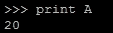

你可以看到它打印出了我们存储在其上的值。

现在，让我们创建另一个名为 `B` 的变量，并将其值 `30` 存储到它里面：


让我们尝试将这两个变量相加，并将结果存储在另一个名为 `C` 的变量中。然后 `print C`，你可以看到 *A+B* 的结果，即 `50`。

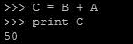

这就是我们在一个编程界面上执行的基本计算。我们创建了两个具有不同值的变量，然后在那些变量上执行了两个值的加法算术运算，并打印出了结果。

现在，让我们更进一步，将字符串字符存储在变量中并打印它们。

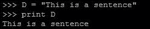

这不是很简单吗。就像这样，你可以通过玩转 Python 的交互式 shell 界面来学习编码。但任何程序员都希望编写代码并执行程序，以单条命令的方式获得输出。

让我们看看现在如何做到这一点。

要从 Python 的交互式 shell 中退出并返回 Linux Shell 的当前工作目录，只需按住 *Ctrl* 键并按 *D*，即在键盘上按 *Ctrl* + *D*。你将回到下一个显示的 Linux Shell 界面：


现在我们来编写一个程序，执行我们在 Python 的交互式 shell 中尝试执行的动作。也就是说，将两个值存储在不同的变量中，当它们相加时打印出结果。让我们通过在创建的变量上执行多个算术运算，并打印出加法和减法的结果来给它增添一些趣味。

你需要一个文本编辑器来编写程序并保存它们。你也可以使用 `cat` 命令来做这件事。但当你未来需要在程序中使用缩进和更多编辑时，基本的 `cat` 命令用法将会变得困难。所以，让我们开始使用 Linux 上可用的文本编辑器 nano，它是我的 Linux 中最喜欢的文本编辑器之一。如果你有其他选择，并且熟悉 Linux 上的其他文本编辑器，如 vi 或其他，你可以继续使用它们来编写程序进行下一步操作。

要创建一个 Python 文件并使用 nano 在它上面开始编写代码，你需要使用 nano 命令，后跟文件名和扩展名 `.py`。

让我们创建一个名为 `ArithmeticOperations.py` 的文件。


一旦你输入这个命令，文本编辑器就会打开。


在这里，你可以输入你的代码，并使用键盘命令 *Ctrl* + *X* 保存它。

让我们继续编写以下截图所示的代码，并使用 *Ctrl* + *X* 保存文件：


然后当提示保存修改后的文件时，输入 *Y*。


然后，如果你想用不同的名字更改文件，你可以在保存之前在下一步中进行更改。由于我们现在只创建了文件，所以我们不需要这样做。如果你想在将来以不同的名字保存文件的修改副本，你可以在这一步更改文件名：


目前，我们只需按下*Enter*键，这将带我们回到 Linux Shell，并在当前工作目录内创建名为`AritmeticOperations.py`的文件，你可以通过输入`ls`命令来查看。你还可以通过输入我们在此章节前一部分学到的`more`命令来查看文件内容。


现在让我们执行 Python 脚本并查看输出。为此，你只需输入命令 python，后跟我们所创建的 Python 程序文件，即`ArithmeticOperations.py`。


一旦运行了你所编写的 Python 代码，你将看到之前显示的输出结果。

现在你已经编写并执行了你的第一个 Python 代码，并在你的 BeagleBone 板上测试了它的工作情况，让我们编写另一个 Python 代码，如下面的截图所示，该代码将要求你输入输入，无论你输入什么文本作为输入，它都会打印在下一行，并且程序将连续运行。

让我们将这个 Python 代码保存为`InputPrinter.py`：


在这个代码中，我们将使用 while 循环，以便程序在您使用*Ctrl* + *D*命令将其中断并返回到 Linux Shell 之前持续运行。


现在让我们尝试本节和本章的第三个也是最后一个程序，其中当我们运行代码时，程序会提示用户输入用户名作为输入，如果他们输入我们比较的特定名称，它将打印并显示**Hello**消息；如果输入了不同的名称，它将打印**Go Away**；让我们称这个代码为`Say_Hello_To_Boss.py`。


在比较时，你可以将我的名字**Jayakarthigeyan**替换成你的名字或任何字符串，输出决策将随之变化。

当你执行代码时，输出将看起来如下所示截图：


就像我们在上一个程序中所做的那样，你可以按*Ctrl* + *D*来停止程序并返回到 Linux Shell。

以这种方式，你可以使用 Python 编程语言创建可以在 BeagleBone 板上按你希望的方式运行的代码。

既然我们已经到达了这一章节的结尾，让我们给我们的 BeagleBone 板一个休息。

使用命令 `sudo poweroff` 关闭我们的 BeagleBone 板，这将关闭操作系统。


执行此命令后，如果你看到以下截图所示的错误消息，这意味着 BeagleBoard 已关闭电源。


现在，你可以关闭连接到你的 BeagleBone 板的电源。

# 摘要

因此，我们来到了这一章节的结尾。在本章中，你学习了如何从 microSD 卡上的不同操作系统启动 BeagleBone 板，然后登录并开始用 Python 编写代码以运行例程和做出决策。利用这些知识，我们将在接下来的几章中看到如何使连接到 BeagleBone 板 GPIO 引脚上的 LED 闪烁，以及如何使用 Python 代码读取开关按钮的状态。但在那之前，我们将在下一章中探讨基本电子学的基础知识。

另外，你可以通过将 BeagleBone 板连接到 HDMI 显示器（使用 microHDMI 线缆），并将 USB 键盘和鼠标连接到 BeagleBone 板的 USB 主机，然后使用外部电源为显示器和 BeagleBone 板供电，并从 microSD 卡启动它，将这一章节提升到更高层次。你应该能够看到一些图形用户界面，并且能够像使用普通 Linux 计算机一样使用 BeagleBone 板。你将能够访问文件、管理它们，并在 GUI 上使用 Shell 终端。如果你拥有 BeagleBone Black 或 BeagleBone Green，你可以尝试使用最新的 Debian 操作系统刷写板载的 eMMC，并尝试使用从 microSD 卡启动的操作系统的相同方法。
