# 第三章。物理计算系统简介

本章将重点介绍物理计算系统是什么，它们由什么组成，它们如何工作以及它们在哪里使用。首先，我们将从物理计算系统的简要介绍开始，通过一个示例及其应用领域，让您对物理计算系统的基本组成有一个基本的概念，最后我们将看到如何使用 BeagleBone Black、推杆和 LED 以及 Python 编程来构建自己的物理计算系统，根据推杆按下输入来改变 LED 的状态。

本章内容分为以下主题：

+   前置条件

+   物理计算系统简介

+   物理计算系统的基本元素

+   应用领域

+   简单项目：推杆输入触发 Python 代码中的事件，切换 LED 的开关

# 前置条件

本主题将涵盖本章所需的部分。这些可以从您最喜欢的电子爱好商店购买，或者简单地在线订购。我们需要以下材料：

+   1 x BeagleBone Black

+   1 x 带有最新版本 Debian 的 microSD 卡，用于从 microSD 卡启动 BeagleBone 板

+   1 x 5V 直流，2A 电源

+   1 x 以太网线

+   1 x 面板

+   1 x 推杆开关

+   1 x LED

+   1 x 470 欧姆电阻

+   1 x 4.7 千欧姆电阻

# 物理计算系统介绍

本节将为您提供一个物理计算系统的基本概述。物理计算系统是电子系统，它们结合软件和硬件来从物理世界获取输入，并通过在硬件上运行的软件提供输出以响应它。这些系统在不同的应用中也被称为嵌入式系统。一般来说，任何通过硬件传感器与模拟世界交互、获取输入并基于为其编写的软件相应地做出反应的系统，都被称为物理计算系统。

从您的音乐播放器、洗衣机、自动门开启器和手机，所有使用传感器和按钮从物理世界获取输入并通过改变其物理世界的输出以响应的系统，都是物理计算系统。

以你的洗衣机为例。根据你通过点击其上的按钮提供的输入，这是一个从世界到洗衣机系统的物理输入，它清洗你的衣物并使其干燥，这又是对物理世界的输出；它使用空气和水改变物理事物，即衣物。因此，它基本上通过其输出在物理、模拟世界中创造变化，其输出基于洗衣机系统上的硬件上运行的软件，以及该系统上可用的传感器和执行器。我们将在本章下一节中详细探讨这一点，该节将探讨构成物理计算系统的基本组件以及它们的工作原理。

# 物理计算系统的基本元素

在本节中，你将了解物理计算系统由什么组成。首先，我们将看到输入和输出元素的基本结构以及如何行动和反应，然后是它的电气、电子和软件方面的结构，包括系统的输入和输出。最后，我们将通过示例尝试以更清晰的方式了解相同的概念。

物理计算系统的基本结构包括传感器，这些传感器可以是模拟的或数字的，它们将使用连接到物理计算系统硬件的输入传感器从物理世界获取输入，如下面的图所示：

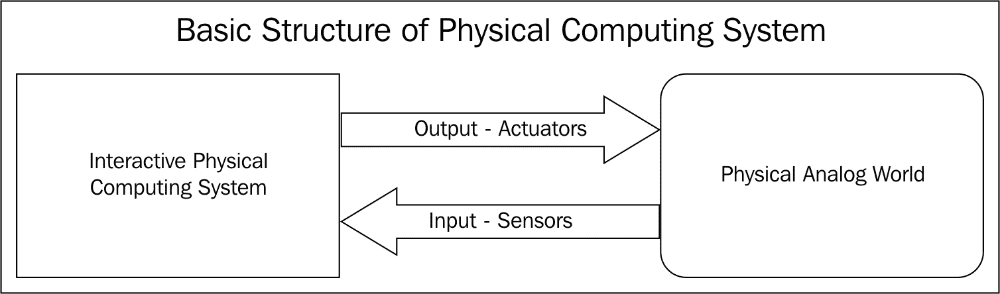

这些输入将由物理计算系统上的电子微处理器和控制器上运行的软件读取。基于该软件，将做出决策以提供输出，该输出从数字形式转换为模拟形式，或者根据执行器的类型在物理世界中产生变化。因此，基本上，一个动作是根据感觉执行的，就像人类的反射动作以及它们如何对不同感觉做出反应一样。因此，运行软件的微控制器或计算机芯片一起充当大脑，根据连接到硬件的传感器使用感觉做出决策。

让我们回顾一下之前讨论的基本实时示例，以清晰地了解系统的工作原理。跑步机是一种人们通常用于在原地行走或跑步的设备，用于健身房锻炼，或者有些人甚至在他们的家中安装跑步机。这些设备由电动机驱动，并配备一个传感器来读取电动机的运行速度，以及一个带有显示屏和按钮的微控制器单元/计算机系统，该系统运行特殊软件，从传感器读取这些输入以测量速度，并从用户那里获取输入以使跑步机以特定速度运行。以下图示了一个基本的跑步机，下面你可以看到一个基本的框图：

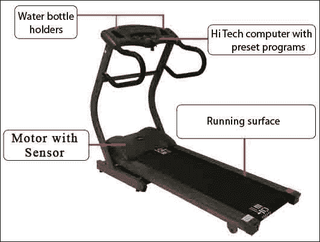

所以，基本上，正如你在前面的图中看到的，跑步机有一个 HiTech 电脑控制台，带有按钮和基本显示屏，用户可以通过它选择自己想要的跑步速度。电脑连接到电机控制器，通过读取速度传感器来测量速度，并使用电脑上运行的算法来调节它，电脑的输出控制到电机控制器以维持电机的速度。如果你看一下下面的图，你会理解得更好，因为方块图清楚地显示了操作过程：

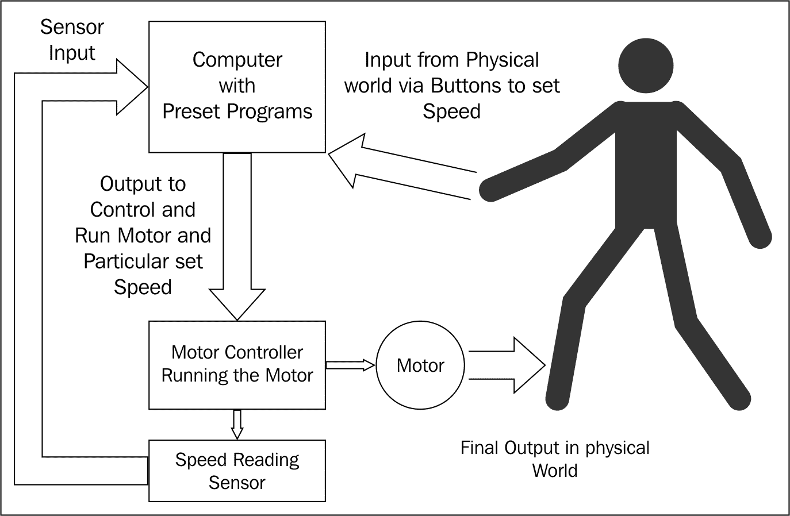

通过查看跑步机示例，你应该已经对物理计算系统的基本结构和它们的操作有了清晰的认识。让我们继续深入了解系统硬件中的电子部分，然后看看软件是如何与硬件协同工作以做出决策和提供输入的。

在我们讨论物理计算系统的硬件结构之前，让我们快速看一下基本的计算机结构，如图所示，因为物理计算系统基本上是从计算系统演变而来的；物理计算系统的结构包括基本的计算系统，并增加了接口：

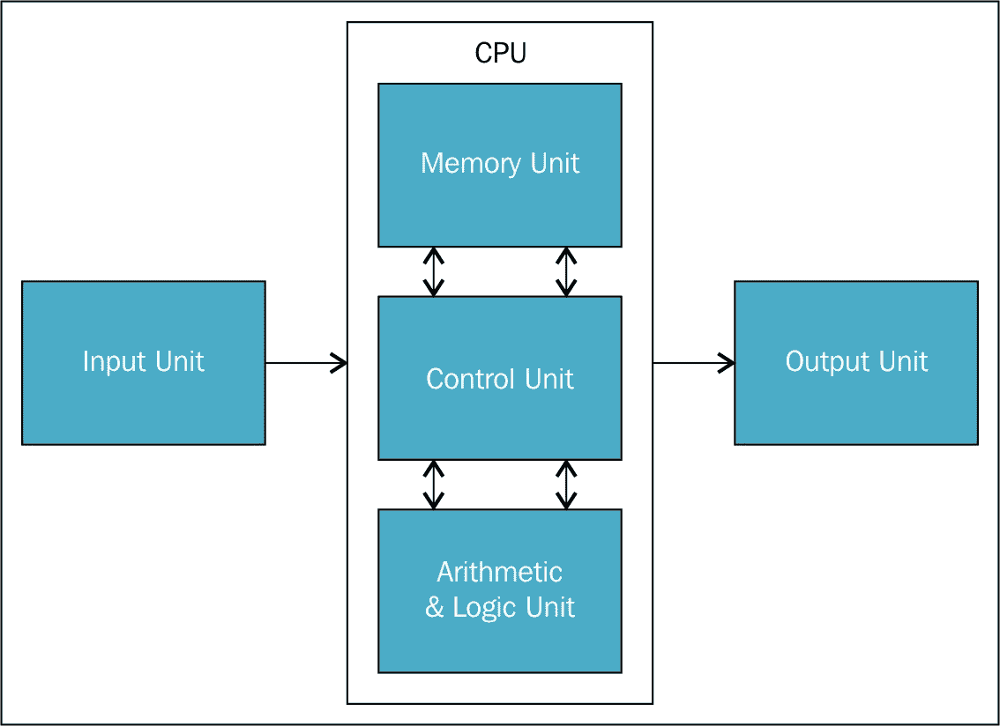

上图是基本计算机的方块图，它包含**中央处理单元**（**CPU**），它将数据存储在内存单元中，并在算术逻辑单元中处理它，控制单元基本上执行所有其他单元之间的数据传输，使它们协同工作。输入和输出都连接到 CPU。如果你看一下下面基本计算机的图像，你可以看到系统单元是 CPU，显示器和扬声器是输出设备，同样，键盘和鼠标是输入设备：


基于运行在 CPU 上的软件，键盘和鼠标的输入在硬件上执行处理，我们可以在显示器上看到输出，也可以通过扬声器听到。计算机是高级物理计算系统，它们具有专用软件，运行的操作系统，以及各种通信协议。现在我们已经清楚了解计算系统的结构，让我们看看嵌入式硬件系统（如 BeagleBone Black）的结构。我们首先将查看基本结构，然后是针对 BeagleBone Black 的详细硬件方块图：

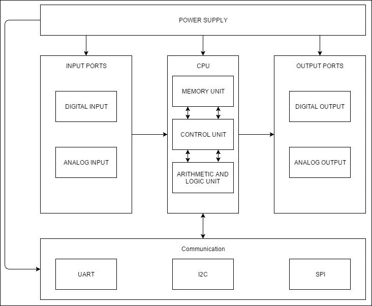

在前面的图中展示了任何物理计算嵌入式硬件系统的基本框图，换句话说，就是带有微控制器和微处理器的嵌入式系统。将前面的框图与计算机的基本框图进行比较，你可以看到输入和输出端口在前面的框图中得到了详细的阐述和解释，其中你可以看到数字和模拟输入端口与 CPU 相连，同样地，我们还有具有模拟和数字输出的输出端口。我们还有如 UART、I2C、SPI 等通信端口。

用基本术语来说，数字输入端口能够读取特定的直流电压或两个设定极限之间的直流电压范围，将其作为高电平，同样地，将其作为低电平，换句话说，就是我们计算机语言中使用的数字高电平和数字低电平。一个数字输入的例子可以是开关的按下：当它闭合时，它是高电平，换句话说，是`1`，而当它打开时，它是低电平，换句话说，是`0`。模拟输入端口是那些接收一定范围内的模拟电压并将其转换为数字输出形式的端口，以便通过将其转换为 0s 和 1s 或数字高电平和低电平来使 CPU 能够理解。一个模拟输入的例子可以是模拟温度传感器，它感知周围的温度并提供一个从最小值到最大值的电压，这个电压对应于传感器周围的温度。将模拟电压值转换为数字值的转换器被称为**模数转换器**（**ADCs**）。同样地，还有只提供高电平和低电平的数字输出端口，以及将数字值转换为模拟输出的模拟输出端口。一个模拟输出的例子可以是来自手机和音乐播放器的音频输出或通过模拟信号的视频。我们还有通信端口，包括基于不同协议的通信端口，如 UART、I2C、SPI 等。输入、输出和通信端口的可用性因设备而异，这取决于它们使用的微控制器或微处理器以及系统的架构。

现在，让我们详细看看 BeagleBone Black 的硬件结构，如下面的图所示：

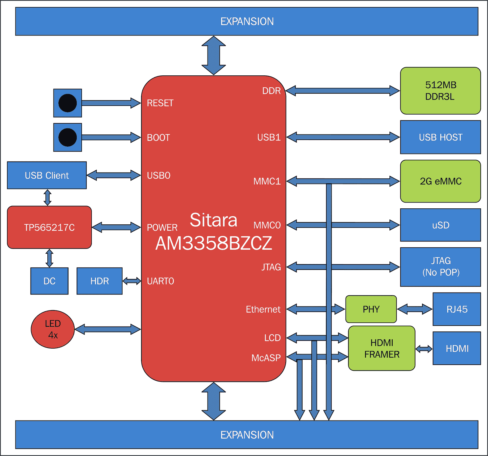

所以，正如你在前面的框图中所看到的，CPU 由 Sitara AM3358BZCZ 处理器组成，拥有 2 GB 的 eMMC 存储作为**只读存储器**（**ROM**）和 512 MB 的**随机存取存储器**（**RAM**），以及不同的外部端口用于接口，如 HDMI 用于视频、USB 客户端用于 USB 通信、RJ45 端口用于互联网接入等。其结构类似于我们熟知的基本计算机，正如我们所知，BeagleBone 板不过是一个带有 GPIO 的单板计算机。扩展头块包含 GPIO，可以根据我们基于处理器上运行的软件如何希望它为我们工作而将其设置为数字输入或数字输出。扩展头还包括模拟输入以读取模拟值。我相信这一部分可能已经给你一个关于物理计算系统基本结构的清晰概念，以及我们的 BeagleBone 板也是以类似的方式构建的。

## 应用领域

几个物理计算系统应用领域包括几乎所有现代科技小工具和机器，从你的手机、火灾报警器和婴儿监视器，到家庭自动化和工业自动化电子系统，以及家庭和工业中使用的机器人系统。

例如，商场中带有喷淋系统的火灾报警器基本上是通过传感器感应温度和烟雾，一旦检测到火灾事件，它们就会启动喷淋系统，通过管道和泵从水箱中喷水，使用的是持续运行专门编写软件的控制系统来完成这一操作。

同样，家庭自动化系统、连接到互联网的婴儿监视器可以帮助你将家庭电子设备连接到互联网，运行在服务器上的专用人工智能软件程序操作空调、照明和供暖等，从而让你的生活更加便利。类似的用途在工业领域也很常见，其中机器人正在制造业中产生巨大影响，如今许多机器人调酒系统正在使用中。

因此，我希望你现在应该能够清晰地想象出我们周围物理计算系统的存在以及它们是如何工作的。

在接下来的章节中，我们将探讨不同项目的构建以及使用这些扩展头上的端口，包括数字输入和输出以及模拟输入，以感应来自物理世界的输入，并通过在 Python 上编写代码来构建软件，使系统能够根据感应到的输入提供相应的输出。

# 项目 – 使用按钮切换 LED

现在我们已经清楚地了解了物理计算系统是什么以及它们是如何工作的，让我们继续使用 BeagleBone Black 构建自己的物理计算系统，通过将按钮开关连接到系统作为输入，并将 LED 作为输出。我们编写的软件程序将决定 LED 根据按钮开关的输入做什么。

我们已经知道如何将 LED 连接到 BeagleBone 板，也知道如何用 Python 编程来打开和关闭 LED，就像我们在上一章的项目中实验的那样。在这个项目中，我们将使用我们获得的知识以及我们现在将要学习的内容，在继续构建物理计算系统之前。现在我们知道如何接口 LED，让我们学习如何接口按钮，并使用 Python 从连接到 BeagleBone 板的按钮读取输入值。

首先，将按钮连接到 BeagleBone Black，如图所示：

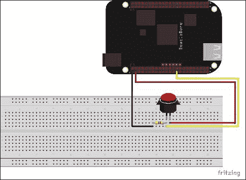

一旦您将按钮开关连接到 BeagleBone Black，如图所示，通过开关和电阻将状态拉低到 LOW，当按钮未按下时，让我们继续通过 Python 交互式 shell 读取开关的输入。

拉下和拉上电阻用于保持输入状态，无论是低电平还是高电平输入都作为 GPIO 引脚的输入。您可以在网上进行自己的研究，了解更多关于下拉和上拉电阻的信息。

打开 Python 交互式 shell：

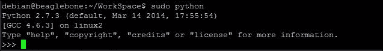

使用以下代码行导入 GPIO 库：

```py
import Adafruit_BBIO.GPIO as GPIO

```


然后，让我们使用以下命令将 BeagleBone Black 的 GPIO `P9_27`定义为输入引脚，我们将使用该引脚连接开关：

```py
GPIO.setup("P9_27", GPIO.IN)

```


接下来，使用以下命令读取 GPIO 的当前状态：

```py
GPIO.input("P9_27")

```


这应该会打印出 GPIO P9_27 的当前状态；在前面截图的输出中，它是`0`。现在设置如图所示，按钮没有被按下；这就是为什么 P9_27 GPIO 的读取值为`0`的原因：

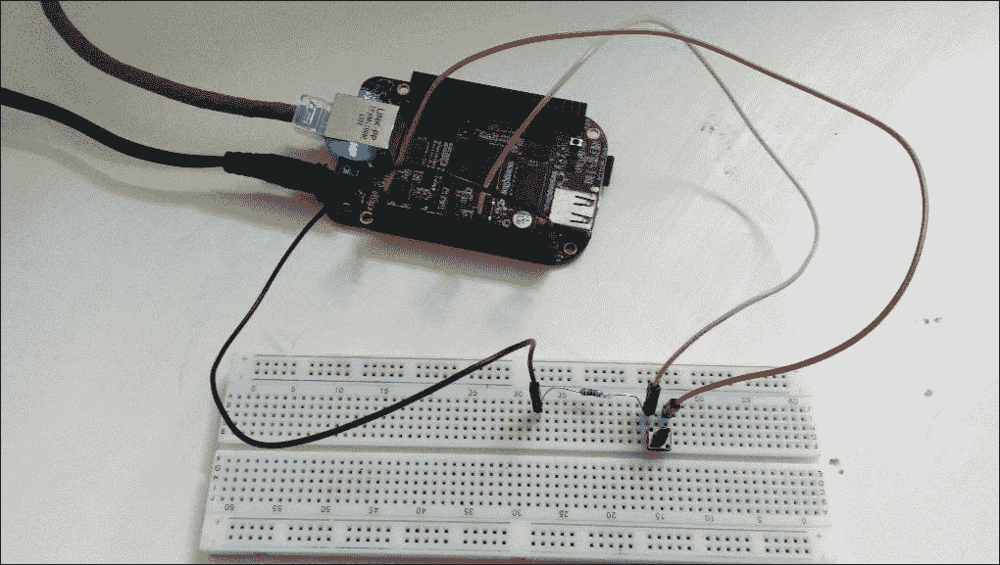

当您按下按钮并保持它，然后读取输入时，您将得到`1`的输入值，如图所示：


因此，如图所示，当按钮被按下时，将读取的值是`1`，如图所示在 Python 控制台上：

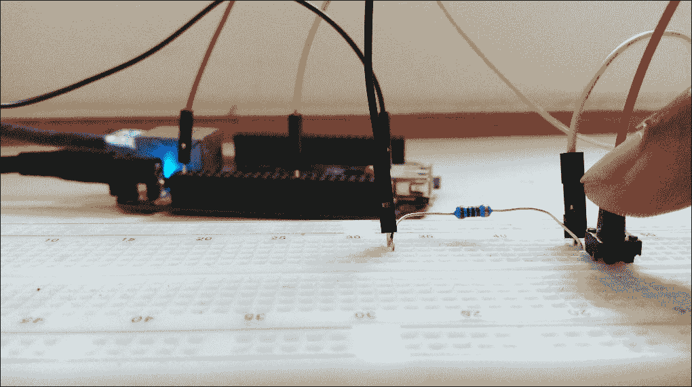

现在我们知道了使用哪些基本功能可以读取按钮的输入状态，让我们继续编写 Python 程序，该程序将实时读取按钮状态并每半秒打印一次。

首先，让我们创建一个 Python 文件：


然后，让我们按照以下截图所示输入程序并保存：

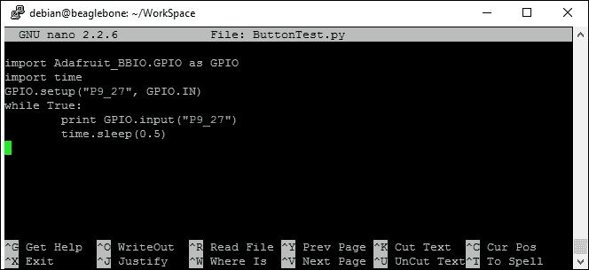

接下来我们将运行 Python 代码：

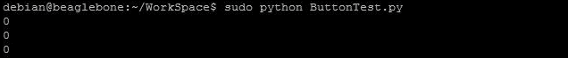

当你运行 Python 代码时，如果你没有按下按钮，输出将如前一个截图所示。

当你按下并保持时，输出将如下截图所示：


当你再次释放按钮并让它回到原来的位置时，输出将如下截图所示：


现在，让我们修改代码，使其在每次按下按钮并释放时打印按钮被按下，而不是打印开关的当前状态。将 Python 代码保存为`ButtonPress.py`：

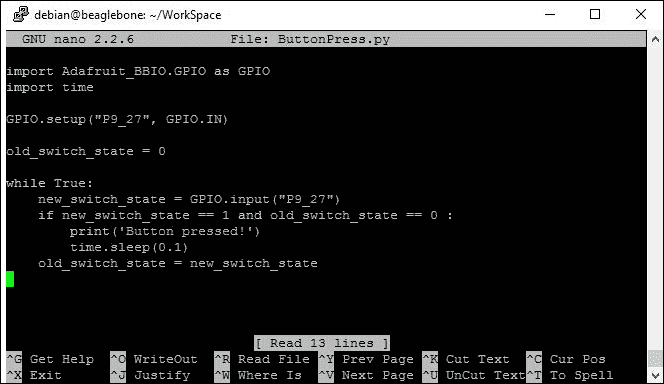

当你运行代码并按下按钮时，你将得到如下截图所示的输出：


每次你按下按钮并释放时，你将在 shell 上得到**按钮被按下**的文本输出。

现在我们已经找到了打印按钮按下事件的逻辑，我们将继续修改这段代码，以便每次按下按钮时都能切换 LED 的开和关状态。

在我们继续编程 BeagleBone Black 以切换 LED 之前，让我们将 LED 连接到 BeagleBone Black，如下所示，包括按钮开关电路图：

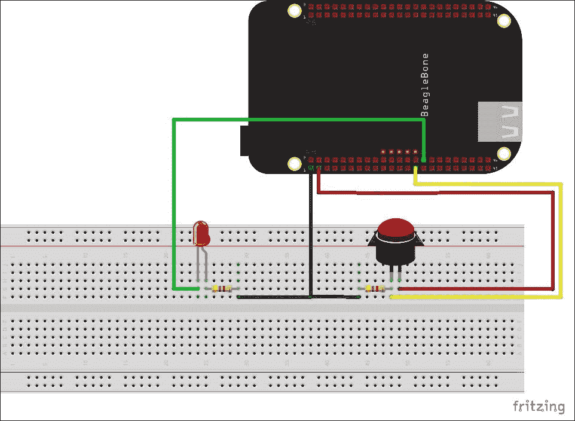

现在，编写程序以在每次按下按钮时交替将 LED 切换到开和关状态，如下截图所示，并将文件保存为`ButtonLEDToggle.py`或你选择的名称：

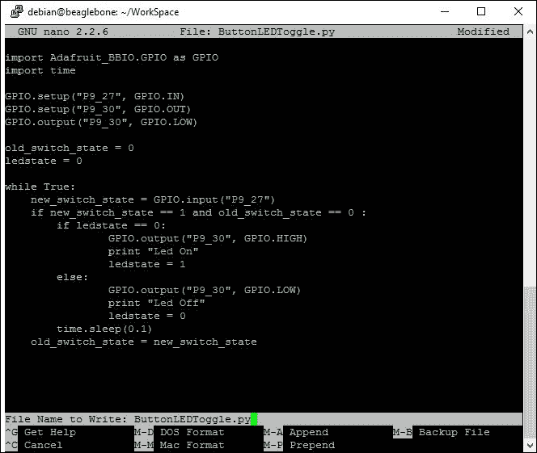

然后，当你运行代码并按下按钮时，你可以看到每次按下按钮时 LED 都会交替开启和关闭。输出将如下截图所示：

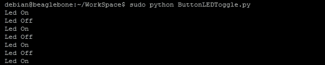

当 LED 关闭，如下所示：

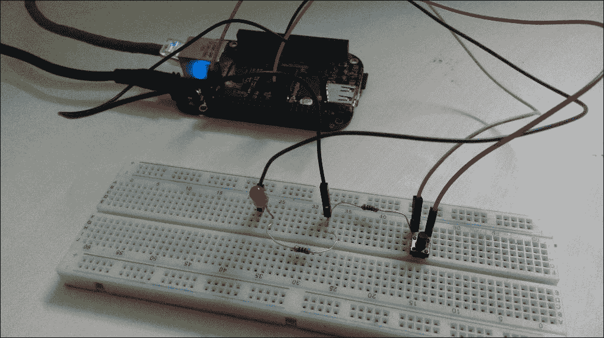

当你按下按钮并释放时，LED 将点亮，如下所示：

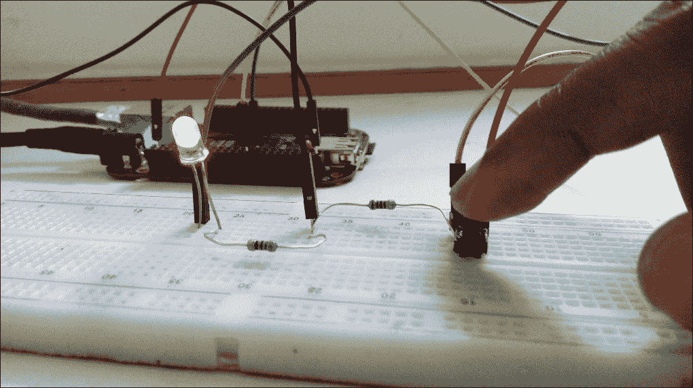

再次按下按钮时，LED 将切换回关闭状态：

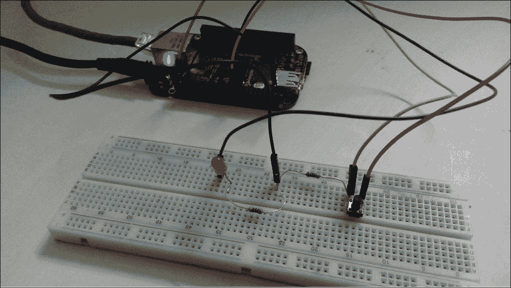

每次你按下按钮时，这将会交替发生，LED 将切换到高电平和低电平状态。

# 摘要

我们已经到达了本章的结尾，我们学习了物理计算系统如何工作的基本概念，这是通过这些系统的基本结构以及以 BeagleBone Black 为例来实现的。我们还讨论了现实世界中的几个应用领域。然后，我们看到了如何将按钮开关与 BeagleBone 板连接，并编写 Python 代码通过访问 GPIO 引脚作为 Python 的输入来读取其状态。最后，我们进行了一个非常基础的项目，以了解我们如何构建自己的物理计算系统，该系统能够感知并响应物理世界，使用按钮和 LED 在每次按下按钮时将 LED 从开启切换到关闭状态。

在下一章中，我们将看到如何使用模拟温度传感器构建一个更复杂的物理计算系统，这与从按钮输入读取的数字输入不同。但在你进入下一章之前，我建议你编写不同的程序，利用按钮按下事件让 LED 执行你喜欢的任何操作；例如，你可以计算需要按下多少次按钮，然后根据这个数量，让 LED 闪烁那么多次，然后回到等待下一次点击数量的模式。尝试你脑海中出现的任何想法，并与硬件和编码进行互动。
