# 第四章：使用 BeagleBone 的实时物理计算系统

在本章中，我们将专注于使用 BeagleBone 板构建一个实时物理计算系统。在本章中，我们将把 LM35 温度传感器模块与 BeagleBone Black 连接起来，以便了解如何将传感器与 BeagleBone 板连接，使系统能够与物理世界交互。我们将从传感器周围的物理世界获取环境温度作为模拟输入读数，并编写 BeagleBone 板的代码，使连接到 BeagleBone 板的 LED 根据传感器测量的温度以不同的颜色发光。因此，到本章结束时，你将构建一个使用 BeagleBone 板的交互式物理计算系统，该系统能根据测量的温度输出 LED 指示。本章内容分为以下主题：

+   前提条件

+   温度传感器 – LM35

+   将温度传感器连接到 BeagleBone 板

+   简单项目：根据温度传感器测量的室内温度改变颜色的双色 LED 指示器

# 前提条件

本主题将涵盖您开始本章所需的部分。这些可以从您最喜欢的电子业余爱好商店购买，或者可以直接在线订购。

## 需要的材料

+   1 个 BeagleBone Black

+   1 张带有最新版 Debian 操作系统的 microSD 卡，用于从 microSD 卡启动 BeagleBone 板

+   1 个 5V DC，2A 电源

+   1 条以太网线

+   1 个 LM35 温度传感器

+   1 个双脚双色 LED

+   1 个 220 欧姆电阻

+   1 块面包板

+   一些公对公跳线

+   1 个多用电表（可选）

# 温度传感器

温度传感器只是一个感应周围环境温度并给出传感器输出端电压变化的电子芯片。通过使用它，我们可以计算出被感应的温度。市场上有很多不同类型的传感器，但我们将使用最易获得的，并且是最受业余爱好者欢迎的传感器。这是 LM35 温度传感器模块，它是一个模拟输出传感器，电压可以直接转换为温度值，根据传感器的制造商提供的公式，如传感器数据表所述：

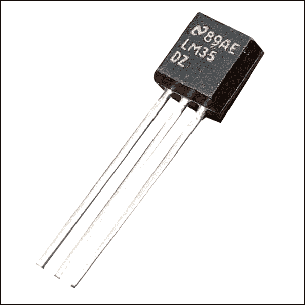

## LM35 传感器如何工作？

LM35 温度传感器背后的基本原理是它将传感器周围的周围环境温度按比例转换为模拟电压。

在以下图片中，您可以看到 LM35 温度传感器的引脚终端，其中一个终端是输入，它接收供电输入电压，其余的是输出和地。

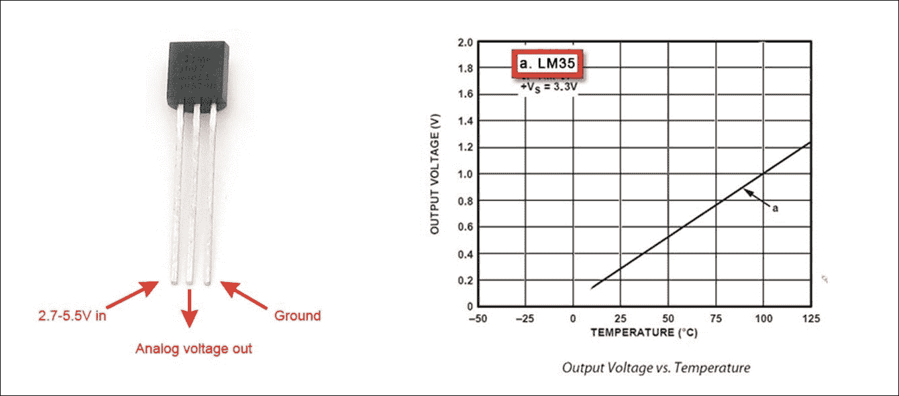

因此，一旦你将电源输入连接到温度传感器并与地连接，就可以测量出相对于地，模拟电压输出端子的模拟电压，如上图所示。

例如，假设测量到的输出端子和地之间的电压为 1 伏特，环境温度为 100 摄氏度，我们可以使用上图中的曲线推断出来。

而且，从 LM35 的数据表中，我们可以推断出每 10mV 与 1 摄氏度成正比。因此，如果我们知道模拟输出电压（mV），我们可以使用以下公式计算摄氏度温度。

> *温度（°C）= (输出电压（mV）×/ 10)*

为了验证温度传感并测试在继续到下一个主题——将传感器与 BeagleBone 板接口之前，传感器是否工作正常，你可以使用万用表测量输出端口的电压，同时为 LM35 温度传感器提供外部电源和公共接地引脚。根据测量的电压，你可以使用之前的公式计算温度。你可以将热或冷的物体靠近传感器或在其上方，以观察电压变化。

# 使用 LM35 传感器进行温度传感

现在我们已经了解了 LM35 温度传感器的工作原理，让我们继续探讨如何通过将其连接到 BeagleBone 板来测量温度。

首先，取三根 berg 电缆，按照以下图像中显示的电路图将 LM35 温度传感器连接到 BeagleBone 板。

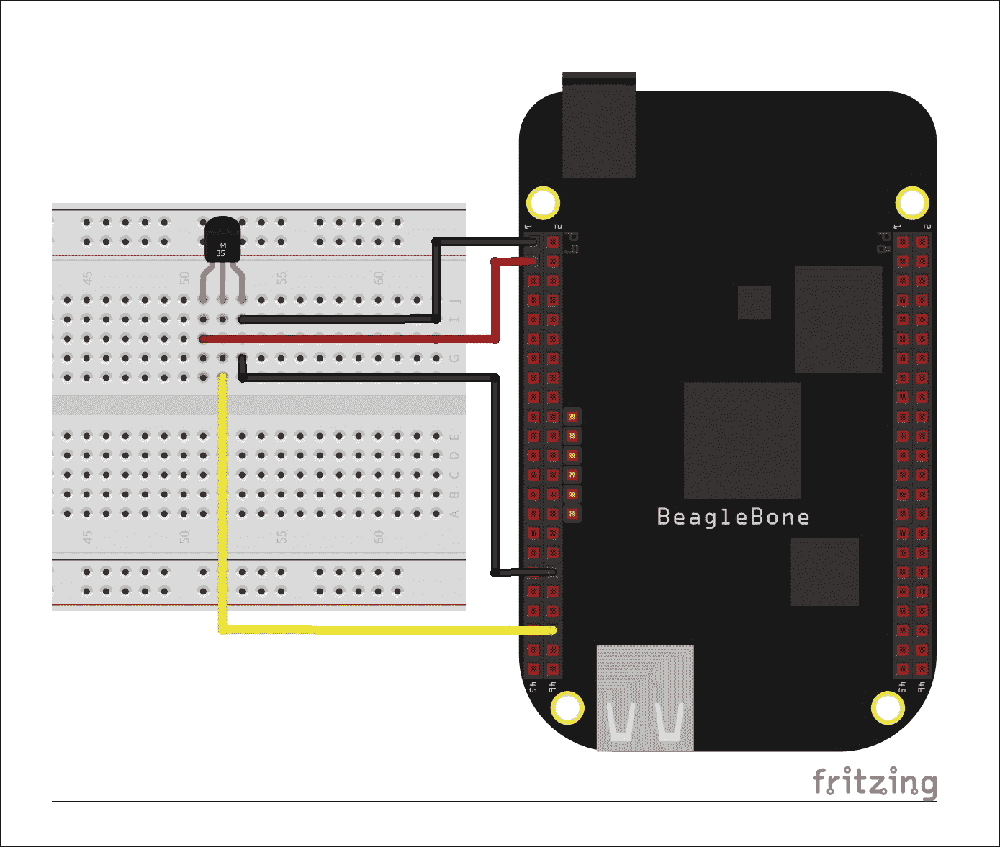

然后，我们将打开 BeagleBone 板，然后登录 Linux Shell 以开始编码。我们将访问 `WorkSpace` 文件夹，在那里我们保存了之前章节中已经创建的所有 Python 脚本。到现在你应该熟悉如何导航到 `WorkSpace` 目录。

要这样做，输入命令 `cd WorkSpace`：


一旦你处于 `WorkSpace` 目录中，在编写读取温度数据的脚本之前，让我们通过 Python 控制台来测试它，你应该现在已经熟悉了它。

输入命令以启动 Python 交互式编程 shell，`sudo python`：


一旦我们进入 Python 交互式 shell，让我们通过输入 `import Adafruit_BBIO.ADC as ADC` 来导入 Adafruit GPIO 库，以读取 BeagleBone 板上的 ADC 输入。

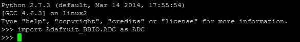

接下来，我们需要初始化 ADC，通过输入以下命令：`ADC.setup()`


要读取连接到温度传感器输出端口的 ADC 读取值 `P9_40`，使用以下命令：

```py
ADC.read("P9_40")
```

BeagleBone 板上的 ADC 端口为 12 位，相当于 *2¹² = 4096* 个单位最大，这些模拟引脚可以提供的最大电压为 1.8 V。这意味着这些引脚的电压输入，从 0 到 1.8V，与 0 到 4096 ADC 单位成比例，但在 Python 中，Adafruit 库给我们提供的读数在 0 到 1 之间，这与 0 到 1.8V 成比例。使用 ADC 读函数读取端口`P9_40`的 ADC 读数如下所示：


因此，您可以看到端口`P9_40`上的 ADC 读数为`0.19445`。

现在，让我们将其保存到一个变量中，以计算它是多少伏特。让我们创建一个名为`reading`的变量，并存储如下截图所示的测量 ADC 读数：


然后，让我们继续将 ADC 读数转换为毫伏（mV）。我们知道 ADC 能够读取 0 到 1.8V，这在 Python 中与 0 到 1 的 ADC 读数单位成比例，换句话说，1.8 V = 1800 mV。

*测量的毫伏数 = (ADC 读数) * 1800*

*测量电压 = (ADC 读数) * 1.8*

也就是说，在我们的情况下，在 Python 控制台中，您可以创建一个名为`millivolts`的变量，该变量将保存传感器输出引脚相对于地引脚测量的电压，如下截图所示：


如前一张截图所示，您将得到传感器输出电压引脚上的电压值（毫伏）。现在，我们可以继续使用我们在本主题开头从数据表中获得的信息的公式，将测量的毫伏数转换为摄氏度。如下截图所示，通过创建一个名为`temp_c`的变量来保存温度（摄氏度）：

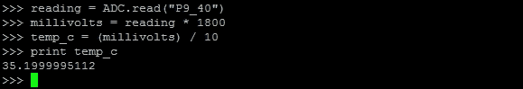

如果我们打印`temp_c`值，我们将得到如前输出所示的结果。

现在，让我们继续编写一个 Python 程序，该程序将每秒打印温度传感器的值。

创建 Python 脚本文件，`sudo nano TestLM35.py`：


按如下截图所示输入代码：

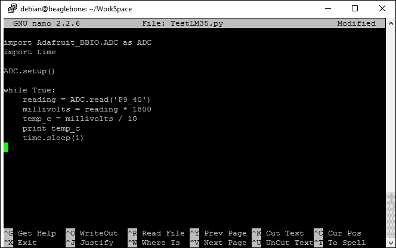

在输入代码后，您可以使用 *Ctrl* + *X* 命令保存它。

当您运行程序时，您应该会看到如下截图所示的输出：


因此，在先前的截图中，你可以看到传感器周围的温度（以摄氏度为单位）每秒打印一次。如果你已经成功完成这一步，那么你已经成功将 LM35 温度传感器与 BeagleBone 板和 Python 连接起来。作为与 BeagleBone 板连接和测试 LM35 的进一步步骤，让我们看看 LM35 与 BeagleBone 板连接是否能够检测到温度的上升，方法是将点燃的火柴放在传感器附近。

将点燃的火柴放在传感器附近，如图所示：

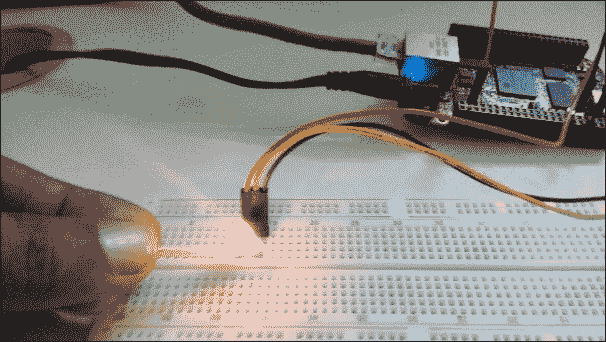

你可以看到，当你将点燃的火柴靠近温度传感器时，温度读数会上升，如下截图所示：


当你将火柴从传感器上移开时，它将再次下降，如下截图所示：


因此，现在我们知道了如何将 LM35 温度传感器与 BeagleBone 板连接并读取温度传感器的读数，在本书的下一个主题中，也就是我们的主要项目，让我们通过在 BeagleBone 板上添加双色 LED，使用 Python 编程构建一个实时物理计算系统。

中级项目：根据测量温度改变 LED 颜色：

1.  按照以下图片连接电路：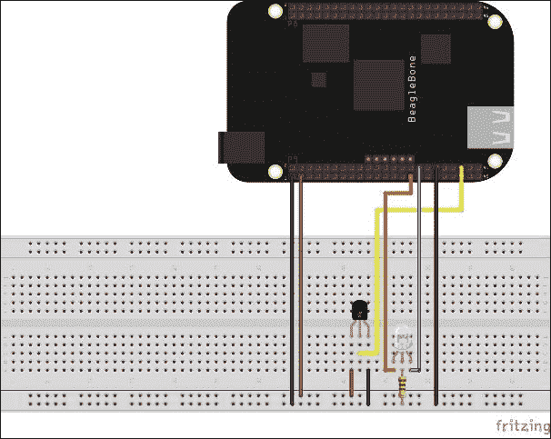

1.  编写 Python 脚本。

    如我们所知，我们已经学会了如何将温度传感器与 BeagleBone 板连接，以及如何通过 Python 开关 GPIO 的开关来点亮 LED，现在我们将结合这两个之前的实验。让我们编写一个 Python 脚本来根据温度传感器的测量值使 GPIO 处于高电平或低电平。按照以下截图所示，在`TestLM35.py`文件中写下代码，并将其保存为不同的名称`LM35nLED.py`：

    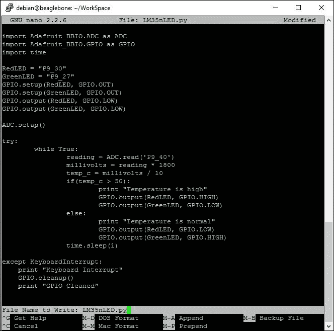

1.  现在，当你使用命令`sudo python LM35nLED.py`运行代码时，你应该看到以下结果：

你的设置应该如下截图所示，在一个环境温度低于 50 摄氏度的房间里：

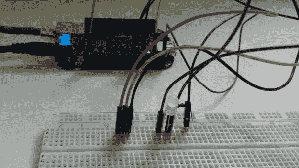

当你执行 Python 程序时，输出将如下所示：


当你点燃一根火柴并将其放在传感器前时，输出将如下所示：

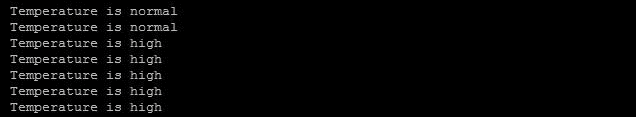

然后 LED 将变为红色，如图所示：

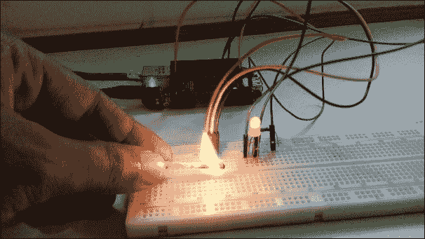

当你将火柴从传感器上移开时，它将变回绿色。

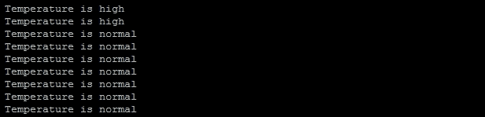

现在我们有一个系统，它从物理世界获取输入（传感器周围的周围温度），并根据该输入在环境中改变某些东西，例如 LED 颜色，温度信息打印在 Linux shell 上。这使我们到达了这一章的结尾，我们在这里使用 BeagleBone Black 构建了一个基本的物理计算系统。

# 摘要

在本章中，我们学习了关于温度传感器以及它们如何与 BeagleBone 板连接以通过将传感器连接到 BeagleBone 板的模拟输入读取引脚来获取温度测量值。然后我们编写了一个代码，根据从 LM35 温度传感器获得的输入做出决策，决策是打开一个连接到双色 LED 的特定 GPIO 引脚，以便根据传感器周围的周围温度改变 LED 的颜色。因此，这样我们就在 BeagleBone Black 上使用 Python 启动了一个实时物理计算系统。但这只是本地计算，决策是基于在本地系统上运行的程序做出的，所有数据都在本地系统中。

现在，在下一章中，我们将继续构建一个更高级的实时物理计算系统，该系统连接到互联网，传感器数据从连接到互联网的 BeagleBone 板发送到云服务器。
