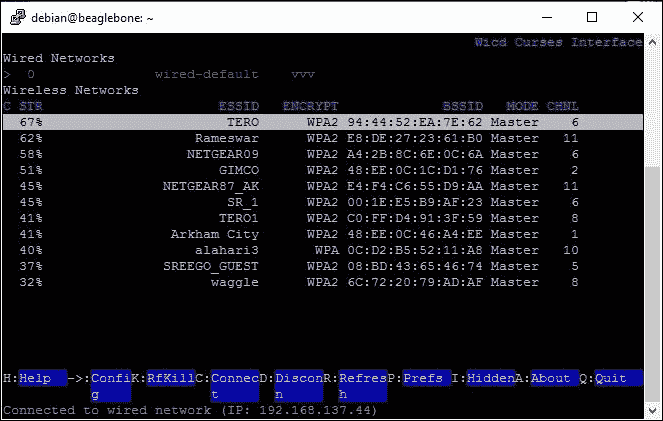

# 第五章. 将物理计算系统连接到互联网

在本章中，我们将专注于将 BeagleBone 板连接到互联网，以便将我们构建的物理计算系统连接到互联网。首先，我们将探讨通过以太网为 BeagleBone 板提供互联网访问，然后我们将学习如何为 BeagleBone 板添加 Wi-Fi 功能，以便我们构建的系统可以放置在任何有 Wi-Fi 访问的地方，并且不受仅在有以太网的地方设置系统的限制。完成这些后，我们将继续构建两个项目；在第一个项目中，我们将通过运行在 BeagleBone 板上的 Python 程序，在温度传感器读数超过设定水平时发送电子邮件警报。下一个项目将是一个基本的物联网入门项目，其中 BeagleBone 板将把温度传感器数据上传到互联网上的云服务器。所以基本上，我们将利用在前几章中学到的知识，在本章中，将我们之前的项目提升到下一个层次。我们将通过将它们连接到互联网，并在云和邮件等消息服务上执行操作来实现这一点。本章内容分为以下主题：

+   前提条件

+   为你的 BeagleBone 板提供互联网访问

+   为你的 BeagleBone 板添加 Wi-Fi

+   中级项目：电子邮件警报火灾报警器 – 如果温度传感器读数超过设定水平，Python 程序将发送电子邮件

+   高级项目：传感器数据上传至云端 – 一个 Python 程序将通过 HTTP 网络服务将温度传感器数据上传到开源或免费云服务

# 前提条件

本主题将涵盖你开始本章所需的部件。这些可以从你喜欢的电子爱好商店购买，或者简单地在线订购。

## 需要的材料

在继续前进之前，我们需要以下材料：

+   1x BeagleBone Black

+   1x 带有最新版本 Debian 操作系统的 microSD 卡，用于从 microSD 卡启动 BeagleBone 板

+   1x 5V DC，2A 电源供应器

+   1x 网线

+   1x LM35 温度传感器

+   1x 兼容的 Wi-Fi 拓展卡

+   1x 面包板

+   几根跳线

# 为你的 BeagleBone 板提供互联网访问

通过以太网为 BeagleBone 板提供互联网访问非常简单。你只需要将网线的一端连接到 BeagleBone 板，另一端连接到有互联网连接的路由器。BeagleBone 板将通过 DHCP 从路由器动态获取 IP 地址并获取互联网访问。为了检查这一点，你只需输入以下命令：

`ping www.google.com`

你将获得以下截图所示的响应。这意味着你有一个正常工作的互联网连接。

实际上，ping 命令的作用是测试两个网络连接之间的连接和延迟。ping 命令向另一台网络计算机发送数据包，在我们的例子中是[www.google.com](http://www.google.com)服务器，或者该服务器的 IP 地址。你可以在上面的输出中看到[www.google.com](http://www.google.com)旁边，显示的是服务器的全球 IP 地址。图片显示了 ping 命令如何测量从该服务器计算机获得响应所需的时间，时间以毫秒为单位。

因此，为 BeagleBone 板提供互联网访问非常简单，运行一个像 Linux 这样的工作操作系统。这将自动从连接的互联网路由器通过 DHCP 获取 IP 地址。但在大多数情况下，我们需要一个设置，其中实时嵌入式系统是无线连接的，这为将系统放置在任何地方进行操作提供了更多灵活性，而不是将设置限制为连接到以太网电缆。本章的下一个主题将重点介绍如何设置 Wi-Fi 访问 BeagleBone 板。

# 将 Wi-Fi 添加到 BeagleBone 板

要将 Wi-Fi 功能添加到 BeagleBone 板，让我们将 Wi-Fi 适配器连接到 BeagleBone 板上可用的 USB 端口，如下面图片所示：

一旦你连接了 USB Wi-Fi 适配器，你可以通过输入以下命令来检查它是否已连接：

+   `lsusb`：如下面截图所示，USB Wi-Fi 适配器被突出显示，即**Atheros Communications, Inc. AR9271 802.11n**：

然后输入以下命令：

+   `iwconfig`：`iwconfig`将显示无线局域网连接状态的详细信息，如前一个截图所示，你可以看到被突出显示的 wlan1 目前没有与任何接入点关联的详细信息。

我们下一步是连接 Wi-Fi 适配器到 Wi-Fi 接入点。为此，我们将使用一个名为`wicd-curses`的程序，该程序在 Debian 中默认可用。

要使用该程序，我们需要输入以下命令：

+   sudo wicd-curses

执行命令后，你将得到一个如下截图所示的交互式程序窗口：

你可以在前面的截图看到，程序指出没有找到**无线网络**。这是因为我们需要首先设置 USB Wi-Fi 设备，然后在该范围内搜索可用的 Wi-Fi 接入点。为此，请按照以下截图所示的步骤进行操作：

按下 *Tab* 键一次以打开配置菜单，– 你应该会看到以下截图所示的屏幕：

一旦您看到这个屏幕，然后按一次翻页向上按钮——它应该会高亮无线接口区域，然后您需要在其中输入**wlan1**，如下截图所示。如果您还记得，**wlan1**是我们使用`iwconfig`命令获取由 USB Wi-Fi 网卡创建的接口详细信息时看到的接口名称。

然后，按*F10*键保存配置。一旦保存，它将带您回到如下截图所示的前一个主屏幕：

现在，您需要按一次*R*键来刷新程序并搜索 Wi-Fi 网卡可连接范围内的可用 Wi-Fi 接入点。按下*R*键后，您将看到一个如下截图所示的屏幕，表示正在搜索可用网络：

然后，扫描完成后，屏幕将显示如下截图所示的界面，列出范围内的可用 Wi-Fi 接入点：

一旦您有了可用 Wi-Fi 接入点的列表，您可以通过使用上下箭头键选择要连接的接入点。如以下截图所示，当您移动箭头键时，接入点会高亮显示。在这张图片中，**TERO**被高亮：

一旦您选择了想要连接的网络，当它被高亮显示，如前图所示，请按键盘上的**右箭头**键，您应该会看到如下截图所示的屏幕，要求输入密码进行连接：

您需要设置如下截图所示的选项，以便从路由器获取基于 DHCP 的 IP 分配，或者如果您想为您的 BeagleBone 板设置静态 IP，也可以这样做。使用*Tab*键在屏幕上切换字段。

因此，根据前述截图设置主机名并在密钥字段中输入密码，然后按*F10*键保存。完成这些操作后，您将回到主屏幕，显示可用的 Wi-Fi 接入点列表，如下截图所示：

现在，你可以按*C*键连接到网络。一旦按下，你的 shell 连接将会丢失，因为 BeagleBone 板将通过你登录的以太网连接断开网络连接。现在，BeagleBone 板将通过 Wi-Fi 连接到网络，因此 BeagleBone 板的 IP 地址必须已更改。为了检查这一点，我们需要登录到与连接 Wi-Fi 时相同的路由器的路由器配置页面。回想一下我们在第一章中是如何找到通过以太网连接到路由器的 BeagleBone 板的 IP 地址的。现在我们需要用 Wi-Fi 连接来做同样的事情。

按照以下方式打开路由器页面：

检查 DHCP 客户端列表：

因此，你可以看到通过 Wi-Fi 连接到网络的 BeagleBone 板的 IP 地址，如果你还记得，BeagleBone 是我们配置 Wi-Fi 时提到的主机名。现在让我们使用我们分配的新 IP 地址登录到 Linux shell：

一旦使用相同的用户 ID 和密码登录，再次输入命令`iwconfig`，你将看到 wlan1 连接到了我们配置并连接的 SSID，你可以在下面的屏幕截图中看到：

现在输入`ping`命令来检查网络连接性：

一旦我们在 BeagleBone 板上正确地建立了网络连接，我们就可以继续下一个主题：两个与互联网连接的项目。

# 中级项目：电子邮件警报火灾报警器

首先，就像上一章一样，拿三根伯格线，按照以下电路图将 LM35 温度传感器连接到 BeagleBone 板：

然后我们将打开 BeagleBone 板并登录到 Linux shell 以开始编写代码。

打开 Python 控制台，学习并测试如何使用 Python 发送电子邮件：

我们的第一步是将`smtplib`导入 Python，这是一个预定义函数的邮件传输协议库，我们将在程序中使用它。

接下来创建一个变量来存储你想要发送电子邮件的电子邮件 ID：

然后创建变量以存储你想要发送电子邮件的账户的电子邮件 ID 和密码：

使用 Gmail 主机名和端口号**587**创建一个 SMTP 对象：

EHLO 与 HELO 类似，但服务器的响应文本提供了关于服务器能力的计算机可读信息。这个响应有助于我们确认我们创建的 SMTP 服务器是否为我们提供服务：

接下来，我们需要创建一个安全连接。我们已经在最后一步检查了连接，但它是不安全的。STARTTLS 是一种将现有不安全连接升级为安全连接的方法，使用 SSL/TLS。你可以按照以下截图所示进行操作：

再次使用下图所示的 EHLO 来检查和创建运行中的 SMTP 实例：

我们的下一步是创建一个包含发件人电子邮件地址、收件人电子邮件地址和电子邮件主题详细信息的头变量：

我们需要创建另一个变量，我们将在这个变量中添加即将发送的电子邮件的消息头。

当你使用`print msg`命令打印出来时，你可以看到它如下截图所示的样子：

现在我们有了`msg`变量，其中包含了发件人电子邮件、收件人电子邮件、电子邮件主题和电子邮件消息的信息，如下面的截图所示。

我们的下一步是使用发件人电子邮件和密码登录到服务器。你可以按照以下截图所示进行操作：

如果你得到如前截图所示的响应，那么你已经成功登录。

接下来，使用`sendmail`函数，通过接收者电子邮件 ID、发件人电子邮件 ID 和消息作为参数发送电子邮件：

发送后，你可以继续关闭 SMTP 服务器并从其中注销，如下所示：

到目前为止，你一定已经收到了收件人电子邮件 ID 上的电子邮件，你可以看到主题**Python Email Test**，正如我们在 Python 中提到的，如下截图所示：

如果你打开电子邮件，你可以看到这条消息：

我们实际上可以看到消息内容与我们在 Python 控制台上打印的内容格式相似。点击 Gmail 上的**显示原始内容**选项，查看原始文本电子邮件，如图所示：

一旦点击**显示原始内容**，你将看到如图所示的电子邮件：

你可以看到邮件中高亮的部分，与我们从 Python 控制台组成并发送的消息完全相同，如图所示：

你现在可以退出 Python 控制台：

现在让我们继续编写 Python 程序，以便在温度过高时发送电子邮件。你可以直接编辑上一章项目中的代码，并保存为新的名称，如图所示：

保存后，你可以按照以下截图所示运行代码：

你现在应该会收到一封电子邮件，如图所示：

将火焰靠近传感器，如图所示：

运行中的 Python 代码输出将如图所示：

你将收到如图所示的电子邮件：

因此，我们的项目就结束了。当你移除火焰时，它将再次发送一封电子邮件，说明温度正常。以下是代码的工作原理：当温度水平发生变化时，也就是说，如果温度超过或低于设定的限制，它将发送一封电子邮件，说明温度过高或过低。

与本项目不同，本项目是通过使用温度传感器测量的温度来做出决策，然后根据这个决策发送电子邮件，下一个项目将直接将温度传感器数据上传到云服务器。

# 高级项目：将传感器数据上传到网络云

连接方式与上一个项目类似，唯一的区别是编写一个新的 Python 程序，使用 HTTP 调用方法将数据上传到免费云服务器。

使用与上一个项目相同的连接，将温度传感器连接到 BeagleBone 板。

然后，我们首先需要设置需要上传数据的云服务器。我们将使用专门为物联网应用设置的免费云存储空间网站。该网站是[www.thingspeak.com](http://www.thingspeak.com)，我们从众多可用的云解决方案中选择使用这个云解决方案，因为 ThingSpeak 使得从硬件上传数据到云用于物联网应用变得非常简单。他们有很多用于不同应用的、不同硬件开发板的示例。查看这些广泛的示例和简单的 API 将帮助您在使用 BeagleBone 板时进行更多的实验，比我们在本章中做的还要多。

在这个网站上，您需要做的第一件事是注册并创建一个账户：

一旦创建了账户，并且您可以登录到您的账户，您将看到以下屏幕截图所示的界面，并且需要点击**新建频道**：

当您点击**新建频道**时，它将要求您填写相同的详细信息。按照以下屏幕截图所示填写：

一旦输入了详细信息，您就可以点击**保存频道**：

您可以在以下屏幕截图中看到具有所示字段的频道：

接下来，我们应该查看 ThingSpeak 网站提供的 API，用于将数据更新到云服务器。

您可以在以下屏幕截图中查看您需要发送到 ThingSpeak 服务器的 HTTP 调用的 API 详细信息：

如前一个屏幕截图所示，我们可以使用 HTTP POST 数据更新云服务器上的数据。接下来的步骤将向您展示如何使用这个 HTTP POST 调用从 Python 更新云服务器上的数据：

首先，打开 Python 交互式控制台：

然后我们需要导入`requests`模块，这是一个 Python 库，它具有在 webservers 上执行 HTTP 请求的内置函数：

接下来，我们可以直接尝试使用以下屏幕截图所示的 API 直接向服务器发送 HTTP POST 请求：

突出显示的部分是在您向`https://api.thingspeak.com/update.json` URL 进行 POST 调用时传递给服务器的参数。

你可以看到我们提到了`field1=25`，这将更新到 ThingSpeak 服务器上。

响应将被存储在变量`r`中，当你`print r`时，如果你收到`200`的响应，那么数据已成功更新：

一旦你收到`200`的响应，数据就像以下截图所示已更新到网络服务器上：

使用`field1`数据等于`10`执行 HTTP POST 调用：

然后，你可以看到 field1 在该时间点已更新为新数据：

现在，我们将继续编写代码以连续更新温度数据到云服务器。我们可以使用我们的`TestLM35.py`代码对其进行修改，并以新名称保存，以便每 61 秒将温度数据更新到[`thingspeak.com/`](https://thingspeak.com/)服务器：

当你运行程序时，输出将如以下截图所示：

你可以使用*Ctrl* + *C*来结束程序并退出。

然后，如果你在 ThingSpeak 网站上的 field1 图表中查看数据，你可以看到数据已如以下图片所示更新。你可以看到时间戳，并看到两次数据更新实例之间的间隔为 1 分钟，温度读数值也与我们打印在控制台输出上的一致：

因此，我们已经成功编写了一个程序，每分钟更新数据并将其存储在云服务器上。

# 摘要

在本章中，我们学习了如何通过 Wi-Fi 为 BeagleBone 板提供互联网接入，以及当通过连接到 BeagleBone 板的温度传感器测量的温度高于或低于程序中设置的阈值时，发送电子邮件警报。我们还看到了如何使用 Python 从 BeagleBone 板向服务器发送 HTTP 请求来上传数据到云网络服务器。因此，在本章中我们学习了如何设置基本级别的物联网项目。你可以继续探索使用 Python 的`requests`模块在物联网中使用的各种免费开源云服务器上的 HTTP Put、Post 和 Get 请求的选项，这些服务器就像我们本章使用的[`thingspeak.com/`](https://thingspeak.com/)一样。有选项可以让你在不需要使用 HTTP POST 请求上传数据的情况下从云服务器获取数据；也就是说，你可以从云服务器读取数据并在 Python 程序中打印它。你可以像本章中那样读取服务器上的数据而不是上传数据，我建议你探索所有这样的可能性。

在下一章中，我们将继续设置我们自己的网络服务器并将其连接到互联网。一旦你学会了这一点，将来如果你可以使用一块 BeagleBone 板作为网络服务器，而不是本章中使用的第三方服务器，另一块 BeagleBone 板可能正在使用另一块 BeagleBone 板上传数据到我们设置的服务器。
