# 第十章. 构建你自己的机器人

在本章中，我们将了解如何使用 BeagleBone Black 和与之接口的电机和电机驱动 IC 来构建自己的机器人。首先，我们将了解直流电机，然后是 L293D 电机驱动 IC，它将帮助我们驱动直流电机。然后我们将了解如何从连接到 BeagleBone 板的摄像头在网页上实时流式传输视频。最后，我们将构建一个可以远程控制的机器人，你可以通过网页上的实时视频流从连接到 BeagleBone Black 的摄像头来控制它。

本章内容分为：

+   前提条件

+   直流电机和 L293D 电机驱动 IC

+   BeagleBone 板上的实时视频流

+   高级项目：带有实时视频流的遥控机器人

# 前提条件

本主题将涵盖你开始构建机器人所需的部件。这些材料可以从你当地的电子爱好商店购买，或者从 Adafruit、Sparkfun、Seed Studio 等网站在线订购。

## 需要的材料

+   1x BeagleBone Black

+   1x 带有最新版本 Debian 的 microSD 卡，用于从 microSD 卡启动 BeagleBone 板

+   1x 5V DC，2A 电源/移动电源，具有 5V 2A 或更高输出

+   1x USB WiFi 外置设备

+   1x 面板

+   2x 50 至 100 RPM 范围内的 12V 直流电机

+   1x L293D 电机驱动 IC

+   1x USB 摄像头

+   1x USB 集线器

+   1x 12V 或 9V 电池

+   1x USB 线

+   1x 直流柱状插头

+   连接线

# 直流电机

直流电机是一种使用直流电源运行的电机。


如前图所示，它有两个端子线。我们可以称其中一条端子线为正极，另一条为负极。通常，这些线被标记为红色和黑色，红色代表正极，黑色代表负极。尽管这些线被标记为正负极，但与电池不同，电池的极性不能混合，在这里的直流电机中，它们可以混合。

例如，在一个电机上，如果正极线连接到电池的正极，负极线连接到电池的负极或电源，电机将按顺时针方向旋转。当你反转连接，例如从电机的正极到电池的负极，电机的负极到电池的正极，那么电机将按逆时针方向旋转，如下图所示：

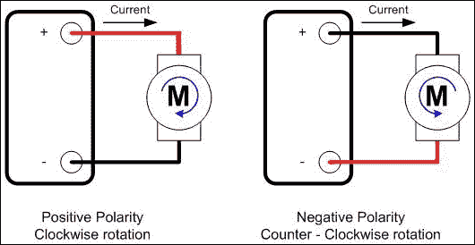

当电压源连接到电机的端子时，其极性控制直流电机的旋转方向，而直流电压源的幅度则决定了其速度。

但是，每次手动改变极性和开关电路都是一项繁琐的工作，我们需要一个电子电路来帮助我们完成这项工作，而无需物理切换连接。这就是电机驱动 IC 将派上用场的地方，以数字输入完成这项任务。其中一种电机驱动 IC 是 L293D，我们将在下一节讨论。

# L293D 电机驱动 IC

如我们之前提到的，L293D 可以被定义为 H 桥电机驱动电路，它被制作成 IC，使我们能够使用数字输入驱动直流电动机。

**L293D**的引脚配置如图所示：

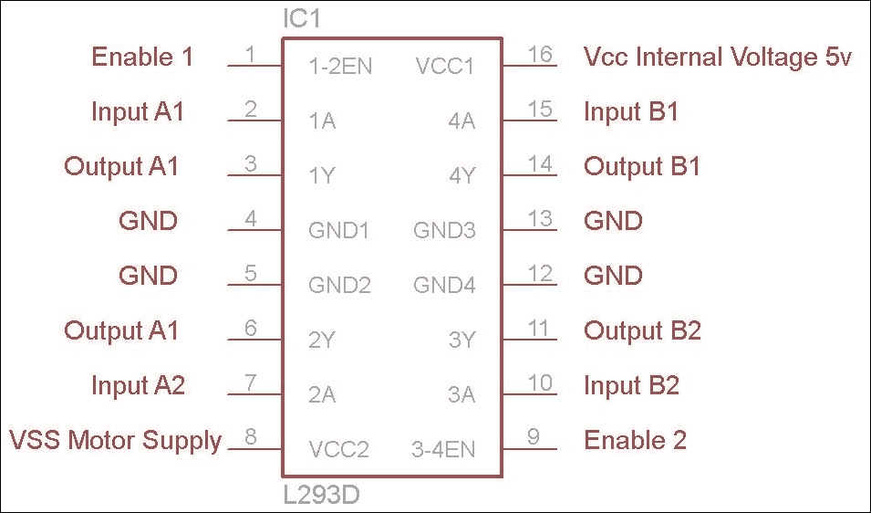

如前图所示，在 L293D 中，有四个输入引脚和四个输出引脚。两个输入引脚，即第二个和第七个引脚，调节连接到输出引脚三和六的电动机的旋转。同样，右侧的输入引脚，即第十五个和第十个引脚，调节连接到输出引脚十一和十四的电动机的旋转。左、右两侧的使能引脚一和二，位于 IC 的第一个和第九个引脚上，根据 IC 该侧的输入来启用输出操作。电动机根据输入引脚提供的逻辑`0`和逻辑`1`来旋转。为 IC 的**Vcc**引脚供电**5V**以供其工作，并将地引脚连接到地线和电源的负极。最后，您需要将直流电源/电池的正极连接到**Vss**引脚，为电动机提供电源，并将电源的负极连接到**GND**引脚。

请参考以下图片中的电路连接：

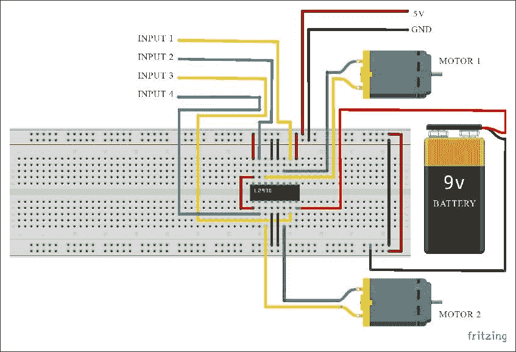

对于前面所示的电路，当输入 1 为低电平且输入 2 为高电平时，电动机 1 将顺时针旋转，同样，当输入 1 和 2 都为低电平或高电平时，电动机将不会旋转。这可以用逻辑表来解释：

| 输入 1 | 输入 2 | 电动机 1 运行方向 |
| --- | --- | --- |
| 高 | 低 | 逆时针 |
| 低 | 高 | 顺时针 |
| 高 | 高 | 空转 – 无旋转 |
| 低 | 低 | 空转 – 无旋转 |

对于输入 3 和输入 4，输出将如以下表格所示：

| 输入 3 | 输入 4 | 电动机 2 运行方向 |
| --- | --- | --- |
| 高 | 低 | 逆时针 |
| 低 | 高 | 顺时针 |
| 高 | 高 | 空转 – 无旋转 |
| 低 | 低 | 空转 – 无旋转 |

您可以通过将其连接到 BeagleBone Black 并编写与我们的闪烁代码或我们在前几章中尝试的智能家居代码类似的 Python 代码来测试它。有了这些知识，您将清楚地了解 L293D 的工作原理。您可以通过查看 L293D IC 的数据表来获取有关 IC 规格和额定值的更多详细信息。您可以在互联网上找到由 IC 制造商提供的数据表。

我们将在本章末使用与 BeagleBone 板连接的相同电路来构建我们最终项目中的机器人。现在让我们继续看看如何使用连接到它的 USB 摄像头在 BeagleBone 板上进行实时视频流。

# BeagleBone 板上的实时视频流

要从 Logitech HD C270 USB 摄像头通过本地服务器连接到 BeagleBone 板进行实时视频流，你需要一个能够完成这项工作的软件包。但在下载和编译实时视频流软件之前，你还需要安装一些基本软件。让我们通过执行以下命令开始安装软件包：

+   `sudo apt-get install imagemagick`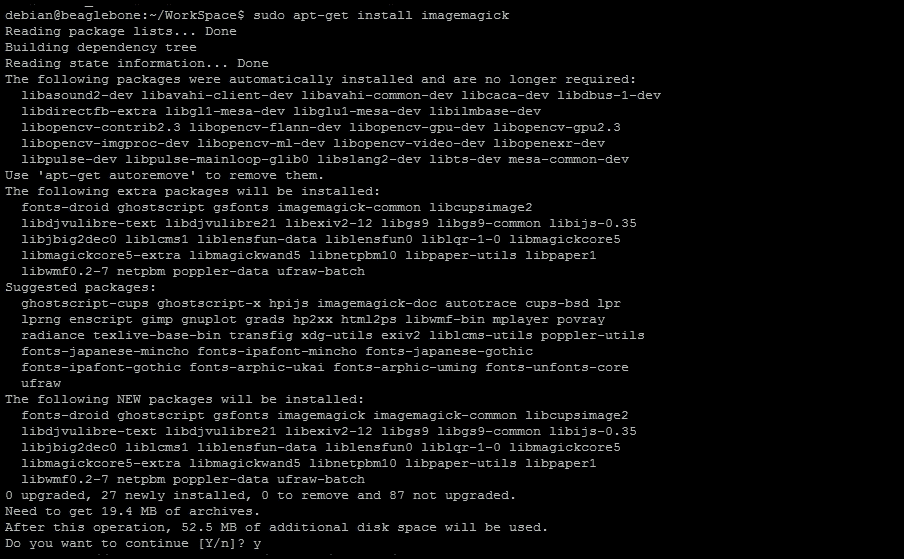

    当你被提示继续操作时，输入`Y`，如前一个截图的末尾所示，然后按`Enter`继续并完成安装：

+   `sudo apt-get install libjpeg8-dev`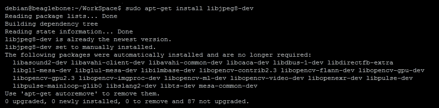

+   `sudo apt-get install subversion`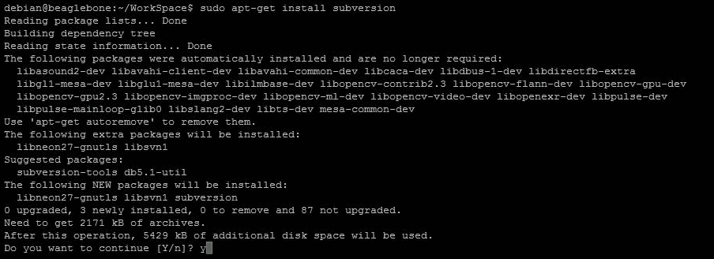

现在我们已经安装了所有预置软件，让我们下载和编译视频流软件。

首先在主目录中创建一个单独的目录，并将流软件的内容放入其中：

+   `mkdir mjpg`

现在让我们将我们的工作目录更改为我们创建的目录：

+   `cd mjpg`

一旦你进入了`mjpg`目录，你可以使用命令中提到的 URL 下载 mjpg-streamer 软件包：

+   `svn co https://svn.code.sf.net/p/mjpg-streamer/code/mjpg-streamer/ mjpg-streamer`

下载完成后，将创建一个`mjpg-streamer`文件夹，其中包含软件的源代码。让我们继续更改目录到那个文件夹：

+   `cd mjpg-streamer`

现在接下来的步骤将是使用`make`命令编译软件：

+   `make`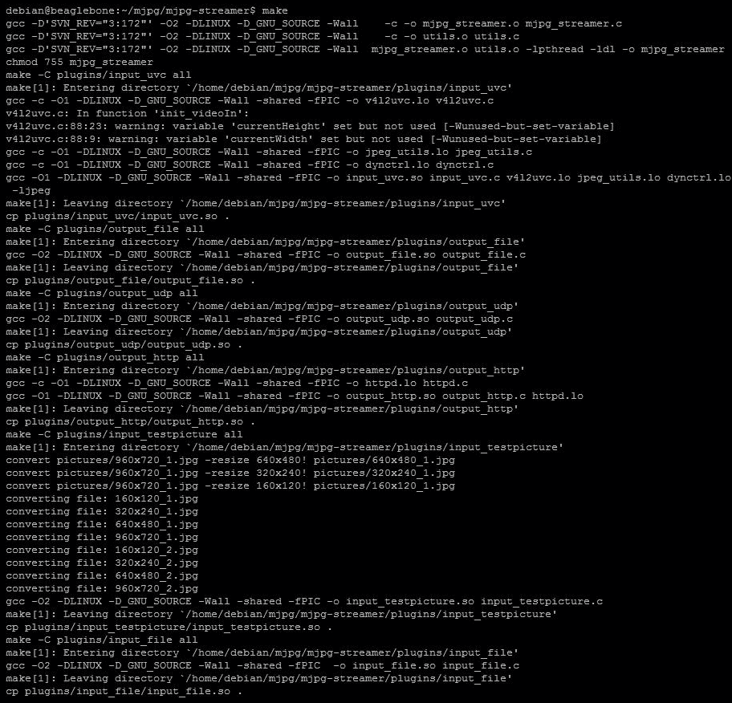

一旦你成功编译了软件且没有错误，你可以继续使用以下命令运行软件：

+   `/mjpg_streamer -i "./input_uvc.so -d /dev/video0 -n -y" -o "./output_http.so -w ./www"`

如果你已经在 Debian 包中安装了 Apache 服务器，那么当你执行运行视频流软件的先前命令时，可能会显示一个错误，说**bind: Address already in use**，如下面的截图所示：

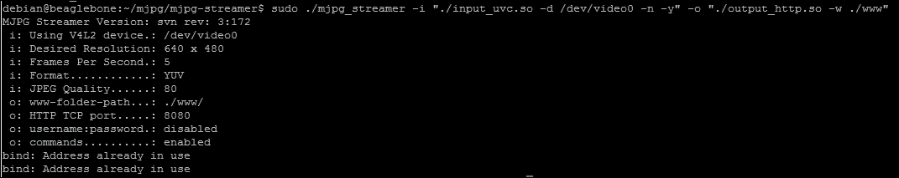

这是因为 Apache 服务器默认使用端口`8080`。在这种情况下，为了解决这个问题，我们可以通过更改`ports.conf`文件中的详细信息，将 Apache 使用的端口更改为`8079`或任何其他允许的数字，如下面的截图所示：

+   `sudo nano /etc/apache2/ports.conf`

打开文件后，你可以将`NameVirtualHost`更改为`8079`，并将`Listen`更改为`8079`端口，如下面的截图所示，并保存它：

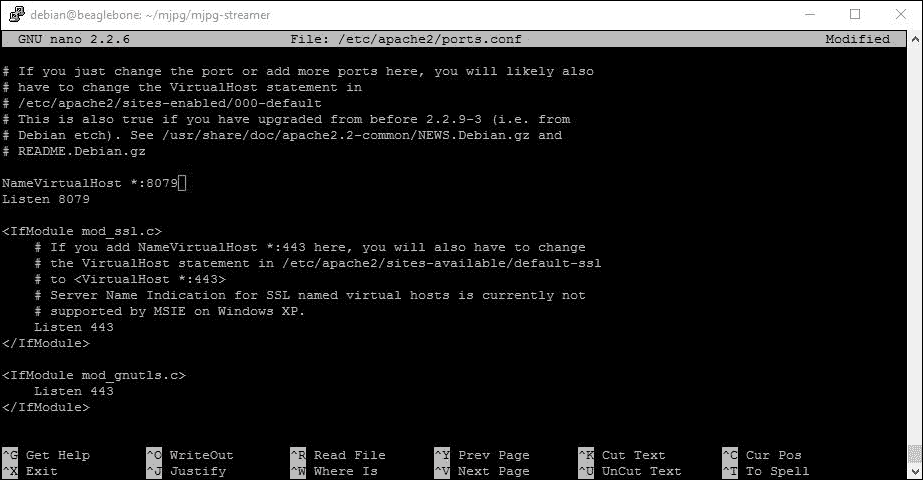

保存后，你需要重新启动 Apache 服务器以执行更改。为此，执行`service restart`命令：

+   `sudo service apache2 restart`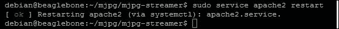

重新启动并得到前面截图所示的输出，这意味着更改已经完成。现在你可以继续运行流媒体软件，通过执行以下命令：

+   `sudo ./mjpg_streamer -i "./input_uvc.so -d /dev/video0 -n -y" -o "./output_http.so -w ./www"`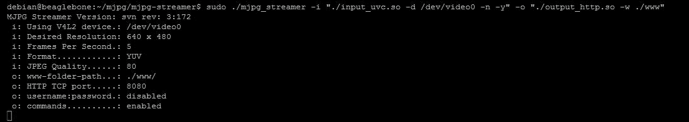

如果你看到前面截图所示的输出，那么流媒体软件正在正常运行。我们可以通过访问如下面的截图所示的本地服务器在端口`8080`来测试它。IP 地址是你路由器上 BeagleBone Black 的 IP 地址，它与用于登录 BeagleBone 板的 IP 地址相同。

打开网页链接后，你将看到流媒体软件的主页，如下一页所示：


前一截图显示了有关我们在 BeagleBone 板上运行的流媒体软件的详细信息页。在主页本身，你可以看到从摄像头捕获的图像，但它是一个静态图像，不是实时流。要查看实时流，请点击左侧的**Stream**按钮，它将显示包含从摄像头实时视频流的网页，如下面的截图所示：

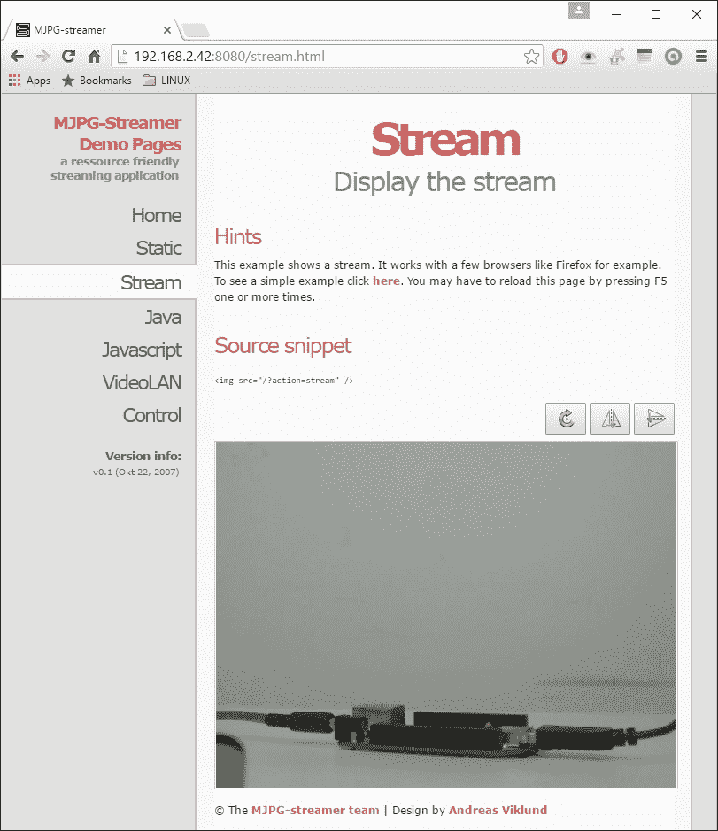

点击**此处**的按钮，该按钮以红色突出显示，并标注为**要查看简单示例，请点击此处**。你将看到仅作为 HTML 页面上的一个图像元素单独显示的视频流，如下面的截图所示：

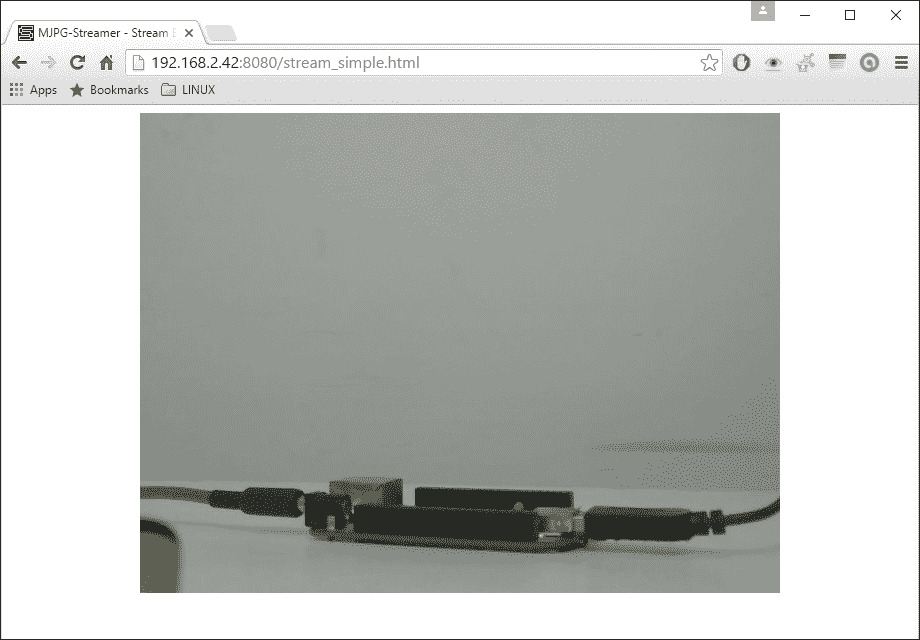

以下截图显示了在实时流传输时，带有 USB 摄像头的 BeagleBone 板的设置：

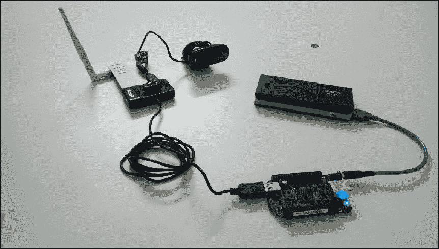

因此，你可以看到摄像头前方的 BeagleBone 和移动电源在实时流中是可见的。如果你在摄像头前挥手，你可以在网页上实时看到。

现在我们已经看到了这个直播视频流，如果你想在创建的任何 HTML 页面上包含它，你可以通过添加由流媒体软件创建的图像源元素来实现。你可以通过在浏览器上右键单击并点击“检查元素”来获取该图像源的信息，这将显示如下截图中的详细信息。现在我们使用的几乎所有浏览器，如 Chrome、IE 或 Mozilla，都显示这些详细信息，你可以通过浏览互联网了解更多信息。

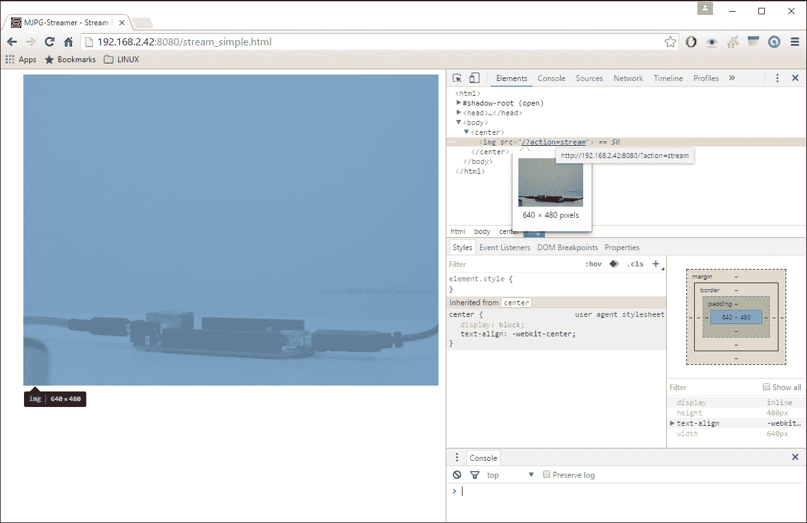

可以在浏览器窗口右侧的检查块中识别图像元素，其中详细说明了如下截图：

```py

```

我们将在本章的末尾使用这个元素，通过 Flask 框架和 Python 在网页上获取实时视频流。现在我们知道了如何从 USB 摄像头获取实时视频流并将其集成到网页上，让我们继续本章的下一个主题，我们将构建一个带有实时视频流的机器人。

# 高级项目 – 带直播视频流的遥控机器人

首先连接电机驱动 IC 和电机，电源如下电路所示：

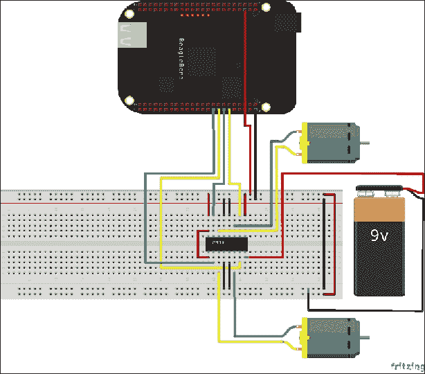

整个设置看起来如下：

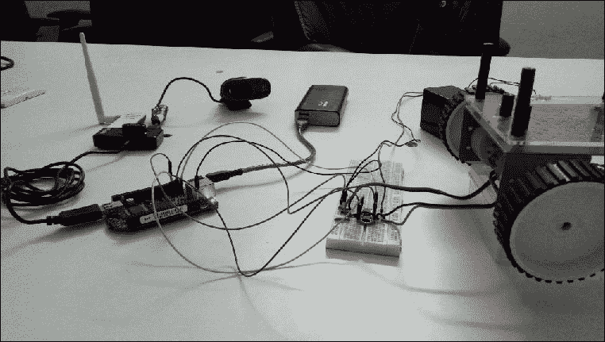

从前面的图片中你可以看到，BeagleBone Black 连接到一个 USB 集线器，Wi-Fi 适配器和 USB 摄像头都连接到这个集线器。L293D 连接到机器人的电机，并使用外部 12V 电池来驱动电机。L293D 的输入引脚连接到 BeagleBone Black，以控制 L293D。BeagleBone Black 使用 USB 到 DC 柱状连接器电缆通过移动电源供电，你可以按照以下图片所示自己制作：


那为什么 BeagleBone 板不能使用内置的 USB 连接供电呢？这是因为 USB 总共只从输入电源中抽取了 500mAh，这不足以给 USB 摄像头和 Wi-Fi 适配器供电。

现在，你可以登录到 BeagleBone Black 并编写代码，从网页上控制机器人。

在这个项目中，我们不会从头编写代码——相反，我们将通过编辑来自第六章“使用 BeagleBone 进行家庭自动化”中我们的家庭自动化项目的代码来编写代码。所以，在登录后，让我们先进入 Linux shell 中的家庭自动化目录：

+   `cd WorkSpace/HomeAutomation`

如果你使用`ls`命令列出目录内容，你会看到以下：

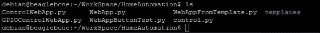

一旦您处于智能家居目录中，让我们首先编辑 HTML 模板：

+   `cd templates`

现在，我们可以继续编辑我们在智能家居项目中创建的 `main.html` 文件，并将其保存为 `Robot.html` 文件，如下所示屏幕截图：


一旦您打开了 `main.html` 文件，使用 nano 文本编辑器，编辑内容使其看起来像以下屏幕截图：

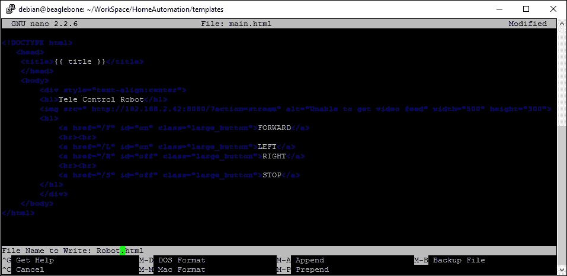

您可以看到，我们已经将之前主题中的图像源元素添加到这个 HTML 文件中，并添加了四个按钮。一旦保存文件，您就可以继续在需要运行的 Python 文件中进行更改，以创建服务器。

首先，让我们回到智能家居目录：


现在，让我们打开我们在智能家居项目中创建的 `GPIOControlWebApp.py` 文件：


按照以下屏幕截图所示编辑文件，并将其保存为 `Robot.py`：

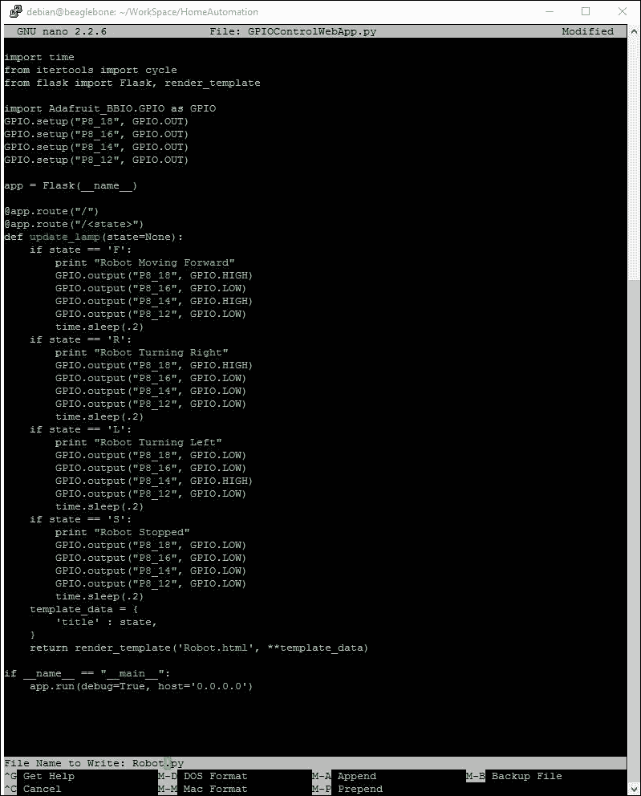

现在您可以通过以下命令运行 Python 代码：

+   `sudo python Robot.py`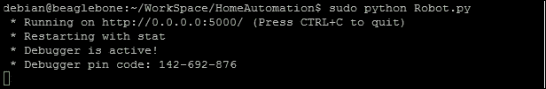

仅运行此代码是不够的。我们还需要运行流媒体软件，为我们的项目提供实时视频流。因此，使用另一个 PuTTY 会话登录到 BeagleBone Black，并按照以下屏幕截图所示运行流媒体软件：

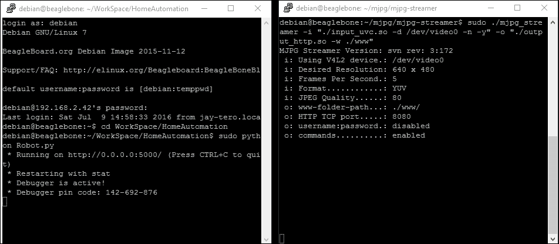

当流媒体软件和 Python 代码同时运行时，您可以通过将 BeagleBone Black 的 IP 地址指向同一本地网络中的端口 `5000`（通过 PC 或手机连接到同一网络，与 BeagleBone 板连接的网络相同），在任何浏览器中检查服务器文件。您将看到下一页上的输出图片，从那里您可以查看实时视频并控制机器人：


因此，在先前的截图中，你可以看到机器人的轮子。设置与本章开头图片中显示的相同，当时摄像头指向机器人的轮子。这将向你展示当你点击网页上的每个按钮时，轮子的运动是如何工作的。我们将在下一部分讨论，你可以在图像本身上看到轮子的运动，因为正在运行的轮子看起来会模糊。

当你点击前进按钮时，两个电机按照我们在上一章讨论的差速驱动系统运行。也就是说，电机将驱动机器人向前行驶，你可以在下面的截图中看到与上一页本章中显示的图像中的轮子闲置且未运行时的区别。

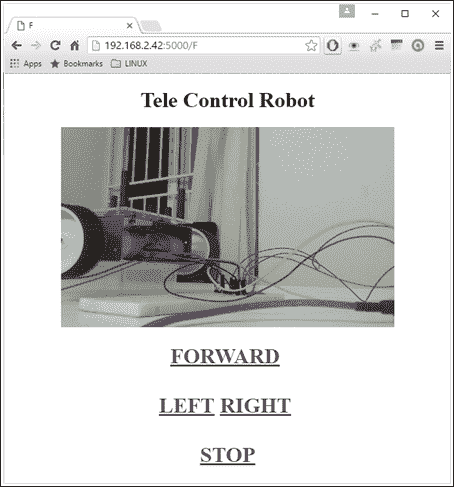

当你按下按钮时，你还可以在 Python 输出中看到移动日志，如下面的截图所示：


同样，对于左转，右电机需要运行，而左电机停止，如下面的截图所示：

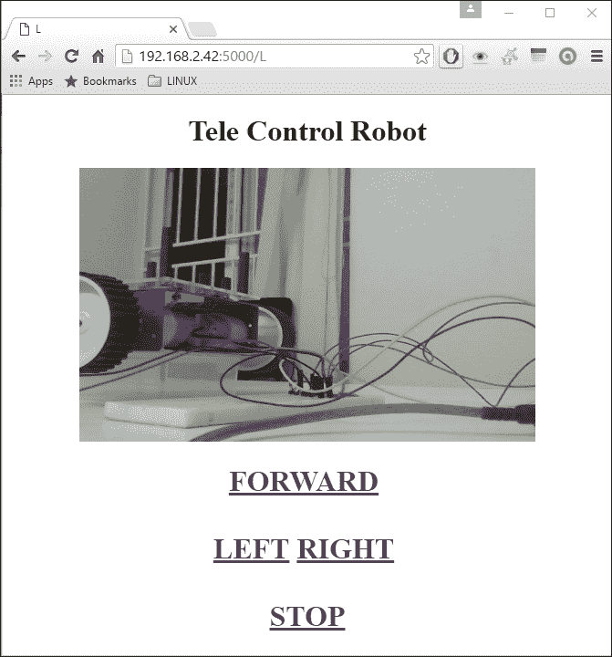

当你按下**右键**按钮时，**左键**电机运行，而**右键**电机停止，如下面的截图所示：

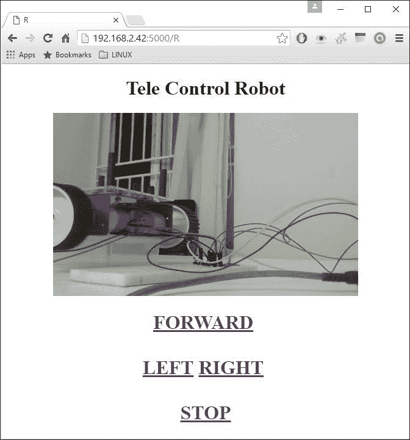

类似地，当你点击停止时，两个电机都会停止。如果你按照需求将这些电子元件安装在机器人顶部，你可以让它作为一个带有实时视频流的遥控机器人四处行驶。在本章中，我为你提供了理解这个想法所需的所有资源。现在，你可以继续在机器人基座上安装电子元件。要了解人们是如何在硬件开发板上焊接电子元件以制作简单的原型保护罩，只需在谷歌上输入`BeagleBone 的原型保护罩`或`树莓派的帽子以及 Arduino 的保护罩`。尽管这些是为不同的硬件开发板（如 BeagleBone 和树莓派）制作的，但经过轻微修改，相同的电子元件可以安装在 BeagleBone 板上，这将帮助你摆脱杂乱的布线。此外，尝试使用子进程 Python 模块来执行 shell 命令，并在 Python 代码的开头启动流媒体软件以运行服务器。通过使用这个子进程，你不需要运行两个 PuTTY 实例，只需一个就可以完成你的工作。

# 摘要

有了这些，我们就结束了这一章的内容，其中我们学习了一些关于直流电机及其操作的基础知识，还了解了 L293D 电机驱动 IC 是什么，以及我们如何使用它来控制连接的直流电机。接下来，我们看到了如何使用 mjpg-streamer 软件包在 BeagleBone Black 本地服务器上直播视频。最后，我们进行了一个项目，其中我们将 L293D 电机驱动 IC 与 BeagleBone Black 以及实时图像源接口，并通过我们使用 Python 和 Flask 网络服务器框架创建的网页上的输入按钮控制机器人。
