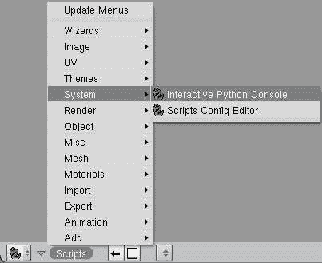
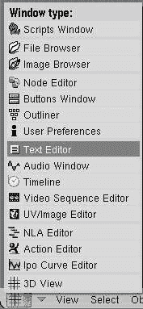
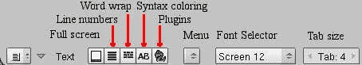
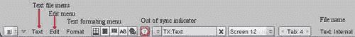
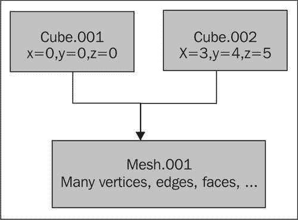

# 第一章：使用 Python 扩展 Blender

在我们开始用 Blender 编写脚本之前，我们必须检查是否拥有所有必要的工具。之后，我们将必须熟悉这些工具，以便我们可以自信地使用它们。在本章中，我们将探讨以下内容：

+   在 Blender 中使用 Python 可以完成什么和不能完成什么

+   如何安装完整的 Python 发行版

+   如何使用内置编辑器

+   如何运行 Python 脚本

+   如何探索内置模块

+   如何编写一个简单的脚本，将对象添加到 Blender 场景中

+   如何在 Blender 脚本菜单中注册脚本

+   如何以用户友好的方式编写脚本文档

+   如何分发脚本

由于有这么多可能的事情要做，有很多东西要学习，但幸运的是，学习曲线并没有看起来那么陡峭。在我们深入之前，让我们输入几行简单的 Python 代码，将一个简单的对象放入我们的 Blender 场景中，以证明我们能够做到这一点。

1.  使用空场景启动 Blender。

1.  打开交互式 Python 控制台（参考前面的截图以查看位置）。

1.  输入以下行（每行以*Enter*/*Return*结束）。

    ```py
    mesh = Mesh.Primitives.Monkey()
    Scene.GetCurrent().objects.new(mesh,'Suzanne')
    Window.RedrawAll()
    ```

哇！这就是添加 Suzanne（Blender 的著名吉祥物）到场景中所需的所有内容。


# Blender API

几乎所有 Blender 中的内容都可以通过 Python 脚本访问，但也有一些例外和限制。在本节中，我们将说明这究竟意味着什么，以及哪些显著特性对 Python 不可用（例如，流体动力学）。

Blender API 由三个主要兴趣区域组成：

+   访问 Blender 对象及其属性，例如`Camera`对象及其`angle`属性或`Scene`对象及其`objects`属性

+   访问要执行的操作，例如添加一个新的`Camera`或渲染一张图像

+   通过使用简单的构建块或与 Blender 事件系统交互来访问图形用户界面

还有一些工具不适合任何这些类别，因为它们涉及到的抽象与最终用户看到的 Blender 对象没有直接关系，例如操作向量和矩阵的函数。

## 很多的功能

总的来说，这意味着我们可以通过 Python 脚本实现很多事情。我们可以：

+   创建任何类型的 Blender 新对象，包括相机、灯具、网格，甚至场景

+   通过图形用户界面与用户交互

+   自动化 Blender 中的常见任务，如渲染

+   自动化 Blender 之外的任务，如清理目录

+   操作通过 API 暴露的 Blender 对象的任何属性

那最后一个声明显示了 Blender API 当前的一个弱点：开发者添加到 Blender C 源代码中的任何对象属性都必须在 Python API 中单独提供。没有从内部结构到 Python 中可用接口的自动转换，这意味着必须重复工作，可能会导致功能缺失。例如，在 Blender 2.49 中，根本无法从脚本中设置流体模拟。尽管可以设置粒子系统，但无法设置鸟群粒子系统的行为特性。

2.49 Python API 的另一个问题是，用户可能选择在对象上执行的大多数操作在 API 中没有等效功能。设置简单的参数，如相机角度或旋转任何对象都是容易的，甚至将例如，子表面修改器关联到网格也只需要几行代码，但常见的操作，尤其是在网格对象上，如细分选定的边或挤出面，在 API 中缺失，必须由脚本开发者实现。

这些问题促使 Blender 开发者对 2.5 版本的 Blender Python API 进行了全面的重构，重点是功能一致性（也就是说，在 Blender 中可能做到的一切都应该能够通过 Python API 实现）。这意味着在许多情况下，在 Blender 2.5 中获取相同的结果将会容易得多。

最后，Python 不仅仅用于独立脚本：**PyDrivers**和**PyConstraints**使我们能够控制 Blender 对象的行为，我们将在后续章节中遇到它们。Python 还允许我们编写自定义纹理和着色器作为节点系统的一部分，正如我们将在第七章中看到的，*创建自定义着色器和纹理*。

此外，重要的是要记住，Python 为我们提供的不仅仅是（已经令人印象深刻的）自动化 Blender 中各种任务的工具。Python 是一种通用编程语言，包含了一个广泛的工具库，因此我们不必求助于外部工具来执行常见的系统任务，如复制文件或归档（压缩）目录。甚至网络任务也可以相当容易地实现，正如许多渲染农场解决方案所证明的那样。

## 一些内置功能

当我们安装 Blender 时，Python 解释器已经是应用程序的一部分。这意味着不需要单独安装 Python 作为应用程序。但 Python 不仅仅是解释器。Python 附带了一个庞大的模块集合，提供了丰富的功能。从文件操作到 XML 处理等一切都可以使用，而且最好的是，这些模块是语言的标准部分。它们与 Python 解释器本身一样得到良好的维护，并且（在极少数例外的情况下）在 Python 运行的任何平台上都可用。

当然，这个模块集合相当大（大约 40MB），因此 Blender 的开发者选择只提供最基本的部分，主要是数学模块。如果你想要保持 Blender 下载的大小可管理，这样做是有意义的。许多 Python 开发者已经依赖于标准发行版，因为不必重新发明轮子可以节省大量的时间，更不用说开发并测试一个完整的 XML 库并不是一件容易的事情，比如说，仅仅因为你想要能够读取一个简单的 XML 文件。这就是为什么现在基本上是一个共识，安装完整的 Python 发行版是个好主意。幸运的是，安装过程与 Blender 本身的安装一样简单，即使是对于最终用户来说也是如此，因为为许多平台提供了二进制安装程序，例如 Windows 和 Mac，也包括 64 位版本。（Linux 的发行版以源代码的形式提供，并附有编译它们的说明，但许多 Linux 发行版要么已经自动提供了 Python，要么使得从软件包仓库安装它变得非常容易）。

## 检查完整的 Python 发行版

很有可能你已经在系统中安装了完整的 Python 发行版。你可以通过启动 Blender 并检查控制台窗口（术语**控制台窗口**指的是在 Windows 上并行启动的 DOSBox 或在其他系统上从其中启动 Blender 的 X 终端窗口）来验证这一点，看看是否显示以下文本：

```py
Compiled with Python version 2.6.2.
Checking for installed Python... got it!

```

如果它显示了，那么你不需要做任何事情，可以直接跳到*交互式* *Python* *控制台*部分。如果它显示以下消息，那么你必须采取一些行动：

```py
Compiled with Python version 2.6.2.
Checking for installed Python... No installed Python found.
      Only built-in modules are available.  Some scripts may not run.
      Continuing happily.

```

## 安装完整的 Python 发行版

Windows 或 Mac 上完整 Python 安装的步骤如下：

1.  从[`www.python.org/download/`](http://www.python.org/download/)下载一个合适的安装程序。在撰写本文时，最新的稳定版 2.6 是 2.6.2（用于 Blender 2.49）。安装最新稳定版本通常是个好主意，因为它将包含最新的错误修复。但是，请确保使用与 Blender 编译时相同的重大版本。即使 Blender 是用 2.6.2 编译的，使用 2.6.3 版本也是可以的。但是，如果你使用的是用 Python 2.5.4 编译的较旧版本的 Blender，你必须安装最新的 Python 2.5.x 版本（或者如果可能的话，升级到 Blender 2.49）。

1.  运行安装程序：在 Windows 上，安装程序会提供选择 Python 安装位置。你可以选择任何你喜欢的位置，但如果选择默认位置，Blender 几乎肯定可以找到这里安装的模块，无需设置`PYTHONPATH`变量。（见下文）

1.  （重新）启动 Blender。Blender 控制台应该显示以下文本：

    ```py
    Compiled with Python version 2.6.2.
    Checking for installed Python... got it!
    ```

    如果没有，可能需要设置 `PYTHONPATH` 变量。请参阅 Blender 维基以获取详细信息：[`wiki.blender.org/index.php/Doc:Manual/Extensions/Python`](http://wiki.blender.org/index.php/Doc:Manual/Extensions/Python)

在 Ubuntu Linux 上，第一步不是必需的，可以通过使用内置的包管理器来安装：

```py
sudo apt-get update
sudo apt-get install python2.6

```

其他发行版可能使用不同的包管理系统，因此您可能需要检查该系统的文档。在 Windows 上，可能需要设置 `PYTHONPATH` 环境变量，尽管在使用提供的包时不太可能需要这样做。

## 交互式 Python 控制台

要查看 Blender 实际查找模块的位置，您可以查看 Python 的 `sys.path` 变量。为此，您必须启动 Blender 的交互式 Python 控制台。请注意，您在这里使用的是不同的、可能令人困惑的概念——DOSBox 或与 Blender 主应用程序窗口一起启动并显示各种信息消息的终端窗口也被称为 **控制台**！我们现在想要使用的 Python 交互式控制台是从 **脚本窗口** 启动的：


一旦启动了交互式 Python 控制台，请输入以下命令：

```py
import sys
print sys.path

```

注意，交互式 Python 控制台不会显示任何提示（除非在需要缩进的情况下，例如在 `for` 循环中）但您输入的内容将以不同的颜色（默认为白色在黑色背景上）显示，而返回的内容（将显示为蓝色或黑色）。前两个命令将使我们能够访问包含各种系统信息的 Python 的 `sys` 模块。我们在这里打印的 `sys.path` 变量将包含当我们尝试导入模块时将被搜索的所有目录。（请注意，导入 `sys` 总是会成功，因为 `sys` 是一个内置模块。）输出将类似于：

```py
['C:\\Program Files\\Blender Foundation\\Blender', 'C:\\Program Files\\Blender Foundation\\Blender\\python26.zip', 'C:\\Python26\\Lib', 'C:\\Python26\\DLLs', 'C:\\Python26\\Lib\\lib-tk', 'C:\\Program Files\\Blender Foundation\\Blender', 'C:\\Python26', 'C:\\Python26\\lib\\site-packages','C:\\Python26\\lib\\site-packages\\PIL', 'C:\\PROGRA~1\\BLENDE~1\\Blender', 'C:\\Documents and Settings\\Michel\\Application Data\\Blender Foundation\\Blender\\.blender\\scripts', 'C:\\Documents and Settings\\Michel\\Application Data\\Blender 
Foundation\\Blender\\.blender\\scripts\\bpymodules']

```

如果您的 Python 安装目录不在此列表中，那么在启动 Blender 之前，您应该设置 `PYTHONPATH` 变量。

# 探索内置模块，help() 函数

交互式 Python 控制台是一个探索内置模块的好平台。因为 Python 配备了两个非常有用的函数，`help()` 和 `dir()`，您可以直接访问 Blender（和 Python）模块中包含的大量信息，因为许多文档都是作为代码的一部分提供的。

对于不熟悉这些函数的人来说，这里有两个简短的示例，两个都是从交互式 Python 控制台运行的。要获取特定对象或函数的信息，请输入：

```py
help(Blender.Lamp.Get)
```

信息将在同一控制台中打印：

```py
Help on built-in function Get in module Blender.Lamp:

Lamp.Get (name = None):

Return the Lamp Data with the given name, None if not found, or
        Return a list with all Lamp Data objects in the current scene,
        if no argument was given.

```

`help()`函数将显示函数、类或模块的相关 docstring。在上一个例子中，这是`Lamp`类的`Get()`方法（函数）提供的信息。**docstring**是在函数、类或模块中定义的第一个字符串。当你定义自己的函数时，这样做也是一个好习惯。它可能看起来像这样：

```py
def square(x):
   """
   calculate the square of x.
   """
   return x*x
```

我们现在可以像之前一样，将`help`函数应用于我们新定义的函数：

```py
help(square)
```

输出随后显示：

```py
Help on function square in module __main__:
square(x)
    calculate the square of x.

```

在我们将要开发的程序中，我们将根据需要使用这种文档方法。

## 探索内置函数，dir()函数

`dir()`函数列出了一个对象的全部成员。这个对象可以是一个实例，也可以是一个类或模块。例如，我们可以将其应用于`Blender.Lamp`模块：

```py
dir(Blender.Lamp)
```

输出将是一个包含`Blender.Lamp`模块所有成员的列表。你可以找到我们之前遇到的`Get()`函数：

```py
['ENERGY', 'Falloffs', 'Get', 'Modes', 'New', 'OFFSET', 'RGB','SIZE', 'SPOTSIZE', 'Types', '__doc__', '__name__', '__package__','get']
```

一旦你知道一个类或模块有哪些成员，你就可以通过应用`help()`函数来检查这些成员的任何附加帮助信息。

当然，`dir()`和`help()`函数在你已经知道信息所在位置时最为有用。但如果是这样，它们确实是非常方便的工具。

# 熟悉内置编辑器

使用任何你喜欢的编辑器编写 Python 脚本，然后将脚本作为文本文件导入，但 Blender 的内置文本编辑器可能足以满足所有编程需求。它具有语法高亮、行号和自动缩进等便利功能，并允许你直接从编辑器中运行脚本。由于在遇到错误时能够直接获得反馈，因此直接从编辑器运行脚本在调试时是一个明显的优点。你不仅会得到一条信息，而且出错的行也会在编辑器中被突出显示。

此外，编辑器还附带了许多插件，其中成员自动建议和文档查看器对程序员来说非常方便。当然，你也可以自己编写额外的插件。

你可以通过从窗口菜单中选择**文本编辑器**来选择内置编辑器：



启动时，你将看到一个几乎空白的区域，底部只有一条按钮条：



我们可以选择默认的空文本缓冲区`TX:Text`，或者通过点击**菜单**按钮时出现的下拉菜单中的**添加新项**来创建一个新的空文本。

此新文本的默认名称将是`TX:Text.001,`，但您可以通过单击名称并更改它来将其更改为更有意义的内容。请注意，如果您想将此文本保存到外部文件（使用**文本** **|** **另存为...**），文本的名称与文件名不同（尽管通常保持它们相同以避免混淆）。保存文本为外部文件不是强制性的；文本是 Blender 对象，当您保存`.blend`文件时，它们会与其他所有信息一起保存。

通过从**菜单**按钮的下拉菜单中选择**打开新文件**，而不是**添加新文件**，可以以文本形式打开外部文件。如果由于某种原因，当 Blender 启动时外部文件和相关文本不同步，将显示一个不同步的按钮。点击该按钮时，会显示一系列选项以解决该问题。

一旦选择了一个新文本或现有文本，屏幕底部的菜单栏将更新，并添加一些额外的菜单选项：



**文本**文件菜单提供了打开或保存文件或运行编辑器中的脚本的选项。它还展示了一些模板脚本，这些脚本可以作为您自己脚本的起点。如果您选择这些模板之一，将创建一个新的文本缓冲区，其中包含所选模板的副本。

**编辑**菜单包含剪切和粘贴功能，以及搜索和替换文本或跳转到所选行号的选项。

**格式**菜单提供了缩进和取消缩进所选文本的选项，以及转换空白字符的选项。后者在 Python 解释器抱怨意外的缩进级别时非常有用，尽管您的文件似乎没有问题。如果发生这种情况，您可能以混淆 Python 的方式混合了制表符和空格（因为它们在解释器看来是不同的），一种可能的解决方案是首先将所选文本转换为空格，然后再将其转换回制表符。这样，混合的空格和制表符将再次以统一的方式使用。

## 编辑器示例

为了熟悉编辑器，通过选择**文本 | 新建**创建一个新的文本缓冲区，并输入以下示例行：

```py
import sys
print sys.path
```

键盘上的大多数键将以熟悉的方式工作，包括*删除*、*退格*和*回车*。剪切、粘贴和复制的快捷键在**编辑**菜单中分别列出为*Alt + X*、*Alt + V*和*Alt + C*，但 Windows 用户熟悉的*Ctrl*键等效键*Ctrl + X*、*Ctrl + V*和*Ctrl + C*（同样有效）。完整的键盘映射可以在 Blender 维基上查阅，[`wiki.blender.org/index.php/Doc:Manual/Extensions/Python/Text_editor`](http://wiki.blender.org/index.php/Doc:Manual/Extensions/Python/Text_editor)

通过单击并拖动鼠标可以选择文本的一部分，但您也可以在按住*Shift*键的同时移动文本光标来选择文本。

文本默认将不进行着色，但通过启用语法高亮，阅读脚本可以变得更容易。点击小型的**AB**按钮可以切换此功能（当语法高亮关闭时为黑白，开启时为彩色）。像 Blender 的许多方面一样，文本颜色可以在**用户首选项**窗口的**主题**部分进行自定义。

另一个非常方便启用的功能，尤其是在调试脚本时，是行号显示。（你可能会一次性写出无瑕疵的代码，但不幸的是，我并不那么聪明。）每个将被显示的 Python 错误信息都将包含文件名和行号，并且出错的行将被突出显示。但是，如果有调用函数，它们的行号将在错误信息中显示，但不会被突出显示，因此启用行号显示将使你能够快速定位问题所在代码的调用上下文。行号显示可以通过点击**行号**按钮来启用。

通过按下*Alt + P*来运行脚本。如果没有遇到错误，编辑器中不会显示任何内容，但输出将显示在控制台（即从 Blender 启动的 DOSBox 或 X 终端，*不是*我们之前遇到的 Python 交互式控制台）。

# 第一步：hello world

传统上要求每一本编程书籍都要有一个“hello world”示例，我们为什么要冒犯人们呢？我们将实现并运行一个简单的对象实例化脚本，并展示如何将其集成到 Blender 的脚本菜单中。我们还将展示如何对其进行文档化并在帮助系统中添加条目。最后，我们将讨论将脚本作为`.blend`文件分发或作为用户安装到`scriptdir`中的脚本的分发优缺点。

让我们编写一些代码！你可以直接在交互式 Python 控制台中输入以下行，或者你可以在 Blender 的文本编辑器中打开一个新的文本文件，然后按下*Alt + P*来运行脚本。这是一个简短的脚本，但我们将详细地讲解它，因为它展示了 Blender Python API 的许多关键特性。

```py
#!BPY

import Blender
from Blender import Scene, Text3d, Window

hello = Text3d.New("HelloWorld")
hello.setText("Hello World!")

scn = Scene.GetCurrent()
ob = scn.objects.new(hello)

Window.RedrawAll()
```

第一行将此脚本标识为 Blender 脚本。这不是运行脚本所必需的，但如果我们想使此脚本成为 Blender 菜单结构的一部分，我们需要它，所以最好立即习惯它。

你几乎可以在任何 Blender 脚本中找到第二行（它将被突出显示），因为它为我们提供了访问 Blender Python API 中的类和函数的权限。同样，第三行为我们提供了访问我们在此脚本中需要的 Blender 模块的特定子模块的权限。当然，我们可以将它们作为`Blender`模块的成员来访问（例如，`Blender.Scene`），但显式导入它们可以节省一些输入并提高可读性。

下面的两行首先创建一个`Text3d`对象并将其分配给变量`hello`。在 Blender 中，`Text3d`对象将具有`HelloWorld`的名称，因此用户可以通过此名称引用此对象。此外，这也是在 Outliner 窗口和对象被选中时的左下角可见的名称。如果已经存在具有相同名称的同类型对象，Blender 将在名称中添加一个数字后缀以使其唯一。例如，如果我们运行脚本两次，`HelloWorld`可能会变成`HelloWord.001`。`

`默认情况下，新创建的`Text3d`对象将包含文本**Text**，我们可以使用`setText()`方法将其更改为**Hello** **World!**`

`默认情况下，新创建的 Blender 对象是不可见的，我们必须将其与一个`场景`关联起来，所以接下来的几行代码检索当前场景的引用并将`Text3d`对象添加到其中。`Text3d`对象不是直接添加到场景中，而是`scene.objects.new()`方法将`Text3d`对象嵌入到一个通用的 Blender 对象中，并返回后者的引用。通用的 Blender 对象包含所有对象共有的信息，例如位置，而`Text3d`对象则包含特定的信息，例如文本字体。`

`最后，我们告诉窗口管理器刷新任何由于添加新对象而需要刷新的窗口。`

## `将脚本集成到 Blender 的菜单中`

`您的脚本不必是二等公民。它可以成为 Blender 的一部分，与 Blender 附带的所有捆绑脚本一样。它可以添加到 View3D 窗口顶部的**添加**菜单中。`

### `注意`

`实际上，**添加**菜单位于用户偏好设置窗口的底部标题栏中，但由于这个窗口位于 View3D 窗口之上，并且默认情况下仅显示标题栏，所以它看起来像是 View3D 窗口顶部的标题栏。许多用户已经习惯了它，以至于把它看作是 View3D 窗口的一部分。`

`它可以像任何其他脚本一样向 Blender 的帮助系统提供信息。以下几行代码使得这一点成为可能：`

```py
"""
Name: 'HelloWorld'
Blender: 249
Group: 'AddMesh'
Tip: 'Create a Hello World text object'
"""
```

`我们以一个包含多行文本的独立字符串开始脚本。`

### `注意`

`每一行都以一个标签开头，后面跟着一个冒号和一个值。冒号应紧随标签之后。不应该有任何间隔空格，否则我们的脚本将*不会*出现在任何菜单中。`

`每行开头的标签具有以下作用：`

+   ``` `Name` (一个字符串)定义了脚本在菜单中显示的名称`

+   ``` `Blender` (一个数字)定义了使用脚本所需的 Blender 的最小版本`

+   `` `组`（一个字符串）是脚本菜单下的子菜单，该脚本应该分组。如果我们的脚本要在 View3D 窗口的**添加 | 网格**菜单下显示（也可以通过按*Space*键访问），则应读取`AddMesh`。如果它应该位于脚本菜单的另一个子菜单下，则可以是例如`Wizards`或`Object`。除了必要的标签外，还可以添加以下可选标签：`

+   `` `版本`（一个字符串）是脚本在任何你喜欢的格式中的版本。``

+   `` `提示`（一个字符串）是在**脚本**菜单中的菜单项上悬停时显示的工具提示信息。如果脚本属于`AddMesh`组，即使我们在这里定义了一个工具提示，也不会显示。``

``

## `在 Blender 的帮助系统中集成脚本`

`Blender 有一个集成的帮助系统，可以从屏幕顶部的**帮助**菜单访问。它通过**脚本** **帮助** **浏览器**条目提供对在线资源以及注册脚本的访问信息。一旦选择，它将显示一组下拉菜单，每个菜单对应一个组，你可以从中选择一个脚本并查看其帮助信息。`

`如果我们想将我们的脚本添加到集成的帮助系统中，我们需要定义一些额外的全局变量：`

```py
__author__    = "Michel Anders (varkenvarken)"
__version__   = "1.00 2009/08/01"
__copyright__ = "(c) 2009"
__url__       = ["author's site, http://www.swineworld.org"]
__doc__       = """
A simple script to add a Blender Text object to a scene.
It takes no parameters and initializes the object to contain the
text 'Hello World'
"""
```

``这些变量应该都是不言自明的，除了`__url__`变量——这个变量将包含一个字符串列表，其中每个字符串由一个简短描述、一个逗号和一个 URL 组成。生成的帮助屏幕将看起来像这样：``

``

``现在我们只剩下测试它并将此脚本放置在适当的位置了。我们可以通过按*Alt + P*来测试脚本。如果没有遇到错误，这将导致我们的`Hello` `World` `Text3d`对象被添加到场景中，但脚本**尚未**被添加到**添加**菜单中。```

``如果要将脚本添加到**添加**菜单，它必须位于 Blender 的脚本目录中。为此，首先将脚本保存到文本缓冲区，并以一个有意义的名称保存为文件。接下来，确保这个文件位于 Blender 的脚本目录中。这个目录被称为`scripts`，是 Blender 配置目录`.blender`的子目录。它位于 Blender 的安装目录中，或者在 Windows 中位于`Application` `Data`目录中。找到我们的最简单方法就是再次查看`sys.path`变量，看看哪个列出的目录以`.blender\scripts`结尾。``

``位于 Blender 的`scripts`目录中的脚本将在启动时自动执行，因此我们的 hello world 脚本将在我们启动 Blender 时随时可用。如果我们想让 Blender 重新检查脚本目录（这样我们就不必重新启动 Blender 来查看我们的新添加项），我们可以在交互式控制台中选择**脚本 | 更新菜单**。``

```py`# Don't get confused, stay objective    As you may have noticed the word **object** is used in two different (possibly confusing) ways. In Blender almost anything is referred to as an Object. A `Lamp` for instance is an Object, but so is a `Cube` or a `Camera`. **Objects** are things that can be manipulated by the user and have for example a position and a rotation.    In fact, things are a little bit more structured (or complicated, as some people say): any `Blender` object contains a reference to a more specific object called the **data** **block**. When you add a `Cube` object to an empty scene you will have a generic object at some location. That object will be called `Cube` and will contain a reference to another object, a `Mesh`. This `Mesh` object is called `Cube` by default as well but this is fine as the namespaces of different kind of objects are separate.    This separation of properties common to all objects (such as position) and properties specific to a single type of object (such as the energy of a `Lamp` or the vertices of a `Mesh`) is a logical way to order sets of properties. It also allows for the instantiation of many copies of an object without consuming a lot of memory; we can have more than one object that points to the same `Mesh` object for example. (The way to achieve that is to create a **linked** **duplicate**, using *Alt + D*.) The following diagram might help to grasp the concept:    Another way the word **object** is used is in the Python sense. Here we mean an instance of a class. The Blender API is object-oriented and almost every conceivable piece of structured data is represented by an object instanced from a class. Even fairly abstract concepts such as an **Action** or an **IPO** (abstract in the sense that they do not have a position somewhere in your scene) are defined as classes.    How we refer to the Blender or to the Python sense of the word object in this book will mostly be obvious from the context if you keep in mind this distinction. But if not, we tend to write the Blender sense as *Object* and the Python sense as *object* or *object instance*.    # Adding different types of object from a script    Adding other types of objects is, in many cases, just as straightforward as adding our text object. If we want our scene to be populated in a way that enabled us to render it, we would have to add a camera and a lamp to make things visible. Adding a camera to the same scene could be done like this (assuming we still have a reference to our active scene in the `scn` variable):    ``` 从 Blender 导入 Camera 类，创建新的相机数据：`cam = Camera.New()`         # 创建新的相机数据
