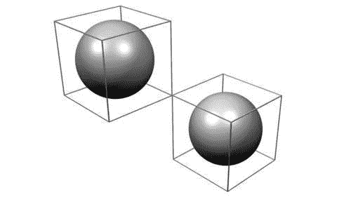
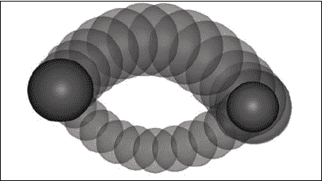
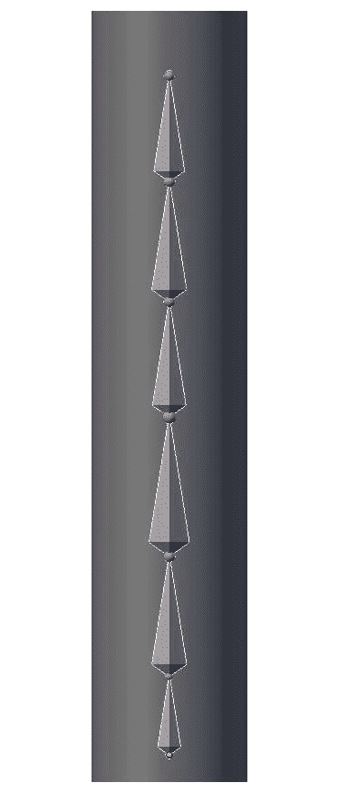
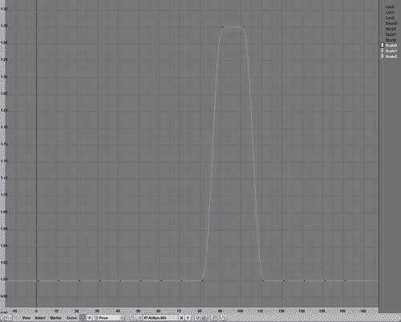
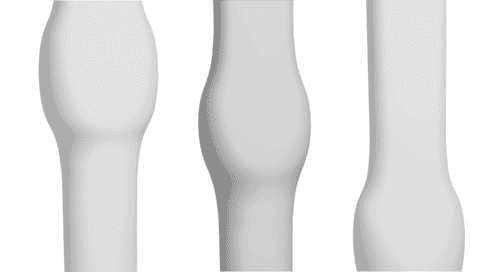
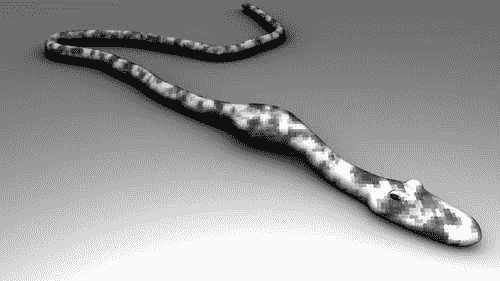
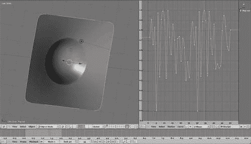

# 第六章。形状关键点，IPOs 和姿态

我们在第四章中遇到了 IPOs，*Pydrivers 和 Constraints*，当我们讨论 Pydrivers 时，但 IPOs 不仅仅是通过另一个 IPO 来驱动一个**IPO**。例如，Blender API 为我们提供了从头定义 IPO 的手段，使我们能够定义手动设置关键帧难以轻松复制的运动。此外，某些类型的 IPO 的行为与迄今为止我们所遇到的不同。**形状关键点**和**姿态**是（集合）IPO 的例子，与例如位置 IPO 相当不同。我们将在本章后面遇到形状关键点和姿态，但我们将从探讨如何从头开始定义 IPO 开始。

在本章中，你将学习如何：

+   定义 IPOs

+   在网格上定义形状关键点

+   定义那些形状关键点的 IPO。

+   定位骨架

+   将姿态变化分组到动作中

# 一个棘手的话题——从头开始定义 IPO

许多物体的运动路径很难手动建模，例如，当我们想要物体遵循精确的数学曲线或想要以不是通过复制 IPO 或定义 IPO 驱动器的方式协调多个物体的运动时。

想象以下场景：我们希望在一段时间内以流畅的方式交换某些物体的位置，而这些物体在中间不会相互穿过，甚至不会相互接触。这可能通过手动设置关键帧来实现，但这也很繁琐，尤其是如果我们想要为几组物体重复这样做。我们将设计的脚本将处理所有这些细节，并且可以应用于任何两个物体。

## 代码概要：orbit.py

我们将设计的`orbit.py`脚本将采取以下步骤：

1.  确定所选物体之间的中点。

1.  确定所选物体的范围。

1.  定义第一个物体的 IPO。

1.  定义第二个物体的 IPO。

确定所选物体之间的中点很容易：我们只需取两个物体的平均位置。确定所选物体的范围则有点更具挑战性。一个物体可能具有不规则形状，并且计算物体沿其将采取的路径的任何旋转的最短距离是困难的。幸运的是，我们可以做出合理的近似，因为每个物体都有一个相关的**边界****框**。

这个边界框是一个矩形框，刚好包围了一个对象的所有点。如果我们取体对角线的一半作为对象的范围，那么很容易看出这个距离可能是对我们如何接近另一个对象而不接触的一种夸张，这取决于对象的精确形状。但它将确保我们永远不会太靠近。这个边界框可以通过对象的 `getBoundBox()` 方法作为一个包含八个向量的列表轻松获得，每个向量代表边界框的一个角。这个概念在以下图中得到了说明，其中显示了两个球体的边界框：



矩形框的体对角线长度可以通过确定每个 x、y 和 z 坐标的最大值和最小值来计算。表示该体对角线的向量的分量是这些最大值和最小值之间的差异。通过对 x、y 和 z 分量的平方和开平方，随后得到对角线的长度。`diagonal()` 函数是一个相当简洁的实现，因为它使用了 Python 的许多内置函数。它接受一个向量列表作为参数，然后遍历每个分量（突出显示。Blender `Vector` 的 x、y 和 z 分量分别可以通过 0、1 和 2 访问）：

```py
def diagonal(bb):
   maxco=[]
   minco=[]
 for i in range(3):
      maxco.append(max(b[i] for b in bb))
      minco.append(min(b[i] for b in bb))
   return sqrt(sum((a-b)**2 for a,b in zip(maxco,minco)))
```

它通过使用内置的 `max()` 和 `min()` 函数来确定每个分量的极端值。最后，它通过使用 `zip()` 函数将每个最小值和最大值配对来返回长度。

下一步是验证我们是否恰好选择了两个对象，如果不是这种情况，则通过弹出窗口（在下一代码片段中突出显示）通知用户。如果我们确实选择了两个对象，我们检索它们的位置和边界框。然后我们计算每个对象必须偏离其路径的最大距离 `w`，使其是它们之间最小距离的一半，这等于这些对象体对角线长度之和的四分之一：

```py
obs=Blender.Scene.GetCurrent().objects.selected

if len(obs)!=2:
 Draw.PupMenu('Please select 2 objects%t|Ok')
else:
   loc0 = obs[0].getLocation()
   loc1 = obs[1].getLocation()

   bb0 = obs[0].getBoundBox()
   bb1 = obs[1].getBoundBox()

   w = (diagonal(bb0)+diagonal(bb1))/4.0
```

在我们能够计算两个对象的轨迹之前，我们首先创建两个新的空 Object IPO：

```py
   ipo0 = Ipo.New('Object','ObjectIpo0')
   ipo1 = Ipo.New('Object','ObjectIpo1')
```

我们任意选择我们的交换操作的开始和结束帧分别为 1 和 30，但脚本可以很容易地修改为提示用户输入这些值。我们遍历每个单独的 `Location` IPO 曲线，并为曲线分配一个元组 `(framenumber, value)` 以创建第一个点（或关键帧），从而创建实际的曲线（突出显示的下一行代码）。可以通过按帧号索引这些曲线来添加后续的点，就像在以下代码中对帧 30 所做的那样：

```py
   for i,icu in enumerate((Ipo.OB_LOCX,Ipo.OB_LOCY,Ipo.OB_LOCZ)):
 ipo0[icu]=(1,loc0[i])
      ipo0[icu][30]=loc1[i]

 ipo1[icu]=(1,loc1[i])
      ipo1[icu][30]=loc0[i]

      ipo0[icu].interpolation = IpoCurve.InterpTypes.BEZIER
      ipo1[icu].interpolation = IpoCurve.InterpTypes.BEZIER
```

注意，第一个物体在帧 1 的关键帧位置是其当前位置，而帧 30 的关键帧位置是第二个物体的位置。对于其他物体，情况正好相反。我们将这些曲线的插值模式设置为“贝塞尔”，以获得平滑的运动。现在我们有两个 IPO 曲线，它们确实会交换两个物体的位置，但按照计算，它们将直接穿过对方。

因此，我们的下一步是在帧 15 添加一个带有调整后的 z 分量的关键帧。之前，我们计算了`w`来保持彼此之间的距离。现在，我们将这个距离加到第一个物体的中点 z 分量上，并从另一个物体中减去它：

```py
   mid_z = (loc0[2]+loc1[2])/2.0
   ipo0[Ipo.OB_LOCZ][15] = mid_z + w
   ipo1[Ipo.OB_LOCZ][15] = mid_z - w
```

最后，我们将新的 IPO 添加到我们的对象中：

```py
obs[0].setIpo(ipo0)
obs[1].setIpo(ipo1)
```

完整的代码作为`swap2.py`文件存储在`orbit.blend`文件中。两个物体的结果路径在下一张截图中有展示：



# 定义姿势有很多要消化

许多卡通角色似乎在尝试吞咽食物时遇到困难，即使他们享受了一顿轻松的午餐，也很可能他们会被迫通过一个太小而无法舒适通过的雨管。

使用形状键来动画化吞咽或其他**蠕动运动**是困难的，因为整体网格的形状并不是均匀变化的：我们希望沿着局部变形移动。实现这一点的办法之一是将由线性骨骼链组成的骨架与我们要变形的网格（如图所示）关联起来，并在时间上动画化每个单独骨骼的缩放。这样，我们可以极大地控制内部“块”的运动。例如，我们可以使运动稍微停顿，从一根骨骼移动到另一根，以模拟难以吞咽的东西。



为了以从父级到子级的顺序同步单个骨骼的缩放，我们必须对骨骼进行排序，因为当我们对骨架调用`getPose()`时得到的`Pose`对象的`bones`属性是一个字典。遍历这个字典的键或值将返回随机的值。

因此，我们定义了一个函数`sort_by_parent()`，它将接受一个`Pose`骨骼列表`pbones`，并返回一个字符串列表，每个字符串都是一个`Pose`骨骼的名称。列表按照父级作为第一个项目，然后是其子项进行排序。显然，对于具有多个子项的骨骼的骨架，这个列表将没有意义，但对我们线性链骨骼来说，它工作得很好。

在以下代码中，我们维护一个名为`bones`的名称列表，其中包含`Pose`骨骼的正确顺序。我们弹出`Pose`骨骼的列表，只要它尚未添加（如下突出显示），我们就添加`Pose`骨骼的名称。我们比较名称而不是`Pose`骨骼对象，因为当前`Pose`骨骼的实现并没有可靠地实现`in`运算符：

```py
def sort_by_parent(pbones):
   bones=[]
   if len(pbones)<1 : return bones
   bone = pbones.pop(0)
 while(not bone.name in bones):
      bones.append(bone.name)
```

然后，我们获取我们刚刚添加到列表中的骨骼的父级，只要我们可以遍历父级链，我们就在当前项之前（如下突出显示）将此父级（或者更确切地说，它的名称）插入我们的列表中。如果链不能再跟随，我们将弹出一个新的`Pose`骨骼。当没有骨骼剩下时，`pop()`方法将引发`IndexError`异常，我们将退出`while`循环：

```py
      parent = bone.parent
      while(parent):
         if not parent.name in bones:
 bones.insert(bones.index(bone.name),parent.name)
         parent = parent.parent
         bone = parent
      try:
         bone = pbones.pop(0)
      except IndexError:
         break
   return bones
```

下一步是定义脚本本身。首先，我们获取当前场景中的活动对象，并验证它是否确实是一个臂架。如果不是，我们通过弹出窗口（以下代码的突出显示部分）提醒用户，否则我们继续进行，并使用`getData()`方法获取相关的臂架数据：

```py
scn = Blender.Scene.GetCurrent()

arm = scn.objects.active

if arm.getType()!='Armature':
 Blender.Draw.PupMenu("Selected object is not an Armature%t|Ok")
else:
   adata = arm.getData()
```

然后，我们将臂架设置为可编辑，并确保每个骨骼都设置了`HINGE`选项（突出显示）。一旦我们添加了`HINGE`选项，将选项列表转换为集合然后再转换回列表的业务，是一种确保选项在列表中只出现一次的方法。

```py
   adata.makeEditable()
   for ebone in adata.bones.values():
 ebone.options =list(set(ebone.options)|set([Blender.Armature.HINGE]))
   adata.update()
```

一个姿态与臂架对象相关联，而不是与它的数据相关联，因此我们通过使用`getPose()`方法从`arm`获取它。骨骼姿态非常类似于普通的 IPO，但它们必须与一个**动作**相关联，该动作将这些姿态分组。当与 Blender 进行交互式工作时，一旦我们在姿态上插入关键帧，就会自动创建一个动作，但在脚本中，如果尚未存在，我们必须显式创建一个动作（如下突出显示）：

```py
   pose = arm.getPose()
   action = arm.getAction()
 if not action:
      action = Blender.Armature.NLA.NewAction()
      action.setActive(arm)
```

下一步是使用我们之前定义的函数按父级链对`Pose`骨骼进行排序。剩下的就是以每步十帧的步长前进，并在每一步设置每个骨骼的缩放关键帧，如果骨骼的序列号与我们的步数匹配，就放大，如果不匹配，就重置。其中一个结果 IPO 在屏幕截图中显示。请注意，通过我们之前在每个骨骼上设置`HINGE`属性，我们防止了缩放传播到骨骼的子代：

```py
   bones = sort_by_parent(pose.bones.values())

   for frame in range(1,161,10):
      index = int(frame/21)-1
      n = len(bones)
      for i,bone in enumerate(bones):
         if i == index :
            size = 1.3
         else :
            size = 1.0
         pose.bones[bone].size=Vector(size,size,size)
         pose.bones[bone].insertKey(arm,frame,Blender.Object.Pose.SIZE)
```

完整代码作为`peristaltic.py`在`peristaltic.blend`中可用。



## 将`peristaltic.py`应用于臂架

要使用此脚本，您必须选择臂架对象后运行它。展示其应用的配方可能如下：

1.  将一个臂架添加到场景中。

1.  进入*编辑*模式，并从第一根骨骼的尖端挤出任意数量的骨骼。

1.  进入*对象*模式，并在臂架位置添加一个网格。任何网格都行，但为了我们的演示，我们使用了一个具有足够细分的长方体。

1.  选择网格，然后按住 Shift 选择骨架。现在骨架和`网格`对象都被选中，而骨架是活动对象。

1.  按下 *Ctrl + P* 并选择 **骨架**。在下一个弹出窗口中，选择 **从骨骼热量创建**。这将为骨架中的每个骨骼在网格上创建一个顶点组。这些顶点组将用于当我们将骨架作为修改器与网格关联时变形网格。

1.  选择网格并添加一个骨架修改器。在**Ob:**字段中输入骨架的名称，并确保**Vert.Group**切换被选中，而**Envelopes**没有被选中。

1.  选择骨架并运行`peristaltic.py`。

结果将是一个动画的`网格`对象，类似于一个团块通过一个狭窄的柔性管道。图示中展示了几个帧：



如下所示，雨水管当然不是唯一适合以这种方式动画的空心物体：



# 跟随节奏——同步形状键与声音

许多摇滚音乐视频今天都展示了扬声器振膜随着音乐声音共振的动画。尽管 Blender API 中用于操作 **声音** 的功能相当稀少，但我们将看到这个效果相当简单就能实现。

我们将要构建的动画主要依赖于对 **形状键** 的操作。形状键可以理解为基网格的扭曲。一个网格可以有多个这样的扭曲，每个扭曲都有一个独特的名称。有趣的是，Blender 为我们提供了连续地在基形状和任何扭曲形状之间进行插值的可能性，甚至允许我们从不同的形状中混合贡献。

例如，要动画我们的扬声器振膜，一种方法是为锥形建模一个基本的、未扭曲的形状；向这个基网格添加一个形状键；并将其扭曲以类似于被推向外推的锥形。然后我们可以根据声音的响度在这“弹出”形状和基形状之间进行混合。

在 Blender 中通过设置关键帧进行动画意味着创建 IPOs 并像我们之前看到的那样操作 IPO 曲线。实际上，`形状` 或 `关键` IPOs 与其他类型的 IPOs 非常相似，并且以非常相似的方式进行操作。例如，对象 IPO 和形状 IPO 之间的主要区别在于形状 IPO 的个别 IPO 曲线不是通过某些预定义的数值常数（如对象的`Ipo.OB_LOCX`）索引，而是通过字符串，因为用户可以定义任意数量的命名形状。

此外，`形状` IPO 不是通过对象访问，而是通过其底层的`网格`对象（或`晶格`或`曲线`，因为这些也可能有形状键）。

## 操作声音文件

既然我们已经知道了如何动画化形状，我们的下一个目标就是找出如何给我们的网格添加一些声音，或者说确定在每一帧中扭曲的形状应该有多明显。

如前文所述，Blender 的 API 没有提供很多用于操作音频文件的工具，基本上`Sound`模块为我们提供了加载和播放音频文件的方法，但仅此而已。无法访问文件中编码的波形中的单个点。

幸运的是，标准的 Python 发行版自带了一个`wave`模块，它为我们提供了读取常见`.wav`格式文件的手段。尽管它只支持未压缩格式，但这已经足够了，因为这个格式非常常见，大多数音频工具，如**Audacity**，都可以转换成这个格式。使用这个模块，我们可以打开`.wav`文件，确定音频片段的采样率和时长，并访问单个样本。正如我们将在以下代码的解释中看到的那样，我们仍然需要将这些样本转换为我们可以用作形状键关键值的值，但繁重的工作已经为我们完成了。

### 代码概要：Sound.py

在掌握了如何构建 IPO 曲线和访问`.wav`文件的知识后，我们可能可以绘制以下代码概要：

1.  确定活动对象是否已定义了合适的形状并提供选择。

1.  允许用户选择`.wav`文件。

1.  确定文件中每秒的音频样本数量。

1.  根据音频文件的时长和视频帧率计算所需的动画帧数。

1.  然后，对于每个动画帧：

    +   计算此帧中出现的音频样本的平均值

    +   将所选 IPO 曲线的混合值设置为这个（归一化）平均值

完整的代码作为`Sound.py`在`sound000.blend`中提供，并如下所述：

```py
import Blender
from Blender import Scene,Window,Draw
from Blender.Scene import Render

import struct
import wave
```

我们首先导入必要的模块，包括 Python 的`wave`模块来访问我们的`.wav`文件和`struct`模块，它提供了操作我们从`.wav`文件中获取的实际二进制数据的函数。

接下来，我们定义一个实用函数，在屏幕中间弹出菜单。它就像`Draw`模块中的常规`PupMenu()`函数一样，但在`GetScreenSize()`和`SetMouseCoords()`函数的帮助下将光标设置在屏幕中间的位置：

```py
def popup(msg):
   (w,h)=Window.GetScreenSize()
   Window.SetMouseCoords(w/2,h/2)
   return Draw.PupMenu(msg)
```

大部分工作将由`sound2active()`函数完成。它将接受两个参数——要使用的`.wav`文件的文件名和基于`.wav`文件中的信息的要动画化的形状键的名称。首先，我们尝试通过调用`wave`模块的`open()`函数（突出显示）来创建一个`WaveReader`对象。如果失败，我们将错误显示在一个弹出窗口中并退出：

```py
def sound2active(filename,shapekey='Pop out'):
   try:
 wr = wave.open(filename,'rb')
   except wave.Error,e:
      return popup(str(e)+'%t|Ok')
```

然后我们进行一些合理性检查：我们首先检查`.wav`文件是否是`MONO`文件。如果您想使用立体声文件，请先将其转换为单声道，例如使用免费的 Audacity 软件包（[`audacity.sourceforge.net/`](http://audacity.sourceforge.net/））。然后我们检查我们是否在处理未压缩的`.wav`文件，因为`wave`模块无法处理其他类型。（大多数`.wav`文件都是未压缩的，但如果需要，Audacity 也可以将它们转换为未压缩格式）并且我们验证样本是否为 16 位。如果这些检查中的任何一个失败，我们将弹出适当的错误消息：

```py
   c = wr.getnchannels()
   if c!=1 : return popup('Only mono files are supported%t|Ok')
   t = wr.getcomptype()
   w = wr.getsampwidth()
   if t!='NONE' or w!=2 : 
     return popup('Only 16-bit, uncompresses files are supported%t|Ok')
```

现在我们能够处理文件了，我们获取其**帧率**（每秒的音频样本数）以及总字节数（奇怪的是，通过使用`wave`模块中名为`getnframes()`的尴尬命名的函数）。然后，我们读取所有这些字节并将它们存储在变量`b`中。

```py
   fr= wr.getframerate()
   n = wr.getnframes()

   b = wr.readframes(n)
```

我们接下来的任务是获取当前场景的渲染上下文以检索每秒的视频帧数。我们的动画将播放的秒数由音频样本的长度决定，我们可以通过将`.wav`文件中的总音频帧数除以每秒音频帧数来计算这一点（在下面的代码片段中突出显示）。然后我们定义一个常量`sampleratio`——每视频帧的音频帧数：

```py
   scn         = Scene.GetCurrent()
   context     = scn.getRenderingContext()
 seconds     = float(n)/fr
   sampleratio = fr/float(context.framesPerSec())
```

如前所述，`wave`模块为我们提供了访问`.wav`文件和原始音频样本的多个属性，但提供了将原始样本转换为可用的整数值的函数。因此，我们需要自己完成这项工作。幸运的是，这并不像看起来那么困难。因为我们知道 16 位音频样本以“小端”格式作为 2 字节整数存在，我们可以使用 Python 的`struct`模块中的`unpack()`函数通过传递合适的格式说明符来有效地将字节列表转换为整数列表。（您可以在[`ccrma.stanford.edu/courses/422/projects/WaveFormat/`](https://ccrma.stanford.edu/courses/422/projects/WaveFormat/)上了解更多关于`.wav`文件布局的信息。）

```py
   samples  = struct.unpack('<%dh'%n,b)
```

现在我们可以开始动画形状键了。我们从渲染上下文中获取起始帧，并通过将`.wav`文件中的秒数乘以视频帧率来计算结束帧。请注意，这可能会比我们从渲染上下文中得到的结束帧更长或更短。后者决定了当用户点击**动画**按钮时将渲染的最后一帧，但我们将无论这个值如何都会动画化活动对象的移动。

然后对于从起始帧到结束帧（不包括）的每一帧，我们通过将这些音频样本（存在于`samples`列表中）相加并除以每视频帧的音频样本数来计算每个视频帧中出现的音频样本的平均值（在下一个代码片段中突出显示）。

我们将设置所选形状键的值为 [0:1] 范围内的值，因此我们需要通过确定最小值和最大值来归一化计算的平均值并计算一个比例：

```py
   staframe = context.startFrame()
   endframe = int(staframe + seconds*context.framesPerSec())

   popout=[]
   for i in range(staframe,endframe):
 popout.append(sum(samples[int((i-1)*sampleratio):int(i*sampleratio)])/sampleratio)
   minvalue = min(popout)
   maxvalue = max(popout)
   scale = 1.0/(maxvalue-minvalue)
```

最后，我们获取当前场景中的活动对象并获取其 `Shape` IPO（突出显示）。我们通过将考虑范围内的每个帧的形状键值设置为音频样本的缩放平均值来得出结论：

```py
   ob=Blender.Scene.GetCurrent().objects.active

 ipo = ob.getData().getKey().getIpo()

   for i,frame in enumerate(range(staframe,endframe)):
      ipo[shapekey][frame]=(popout[i]-minvalue)*scale
```

剩余的脚本现在相当简单。它获取活动对象并尝试从中检索形状键名称列表（在下一部分中突出显示）。如果活动对象不是网格或没有关联的形状键，则可能会失败（因此有 `try … except` 子句），在这种情况下，我们将通过弹出窗口提醒用户：

```py
if __name__ == "__main__":
   ob=Blender.Scene.GetCurrent().objects.active

   try:
 shapekeys = ob.getData().getKey().getIpo().curveConsts
      key = popup('Select a shape key%t|'+'|'.join(shapekeys))
      if key>0:
 Window.FileSelector 
 (lambda f:sound2active(f,shapekeys[key-1]), 
 "Select a .wav file",
 Blender.Get('soundsdir'))
   except:
      popup('Not a mesh or no shapekeys defined%t|Ok')
```

如果我们能够检索到一个形状键列表，我们将向用户提供一个弹出菜单，以便从该列表中选择。如果用户选择其中一项，`key` 将为正值，我们将向用户提供一个文件选择器对话框（突出显示）。此文件选择器对话框传递一个 `lambda` 函数，如果用户选择一个文件，则将调用该函数，并将所选文件的名称作为参数传递。在我们的情况下，我们构建这个 `lambda` 函数来调用之前定义的 `sound2active()` 函数，并传递此文件名和所选形状键。

用户在文件选择器中选择的初始目录由 `FileSelector()` 函数的最后一个参数确定。我们将其设置为 Blender 的 `soundsdir` 参数的内容。这通常为 `//`（即指向用户正在工作的 `.blend` 文件所在目录的相对路径）但可以在用户首选项窗口（**文件** **路径**部分）中设置为其他内容。

## 通过 .wav 文件动画网格：工作流程

现在我们有了 `Sounds.py` 脚本，我们可以按照以下方式应用它：

1.  选择一个 `Mesh` 对象。

1.  向其添加一个 "基础" 形状键（**按钮** **窗口**，**编辑** **上下文**，**形状** **面板**）。这将对网格的最扭曲形状相对应。

1.  添加第二个形状键并给它一个有意义的名称。

1.  编辑此网格以表示最扭曲的形状。

1.  在 *对象* 模式下，通过按 *Alt + P.* 从文本编辑器运行 `Sound.py`。

1.  从弹出窗口中选择之前定义的形状键名称（不是 "基础" 那个）。

1.  选择要应用的 `.wav` 文件。

结果将是一个具有所选形状键的 `IPOcurve` 对象，其波动将根据下一个截图所示的音拍：



# 摘要

在本章中，我们看到了如何将形状键与网格关联以及如何添加 IPO 来在那些形状键之间动画过渡。具体来说，我们学习了如何：

+   定义 IPOs

+   在网格上定义形状键

+   为这些形状键定义 IPOs

+   姿势骨架

+   将姿势变化分组到动作中

在下一章中，我们将学习如何创建自定义纹理和着色器。
