# 第七章：使用 Pynodes 创建自定义着色器和纹理

有时人们说，尽管 Blender 有一个强大而通用的系统来定义材质，但它缺乏一个合适的着色器语言来定义全新的**着色器**，例如创建以新颖方式对光线做出反应的材质。然而，这并不完全正确。

Blender 没有编译的着色器语言，但它确实有一个强大的**节点**系统来组合纹理和材质，这些节点可以是 Python 脚本。这使得用户能够定义全新的纹理和材质。

在本章中，我们将学习：

+   如何编写创建简单颜色图案的 Pynodes

+   如何编写生成具有法线图案的 Pynodes

+   如何编写动画 Pynodes

+   如何编写高度和坡度相关的材质

+   如何创建对入射光角度做出反应的着色器

为了展示其部分功能，我们首先来看一个脚本，该脚本创建由三角形、矩形或六边形组成的常规颜色图案。

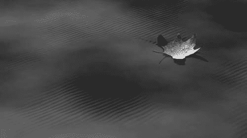

### 注意

**材质**、**着色器**和**纹理**是经常用作同义词的术语，尽管它们在意义上有所区别。为了我们的目的，我们尽量遵守以下定义：**纹理**是一个基本构建块，例如颜色或法线图案，或者简单地是一个根据表面位置返回值的函数。**着色器**将接受任意数量的纹理或基本颜色，并将根据入射光的影响（以及可能的视图方向）返回一个颜色。**材质**是一组纹理、着色器和可以应用于对象的各类属性。Pynodes 可以是纹理，也可以是着色器。

# 基础知识

当我们设计一个 Pynode 时，我们基本上设计的是一种为屏幕上每个需要该节点着色的像素（或者如果启用了**超采样**，则甚至超过一次）提供函数的东西。此函数将获得其他事物，例如对象上被着色的点的 x、y 和 z 坐标，这些坐标对应于我们当前正在计算的屏幕上的像素。然后，该函数预计将返回一些有用的东西，例如颜色、强度值，或者稍微不那么直观的东西，如法线。

在 Blender 的节点编辑器窗口中，每个材质节点，包括 Pynode，都由一个盒子表示，其输入在左侧，输出在右侧。这些输入和输出通常被称为**插座**，并由小彩色圆圈表示（参见下一张截图）。这些插座可以用来连接节点；通过单击一个节点的输出插座并拖动鼠标到另一个节点的输入插座，这些节点将被连接。通过组合所需的不同节点数量，可以创建非常复杂和强大的着色器。

## 从节点到 Pynodes

Blender 的节点系统的强大之处不仅在于其许多预定义的节点类型和这些节点可能连接的许多方式，还在于我们可以用 Python 编写新的节点，这些节点可以以与普通节点相同的方式连接。

Pynodes 需要一种方式来访问由输入插座提供的信息，以及一种方式将它们计算出的结果发送到输出插座。节点及其插座的概念是按照面向对象模型结构化的。让我们先看看一些示例代码来证明这并不需要令人害怕（面向对象的老兵：请向另一边看或用手指遮住眼睛，只从下面的示例中获取类定义）：

```py
from Blender import Node

class MyNode(Node.Scripted):

   def __init__(self, sockets):
      sockets.input = [Node.Socket('Coords', val= 3*[1.0])]
	  sockets.output = [Node.Socket('Color', val = 4*[1.0])]

   def __call__(self):
      x,y,z = self.input.Coords
      self.output.Color = [abs(x),abs(y),abs(z),1.0]
```

在我们详细查看此代码之前，先在 Blender 中尝试它，看看它实际上是如何工作的：

1.  在文本编辑器中打开一个新文件，并给它一个可区分的名称。

1.  复制示例代码。

1.  创建一个简单的场景，例如，在原点处的一个简单的 UV 球体，配上一两个灯具和一个摄像机。

1.  像平常一样，将 `Node` 材质分配给球体。

1.  最后，在节点编辑器中添加一个 *动态* 节点（**添加 | 动态**），通过点击 *动态* 节点的选择按钮并选择你编辑的文件来选择文件的名称。

结果的节点网络（通常称为 **面条**）可能看起来像这样：

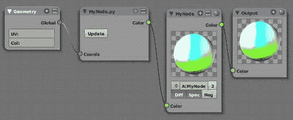

如果你渲染球体，结果是一个五彩斑斓的球体，与颜色选择小部件不相上下。

现在回到代码。

在第一行中，我们从 Blender 导入 `Node` 模块，因为我们将实现一种新的节点类型，但其中大部分行为已经在 `Node` 模块中定义。

然后我们定义了一个名为 `MyNode` 的类，它是 `Node.Scripted` 的子类，它将表现得就像一个 `Scripted` 节点，除了我们将要重新定义的部分。

接下来，我们定义了 `__init__()` 函数，它将在我们在节点编辑器中第一次创建此类 Pynode 或点击 **更新** 按钮时被调用。当发生这种情况时，Blender 将向此函数传递两个参数：`self`，指向我们使用的节点的指针，以及 `sockets`，一个指向我们的输入和输出插座列表的对象的引用。这些是我们将在节点编辑器中接收输入或发送数据的节点。

在高亮行中，我们定义了一个输入插座定义列表；在这种情况下只有一个，称为 `Coords`。它是一个向量输入，因为它使用一个包含三个浮点数的列表初始化默认值，如果这个输入插座没有连接到另一个节点。在节点编辑器中，向量节点以蓝色圆圈表示。

也可能存在其他类型的输入插座，其类型由`val`参数的值确定。输出插座以相同的方式定义。一个包含三个浮点数的列表将定义一个向量插座，一个包含四个浮点数的列表将定义一个颜色插座（具有红色、绿色、蓝色和 alpha 组件），而表示简单值（如强度）的插座由单个浮点数初始化。请注意，我们无法区分需要用户填写或应连接到另一个节点的输入。我们使用输入插座来完成这两项任务，并将不得不记录它们的预期用途。目前，没有提供添加按钮或其他小部件到 Pynode 的功能。

我们的示例 Pynode 也需要输出，因此我们定义了一个包含单个输出插座（称为`Color`）的列表。它有四个默认的浮点值，分别指定红色、绿色、蓝色和 alpha 值。

接下来，我们定义了一个函数`__call__()`，每次对像素进行着色时都会调用它。它不接受任何参数，只有`self`——当前节点的引用，在以下行中用于访问输入和输出插座。

在`__call__()`的主体中，我们从名为`Coords`的输入插座检索三个组件，并将它们分配给易于记忆的变量。最后，我们创建了一个新的四分量列表，代表我们计算出的颜色，并将其分配给名为`Color`的输出插座。

这是定义简单纹理的基础，但节点（正如我们将在以下章节中看到的）还有更多信息可用，因此可以设计一些相当复杂的效果。我们以一个稍微更复杂的节点结束本节，该节点基于我们之前看到的相同原则，但创建了更有用的图案。

# 正规镶嵌

棋盘纹理可能是你可以想象的最简单的纹理，因此在编程纹理时经常用作示例。因为 Blender 已经内置了棋盘纹理（自 2.49 版本以来，在节点窗口的纹理上下文中），所以我们更进一步，创建了一个不仅显示棋盘纹理，还显示三角形和六边形**镶嵌**的纹理节点。

```py
from Blender import Node,Noise,Scene
from math import sqrt,sin,cos,pi,exp,floor
from Blender.Mathutils import Vector as vec

# create regular tilings to be used as a color map

class Tilings(Node.Scripted):
   def __init__(self, sockets):
      sockets.input = [Node.Socket('type' , val= 2.0, min = 1.0, max = 3.0),
                       Node.Socket('scale' , val= 2.0, min = 0.1, max = 10.0),
                       Node.Socket('color1', val= [1.0,0.0,0.0,1.0]),
                       Node.Socket('color2', val= [0.0,1.0,0.0,1.0]),
                       Node.Socket('color3', val= [0.0,0.0,1.0,1.0]),
                       Node.Socket('Coords', val= 3*[1.0])]

      sockets.output = [Node.Socket('Color', val = 4*[1.0])]
```

前几行首先定义了我们的输入和输出插座。在所有情况下输出将简单地是一个颜色，但我们有一组更丰富的输入插座。我们定义了三种不同的输入颜色，因为六边形图案需要三种颜色来给每个六边形一个与其相邻六边形可区分的颜色。

我们还定义了一个`Coords`输入插座。这个输入插座可以连接到任何几何插座的输出。这样，我们就有了将我们的颜色纹理映射到纹理对象的各种可能性。还定义了一个`Scale`插座来控制纹理的大小。

最后，我们定义一个 `Type` 插槽来选择我们希望生成的图案。由于 Pynode API 不提供下拉框或其他简单的选择小部件，我们使用值插槽并任意选择值来表示我们的选择：`1.0` 代表三角形，`2.0` 代表棋盘，`3.0` 代表六边形。

我们在 `__init__()` 函数的末尾定义了一系列常量和颜色映射的字典，我们将在生成六角纹理时使用这些。

```py
      self.cos45 = cos(pi/4)
      self.sin45 = sin(pi/4)
      self.stretch = 1/sqrt(3.0)
      self.cmap = { (0,0):None,(0,1):2,   (0,2):0,(1,0):0,   (1,1):1,   (1,2):None,(2,0):2,   (2,1):None,(2,2):1 }
```

下一步是定义 `__call__()` 函数：

```py
   def __call__(self):

      tex_coord = self.input.Coords
      # we disregard any z coordinate
      x = tex_coord[0]*self.input.scale 
      y = tex_coord[1]*self.input.scale

      c1 = self.input.color1
      c2 = self.input.color2
      c3 = self.input.color3

      col= c1
```

`__call__()` 函数首先定义了一些输入值的缩写，并将输入坐标乘以所选的缩放比例以拉伸或缩小生成的图案。下一步是确定所需的图案类型，并调用适当的函数来计算给定坐标的输出颜色。结果颜色被分配给我们的唯一输出插槽：

```py
      if self.input.type<= 1.0:
         col = self.triangle(x,y,c1,c2)
      elif self.input.type <= 2.0:
         col = self.checker(x,y,c1,c2)
      else:
         col = self.hexagon(x,y,c1,c2,c3)

      self.output.Color = col
```

各种图案生成函数都非常相似；它们接受 x 和 y 坐标以及两种或三种颜色作为参数，并返回一种颜色。作为类的成员函数，它们还接受一个额外的 `self` 参数。

```py
   def checker(self,x,y,c1,c2):
      if int(floor(x%2)) ^ int(floor(y%2)):
         return c1
      return c2
```

`checker` 函数检查我们在哪一行和哪一列，如果行号和列号都是奇数或偶数（这就是排他性“或”操作符所建立的），它返回一种颜色；如果不是，它返回另一种颜色。

```py
   def triangle(self,x,y,c1,c2):
      y *= self.stretch
      x,y = self.cos45*x - self.sin45*y, self.sin45*x + self.cos45*y
      if int(floor(x%2)) ^ int(floor(y%2)) ^ int(y%2>x%2) : return c1
      return c2
```

`triangle` 函数首先将 x 和 y 坐标一起旋转 45 度角（将正方形变为直立的长方形）。然后根据行和列的数字确定颜色，就像在 `checker` 函数中一样，但有一个转折：第三个条件（突出显示）检查我们是否位于对角线交叉的正方形左侧，因为我们已经旋转了我们的网格，所以我们实际上检查坐标是否在分割长方形的水平线上方。这可能听起来有点复杂，但你可以查看以下屏幕截图来获得概念：

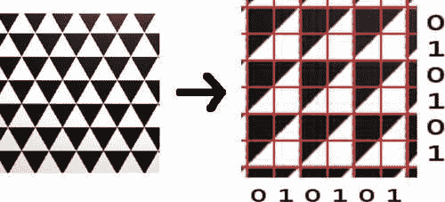

```py
   def hexagon(self,x,y,c1,c2,c3):
      y *= self.stretch
      x,y = self.cos45*x - self.sin45*y, self.sin45*x + self.cos45*y
      xf = int(floor(x%3))
      yf = int(floor(y%3))
      top = int((y%1)>(x%1))
	  c = self.cmap[(xf,yf)]
      if c == None:
         if top :
            c = self.cmap[(xf,(yf+1)%3)]
         else :
            c = self.cmap[(xf,(yf+2)%3)]
      return (c1,c2,c3)[c]
```

在许多方面，`hexagon` 函数类似于 `triangle` 函数（毕竟六边形是由六个三角形粘合而成的）。因此，它执行相同的旋转技巧，但不是通过简单的公式来选择颜色，事情变得更为复杂，所以我们在这里使用颜色图（在之前的代码片段中突出显示）。基本上，我们将屏幕分为水平和垂直的条带，并根据我们所在的条带来选择颜色。

最后的魔法在于我们脚本的最后一行：

```py
__node__ = Tilings
```

目前 Pynodes 的实现方式下，Blender 需要这个赋值来识别一个类为节点。我们的节点将出现在脚本节点的弹出菜单中，标记为 **Tilings**。完整的代码作为 `tilings.py` 包含在 `tilings.blend` 文件中，并附有示例节点设置。一些可能的图案在下一张屏幕截图中展示：

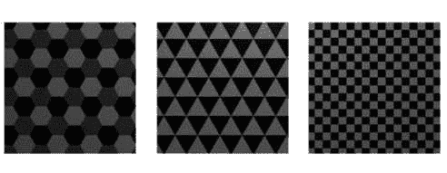

对应的节点设置在下一张截图中显示。请注意，我们没有将任何节点连接到颜色输入，但如果这样做，可以创建更复杂的图案。

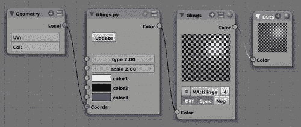

## 抗锯齿

如果你仔细观察六边形或三角形镶嵌的对角边界，即使过采样设置为高值，你也会注意到一些类似楼梯的伪影。

Blender 本身足够智能，可以将选择的**抗锯齿**级别应用于诸如对象边界之类的事物，但在大多数情况下，表面上的纹理将必须自行处理抗锯齿。Blender 的内置纹理当然是这样设计的，但用 Pynodes 生成的我们自己的纹理应该明确处理这一点。

有许多数学技术可用于减少生成纹理中的混叠，但大多数都不容易实现或需要特定于图案生成方式的知识。幸运的是，Blender 为我们提供了**全 OSA**选项（**按钮窗口 | 着色上下文 | 材质按钮 | 链接和管道选项卡**）。如果我们启用此选项，Blender 将被迫通过渲染按钮中选择的量对纹理中的每个像素进行过采样。这是一个昂贵的选项，但可以消除混叠效果，而无需在我们的 Pynode 纹理中实现特定的过滤选项。

## 通过向量索引纹理

在我们的镶嵌图案中，我们将颜色限制为区分每个相邻瓦片所需的最小数量。但根据某些噪声纹理随机分配颜色是否可能？这样我们可能会以遵循整体随机模式的方式着色鱼鳞，同时使每个单独的鳞片均匀着色。

我们不能简单地将彩色纹理连接到颜色输入，因为这可能会产生有趣的图案，但每个瓦片可能不会有均匀的颜色。解决方案是修改我们的 Pynode 以生成一个在给定瓦片内均匀的唯一向量。这个向量可以连接到任何以向量为输入的噪声纹理，因为所有 Blender 纹理都可以这样做。这个向量由噪声纹理节点用来指向随机纹理中的单个点，这样我们就可以产生随机着色但均匀的瓦片。

为了提供这种功能，我们通过删除颜色输入并替换颜色输出为向量输出（未显示）来修改我们的代码。现在`__call__()`函数内部的代码将必须生成一个向量而不是颜色。这里我们展示了修改后的`triangle`函数（完整代码作为`tilingsv.py`在`tilingsv.blend`中提供）：

```py
def triangle(self,x,y):
      y *= self.stretch
      x,y = self.cos45*x - self.sin45*y, self.sin45*x + self.cos45*y

      if int(floor(x%2)) ^ int(floor(y%2)) ^ int(y%2>x%2) :
	     return [floor(x),floor(y),0.0]
      return [floor(x)+0.5,floor(y),0.0]
```

逻辑基本上相同，但如图中高亮行所示，我们返回一个依赖于位置的向量。然而，由于`floor()`操作，它在三角形内是恒定的。请注意，对于交替的三角形，我们添加了一个轻微的偏移；只要它是恒定的并且产生与其他三角形不同的向量，我们选择的偏移量无关紧要。

结果显示了一个随机的三角形模式，它遵循噪声中的大相关性，但每个三角形都保持统一的颜色。右侧的样本使用了更大的噪声尺寸的云纹理：

.jpg)

下面的截图显示了可能的节点设置：

.jpg)

## 新鲜微风——带有法线的纹理

一个纹理可以不仅仅有几何输入。如果你需要一个纹理根据另一个纹理改变其行为，而这种行为不能通过简单的节点设置实现，你可以为它提供额外的输入插座。我们将开发一个 Pynode，它生成一个模拟几乎无风的一天池塘上小**波**的碎片法线图。

那些补丁出现的位置由一个额外的输入插座控制，它可以连接到几乎任何噪声纹理。我们将把这个输入插座命名为`amplitude`，因为我们用它来乘以我们计算出的**法线**。这样，我们的小波将在噪声纹理为零的地方消失。

波纹的波长由另一个名为`wavelength`的输入控制，我们的`Ripples`节点还将有一个用于坐标的输入插座。

第四个和最后一个输入称为`direction`——一个控制我们小波方向的向量。用户可以手动设置它，但如果需要，也可以连接到一个提供通过鼠标轻松操纵方向的简单方法的法线节点。

所有的这些组合在一起的节点设置在节点编辑器的截图中显示：

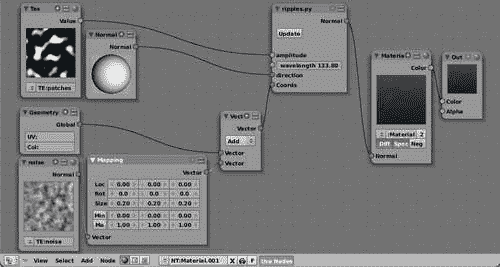

节点的脚本很简单；在导入一些必要的定义之后，我们定义了众多的输入插座和我们的单个输出插座：

```py
from Blender import Node
from math import cos
from Blender.Mathutils import Vector as vec

class Ripples(Node.Scripted):
   def __init__(self, sockets):
      sockets.input = [Node.Socket('amplitude' , val= 1.0, min = 0.001, max = 1.0),
                       Node.Socket('wavelength', val= 1.0, min = 0.01, max = 1000.0),
                       Node.Socket('direction' , val= [1.0,0.0,0.0]),
                       Node.Socket('Coords'    , val= 3*[1.0])]

      sockets.output = [Node.Socket('Normal', val = [0.0,0.0,1.0])]

   def __call__(self):

      norm = vec(0.0,0.0,1.0)

      p = vec(self.input.Coords)
      d = vec(self.input.direction)
      x = p.dot(d)*self.input.wavelength
      norm.x=-self.input.amplitude*cos(x)

      n = norm.normalize()

      self.output.Normal = n*.01

__node__ = Ripples
```

再次强调，所有真正的操作都是在`__call__()`函数中完成的（在前面的代码片段中突出显示）。我们首先为坐标和方向向量分别定义了缩写`p`和`d`。我们的小波是正弦函数，而这个正弦曲线上的位置是由位置在方向向量上的投影确定的。这个投影是通过计算“内积”或“点积”——这是由`Vector`对象的`dot()`方法提供的一个操作来计算的。

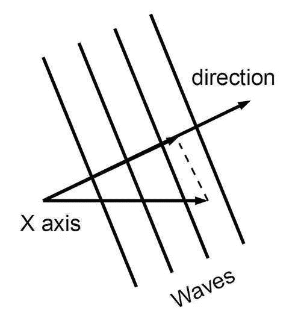

然后将这个投影乘以波长。如果我们计算正弦波，我们会得到我们波的高度。然而，我们感兴趣的并不是高度，而是法线。法线始终向上指，并随着我们的正弦波移动（参见下一张图）。可以证明这个法线是一个具有 1.0 的 z 分量和与正弦函数的负导数相等的 x 分量的向量，即负余弦。脚本（`ripples.py`）和示例节点设置作为`ripples.blend`提供。

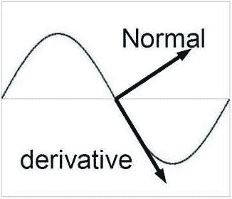

在我们之前展示的节点设置中，你可能已经注意到，我们没有直接将几何节点链接到我们的涟漪节点，而是添加了一个第二个纹理节点，并通过添加和缩放纹理节点的法线输出与几何输入相结合。我们本来可以在涟漪节点中混合一些噪声，但这样我们可以给用户更多的控制权，让他能够添加（如果需要）类型和数量的噪声。这是一个通用模式：节点应该尽可能简单，以便在不同的设置中重复使用。

这些涟漪并不是为了动画设计的，但在下一节中，我们将设计一个可以动画化的节点。

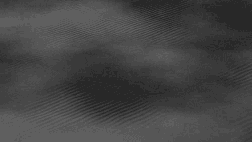

# 雨滴——动画 Pynodes

许多模式不是静态的，而是随时间变化。一个例子是雨滴落在池塘中形成的涟漪。Blender 提供了渲染时间参数，如起始帧、帧率和当前帧，这样我们就有很多钩子来使我们的 Pynodes 具有时间依赖性。我们将看到如何在生成雨滴图案的脚本中使用这些钩子。这种模式会以逼真的方式改变，类似于水滴落在池塘中产生的向外扩展的涟漪。在这个过程中，我们也会学到一些有用的技巧，通过在 Pynode 中存储昂贵计算的结果来加速计算。

## 渲染时间参数

处理与时间相关的事物时，最相关的渲染参数是当前帧数和帧率（每秒的帧数）。这些参数由`Scene`模块以渲染上下文的形式提供，大多数通过函数调用，一些作为变量：

```py
scn               = Scene.GetCurrent()
context           = scn.getRenderingContext()
current_frame     = context.currentFrame()
start_frame       = context.startFrame()
end_frame         = context.endFrame()
frames_per_second = context.fps
```

有了这个信息，我们现在可以计算时间，无论是绝对时间还是相对于起始帧的时间：

```py
absolute_time = current_frame/float(frames_per_second)
relative_time = (current_frame-start_frame)/float(frames_per_second)
```

注意分母中的浮点数转换（突出显示）。这样我们确保除法被视为浮点运算。这并不是绝对必要的，因为`fps`作为浮点数返回，但许多人假设帧率是一个整数值，如 25 或 30。然而，这并不总是情况（例如，NTSC 编码使用分数帧率），所以我们最好明确这一点。此外，请注意，我们不能去掉这个除法，否则当人们改变他们选择的帧率时，动画的速度会改变。

## 看起来好的就是好的

准确模拟由落水滴引起的涟漪的外观可能看起来很困难，但却是直截了当的，尽管有些复杂。对底层数学感兴趣的读者可能想查看一些参考资料（例如[`en.wikipedia.org/wiki/Wave`](http://en.wikipedia.org/wiki/Wave)）。然而，我们的目标并不是尽可能准确地模拟现实世界，而是为艺术家提供一个看起来好且可控的纹理，这样纹理甚至可以应用于不现实的情况。

因此，我们不是让涟漪传播的速度依赖于诸如水的粘度等因素，而是将速度作为一个可调输入提供给我们的 Pynode。同样，对于涟漪的高度和宽度以及涟漪高度随其扩展而减小的速率也是如此。基本上，我们通过一个余弦函数乘以一个指数函数和一个阻尼因子来近似我们的涟漪小包，它从水滴的撞击点向外辐射。这听起来可能又像是数学，但它可以很容易地被可视化：

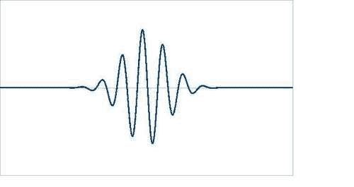

要计算纹理中任何位置 x, y 的高度，可以按照以下方式实现：

```py
position_of_maximum=speed*time
damping = 1.0/(1.0+dampf*position_of_maximum)
distance = sqrt((x-dropx)**2+(y-dropy)**2)
height = damping*a*exp(-(distance-position_of_maximum)**2/c)* \cos(freq*(distance-position_of_maximum))
```

在这里，`dropx` 和 `dropy` 是水滴的撞击位置，而 `a` 是我们可调的高度参数。

在不同时间、不同位置滴下更多水滴的效果，可以通过简单地将结果高度相加来计算。

## 存储昂贵的计算结果以供重用

单个水滴当然不是雨，因此我们希望看到许多随机水滴叠加的效果。因此，我们必须为想要模拟的水滴选择随机的撞击位置和时间。

我们必须在每次调用 `__call__()` 方法时（即，在我们的纹理中的每个可见像素）都这样做。然而，这将是一种巨大的处理能力浪费，因为计算许多随机数以及为可能的大量水滴分配和释放内存是昂贵的。

幸运的是，我们可以将这些结果存储为 Pynode 的实例变量。当然，我们应该小心检查在 `__call__()` 调用之间是否有任何输入参数发生了变化，如果发生了变化，则采取适当的行动。一般模式如下：

```py
class MyNode(Node.Scripted):

   def __init__(self, sockets):
      sockets.input   = [Node.Socket('InputParam', val = 1.0)]
      sockets.output  = [Node.Socket('OutputVal' , val = 1.0)]
      self.InputParam = None
      self.Result     = None

   def __call__(self):
      if self.InputParam == None or \
         self.InputParam != self.input.InputParam :
         self.InputParam = self.input.InputParam
         self.Result     = expensive_calculation ...
      self.output.OutputVal = other_calculations_using_Result …
```

此模式仅在输入参数不经常变化的情况下有效，例如，只有当用户更改它时。如果输入每像素都发生变化，因为输入插口连接到另一个节点的输出——建议的方案只会浪费时间而不是节省时间。

## 计算法线

我们的目的是生成一个可以作为法线的涟漪图案，因此我们需要一种方法从计算的高度中导出法线。Blender 没有为我们提供用于材质的此类转换节点，因此我们必须自己设计方案。

### 注意

与材质节点不同，Blender 的纹理节点确实提供了一个名为“值到法线”的转换函数，该函数在纹理节点编辑器中可用，从菜单 **添加|转换器|值** 到法线。

现在，正如在涟漪的情况下，原则上我们可以计算雨滴的确切法线，但为了避免再次走数学路线，我们采用许多内置噪声纹理中使用的计算法线的方法，这种方法不依赖于底层函数。

只要我们能在三个点上评估一个函数：`f(x,y),f(x+nabla,y)` 和 `f(x,y+nabla)`，我们就可以通过观察函数在 x 和 y 方向上的斜率来估计 x,y 处的法线方向。表面法线将是垂直于由这两个斜率定义的平面的单位向量。我们可以从任何小的 `nabla` 值开始，如果看起来不好，我们可以将其减小。

## 将所有这些放在一起

从前面的段落中汲取所有这些想法，我们可以为我们的雨滴 Pynode 编写以下代码（省略了 `import` 语句）：

```py
class Raindrops(Node.Scripted):
   def __init__(self, sockets):
      sockets.input = [Node.Socket('Drops_per_second'  , val = 5.0,min = 0.01, max = 100.0),
                       Node.Socket('a',val=5.0,min=0.01,max=100.0),
                       Node.Socket('c',val=0.04,min=0.001,max=10.0),
                       Node.Socket('speed',val=1.0,min=0.001,max=10.0),
                       Node.Socket('freq',val=25.0,min=0.1,max=100.0),
                       Node.Socket('dampf',val=1.0,min=0.01,max=100.0),
                       Node.Socket('Coords', val = 3*[1.0])]

      sockets.output = [Node.Socket('Height', val = 1.0),
                        Node.Socket('Normal', val = 3 *[0.0])]

      self.drops_per_second = None
      self.ndrops = None
```

初始化代码定义了除坐标之外的一些输入插座。`Drops_per_second` 应该是显而易见的。`a` 和 `c` 是从撞击点向外传播的波纹的整体高度和宽度。`speed` 和 `freq` 决定了我们的波纹传播速度以及波纹之间的距离。波纹向外传播时高度减小的速度由 `dampf` 确定。

我们还定义了两个输出插座：`Height` 将包含计算出的高度，而 `Normal` 将包含在同一位置的相应法线。`Normal` 是你通常用来获得波纹表面效果的东西，但计算出的高度可能对例如衰减表面的反射率值很有用。

初始化以定义一些实例变量结束，这些变量将用于确定我们是否需要再次计算水滴撞击的位置，正如我们在 `__call__()` 函数的定义中将会看到的。

`__call__()` 函数的定义从初始化多个局部变量开始。一个值得注意的点是，我们设置了 `Noise` 模块函数使用的随机种子（以下代码中突出显示）。这样，我们确保每次重新计算撞击点时都会得到可重复的结果，也就是说，如果我们首先将每秒水滴数设置为十，然后设置为二十，最后再回到十，生成的图案将是相同的。如果你想要更改这一点，你可以添加一个额外的输入插座，用作 `setRandomSeed()` 函数的输入：

```py
   def __call__(self):

      twopi = 2*pi

      col = [0,0,0,1]
      nor = [0,0,1]
      tex_coord = self.input.Coords
      x = tex_coord[0] 
      y = tex_coord[1]

      a = self.input.a
      c = self.input.c

	  Noise.setRandomSeed(42)

      scn               = Scene.GetCurrent()
      context           = scn.getRenderingContext()
      current_frame     = context.currentFrame()
      start_frame       = context.startFrame()
      end_frame         = context.endFrame()
      frames_per_second = context.fps
      time              = current_frame/float(frames_per_second)
```

下一步是确定我们是否需要重新计算水滴撞击点的位置。这只有在用户更改输入插座 `Drops_per_second` 的值时才是必要的（你可以将这个输入连接到一些其他节点，该节点在每个像素处更改此值，但这不是一个好主意）或者当动画的开始或结束帧发生变化时，因为这会影响我们需要计算的水滴数量。这个测试通过比较新获得的值与存储在实例变量中的值来在以下代码的突出行中执行：

```py
      drops_per_second = self.input.Drops_per_second
      # calculate the number of drops to generate
      # in the animated timeframe
      ndrops = 1 + int(drops_per_second * (float(end_frame) –
               start_frame+1)/frames_per_second )

	  if self.drops_per_second != drops_per_second
	  or self.ndrops != ndrops:
         self.drop = [ (Noise.random(), Noise.random(),
                       Noise.random() + 0.5) for i in range(ndrops)]
         self.drops_per_second = drops_per_second
         self.ndrops = ndrops
```

如果我们必须重新计算水滴的位置，我们将一个由元组组成的列表分配给`self.drop`实例变量，每个元组包含水滴的 x 和 y 位置以及一个随机的水滴大小，这将衰减波纹的高度。

其余的行每次调用`__call__()`时都会执行，但突出显示的行确实显示了显著的优化。因为当前帧中尚未落下的水滴不会对高度产生影响，所以我们排除了这些水滴的计算：

```py
      speed=self.input.speed
      freq=self.input.freq
      dampf=self.input.dampf

      height = 0.0
      height_dx = 0.0
      height_dy = 0.0
      nabla = 0.01
	  for i in range(1+int(drops_per_second*time)):
         dropx,dropy,dropsize = self.drop[i]
         position_of_maximum=speed*time-i/float(drops_per_second)
         damping = 1.0/(1.0+dampf*position_of_maximum)
         distance = sqrt((x-dropx)**2+(y-dropy)**2)
         height += damping*a*dropsize*
            exp(-(distance-position_of_maximum)**2/c)*
         cos(freq*(distance-position_of_maximum))
         distance_dx = sqrt((x+nabla-dropx)**2+(y-dropy)**2)
         height_dx += damping*a*dropsize*
exp(-(distance_dx-position_of_maximum)**2/c)*
cos(freq*(distance_dx-position_of_maximum))
         distance_dy = sqrt((x-dropx)**2+(y+nabla-dropy)**2)
         height_dy += damping*a*dropsize*
exp(-(distance_dy-position_of_maximum)**2/c)*
cos(freq*(distance_dy-position_of_maximum))
```

在前面的代码中，我们实际上在三个不同的位置计算高度，以便能够近似法线（如前所述）。这些值在下面的行中用于确定法线的 x 和 y 分量（z 分量设置为 1）。计算出的高度本身被除以滴落次数（因此当滴落次数改变时，平均高度不会改变）以及整体缩放因子`a`，用户可以在将其分配给输出端口之前设置它（突出显示）：

```py
      nor[0]=height-height_dx
      nor[1]=height-height_dy

	  height /= ndrops * a
      self.output.Height = height

      N = (vec(self.shi.surfaceNormal)+0.2*vec(nor)).normalize()
      self.output.Normal= N

__node__ = Raindrops
```

然后将计算出的法线添加到我们在计算像素处的表面法线，这样波纹在曲面上看起来仍然很好，并且在分配到输出端口之前进行归一化。通常，最后一行定义了这个 Pynode 的有意义名称。完整的代码和示例节点设置作为`raindrops.py`在`raindrops.blend`中可用。下一个屏幕截图显示了动画的一个样本帧：

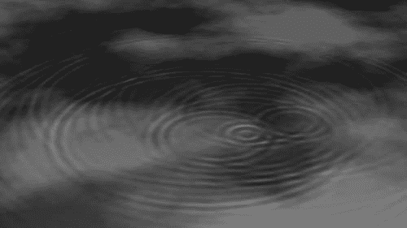

下面的屏幕截图显示了示例节点设置：

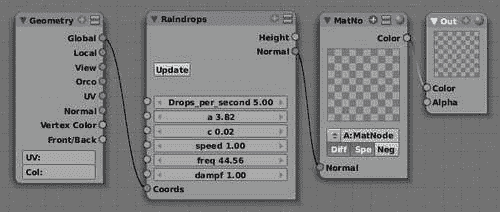

# 威瑟林高地——一个坡度相关的材质

在 Blender 中生成分形地形相当简单（只需添加一个平面，进入*编辑*模式，选择所有，然后多次细分分形 *W → 3*)。如果你想要更复杂的东西，有一些优秀的脚本可以帮助你（例如，参见[`sites.google.com/site/androcto/Home/python-scripts/ANTLandscape_104b_249.py`](http://sites.google.com/site/androcto/Home/python-scripts/ANTLandscape_104b_249.py)）。但是，你将如何将这些纹理应用到这样的地形上呢？在这个例子中，我们将研究一种根据我们要着色的表面的坡度来选择不同材质输入的方法。这将使我们能够以相当令人信服的方式着色山岳地形。

### 注意

**减少计算时间：**

Pynodes 计算密集，因为它们对每个可见像素都会被调用。巧妙的编码有时可以减少所需的计算量，但如果需要进一步加速，即时编译器可能会有帮助。**psyco**就是这样一种编译器，我们将在最后一章中遇到它，我们将将其应用于 Pynodes 并看看它是否有任何可感知的影响。

## 确定斜率

**斜率**可以定义为地板平面与在感兴趣点处与表面相切的线之间的角度。

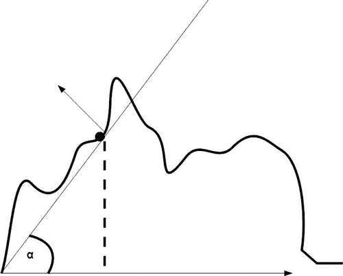

因为我们假设我们的（想象中的）地板平面沿着 x 和 y 轴水平延伸，所以这个角度完全由同一点的表面法线的 z 分量决定。现在我们可以精确地计算出这个角度（它就是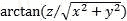），但作为艺术家，我们可能仍然希望有一些额外的控制，所以我们简单地取表面法线的归一化 z 分量，并用我们喜欢的任何颜色渐变节点修改这个输出强度。在一个 Pynode 中，表面法线是一个现成的矢量实体：`self.input.shi.surfaceNormal`。然而，有一个问题...

## 世界空间与相机空间

我们可用的表面法线恰好是在相机空间中定义的。这意味着，例如，当表面法线直接指向相机时，它被定义为（0，0，-1）。现在我们希望我们的表面法线在世界空间中定义。例如，一个直指上方的法线应该有一个值为（0，0，1），无论相机的位置或倾斜角度如何（毕竟，山腰的植被通常不会随着相机角度的变化而变化）。幸运的是，我们可以通过取相机的世界空间矩阵并将其与矩阵的旋转部分相乘来从**相机空间**转换为**世界空间**。生成的代码看起来像这样：

```py
class Slope(Node.Scripted):
   def __init__(self, sockets):
      sockets.output = [Node.Socket('SlopeX', val = 1.0),Node.Socket('SlopeY', val = 1.0),Node.Socket('SlopeZ', val = 1.0),]
      self.offset =  vec([1,1,1])
      self.scale =  0.5
```

注意，初始化代码没有定义输入插座。我们将从着色器输入（在下一部分代码中突出显示）获取我们着色像素位置的表面法线。我们确实定义了三个单独的输出插座，用于斜率的 x、y 和 z 分量，以便在节点设置中易于使用。因为我们主要将使用斜率的 z 分量，所以将其放在单独的插座中可以节省我们使用额外的矢量操作节点从矢量中提取它的麻烦。

```py
   def __call__(self):

      scn=Scene.GetCurrent()
      cam=scn.objects.camera
      rot=cam.getMatrix('worldspace').rotationPart().resize4x4();

      N = vec(self.shi.surfaceNormal).normalize().resize4D() * rot
      N = (N + self.offset ) * self.scale
      self.output.SlopeX=N[0]
      self.output.SlopeY=N[1]
      self.output.SlopeZ=N[2]

__node__ = Slope
```

从相机空间到世界空间的转换是在引用表面法线的行中完成的（突出显示）。方向仅取决于旋转，因此我们在将表面法线与之相乘之前，只提取相机的变换矩阵的旋转部分。由于归一化结果可能指向下方，我们通过加 1 并乘以 0.5 来强制 z 分量位于[0, 1]的范围内。完整的代码作为`slope.py`在`slope.blend`中可用。

有一个重要的事情需要注意：我们这里使用的表面法线没有插值，因此在一个单一面的表面上处处相等，即使面的`smooth`属性被设置。在一个细分得很细的景观中，这不应该是一个问题，因为斜率输入没有直接使用。然而，这与你预期的不同。在当前 Pynodes 的实现中，这个限制是很难克服的，如果不是不可能的话。

下面的插图展示了一个可能的例子。

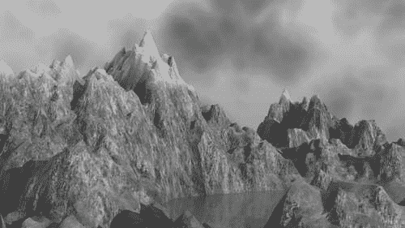

上面的效果是通过在下一张截图所示的节点设置中组合不同的材料实现的。这个设置在`slope.blend`中也是可用的。下面两种材料是用我们的斜率相关节点混合的，然后根据一个计算高度的 Pynode 将得到的材料与上层材料混合。

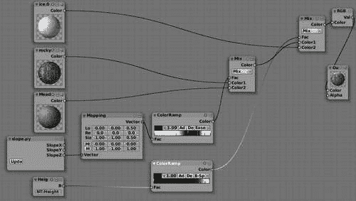

# 肥皂泡——视图相关的着色器

一些材料会根据我们观察的角度改变它们的外观。鸟的羽毛、一些豪华汽车的油漆、水上的油污，以及**肥皂泡**就是一些例子。这种改变颜色的现象被称为**彩虹色**。如果我们想实现类似的效果，我们需要访问视图向量和表面法线。在我们的肥皂泡着色器中，我们看到实现这一点的其中一种方法。

**首先**是一些**数学**：为什么肥皂泡会显示出所有那些不同的颜色？肥皂泡基本上是带有少量肥皂的弯曲水片，在空气和水之间的界面处，光会被反射。因此，入射光线在击中气泡的外表面时会被部分反射，当它达到内表面时又会再次反射。因此，达到眼睛的反射光是一种混合了走过不同距离的光；其中一部分走过肥皂泡厚度的两倍额外距离。

现在，光的行为就像波一样，相互干涉的波可以根据它们的相位相互减弱或增强。两条光线如果它们走过的距离之差不是它们波长的整数倍，就会相互抵消。结果是，白光（一系列颜色的连续体）从厚度等于某些特定颜色波长一半的肥皂泡上反射回来时，只会显示出那种单一的颜色，因为所有其他颜色都被减弱了，因为它们在内外表面之间“不合适”。（关于肥皂泡还有很多更多。更多和更准确的信息请参考：[`www.exploratorium.edu/ronh/bubbles/bubble_colors.html`](http://www.exploratorium.edu/ronh/bubbles/bubble_colors.html)。）

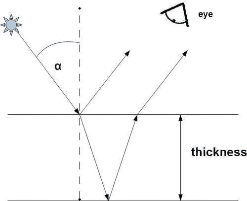

现在我们知道，两个反射表面之间的传播距离决定了我们感知到的颜色，我们也可以理解为什么肥皂泡中会有颜色变化。第一个因素是气泡的曲率。传播的距离将取决于入射光和表面之间的角度：这个角度越浅，光线在表面之间传播的距离就越长。由于表面曲率的变化，入射角也会变化，因此距离和颜色也会变化。颜色变化的第二个来源是表面的不均匀性；由于重力或气流或温度差异引起的轻微变化也会导致不同的颜色。

所有这些信息都转化为一段令人惊讶的简短代码（完整代码作为 `irridescence.py` 在 `irridescence.blend` 中提供，并附有示例节点设置）。

除了坐标外，我们有两个输入插槽——一个用于水膜的厚度，一个用于变化。变化将添加到厚度上，可以连接到纹理节点以生成漩涡等。我们有一个用于计算距离的单个输出插槽：

```py
class Iridescence(Node.Scripted):
   def __init__(self, sockets):
      sockets.input = [ Node.Socket('Coords', val= 3*[1.0]),Node.Socket('Thickness', val=275.0,min=100.0, max=1000.0),Node.Socket('Variation', val=0.5, min=0.0,max=1.0)]

      sockets.output = [Node.Socket('Distance', val=0.5, min=0.0,max=1.0)]
```

反射颜色的计算从获取场景中所有灯具的列表开始，因为我们希望计算入射光线的角度。目前，我们只考虑我们找到的第一个灯具的贡献。然而，一个更完整的实现将考虑所有灯具，甚至它们的颜色。在我们的计算中，我们必须确保表面法线 `N` 和光线的入射向量 `L` 在同一空间中。由于提供的表面法线将在相机空间中，我们将不得不通过相机的变换矩阵来转换这个向量，就像我们在斜率相关的着色器中做的那样（以下代码片段中突出显示）：

```py
   def __call__(self):

      P = vec(self.input.Coords)
      scn=Scene.GetCurrent()
      lamps = [ob for ob in scn.objects if ob.type == 'Lamp']

      lamp = lamps[0]

      cam=scn.objects.camera
      rot=cam.getMatrix('worldspace').rotationPart().resize4x4();
	  N = vec(self.shi.surfaceNormal).normalize().resize4D() * rot

      N = N.negate().resize3D()
      L = vec(lamp.getLocation('worldspace'))
      I = (P – L).normalize()
```

接下来，我们计算表面法线和入射向量之间的角度（`VecT` 是 `Mathutils.angleBetweenVecs()` 的别名），并使用这个入射角度来计算水膜内部表面法线之间的角度，因为这将确定光线的传播距离。我们使用 **斯涅尔定律** 来计算这个值，并使用 `1.31` 作为水膜的折射率。计算距离然后只是一个简单的三角学问题（以下突出显示）：

```py
      angle = VecT(I,N)

      angle_in = pi*angle/180
      sin_in = sin(angle_in)
      sin_out = sin_in/1.31
      angle_out = asin(sin_out)

      thickness = self.input.Thickness + self.input.Variation
 distance = 2.0 * (thickness / cos (angle_out))

```

计算出的距离等于我们将感知到的颜色的波长。然而，Blender 不使用波长，而是使用 RGB 颜色，因此我们仍然需要将这个波长转换为表示相同颜色的 (R, G, B) 元组。这可能通过应用某些光谱公式来完成（例如，参见 [`www.philiplaven.com/p19.html`](http://www.philiplaven.com/p19.html)），但这甚至可能更灵活，通过缩放计算出的距离并将其用作颜色带的输入。这样我们可能会产生非物理准确的彩虹效果（如果需要的话）：

```py
      self.output.Distance = distance
```

要使用此 Pynode，有一些事情需要注意。首先，确保计算出的颜色只影响肥皂泡材料的镜面颜色，否则一切都会显得淡化。

此外，添加一些厚度变化是很重要的，因为没有任何真实的肥皂泡具有完全均匀的厚度。噪声纹理的选择可以显著影响外观。在下一个节点设置示例中，我们添加了略微噪动的木纹纹理的贡献，以获得肥皂膜上常见的螺旋带。

最后，使肥皂膜的材料非常透明但具有高镜面反射率。实验不同的值以获得所需的确切效果，并且确实要考虑照明设置。图示中的示例经过调整，以便在黑白呈现中传达一些问题，因此并不真实，但示例文件`iridescence.blend`中的设置经过调整，以便在渲染时产生令人愉悦的色彩效果。

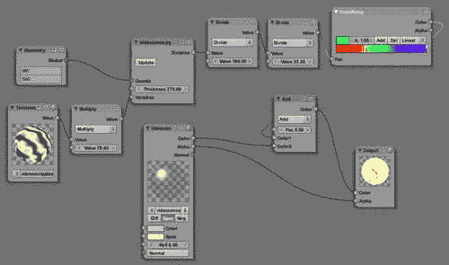

在之前的屏幕截图显示了使用颜色渐变和噪声纹理的使用，其中我们添加了一些除法节点来缩放我们的距离到一个范围在[0,1]内，这可以用作颜色渐变的输入：

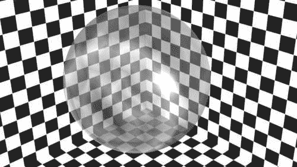

# 摘要

在本章中，我们看到了 Blender 缺乏编译着色器语言并不会阻止其用于设计自定义图案和着色器。Pynodes 是 Blender 节点系统的一个集成部分，我们看到了如何使用它们从简单的颜色图案到相当复杂的动画涟漪来创建效果。具体来说，我们学习了：

+   如何编写生成简单颜色图案的 Pynodes

+   如何编写生成具有法线图案的 Pynodes

+   如何编写动画 Pynodes

+   如何编写高度和坡度相关的材质

+   如何创建对入射光角度做出反应的着色器

在下一章中，我们将探讨整个渲染过程的自动化。
