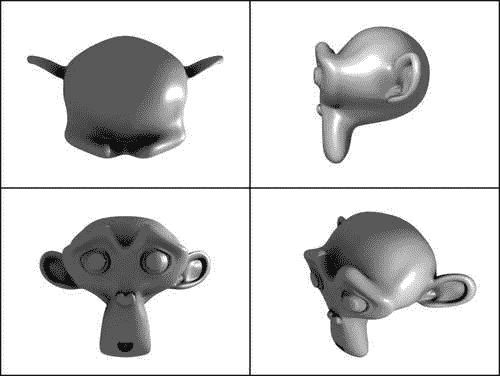
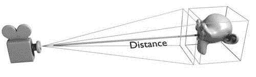
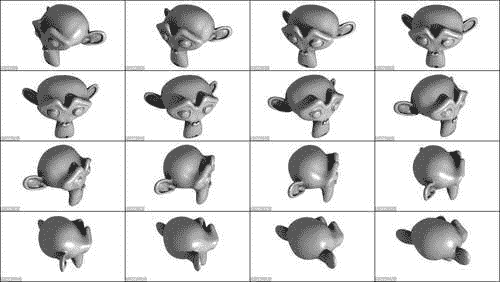
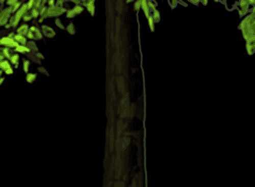
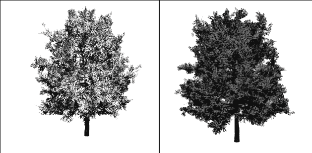
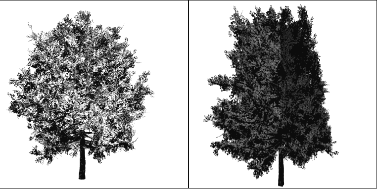
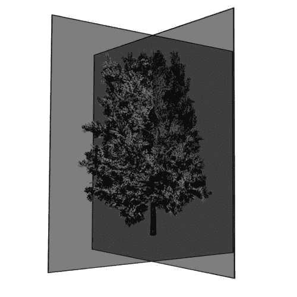
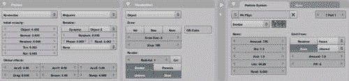
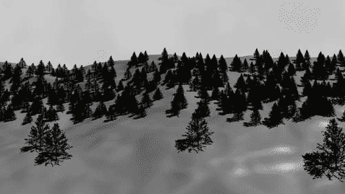

# 第八章。渲染和图像处理

在前面的章节中，我们主要关注构成 Blender 场景的各个组件的脚本方面，例如网格、灯光、材质等。在本章中，我们将转向整个渲染过程。我们将自动化这个渲染过程，以各种方式组合生成的图像，甚至将 Blender 转换为一个专门的 Web 服务器。

在本章中，你将学习如何：

+   自动化渲染过程

+   为产品展示创建多个视图

+   从复杂对象创建广告牌

+   使用 Python 图像处理库 (PIL) 处理图像，包括渲染结果

+   创建一个按需生成图像的服务器，这些图像可以用作 CAPTCHA 挑战

+   创建联系表

# 不同的视角——结合多个摄像机角度

到现在为止，你可能期望渲染也可以自动化，你完全正确。Blender Python API 提供了对渲染过程几乎所有参数的访问，并允许你渲染单个帧以及动画。这允许自动化许多手工操作起来繁琐的任务。

假设你已经创建了一个对象，并想创建一张从不同角度展示它的单张图像。你可以分别渲染这些图像，并在外部应用程序中合并它们，但我们将编写一个脚本，不仅渲染这些视图，而且通过使用 Blender 的图像处理能力和一个名为 PIL 的外部模块，将它们合并到一张单独的图像中。我们试图达到的效果在苏珊娜的插图中有展示，展示了她最好的所有角度。



Blender 是一个出色的工具，它不仅提供了建模、动画和渲染选项，还具有合成功能。它不擅长的一个领域是“图像处理”。当然，它有一个 UV 编辑器/图像窗口，但这个窗口非常具体地设计用于处理 UV 映射和查看图像，而不是处理它们。节点编辑器也具有复杂的图像处理能力，但没有文档化的 API，因此不能通过脚本进行配置。

当然，Blender 不能做所有的事情，而且它当然不试图与 **GIMP** ([www.gimp.org](http://www.gimp.org)) 等包竞争，但一些内置的图像处理功能会受到欢迎。（每个图像都可以在像素级别上进行处理，但在大图像上这会相当慢，我们仍然需要实现高级功能，如 alpha 混合或旋转图像。）

幸运的是，我们可以从 Python 访问 Blender 生成的任何图像，并且在 Python 中添加额外的包以提供额外功能并从我们的脚本中使用它们相当简单。唯一的缺点是，使用这些额外库的任何脚本都不是自动可移植的，因此用户必须检查相关的库是否可用。

我们将要使用的**Python Imaging Library**（**PIL**）是免费提供的，并且易于安装。因此，对于普通用户来说，应该不会造成任何问题。然而，由于我们可以仅使用 Blender 的`Image`模块来实现简单的粘贴功能（我们将在下面看到），我们确实在完整代码中提供了一个极简模块`pim`，它仅实现了使用我们的示例而不需要安装 PIL 所需的最基本功能。这种独立性是有代价的：我们的`paste()`函数比 PIL 提供的函数慢了近 40 倍，并且生成的图像只能以 TARGA（`.tga`）格式保存。但你可能不会注意到这一点，因为 Blender 可以很好地显示 TARGA 文件。完整代码配备了一些技巧，以便在 PIL（如果可用）和我们的替代模块不可用的情况下使用。 （这一点在书中没有展示。）

### 注意

**Python Imaging Library (PIL**)

PIL 是一个开源软件包，可以从[`www.pythonware.com/products/pil/index.htm`](http://www.pythonware.com/products/pil/index.htm)免费获取。它由多个 Python 模块和一个预编译的核心库组成，该库适用于 Windows（在 Linux 上编译也足够简单，甚至可能已经包含在发行版中）。只需遵循网站上的说明进行安装（只需记住使用正确的 Python 版本安装 PIL；如果你安装了多个 Python 版本，请使用 Blender 使用的版本来安装 PIL）。

## 代码概要—combine.py

我们需要采取哪些步骤来创建我们的合成图像？我们将必须：

1.  如有必要，创建相机。

1.  将相机对准主题。

1.  从所有相机渲染视图。

1.  将渲染的图像合并为单个图像。

代码首先导入所有必要的模块。从 PIL 包中，我们需要`Image`模块，但我们以不同的名称（`pim`）导入它，以防止与我们将要使用的 Blender 的`Image`模块发生名称冲突：

```py
from PIL import Image as pim
import Blender
from Blender import Camera, Scene, Image, Object, Mathutils, Window
import bpy
import os
```

我们遇到的第一个实用函数是`paste()`。此函数将四个图像合并成一个。图像作为文件名传递，结果保存为`result.png`，除非指定了另一个输出文件名。我们假设所有四个图像具有相同的尺寸，我们通过打开第一个文件作为 PIL 图像并检查其`size`属性（在下一行代码中突出显示）来确定尺寸。图像将通过一条带有实色的小线分隔和边框。宽度和颜色被硬编码为`edge`和`edgecolor`变量，尽管你可能考虑将它们作为参数传递：

```py
def paste(top,right,front,free,output="result.png"):
   im = pim.open(top)
 w,h= im.size
   edge=4
   edgecolor=(0.0,0.0,0.0)
```

接下来，我们创建一个足够大的空图像，足以容纳四张图片以及适当的边框。我们不会专门绘制任何边框，但只是定义一个新的图像，用实色填充，然后在这张图像上粘贴四张图片，并适当地偏移：

```py
   comp = pim.new(im.mode,(w*2+3*edge,h*2+3*edge),edgecolor)
```

我们已经打开了顶部的图片，所以我们只需将其粘贴到合并图片的左上象限中，同时在水平和垂直方向上偏移边框宽度：

```py
   comp.paste(im,(edge,edge))
```

将其他三张图片粘贴的过程遵循相同的步骤：打开图片并将其粘贴到正确的位置。最后，合并后的图片被保存（突出显示）。保存的图片文件类型由其扩展名（例如，`png`）确定，但如果我们在`save()`方法中传递了格式参数，则可能会被覆盖。请注意，没有必要指定输入文件的格式，因为`open()`函数会根据其内容确定图像类型。

```py
   im = pim.open(right)
   comp.paste(im,(w+2*edge,edge))
   im = pim.open(front)
   comp.paste(im,(edge,h+2*edge))
   im = pim.open(free)
   comp.paste(im,(w+2*edge,h+2*edge))
 comp.save(output)

```

我们下一个函数从特定的相机渲染视图并将结果保存到文件。要渲染的相机作为 Blender 对象的名称传递（即不是底层`Camera`对象的名称）。第一行检索`Camera`对象和当前场景，并在场景中使相机成为当前状态——即将要渲染的（在下面突出显示）。`setCurrentCamera()`接受一个 Blender 对象，而不是`Camera`对象，这就是我们传递对象名称的原因。

```py
def render(camera):
   cam = Object.Get(camera)
   scn = Scene.GetCurrent()
 scn.setCurrentCamera(cam)
   context = scn.getRenderingContext()
```

由于我们可能会在**后台****进程**中使用此函数，我们将使用渲染上下文的`renderAnim()`方法而不是`render()`方法。这是因为`render()`方法不能在后台进程中使用。因此，我们将当前帧以及起始帧和结束帧设置为相同的值，以确保`renderAnim()`只会渲染一个帧。我们还设置`displayMode`为`0`以防止弹出额外的渲染窗口（在下一代码片段中突出显示）：

```py
   frame = context.currentFrame()
   context.endFrame(frame)
   context.startFrame(frame)
 context.displayMode=0
   context.renderAnim()
```

`renderAnim()`方法将帧渲染到文件中，因此我们的下一个任务是检索我们刚刚渲染的帧的文件名。确切的文件名格式可以由用户在**用户****首选项**窗口中指定，但通过显式调用`getFrameFilename()`，我们确保我们得到正确的一个：

```py
   filename= context.getFrameFilename()
```

由于每个渲染的相机视图的帧编号都将相同，我们必须重命名此文件，否则它将被覆盖。因此，我们创建一个合适的新名称，由我们刚刚渲染的帧的路径和相机的名称组成。我们使用来自 Python 的`os.path`模块的可移植路径操作函数，以确保在 Windows 上和在 Linux 上都能正常工作。

由于我们的脚本可能已经被使用，我们尝试删除任何具有相同名称的现有文件，因为在 Windows 下将文件重命名为现有文件名将失败。当然，可能还没有文件——这种情况我们在`try`块中进行了保护。最后，我们的函数返回新创建的文件名：

```py
   camera = os.path.join(os.path.dirname(filename),camera)
   try:
      os.remove(camera)
   except:
      pass
   os.rename(filename,camera)
   return camera
```

下一个重要任务是设置相机框架，即选择一个合适的 **相机角度**，以便所有相机都能以最佳方式适应图片中的可用区域。我们希望所有相机的角度都相同，以便从所有观察角度为观众提供一致的角度。当然，这可以手动完成，但这很繁琐，所以我们定义了一个函数来为我们完成这项工作。

我们这样做是通过取我们主题的 **边界框** 并通过假设这个边界框必须刚好填满我们的视图来确定相机的观察角度。因为我们可以计算相机到边界框中心的距离，所以观察角度必须与边界框和相机距离形成的三角形的锐角相同。



我们为所有相机计算这个角度，然后为每个相机设置最宽的角度，以防止对主题的不希望出现的裁剪。请注意，如果相机离主题太近（或者等价地，如果主题太大），则此算法可能会失败，在这种情况下可能会发生一些裁剪。

代码在数学上相当复杂，所以我们首先导入必要的函数：

```py
from math import asin,tan,pi,radians
```

该函数本身将接受一个 Blender 对象（相机）名称列表和一个边界框（一个向量列表，每个边界框的一个角对应一个向量）。它首先确定所有三个轴和宽度的边界框的最小和最大范围。我们假设我们的主题位于原点中心。`maxw` 将保存任何轴上的最大宽度。

```py
def frame(cameras,bb):
   maxx = max(v.x for v in bb)
   maxy = max(v.y for v in bb)
   maxz = max(v.z for v in bb)
   minx = min(v.x for v in bb)
   miny = min(v.y for v in bb)
   minz = min(v.z for v in bb)
   wx=maxx-minx
   wy=maxy-miny
   wz=maxz-minz
   m=Mathutils.Vector((wx/2.0,wy/2.0,wz/2.0))
   maxw=max((wx,wy,wz))/2.0
```

接下来，我们获取每个 `Camera` 对象的世界空间坐标，以计算到边界框中点的距离 `d`（下一行代码中突出显示）。我们存储最大宽度和距离的商：

```py
   sins=[]
   for cam in cameras:
      p=Mathutils.Vector(Object.Get(cam).getLocation('worldspace'))
 d=(p-m).length
      sins.append(maxw/d)
```

我们取计算出的最大商（这将相当于最宽的角度），通过计算反正弦来确定角度，并通过设置 `Camera` 对象的 `lens` 属性来完成。相机观察角度与 Blender 中 `lens` 属性值之间的关系复杂且很少被记录（`lens` 包含理想镜头焦距的近似值）。显示的公式是从 Blender 源代码中取出的（突出显示）。

```py
   maxsin=max(sins)
   angle=asin(maxsin)
   for cam in cameras:
      Object.Get(cam).getData().lens = 16.0/tan(angle)

```

另一个便利函数是定义四个相机并将它们适当地围绕原点排列到场景中的函数。在原则上，这个函数很简单，但它稍微复杂一些，因为它试图重用具有相同名称的现有相机，以防止在脚本运行多次时出现不希望的相机数量激增。`cameras` 字典按名称索引，并包含位置、旋转和镜头值列表：

```py
def createcams():
   cameras = {
              'Top'  : (( 0.0,  0.0,10.0),( 0.0,0.0, 0.0),35.0),'Right': ((10.0,  0.0, 0.0),(90.0,0.0,90.0),35.0),
              'Front': (( 0.0,-10.0, 0.0),(90.0,0.0, 0.0),35.0),'Free' : (( 5.8, -5.8, 5.8),(54.7,0.0,45.0),35.0)
             }
```

对于`cameras`字典中的每个相机，我们检查它是否已经作为一个 Blender 对象存在。如果存在，我们检查 Blender 对象是否与其关联了一个`Camera`对象。如果后者不成立，我们创建一个与顶级对象同名的透视相机（高亮显示），并通过`link()`方法将其与顶级对象关联起来：

```py
   for cam in cameras:
      try:
         ob = Object.Get(cam)
         camob = ob.getData()
         if camob == None:
            camob = Camera.New('persp',cam)
            ob.link(camob)
```

如果没有现有的顶级对象，我们创建一个并与之关联一个新的透视`Camera`对象：

```py
      except ValueError:
         ob = Object.New('Camera',cam)
         Scene.GetCurrent().link(ob)
         camob = Camera.New('persp',cam)
         ob.link(camob)
```

我们通过设置`location`、`rotation`和`lens`属性来结束。请注意，旋转角度是以弧度表示的，因此我们将它们从表格中更直观的度数（高亮显示）转换过来。最后，我们调用`Redraw()`方法，以便在用户界面中显示这些更改：

```py
      ob.setLocation(cameras[cam][0])
      ob.setEuler([radians(a) for a in cameras[cam][1]])
      camob.lens=cameras[cam][2]
      Blender.Redraw()
```

最后，我们定义一个`run()`方法，将所有组件连接起来。它确定活动对象，然后遍历相机名称列表以渲染每个视图，并将生成的文件名添加到列表中（高亮显示）：

```py
def run():
   ob = Scene.GetCurrent().objects.active
   cameras = ('Top','Right','Front','Free')
   frame(cameras,ob.getBoundBox())
   files = []
   for cam in cameras:
 files.append(render(cam))

```

我们将组合的图片放在与单个视图相同的目录中，并将其命名为`result.png`：

```py
   outfile = os.path.join(os.path.dirname(files[0]),'result.png')
```

然后，我们调用我们的`paste()`函数，通过星号（`*`）运算符将组件文件名展开为单独的参数，并以加载结果文件作为 Blender 图像并在图像编辑器窗口中显示（以下高亮显示）作为结束。`reload`是必要的，以确保刷新具有相同名称的先前图像：

```py
   paste(*files,output=outfile)
   im=Image.Load(outfile)
 bpy.data.images.active = im
   im.reload()
   Window.RedrawAll()
```

`run()`函数故意没有创建任何相机，因为用户可能希望自行完成。最终脚本本身确实负责创建相机，但这可能很容易更改，并且通常很简单。在检查是否可以独立运行之后，它只是创建相机并调用`run`方法：

```py
if __name__ == "__main__":
   createcams()
   run()
```

完整的代码作为`combine.py`文件位于`combine.blend`中。

## 工作流程——如何展示你的模型

该脚本可以使用以下方式使用：

1.  将你的主题放置在原点（位置（0，0，0））。

1.  创建合适的照明条件。

1.  运行`combine.py`。

可以通过*Alt + P*将脚本加载到文本编辑器中运行，但你也可以将脚本放入 Blender 的`scripts`目录中，以便从**脚本 | 渲染**菜单中访问。通过**脚本 | 渲染**菜单访问。

# 现在，创建电影带——从动画中创建电影带

将多个相机视图拟合到单个图像只是多个图像可能有效组合成单个图像的一个例子。另一个例子是当我们想展示动画的帧，而我们没有访问播放动画的设施时。在这种情况下，我们希望展示类似电影带的东西，我们将每第十帧的小版本组合到一张图像上。以下插图显示了示例。

虽然组合的图像比多相机视图中的图像多，但创建此类电影带的代码相当相似。



我们首先开发的函数是`strip()`，它接受要组合的图像文件名列表和一个可选的`name`，该`name`将被赋予组合图像。第三个可选参数是`cols`，它是组合图像中的列数。默认值为四，但对于较长的序列，可能更自然地使用横向纸张并在此处使用更高的值。该函数将返回一个包含组合图像的 Blender `Image`对象。

我们再次使用`pim`模块，如果 PIL 模块可用，则`pim`是 PIL 模块的别名，如果 PIL 不可用，则将引用我们的简化实现。与之前图像组合代码的重要区别被突出显示。第一个突出部分显示了如何根据行数、列数以及围绕图像的彩色边缘所需的像素数来计算组合图像的尺寸。第二个突出行显示了在目标图像中粘贴图像的位置：

```py
def strip(files,name='Strip',cols=4):
   rows = int(len(files)/cols)
   if len(files)%int(cols) : rows += 1

   im = pim.open(files.pop(0))
   w,h= im.size
   edge=2
   edgecolor=(0.0,0.0,0.0)

   comp =  pim.new(im.mode,(w*cols+(cols+1)*edge,h*rows+(rows+1)*edge),edgecolor)

   for y in range(rows):
      for x in range(cols):
 comp.paste(im,(edge+x*(w+edge),edge+y*(h+edge)))
         if len(files)>0:
            im = pim.open(files.pop(0))
         else:
            comp.save(name,format='png')
            return Image.Load(name)
```

我们在这里定义的`render()`函数将接受要跳过的帧数作为参数，并将渲染从起始帧到结束帧之间的任意数量的帧。这些起始帧和结束帧可以由用户在渲染按钮中设置。渲染按钮还包含一个步进值，但此值不提供给 Python API。这意味着我们的函数比我们希望的更冗长，因为我们必须创建一个循环来自己渲染每一帧（在下一代码中突出显示）而不是仅仅调用`renderAnim()`。因此，我们必须操作渲染上下文的`startFrame`和`endFrame`属性（如之前所述），但我们注意在返回渲染图像的文件名列表之前恢复这些属性。如果我们不需要任何程序控制来设置`skip`值，我们可以简单地用一个对`renderAnim()`的调用替换对`render()`的调用：

```py
def render(skip=10):
   context = Scene.GetCurrent().getRenderingContext()
   filenames = []
   e = context.endFrame()
   s = context.startFrame()
   context.displayMode=0
 for frame in range(s,e+1,skip):
      context.currentFrame(frame)
      context.startFrame(frame)
      context.endFrame(frame)
      context.renderAnim()
      filenames.append(context.getFrameFilename())
   context.startFrame(s)
   context.endFrame(e)
   return filenames
```

定义了这些函数后，脚本本身现在只需调用`render()`来创建图像，并调用`strip()`来组合它们。结果 Blender 图像被重新加载以强制更新，如果已存在具有相同名称的图像，并且所有窗口都会提示重新绘制自己（突出显示）：

```py
def run():
   files = render()
   im=strip(files)
   bpy.data.images.active = im
   im.reload()
 Window.RedrawAll()

if __name__ == "__main__":
   run()
```

完整代码作为`strip.py`在`combine.blend`中可用。

## 工作流程——使用 strip.py

现在可以按照以下步骤创建动画帧条：

1.  创建您的动画。

1.  从文本编辑器运行`strip.py`。

1.  组合图像将在 UV 编辑器/图像窗口中显示。

1.  使用您选择的名称保存图片。

# 渲染广告牌

场景中的现实主义通常是通过提供大量细节来实现的，尤其是在自然物体中。然而，这种现实主义是有代价的，因为详细的模型通常包含许多面，这些面消耗内存并需要时间来渲染。一个逼真的树木模型可能包含多达五十万个面，因此这样的森林几乎不可能渲染，尤其是在快速节奏的游戏场景中。

Blender 附带了一些工具，可以在渲染多个物体副本时减少所需的内存量；不同的`网格`对象可能引用相同的网格数据，正如**DupliVerts**（在父对象的每个顶点位置复制的子对象。有关更多信息，请参阅[`wiki.blender.org/index.php/Doc:Manual/Modeling/Objects/Duplication/DupliVerts`](http://wiki.blender.org/index.php/Doc:Manual/Modeling/Objects/Duplication/DupliVerts)）。在粒子系统中复制对象也允许我们创建许多相同对象的实例，而无需实际复制所有数据。这些技术可能节省大量内存，但详细物体在渲染时仍可能需要大量的 CPU 资源，因为细节仍然需要被渲染。

**广告牌**是一种技术，用于将复杂物体的图片应用到简单物体上，例如单个正方形面，并按需要复制此简单物体。图片必须有合适的透明度，否则每个物体可能会以不真实的方式遮挡其他物体。除此之外，这项技术相当简单，可以节省大量的渲染时间，并且对于放置在中等距离或更远处的物体，它将给出相当逼真的效果。Blender 的粒子系统可以使用广告牌，要么是带有图像的简单正方形，要么是我们自己将图像应用到简单物体上，并使用该物体作为复制对象。后者也适用于 dupliverted 对象。

诀窍是生成一个具有合适光照的图像，用作可以应用到正方形上的图像。实际上，我们希望创建两个图像：一个从正面拍摄，一个从右侧拍摄，并构建一个由两个相互垂直的正方形面组成的物体，这两个面应用了上述图像。这样的物体将给我们提供有限的自由度，在场景中放置相机时，它们不必从单一方向被看到。这对于具有大致圆柱对称的物体，如树木或摩天大楼，效果很好，但效果相当有效。

构建此类物体的工作流程足够复杂，足以需要自动化：

1.  将两个相机放置在详细物体的前方和右侧。

1.  将两个相机调整到相同的视角，以捕捉所有物体。

1.  使用带有预乘 alpha 通道且无天空的透明图像进行渲染。

1.  构建一个由两个垂直正方形组成的简单物体。

1.  将每个渲染的图像应用到正方形上。

1.  隐藏详细物体以避免渲染。

1.  可选地，在粒子系统中复制简单对象（用户可以选择不自动化这一部分，而是手动放置简单对象）。

第三步中提到的“预乘”可能需要一些解释。显然，我们复杂对象的渲染图像不需要显示任何背景天空，因为它们的复制克隆可能位于任何位置，并且可能通过它们的透明部分显示天空的不同部分。正如我们将看到的，这很简单就能完成，但当我们简单地渲染一个透明图像并在后面叠加时，图像可能会有不美观的刺眼光边。

避免这种情况的方法是通过乘以 alpha 值和渲染上下文来调整渲染颜色，渲染上下文具有必要的属性来指示这一点。我们不应该忘记在使用它们作为纹理时标记生成的图像为“预乘”，否则它们看起来会太暗。差异在下图中得到了说明，其中我们合成了并放大了左侧正确预乘的一半和右侧渲染的天空的一半。树的树干在右侧显示了一个亮边。（有关更多详细信息，请参阅 Roger Wickes 的出色书籍《Blender 合成基础》）。



在这些和随后的插图中所使用的山毛榉树是一个高度详细的三维模型（超过 30,000 个面），由 Yorik van Havre 使用免费的植物建模软件包 **ngPlant** 创建。（请访问他的网站以查看更多精美示例：[`yorik.uncreated.net/greenhouse.html`](http://yorik.uncreated.net/greenhouse.html)）以下第一组图像显示了从前面拍摄的山毛榉树以及左侧两个广告牌的前视渲染结果。（由于预乘，颜色略暗）。



下面的截图显示了从右侧渲染的同一棵山毛榉树，以及左侧广告牌的面向右侧的渲染。正如所见，从这个角度和这个特写来看，渲染效果当然并不完美，但保留了合理的三维效果。



为了给广告牌的结构留下印象，下一张截图显示了应用了渲染图像的两个面。透明度故意降低，以显示单个面。



我们的首要挑战是重用我们为生成联系表所编写的部分功能。这些功能在一个名为 `combine.py` 的文本缓冲区中，我们没有将其保存到外部文件中。我们将在与 `combine.py` 相同的 `.blend` 文件中创建一个新的文本缓冲区 `cardboard.py`，并希望像引用外部模块一样引用后者。如果找不到外部文件，Blender 会为我们提供这种可能性，因为它会在当前文本缓冲区中搜索模块。

由于内部文本缓冲区没有关于它们上次修改时间的信息，我们必须确保加载最新版本。这正是`reload()`函数要处理的。如果我们不这样做，Blender 将无法检测`combine.py`是否已更改，这可能导致我们使用它的较旧编译版本：

```py
import combine
reload(combine)
```

我们不会重用`combine.py`中的`render()`函数，因为我们将对应用于广告牌的渲染图像有不同的要求。如前所述，我们必须确保在部分透明的地方不会出现任何亮边，因此我们必须预先乘以 alpha 通道（高亮显示）。在从该函数返回之前，我们再次将渲染上下文重置为'渲染天空'，因为这很容易忘记手动再次打开它，你可能会浪费时间 wondering 你的天空去哪了：

```py
def render(camera):
   cam = Object.Get(camera)
   scn = Scene.GetCurrent()
   scn.setCurrentCamera(cam)
   context = scn.getRenderingContext()
   frame = context.currentFrame()
   context.endFrame(frame)
   context.startFrame(frame)
   context.displayMode=0
 context.enablePremultiply()
   context.renderAnim()
   filename= context.getFrameFilename()
   camera = os.path.join(os.path.dirname(filename),camera)
   try:
      os.remove(camera) # remove otherwise rename fails on windows
   except:
      pass
   os.rename(filename,camera)

   context.enableSky()
   return camera
```

每个渲染的图像都需要转换成适合应用于 UV 映射正方形的材料。函数`imagemat()`正是为此而设计的；它将接受一个 Blender `Image`对象作为参数，并返回一个`Material`对象。这个材料将被完全透明（高亮显示），但这种透明度和颜色将由我们分配给第一个纹理通道（第二行高亮显示）的纹理进行修改。纹理类型设置为`Image`，因为我们渲染这些图像时使用了预乘 alpha 通道，所以我们使用`setImageFlags()`方法来指示我们想要使用这个 alpha 通道，并将图像的`premul`属性设置为`True`：

```py
def imagemat(image):
   mat = Material.New()
 mat.setAlpha(0.0)
   mat.setMode(mat.getMode()|Material.Modes.ZTRANSP)
   tex = Texture.New()
   tex.setType('Image')
   tex.image = image
   tex.setImageFlags('UseAlpha')
   image.premul=True
 mat.setTexture(0,tex,Texture.TexCo.UV,Texture.MapTo.COL|Texture.MapTo.ALPHA)
   return mat
```

我们将应用材料的每个面都必须进行 UV 映射。在这种情况下，这将是最简单的映射，因为正方形面将正好映射到一个矩形图像上。这通常被称为**重置映射**，因此我们定义的函数被称为`reset()`。它将接受一个 Blender `MFace`对象，我们假设它是一个四边形，并将它的`uv`属性设置为二维向量的列表，每个顶点一个。这些向量将每个顶点映射到图像的一个角落：

```py
def reset(face):
   face.uv=[vec(0.0,0.0),vec(1.0,0.0),vec(1.0,1.0),vec(0.0,1.0)]
```

`cardboard()`函数负责从作为参数传递的两个`Image`对象中构建实际的`Mesh`对象。它首先构建两个沿 z 轴交叉的正方形面。下一步是添加一个 UV 层（高亮显示）并将其设置为活动层：

```py
def cardboard(left,right):
   mesh = Mesh.New('Cardboard')
   verts=[(0.0,0.0,0.0),(1.0,0.0,0.0),(1.0,0.0,1.0),(0.0,0.0,1.0),
          (0.5,-0.5,0.0),(0.5,0.5,0.0),(0.5,0.5,1.0),(0.5,-0.5,1.0)]
   faces=[(0,1,2,3),(4,5,6,7)]
   mesh.verts.extend(verts)
   mesh.faces.extend(faces)

 mesh.addUVLayer('Reset')
   mesh.activeUVLayer='Reset'
```

接下来，我们从两个图像中构建合适的材料，并将这些材料分配给网格的`materials`属性。然后，我们重置两个面的 UV 坐标，并将材料分配给它们（高亮显示）。在返回之前，我们更新网格以使更改可见：

```py
   mesh.materials=[imagemat(left),imagemat(right)]

   reset(mesh.faces[0])
   reset(mesh.faces[1])
 mesh.faces[0].mat=0
 mesh.faces[1].mat=1

   mesh.update()
   return mesh
```

为了替换粒子系统的副本对象的网格，我们实现了一个实用函数 `setmesh()`。它接受与粒子系统相关联的对象的名称和一个 `Mesh` 对象作为参数。它通过名称定位对象并检索第一个粒子系统（在下一段代码片段中突出显示）。副本对象存储在 `duplicateObject` 属性中。请注意，这是一个 *只读* 属性，因此目前没有从 Python 中替换对象的可能性。但我们可以替换对象的 *数据*，这正是我们通过将 `Mesh` 对象传递给 `link()` 方法来做的。发射对象和粒子系统的副本对象都发生了变化，因此我们在开始重绘所有 Blender 窗口之前，通过在它们上调用 `makeDisplayList()` 方法来确保更改是可见的：

```py
def setmesh(obname,mesh):
   ob = Object.Get(obname)
 ps = ob.getParticleSystems()[0]
   dup = ps.duplicateObject
   dup.link(mesh)
   ob.makeDisplayList()
   dup.makeDisplayList()
   Window.RedrawAll()
```

`run()` 函数封装了将活动对象转换为一系列广告牌并将它们分配给粒子系统所需的所有工作。首先，我们检索活动对象的引用并确保它在渲染时是可见的：

```py
def run():
   act_ob = Scene.GetCurrent().objects.active
   act_ob.restrictRender = False
```

下一步是在渲染广告牌之前，使场景中的其余对象不可见。有些对象可能已经被用户设置为不可见，因此，我们必须记住这些状态，以便稍后可以恢复它们。此外，我们不改变灯具或相机的状态，因为使这些对象不可见将导致我们得到全黑的图像（突出显示）：

```py
   renderstate = {}
   for ob in Scene.GetCurrent().objects:
      renderstate[ob.getName()] = ob.restrictRender
 if not ob.getType() in ('Camera','Lamp' ):
         ob.restrictRender = True
   act_ob.restrictRender = False
```

一切设置完毕，只渲染活动对象后，我们使用合适的相机渲染前后图像，就像我们在 `combine.py` 脚本中所做的那样。实际上，这里我们重用了 `frame()` 函数（突出显示）：

```py
   cameras = ('Front','Right')
 combine.frame(cameras,act_ob.getBoundBox())
   images={}
   for cam in cameras:
      im=Image.Load(render(cam))
      im.reload()
      images[cam]=im
   bpy.data.images.active = im
   Window.RedrawAll()
```

然后我们在从两张图片中构建新网格之前，恢复场景中所有对象的前一个可见性。我们通过在调用 `run()` 之前从 `combine` 模块调用 `createcams()` 函数来创建渲染广告牌所需的相机（如果这些相机尚未存在）：

```py
   for ob in Scene.GetCurrent().objects:
      ob.restrictRender = renderstate[ob.getName()]

   mesh = cardboard(images['Front'],images['Right'])
   act_ob.restrictRender = True
   setmesh('CardboardP',mesh)
```

代码的最后几行通过在调用 `run()` 之前从 `combine` 模块调用 `createcams()` 函数来创建渲染广告牌所需的相机（如果这些相机尚未存在）：

```py
if __name__ == "__main__":
   combine.createcams()
   run()
```

完整的代码作为 `cardboard.py` 存放在 `combine.blend` 中。

## 工作流程—使用 cardboard.py

假设你有一个希望转换为一系列广告牌的高多边形对象，可能的工作流程如下：

1.  创建一个名为 `CardboardP` 的对象。

1.  将粒子系统分配给此对象。

1.  创建一个虚拟立方体。

1.  将虚拟立方体分配为 `CarboardP` 对象的第一个粒子系统上的副本对象。

1.  选择（激活）要渲染为一系列广告牌的对象。

1.  运行 `cardboard.py`。

1.  选择原始相机并渲染场景。

当然，脚本可以被修改以省略自动替换重复对象网格，如果这样做更合适的话。例如，如果我们想使用 dupliverted 对象而不是粒子，我们只需生成 cardboard 对象并将其网格分配给 dupliverted 对象。如果我们确实使用粒子系统，我们可能不希望所有复制的对象都精确地以相同的方式定位。因此，我们可能会随机化它们的旋转，以下截图展示了完成这一目标的示例设置：



下一个截图展示了从树模型创建的 billboard 的应用，并在粒子系统中使用：



# 生成 CAPTCHA 验证码

在许多情况下，例如博客、论坛和在线调查（仅举几个例子），网站运营商希望防止垃圾邮件机器人自动发布内容，同时又不想让人类访客承担注册和认证的负担。在这种情况下，向访客提供所谓的 CAPTCHA 验证码（[`en.wikipedia.org/wiki/Captcha`](http://en.wikipedia.org/wiki/Captcha)）已成为一种常见做法。**CAPTCHA** **验证码**（或简称**验证码**）在 simplest form 是一张对计算机来说难以识别，但对人类来说却很容易辨认的图片，通常是扭曲或模糊的文字或数字。

当然，没有方法是万无一失的，CAPTCHA 也并非没有缺陷，也不是对不断增长的计算能力免疫的，但它们仍然非常有效。尽管目前的共识是简单的模糊和着色方案不足以完成任务，但计算机在字符轻微重叠时仍然难以分离单词中的单个字符，而人类几乎不会遇到这个问题。

考虑到这些论点，文本的 3D 渲染可能是一个极好的应用，因为假设在合适的照明条件下（即强烈的阴影）的词语的三维呈现比二维文本更难解读。我们的挑战是设计一个服务器，它将响应请求以渲染某些文本的三维图像。

我们将设计我们的服务器作为一个 web 服务器，它将响应指向其 URL 的请求，形式为 `http:<hostname>:<port>/captcha?text=<sometext>`，并将返回一个 PNG 图像——该文本的 3D 渲染。这样，它将很容易集成到某些软件（如博客）的架构中，这些软件可以通过简单地通过 `HTTP` 访问我们的服务器来轻松地整合这一功能。以下是一个生成的验证码示例：


## CAPTCHA 服务器的设计

通过使用 Python 完整发行版中可用的模块，实现 HTTP 服务器的任务并不像看起来那么令人畏惧。我们的 Captcha 服务器将基于 Python 的`BaseHTTPServer`模块中提供的类，因此我们首先导入这个模块以及一些额外的实用模块：

```py
import BaseHTTPServer
import re
import os
import shutil
```

`BaseHTTPServer`模块定义了两个类，这两个类共同构成了一个完整的`HTTP`服务器实现。`BaseHTTPServer`类实现了基本的服务器，该服务器将在某个网络端口上监听传入的`HTTP`请求，我们将直接使用这个类。

在收到一个有效的`HTTP`请求后，`BaseHTTPServer`将把这个请求分发给请求处理器。我们基于`BaseHTTPRequestHandler`实现的这种请求处理器相当简洁，因为它预期只处理形式为`captcha?text=abcd`的 URI 的`GET`和`HEAD`请求。因此，我们只需要覆盖基类的`do_GET()`和`do_HEAD()`方法。

预期`HEAD`请求只返回请求对象的头信息，而不是其内容，以节省在内容自上次请求以来未更改时的时间（这可以通过检查`Last-Modified`头信息来确定）。我们忽略了这样的小细节；当我们收到`HEAD`请求时，我们将只返回头信息，但仍然会生成一个全新的图片。这有点浪费，但确实使代码简单。如果性能很重要，可以设计另一种实现方式。

我们的实现首先定义了一个`do_GET()`方法，它只是调用`do_HEAD()`方法，该方法将生成一个 Captcha 挑战并返回头信息给客户端。`do_GET()`随后将`do_HEAD()`返回的文件对象的全部内容复制到输出文件，例如请求处理器的对象（突出显示），该对象随后将此内容返回给客户端（例如浏览器）：

```py
class CaptchaRequestHandler(BaseHTTPServer.BaseHTTPRequestHandler):

   def do_GET(self):
      f=self.do_HEAD()
 shutil.copyfileobj(f,self.wfile)
      f.close()
```

`do_HEAD()`方法首先通过调用`gettext()`方法（将在代码中稍后定义，并突出显示）来确定我们是否收到了一个有效的请求（即形式为`captcha?text=abcd`的 URI）。如果 URI 无效，`gettext()`将返回`None`，并且`do_HEAD()`将通过调用基类的`send_error()`方法向客户端返回一个**文件未找到**错误：

```py
   def do_HEAD(self):
 text=self.gettext()
      if text==None:
            self.send_error(404, "File not found")
            return None
```

如果请求了一个有效的 URI，实际的图片将通过`captcha()`方法生成，该方法将返回生成的图片的文件名。如果由于任何原因该方法失败，将向客户端返回一个**内部服务器错误**：

```py
      try:
            filename = self.captcha(text)
      except:
            self.send_error(500, "Internal server error")
            return None
```

如果一切顺利，我们打开图像文件，向客户端发送**200**响应（表示操作成功），并返回一个`Content-type`头，表明我们将返回一个`png`图像。接下来，我们使用`fstat()`函数和打开文件句柄的编号作为参数来检索生成图像的长度，并将其作为`Content-Length`头返回（突出显示），然后是修改时间和一个空行，表示头部的结束，在返回打开的文件对象`f`之前：

```py
      f = open(filename,'rb')
      self.send_response(200)
      self.send_header("Content-type", 'image/png')
 fs = os.fstat(f.fileno())
 self.send_header("Content-Length", str(fs[6]))
      self.send_header("Last-Modified",self.date_time_string(fs.st_mtime))
      self.end_headers()
      return f
```

`gettext()`方法通过将请求与正则表达式匹配来验证传递给我们的请求处理程序在路径变量中的请求是否为有效的 URI。Python 的`re`模块中的`match()`函数如果正则表达式匹配，将返回一个`MatchObject`，如果不匹配，则返回`None`。如果确实存在匹配项，我们返回第一个匹配组的内容（匹配正则表达式中括号内的字符，在我们的情况下是`text`参数的值），否则返回`None`：

```py
   def gettext(self):
      match = re.match(r'^.*/captcha\?text=(.*)$',self.path)
      if match != None:
         return match.group(1)

      return None
```

现在我们来到了 Blender 特有的任务，即实际生成将被返回为`png`图像的渲染 3D 文本。`captcha()`方法将接受要渲染的文本作为参数，并返回生成的图像的文件名。我们将假设我们从`.blend`文件中运行`captcha.py`时，灯光和相机已经正确设置，以便以可读的方式显示我们的文本。因此，`captcha()`方法只需配置一个合适的`Text3d`对象并将其渲染即可。

它的第一个任务是确定当前场景并检查是否存在名为`Text`的对象可以重用（突出显示）。请注意，在场景中存在其他对象以进一步模糊显示是完全有效的：

```py
   def captcha(self,text):
      import Blender
      scn = Blender.Scene.GetCurrent()

      text_ob = None
      for ob in scn.objects:
 if ob.name == 'Text' :
            text_ob = ob.getData()
            break
```

如果没有可重用的`Text3d`对象，将创建一个新的：

```py
      if text_ob == None:
         text_ob = Blender.Text3d.New('Text')
         ob=scn.objects.new(text_ob)
         ob.setName('Text')
```

下一步是将`Text3d`对象的文本设置为传递给`captcha()`方法的参数，并通过设置其挤出深度使其成为 3D。我们还调整了字符的宽度和缩短它们之间的间距以降低分离度。添加一个小斜面将使字符的轮廓变得柔和，这可能会增加在光线微妙（突出显示）的情况下机器人识别字符的难度。我们本可以选择使用对机器人来说甚至更难阅读的字体，而这将是设置此字体的位置（参见以下信息框）。

### 注意

**缺少某些内容**

Blender 的 API 文档有一个小的遗漏：似乎没有方法可以为`Text3d`对象配置不同的字体。然而，有一个未记录的`setFont()`方法，它将接受一个`Font`对象作为参数。实现字体更改的代码看起来像这样：

`fancyfont=Text3d.Load( '/usr/share/fonts/ttf/myfont.ttf')` `text_ob.setFont(fancyfont)`

我们选择不包含此代码，部分原因是因为它没有文档说明，但主要是因为可用的字体在不同系统之间差异很大。如果你有合适的字体，请务必使用它。例如，类似于手写的脚本字体可能会进一步提高计算机的标准。

最后一步是更新 Blender 中该对象的显示列表，以便我们的更改将被渲染：

```py
      text_ob.setText(text)
      text_ob.setExtrudeDepth(0.3)
      text_ob.setWidth(1.003)
      text_ob.setSpacing(0.8)
 text_ob.setExtrudeBevelDepth(0.01)
      ob.makeDisplayList()
```

当我们的`Text3d`对象就位后，我们的下一个任务是将图像渲染到文件中。首先，我们从当前场景中检索渲染上下文，并将`displayMode`设置为`0`以防止弹出额外的渲染窗口：

```py
      context = scn.getRenderingContext()
      context.displayMode=0
```

接下来，我们设置图像大小，并指出我们想要一个`png`格式的图像。通过启用 RGBA 并将 alpha 模式设置为`2`，我们确保不会显示任何天空，并且我们的图像将有一个漂亮的透明背景：

```py
      context.imageSizeX(160)
      context.imageSizeY(120)
      context.setImageType(Blender.Scene.Render.PNG)
      context.enableRGBAColor()
      context.alphaMode=2
```

尽管我们只渲染静态图像，但我们仍将使用渲染上下文的`renderAnim()`方法，因为否则结果将不会渲染到文件中，而是渲染到缓冲区中。因此，我们将动画的开始帧和结束帧设置为 1（就像当前帧一样），以确保我们只生成一个帧。然后我们使用`getFrameFilename()`方法返回渲染帧的文件名（包括完整路径）（高亮显示）。然后我们存储这个文件名并将其作为结果返回：

```py
      context.currentFrame(1)
      context.sFrame=1
      context.eFrame=1
      context.renderAnim()
 self.result=context.getFrameFilename()
      return self.result
```

脚本的最后一部分定义了一个`run()`函数来启动 Captcha 服务器，并在脚本作为独立程序运行时调用此函数（即，不是作为模块包含）。通过这种方式定义`run()`函数，我们可以封装常用的服务器默认设置，例如要监听的端口号（高亮显示），同时允许在需要不同设置时重用模块：

```py
def run(HandlerClass = CaptchaRequestHandler,
       ServerClass = BaseHTTPServer.HTTPServer,
       protocol="HTTP/1.1"):

 port = 8080
      server_address = ('', port)

      HandlerClass.protocol_version = protocol

      httpd = ServerClass(server_address, HandlerClass)

      httpd.serve_forever()

if __name__ == '__main__':
      run()
```

完整代码作为`captcha.py`文件存储在`captcha.blend`文件中，服务器可以通过多种方式启动：从文本编辑器（使用*Alt + P*），从菜单**脚本 | 渲染 | captcha**，或者通过从命令行以*后台*模式调用 Blender。要再次停止服务器，需要终止 Blender。通常，这可以通过在控制台或 DOSbox 中按**Ctrl + C**来完成

### 注意

**警告**

注意，由于这个服务器响应来自任何人的请求，它远非安全。至少，它应该在防火墙后面运行，只允许需要 Captcha 挑战的服务器访问它。在将其运行在任何可能从互联网访问的位置之前，你应该仔细考虑你的网络安全问题！

# 摘要

在本章中，我们自动化了渲染过程，并学习了如何在不需要外部图像编辑程序的情况下对图像执行多项操作。我们学习了：

+   如何自动化渲染过程

+   如何为产品展示创建多个视图

+   如何从复杂对象创建广告牌

+   如何使用 Python Imaging Library (PIL)操作图像，包括渲染结果

+   如何创建一个按需生成图像的服务器，这些图像可能被用作 CAPTCHA 挑战

在最后一章，我们将探讨一些日常维护任务。
