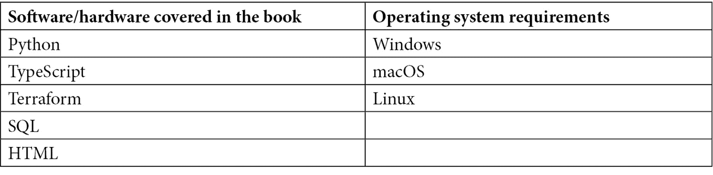

# 前言

本书的目标是向您展示如何使用行业最佳实践开发一个网络应用程序，并将其放置在运行的生产环境中。我们将通过创建一个可工作的待办事项应用程序来实现这一点。这个应用程序在`tozo.dev`上运行，所有代码都可在[github.com/pgjones/tozo](http://github.com/pgjones/tozo)下以 MIT 许可证获取。

本书中的开发蓝图是基于我在之前成功构建应用程序时使用的一个蓝图，包括几年前我自己的初创公司。这里使用的技术之所以被选择，是因为其在行业中的流行，Python、NodeJS 和 Terraform 是全栈开发中流行的工具，而 AWS 是流行的云基础设施提供商。

我开始写这本书是为了成为我希望在我开始全栈工程师职业生涯时拥有的指南。我试图回答我在开始时的大部分问题，并介绍我所缺少的大部分词汇。在过去的一年里，我一直在完善和使用这个蓝图来指导和发展初级工程师在他们的第一份工业工作。我希望它也能帮助你构建出色的应用程序！

# 本书面向的对象

本书面向的是已经知道如何编程的软件工程师（例如，计算机科学或训练营的毕业生），他们想学习如何按照行业流程构建应用程序（例如，使用持续集成和部署）。

你需要掌握 TypeScript/JavaScript、Python、HTML、CSS 和 SQL 的实际知识。除此之外，你被期望对 Quart、React、AWS 以及书中介绍的所有其他特定技术和流程都是新手。

# 本书涵盖的内容

在*第一章*《设置我们的开发系统》中，我们将设置开发应用程序所需的一切。这包括安装 Python、Node.js、Terraform 和 Git，以及每个相关工具。

在*第二章*《使用 Quart 创建可重用后端》中，我们将构建一个可用于任何应用程序的后端，介绍诸如身份验证、保护、数据库连接和电子邮件等元素。

在*第三章*《构建 API》中，我们将构建一个包含成员和会话管理的待办事项跟踪 RESTful CRUD API。

在*第四章*《使用 React 创建可重用前端》中，我们将构建一个可用于任何应用程序的前端，同时讨论路由、样式化数据输入（表单）、状态管理和吐司反馈。

在*第五章*《构建单页应用程序》中，我们将通过创建允许用户注册和登录到我们的应用程序、更改和管理他们密码的页面来构建一个待办事项跟踪用户界面。

在*第六章*“部署和监控您的应用程序”中，我们将部署应用程序到在 Docker 中运行的 AWS。在这里，我们将讨论如何设置域名、使用 HTTPS 以及监控应用程序的错误。

在*第七章*“保护和应用打包”中，我们将采用行业最佳实践来保护应用程序并将其打包到应用商店，包括添加多因素认证以及满足成为渐进式 Web 应用程序的要求。

# 为了充分利用本书

您需要能够阅读和理解基本的 Python、TypeScript、HTML 和 SQL。其他所有内容将在书中介绍。



所有安装说明都包含在书中。

**如果您正在使用本书的数字版，我们建议您亲自输入代码或从书的 GitHub 仓库（下一节中有一个链接）获取代码。这样做将帮助您避免与代码复制粘贴相关的任何潜在错误。**

# 下载示例代码文件

您可以从 GitHub 下载本书的示例代码文件[`github.com/pgjones/tozo`](https://github.com/pgjones/tozo)。如果代码有更新，它将在 GitHub 仓库中更新。

我们还提供了来自我们丰富的图书和视频目录中的其他代码包，可在[`github.com/PacktPublishing/`](https://github.com/PacktPublishing/)找到。查看它们吧！

# 下载彩色图像

我们还提供了一份包含本书中使用的截图和图表的彩色图像的 PDF 文件。您可以从这里下载：[`packt.link/18OWu`](https://packt.link/18OWu)。

# 访问 Code in Action 视频

您可以在此处找到本书的 CiA 视频：[`bit.ly/3PBCd6r`](https://bit.ly/3PBCd6r)。

# 使用的约定

本书使用了多种文本约定。

`文本中的代码`：表示文本中的代码单词、数据库表名、文件夹名、文件名、文件扩展名、路径名、虚拟 URL、用户输入和 Twitter 昵称。以下是一个示例：“`reminderName`字符串是一个字符串，它唯一地标识了在上下文粒度范围内的提醒。”

代码块应如下设置：

```py
class APIError(Exception):
    def __init__(self, status_code: int, code: str) -> None:
        self.status_code = status_code
        self.code = code
```

当我们希望您注意代码块中的特定部分时，相关的行或项目将以粗体显示：

```py
public interface IHotelGrain : IGrainWithStringKey
    {
        <<Code removed for brevity>>
        public Task Subscribe(IObserver observer);
        public Task UnSubscribe(IObserver observer);
```

任何命令行输入或输出都应如下编写：

```py
az monitor app-insights component create --app ai-distel-prod --location westus  --resource-group rg-distel-prod
```

**粗体**：表示新术语、重要单词或屏幕上看到的单词。例如，菜单或对话框中的单词以粗体显示。以下是一个示例：“**客户端系统**将消息批次发送到**分发谷物**，它遍历消息批次以将消息分发给每个目标谷物。”

小贴士或重要提示

看起来像这样。

# 联系我们

我们始终欢迎读者的反馈。

**一般反馈**：如果您对本书的任何方面有疑问，请通过电子邮件发送至 customercare@packtpub.com，并在邮件主题中提及书名。

**勘误**：尽管我们已经尽一切努力确保内容的准确性，但错误仍然可能发生。如果您在这本书中发现了错误，我们将不胜感激，如果您能向我们报告这一点。请访问[www.packtpub.com/support/errata](http://www.packtpub.com/support/errata)并填写表格。

**盗版**：如果您在互联网上发现我们作品的任何非法副本，如果您能提供位置地址或网站名称，我们将不胜感激。请通过 copyright@packt.com 与我们联系，并提供材料的链接。

**如果您有兴趣成为作者**：如果您在某个领域有专业知识，并且您有兴趣撰写或为书籍做出贡献，请访问[authors.packtpub.com](http://authors.packtpub.com)。

# 分享您的想法

一旦您阅读了*《生产就绪型 Web 应用程序蓝图》*，我们非常乐意听取您的想法！请[点击此处直接访问亚马逊评论页面](https://packt.link/r/1-803-24850-5)并分享您的反馈。

您的评论对我们和科技社区都非常重要，并将帮助我们确保我们提供高质量的内容。

# 第一部分 设置我们的系统

在我们构建我们的应用程序之前，我们需要一个为快速开发而设置的系统。这意味着我们需要安装工具来自动格式化、检查和测试我们的代码，同时使用 Git 进行版本控制和 Terraform 来管理基础设施。

本部分包括以下章节：

+   *第一章**，设置我们的开发系统*
