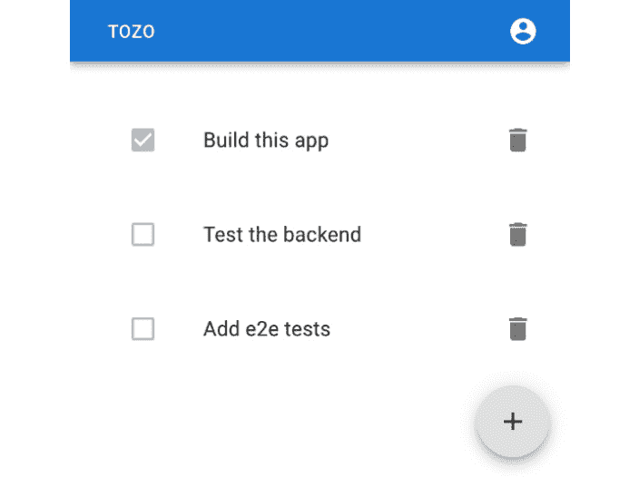
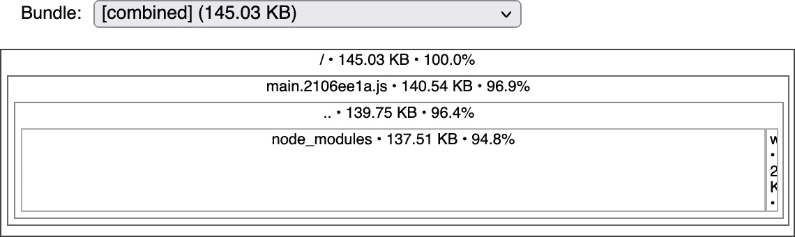

# 1

# 为开发设置我们的系统

本书的目标是提供一个在生产环境中运行的 Web 应用程序的蓝图，并尽可能多地利用工业最佳实践。为此，我们将构建一个可工作的待办事项应用程序，代号为 Tozo，允许用户跟踪任务列表。您可以在*图 1.1*中看到完成的应用程序：



图 1.1：本书中将构建的待办事项应用

虽然目标是构建一个可工作的待办事项应用程序，但我们将关注对任何应用程序都实用的功能，其中许多功能和许多技术都与这里构建的应用程序相同。例如，用户需要登录、更改密码等。因此，我的希望是您能够使用这个蓝图，移除少量特定的待办事项代码，并构建您自己的应用程序。

在本章中，我们将从一个没有任何工具的新机器开始，为开发设置它。我们还将设置系统来自动开发和测试应用程序。具体来说，我们将安装一个系统包管理器，并使用它来安装各种语言运行时和工具，然后在设置远程仓库和激活持续集成之前。到本章结束时，您将拥有开发应用程序所需的一切，这意味着您将能够专注于开发应用程序。这意味着您将能够快速构建和测试您应用程序中用户所需的功能。

因此，在本章中，我们将涵盖以下主题：

+   旨在快速开发

+   设置我们的系统

+   为后端开发安装 Python

+   为前端开发安装 NodeJS

+   为基础设施开发安装 Terraform

+   为数据库开发安装 PostgreSQL

+   采用基于 GitHub 的协作开发流程

# 技术要求

我已经构建了本书中描述的应用程序，您可以通过以下链接访问它：[`tozo.dev`](https://tozo.dev)。代码也可在[`github.com/pgjones/tozo`](https://github.com/pgjones/tozo)找到（请随意使用该代码或本书中的代码，MIT 许可证下使用）。

我将假设您对 TypeScript 和 Python 有一定的了解，因为我们将使用这些语言来编写应用程序。然而，我们将避免使用任何晦涩难懂的语言特性，并希望代码易于理解。我还将假设您乐于使用命令行，而不是专注于图形用户界面指令，因为大多数工具都针对命令行使用进行了优化，这应该是有利的。

要跟随本章的开发，请使用配套仓库[`github.com/pgjones/tozo`](https://github.com/pgjones/tozo)，并查看`r1-ch1-start`和`r1-ch1-end`标签之间的提交。

# 旨在快速开发

在我们开始设置构建待办事项应用程序的系统之前，了解我们在构建任何应用程序时的目标是很重要的，即通过尽可能快地交付解决方案来解决客户的需求。这意味着我们必须了解他们的需求，将它们转化为可工作的代码，并且至关重要，有信心地部署解决方案。

当我们在开发一个应用程序时，代码更改与能够运行并看到更改效果之间的时间越短，越好。这就是为什么我们将所有代码本地运行，并启用自动重新加载；这意味着我们做出的任何更改都可以在几秒钟内通过本地浏览器进行测试。

热重载/自动重新加载

在开发过程中，我们理想情况下希望我们对代码所做的任何更改都能立即生效，以便我们可以检查这些更改是否产生了预期的效果。这个功能被称为热重载或自动重新加载，并且在我们这本书中使用的 React 和 Quart 开发服务器中是激活的。

我还喜欢使用工具来帮助加快开发速度并增强代码按预期工作的信心。这些工具应该尽可能频繁地运行，理想情况下作为自动化过程的一部分。我已经将这些工具分为自动格式化、代码检查和测试类别。

## 代码自动格式化

代码的格式和风格很重要，因为与您习惯的风格不同，您需要更长的时间来理解。这意味着您将花费更多的时间来理解风格而不是逻辑，这将导致更多的错误。此外，虽然您可以保持一致，但几乎每个人都有不同的首选风格，我发现这些偏好会随着时间的推移而改变。

在过去，我使用工具来检查样式并报告任何不一致性。这很有帮助，但也很浪费，因为每个不一致性都必须手动修复。幸运的是，现在大多数语言都有官方的或占主导地位的**自动格式化工具**，它既定义了风格，又将所有代码更改为匹配该风格。使用最流行的自动格式化工具意味着大多数开发人员都会认识你的代码。

我们的目标是设置我们的工具，以便尽可能多的代码都有自动格式化工具。

## 代码检查

我认为代码检查可以分为两部分：类型检查和静态分析。类型检查要求我们在编写代码时包含类型。我尽可能使用类型提示或类型化语言，因为这可以捕捉到我通常犯的大量错误。类型化还有助于记录代码，这意味着它清楚地说明了预期的对象（类型）。虽然类型化在编写时需要更多的努力，但我认为它很容易在避免错误方面得到回报。因此，检查类型应该是我们代码检查的第一个目标。

第二部分，静态分析，允许代码检查器查找命名、函数使用、可能的错误、安全问题以及未使用代码中的潜在问题，并标记过于复杂或构建不良的代码。这些代码检查器是一种非常低成本的理智检查，因为它们运行快速且简单，并且很少出现误报（假阳性）。

## 测试代码

虽然代码检查器可以识别代码中的错误和问题，但它无法检测到逻辑问题，即正确编写的代码却做了错误的事情。为了识别这些问题，我们需要编写测试来检查代码的执行结果是否产生预期的输出。因此，我们在编写代码时编写测试非常重要，尤其是在我们发现错误时。我们将专注于编写提供简单测试应用程序是否按预期工作的测试。

测试覆盖率

测试覆盖率用于衡量测试套件测试了多少代码。这通常是通过测量测试执行的代码行数与总代码行数的比率来完成的。我发现这个指标没有帮助，因为它关注的是执行的行数，而不是对用户有意义的用例。因此，我鼓励您关注测试您认为用户需要的用例。然而，如果您想以这种方式测量覆盖率，您可以使用 `pdm` 安装 `pytest-cov`。

使用自动格式化工具、代码检查器和测试套件，我们可以更有信心地开发，从而提高开发速度，这反过来意味着为我们的用户提供更好的体验。然而，为了使用这些工具，我们首先需要有效地设置我们的系统。

# 设置我们的系统

为了有效地开发我们的应用程序，我们需要能够开发和运行它。这意味着我们需要工具来管理代码更改、测试和检查应用程序的错误以及运行它。这些工具可以通过系统包管理器安装，具体取决于您的操作系统。我建议您在 Linux (https://linuxbrew.sh) 和 macOS (https://brew.sh) 上安装 Homebrew，或在 Windows 上安装 Scoop ([`scoop.sh`](https://scoop.sh))。在这本书中，我将展示 `brew` 和 `scoop` 命令，但您应该只使用适用于您操作系统的命令。

您还需要一个代码编辑器来编写代码，以及一个浏览器来运行应用程序。我建议您按照他们网站上的说明安装 VS Code ([`code.visualstudio.com`](https://code.visualstudio.com)) 和 Chrome ([`www.google.com/chrome`](https://www.google.com/chrome))。安装了这些工具后，我们现在可以考虑如何管理代码。

## 管理代码

在我们开发应用程序的过程中，我们不可避免地会犯错误并希望回到之前的工作版本。你也可能希望与他人共享代码，或者只是为自己保留一个备份。这就是为什么我们需要通过**版本控制系统**来管理代码。虽然有许多不同的版本控制系统，但这个行业的大多数都使用 git ([`git-scm.com`](https://git-scm.com))。可以通过以下方式通过系统包管理器安装：

```py
brew install git
scoop install git
```

使用 git

这本书可以通过使用`git add`将文件添加到仓库，`git commit`创建提交，以及`git push`更新远程仓库来完成。我认为这些是基本的 git 命令。然而，git 的使用仍然可能非常复杂，你可能会发现你的仓库处于混乱状态。随着实践的增加，这会变得更容易，而且网上有大量的帮助。你总是可以删除你的本地仓库，并从远程版本重新开始（就像我以前多次做的那样）。

现在我们已经安装了 git，让我们设置以下作者信息：

```py
git config --global user.name "Phil Jones"
git config --global user.email "pgjones@tozo.dev"
```

应该将高亮显示的值更改为你的姓名和电子邮件地址。

接下来，我们可以在名为*tozo*的目录中创建一个代码仓库，并在其中运行以下命令：

```py
git init .
```

这将创建一个可以安全忽略的*.git*目录。这导致以下项目结构：

```py
tozo
└── .git
```

在开发过程中，我们可能希望 git 忽略某些文件和路径。我们将通过创建列出我们不希望包含在仓库中的文件名和文件路径的*.gitignore*文件来实现这一点。

编写好的提交信息

Git 存储的变更历史如果使用得当，可以成为你代码的优秀伴侣文档。这可能在开始时看起来没有优势，但经过一年的开发后，如果你没有从一开始就做这件事，你会非常怀念它。因此，我强烈建议你编写良好的提交信息。

一个好的提交包含对代码的单个原子更改。这意味着它是集中的（不会将不同的更改组合到一个提交中）并且是完整的（每个提交都使代码处于工作状态）。

一个好的提交信息也是经过良好描述和推理的。这意味着提交信息解释了为什么进行更改。这种上下文信息非常有价值，因为它很快就会被遗忘，并且通常需要理解代码。

在安装了 git 之后，我们可以开始提交更改；然而，我们应该确定我们打算如何合并更改，在我看来，这应该通过变基来完成。

## 相比合并，使用变基

由于我非常重视 git 提交历史，我建议在合并更改时使用变基而不是合并。前者会将本地新提交放在任何远程更改之上，重写并留下一个线性清晰的历史记录，而后者将引入一个合并提交。要执行此更改，请运行以下代码：

```py
git config --global pull.rebase true
```

我们现在已经使用包管理器和版本控制设置了我们的系统。接下来，我们可以安装应用程序各个方面的特定工具。

# 安装 Python 用于后端开发

有许多适合后端开发的编程语言，任何一种都是你应用程序的一个很好的选择。在这本书中，我选择使用 Python，因为我发现与其他语言相比，Python 的代码更易于理解和跟踪。

由于我们将使用 **Python** 编写应用程序的后端，因此我们需要在本地安装它。虽然你可能已经安装了 Python 版本，但我建议你使用系统包管理器安装的版本，如下所示：

```py
brew install python
scoop install python
```

我们之前使用的包管理器不知道如何安装和管理 Python 包，因此我们还需要另一个包管理器。Python 中有很多选择，我认为 PDM 是最好的。PDM 可以在 Linux 和 macOS 系统上使用系统包管理器进行安装，如下所示：

```py
brew install pdm
```

对于 Windows 系统，可以通过运行以下命令进行安装：

```py
scoop bucket add frostming https://github.com/frostming/scoop-frostming.git
scoop install pdm
```

我们将把后端代码保存在一个单独的后端文件夹中，所以请在项目的顶层创建一个 *backend* 文件夹，并按照以下文件夹结构进行组织：

```py
tozo
└── backend
    ├── src
    │   └── backend
    └── tests
```

接下来，我们需要通知 git 有一些我们不希望在存储库中跟踪的文件，因此它应该通过添加以下内容到 *backend/.gitignore* 来忽略它们：

```py
/__pypackages__
/.mypy_cache
.pdm.toml
.pytest_cache
.venv
*.pyc
```

为了让 PDM 管理我们的项目，我们需要在 *backend* 目录中运行以下命令：

```py
pdm init
```

当提示时，你应该选择之前使用系统包管理器安装的 Python 版本。

我们现在可以专注于特定于 Python 的快速开发工具。

## 格式化代码

Python 没有官方的格式或格式化器；然而，`black` 是代码的事实上的格式化器，`isort` 是导入的事实上的格式化器。我们可以通过在 *backend* 目录中运行以下命令将两者添加到我们的项目中：

```py
pdm add --dev black isort
```

开发标志

我们在这里使用 `--dev` 标志，因为这些工具仅用于后端开发，因此不需要在生产环境中安装。

`black` 和 `isort` 需要以下配置才能良好地协同工作。这应该添加到 *backend/pyproject.toml* 文件末尾（如果你使用的是除 3.10 之外版本的 Python，你可能需要更改 `target-version`），如下所示：

```py
[tool.black]  
target-version = ["py310"] 
[tool.isort]
profile = "black"
```

以下命令将在 *src* 和 *tests* 文件夹中的我们的代码上运行 `black` 和 `isort`：

```py
pdm run black src tests
pdm run isort src tests
```

我们将使用 Jinja 模板来处理我们应用程序发送的电子邮件。虽然这些模板是代码，但它们不是 Python，因此需要不同的格式化器。幸运的是，`djhtml` 可以用来格式化模板，并且可以通过在 *backend* 文件夹中运行以下命令来添加：

```py
pdm add --dev djhtml
```

以下命令将在我们的模板代码上运行 `djhtml`：

```py
djhtml src/backend/templates --tabwidth 2 --check
```

我们现在已经安装了格式化后端代码所需的工具。接下来，我们可以安装用于代码检查所需的工具。

## 对代码进行代码检查

Python 支持类型提示，用于描述变量、函数等的预期类型。我们将使用类型提示和工具来检查我们没有引入任何类型相关的错误。Python 最受欢迎的类型检查工具是`mypy`。可以在`*backend*`目录下运行以下命令来安装：

```py
pdm add --dev mypy
```

以下命令将在后端代码上运行`mypy`：

```py
pdm run mypy src/backend/ tests/
```

在`mypy`帮助我们查找类型错误的同时，我们可以添加`Flake8`来帮助我们查找其他错误。`Flake8`可以通过以下方式使用`pdm`安装：

```py
pdm add --dev flake8
```

`Flake8`必须配置为与`black`和`mypy`一起工作，通过在`*backend/setup.cfg*`中添加以下内容：

```py
[flake8] 
max-line-length = 88
extend-ignore = E203
```

`Flake8`可以通过运行以下命令来使用：

```py
pdm run flake8 src/ tests/
```

我们可以使用工具来帮助我们发现另一种类型的错误，这些错误与安全相关。一个很好的例子是检查 SQL 注入漏洞。Bandit 是另一个可以帮助识别这些错误的 linter，并且可以在`*backend*`目录下运行以下命令来安装：

```py
pdm add --dev bandit
```

Bandit 只需要对`src`代码进行 lint，因为在生产期间不会运行测试代码。要运行 Bandit 对`src`代码进行 lint，可以使用以下命令：

```py
pdm run bandit -r src/
```

Bandit 模块未找到错误

如果 Bandit 运行失败并出现错误`ModuleNotFoundError: No module named ‘pkg_resources’`，则运行`pdm add --dev setuptools`以添加缺失的模块。

现在我们有了查找错误的工具，但我们也可以添加工具来查找未使用的代码。这很有帮助，因为在重构过程中，代码往往会被遗忘，导致文件比应有的复杂得多，难以阅读和理解。我喜欢使用`vulture`来查找未使用的代码，并且可以在`*backend*`目录下运行以下命令来安装：

```py
pdm add --dev vulture
```

不幸的是，`vulture`可能会报告误报，所以我喜欢通过在`*backend/pyproject.toml*`中添加以下配置来配置它，以确保报告问题时 100%有信心：

```py
[tool.vulture]
min_confidence = 100
```

与 Bandit 一样，最好只通过以下命令在`src`代码上运行`vulture`（而不是测试）：

```py
pdm run vulture src/
```

现在，让我们看看我们需要测试代码的内容。

## 测试代码

Python 的`unittest`是其标准库的一部分，然而，我认为使用`pytest`更好。`pytest`功能丰富，允许编写非常简单和清晰的测试，例如以下小型示例，它测试简单的加法是否正确：

```py
def test_addition():
    assert 1 + 1 == 2
```

`pytest`需要`pytest-asyncio`插件来测试异步代码，并且它们都可以通过以下方式使用`pdm`安装：

```py
pdm add --dev pytest pytest-asyncio 
```

`pytest`最好配置为在测试失败时显示局部变量，因为这使理解测试失败的原因变得容易得多。此外，`asyncio`模式应设置为`auto`，以便更容易编写异步测试。以下配置应放置在`*backend/pyproject.toml*`中：

```py
[tool.pytest.ini_options]
addopts = "--showlocals"
asyncio_mode = "auto"
pythonpath = ["src"]
```

要运行测试，可以使用以下命令调用`pytest`，指定`tests`路径：

```py
pdm run pytest tests
```

现在我们已经安装了所有工具，我们需要一些简单的命令来运行它们。

## 脚本命令

我们在我们的项目中添加了许多有用的工具；然而，每个工具都有不同的独特命令，我们不得不记住。我们可以通过利用 PDM 的脚本功能来简化这一点，因为它可以将 PDM 命令映射到所需的命令。我们将添加以下三个 PDM 脚本命令：

+   `pdm run format`来运行格式化工具并格式化代码

+   `pdm run lint`来运行 linting 工具并检查代码

+   `pdm run test`来运行测试

PDM 的脚本需要将这些脚本命令添加到*backend/pyproject.toml*文件中，如下所示：

```py
[tool.pdm.scripts]
format-black = "black src/ tests/"
format-djhtml = "djhtml src/backend/templates -t 2 --in-place"
format-isort = "isort src tests"
format = {composite = ["format-black", "format-djhtml", "format-isort"]}
lint-bandit = "bandit -r src/"
lint-black = "black --check --diff src/ tests/"
lint-djhtml = "djhtml src/backend/templates -t 2 --check"
lint-flake8 = "flake8 src/ tests/"
lint-isort = "isort --check --diff src tests"
lint-mypy = "mypy src/backend tests"
lint-vulture = "vulture src"
lint = {composite = ["lint-bandit", "lint-black", "lint-djhtml", "lint-flake8", "lint-isort", "lint-mypy", "lint-vulture"]}
test = "pytest tests/"
```

在后端工具就绪且可通过易于记忆的命令访问后，我们现在可以为前端做同样的事情。

# 安装 NodeJS 进行前端开发

由于我们希望我们的应用程序在浏览器中运行，我们需要用 JavaScript 或编译成它的语言编写前端。有很多好的选择，但我选择使用**TypeScript**，因为它是在 JavaScript 的基础上增加了类型（即，它是同一种基本语言）。这意味着它与所需的运行时语言非常接近，并且具有来自类型的安全性和文档。

由于我们将使用 TypeScript 编写前端，我们需要安装**NodeJS**来编译 TypeScript 到在浏览器中运行的 JavaScript。NodeJS 最好通过系统包管理器安装，如下所示：

```py
brew install node
scoop install nodejs
```

与 Python 不同，我们安装了特定的包管理器，NodeJS 自带了一个名为`npm`的包管理器。我们将使用`npm`来管理前端依赖和工具。`npm`还包括`npx`工具，我们将用它来运行一次性脚本。

与后端一样，我们将前端代码分离到一个前端文件夹中。然后，我们将在这个新文件夹中使用`create-react-app`工具，通过在项目目录中运行以下命令来设置一切：

```py
npx create-react-app frontend --template typescript
```

它应该给出以下文件夹结构：

```py
tozo
└── frontend
    ├── node_modules
    ├── public
    └── src
```

在安装的文件中，目前只有*frontend/package.json*、*frontend/package-lock.json*、*frontend/tsconfig.json*、*frontend/.gitignore*、*frontend/src/react-app-env.d.ts*和*frontend/public/index.xhtml*文件是重要的，因此您可以删除或根据需要修改其他文件。

现在，我们可以专注于特定的 NodeJS 工具，以实现快速开发。

## 格式化代码

TypeScript 没有官方的格式/格式化工具；然而，Prettier 是事实上的格式化工具。我们应该通过在*frontend*目录中运行以下命令将 Prettier 添加到项目中作为开发依赖项：

```py
npm install --save-dev prettier
```

--save-dev 标志

我们在这里使用`--save-dev`标志，因为这些工具仅用于开发前端，因此不需要在生产环境中安装。

默认情况下，Prettier 不会添加尾随逗号，这与 Python 中使用的样式不同。为了保持一致，因此不必考虑这一点，可以在*frontend/package.json*中添加以下部分进行配置：

```py
"prettier": {
  "trailingComma": "all" 
}
```

然后以下命令将运行 Prettier 来处理我们的代码：

```py
npx prettier --parser typescript --write "src/**/*.{ts,tsx}"
```

我们现在已经安装了格式化代码的工具，我们可以专注于安装检查代码的工具。

## 检查代码

在前面的章节中，我们需要一个代码检查器来检查我们的 Python 代码，然而，由于我们使用 TypeScript，我们不需要安装任何额外的工具来进行类型检查。但是，我们可以安装代码检查器来检查其他错误；TypeScript 和 JavaScript 的事实上的代码检查器是`eslint`，我们可以在*前端*目录中运行以下命令来安装它：

```py
npm install --save-dev eslint 
```

默认情况下，`eslint`与 Prettier 不兼容；幸运的是，`eslint-config-prettier`包配置了`eslint`以实现兼容。我们可以在*前端*目录中运行以下命令来安装它：

```py
npm install --save-dev eslint-config-prettier
```

与后端一样，我们应该使用`eslint-plugin-import`来排序我们的导入，该插件是通过以下方式与`npm`一起安装的：

```py
npm install --save-dev eslint-plugin-import
```

这些代码检查器通过在*frontend/package.json*中用以下内容替换现有的`eslintConfig`部分来进行配置：

```py
"eslintConfig": {
  "extends": [
    "react-app",
    "react-app/jest",
    "plugin:import/errors",
    "plugin:import/warnings",
    "plugin:import/typescript",
    "prettier"
  ]
}
```

突出的行将已经存在。

可以通过以下命令在我们的代码上运行`eslint`：

```py
npx eslint "src/**/*.{ts,tsx}"
```

`eslint`也可以通过使用`--fix`标志来修复它识别的一些问题，如下所示：

```py
npx eslint --fix "src/**/*.{ts,tsx}"
```

我们现在已经安装了代码检查工具，我们可以专注于测试工具。

## 测试代码

之前使用的`create-react-app`工具还安装了一个名为 Jest 的测试运行器，我们可以通过运行以下命令来调用它：

```py
npm run test
```

Jest 允许使用`expect`语法编写测试，如下面的示例所示：

```py
test('addition', () => {
  expect(1 + 1).toBe(2);
});
```

在测试工具存在的情况下，我们可以专注于分析构建的包。

## 分析包

前端代码将以包（块）的形式交付给用户。这些包，尤其是主包，应该尽可能小，这样用户就不会等待太长时间下载代码。为了检查包大小并分析每个包中包含的内容，我在*前端*目录中运行以下命令使用`source-map-explorer`：

```py
npm install --save-dev source-map-explorer
```

在我们能够分析包大小之前，我们首先需要通过运行以下命令来构建它们：

```py
npm run build
```

然后，我们可以通过以下命令来分析它们：

```py
npx source-map-explorer build/static/js/*.js
```

前面命令的输出显示在*图 1.2*中：



图 1.2：source-map-explorer 的输出显示主包为 141 KB

每个包都应该尽可能小，一个很好的经验法则是当包超过 1 MB 时应该进行拆分。当我们将在*第四章*中添加密码复杂度分析器到前端时，我们会发现我们需要这样做，*使用 React 创建可重用前端*。

## 编写命令脚本

为了与后端匹配，我们想要添加以下命令：

+   使用`npm run analyze`来运行包分析器

+   使用`npm run format`来运行格式化工具并格式化代码

+   使用`npm run lint`来运行代码检查工具

+   使用`npm run test`来运行测试

由于 `npm run test` 已经存在，我们只需要添加其他三个。这可以通过在 *frontend/package.json* 文件的 `scripts` 部分添加以下内容来完成：

```py
"scripts": {
  "analyze": "npm run build && source-map-explorer \"build/static/js/*.js\"",
  "format": "eslint --fix \"src/**/*.{ts,tsx}\" && prettier --parser typescript --write \"src/**/*.{ts,tsx}\"",
  "lint": " eslint \"src/**/*.{ts,tsx}\" && prettier --parser typescript --list-different  \"src/**/*.{ts,tsx}\"",
  "start": "react-scripts start",
  "build": "react-scripts build",
  "test": "react-scripts test",
  "eject": "react-scripts eject"
}
```

突出的行将已经存在于该部分中。

在前端工具就绪并可通过易于记忆的命令访问后，我们现在可以为基础设施做同样的事情。

# 安装 Terraform 进行基础设施开发

我们需要创建和管理远程基础设施，从我们将用于与其他开发者一起开发应用程序或简单地备份我们的代码的远程仓库开始。这个远程基础设施可以通过手动创建，例如使用 GitHub 的 Web 界面。然而，通过使用基础设施即代码工具，我们可以记录我们所做的所有更改，然后如果出现问题，我们可以重新运行我们的代码并将一切恢复到已知状态。

我认为 **Terraform** 是管理基础设施的最佳工具，我们可以按照以下方式安装：

```py
brew install terraform
scoop install terraform
```

在安装了 Terraform 后，我们可以在我们的仓库中创建一个用于基础设施代码的文件夹，如下所示：

```py
mkdir infrastructure
```

我们的项目仓库现在应该具有以下结构：

```py
tozo
├── backend
├── frontend
└── infrastructure
```

与后端和前端一样，我们需要安装工具来帮助开发。此外，对于基础设施，我们还需要工具来管理机密。

## 管理机密

要允许 Terraform 管理我们的基础设施，我们需要提供密码、密钥和其他机密信息。这些机密信息需要以安全的方式存储（并使用）——简单地在仓库中以纯文本形式存储密码是常见的被黑客攻击的方式。我们将加密这些机密信息并将加密文件存储在仓库中。这意味着我们必须保密加密密钥，我建议您使用像 BitWarden 这样的密码管理器来做到这一点。

要加密机密信息，我们可以使用 `ansible-vault`，它是通过 Python 包管理器 `pip` 安装的，如下所示：

```py
pip install ansible-vault
```

pip 或 PDM

`pip` 是安装包的工具，而 PDM 是项目管理工具。由于我们没有基础设施项目要管理，使用 pip 安装 `ansible-vault` 更有意义。然而，这将是唯一一次我们直接使用 pip。

要配置 `ansible-vault`，我们需要提供加密密钥。为此，将您的加密密钥添加到 *infrastructure/.ansible-vault* 文件中，并通过在 *infrastructure/ansible.cfg* 文件中添加以下内容来通知 Ansible 它已存储在那里：

```py
[defaults]
vault_password_file = .ansible-vault
```

我们需要加密两个文件：Terraform 的状态文件 `terraform.tfstate` 和我们的机密变量集合 `secrets.auto.tfvars`。执行此操作的命令如下：

```py
ansible-vault encrypt secrets.auto.tfvars --output=secrets.auto.tfvars.vault 
ansible-vault encrypt terraform.tfstate --output=terraform.tfstate.vault
```

我们还需要解密这些文件，可以通过以下命令完成：

```py
ansible-vault decrypt secrets.auto.tfvars.vault --output=secrets.auto.tfvars 
ansible-vault decrypt terraform.tfstate.vault --output=terraform.tfstate
```

为了确保密码文件、加密文件以及 Terraform 自动生成的通用文件不被视为仓库的一部分，应该在 *infrastructure/.gitignore* 文件中添加以下内容：

```py
.ansible-vault 
secrets.auto.tfvars
terraform.tfstate 
*.backup 
.terraform.lock.hcl 
.terraform/
```

Terraform 现在已设置好并准备好使用，这意味着我们可以专注于开发工具。

## 格式化、代码检查和测试代码

Terraform 内置了一个格式化工具，可以通过以下命令调用：

```py
terraform fmt
```

此格式化工具还支持在代码检查时使用的检查模式，如下所示：

```py
terraform fmt --check=true
```

Terraform 还提供了一个用于代码检查的工具，如下所示：

```py
terraform validate
```

测试 Terraform 代码比较困难，因为几乎所有代码都依赖于与第三方服务的交互。相反，我发现运行并检查输出是否有意义是测试代码将做什么的唯一方法。Terraform 将通过运行以下命令提供它计划执行的操作的输出：

```py
terraform plan
```

这是我们需要安装和设置来管理本书中将要安装的所有基础设施的全部内容。我们现在可以专注于数据库。

# 安装 PostgreSQL 用于数据库开发

我们的应用程序需要以结构化形式存储数据（待办事项），这使得数据库成为一个理想的选择。此数据库需要在本地上运行，以便我们可以与之一起开发，因此我们需要安装它。我首选的数据库是 **PostgreSQL**，这是一个基于 SQL 的关系型数据库。我之所以喜欢它，是因为它非常广泛地受到支持，并且非常强大。

PostgreSQL 是通过以下方式使用系统包管理器安装的：

```py
brew install postgres
scoop install postgresql
```

如果使用 `brew`，你可能需要将 `postgresql` 作为在后台运行的服务启动，如下所示：

```py
brew services start postgresql
```

此外，当使用 `brew` 时，我们需要创建一个超级用户，按照惯例称为 *postgres*。此用户是通过以下命令创建的：

```py
createuser -s postgres
```

然而，使用 `scoop`，你将需要使用以下命令在需要使用 PostgreSQL 时启动数据库：

```py
pg_ctl start
```

随着数据库工具的添加，我们拥有了所有本地工具来开发我们的应用程序。这意味着我们可以专注于远程工具，即 GitHub 仓库。

# 使用 GitHub 采用协作开发流程

虽然你可能正在独立工作，但采用允许他人协作并确保代码始终准备好部署到生产环境的发展流程是一种良好的做法。我们将通过使用远程仓库和**持续集成**（**CI**）来实现这两个目标。

远程仓库充当所有代码的备份，并使得设置 CI（测试、代码检查等）变得容易得多。我们将使用 GitHub，因为它拥有我需要的所有功能，尽管其他平台，如 GitLab，也是有效的，并且在行业中广泛使用。

我们不是通过 GitHub 的 UI 创建存储库，而是使用之前设置的 Terraform。为此，我们首先需要一个来自 GitHub 的个人访问令牌，如[`docs.github.com/en/authentication/keeping-your-account-and-data-secure/creating-a-personal-access-token`](https://docs.github.com/en/authentication/keeping-your-account-and-data-secure/creating-a-personal-access-token)中所述。此令牌需要 `repo`、`workflow` 和 `delete_repo` 权限。此令牌是秘密的，因此最好放在 *infrastructure/secrets.auto.tfvars* 中，并按照之前在 *管理秘密* 部分中描述的方式加密。代码应按以下方式放置到 *infrastructure/secrets.auto.tfvars* 中（将 `abc1234` 替换为您的令牌）：

```py
github_token = "abc1234"
```

Terraform 本身不知道如何与 GitHub 交互，这意味着我们需要安装 GitHub 提供程序来完成此操作。这是通过将以下代码添加到 *infrastructure/main.tf* 来完成的：

```py
terraform {
  required_providers {
    github = {
      source  = "integrations/github"
      version = "~> 4.0"
    }
  }
  required_version = ">=1.0"
}
```

提供程序存在后，我们可以通过添加以下代码到 *infrastructure/github.tf* 来描述我们希望存在的存储库：

```py
variable "github_token" {
  sensitive = true
}

provider "github" {
  token = var.github_token
}

resource "github_repository" "tozo" {
  name       = "tozo"
  visibility = "private"
}
```

最后，为了实际创建存储库，我们需要初始化并应用 Terraform，如下所示：

```py
terraform init 
terraform apply
```

我们现在应该设置 `git`，使其了解远程存储库。为此，我们需要正确的路径，这取决于您的 GitHub 账户名称和项目名称。由于我的 GitHub 账户名称是 *pgjones* 且项目名称为 *tozo*，路径是 *pgjones/tozo*，因此以下命令：

```py
git remote add origin git@github.com:pgjones/tozo.git
```

要使我们的本地分支跟踪远程 `origin` `main` 分支，请运行以下命令：

```py
git push --set-upstream origin main 
```

要将我们的 `main` 分支上的本地更改推送到远程 `feature` 分支，请运行以下命令：

```py
git push origin main:feature
```

要将远程`main`分支拉取以更新我们的本地分支，请运行以下命令：

```py
git pull origin main
```

这个行业中的大多数都运行基于合并（拉取）请求的开发工作流程，我们也将采用。此工作流程包括以下步骤：

1.  在本地开发一个由尽可能少的提交组成的功能（小的更改）。

1.  将功能推送到远程 `feature` 分支。

1.  基于该分支打开合并请求。

1.  审查合并请求，只有 CI 通过时才将其合并到 `main` 分支。

1.  拉取最新的`main`分支并重复。

存储库创建后，我们现在可以查看添加 CI。

## 添加持续集成

GitHub 提供了一个名为 Actions 的 CI 系统，它有一个免费层，我们将使用它。首先，我们需要创建以下文件夹结构：

```py
tozo
└── .github
    └── workflows
```

现在我们可以配置一个工作流程，在 `main` 分支的每次更改和每个合并请求上运行作业，通过将以下代码添加到 *.github/workflows/ci.yml*：

```py
name: CI

on:
  push:
    branches: [ main ]
  pull_request:
    branches: [ main ]
  workflow_dispatch:

jobs:
```

这使我们能够为基础设施、后端和前端添加工作。

## 为基础设施代码添加 CI

我们之前设置了以下命令来格式化和检查基础设施代码：

```py
terraform fmt --check=true
terraform validate
```

要使这些操作作为 CI 的一部分运行，我们需要将以下作业添加到 *.github/workflows/ci.yml* 文件中的 `jobs` 部分：

```py
  infrastructure:
    runs-on: ubuntu-latest

    steps:
      - name: Install Terraform
        run: |
          sudo apt-get update && sudo apt-get install -y gnupg             software-properties-common curl
          curl -fsSL https://apt.releases.hashicorp.com/gpg |             sudo apt-key add -
          sudo apt-add-repository "deb [arch=amd64] https://            apt.releases.hashicorp.com $(lsb_release -cs) main"
          sudo apt-get update && sudo apt-get install terraform
      - uses: actions/checkout@v3

      - name: Initialise Terraform
        run: terraform init

      - name: Check the formatting
        run: terraform fmt --check=true --recursive

      - name: Validate the code
        run: terraform validate
```

现在我们可以为后端代码添加一个任务。

## 为后端代码添加持续集成

我们之前已经设置了以下命令来格式化、检查和测试后端代码：

```py
pdm run format
pdm run lint
pdm run test
```

要使这些作为持续集成的一部分运行，我们还需要运行一个数据库服务，因为测试是针对数据库运行的。幸运的是，GitHub 通过在持续集成作业旁边运行 PostgreSQL 数据库来支持 PostgreSQL 数据库服务。我们可以利用这个数据库服务，并通过在*.github/workflows/ci.yml*中的`jobs`部分添加以下作业来运行命令：

```py
  backend:
    runs-on: ubuntu-latest

    container: python:3.10.1-slim-bullseye

    services:
      postgres:
        image: postgres
        env:
          POSTGRES_DB: tozo_test
          POSTGRES_USER: tozo
          POSTGRES_PASSWORD: tozo
          POSTGRES_HOST_AUTH_METHOD: "trust"
        options: >-
          --health-cmd pg_isready
          --health-interval 10s
          --health-timeout 5s
          --health-retries 5
    defaults:
      run:
        working-directory: backend

    env:
      TOZO_QUART_DB_DATABASE_URL: "postgresql://tozo:tozo@        postgres:5432/tozo_test"

    steps:
      - uses: actions/checkout@v3

      - name: Install system dependencies
        run: apt-get update && apt-get install -y postgresql           postgresql-contrib

      - name: Initialise dependencies
        run: |
          pip install pdm
          pdm install

      - name: Linting
        run: pdm run lint

      - name: Testing
        run: pdm run test
```

现在我们可以为前端代码添加一个任务。

## 为前端代码添加持续集成

我们之前已经设置了以下命令来格式化、检查、测试和构建前端代码：

```py
npm run format
npm run lint
npm run test
npm run build
```

我们可以通过在*.github/workflows/ci.yml*的`jobs`部分添加以下作业来利用该服务并运行命令：

```py
  frontend:
    runs-on: ubuntu-latest

    defaults:
      run:
        working-directory: frontend

    steps:
      - name: Use Node.js
        uses: actions/setup-node@v2
        with:
          node-version: '18'

      - uses: actions/checkout@v3

      - name: Initialise dependencies
        run: npm ci --cache .npm --prefer-offline
      - name: Check formatting
        run: npm run format

      - name: Linting
        run: npm run lint

      - name: Testing
        run: npm run test

      - name: Build
        run: npm run build 
```

现在我们已经准备好开始开发我们的应用。在这个阶段，文件夹结构如下：

```py
tozo
├── .github
│   └── workflows
├── backend
│   ├── src
│   │   └── backend
│   └── tests
├── frontend
│   ├── public
│   └── src
└── infrastructure
```

现在我们所有的检查都在每次更改`main`分支和每个拉取请求时运行。这应该确保我们的代码保持高质量，并提醒我们可能被忽视的任何问题。

# 摘要

在本章中，我们设置了开发我们应用所需的所有工具。我们首先安装了一个系统包管理器，然后使用它来安装和设置 git。使用 git，我们创建了我们的本地仓库并开始提交代码。我们安装了 Python、NodeJS、Terraform 以及格式化、检查和测试代码所需的工具。最后，我们使用 Terraform 创建并设置了一个带有工作持续集成的远程 GitHub 仓库，确保我们的代码在每次更改时都会自动检查。

本章中安装的工具是开发以下章节中描述的应用所必需的。它还将使您能够快速完成这些工作，因为工具将帮助您快速识别代码中的问题和错误。

在下一章中，我们将开始开发我们应用的后端，重点是设置应用框架和扩展，以支持我们想要的功能，例如身份验证。

# 进一步阅读

在升级应用之前，切换 Python 和 NodeJS 的版本以测试应用通常很有用。为此，我推荐使用`pyenv`（https://github.com/pyenv/pyenv）和`n`（https://github.com/tj/n）来分别测试 Python 和 NodeJS。

# 第二部分 构建待办事项应用

现在，我们将使用 Quart 和 React 构建一个功能齐全的待办事项跟踪应用。该应用将包括许多常见功能，如身份验证、用户管理、样式化页面和表单。

本部分包括以下章节：

+   *第二章*，*使用 Quart 创建可重用后端*

+   *第三章*，*构建 API*

+   *第四章*，*使用 React 创建可重用前端* 

+   *第五章*，*构建单页应用*
