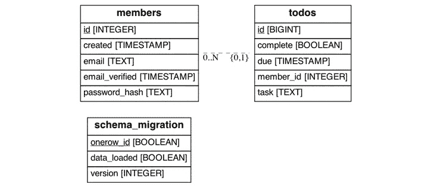

# 3

# 构建 API

在上一章中，我们构建了一个连接到数据库的后端，管理用户会话并发送电子邮件。现在，我们将向后端添加一个特定的 API 来跟踪成员的待办事项。这需要一个允许管理成员、会话和待办事项的 API。

在本章中，你将学习如何构建一个**RESTful API**，这是一种非常流行的 API 风格，你可能会在职业生涯中使用并遇到。你还将构建一个用于管理成员并验证其操作的 API，这可以在其他应用中通过最小修改使用。最后，我们还将构建一个用于跟踪待办事项的 API，这同样可以适应其他用途。

我们将使用 RESTful 风格来构建 API，因为它非常适合 Web 应用，并且可以用 Quart 轻松表达。RESTful API 是功能按资源分组的地方，每个函数都是一个作用于资源的操作。例如，登录功能描述为创建会话，注销描述为删除会话。对于 RESTful Web 应用，操作由 HTTP 动词表示，资源由 HTTP 路径表示。此外，响应状态码用于指示功能的效果，2XX 代码表示成功，4XX 代码表示不同类型的错误。

RESTful API 的替代方案

虽然 RESTful API 使用许多 HTTP 动词和路径来描述功能，但更基本的方式是有一个单一的`POST`路由。然后，这个路由被用于所有功能，请求体描述了功能和数据。一个很好的例子是 GraphQL，它通常只使用`POST /graphql`和一个定义的消息结构。如果你希望使用 GraphQL，请查看[`strawberry.rocks`](https://strawberry.rocks)。

因此，在本章中，我们将涵盖以下主题：

+   创建数据库模式和模型

+   构建会话 API

+   构建成员 API

+   构建待办事项 API

# 技术要求

本章需要以下额外的文件夹，并应创建：

```py
tozo
└── backend
    ├── src
    │   └── backend
    │       ├── migrations
    │       └── models
    └── tests
        └── models
```

应创建空的`backend/src/backend/models/__init__.py`和`backend/tests/models/__init__.py`文件。

要跟踪本章的开发进度，请使用配套的仓库[`github.com/pgjones/tozo`](https://github.com/pgjones/tozo)，并查看标签`r1-ch3-start`和`r1-ch3-end`之间的提交。

# 创建数据库模式和模型

在这本书中，我们正在构建一个待办事项跟踪应用，这意味着我们需要存储关于成员及其待办事项的数据。我们将通过将数据放入数据库来实现这一点，这意味着我们需要定义数据的结构。这个结构被称为模式，它描述了数据库中的表。

当前的`id`属性。

ORMs

模式和模型通常被混为一谈，尤其是在使用 **对象关系模型** (**ORM**) 时。虽然一开始使用 ORM 简单，但我发现它隐藏了重要的细节，并在一段时间后使开发变得更加困难。这就是为什么在这本书中，模型和模式是相关的但不同的。这也意味着我们将为与数据库的所有交互编写 SQL 查询。

我们将首先在迁移中定义成员数据和待办数据作为模型和模式，然后再添加一些初始测试和开发数据。

## 创建成员模式及模型

我们需要为每个成员存储信息，以便我们可以通过外键引用将他们的待办事项与他们关联起来。此外，我们还需要存储足够的信息，以便成员可以登录并证明他们的身份（进行身份验证），这意味着我们需要存储他们的电子邮件和密码散列。最后，我们还将存储他们的账户创建时间和验证电子邮件的时间 - 后者如果我们要向他们发送电子邮件则非常重要。

此数据的模式由以下 SQL 提供给出，仅供参考，并将用于 *运行第一次迁移* 部分：

```py
CREATE TABLE members (
    id INT PRIMARY KEY GENERATED ALWAYS AS IDENTITY,
    created TIMESTAMP NOT NULL DEFAULT now(),
    email TEXT NOT NULL,
    email_verified TIMESTAMP,
    password_hash TEXT NOT NULL
);

CREATE UNIQUE INDEX members_unique_email_idx on members (LOWER(email));
```

突出的唯一索引确保每个电子邮件地址只有一个成员账户，忽略电子邮件的大小写。

SQL 格式化

在 *第一章* *设置我们的开发系统* 中，我提到了代码格式化和自动格式化工具的重要性。遗憾的是，我还没有找到一个适用于嵌入 Python 代码中的 SQL 的自动格式化工具。然而，我建议您遵循 [`sqlstyle.guide/`](http://sqlstyle.guide/) 上给出的风格指南，就像我在这本书中做的那样。

我们可以用 Python `dataclass` 来表示数据库表，其中每个列都作为属性，并具有相关的 Python 类型。这是以下代码中显示的模型，应该添加到 *backend/src/backend/models/member.py*：

```py
from dataclasses import dataclass
from datetime import datetime

@dataclass
class Member:
    id: int
    email: str
    password_hash: str
    created: datetime
    email_verified: datetime | None
```

除了模型外，我们还可以将以下函数添加到 *backend/src/backend/models/member.py* 中，以便在后端模型和从数据库中读取的 SQL 之间进行转换：

```py
from quart_db import Connection

async def select_member_by_email(
    db: Connection, email: str
) -> Member | None:
    result = await db.fetch_one(
        """SELECT id, email, password_hash, created,                  email_verified
             FROM members
            WHERE LOWER(email) = LOWER(:email)""",
        {"email": email},
    )
    return None if result is None else Member(**result)

async def select_member_by_id(
    db: Connection, id: int
) -> Member | None:
    result = await db.fetch_one(
        """SELECT id, email, password_hash, created,                  email_verified
             FROM members
            WHERE id = :id""",
        {"id": id},
    )
    return None if result is None else Member(**result)
```

这些函数允许从数据库中读取成员信息。突出显示的行确保如果小写的电子邮件匹配，则认为电子邮件是一致的。

电子邮件大小写敏感性

在我们的应用程序中，我们存储用户给出的电子邮件的大小写，同时比较小写的电子邮件。这是最用户友好且最安全的解决方案，因为电子邮件可以有大小写敏感的本地部分（在 `@` 之前），但很少这样，并且对于域部分（在 `@` 之后）必须是大小写不敏感的。因此，通过存储给定的大小写，我们确保电子邮件被正确投递，同时确保每个电子邮件地址只有一个账户。更多信息请参阅 [`stackoverflow.com/questions/9807909/are-email-addresses-case-sensitive`](https://stackoverflow.com/questions/9807909/are-email-addresses-case-sensitive)。

接下来，我们需要添加可以更改数据库中数据的函数，通过在 *backend/src/models/member.py* 中添加以下内容：

```py
async def insert_member(
    db: Connection, email: str, password_hash: str
) -> Member:
    result = await db.fetch_one(
        """INSERT INTO members (email, password_hash)
                VALUES (:email, :password_hash)
             RETURNING id, email, password_hash, created,
                       email_verified""",
        {"email": email, "password_hash": password_hash},
    )
    return Member(**result)

async def update_member_password(
    db: Connection, id: int, password_hash: str
) -> None:
    await db.execute(
        """UPDATE members 
              SET password_hash = :password_hash 
            WHERE id = :id""",
        {"id": id, "password_hash": password_hash},
    )

async def update_member_email_verified(
    db: Connection, id: int
) -> None:
    await db.execute(
        "UPDATE members SET email_verified = now() WHERE id = :id",
        {"id": id},
    )
```

这些函数与我们将很快添加到 API 中的功能相匹配。

我们应该通过添加以下内容到 *backend/tests/models/test_member.py* 来测试大小写敏感性：

```py
import pytest
from asyncpg.exceptions import UniqueViolationError  # type: ignore
from quart_db import Connection
from backend.models.member import insert_member
async def test_insert_member(connection: Connection) -> None:
    await insert_member(connection, "casing@tozo.dev", "")
    with pytest.raises(UniqueViolationError):
        await insert_member(connection, "Casing@tozo.dev", "")
```

首先，我们想要一个测试来确保 `insert_member` 正确地拒绝了一个具有不同大小写的第二个成员。高亮行确保在执行时，其内的行会引发 `UniqueViolationError`，从而防止成员再次被插入。

我们还需要测试 `select_member_by_email` 函数是否不区分大小写，通过在 *backend/tests/models/test_member.py* 中添加以下内容：

```py
from backend.models.member import select_member_by_email
async def test_select_member_by_email (connection: Connection) -> None:
    await insert_member(connection, "casing@tozo.dev", "")
    member = await select_member_by_email(
        connection, "Casing@tozo.dev"
    )
    assert member is not None
```

以这种方式设置模型代码后，我们将在后端代码的任何需要的地方直接使用这些函数和类实例。

## 创建待办事项模式和模型

我们还希望为每个待办事项存储信息，特别是待办事项任务作为文本，待办事项应完成的日期（尽管这应该是可选的），以及待办事项是否完成。此外，每个待办事项都应该与其所属成员相关联。

此数据模式由以下 SQL 给出，供参考，将在 *运行第一次迁移* 部分中使用：

```py
CREATE TABLE todos (
    id BIGINT PRIMARY KEY GENERATED ALWAYS AS IDENTITY,
    complete BOOLEAN NOT NULL DEFAULT FALSE,
    due TIMESTAMPTZ,
    member_id INT NOT NULL REFERENCES members(id),
    task TEXT NOT NULL
);
```

对应的后端模型由以下代码给出，该代码应添加到 *backend/src/backend/models/todo.py* 中：

```py
from dataclasses import dataclass
from datetime import datetime
from pydantic import constr

@dataclass
class Todo:
    complete: bool
    due: datetime | None
    id: int
    task: constr(strip_whitespace=True, min_length=1)  # type: ignore
```

在这里，`constr` 用于代替 `str`，以确保空字符串不被视为有效。除了模型外，我们还可以在 *backend/src/backend/models/todo.py* 中添加以下函数，以便在后端模型和从数据库中读取的 SQL 之间进行转换：

```py
from quart_db import Connection
async def select_todos(
    connection: Connection, 
    member_id: int, 
    complete: bool | None = None,
) -> list[Todo]:
    if complete is None:
        query = """SELECT id, complete, due, task
                     FROM todos
                    WHERE member_id = :member_id"""
        values = {"member_id": member_id}
    else:
        query = """SELECT id, complete, due, task
                     FROM todos
                    WHERE member_id = :member_id 
                          AND complete = :complete"""
        values = {"member_id": member_id, "complete": complete}
    return [
        Todo(**row) 
        async for row in connection.iterate(query, values)
    ]
async def select_todo(
    connection: Connection, id: int, member_id: int,
) -> Todo | None:
    result = await connection.fetch_one(
        """SELECT id, complete, due, task
             FROM todos
            WHERE id = :id AND member_id = :member_id""",
        {"id": id, "member_id": member_id},
    )
    return None if result is None else Todo(**result)
```

这些函数允许从数据库中读取待办事项，但只会返回属于给定 `member_id` 的待办事项。使用这些函数应确保我们不会将待办事项返回给错误成员。

接下来，我们需要添加可以更改数据库中数据的函数，通过在 *backend/src/models/todo.py* 中添加以下内容：

```py
async def insert_todo(
    connection: Connection, 
    member_id: int,
    task: str,
    complete: bool,
    due: datetime | None, 
) -> Todo:
    result = await connection.fetch_one(
        """INSERT INTO todos (complete, due, member_id, task)
                VALUES (:complete, :due, :member_id, :task)
             RETURNING id, complete, due, task""",
        {
            "member_id": member_id, 
            "task": task, 
            "complete": complete, 
            "due": due,
        },
    )
    return Todo(**result)
async def update_todo(
    connection: Connection, 
    id: int, 
    member_id: int,
    task: str,
    complete: bool,
    due: datetime | None,
) -> Todo | None:
    result = await connection.fetch_one(
        """UPDATE todos
              SET complete = :complete, due = :due, 
                  task = :task
            WHERE id = :id AND member_id = :member_id
        RETURNING id, complete, due, task""",
        {
            "id": id,
            "member_id": member_id, 
            "task": task, 
            "complete": complete, 
            "due": due,
        },
    )
    return None if result is None else Todo(**result)

async def delete_todo(
    connection: Connection, id: int, member_id: int,
) -> None:
    await connection.execute(
        "DELETE FROM todos WHERE id = :id AND member_id = :member_id",
        {"id": id, "member_id": member_id},
    )
```

注意，所有这些函数也接受一个 `member_id` 参数，并且只影响属于给定 `member_id` 的待办事项。这将帮助我们避免授权错误，即我们编写的代码错误地允许成员访问或修改其他成员的待办事项。

这是我们应该测试的，通过在 *backend/tests/models/test_todo.py* 中添加以下内容。首先，我们想要一个测试来确保 `delete_todo` 正确地删除了待办事项：

```py
import pytest
from quart_db import Connection
from backend.models.todo import (
    delete_todo, insert_todo, select_todo, update_todo
)
@pytest.mark.parametrize(
    "member_id, deleted",
    [(1, True), (2, False)],
)
async def test_delete_todo(
    connection: Connection, member_id: int, deleted: bool
) -> None:
    todo = await insert_todo(        connection, 1, "Task", False, None     )
    await delete_todo(connection, todo.id, member_id)
    new_todo = await select_todo(connection, todo.id, 1)
    assert (new_todo is None) is deleted
```

突出的参数化提供了两个测试。第一个测试确保 `member_id 1` 可以删除他们的待办事项，第二个测试确保 `member_id 2` 不能删除另一个用户的待办事项。

我们还应该添加一个类似的测试来确保更新按预期工作：

```py
@pytest.mark.parametrize(
    "member_id, complete",
    [(1, True), (2, False)],
)
async def test_update_todo(
    connection: Connection, member_id: int, complete: bool
) -> None:
    todo = await insert_todo(        connection, 1, "Task", False, None     )
    await update_todo(
        connection, todo.id, member_id, "Task", True, None
    )
    new_todo = await select_todo(connection, todo.id, 1)
    assert new_todo is not None
    assert new_todo.complete is complete
```

参数化提供了两个测试。第一个测试确保 `member_id 1` 的成员可以更新他们的待办事项，第二个测试确保 `member_id 2` 的成员不能更新其他用户的待办事项。

虽然我们已经设置了这些重要的测试，但我们不能运行它们，直到通过迁移创建数据库表。

## 运行第一个迁移

尽管我们已经编写了创建数据库模式的 SQL 查询，但它们还没有在数据库上运行。为了运行这些查询，Quart-DB 提供了一个迁移系统，允许我们在后端启动时运行查询，但前提是它们尚未运行。为了利用这个功能，我们可以在 *backend/src/backend/migrations/0.py* 文件中添加以下代码：

```py
from quart_db import Connection

async def migrate(connection: Connection) -> None:
    await connection.execute(
        """CREATE TABLE members (
               id INT PRIMARY KEY GENERATED ALWAYS AS IDENTITY,
               created TIMESTAMP NOT NULL DEFAULT now(),
               email TEXT NOT NULL,
               email_verified TIMESTAMP,
               password_hash TEXT NOT NULL
           )""",
    )
    await connection.execute(
        """CREATE UNIQUE INDEX members_unique_email_idx 
                            ON members (LOWER(email)
        )"""
    )
    await connection.execute(
        """CREATE TABLE todos (
               id BIGINT PRIMARY KEY GENERATED ALWAYS AS                  IDENTITY,
               complete BOOLEAN NOT NULL DEFAULT FALSE,
               due TIMESTAMPTZ,
               member_id INT NOT NULL REFERENCES members(id),
               task TEXT NOT NULL
           )""",
    )
async def valid_migration(connection: Connection) -> bool:
    return True
```

要看到此迁移生效，您可以运行 `pdm run recreate-db` 然后启动后端（因为迁移将在后端启动时运行）。然后您可以使用 `psql –U tozo` 检查数据库，并看到如图 3.1 所示的两个新表：



图 3.1：迁移后的数据库模式。

`members` 表和 `todos` 表之间存在一对一的关系，即一个成员可以有多个待办事项。此外，请注意，`schema_migration` 表是由 Quart-DB 创建和管理的，用于跟踪迁移。

## 添加测试和开发数据

在开发和运行测试时，在数据库中拥有一些标准化的初始数据很有帮助；例如，我们可以添加一个具有已知凭证的标准成员以登录，而不是每次数据库重建时都必须创建一个新成员。为此，我们可以利用 Quart-DB 的数据路径功能。

为了方便使用，我们将在 *backend/src/backend/migrations/data.py* 文件中添加单个成员到数据库，如下所示：

```py
from quart_db import Connection 

async def execute(connection: Connection) -> None:
    await connection.execute(
        """INSERT INTO members (email, password_hash)
                VALUES ('member@tozo.dev', '$2b$14$6yXjNza30kPCg3LhzZJfqeCWOLM.zyTiQFD4rdWlFHBTfYzzKJMJe'
           )"""
    )
    await connection.execute(
        """INSERT INTO todos (member_id, task)
                VALUES (1, 'Test Task')"""
    )
```

密码散列值对应于 `password` 的值，这意味着登录将使用 `member@tozo.dev`，`password` 的电子邮件和密码组合。

要指示 Quart-DB 加载并运行此文件，我们需要在 *backend/development.env* 和 *backend/testing.env* 文件中添加以下配置变量：

```py
TOZO_QUART_DB_DATA_PATH="migrations/data.py"
```

我们现在可以在 *backend* 目录中运行以下命令来运行测试并检查它们是否通过：

```py
pdm run test
```

现在我们已经定义了后端存储的数据，我们可以专注于 API，从会话管理开始。

# 构建 session API

为了管理用户会话，我们需要一个提供登录和登出（即创建和删除会话）路由的 **会话**（身份验证）API。登录应设置一个 cookie，而登出则删除 cookie。根据身份验证设置，登录应需要电子邮件和匹配的密码。我们将通过包含登录、登出和状态功能的会话蓝图添加此 API。

## 创建蓝图

蓝图是一组路由处理程序，用于关联相关的会话功能。它可以通过在 *backend/src/backend/blueprints/sessions.py* 文件中的以下代码创建：

```py
from quart import Blueprint
blueprint = Blueprint("sessions", __name__)
```

然后，该蓝图需要通过在*backend/src/backend/run.py*中添加以下内容来注册到应用中：

```py
from backend.blueprints.sessions import blueprint as sessions_blueprint
app.register_blueprint(sessions_blueprint)
```

在创建了蓝图之后，我们现在可以添加特定功能作为路由。

## 添加登录功能

登录功能被描述为 RESTful 风格中的创建会话，因此该路由应该是`POST`，期望一个电子邮件、一个密码和一个记住标志，在成功时返回`200`，在凭证无效时返回`401`。这是通过以下内容完成的，应添加到*backend/src/backend/blueprints/sessions.py*：

```py
from dataclasses import dataclass
from datetime import timedelta

import bcrypt
from pydantic import EmailStr
from quart import g, ResponseReturnValue
from quart_auth import AuthUser, login_user
from quart_rate_limiter import rate_limit
from quart_schema import validate_request

from backend.lib.api_error import APIError
from backend.models.member import select_member_by_email

@dataclass
class LoginData:
    email: EmailStr
    password: str
    remember: bool = False

@blueprint.post("/sessions/")
@rate_limit(5, timedelta(minutes=1))
@validate_request(LoginData)
async def login(data: LoginData) -> ResponseReturnValue:
    """Login to the app.

    By providing credentials and then saving the     returned cookie.
    """
    result = await select_member_by_email(        g.connection, data.email     )
    if result is None:
        raise APIError(401, "INVALID_CREDENTIALS")
    passwords_match = bcrypt.checkpw(
        data.password.encode("utf-8"),
        result.password_hash.encode("utf-8"),
    )
    if passwords_match:
        login_user(AuthUser(str(result.id)), data.remember)
        return {}, 200
    else:
        raise APIError(401, "INVALID_CREDENTIALS")
```

此路由的速率限制低于其他路由（每分钟五次请求）以防止恶意行为者暴力破解登录。这就是恶意行为者不断尝试不同密码，希望最终能够正确并允许登录的地方。

该路由还验证请求数据是否具有正确的`LoginData`结构，这确保了用户正确使用此路由，并防止无效数据在路由处理程序代码中引起错误。

根据请求数据中提供的电子邮件，路由本身尝试从数据库中获取成员的详细信息。如果没有数据，则返回`401`响应。然后，将请求数据中提供的密码与数据库中的密码散列进行比对，匹配成功则成员通过`200`响应登录。如果密码不匹配，则返回`401`响应。

跟随斜杠

对于此路由以及应用中的所有其他路由，我已添加了跟随斜杠，以便路径为`/sessions/`而不是`/sessions`。这是一个有用的约定，因为对`/sessions`的请求将被自动重定向到`/sessions/`，因此即使缺少斜杠也能正常工作，而如果路由没有跟随斜杠定义，对`/sessions/`的请求则不会被重定向到`/session`。

登录会导致 cookie 存储在成员的浏览器中，然后在每个后续请求中发送。此 cookie 的存在和值用于确定成员是否已登录，以及哪个成员发出了请求。

账户枚举

此实现将允许攻击者列出数据库中存在的电子邮件，这可以被视为一个安全问题。请参阅*第七章**，关于如何减轻此问题的影响*。

## 添加注销功能

注销路由被描述为 RESTful 风格中的会话删除，因此该路由应该是`DELETE`，返回`200`。以下内容应添加到*backend/src/backend/blueprints/sessions.py*：

```py
from quart_auth import logout_user
from quart_rate_limiter import rate_exempt

@blueprint.delete("/sessions/")
@rate_exempt
async def logout() -> ResponseReturnValue:
    """Logout from the app.

    Deletes the session cookie.
    """
    logout_user()
    return {}
```

此路由不受速率限制，因为不应该有任何东西阻止成员注销 – 确保注销功能正常工作，以便成员在想要注销时能够注销。然后，该路由只需要调用`logout_user`，这将导致 cookie 被删除。

幂等路由

幂等性是路由的一个属性，即无论该路由被调用多少次，最终状态都是相同的，也就是说，调用该路由一次或十次具有相同的效果。这是一个有用的属性，因为它意味着如果请求失败，可以安全地重试路由。对于 RESTful 和 HTTP API，使用 `GET`、`PUT` 和 `DELETE` 动词的路由预期是幂等的。在本书中，使用 `GET`、`PUT` 和 `DELETE` 动词的路由是幂等的。

## 添加状态功能

有一个返回当前会话（状态）的路由很有用，因为我们将用它进行调试和测试。对于 RESTful API，这应该是一个 `GET` 路由，以下内容应添加到 *backend/src/backend/blueprints/sessions.py*：

```py
from quart_auth import current_user, login_required
from quart_schema import validate_response

@dataclass
class Status:
    member_id: int

@blueprint.get("/sessions/")
@rate_limit(10, timedelta(minutes=1))
@login_required
@validate_response(Status)
async def status() -> ResponseReturnValue:
    assert current_user.auth_id is not None  # nosec
    return Status(member_id=int(current_user.auth_id))
```

突出的断言用于通知类型检查器在此函数中 `current_user.auth_id` 不能为 `None`，从而防止类型检查器将后续行视为错误。`# nosec` 注释通知 bandit 安全检查器这种 `assert` 的使用不是安全风险。

为了保护，路由被速率限制，并且只有在请求中存在从登录处获取的正确 cookie 时才会运行。该路由根据 cookie 中的值返回成员 ID，因为这同样非常有用。

## 测试路由

我们应该测试这些路由是否按用户预期工作，首先测试用户可以登录，获取其状态，然后注销，作为一个完整的流程。这是通过在 *backend/tests/blueprints/test_sessions.py* 中添加以下内容来测试的：

```py
from quart import Quart

async def test_session_flow(app: Quart) -> None:
    test_client = app.test_client()
    await test_client.post(
        "/sessions/",
        json={
            "email": "member@tozo.dev", "password": "password"
        },
    )
    response = await test_client.get("/sessions/")
    assert (await response.get_json())["memberId"] == 1
    await test_client.delete("/sessions/")
    response = await test_client.get("/sessions/")
    assert response.status_code == 401
```

此测试确保成员可以登录并访问需要他们登录的路由。然后它注销成员并检查他们不能再访问该路由。

我们还应该测试如果提供了错误的凭据，登录路由是否返回正确的响应，通过在 *backend/tests/blueprints/test_sessions.py* 中添加以下测试：

```py
async def test_login_invalid_password(app: Quart) -> None:
    test_client = app.test_client()
    await test_client.post(
        "/sessions/",
        json={
            "email": "member@tozo.dev", "password": "incorrect"
        },
    )
    response = await test_client.get("/sessions/")
    assert response.status_code == 401
```

这就是我们允许成员登录和注销所需的所有内容。接下来，我们可以专注于管理成员。

# 构建成员 API

为了管理成员，我们需要一个 API，它提供创建成员（注册）、确认电子邮件地址、更改密码、请求密码重置和重置密码的路由。

我们将通过为成员创建一个蓝图来添加此 API，包含注册、电子邮件确认、更改密码和密码重置功能。

## 创建成员蓝图

首先，我们应该为所有成员路由创建一个蓝图，它是在 *backend/src/backend/blueprints/members.py* 中的以下代码创建的：

```py
from quart import Blueprint
blueprint = Blueprint("members", __name__)
```

随后需要将蓝图注册到应用中，通过在 *backend/src/backend/run.py* 中添加以下内容：

```py
from backend.blueprints.members import blueprint as members_blueprint
app.register_blueprint(members_blueprint)
```

在蓝图创建后，我们现在可以添加特定的功能作为路由。

## 创建成员

在我们的应用中，我们希望用户能够注册成为会员。这需要一个接受电子邮件和密码的路由。然后，该路由应检查密码是否足够复杂，创建一个新的会员，并发送欢迎邮件。当路由创建会员时，它应使用`POST`方法以符合 RESTful 风格。

我们将在欢迎电子邮件中添加一个链接，收件人可以访问以证明他们使用我们的应用进行了注册。这样，我们就验证了电子邮件地址的所有者与注册的用户是同一人。该链接将通过在路径中包含一个认证令牌来工作，该令牌的作用如*第二章*中所述，即使用 Quart 创建可重用的后端。

我们可以通过首先创建一个电子邮件模板来实现这一点，将以下内容添加到`backend/src/backend/templates/welcome.xhtml`：

```py


  Hello and welcome to tozo!


  Please confirm you signed up by following this 
  <a href="{{ config['BASE_URL'] }}/confirm-email/{{ token }}/">
    link
  </a>.

```

该路由本身应在成功时返回`201`，因为此状态码表示成功创建。所有这些都可以通过将以下内容添加到`backend/src/backend/blueprints/members.py`来实现：

```py
from dataclasses import dataclass
from datetime import timedelta

import asyncpg  # type: ignore
import bcrypt
from itsdangerous import URLSafeTimedSerializer
from quart import current_app, g, ResponseReturnValue
from quart_schema import validate_request
from quart_rate_limiter import rate_limit
from zxcvbn import zxcvbn  # type: ignore

from backend.lib.api_error import APIError
from backend.lib.email import send_email
from backend.models.member import insert_member

MINIMUM_STRENGTH = 3
EMAIL_VERIFICATION_SALT = "email verify"

@dataclass
class MemberData:
    email: str
    password: str

@blueprint.post("/members/")
@rate_limit(10, timedelta(seconds=10))
@validate_request(MemberData)
async def register(data: MemberData) -> ResponseReturnValue:
    """Create a new Member.

    This allows a Member to be created.
    """
    strength = zxcvbn(data.password)
    if strength["score"] < MINIMUM_STRENGTH:
        raise APIError(400, "WEAK_PASSWORD")

    hashed_password = bcrypt.hashpw(
        data.password.encode("utf-8"), 
        bcrypt.gensalt(14),
    )
    try:
        member = await insert_member(
            g.connection, 
            data.email, 
            hashed_password.decode(),
        )
    except asyncpg.exceptions.UniqueViolationError:
        pass
    else:
        serializer = URLSafeTimedSerializer(
            current_app.secret_key,             salt=EMAIL_VERIFICATION_SALT,
        )
        token = serializer.dumps(member.id)
        await send_email(
            member.email, 
            "Welcome", 
            "welcome.xhtml", 
            {"token": token},
        )
    return {}, 201
```

如所见，首先使用`zxcvbn`检查密码强度，弱密码将导致返回`400`响应。然后，将密码进行散列，并与电子邮件一起插入会员。接着，使用新会员的 ID 创建一个电子邮件验证令牌，在发送到指定的电子邮件地址之前将其渲染到电子邮件正文中。

当用户点击链接时，他们将通过电子邮件确认路由的令牌返回到我们的应用进行验证。

## 确认电子邮件地址

当用户注册为会员时，他们会被发送回我们的应用的一个链接，该链接包含一个电子邮件验证令牌。该令牌识别会员，从而确认电子邮件地址是正确的。因此，我们需要一个接受令牌的路由，如果有效，则确认电子邮件地址。这将在 RESTful 意义上更新会员的电子邮件属性，因此可以通过将以下内容添加到`backend/src/backend/blueprints/members.py`来实现：

```py
from itsdangerous import BadSignature, SignatureExpired 
from backend.models.member import update_member_email_verified
ONE_MONTH = int(timedelta(days=30).total_seconds()) 

@dataclass
class TokenData:
    token: str

@blueprint.put("/members/email/")
@rate_limit(5, timedelta(minutes=1))
@validate_request(TokenData)
async def verify_email(data: TokenData) -> ResponseReturnValue:
    """Call to verify an email.

    This requires the user to supply a valid token.
    """
    serializer = URLSafeTimedSerializer(
        current_app.secret_key, salt=EMAIL_VERIFICATION_SALT
    )
    try:
        member_id = serializer.loads(            data.token, max_age=ONE_MONTH         )
    except SignatureExpired:
        raise APIError(403, "TOKEN_EXPIRED")
    except BadSignature:
        raise APIError(400, "TOKEN_INVALID")
    else:
        await update_member_email_verified(g.connection,          member_id)
    return {} 
```

通过`loads`方法检查令牌，如果已过期则返回`403`响应，如果无效则返回`400`响应。如果令牌有效，则在数据库中将会员的电子邮件标记为已验证，并返回`200`响应。

一旦用户注册，并且希望验证了他们的电子邮件，他们希望能够更改他们的密码。

## 更改密码

用户可能想要更改他们的密码，这需要一个接受他们新密码和旧密码的路由。检查旧密码是为了使会员的账户更加安全，因为恶意用户通过无人看管的电脑获取访问权限时无法更改会员的密码（除非他们也知道会员的密码）。该路由还需要检查新密码的复杂度，与注册路由相同。

路径还应通知用户密码已通过电子邮件更改。这样做可以使成员的账户更加安全，因为如果成员被告知有未经授权的密码更改，他们可以采取纠正措施。此电子邮件通过在 *backend/src/backend/templates/password_changed.xhtml* 中添加以下内容来定义：

```py



  Your Tozo password has been successfully changed.

```

此路由将更新密码，在 RESTful 风格中意味着在成员密码资源上的`PUT`路由，在成功时返回`200`。如果密码不够复杂，则应返回`400`响应，如果旧密码不正确，则返回`401`响应。以下内容应添加到 *backend/src/backend/blueprints/members.py*：

```py
from typing import cast
from quart_auth import current_user, login_required
from backend.models.member import select_member_by_id, update_member_password

@dataclass
class PasswordData:
    current_password: str
    new_password: str

@blueprint.put("/members/password/")
@rate_limit(5, timedelta(minutes=1))
@login_required
@validate_request(PasswordData)
async def change_password(data: PasswordData) -> ResponseReturnValue:
    """Update the members password.

    This allows the user to update their password.
    """
    strength = zxcvbn(data.new_password)
    if strength["score"] < MINIMUM_STRENGTH:
        raise APIError(400, "WEAK_PASSWORD")

    member_id = int(cast(str, current_user.auth_id))
    member = await select_member_by_id(
        g.connection, member_id
    )
    assert member is not None  # nosec
    passwords_match = bcrypt.checkpw(
        data.current_password.encode("utf-8"),
        member.password_hash.encode("utf-8"),
    )
    if not passwords_match:
        raise APIError(401, "INVALID_PASSWORD")

    hashed_password = bcrypt.hashpw(
        data.new_password.encode("utf-8"),
        bcrypt.gensalt(14),
    )
    await update_member_password(
        g.connection, member_id, hashed_password.decode()
    )
    await send_email(
        member.email, 
        "Password changed", 
        "password_changed.xhtml", 
        {},
    )
    return {}
```

与登录路由一样，此路由有一个较低的速率限制，以减轻暴力攻击的风险。然后，代码检查密码强度，然后再检查旧密码是否与数据库中存储的哈希值匹配。如果这些检查通过，数据库中的密码哈希值将被更新，并向成员发送电子邮件。

此功能故意对忘记密码的成员没有用。在这种情况下，他们首先需要请求密码重置。

## 请求密码重置

如果成员忘记了他们的密码，他们希望有一种方法来重置它。这通常是通过向成员发送一个链接来实现的，他们可以点击该链接访问密码重置页面，链接中包含一个用于授权重置的令牌——就像电子邮件验证一样。为了使这成为可能，我们首先需要一个接受用户电子邮件地址并发送链接的路由。首先，让我们将以下电子邮件内容添加到 *backend/src/backend/templates/forgotten_password.xhtml*：

```py


  You can use this 
  <a href="{{ config['BASE_URL'] }}/reset-password/{{ token     }}/">
    link
  </a> 
  to reset your password.

```

路径本身应接受一个电子邮件地址，并且按照 RESTful 风格，应是对成员电子邮件资源的`PUT`操作。以下内容应添加到 *backend/src/backend/blueprints/members.py*：

```py
from pydantic import EmailStr
from backend.models.member import select_member_by_email

FORGOTTEN_PASSWORD_SALT = "forgotten password"  # nosec

@dataclass
class ForgottenPasswordData:
    email: EmailStr

@blueprint.put("/members/forgotten-password/")
@rate_limit(5, timedelta(minutes=1))
@validate_request(ForgottenPasswordData)
async def forgotten_password(data: ForgottenPasswordData) -> ResponseReturnValue:
    """Call to trigger a forgotten password email.

    This requires a valid member email.
    """
    member = await select_member_by_email(        g.connection, data.email     )
    if member is not None:
        serializer = URLSafeTimedSerializer(
            current_app.secret_key,             salt=FORGOTTEN_PASSWORD_SALT,
        )
        token = serializer.dumps(member.id)
        await send_email(
            member.email, 
            "Forgotten password", 
            "forgotten_password.xhtml", 
            {"token": token},
        )
    return {}
```

此路由使用忘记密码的盐创建一个令牌。确保盐不同很重要，以确保这些令牌不能用来代替电子邮件验证令牌，反之亦然。然后，将令牌渲染到电子邮件中并发送给成员。

## 重置密码

如果成员跟随之前路由发出的电子邮件中的链接，他们将访问一个允许他们输入新密码的页面。因此，我们需要一个接受新密码和令牌的路由。这是通过在 *backend/src/backend/blueprints/members.py* 中添加以下内容来实现的：

```py
ONE_DAY = int(timedelta(hours=24).total_seconds())
@dataclass
class ResetPasswordData:
    password: str
    token: str

@blueprint.put("/members/reset-password/")
@rate_limit(5, timedelta(minutes=1))
@validate_request(ResetPasswordData)
async def reset_password(data: ResetPasswordData) -> ResponseReturnValue:
    """Call to reset a password using a token.

    This requires the user to supply a valid token and a
    new password.
    """
    serializer = URLSafeTimedSerializer(
        current_app.secret_key, salt=FORGOTTEN_PASSWORD_SALT
    )
    try:
        member_id = serializer.loads(data.token, max_age=ONE_          DAY)
    except SignatureExpired:
        raise APIError(403, "TOKEN_EXPIRED")
    except BadSignature:
        raise APIError(400, "TOKEN_INVALID")
    else:
        strength = zxcvbn(data.password)
        if strength["score"] < MINIMUM_STRENGTH:
            raise APIError(400, "WEAK_PASSWORD")

        hashed_password = bcrypt.hashpw(
            data.password.encode("utf-8"), 
            bcrypt.gensalt(14),
        )
        await update_member_password(
            g.connection, member_id, hashed_password.decode()
        )
        member = await select_member_by_id(
            g.connection, int(cast(str, current_user.auth_id))
        )
        assert member is not None  # nosec
        await send_email(
            member.email, 
            "Password changed", 
            "password_changed.xhtml", 
            {},
        )
    return {}
```

此路由检查令牌是否有效，如果无效则返回`400`，如果已过期则返回`403`。过期很重要，因为它可以防止成员的电子邮件在未来被泄露（因为令牌已过期，因此无用）。然后，如果新密码足够强大，新的哈希值将被放入数据库。

管理成员

我们已经添加了创建成员和管理成员密码的功能。然而，我们还没有添加管理成员账户本身的功能，例如关闭和删除它。这个功能将取决于您应用的监管规则，例如，您可能需要保留数据一定的时间。

通过这个路由，我们拥有了所有需要的成员账户功能，现在可以专注于测试这些功能。

## 测试路由

我们应该测试这些路由是否按用户预期的方式工作。首先，让我们通过在`*backend/tests/blueprints/test_members.py*`中添加以下内容来测试新成员可以注册并登录：

```py
import pytest
from quart import Quart

async def test_register(
    app: Quart, caplog: pytest.LogCaptureFixture 
) -> None:
    test_client = app.test_client()
    data = {
        "email": "new@tozo.dev", 
        "password": "testPassword2$",
    }
    await test_client.post("/members/", json=data)
    response = await test_client.post("/sessions/", json=data)
    assert response.status_code == 200
    assert "Sending welcome.xhtml to new@tozo.dev" in caplog.text
```

此测试使用电子邮件`new@tozo.dev`注册新成员，然后检查是否向此地址发送了欢迎邮件。接下来，我们需要检查用户是否可以通过添加以下内容到`*backend/tests/blueprints/test_members.py*`来确认他们的电子邮件地址：

```py
from itsdangerous import URLSafeTimedSerializer
from freezegun import freeze_time
from backend.blueprints.members import EMAIL_VERIFICATION_SALT
@pytest.mark.parametrize(
    "time, expected",
    [("2022-01-01", 403), (None, 200)],
)
async def test_verify_email(
    app: Quart, time: str | None, expected: int
) -> None:
    with freeze_time(time):
        signer = URLSafeTimedSerializer(
            app.secret_key, salt= EMAIL_VERIFICATION_SALT
        )
        token = signer.dumps(1)
    test_client = app.test_client()
    response = await test_client.put(
        "/members/email/", json={"token": token}
    )
    assert response.status_code == expected
async def test_verify_email_invalid_token(app: Quart) -> None:
    test_client = app.test_client()
    response = await test_client.put( 
        "/members/email/", json={"token": "invalid"} 
    ) 
    assert response.status_code == 400
```

突出的行使我们能够确保过期的令牌导致返回`403`响应，而当前令牌则成功。第二个测试确保无效的令牌导致返回`400`响应。

接下来，我们将测试成员是否可以通过添加以下内容到`*backend/tests/blueprints/test_members.py*`来更改他们的密码：

```py
async def test_change_password(
    app: Quart, caplog: pytest.LogCaptureFixture 
) -> None:
    test_client = app.test_client()
    data = {
        "email": "new_password@tozo.dev", 
        "password": "testPassword2$",
    }
    response = await test_client.post("/members/", json=data)
    async with test_client.authenticated("2"):  # type: ignore
        response = await test_client.put(
            "/members/password/", 
            json={
                "currentPassword": data["password"], 
                "newPassword": "testPassword3$",
            }
        )
        assert response.status_code == 200
    assert "Sending password_changed.xhtml to new@tozo.dev" in caplog.text
```

此测试注册新成员，然后，在以该成员身份认证的情况下更改密码。

然后，我们可以测试忘记密码的用户是否可以通过添加以下内容到`*backend/tests/blueprints/test_members.py*`来请求重置链接：

```py
async def test_forgotten_password(
    app: Quart, caplog: pytest.LogCaptureFixture 
) -> None:
    test_client = app.test_client()
    data = {"email": "member@tozo.dev"}
    response = await test_client.put(
        "/members/forgotten-password/", json=data
    )
    assert response.status_code == 200
    assert "Sending forgotten_password.xhtml to member@tozo.dev" in caplog.text
```

现在我们已经有了这些简单的测试，我们可以专注于待办事项 API。

# 构建待办事项 API

为了管理待办事项，我们需要一个提供创建新待办事项、检索待办事项或待办事项列表、更新待办事项和删除待办事项（即具有 CRUD 功能的 API）。我们将通过创建一个包含每个 CRUD 功能的路由的待办事项蓝图来实现这一点。

CRUD 功能

`创建`、`读取`、`更新`和`删除`，用于描述一组功能。它通常用于描述 RESTful API 的功能。通常，对于 RESTful API，创建路由使用`POST` HTTP 方法，读取使用`GET`，更新使用`PUT`，删除使用`DELETE`。

## 创建蓝图

可以使用以下代码在`*backend/src/backend/blueprints/todos.py*`中创建蓝图：

```py
from quart import Blueprint
blueprint = Blueprint("todos", __name__)
```

然后需要将蓝图注册到应用中，通过在`*backend/src/backend/run.py*`中添加以下内容：

```py
from backend.blueprints.todos import blueprint as todos_blueprint
app.register_blueprint(todos_blueprint)
```

创建蓝图后，我们现在可以添加特定的功能作为路由。

## 创建待办事项

我们首先需要的功能是创建一个待办事项。该路由应期望待办事项数据，并在成功时返回包含`201`状态码的完整待办事项。返回完整的待办事项是有用的，因为它包含了待办事项的 ID，并确认数据已添加。一个 RESTful 的待办事项创建路由应使用 POST 动词，并具有`/todos/`路径。以下内容应添加到`*backend/src/backend/blueprints/todos.py*`：

```py
from dataclasses import dataclass 
from datetime import datetime, timedelta
from typing import cast

from quart import g
from quart_auth import current_user, login_required
from quart_schema import validate_request, validate_response
from quart_rate_limiter import rate_limit

from backend.models.todo import insert_todo, Todo
@dataclass
class TodoData:
    complete: bool
    due: datetime | None
    task: str

@blueprint.post("/todos/")
@rate_limit(10, timedelta(seconds=10))
@login_required
@validate_request(TodoData)
@validate_response(Todo, 201)
async def post_todo(data: TodoData) -> tuple[Todo, int]:
    """Create a new Todo.

    This allows todos to be created and stored.
    """
    todo = await insert_todo(
        g.connection, 
        int(cast(str, current_user.auth_id)),
        data.task,
        data.complete,
        data.due,
    )
    return todo, 201
```

该路由被速率限制以防止恶意使用，假设普通用户在 10 秒内不太可能创建超过 10 个待办事项（平均每秒 1 个）。它也是一个需要用户登录的路由。最后的两个装饰器确保请求和响应数据代表待办事项数据和完整的待办事项。

路由函数只是将数据插入数据库并返回完整的待办事项。接下来，用户需要从后端读取一个待办事项。

## 读取待办事项

用户需要根据其 ID 读取一个待办事项。这将作为一个带有路径中指定 ID 的`GET`路由来实现。该路由应返回待办事项或如果待办事项不存在则返回`404`响应。以下内容应添加到`*backend/src/backend/blueprints/todos.py*`：

```py
from backend.lib.api_error import APIError
from backend.models.todo import select_todo

@blueprint.get("/todos/<int:id>/")
@rate_limit(10, timedelta(seconds=10))
@login_required
@validate_response(Todo)
async def get_todo(id: int) -> Todo:
    """Get a todo.

    Fetch a Todo by its ID.
    """
    todo = await select_todo(
        g.connection, id, int(cast(str, current_user.auth_id))
    )
    if todo is None:
        raise APIError(404, "NOT_FOUND")
    else:
        return todo
```

与创建路由一样，此路由包括速率限制保护、需要用户登录，并验证响应数据。然后根据路径中给出的 ID 从数据库中选择待办事项，并返回它或如果不存在待办事项则返回`404`响应。请注意，`select_todo`函数需要成员的 ID，确保成员不能读取其他成员的待办事项。

虽然读取单个待办事项很有用，但用户还需要在一次调用中读取他们所有的待办事项，我们将在下面添加。

## 读取待办事项

用户需要读取他们所有的待办事项，对于 RESTFul API，应使用`GET`动词并在成功时返回待办事项列表。我们还将允许用户根据`complete`属性过滤待办事项，这应该是可选的，因此在 RESTful API 中，它通过`querystring`提供。`querystring`通过请求路径工作，例如，`/todos/?complete=true`或`/todos/?complete=false`。以下内容应添加到`*backend/src/backend/blueprints/todos.py*`：

```py
from quart_schema import validate_querystring

from backend.models.todo import select_todos

@dataclass
class Todos:
    todos: list[Todo]

@dataclass
class TodoFilter:
    complete: bool | None = None

@blueprint.get("/todos/")
@rate_limit(10, timedelta(seconds=10))
@login_required
@validate_response(Todos)
@validate_querystring(TodoFilter)
async def get_todos(query_args: TodoFilter) -> Todos:
    """Get the todos.

    Fetch all the Todos optionally based on the     complete status.
    """
    todos = await select_todos(
        g.connection, 
        int(cast(str, current_user.auth_id)), 
        query_args.complete,
    )
    return Todos(todos=todos)
```

此路由包括速率限制保护、需要登录使用、验证响应数据，并包括验证`querystring`参数。现在我们可以继续允许更新待办事项。

## 更新待办事项

我们需要提供成员更新构成待办事项的数据的功能。对于 RESTFul API，此路由应使用`PUT`动词，期望待办事项数据，并在成功时返回完整的待办事项或如果待办事项不存在则返回`404`。以下内容应添加到`*backend/src/backend/blueprints/todos.py*`：

```py
from backend.models.todo import update_todo

@blueprint.put("/todos/<int:id>/")
@rate_limit(10, timedelta(seconds=10))
@login_required
@validate_request(TodoData)
@validate_response(Todo)
async def put_todo(id: int, data: TodoData) -> Todo:
    """Update the identified todo

    This allows the todo to be replaced with the request data.
    """
    todo = await update_todo(
        g.connection, 
        id,  
        int(cast(str, current_user.auth_id)),
        data.task,
        data.complete,
        data.due,
    )
    if todo is None:
        raise APIError(404, "NOT_FOUND")
    else:
        return todo
```

此路由包括速率限制保护、需要登录使用，并验证请求和响应数据。然后更新待办事项并返回更新后的待办事项或对于提供的 ID 没有待办事项时的`404`响应。接下来，我们将允许用户删除待办事项。

## 删除待办事项

对于 RESTFul API，待办事项删除路由应使用`DELETE`动词，无论待办事项是否存在都返回`202`。以下内容应添加到`*backend/src/backend/blueprints/todos.py*`：

```py
from quart import ResponseReturnValue

from backend.models.todo import delete_todo

@blueprint.delete("/todos/<int:id>/")
@rate_limit(10, timedelta(seconds=10))
@login_required
async def todo_delete(id: int) -> ResponseReturnValue:
    """Delete the identified todo

    This will delete the todo.
    """
    await delete_todo(
        g.connection, id, int(cast(str, current_user.auth_id))
    )
    return "", 202
```

此路由包括速率限制保护，要求登录使用，并且只要待办事项属于登录成员，就会删除具有给定 ID 的待办事项。

在所有待办事项的功能都到位之后，我们现在可以专注于测试它是否正确工作。

## 测试路由

我们应该测试这些路由是否按用户预期的方式工作。首先，我们需要确保我们可以在`backend/tests/blueprints/test_todos.py`中添加以下内容来创建新的待办事项：

```py
from quart import Quart

async def test_post_todo(app: Quart) -> None:
    test_client = app.test_client()
    async with test_client.authenticated("1"):  # type: ignore
        response = await test_client.post(
            "/todos/", 
            json={
                "complete": False, "due": None, "task": "Test                    task"
            },
        )
        assert response.status_code == 201
        assert (await response.get_json())["id"] > 0
```

接下来，我们可以确保我们可以在`backend/tests/blueprints/test_todos.py`中添加以下内容来读取待办事项：

```py
async def test_get_todo(app: Quart) -> None:
    test_client = app.test_client()
    async with test_client.authenticated("1"):  # type: ignore
        response = await test_client.get("/todos/1/")
        assert response.status_code == 200
        assert (await response.get_json())["task"] == "Test           Task"
```

继续 CRUD 功能，我们可以确保可以通过在`backend/tests/blueprints/test_todos.py`中添加以下内容来更新待办事项：

```py
async def test_put_todo(app: Quart) -> None: 
    test_client = app.test_client() 
    async with test_client.authenticated("1"):  # type: ignore    
        response = await test_client.post( 
            "/todos/",  
            json={ 
                "complete": False, "due": None, "task": "Test                    task"
            }, 
        )
        todo_id = (await response.get_json())["id"]
        response = await test_client.put(
            f"/todos/{todo_id}/",
            json={
                "complete": False, "due": None, "task":                   "Updated"
            },  
        )
        assert (await response.get_json())["task"] == "Updated"
        response = await test_client.get(f"/todos/{todo_id}/")
        assert (await response.get_json())["task"] == "Updated"
```

最后，我们可以确保可以通过在`backend/tests/blueprints/test_todos.py`中添加以下内容来删除待办事项：

```py
async def test_delete_todo(app: Quart) -> None:  
    test_client = app.test_client()  
    async with test_client.authenticated("1"):  # type: ignore     
        response = await test_client.post(  
            "/todos/",   
            json={  
                "complete": False, "due": None, "task": "Test                   task"
            },  
        ) 
        todo_id = (await response.get_json())["id"]
        await test_client.delete(f"/todos/{todo_id}/")
        response = await test_client.get(f"/todos/{todo_id}/")
        assert response.status_code == 404
```

通过这些测试，我们拥有了管理待办事项所需的所有功能。

# 摘要

在本章中，我们定义了如何在数据库中存储数据，然后构建了一个 API 来管理会话、成员和待办事项。这包括我们应用将通过易于理解的 RESTful API 所需的所有功能。

虽然待办事项功能可能对你的应用没有直接的帮助，但 CRUD 模式是你应该使用的模式。此外，成员和会话 API 可以直接在你的应用中使用。最后，你也许已经理解了什么是一个好的 RESTful API，并且可以在其他地方应用和使用。

在下一章中，我们将创建一个带样式的前端，包括在 React 中的验证数据输入，这样我们就可以使用这个 API 或任何其他 API。

# 进一步阅读

在本章中，我们构建了一个相当简单的 RESTful API。随着你的 API 复杂性的增加，我建议遵循[`www.vinaysahni.com/best-practices-for-a-pragmatic-restful-api`](https://www.vinaysahni.com/best-practices-for-a-pragmatic-restful-api)中的最佳实践。
