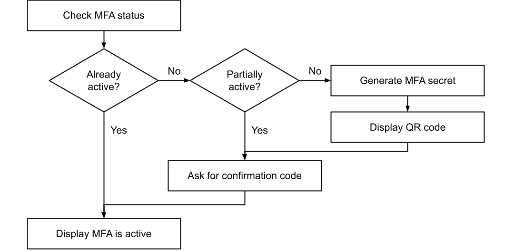
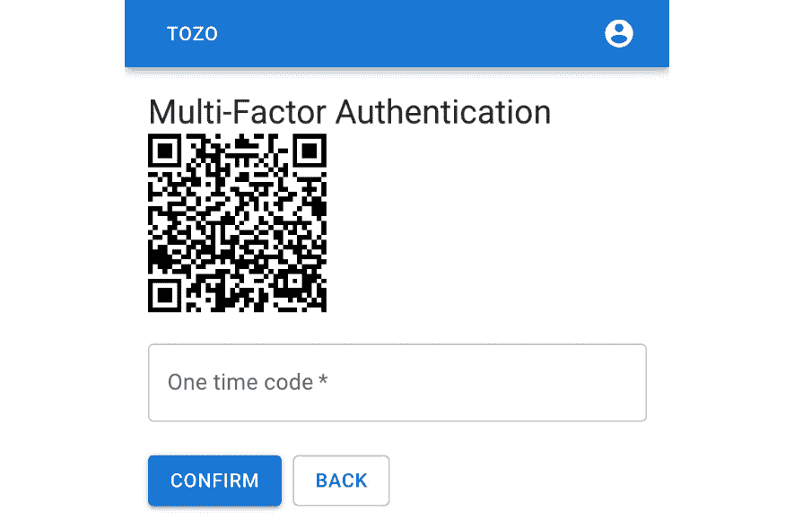
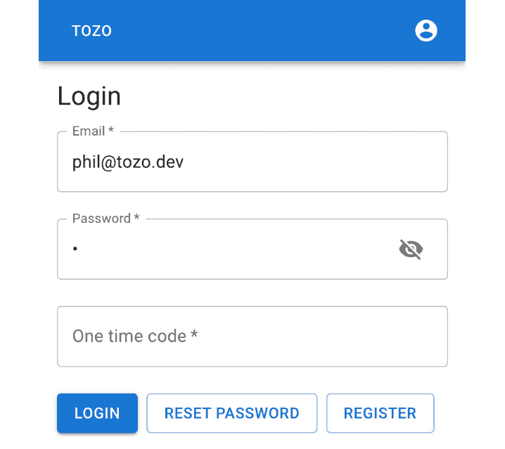
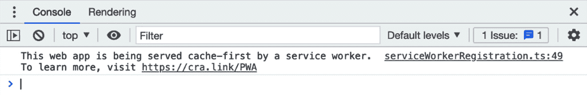

# 第七章：保护并打包应用程序

在上一章中，我们将应用程序部署到[tozo.dev](http://tozo.dev)，允许用户通过任何设备的浏览器使用我们的 Web 应用程序，并添加了监控，以便我们知道何时出现问题。

在本章中，我们将关注如何保持我们的应用程序安全，无论是从我们使用的代码还是用户使用的认证方法来看。我们还将打包我们的应用程序，以便用户可以通过应用商店使用我们的应用程序。

将应用程序的安全性视为一个持续的过程非常重要，在这个过程中，实践和包必须不断更新和改进。在本章中，我将演示我的包更新管理流程，您可以采用并在此基础上进行改进。我们还将采用当前的最佳实践来保护应用程序。

我们还将进行一项重大更改以支持多因素认证。虽然这将使用户能够选择更高的安全性，但它也将展示如何对应用程序进行大规模的更改；具体来说，它将展示如何通过迁移来更改数据库。

最后，通过打包我们的应用程序，我们可以让我们的用户在应用商店中找到我们的应用程序，并像使用他们手机上的任何其他应用程序一样使用它。

因此，在本章中，我们将涵盖以下主题：

+   保护应用程序

+   更新包

+   添加多因素认证

+   转换为渐进式 Web 应用程序

# 技术要求

要使用配套仓库[`github.com/pgjones/tozo`](https://github.com/pgjones/tozo)跟踪本章的开发，请查看`r1-ch7-start`和`r1-ch7-end`标签之间的提交。

# 保护应用程序

我们迄今为止所做的大部分工作都使用了安全默认设置（例如，在*第二章**，使用 Quart 创建可重用后端*）中使用的 Strict SameSite 设置），然而，总有更多可以做的事情来保护应用程序。具体来说，我们可以利用安全头来限制浏览器允许页面执行的操作，进一步防止账户枚举，并限制可以注册的账户以减少垃圾邮件。现在让我们来看看这些安全选项。

## 添加安全头信息

为了进一步保护我们的应用程序，我们可以利用额外的安全头来限制浏览器允许应用程序执行的操作。这些头应该添加到应用程序发送的每个响应中；我们可以通过在`backend/src/backend/run.py`中添加以下内容来实现：

```py
from quart import Response
from werkzeug.http import COOP 
@app.after_request
async def add_headers(response: Response) -> Response:
    response.content_security_policy.default_src = "'self'"
    response.content_security_policy.connect_src = "'self' *.sentry.io"
    response.content_security_policy.frame_ancestors = "'none'"
    response.content_security_policy.report_uri = "https://ingest.sentry.io"        
    response.content_security_policy.style_src = "'self' 'unsafe-inline'"
    response.cross_origin_opener_policy = COOP.SAME_ORIGIN
    response.headers["Referrer-Policy"] = "no-referrer, strict-origin-when-cross-origin"
    response.headers["X-Content-Type-Options"] = "nosniff"
    response.headers["X-Frame-Options"] = "SAMEORIGIN"
    response.headers[
        "Strict-Transport-Security"
    ] = "max-age=63072000; includeSubDomains; preload"
    return response
```

高亮显示的`report_uri`值`“https://ingest.sentry.io”`是一个占位符，您使用的正确值可以在后端项目的 Sentry 仪表板的 CSP 部分找到。

添加的安全头信息如下：

+   `Content-Security-Policy` (`CSP`): 这用于限制内容如何与页面和其他域名交互。如使用所示，它限制了内容，使其必须由我们的域名（称为`self`）提供，除了任何可以内联添加的样式内容（称为`unsafe-inline`），这是为了正确工作所需的 MUI。设置还允许连接到[sentry.io](http://sentry.io)，以便我们的监控可以工作。最后，它有一个报告 URI，以便我们可以监控 CSP 本身的任何错误。

+   `Cross-Origin-Opener-Policy` (`COOP`): 这将我们的应用与其他域名（来源）隔离开。

+   `Referrer-Policy`: 这限制了浏览器在跟随链接时如何填充`Referer`头，并用于保护用户的隐私。

+   `X-Content-Type-Options`: 这确保了浏览器尊重我们从服务器返回的`content`类型。

+   `X-Frame-Options`: 这提高了对点击劫持的保护，并确保我们的应用仅在我们自己的域名上显示。

+   `Strict-Transport-Security`: 这通知浏览器所有后续连接到我们的应用都必须通过 HTTPS 进行。

OWASP

网络应用程序安全最佳实践的权威来源是**OWASP**基金会，您可以在[owasp.org](http://owasp.org)找到它。本书中的头部推荐基于他们的建议。

在安全头设置到位后，我们可以更详细地了解我们如何登录用户，同时保护免受账户枚举攻击。

## 保护免受账户枚举攻击

账户枚举是指攻击者试图了解哪些电子邮件地址被用作注册账户。通过这样做，攻击者可以了解谁使用敏感的应用程序（例如，约会应用），并且可以了解他们可以尝试强制访问哪些账户。保护免受这种攻击需要妥协用户体验，正如我们在*第五章*“添加用户认证页面”部分中讨论的那样，在*第三章*“构建单页应用程序”中，关于注册时的自动登录。

在这本书中，我们将采用最安全的做法，这意味着我们需要重新审视在*第三章*“构建 API”部分中实现的登录功能，因为它容易受到账户枚举攻击。

登录功能中的弱点在于代码仅当提供的电子邮件属于注册成员时才检查密码散列。这意味着对于属于注册成员的电子邮件，该路由响应时间明显更长，而对于不属于的电子邮件则更快；这允许攻击者通过响应时间来判断电子邮件是否已注册。因此，缓解措施是始终检查密码散列，通过将`backend/src/backend/blueprints/sessions.py`中的路由更改为以下内容：

```py
REFERENCE_HASH = "$2b$12$A.BRD7hCbGciBiqNRTqxZ.odBxGo.XmRmgN4u9Jq7VUkW9xRmPxK."
@blueprint.post("/sessions/")
@rate_limit(5, timedelta(minutes=1))
@validate_request(LoginData)
async def login(data: LoginData) -> ResponseReturnValue:
    """Login to the app.

    By providing credentials and then saving the     returned cookie.
    """
    result = await select_member_by_email(        g.connection, data.email     )
    password_hash = REFERENCE_HASH
    if result is not None:
        password_hash = result.password_hash 
    passwords_match = bcrypt.checkpw(
        data.password.encode("utf-8"),
        password_hash.encode("utf-8"),
    )
    if passwords_match and result is not None:
        login_user(AuthUser(str(result.id)), data.remember)
        return {}, 200
    else:
        raise APIError(401, "INVALID_CREDENTIALS")
```

`REFERENCE_HASH`被设置为一个非常长的随机字符字符串，几乎不可能偶然匹配。

通过增加对账户枚举的保护，我们可以通过添加对垃圾邮件账户的保护来专注于账户本身。

## 保护免受垃圾邮件账户的侵害

如果您允许用户注册并与应用程序交互，那么不可避免的是，您将会有一些用户会利用它来向您或其他用户发送垃圾邮件。对此的一个简单初始缓解措施是防止用户使用一次性电子邮件地址（这些是免费的短期电子邮件地址，非常适合垃圾邮件发送者）注册到您的应用程序。幸运的是，`disposable-email-domains`项目跟踪这些域，并在*backend*目录中运行以下命令进行安装：

```py
pdm add disposable-email-domains
```

然后，可以将以下内容添加到`*backend/src/backend/blueprints/members.py*`中`register`路由的开头：

```py
from disposable_email_domains import blocklist  # type: ignore
async def register(data: MemberData) -> ResponseReturnValue:
    email_domain = data.email.split("@", 1)[1]
    if email_domain in blocklist:
        raise APIError(400, "INVALID_DOMAIN")
    ...
```

在之前的代码块中，`...`代表现有的`register`代码。这将通过返回适当的错误代码来阻止来自被阻止电子邮件域的注册。

现在，我们需要处理在`*frontend/src/pages/Register.tsx*`中找到的`useRegister`钩子中的这个错误：

```py
const useRegister = () => { 
      ...
      if (
        error.response?.status === 400 &&
        error.response?.data.code === "WEAK_PASSWORD"
      ) {
        setFieldError("password", "Password is too weak");
      } else if (
        error.response?.status === 400 &&
        error.response?.data.code === "INVALID_DOMAIN"
      ) {
        setFieldError("email", "Invalid email domain");
      } else {
        addToast("Try again", "error");
      }
      ...
}
```

突出的行是`useRegister`钩子中的现有代码。将检查添加到现有的`if`子句作为`else if`子句（如本片段所示）是很重要的，否则用户可能会收到多个令人困惑的错误信息。

在实践中，保持应用程序的安全就像是一场与攻击者的军备竞赛，我建议您继续遵循 OWASP 并采用最新的指导方针。同样，我们还需要不断更新我们的包，这是我们接下来要关注的重点。

# 更新包

在 Web 应用程序中，一个非常常见的漏洞来源是有漏洞的依赖包。如果应用程序正在使用一个包的较旧版本，而新版本提供了更高的安全性，这种情况尤其如此。为了减轻这种风险，我们可以定期检查已知的漏洞，并且关键的是，尽可能频繁地更新包。

锁文件的重要性

通过使用 npm 和 PDM，我们正在使用锁文件；这意味着在更改锁文件之前，我们将在任何系统上始终安装相同的包版本。如果没有锁文件，我们很快就会处于不同系统运行不同包版本甚至不同包的状态，这会使诊断错误变得困难，因为它可能依赖于我们未测试的版本。然而，关键的是，这会使我们的应用程序的安全性降低，因为我们无法控制安装的内容。

## 定期检查漏洞

在我们的应用程序中，我们使用了许多第三方依赖项，每个依赖项都可能使用额外的第三方依赖项。这意味着我们需要检查大量库是否存在漏洞——太多以至于我们无法自己完成！幸运的是，当其他人发现漏洞时，它们会被发布，并且存在工具可以检查安装的版本与已发布的漏洞列表之间的版本。

我们将使用这些工具来检查我们的代码，如果它们发现任何问题，我们可以切换到固定版本。我建议定期自动执行此操作，具体来说，每周通过 GitHub 工作流执行一次。

为了开始，我们可以创建一个工作流，该工作流计划在 UTC 时间周二上午 9 点运行，通过在*.github/workflows/audit.yml*中添加以下内容来实现：

```py
name: Audit

on: 
  schedule:
    - cron: "0 9 * * 2"
jobs:
```

周二补丁

周二通常是应用补丁的日子，因为它在一周的开始，几乎总是工作日（假期期间周一可能不是工作日），并且最重要的是，它为周一提供了时间来响应周末的问题，使得周二可以自由处理补丁问题。

为了检查前端代码，我们可以在`npm`包管理器中内置的`npm audit`工具。此工具将检查已安装的前端依赖项，并在发现任何不安全的包版本时发出警报。为了按计划运行它，应在*.github/workflows/audit.yml*中添加以下作业：

```py
  frontend-audit:
    runs-on: ubuntu-latest
    defaults:
      run:
        working-directory: frontend

    steps:
      - name: Use Node.js
        uses: actions/setup-node@v2
        with:
          node-version: '18'

      - uses: actions/checkout@v3  
      - name: Initialise dependencies
        run: npm ci --cache .npm --prefer-offline
      - name: Audit the dependencies
        run: npm audit
```

现在，为了检查后端代码，我们可以在*后端*目录中运行以下命令来使用`pip-audit`：

```py
pdm add --dev pip-audit
```

我们将添加一个`pdm`脚本来使用`pdm run audit`来审计代码，就像我们在*第一章**，设置我们的开发系统；*中的*安装后端开发 Python*部分所做的那样；因此，将以下内容添加到*后端/pyproject.toml*中：

```py
[tool.pdm.scripts]
audit = "pip-audit"
```

在此基础上，我们可以在*.github/workflows/audit.yml*中添加以下作业：

```py
  backend-audit:
    runs-on: ubuntu-latest
    defaults:
      run:
        working-directory: backend
    steps:
      - uses: actions/checkout@v3
      - uses: actions/setup-python@v4
        with:
          python-version: '3.10'

      - name: Initialise dependencies
        run: |
          pip install pdm
          pdm install 
      - name: Audit the dependencies
        run: pdm run audit
```

如果`frontend-audit`或`backend-audit`作业发现存在安全问题的包，此工作流将失败，并发出警报。然而，最好是主动地保持我们的依赖项更新。

## 一个月度更新系统

为了确保依赖项是最新的，我建议每个月更新所有包。这确保了应用程序永远不会使用超过一个月的依赖项，并且更容易利用依赖项的最新功能。这看起来可能是一项繁重的工作，然而，根据我的经验，一次性完成所有升级比分批进行需要更多的努力。

为了使这个过程更容易，我们必须在*前端/package.json*和*后端/pyproject.toml*文件中取消固定依赖项。但这并不意味着我们已经取消固定依赖项，因为*前端/package-lock.json*和*后端/pdm.lock*将完全定义要安装的确切版本。这反而意味着如果需要，我们将允许我们的应用程序与任何库版本一起工作——并且我们将指导它始终使用最新版本。

*前端/package.json*文件应如下所示：

```py
  "dependencies": {
    "@emotion/react": "*",
    "@emotion/styled": "*",
     ...
  },
  "devDependencies": {
    "@types/zxcvbn": "*",
    "eslint": "*",
    ...
  }
```

注意，现在每个依赖项都没有被固定，`*`表示允许任何版本。

在做出这些更改后，我们可以在*前端*目录中运行以下命令来更新前端依赖项：

```py
npm update 
```

我们也可以在*后端*目录中运行类似的命令来更新后端依赖项：

```py
pdm update 
```

最后，为了升级基础设施依赖项，应在*基础设施*目录中运行以下命令：

```py
terraform init –upgrade
```

这些更新可能需要做出一些小的更改以支持最新版本。很可能会出现 CI 检查警告，特别是我们一直在使用的类型检查，如果这些更改没有进行。

现在我们有一个系统来保持我们的应用程序更新，我们可以添加多因素认证来帮助我们的用户保护他们的账户。

# 添加多因素认证

我们的应用程序允许用户通过提供电子邮件和密码来登录。这意味着我们允许他们通过他们知道的东西（即密码）进行身份验证。我们还可以允许他们使用其他身份验证因素，例如使用他们的指纹（即他们是什么），或特定的移动设备（即他们有什么）。要求用户使用多个因素进行身份验证会使攻击者更难访问他们的账户，但这也使得用户进行身份验证变得更加困难。因此，最好允许用户选择加入多因素认证。

用户最熟悉的是将手机作为额外因素使用，我们将使用基于共享密钥的**基于时间的单次密码**（TOTP）令牌来实现这一点。在用户的手机上，共享密钥是一个额外的因素。使用发送到用户手机的短信消息也很常见；然而，这种方法越来越容易受到攻击，不应被视为安全。

TOTP

TOTP 算法利用共享密钥和当前时间生成一个在一定时间内有效的代码（通常约为 60 秒）。任何两个系统都应该为相同的时间和共享密钥计算出相同的代码，因此用户可以提供一个代码，我们的应用程序应该匹配。

**基于 TOTP 的多因素认证（MFA**）的工作原理是首先与用户共享一个密钥。这通常是通过在我们的应用程序中显示一个二维码来完成的，用户使用身份验证应用程序扫描该二维码。然后，用户的身份验证应用程序将显示一个用户可以在我们的应用程序中输入的代码，以确认已设置 MFA。然后，在随后的任何登录中，用户都需要输入由他们的身份验证应用程序显示的当前代码。

要在我们的应用程序中支持 MFA，我们需要更新数据库和相关模型，添加在后端和前端激活它的功能，然后，最后，在登录时利用 MFA。

## 更新数据库和模型

要支持 MFA，我们需要为每个成员存储两块信息：

+   第一项是共享密钥，如果用户尚未激活多因素认证（MFA），则该密钥可以是`NULL`。

+   第二项是他们最后使用的代码，也可以是`NULL`。最后使用的代码是必需的，以防止重放攻击，攻击者只需重新发送之前的 MFA 代码。

要添加此信息，我们需要创建一个新的数据库迁移，通过将以下代码添加到`backend/src/backend/migrations/1.py`：

```py
from quart_db import Connection
async def migrate(connection: Connection) -> None:
    await connection.execute(
        "ALTER TABLE members ADD COLUMN totp_secret TEXT"
    )
    await connection.execute(
        "ALTER TABLE members ADD COLUMN last_totp TEXT"
    )
async def valid_migration(connection: Connection) -> bool:
    return True
```

良好的迁移

数据库迁移必须谨慎编写，因为迁移将在代码访问数据库状态时更改数据库状态。因此，最好编写在允许旧代码继续运行的同时添加功能的迁移。例如，最好不要在一个迁移中删除或重命名列；相反，应该添加一个新列，然后使用一段时间后再删除旧列。

我们还需要更新后端模型以考虑这两个新列，通过将 *backend/src/backend/models/member.py* 中的 `Member` 模型更改为以下内容（变更已高亮显示）：

```py
@dataclass
class Member:
    id: int
    email: str
    password_hash: str
    created: datetime
    email_verified: datetime | None 
    last_totp: str | None
    totp_secret: str | None
```

现在，我们还需要更新以下模型函数在 *backend/src/backend/models/member.py*：

```py
async def select_member_by_email(
    db: Connection, email: str
) -> Member | None:
    result = await db.fetch_one(
        """SELECT id, email, password_hash, created,
                  email_verified, last_totp, totp_secret
             FROM members
            WHERE LOWER(email) = LOWER(:email)""",
        {"email": email},
    )
    return None if result is None else Member(**result)
async def select_member_by_id(
    db: Connection, id: int
) -> Member | None:
    result = await db.fetch_one(
        """SELECT id, email, password_hash, created,
                  email_verified, last_totp, totp_secret
             FROM members
            WHERE id = :id""",
        {"id": id},
    )
    return None if result is None else Member(**result)
async def insert_member(
    db: Connection, email: str, password_hash: str
) -> Member:
    result = await db.fetch_one(
        """INSERT INTO members (email, password_hash)
                VALUES (:email, :password_hash)
             RETURNING id, email, password_hash, created,
                       email_verified, last_totp,                       totp_secret""",
        {"email": email, "password_hash": password_hash},
    )
    return Member(**result)
```

注意，唯一的变更（如高亮所示）是在 SQL 查询中添加新列。

为了能够更改 `last_totp` 和 `totp_secret` 列的值，我们需要在 *backend/src/backend/models/member.py* 中添加以下函数：

```py
async def update_totp_secret(
    db: Connection, id: int, totp_secret: str | None
) -> None:
    await db.execute(
        """UPDATE members
              SET totp_secret = :totp_secret
            WHERE id = :id""",
        {"id": id, "totp_secret": totp_secret},
    )
async def update_last_totp(
    db: Connection, id: int, last_totp: str | None
) -> None:
    await db.execute(
        """UPDATE members
              SET last_totp = :last_totp
            WHERE id = :id""",
        {"id": id, "last_totp": last_totp},
    )
```

在数据库和后端模型更新后，我们可以添加激活 MFA 的功能。

## 激活 MFA

要激活 MFA，我们需要一个页面，我们的应用程序中的页面应遵循 *图 7.1* 中显示的过程：



图 7.1：MFA 激活过程

密钥本身需要在后端生成和管理，我们可以使用 `pyotp` 库来完成；在 *backend* 目录中运行以下命令来安装库：

```py
pdm add pyotp
```

我们现在可以开始添加后端路由，从返回成员 MFA 状态的路由开始。这将要么是 `active`（MFA 正在使用中），要么是 `inactive`（MFA 未使用），要么是 `partial`（成员正在激活 MFA 的过程中）；它还需要返回共享密钥。我们将以 URI 的形式返回密钥，我们可以从中生成 QR 码。

此路由的代码如下，并应添加到 *backend/src/backend/blueprints/members.py*：

```py
from typing import Literal
from pyotp.totp import TOTP
from quart_schema import validate_response
@dataclass
class TOTPData:
    state: Literal["ACTIVE", "PARTIAL", "INACTIVE"]
    totp_uri: str | None
@blueprint.get("/members/mfa/")
@rate_limit(10, timedelta(seconds=10))
@login_required
@validate_response(TOTPData)
async def get_mfa_status() -> TOTPData:
    member_id = int(cast(str, current_user.auth_id))
    member = await select_member_by_id(g.connection, member_id)
    assert member is not None  # nosec
    totp_uri = None
    state: Literal["ACTIVE", "PARTIAL", "INACTIVE"]
    if member.totp_secret is None:
        state = "INACTIVE"
    elif (
        member.totp_secret is not None and         member.last_totp is None
    ):
        totp_uri = TOTP(member.totp_secret).provisioning_uri(
            member.email, issuer_name="Tozo"
        )
        state = "PARTIAL"
    else:
        state = "ACTIVE"
    return TOTPData(state=state, totp_uri=totp_uri)
```

注意，`totp_uri` 仅在部分状态下返回（已高亮），因为它包含的秘密只有在需要时才应共享。

下一个我们需要的路由是允许成员通过创建共享密钥来启动 MFA。这应该添加到 *backend/src/backend/blueprints/members.py*：

```py
from pyotp import random_base32
from backend.models.member import update_totp_secret
@blueprint.post("/members/mfa/")
@rate_limit(10, timedelta(seconds=10))
@login_required
@validate_response(TOTPData)
async def initiate_mfa() -> TOTPData:
    member_id = int(cast(str, current_user.auth_id))
    member = await select_member_by_id(g.connection, member_id)
    assert member is not None  # nosec
    if member.totp_secret is not None:
        raise APIError(409, "ALREADY_ACTIVE")
    totp_secret = random_base32()
    totp_uri = TOTP(totp_secret).provisioning_uri(
        member.email, issuer_name="Tozo"
    )
    await update_totp_secret(g.connection, member_id, totp_      secret)
    return TOTPData(state="PARTIAL", totp_uri=totp_uri) 
```

我们需要的最后一个路由是允许用户输入 TOTP 代码以确认设置，这应该添加到 *backend/src/backend/blueprints/members.py*：

```py
from backend.models.member import update_last_totp
@dataclass 
class TOTPToken: 
    token: str
@blueprint.put("/members/mfa/")
@rate_limit(10, timedelta(seconds=10))
@login_required
@validate_request(TOTPToken)
async def confirm_mfa(data: TOTPToken) -> ResponseReturnValue:
    member_id = int(cast(str, current_user.auth_id))
    member = await select_member_by_id(g.connection, member_id)
    assert member is not None  # nosec
    if member.totp_secret is None:
        raise APIError(409, "NOT_ACTIVE")
    totp = TOTP(member.totp_secret)
    if totp.verify(data.token):
        await update_last_totp(g.connection, member_id, data.          token)
        return {}
    else:
        raise APIError(400, "INVALID_TOKEN")
```

我们现在可以构建前端页面来处理界面，该界面需要显示 QR 码。我们可以通过在 *frontend* 目录中运行以下命令来安装 `qrcode.react` 来实现这一点：

```py
npm install qrcode.react
```

我们需要构建的页面应该看起来像 *图 7.2*：



图 7.2：MFA 设置页面

要构建 MFA 页面，我们首先需要在 *frontend/src/components/TotpField.tsx* 中添加一个特定字段，让用户输入一次性密码，具体操作如下：

```py
import TextField, { TextFieldProps } from "@mui/material/TextField";
import { FieldHookConfig, useField } from "formik";
import { combineHelperText } from "src/utils";
const TotpField = (props: FieldHookConfig<string> & TextFieldProps) => {
  const [field, meta] = useField<string>(props);
  return (
    <TextField
      {...props}
      autoComplete="one-time-code"
      error={Boolean(meta.error) && meta.touched}
      helperText={combineHelperText(props.helperText, meta)}
      inputProps={{ inputMode: "numeric", maxLength: 6,        pattern: "[0-9]*" }}
      margin="normal"
      type="text"
      {...field}
    />
  );
};
export default TotpField;
```

在使用`TotpField`之前，我们需要将激活 MFA 所需的功能添加到 *frontend/src/pages/MFA.tsx*：

```py
import axios from "axios"; 
import { useQueryClient } from "@tanstack/react-query";
import { useMutation } from "src/query";
const useActivateMFA = (): [() => Promise<void>, boolean] => {
  const queryClient = useQueryClient();
  const { mutateAsync: activate, isLoading } = useMutation(
    async () => await axios.post("/members/mfa/"),
    {
      onSuccess: () => queryClient.invalidateQueries(["mfa"]),
    },
  );
  return [
    async () => {
      await activate();
    },
    isLoading,
  ];
};
```

该突变使`mfa`查询无效，因为这是我们用于确定用户 MFA 状态的查询的关键。

我们还需要添加一个功能来确认 MFA 激活，这可以添加到 *frontend/src/pages/MFA.tsx*：

```py
import { FormikHelpers } from "formik";
import { useContext } from "react";
import { ToastContext } from "src/ToastContext";
interface IForm {
  token: string;
}
const useConfirmMFA = () => {
  const { addToast } = useContext(ToastContext);
  const queryClient = useQueryClient();
  const { mutateAsync: confirm } = useMutation(
    async (data: IForm) => await axios.put("/members/mfa/", data),
    {
      onSuccess: () => queryClient.invalidateQueries(["mfa"]),
    },
  );
  return async (
    data: IForm, { setFieldError }: FormikHelpers<IForm>
  ) => {
    try {
      await confirm(data);
    } catch (error: any) {
      if (axios.isAxiosError(error) && 
          error.response?.status === 400) {
        setFieldError("token", "Invalid code");
      } else {
        addToast("Try again", "error");
      }
    }
  };
};
```

在功能到位后，我们可以添加以下 UI 元素，这些元素应添加到 *frontend/src/pages/MFA.tsx*：

```py
import LoadingButton from "@mui/lab/LoadingButton";
import Skeleton from "@mui/material/Skeleton";
import Typography from "@mui/material/Typography";
import { Form, Formik } from "formik";
import { QRCodeSVG } from "qrcode.react";
import * as yup from "yup";
import FormActions from "src/components/FormActions";
import Title from "src/components/Title";
import TotpField from "src/components/TotpField";
import { useQuery } from "src/query";
const validationSchema = yup.object({
  token: yup.string().required("Required"),
}); 
const MFA = () => {
  const { data } = useQuery(["mfa"], async () => {
    const response = await axios.get("/members/mfa/");
    return response.data;
  });
  const [activate, isLoading] = useActivateMFA();
  const onSubmit = useConfirmMFA();
  let content = <Skeleton />;
  if (data?.state === "ACTIVE") {
    content = <Typography variant="body1">MFA Active</Typography>;
  } else if (data?.state === "INACTIVE") {
    content = (
      <LoadingButton loading={isLoading} onClick={activate}>
        Activate
      </LoadingButton>
    );
  } else if (data !== undefined) {
    content = (
      <>
        <QRCodeSVG value={data.totpUri} />
        <Formik<IForm>
          initialValues={{ token: "" }}
          onSubmit={onSubmit}
          validationSchema={validationSchema}
        >
          {({ dirty, isSubmitting }) => (
            <Form>
              <TotpField
                fullWidth={true}
                label="One time code"
                name="token"
                required={true}
              />
              <FormActions
                disabled={!dirty}
                isSubmitting={isSubmitting}
                label="Confirm"
                links={[{ label: "Back", to: "/" }]}
              />
            </Form>
          )}
        </Formik>
      </>
    );
  }
  return (
    <>
      <Title title="Multi-Factor Authentication" />
      {content}
    </>
  );
};
export default MFA; 
```

显示的 UI 代码取决于 MFA 状态，包括最初在从后端获取 MFA 状态时显示`Skeleton`的情况。然后显示`LoadingButton`以激活 MFA，一个二维码和`TotpField`以确认 MFA 激活，如果 MFA 处于激活状态，则最终显示确认文本。

接下来，需要通过在 *frontend/src/Router.tsx* 中添加以下内容来将 MFA 页面添加到路由中：

```py
import MFA from "src/pages/MFA";
const Router = () => (
  <BrowserRouter>
   ...
    <Routes>
      ...
      <Route
        path="/mfa/"
        element={<RequireAuth><MFA /></RequireAuth>}
      />
    </Routes>
  </BrowserRouter>
);
```

在代码块中，`...`代表为了简洁而省略的代码。

为了使用户能够找到 MFA 页面，我们可以在 *frontend/src/components/AccountMenu.tsx* 组件中添加以下`MenuItem`：

```py
<MenuItem  
  component={Link}  
  onClick={onMenuClose}  
  to="/mfa/" 
> 
  MFA
</MenuItem>
```

现在用户可以激活 MFA，我们可以在登录过程中使用它。

## 使用 MFA 登录

登录过程还必须更改，如果用户已激活 MFA，则要求用户提供一次性密码。为此，后端必须向前端指示，对于已激活 MFA 的用户，需要额外的令牌。以下代码应替换 *backend/src/backend/blueprints/sessions.py* 中的登录路由：

```py
from pyotp.totp import TOTP
from backend.models.member import update_last_totp
@dataclass
class LoginData:
    email: EmailStr
    password: str
    remember: bool = False
    token: str | None = None
@blueprint.post("/sessions/")
@rate_limit(5, timedelta(minutes=1))
@validate_request(LoginData)
async def login(data: LoginData) -> ResponseReturnValue:
    member = await select_member_by_email(g.connection, data.email)
    password_hash = REFERENCE_HASH
    if member is not None:
        password_hash = member.password_hash 
    passwords_match = bcrypt.checkpw(
        data.password.encode("utf-8"),
        password_hash.encode("utf-8"),
    )
    if passwords_match:
        assert member is not None  # nosec
        if (
            member.totp_secret is not None and 
            member.last_totp is not None
        ):
            if data.token is None:
                raise APIError(400, "TOKEN_REQUIRED")
            totp = TOTP(member.totp_secret)
            if (
                not totp.verify(data.token) or 
                data.token == member.last_totp
            ):
                raise APIError(401, "INVALID_CREDENTIALS")
            await update_last_totp(
                g.connection, member.id, data.token
            )
        login_user(AuthUser(str(member.id)), data.remember)
        return {}, 200
    else:
        raise APIError(401, "INVALID_CREDENTIALS")
```

如果用户已激活 MFA，但登录数据不包括一次性密码（`token`），则此代码将返回`400`错误响应；这允许前端登录页面随后要求用户提供一次性密码并重新尝试登录。此外，如果一次性密码无效，代码将返回`401`无效凭据消息——注意它检查之前使用的代码以防止重放攻击。

我们现在可以修改现有的登录页面，使其看起来像 *图 7.3*，适用于已激活 MFA 的账户：



图 7.3：带有额外一次性密码字段的登录页面

首先，我们需要修改 *frontend/src/pages/Login.tsx* 中的`useLogin`逻辑，如下所示：

```py
import { useState } from "react";
interface IForm {
  email: string;
  password: string;
  token: string;
}
const useLogin = (): [(data: IForm, helpers: FormikHelpers<IForm>) => Promise<void>, boolean] => {
  const [requiresMFA, setRequiresMFA] = useState(false);
  const location = useLocation();
  const navigate = useNavigate();
  const { addToast } = useContext(ToastContext);
  const { setAuthenticated } = useContext(AuthContext);
  const { mutateAsync: login } = useMutation(
    async (data: IForm) => await axios.post("/sessions/",       data),
  );
  return [
    async (data: IForm, { setFieldError }:       FormikHelpers<IForm>)=>{
      const loginData: any = {
        email: data.email,
        password: data.password,
      };
      if (requiresMFA) {
        loginData["token"] = data.token;
      }
      try {
        await login(loginData);
        setAuthenticated(true);
        navigate((location.state as any)?.from ?? "/");
      } catch (error: any) {
        if (error.response?.status === 400) {
          setRequiresMFA(true);
        } else if (error.response?.status === 401) {
          setFieldError("email", "Invalid credentials");
          setFieldError("password", "Invalid credentials");
          setFieldError("token", "Invalid credentials");
        } else {
          addToast("Try again", "error");
        }
      }
    },
    requiresMFA,
  ];
};
```

`useLogin`钩子返回登录功能和一个标志，指示是否需要一次性密码。当尝试登录时，此标志被设置，并且后端返回`400`响应。

我们可以使用`useLogin`钩子中的标志来在登录表单中显示`TotpField`，通过在 *frontend/src/pages/Login.tsx* 中进行以下突出显示的更改：

```py
import TotpField from "src/components/TotpField"; 
const Login = () => {
  const [onSubmit, requiresMFA] = useLogin();
  ...
  return (
    <>
      <Formik<IForm> 
        initialValues={{
          email: (location.state as any)?.email ?? "",
          password: "",
          token: "",
        }}
        onSubmit={onSubmit}
        validationSchema={validationSchema}
      >
        {({ isSubmitting, values }) => (
          <Form>
            {requiresMFA ? (
              <TotpField
                fullWidth={true}
                label="One time code"
                name="token"
                required={true}
              />
            ) : null}
          </Form>
        )}
      </Formik>
    </>
  );
};
```

这将允许用户输入一次性密码并完成登录。我们现在可以考虑如何处理用户丢失共享密钥的情况。

## 恢复和停用 MFA

用户不可避免地会丢失共享密钥并需要恢复对账户的访问。这通常是用户在激活多因素认证时获得的恢复代码所完成的。这些恢复代码是存储在后端中的额外一次性密钥，可以一次性使用以恢复访问。虽然这可行，但任何恢复系统都需要考虑您的客户服务将如何以及以何种形式进行，因为用户通常会寻求帮助。

OWASP 为此提供了额外的指导，您可以在以下链接中查看：[cheatsheetseries.owasp.org/cheatsheets/Multifactor_Authentication_Cheat_Sheet.xhtml#resetting-mfa](http://cheatsheetseries.owasp.org/cheatsheets/Multifactor_Authentication_Cheat_Sheet.xhtml#resetting-mfa)。

我们已经对我们的应用进行了重大更改，您可以用它作为模板来进一步为您的应用进行重大更改。接下来，我们将通过将其转换为渐进式 Web 应用来打包我们的应用以供应用商店使用。

# 转换为渐进式 Web 应用

我们可以通过将其转换为**渐进式 Web 应用**（**PWA**）来使我们的应用更加用户友好，尤其是在移动设备上。PWA 可以像所有其他应用一样安装在手机上，无论是通过应用商店还是直接从浏览器中的提示进行安装。PWA 还可以离线工作并使用其他高级功能，如推送通知。然而，PWA 的开发更为复杂，服务工作者（一个关键特性）可能非常难以正确实现。

服务工作者

服务工作者是作为网页和服务器之间代理的定制 JavaScript 脚本。这允许服务工作者添加离线优先功能，例如缓存页面以提高性能或接受推送通知。

一个 PWA 必须有一个服务工作者和一个清单文件才能工作；这些文件可以通过我们用于*第一章*、“设置我们的开发系统”的`create-react-app`工具获得。为此，让我们在临时目录中使用 PWA 模板创建一个新的`react`应用：

```py
npx create-react-app temp --template cra-template-pwa-typescript
```

然后，我们可以通过复制以下文件将服务工作者代码从临时项目复制到我们的项目中：

+   将*temp/src/service-worker.ts*复制到*frontend/src/service-worker.ts*

+   将*temp/src/serviceWorkerRegistration.ts*复制到*frontend/src/serviceWorkerRegistration.ts*

现在，您可以选择删除*temp*目录或保留以供参考。

要激活服务工作者，以下内容应添加到*frontend/src/index.tsx*中以注册服务工作者：

```py
import * as serviceWorkerRegistration from "src/serviceWorkerRegistration"; 
serviceWorkerRegistration.register();
```

此服务工作者需要从 workbox 工具包（[web.dev/workbox/](http://web.dev/workbox/））中依赖大量依赖项才能工作；这些依赖项由 Google 开发，以使服务工作者更容易使用。这些依赖项可以通过在*前端*目录中运行以下命令来安装：

```py
npm install workbox-background-sync workbox-background-sync workbox-cacheable-response workbox-core workbox-expiration workbox-navigation-preload workbox-precaching workbox-range-requests workbox-routing workbox-strategies workbox-streams
```

当我们使用 `npm run start` 前端开发服务器开发应用时，服务工作者不会处于活动状态，因此为了测试它，我们需要通过后端开发服务器本地提供服务。首先，我们必须在 *frontend* 目录中运行以下命令来构建前端：

```py
npm run build
```

这将在 *frontend/build* 目录中创建文件，我们需要将这些文件复制到后端。这需要以下文件移动：

+   将整个 *frontend/build/static* 目录复制到 *backend/src/backend/static*

+   将 *frontend/build/index.xhtml* 文件复制到 *backend/src/backend/templates/index.xhtml*

+   将 *frontend/build* 中的剩余文件复制到 *backend/src/backend/static* 中（例如，将 *frontend/build/service-worker.js* 复制到 *backend/src/backend/static/service-worker.js*）

剩余的文件也需要包含在 *Dockerfile* 中，并在现有的 `COPY --from=frontend` 命令旁边添加以下内容：

```py
COPY --from=frontend /frontend/build/*.js* /app/backend/static/
```

后端运行时（通过 `pdm run start`），服务工作者启用的应用可通过 `localhost:5050` 访问。你可以通过查看 *图 7.4* 中的开发者工具控制台来检查服务工作者是否工作正常：



图 7.4：浏览器开发者工具中的服务工作者输出

服务工作者现在将开始缓存内容，并且当后端不运行时，你应该能够刷新应用。

应用图标

浏览器中的网页都有一个与其关联的图标，通常显示在标签页的标题旁边。这个图标被称为 favicon。PWA（渐进式 Web 应用）有额外的图标，用于移动主页屏幕（以及其他地方）上的应用；这些图标在清单文件中定义。

我们现在可以将注意力转向清单文件，它描述了应用及其应关联的标志。一旦你设计好了一个标志，我建议将其保存为 SVG 格式的 favicon，并放置在 *frontend/public/favicon.svg* 中。由于我们使用 SVG 格式而不是 ICO 格式，以下代码应替换 *frontend/public/index.xhtml* 中的现有代码（注意文件扩展名）：

```py
<link rel="icon" href="%PUBLIC_URL%/favicon.svg" />
```

然后需要将相同的标志保存为 PNG 格式，作为 192x192 像素的方形文件在 *frontend/public/logo192.png* 中，以及作为 512x512 像素的方形文件在 *frontend/public/logo512.png* 中。清单文件应包括以下内容，并将其放置在 *frontend/public/manifest.json* 中：

```py
{
  "short_name": "Tozo",
  "name": "Tozo todo app",
  "icons": [
    {
      "src": "favicon.svg",
      "sizes": "64x64 32x32 24x24 16x16",
      "type": " image/svg+xml"
    },
    {
      "src": "logo192.png",
      "type": "image/png",
      "sizes": "192x192"
    },
    {
      "src": "logo512.png",
      "type": "image/png",
      "sizes": "512x512"
    }
  ],
  "start_url": ".",
  "display": "standalone",
  "theme_color": "#1976d2",
  "background_color": "#ffffff"
}
```

与服务工作者一样，我们还需要将标志复制到后端。对于开发，将所有标志复制到 *backend/src/backend/static/* 文件夹。对于生产，以下内容应添加到 *Dockerfile* 中：

```py
COPY --from=frontend /frontend/build/*.png /frontend/build/*.svg /app/backend/static/
```

我们现在需要从后端提供这些新文件，这可以通过向 *backend/src/backend/blueprints/serving.py* 中添加以下代码来实现：

```py
from quart import current_app, send_from_directory
@blueprint.get(
    "/<any('service-worker.js', 'service-worker.js.map', 'manifest.json', 'asset-manifest.json', 'favicon.svg', 'logo192.png', 'logo512.png'):path>"  # noqa: E501
)
@rate_exempt
async def resources(path: str) -> ResponseReturnValue:
    assert current_app.static_folder is not None  # nosec
    return await send_from_directory(
        current_app.static_folder, path
    )
```

在做出这些更改后，我们的应用已成为 PWA，这意味着我们可以为应用商店打包它。这样做最简单的方法是使用[pwabuilder.com](http://pwabuilder.com)，它将创建 iOS 和 Android 包。要这样做，请访问[pwabuilder.com](http://pwabuilder.com)并输入你的应用域名。然后，它将展示可以上传到 Google Play 商店和 iOS 应用商店的包。

PWA Builder

PWA Builder 是一个由微软指导的项目，旨在通过简化流程来提高 PWA 的采用率。PWA 在 Windows 和 Android 上是第一类应用。

这种方法存在局限性；首先，虽然 PWA 在 Windows 和 Android 系统上是第一类应用，但在苹果的 iOS 系统上支持有限。可能的情况是，你用 PWA Builder 打包的应用在应用商店中不被接受——几乎没有解释为什么。此外，iOS 不支持 PWA 的所有功能；最显著的是，直到 2023 年将不支持推送通知。

在完成 PWA 转换后，我们可以将 PWA 包上传到各个应用商店，使用户能够从商店安装它。有关如何操作的进一步说明请参阅 Android（https://docs.pwabuilder.com/#/builder/android）和 iOS（[`docs.pwabuilder.com/#/builder/app-store`](https://docs.pwabuilder.com/#/builder/app-store)）。

# 摘要

在本章中，我们已经确保了我们的应用安全，并采用了一个持续更新的流程来保持其安全性。我们还添加了一个主要功能，MFA，它将作为未来对应用进行重大更改的指南。最后，我们已经打包了我们的应用，准备添加到应用商店。

这是一个很好的地方，因为你现在有一个正在生产中运行的 Web 应用的蓝图，它采用了许多行业最佳实践。这是一个你可以根据自己的需求进行调整的蓝图，其中待办事项的具体方面作为指南，我希望我介绍给你的最佳实践和工具能为你带来帮助。

# 进一步阅读

这还不是终点；你现在可以并且应该做更多的事情来改进你的应用，使其对你的用户更有价值。我建议你添加更多测试以减少错误，特别是通过添加端到端测试。我还建议你使用 Lighthouse、[pagespeed.web.dev](http://pagespeed.web.dev)等工具来识别常见的性能、可访问性和一般 PWA 问题。
