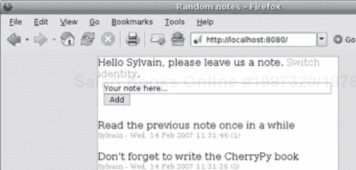
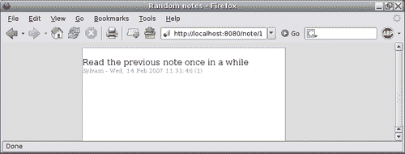
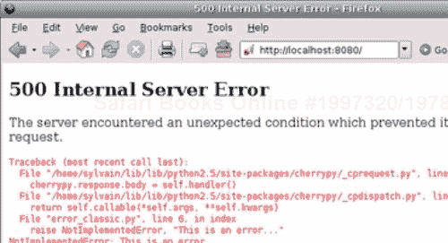
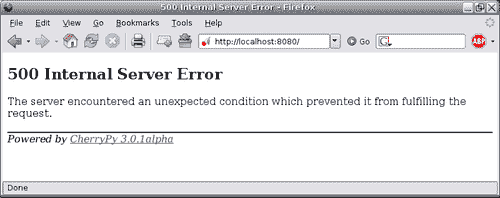
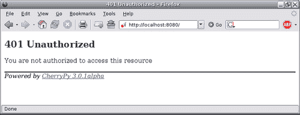
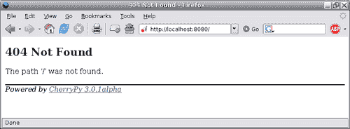
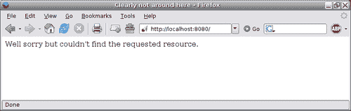

# 第三章 概述 CherryPy

在第一章中，我们简要回顾了 CherryPy 的一些方面；现在是时候深入挖掘，看看这个项目是如何设计和构建的。我们首先将通过一个基本的 CherryPy 示例。然后我们将探讨 CherryPy 的核心、发布对象引擎，以及它是如何将 HTTP 协议封装在一个面向对象的库中的。我们的下一步将是探索挂钩到核心、CherryPy 库和工具机制的概念。然后我们将回顾 CherryPy 如何处理错误和异常，以及你如何从中受益。

到本章结束时，你将对 CherryPy 库有一个很好的概述；然而，你很可能会在本书的其余部分回到这一章，以便完全理解它。

# 词汇表

为了避免误解，我们需要定义一些将在整本书中使用的关键词。

| 关键词 | 定义 |
| --- | --- |
| **Web 服务器** | Web 服务器是处理 HTTP 协议的接口。其目标是将传入的 HTTP 请求转换为实体，然后传递给应用服务器，并将应用服务器中的信息转换回 HTTP 响应。 |
| **应用** | 应用是一段软件，它接收一个信息单元，对其应用业务逻辑，并返回一个处理过的信息单元。 |
| **应用服务器** | 应用服务器是托管一个或多个应用的组件。 |
| **Web 应用服务器** | Web 应用服务器简单地将 Web 服务器和应用服务器合并为一个组件。 |

CherryPy 是一个 Web 应用服务器。

# 基本示例

为了说明 CherryPy 库，我们将通过一个非常基本的 Web 应用，允许用户通过 HTML 表单在主页上留下笔记。笔记将按创建日期的逆序堆叠并渲染。我们将使用会话对象来存储笔记作者的姓名。



每个笔记都将附有一个 URI，形式为`/note/id`。



创建一个名为`note.py`的空白文件，并复制以下源代码。

```py
#!/usr/bin/python
# -*- coding: utf-8 -*
# Python standard library imports
import os.path
import time
###############################################################
CherryPylibrary, working of#The unique module to be imported to use cherrypy
###############################################################
import cherrypy
# CherryPy needs an absolute path when dealing with static data
_curdir = os.path.join(os.getcwd(), os.path.dirname(__file__))
###############################################################
# We will keep our notes into a global list
# Please not that it is hazardous to use a simple list here
# since we will run the application in a multi-threaded environment
# which will not protect the access to this list
# In a more realistic application we would need either to use a
# thread safe object or to manually protect from concurrent access
# to this list
###############################################################
_notes = []
###############################################################
# A few HTML templates
###############################################################
_header = """
<html>
<head>
<title>Random notes</<title>
<link rel="stylesheet" type="text/css" href="/style.css"></link>
</head>
<body>
<div class="container">"""
_footer = """
</div>
</body>
</html>"""
_note_form = """
<div class="form">
<form method="post" action="post" class="form">
<input type="text" value="Your note here..." name="text"
size="60"></input>
<input type="submit" value="Add"></input>
</form>
</div>"""
_author_form = """
CherryPylibrary, working of<div class="form">
<form method="post" action="set">
<input type="text" name="name"></input>
<input type="submit" value="Switch"></input>
</form>
</div>"""
_note_view = """
<br />
<div>
%s
<div class="info">%s - %s <a href="/note/%d">(%d)</a></div>
</div>"""
###############################################################
# Our only domain object (sometimes referred as to a Model)
###############################################################
class Note(object):
def __init__(self, author, note):
self.id = None
self.author = author
self.note = note
self.timestamp = time.gmtime(time.time())
def __str__(self):
return self.note
###############################################################
# The main entry point of the Note application
###############################################################
class NoteApp:
"""
The base application which will be hosted by CherryPy
"""
# Here we tell CherryPy we will enable the session
# from this level of the tree of published objects
# as well as its sub-levels
_cp_config = { 'tools.sessions.on': True }
def _render_note(self, note):
"""Helper to render a note into HTML"""
return _note_view % (note, note.author,
time.strftime("%a, %d %b %Y %H:%M:%S",
note.timestamp),
note.id, note.id)
@cherrypy.expose
def index(self):
# Retrieve the author stored in the current session
# None if not defined
author = cherrypy.session.get('author', None)
page = [_header]
if author:
page.append("""
<div><span>Hello %s, please leave us a note.
<a href="author">Switch identity</a>.</span></div>"""
%(author,))
page.append(_note_form)
else:
page.append("""<div><a href="author">Set your
identity</a></span></div>""")
notes = _notes[:]
CherryPylibrary, working ofnotes.reverse()
for note in notes:
page.append(self._render_note(note))
page.append(_footer)
# Returns to the CherryPy server the page to render
return page
@cherrypy.expose
def note(self, id):
# Retrieve the note attached to the given id
try:
note = _notes[int(id)]
except:
# If the ID was not valid, let's tell the
# client we did not find it
raise cherrypy.NotFound
return [_header, self._render_note(note), _footer]
@cherrypy.expose
def post(self, text):
author = cherrypy.session.get('author', None)
# Here if the author was not in the session
# we redirect the client to the author form
if not author:
raise cherrypy.HTTPRedirect('/author')
note = Note(author, text)
_notes.append(note)
note.id = _notes.index(note)
raise cherrypy.HTTPRedirect('/')
class Author(object):
@cherrypy.expose
def index(self):
return [_header, _author_form, _footer]
@cherrypy.expose
def set(self, name):
cherrypy.session['author'] = name
return [_header, """
Hi %s. You can now leave <a href="/" title="Home">notes</a>.
""" % (name,), _footer]
if __name__ == '__main__':
# Define the global configuration settings of CherryPy
global_conf = {
'global': { 'engine.autoreload.on': False,
'server.socket_host': 'localhost',
'server.socket_port': 8080,
}}
application_conf = {
'/style.css': {
'tools.staticfile.on': True,
'tools.staticfile.filename': os.path.join(_curdir,
'style.css'),
}
}
# Update the global CherryPy configuration
CherryPylibrary, working ofcherrypy.config.update(global_conf)
# Create an instance of the application
note_app = NoteApp()
# attach an instance of the Author class to the main application
note_app.author = Author()
# mount the application on the '/' base path
cherrypy.tree.mount(note_app, '/', config = application_conf)
# Start the CherryPy HTTP server
cherrypy.server.quickstart()
# Start the CherryPy engine
cherrypy.engine.start()

```

以下是在名为`style.css`的文件中保存的 CSS，该文件应存储在与`note.py`相同的目录中。

```py
html, body {
background-color: #DEDEDE;
padding: 0px;
marging: 0px;
height: 100%;
}
.container {
border-color: #A1A1A1;
border-style: solid;
border-width: 1px;
background-color: #FFF;
margin: 10px 150px 10px 150px;
height: 100%;
}
a:link {
text-decoration: none;
color: #A1A1A1;
}
a:visited {
text-decoration: none;
color: #A1A1A1;
}
a:hover {
text-decoration: underline;
}
input {
CherryPylibrary, working ofborder: 1px solid #A1A1A1;
}
.form {
margin: 5px 5px 5px 5px;
}
.info {
font-size: 70%;
color: #A1A1A1;
}

```

在本章的其余部分，我们将通过应用来解释 CherryPy 的设计。

# 内置 HTTP 服务器

CherryPy 自带其自己的 Web（HTTP）服务器。做出这个决定的目标是使 CherryPy 成为一个自包含的系统，并允许用户在获得库后几分钟内运行 CherryPy 应用。正如其名所示，Web 服务器是 CherryPy 应用的入口，所有 HTTP 请求和响应都必须通过它。因此，该层负责处理客户端和服务器之间传递信息的低级 TCP 套接字。

虽然使用内置服务器不是强制性的，但如果有需要，CherryPy 完全能够与其它 Web 服务器接口。然而，在这本书中，我们只会使用默认的内置 Web 服务器。

要启动 Web 服务器，您必须执行以下调用：

```py
cherrypy.server.quickstart()

```

# 内部引擎

CherryPy 引擎是负责以下内容的层：

+   创建和管理请求和响应对象

    +   请求负责检索和调用与 Request-URI 匹配的页面处理程序。

    +   响应对象在将响应返回给底层服务器之前构建和验证响应。

+   控制、管理和监控 CherryPy 进程

要启动引擎，您必须发出以下调用：

```py
cherrypy.engine.start()

```

# 配置

CherryPy 自带配置系统，允许您参数化 HTTP 服务器以及 CherryPy 引擎在处理 Request-URI 时的行为。

设置可以存储在接近`INI`格式的文本文件中，或者存储在纯 Python 字典中。选择两者之一将取决于个人喜好，因为它们都携带相同的信息。

CherryPy 提供了两个入口点来传递配置值——通过`cherrypy.config.update()`方法全局传递给服务器实例，以及通过`cherrypy.tree.mount()`方法按应用程序传递。此外，还有一个第三个作用域，可以在其中应用配置设置：按路径。

要配置 CherryPy 服务器实例本身，您需要使用设置的`global`部分。

在`note`应用程序中，我们定义了以下设置：

```py
global_conf = {
'global': {
'server.socket_host': 'localhost',
'server.socket_port': 8080,
},
}
application_conf = {
'/style.css': {
'tools.staticfile.on': True,
'tools.staticfile.filename': os.path.join(_curdir,
'style.css'),
}
}

```

这可以在如下文件中表示：

```py
[global]
server.socket_host="localhost"
CherryPyconfiguringserver.socket_port=8080
[/style.css]
tools.staticfile.on=True
tools.staticfile.filename="/full/path/to.style.css"

```

### 注意

当使用文件存储设置时，您必须使用有效的 Python 对象（字符串、整数、布尔值等）。

我们定义了服务器将监听传入连接的主机和端口。

然后我们指示 CherryPy 引擎，`/style.css`文件将由`staticfile`工具处理，并也指出了要服务的物理文件的绝对路径。我们将在以下章节中详细解释这些工具是什么，但到目前为止，请想象它们是扩展 CherryPy 内部功能和增强其可能性的方式。

为了通知 CherryPy 我们的全局设置，我们需要执行以下调用：

+   使用字典

```py
cherrypy.config.update(conf)

```

+   使用文件

```py
cherrypy.config.update('/path/to/the/config/file')

```

我们还必须按照以下方式将配置值传递给挂载的应用程序：

+   使用字典

```py
cherrypy.tree.mount(application_instance, script_name, config=conf)

```

+   使用文件

```py
cherrypy.tree.mount(application_instance, script_name,
config='/path/to/config/file')

```

虽然在大多数情况下，在字典和文件之间进行选择将取决于个人喜好，但在某些情况下，一种方式可能比另一种方式更好。例如，您可能需要将复杂的数据或对象传递给配置中的一个键，而这无法通过文本文件实现。另一方面，如果设置需要由应用程序管理员修改，使用 INI 文件可能会简化这项任务。

### 注意

记住，如果您像我们在 Note 应用程序中那样配置应用程序的某些部分（如服务样式表），您必须调用`cherrypy.tree.mount()`。

配置应用程序的最后一种方式是在页面处理程序或包含页面处理程序的类的`_cp_config`属性上使用，在这种情况下，配置将适用于所有页面处理程序。

在下面的代码示例中，我们表明`Root`类的所有页面处理程序都将使用`gzip`压缩，除了`hello`页面处理程序。

```py
import cherrypy
class Root:
_cp_config = {'tools.gzip.on': True}
@cherrypy.expose
CherryPyconfiguringdef index(self):
return "welcome"
@cherrypy.expose
def default(self, *args, **kwargs):
return "oops"
@cherrypy.expose
# this next line is useless because we have set the class
# attribute _cp_config but shows you how to configure a tool
# using its decorator. We will explain more in the next
# chapters.
@cherrypy.tools.gzip()
def echo(self, msg):
return msg
@cherrypy.expose
def hello(self):
return "there"
hello._cp_config = {'tools.gzip.on': False}
if __name__ == '__main__':
cherrypy.quickstart(Root(), '/')

```

上面的`quickstart`调用是一个快捷方式：

```py
cherrypy.tree.mount(Root(), '/')
cherrypy.server.quickstart()
cherrypy.engine.start()

```

您可以在任何时候使用这个调用，只要您只在 CherryPy 服务器上挂载一个单一的应用程序。

最后一个重要点是，配置设置与应用程序挂载的前缀无关。因此，在上面的例子中，即使应用程序可以挂载在`/myapp`而不是`/`上，设置也不会不同。它们不会包含前缀。因此，请考虑配置设置相对于应用程序，但与挂载应用程序使用的前缀无关。

### 注意

应用程序挂载的地址称为`script_name`。

# 对象发布器引擎

HTTP 服务器，如 Apache 或 lighttpd，将请求 URI 映射到文件系统上的路径，这使得它们在处理主要由静态内容（如图片）组成的网站时非常高效。

CherryPy 选择了完全不同的方法，并使用其自己的内部查找算法来检索由请求 URI 引用的处理程序。CherryPy 2.0 做出的决定是，这样的处理程序将是一个附加到已发布对象树上的 Python 可调用对象。这就是我们说对象发布是因为请求 URI 映射到一个 Python 对象的原因。

CherryPy 定义了两个重要的概念：

+   **已发布**：当一个 Python 对象附加到一个对象树，并且这个树的根通过`cherrypy.tree.mount`调用挂载到 CherryPy 引擎服务器时，我们说这个 Python 对象被发布了。

    例如：

```py
root = Blog()
root.admin = Admin()
cherrypy.tree.mount(root, '/blog')

```

在上面的例子中，根对象被称为已发布。通过扩展，作为已发布对象属性的 admin 对象也是已发布的。

+   **公开**：当一个已发布对象有一个名为`exposed`的属性设置为`True`时，我们说这个对象被公开了。一个公开的对象必须是 Python 可调用的。

    对于一个对象来说，仅仅被发布是不够的，CherryPy 将其视为 URI 的潜在处理程序。一个已发布对象必须被公开，以便它对 CherryPy 引擎可见。例如：

```py
class Root:
@cherrypy.expose
def index(self):
return self.dosome()
def dosome(self):
return "hello there"
cherrypy.tree.mount(Root(), '/')

```

+   在这个例子中，对`/dosome`的请求将返回一个**未找到**错误，因为即使该方法属于一个已发布对象，它也没有被公开。原因是`dosome`可调用对象没有被公开给内部引擎作为 URI 的潜在匹配项。

您可以通过手动设置或使用 CherryPy 提供的`expose`装饰器来设置`exposed`属性，正如我们将在本书中做的那样。

### 注意

CherryPy 社区通常将暴露的对象称为**页面处理程序**。本书中我们将使用这个术语。

例如，在`Note`应用程序中，发布的对象是`note_app`和`author`。树的根是`note_app`，并挂载在`'/'`前缀上。因此，当接收到以`'/'`开头的任何路径的请求时，CherryPy 将使用该对象树。如果我们使用前缀如`/postit`，则只有在接收到以该前缀开始的请求时，`Note`应用程序才会由 CherryPy 提供服务。

因此，可以通过不同的前缀挂载多个应用程序。CherryPy 将根据请求 URI 调用正确的一个。（正如我们将在本书后面解释的，通过`cherrypy.tree.mount()`挂载的两个应用程序彼此之间是不知道的。CherryPy 确保它们不会泄露。）

下表显示了请求 URI 与 CherryPy 找到的 URI 路径匹配的页面处理程序之间的关系。

| 请求 URI 路径 | 发布的对象 | 页面处理程序 |
| --- | --- | --- |
| `/` | `note_app` | `index` |
| `/author/` | `note_app.author` | `index` |
| `/author/set` | `note_app.author` | `set` |
| `/note/1` | `note_app` | `note` |

`index()`和`default()`方法是 CherryPy 的特殊页面处理程序。前者与以斜杠结尾的请求 URI 匹配，类似于 Apache 服务器上的`index.html`文件。后者在 CherryPy 找不到显式页面处理程序的请求 URI 时使用。我们的`Note`应用程序没有定义一个，但`default`页面处理程序通常用于捕获不规则 URI。

你还可以注意到，`/note/1` URI 实际上与`note(id)`匹配；这是因为 CherryPy 支持位置参数。总之，CherryPy 将调用第一个签名与请求 URI 匹配的页面处理程序。

### 注意

只要 CherryPy 找到一个具有以下签名的页面处理程序：`note(id)`，CherryPy 就会以相同的方式处理`/note/1`和`/note?id=1`。 

下图是 HTTP 请求到达 CherryPy 服务器时遵循的流程的全球概述。


# 图书馆

CherryPy 附带了一套模块，用于构建 Web 应用程序时的常见任务，例如会话管理、静态资源服务、编码处理或基本缓存。

## 自动重载功能

CherryPy 是一个长期运行的 Python 进程，这意味着如果我们修改应用程序的 Python 模块，它将不会在现有进程中传播。由于手动停止和重新启动服务器可能是一项繁琐的任务，CherryPy 团队包含了一个自动重载模块，该模块在检测到应用程序导入的 Python 模块的修改时立即重新启动进程。此功能通过配置设置处理。

如果您需要在生产环境中启用自动重新加载模块，您将按照以下方式设置它。注意 `engine.autoreload_frequency` 选项，它设置自动重新加载引擎在检查新更改之前必须等待的秒数。如果不存在，默认为 1 秒。

```py
[global]
server.environment = "production"
engine.autoreload_on = True
engine.autoreload_frequency = 5

```

自动重新加载不是一个真正的模块，但我们在这里提到它，因为它是由库提供的常见功能。

## 缓存模块

缓存是任何 Web 应用程序的重要方面，因为它减少了不同服务器（HTTP、应用程序和数据库服务器）的负载和压力。尽管它与应用程序本身高度相关，但此模块提供的通用缓存工具等可以帮助在应用程序性能上实现相当大的改进。

CherryPy 缓存模块在 HTTP 服务器级别工作，这意味着它会缓存要发送给用户代理的生成输出，并根据预定义的键检索缓存资源，默认为指向该资源的完整 URL。缓存存储在服务器内存中，因此当停止服务时将丢失。请注意，您还可以传递自己的缓存类来以不同的方式处理底层过程，同时保持相同的高级接口。

## 覆盖率模块

在构建应用程序时，了解应用程序根据其处理的输入所采取的路径通常是有益的。这有助于确定潜在的瓶颈，并查看应用程序是否按预期运行。CherryPy 提供的覆盖率模块就是这样做的，并提供了一个友好的可浏览输出，显示了运行期间执行的代码行。该模块是少数几个依赖第三方包来运行的模块之一。

## 编码/解码模块

通过 Web 发布意味着处理现有的众多字符编码。在一端，您可能只使用 US-ASCII 发布自己的内容，而不需要征求读者的反馈；在另一端，您可能发布一个如公告板之类的应用程序，它可以处理任何类型的 charset。为了帮助完成这项任务，CherryPy 提供了一个编码/解码模块，该模块根据服务器或用户代理设置过滤输入和输出内容。

## HTTP 模块

此模块提供了一套类和函数来处理 HTTP 头和实体。

例如，为了解析 HTTP 请求行和查询字符串：

```py
s = 'GET /note/1 HTTP/1.1' # no query string
r = http.parse_request_line(s) # r is now ('GET', '/note/1', '',
'HTTP/1.1')
s = 'GET /note?id=1 HTTP/1.1' # query string is id=1
r = http.parse_request_line(s) # r is now ('GET', '/note', 'id=1',
'HTTP/1.1')
http.parseQueryString(r[2]) # returns {'id': '1'}
Provide a clean interface to HTTP headers:
For example, say you have the following Accept header value:
accept_value = "text/xml,application/xml,application/xhtml+xml,text/html;q=0.9,text/plain;q=0.8,image/png,*/*;q=0.5"
values = http.header_elements('accept', accept_value)
print values[0].value, values[0].qvalue # will print text/html 1.0

```

## Httpauth 模块

此模块提供了 RFC 2617 中定义的基本和摘要认证算法的实现。

## 分析器模块

此模块提供了一个用于对应用程序进行性能检查的接口。

## 会话模块

互联网建立在无状态协议 HTTP 之上，这意味着请求是相互独立的。尽管如此，用户在浏览电子商务网站时会有一种感觉，即应用程序或多或少地遵循他或她打电话给商店下订单的方式。因此，会话机制被引入互联网，以便服务器能够跟踪用户信息。

CherryPy 的会话模块为应用程序开发者提供了一个直观的接口，用于存储、检索、修改和删除会话对象中的数据块。CherryPy 内置了三种不同的会话对象后端存储：

| 后端类型 | 优点 | 缺点 |
| --- | --- | --- |
| RAM | 高效接受任何类型的对象无需配置 | 服务器关闭时信息丢失内存消耗可能快速增长 |
| 文件系统 | 信息持久化简单设置 | 文件系统锁定可能效率低下只能存储可序列化（通过 pickle 模块）的对象 |
| 关系型数据库（内置 PostgreSQL 支持） | 信息持久化健壮可扩展可进行负载均衡 | 只能存储可序列化的对象设置不太直观 |

优点是，你的应用程序将使用一个与底层后端无关的高级接口。因此，在早期开发中，你可能使用 RAM 会话，但如果你以后需要，可以轻松切换到 PostgreSQL 后端，而无需修改你的应用程序。显然，CherryPy 允许你在需要时插入并使用自己的后端。

## 静态模块

即使是最动态的应用程序也需要提供静态资源，如图像或 CSS。CherryPy 提供了一个模块，用于简化提供这些资源或提供完整目录结构的流程。它将处理底层的 HTTP 交换，例如使用 `If-Modified-Since` 头部，该头部检查资源自给定日期以来是否已更改，从而避免不必要的再次处理。

## Tidy 模块

尽管作为网络应用程序开发者，你应该确保你应用程序生成的内容是干净且符合标准的，但可能发生你必须提供你无法完全控制的内容。在这种情况下，CherryPy 提供了一种简单的方法，通过使用 `nsgml` 或 `tidy` 等工具来过滤输出内容。

## Wsgiapp 模块

此模块允许你将任何 WSGI 应用程序包装为 CherryPy 应用程序。有关 WSGI 的更多信息，请参阅第四章。

## XML-RPC 模块

XML-RPC 是一种使用 XML 格式消息的远程过程调用协议，通过 HTTP 在 XML-RPC 客户端和 XML-RPC 服务器之间传输。基本上，客户端创建一个包含要调用的远程方法名称和要传递的值的 XML 文档，然后通过 HTTP POST 消息请求服务器。返回的 HTTP 响应包含一个作为字符串的 XML 文档，由客户端进行处理。

CherryPy 的 xmlrpc 模块允许您将发布的对象转换为 XML-RPC 服务。CherryPy 将从传入的 XML 文档中提取方法名称以及值，并将应用与常规 URI 调用相同的逻辑，因此寻找匹配的页面处理器。然后当页面处理器返回时，CherryPy 将内容包装成有效的 XML-RPC 响应并发送回客户端。

以下代码示例定义了一个由 CherryPy 提供的 XML-RPC 服务。

```py
import cherrypy
from cherrypy import _cptools
class Root(_cptools.XMLRPCController):
@cherrypy.expose
def echo(self, message):
return message
if __name__ == '__main__':
cherrypy.quickstart(Root(), '/xmlrpc')

```

您的 XML-RPC 客户端可能看起来像这样：

```py
import xmlrpclib
proxy = xmlrpclib.ServerProxy('http://localhost:8080/xmlrpc/')
proxy.echo('hello') # will return 'hello'

```

# 工具

在前面的章节中，我们介绍了内置模块。CherryPy 提供了一个**统一接口**，称为**工具接口**，用于调用这些模块或构建并调用您自己的模块。

工具可以从三个不同的上下文中设置：

+   配置文件或字典

```py
conf = {'/': {
'tools.encode.on': True,
'tools.encode.encoding': 'ISO-8859-1'
}
}
cherrypy.tree.mount(Root(), '/', config=conf)

```

+   附属于特定的页面处理器

    决定向匹配 URI 的对象路径添加额外处理并不罕见。在这种情况下，您可能想在页面处理器周围使用 Python 装饰器。

```py
@cherrypy.expose
@cherrypy.tools.encode(encoding='ISO 8859-1')
def index(self)
return "Et voilà"

```

+   使用高级接口进行库调用

    工具可以作为常规 Python 可调用对象应用。

```py
def index(self):
cherrypy.tools.accept.callable(media='text/html')

```

上面的行显示了如何调用 `accept` 工具，该工具在请求的 `Accept HTTP` 标头中查找提供的媒体类型。

多亏了统一接口，可以修改工具的底层代码，而无需修改应用程序本身。

### 注意

工具是通过将第三方组件插入 CherryPy 引擎来扩展 CherryPy 的接口。

# 错误和异常处理

CherryPy 尽力帮助开发者将网络应用程序视为与丰富应用程序尽可能接近。这意味着您可以从页面处理器中引发 Python 错误或异常，就像在其他任何 Python 应用程序中一样。CherryPy 会捕获这些错误并将它们转换为根据错误类型生成的 HTTP 消息。

### 注意

注意，当异常被引发且未被应用程序的其他部分捕获时，CherryPy 将返回相应的 HTTP 500 错误代码。

例如，以下示例将展示 CherryPy 的默认行为。

```py
import cherrypy
class Root:
@cherrypy.expose
def index(self):
raise NotImplementedError, "This is an error..."
if __name__ == '__main__':
cherrypy.quickstart(Root(), '/')

```



如您所见，CherryPy 显示了 Python 错误的完整跟踪信息。虽然这在开发应用程序时很有用，但在生产模式下可能并不相关。在这种情况下，CherryPy 仅返回默认消息。



### 注意

在开发模式下，您可以通过在配置设置的“全局”部分中使用 `request.show_tracebacks` 键来隐藏错误时的跟踪信息。

当 CherryPy 捕获到应用程序开发者未处理的错误时，它会返回 HTTP 错误代码 500。HTTP 规范定义了两套错误代码，4xx 范围内的客户端错误和 5xx 范围内的服务器错误。客户端错误表示用户代理发送了无效的请求（例如，缺少身份验证凭据、请求的资源未找到或已删除等）。服务器错误通知用户代理发生了事件，阻止服务器完成请求处理。

CherryPy 提供了一个简单的接口，允许应用程序开发者发送正确的错误代码：

```py
cherrypy.HTTPError(error_code, [error_message])

```

### 注意

`HTTPError` 错误将被 CherryPy 引擎捕获，然后它会使用错误代码和错误消息作为要发送的 HTTP 响应的状态和主体。

当引发该错误时，CherryPy 将 HTTP 响应主体设置为提供的信息，并将 HTTP 头部设置为与定义的错误代码匹配。

```py
import cherrypy
class Root:
@cherrypy.expose
def index(self):
raise cherrypy.HTTPError(401, 'You are not authorized to \
access this resource')
if __name__ == '__main__':
CherryPyerror handlingcherrypy.quickstart(Root(), '/')

```

返回的 HTTP 响应将是：

```py
HTTP/1.x 401 Unauthorized
Date: Wed, 14 Feb 2007 11:41:55 GMT
Content-Length: 744
Content-Type: text/html
Server: CherryPy/3.0.1alpha

```



```py
import cherrypy
class Root:
CherryPyerror handling@cherrypy.expose
def index(self):
# shortcut to cherrypy.HTTPError(404)
raise cherrypy.NotFound
if __name__ == '__main__':
CherryPyexception handlingconf = {'global':{'request.show_tracebacks':False}}
cherrypy.config.update(conf)
cherrypy.quickstart(Root(), '/')

```



你可能会想知道如何更改 CherryPy 返回的错误页面布局，以将其集成到自己的应用程序中。实现这一目标的方法是使用配置系统。

```py
import cherrypy
class Root:
# Uncomment this line to use this template for this level of the
# tree as well as its sub-levels
#_cp_config = {'error_page.404': 'notfound.html'}
@cherrypy.expose
def index(self):
CherryPyexception handlingraise cherrypy.NotFound
# Uncomment this line to tell CherryPy to use that html page only
CherryPyerror handling# for this page handler. The other page handlers will use
# the default CherryPy layout
# index._cp_config = {'error_page.404': 'notfound.html'}
if __name__ == '__main__':
# Globally set the new layout for an HTTP 404 error code
cherrypy.config.update({'global':{'error_page.404': 'notfound.html' }})
cherrypy.quickstart(Root(), '/')

```

`notfound.html` 页面：

```py
<html>
<head><title>Clearly not around here</title></head>
<body>
<p>Well sorry but couldn't find the requested resource.</p>
</body>
</html>

```



当捕获到 `HTTPError` 错误时，CherryPy 会查找该页面处理器的配置中的 `error_page.xxx`（其中 `xxx` 是使用的 HTTP 错误代码）条目，并使用它而不是默认模板。

如您所见，CherryPy 提供了一种非常灵活且有效的使用自己的页面模板来显示更友好的错误消息的方法。

到目前为止，我们已经讨论了 CherryPy 中错误的高级处理。然而，我们可以通过钩子 API 修改内部处理，正如我们将在下一章中看到的。

# 摘要

本章应该已经向您介绍了 CherryPy、HTTP 和服务器引擎的一些核心原则，以及其配置系统。我们还简要讨论了对象发布引擎，它允许将 URI 透明映射到公开的 Python 对象。最后，我们简要回顾了 CherryPy 库的核心模块，这些模块增强了其功能，以及 CherryPy 让您处理错误的方式。下一章将深入探讨 CherryPy 的内部组件和功能，并更详细地介绍一些已经讨论过的主题。
