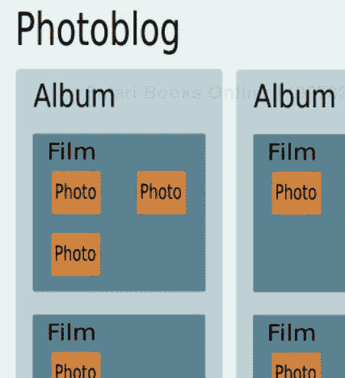

# 第五章：相册博客应用程序

在本章中，我们将解释接下来几章将要建立的内容，以开发一个相册博客应用程序。在本章的前半部分，我们将从高层次的角度回顾此应用程序的目标和功能，而不会过多地深入细节。在后半部分，我们将定义我们的应用程序将操作的对象以及介绍对象关系映射的概念，该概念旨在减少关系数据库和面向对象软件设计之间的阻抗不匹配。我们将简要介绍最常用的 Python ORM，然后基于 Dejavu ORM 开发我们的应用程序数据访问层。

# 相册博客应用程序

在前面的章节中，我们已经详细审查了 CherryPy 的设计和功能，但尚未在 Web 应用程序的上下文中展示其使用。接下来的几章将通过开发一个相册博客应用程序来完成这项任务。

相册博客就像一个普通的博客，只不过主要内容不是文本而是照片。选择相册博客的主要原因是因为要实现的功能范围足够小，这样我们就可以集中精力进行设计和实现。

通过这个应用程序背后的目标是以下内容：

+   要了解如何将一个 Web 应用程序的发展切割成有意义的层次，从而展示 Web 应用程序与您桌面上的富应用程序并没有太大的不同。

+   要展示关注点的分离也可以通过使用名为 Ajax 的原则应用于 Web 界面本身。

+   介绍用于处理 Web 开发常见方面的常见 Python 包，例如数据库访问、HTML 模板、JavaScript 处理等。

# 相册博客实体

如前所述，相册博客将尽可能保持简单，以便专注于 Web 应用程序开发的其它方面。在本节中，我们将简要描述我们的相册博客将操作的对象以及它们的属性和相互关系。

简而言之，我们的相册博客应用程序将使用以下实体，并且它们将按照以下图示关联：



此图并不是我们的应用程序将看起来是什么样子，但它显示了我们的应用程序将操作的对象。一个相册博客将包含多个相册，而每个相册又可以包含所需数量的影片，这些影片将携带照片。

换句话说，我们将按照以下实体结构设计我们的应用程序：

**实体：** 相册博客

**角色：** 此实体将是应用程序的根。

**属性：**

+   `名称：` 博客的唯一标识符

+   `标题：` 博客的公共标签

**关系：**

+   一个相册博客可以有零个或多个相册

**实体：** 相册

**角色：** 相册作为照片讲述故事的外壳。

**属性：**

+   `名称：` 相册的唯一标识符

+   `title:` 专辑的公共标签

+   `author:` 专辑的作者姓名

+   `description:` 在源中使用的专辑的简单描述

+   `story:` 与专辑关联的故事

+   `created:` 专辑创建的时间戳

+   `modified:` 专辑修改的时间戳

+   `blog_id:` 处理专辑的博客的引用

**关系：**

+   一张专辑可以参考零到多部电影

**实体：** 电影

**角色：** 一部电影汇集了一组照片。

**属性：**

+   `name:` 电影的唯一标识符

+   `title:` 电影的公共标签

+   `created:` 电影创建的时间戳

+   `modified:` 电影修改的时间戳

+   `album_id:` 对专辑的引用

**关系：**

+   一部电影可以参考零到多张照片

**实体：** 照片

**角色：** 我们应用程序的单位是一张照片。

**属性：**

+   `name:` 照片的唯一标识符

+   `legend:` 与照片关联的图例

+   `filename:` 硬盘上照片的基本名称

+   `filesize:` 照片的字节数大小

+   `width:` 照片的像素宽度

+   `height:` 照片的像素高度

+   `created:` 照片创建的时间戳

+   `modified:` 照片修改的时间戳

+   `film_id:` 指向携带照片的电影的引用

**关系：** 无

从功能上讲，照片博客应用程序将通过传统的**CRUD**接口（**创建、检索、更新**和**删除**）提供 API 来操作这些实体。我们将在第六章中对此进行更详细的阐述。

现在我们简要介绍了接下来几章我们将开发的应用程序类型，我们可以继续到下一节，并开始审查处理应用程序数据库方面的选项。但在开始之前，让我们快速了解一下本章将使用的术语表。

# 词汇

这里是我们将要使用的术语列表：

+   持久性：持久性是数据项在操作它们的程序执行后仍然存在的概念。简单来说，它是在持久存储介质（如磁盘）中存储数据的过程。

+   数据库：数据库是有组织的数据集合。有不同类型的组织模型：层次型、网络型、关系型、面向对象型等。数据库持有其数据的逻辑表示。

+   数据库管理系统（DBMS）：DBMS 是一组相关的软件应用程序，用于在数据库中操作数据。DBMS 平台应在其他功能中提供以下功能：

    +   数据的持久性

    +   用于操作数据的查询语言

    +   并发控制

    +   安全控制

    +   完整性控制

    +   事务能力

我们将使用**DBMSes**作为 DBMS 的复数形式。

# DBMS 概述

在本节中，我们将快速回顾现有的不同类型的数据库管理系统（DBMS）。目标是快速介绍它们的主要特性。

## 关系型数据库管理系统（RDBMS）

在所有数据库管理系统（DBMS）中，关系数据库管理系统（RDBMS）是最常见的，无论是小型应用还是跨国基础设施。RDBMS 包含基于关系模型概念的数据库，这是一个允许通过关系逻辑表示数据集合的数学模型。关系数据库应该是关系模型的具体实现。然而，现代的关系数据库只遵循该模型到一定程度。

下表展示了关系模型术语与关系数据库实现之间的关联。

| 关系模型 | 关系数据库 |
| --- | --- |
| 关系 | 表 |
| 属性 | 列 |
| 元组 | 行 |

关系数据库支持一组类型来定义列可以使用的域范围。然而，支持的类型数量有限，这可能会在面向对象设计中允许的复杂数据类型中成为一个问题。

**结构化查询语言**，更常被称为**SQL**，是用于定义、操作或控制关系数据库中数据的语言。

下表是 SQL 关键字及其上下文的快速总结。

| 上下文 | 关键字 |
| --- | --- |
| 数据操作 | SELECT, INSERT, UPDATE, DELETE |
| 数据定义 | CREATE, DROP, ALTER |
| 数据控制 | GRANT, REVOKE |
| 事务 | START, COMMIT, ROLLBACK |

这些关键字的组合称为 SQL 语句。当执行时，一个 SQL 语句返回与查询匹配的数据行集合或无结果。

关系模型代数使用关系组合来组合不同集合的操作；这在关系数据库上下文中通过**连接**来实现。连接表允许复杂的查询被塑形以过滤数据。

SQL 提供了以下三种类型的连接：

| 联合类型 | 描述 |
| --- | --- |
| INNER JOIN | 两个表之间的交集。 |
| LEFT OUTER JOIN | 通过左表限制结果集。因此，左表的所有结果都将与右表中的匹配结果一起返回。如果没有找到匹配的结果，它将返回一个 NULL 值。 |
| RIGHT OUTER JOIN | 与 LEFT OUTER JOIN 相同，只是表顺序相反。 |

没有用 Python 编写的 RDBMS，但大多数 RDBMS 可以通过相应的 Python 库访问。

## 面向对象数据库管理系统（OODBMS）

一个面向对象的数据库管理系统（OODBMS）使用面向对象模型来组织和存储信息。换句话说，OODBMS 允许对象被存储，而无需映射到不同的数据结构，如关系数据库。这意味着数据库持久化数据和封装它的应用层之间具有很高的一致性。事实上，持久化机制对开发者来说是不可见的。

## XML 数据库管理系统（XMLDBMS）

**原生 XML 数据库**（**NXDs**）使用 XML 文档作为它们存储和操作的数据单元。基于 NXDs 的 XML 数据库管理系统（XMLDBMSes）在这方面进行了优化，并提供了对标准 XML 选择和查询语言（如 XPath 和 XQuery）的原生支持。一些现代 RDBMS 通过引入 XML 数据库要求，利用 XML 和关系数据模型之间的透明转换来提供 XML 支持。

# 对象关系映射

在过去十五年里，软件行业已经转向在软件应用开发的各个层次上普遍使用面向对象建模范式。一直抵抗这一浪潮的最后堡垒之一是数据库领域。尽管如此，多年来已经进行了相当重要且成功的工作，以开发面向对象数据库管理系统（OODBMSes）来填补管理数据的空白。尽管如此，OODBMSes 还没有足够地起飞，以至于能够抢走 RDBMS 的风头。

这背后有几个因素：

+   改变市场的成本。几十年来，关系型数据库管理系统（RDBMS）一直是存储和组织数据的首选数据库管理系统。大多数企业已经围绕 RDBMS 构建了他们的基础设施，改变这种状态是一项巨大的任务，而且只有少数人愿意为这种风险付费。

+   迁移现有数据的成本。即使一家公司准备进入新项目的新方向，它也不太可能对现有基础设施进行迁移，因为迁移和集成的成本会太高。

+   缺乏统一的查询语言。

+   缺乏第三方软件，例如基于 OODBMS 的报告工具。

+   缺乏专家。找到一个 RDBMS 的数据库管理员比找到一个 ODBMS 的数据库管理员容易得多。

**对象关系映射器**（**ORMs**）之所以成功，是因为它们是针对一些列举问题的有效且经济的解决方案。对象关系映射背后的原则是通过最小侵入来减少两种模型之间的阻抗不匹配。ORM 允许数据库设计者和管理员保持他们钟爱的关系型数据库管理系统（RDBMS），同时在一定程度上向软件开发者提供一个面向对象的接口。ORM 是数据库和应用程序之间的一层额外层，它将对象转换为数据库行，反之亦然。

然而，重要的是要记住，ORM 只能在一定程度上缓解这个问题，并且在某些情况下，关系和对象设计之间的差异可能无法在没有双方妥协的情况下得到满足。例如，大多数 ORM 将数据库表关联到一个类中，这在实体和它们的关系保持基本水平时工作得很好。不幸的是，这种表和类之间的一对一关系在更复杂的面向对象设计中并不总是工作得很好。在这种情况下，关系和面向对象模型之间的阻抗不匹配可能迫使设计者做出让步，这可能会在长期扩展和维护软件时产生负面影响。

## Python 对象关系映射器

本节将通过一个非常基本的示例介绍三个 ORM，以便提供对它们如何工作及其差异的基本理解。目的不是宣布其中一个 ORM 为胜者，而是给你一个关于它们设计和功能的想法。

我们将要介绍的三个 ORM 是：

+   SQLObject 来自伊恩·比京克

+   SQLAlchemy 来自迈克尔·贝耶

+   Dejavu 来自罗伯特·布鲁尔

尽管在这一节中已经非常小心谨慎，但当你阅读这一章时，这些产品可能已经有所变化。你将需要参考它们的官方文档。

在以下示例中，我们将映射以下实体：

+   艺术家：艺术家由一个名称组成。艺术家可以有零个或多个专辑。

+   专辑：专辑由标题和发行年份组成。专辑与艺术家相关联，可以包含零个或多个歌曲。

+   歌曲：一首歌由一个名称和在专辑中的位置组成。一首歌与一个专辑相关联。

这个示例应该被视为我们在本章开头定义的 photoblog 实体集的一个简化版本，以便专注于每个 ORM 的实际功能，而不是实体本身。

第一步：**映射实体**

**SQLObject**

```py
from sqlobject import *
class Song(SQLObject):
title = StringCol()
position = IntCol()
album = ForeignKey('Album', cascade=True)
class Album(SQLObject):
title = StringCol()
release_year = IntCol()
artist = ForeignKey('Artist', cascade=True)
songs = MultipleJoin('Song', orderBy="position")
class Artist(SQLObject):
# Using alternateID will automatically
# create a byName() method
name = StringCol(alternateID=True, unique=True)
albums = MultipleJoin('Album')

```

需要注意的第一点是，SQLObject 不需要单独声明在类内部进行的映射。每个类都必须继承自无侵入性的 `SQLObject` 类，以便由 SQLObject 管理，并且属性将由 SQLObject 透明地映射到表的列中。SQLObject 自动添加一个 `id` 属性来保存每个对象的唯一标识符。这意味着由 SQLObject 映射的每个表都必须有一个主键。

`ForeignKey` 或 `MultipleJoin` 是定义实体之间关系的一个例子。请注意，它们需要一个字符串形式的类名，而不是类对象本身。这允许在不每个类在模块作用域内先存在的情况下声明关系。换句话说，`Artist` 和 `Album` 可以在两个不同的模块中声明，而不会出现交叉导入的问题。

当在类的一个属性中将`alternateID`指定为参数时，SQLObject 提供了一个有用的功能。通过使用它，SQLObject 向类添加了一个新方法，形式如上例所示。注意您也可以在那个级别上指定检索行时必须如何排序。

最后请注意，默认情况下，SQLObject 会对每个修改过的属性自动提交到数据库，这可能会增加网络开销，如果在发生错误时破坏数据库完整性。为了解决这个问题，SQLObject 提供了一个在 SQLObject 对象上的`set`方法，它为所有修改执行一个单一的`UPDATE`查询，从而限制所需的带宽。此外，SQLObject 支持事务的概念，允许我们确保操作对数据库是原子的，如果发生错误，则可以回滚。请注意，事务必须由开发者显式请求。

**SQLAlchemy**

```py
from sqlalchemy import *
artist_table = Table('Artist', metadata,
Column('id', Integer, primary_key=True),
Column('name', String(), unique=True))
song_table = Table('Song', metadata,
Column('id', Integer, primary_key=True),
Column('title', String()),
Column('position', Integer),
Column('album_id', Integer,
ForeignKey('Album.id')))
album_table = Table('Album', metadata,
Column('id', Integer, primary_key=True),
Column('title', String()),
Column('release_year', Integer),
Column('artist_id', Integer,
ForeignKey('Artist.id')))
class Artist(object):
def __init__(self, name):
self.id = None
self.name = name
class Album(object):
def __init__(self, title, release_year=0):
self.id = None
self.title = title
self.release_year = release_year
class Song(object):
def __init__(self, title, position=0):
self.id = None
self.title = title
self.position = position
song_mapper = mapper(Song, song_table)
album_mapper = mapper(Album, album_table,
properties = {'songs': relation(song_mapper,
cascade="all, delete-orphan")
})
artist_mapper = mapper(Artist, artist_table,
properties = {'albums': relation(album_mapper,
cascade="all, delete-orphan")
})

```

SQLAlchemy 使用您可以看到的声明式映射风格。第一步是将表表达为其 Python 语法的对应物。然后我们需要声明应用程序将操作的那个类。注意它们不需要从`SQLAlchemy`类继承，尽管它们必须从内置的 Python 对象类继承。最终，我们通过`mapper`函数将这两个方面映射，该函数还允许我们通知 SQLAlchemy 实体之间的关系。

您会注意到，与 SQLObject 和 Dejavu 不同，每个表的标识符都是显式声明的。同样，您在那个级别上不指定如何排序检索到的行，因为这将在查询级别指定。

**Dejavu**

```py
from dejavu import Unit, UnitProperty
class Song(Unit):
title = UnitProperty(unicode)
position = UnitProperty(int)
album_id = UnitProperty(int, index=True)
class Album(Unit):
title = UnitProperty(unicode)
release_year = UnitProperty(int)
artist_id = UnitProperty(int, index=True)
def songs(self):
return self.Song()
songs = property(songs)
def artist(self):
return self.Artist()
artist = property(artist)
def on_forget(self):
for song in self.Song():
song.forget()
class Artist(Unit):
name = UnitProperty(unicode)
def albums(self):
return self.Album()
albums = property(albums)
def on_forget(self):
for album in self.Album():
album.forget()
Album.one_to_many('ID', Song, 'album_id')
Artist.one_to_many('ID', Album, 'artist_id')

```

与 SQLObject 类似，Dejavu 在底层做了很多工作。每个参与映射的类都必须继承自`Unit`。类的属性代表表的列。实体之间的关系是通过一个更声明式的接口来完成的。

Dejavu 与其他两个的区别在于它不提供级联删除功能。这意味着这必须通过定义一个`on_forget()`方法并在删除单元时指定应执行哪些任务来自类本身来完成。这乍一看可能像是一个缺点，但实际上提供了如何传播级联删除的良好粒度。

第 2 步：**设置数据库访问**

**SQLObject**

```py
# Create a connection to a SQLlite 'in memory' database
sqlhub.processConnection =
connectionForURI('sqlite:/:memory:?debug=True')

```

**SQLAlchemy**

```py
# Inform SQLAlchemy of the database we will use
# A SQLlite 'in memory' database
# Mapped into an engine object and bound to a high
# level meta data interface
engine = create_engine('sqlite:///:memory:', echo=True)
metadata = BoundMetaData(engine)

```

**Dejavu**

```py
# Create the global arena object
arena = dejavu.Arena()
arena.logflags = dejavu.logflags.SQL + dejavu.logflags.IO
# Add a storage to the main arena object
conf = {'Database': ":memory:"}
arena.add_store("main","sqlite", conf)
# Register units the arena will be allowed to handle
# This call must happen after the declaration of the units
# and those must be part of the current namespace
arena.register_all(globals())

```

第 3 步：**操作表**

**SQLObject**

```py
def create_tables():
Album.createTable()
Song.createTable()
Artist.createTable()
def drop_tables():
Song.dropTable()
Artist.dropTable()
Album.dropTable()

```

**SQLAlchemy**

```py
def create_tables():
artist_table.create(checkfirst=True)
album_table.create(checkfirst=True)
song_table.create(checkfirst=True)
def drop_tables():
artist_table.drop(checkfirst=False)
song_table.drop(checkfirst=False)
album_table.drop(checkfirst=False)

```

**Dejavu**

```py
def create_tables():
arena.create_storage(Song)
arena.create_storage(Album)
arena.create_storage(Artist)
def drop_tables():
arena.drop_storage(Song)
arena.drop_storage(Album)
arena.drop_storage(Artist)

```

第 4 步：**加载数据**

**SQLObject**

```py
# Create an artist
jeff_buckley = Artist(name="Jeff Buckley")
# Create an album for that artist
grace = Album(title="Grace", artist=jeff_buckley, release_year=1994)
# Add songs to that album
dream_brother = Song(title="Dream Brother", position=10, album=grace)
mojo_pin = Song(title="Mojo Pin", position=1, album=grace)
lilac_wine = Song(title="Lilac Wine", position=4, album=grace)

```

**SQLAlchemy**

```py
session = create_session(bind_to=engine)
jeff_buckley = Artist(name="Jeff Buckley")
grace = Album(title="Grace", release_year=1994)
dream_brother = Song(title="Dream Brother", position=10)
mojo_pin = Song(title="Mojo Pin", position=1)
lilac_wine = Song(title="Lilac Wine", position=4)
grace.songs.append(dream_brother)
grace.songs.append(mojo_pin)
grace.songs.append(lilac_wine)
jeff_buckley.albums.append(grace)
session.save(jeff_buckley)
session.flush()

```

注意到每个对象都是独立于其他对象创建的，并且它们的关系是在第二步中完成的，例如`grace.songs`对象的`append()`方法。

与上述声明式精神相同，SQLAlchemy 默认不会自动提交到数据库。相反，它将操作延迟到您`flush`当前工作会话时。

**Dejavu**

```py
sandbox = arena.new_sandbox()
# Create an artist unit
jeff_buckley = Artist(name="Jeff Buckley")
sandbox.memorize(jeff_buckley)
grace = Album(title="Grace", release_year=1994)
sandbox.memorize(grace)
# Add the album unit to the artist unit
jeff_buckley.add(grace)
dream_brother = Song(title="Dream Brother", position=10)
sandbox.memorize(dream_brother)
mojo_pin = Song(title="Mojo Pin", position=1)
sandbox.memorize(mojo_pin)
lilac_wine = Song(title="Lilac Wine", position=4)
sandbox.memorize(lilac_wine)
# Add each song unit to the album unit
grace.add(dream_brother)
grace.add(mojo_pin)
grace.add(lilac_wine)
sandbox.flush_all()

```

Dejavu 提供了沙盒的概念，在其中你可以隔离你操作的实体。此外，请注意，新创建的单位在你调用 `sandbox.memorize()` 方法之前并不存在于它们的相对者中，这个方法将单位放入沙盒中。

与 SQLAlchemy 类似，Dejavu 会延迟提交操作，直到你显式调用 `sandbox.flush_all()` 方法。

第 5 步：**操作数据**

首先，我们定义一个函数，它将接受一个艺术家并显示专辑的歌曲。

```py
def display_info(artist):
for album in artist.albums:
message = """
%s released %s in %d
It contains the following songs:\n""" % (artist.name,
album.title,
album.release_year)
for song in album.songs:
message = message + " %s\n" % (song.title, )
print message

```

**SQLObject**

```py
# Retrieve an artist by his name
buckley = Artist.byName('Jeff Buckley')
display_info(buckley)
# Retrieve songs containing the word 'la' from the given artist
# The AND() function is provided by the SQLObject namespace
songs = Song.select(AND(Artist.q.name=="Jeff Buckley",
Song.q.title.contains("la")))
for song in songs:
print " %s" % (song.title,)
# Retrieve all songs but only display some of them
songs = Song.select()
print "Found %d songs, let's show only a few of them:" %
(songs.count(), )
for song in songs[1:-1]:
print " %s" % (song.title,)
# Retrieve an album by its ID
album = Album.get(1)
print album.title
# Delete the album and all its dependencies
# since we have specified cascade delete
album.destroySelf()

```

**SQLAlchemy**

```py
session = create_session(bind_to=engine)
# Retrieve an artist by his name
buckley = session.query(Artist).get_by(name='Jeff Buckley')
display_info(buckley)
# Retrieve songs containing the word 'la' from the given artist
songs = session.query(Song).select(and_(artist_table.c.name=="Jeff
Buckley",
song_table.c.title.like
("%la%")))
for song in songs:
print " %s" % (song.title,)
# Retrieve all songs but only display some of them
# Note that we specify the order by clause at this level
songs = session.query(Song).select(order_by=[Song.c.position])
print "Found %d songs, let's show only a few of them:" % (len(songs),)
for song in songs[1:-1]:
print " %s" % (song.title,)
# Retrieve an album by its ID
album = session.query(Album).get_by(id=1)
print album.title
# Delete the album and all its dependencies
# since we have specified cascade delete
session.delete(album)
session.flush()

```

**Dejavu**

```py
sandbox = arena.new_sandbox()
# Retrieve an artist by his name
buckley = sandbox.Artist(name="Jeff Buckley")
display_info(buckley)
# Retrieve songs containing the word 'la' from the given artist
# We will explain in more details the concepts of Expressions
f = lambda ar, al, s: ar.name == "Jeff Buckley" and "la" in s.title
# Note how we express the composition between the units
results = sandbox.recall(Artist & Album & Song, f)
for artist, album, song in results:
print " %s" % (song.title,)
# Retrieve all songs but only display some of them
songs = sandbox.recall(Song)
print "Found %d songs, let's show only a few of them:" % (len(songs),)
for song in songs[1:-1]:
print " %s" % (song.title,)
# Retrieve an album by its ID
album = sandbox.Album(ID=1)
print album.title

```

选择对象关系映射器是一个困难的任务，因为通常只有在使用了一段时间之后，你才能真正衡量它对开发设计和流程的影响。如前所述，承认 ORM 不能消除关系模型和面向对象模型之间的阻抗不匹配是至关重要的。

SQLObject 具有较低的学习曲线和相当大的社区，这使得它适合那些刚开始使用 ORM 的开发者。该项目正致力于其下一个版本，该版本将修复其在早期生活中做出的许多不良设计决策，同时逐渐放弃当前版本。

SQLAlchemy 基于来自 Java 世界的 Hibernate ORM 进行设计，因此避免了 SQLObject 没有避免的许多陷阱。它的声明性语法可能不会让每个 Python 程序员都满意，但它的灵活性和良好的文档使 SQLAlchemy 成为该领域一个非常严肃的候选人。

Dejavu 是一个相对不太为人所知的 ORM，因此拥有一个较小的社区。它有很好的文档，并附带相关的示例案例。它的优势在于能够通过提供一个非常高级的接口，使用常见的 Python 习惯用法，从而摆脱底层的关系数据库层。

例如，SQLObject 和 SQLAlchemy 使用诸如`table`、`column`或`select`之类的术语，而 Dejavu 则使用`storage`和`unit`，这为底层机制提供了更好的抽象。

当涉及到构建查询的过程时，这也是正确的。与提供 Python 接口到 SQL 语句并非常接近 SQL 的 SQLObject 和 SQLAlchemy 不同，Dejavu 提供了一个独立于 SQL 的接口。查看关于操作数据的部分以获取示例。

正是因为这些原因，我们的 photoblog 应用程序将使用 Dejavu 而不是 SQLObject 或 SQLAlchemy。然而，请记住，它们都是优秀且强大的 ORM。

# Photoblog 应用实体建模

首先，我们定义一个我们将称之为`存储`模块的东西，它提供了一个简单的接口来执行一些常见操作，如连接到数据库。

```py
import dejavu
arena = dejavu.Arena()
from model import Photoblog, Album, Film, Photo
def connect():
conf = {'Connect': "host=localhost dbname=photoblog user=test
password=test"}
arena.add_store("main", "postgres", conf)
arena.register_all(globals())

```

在这种情况下，我们导入`dejavu`模块，并创建一个全局的`Arena`类实例。`arena`将是底层存储管理器和业务逻辑层之间的接口。

`connect` 函数将存储管理器添加到 PostgreSQL RDBMS 的 `arena` 对象中，然后注册所有导入的实体，以便 `arena` 对象知道它将管理哪些实体。（请参阅 Dejavu 文档以获取支持的数据库管理器列表以及如何在 `add_store()` 方法中声明它们。）一旦我们有了这个模块，我们就可以开始映射实体。

## 映射实体

实体的映射是通过以下过程完成的：

+   创建继承自 `Unit` 的类

+   使用 `UnitProperty` 类添加属性

+   设置单位之间的关系

**实体：** 照片博客

```py
from dejavu import Unit, UnitProperty
from engine.database import arena
from album import Album
class Photoblog(Unit):
name = UnitProperty(unicode)
title = UnitProperty(unicode)
def on_forget(self):
for album in self.Album():
album.forget()
Photoblog.one_to_many('ID', Album, 'blog_id')

```

**实体：** 专辑

```py
import datetime
from dejavu import Unit, UnitProperty
from engine.database import arena
from film import Film
class Album(Unit):
name = UnitProperty(unicode)
title = UnitProperty(unicode)
author = UnitProperty(unicode)
description = UnitProperty(unicode)
content = UnitProperty(unicode, hints={u'bytes': 0})
created = UnitProperty(datetime.datetime)
modified = UnitProperty(datetime.datetime)
blog_id = UnitProperty(int, index=True)
def on_forget(self):
for film in self.Film():
film.forget()
Album.one_to_many('ID', Film, 'album_id')

```

**实体：** 电影

```py
import datetime
from dejavu import Unit, UnitProperty
from engine.database import arena
from photo import Photo
class Film(Unit):
name = UnitProperty(unicode)
title = UnitProperty(unicode)
created = UnitProperty(datetime.datetime)
modified = UnitProperty(datetime.datetime)
album_id = UnitProperty(int, index=True)
def on_forget(self):
for photo in self.Photo():
photo.forget()
Film.one_to_many('ID', Photo, 'film_id')

```

**实体：** 照片

```py
import datetime
from dejavu import Unit, UnitProperty
from engine.database import arena
class Photo(Unit):
name = UnitProperty(unicode)
legend = UnitProperty(unicode)
filename = UnitProperty(unicode)
filesize = UnitProperty(int)
width = UnitProperty(int)
height = UnitProperty(int)
created = UnitProperty(datetime.datetime)
modified = UnitProperty(datetime.datetime)
film_id = UnitProperty(int, index=True)

```

## 单位和单位属性

在上一节中，我们将我们的实体映射到 Dejavu 将管理的单位。我们所有的类都继承自 `Unit` 基类。这个类除了自动为类添加一个 `ID` 属性之外，没有提供太多功能，这也是为什么我们在任何单位中都没有显式提供它的原因。尽管如此，通过继承 `Unit` 类，你允许 Dejavu 注册和处理你的类。

下一步显然是使用 `UnitProperty` 类添加属性到你的类中，该类具有以下签名：

```py
UnitProperty(type=unicode, index=False,
hints=None, key=None, default=None)

```

+   `type` 参数是 Python 类型。Dejavu 会透明地将它转换为适当的 SQL 等价类型。

+   `index` 参数表示如果 RDBMS 支持，列是否应该被索引。

+   `hints` 参数是一个字典，用于帮助 Dejavu 存储管理器优化列的创建。Dejavu 有三个内置提示，但如果你创建了自己的存储管理器，你也可以提供自己的提示：

    +   `bytes:` 表示用于 unicode 属性的字节数，0 表示无限。

    +   `scale:` 数值列小数点右边的数字数量。

    +   `precision:` 数值列中的数字总数。

+   `key` 参数是属性的规范名称。

+   `default` 参数表示要使用的默认值。

属性将映射到关系数据库表中的列。

## 关联单位

关联单位是赋予你的设计形状的手段。实体是砖块，关系是灰泥。

Dejavu 支持以下常见关系：

+   一对一（1, 1）

+   一对多（1, n）

+   多对一（n, 1）

在每种情况下，你提供以下签名：

```py
nearClass(nearKey, farClass, farKey)

```

因此，`Film` 和 `Photo` 之间的关系是：

```py
Film.one_to_many('ID', Photo, 'film_id')

```

`nearClass` 是 `Film`，`nearKey` 是 `ID`（`nearClass` 的属性），`farClass` 是 `Photo`，`farKey` 是 `film_id`（`farClass` 的属性）。

Dejavu 不提供原生的多对多关系，但可以通过第三个单位类和一对一关系来实现。

## 沙盒接口

`sandbox` 对象以受保护的方式管理分配给单位的内存。`sandbox` 是单位度过其生命的地方。有两种创建 `sandbox` 的方法：

```py
box = arena.create_sandbox()
box = dejavu.Sandbox(arena)

```

前者是最常见的版本，也是我们将在整本书中使用的版本。

让我们回顾一下`sandbox`接口的一些关键方法：

+   `memorize:` 当你创建一个单元的新实例时，它只存在于内存中，并且与存储管理器分离。你需要调用`memorize`方法使其成为`sandbox`的一部分。这将也会设置单元的`ID`。此外，这还会通过发出一个`INSERT INTO SQL`语句在底层数据库中预留一个位置。

+   `forget:` 为了告诉存储管理器停止管理一个单元，你必须调用`forget`方法。这将把它从`sandbox`和存储管理器中删除。

+   `repress:` 在某些情况下，你可能希望从`sandbox`中清除单元，但不是从存储管理器中。在这种情况下，你应该使用`repress`方法。

+   `recall, xrecall:` 这两个方法允许你根据过滤器检索单元（正如我们将在*单元查询*部分中解释的）。`recall`和`xrecall`之间的区别在于后者以迭代方式产生结果，而前者一次性将所有内容加载到列表中。

+   `unit:` 这两个先前的方法都是强大的数据集检索方法，但当你仅仅基于属性值查找一个单元时，它们可能会很重。这就是`unit`方法提供的内容。

+   `flush_all:` 一旦你操作了你的单元，你必须调用`flush_all`以使这些更改应用到物理后端。

正如你所见，`Sandbox`类提供的接口相当简单、直接，而且非常强大，下一节将演示这一点。

# 单元查询

我们已经看到了如何将我们的实体映射到单元以及如何操作这些单元。本节将详细解释如何根据标准查询存储管理器中的单元。

在 Dejavu 中，查询是通过一个`Expression`实例完成的。`Expression`类是单元的过滤器。让我们通过一个例子来解释它是如何工作的。

```py
# Search for all photographs with a width superior to 300 pixels
f = lambda x: x.width > 300
box.recall(Photo, f)

```

第一步是创建一个返回`bool`值的函数。这个函数通常是`lambda`，因为没有必要用无意义的名称污染 Python 命名空间。然后我们将其传递给`sandbox`方法之一，如`recall`或`xrecall`，这将创建一个`logic.Expression`实例并应用它。

表达式在过滤复杂查询时显示其值，例如涉及 JOIN 的查询。例如，如果你想在不同单元之间进行连接，你会在单元本身之间使用 Python 运算符。

```py
# Search for all photographs of width superior to 300 pixels
# within albums created by Sylvain
box.recall(Album & Photo, lambda a,
p: a.author == "Sylvain" and p.width > 300)

```

正如你所见，方法的第一个参数接受一个将参与连接的单元类的聚合。Dejavu 给你使用 Python 运算符来声明单元之间聚合的机会。

在单元之间组合时，构建`filter`函数的顺序很重要。在先前的例子中，`lambda`函数的参数将与组合单元的顺序相匹配。这种行为通过`recall()`方法返回的结果得到了反映，该方法将提供一个包含`Album`和`Photo`项的列表。

下面是 Dejavu 表示的 SQL JOIN。

| 连接类型 | 操作符 | 描述 |
| --- | --- | --- |
| 内连接 | & 或 + | 将返回两个类中所有相关联的配对。 |
| 左外连接 | << | 将返回两个类中所有相关联的配对。此外，如果类 1 中的任何单元在类 2 中没有匹配项，我们将返回一个包含单元 1 和一个**空单元**（一个所有属性都是 None 的单元）的单行。 |
| 右外连接 | >> | 将返回两个类中所有相关联的配对。此外，如果类 2 中的任何单元在类 1 中没有匹配项，我们将返回一个包含空单元（一个所有属性都是 None 的单元）和单元 2 的单行。 |

Dejavu 对您构建的聚合没有限制。例如，您可以编写：

```py
(Film << Album) & Photo

```

# 扩展数据访问层

在前面的章节中，我们已经定义了我们的实体与我们的应用程序将要操作的类之间的映射。就目前而言，这些类并不是非常有用；在本节中，我们将看到如何扩展它们以提供更多功能。为了使本节简明扼要，我们只讨论`Album`类。

需要添加到专辑类中的方法：

```py
def films(self):
"""Returns all the attached films
album = Album()
...
for film in album.films:
...
"""
return self.Film()
films = property(films)
def get_all(cls):
"""Returns all the existing albums
for album in Album.albums:
...
"""
sandbox = arena.new_sandbox()
return sandbox.recall(Album)
albums = classmethod(get_all)
def fetch(cls, id):
"""Fetch one album by id"""
sandbox = arena.new_sandbox()
return sandbox.unit(Album, ID=int(id))
fetch = classmethod(fetch)
def fetch_range(cls, start, end):
"""Fetch a range of albums which ID falls into the
specified range.
# This could return up to 5 albums
albums = Album.fetch_range(4, 9)
for album in albums:
...
"""
sandbox = arena.new_sandbox()
# dejavu's views change the capacity of dejavu to
# perform operations on a Unit
# here we create a view of the Album unit so that only
# the created and ID properties appear in the
# result of the view. A view yields values
# not units unlike recall or xrecall.
v = list(sandbox.view(Album, ['created', 'ID']))
v.sort()
photoblogdata access layer, extendingsize = len(v)
if end > size and start >= size:
return None
elif end > size and start < size:
end = size
# row[0] is the 'created' property value
# row[1] is the 'ID' property value
targets = [row[1] for row in v[start:end]]
return sandbox.recall(Album, lambda x: x.ID in targets)
fetch_range = classmethod(fetch_range)
def create(self, photoblog, name, title, slug, author, description,
content):
"""Instanciates the Album,
adds it to the passed photoblog and
persists the changes into the database"""
sandbox = photoblog.sandbox
self.name = name
self.title = title
self.author = author
self.description = description
self.content = content
self.created = datetime.datetime.now().replace(microsecond=0)
self.modified = album.created
self.blog_id = photoblog.ID
sandbox.memorize(self)
photoblog.add(self)
sandbox.flush_all()
def update(self, name, title, slug, author, description, content):
"""Updates the attributes of an album and
persists the changes into the storage"""
self.title = title
self.slug = slug
self.author = author
self.description = description
self.content = content
self.modified = datetime.datetime.now().replace(microsecond=0)
self.sandbox.flush_all()
def delete(self):
"""Delete the album from the storage"""
self.sandbox.forget(album)
def to_dict(self):
"""Return an album as a Python dictionary"""
return {'id': self.ID,
'uuid': self.uuid,
'title': self.title,
'author': self.author,
'description': self.description,
'content': self.content,
'created': self.created.strftime("%d %b. %Y, %H:%M"),
'modified': self.modified.strftime("%d %b. %Y, %H:%M")}
def to_json(self):
"""JSONify an album properties"""
return simplejson.dumps(self.to_dict())

```

如您所见，`Album`类现在包含足够的方法，允许操作`Album`实例。其他照片博客实体采用相同的概念，并将提供类似的接口。

# 概述

本章通过描述我们的照片博客应用程序的实体及其在 Python 中的映射，介绍了我们应用程序的骨架。我们下一章将回顾如何从我们的 CherryPy 处理器中操作这些实体，以构建我们应用程序的外部接口。
