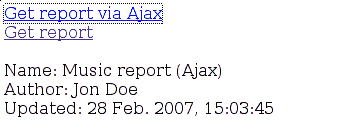
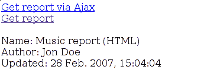
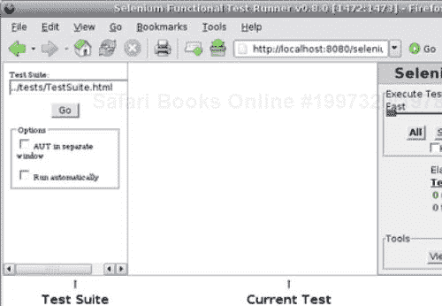
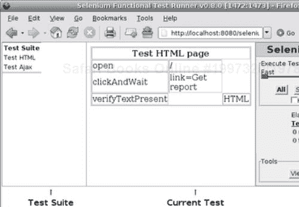
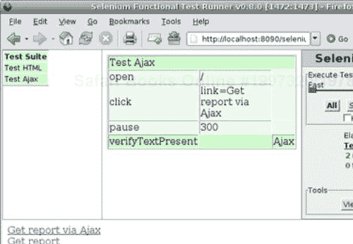
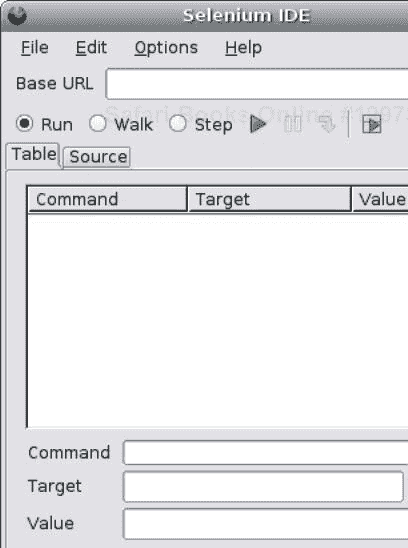
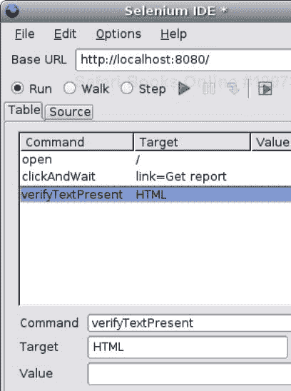
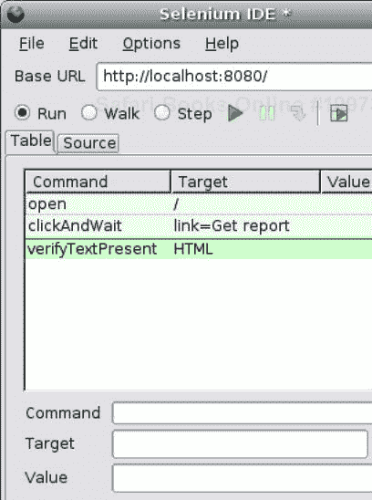

# 第九章：测试

到目前为止，我们已经回顾了构建照片博客应用程序所涉及的不同步骤，但我们还没有测试我们的设计和实现。本章将介绍一些测试技术，例如使用开源产品如 unittest、CherryPy webtest、FunkLoad 和 Selenium 进行的单元测试、功能测试和负载测试。到本章结束时，你应该能够很好地理解如何在特定环境中使用这些工具，并改进你应用程序的测试套件。

# 为什么需要测试

为什么需要测试，有些人可能会问？它能为应用程序带来任何价值吗？你可能会认为，如果你的代码中发现了问题，它将被报告并最终得到修复。因此，你可能会认为测试相当无关紧要且耗时。如果你确实这样认为，那么在本章的帮助下，我们将尝试向你展示测试不仅仅是蛋糕上的樱桃，实际上它是成功配方的一部分。

测试是一个过程，在这个过程中，从不同的角度对应用程序进行审计，以便：

+   发现错误

+   找出预期结果和实际结果、输出、状态等之间的差异。

+   理解实现的完整性

+   在发布前在现实场景中测试应用程序

测试的目标不是将责任归咎于开发者，而是提供工具来估计在特定时间点应用程序的健康状况。测试衡量应用程序的质量。

因此，测试不仅只是应用程序生命周期的一部分，实际上它是衡量应用程序在该生命周期中位置的真正晴雨表。代码行数没有意义；但测试总结和测试报告是不同项目成员可以联系起来了解已实现的内容、还需要实现的内容以及如何规划它们的参考点。

# 测试规划

从上一节中我们可以得出，由于测试对项目至关重要，因此应该对一切进行测试和审查。这是真的，但这并不意味着应该将相同数量的资源和努力分配给测试系统中的每个部分。

首先，这取决于项目在其生命周期中的位置。例如，在项目开始时进行性能测试的需求很小。如果应用程序不需要大量的硬件或网络资源，可能不需要进行容量测试。话虽如此，一些测试将在项目的整个生命周期中进行。它们将通过连续的迭代逐步建立，每次迭代都会使测试更具强度。

总结来说，测试需要提前规划，以便定义：

+   目标：测试哪些内容与其相关，以及为了什么目的？

+   范围：测试的范围包括什么？不包括什么？

+   需求：测试将涉及哪些资源（人力、软件、硬件等）？

+   风险：如果测试未通过，与该测试相关的风险是什么？将采取哪些缓解措施和行动？它是否会停止项目？影响是什么？

在规划测试时，只需记住以下几点。

另一个重要的一点是，测试一旦应用程序发布并不意味着结束。它也可以在之后进行，以确保生产发布满足定义的要求。在任何情况下，由于测试汇集了众多不同方面，因此应将其视为一个漫长、持续的过程。

# 常见测试方法

测试是对系统或应用程序上要验证的一系列方面的通用术语。以下是一个简要的常见列表：

+   单元测试：通常由开发者自己执行。单元测试旨在检查代码单元是否按预期工作。

+   可用性测试：开发者可能通常忘记他们正在为最终用户编写应用程序，而这些用户可能不了解系统，最终可能导致应用程序不可用。功能和可用性测试提供了一种确保应用程序将满足用户期望的方法。

+   功能/验收测试：虽然可用性测试检查应用程序或系统是否可用，但功能测试确保每个指定的功能都已实现。

+   加载和性能测试：一旦应用程序或系统达到一定程度的完整性，可能需要进行加载和性能测试，以了解系统是否能够应对预期的峰值负载，并找到潜在瓶颈。这可能导致更改硬件、优化 SQL 查询等。

+   回归测试：回归测试验证产品连续发布不会破坏任何之前工作的功能。在某些方面，单元测试可以被视为回归测试的一部分。

+   可靠性和弹性测试：某些应用程序或系统不能承受在任何时候崩溃。可靠性和弹性测试可以验证系统应用程序如何应对一个或多个组件的故障。

上述列表远非详尽无遗，每个系统或应用程序环境可能需要定义特定的测试类型。

# 单元测试

我们的照片博客应用程序将广泛使用单元测试来不断检查以下内容：

+   新功能按预期正确工作。

+   新代码发布不会破坏现有功能。

+   缺陷已修复且保持修复状态。

Python 提供了一个标准的 `unittest` 模块，还提供了一个 `doctest` 模块，它提供了一种不同的单元测试方法，我们将在后面解释。

## unittest

`unittest` 源于由 Kent Beck 和 Erich Gamma 开发的 Java 单元测试包 JUnit，而 JUnit 又源于 Kent Beck 开发的 Smalltalk 测试框架。现在让我们回顾一下这个模块的基本示例。

单元测试通常可以在所谓的模拟对象上工作，这些对象支持与应用程序的域对象相同的接口，但实际上并不执行任何操作。它们只是返回定义好的数据。因此，模拟对象允许我们对我们的设计接口进行测试，而无需依赖于整个应用程序的部署。它们还提供了一种从其他测试中独立运行测试的方法。

首先，让我们定义一个模拟类，如下所示：

```py
class Dummy:
def __init__(self, start=0, left_boundary=-10, right_boundary=10,
allow_positive=True, allow_negative=False):
self.current = start
self.left_boundary = left_boundary
self.right_boundary = right_boundary
self.allow_positive = allow_positive
self.allow_negative = allow_negative
def forward(self):
next = self.current + 1
if (next > 0) and (not self.allow_positive):
raise ValueError, "Positive values are not allowed"
if next > self.right_boundary:
raise ValueError, "Right boundary reached"
self.current = next
return self.current
def backward(self):
prev = self.current - 1
if (prev < 0) and (not self.allow_negative):
raise ValueError, "Negative values are not allowed"
if prev < self.left_boundary:
raise ValueError, "Left boundary reached"
self.current = prev
return self.current
def __str__(self):
return str(self.current)
def __repr__(self):
return "Dummy object at %s" % hex(id(self))

```

这个类提供了一个接口，用于在由左右边界定义的范围内获取下一个或上一个值。我们可以将其想象为一个更复杂类的模拟对象，但提供的是模拟数据。

这个类的简单用法如下：

```py
>>> from dummy import Dummy
>>> dummy = Dummy()
>>> dummy.forward()
1
>>> dummy.forward()
2
>>> dummy.backward()
1
>>> dummy.backward()
0
>>> dummy.backward()
Traceback (most recent call last):
File "<stdin>", line 1, in ?
File "dummy.py", line 27, in backward
raise ValueError, "Negative values are not allowed"
ValueError: Negative values are not allowed

```

让我们想象我们希望对这个令人兴奋的模块进行单元测试，以确保代码的正确性。

```py
import unittest
class DummyTest(unittest.TestCase):
def test_01_forward(self):
dummy = Dummy(right_boundary=3)
self.assertEqual(dummy.forward(), 1)
self.assertEqual(dummy.forward(), 2)
self.assertEqual(dummy.forward(), 3)
self.assertRaises(ValueError, dummy.forward)
def test_02_backward(self):
dummy = Dummy(left_boundary=-3, allow_negative=True)
self.assertEqual(dummy.backward(), -1)
self.assertEqual(dummy.backward(), -2)
self.assertEqual(dummy.backward(), -3)
self.assertRaises(ValueError, dummy.backward)
def test_03_boundaries(self):
dummy = Dummy(right_boundary=3, left_boundary=-3,
allow_negative=True)
self.assertEqual(dummy.backward(), -1)
self.assertEqual(dummy.backward(), -2)
self.assertEqual(dummy.forward(), -1)
self.assertEqual(dummy.backward(), -2)
self.assertEqual(dummy.backward(), -3)
self.assertRaises(ValueError, dummy.backward)
self.assertEqual(dummy.forward(), -2)
self.assertEqual(dummy.forward(), -1)
self.assertEqual(dummy.forward(), 0)
self.assertEqual(dummy.backward(), -1)
self.assertEqual(dummy.forward(), 0)
self.assertEqual(dummy.forward(), 1)
self.assertEqual(dummy.forward(), 2)

```

让我们一步一步地解释这段代码：

1.  1. 要使用`unittest`标准模块提供单元测试功能，你只需要导入该特定模块。

1.  2. 创建一个类，它继承自`unittest.TestCase`，这是为我们代码提供单元测试功能的接口。这个类被称为**测试用例**。

1.  3. 创建以单词`test`开头的方法。每个以它开头的方法都将由`unittest`内部处理程序调用。请注意，这个类定义的方法也使用两位数的模式。这并不是`unittest`的要求，但它允许我们强制方法按照我们希望的顺序调用。实际上，`unittest`按照字母数字顺序调用方法，这有时会导致意外结果。提供这样的数字是一种很好的方法来绕过这种限制。

1.  4. 调用`TestCase`类提供的不同`assert/fail`方法来执行值、异常、输出等的检查。

下一步是按照以下方式运行这个测试用例：

```py
if __name__ == '__main__':
unittest.main()

```

这假设`main()`的调用是在包含`TestCase`类的同一模块中进行的。这个测试的结果看起来如下：

```py
...
----------------------------------------------------------------------
Ran 3 tests in 0.000s
OK

```

通常会将输出设置得更加详细，如下所示：

```py
if __name__ == '__main__':
unittest.main(testRunner=unittest.TextTestRunner(verbosity=2))

```

这将产生以下输出：

```py
test_01_forward (__main__.DummyTest) ... ok
test_02_backward (__main__.DummyTest) ... ok
test_03_boundaries (__main__.DummyTest) ... ok
----------------------------------------------------------------------
Ran 3 tests in 0.000s
OK

```

现在，让我们引发一个错误，以便其中一个测试失败。在`test_01_forward`中将第一个`assertEqual`替换为以下内容：

```py
self.assertEqual(dummy.forward(), 0)

```

然后在再次运行测试时，你应该得到以下输出：

```py
test_01_forward (__main__.DummyTest) ... FAIL
test_02_backward (__main__.DummyTest) ... ok
test_03_boundaries (__main__.DummyTest) ... ok
======================================================================
FAIL: test_01_forward (__main__.DummyTest)
----------------------------------------------------------------------
Traceback (most recent call last):
File "dummy.py", line 54, in test_01_forward
self.assertEqual(dummy.forward(), 0)
AssertionError: 1 != 0
----------------------------------------------------------------------
Ran 3 tests in 0.001s
FAILED (failures=1)

```

如你所见，`unittest`模块在测试失败时不会停止处理任何剩余的测试用例。相反，它显示抛出的断言错误的跟踪信息。这里的测试是错误的，但在你的断言是有效的情况下，它将指向你的应用程序的失败。

假设我们编写了一个测试，试图在右边界小于起点时向前移动。我们假设该方法的文档告诉我们，它应该抛出一个异常，表示该类已拒绝此情况。

让我们相应地创建`test_00_construct`：

```py
def test_00_construct(self):
self.assertRaises(ValueError, Dummy, start=34)

```

让我们现在运行这个测试：

```py
test_00_construct (__main__.DummyTest) ... FAIL
test_01_forward (__main__.DummyTest) ... ok
test_02_backward (__main__.DummyTest) ... ok
test_03_boundaries (__main__.DummyTest) ... ok
======================================================================
FAIL: test_00_construct (__main__.DummyTest)
----------------------------------------------------------------------
Traceback (most recent call last):
File "dummy.py", line 50, in test_00_construct
self.assertRaises(ValueError, Dummy, start=34)
AssertionError: ValueError not raised
----------------------------------------------------------------------
unit testingunittestRan 4 tests in 0.003s
FAILED (failures=1)

```

正如你所见，新的测试用例确实失败了。原因是`Dummy.__init__()`方法没有包含任何对此情况的错误处理，这与文档告诉我们的不同。让我们通过在`__init__`方法底部添加以下代码来修复这个问题：

```py
if (start > right_boundary) or (start < left_boundary):
raise ValueError, "Start point must belong to the boundaries"

```

现在我们重新运行测试：

```py
test_00_construct (__main__.DummyTest) ... ok
test_01_forward (__main__.DummyTest) ... ok
test_02_backward (__main__.DummyTest) ... ok
test_03_boundaries (__main__.DummyTest) ... ok
----------------------------------------------------------------------
Ran 4 tests in 0.000s
OK

```

之前的例子表明，有时在实现功能本身之前编写测试是有好处的，这样可以避免设计测试以匹配代码行为。这通常被称为测试驱动开发。另一种实现方式是将应用程序或库的 API 提供给第三方，第三方将根据该 API 以中立的方式编写测试用例。无论如何，之前的例子表明，单元测试只有在测试与设计一致并且用于测试实现时才有意义。

现在我们已经介绍了`unittest`模块，让我们来介绍`doctest`模块。

## doctest

`doctest`模块支持在对象 docstring 中运行内联的 Python 代码。这种技术的优点是测试用例与它们要测试的代码非常接近。不便之处在于，一些复杂的测试可能难以用这种方式实现。让我们看看我们之前定义的类的一个例子。

```py
class Dummy:
def __init__(self, start=0, left_boundary=-10, right_boundary=10,
allow_positive=True, allow_negative=False):
"""
>>> dummy = Dummy(start=27)
Traceback (most recent call last):
...
raise ValueError, "Start point must belong to the
boundaries"
ValueError: Start point must belong to the boundaries
>>> dummy = Dummy()
>>> dummy.backward()
Traceback (most recent call last):
...
raise ValueError, "Negative values are not allowed"
ValueError: Negative values are not allowed
"""
self.current = start
self.left_boundary = left_boundary
self.right_boundary = right_boundary
self.allow_positive = allow_positive
self.allow_negative = allow_negative
if (start > right_boundary) or (start < left_boundary):
raise ValueError, "Start point must belong to the
boundaries"
def forward(self):
"""
>>> dummy = Dummy(right_boundary=3)
>>> dummy.forward()
1
>>> dummy.forward()
2
>>> dummy.forward()
3
>>> dummy.forward()
Traceback (most recent call last):
...
raise ValueError, "Right boundary reached"
ValueError: Right boundary reached
"""
next = self.current + 1
if (next > 0) and (not self.allow_positive):
raise ValueError, "Positive values are not allowed"
if next > self.right_boundary:
raise ValueError, "Right boundary reached"
self.current = next
return self.current
def backward(self):
"""
>>> dummy = Dummy(left_boundary=-3, allow_negative=True)
>>> dummy.forward()
1
>>> dummy.backward()
0
>>> dummy.backward()
-1
>>> dummy.backward()
-2
>>> dummy.backward()
-3
>>> dummy.backward()
Traceback (most recent call last):
...
raise ValueError, "Left boundary reached"
ValueError: Left boundary reached
"""
prev = self.current - 1
if (prev < 0) and (not self.allow_negative):
raise ValueError, "Negative values are not allowed"
if prev < self.left_boundary:
raise ValueError, "Left boundary reached"
self.current = prev
return self.current
def __str__(self):
return str(self.current)
def __repr__(self):
return "Dummy object at %s" % hex(id(self))

```

正如你所见，你希望测试的每个方法都必须有一个包含将直接由`doctest`模块运行的用例的 docstring。

然后你可以按照以下步骤运行测试：

```py
if __name__ == '__main__':
doctest.testmod()
sylvain@6[test]$ python dummy.py -v
Trying:
dummy = Dummy(start=27)
Expecting:
Traceback (most recent call last):
...
raise ValueError, "Start point must belong to the boundaries"
ValueError: Start point must belong to the boundaries
ok
Trying:
dummy = Dummy()
Expecting nothing
ok
Trying:
dummy.backward()
Expecting:
Traceback (most recent call last):
...
raise ValueError, "Negative values are not allowed"
ValueError: Negative values are not allowed
ok
Trying:
dummy = Dummy(left_boundary=-3, allow_negative=True)
Expecting nothing
ok
Trying:
dummy.forward()
Expecting:
1
ok

```

我们没有复制完整的输出结果，因为对于本章的目的来说，它太长了。你可以考虑，将代码和文档混合在一起可能会降低两者的效率，使得文档更难以阅读。这个担忧实际上是由`doctest`模块的文档本身提出的，它明智地建议要小心处理*docstring 示例*。确实，由于代码属于 docstring，所以在查看时也会显示出来。

```py
>>> from dummy import Dummy
>>> help(Dummy.forward)
Help on method forward in module dummy:
forward(self) unbound dummy.Dummy method
>>> dummy = Dummy(right_boundary=3)
>>> dummy.forward()
1
>>> dummy.forward()
2
>>> dummy.forward()
3
>>> dummy.forward()
Traceback (most recent call last):
...
raise ValueError, "Right boundary reached"
ValueError: Right boundary reached

```

在这种情况下，测试可以是文档的一部分，或者过于复杂，使得文档无法使用。

简而言之，`unittest`和`doctest`模块都值得根据你的需求进行审查，并且在一个项目中同时使用这两个模块以提供强大的单元测试套件是很常见的。无论如何，我们建议你阅读这两个模块的文档，这将证明其中包含的内容远不止本章所提供的简要介绍。此外，还有一个非常有信息量的邮件列表可供参考，网址为[`lists.idyll.org/listinfo/testing-in-python`](http://lists.idyll.org/listinfo/testing-in-python)。

# 单元测试 Web 应用程序

在上一节中，我们介绍了两个标准模块，用于在 Python 应用程序和包中进行单元测试。不幸的是，它们目前缺少一些常见功能，无法帮助在特定上下文中，如网络应用程序中进行测试。显然，Python 社区已经提出了解决方案，并且有几种好的扩展来增强 `unittest` 或完全独立的测试包来帮助我们。

我们将使用由 CherryPy 提供的 `unittest` 扩展，称为 `webtest`，由 Robert Brewer 开发。

此模块提供了与 CherryPy 的透明集成，并提供了一个命令行辅助工具来测试服务器的不同配置。它允许在发生失败时停止测试，当引发错误时提供对 HTTP 栈的访问，还支持代码覆盖率分析和性能分析等。总之，此模块会自动启动 CherryPy 服务器，每个测试用例都使用它来挂载 CherryPy 应用程序，以适应测试运行，并在该服务器上执行 HTTP 请求。

本节将展示我们照片博客应用程序的所有不同测试用例，但您将在应用程序的源代码中找到它们。根据我们在上一节中解释的内容，我们设计测试用例如下：

```py
class TestServicesREST(PhotoblogTest):
def test_00_REST(self):
self.getPage("/services/rest/")
self.assertStatus(404)
self.getPage("/services/rest/album/", method="XYU")
self.assertStatus(405)
def test_02_REST_GET(self):
# missing the ID
self.getPage("/services/rest/album/")
self.assertStatus(400)
# missing the Accept header
self.getPage("/services/rest/album/2")
self.assertStatus(406)
# wrong ID type
self.getPage("/services/rest/album/st",
headers=[("Accept", "application/json")])
self.assertStatus(404)
self.getPage("/services/rest/album/2",
headers=[("Accept", "application/json")])
self.assertStatus(200)
self.assertHeader('Content-Type', 'application/json')
self.assertHeader('Allow', 'DELETE, GET, HEAD, POST, PUT')
self.getPage("/services/rest/album?album_id=2",
headers=[("Accept", "application/json")])
self.assertStatus(200)
self.assertHeader('Content-Type', 'application/json')
self.assertHeader('Allow', 'DELETE, GET, HEAD, POST, PUT')
def test_03_REST_POST(self):
blog = self.photoblog
params = {'title': 'Test2',
'author': 'Test demo', 'description': 'blah blah',
'content': 'more blah blah bluh', 'blog_id':
str(blog.ID)}
# let's transform the param dictionary
# into a valid query string
query_string = urllib.urlencode(params)
self.getPage("/services/rest/album/", method="POST",
body=query_string,
headers=[("Accept", "application/json")])
self.assertStatus(201)
self.assertHeader('Content-Type', 'application/json')
# here we miss the Accept header
self.getPage("/services/rest/album/", method="POST",
body=query_string)
self.assertStatus(406)
def test_04_REST_PUT(self):
blog = self.photoblog
params = {'title': 'Test2',
'author': 'Test demo', 'description': 'blah blah',
'content': 'meh ehe eh', 'blog_id': str(blog.ID)}
query_string = urllib.urlencode(params)
# at this stage we don't have yet an album with that ID
self.getPage("/services/rest/album/23", method="PUT",
body=query_string,
headers=[("Accept", "application/json")])
self.assertStatus(404)
self.getPage("/services/rest/album/4", method="PUT",
body=query_string,
headers=[("Accept", "application/json")])
self.assertStatus(200)
self.assertHeader('Content-Type', 'application/json')
def test_06_REST_DELETE(self):
self.getPage("/services/rest/album/4", method="DELETE")
self.assertStatus(200)
# DELETE is idempotent and should always return 200 in case
# of success
self.getPage("/services/rest/album/4", method="DELETE")
self.assertStatus(200)
def test_05_REST_Collection_GET(self):
self.getPage("/services/rest/albums/3")
self.assertStatus(400, 'Invalid range')
self.getPage("/services/rest/albums/a")
self.assertStatus(400, 'Invalid range')
self.getPage("/services/rest/albums/0-")
self.assertStatus(400, 'Invalid range')
self.getPage("/services/rest/albums/a+3")
self.assertStatus(400, 'Invalid range')
self.getPage("/services/rest/albums/3-a")
self.assertStatus(400, 'Invalid range')
self.getPage("/services/rest/albums/0+3")
self.assertStatus(400, 'Invalid range')
# valid range but missing Accept header
self.getPage("/services/rest/albums/0-3")
self.assertStatus(406)
self.getPage("/services/rest/albums/0-3",
headers=[("Accept", "application/json")])
self.assertStatus(200)
self.assertHeader('Content-Type', 'application/json')
json = simplejson.loads(self.body)
self.failUnless(isinstance(json, list))
self.failUnlessEqual(len(json), 3)

```

上述测试用例只是我们针对应用程序可以进行的各种测试的一个示例，实际上可能需要更多的测试来确保应用程序按预期工作，并执行回归测试。

如您所见，我们的测试用例执行 HTTP 请求，并验证响应的内容及其标题。这些验证的简单性得益于 `webtest` 模块提供的单元测试扩展。现在让我们详细看看如何设置该模块以运行前面显示的测试用例。

首先，让我们创建一个包含以下代码的 `test.py` 模块：

```py
import os.path
import sys
# Tell Python where to find our application's modules.
sys.path.append(os.path.abspath('..'))
# CherryPy main test module
from cherrypy.test import test as cptest
# load the global application settings
current_dir = os.path.abspath(os.path.dirname(__file__))
conf.from_ini(os.path.join(current_dir, 'application.conf'))
from models import Photoblog, Album, Film, Photo
# dejavu main arena object
arena = storage.arena
# register our models with dejavu
storage.setup()
def initialize():
for cls in (Photoblog, Album, Film, Photo):
arena.create_storage(cls)
def shutdown():
for cls in (Photoblog, Album, Film, Photo):
if arena.has_storage(cls):
arena.drop_storage(cls)
def run():
"""
entry point to the test suite
"""
try:
initialize()
# modules name without the trailing .py
# that this test will run. They must belong
# to the same directory as test.py
test_list = ['test_models', 'test_services']
cptest.CommandLineParser(test_list).run()
finally:
shutdown()
print
raw_input('hit enter to terminate the test')
if __name__ == '__main__':
run()

```

让我们检查 `test.py` 模块可以实现什么：

```py
sylvain@[test]$ python test.py --help
CherryPy Test Program
Usage:
test.py --server=* --host=127.0.0.1 --port=8080 --1.0 --cover
--basedir=path --profile --validate --conquer --dumb --tests**
* servers:
--server=modpygw: modpygw
--server=wsgi: cherrypy._cpwsgi.CPWSGIServer (default)
--server=cpmodpy: cpmodpy
--host=<name or IP addr>: use a host other than the default
(127.0.0.1).
Not yet available with mod_python servers.
--port=<int>: use a port other than the default (8080)
--1.0: use HTTP/1.0 servers instead of default HTTP/1.1
--cover: turn on code-coverage tool
--basedir=path: display coverage stats for some path other than
--cherrypy.
--profile: turn on profiling tool
--validate: use wsgiref.validate (builtin in Python 2.5).
--conquer: use wsgiconq (which uses pyconquer) to trace calls.
--dumb: turn off the interactive output features.
** tests:
--test_models
--test_services

```

如您所见，我们的测试支持一系列功能，允许我们在不同的配置下运行测试，例如使用内置的 HTTP 服务器或 `mod_python` 处理器，我们将在第十章（Chapter 10:
def photoblog(self):
blog = Photoblog.find_by_name(blog_name)
if not blog:
self.fail("Could not find blog '%s'" % blog_name)
return blog
photoblog = property(photoblog, doc="Returns a blog object to
work against")

```

`PhotoblogTest` 类继承自 CherryPy 的 `CPWebCase` 类，该类提供了一系列函数来对网络测试进行断言检查。例如，`CPWebCase` 类定义了以下内容：

+   `assertStatus(status)` 用于验证最后响应的状态

+   `assertHeader(name, value=None)` 用于验证是否存在标题，并确保如果 `value` 不是 `None`，则其值是提供的值

+   `assertBody(value)` 用于检查返回的正文是否是我们预期的

+   `assertInBody(value)` 用于验证返回的内容是否包含给定的值

此类还提供了 `getPage(uri, method, headers, body)` 方法来发起 HTTP 请求。

我们的 `PhotoblogTest` 类定义了 photoblog 属性，以便测试可以轻松地获取对测试期间默认创建的博客的引用。

`blogtest.py` 模块还包含以下函数，用于设置测试生命周期的服务器：

```py
from lib import storage
import services
from models import Album, Film, Photo
def populate_storage():
photoblog = Photoblog()
photoblog.create(blog_name, u'Yeah')
a1 = Album()
a1.create(photoblog, "Test album",
"Test", "blah blah", "more blah blah")
def reset_storage():
# here we simply remove every object a test has left
# in the storage so that we have a clean
# storage for the next test case run
photoblog = Photoblog.find_by_name(blog_name)
photoblog.delete()
def setup_photoblog_server():
# Update the CherryPy global configuration
cherrypy.config.update(os.path.join(current_dir, 'http.conf'))
# fill the storage with default values for the purpose of the
#test
populate_storage()
# Construct the published trees
services_app = services.construct_app()
# Mount the applications on the '/' prefix
engine_conf_path = os.path.join(current_dir, 'engine.conf')
service_app = cherrypy.tree.mount(services_app, '/services',
config=engine_conf_path)
service_app.merge(services.services_conf)
def teardown_photoblog_server():
reset_storage()

```

`setup_photoblog_server()` 函数负责设置 photoblog 应用程序并加载不同的配置设置。这些必须作为测试目录的一部分。例如，我们可以为存储提供不同的数据库名称，这样我们就不需要在生产数据库上运行测试。

最后，我们在名为 `test_services.py` 的模块中定义我们的测试用例，如下所示：

```py
import httplib
import os.path
import urllib
import cherrypy
import simplejson
from models import Photoblog, Album, Film, Photo
from blogtest import PhotoblogTest, blog_name, \
setup_photoblog_server, teardown_photoblog_server
current_dir = os.path.abspath(os.path.dirname(__file__))
def setup_server():
setup_photoblog_server()
def teardown_server():
teardown_photoblog_server()
# Here we insert the TestServicesREST class definition
# that we have seen at the beginning of this section

```

让我们解释一下这个模块是如何构建的：

1.  1. 我们必须导入许多模块以执行测试的特定任务。

1.  2. 我们的测试用例是继承自我们之前描述的 `PhotoblogTest` 类。

1.  3. 我们需要定义两个函数——`setup_server()` 和 `teardown_server()`，这两个函数将由 CherryPy 测试模块在每次开始和结束运行测试模块时自动调用。这允许我们在测试用例中对 photoblog 应用程序进行初始化。

1.  4. 最后，我们添加 `TestServicesREST` 类作为我们的测试用例。

现在我们来运行整个测试套件：

```py
sylvain@[test]$ python test.py
Python version used to run this test script: 2.5
CherryPy version 3.0.0
HTTP server version HTTP/1.1
Running tests: cherrypy._cpwsgi.CPWSGIServer
No handlers could be found for logger "cherrypy.error"
test_00_Photoblog_unit (test_models.TestModels) ... ok
test_01_Photoblog_create (test_models.TestModels) ... ok
test_02_Photoblog_retrieve_by_name (test_models.TestModels) ... ok
test_03_Photoblog_retrieve_by_unknown_name (test_models.TestModels)
... ok
test_04_Photoblog_retrieve_by_unsupported_id_type
(test_models.TestModels) ... ok
test_05_Photoblog_update (test_models.TestModels) ... ok
test_06_Photoblog_populate (test_models.TestModels) ... ok
test_10_Album_unit (test_models.TestModels) ... ok
test_99_Photoblog_delete (test_models.TestModels) ... ok
test_00_REST (test_services.TestServicesREST) ... ok
test_01_REST_HEAD (test_services.TestServicesREST) ... ok
test_02_REST_GET (test_services.TestServicesREST) ... ok
test_03_REST_POST (test_services.TestServicesREST) ... ok
test_04_REST_PUT (test_services.TestServicesREST) ... ok
test_05_REST_Collection_GET (test_services.TestServicesREST) ... ok
test_06_REST_DELETE (test_services.TestServicesREST) ... ok

```

如果你只想运行一个模块：

```py
sylvain@[test]$ python test.py --models
Python version used to run this test script: 2.5
CherryPy version 3.0.0
HTTP server version HTTP/1.1
Running tests: cherrypy._cpwsgi.CPWSGIServer
No handlers could be found for logger "cherrypy.error"
test_00_Photoblog_unit (test_models.TestModels) ... ok
test_01_Photoblog_create (test_models.TestModels) ... ok
test_02_Photoblog_retrieve_by_name (test_models.TestModels) ... ok
test_03_Photoblog_retrieve_by_unknown_name (test_models.TestModels)
... ok
test_04_Photoblog_retrieve_by_unsupported_id_type (test_models.
TestModels) ... ok
test_05_Photoblog_update (test_models.TestModels) ... ok
test_06_Photoblog_populate (test_models.TestModels) ... ok
test_10_Album_unit (test_models.TestModels) ... ok
test_99_Photoblog_delete (test_models.TestModels) ... ok

```

如您所见，使用 CherryPy 测试模块编写单元测试使得基于 CherryPy 的应用程序测试变得简单，因为 CherryPy 负责处理许多常见负担，使测试人员能够专注于真正重要的事情。

# 性能和负载测试

根据你正在编写的应用程序以及你对容量的期望，你可能需要运行负载和性能测试，以检测应用程序中可能阻止其达到一定性能水平的潜在瓶颈。

本节不会详细介绍如何进行性能或负载测试，因为这超出了其范围，但我们将回顾一个 Python 解决方案，即由 Nuxeo 提供的 FunkLoad 软件包，Nuxeo 是一家专注于用 Python 编写的免费软件的法国公司。您可以通过 `easy_install` 命令安装 FunkLoad。FunkLoad 可在 [`funkload.nuxeo.org/`](http://funkload.nuxeo.org/) 获取。

FunkLoad 是 `webunit` 模块的一个扩展，这是一个面向单元测试 Web 应用的 Python 模块。FunkLoad 提供了一个相当广泛的 API 和工具集，负责从负载测试中提取指标，最终生成带有美观图表的测试报告。

让我们看看使用 FunkLoad 的一个极其基本的例子。

```py
from funkload.FunkLoadTestCase import FunkLoadTestCase
class LoadHomePage(FunkLoadTestCase):
def test_homepage(self):
server_url = self.conf_get('main', 'url')
nb_time = self.conf_getInt('test_homepage', 'nb_time')
home_page = "%s/" % server_url
for i in range(nb_time):
self.logd('Try %i' % i)
self.get(home_page, description='Get gome page')
if __name__ in ('main', '__main__'):
import unittest
unittest.main()

```

让我们详细理解这个例子：

1.  1. 你的测试用例必须继承自 `FunkLoadTestCase` 类，这样 FunkLoad 才能在其测试过程中跟踪发生的情况。

1.  2. 你的类名很重要，因为 FunkLoad 会寻找一个以该名称命名的文件，在我们的例子中：测试目录中的 `LoadHomePage.conf` 文件。

1.  3. 你的测试可以直接访问配置文件，并按以下方式获取值：

    +   `conf_get(section, key)`返回一个字符串。

    +   `conf_getInt(section, key)`以整数值返回值。

    +   `conf_getFloat(section, key)`以浮点数形式返回值。

    +   `conf_getList(section, key)`以列分隔的字符串列表形式返回值。

1.  4. 然后，你只需调用`get()`或`post()`方法向服务器发出请求并检索这些方法返回的响应。

内部 Funkload 将创建一系列测试指标并将它们保存到一个可以稍后处理的`XML`文件中。

让我们分析`LoadHomePage.conf`设置：

```py
[main]
title=Photoblog home page
description=Access the photoblog home page
url=http://localhost:8080
[test_homepage]
description=Access %(nb_time)s times the following pages:
%(pages)s.
nb_time=3
pages=/
[ftest]
log_to = console file
log_path = logs/load_home_page.log
result_path = logs/load_home_page.xml
sleep_time_min = 0
sleep_time_max = 2

```

`main`部分包含测试的全局设置，而`test_homepage`部分包含我们测试用例的`test_homepage()`方法的特定值。`ftest`部分由 FunkLoad 用于内部处理。

在启动 photoblog 应用程序服务器的一个实例后，我们运行测试：

```py
sylvain@[test]$ python test_load_home_page.py
test_homepage: Starting -----------------------------------
Access 3 times the following pages: /.
test_homepage: Try 0
test_homepage: GET: http://localhost:8080/
Page 1: Get gome page ...
test_homepage: Done in 0.039s
test_homepage: Load css and images...
test_homepage: Done in 0.044s
test_homepage: Try 1
test_homepage: GET: http://localhost:8080/
Page 2: Get gome page ...
test_homepage: Done in 0.041s
test_homepage: Load css and images...
test_homepage: Done in 0.000s
test_homepage: Try 2
test_homepage: GET: http://localhost:8080/
Page 3: Get gome page ...
test_homepage: Done in 0.051s
test_homepage: Load css and images...
test_homepage: Done in 0.000s
.
----------------------------------------------------------------------
Ran 1 test in 2.149s
OK

```

之前的测试还不是真正的负载测试。要将其用作负载或性能测试，我们需要使用一个名为`fl-run-bench`的 FunkLoad 工具。这个命令行工具将使用我们刚刚创建的测试运行基准测试。

基准测试将模拟虚拟用户以并发运行，以执行对服务器的实际使用。例如，如果我们想在 30 秒内基准测试 5、10 和 20 个虚拟用户的三轮循环，我们会这样做。

首先在配置文件中添加以下部分：

```py
[bench]
cycles = 5:10:20
duration = 30
startup_delay = 0.05
sleep_time = 1
cycle_time = 1
log_to = file
log_path = logs/load_home_page.log
result_path = logs/load_home_page.xml
sleep_time_min = 0
sleep_time_max = 0.6

```

然后启动基准测试：

```py
sylvain@[test]$ fl-run-bench test_load_home_page.py \
LoadHomePage.test_homepage
=======================================
Benching LoadHomePage.test_homepage
=======================================
Access 3 times the following pages: /.
------------------------------------------------------------------------
Configuration
=============
* Current time: 2007-02-28T13:43:22.376339
* Configuration file: load/LoadHomePage.conf
* Log xml: logs/load_home_page.xml
* Server: http://localhost:8080
* Cycles: [5, 10, 20]
* Cycle duration: 30s
* Sleeptime between request: from 0.0s to 0.6s
* Sleeptime between test case: 1.0s
* Startup delay between thread: 0.05s
Benching
========
Cycle #0 with 5 virtual users
-----------------------------
* Current time: 2007-02-28T13:43:22.380481
* Starting threads: ..... done.
* Logging for 30s (until 2007-02-28T13:43:52.669762): .... done.
* Waiting end of threads: ..... done.
* Waiting cycle sleeptime 1s: ... done.
* End of cycle, 33.46s elapsed.
* Cycle result: **SUCCESSFUL**, 76 success, 0 failure, 0 errors.
Cycle #1 with 10 virtual users
------------------------------
* Current time: 2007-02-28T13:43:55.837831
* Starting threads: .... done.
* Logging for 30s (until 2007-02-28T13:44:26.681356): .... done.
* Waiting end of threads: .......... done.
* Waiting cycle sleeptime 1s: ... done.
* End of cycle, 34.02s elapsed.
* Cycle result: **SUCCESSFUL**, 145 success, 0 failure, 0 errors.
Cycle #2 with 20 virtual users
------------------------------
* Current time: 2007-02-28T13:44:29.859868
* Starting threads: ....... done.
* Logging for 30s (until 2007-02-28T13:45:01.191106):
* Waiting end of threads: .................... done.
* Waiting cycle sleeptime 1s: ... done.
* End of cycle, 35.59s elapsed.
* Cycle result: **SUCCESSFUL**, 203 success, 0 failure, 0 errors.
Result
======
* Success: 424
* Failures: 0
* Errors: 0
Bench status: **SUCCESSFUL**

```

现在我们已经运行了基准测试，我们可以使用`fl-build-report`命令行工具创建报告如下：

```py
sylvain@[test]$ fl-build-report --html -o reports
logs/load_home_page.xml
Creating html report: ...done:
reports/test_homepage-2007-02-28T13-43-22/index.html

```

这将生成一个 HTML 页面，其中包含从基准测试中收集的统计数据，如下所示：


除了这些模块之外，FunkLoad 还提供测试 XML-RPC 服务器或从浏览器直接记录测试的工具，这使得开发复杂的测试变得容易。请参考 FunkLoad 文档以获取有关这些功能的更多详细信息。

总体而言，Funkload 是一个非常强大的工具，同时灵活且易于使用，为 Python Web 应用程序提供了一个全面的负载和性能测试环境。

# 功能测试

当你的应用程序功能开始成形时，你可能想要进行一系列的功能测试，以便你可以验证你的应用程序是否符合规格。对于一个 Web 应用程序，这意味着可以通过浏览器等工具遍历应用程序。然而，由于测试需要自动化，它将需要使用像 Selenium 这样的第三方产品（Selenium 可在[`www.openqa.org/selenium/`](http://www.openqa.org/selenium/)找到）。

Selenium 是一个基于 JavaScript 的开源产品，由 OpenQA 团队开发和维护，用于执行功能性和验收测试。它直接从它针对的浏览器工作，有助于确保应用程序客户端代码的可移植性。

Selenium 有几个包：

+   核心包：核心包允许测试人员直接从浏览器使用纯 HTML 和 JavaScript 设计和运行测试。

+   远程控制：此包允许使用 Python、Perl、Ruby、Java 或 C#等常用编程语言执行测试。用这些语言编写的脚本可以驱动浏览器在测试期间自动化执行的操作。

+   IDE：Selenium IDE 作为 Firefox 扩展提供，可以帮助通过浏览器本身记录操作来创建测试。然后可以将测试导出以供核心和远程控制包使用。

## 待测试的应用程序

在解释 Selenium 组件如何工作之前，我们必须介绍一个应用程序示例。这个应用程序将简单地提供一个包含两个链接的网页。其中一个将用新页面替换当前页面。第二个链接将使用 Ajax 获取数据。我们使用这个示例而不是我们的照片博客应用程序，因为它的简单性。应用程序的代码如下：

```py
import datetime
import os.path
import cherrypy
import simplejson
_header = """<html>
<head><title>Selenium test</title></head>
<script type="application/javascript" src="img/MochiKit.js">
</script>
<script type="application/javascript" src="img/New.js">
</script>
<script type="application/javascript">
var fetchReport = function() {
var xmlHttpReq = getXMLHttpRequest();
xmlHttpReq.open("GET", "/fetch_report", true);
xmlHttpReq.setRequestHeader('Accept', 'application/json');
var d = sendXMLHttpRequest(xmlHttpReq);
d.addCallback(function (data) {
var reportData = evalJSONRequest(data);
swapDOM($('reportName'), SPAN({'id': 'reportName'},
reportData['name']));
swapDOM($('reportAuthor'), SPAN({'id': 'reportAuthor'},
reportData['author']));
swapDOM($('reportUpdated'), SPAN({'id': 'reportUpdated'},
reportData['updated']));
});
}
</script>
<body>
<div>
<a href="javascript:void(0);" onclick="fetchReport();">Get report via
Ajax</a>
<br />
<a href="report">Get report</a>
</div>
<br />
"""
_footer = """
</body>
</html>
"""
class Dummy:
@cherrypy.expose
def index(self):
return """%s
<div id="report">
<span>Name:</span>
<span id="reportName"></span>
<br />
<span>Author:</span>
<span id="reportAuthor"></span>
<br />
<span>Updated:</span>
<span id="reportUpdated"></span>
</div>%s""" % (_header, _footer)
@cherrypy.expose
def report(self):
now = datetime.datetime.now().strftime("%d %b. %Y, %H:%M:%S")
return """%s
<div id="report">
<span>Name:</span>
<span id="reportName">Music report (HTML)</span>
<br />
<span>Author:</span>
<span id="reportAuthor">Jon Doe</span>
<br />
<span>Updated:</span>
<span id="reportUpdated">%s</span>
</div>%s""" % (_header, now, _footer)
@cherrypy.expose
def fetch_report(self):
now = datetime.datetime.now().strftime("%d %b. %Y, %H:%M:%S")
cherrypy.response.headers['Content-Type'] =
'application/json'
return simplejson.dumps({'name': 'Music report (Ajax)',
'author': 'Jon Doe',
'updated': now})
if __name__ == '__main__':
current_dir = os.path.abspath(os.path.dirname(__file__))
conf = {'/test': {'tools.staticdir.on': True,
'tools.staticdir.dir': "test",
'tools.staticdir.root': current_dir},
'/MochiKit': {'tools.staticdir.on': True,
'tools.staticdir.dir': "MochiKit",
'tools.staticdir.root': current_dir},
'/selenium': {'tools.staticdir.on': True,
'tools.staticdir.dir': "selenium",
'tools.staticdir.root': current_dir}}
cherrypy.quickstart(Dummy(), config=conf)

```

我们定义了三个路径作为静态目录提供服务。第一个包含我们的 Selenium 测试套件和将在后面详细说明的测试用例。第二个包含 MochiKit JavaScript 工具包，最后一个包含 Selenium 核心包。实际上，Selenium 核心必须在执行测试的同一服务器上提供服务。

在浏览器中，应用程序将看起来如下：


当点击第一个链接时，`fetch_report()` JavaScript 函数将被触发，通过`XMLHttpRequest`获取报告数据。结果将如下所示：



当点击第二个链接时，当前页面将被替换为包含如下报告的新页面：



如您所见，这个应用程序并没有做什么特别的事情，但它为我们提供了现代 Web 应用程序中的常见用例。因此，在接下来的章节中，我们将描述两个测试用例，每个链接一个。

### Selenium 核心

Selenium 测试通过三列和所需行数的 HTML 表格描述，每行描述 Selenium 要执行的操作。三列如下：

+   要执行 Selenium 操作的名称。

+   Selenium 在页面文档对象模型中要查找的目标。它可以是一个元素的标识符或指向元素的 XPath 语句。

+   值。要比较或由操作使用的值。

例如，让我们描述以下测试：

1.  1. 获取主页。

1.  2. 点击**获取报告**链接并等待返回的页面。

1.  3. 验证我们可以在新页面中找到 HTML 字符串。

这将转换为（将以下内容保存到`test/test_html.html`）：

```py
<html>
<head />
<body>
<table>
<thead>
<tr><td rowspan="1" colspan="3">HTML Test</td></tr>
</thead>
<tbody>
<tr>
<td>open</td>
<td>/</td>
<td></td>
</tr>
<tr>
<td>clickAndWait</td>
<td>link=Get report</td>
<td></td>
</tr>
<tr>
<td>verifyTextPresent</td>
<td></td>
<td>HTML</td>
</tr>
</tbody>
</table>
</body>
</html>

```

现在我们来描述我们的第二个用例以测试我们的 Ajax 代码：

1.  1. 获取主页。

1.  2. 点击**通过 Ajax 获取报告**链接。

1.  3. 暂停几秒钟。

1.  4. 验证我们能否在新的页面中找到 Ajax 字符串。

第三步是强制性的，因为在执行 `XMLHttpRequest` 时，Selenium 不会等待响应。在这种情况下，您必须暂停 Selenium 的执行，以便它有时间等待响应返回并更新页面的文档对象模型。前面的用例将转换为（将其保存在 `test/test_ajax.html` 中）：

```py
<html>
<head />
<body>
<table cellpadding="1" cellspacing="1" border="1">
<thead>
<tr><td rowspan="1" colspan="3">Test Ajax</td></tr>
</thead>
<tbody>
<tr>
Seleniumcore<td>open</td>
<td>/</td>
<td></td>
</tr>
<tr>
<td>click</td>
<td>link=Get report via Ajax</td>
<td></td>
</tr>
<tr>
<td>pause</td>
<td>300</td>
<td></td>
</tr>
<tr>
<td>verifyTextPresent</td>
<td></td>
<td>Ajax</td>
</tr>
</tbody>
</table>
</body>
</html>

```

现在我们已经将测试用例放在了 `test` 目录中，我们可以创建一个测试套件，如下所示：

```py
<html>
<head>
<link rel="stylesheet" type="text/css"
href="/selenium/core/selenium.css" />
<head>
<body>
<table class="selenium">
<tbody>
<tr><td><b>Test Suite</b></td></tr>
<tr><td><a href="test_html.html">Test HTML</a></td></tr>
<tr><td><a href="test_ajax.html">Test Ajax</a></td></tr>
</tbody>
</table>
</body>
</html>

```

我们现在拥有了运行测试所需的一切。要做到这一点，我们将使用 Selenium 核心包提供的测试运行器。在浏览器中打开以下页面：

```py
http://localhost:8080/selenium/core/TestRunner.html

```

这将显示一个如下所示的页面：



我们现在可以加载我们的测试套件，通过在页面左上角的 **TestSuite** 输入框中输入以下路径来获取下一个屏幕：`../../test/testsuite.html`。



如您所见，左侧面板列出了所有我们的测试用例，中间面板显示了当前选定的测试用例，右侧面板显示了 Selenium 的控件和结果。最后，页面底部将显示每个测试用例的结果网页。

下一步是通过点击 **All** 按钮，这将生成以下屏幕：



**Selenium 测试运行器**将使用颜色代码来通知您测试用例的执行情况。绿色表示一切正常，黄色表示步骤尚未完成，红色表示测试过程中出现错误。

### Selenium IDE

在前面的部分中，我们直接从文本编辑器中编写了测试用例，这对于长用例来说可能会变得有点繁琐。幸运的是，OpenQA 团队为 Mozilla Firefox 浏览器提供了一个集成的开发编辑器，作为扩展程序提供。这个 IDE 的优点包括：

+   无需在服务器上安装 Selenium 核心包

+   能够通过在浏览器中遵循业务流程来录制操作

+   能够手动修改任何生成的测试

+   测试用例的逐步调试

+   录制的测试用例可以导出为 HTML 或 Selenium 远程控制包支持的任何语言

要录制一个测试用例，您首先需要在以下窗口中提供服务器的基准 URL，[`localhost:8080`](http://localhost:8080)：



由于默认情况下，当您启动 IDE 时，它会以录制模式运行，您现在可以转到浏览器并遵循您的业务流程。Selenium IDE 将自动记录每个步骤。例如，通过点击 **Get Report**，将生成 **clickAndWait** 步骤。要验证给定文本的存在，您必须突出显示目标文本，右键单击以打开弹出菜单，并选择 **verifyTextPresent**。

此时，您的 IDE 将看起来如下所示：



现在我们已经录制了一个测试，我们可以通过点击绿色三角形来运行它。



如你所见，使用 IDE 创建脚本的步骤要简单得多。此外，多亏了其出色的灵活性，你可以在 IDE 中插入新步骤，或者在 IDE 无法记录动作的情况下删除和修改现有步骤。你还可以将手动创建的测试加载到 IDE 中并从那里运行它们。

最后，你可以导出你的记录步骤，以便你可以通过测试运行器或通过我们在下一节中将要看到的 Selenium 远程控制包来运行它。

### Selenium 远程控制

Selenium **远程控制**（**RC**）包提供了使用从多种编程语言记录的步骤来驱动浏览器的可能性。这非常有趣，因为你的测试因此可以作为常规单元测试运行。

你需要首先从 Selenium RC 包中获取 Python 模块。一旦它们出现在你的 `PYTHONPATH` 中，你应该能够执行以下操作：`from selenium import selenium`。

下一步将是将之前录制的测试导出为 Python 语言。生成的脚本将如下所示：

```py
from selenium import selenium
import unittest, time, re
class TestHTML(unittest.TestCase):
def setUp(self):
self.verificationErrors = []
self.selenium = selenium("localhost", 4444, "*firefox",
"http://localhost:8080")
self.selenium.start()
def test_TestHTML(self):
# Get a reference to our selenium object
sl = self.selenium
sl.open("/")
sl.click("link=Get report")
sl.wait_for_page_to_load("5000")
try: self.failUnless(sl.is_text_present("HTML"))
except AssertionError, e: self.verificationErrors.append(str(e))
def tearDown(self):
self.selenium.stop()
self.assertEqual([], self.verificationErrors)
if __name__ == "__main__":
unittest.main()

```

如你所见，这是一个来自 `unittest` 标准模块的纯测试用例。

让我们看看脚本做了什么：

1.  1. 在每个测试方法之前调用的 `setUp()` 方法，初始化一个 Selenium 对象，指定 Selenium 代理的主机和端口，以及测试期间应使用哪种浏览器。

1.  2. `test_TestHTML()` 方法执行了我们测试用例的实际步骤。

1.  3. 在每个测试方法之后调用的 `tearDown()` 方法停止了 Selenium 对象的这个实例。

在运行测试之前，你必须启动 Selenium 代理，它将处理所选浏览器的启动以及运行测试。然后，它将所有结果返回到我们的测试用例。

Selenium RC 包附带了一个用 Java 编写的默认代理服务器，这是我们将在示例中使用的。然而，当然没有任何阻止任何人用不同的语言编写代理的限制。要启动服务器，你必须转到 Selenium RC 包目录，并执行以下命令，假设你的机器上已安装了 1.4.2 或更高版本的 Java 虚拟机：

```py
sylvain@[selenium]$ java -jar server/selenium-server.jar 

```

服务器启动后，你必须启动你的应用程序服务器，然后你可以按照以下方式运行测试：

```py
python test_html.py
.
----------------------------------------------------------------------
Ran 1 test in 6.877s
OK

```

如果你查看 Selenium 代理服务器日志，你应该会看到以下类似的内容：

```py
queryString =
cmd=getNewBrowserSession&1=%2Afirefox&2=http%3A%2F%2Flocalhost%3A8080
Preparing Firefox profile...
Launching Firefox...
3 oct. 2006 17:35:10 org.mortbay.util.Container start
INFO: Started HttpContext[/,/]
Got result: OK,1159893304958
queryString = cmd=open&1=%2F&sessionId=1159893304958
Got result: OK
queryString = cmd=click&1=link%3DGet+report&sessionId=1159893304958
Got result: OK
queryString = cmd=waitForPageToLoad&1=5000&sessionId=1159893304958
Got result: OK
queryString = cmd=isTextPresent&1=HTML&sessionId=1159893304958
Got result: OK,true
queryString = cmd=testComplete&sessionId=1159893304958
Killing Firefox...
Got result: OK

```

这将启动一个 Firefox 实例，运行测试，并将结果作为正常输入传递回你的测试用例。

在本节中，我们介绍了一个开源解决方案 Selenium，用于执行验收和功能测试，以验证我们应用程序的正确性。尽管这不是唯一的解决方案，但它已经得到了社区的广泛支持。它的灵活性和庞大的功能集为测试人员提供了一个构建测试的大色板。

# 摘要

在本章中，我们介绍了测试应用程序的不同方面。尽管这不是一个详尽无遗的清单，但它应该为理解应用程序可以以及应该如何进行测试提供一个良好的起点。重要的是要注意，测试不应发生在应用程序开发的最后阶段，而应尽早成为其构建过程的一部分。
