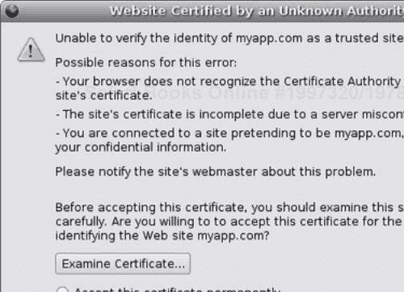

# 第十章 部署

我们最后一章将在第一部分解释如何配置基于 CherryPy 的应用程序，然后回顾通过使用 Apache 和 lighttpd 部署此类应用程序的不同方法。最后，我们将回顾如何通过内置的 CherryPy HTTP 服务器以及使用 Apache 和 lighttpd 功能来使基于 CherryPy 的应用程序启用 SSL。

# 配置

在开发应用程序时，您始终需要对其进行参数化，以便根据宿主环境的需要对其进行调整。例如，使用的数据库类型，PostgreSQL 或 MySQL，应用程序所在的目录，管理员联系方式等。

在像我们的照片博客这样的 Web 应用程序中，需要不同级别的配置设置：

+   Web 服务器：与 HTTP 服务器相关的设置

+   引擎：与应用程序宿主引擎相关的设置

+   应用程序：我们的应用程序将使用的设置

## CherryPy——Web 和引擎配置系统

由于我们的应用程序正在使用 CherryPy，我们将使用 CherryPy 的配置能力来配置 Web 服务器和引擎。CherryPy 使用的是基于微软定义的 INI 格式语法的配置。

CherryPy 配置文件的格式如下：

```py
[section]
key = value

```

原始 INI 格式与 CherryPy 使用的格式之间的主要区别在于，后者的值是 Python 数据类型。例如：

```py
[global]
server.socket_host = "localhost"
server.socket_port = 8080

```

除了`[global]`之外，配置文件的各个部分与请求的 URI 路径段相匹配，如下例所示：

```py
[/css/style.css]
tools.staticfile.on = True
tools.staticfile.file = "app.css"
tools.staticfile.root = "/var/www/photoblog/design/default/css"

```

当 CherryPy 尝试匹配`/css/style.css`请求时，它将检查配置设置以查找匹配的部分。如果找到，它将使用该部分定义的设置。

在我们解释 CherryPy 如何区分 Web 服务器和引擎设置之前，让我们看看如何在 Python 字典中定义配置设置。以下代码片段展示了相同的设置：

```py
{'/css/style.css': {'tools.staticfile.on': True,
'tools.staticfilE.file': "app.css" 'tools.staticfile.root':
"/var/www/photoblog/design/default/css"}}

```

从功能上讲，这两种方法将提供相同的性能。使用 Python 字典的优点是它位于代码本身中，因此可以提供更复杂的数据类型作为值。最终，这通常取决于个人喜好。

现在我们已经介绍了如何声明配置设置，让我们看看如何将它们传递给相应的组件。在这一点上，CherryPy API 非常直接：

+   `cherrypy.config.update`（文件或字典）用于配置 CherryPy Web 服务器。

+   `cherrypy.tree.mount`（应用程序、配置文件或字典）用于提供挂载应用程序的设置。

+   `_cp_config`属性绑定到页面处理程序，或者绑定到包含页面处理程序的类，并调用定义为字典的控制器（在这种情况下，设置通过 CherryPy 传播到该控制器的所有页面处理程序）。它用于直接将设置传递到需要的地方。

我们将回顾一个示例，以了解如何在我们的环境中使用该 API：

```py
import cherrypy
class Root:
@cherrypy.expose
def echo(self, some):
repeat = cherrypy.request.config.get('repeat', 1)
return some * repeat
echo._cp_config = {'repeat': 3}
if __name__ == '__main__':
http_conf = {'global': {'environment': 'production',
'server.socket_port': 9090,
'log.screen': True,
'log.error_file': 'error.log',
'log.access_file': 'access.log'}}
cherrypy.config.update(http_conf)
app0_conf = {'/echo': {'tools.response_headers.on': True,
'tools.response_headers.headers':
('Content-Type', 'text/plain')]}}
cherrypy.tree.mount(Root(), script_name='/app0',
config=app0_conf)
app1_conf = {'/echo': {'tools.gzip.on': True,
'repeat': 2}}
cherrypy.tree.mount(Root(), script_name='/app1',
config=app1_conf)
cherrypy.server.quickstart()
cherrypy.engine.start()

```

让我们看看我们在示例中做了什么：

1.  1. 首先，我们声明一个名为`echo`的页面处理程序的应用程序。这个处理程序的目的就是返回请求体，并按照配置设置键`repeat`定义的次数重复它。为此，我们使用绑定到页面处理程序上的`_cp_config`属性。这个值也可以从主配置字典中传递。在这种情况下，来自主字典的值将优先于`_cp_config`属性。

1.  2. 接下来，我们在字典中声明 Web 服务器设置，然后使用该字典调用`cherrypy.config.update()`。请注意，当使用字典时，使用名为 global 的键不是强制性的。CherryPy 确实以完全相同的方式解释它；因此，前一个示例的语义等效可以写成以下形式：

    ```py
    http_conf = {'environment': 'production',
    'server.socket_port': 9090,
    'log.screen': True,
    'log.error_file': 'error.log',
    'log.access_file': 'access.log'}
    cherrypy.config.update(http_conf)

    ```

1.  3. 最后，我们在两个不同的前缀上挂载两个不同的应用程序，并使用两种不同的配置设置。重要的是要注意，我们使用的键是页面处理程序相对于应用程序挂载位置的路径。这就是为什么我们使用`/echo`，而不是`/app0/echo`或`/app1/echo`。这也意味着配置设置不会泄漏到挂载的应用程序之间。CherryPy 确保每个应用程序只接收它声明的设置。

### 注意

将与应用程序相关的配置设置传递给`cherrypy.config.update()`方法是一个常见的错误。这不会将设置传播到挂载的应用程序。您必须使用`cherrypy.tree.mount()`的`config`属性来获得预期的行为。

## 照片博客应用程序配置系统

应用程序的配置设置通常不会通过位于较低级别的 CherryPy 配置系统传递。应用程序通常会从它们的领域级别定义实体，将这些值存储在后端存储中，与它们的其他数据一起，并最终提供一个前端界面，允许管理员或用户修改它们。

照片博客应用程序不会走那么远，但会通过使用纯 INI 文件来保持提供配置设置的相当简单的方法。我们做出这个选择是因为在照片博客应用程序的情况下，配置设置将是简单、定义明确的，并且可以被应用程序管理员编辑。因此，我们将避免开发比 INI 文件更复杂的解决方案。

然而，为了简化对这些设置的访问，我们将定义一个特定的类，该类将 INI 部分、键和值转换为 Python 对象：

```py
from ConfigParser import ConfigParser
class Config(object):
def from_ini(self, filepath, encoding='ISO-8859-1'):
config = ConfigParser()
config.readfp(file(filepath, 'rb'))
for section in config.sections():
section_prop = Config()
section_prop.keys = []
setattr(self, section, section_prop)
for option in config.options(section):
section_prop.keys.append(option)
value = config.get(section, option).decode(encoding)
setattr(section_prop, option, value)

```

此类将简单地遍历 INI 文件，并在运行时向 `Config` 类的实例添加属性。例如，假设您有以下 INI 文件：

```py
[app]
base_url = http://localhost:8080
copyright = Creative Commons Attribution-ShareAlike2.5 License
[storage]
host = localhost
dbname = photoblog
user = test
password = test
type = postgres

```

使用上述类，我们可以进行以下修改：

```py
import config
photoblogconfiguringc = config.Config()
c.from_ini('application.conf')
dir(c)
['__class__', '__delattr__', '__dict__', '__doc__',
'__getattribute__', '__hash__', '__init__', '__module__'
'__new__', '__reduce__', '__reduce_ex__', '__repr__',
'__setattr__', '__str__', '__weakref__', 'app', 'storage']
c.app.copyright
u'Creative Commons Attribution-ShareAlike2.5 License'

```

如您所见，我们现在已将 INI 文件修改为绑定到 `Config` 类实例的属性树。Photoblog 应用程序将有一个全局的此类实例，因此可以从应用程序的任何地方访问它。

在本节中，我们简要回顾了使用其内置配置系统参数化 CherryPy 应用程序的方法。我们还介绍了一个使用 INI 文件格式的简单配置系统，允许应用程序设置。这种方法因此提供了一种在转向基于系统的数据库之前，模拟传递参数的简单方法，该数据库可能要求更高。

# 部署

部署基于 CherryPy 的应用程序可以像将应用程序放入一个环境中一样简单，其中所有必需的包（CherryPy、Kid、simplejson 等）都可通过 Python 系统路径获取。然而，在共享的托管环境中，CherryPy 网络服务器很可能位于前端服务器（如 Apache 或 lighttpd）之后，这样主机提供商可以在需要时执行一些过滤操作，或者例如让前端以比 CherryPy 更高效的方式提供静态文件。

本节将介绍一些在 Apache 和 lighttpd 网络服务器后面运行 CherryPy 应用程序的方法。

在解释如何在 Apache 或 lighttpd 后使用 CherryPy 之前，让我们定义一个简单的应用程序，我们将在整个示例中使用它：

```py
import.cherrypy
def setup_app():
class Root:
@cherrypy.expose
def index(self):
# Will return the hostname used by CherryPy and the remote
# caller IP address
return "Hello there %s from IP: %s " %
(cherrypy.request.base, cherrypy.request.remote.ip)
cherrypy.config.update({'server.socket_port': 9091,
'environment': 'production',
'log.screen': False,
'show_tracebacks': False})
cherrypy.tree.mount(Root())
if __name__ == '__main__':
setup_app()
cherrypy.server.quickstart()
cherrypy.engine.start()

```

如前所述，有几种方法可以部署基于 CherryPy 的应用程序。现在，我们将讨论不同的部署方法。

## Apache 与 mod_rewrite 模块

当在 Apache 网络服务器后面运行时，您可以审查的第一个解决方案是使用 `mod_rewrite` 模块。此模块允许您定义一组规则，该模块将分析这些规则以转换传入的 HTTP 请求并将它们重新调度到后端服务器。

在我们的示例中，我们将做出以下假设，这些假设实际上是要求：

+   您运行 Apache 2.2。

+   您可以访问 Apache 配置，通常可以在名为 `httpd.conf` 的文件中找到。您还可以停止和重新启动 Apache 进程。这些要求意味着您要么有机器的管理员权限，要么您有一个用于实验的本地 Apache 安装。

+   您将使用 `VirtualHost` 指令，该指令允许封装仅针对特定主机的指令。这允许不同的主机由 Apache 的单个实例处理。

+   我们还假设您本地可以解析 [myapp.com](http://myapp.com)。为此：

    在 Linux 下，将以下行添加到 /etc/hosts 文件中：

    `127.0.0.1 myapp.com myapp www.myapp.com`

+   您的操作系统现在应该将 `myapp.com` 主机的请求解析到您的本地环境中。

现在我们来解释如何配置 Apache：

1.  1. 加载所需的 Apache 模块，如下所示：

```py
LoadModule rewrite_module modules/mod_rewrite.so

```

+   注意，在某些环境中，您可能需要提供模块本身的完整路径。

1.  2. 接下来我们声明 `VirtualHost`，如下所示：

```py
# Create a virtual host in your apache configuration
# to handle requests for the myapp.com hostname
<VirtualHost 127.0.0.1:80>
ServerName myapp.com
ServerAlias www.myapp.com
# Where our application files reside
DocumentRoot /home/sylvain/photoblog
# What is our directory index by default
DirectoryIndex index.html
# Message to return when our CherryPy server is down and
# apache could not forward the request.
ErrorDocument 502 "Server down"
# mod_proxy magic
# First enable the mod_rewrite engine
RewriteEngine on
# Now we simply rewrite incoming requests URI so that they
# are proxied to our CherryPy web server
# http://myapp.com/archives/2006/10/12/my-article
# would become
# http://127.0.0.1:9091/archives/2006/10/12/my-article
RewriteRule ^(.*) http://127.0.0.1:9091$1 [P]
# Now define the format of the logs to be used by Apache
LogFormat "%h %l %u %t \"%r\" %>s %b \"%{Referer}i\"
\"%{User-Agent}i\"" combined LogFormat
"%t %a %D %I %O %s %{Content-Type}o %{Host}i
\"%r\" \"%{Referer}i\"" host
CustomLog /home/sylvain/photoblog/access_myapp.log combined
Errorlog /home/sylvain/photoblog/error_myapp.log
</VirtualHost>

```

1.  3. 下一步是停止并重新启动您的 Apache 进程，以便考虑这些修改。

1.  4. 然后启动您的 CherryPy 应用程序服务器。

`mod_rewrite` 模块文档详细说明了如何构建重写规则。在先前的示例中，我们通过将请求 URI 路径映射到新的主机名定义了最通用的规则。

当导航到 URL [`myapp.com`](http://myapp.com) 时，您现在应该看到以下消息：

```py
Hello there http://127.0.0.1:9091 from IP: 127.0.0.1

```

既然我们知道如何通过 Apache 将主机映射到我们的 CherryPy 应用程序，我们可能想要获取实际的主机名和远程 IP 地址而不是本地地址。在生成如下链接时需要前者：

```py
link = "%s/%s" % (cherrypy.request.base, path)

```

有两种方法可以实现这一点，因为它们是相互独立的：

1.  1. 使用 Apache 的 `mod_proxy` 模块转发主机。

    +   首先，您需要以这种方式加载模块（请参阅您的文档）：

        ```py
        LoadModule proxy_module modules/mod_proxy.so
        LoadModule proxy_http_module modules/mod_proxy_http.so

        ```

    +   将以下指令添加到 `VirtualHost:`

        ```py
        ProxyPreserveHost on

        ```

    +   重新启动 Apache。

1.  2. 使用 CherryPy 代理工具，如下所示：

    +   将以下条目添加到您的全局配置中：

```py
'tools.proxy.on': True

```

+   重新启动您的 CherryPy 应用程序。

在这两种情况下，您现在将在浏览器中看到以下消息：

**你好，来自 IP: 127.0.0.1 的 http://myapp.com**

IP 地址保持不变，因为测试是在托管服务器的同一台机器上进行的，在本地接口上。

现在我们来解释前面的配方是如何工作的。在第一种情况下，通过使用 `ProxyPreserveHost` 指令，我们告诉 Apache 保持 `HTTP header host` 字段不变，而不是用本地 IP 地址覆盖它。这意味着 CherryPy 将接收到 Host 头部的原始值。

在第二种情况下，我们告诉 CherryPy 在使用原始主机名进行代理时查找 Apache 设置的特定头信息。CherryPy 默认查找的头信息是 `X-Forwarded-Host。`

## 带有 mod_proxy 模块的 Lighttpd

Lighttpd 是另一个流行且非常高效的 HTTP 服务器。前一个部分可以使用 `mod_proxy` 以类似的方式翻译成 lighttpd。以下是一个配置 lighttpd 以代理到 CherryPy 服务器的示例：

```py
$HTTP["host"] == "myapp.com"
{
proxy.server = ( "" => (("host" => "127.0.0.1",
"port" => 8080)))
}

```

将此添加到 `lighttd.conf` 文件中，并重新启动服务器。当浏览到 [`myapp.com`](http://myapp.com) 时，您将看到以下消息：

**你好，来自 IP: 127.0.0.1 的 http://myapp.com**

## 带有 mod_python 模块的 Apache

在 2000 年，Gregory Trubetskoy 发布了 `mod_python` 的第一个版本。这是一个 Apache 的模块，允许 Python 解释器嵌入到 Apache 服务器中，为 Apache 网络服务器和 Python 应用程序之间提供桥梁。`mod_python` 的一个优点是，与需要为每个请求启动 Python 进程的 CGI 不同，`mod_python` 没有这样的要求。因此，它为开发者提供了利用 Apache 运行模块时启动的 Python 进程的持久性（例如保持数据库连接池）的机会。

在了解如何配置 Apache 和 `mod_python` 之前，让我们回顾一下需要满足的要求：

+   Apache 2.2

+   `mod_python` 3.1.x 或更高版本

我们将假设 `mod_python` 已正确安装在你的环境中。

现在，让我们解释如何配置 `mod_python` 以运行基于 CherryPy 的应用程序：

```py
LoadModule python_module modules/mod_python.so
<Location "/">
PythonPath "sys.path + ['/home/sylvain/app']"
SetHandler python-program
PythonHandler cherrypy._cpmodpy::handler
PythonOption cherrypy.setup my_app::setup_app
PythonDebug On
</Location>

```

我们将按顺序带你完成这个过程：

1.  1. 首先我们加载 `mod_python` 模块。

1.  2. 我们定义一个位置指令，指定 Apache 应对以 "/" 开头的请求执行的操作。

1.  3. 然后我们定义几个 `mod_python` 指令：

    +   `PythonPath` 扩展了系统路径，并确保我们的应用程序模块可以被找到。例如，这里 `my_app.py` 模块位于 `/home/sylvain/app`。

    +   `SetHandler` 指示所有以位置指令中提供的路径开头的请求将由 `mod_python` 处理。

    +   `PythonHandler` 设置了通用的处理器，它将负责生成输出返回给用户代理。我们使用 CherryPy 提供的内置 `mod_python` 处理器。

    +   `PythonOption` 将选项传递给通用处理器。这里选项将被命名为 `cherrypy.setup`，并将其绑定到我们的应用程序提供的 `setup_app` 函数。我们假设应用程序保存在一个名为 `my_app.py` 的 Python 模块中。`setup_app` 方法必须是挂载应用程序的那个方法。

    +   `PythonDebug` 已启用。

1.  4. 最后，我们按照以下方式修改应用程序：

```py
import cherrypy
def setup_app():
class Root:
@cherrypy.expose
def index(self):
return "Hello there %s from IP: %s " % \
(cherrypy.request.base,cherrypy.request.remote.ip)
cherrypy.tree.mount(Root())
cherrypy.engine.start(blocking=False)

```

+   不同之处在于我们以非阻塞模式启动 CherryPy 引擎，这样通过 mod_python 启动的 Python 进程就不会挂起。

现在，你可以停止并重新启动 Apache 进程，并导航到 [`myapp.com`](http://myapp.com) URL，你应该看到以下内容：

**来自 IP: 127.0.0.1 的 http://myapp.com，你好**！

## mod_python 与 WSGI 应用程序

在先前的方法中，我们使用了内置的 `mod_python` 处理器，它在通常由 CherryPy 托管的程序上运行良好。如果你的应用程序遵循 WSGI 接口，你可能想使用 Robert Brewer 开发的 `ModPythonGateway` 处理器 ([`projects.amor.org/misc/wiki/ModPythonGateway`](http://projects.amor.org/misc/wiki/ModPythonGateway))。

首先，让我们看看 `my_app.py` 模块中的 CherryPy 应用程序：

```py
import cherrypy
class Root:
@cherrypy.expose
def index(self):
return "Hello there %s from IP: %s " % (cherrypy.request.base,
cherrypy.request.remote.ip)
# Create an application respecting the WSGI interface
wsgi_app = cherrypy.Application(Root())
# This will be call on the first request
def setup_app(req):
cherrypy.engine.start(blocking=False)

```

现在，让我们回顾如何配置 Apache 以使用 `ModPythonGateway` 处理器：

```py
<Location "/">
PythonPath "sys.path + ['/home/sylvain/app']"
SetHandler python-program
PythonHandler modpython_gateway::handler
PythonOption wsgi.startup my_app::setup_app
PythonOption wsgi.application my_app::wsgi_app
PythonOption wsgi.cleanup cherrypy::engine.stop
</Location>

```

多亏了`ModPythonGateway`处理程序，你可以在 Apache 服务器的强大功能中使用基于 WSGI 的中间件的丰富性。

# SSL

**SSL**（**安全套接字层**）可以通过 CherryPy 原生支持 CherryPy 应用程序。要启用 SSL 支持，你必须满足以下要求：

+   在你的环境中安装`PyOpenSSL`包

+   在服务器上拥有 SSL 证书和私钥

在本章的其余部分，我们将假设你已经正确安装了`PyOpenSSL`。让我们解释如何生成一对私钥和证书。为了实现这一点，我们将使用 OpenSSL，它是 SSL 规范的常见开源实现。

## 创建证书和私钥

让我们处理证书和私钥：

1.  1. 首先，我们需要一个私钥：

```py
openssl genrsa -out server.key 2048 

```

1.  2. 此密钥没有密码短语保护，因此保护相当弱。如果你更喜欢提供密码短语，你应该发出如下命令：

```py
openssl genrsa -des3 -out server.key 2048 

```

+   程序将需要密码短语。如果你的 OpenSSL 版本允许你提供一个空字符串，请这样做。否则，输入默认密码短语，然后按照以下方式将其从生成的密钥中删除：

```py
openssl rsa -in server.key -out server.key 

```

1.  3. 现在，我们按照以下方式创建证书：

```py
openssl req -new -key server.key -out server.csr 

```

1.  4. 此过程将要求你输入一些详细信息。上一步已生成证书，但它尚未由私钥签名。为此，你必须发出以下命令：

```py
openssl x509 -req -days 60 -in server.csr -signkey
server.key -out server.crt 

```

新签发的证书将有效期为 60 天。

### 注意

注意，由于证书未由 VeriSign 等认可的机构签名，当访问应用程序时，你的浏览器将显示一个弹出窗口，以便用户可以接受或拒绝证书。

现在，我们可以看看创建证书和密钥的不同方法。

### 使用 CherryPy SSL 支持

让我们看看我们如何做到这一点：

```py
import cherrypy
import os, os.path
localDir = os.path.abspath(os.path.dirname(__file__))
CA = os.path.join(localDir, 'server.crt')
KEY = os.path.join(localDir, 'server.key')
def setup_server():
class Root:
@cherrypy.expose
def index(self):
return "Hello there!"
cherrypy.tree.mount(Root())
if __name__ == '__main__':
setup_server()
cherrypy.config.update({'server.socket_port': 8443,
'environment': 'production',
'log.screen': True,
'server.ssl_certificate': CA,
'server.ssl_private_key': KEY})
cherrypy.server.quickstart()
cherrypy.engine.start()

```

关键是向全局 CherryPy 配置提供`server.ssl_certificate`和`server.ssl_private_key`值。下一步是启动服务器；如果一切顺利，你应该会在屏幕上看到以下消息：

**在 https://localhost:8443/**上通过 HTTP 服务 HTTPS

通过导航到应用程序 URL，你应该会看到一个类似的消息：



如果你接受证书，你将能够通过 HTTPS 继续使用 Web 应用程序。

之前解决方案的一个缺点是现在你的应用程序不能通过非安全 HTTP 访问。幸运的是，CherryPy 提供了一个相当简单的方法来解决这个问题，只需同时启动两个 HTTP 服务器即可。你可以看到它是如何完成的：

```py
import cherrypy
from cherrypy import _cpwsgi
from cherrypy import wsgiserver
import os, os.path
localDir = os.path.abspath(os.path.dirname(__file__))
CA = os.path.join(localDir, 'server.crt')
KEY = os.path.join(localDir, 'server.key')
def setup_app():
class Root:
@cherrypy.expose
def index(self):
return "Hello there!"
cherrypy.tree.mount(Root())
if __name__ == '__main__':
setup_app()
# Create a server which will accept HTTP requests
s1 = _cpwsgi.CPWSGIServer()
# Create a server which will accept HTTPS requests
SSLin CherryPys2 = _cpwsgi.CPWSGIServer()
s2.ssl_certificate = CA
s2.ssl_private_key = KEY
# Our first server uses the default CherryPy settings
# localhost, 8080\. We thus provide distinct ones
# for the HTTPS server.
s2.bind_addr = ('localhost', 8443)
# Inform CherryPy which servers to start and use
cherrypy.server.httpservers = {s1: ('localhost', 8080),
s2: ('localhost', 8443)}
cherrypy.server.start()
cherrypy.engine.start()

```

在启动应用程序后，你现在应该在屏幕上看到以下几行：

**在 https://localhost:8443/**上通过 HTTP 服务 HTTPS

**在 http://localhost:8080/**上通过 HTTP 服务 HTTP

你的应用程序现在将通过 HTTP 和 HTTPS 可访问。

### 使用 lighttpd SSL 支持

在 lighttpd 中设置 SSL 支持就像在 lighttpd 的全局配置中添加以下内容一样简单：

```py
ssl.engine = "enable"
ssl.pemfile = "/home/sylvain/application/server.pem"

```

`server.pem`文件是我们之前创建的`server.key`和`server.crt`文件的连接。例如，在 UNIX 系统下，我们执行以下命令：

```py
cat server.key server.crt > server.pem 

```

通过使用前面章节中描述的这两行和代理方法，我们已经说明了如何为 CherryPy 应用程序提供 SSL 支持。

### 注意

然而，需要注意的是，从 lighttpd 到 CherryPy 的路径将是 HTTP 未加密的。SSL 支持将在 lighttpd 级别停止。

### 使用 Apache mod_ssl 支持

这种方法包括使用基于 OpenSSL 的 Apache `mod_ssl`模块来处理在将请求转发到 CherryPy 服务器之前的 SSL 交换，就像我们在 lighttpd 中做的那样。

要这样做，你需要按照以下方式修改你的 Apache 配置：

```py
LoadModule ssl_module modules/mod_ssl.so
Listen 127.0.0.1:443 

```

第一行加载了`mod_ssl`模块。第二行请求 Apache 在指定的 IP 地址上的 443 端口（需要管理员权限）监听传入的套接字连接。

然后，我们按照以下方式修改`VirtualHost`：

```py
<VirtualHost 127.0.0.1:443>
SSLEngine On
SSLCertificateFile /home/sylvain/application/server.crt
SSLCertificateKeyFile /home/sylvain/application/server.key
</VirtualHost>

```

一旦你重启了 Apache 进程，你应该能够导航到 URL [`myapp.com`](http://https://myapp.com)。

# 摘要

在本章中，我们回顾了几种使用常见产品（如 Apache 和 lighttpd）配置和部署基于 CherryPy 的应用程序的可能性。我们还处理了 SSL 支持。这些应该足够你开始并适应你自己的环境和需求。

然而，部署不仅限于设置 Web 服务器，本章没有涵盖将代码推送到生产环境的讨论，也没有解释如何在生产中更新应用程序。这超出了本章的范围，因此没有讨论。

# 作者观点

如果你已经阅读了这本书，我只能假设你对 CherryPy 库作为个人项目的候选者感兴趣。然而，我写这本书的动机有两个。首先，我想提供一个坚实的 CherryPy 3 参考，这样，希望如此，可以满足使用它的开发者的好奇心，这正是我在本书的前四章中努力实现的目标。

其次，我希望向我的同行读者介绍一些关于网络应用程序发展的一些不同方面。我没有计划将这本书作为所有涉及主题的参考书，因为这需要另外十卷。相反，我试图提供一些关键信息，让你明白编写网络应用程序与其他类型的应用程序在过程上并没有什么不同。

考虑到这个观点，第五章告诉我们，像关系数据库这样的持久化机制可以通过 Dejavu、SQLObject 或 SQLAlchemy 这样的对象关系映射进行抽象。这是一个基本概念，它允许你以轻松的方式设计你的应用程序，与操作的数据相关。此后，第六章提醒我们，网络应用程序不仅可以提供 HTML 页面，还可以暴露一个称为网络服务的 API。这个 API 正是将我们的网络应用程序转变为实际提供有价值服务的提供者的关键。这意味着我们应该忘记实际的用户体验，在应用程序界面的设计上浅尝辄止吗？显然不是，第七章和第八章在转向客户端脚本和 Ajax 的附加功能之前，回顾了模板背后的理念。最终，第九章确保我们永远不会忘记一个未经测试的应用程序是一个有缺陷的应用程序，而第十章提供了一些在常见环境中部署我们的应用程序的技巧。

我希望这本书能告诉你一个关于网络应用开发的故事，这个故事不仅超越了 CherryPy 本身或任何介绍的产品。这是一个让我们记住没有对错之分，但一些已经探索过的路径可能很好，可以信赖，有时甚至应该进一步推进的故事。

正如我之前所说，我写这本书并不是作为参考书，而是作为一本入门书。完全有可能你认为有一些替代方案或更好的方法来实现所涵盖的一些主题。在这种情况下，我很乐意在 CherryPy 邮件列表上与你讨论这个问题。另一方面，如果你关闭这本书并思考其内容的一部分，那么我就达到了我的目标。

### 注意

WebFaction 成立于 2003 年，由 CherryPy 的原始创建者创立，是 CherryPy 应用程序的可靠且经济实惠的托管提供商。

当你通过 WebFaction 注册并使用促销代码"CHERRYPYBOOK"时，你可以获得独家 20%的折扣。有关更多详情，请访问[`www.webfaction.com`](http://www.webfaction.com)。
