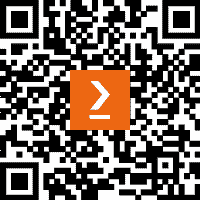

# 前言

Clean Architecture 在现代软件开发中变得越来越重要，尤其是在应用程序日益复杂且团队需要长期维护它们的情况下。虽然架构原则通常以抽象术语讨论，但本书通过实际的 Python 实现，使 Clean Architecture 生动起来，展示了这些概念如何改变你的开发方法。

Python 的多功能性使其成为应用 Clean Architecture 原则的绝佳语言。其动态特性和广泛的生态系统使快速开发成为可能，但同样的优势也可能导致随着应用程序的发展而变得复杂、难以维护的代码库。Clean Architecture 提供了平衡 Python 的灵活性与结构化、可维护设计的框架。

在本书中，我们将探讨如何将 Clean Architecture 模式应用于 Python 项目，创建不仅功能性强，而且可测试、可维护和适应变化的系统。以任务管理应用程序作为我们的示例，我们将从头开始构建一个完整的系统，展示适当的架构边界如何创建能够随着时间的推移优雅演变的软件。

无论你是构建新系统还是维护现有系统，本书中描述的原则和实践将帮助你创建更健壮和灵活的 Python 应用程序。你将学习如何将核心业务逻辑与外部关注点分离，在系统组件之间创建清晰的接口，并实施能够使你的软件适应不断变化需求的模式。

在本书中，我们将涵盖以下主要主题：

+   理解 Clean Architecture 的基本原理并在 Python 应用程序中应用 SOLID 原则

+   通过类型提示增强 Python，以加强架构边界和接口

+   构建健壮的领域模型和应用层，这些层封装了独立于外部关注点的业务逻辑

+   通过控制器、演示者和适配器在架构层之间创建清晰的接口

+   在保持架构完整性的同时，与框架和外部系统集成

+   在实际场景中应用 Clean Architecture：测试、Web 接口、可观察性和遗留系统转型

这些主题共同构成了构建能够经受时间考验的 Python 应用程序的综合方法。到本书结束时，你将具备理论理解和实践技能，能够在自己的项目中实施 Clean Architecture，创建更易于维护、可测试和适应变化的系统。

# 本书面向的对象

这本书是为希望创建更可维护、可测试和可适应应用程序的 Python 开发者而写的。它非常适合具有 Python 经验的中级或更高水平的开发者，他们希望提高自己的架构技能。如果您在处理抗拒变化的代码库、经历了复杂的依赖关系或只是想编写更好的 Python 代码时遇到困难，这本书将为您提供克服这些挑战的实际策略和模式。

几个角色会发现这些材料有价值：

+   **软件架构师**寻求在 Python 项目中实施干净、可维护的系统设计

+   **技术负责人**负责指导开发团队和建立编码标准

+   **后端开发者**正在开发需要随时间演变的复杂应用程序

+   **DevOps 工程师**寻求创建更多可测试、可观察的 Python 服务

虽然初学者可以从所介绍的概念中受益，但了解 Python 和面向对象编程原则将有助于您从这些材料中获得最大收益。技术负责人、架构师和高级开发者将发现对于在团队环境中实施 Clean Architecture 和指导架构决策有价值的见解。

# 本书涵盖的内容

*第一章*，*Clean Architecture 基础：转变 Python 开发*，介绍了 Clean Architecture 的基础概念，并解释了为什么这些原则对 Python 开发者很重要。它建立了核心架构层，并探讨了 Clean Architecture 如何改变 Python 开发实践。

*第二章*，*SOLID 基础：构建健壮的 Python 应用程序*，探讨了 SOLID 原则如何为 Clean Architecture 提供基础。通过实际的 Python 示例，您将学习如何实现单一职责、开闭原则、里氏替换原则、接口隔离原则和依赖倒置原则。

*第三章*，*类型增强 Python：强化 Clean Architecture*，展示了 Python 的类型提示如何增强架构边界。您将探索类型如何改进接口定义、支持依赖倒置并使架构验证的工具更好。

*第四章*，*领域驱动设计：构建核心业务逻辑*，专注于构建健壮的领域模型。您将学习如何识别和建模实体、值对象和领域服务，同时确保它们保持对外部关注点的独立性。

*第五章*，*应用层：协调用例*，涵盖了实现协调领域对象以完成特定任务的用例的实施。您将在保持适当的关注点分离的同时，创建领域和外部层之间的干净接口。

*第六章*，*接口适配器层：控制器和表示器*，探讨了如何创建将外部请求转换为控制器，以及格式化领域数据的表示器。你将在应用程序核心和交付机制之间构建清晰的边界。

*第七章*，*框架和驱动层：外部接口*，展示了如何在保持核心业务逻辑独立的同时集成外部框架和基础设施。你将实现数据库适配器、Web 框架和尊重清洁架构边界的第三方服务。

*第八章*，*使用清洁架构实现测试模式*，提供了跨架构边界进行全面测试的策略。你将为领域对象创建单元测试，为用例创建集成测试，以及验证系统行为的端到端测试。

*第九章*，*添加 Web UI：清洁架构的接口灵活性*，展示了如何为你的清洁架构应用程序实现 Web 接口。你将构建一个基于 Flask 的 Web 接口，演示清洁架构如何在不干扰现有功能的情况下添加新接口。

*第十章*，*实现可观察性：监控和验证*，涵盖了在保持清洁架构边界的同时添加日志记录、监控和架构验证的策略。你将实现横切关注点，而不会损害架构的完整性。

*第十一章*，*从遗留代码到清洁架构：重构 Python 以提高可维护性*，提供了逐步改造遗留 Python 应用程序的实际方法。你将学习增量重构技术，这些技术可以在保持系统稳定性的同时改进架构。

*第十二章*，*你的清洁架构之旅：下一步*，探讨了如何在不同系统类型和组织环境中应用清洁架构。你将发现关于架构领导力、社区建设和平衡实用主义与架构原则的策略。

# 为了充分利用本书

假设对 Python 编程有基本的了解，包括对类、继承和组合等面向对象概念的了解。对 Web 开发概念的了解将有助于后续章节，但不是必需的。

| **本书涵盖的软件/硬件** | **操作系统要求** |
| --- | --- |
| Python 3.13 或更高版本 | Windows、macOS 或 Linux |

**如果你使用的是本书的数字版，我们建议你亲自输入代码或从本书的 GitHub 仓库获取代码。这样做将有助于你避免与代码复制粘贴相关的任何潜在错误。**

## 下载示例代码文件

所有示例的完整代码都可在本书 GitHub 仓库中找到，网址为[`github.com/PacktPublishing/Clean-Architecture-with-Python`](https://github.com/PacktPublishing/Clean-Architecture-with-Python)。此外，对于相关章节，你将找到与该章节相对应的功能实现我们的任务管理应用程序。这允许你在本书的演变过程中运行、测试和探索应用程序的工作版本。每一章都是基于前一章的，因此建议按顺序阅读本书，尽管经验丰富的开发者可能会选择关注与其当前挑战相关的特定章节。

我们还有其他来自我们丰富图书和视频目录的代码包，可在[`github.com/PacktPublishing/`](https://github.com/PacktPublishing/)找到。查看它们吧！

## 下载彩色图像

我们还提供了一份包含本书中使用的截图/图表彩色图像的 PDF 文件。您可以从这里下载：[`packt.link/gbp/9781836642893`](https://packt.link/gbp/9781836642893)。

## 使用的约定

本书使用了多种文本约定。

`文本中的代码`: 表示文本中的代码单词、数据库表名、文件夹名、文件名、文件扩展名、路径名、虚拟 URL、用户输入和 X/Twitter 用户名。以下是一个示例：“`project_id`参数来自 URL 本身（`/projects/<project_id>/tasks/new`），而表单字段包含任务详情。”

代码块应如下设置：

```py
# cli_main.py
def main() -> int:
    """Main entry point for the CLI application."""
    app = create_application(
        notification_service=NotificationRecorder(),
        task_presenter=CliTaskPresenter(),
        project_presenter=CliProjectPresenter(),
    )
    cli = ClickCli(app)
    return cli.run() 
```

任何命令行输入或输出都应如下编写：

```py
> python web_main.py
 * Serving Flask app 'todo_app.infrastructure.web.app'
 * Debug mode: on
 * Running on http://127.0.0.1:5000
Press CTRL+C to quit
 * Restarting with stat
 * Debugger is active!
 * Debugger PIN: 954-447-204
127.0.0.1 - - [05/Feb/2025 13:58:57] "GET / HTTP/1.1" 200 - 
```

**粗体**: 表示新术语、重要单词或你在屏幕上看到的单词。例如，菜单或对话框中的单词在文本中如下所示。例如：“**边界上下文**是定义特定领域模型适用的概念边界。”

警告或重要提示如下所示。

技巧和窍门如下所示。

# 联系我们

我们始终欢迎读者的反馈。

**一般反馈**: 请通过电子邮件[feedback@packtpub.com]发送反馈，并在邮件主题中提及本书的标题。如果你对本书的任何方面有疑问，请通过电子邮件[questions@packtpub.com]联系我们。

**勘误**: 尽管我们已经尽一切努力确保内容的准确性，但错误仍然可能发生。如果你在这本书中发现了错误，我们非常感谢你能向我们报告。请访问[`www.packtpub.com/submit-errata`](http://www.packtpub.com/submit-errata)，点击**提交勘误**，并填写表格。

**盗版**: 如果你在互联网上以任何形式遇到我们作品的非法副本，如果你能提供位置地址或网站名称，我们将不胜感激。请通过[版权@packtpub.com](https://copyright@packtpub.com)与我们联系，并提供材料的链接。

**如果您有兴趣成为作者**：如果您在某个领域有专业知识，并且有兴趣撰写或为书籍做出贡献，请访问[`authors.packtpub.com/`](http://authors.packtpub.com/).

# 分享您的想法

一旦您阅读了《使用 Python 的清洁架构》，我们很乐意听到您的想法！扫描下面的二维码，直接进入此书的亚马逊评论页面并分享您的反馈。

[`packt.link/r/183664289X`](https://packt.link/r/183664289X)

您的评论对我们和科技社区非常重要，并将帮助我们确保我们提供高质量的内容。

# 下载此书的免费 PDF 副本

感谢您购买此书！

您喜欢随时随地阅读，但无法携带您的印刷书籍到处走？

您的电子书购买是否与您选择的设备不兼容？

别担心，现在每购买一本 Packt 书籍，您都可以免费获得该书的 DRM 免费 PDF 版本。

在任何地方、任何地方、任何设备上阅读。直接从您最喜欢的技术书籍中搜索、复制和粘贴代码到您的应用程序中。

优惠不会就此停止，您还可以获得独家折扣、时事通讯和每日收件箱中的精彩免费内容。

按照以下简单步骤获取福利：

1.  扫描下面的二维码或访问以下链接：



`packt.link/free-ebook/9781836642893`

1.  提交您的购买证明。

1.  就这些！我们将直接将您的免费 PDF 和其他福利发送到您的电子邮件。

# 分享您的想法

一旦您阅读了《使用 Python 的清洁架构》，我们很乐意听到您的想法！请[点击此处直接进入此书的亚马逊评论页面](https://packt.link/r/183664289X)并分享您的反馈。

您的评论对我们和科技社区非常重要，并将帮助我们确保我们提供高质量的内容。
